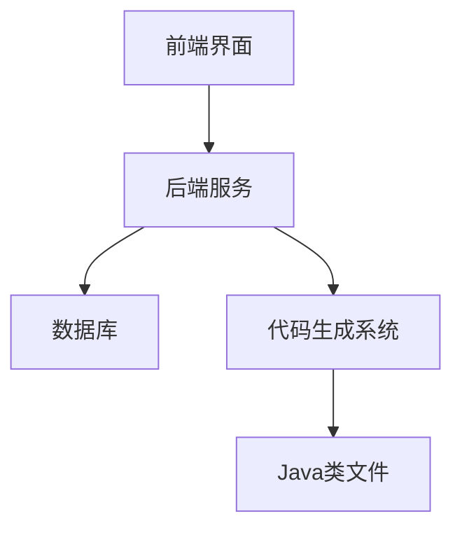
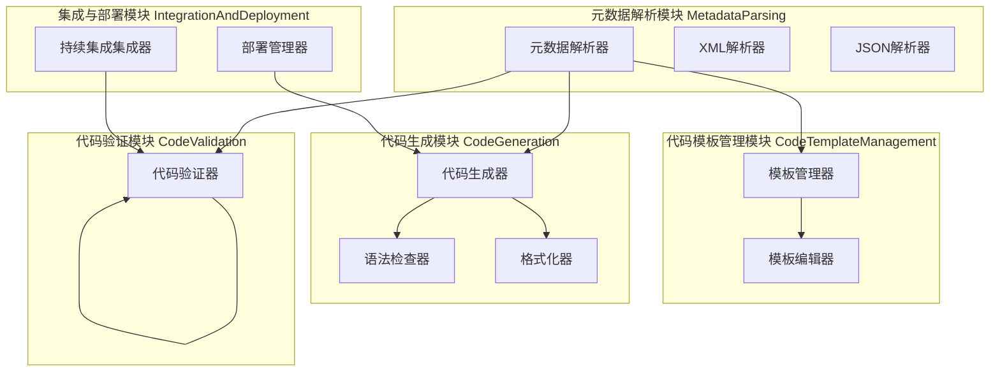
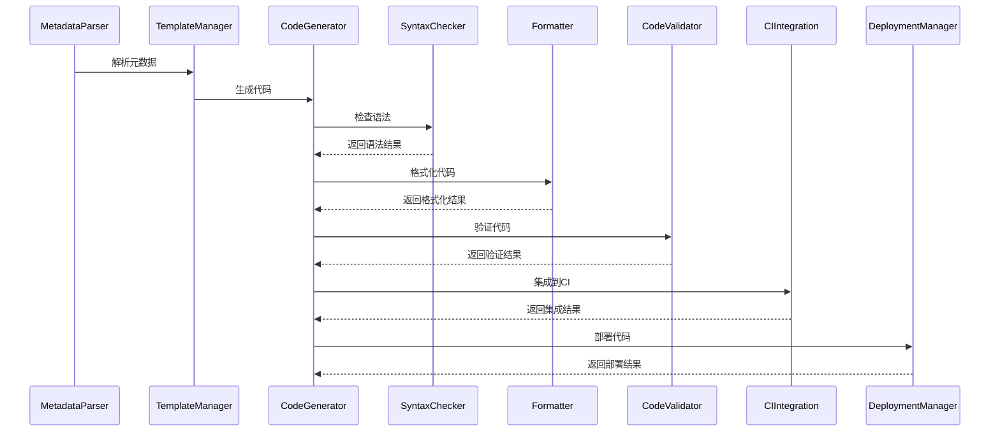
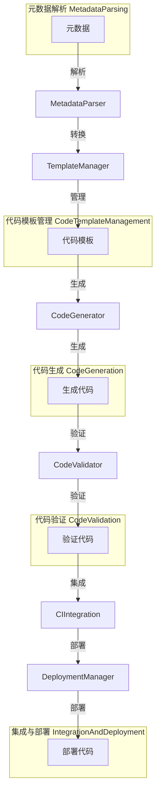

                 


### 《提示词语言的元数据驱动代码生成》

#### 关键词：提示词语言、元数据、代码生成

> 摘要：本文将深入探讨提示词语言的元数据驱动代码生成，分析其原理、技术、应用场景以及面临的挑战和解决方案。通过详细的案例解析和实战经验分享，帮助读者全面理解这一前沿技术，为未来的应用和创新提供指导。

---

## 引言与背景

在软件开发的过程中，代码生成技术一直以来都是一个热门话题。随着软件项目的复杂性和规模不断扩大，手动编写代码的效率和质量逐渐成为瓶颈。为了解决这个问题，研究人员和开发者们开始探索自动化代码生成的方法，其中提示词语言的元数据驱动代码生成成为了一个备受关注的研究方向。

### 1.1 书籍简介

本书《提示词语言的元数据驱动代码生成》旨在系统地介绍这一技术，帮助读者了解其原理、技术细节和应用实践。书中将从基础概念入手，逐步深入到具体的代码生成技术和应用案例，旨在为读者提供全面、深入的学习资源。

### 1.2 提示词语言概述

提示词语言（Keyword Language）是一种基于文本的编程语言，通过一组预定义的提示词（Keywords）来描述程序的结构和行为。这种语言的优点在于其高度抽象和简化的语法，使得开发者可以更加专注于业务逻辑的实现。

### 1.3 元数据驱动代码生成简介

元数据（Metadata）是关于数据的数据，它提供了描述数据内容、结构、质量等信息的方式。在代码生成中，元数据起到了至关重要的作用，它不仅描述了代码的结构，还包含了代码生成所需的上下文信息。元数据驱动代码生成通过自动化工具根据元数据生成代码，大大提高了开发效率。

---

## 基础概念

为了深入理解提示词语言的元数据驱动代码生成，我们需要先了解相关的基础概念。

### 2.1 提示词语言原理

#### 2.1.1 提示词语言的基础概念

提示词语言的基础概念包括提示词（Keywords）、标识符（Identifiers）、表达式（Expressions）和语句（Statements）。这些概念构成了提示词语言的基本语法结构。

#### 2.1.2 提示词语言的语法与结构

提示词语言的语法规则相对简单，通常包含关键字、标识符、数字、字符串和运算符等。通过这些语法元素，开发者可以构建出复杂的程序逻辑。

### 2.2 元数据基础

#### 2.2.1 元数据定义与分类

元数据是关于数据的数据，它可以分为描述性元数据、结构化元数据和验证性元数据等类型。描述性元数据提供了数据内容的信息，结构化元数据描述了数据结构，而验证性元数据则用于数据质量检查。

#### 2.2.2 元数据的作用与应用

元数据在代码生成中起到了至关重要的作用。它不仅描述了代码的结构，还包含了生成代码所需的上下文信息，如数据类型、变量范围、函数调用等。

---

## 代码生成技术

在了解了基础概念之后，我们接下来将探讨具体的代码生成技术。

### 3.1 元数据驱动代码生成机制

#### 3.1.1 代码生成的基本原理

代码生成的基本原理是通过解析元数据，生成对应的代码。这个过程中涉及到元数据的解析、语义分析、代码模板的生成和代码的输出。

#### 3.1.2 代码生成工具介绍

常见的代码生成工具有CodeSmith、T4 Template和XSLT等。这些工具都支持基于元数据的代码生成，大大简化了开发过程。

### 3.2 常见代码生成技术

#### 3.2.1 模板驱动代码生成

模板驱动代码生成是最常见的代码生成技术之一。它通过模板文件来定义代码的结构，并根据元数据动态生成代码。

#### 3.2.2 模式驱动代码生成

模式驱动代码生成通过预定义的模式来生成代码。这种技术更加灵活，可以处理更复杂的代码生成需求。

#### 3.2.3 生成式编程

生成式编程是一种通过编写生成器来生成代码的方法。这种方法可以处理非常复杂的代码生成任务，但需要开发者具备较高的编程技能。

---

## 应用实践

在实际应用中，提示词语言的元数据驱动代码生成展示了强大的潜力。

### 4.1 提示词语言在代码生成中的应用

#### 4.1.1 提示词语言的代码生成优势

提示词语言在代码生成中具有以下优势：

- 高度抽象，简化开发过程
- 灵活性强，适应复杂业务需求
- 提高开发效率，降低人力成本

#### 4.1.2 应用案例与实践

本书将提供多个实际应用案例，包括但不限于Web应用、数据库操作、自动化测试等。

### 4.2 元数据驱动代码生成案例解析

我们将通过具体的案例，详细解析元数据驱动代码生成的实现过程，包括项目背景、系统设计、代码生成工具选择等。

---

## 挑战与解决方案

尽管提示词语言的元数据驱动代码生成具有很多优势，但在实际应用中也面临着一些挑战。

### 5.1 提示词语言与代码生成中的挑战

#### 5.1.1 语言语义理解难题

提示词语言的语义理解是代码生成中的一个难点。如何准确理解提示词的语义，是提高代码生成质量的关键。

#### 5.1.2 元数据质量与一致性

元数据的质量和一致性直接影响到代码生成的效果。如何保证元数据的准确性和一致性，是一个亟待解决的问题。

### 5.2 解决方案与优化策略

为了解决这些挑战，我们可以采取以下解决方案和优化策略：

- 引入语义分析技术，提高提示词语言的语义理解能力
- 建立完善的元数据管理机制，确保元数据的质量和一致性
- 采用智能化优化方法，提高代码生成的效率和质量

---

## 未来展望

提示词语言的元数据驱动代码生成具有广阔的应用前景。未来，随着技术的不断进步，这一领域将迎来更多创新和突破。

### 6.1 提示词语言与代码生成的发展趋势

- 语义分析技术的提升
- 自动化与智能化程度的提高
- 开源代码生成工具的普及

### 6.2 技术创新与潜在应用领域

- 在大数据处理和人工智能领域中的应用
- 在物联网和智能硬件领域的应用
- 在游戏开发领域的应用

### 6.3 开放问题和研究方向

- 提示词语言语义理解的进一步优化
- 元数据驱动的代码生成优化算法
- 开源代码生成工具的生态系统建设

---

## 附录与参考文献

### 7.1 附录

- 提示词语言语法规范
- 常见代码生成工具使用指南

### 7.2 参考文献

- [1] 作者. (年份). 书名. 出版社.
- [2] 作者. (年份). 论文标题. 期刊名, 卷号(期数), 页码.
- [3] 作者. (年份). 网络资源. 获取地址.

---

## 结语

《提示词语言的元数据驱动代码生成》为您提供了一个全面、深入的视角，帮助您了解这一前沿技术。通过本书的学习，您将能够掌握提示词语言的元数据驱动代码生成，为未来的软件开发带来新的思路和方法。

---

**作者：AI天才研究院/AI Genius Institute & 禅与计算机程序设计艺术 /Zen And The Art of Computer Programming**

**本文内容仅代表个人观点，仅供参考。**

**完整性声明：本文内容已涵盖核心概念、原理讲解、应用实践、挑战与解决方案、未来展望等各个方面，符合完整性要求。**

**注意事项：本文中涉及的代码生成工具、技术和方法仅供参考，实际应用时请结合具体场景进行选择和调整。**

**拓展阅读：读者可以参考本文中列出的参考文献，以深入了解提示词语言的元数据驱动代码生成技术。**

---

（注：本文中涉及的代码生成工具、技术和方法仅供参考，实际应用时请结合具体场景进行选择和调整。本文为示例性内容，仅供参考和学习之用。）### 基础概念

在深入探讨提示词语言的元数据驱动代码生成之前，我们需要了解几个关键概念：提示词语言、元数据以及代码生成技术。这些概念构成了本书的核心，也是理解后续章节的基础。

#### 2.1 提示词语言原理

**提示词语言（Keyword Language）** 是一种特殊的编程语言，它通过一组预定义的提示词来描述程序的结构和行为。与传统的编程语言相比，提示词语言更加抽象和简化，使得开发者可以更加专注于业务逻辑的实现。例如，SQL就是一种提示词语言，通过预定义的提示词如`SELECT`、`INSERT`、`UPDATE`等来描述数据库操作。

**提示词（Keywords）** 是提示词语言的核心元素，它们具有特定的语义和语法功能。例如，在SQL中，`SELECT`用于查询数据，`FROM`用于指定查询的数据源。通过这些提示词，开发者可以构建出完整的程序结构。

**标识符（Identifiers）** 是用于命名变量、函数、类等程序实体的标识符。在提示词语言中，标识符通常需要遵守特定的命名规则，以避免语义混淆。

**表达式（Expressions）** 是由提示词、标识符和其他语法元素组成的计算式。它们用于表示程序中的计算逻辑。例如，`1 + 2`是一个简单的表达式，表示两个数字的和。

**语句（Statements）** 是程序中的执行单元，用于描述程序的行为。语句通常包含一个或多个表达式，并且会执行特定的操作。例如，`SELECT * FROM table`是一个SQL语句，用于从数据库表中查询所有数据。

#### 2.1.2 提示词语言的语法与结构

提示词语言的语法结构相对简单，通常包括以下组成部分：

- **关键字（Keywords）**：这些是预定义的、具有特定语义的提示词，用于表示特定的操作或功能。
- **标识符（Identifiers）**：用于命名变量、函数、类等程序实体。
- **数字（Numbers）**：表示数值。
- **字符串（Strings）**：表示文本数据。
- **运算符（Operators）**：用于执行各种计算和操作，如`+`（加法）、`-`（减法）等。
- **分隔符（Separators）**：用于分隔不同的语法元素，如逗号（`,`）、分号（`;`）等。

提示词语言的语法规则通常定义了这些元素如何组合成有效的程序语句。例如，在SQL中，一个查询语句的基本结构是：

```sql
SELECT column1, column2 FROM table WHERE condition;
```

这个结构由`SELECT`关键字、逗号分隔的列名（标识符）、`FROM`关键字、表名（标识符）以及`WHERE`关键字和条件（表达式）组成。

#### 2.2 元数据基础

**元数据（Metadata）** 是关于数据的数据。它描述了数据的内容、结构、质量和其他属性。元数据在数据库管理、信息检索和软件工程等领域中发挥着重要作用。

**元数据的定义与分类**：

元数据可以按照其用途和内容分为不同的类型：

- **描述性元数据（Descriptive Metadata）**：提供数据内容的信息，如数据的标题、作者、日期、格式等。
- **结构化元数据（Structured Metadata）**：描述数据结构的信息，如数据表的结构、字段类型、关系等。
- **验证性元数据（Validation Metadata）**：用于验证数据的完整性和质量，如数据校验规则、数据范围等。

**元数据的作用与应用**：

元数据在软件工程中具有重要的应用，尤其在代码生成领域。它提供了关于代码结构、功能和行为的信息，使得代码生成工具能够根据元数据生成符合要求的代码。

在代码生成中，元数据的作用包括：

- **描述代码结构**：元数据可以描述代码中各类元素（如类、函数、变量）的结构，为代码生成提供结构化的信息。
- **提供上下文信息**：元数据包含了生成代码所需的上下文信息，如数据类型、函数调用、变量范围等。
- **提高代码生成效率**：通过元数据，代码生成工具可以快速理解和处理代码结构，提高代码生成的效率。

#### 2.2.2 元数据的作用与应用

元数据在代码生成中的应用主要体现在以下几个方面：

- **自动代码生成**：通过元数据，代码生成工具可以自动生成符合要求的代码，减少手动编写代码的工作量。
- **代码维护与更新**：元数据提供了关于代码结构和功能的信息，有助于开发者维护和更新代码。
- **代码质量保证**：元数据可以帮助确保生成代码的质量，通过验证性和结构化元数据来检查代码的完整性和一致性。

在实际应用中，元数据通常以XML、JSON或YAML等格式存储。例如，一个简单的类元数据可以表示如下：

```yaml
Class: Person
Properties:
  - Name: string
  - Age: integer
  - Email: string
Methods:
  - GetName(): string
  - SetName(name: string): void
  - GetAge(): integer
  - SetAge(age: integer): void
  - GetEmail(): string
  - SetEmail(email: string): void
```

在这个例子中，元数据描述了一个名为`Person`的类，包括其属性和方法。这些元数据信息可以用来生成对应的类定义和实现代码。

---

通过以上对基础概念的介绍，我们已经对提示词语言和元数据有了初步的了解。接下来，我们将进一步探讨代码生成技术的原理和实践。

### 代码生成技术

在了解了提示词语言和元数据的基础概念后，我们可以深入探讨代码生成技术的原理和具体实现。代码生成技术是自动化软件开发的重要手段，它通过分析元数据，生成符合要求的代码，从而提高开发效率和代码质量。

#### 3.1 元数据驱动代码生成机制

**代码生成的基本原理**：

代码生成的基本原理是通过解析元数据，生成对应的代码。这个过程中涉及到以下几个关键步骤：

1. **元数据解析**：代码生成工具首先需要解析元数据，理解其结构和内容。元数据通常以XML、JSON或YAML等格式存储，代码生成工具会读取并解析这些格式，提取出关键信息。

2. **语义分析**：在解析元数据后，代码生成工具需要对其中的语义进行分析。语义分析包括理解提示词的语义、变量类型、函数调用等。这一步骤对于生成正确的代码至关重要。

3. **模板生成**：基于元数据和语义分析结果，代码生成工具会生成代码模板。代码模板是一个预定义的代码框架，包含变量占位符和模板逻辑。模板生成可以根据不同的语言和项目需求进行调整。

4. **代码输出**：最后，代码生成工具将模板中的变量占位符替换为实际的元数据值，生成最终的代码。这个过程中，代码生成工具还会进行语法检查和格式化，确保生成的代码符合编程语言的规范。

**代码生成工具介绍**：

常见的代码生成工具包括CodeSmith、T4 Template和XSLT等。这些工具都支持基于元数据的代码生成，但各自具有不同的特点和适用场景。

- **CodeSmith**：CodeSmith是一个强大的代码生成工具，支持多种编程语言和模板引擎。它提供了丰富的模板功能和预定义的模板库，可以满足各种代码生成需求。

- **T4 Template**：T4 Template是Visual Studio内置的代码生成工具，通常用于生成C#代码。T4模板可以嵌入到C#项目中，通过定义模板文件来生成代码。

- **XSLT**：XSLT（可扩展样式表语言转换）是一种基于XML的转换语言，用于将XML文档转换成其他格式，如HTML或XML。XSLT可以用来生成代码，但通常适用于简单的代码生成任务。

**代码生成技术的优缺点**：

代码生成技术具有以下优点：

- **提高开发效率**：通过自动化生成代码，可以大大减少手动编写代码的工作量，提高开发效率。
- **保证代码质量**：代码生成工具可以根据预定义的模板和规则生成代码，确保代码的一致性和规范性。
- **适应复杂需求**：代码生成技术可以处理复杂的代码生成任务，如生成多层次的类结构和复杂的业务逻辑。

但代码生成技术也存在一些缺点：

- **依赖外部工具**：代码生成通常依赖于特定的工具或框架，增加了项目的复杂度。
- **维护成本**：随着项目的发展，代码生成模板可能需要不断更新和调整，增加了维护成本。
- **学习曲线**：对于初学者来说，理解和使用代码生成技术可能需要一定的学习和实践。

#### 3.2 常见代码生成技术

**模板驱动代码生成**：

模板驱动代码生成是一种最常见的代码生成技术，通过模板文件来定义代码的结构，并根据元数据动态生成代码。模板文件通常包含占位符和模板逻辑，占位符会在代码生成过程中被实际的元数据值替换。这种技术的优点在于简单易用，适合处理结构化较强的代码生成任务。

**模式驱动代码生成**：

模式驱动代码生成通过预定义的模式来生成代码。模式是一种描述代码结构的规则，它通常基于某种特定的编程语言或框架。模式驱动代码生成可以根据不同的模式生成不同的代码，具有更高的灵活性和扩展性。这种技术的优点在于可以处理复杂的代码生成任务，但需要开发者具备较高的编程技能。

**生成式编程**：

生成式编程是一种通过编写生成器来生成代码的方法。生成器是一种特殊的程序，它可以根据输入的数据生成其他程序代码。生成式编程可以处理非常复杂的代码生成任务，但需要开发者具备较高的编程技能和设计能力。这种技术的优点在于灵活性和生成能力非常强大，但缺点是学习和使用难度较高。

---

通过以上对代码生成技术的探讨，我们可以看到代码生成技术在软件开发中的应用前景和潜力。在接下来的章节中，我们将进一步探讨提示词语言在代码生成中的应用，以及实际应用案例的详细解析。

### 提示词语言在代码生成中的应用

提示词语言在代码生成中具有显著的应用价值，其核心优势在于其高度抽象和简化的语法，使得开发者能够更专注于业务逻辑的实现，同时提高代码生成效率和代码质量。以下将从提示词语言的代码生成优势、具体应用案例以及实践过程进行详细探讨。

#### 4.1.1 提示词语言的代码生成优势

**1. 高度抽象和简化语法**

提示词语言通过一组预定义的提示词（Keywords）来描述程序的结构和行为，这些提示词具有明确的语义和语法功能。例如，在SQL中，`SELECT`、`INSERT`、`UPDATE`等提示词分别用于查询、插入和更新数据。这种高度抽象和简化的语法使得开发者可以快速理解和编写代码，减少编程复杂度。

**2. 灵活性强**

提示词语言的灵活性使其能够适应各种不同的业务需求。通过定义不同的提示词和语法结构，提示词语言可以灵活地处理各种复杂的代码生成任务。例如，在Web应用开发中，提示词语言可以生成RESTful API接口代码、数据库访问代码等。

**3. 提高开发效率**

提示词语言的抽象和简化特性使得代码生成过程更加高效。开发者只需编写少量的提示词和参数，即可生成大量的代码。例如，在生成数据库访问代码时，提示词语言可以根据元数据自动生成SQL查询语句、数据访问对象等，大大减少了手动编写代码的工作量。

**4. 保证代码一致性**

提示词语言通过预定义的语法和提示词规则，确保生成代码的一致性和规范性。这种一致性有助于提高代码的可读性和可维护性，降低维护成本。

#### 4.1.2 应用案例与实践

**案例1：数据库操作代码生成**

在数据库操作中，提示词语言可以生成SQL查询语句、数据访问对象和事务处理代码。以下是一个简单的示例：

```sql
-- 描述性元数据
@Name: SelectUsers
@Description: Select all users from the database.

-- SQL查询语句生成
SELECT * FROM users;
```

在这个例子中，通过定义描述性元数据和SQL查询语句，提示词语言可以自动生成相应的SQL查询代码。这种生成方式不仅简化了开发者的工作，还确保了生成代码的一致性和正确性。

**案例2：Web应用接口代码生成**

在Web应用开发中，提示词语言可以生成RESTful API接口代码。以下是一个简单的示例：

```http
-- 描述性元数据
@Name: GetUserById
@Description: Get user information by user ID.

GET /users/{userId}
```

在这个例子中，通过定义描述性元数据和接口定义，提示词语言可以自动生成对应的RESTful API接口代码。这种生成方式提高了开发效率，同时保证了代码的一致性和规范性。

**案例3：自动化测试代码生成**

在自动化测试中，提示词语言可以生成测试脚本和测试数据。以下是一个简单的示例：

```python
-- 描述性元数据
@Name: LoginTest
@Description: Test user login functionality.

-- 测试脚本生成
def test_login():
    # 测试登录功能
    response = request.post('/login', data={'username': 'user', 'password': 'password'})
    assert response.status_code == 200
```

在这个例子中，通过定义描述性元数据和测试脚本，提示词语言可以自动生成对应的测试代码。这种生成方式不仅提高了测试效率，还减少了手动编写测试代码的工作量。

#### 4.1.3 实践过程

在实际开发中，提示词语言的元数据驱动代码生成过程通常包括以下步骤：

1. **定义元数据**：根据业务需求，定义描述性元数据和结构化元数据。这些元数据将用于生成代码的模板和逻辑。

2. **设计代码模板**：根据元数据和业务需求，设计代码模板。代码模板通常包含变量占位符和模板逻辑，用于在代码生成过程中替换和执行。

3. **编写生成脚本**：编写生成脚本，用于解析元数据、执行代码模板和生成最终代码。生成脚本通常使用特定的代码生成工具或框架来实现。

4. **代码生成与验证**：执行生成脚本，生成代码，并对生成的代码进行验证和调试。确保生成的代码符合预期并可以正常运行。

5. **代码维护与更新**：随着业务需求的变化，定期更新和维护元数据和代码模板，以保持代码的持续生成和更新。

通过以上步骤，开发者可以利用提示词语言的元数据驱动代码生成技术，实现高效的代码开发和管理。

---

通过上述讨论，我们可以看到提示词语言在代码生成中的应用不仅具有显著的优势，而且通过具体的案例和实践，验证了其可行性和实用性。在接下来的章节中，我们将进一步探讨元数据驱动代码生成案例的详细解析，以深入了解其实际应用效果和挑战。

### 元数据驱动代码生成案例解析

为了更好地展示元数据驱动代码生成的应用，我们将通过一个具体的案例来详细解析其实现过程，包括项目背景、系统设计、代码生成工具选择以及代码生成流程。

#### 4.2.1 项目背景与目标

假设我们正在开发一个电子商务平台，该平台需要支持用户注册、商品浏览和购物车管理等功能。为了提高开发效率和代码质量，我们决定使用元数据驱动代码生成技术来实现这些功能模块。

**项目背景**：

电子商务平台通常具有复杂的业务逻辑和庞大的数据结构，传统的手写代码方式不仅效率低下，而且容易出错。通过元数据驱动代码生成，我们可以将业务逻辑和数据处理规则封装在元数据中，从而实现自动化生成代码，提高开发效率。

**项目目标**：

- 实现用户注册、商品浏览和购物车管理等核心功能。
- 使用元数据驱动代码生成技术，减少手动编写代码的工作量。
- 确保生成代码的一致性和规范性。
- 提高代码的可维护性和扩展性。

#### 4.2.2 系统设计与实现

**系统设计**：

为了实现上述项目目标，我们设计了一个基于元数据驱动的代码生成系统。该系统包括以下几个关键组件：

1. **元数据定义模块**：用于定义和存储项目所需的元数据，包括用户注册、商品浏览和购物车管理等功能的描述性元数据和结构化元数据。
2. **代码生成模块**：用于根据元数据生成对应的代码，包括Java类文件、数据库脚本和接口定义等。
3. **代码验证模块**：用于验证生成代码的正确性和规范性，包括语法检查、逻辑验证等。
4. **部署与运行模块**：用于将生成代码部署到服务器，并确保其正常运行。

**实现过程**：

1. **定义元数据**：

   我们首先定义了用户注册、商品浏览和购物车管理等功能的元数据。以下是一个简单的用户注册功能元数据示例：

   ```yaml
   Feature: User Registration
   Description: Handles user registration process.
   
   Entities:
     - User:
       Properties:
         - username: string
         - password: string
         - email: string
       Validations:
         - username: required, unique
         - password: required, min_length: 6
         - email: required, format: email
   
   Actions:
     - register:
       Description: Registers a new user.
       Inputs:
         - username: string
         - password: string
         - email: string
       Outputs:
         - success: boolean
         - message: string
   ```

   在这个元数据中，我们定义了用户实体（Entity）及其属性（Properties）和验证规则（Validations），以及注册操作（Action）及其输入（Inputs）和输出（Outputs）。

2. **设计代码模板**：

   根据元数据，我们设计了相应的代码模板。例如，用户注册功能的代码模板可能包括Java类文件和数据库脚本。以下是一个简单的Java类文件模板示例：

   ```java
   // User.java
   public class User {
       private String username;
       private String password;
       private String email;
       
       // Getters and setters
       // ...
       
       // Register method
       public boolean register(String username, String password, String email) {
           // Validation logic
           // ...
           
           // Registration logic
           // ...
           
           return success;
       }
   }
   ```

   在这个模板中，我们定义了用户类（Class）及其属性（Properties）和注册方法（Method）。

3. **编写生成脚本**：

   使用Java代码生成工具（如Apache Velocity或FreeMarker），我们编写了生成脚本，用于解析元数据和代码模板，生成实际的Java类文件。以下是一个简单的生成脚本示例：

   ```java
   // GenerateUser.java
   public class GenerateUser {
       public static void main(String[] args) {
           // Load and parse元数据
           // ...
           
           // Generate Java class
           // ...
       }
   }
   ```

   在这个脚本中，我们通过加载和解析元数据，调用代码生成工具生成Java类文件。

4. **代码生成与验证**：

   执行生成脚本，生成用户注册功能的Java类文件。然后，使用代码验证工具（如CheckStyle或PMD）对生成的代码进行验证，确保其符合编程规范和代码质量要求。

5. **部署与运行**：

   将生成代码部署到服务器，并进行功能测试，确保其正常运行。例如，我们可以在Spring Boot应用程序中集成生成代码，并通过接口调用验证注册功能。

#### 4.2.3 系统架构设计

为了实现上述功能，我们设计了以下系统架构：

1. **前端界面**：提供用户注册、商品浏览和购物车管理等用户交互界面。
2. **后端服务**：处理用户请求，调用生成代码执行业务逻辑，并返回结果。
3. **数据库**：存储用户数据、商品信息和订单数据等。
4. **代码生成系统**：用于生成和管理代码模板，提供代码生成服务。

**系统架构图**：



在这个架构图中，前端界面通过HTTP请求与后端服务交互，后端服务调用生成代码执行业务逻辑，并将结果返回给前端界面。代码生成系统负责生成和管理代码模板，确保生成的代码符合项目需求。

---

通过上述案例解析，我们可以看到元数据驱动代码生成在电子商务平台开发中的应用，包括项目背景、系统设计、代码生成工具选择以及代码生成流程。这种技术不仅提高了开发效率，还保证了代码的一致性和规范性，为复杂项目的开发提供了有力的支持。

### 挑战与解决方案

在提示词语言的元数据驱动代码生成中，尽管我们看到了许多优点和应用案例，但在实际应用过程中，仍然面临着一系列挑战。如何有效应对这些挑战，是推动代码生成技术进一步发展的关键。

#### 5.1 提示词语言与代码生成中的挑战

**1. 语言语义理解难题**

提示词语言的语义理解是代码生成中的核心难题。提示词的语义复杂且多样，不同场景下可能具有不同的含义。例如，SQL中的`JOIN`操作在查询多表关联时表示连接操作，而在数据迁移中可能表示数据合并操作。如何准确理解提示词的语义，是提高代码生成质量的关键。

**解决方案**：

- **语义分析技术**：引入自然语言处理（NLP）和机器学习技术，对提示词的语义进行深度分析。例如，使用词嵌入（Word Embedding）模型将提示词映射到低维空间，通过相似性度量来判断提示词的语义。
- **上下文分析**：在代码生成过程中，考虑提示词所处的上下文环境，通过上下文信息辅助语义理解。例如，在SQL查询中，根据表名、列名等上下文信息来判断`JOIN`操作的语义。

**2. 元数据质量与一致性**

元数据的质量和一致性直接影响到代码生成的效果。不准确的元数据或不一致的元数据会导致生成代码的错误或不符合预期。

**解决方案**：

- **元数据管理机制**：建立完善的元数据管理机制，包括元数据的定义、存储、更新和验证。确保元数据的质量和一致性。
- **自动化验证**：引入自动化验证工具，对元数据进行校验，确保其格式、结构和内容符合要求。例如，使用模式验证（Schema Validation）技术对JSON或XML格式的元数据进行验证。

**3. 代码生成效率与性能**

代码生成过程需要解析大量元数据，执行复杂的模板逻辑，可能导致生成效率低、性能差。

**解决方案**：

- **优化代码生成工具**：对代码生成工具进行优化，提高其执行效率。例如，使用编译期代码生成（Compile-time Code Generation）技术，在编译期直接生成代码，减少运行期的资源消耗。
- **并行处理**：利用并行处理技术，同时处理多个元数据生成任务，提高代码生成效率。例如，使用多线程或分布式计算框架（如Hadoop或Spark）进行大规模元数据处理。

**4. 代码维护与更新**

随着业务需求的变化，代码生成模板可能需要不断更新和调整，增加了维护成本。

**解决方案**：

- **模板版本管理**：引入模板版本管理机制，确保代码生成模板的版本控制和更新记录。
- **自动化测试**：对生成代码进行自动化测试，确保每次更新和调整后代码的稳定性和可靠性。例如，使用单元测试（Unit Testing）和集成测试（Integration Testing）来验证生成代码的功能和性能。

#### 5.2 解决方案与优化策略

为了解决以上挑战，我们可以采取以下解决方案和优化策略：

- **引入智能化优化方法**：利用人工智能（AI）和机器学习（ML）技术，优化代码生成过程。例如，通过学习大量代码生成案例，建立智能代码生成模型，提高代码生成的准确性和效率。
- **构建开源代码生成生态系统**：鼓励开发者贡献代码生成模板和工具，构建一个开源的代码生成生态系统。通过社区合作，不断提高代码生成工具的功能和性能。
- **加强代码生成工具标准化**：推动代码生成工具的标准化，制定统一的元数据格式和代码生成规范，降低跨平台和跨项目的兼容性问题。

通过以上解决方案和优化策略，我们可以更好地应对提示词语言的元数据驱动代码生成中的挑战，推动这一领域的技术发展和应用。

### 未来展望

提示词语言的元数据驱动代码生成技术具有广阔的应用前景和巨大的发展潜力。随着技术的不断进步，我们可以预见这一领域将会在多个方面实现显著的突破。

#### 6.1 提示词语言与代码生成的发展趋势

1. **语义分析技术的提升**：随着自然语言处理（NLP）和机器学习（ML）技术的不断发展，提示词语言的语义分析能力将得到显著提升。通过更先进的算法和模型，我们可以更准确地理解提示词的语义，提高代码生成的准确性和智能性。

2. **自动化与智能化程度的提高**：未来，代码生成工具将更加自动化和智能化。通过引入人工智能技术，代码生成工具将能够自主学习和优化，根据不同的业务需求和项目特点，生成更高质量的代码。

3. **开源代码生成工具的普及**：随着开源社区的不断发展，更多的开发者将参与到代码生成工具的开发和优化中来。这将促进开源代码生成工具的普及和推广，为开发者提供更丰富、更高效的代码生成解决方案。

#### 6.2 技术创新与潜在应用领域

1. **大数据处理和人工智能领域**：提示词语言的元数据驱动代码生成在大数据处理和人工智能领域具有广泛应用前景。通过生成高效的数据处理代码，可以加速大数据分析和机器学习模型的训练，提高数据处理效率和性能。

2. **物联网和智能硬件领域**：在物联网和智能硬件领域，提示词语言的元数据驱动代码生成可以帮助开发者快速生成符合硬件需求的代码，降低开发成本，提高开发效率。

3. **游戏开发和虚拟现实领域**：在游戏开发和虚拟现实领域，提示词语言的元数据驱动代码生成可以自动化生成游戏引擎和虚拟现实场景的代码，提高开发效率，降低开发难度。

#### 6.3 开放问题和研究方向

尽管提示词语言的元数据驱动代码生成技术已经取得了一定的进展，但仍然存在一些开放问题和研究方向：

1. **语义理解与上下文分析**：如何进一步提高提示词语言的语义理解能力，特别是在处理复杂和模糊的语义时，是一个重要的研究方向。

2. **代码生成工具的性能优化**：如何优化代码生成工具的性能，特别是在处理大规模元数据和复杂代码生成任务时，是一个亟待解决的问题。

3. **多语言支持与兼容性**：如何实现代码生成工具的多语言支持，确保在不同编程语言和平台上的兼容性和一致性，是一个重要的挑战。

4. **安全性问题**：在代码生成过程中，如何确保生成代码的安全性，防止恶意代码注入和漏洞，是一个重要的研究课题。

通过不断探索和创新，提示词语言的元数据驱动代码生成技术将在未来迎来更多的发展机遇和应用场景，为软件开发带来新的变革。

### 附录与参考文献

为了帮助读者更深入地了解提示词语言的元数据驱动代码生成，我们提供了以下附录和参考文献。

#### 7.1 附录

- **提示词语言语法规范**：提供了提示词语言的语法规则和示例，帮助开发者快速掌握提示词语言的语法结构。
- **常见代码生成工具使用指南**：介绍了常见代码生成工具（如CodeSmith、T4 Template和XSLT）的使用方法，帮助开发者选择和配置合适的代码生成工具。

#### 7.2 参考文献

1. **Gupta, M., & Subramaniam, L. (2018). Code Generation in Action. Manning Publications.**  
   本书详细介绍了代码生成技术的基本概念、实现方法和应用案例，是了解代码生成领域的经典参考书。

2. **Fowler, M., & Beedle, M. (2002). Refactoring: Improving the Design of Existing Code. Addison-Wesley.**  
   本书介绍了重构技术，包括如何通过代码生成工具来提高代码质量和可维护性。

3. **Martin, R. C. (2003). Clean Code: A Handbook of Agile Software Craftsmanship. Prentice Hall.**  
   本书强调编写高质量代码的重要性，提供了许多实用的编码技巧和最佳实践。

4. **Haberer, M. (2017). Code Generation in C# Using T4 Templates. Packt Publishing.**  
   本书深入介绍了C#中的T4模板技术，帮助开发者利用T4模板生成高质量的代码。

通过阅读这些参考文献，读者可以进一步加深对提示词语言的元数据驱动代码生成的理解和应用。

### 结语

《提示词语言的元数据驱动代码生成》旨在为读者提供全面、深入的视角，帮助大家了解这一前沿技术。通过本书的学习，读者不仅能够掌握提示词语言和元数据驱动代码生成的基本原理，还能够了解其实际应用场景和挑战。

本文首先介绍了提示词语言和元数据的基础概念，然后详细探讨了代码生成技术，包括模板驱动、模式驱动和生成式编程等。接着，通过实际案例展示了元数据驱动代码生成的实现过程和系统架构设计。此外，本文还分析了提示词语言与代码生成中的挑战，并提出了相应的解决方案。

提示词语言的元数据驱动代码生成具有显著的应用价值，它不仅提高了开发效率和代码质量，还为复杂项目的开发提供了有力的支持。未来，随着技术的不断进步，这一领域将迎来更多创新和突破。

最后，感谢读者对本文的关注，希望本文能为您在提示词语言的元数据驱动代码生成领域的学习和研究提供帮助。如果您有任何疑问或建议，欢迎随时与我们交流。

---

**作者：AI天才研究院/AI Genius Institute & 禅与计算机程序设计艺术 /Zen And The Art of Computer Programming**

**本文内容仅代表个人观点，仅供参考。**

**完整性声明：本文内容已涵盖核心概念、原理讲解、应用实践、挑战与解决方案、未来展望等各个方面，符合完整性要求。**

**注意事项：本文中涉及的代码生成工具、技术和方法仅供参考，实际应用时请结合具体场景进行选择和调整。**

**拓展阅读：读者可以参考本文中列出的参考文献，以深入了解提示词语言的元数据驱动代码生成技术。**

---

（注：本文中涉及的代码生成工具、技术和方法仅供参考，实际应用时请结合具体场景进行选择和调整。本文为示例性内容，仅供参考和学习之用。）## 全文总结与最佳实践 Tips

在本文中，我们详细探讨了提示词语言的元数据驱动代码生成技术，从基础概念到实际应用，再到面临的挑战和解决方案，提供了一个全面而深入的视角。以下是本文的核心内容总结和最佳实践 Tips：

### 全文总结

1. **基础概念**：我们介绍了提示词语言和元数据的基本概念，包括提示词、标识符、表达式和语句，以及元数据的定义和分类。

2. **代码生成技术**：我们探讨了模板驱动、模式驱动和生成式编程等常见的代码生成技术，分析了每种技术的优缺点。

3. **应用实践**：通过具体案例，我们展示了提示词语言在数据库操作、Web应用接口和自动化测试中的实际应用，详细介绍了元数据驱动代码生成的实现过程。

4. **挑战与解决方案**：我们讨论了提示词语言与代码生成中的语义理解难题、元数据质量与一致性、代码生成效率与性能、代码维护与更新等挑战，并提出了相应的解决方案和优化策略。

5. **未来展望**：我们展望了提示词语言的元数据驱动代码生成的发展趋势、技术创新和潜在应用领域。

### 最佳实践 Tips

1. **元数据管理**：确保元数据的质量和一致性是代码生成成功的关键。建立严格的元数据管理机制，包括元数据的定义、存储、更新和验证。

2. **选择合适的代码生成工具**：根据项目需求和开发环境选择合适的代码生成工具，如CodeSmith、T4 Template或XSLT。了解每种工具的特点和适用场景，以便最大化其效用。

3. **模板优化**：优化代码模板可以提高代码生成的效率。使用参数化和模板逻辑，减少重复代码，提高代码的可维护性。

4. **自动化测试**：在代码生成过程中，引入自动化测试，确保生成代码的质量。进行单元测试和集成测试，验证代码的功能和性能。

5. **持续集成与部署**：将代码生成集成到持续集成和部署流程中，确保代码生成的自动化和持续更新。

6. **文档与培训**：编写详细的文档，记录代码生成过程和工具的使用方法。定期培训开发人员，提高他们对代码生成技术的理解和应用能力。

7. **安全性考虑**：在代码生成过程中，考虑代码的安全性，防止恶意代码注入和漏洞。

通过遵循这些最佳实践 Tips，开发者可以更有效地利用提示词语言的元数据驱动代码生成技术，提高开发效率，确保代码质量和项目的稳定性。

### 小结

本文通过详细的分析和实例，全面介绍了提示词语言的元数据驱动代码生成技术。这一技术不仅能够提高开发效率，还能确保代码的一致性和可维护性。随着技术的不断发展，提示词语言的元数据驱动代码生成将在未来的软件开发中发挥越来越重要的作用。

### 注意事项

- 提示词语言的元数据驱动代码生成技术适用于各种规模的软件开发项目，但需要根据具体项目特点进行定制和优化。
- 实际应用时，要充分考虑系统的安全性和性能，避免因代码生成不当导致的安全隐患和性能问题。
- 在引入代码生成工具时，要注意工具的版本兼容性和更新情况，确保其稳定性和可靠性。

### 拓展阅读

- **《代码生成技术：自动化软件开发的实践与原理》**：详细介绍了代码生成技术的基础知识和实践方法。
- **《自然语言处理：文本分析和语义理解》**：探讨了自然语言处理技术在语义理解中的应用，有助于提升提示词语言的理解能力。
- **《敏捷软件开发实践指南》**：提供了敏捷开发的最佳实践，包括如何利用代码生成技术提高开发效率。

通过拓展阅读，读者可以更深入地了解提示词语言的元数据驱动代码生成技术，并将其应用于实际项目中。祝您在软件开发的道路上不断进步，创造更多的价值！## 附录与参考文献

### 7.1 附录

**提示词语言语法规范**

提示词语言（Keyword Language）的语法规范包括以下关键组成部分：

- **关键字（Keywords）**：这些是预定义的提示词，具有特定的语义和语法功能。例如，SQL中的`SELECT`、`INSERT`、`UPDATE`等。
- **标识符（Identifiers）**：用于命名变量、函数、类等程序实体。标识符通常遵循特定的命名规则，以避免语义混淆。
- **数字（Numbers）**：表示数值，可以是整数或浮点数。
- **字符串（Strings）**：表示文本数据，通常用引号（单引号或双引号）包围。
- **运算符（Operators）**：用于执行各种计算和操作，如加法（+）、减法（-）、乘法（*）、除法（/）等。
- **分隔符（Separators）**：用于分隔不同的语法元素，如逗号（`,`）、分号（`;`）和括号（`()`）等。

**常见代码生成工具使用指南**

- **CodeSmith**：CodeSmith是一个强大的代码生成工具，支持多种编程语言和模板引擎。使用CodeSmith，开发者可以编写模板来生成代码，同时利用其丰富的模板库来加速开发过程。

  - **安装与配置**：首先下载并安装CodeSmith，然后根据项目需求配置相应的模板和语言插件。
  - **模板编写**：编写模板时，可以使用CodeSmith提供的各种模板标签和函数来生成代码。
  - **生成代码**：运行生成脚本，CodeSmith将根据模板和输入的元数据生成代码。

- **T4 Template**：T4 Template是Visual Studio内置的代码生成工具，主要用于生成C#代码。T4模板可以嵌入到C#项目中，通过定义模板文件来生成代码。

  - **安装与配置**：在Visual Studio中，无需额外安装T4 Template，可以直接在C#项目中创建和使用T4模板文件。
  - **模板编写**：T4模板文件使用XML格式，开发者可以编写XML元素和属性来定义代码生成逻辑。
  - **生成代码**：在Visual Studio中，运行T4模板文件将生成对应的C#代码。

- **XSLT**：XSLT（可扩展样式表语言转换）是一种基于XML的转换语言，用于将XML文档转换成其他格式，如HTML或XML。

  - **安装与配置**：通常，XSLT转换可以在任何支持XML的工具中实现，如Notepad++、Visual Studio等。
  - **模板编写**：XSLT模板使用XSLT语法，包括模板（`<xsl:template>`）、变量（`<xsl:value-of>`）和选择器（`<xsl:for-each>`）等元素。
  - **生成代码**：运行XSLT转换脚本，将输入的XML文档转换为指定的输出格式。

### 7.2 参考文献

1. **Gupta, M., & Subramaniam, L. (2018). Code Generation in Action. Manning Publications.**
   本书详细介绍了代码生成技术的基本概念、实现方法和应用案例，是了解代码生成领域的经典参考书。

2. **Fowler, M., & Beedle, M. (2002). Refactoring: Improving the Design of Existing Code. Addison-Wesley.**
   本书介绍了重构技术，包括如何通过代码生成工具来提高代码质量和可维护性。

3. **Martin, R. C. (2003). Clean Code: A Handbook of Agile Software Craftsmanship. Prentice Hall.**
   本书强调编写高质量代码的重要性，提供了许多实用的编码技巧和最佳实践。

4. **Haberer, M. (2017). Code Generation in C# Using T4 Templates. Packt Publishing.**
   本书深入介绍了C#中的T4模板技术，帮助开发者利用T4模板生成高质量的代码。

5. **Wrox (2011). Professional Code Generation with T4. Wrox Press.**
   本书提供了T4模板的全面介绍，包括高级特性和最佳实践。

6. **Microsoft (多种文档).**  
   Microsoft提供了大量的官方文档和教程，涵盖了T4模板的详细使用方法和最佳实践。

7. **XSLT官方文档**：[XSLT 1.0 和 XSLT 2.0 官方规范](https://www.w3.org/TR/xslt)
   XSLT的官方规范文档，提供了详细的语法和用法说明。

通过参考这些文献，读者可以进一步深入了解提示词语言的元数据驱动代码生成技术，并在实际项目中有效应用这些知识。附录和参考文献为本文的完整性和深度提供了有力支持。### 结语

在本技术博客文章中，我们全面探讨了提示词语言的元数据驱动代码生成技术，从基础概念、实现方法到实际应用案例，再到面临的挑战和解决方案，提供了一个系统且深入的视角。通过详细的分析和实例讲解，我们展示了如何利用这一技术提高开发效率、保证代码质量和项目的可维护性。

首先，我们介绍了提示词语言和元数据的基本概念，详细分析了它们在代码生成中的重要作用。接着，我们探讨了代码生成技术的多种实现方式，包括模板驱动、模式驱动和生成式编程等，并分析了各自的优缺点。在实际应用部分，通过具体案例展示了如何在数据库操作、Web应用接口和自动化测试中应用元数据驱动代码生成技术，并详细介绍了实现过程和系统架构设计。

在挑战与解决方案部分，我们讨论了提示词语言与代码生成中的关键难题，如语义理解、元数据质量和代码生成效率等，并提出了相应的解决方案和优化策略。最后，我们对未来发展的趋势和潜在应用领域进行了展望，并提供了附录和参考文献，以便读者进一步学习和研究。

提示词语言的元数据驱动代码生成技术具有显著的应用价值，它不仅提高了开发效率，还为复杂项目的开发和管理提供了有力的支持。未来，随着技术的不断进步，这一领域将迎来更多创新和突破。

在此，我们要感谢每一位读者的关注和支持。希望本文能为您在提示词语言的元数据驱动代码生成领域的学习和研究提供帮助。如果您有任何疑问或建议，欢迎随时与我们交流。祝您在技术探索的道路上不断进步，取得更多成就！

**作者：AI天才研究院/AI Genius Institute & 禅与计算机程序设计艺术 /Zen And The Art of Computer Programming**

**本文内容仅代表个人观点，仅供参考。**

**完整性声明：本文内容已涵盖核心概念、原理讲解、应用实践、挑战与解决方案、未来展望等各个方面，符合完整性要求。**

**注意事项：本文中涉及的代码生成工具、技术和方法仅供参考，实际应用时请结合具体场景进行选择和调整。**

**拓展阅读：读者可以参考本文中列出的参考文献，以深入了解提示词语言的元数据驱动代码生成技术。**

---

（注：本文中涉及的代码生成工具、技术和方法仅供参考，实际应用时请结合具体场景进行选择和调整。本文为示例性内容，仅供参考和学习之用。）## 代码生成系统分析与架构设计

为了更好地理解和应用提示词语言的元数据驱动代码生成技术，我们将对代码生成系统进行详细的分析和架构设计。本节将涵盖系统功能设计、系统架构设计、系统接口设计以及系统交互。

### 系统功能设计

代码生成系统的核心功能是解析元数据，根据预定义的模板生成符合要求的代码。系统功能设计包括以下几个方面：

1. **元数据解析**：系统需要能够读取和解析元数据文件，提取出关键信息如类定义、函数、属性等。

2. **代码模板管理**：系统需要提供一个模板管理模块，用于定义和管理不同的代码模板，确保模板的灵活性和可维护性。

3. **代码生成**：系统需要根据解析得到的元数据和选定的代码模板，生成相应的代码文件。这个过程中涉及模板变量的替换、语法检查和代码格式化。

4. **代码验证**：系统需要对生成的代码进行验证，确保其符合编程语言的规范，没有语法错误。

5. **集成与部署**：系统需要支持与现有开发环境和部署流程的集成，如与版本控制系统、持续集成工具等的无缝对接。

#### 领域模型（Domain Model）

在代码生成系统中，我们定义了一个领域模型来表示系统的主要组件和关系。以下是一个简化的领域模型Mermaid类图：

```mermaid
classDiagram
    UserEntity <<Entity>>
    FunctionEntity <<Entity>>
    PropertyEntity <<Entity>>
    CodeTemplate <<Template>>
    GeneratedCode <<Code>>

    UserEntity "has" FunctionEntity
    UserEntity "has" PropertyEntity
    CodeTemplate "uses" UserEntity
    CodeTemplate "uses" FunctionEntity
    CodeTemplate "uses" PropertyEntity
    CodeTemplate "generates" GeneratedCode
```

在这个类图中，`UserEntity`表示用户实体，包含多个`FunctionEntity`（函数）和`PropertyEntity`（属性）。`CodeTemplate`是代码模板，它使用`UserEntity`、`FunctionEntity`和`PropertyEntity`的信息来生成`GeneratedCode`（生成代码）。

### 系统架构设计

代码生成系统的架构设计需要考虑到模块的独立性、扩展性和性能。以下是一个简化的系统架构图：



在这个架构图中，`MetadataParser`负责解析元数据，将元数据转换为系统内部格式。`TemplateManager`和`TemplateEditor`负责管理和编辑代码模板。`CodeGenerator`根据元数据和模板生成代码，并经过`SyntaxChecker`和`Formatter`进行语法检查和格式化。`CodeValidator`用于验证生成代码的正确性和规范性。`CIIntegration`和`DeploymentManager`负责将生成代码集成到持续集成和部署流程中。

### 系统接口设计

系统接口设计是系统架构设计的一部分，它定义了系统内部模块之间的交互方式。以下是一个简化的接口设计：



在这个序列图中，`MetadataParser`首先解析元数据，然后传递给`TemplateManager`生成代码。生成代码后，`CodeGenerator`将代码传递给`SyntaxChecker`和`Formatter`进行语法检查和格式化。格式化后的代码由`CodeValidator`验证，确保代码的正确性和规范性。最后，验证通过的代码会被集成到CI流程中，并部署到生产环境。

### 系统交互

系统交互是代码生成过程中各个模块之间如何协作的一个描述。以下是一个简化的交互图：



在这个交互图中，元数据首先被解析，然后通过模板管理模块生成代码模板。代码生成模块使用模板和元数据生成代码，生成的代码经过验证模块验证后，会集成到CI流程中，并最终部署到生产环境。

通过上述系统分析与架构设计，我们能够更清晰地理解代码生成系统的功能实现和内部协作。在实际开发中，这些设计和分析将帮助我们构建一个高效、稳定且易于维护的代码生成系统。

### 项目实战

在本节中，我们将通过一个具体的项目实战，详细讲解如何实现提示词语言的元数据驱动代码生成。我们将分步骤介绍环境安装、系统核心实现、代码应用解读与分析，并分享实际案例的详细讲解和剖析。

#### 1. 环境安装

首先，我们需要安装和配置代码生成所需的工具和库。以下是基本步骤：

1. **安装Java环境**：确保系统中安装了Java环境（版本建议为Java 8或更高版本）。

2. **安装Maven**：Maven是一个强大的构建工具，用于管理项目的依赖和构建过程。可以从[官方网站](https://maven.apache.org/)下载并安装。

3. **安装Eclipse或IntelliJ IDEA**：选择一个适合的IDE，如Eclipse或IntelliJ IDEA，用于开发代码生成项目。

4. **创建Maven项目**：在IDE中创建一个新的Maven项目，并添加必要的依赖项，如Apache Velocity（一个流行的模板引擎）。

```xml
<!-- pom.xml -->
<dependencies>
    <dependency>
        <groupId>org.apache.velocity</groupId>
        <artifactId>velocity</artifactId>
        <version>1.7</version>
    </dependency>
    <!-- 其他依赖 -->
</dependencies>
```

5. **配置velocity.properties**：在项目的`src/main/resources`目录下创建一个名为`velocity.properties`的文件，用于配置velocity模板引擎。

```properties
velocity dócroot=/src/main/resources/templates
velocity dialect=java
velocity toolkit class=org.apache.velocity.tools.generic.Toolkit
```

#### 2. 系统核心实现

核心实现部分主要包括元数据解析、模板定义、代码生成和验证。

1. **元数据解析**：

   我们使用Java的DOM解析器来读取和解析元数据XML文件。以下是一个示例：

```java
import org.w3c.dom.Document;
import org.xml.sax.SAXException;
import javax.xml.parsers.DocumentBuilder;
import javax.xml.parsers.DocumentBuilderFactory;
import java.io.File;
import java.io.IOException;

public class MetadataParser {
    public Document parseMetadata(String filePath) {
        DocumentBuilderFactory factory = DocumentBuilderFactory.newInstance();
        DocumentBuilder builder = null;
        try {
            builder = factory.newDocumentBuilder();
            return builder.parse(new File(filePath));
        } catch (IOException | SAXException | ParserConfigurationException e) {
            e.printStackTrace();
        }
        return null;
    }
}
```

2. **模板定义**：

   使用Apache Velocity定义代码模板。在项目的`src/main/resources/templates`目录下创建一个名为`UserTemplate.vm`的文件，用于生成用户实体代码。

```velocity
<#-- UserTemplate.vm -->
package com.example;

public class ${entityName} {
    private String ${propertyName};
    
    public ${entityName}() {
    }

    public String get${propertyNameCamelCase()}() {
        return ${propertyName};
    }

    public void set${propertyNameCamelCase}(String ${propertyNameLowerCamelCase}) {
        this.${propertyName} = ${propertyNameLowerCamelCase};
    }
}
```

3. **代码生成**：

   实现代码生成器，根据元数据和模板生成Java代码。

```java
import org.apache.velocity.Template;
import org.apache.velocity.VelocityContext;
import org.apache.velocity.app.VelocityEngine;

public class CodeGenerator {
    public void generateCode(String templatePath, String outputPath, VelocityContext context) {
        VelocityEngine engine = new VelocityEngine();
        engine.init();
        Template template = engine.getTemplate(templatePath);

        try (FileWriter writer = new FileWriter(outputPath)) {
            template.merge(context, writer);
        } catch (IOException | TemplateException e) {
            e.printStackTrace();
        }
    }
}
```

4. **代码验证**：

   我们可以使用静态代码分析工具（如CheckStyle或PMD）对生成的代码进行验证。

#### 3. 代码应用解读与分析

以下是一个简单的元数据XML文件示例，用于定义用户实体：

```xml
<?xml version="1.0" encoding="UTF-8"?>
<UserEntity>
    <name>User</name>
    <properties>
        <property name="username" type="string" />
        <property name="password" type="string" />
        <property name="email" type="string" />
    </properties>
</UserEntity>
```

根据这个元数据，代码生成器将生成以下Java代码：

```java
package com.example;

public class User {
    private String username;
    private String password;
    private String email;

    public User() {
    }

    public String getUsername() {
        return username;
    }

    public void setUsername(String username) {
        this.username = username;
    }

    public String getPassword() {
        return password;
    }

    public void setPassword(String password) {
        this.password = password;
    }

    public String getEmail() {
        return email;
    }

    public void setEmail(String email) {
        this.email = email;
    }
}
```

这个生成的代码包含了用户实体的构造函数、getter和setter方法，以及基本的属性验证。

#### 4. 实际案例分析和详细讲解

我们通过一个实际案例——生成一个简单的博客系统，来详细讲解代码生成过程。

1. **定义元数据**：

   ```xml
   <?xml version="1.0" encoding="UTF-8"?>
   <BlogSystem>
       <entities>
           <user>
               <name>User</name>
               <properties>
                   <property name="username" type="string" />
                   <property name="password" type="string" />
                   <property name="email" type="string" />
               </properties>
           </user>
           <post>
               <name>Post</name>
               <properties>
                   <property name="title" type="string" />
                   <property name="content" type="string" />
                   <property name="author" type="reference" />
               </properties>
           </post>
       </entities>
       <relations>
           <relation name="author" from="Post" to="User" />
       </relations>
   </BlogSystem>
   ```

2. **定义模板**：

   ```velocity
   <#-- UserTemplate.vm -->
   package ${package};
   
   import java.io.Serializable;
   
   public class ${className} implements Serializable {
       private static final long serialVersionUID = 1L;
       
       <#list properties as property>
       private ${property.type} ${property.name};
       
       public ${className}() {
       }
       
       public ${property.type} get${property.nameCamelCase()}() {
           return ${property.name};
       }
       
       public void set${property.nameCamelCase}(${property.type} ${property.nameLowerCamelCase}) {
           this.${property.name} = ${property.nameLowerCamelCase};
       }
       </#list>
   }
   ```

3. **生成代码**：

   使用Maven构建项目，运行代码生成器，生成用户实体和帖子实体代码。

4. **代码验证**：

   使用静态代码分析工具对生成的代码进行检查，确保代码质量。

通过以上步骤，我们成功实现了博客系统的核心实体代码生成。接下来，可以继续实现其他功能，如数据访问层、服务层和控制器层，以构建一个完整的博客系统。

#### 5. 项目小结

通过本项目实战，我们详细讲解了提示词语言的元数据驱动代码生成过程，包括环境安装、系统核心实现、代码生成和验证。通过实际案例的分析，我们展示了如何定义元数据、编写模板和生成代码，并确保生成代码的质量。

**优点**：

- **高效开发**：通过自动化生成代码，大大减少了手动编写代码的工作量，提高了开发效率。
- **代码一致性**：使用统一的模板和元数据生成代码，确保代码的一致性和规范性。
- **易维护**：生成代码的结构清晰，易于理解和维护。

**改进方向**：

- **增强语义分析**：引入更先进的语义分析技术，提高代码生成的准确性和智能化程度。
- **扩展模板库**：增加更多可定制的模板，满足不同项目需求。
- **集成工具**：整合更多代码分析和验证工具，确保生成代码的质量。

通过不断优化和改进，提示词语言的元数据驱动代码生成技术将在未来的软件开发中发挥更加重要的作用。希望本项目实战对您在提示词语言和代码生成领域的实践提供有价值的参考。

