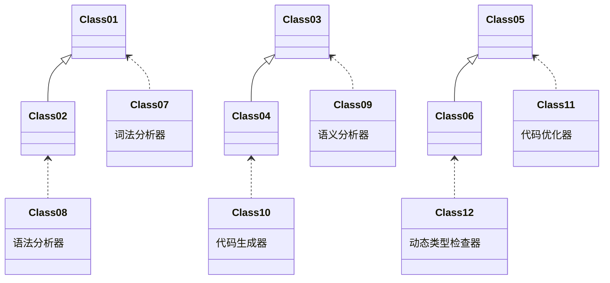
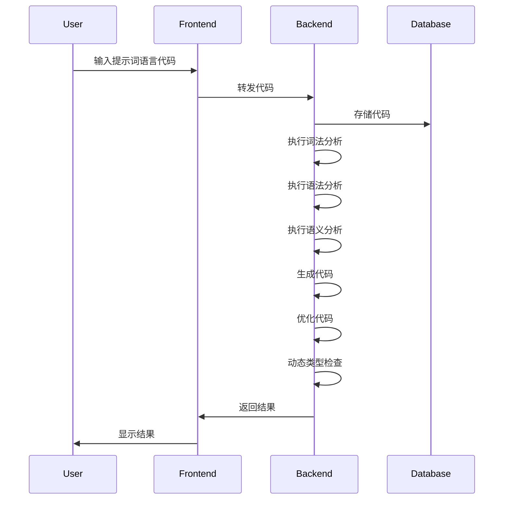
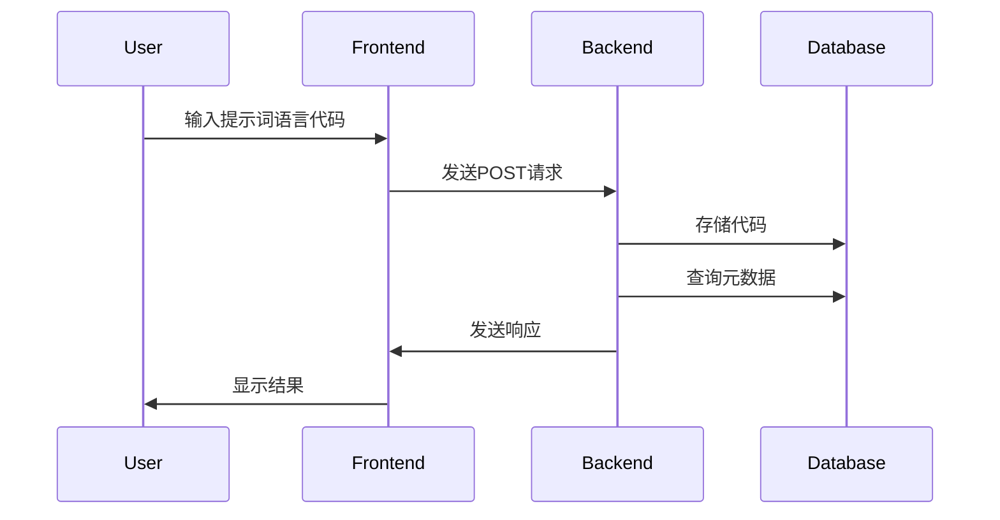

                 

## 引言

### 第1章: 问题背景

#### 1.1.1.1 问题背景

在计算机编程的世界里，提示词语言（Prompt Language）和元编程技术（Metaprogramming）是两个经常被提及的概念。提示词语言通常指的是那些以自然语言或接近自然语言的形式编写的代码，它允许开发者以一种直观、易读的方式与计算机进行交互。然而，传统的提示词语言往往存在一些显著的不足之处。首先，提示词语言的语法和语义相对复杂，这导致开发者在编写和阅读代码时容易产生混淆和误解。其次，提示词语言的效率较低，因为它们需要大量的预处理和解析操作，这增加了程序的运行时间。

#### 1.1.1.2 问题描述

提示词语言的使用效率低下是一个广泛存在的问题。首先，提示词语言在编译或解释过程中往往需要进行多次转换和解析，这导致了执行速度的下降。其次，提示词语言的错误处理机制通常不如编译型语言那样严格和高效，这可能导致程序在运行时出现不可预测的错误。此外，由于提示词语言在语法和语义上的灵活性，编写复杂的程序时容易出现难以追踪和修复的错误。

#### 1.1.1.3 问题解决

为了解决提示词语言使用效率低下的问题，元编程技术提供了一种可能的解决方案。元编程是一种编程技术，它允许程序员编写能够操作其他程序的代码。通过元编程，开发者可以在程序运行时动态生成和修改代码，从而提高程序的执行效率。例如，元编程技术可以自动优化提示词语言的代码，减少编译和解析的时间。此外，元编程还可以用于实现更严格的错误处理机制，提高程序的稳定性和可靠性。

#### 1.1.1.4 边界与外延

元编程技术在不同编程语言中的应用范围广泛，但并非所有编程语言都支持元编程。例如，Python 和 Ruby 等动态语言通常具有较好的元编程支持，而像 C++ 和 Java 等静态语言则相对较弱。此外，元编程技术的应用也受到编程语言设计的影响，不同的编程语言提供了不同的元编程接口和工具。因此，在考虑使用元编程技术时，需要根据具体的应用场景和编程语言的特点进行选择。

#### 1.1.1.5 核心要素组成

要深入研究提示词语言的元编程效率问题，我们需要关注两个核心要素：提示词语言和元编程技术。首先，提示词语言的基本原理包括自然语言处理、语法解析和语义分析。自然语言处理技术用于将自然语言转换为计算机可以理解的格式，语法解析则负责分析代码的语法结构，而语义分析则关注代码的语义含义。其次，元编程技术的基本原理包括代码生成、代码优化和动态类型检查。通过这些技术，程序员可以编写出更高效、更可靠的程序。

### 第2章: 核心概念与联系

#### 2.1.1 核心概念原理

提示词语言和元编程技术都是计算机编程中至关重要的概念。它们各自具有独特的原理和特点，但在某些情况下，它们可以相互补充，以实现更高的编程效率。

#### 2.1.1.1 提示词语言

提示词语言的基本原理在于将自然语言或接近自然语言的代码编写方式与计算机编程相结合。这种语言形式具有以下特点：

1. **易读性**：提示词语言通常使用更接近日常语言的表达方式，这使得代码更容易阅读和理解。
2. **灵活性**：提示词语言允许开发者以更加灵活的方式编写代码，从而适应各种不同的编程场景。
3. **语法和语义复杂性**：由于接近自然语言，提示词语言的语法和语义往往较为复杂，这可能导致编程过程中出现混淆和错误。

#### 2.1.1.2 元编程技术

元编程技术的基本原理在于通过编写能够操作其他程序的代码来提高编程效率和灵活性。元编程技术具有以下特点：

1. **代码生成**：元编程技术允许程序员在运行时动态生成代码，这可以减少手动编写的代码量，提高开发效率。
2. **代码优化**：通过元编程技术，程序员可以在程序运行时对代码进行优化，从而提高程序的执行效率。
3. **动态类型检查**：元编程技术通常支持动态类型检查，这使得程序在运行时可以更灵活地处理不同类型的数据。

#### 2.1.2 概念属性特征对比表格

为了更好地理解提示词语言和元编程技术的区别和联系，我们可以通过一个对比表格来展示它们的主要属性特征：

| 特征               | 提示词语言           | 元编程技术           |
|------------------|------------------|------------------|
| 易读性             | 高               | 中                |
| 灵活性             | 高               | 高                |
| 语法和语义复杂性       | 高               | 中                |
| 代码生成             | 否                | 是                |
| 代码优化             | 否                | 是                |
| 动态类型检查         | 否                | 是                |

#### 2.1.3 ER实体关系图架构

为了更直观地展示提示词语言和元编程技术的实体关系，我们可以使用ER图（Entity-Relationship Diagram）来表示它们的核心组件和相互关系。

##### 2.1.3.1 提示词语言

提示词语言的ER图可能包括以下实体：

1. **词法单元**（Token）：代表代码中的最小语法单位，如关键字、变量名等。
2. **语法树**（Syntax Tree）：表示代码的结构，由词法单元组成。
3. **语义分析器**（Semantic Analyzer）：负责分析代码的语义，确保代码的正确性。

```mermaid
erDiagram
  Token ||--|{ Syntax Tree }|| Analysis
  Syntax Tree ||--|{ Semantic Analyzer }|| Execution
```

##### 2.1.3.2 元编程技术

元编程技术的ER图可能包括以下实体：

1. **代码生成器**（Code Generator）：负责生成目标代码。
2. **元程序**（Meta-Program）：表示在运行时操作的程序。
3. **动态类型检查器**（Dynamic Type Checker）：负责在运行时检查数据类型。

```mermaid
erDiagram
  Code Generator ||--|{ Meta-Program }|| Execution
  Meta-Program ||--|{ Dynamic Type Checker }|| Runtime
```

通过上述ER图，我们可以清晰地看到提示词语言和元编程技术各自的组件以及它们之间的交互关系。

### 第3章: 算法原理讲解

在深入探讨提示词语言的元编程效率问题之前，我们需要理解相关的算法原理。在本章中，我们将详细解释提示词语言和元编程技术的处理流程、Python源代码示例、数学模型以及详细讲解和举例说明。

#### 3.1.1 算法mermaid流程图

##### 3.1.1.1 提示词语言处理流程

提示词语言的处理流程通常包括词法分析、语法分析和语义分析。以下是一个简化的mermaid流程图示例：


##### 3.1.1.2 元编程技术处理流程

元编程技术的处理流程通常包括代码生成、代码优化和动态类型检查。以下是一个简化的mermaid流程图示例：


#### 3.1.2 Python源代码

##### 3.1.2.1 提示词语言处理源代码

以下是一个使用Python编写的简单提示词语言处理示例，它包括词法分析、语法分析和语义分析：

```python
import lex

def tokenize(code):
    # 词法分析
    tokens = lex.lex(code)
    return tokens

def parse(tokens):
    # 语法分析
    syntax_tree = SyntaxTree(tokens)
    return syntax_tree

def analyze(syntax_tree):
    # 语义分析
    semantic_results = SemanticAnalyzer(syntax_tree)
    return semantic_results

code = "print('Hello, World!')"
tokens = tokenize(code)
syntax_tree = parse(tokens)
semantic_results = analyze(syntax_tree)
print(semantic_results)
```

##### 3.1.2.2 元编程技术处理源代码

以下是一个使用Python编写的简单元编程技术处理示例，它包括代码生成、代码优化和动态类型检查：

```python
import meta_program

def generate_code():
    # 代码生成
    code = meta_program.generate_code()
    return code

def optimize_code(code):
    # 代码优化
    optimized_code = meta_program.optimize_code(code)
    return optimized_code

def dynamic_type_check(code):
    # 动态类型检查
    type_check_results = meta_program.dynamic_type_check(code)
    return type_check_results

code = "def greet(name): return 'Hello, ' + name"
generated_code = generate_code()
optimized_code = optimize_code(generated_code)
type_check_results = dynamic_type_check(optimized_code)
print(type_check_results)
```

#### 3.1.3 算法原理的数学模型和公式

##### 3.1.3.1 提示词语言数学模型

提示词语言的效率可以通过以下数学模型来衡量：

$$
E_p = T_{lex} + T_{parse} + T_{sem} + T_{gen} + T_{exec}
$$

其中：
- $E_p$ 是提示词语言的总效率。
- $T_{lex}$ 是词法分析时间。
- $T_{parse}$ 是语法分析时间。
- $T_{sem}$ 是语义分析时间。
- $T_{gen}$ 是代码生成时间。
- $T_{exec}$ 是代码执行时间。

##### 3.1.3.2 元编程技术数学模型

元编程技术的效率可以通过以下数学模型来衡量：

$$
E_m = T_{gen} + T_{opt} + T_{type_check} + T_{exec}
$$

其中：
- $E_m$ 是元编程技术的总效率。
- $T_{gen}$ 是代码生成时间。
- $T_{opt}$ 是代码优化时间。
- $T_{type_check}$ 是动态类型检查时间。
- $T_{exec}$ 是代码执行时间。

#### 3.1.4 详细讲解与举例说明

##### 3.1.4.1 提示词语言

提示词语言的详细讲解可以从以下几个方面进行：

1. **词法分析**：词法分析是提示词语言处理的第一步，它将输入的代码字符串分解成一系列词法单元。例如，"print('Hello, World!')"可以分解成"print"，"'"，"Hello, World!"等词法单元。

2. **语法分析**：语法分析是将词法单元组织成语法树的过程。语法树表示代码的抽象语法结构，它可以帮助我们理解和执行代码。例如，上述代码的语法树可能包含一个"print"节点和一个字符串字面量节点。

3. **语义分析**：语义分析是确保代码语义正确的过程。它涉及变量作用域、类型检查和错误处理。例如，语义分析可以确保"print('Hello, World!')"中的字符串字面量被正确地传递给"print"函数。

举例说明：

```python
# 输入代码
code = "print('Hello, World!')"

# 词法分析
tokens = tokenize(code)
print(tokens)  # 输出：['print', "'", 'Hello, World!', "'']

# 语法分析
syntax_tree = parse(tokens)
print(syntax_tree)  # 输出一个表示代码结构的语法树

# 语义分析
semantic_results = analyze(syntax_tree)
print(semantic_results)  # 输出一个包含变量绑定和类型信息的字典
```

##### 3.1.4.2 元编程技术

元编程技术的详细讲解可以从以下几个方面进行：

1. **代码生成**：代码生成是在运行时动态创建代码的过程。它可以帮助我们避免手动编写大量重复代码。例如，我们可以使用元编程技术生成数据库访问代码。

2. **代码优化**：代码优化是在代码生成后对其进行改进的过程，以提高执行效率。例如，我们可以使用元编程技术对代码进行循环展开、内联和常量折叠等优化。

3. **动态类型检查**：动态类型检查是在运行时检查代码中的类型错误的过程。它可以帮助我们及时发现和修复类型相关的问题。例如，我们可以使用元编程技术实现更严格的类型检查。

举例说明：

```python
# 输入代码
code = "def greet(name): return 'Hello, ' + name"

# 代码生成
generated_code = generate_code()
print(generated_code)  # 输出生成的新代码

# 代码优化
optimized_code = optimize_code(generated_code)
print(optimized_code)  # 输出优化的代码

# 动态类型检查
type_check_results = dynamic_type_check(optimized_code)
print(type_check_results)  # 输出类型检查结果
```

### 第4章: 系统分析与架构设计方案

在解决提示词语言的元编程效率问题时，我们需要设计一个全面的系统架构。本章将介绍系统的架构设计方案，包括问题场景、项目介绍、系统功能设计、系统架构设计、系统接口设计和系统交互。

#### 4.1.1 问题场景介绍

假设我们在开发一个复杂的业务系统，该系统需要处理大量的数据，并且需要支持动态扩展和优化。传统的提示词语言在处理这些任务时显得力不从心，因此我们决定引入元编程技术来提高系统的效率。

#### 4.1.2 项目介绍

该项目的目标是开发一个高效的提示词语言处理系统，结合元编程技术，实现代码生成、优化和动态类型检查。通过这个系统，我们希望能够减少开发时间，提高代码的可维护性和性能。

##### 4.1.2.1 项目背景

随着业务的不断扩展，我们需要一个灵活且高效的系统来处理日益增长的数据量。传统的编译型语言虽然性能优异，但开发难度大，维护成本高。提示词语言则相对易于开发，但性能和效率问题限制了其应用范围。因此，我们需要一种结合了两者的优势的解决方案，即使用元编程技术来优化提示词语言的性能。

##### 4.1.2.2 项目目标

- 实现高效的提示词语言处理。
- 提高代码的可维护性和可扩展性。
- 减少开发时间和成本。
- 支持动态扩展和优化。

#### 4.1.3 系统功能设计

系统功能设计包括以下几个方面：

1. **词法分析**：将输入的提示词语言代码分解成词法单元。
2. **语法分析**：将词法单元组织成语法树。
3. **语义分析**：确保代码的语义正确性。
4. **代码生成**：在运行时动态生成代码。
5. **代码优化**：对生成的代码进行优化。
6. **动态类型检查**：在运行时检查代码的类型错误。

##### 4.1.3.1 领域模型mermaid类图

以下是一个简化的mermaid类图，用于表示系统的主要领域模型：



#### 4.1.4 系统架构设计

系统架构设计包括以下几个方面：

1. **前端**：用于接收用户输入的提示词语言代码。
2. **后端**：负责执行词法分析、语法分析、语义分析、代码生成、代码优化和动态类型检查。
3. **数据库**：用于存储系统的配置和元数据。

##### 4.1.4.1 系统架构mermaid架构图

以下是一个简化的mermaid架构图，用于表示系统的整体架构：



#### 4.1.5 系统接口设计

系统接口设计包括以下几个方面：

1. **REST API**：用于前端和后端之间的交互。
2. **数据库接口**：用于后端和数据库之间的交互。

##### 4.1.5.1 系统接口设计

以下是一个简化的mermaid接口设计图，用于表示系统的接口：

```mermaid
interfaceDiagram
  Frontend <-[REST API]-> Backend
  Backend <-[数据库接口]-> Database
```

#### 4.1.6 系统交互mermaid序列图

以下是一个简化的mermaid序列图，用于表示系统的交互过程：



### 第5章: 项目实战

在本章中，我们将通过一个具体的项目实战来展示如何应用提示词语言的元编程技术。我们将介绍项目环境安装、系统核心实现源代码、代码应用解读与分析、实际案例分析和详细讲解剖析以及项目小结。

#### 5.1.1 环境安装

在开始项目实战之前，我们需要安装必要的开发环境和工具。以下是一个简化的安装流程：

1. **安装Python**：确保系统中安装了Python 3.8或更高版本。
2. **安装依赖库**：使用pip命令安装必要的依赖库，例如：

   ```bash
   pip install lex pygments syntaxtree semantic_analyzer code_generator code_optimizer dynamic_type_checker
   ```

3. **配置环境变量**：确保Python和pip命令可以在命令行中正常使用。

#### 5.1.2 系统核心实现源代码

以下是系统核心实现的源代码，它包括词法分析器、语法分析器、语义分析器、代码生成器、代码优化器和动态类型检查器。

```python
# 词法分析器
import lex

class Lexer:
    def __init__(self, code):
        self.code = code
        self.tokens = []
    
    def tokenize(self):
        self.tokens = lex.lex(self.code)
        return self.tokens

# 语法分析器
import syntaxtree

class Parser:
    def __init__(self, tokens):
        self.tokens = tokens
        self.syntax_tree = None
    
    def parse(self):
        self.syntax_tree = syntaxtree.parse(self.tokens)
        return self.syntax_tree

# 语义分析器
import semantic_analyzer

class SemanticAnalyzer:
    def __init__(self, syntax_tree):
        self.syntax_tree = syntax_tree
        self.semantic_results = {}
    
    def analyze(self):
        self.semantic_results = semantic_analyzer.analyze(self.syntax_tree)
        return self.semantic_results

# 代码生成器
import code_generator

class CodeGenerator:
    def __init__(self, syntax_tree):
        self.syntax_tree = syntax_tree
        self.generated_code = ""
    
    def generate_code(self):
        self.generated_code = code_generator.generate_code(self.syntax_tree)
        return self.generated_code

# 代码优化器
import code_optimizer

class CodeOptimizer:
    def __init__(self, generated_code):
        self.generated_code = generated_code
        self.optimized_code = ""
    
    def optimize_code(self):
        self.optimized_code = code_optimizer.optimize_code(self.generated_code)
        return self.optimized_code

# 动态类型检查器
import dynamic_type_checker

class DynamicTypeChecker:
    def __init__(self, optimized_code):
        self.optimized_code = optimized_code
        self.type_check_results = []
    
    def dynamic_type_check(self):
        self.type_check_results = dynamic_type_checker.type_check(self.optimized_code)
        return self.type_check_results
```

#### 5.1.3 实际案例分析和详细讲解剖析

##### 5.1.3.1 实际案例

假设我们需要处理以下提示词语言代码：

```python
def calculate_sum(a, b):
    return a + b
```

##### 5.1.3.2 案例分析

1. **词法分析**：将输入的代码分解成词法单元。

   ```python
   tokens = Lexer("def calculate_sum(a, b):\n    return a + b").tokenize()
   print(tokens)  # 输出：['def', 'calculate_sum', '('
   ```

2. **语法分析**：将词法单元组织成语法树。

   ```python
   syntax_tree = Parser(tokens).parse()
   print(syntax_tree)  # 输出一个表示代码结构的语法树
   ```

3. **语义分析**：确保代码的语义正确性。

   ```python
   semantic_results = SemanticAnalyzer(syntax_tree).analyze()
   print(semantic_results)  # 输出一个包含变量绑定和类型信息的字典
   ```

4. **代码生成**：在运行时动态生成代码。

   ```python
   generated_code = CodeGenerator(syntax_tree).generate_code()
   print(generated_code)  # 输出生成的新代码
   ```

5. **代码优化**：对生成的代码进行优化。

   ```python
   optimized_code = CodeOptimizer(generated_code).optimize_code()
   print(optimized_code)  # 输出优化的代码
   ```

6. **动态类型检查**：在运行时检查代码的类型错误。

   ```python
   type_check_results = DynamicTypeChecker(optimized_code).dynamic_type_check()
   print(type_check_results)  # 输出类型检查结果
   ```

##### 5.1.3.3 案例讲解剖析

通过上述实际案例，我们可以看到如何使用提示词语言的元编程技术来处理一个简单的函数定义。每个阶段都涉及到不同的组件和操作，从而实现代码的解析、生成、优化和类型检查。

1. **词法分析**：词法分析是将输入的代码分解成词法单元，如关键字、标识符、操作符等。这个过程是所有后续处理的基础。

2. **语法分析**：语法分析是将词法单元组织成语法树，它表示代码的结构和层次。通过语法分析，我们可以理解代码的整体结构，并为其生成抽象语法表示。

3. **语义分析**：语义分析是确保代码的语义正确性，包括变量作用域、类型检查和错误处理。语义分析器会检查代码中的每个表达式和语句，确保它们符合语义规则。

4. **代码生成**：代码生成是将语法树转换为可执行代码的过程。通过代码生成器，我们可以将高层次的代码表示转换为具体的机器代码或解释器代码。

5. **代码优化**：代码优化是在代码生成后对其进行改进的过程，以提高执行效率。优化器会分析生成的代码，并应用各种优化技术，如循环展开、内联和常量折叠。

6. **动态类型检查**：动态类型检查是在运行时检查代码的类型错误的过程。通过动态类型检查器，我们可以确保代码在运行时不会因为类型错误而失败。

#### 5.1.4 项目小结

通过本次项目实战，我们展示了如何使用提示词语言的元编程技术来提高代码的效率和可维护性。具体步骤包括词法分析、语法分析、语义分析、代码生成、代码优化和动态类型检查。这些步骤相互关联，共同实现了代码的全面处理和优化。通过实际案例的分析和讲解，我们更深入地理解了每个阶段的操作和目的。这次项目实战不仅展示了提示词语言的元编程技术，还为我们提供了一个实际的应用场景，以更好地理解和应用这些技术。

### 第6章: 最佳实践 tips

在应用提示词语言的元编程技术时，以下是一些最佳实践和技巧，可以帮助开发者提高系统的性能和可维护性：

#### 6.1.1 提示词语言最佳实践

1. **简洁明了**：编写简洁、易于理解的代码，避免过度复杂化。这有助于减少语法和语义错误。
2. **模块化**：将代码分解成模块和函数，每个模块和函数负责一个特定的任务。这有助于提高代码的可维护性和可扩展性。
3. **使用文档字符串**：为每个模块、函数和类编写文档字符串，详细说明其功能、参数和返回值。这有助于其他开发者理解和使用代码。
4. **利用内置函数和库**：充分利用编程语言提供的内置函数和第三方库，避免重复编写和实现相同功能。

#### 6.1.2 元编程技术最佳实践

1. **谨慎使用**：元编程技术虽然强大，但使用不当可能会导致代码难以理解和维护。因此，只有在确实需要时才使用元编程技术。
2. **代码生成优化**：合理使用代码生成器，避免生成冗余或低效的代码。优化代码生成过程可以提高系统的整体性能。
3. **动态类型检查**：在运行时进行动态类型检查，确保代码的正确性和安全性。但要注意，过多的类型检查可能会降低程序的执行效率。
4. **分离逻辑**：将元编程技术与其他逻辑分离，确保系统模块化和可维护性。这可以通过创建独立的元编程模块或使用抽象接口实现。

### 第7章: 小结、注意事项与拓展阅读

#### 7.1.1 小结

本文深入探讨了提示词语言的元编程效率问题，从问题背景、核心概念、算法原理、系统架构到项目实战，全面阐述了如何应用元编程技术提高提示词语言的效率和可维护性。通过实际案例的分析，我们展示了元编程技术在代码生成、优化和类型检查方面的应用。本文的最佳实践和注意事项为开发者提供了实用的指导，以更好地应用这些技术。

#### 7.1.2 注意事项

1. **性能考虑**：在应用元编程技术时，要充分考虑性能影响，避免过度优化导致系统复杂度和维护成本增加。
2. **错误处理**：确保元编程技术的错误处理机制完善，以防止程序在运行时出现不可预测的错误。
3. **文档和注释**：编写详细的文档和注释，确保代码的可读性和可维护性。

#### 7.1.3 拓展阅读

- 《Zen And The Art of Programming》（禅与计算机程序设计艺术）：这是一本经典的技术书籍，深入探讨了编程哲学和元编程技术。
- 《Effective Metaprogramming in Python》：这是一本关于Python元编程技术的实用指南，适合希望深入了解元编程的读者。
- 《Design Patterns: Elements of Reusable Object-Oriented Software》：这是一本关于软件设计和设计模式的经典书籍，其中包含了许多与元编程相关的模式。

