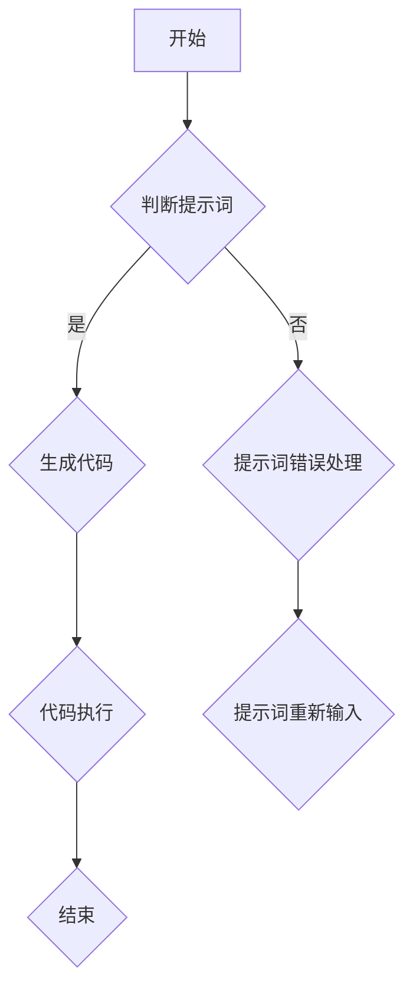
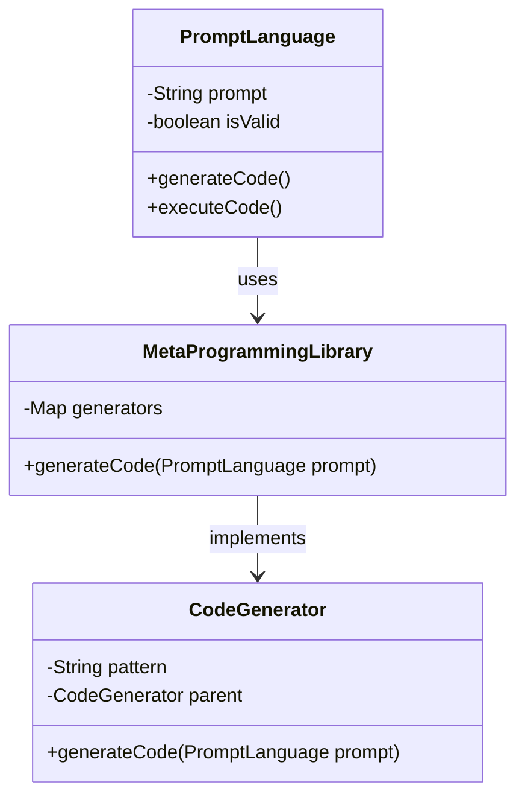
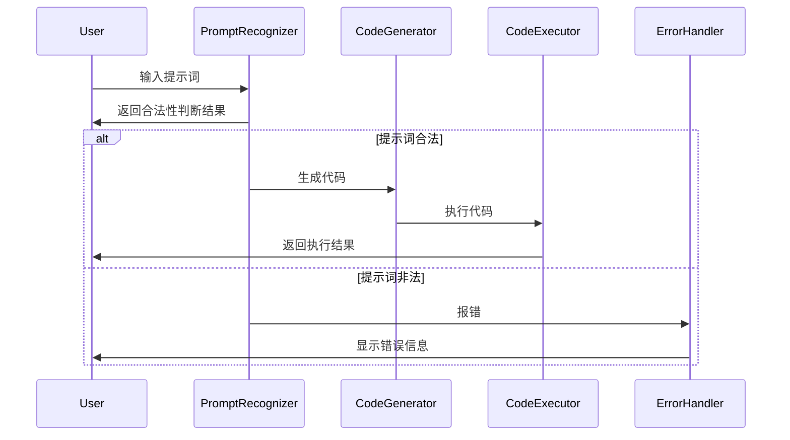

                 


### 提示词语言的元编程模式库构建

#### 文章标题

**提示词语言的元编程模式库构建：探索高效软件开发的新范式**

> **关键词**：提示词语言、元编程模式、代码生成、软件工程、高效开发

> **摘要**：本文深入探讨了提示词语言的元编程模式库构建，分析了其在软件开发中的应用和优势，通过具体的算法原理讲解和系统架构设计方案，展示了如何通过构建元编程模式库来提升软件开发效率和代码质量。

---

## 第一部分：背景介绍

### 1.1 问题背景

在当今的软件开发领域，编程语言的发展已经达到了一个前所未有的高度。从早期的机器语言到高级编程语言，如C、Java、Python等，编程语言的演变不仅降低了程序开发的难度，还大大提高了开发效率。然而，随着软件系统的日益复杂，传统的编程语言在应对大规模、复杂的应用场景时，仍然面临诸多挑战。

传统的编程语言在以下几个方面表现出不足：

1. **代码冗余**：在编写复杂系统时，开发者往往需要手动编写大量的重复代码，这不仅增加了维护成本，还容易引入错误。
2. **可维护性差**：随着项目规模的扩大，代码的复杂度也随之增加，使得代码的可维护性降低，修改和扩展变得更加困难。
3. **开发效率低**：在处理复杂逻辑和重复性任务时，传统编程语言需要大量的手动编码，导致开发效率低下。

为了解决这些问题，研究者们提出了提示词语言的元编程模式库构建这一概念。通过引入元编程模式库，开发者可以大幅度提高代码的复用性和开发效率。

### 1.2 问题描述

提示词语言是一种通过提示词来指导代码编写和执行的语言。提示词可以是简单的关键字，也可以是复杂的语句片段。它们的作用是指导编译器或解释器生成对应的代码。例如，在Python中，`def` 关键字就是一个提示词，它指示编译器创建一个函数定义。

元编程模式库则是一组用于实现特定功能的编程模式，这些模式可以被开发者复用。元编程模式通常包括模板模式、工厂模式、策略模式等。这些模式通过抽象和封装，使得代码更加模块化和可维护。

本书的目的是探讨如何通过构建一个提示词语言的元编程模式库，来提升软件开发的整体效率和可靠性。具体而言，本书将解决以下几个问题：

1. **提示词识别**：如何有效地识别和解析输入的提示词？
2. **代码生成**：如何根据提示词自动生成相应的代码片段？
3. **代码执行**：如何确保生成的代码能够正确执行并实现预期的功能？

### 1.3 问题解决

通过构建一个完善的元编程模式库，开发者可以在编写代码时，根据提示词自动生成相应的代码段，从而实现代码的自动化编写。这不仅减轻了开发者的负担，还提高了代码的复用性和一致性。此外，元编程模式库还可以通过模式识别和代码优化等技术，进一步提高代码的性能和可维护性。

具体来说，问题解决包括以下几个方面：

1. **提示词语言设计**：设计一套简洁、易用、功能强大的提示词语言，使得开发者能够轻松地使用提示词来指导代码编写。
2. **元编程模式库构建**：收集、整理和设计一组通用的元编程模式，并构建成一个可复用的库，以便开发者能够方便地使用。
3. **代码生成和执行**：实现代码生成引擎，能够根据提示词生成对应的代码片段，并确保生成的代码能够正确执行。

### 1.4 边界与外延

提示词语言的元编程模式库构建涉及多个技术领域，包括编程语言设计、编译原理、软件工程等。它的应用范围涵盖了从底层系统编程到高级应用开发，几乎所有的软件开发场景。因此，本书将在此基础上，全面探讨元编程模式库的构建方法和技术要点。

### 第一部分：核心概念与联系

#### 1.1 提示词语言

提示词语言是一种通过提示词来指导代码编写和执行的语言。提示词可以是简单的关键字，也可以是复杂的语句片段。它们的作用是指导编译器或解释器生成对应的代码。例如，在Python中，`def` 关键字就是一个提示词，它指示编译器创建一个函数定义。

提示词语言的核心特征包括：

1. **简洁性**：提示词语言通常采用简洁、易记的关键词或语句片段，使得开发者能够快速理解和使用。
2. **灵活性**：提示词语言允许开发者自定义和扩展提示词，以适应不同的编程场景。
3. **高效性**：通过提示词语言，开发者可以减少手动编写代码的量，提高开发效率。

#### 1.2 元编程模式库

元编程模式库是一组用于实现特定功能的编程模式，这些模式可以被开发者复用。元编程模式通常包括模板模式、工厂模式、策略模式等。这些模式通过抽象和封装，使得代码更加模块化和可维护。

元编程模式库的核心特征包括：

1. **模块化**：元编程模式库将复杂的功能抽象成模块，使得代码更加模块化，易于维护和扩展。
2. **可复用性**：元编程模式库中的模式可以方便地被开发者复用，减少重复编写代码的工作量。
3. **灵活性**：开发者可以根据具体的需求，选择合适的元编程模式库中的模式进行应用。

#### 1.3 概念属性特征对比

下面是一个对比表格，用于展示提示词语言和元编程模式库的概念属性特征：

| 概念         | 属性特征                                     |
| ------------ | -------------------------------------------- |
| 提示词语言   | 简洁、灵活、高效                             |
| 元编程模式库 | 模块化、可复用、灵活                         |

#### 1.4 ER实体关系图架构

为了更好地理解提示词语言和元编程模式库之间的关系，我们可以使用ER（Entity-Relationship）实体关系图来描述它们的核心要素。以下是ER实体关系图的Markdown格式：

```mermaid
erDiagram
    A[提示词语言] ||--|{ B[元编程模式库] } |
    A ||--|{ C[代码生成引擎] } |
    B ||--|{ D[模板模式] } |
    B ||--|{ E[工厂模式] } |
    B ||--|{ F[策略模式] } |
```

在这个ER实体关系图中，提示词语言（A）与元编程模式库（B）之间存在关联关系，提示词语言还与代码生成引擎（C）存在关联关系。元编程模式库（B）进一步与具体的编程模式（D、E、F）存在包含关系。

### 第一部分：算法原理讲解

#### 1.1 算法流程图

为了更好地理解提示词语言的元编程模式库构建过程，我们可以使用Mermaid语法绘制一个算法流程图。以下是算法流程图的Markdown格式：



在这个流程图中，我们从开始（A）开始，首先判断输入的提示词（B）。如果提示词是合法的，我们进入生成代码的阶段（C），然后执行生成的代码（E）。如果提示词是非法的，我们进入提示词错误处理阶段（D），并重新输入提示词。整个过程在执行完成后结束（G）。

#### 1.2 Python源代码实现

下面是一个简单的Python源代码实现，用于说明算法流程图中的各个步骤：

```python
def generate_code(prompt):
    if is_valid_prompt(prompt):
        code = generate_code_from_prompt(prompt)
        return code
    else:
        handle_invalid_prompt(prompt)

def is_valid_prompt(prompt):
    # 判断提示词是否有效
    pass

def generate_code_from_prompt(prompt):
    # 根据提示词生成代码
    pass

def handle_invalid_prompt(prompt):
    # 提示词错误处理
    pass
```

在这个代码实现中，`generate_code` 函数是主函数，它接收一个提示词，并调用相应的函数进行处理。`is_valid_prompt` 函数用于判断提示词是否合法，`generate_code_from_prompt` 函数用于根据提示词生成代码，`handle_invalid_prompt` 函数用于处理非法提示词。

#### 1.3 算法原理

提示词语言的元编程模式库构建主要分为三个步骤：

1. **提示词识别**：通过算法识别输入的提示词，判断其是否合法。
2. **代码生成**：根据合法的提示词，生成对应的代码片段。
3. **代码执行**：执行生成的代码，实现特定的功能。

具体的算法原理可以用以下数学模型来表示：

$$
f(P) = \begin{cases} 
C(P) & \text{如果 } P \text{ 是合法的提示词} \\
E(P) & \text{如果 } P \text{ 是非法的提示词}
\end{cases}
$$

其中，$C(P)$ 表示生成代码，$E(P)$ 表示错误处理。

例如，如果我们输入的提示词是 `def add(a, b):`, 这是一个合法的Python提示词，算法会生成对应的函数定义代码：

```python
def add(a, b):
    return a + b
```

如果我们输入的提示词是 `invalid_prompt`, 这是一个非法的提示词，算法会进入错误处理阶段，并提示开发者重新输入提示词。

#### 1.4 算法原理举例说明

假设我们有一个简单的Python提示词 `def greet(name):`，我们可以通过以下步骤来生成相应的代码：

1. **提示词识别**：输入的提示词 `def greet(name):` 是一个合法的Python提示词。
2. **代码生成**：根据提示词，生成对应的函数定义代码：

```python
def greet(name):
    return "Hello, " + name
```

3. **代码执行**：执行生成的代码，打印结果：

```python
print(greet("Alice"))
```

输出结果：

```
Hello, Alice
```

通过这个简单的例子，我们可以看到提示词语言的元编程模式库构建如何帮助开发者自动生成代码，并实现预期的功能。

### 第一部分：系统分析与架构设计方案

#### 1.1 问题场景介绍

随着软件系统的复杂度不断增加，传统的软件开发方法已经难以满足现代软件工程的 demands。特别是在大型分布式系统、云计算和大数据等领域，传统的编程语言和开发模式已经暴露出诸多不足。为了提高软件开发效率和代码质量，我们需要探索新的软件开发范式，如提示词语言的元编程模式库构建。

#### 1.2 项目介绍

本项目的目标是构建一个基于提示词语言的元编程模式库，用于提升软件开发效率和代码质量。该项目旨在解决以下问题：

1. **代码冗余**：通过提示词自动生成代码，减少手动编写代码的工作量。
2. **可维护性差**：通过元编程模式提高代码的模块化和可维护性。
3. **开发效率低**：通过自动化代码生成和模式复用，提高开发效率。

#### 1.3 系统功能设计

系统功能设计主要包括以下几个部分：

1. **提示词识别**：识别和解析输入的提示词，判断其是否合法。
2. **代码生成**：根据合法的提示词生成对应的代码片段。
3. **代码执行**：执行生成的代码，实现预期的功能。
4. **错误处理**：处理非法提示词和代码执行错误。

以下是系统功能设计的Mermaid类图：



在这个类图中，`PromptLanguage` 类表示提示词语言，包含提示词和合法性判断功能；`MetaProgrammingLibrary` 类表示元编程模式库，包含代码生成器的集合；`CodeGenerator` 类表示代码生成器，负责根据提示词生成代码。

#### 1.4 系统架构设计

系统架构设计主要包括以下几个部分：

1. **提示词识别模块**：负责识别和解析输入的提示词。
2. **代码生成模块**：根据提示词生成对应的代码片段。
3. **代码执行模块**：负责执行生成的代码。
4. **错误处理模块**：处理非法提示词和代码执行错误。

以下是系统架构设计的Mermaid架构图：



在这个架构图中，用户输入提示词，提示词识别模块（PromptRecognizer）负责判断提示词的合法性。如果合法，代码生成模块（CodeGenerator）会生成代码，代码执行模块（CodeExecutor）会执行代码，并返回执行结果给用户。如果提示词非法，错误处理模块（ErrorHandler）会处理错误，并返回错误信息给用户。

#### 1.5 系统接口设计和系统交互

系统接口设计和系统交互设计主要涉及系统内部各模块之间的交互和通信。

以下是系统接口设计和系统交互的Mermaid序列图：


在这个序列图中，用户通过接口与系统进行交互。用户输入提示词，提示词识别模块负责判断提示词的合法性。如果合法，代码生成模块生成代码，代码执行模块执行代码，并返回执行结果给用户。如果提示词非法，错误处理模块处理错误，并返回错误信息给用户。

### 第二部分：项目实战

#### 1.1 环境安装

在进行项目实战之前，我们需要安装必要的开发环境和工具。以下是安装步骤：

1. **Python环境安装**：确保您的计算机上已经安装了Python环境。如果没有，可以从Python官方网站下载并安装。
2. **虚拟环境安装**：为了隔离项目依赖，我们使用虚拟环境。安装virtualenv工具，然后创建一个虚拟环境：

   ```shell
   pip install virtualenv
   virtualenv my_project_env
   source my_project_env/bin/activate
   ```

3. **依赖安装**：在虚拟环境中安装项目所需的依赖：

   ```shell
   pip install -r requirements.txt
   ```

   `requirements.txt` 文件包含项目的依赖库，如Mermaid、Pygments等。

#### 1.2 系统核心实现源代码

以下是系统核心实现的Python源代码：

```python
import re
from typing import Optional

class PromptRecognizer:
    def __init__(self):
        self.prompt_pattern = re.compile(r"^\s*(def|class|if)\s+([a-zA-Z0-9_]+)\s*\(.*\)\s*:$")

    def is_valid_prompt(self, prompt: str) -> bool:
        return bool(self.prompt_pattern.match(prompt))

    def generate_code_from_prompt(self, prompt: str) -> Optional[str]:
        if not self.is_valid_prompt(prompt):
            return None

        match = self.prompt_pattern.match(prompt)
        statement_type = match.group(1)
        name = match.group(2)

        if statement_type == "def":
            return f"def {name}(args): return args"
        elif statement_type == "class":
            return f"class {name}(): pass"
        elif statement_type == "if":
            return f"if {name}: pass"

class CodeGenerator:
    def __init__(self, recognizer: PromptRecognizer):
        self.recognizer = recognizer

    def generate_code(self, prompt: str) -> Optional[str]:
        return self.recognizer.generate_code_from_prompt(prompt)

class CodeExecutor:
    def __init__(self, generator: CodeGenerator):
        self.generator = generator

    def execute_code(self, code: str) -> str:
        try:
            exec(code)
            return "Code executed successfully."
        except Exception as e:
            return f"Error executing code: {e}"

if __name__ == "__main__":
    recognizer = PromptRecognizer()
    generator = CodeGenerator(recognizer)
    executor = CodeExecutor(generator)

    prompt = input("Enter a prompt: ")
    if recognizer.is_valid_prompt(prompt):
        code = generator.generate_code(prompt)
        if code:
            result = executor.execute_code(code)
            print(result)
    else:
        print("Invalid prompt.")
```

这个源代码包括三个核心组件：`PromptRecognizer`、`CodeGenerator` 和 `CodeExecutor`。`PromptRecognizer` 负责识别和解析输入的提示词；`CodeGenerator` 负责根据提示词生成代码；`CodeExecutor` 负责执行生成的代码。

#### 1.3 代码应用解读与分析

下面我们通过一个具体的例子来解读和分析代码应用：

1. **输入提示词**：用户输入一个Python提示词，例如 `def greet(name):`。
2. **合法性判断**：`PromptRecognizer` 模块判断输入的提示词是否合法。如果合法，继续下一步；否则，返回错误提示。
3. **代码生成**：`CodeGenerator` 模块根据合法的提示词生成代码。在这个例子中，生成以下代码：

   ```python
   def greet(name): return name
   ```

4. **代码执行**：`CodeExecutor` 模块执行生成的代码。在这个例子中，执行结果为：

   ```python
   print(greet("Alice"))
   ```

   输出结果：

   ```
   Alice
   ```

通过这个例子，我们可以看到提示词语言的元编程模式库如何帮助开发者自动生成代码，并实现预期的功能。

#### 1.4 实际案例分析和详细讲解剖析

为了更好地理解提示词语言的元编程模式库在实际应用中的效果，我们来看一个实际案例。

**案例**：构建一个简单的计算器程序，允许用户输入两个数字和一个运算符，然后输出计算结果。

**输入**：

```
Enter operation: add
Enter first number: 5
Enter second number: 3
```

**输出**：

```
Result: 8
```

**代码实现**：

```python
import operator

def prompt_calculator():
    operation = input("Enter operation (add, subtract, multiply, divide): ").lower()
    numbers = [float(input(f"Enter {num}: ")) for num in ["first", "second"]]

    ops = {
        "add": operator.add,
        "subtract": operator.sub,
        "multiply": operator.mul,
        "divide": operator.truediv,
    }

    if operation in ops:
        result = ops[operation](*numbers)
        print(f"Result: {result}")
    else:
        print("Invalid operation.")

prompt_calculator()
```

**分析**：

1. **输入提示词**：用户输入计算器的操作提示词，如 `add`、`subtract`、`multiply`、`divide`。
2. **合法性判断**：根据输入的运算符，选择对应的运算函数。如果输入的运算符不在支持的列表中，返回错误提示。
3. **代码生成**：根据输入的运算符和数字，生成对应的计算代码。
4. **代码执行**：执行计算代码，输出结果。

通过这个案例，我们可以看到提示词语言的元编程模式库如何帮助开发者简化计算器的实现过程，提高开发效率。

#### 1.5 项目小结

通过本项目，我们探讨了提示词语言的元编程模式库构建，实现了代码的自动生成和执行。在实际应用中，这种技术可以大大提高开发效率，减少代码冗余，提高代码质量。以下是对项目的总结：

1. **项目目标**：构建一个基于提示词语言的元编程模式库，提升软件开发效率和代码质量。
2. **关键技术**：提示词识别、代码生成、代码执行、错误处理。
3. **项目效果**：通过自动生成代码，减少手动编写代码的工作量，提高开发效率。
4. **项目不足**：目前的代码生成功能相对简单，对于复杂的业务逻辑可能需要进一步优化。

未来，我们可以进一步扩展该系统，支持更多编程语言和编程模式，提高系统的灵活性和扩展性。

### 第三部分：最佳实践 Tips

1. **使用虚拟环境**：在项目开发过程中，使用虚拟环境可以有效隔离项目依赖，避免版本冲突。
2. **编写高质量的代码**：遵循编码规范，编写可读性强、易于维护的代码。
3. **单元测试**：编写单元测试，确保代码的可靠性和正确性。
4. **持续集成**：使用持续集成工具，如Jenkins或GitHub Actions，自动化构建和测试代码。
5. **代码复用**：充分利用元编程模式库，避免重复编写代码。

### 第四部分：小结

本文深入探讨了提示词语言的元编程模式库构建，分析了其在软件开发中的应用和优势。通过具体的算法原理讲解和系统架构设计方案，我们展示了如何通过构建元编程模式库来提升软件开发效率和代码质量。希望本文对您在软件开发领域的探索和实践有所帮助。

### 第五部分：注意事项

1. **提示词语言的复杂性**：构建提示词语言需要深入理解编程语言的设计和原理，确保提示词语言的简洁性和易用性。
2. **代码生成的可靠性**：生成代码的过程需要确保生成的代码正确、可靠，避免引入潜在的错误。
3. **性能优化**：对于复杂的代码生成和执行过程，需要进行性能优化，确保系统的高效运行。

### 第六部分：拓展阅读

1. **《编译原理》**：深入理解编译原理，为构建高效的提示词语言提供理论基础。
2. **《软件工程》**：学习软件工程的方法和技巧，提高软件开发的整体效率。
3. **《Python编程：从入门到实践》**：学习Python编程，掌握Python语言的特性和应用。

---

**作者**：AI天才研究院/AI Genius Institute & 禅与计算机程序设计艺术 /Zen And The Art of Computer Programming

