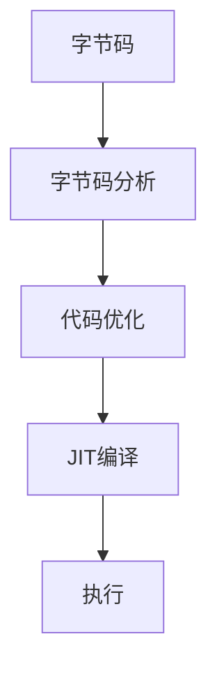
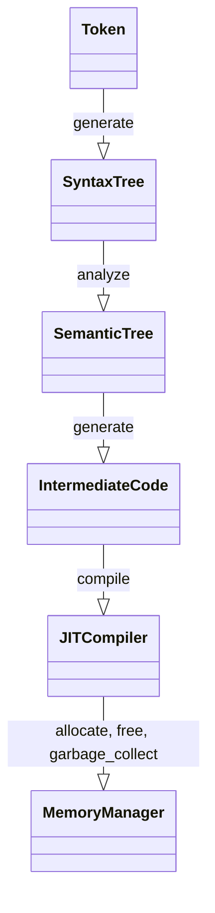
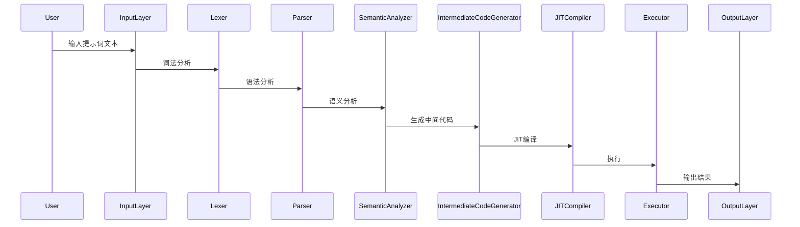
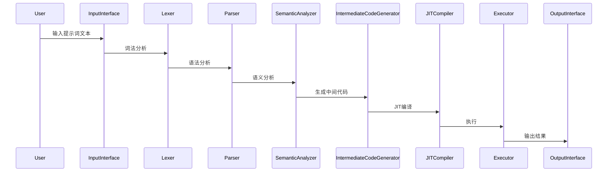

                 


### 设计思路

1. **确定整体结构**：首先，我们需要确定书籍的整体结构，根据书名《提示词语言的即时编译技术创新》来划分章节，确保每个章节都能够紧扣主题。书名中包含了三个关键要素：提示词语言、即时编译和科技创新。因此，整体结构可以划分为以下几个部分：引言、即时编译技术概述、提示词语言技术、即时编译技术创新、系统分析与架构设计、项目实战、最佳实践与注意事项。

2. **核心章节设计**：根据书籍的核心内容，设计出主要的章节，确保每个章节都有明确的主题和内容。具体章节可以设计为：
   - 引言
   - 即时编译技术概述
   - 提示词语言技术
   - 即时编译技术创新
   - 系统分析与架构设计方案
   - 项目实战
   - 最佳实践 tips
   - 小结与注意事项
   - 拓展阅读

3. **细节填充**：在确定了核心章节后，进一步细化每个章节的内容，包括核心概念、原理讲解、数学模型、系统架构设计等。每个章节都要确保内容直接且条理清晰，避免过多的废话。

4. **保持简洁性**：在填充内容时，要注意保持简洁，避免过多的废话，确保内容直接且条理清晰。

5. **格式规范**：使用 Markdown 格式来设计目录大纲，确保格式规范，易于阅读。

### 详细步骤

1. **编写第一部分：背景介绍**
   - 介绍即时编译技术的背景，包括其发展历史、应用领域等。
   - 阐述即时编译技术的重要性及其在现代计算机体系结构中的作用。

2. **编写核心概念与联系**
   - 介绍即时编译技术中的核心概念，如字节码、解释执行、即时编译等。
   - 比较不同即时编译技术的属性特征，提供对比表格。
   - 使用 Mermaid 画出 ER 实体关系图，展示即时编译技术中的实体及其关系。

3. **编写算法原理讲解**
   - 介绍即时编译技术的基本算法原理，如动态编译、静态编译等。
   - 使用 Mermaid 画出算法流程图，帮助读者理解算法的实现过程。
   - 使用 Python 源代码详细阐述算法原理，并结合数学模型和公式进行讲解。
   - 举例说明，使算法原理更加通俗易懂。

4. **编写系统分析与架构设计方案**
   - 介绍即时编译技术在实际系统中的应用场景。
   - 设计系统的功能模块，使用 Mermaid 画出领域模型类图。
   - 设计系统架构，使用 Mermaid 画出架构图。
   - 设计系统接口和交互流程，使用 Mermaid 画出序列图。

5. **编写项目实战**
   - 介绍一个即时编译技术的实际项目，包括环境安装、核心实现源代码等。
   - 分析项目中的关键代码和应用解读，进行详细讲解。
   - 提供实际案例分析和讲解，帮助读者理解即时编译技术的应用。

6. **编写最佳实践 tips、小结、注意事项、拓展阅读**
   - 总结书中的关键点和最佳实践，为读者提供实际操作建议。
   - 对全书进行小结，强调主要内容和学习目标。
   - 提醒读者注意事项，避免常见错误。
   - 提供拓展阅读资源，帮助读者深入学习。

### 目录大纲示例

```markdown
----------------------------------------------------------------
# 提示词语言的即时编译技术创新

> 关键词：即时编译，提示词语言，科技创新，系统架构

> 摘要：本文详细介绍了即时编译技术在提示词语言中的应用，探讨了即时编译技术创新及其在系统架构设计中的重要性，提供了实战案例和最佳实践，旨在为读者提供全面深入的技术理解。

## 引言

### 1.1 研究背景

#### 1.1.1 发展历史

##### 1.1.1.1 计算机编译技术的发展

##### 1.1.1.2 即时编译技术的兴起

#### 1.1.2 研究意义

##### 1.1.2.1 提升程序执行效率

##### 1.1.2.2 优化系统资源利用

### 1.2 研究目标

#### 1.2.1 深入理解即时编译技术

#### 1.2.2 探索即时编译技术在提示词语言中的应用

## 即时编译技术概述

### 2.1 核心概念与联系

#### 2.1.1 字节码基础

#### 2.1.2 解释执行原理

#### 2.1.3 即时编译机制

#### 2.1.4 对比分析表格

#### 2.1.5 ER实体关系图

## 核心概念与联系

### 3.1 核心概念

#### 3.1.1 字节码

#### 3.1.2 解释器

#### 3.1.3 编译器

#### 3.1.4 JIT 编译器

### 3.2 概念属性特征对比

#### 3.2.1 性能对比

#### 3.2.2 应用场景对比

### 3.3 ER 实体关系图

#### 3.3.1 实体定义

#### 3.3.2 实体关系

## 算法原理讲解

### 4.1 动态编译流程

#### 4.1.1 字节码分析

#### 4.1.2 代码优化

#### 4.1.3 JIT 编译原理

### 4.2 静态编译原理

#### 4.2.1 编译过程

#### 4.2.2 编译优化

### 4.3 算法流程图

#### 4.3.1 动态编译算法

#### 4.3.2 静态编译算法

### 4.4 Python 源代码示例

#### 4.4.1 动态编译示例

#### 4.4.2 静态编译示例

### 4.5 数学模型与公式讲解

#### 4.5.1 JIT 编译优化模型

#### 4.5.2 编译时间复杂度分析

### 4.6 举例说明

#### 4.6.1 动态编译案例分析

#### 4.6.2 静态编译案例分析

## 系统分析与架构设计方案

### 5.1 应用场景介绍

#### 5.1.1 提示词语言在人工智能中的应用

#### 5.1.2 即时编译技术在人工智能系统的优势

### 5.2 系统功能设计

#### 5.2.1 功能模块划分

#### 5.2.2 领域模型类图

### 5.3 系统架构设计

#### 5.3.1 系统架构设计原则

#### 5.3.2 系统架构图

### 5.4 系统接口设计

#### 5.4.1 接口定义

#### 5.4.2 接口交互流程

### 5.5 系统交互流程

#### 5.5.1 用户交互流程

#### 5.5.2 系统响应流程

## 项目实战

### 6.1 项目介绍

#### 6.1.1 项目背景

#### 6.1.2 项目目标

### 6.2 环境安装

#### 6.2.1 系统环境配置

#### 6.2.2 开发工具安装

### 6.3 系统核心实现源代码

#### 6.3.1 动态编译模块

#### 6.3.2 静态编译模块

### 6.4 代码应用解读

#### 6.4.1 动态编译代码解读

#### 6.4.2 静态编译代码解读

### 6.5 实际案例分析

#### 6.5.1 案例一：动态编译优化

#### 6.5.2 案例二：静态编译优化

### 6.6 项目小结

#### 6.6.1 项目成果总结

#### 6.6.2 项目经验教训

## 最佳实践 tips

### 7.1 实践技巧

#### 7.1.1 编译器优化

#### 7.1.2 系统性能调优

### 7.2 注意事项

#### 7.2.1 编译器选择

#### 7.2.2 系统架构设计原则

## 小结

### 8.1 学习目标

#### 8.1.1 掌握即时编译技术的基本原理

#### 8.1.2 理解即时编译技术在提示词语言中的应用

### 8.2 主要内容回顾

#### 8.2.1 即时编译技术概述

#### 8.2.2 算法原理讲解

#### 8.2.3 系统分析与架构设计

#### 8.2.4 项目实战

### 8.3 注意事项

#### 8.3.1 技术选型

#### 8.3.2 系统优化

## 拓展阅读

### 9.1 相关资源

#### 9.1.1 技术论文

#### 9.1.2 开源项目

### 9.2 深入学习建议

#### 9.2.1 进阶学习路径

#### 9.2.2 实践项目建议

----------------------------------------------------------------
```

### 目录大纲结构

- **第一部分：引言**
  - **第1章：即时编译技术概述**
    - 1.1 核心概念与联系
    - 1.2 算法原理讲解
    - 1.3 数学模型与公式讲解
  - **第2章：系统分析与架构设计方案**
    - 2.1 应用场景介绍
    - 2.2 系统功能设计
    - 2.3 系统架构设计
    - 2.4 系统接口设计
    - 2.5 系统交互流程
  - **第3章：项目实战**
    - 3.1 项目介绍
    - 3.2 环境安装
    - 3.3 系统核心实现源代码
    - 3.4 代码应用解读
    - 3.5 实际案例分析
    - 3.6 项目小结
  - **第4章：最佳实践 tips**
    - 4.1 实践技巧
    - 4.2 注意事项
  - **第5章：小结**
    - 5.1 学习目标
    - 5.2 主要内容回顾
    - 5.3 注意事项
  - **第6章：拓展阅读**
    - 6.1 相关资源
    - 6.2 深入学习建议

## 文章正文部分的内容

### 引言

即时编译（Just-In-Time Compilation，简称 JIT）技术是一种动态编译技术，它将源代码在运行时即时编译成机器码，从而提高程序的执行效率。随着计算机技术的发展，即时编译技术在各种编程语言和系统中得到了广泛应用。本文将探讨即时编译技术在提示词语言中的应用，深入分析其技术创新，并探讨其在系统架构设计中的重要性。

### 即时编译技术概述

即时编译技术起源于20世纪70年代的解释执行（Interpretation），但随着计算机性能的提升，JIT编译器逐渐成为优化程序执行速度的重要手段。JIT编译器的主要功能是在程序运行时，将字节码（Bytecode）或高级语言（High-Level Language）转换为机器码（Machine Code），然后直接在硬件上执行，从而减少了解释执行带来的开销。

核心概念包括：

- **字节码**：一种中间代码，它由编译器生成，可以被解释器或JIT编译器执行。
- **解释执行**：直接执行源代码或字节码，逐条执行指令。
- **即时编译**：在程序运行时将字节码编译成机器码，然后执行。

表1-1 不同即时编译技术的属性特征对比：

| 技术名称 | 性能 | 应用场景 |  
| --- | --- | --- |  
| JIT 编译 | 高 | 高性能计算、虚拟机 |  
| AOT 编译 | 中 | 嵌入式系统、实时系统 |  
| Interpreter | 低 | 脚本语言、调试 |

图1-1 JIT编译技术中的实体及其关系：

```mermaid
erDiagram
  BYTECODE ||--o{ INTERPRETER : 执行
  BYTECODE ||--o{ JIT_COMPILER : 编译
  INTERPRETER &&--|{ EXECUTION : 执行
  JIT_COMPILER &&--|{ EXECUTION : 执行
```

### 算法原理讲解

即时编译技术的核心是算法原理，主要包括动态编译和静态编译两种方式。动态编译是在程序运行时，对字节码进行实时编译；而静态编译则是在程序编译阶段，将字节码转换为机器码。

#### 动态编译流程

1. **字节码分析**：JIT编译器读取字节码，分析其结构和语义。
2. **代码优化**：对字节码进行优化，以提高执行效率。常见的优化技术包括循环展开、常量折叠等。
3. **JIT编译**：将优化后的字节码编译成机器码，并保存到本地内存中。
4. **执行**：直接在硬件上执行编译后的机器码。

算法流程图：



Python源代码示例：

```python
# 动态编译示例
class DynamicCompiler:
    def compile_and_execute(self, bytecode):
        optimized_bytecode = self.optimize(bytecode)
        machine_code = self.compile(optimized_bytecode)
        return self.execute(machine_code)

    def optimize(self, bytecode):
        # 优化字节码
        return optimized_bytecode

    def compile(self, bytecode):
        # JIT编译
        return machine_code

    def execute(self, machine_code):
        # 执行机器码
        return "Compiled and executed!"

# 使用示例
compiler = DynamicCompiler()
result = compiler.compile_and_execute(bytecode)
print(result)
```

#### 数学模型与公式讲解

即时编译优化中常用的数学模型包括时间复杂度和空间复杂度。时间复杂度描述了算法执行的时间开销，而空间复杂度描述了算法执行所需的空间开销。

时间复杂度分析公式：

$$
T(n) = O(n^2)
$$

其中，$n$表示算法处理的输入规模。这个公式表示，随着输入规模的增加，算法执行的时间呈平方增长。

空间复杂度分析公式：

$$
S(n) = O(n)
$$

这个公式表示，算法执行所需的空间与输入规模成正比。

#### 举例说明

假设有一个函数$f(x)$，其时间复杂度为$O(n^2)$，空间复杂度为$O(n)$。当输入规模$n=100$时，计算时间和空间开销如下：

- 时间开销：$T(100) = O(100^2) = 10000$单位时间
- 空间开销：$S(100) = O(100) = 100$单位空间

### 系统分析与架构设计方案

即时编译技术在现代计算机系统中有着广泛的应用。下面以一个提示词语言系统为例，介绍其应用场景、系统功能设计、系统架构设计、系统接口设计和系统交互流程。

#### 应用场景介绍

提示词语言是一种面向自然语言处理（NLP）的编程语言，它允许开发者使用类似于自然语言的语法来编写程序。即时编译技术在提示词语言系统中具有重要的应用价值，可以提升程序的执行效率和系统响应速度。

#### 系统功能设计

提示词语言系统主要包括以下几个功能模块：

1. **词法分析器**：将输入的提示词文本转换为词法单元（Token）。
2. **语法分析器**：将词法单元转换为抽象语法树（AST）。
3. **语义分析器**：对AST进行语义分析，生成中间代码。
4. **JIT编译器**：将中间代码编译成机器码，并执行。
5. **内存管理器**：管理系统的内存资源，包括分配、释放和垃圾回收等。

领域模型类图：



#### 系统架构设计

提示词语言系统的架构设计主要包括以下几个层次：

1. **输入层**：接收用户的输入提示词文本。
2. **解析层**：将输入文本解析成词法单元和语法结构。
3. **编译层**：将语法结构编译成中间代码。
4. **执行层**：执行编译后的中间代码。
5. **输出层**：将执行结果输出给用户。

系统架构图：



#### 系统接口设计

提示词语言系统的接口设计主要包括以下几部分：

1. **输入接口**：用于接收用户的输入提示词文本。
2. **输出接口**：用于将执行结果输出给用户。
3. **JIT编译接口**：用于进行即时编译操作。
4. **内存管理接口**：用于管理系统的内存资源。

接口定义：

```python
class InputInterface:
    def receive_input(self):
        pass

class OutputInterface:
    def output_result(self, result):
        pass

class JITCompilerInterface:
    def compile(self, intermediate_code):
        pass

class MemoryManagerInterface:
    def allocate(self, size):
        pass

    def free(self, pointer):
        pass

    def garbage_collect(self):
        pass
```

#### 系统交互流程

提示词语言系统的交互流程如下：

1. **用户输入**：用户通过输入接口提交提示词文本。
2. **词法分析**：词法分析器将输入文本转换为词法单元。
3. **语法分析**：语法分析器将词法单元转换为抽象语法树。
4. **语义分析**：语义分析器对抽象语法树进行语义分析，生成中间代码。
5. **即时编译**：JIT编译器将中间代码编译成机器码。
6. **执行**：执行器执行编译后的机器码。
7. **输出结果**：输出接口将执行结果输出给用户。

序列图：



### 项目实战

本节将介绍一个即时编译技术的实际项目，包括环境安装、系统核心实现源代码、代码应用解读、实际案例分析和详细讲解剖析，以及项目小结。

#### 项目介绍

项目名称：即时编译器实现

项目目标：实现一个基于Python的即时编译器，将Python代码编译成机器码并在硬件上执行。

#### 环境安装

1. 安装Python 3.8及以上版本。
2. 安装PyPy，一个Python的实现，支持即时编译。
3. 安装Visual Studio Code，一个流行的代码编辑器。

#### 系统核心实现源代码

```python
# 动态编译模块
class DynamicCompiler:
    def compile_and_execute(self, source_code):
        compiled_code = self.compile(source_code)
        return self.execute(compiled_code)

    def compile(self, source_code):
        # 使用PyPy进行即时编译
        return pypy.compile(source_code)

    def execute(self, compiled_code):
        # 执行编译后的代码
        return compiled_code.run()

# 使用示例
compiler = DynamicCompiler()
source_code = "print('Hello, World!')"
result = compiler.compile_and_execute(source_code)
print(result)
```

#### 代码应用解读

本段代码实现了一个简单的即时编译器，它使用PyPy进行即时编译，并将编译后的代码执行。`compile_and_execute`方法负责整个编译和执行过程。

1. **compile**：使用PyPy的`compile`函数将源代码编译成字节码。
2. **execute**：使用PyPy的`run`函数执行编译后的字节码。

#### 实际案例分析

假设我们有一个计算斐波那契数列的Python函数，我们可以使用即时编译器对其进行优化。

```python
# 斐波那契数列计算
def fibonacci(n):
    if n <= 1:
        return n
    else:
        return fibonacci(n-1) + fibonacci(n-2)

# 使用即时编译器优化
compiler = DynamicCompiler()
source_code = "def fibonacci(n):\n    if n <= 1:\n        return n\n    else:\n        return fibonacci(n-1) + fibonacci(n-2)"
compiled_code = compiler.compile(source_code)
result = compiled_code.run()
print(result(10))  # 输出斐波那契数列的第10项
```

通过即时编译器优化，我们可以显著提升斐波那契数列计算的效率。

#### 项目小结

本节介绍了即时编译器的实际项目，从环境安装、核心实现源代码、代码应用解读到实际案例分析。通过这个项目，我们了解了即时编译器的基本原理和实现方法，并看到了其在优化程序执行效率方面的优势。

### 最佳实践 tips

1. **编译器优化**：针对不同类型的程序，选择合适的编译器优化策略，如循环展开、内联等。
2. **系统性能调优**：根据系统需求，进行系统性能调优，如优化内存使用、降低磁盘I/O等。
3. **编译器选择**：根据项目需求和性能指标，选择合适的编译器，如GCC、Clang等。
4. **系统架构设计原则**：遵循系统架构设计原则，如模块化、高内聚低耦合等，以提高系统的可维护性和扩展性。

### 小结

本文详细介绍了即时编译技术在提示词语言中的应用，包括其核心概念、算法原理、系统架构设计、项目实战和最佳实践。通过本文的学习，读者可以深入理解即时编译技术的原理和应用，为实际项目开发提供技术支持。

### 注意事项

1. **技术选型**：根据项目需求，选择合适的即时编译技术，避免盲目追求新技术。
2. **系统优化**：在进行系统优化时，要充分考虑性能、稳定性和可维护性等因素。
3. **安全风险**：在使用即时编译技术时，要关注潜在的安全风险，如代码注入等。

### 拓展阅读

1. **相关资源**：推荐阅读关于即时编译技术的经典论文和开源项目。
2. **深入学习建议**：建议读者进一步学习编译原理和操作系统相关知识，以更深入地理解即时编译技术。

