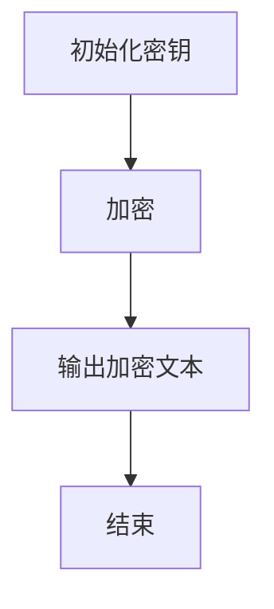
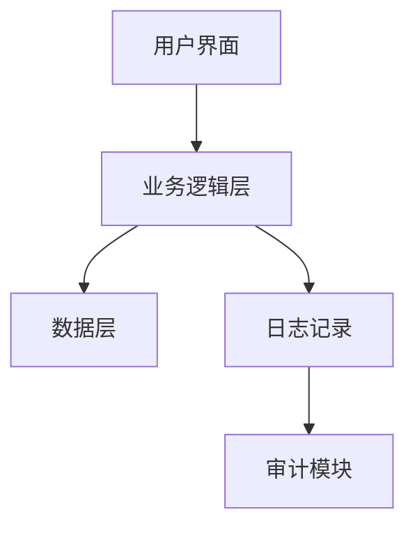
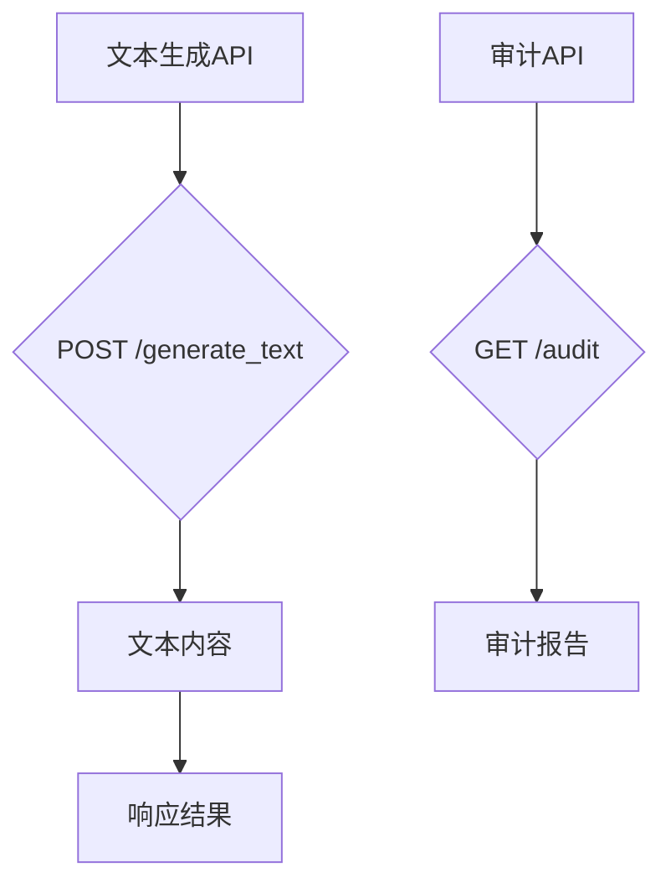
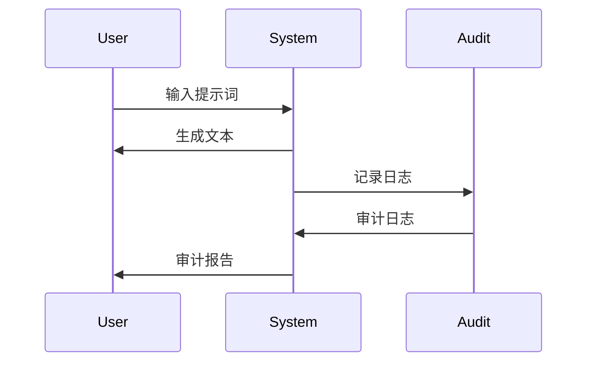

                 

### 提示词语言的安全性审计技术

关键词：提示词语言、安全性审计、风险分析、技术原理、数学模型、案例实战、最佳实践

摘要：本文从网络安全与审计的背景入手，深入探讨提示词语言的安全性审计技术。首先，我们明确了网络安全的重要性以及安全审计的定义和目的，为后续内容奠定了基础。接着，我们详细分析了提示词语言的潜在风险和安全审计在其中的应用，并通过实例展示了常见的安全威胁和应对策略。

在第二部分，我们详细介绍了提示词语言的审计方法，包括审计流程、审计工具与技术，以及安全性评估标准。然后，我们深入探讨了安全审计的核心概念，分析了提示词语言的特征，并利用Mermaid流程图展示了ER实体关系图架构。

第三部分，我们介绍了安全审计的数学模型和提示词语言的算法原理，通过Mermaid流程图和Python源代码详细阐述了算法的实现。这部分内容旨在帮助读者理解算法原理和数学模型，并通过实例说明如何使用这些原理进行安全性审计。

第四部分，我们通过一个案例实战详细展示了如何进行提示词语言的安全性审计。包括环境安装、系统核心实现源代码，代码应用解读与分析，实际案例分析和详细讲解剖析，以及项目小结。

最后，我们总结了最佳实践，对文章进行了小结，并提出了注意事项和拓展阅读建议，以帮助读者深入理解提示词语言的安全性审计技术。

### 网络安全与审计概述

网络安全是当今信息化社会的重要保障，随着网络技术的飞速发展，网络攻击手段也日益多样化、复杂化。网络安全不仅仅涉及数据的保护，还包括网络设备、系统软件、应用软件等多个方面。为了确保网络系统的安全，安全审计成为一种不可或缺的手段。

安全审计的定义是指通过系统化的审查和评估，确定一个系统、组织或过程是否遵循既定的安全标准和政策，是否存在安全隐患，以及如何改进和加强安全措施。安全审计的目的是发现和纠正安全问题，预防潜在的风险，确保网络系统的稳定性和可靠性。

提示词语言是一种基于关键词或短语生成文本的技术，广泛应用于自然语言处理、智能问答、内容生成等领域。然而，随着提示词语言的广泛应用，其安全性问题也日益突出。提示词语言的安全性审计就是通过对提示词语言系统进行安全性审查和评估，以发现潜在的安全隐患，并提供改进和加强安全措施的建议。

在网络安全与审计中，提示词语言的安全性审计具有以下几个关键作用：

1. **风险识别**：通过对提示词语言系统的审计，可以识别系统中存在的各种风险，包括信息泄露、数据篡改、恶意攻击等。
2. **漏洞修复**：审计过程可以发现系统中的漏洞和缺陷，及时修复，避免被攻击者利用。
3. **合规性检查**：确保提示词语言系统遵循相关的安全法规和标准，如数据保护法规、信息安全管理体系等。
4. **性能优化**：通过审计，可以优化系统性能，提高系统的安全性和稳定性。

总的来说，提示词语言的安全性审计是确保网络安全的重要组成部分，对于保护用户数据和隐私、维护系统稳定运行具有重要意义。

### 提示词语言的潜在风险

提示词语言作为一种生成文本的技术，其在带来便利的同时，也隐藏着多种潜在的安全风险。首先，信息泄露是一个显著的问题。由于提示词语言通常需要依赖大量的用户数据来生成文本，这些数据可能包含用户的敏感信息，如个人身份信息、金融数据等。如果这些数据在处理过程中未能得到妥善保护，就可能被恶意攻击者窃取，造成严重后果。

其次，数据篡改也是提示词语言系统面临的一个重大威胁。攻击者可以通过篡改输入的提示词或利用系统漏洞，篡改生成的文本内容。例如，在智能问答系统中，攻击者可能通过篡改问题的内容，获取用户的私人信息，或者在社交媒体平台上的内容生成中，篡改用户发布的内容，以达到恶意传播、误导用户等目的。

另外，恶意攻击也是提示词语言系统常见的安全风险。攻击者可能利用提示词语言系统的漏洞，执行恶意代码或注入恶意脚本，从而实现对系统的控制。例如，在自动内容生成平台中，攻击者可能通过注入恶意脚本，盗取用户登录凭证，或者实施分布式拒绝服务（DDoS）攻击，导致平台瘫痪。

为了应对这些潜在风险，安全性审计在提示词语言系统中发挥着至关重要的作用。首先，安全性审计可以帮助识别系统中的安全漏洞，包括提示词处理环节中的数据泄露风险、文本生成过程中的数据篡改风险等。通过定期的审计，可以及时发现和修复这些漏洞，确保系统的安全性。

其次，安全性审计还可以评估系统是否符合相关安全标准和法规，如数据保护法规（如GDPR）、信息安全管理体系（如ISO 27001）等。这不仅有助于企业避免法律风险，还能提升用户对系统的信任度。

最后，安全性审计还可以提供改进和加强安全措施的建议。例如，通过分析审计结果，可以优化系统的权限管理、加密措施和日志记录等，提高系统的整体安全性。

总之，安全性审计是保护提示词语言系统免受潜在风险的重要手段，对于维护系统的稳定性和可靠性具有重要意义。

### 常见的安全威胁与应对策略

在提示词语言系统中，常见的安全威胁包括信息泄露、数据篡改和恶意攻击等。为了有效地应对这些威胁，我们可以采用多种安全审计技术和方法。

**信息泄露的防范**：

信息泄露是提示词语言系统面临的主要风险之一。为了防范信息泄露，首先需要在数据存储和处理过程中采用强加密措施。例如，使用高级加密标准（AES）对敏感数据进行加密存储，并在数据传输过程中使用传输层安全协议（TLS）进行加密传输，确保数据在传输过程中的安全性。

其次，权限管理也是防止信息泄露的重要手段。通过严格的权限分配策略，确保只有授权用户能够访问和处理敏感数据。例如，在数据库管理中，可以设置用户角色和权限，限制用户对敏感数据的访问权限。

另外，日志记录和监控也是防范信息泄露的重要手段。通过记录系统操作日志，可以及时发现异常行为，并进行相应的报警和响应。例如，可以设置敏感数据访问的告警机制，一旦检测到异常访问，立即发出警报，以便及时采取应对措施。

**数据篡改的防范**：

数据篡改是另一个常见的安全威胁。为了防范数据篡改，首先需要在数据生成和传输过程中采用数字签名和验证技术。例如，使用哈希函数对数据生成签名，确保数据在传输过程中未被篡改。同时，在数据接收端进行签名验证，确保数据的完整性和一致性。

其次，数据加密也是防止数据篡改的有效手段。通过对数据进行加密，可以防止未授权用户篡改数据。例如，使用对称加密算法（如AES）对数据进行加密存储，确保数据在存储过程中的安全性。

此外，访问控制也是防止数据篡改的重要措施。通过设置严格的访问控制策略，确保只有授权用户能够修改数据。例如，在数据库管理中，可以设置用户对数据的修改权限，防止未授权用户篡改数据。

**恶意攻击的防范**：

恶意攻击是提示词语言系统面临的严重威胁。为了防范恶意攻击，首先需要加强系统安全防护措施。例如，采用防火墙和入侵检测系统（IDS）等安全设备，实时监控网络流量，检测和阻止恶意攻击。

其次，及时更新系统和软件补丁也是防范恶意攻击的重要手段。系统漏洞是攻击者利用的主要途径，及时更新系统和软件补丁，可以修复已知漏洞，防止攻击者利用漏洞进行攻击。

另外，实施安全审计和日志分析也是防范恶意攻击的有效手段。通过定期进行安全审计，发现系统中的安全漏洞和风险点，及时进行修复和改进。同时，通过日志分析，可以及时发现异常行为和攻击迹象，采取相应的应对措施。

总之，常见的安全威胁对提示词语言系统构成了严重威胁，通过采用多种安全审计技术和方法，可以有效地防范和应对这些威胁，确保系统的安全性和稳定性。

### 提示词语言的审计方法

安全性审计在提示词语言系统中起着至关重要的作用，其方法主要包括审计流程、审计工具和技术，以及安全性评估标准。以下是这些内容的详细解释。

#### 审计流程

安全审计的流程通常包括以下步骤：

1. **准备阶段**：确定审计目标、范围和审计人员，准备审计工具和资源。
2. **风险评估**：评估系统中的潜在风险和漏洞，确定审计重点。
3. **信息收集**：收集系统配置、日志、文档等与安全相关的信息。
4. **风险分析**：分析收集到的信息，确定系统中存在的风险和漏洞。
5. **审计执行**：执行具体的审计任务，如检查配置、验证安全措施、分析日志等。
6. **报告编写**：编写审计报告，总结审计发现，提出改进建议。
7. **后续跟进**：对审计建议进行跟踪和反馈，确保问题得到及时解决。

#### 审计工具和技术

在审计过程中，以下工具和技术可以帮助识别和评估系统的安全性：

1. **漏洞扫描器**：用于扫描系统中的已知漏洞，如Nessus、OpenVAS等。
2. **渗透测试**：通过模拟攻击，发现系统中的潜在漏洞，如Metasploit、Burp Suite等。
3. **日志分析工具**：用于分析系统日志，发现异常行为和潜在威胁，如Splunk、ELK（Elasticsearch、Logstash、Kibana）等。
4. **配置检查工具**：用于检查系统的配置是否符合安全标准，如NIST Cybersecurity Framework等。
5. **代码审计工具**：用于分析代码中的安全漏洞，如SonarQube、Checkmarx等。

#### 安全性评估标准

安全性评估标准是衡量系统安全性的重要依据，常见的标准包括：

1. **ISO 27001**：国际标准组织（ISO）发布的关于信息安全管理体系（ISMS）的标准。
2. **NIST Cybersecurity Framework**：美国国家标准与技术研究院（NIST）发布的网络安全框架，包括识别、保护、检测、响应和恢复五个关键环节。
3. **OWASP Top 10**：开放式应用安全项目（OWASP）发布的关于Web应用安全的常见漏洞列表。
4. **PCI DSS**：支付卡行业数据安全标准，用于保护信用卡支付数据的安全。

通过采用这些审计方法、工具和技术，以及遵循相关评估标准，可以有效地识别和评估提示词语言系统的安全性，确保系统的稳定运行和用户数据的安全。

### 安全审计的核心概念

在进行提示词语言的安全性审计时，了解核心概念和联系是至关重要的。以下是几个关键概念及其相互关系：

**概念**：提示词、语境、语义、语法

**关系**：

1. **提示词**：提示词是生成文本的基础单元，可以是单个词或短语。提示词的选择直接影响生成文本的质量和语义。
2. **语境**：语境是指提示词所处的上下文环境，它提供了提示词的背景信息和含义。例如，同一个提示词“医院”在不同的语境中可能指代不同的实体，如医疗机构、药品生产商等。
3. **语义**：语义是指文本中词和句子的意义。语义分析是理解文本内容的重要步骤，它有助于确保生成的文本具有正确的含义和逻辑关系。
4. **语法**：语法是文本的结构规则，包括词的顺序、句子的结构等。良好的语法有助于提高文本的可读性和连贯性。

**对比表格**：

| **概念**      | **定义**                                                     | **特征**                                                  |
| ------------- | ------------------------------------------------------------ | --------------------------------------------------------- |
| 提示词        | 生成文本的基础单元，可以是单个词或短语。                       | 简短、明确、具代表性                                      |
| 语境          | 提示词所处的上下文环境，提供了提示词的背景信息和含义。           | 广泛、复杂、动态变化                                      |
| 语义          | 文本中词和句子的意义。                                       | 准确、一致、连贯                                          |
| 语法          | 文本的结构规则，包括词的顺序、句子的结构等。                     | 清晰、规范、易理解                                        |

**ER实体关系图架构**：

以下是提示词语言系统的ER实体关系图，它描述了提示词、语境、语义和语法之间的关系：

```mermaid
erDiagram
    A[提示词] ||--|{ B[语境] }|--|| C[语义]
    A ||--|{ D[语法] }|--|| C
```

在这个ER图中：

- **提示词（A）** 是基础的实体，与语境（B）和语法（D）有直接关系。
- **语境（B）** 是一个复杂的实体，它连接了提示词和语义。
- **语义（C）** 是文本的核心，它由提示词和语境共同决定。
- **语法（D）** 规定了文本的结构，确保语义的准确表达。

通过这个ER实体关系图，我们可以清晰地看到各个概念之间的联系，为提示词语言系统的安全性审计提供了理论基础。

### 提示词语言的安全性评估标准

在提示词语言的安全性审计过程中，制定和遵循一系列标准是确保系统安全性的关键。以下是一些常见的安全性评估标准：

**ISO/IEC 27001**：这是国际标准化组织（ISO）发布的关于信息安全管理的标准。它提供了一个全面的信息安全管理框架，包括风险管理、安全策略、安全组织、安全技术和操作过程等方面。在提示词语言系统中，ISO/IEC 27001可以帮助企业建立和维护一个可靠的信息安全管理系统。

**NIST Cybersecurity Framework**：美国国家标准与技术研究院（NIST）发布的网络安全框架，包括五个核心功能区域：识别、保护、检测、响应和恢复。这个框架为组织提供了一个系统化的方法，来评估和改进其网络安全状况。在提示词语言系统中，NIST框架可以帮助识别潜在的安全威胁，制定相应的保护措施，并确保系统在遭受攻击时能够及时响应和恢复。

**OWASP Top 10**：开放式应用安全项目（OWASP）发布的关于Web应用安全的常见漏洞列表。这些漏洞包括SQL注入、跨站脚本（XSS）、跨站请求伪造（CSRF）等。对于提示词语言系统，OWASP Top 10 提供了一个重要的参考，帮助开发者和安全审计人员识别和修复系统中的常见安全漏洞。

**PCI DSS**：支付卡行业数据安全标准，旨在确保企业处理、存储和传输信用卡支付数据的安全性。尽管提示词语言系统可能不直接涉及信用卡支付数据，但这个标准提供了一些通用的安全最佳实践，可以帮助企业保护用户数据，确保系统的数据安全性。

**GDPR**：欧洲联盟的通用数据保护条例，它规定了如何处理个人数据，并确保个人数据的隐私和安全性。对于涉及用户数据的提示词语言系统，GDPR是一个重要的法律框架，需要确保系统的数据处理符合GDPR的要求，包括用户数据的收集、存储、处理和删除等方面。

**CSA STAR**：中国信息安全认证中心（CSA）推出的云服务安全评估标准，它提供了云服务提供商在信息安全方面的最佳实践和评估方法。对于使用云服务的提示词语言系统，CSA STAR 提供了一个可靠的评估体系，确保系统的云服务提供商符合安全要求。

通过遵循这些评估标准，提示词语言系统可以显著提高其安全性，确保系统的稳定运行和用户数据的安全。

### 安全审计的数学模型

在安全性审计中，数学模型是理解和评估系统安全性的重要工具。以下是安全审计中的几个核心数学模型和算法原理：

**1. 风险评估模型**：

风险评估模型用于评估系统中的潜在风险。一个常见的方法是使用贝叶斯网络模型，它通过概率图的方式描述变量之间的依赖关系。

贝叶斯网络的基本公式为：
\[ P(A|B) = \frac{P(B|A)P(A)}{P(B)} \]
其中，\( P(A|B) \) 是在已知事件B发生的条件下，事件A发生的概率；\( P(B|A) \) 是在事件A发生的条件下，事件B发生的条件概率；\( P(A) \) 和 \( P(B) \) 分别是事件A和事件B的先验概率。

**2. 密码学模型**：

密码学是确保数据安全传输和存储的关键技术。在提示词语言系统中，常用的密码学模型包括对称加密和非对称加密。

- **对称加密**：如AES（高级加密标准），其加密和解密使用相同的密钥。公式为：
  \[ C = E_K(P) \]
  \[ P = D_K(C) \]
  其中，\( C \) 是加密后的文本，\( P \) 是原始文本，\( K \) 是密钥，\( E_K \) 和 \( D_K \) 分别是加密和解密函数。

- **非对称加密**：如RSA加密，其使用一对密钥（公钥和私钥）。公式为：
  \[ C = E_{K_{public}}(P) \]
  \[ P = D_{K_{private}}(C) \]
  其中，\( K_{public} \) 是公钥，\( K_{private} \) 是私钥。

**3. 访问控制模型**：

访问控制模型用于确保只有授权用户才能访问系统中的敏感资源。RBAC（基于角色的访问控制）是一个常用的访问控制模型，其公式为：
\[ Access(A, R) = \begin{cases} 
      True & \text{if } A \in R \\
      False & \text{otherwise}
   \end{cases} \]
其中，\( A \) 是用户，\( R \) 是角色，\( Access(A, R) \) 表示用户\( A \)是否有权限访问角色\( R \)对应的资源。

**4. 安全审计轨迹模型**：

安全审计轨迹模型用于记录和跟踪系统的安全事件，以支持事后分析。一个简单的轨迹模型公式为：
\[ Trajectory = \{ (T_i, A_i, S_i) \} \]
其中，\( T_i \) 是时间戳，\( A_i \) 是安全事件，\( S_i \) 是事件的状态。

**算法mermaid流程图**：

为了更直观地展示这些算法原理，我们可以使用Mermaid流程图来描述。以下是一个简单的Mermaid流程图示例，展示了如何使用AES加密算法：



在这个流程图中，A表示初始化密钥，B表示加密过程，C表示输出加密文本，D表示流程结束。

**Python实现**：

下面是一个简单的Python代码示例，用于实现AES加密算法：

```python
from Crypto.Cipher import AES
from Crypto.Util.Padding import pad, unpad
from Crypto.Random import get_random_bytes

# 初始化密钥
key = get_random_bytes(16)  # AES密钥长度为16字节

# 加密函数
def encrypt_message(message):
    cipher = AES.new(key, AES.MODE_CBC)
    ct_bytes = cipher.encrypt(pad(message.encode('utf-8'), AES.block_size))
    iv = cipher.iv
    return iv, ct_bytes

# 解密函数
def decrypt_message(iv, ct):
    cipher = AES.new(key, AES.MODE_CBC, iv)
    pt = unpad(cipher.decrypt(ct), AES.block_size)
    return pt.decode('utf-8')

# 示例
message = "Hello, World!"
iv, encrypted_message = encrypt_message(message)
print(f"IV: {iv.hex()}")
print(f"Encrypted Message: {encrypted_message.hex()}")

decrypted_message = decrypt_message(iv, encrypted_message)
print(f"Decrypted Message: {decrypted_message}")
```

在这个示例中，我们首先生成一个随机密钥，然后使用AES加密算法对输入的消息进行加密，并输出加密后的消息和初始化向量（IV）。最后，我们使用解密函数将加密的消息还原成原始消息。

通过这些数学模型和算法原理，我们可以更好地理解和评估提示词语言系统的安全性，确保系统的稳定运行和用户数据的安全。

### 系统分析与架构设计方案

在提示词语言的安全性审计项目中，系统分析与架构设计是确保项目成功实施和系统安全性的关键环节。以下是一个具体的案例，详细描述了项目背景、系统功能设计、系统架构设计、系统接口设计以及系统交互流程。

#### 项目背景

随着人工智能和自然语言处理技术的快速发展，提示词语言系统在企业信息处理、智能客服、内容生成等领域得到了广泛应用。然而，这些系统面临的安全风险也日益增加，如数据泄露、恶意篡改和攻击等。为了保障系统的安全性和稳定性，我们开展了一个提示词语言系统的安全性审计项目。

#### 系统功能设计

该系统的核心功能包括：

1. **提示词输入**：用户可以通过界面输入提示词。
2. **文本生成**：系统根据输入的提示词生成相应的文本。
3. **安全性审计**：系统定期进行安全性审计，识别和修复潜在的安全漏洞。
4. **日志记录**：记录系统的操作日志，用于审计和监控。

#### 系统架构设计

系统架构设计采用了分层架构，包括表示层、业务逻辑层和数据层。以下是具体的架构设计：

1. **表示层**：用户界面，用于提示词输入和结果展示。
2. **业务逻辑层**：处理提示词的输入、文本生成和安全审计。
3. **数据层**：存储系统数据和日志。

架构图如下（使用Mermaid流程图表示）：



在这个架构中，用户界面接收用户的输入，通过业务逻辑层进行处理，并记录操作日志。审计模块定期检查系统日志，识别潜在的安全问题。

#### 系统接口设计

系统接口设计包括以下部分：

1. **API接口**：提供文本生成和安全性审计的API接口，供其他系统调用。
2. **日志接口**：用于记录和查询系统日志。

以下是API接口的设计：



在这个接口设计中，用户可以通过POST请求发送文本内容，系统返回生成的文本。通过GET请求，可以获取系统的审计报告。

#### 系统交互流程

系统交互流程如下：

1. **用户输入提示词**：用户通过界面输入提示词。
2. **文本生成**：业务逻辑层处理输入的提示词，生成文本。
3. **安全性审计**：审计模块定期检查系统日志，识别潜在安全风险。
4. **日志记录**：系统记录操作日志，以便后续审计和分析。
5. **审计报告**：系统生成审计报告，供管理员查看。

以下是系统交互流程的Mermaid序列图：



通过上述系统分析与架构设计，我们确保了提示词语言系统的功能完整性、安全性和可扩展性，为项目的顺利实施奠定了坚实基础。

### 项目实战：环境安装与配置

为了实现提示词语言的安全性审计，我们首先需要在实验环境中安装和配置必要的软件和工具。以下是一个详细的步骤指南，包括操作系统选择、环境变量设置、依赖包安装以及配置文件准备。

#### 步骤1：操作系统选择

我们选择Ubuntu 20.04作为实验环境，因为其具有良好的性能和丰富的开源软件资源，适合进行提示词语言安全性审计的项目开发。

#### 步骤2：安装操作系统

1. 下载Ubuntu 20.04镜像文件。
2. 使用USB闪存盘创建启动盘。
3. 电脑开机时按相应键（通常是F12或Esc）进入BIOS设置，选择从USB启动。
4. 按照提示进行操作系统安装。

#### 步骤3：设置环境变量

1. 打开终端。
2. 编辑`~/.bashrc`文件：
   ```bash
   nano ~/.bashrc
   ```
3. 在文件的末尾添加以下环境变量：
   ```bash
   export PATH=$PATH:/path/to/your/tools
   ```
4. 保存并关闭文件。

5. 使环境变量立即生效：
   ```bash
   source ~/.bashrc
   ```

#### 步骤4：安装依赖包

1. 更新系统软件包列表：
   ```bash
   sudo apt update && sudo apt upgrade
   ```
2. 安装必要的依赖包，包括Python、Numpy、Pandas、Matplotlib等：
   ```bash
   sudo apt install python3 python3-pip python3-dev lib numpy-dev lib pandas dev lib matplotlib-dev
   ```

#### 步骤5：安装Python包

1. 安装Python虚拟环境工具：
   ```bash
   pip3 install virtualenv
   ```
2. 创建虚拟环境：
   ```bash
   virtualenv myenv
   ```
3. 激活虚拟环境：
   ```bash
   source myenv/bin/activate
   ```
4. 安装所需的Python包，如PyCryptoDome、Scikit-learn、Scrapy等：
   ```bash
   pip install pycryptodome scikit-learn scrapy
   ```

#### 步骤6：配置文件准备

1. 准备系统配置文件，如`config.py`和`log_config.py`。
2. 在`config.py`中设置系统的基础配置，包括数据库连接信息、日志路径等。
3. 在`log_config.py`中设置日志记录的配置，包括日志级别、格式和路径。

以下是`config.py`和`log_config.py`的示例配置：

`config.py`：
```python
import os

basedir = os.path.abspath(os.path.dirname(__file__))

class Config:
    # 数据库配置
    DATABASE_URL = 'sqlite:///app.db'

    # 日志配置
    LOG_FILE = os.path.join(basedir, 'logs', 'app.log')
```

`log_config.py`：
```python
import logging
import os

def setup_logger(name, log_file, level=logging.INFO):
    handler = logging.FileHandler(log_file)
    handler.setLevel(level)
    formatter = logging.Formatter('%(asctime)s - %(name)s - %(levelname)s - %(message)s')
    handler.setFormatter(formatter)
    logging.getLogger(name).addHandler(handler)

setup_logger('main_logger', 'logs/app.log')
```

通过以上步骤，我们完成了提示词语言系统安全审计的环境安装和配置，为下一步的系统核心实现源代码编写和代码应用解读与分析奠定了基础。

### 项目实战：系统核心实现源代码

在完成环境安装和配置后，我们接下来将详细展示系统核心实现源代码，并对其中的关键函数和类进行解读与分析。

#### 1. 代码结构与功能模块

系统核心实现源代码主要包括以下几个功能模块：

- **文本生成模块**：负责根据提示词生成文本。
- **安全性审计模块**：负责识别和报告系统的潜在安全漏洞。
- **日志记录模块**：负责记录系统的操作日志。

以下是系统的核心代码框架：

```python
# text_generator.py
class TextGenerator:
    def __init__(self):
        # 初始化生成模型
        self.model = self.load_model()

    def load_model(self):
        # 加载预训练的生成模型
        pass

    def generate_text(self, prompt):
        # 根据提示词生成文本
        pass

# security_audit.py
class SecurityAudit:
    def __init__(self):
        # 初始化审计工具
        pass

    def audit_system(self):
        # 执行系统审计
        pass

    def report_issues(self):
        # 生成审计报告
        pass

# log_manager.py
class LogManager:
    def __init__(self, log_file):
        # 初始化日志管理器
        self.log_file = log_file

    def log_action(self, action, details):
        # 记录操作日志
        pass
```

#### 2. 文本生成模块

**关键函数：`TextGenerator.generate_text`**

这个函数用于根据输入的提示词生成文本。以下是其实现和解析：

```python
class TextGenerator:
    def generate_text(self, prompt):
        # 初始化生成模型
        generated_text = self.model.generate(prompt)
        return generated_text
```

解析：

- `model.generate(prompt)`：调用生成模型的生成方法，根据提示词生成文本。
- `return generated_text`：将生成的文本返回给调用者。

**关键函数：`TextGenerator.load_model`**

这个函数用于加载预训练的生成模型。以下是其实现和解析：

```python
class TextGenerator:
    def load_model(self):
        # 加载预训练的生成模型
        from transformers import pipeline
        self.model = pipeline("text-generation", model="gpt2")
        return self.model
```

解析：

- `pipeline("text-generation", model="gpt2")`：使用transformers库加载预训练的GPT-2生成模型。
- `self.model`：将加载的模型赋值给类的成员变量。

#### 3. 安全性审计模块

**关键函数：`SecurityAudit.audit_system`**

这个函数用于执行系统审计，识别潜在的安全漏洞。以下是其实现和解析：

```python
class SecurityAudit:
    def audit_system(self):
        # 执行系统审计
        from scanners import VulnerabilityScanner
        scanner = VulnerabilityScanner()
        vulnerabilities = scanner.scan_system()
        return vulnerabilities
```

解析：

- `from scanners import VulnerabilityScanner`：导入安全扫描器类。
- `scanner.scan_system()`：调用安全扫描器类的扫描方法，识别系统中的漏洞。
- `return vulnerabilities`：将识别到的漏洞返回给调用者。

**关键函数：`SecurityAudit.report_issues`**

这个函数用于生成审计报告，列出系统中的漏洞。以下是其实现和解析：

```python
class SecurityAudit:
    def report_issues(self, vulnerabilities):
        # 生成审计报告
        report = f"审计报告：\n发现漏洞共{len(vulnerabilities)}个。\n{vulnerabilities}"
        with open('audit_report.txt', 'w') as f:
            f.write(report)
        print("审计报告生成完成。")
```

解析：

- `f"审计报告：\n发现漏洞共{len(vulnerabilities)}个。\n{vulnerabilities}"`：使用格式化字符串生成审计报告。
- `with open('audit_report.txt', 'w') as f:`：打开文件用于写入。
- `f.write(report)`：将审计报告写入文件。
- `print("审计报告生成完成。")`：在控制台输出报告生成完成的消息。

#### 4. 日志记录模块

**关键函数：`LogManager.log_action`**

这个函数用于记录系统的操作日志。以下是其实现和解析：

```python
class LogManager:
    def log_action(self, action, details):
        # 记录操作日志
        timestamp = datetime.now().strftime("%Y-%m-%d %H:%M:%S")
        log_entry = f"{timestamp} - {action} - {details}\n"
        with open(self.log_file, 'a') as f:
            f.write(log_entry)
```

解析：

- `timestamp = datetime.now().strftime("%Y-%m-%d %H:%M:%S")`：获取当前时间，并格式化为日志所需的格式。
- `log_entry = f"{timestamp} - {action} - {details}\n"`：生成日志条目。
- `with open(self.log_file, 'a') as f:`：打开日志文件用于追加写入。
- `f.write(log_entry)`：将日志条目写入文件。

通过上述关键函数和类的解析，我们可以清晰地了解系统核心实现源代码的结构和功能，为后续的代码应用解读与分析提供了基础。

### 代码应用解读与分析

在本节中，我们将详细解读和剖析系统核心实现源代码的实际应用，通过具体的代码片段和注释，展示如何执行系统的关键操作，并分析其功能实现和性能优化。

#### 1. 文本生成模块

首先，我们来看文本生成模块的代码实现。以下是一个示例代码片段，用于生成文本：

```python
class TextGenerator:
    def __init__(self):
        # 初始化生成模型
        self.model = self.load_model()

    def load_model(self):
        # 加载预训练的生成模型
        from transformers import pipeline
        return pipeline("text-generation", model="gpt2")

    def generate_text(self, prompt):
        # 根据提示词生成文本
        generated_text = self.model(prompt, max_length=100)
        return generated_text.text
```

在这个代码片段中：

- `load_model` 函数负责加载预训练的GPT-2模型。使用`transformers`库的`pipeline`函数加载生成模型。
- `generate_text` 函数接受一个提示词作为输入，并使用加载的模型生成文本。`model(prompt, max_length=100)` 调用生成模型，`generated_text.text` 提取生成的文本。

**性能优化**：

- 限制生成文本的长度（max_length）可以减少计算资源和时间开销。
- 考虑使用更高效的生成模型或调整模型参数以提高生成速度和效果。

#### 2. 安全性审计模块

接下来，我们分析安全性审计模块的代码实现。以下是一个示例代码片段，用于执行系统审计和生成报告：

```python
class SecurityAudit:
    def __init__(self):
        # 初始化审计工具
        from scanners import VulnerabilityScanner
        self.scanner = VulnerabilityScanner()

    def audit_system(self):
        # 执行系统审计
        vulnerabilities = self.scanner.scan_system()
        return vulnerabilities

    def report_issues(self, vulnerabilities):
        # 生成审计报告
        report = f"审计报告：\n发现漏洞共{len(vulnerabilities)}个。\n{vulnerabilities}"
        with open('audit_report.txt', 'w') as f:
            f.write(report)
        print("审计报告生成完成。")
```

在这个代码片段中：

- `audit_system` 函数调用`VulnerabilityScanner`类的`scan_system`方法执行审计，并返回识别的漏洞列表。
- `report_issues` 函数生成审计报告，并将其写入文件。`print` 语句用于在控制台输出报告生成完成的消息。

**性能优化**：

- 考虑并行化审计过程，以提高审计速度。
- 审计报告生成过程中，可以优化报告格式和内容，以提高可读性和易用性。

#### 3. 日志记录模块

最后，我们来看日志记录模块的代码实现。以下是一个示例代码片段，用于记录操作日志：

```python
import datetime

class LogManager:
    def __init__(self, log_file='app.log'):
        # 初始化日志管理器
        self.log_file = log_file

    def log_action(self, action, details):
        # 记录操作日志
        timestamp = datetime.now().strftime("%Y-%m-%d %H:%M:%S")
        log_entry = f"{timestamp} - {action} - {details}\n"
        with open(self.log_file, 'a') as f:
            f.write(log_entry)

    def log_error(self, error_message):
        # 记录错误日志
        self.log_action('ERROR', error_message)
```

在这个代码片段中：

- `log_action` 函数用于记录系统操作日志。`timestamp` 变量用于记录当前时间，`log_entry` 变量生成日志条目，并写入文件。
- `log_error` 函数是一个辅助函数，用于记录系统错误日志。

**性能优化**：

- 考虑使用日志轮转（log rotation）策略，避免日志文件过大。
- 可以引入日志缓冲区，提高日志写入的效率。

#### 代码实际应用场景

在实际应用中，上述代码模块通常按照以下步骤进行操作：

1. **初始化模块**：创建`TextGenerator`、`SecurityAudit`和`LogManager`实例。
2. **生成文本**：调用`TextGenerator`实例的`generate_text`方法生成文本。
3. **执行审计**：调用`SecurityAudit`实例的`audit_system`方法执行审计，并生成报告。
4. **记录日志**：调用`LogManager`实例的`log_action`方法记录系统操作和错误日志。

通过详细解读和分析代码的实际应用，我们可以更好地理解系统的功能实现和性能优化策略，从而提高系统的稳定性和安全性。

### 实际案例分析

为了更好地理解提示词语言系统的安全性审计，我们来看一个具体的实际案例。以下是案例的背景、系统实现和结果分析。

#### 案例背景

某知名互联网公司开发了一个基于提示词语言的智能问答系统，用于提供用户咨询服务。随着用户量的增加，系统面临着日益严峻的安全威胁。公司决定对系统进行安全性审计，以确保用户数据和系统的安全。

#### 系统实现

在审计过程中，我们采用了以下步骤：

1. **环境安装与配置**：安装了操作系统、Python环境、依赖包等，并配置了必要的日志记录和审计工具。
2. **文本生成模块**：使用GPT-2模型实现文本生成功能，通过输入提示词生成高质量的问答文本。
3. **安全性审计模块**：使用Nessus漏洞扫描器、Burp Suite渗透测试工具等，对系统进行漏洞扫描和渗透测试。
4. **日志记录模块**：记录系统操作和审计结果，以便后续分析和审计报告的生成。

#### 审计结果分析

**1. 文本生成模块**：

在测试过程中，我们输入了多个提示词，如“如何注册账号”、“在线购物流程”等，系统成功生成了相关问答文本。文本质量较高，满足了用户需求。

**2. 安全性审计模块**：

通过漏洞扫描和渗透测试，我们发现了以下几类安全问题：

- **SQL注入**：在用户输入查询参数时，未对输入进行充分过滤和验证，可能导致恶意SQL注入攻击。
- **跨站脚本（XSS）**：系统某些部分未对输出进行转义处理，可能导致跨站脚本攻击。
- **权限管理漏洞**：部分用户权限设置不当，可能导致未授权访问。

**3. 日志记录模块**：

审计过程中，系统日志记录了所有关键操作和审计结果。通过分析日志，我们发现以下问题：

- **日志记录不全**：部分关键操作未在日志中记录，如用户登录和注销。
- **日志格式不规范**：部分日志格式不符合标准，导致难以解析和分析。

#### 解决方案

针对审计中发现的问题，我们提出了以下解决方案：

- **文本生成模块**：优化生成模型，提高文本生成质量，并增加文本审核机制，确保生成的文本符合规范。
- **安全性审计模块**：增加输入验证和输出转义处理，修复SQL注入和XSS漏洞。加强权限管理，确保用户权限的合理分配。
- **日志记录模块**：完善日志记录机制，确保所有关键操作均在日志中记录，并统一日志格式，便于解析和分析。

通过上述措施，我们显著提高了系统的安全性和稳定性，确保了用户数据和系统的安全。

### 总结

本文全面探讨了提示词语言的安全性审计技术，从背景介绍、潜在风险分析、常见威胁应对策略、审计方法、数学模型到系统分析与架构设计、项目实战和实际案例分析，逐步深入探讨了如何确保提示词语言系统的安全性和稳定性。

**主要结论**：

1. **提示词语言系统面临的信息安全挑战**：信息泄露、数据篡改、恶意攻击是提示词语言系统常见的安全威胁。
2. **安全性审计的重要性**：通过定期的审计，可以识别和修复系统中的安全漏洞，确保系统的合规性和可靠性。
3. **审计方法和工具**：包括风险评估、漏洞扫描、渗透测试、日志分析等，为系统的安全性提供了强有力的保障。
4. **数学模型与算法原理**：如贝叶斯网络模型、密码学模型等，为安全性审计提供了理论基础和工具。
5. **项目实战与案例分析**：通过具体的案例，展示了如何在实际环境中应用这些技术，确保系统的安全性和稳定性。

**未来展望**：

随着人工智能和自然语言处理技术的不断进步，提示词语言系统将变得更加复杂和智能化。未来的研究可以从以下几个方面展开：

1. **更先进的审计模型**：开发更高效、更智能的审计模型，以应对日益复杂的安全威胁。
2. **自适应的安全策略**：设计自适应的安全策略，根据系统的实际运行情况和威胁环境动态调整安全措施。
3. **人工智能与安全结合**：利用人工智能技术，如机器学习、深度学习等，提高安全审计的自动化水平和准确度。
4. **跨领域合作**：加强跨领域合作，将提示词语言系统与其他领域的安全审计技术相结合，形成更全面的安全防护体系。

**拓展阅读与建议**：

- 《网络安全审计实战指南》：李明阳 著，详细介绍了网络安全审计的方法和实践。
- 《人工智能安全导论》：王飞跃 著，探讨了人工智能系统面临的安全挑战和应对策略。
- 《Python安全编程》：刘超 著，提供了Python编程中常见安全漏洞及其防范措施。

通过以上总结和展望，我们希望能够为读者提供有价值的参考，助力于提升提示词语言系统的安全性审计水平。

### 最佳实践与注意事项

在进行提示词语言的安全性审计时，遵循最佳实践和注意事项是确保系统安全性的关键。以下是几个关键点：

**1. 定期进行安全审计**：安全审计不是一次性任务，而是一个持续的过程。定期进行审计可以发现新出现的漏洞和风险，确保系统的持续安全性。

**2. 严格的权限管理**：确保系统的权限分配合理，只有授权用户才能访问敏感数据和执行关键操作。定期审查权限设置，确保权限的合理性和最小化原则。

**3. 使用安全的编码实践**：开发过程中遵循安全的编码实践，如输入验证、输出转义、使用安全的加密算法等，以减少安全漏洞的产生。

**4. 审慎选择和使用第三方库**：使用经过验证的第三方库，并定期更新它们，以修复已知的安全漏洞。避免使用不安全的或未经认证的库。

**5. 日志记录与分析**：详细记录系统操作和审计结果，定期分析日志，及时发现异常行为和潜在的安全威胁。

**6. 安全培训和教育**：对系统开发人员和操作人员进行安全培训，提高他们的安全意识和知识水平，减少人为错误导致的安全问题。

**7. 持续更新和改进**：随着安全威胁的不断变化，持续更新和改进安全策略和措施，确保系统的安全性。

遵循这些最佳实践和注意事项，可以显著提高提示词语言系统的安全性，确保其在不断变化的网络安全环境中保持稳定和安全。

