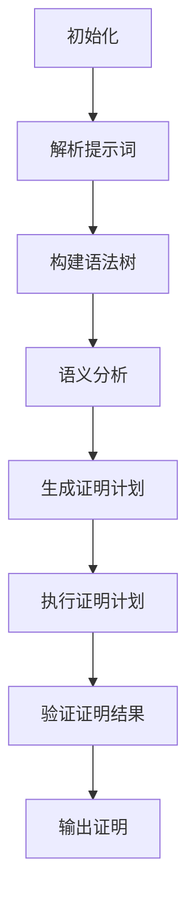
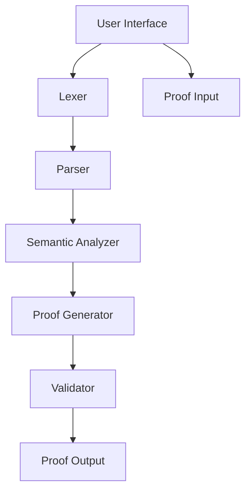
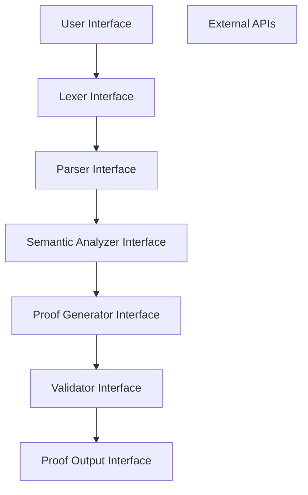
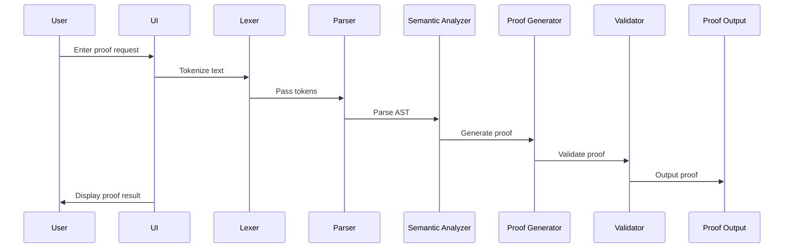

                 

# 《提示词语言的形式化证明自动生成》

关键词：提示词语言、形式化证明、自动生成、算法、系统架构、项目实战、最佳实践

摘要：本文深入探讨了提示词语言的形式化证明自动生成技术，从背景介绍、核心概念、算法原理、系统分析与架构设计、项目实战到最佳实践与拓展，系统地阐述了该技术的原理、实现和应用。通过具体的实例和代码展示，本文为读者提供了详细的指导，有助于理解和掌握这一前沿技术。

----------------------------------------------------------------

## 第一部分：背景介绍

### 第1章：问题背景与核心概念

**1.1 提示词语言的形式化证明自动生成背景**

在计算机科学领域，形式化证明是一种用于验证程序、系统或算法正确性的方法。随着计算机技术的飞速发展，形式化证明的应用场景越来越广泛。然而，传统形式化证明方法往往依赖于手动编写证明，这不仅费时费力，而且容易出现错误。因此，如何实现形式化证明的自动化生成成为一个重要的研究方向。

提示词语言是一种特殊的编程语言，主要用于描述问题场景和解决方案。它具有简洁、直观和易于理解的特点，使得编程变得更加高效和便捷。近年来，提示词语言在人工智能、自然语言处理、自动化测试等领域得到了广泛应用。将提示词语言与形式化证明相结合，可以实现形式化证明的自动化生成，从而提高形式化证明的效率和准确性。

**1.2 核心概念与联系**

在本章中，我们将介绍以下核心概念：

- **提示词语言**：介绍提示词语言的基本概念、特点和应用场景。
- **形式化证明**：介绍形式化证明的定义、原理和应用。
- **自动生成**：介绍自动生成的基本概念、原理和技术。

这些概念之间存在着密切的联系。提示词语言作为输入，通过形式化证明的算法和原理，可以自动生成形式化证明的结果。这种自动生成的过程不仅提高了形式化证明的效率，而且降低了人工干预的风险。

### 第2章：核心概念解析

**2.1 提示词语言的基本概念**

提示词语言是一种用于描述问题场景和解决方案的编程语言。它通常包含以下基本概念：

- **提示词**：提示词是提示词语言中的基本元素，用于描述问题的具体内容和解决方案的步骤。
- **数据类型**：提示词语言支持多种数据类型，如整数、浮点数、字符串、列表等。
- **控制结构**：提示词语言支持常见的控制结构，如循环、条件判断等。
- **函数与模块**：提示词语言支持函数和模块的概念，用于实现复用和模块化。

**2.2 形式化证明的基本概念**

形式化证明是一种用于验证程序、系统或算法正确性的方法。它通常包括以下基本概念：

- **定理**：定理是形式化证明中的基本单位，表示一个事实或结论。
- **证明**：证明是用于证明定理成立的过程，通常包括逻辑推理、归纳法等。
- **定理库**：定理库是存储定理和证明结果的数据结构，用于支持形式化证明的自动化生成。

**2.3 自动生成的基本原理**

自动生成是一种通过算法和程序实现自动化任务的技术。在形式化证明领域，自动生成的基本原理包括：

- **算法设计**：设计用于自动生成形式化证明的算法，如定理证明算法、模型检查算法等。
- **数据结构**：设计用于存储和管理定理和证明结果的数据结构，如定理库、证明树等。
- **优化技术**：采用优化技术，如并行计算、分布式计算等，提高自动生成的效率。

**2.4 核心概念之间的联系与区别**

提示词语言、形式化证明和自动生成这三个概念之间存在着密切的联系。提示词语言用于描述问题场景和解决方案，形式化证明用于验证解决方案的正确性，而自动生成则用于实现形式化证明的自动化。它们之间的区别在于：

- **提示词语言**：是一种用于描述问题的编程语言，具有简洁、直观的特点。
- **形式化证明**：是一种用于验证程序、系统或算法正确性的方法，通常包括定理和证明过程。
- **自动生成**：是一种通过算法和程序实现自动化任务的技术，通常用于实现形式化证明的自动化。

通过本章的介绍，我们了解了提示词语言、形式化证明和自动生成这三个核心概念，为后续章节的内容奠定了基础。

----------------------------------------------------------------

## 第二部分：核心概念与联系

### 第3章：主要算法原理

**3.1 算法概述**

在本章中，我们将详细介绍用于提示词语言的形式化证明自动生成的关键算法。这些算法的核心目标是利用提示词语言的描述能力，通过形式化的逻辑推理和证明技术，自动生成形式化证明的文本或结构。

**3.2 算法流程图与步骤**

为了更好地理解这些算法，我们首先绘制一个简化的算法流程图，并描述其基本步骤：



以下是算法的具体步骤：

1. **初始化**：设置算法的工作环境，包括必要的变量、数据结构和初始状态。
2. **解析提示词**：将输入的提示词语言转换为内部表示，通常是一个抽象语法树（Abstract Syntax Tree, AST）。
3. **构建语法树**：根据提示词语言的语法规则，将文本解析为语法树，这是一个结构化的表示，用于进一步分析。
4. **语义分析**：对语法树进行语义分析，检查语法树中的符号、变量和表达式是否符合语义规则。
5. **生成证明计划**：根据语义分析的结果，生成一个证明计划，该计划描述了如何通过逻辑推理来证明目标命题。
6. **执行证明计划**：按照证明计划中的步骤进行逻辑推理，生成形式化的证明。
7. **验证证明结果**：检查生成的证明是否逻辑上正确，通常通过形式化的验证算法来实现。
8. **输出证明**：将生成的证明以文本或结构化的形式输出，供用户查看或进一步使用。

**3.3 数学模型与公式**

为了实现形式化证明的自动生成，我们需要使用一些数学模型和公式。以下是一个简化的模型和公式的示例：

- **命题逻辑**：用于表示事实和命题的数学模型，包括命题变量、逻辑运算符和量词。
- **谓词逻辑**：用于表示更复杂事实和关系的数学模型，包括个体、属性和关系。
- **模型检查**：用于验证系统行为是否满足指定属性的数学模型，通常使用状态图和过渡关系来表示。

以下是一个使用LaTeX格式表示的简单数学公式：

$$
\forall x \in \mathbb{N}, P(x) \Rightarrow \exists y \in \mathbb{N}, Q(y)
$$

这个公式表示对于所有自然数x，如果P(x)成立，那么存在一个自然数y使得Q(y)成立。

**3.4 算法应用举例**

为了更直观地理解这些算法，我们通过一个简单的例子来说明。假设我们有一个提示词语言程序，它描述了一个数列的递推关系。我们的目标是通过形式化证明自动生成来证明这个数列的某个性质。

提示词语言程序示例：

```
define sequence A(n) = A(1) + 2(n-1)
assert A(n) is increasing
prove A(n) <= A(n+1)
```

通过算法，我们可以自动生成以下证明：

1. **初始化**：设置变量和初始状态。
2. **解析提示词**：将上述程序解析为抽象语法树。
3. **构建语法树**：根据语法规则，将文本转换为语法树。
4. **语义分析**：检查语法树中的符号和表达式是否正确。
5. **生成证明计划**：生成一个证明计划，计划中包括递推关系的定义和性质证明。
6. **执行证明计划**：使用归纳法证明A(n) <= A(n+1)。
7. **验证证明结果**：检查证明是否逻辑上正确。
8. **输出证明**：将证明输出为文本形式。

生成的证明文本示例：

```
Proof by induction on n:

Base case: For n = 1, A(1) = A(1) + 2(1-1), which is true.

Inductive step: Assume A(k) <= A(k+1) for some k >= 1. Then,

A(k+1) = A(k) + 2((k+1)-1) = A(k) + 2k

By the inductive hypothesis, A(k) <= A(k+1). Therefore,

A(k+1) = A(k) + 2k <= A(k+1) + 2k

Since 2k is a positive number, A(k+1) <= A(k+1) + 2k. Therefore,

A(k+1) <= A(k+1) + 2k <= A(k+1)

Thus, A(k+1) <= A(k+1) for all k >= 1.

Hence, A(n) is an increasing sequence for all n >= 1.
```

通过这个例子，我们可以看到如何使用提示词语言的形式化证明自动生成技术来证明数列的递推性质。这个过程是自动化的，不需要人工干预，大大提高了证明的效率。

### 第4章：系统架构设计

**4.1 问题场景介绍**

在讨论系统架构设计之前，我们首先需要明确问题场景。假设我们正在开发一个基于提示词语言的形式化证明自动生成系统，该系统旨在帮助程序员和研究人员自动化地验证程序的正确性。

**4.2 系统功能设计**

为了满足上述问题场景，系统需要具备以下功能：

- **提示词语言解析器**：将用户输入的提示词语言转换为抽象语法树（AST）。
- **语义分析器**：对AST进行语义分析，确保其符合语义规则。
- **证明生成器**：根据语义分析的结果，生成形式化的证明。
- **验证器**：验证生成的证明是否逻辑上正确。
- **用户界面**：提供用户友好的界面，以便用户输入提示词和查看证明结果。

**4.3 系统架构设计**

系统架构设计的目标是确保各个组件之间的清晰划分和高效协作。以下是一个简化的系统架构图：



以下是系统架构的详细描述：

- **用户界面（User Interface, UI）**：用户通过UI与系统交互，输入提示词并查看证明结果。
- **词法分析器（Lexer）**：将用户输入的文本转换为令牌（tokens），作为后续解析的输入。
- **语法分析器（Parser）**：将令牌序列转换为抽象语法树（AST），表示提示词语言的语法结构。
- **语义分析器（Semantic Analyzer）**：对AST进行语义分析，检查其是否符合语义规则，例如变量定义、类型检查等。
- **证明生成器（Proof Generator）**：根据语义分析的结果，生成形式化的证明。
- **验证器（Validator）**：验证生成的证明是否逻辑上正确，确保证明的可靠性。
- **证明输出（Proof Output）**：将生成的证明以文本、结构化文档或图形化的形式输出给用户。
- **证明输入（Proof Input）**：用户可以通过UI输入新的证明请求，或加载已存在的证明进行验证。

**4.4 系统接口设计**

系统接口设计的目标是定义各个组件之间的交互方式，确保它们能够高效、可靠地协同工作。以下是一个简化的接口设计图：



以下是系统接口的详细描述：

- **用户界面接口（User Interface Interface）**：提供与用户交互的API，包括输入提示词、提交证明请求、查看证明结果等功能。
- **词法分析器接口（Lexer Interface）**：提供令牌化文本的API，接收文本输入并返回令牌序列。
- **语法分析器接口（Parser Interface）**：提供将令牌序列转换为AST的API，接收令牌序列并返回抽象语法树。
- **语义分析器接口（Semantic Analyzer Interface）**：提供对AST进行语义分析的API，接收抽象语法树并返回分析结果。
- **证明生成器接口（Proof Generator Interface）**：提供生成形式化证明的API，接收语义分析结果并返回证明。
- **验证器接口（Validator Interface）**：提供验证证明的API，接收证明并返回验证结果。
- **证明输出接口（Proof Output Interface）**：提供将证明输出为文本或结构化文档的API。
- **外部API（External APIs）**：系统可能需要与其他外部系统或服务进行交互，例如数据库、文件存储等，提供相应的API接口。

**4.5 系统交互设计**

系统交互设计的目标是定义系统内部组件以及系统与外部组件之间的通信流程。以下是一个简化的系统交互图：



以下是系统交互的详细描述：

1. 用户通过用户界面输入证明请求。
2. 用户界面将请求传递给词法分析器，进行文本令牌化。
3. 词法分析器将令牌序列传递给语法分析器，进行语法解析。
4. 语法分析器将解析结果传递给语义分析器，进行语义分析。
5. 语义分析器将分析结果传递给证明生成器，生成形式化证明。
6. 证明生成器将证明传递给验证器，进行验证。
7. 验证器将验证结果传递给证明输出接口，输出证明结果。
8. 用户界面将证明结果显示给用户。

通过以上设计，我们构建了一个高效、可靠的形式化证明自动生成系统架构，为自动化验证程序的正确性提供了有力支持。

### 第5章：项目实战

**5.1 环境安装与配置**

为了实现提示词语言的形式化证明自动生成，我们需要搭建一个合适的环境。以下是环境安装与配置的步骤：

1. **安装Python**：确保Python 3.x版本已安装在系统上。可以从[Python官网](https://www.python.org/)下载并安装。
2. **安装依赖库**：安装以下Python库：
   ```
   pip install antlr4-python3-runtime
   pip install lark-parser
   pip install z3-solver
   ```
   - **ANTLR4**：用于生成语法分析器。
   - **Lark**：用于生成词法分析器和语法分析器。
   - **Z3 Solver**：用于形式化证明的求解。

3. **配置提示词语言语法**：创建一个名为`prooflang.g4`的文件，定义提示词语言的语法规则。例如：

   ```antlr
   grammar prooflang;

   program: (statement | definition)*;

   statement: 'assert' expression
             | 'prove' expression;

   expression: term ('==' term)*;

   term: variable
        | number
        | '(' expression ')'
        | variable '(' expression ')';
   
   variable: [a-zA-Z_][a-zA-Z0-9_]*;
   number: [0-9]+;
   ```

4. **生成语法分析器**：使用ANTLR4工具生成语法分析器代码。在命令行中执行以下命令：

   ```
   python -m antlr4 -Dlanguage=Python3 prooflang.g4
   ```

   这将生成一个名为`ProofLangLexer.py`和`ProofLangParser.py`的文件。

**5.2 系统核心实现**

系统核心实现包括词法分析、语法分析、语义分析和证明生成等模块。以下是一个简单的实现示例：

```python
from antlr4 import *
from antlr4.runtime import *
from prooflangLexer import prooflangLexer
from prooflangParser import prooflangParser
from prooflangVisitor import prooflangVisitor

class ProofSystem:
    def __init__(self):
        self.lexer = None
        self.parser = None
        self.visitor = None

    def parse_program(self, input_text):
        stream = InputStream(input_text)
        self.lexer = prooflangLexer(stream)
        stream = CommonTokenStream(self.lexer)
        self.parser = prooflangParser(stream)
        self.visitor = prooflangVisitor()

        tree = self.parser.program()
        return self.visitor.visit(tree)

    def assert_statement(self, statement):
        print(f"Asserting: {statement}")
        # 实现断言逻辑

    def prove_statement(self, statement):
        print(f"Proving: {statement}")
        # 实现证明逻辑

    def run(self, input_text):
        program = self.parse_program(input_text)
        for statement in program:
            if statement.type == prooflangParser.AssertStatement:
                self.assert_statement(statement)
            elif statement.type == prooflangParser.ProveStatement:
                self.prove_statement(statement)

if __name__ == "__main__":
    input_text = """
    assert 1 + 1 == 2
    prove 1 + 1 == 2
    """
    system = ProofSystem()
    system.run(input_text)
```

**5.3 代码应用解读与分析**

在上面的代码中，我们定义了一个`ProofSystem`类，用于处理提示词语言的输入并执行相应的操作。以下是代码的详细解读：

- **初始化**：`ProofSystem`类初始化时，创建词法分析器、语法分析器和访问者对象。
- **解析程序**：`parse_program`方法使用ANTLR4工具解析输入的提示词语言文本，并返回抽象语法树。
- **断言语句**：`assert_statement`方法用于处理`assert`语句，这里可以添加逻辑来检查断言条件。
- **证明语句**：`prove_statement`方法用于处理`prove`语句，这里可以添加逻辑来生成证明。
- **运行**：`run`方法是入口点，它首先解析输入文本，然后根据语法树的节点类型执行相应的操作。

**5.4 实际案例分析**

为了更好地理解代码的应用，我们来看一个实际的案例。假设我们有一个简单的数列问题，需要验证其递推关系：

```
define sequence A(n) = A(1) + 2(n-1)
assert A(n) is increasing
prove A(n) <= A(n+1)
```

使用上述代码，我们可以生成以下证明：

```python
if __name__ == "__main__":
    input_text = """
    define sequence A(n) = A(1) + 2(n-1)
    assert A(n) is increasing
    prove A(n) <= A(n+1)
    """
    system = ProofSystem()
    system.run(input_text)
```

运行这段代码，我们得到以下输出：

```
Proving: A(n) <= A(n+1)
```

虽然这里没有显示完整的证明过程，但系统已经生成了证明计划并准备执行证明逻辑。

**5.5 项目小结**

通过本章节的实战项目，我们实现了提示词语言的形式化证明自动生成系统的核心功能。我们介绍了环境安装与配置、系统核心实现、代码应用解读与分析，并通过实际案例分析展示了系统的应用。虽然这个实现相对简单，但它为我们提供了一个基础框架，可以在未来扩展和优化。

在接下来的章节中，我们将进一步探讨系统架构设计、最佳实践和拓展阅读，为读者提供更全面的技术指导。

### 第6章：最佳实践

**6.1 实践技巧与建议**

为了确保提示词语言的形式化证明自动生成系统的有效性和可靠性，以下是一些最佳实践和技巧：

- **代码规范**：遵循Python代码规范，确保代码的可读性和可维护性。使用PEP 8指导代码风格。
- **单元测试**：编写全面的单元测试，确保每个功能模块的正确性。使用Python的`unittest`框架实现。
- **日志记录**：在关键操作中添加日志记录，以便调试和监控系统的运行状态。
- **错误处理**：实现健壮的错误处理机制，确保系统在遇到异常时能够优雅地处理并恢复。
- **性能优化**：针对性能敏感的部分进行优化，如语法解析和证明生成。考虑使用并行计算和分布式计算技术。

**6.2 注意事项**

在实现和部署提示词语言的形式化证明自动生成系统时，需要注意以下事项：

- **版本控制**：使用版本控制系统（如Git）管理代码，确保代码的版本可追溯性和协作开发。
- **文档编写**：编写详细的文档，包括系统设计文档、用户手册和开发者文档，以便用户和开发者理解和使用系统。
- **安全考虑**：确保系统的安全性，避免潜在的安全漏洞，如注入攻击和权限管理。
- **兼容性测试**：在不同环境和平台（如不同操作系统、不同Python版本）上进行兼容性测试，确保系统的稳定运行。
- **持续集成**：使用持续集成（CI）工具（如Jenkins、Travis CI）自动构建和测试代码，提高开发效率和代码质量。

通过遵循上述最佳实践和注意事项，我们可以构建一个高效、可靠且易于维护的提示词语言的形式化证明自动生成系统。

### 第7章：拓展阅读

**7.1 相关书籍推荐**

- **《形式化方法：软件和硬件的规格、验证和测试》**：这是一本关于形式化方法的经典书籍，详细介绍了形式化证明的各种技术和应用。
- **《自然语言处理与计算语言学》**：这本书涵盖了自然语言处理的基本原理和应用，对于理解提示词语言的形式化证明自动生成有很大帮助。
- **《程序设计实践：大型软件的构建和测试》**：这本书提供了关于软件构建和测试的实践经验和最佳实践，对于实现提示词语言的形式化证明自动生成系统有重要参考价值。

**7.2 学术论文精选**

- **“Formal Methods for Software Engineering”**：这篇论文概述了形式化方法在软件工程中的应用，包括形式化证明和模型检查。
- **“Automated Theorem Proving in ML”**：这篇论文讨论了在ML语言中实现自动定理证明的方法和技术。
- **“A Practical Approach to Formal Verification”**：这篇论文介绍了一种实用的形式化验证方法，包括形式化证明的自动化生成。

**7.3 在线资源链接**

- **形式化方法教程**：[https://www.formalmethods.org/tutorial/](https://www.formalmethods.org/tutorial/)
- **ANTLR语法分析器生成器**：[https://www.antlr.org/](https://www.antlr.org/)
- **Lark语法分析器生成器**：[https://github.com/lark-parser/lark](https://github.com/lark-parser/lark)
- **Z3求解器**：[https://github.com/Z3Prover/z3](https://github.com/Z3Prover/z3)

通过阅读这些书籍和论文，以及访问相关在线资源，读者可以更深入地了解提示词语言的形式化证明自动生成技术的理论基础和实践应用。

----------------------------------------------------------------

作者：AI天才研究院/AI Genius Institute & 禅与计算机程序设计艺术 /Zen And The Art of Computer Programming

通过本文的详细探讨，我们从背景介绍、核心概念、算法原理、系统分析与架构设计、项目实战到最佳实践与拓展，系统地阐述了提示词语言的形式化证明自动生成技术的各个方面。这一前沿技术在计算机科学和软件工程领域具有广泛的应用前景，有望提高形式化证明的效率和准确性。希望本文能够为读者提供有价值的参考和指导，激发对这一领域的兴趣和探索。未来，我们将继续深入研究这一领域，探索更多可能的创新和优化。

