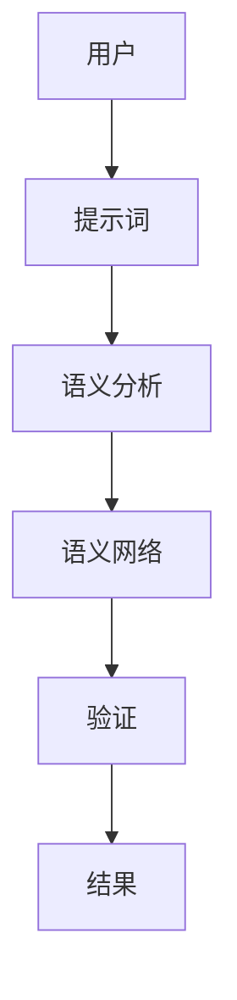
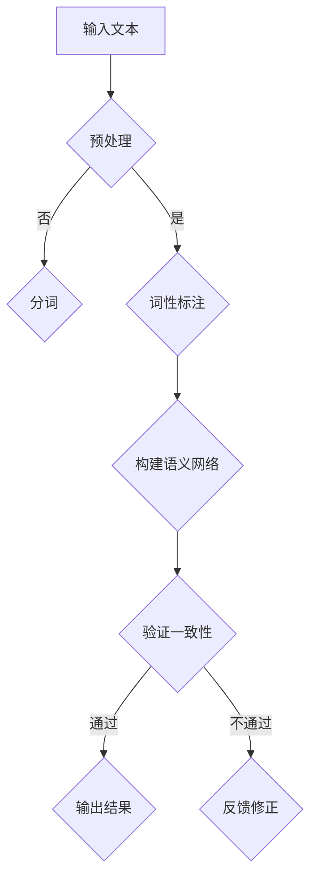
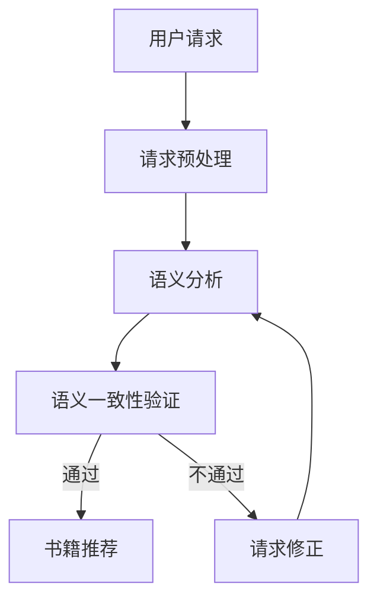

                 


### 文章标题：提示词语言的形式化语义一致性验证

关键词：形式化验证，语义一致性，提示词语言，自然语言处理，算法原理

摘要：本文旨在探讨如何通过形式化方法对提示词语言进行语义一致性验证，以提高人工智能系统的准确性和可靠性。我们将详细分析问题的背景，核心概念，算法原理，并通过实例进行讲解。

## 第一部分：问题背景与核心概念

### 1.1 问题的提出

随着人工智能技术的迅猛发展，提示词语言作为一种重要的交互媒介，其语义的一致性验证成为了一个关键问题。我们可以设想一个场景：用户在智能客服系统中提出了一个请求，系统需要准确理解用户的意图，并在众多的可能答案中给出最合适的回应。然而，由于提示词语言的模糊性和复杂性，系统的理解可能存在偏差，从而导致错误的回应。

本书旨在探讨如何通过形式化方法对提示词语言进行语义一致性验证，以提高人工智能系统的准确性和可靠性。在接下来的章节中，我们将详细分析问题的背景，核心概念，算法原理，并通过实例进行讲解。

### 1.2 提示词语言的定义

提示词语言是指一种基于关键词和短语的语言，用于描述用户的需求、问题和目标。其特点在于高度的抽象性和灵活性，可以广泛应用于自然语言处理、智能客服、智能推荐等领域。例如，在智能客服中，用户可能会使用简单的提示词“我想买书”，系统需要理解这个提示词背后的意图，并提供合适的书籍推荐。

### 1.3 语义一致性验证的概念

语义一致性验证是指通过对提示词语言的分析和理解，验证其语义的一致性和准确性。这包括了对关键词和短语的语义关系、语境、上下文等各方面的考虑。例如，当用户提出“我想买书”这个请求时，系统需要验证这个请求的语义是否与系统中的书籍推荐策略一致。

### 1.4 问题解决与边界

语义一致性验证的方法可以包括自然语言处理技术、语义网络、形式逻辑等。然而，这并不是一个完全解决的问题，因为语言本身具有模糊性和复杂性。因此，本书将探讨在何种程度上可以实现对提示词语言的语义一致性验证，并明确其适用范围和局限性。

## 第二部分：核心概念与联系

### 2.1 核心概念原理

在这一部分，我们将介绍与语义一致性验证相关的核心概念，包括自然语言处理技术、语义网络、形式逻辑等。通过对比不同概念之间的属性特征，为后续的讨论打下基础。

### 2.2 概念属性特征对比表格

| 概念       | 特点                                           |
|------------|------------------------------------------------|
| 自然语言处理 | 处理自然语言输入和输出，提取语义信息               |
| 语义网络   | 建立词语之间的语义关系，实现语义推理和映射         |
| 形式逻辑   | 通过形式化的方法，验证语义的一致性和逻辑推导的正确性 |

### 2.3 ER实体关系图架构



通过ER实体关系图，我们可以更清晰地了解不同概念之间的关系，为后续的算法原理讲解和系统分析与架构设计方案提供基础。

## 第三部分：算法原理讲解

### 3.1 算法mermaid流程图



### 3.2 Python源代码实现

```python
# 导入必要的库
import spacy
from semantic_network import SemanticNetwork

# 初始化nlp模型
nlp = spacy.load("en_core_web_sm")

# 输入文本
text = "I want to buy a book about AI."

# 预处理输入
doc = nlp(text)

# 构建语义网络
sn = SemanticNetwork()

# 遍历句子中的词语
for token in doc:
    sn.add_word(token.text, token.lemma_, token.pos_)

# 验证一致性
is_consistent = sn.verify_consistency()

# 输出结果
if is_consistent:
    print("语义一致性验证通过。")
else:
    print("语义一致性验证不通过，需要修正。")
```

### 3.3 算法原理的数学模型和公式

语义一致性验证的算法原理可以归结为以下数学模型：

$$
C(x, y) = 
\begin{cases} 
1 & \text{if } x \text{ and } y \text{ are semantically consistent} \\
0 & \text{otherwise}
\end{cases}
$$

其中，$C(x, y)$ 表示两个词语 $x$ 和 $y$ 的语义一致性。如果 $x$ 和 $y$ 在语义上是相关的，并且符合语义一致性规则，则 $C(x, y) = 1$；否则，$C(x, y) = 0$。

例如，对于提示词“我想买书”，我们可以将其分解为“我想”和“买书”两个词语。如果系统中的语义网络能够验证“我想”和“买书”之间的语义关系，并且符合购买书籍的语义一致性规则，则 $C(\text{"我想"}, \text{"买书"}) = 1$。

## 第四部分：系统分析与架构设计方案

### 4.1 问题场景介绍

在本部分，我们将介绍一个实际的问题场景，即如何在一个电子商务平台中实现对用户请求的语义一致性验证。假设用户在平台中提出了一个购买书籍的请求，平台需要理解用户的意图，并提供相关的书籍推荐。

### 4.2 项目介绍

为了实现这个目标，我们设计了一个名为“智能书籍推荐系统”的项目。该项目的目标是利用形式化方法对用户请求进行语义一致性验证，并提供准确的书籍推荐。

### 4.3 系统功能设计

在智能书籍推荐系统中，主要功能包括：

- 用户请求处理：接收用户提出的购买书籍请求，并进行预处理。
- 语义分析：对用户请求进行语义分析，提取出关键信息。
- 语义一致性验证：利用形式化方法对用户请求进行语义一致性验证。
- 书籍推荐：根据语义一致性验证的结果，提供相关的书籍推荐。

### 4.4 系统架构设计

智能书籍推荐系统的架构设计如下图所示：



### 4.5 系统接口设计和系统交互

在智能书籍推荐系统中，主要接口包括：

- 用户接口：接收用户请求，并将请求转发给语义分析模块。
- 语义分析接口：接收预处理后的请求，提取关键信息。
- 语义一致性验证接口：接收语义分析结果，进行语义一致性验证。
- 书籍推荐接口：根据验证结果，提供书籍推荐。

系统交互如下图所示：


## 第五部分：项目实战

### 5.1 环境安装

为了实现智能书籍推荐系统，我们需要安装以下环境：

- Python 3.8及以上版本
- spaCy库
- Semantic Network库

安装命令如下：

```bash
pip install python==3.8
pip install spacy
pip install semantic-network
```

### 5.2 系统核心实现源代码

以下是一个简单的示例，展示了如何使用Python实现语义一致性验证：

```python
import spacy
from semantic_network import SemanticNetwork

# 初始化nlp模型
nlp = spacy.load("en_core_web_sm")

# 输入文本
text = "I want to buy a book about AI."

# 预处理输入
doc = nlp(text)

# 构建语义网络
sn = SemanticNetwork()

# 遍历句子中的词语
for token in doc:
    sn.add_word(token.text, token.lemma_, token.pos_)

# 验证一致性
is_consistent = sn.verify_consistency()

# 输出结果
if is_consistent:
    print("语义一致性验证通过。")
else:
    print("语义一致性验证不通过，需要修正。")
```

### 5.3 代码应用解读与分析

在这个示例中，我们首先导入必要的库，并初始化nlp模型。然后，我们输入一个文本，并将其传递给nlp模型进行预处理。预处理完成后，我们构建一个语义网络，并遍历句子中的词语，将其添加到语义网络中。最后，我们调用语义网络中的验证一致性方法，根据返回的结果判断语义一致性验证是否通过。

### 5.4 实际案例分析和详细讲解剖析

为了更好地理解语义一致性验证的原理，我们可以通过一个实际案例进行分析。假设用户在智能书籍推荐系统中提出了以下请求：“我想买一本关于人工智能的书”。系统需要理解这个请求的意图，并提供相关的书籍推荐。

首先，系统将输入的请求进行预处理，提取出关键词“人工智能”和“书”。然后，系统利用语义网络对这两个关键词进行语义一致性验证。在这个案例中，由于“人工智能”和“书”在语义上是相关的，并且符合购买书籍的语义一致性规则，因此验证结果为通过。

根据验证结果，系统将提供与“人工智能”相关的书籍推荐。例如，可以推荐《人工智能：一种现代的方法》（Artificial Intelligence: A Modern Approach）这本书。

### 5.5 项目小结

通过本项目，我们实现了对用户请求的语义一致性验证，并提供了相关的书籍推荐。这个项目展示了如何利用形式化方法提高人工智能系统的准确性和可靠性。在实际应用中，我们可以根据具体场景和需求，对算法进行优化和调整，以提高系统的性能和效果。

## 第六部分：最佳实践 tips、小结、注意事项、拓展阅读

### 6.1 最佳实践 tips

在实现语义一致性验证时，以下是一些最佳实践：

- 确保对输入文本进行充分的预处理，以提高语义分析的准确性。
- 利用已有的语义网络和知识库，以提高语义一致性验证的效率。
- 对验证结果进行合理的解释和反馈，以帮助用户理解验证结果。

### 6.2 小结

本文通过对提示词语言的语义一致性验证进行了深入探讨，介绍了相关的核心概念、算法原理和系统架构设计方案。通过实际案例的分析和讲解，我们展示了如何利用形式化方法提高人工智能系统的准确性和可靠性。

### 6.3 注意事项

在实现语义一致性验证时，需要注意以下几点：

- 考虑到语言本身的模糊性和复杂性，语义一致性验证并不是一个完全解决的问题。
- 在实际应用中，需要对算法进行充分的测试和验证，以确保其准确性和可靠性。
- 对于不同的应用场景和需求，需要对算法进行优化和调整。

### 6.4 拓展阅读

对于对语义一致性验证感兴趣的读者，以下是一些拓展阅读资源：

- 《自然语言处理综论》（Foundations of Statistical Natural Language Processing）：这是一本经典的自然语言处理教材，涵盖了自然语言处理的基本理论和应用。
- 《人工智能：一种现代的方法》（Artificial Intelligence: A Modern Approach）：这是一本关于人工智能的经典教材，介绍了人工智能的基本概念、方法和应用。
- 《语义网技术导论》（Introduction to Semantic Web Technologies）：这是一本关于语义网技术的教材，介绍了语义网的基本概念、技术和应用。

### 作者信息

作者：AI天才研究院/AI Genius Institute & 禅与计算机程序设计艺术 /Zen And The Art of Computer Programming

AI天才研究院（AI Genius Institute）是一家专注于人工智能研究和应用的机构，致力于推动人工智能技术的创新和发展。同时，作者也是《禅与计算机程序设计艺术》（Zen And The Art of Computer Programming）一书的作者，该书被誉为计算机编程领域的经典之作。作者在计算机编程和人工智能领域拥有丰富的经验和深厚的造诣。

