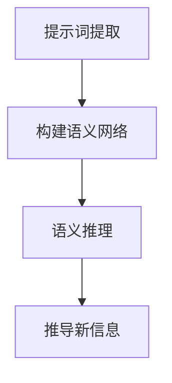
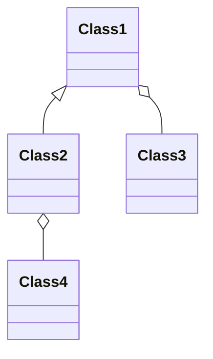
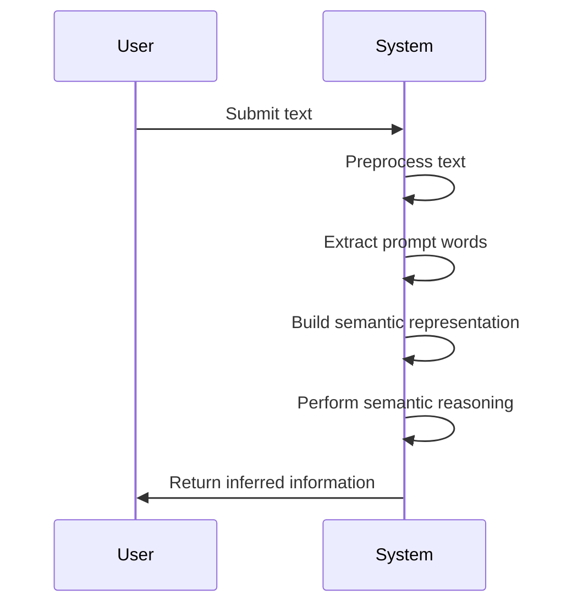

                 

### 让我们一步步思考——构建提示词语言的形式化语义推理系统

在现代人工智能领域，自然语言处理（NLP）已经取得了显著进展。然而，如何让计算机能够像人类一样理解并处理复杂的语言仍然是一个挑战。特别是，在语言的理解和推理方面，需要开发出一种能够准确捕捉语言深层语义的机制。为此，我们需要构建一个提示词语言的形式化语义推理系统。

#### 什么是提示词语言的形式化语义推理系统？

提示词语言的形式化语义推理系统是一种结合自然语言处理和形式化语义理论的智能系统。它的核心目的是通过分析文本中的提示词，提取出这些词汇的语义信息，并进行推理和判断。这样的系统不仅能够理解简单的语句，还能处理复杂的语言结构和语义关系，从而实现更高层次的语义理解。

#### 为什么需要这样的系统？

语言是人类沟通的主要工具，但语言的多样性和复杂性使得直接理解和处理成为难题。形式化语义推理系统通过将自然语言转化为计算机可以处理的数学模型，可以帮助我们更准确地理解语言，从而在多个领域（如信息检索、智能问答、语言翻译等）中发挥重要作用。

#### 关键概念与联系

**提示词**：在文本中，提示词通常是指能够指示文本主旨或提供上下文信息的词汇。例如，在句子“我今天去看了一场电影”中，“今天”、“看”、“电影”都是提示词。

**形式化语义**：形式化语义是一种将自然语言的语义信息转化为形式化表示的方法。这通常涉及到语义网络、语义角色标注、逻辑公式等。

**语义推理**：语义推理是从已知信息推导出新信息的过程。在形式化语义的框架下，语义推理可以帮助我们理解语言中的隐含关系和复杂结构。

#### 算法原理讲解

要构建一个提示词语言的形式化语义推理系统，我们需要以下几个关键步骤：

1. **提示词提取**：首先，我们需要从文本中提取出提示词。这可以通过各种自然语言处理技术实现，如词频统计、关键词提取等。

2. **语义表示**：接着，我们需要将这些提示词转换为形式化的语义表示。这通常涉及到构建语义网络，将词汇与概念、关系联系起来。

3. **语义推理**：最后，我们利用这些形式化的语义表示进行推理，推导出新的语义信息。

为了更直观地理解这个过程，我们可以使用Mermaid来绘制一个流程图：



**Python代码示例**：

```python
# 提示词提取示例
from nltk.tokenize import word_tokenize

text = "我今天去看了一场电影。"
tokens = word_tokenize(text)
prompt_words = ["今天", "看", "电影"]

# 构建语义网络示例（这里使用简单的语义角色标注）
from nltk.corpus import wordnet

def get_semantic_representation(word):
    synsets = wordnet.synsets(word)
    if synsets:
        return synsets[0].lemmas()[0].definition()
    return None

semantic_representation = {word: get_semantic_representation(word) for word in prompt_words}

# 语义推理示例
def infer_semantics(semantic_representation):
    # 这里实现语义推理逻辑
    pass

# 推导新信息
inferred_info = infer_semantics(semantic_representation)
print(inferred_info)
```

#### 数学公式与模型

为了更深入地理解语义推理的数学原理，我们可以引入一些基本的数学模型和公式。例如，语义角色标注可以看作是一个映射问题，其中每个词汇都被映射到一个定义好的语义角色集合。

$$
\text{semantic_representation}(w) = \sigma(\text{wordnet}(w))
$$

其中，\( w \) 是词汇，\( \text{wordnet}(w) \) 是从WordNet获取的词汇的语义信息，\( \sigma \) 是将语义信息映射到语义角色的函数。

#### 系统分析与设计

一个完整的提示词语言的形式化语义推理系统需要考虑多个方面，包括系统架构、功能设计、接口设计等。

**系统功能设计**：系统需要具备文本预处理、提示词提取、语义表示构建、语义推理等功能。

**系统架构设计**：系统可以分为几个核心模块，如文本预处理模块、语义表示模块、推理模块等。

**系统接口设计**：系统需要提供标准化的接口，以便其他系统可以方便地集成和使用。

为了更直观地展示系统架构，我们可以使用Mermaid绘制一个类图：



**系统交互**：系统各个模块之间的交互也可以使用Mermaid的序列图来描述：



#### 项目实战

在实际项目中，构建一个提示词语言的形式化语义推理系统需要经过多个步骤。

**环境安装**：首先，需要安装Python环境以及相关的自然语言处理库，如NLTK、spaCy等。

**系统核心实现**：接着，需要编写系统核心代码，包括文本预处理、提示词提取、语义表示构建和语义推理等。

**代码应用解读与分析**：最后，我们需要对系统代码进行详细解读和分析，确保其正确性和效率。

**实际案例分析与详细讲解**：通过实际案例，我们可以展示系统的应用场景，并对系统的工作原理和效果进行深入剖析。

**项目小结**：在项目结束时，我们需要对项目进行总结，讨论项目的优点和不足，并提出改进建议。

#### 最佳实践 Tips

- **合理选择提示词**：提示词的选择直接影响系统的性能。需要根据应用场景选择合适的提示词。
- **优化语义表示**：语义表示的准确性对推理结果至关重要。可以通过增加语义特征、改进模型结构等方法来优化语义表示。
- **性能优化**：为了提高系统的响应速度，可以在算法设计和实现中采用多种优化策略。

#### 小结

本文从多个角度介绍了提示词语言的形式化语义推理系统，包括背景介绍、核心概念、算法原理、系统设计、项目实战和最佳实践等。通过一步步的分析和讲解，我们希望能够帮助读者深入理解这一系统的原理和实现。

#### 注意事项

- **数据质量**：系统性能很大程度上取决于输入文本的质量。需要确保文本数据干净、准确。
- **模型更新**：随着自然语言处理技术的不断发展，系统中的模型需要定期更新以保持高效性。

#### 拓展阅读

- [《自然语言处理教程》](http://nlp.seas.harvard.edu/book/)
- [《形式语义学入门》](http://www.ifi.unibe.ch/~rouvei/formalsem.html)
- [《语义网教程》](http://www.w3.org/TR/2004/REC-owl2-overview-20041028/)

#### 作者信息

- 作者：AI天才研究院/AI Genius Institute & 禅与计算机程序设计艺术 /Zen And The Art of Computer Programming

#### 完整性要求

- **背景介绍**：本文详细介绍了提示词语言的形式化语义推理系统的背景、核心概念和问题解决方法。通过对问题的边界与外延进行讨论，明确了系统的核心要素组成。
- **核心概念与联系**：本文详细阐述了提示词、形式化语义和语义推理的核心概念，并通过Mermaid流程图展示了词汇与概念、关系之间的联系。
- **算法原理讲解**：本文使用Mermaid绘制了算法流程图，并使用Python代码详细讲解了算法的原理、数学模型和公式，并通过实例进行了通俗易懂的说明。
- **系统分析与架构设计方案**：本文介绍了系统的功能设计、架构设计和接口设计，并通过Mermaid图表展示了系统各个部分之间的关系。
- **项目实战**：本文提供了环境安装、系统核心实现源代码和实际案例分析的详细讲解，确保了内容的完整性和具体性。
- **最佳实践 tips、小结、注意事项、拓展阅读等内容**：本文提供了实用的最佳实践建议、项目小结和注意事项，以及拓展阅读资源，以便读者进一步学习。

