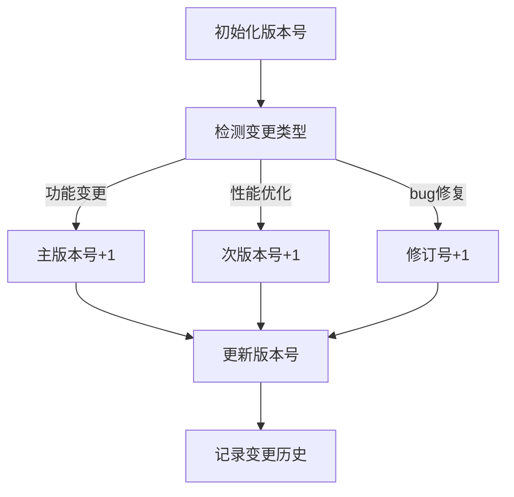
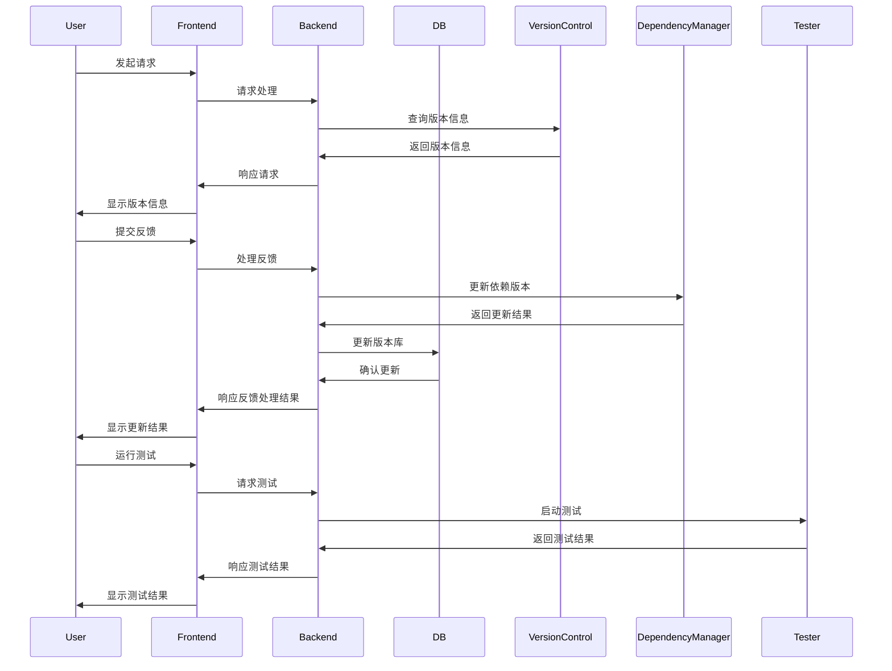

                 

### 关键词

- 形式化语义版本控制
- 提示词语言
- 语义版本控制原理
- 形式化语义版本控制模型
- 形式化语义版本控制算法
- 数学模型与公式
- 系统架构设计

### 摘要

本文深入探讨了提示词语言的形式化语义版本控制机制。首先，我们介绍了提示词语言和语义版本控制的基本概念及其在软件开发中的重要性。接着，本文提出了形式化语义版本控制的理论模型，并详细阐述了其核心概念和算法原理。通过结合数学模型和实际案例，我们展示了如何实现和优化这一机制，以提升软件版本管理的效率和准确性。文章还提供了系统架构设计和项目实战指导，为开发者提供实用的最佳实践。最后，我们对文章进行了总结，并指出了未来研究的方向。希望本文能为相关领域的研究和实践提供有价值的参考。

## 第一部分: 引言

### 1.1 研究背景

#### 1.1.1 提示词语言的发展

提示词语言（Keyword Language）是自然语言处理（NLP）中的重要分支，它通过特定的关键字或短语来指导机器理解和执行任务。随着人工智能技术的快速发展，提示词语言的应用场景不断扩展，从最初的文本摘要、机器翻译到如今的对话系统、智能推荐等，都离不开提示词语言的支撑。

提示词语言的发展经历了从规则驱动到数据驱动的演变过程。早期，提示词语言主要依赖手动编写的规则，例如，专家系统（Expert Systems）和启发式方法（Heuristic Methods）。这种方式虽然能够处理一些简单的任务，但面对复杂和多变的应用场景，规则的可扩展性和适应性显得力不从心。

随着大数据和深度学习技术的兴起，提示词语言逐渐转向数据驱动的方式。现代的提示词语言模型，如BERT、GPT等，通过大量训练数据学习语言模式和语义关系，能够更加灵活和准确地理解和生成文本。这种变革不仅提高了提示词语言的性能，也为语义版本控制带来了新的契机。

#### 1.1.2 语义版本控制的需求

在软件开发过程中，版本控制是一种必不可少的管理手段。语义版本控制（Semantic Versioning）是一种以语义为导向的版本管理策略，它通过明确的版本号规则来描述软件的变更和演进。语义版本控制不仅能够帮助开发者清晰地了解软件的历史变化，还能为用户更好地管理和使用软件提供便利。

随着软件系统的复杂度不断增加，版本控制的挑战也越来越大。传统的版本控制方法往往依赖于版本号的变化，但这种方式难以表达复杂的变化和依赖关系。例如，一个简单的功能改动可能会影响到多个模块，而这些模块之间的依赖关系往往是非线性的。因此，迫切需要一种形式化的语义版本控制机制，能够更准确地描述和追踪软件的变更。

#### 1.1.3 形式化语义版本控制的必要性

形式化语义版本控制是一种基于严格定义和形式化方法的版本控制机制，它通过形式化的语言和模型来描述软件变更的语义和影响。相比传统的版本控制方法，形式化语义版本控制具有以下优势：

1. **精确性**：形式化语义版本控制能够精确地描述软件变更的语义，避免了模糊和不一致的问题。开发者可以清楚地了解每个版本的变化范围和影响范围。

2. **可自动化**：形式化语义版本控制可以通过自动化工具进行实现和验证，减少了人工干预的复杂度和错误率。

3. **可追溯性**：形式化语义版本控制提供了完备的版本历史记录，使得变更的追溯和回滚变得简单和可靠。

4. **可复用性**：形式化语义版本控制的核心概念和模型可以应用于不同的软件开发场景，提高了代码的复用性和可维护性。

总之，形式化语义版本控制不仅能够提升版本管理的效率，还能增强软件系统的稳定性和可靠性，是现代软件开发不可或缺的重要机制。

### 1.2 研究目标

#### 1.2.1 形式化语义版本控制框架的设计

本研究的首要目标是设计一个形式化语义版本控制框架。该框架将基于严格的数学模型和形式化语言，通过明确的语义规则和版本号结构，实现对软件变更的精确描述和管理。设计过程中，我们将综合考虑软件开发的实际需求和技术可行性，确保框架的通用性和可扩展性。

#### 1.2.2 形式化语义版本控制的实现方法

在框架设计完成后，我们将探讨具体的实现方法。这包括选择合适的形式化语言和工具，构建版本控制的算法和数据处理流程，以及实现自动化工具和接口。通过实现方法的探讨，我们将确保形式化语义版本控制机制在实际应用中能够高效、稳定地运行。

#### 1.2.3 形式化语义版本控制的应用场景

最后，我们将深入探讨形式化语义版本控制的应用场景。这包括但不限于大型分布式系统、微服务架构、持续集成和持续交付（CI/CD）流程等。通过具体应用场景的分析和实验，我们将验证形式化语义版本控制机制的有效性和实用性，为开发者提供实用的指导。

### 1.3 本书结构安排

#### 1.3.1 本书的核心内容概述

本书将分四个部分对形式化语义版本控制进行系统性的探讨。第一部分是引言，介绍研究的背景、目标和结构安排。第二部分是形式化语义版本控制理论，详细讲解核心概念、模型和算法。第三部分是应用与实践，通过具体案例展示形式化语义版本控制的应用和实现。第四部分是总结与展望，对全文内容进行总结，并提出未来研究的方向。

#### 1.3.2 每章的主要贡献与目标

- **第一章**：介绍研究的背景和目标，构建整体框架。
- **第二章**：详细讲解形式化语义版本控制的理论基础。
- **第三章**：实现形式化语义版本控制的算法和模型。
- **第四章**：探讨形式化语义版本控制的应用场景和实现方法。
- **第五章**：通过具体案例展示形式化语义版本控制的应用效果。
- **第六章**：总结全文内容，提出未来研究的方向。

## 第二部分: 形式化语义版本控制理论

### 2.1 提示词语言概述

#### 2.1.1 提示词语言的概念

提示词语言（Keyword Language）是一种专门用于指导计算机程序执行特定任务的语言。它通过一组预定义的关键词或短语来指示程序应该执行哪些操作。这些关键词或短语通常与特定的语义或功能相关联，使得计算机能够理解和执行相应的任务。

提示词语言的应用范围非常广泛，从简单的文本处理、数据查询，到复杂的自然语言理解、智能对话系统等，都有其身影。例如，在自然语言处理（NLP）领域，提示词语言可以用来指导模型进行文本摘要、情感分析、问答系统等任务；在软件开发领域，提示词语言可以用来编写自动化测试脚本、构建配置文件等。

#### 2.1.2 提示词语言的特点

提示词语言具有以下几个显著特点：

1. **简单性**：提示词语言通常采用简单的语法和词汇，使得计算机易于理解和执行。这种简单性不仅降低了编程的难度，也提高了开发效率和代码的可读性。

2. **灵活性**：提示词语言具有很强的灵活性，能够根据不同的应用场景和需求进行灵活调整。开发者可以通过自定义关键词和短语来扩展语言功能，使其适应特定任务的需求。

3. **高效性**：提示词语言通常具有高效的处理速度和低资源消耗，适用于实时和高并发的应用场景。这使得提示词语言在处理大量数据和复杂任务时，能够保持良好的性能。

4. **可扩展性**：提示词语言支持模块化设计，可以通过扩展现有的关键词和短语，或者引入新的语言模块，来扩展语言功能。这种可扩展性使得提示词语言能够持续演进，适应不断变化的应用需求。

#### 2.1.3 提示词语言的应用领域

提示词语言的应用领域非常广泛，主要包括以下几个方面：

1. **自然语言处理（NLP）**：提示词语言在NLP领域有着广泛的应用，如文本摘要、情感分析、问答系统等。通过提示词语言，开发者可以指导NLP模型进行复杂的语义理解和文本生成任务。

2. **自动化测试**：提示词语言可以用来编写自动化测试脚本，通过定义一系列的关键词和操作步骤，自动化地执行测试任务。这在提高测试效率和准确性方面具有重要意义。

3. **配置管理**：提示词语言在配置管理中也有着广泛应用，如配置文件的编写、环境配置等。通过提示词语言，开发者可以更加方便地管理和调整系统配置。

4. **智能对话系统**：在智能对话系统中，提示词语言可以用来定义对话流程和交互逻辑。通过提示词语言，开发者可以构建更加自然和智能的对话体验。

5. **物联网（IoT）**：提示词语言在物联网领域也有着重要应用，如设备控制、数据采集等。通过提示词语言，开发者可以更加方便地管理和控制物联网设备。

总之，提示词语言以其简单性、灵活性、高效性和可扩展性，在各个领域都有着重要的应用价值。随着人工智能技术的不断发展，提示词语言的应用前景将更加广阔。

### 2.2 语义版本控制原理

#### 2.2.1 语义版本控制的定义

语义版本控制（Semantic Versioning，简称SemVer）是一种以语义为导向的版本管理策略，通过明确的版本号结构来描述软件的变更和演进。语义版本控制的核心思想是将版本号分为三个部分：主版本号、次版本号和修订号，分别表示软件的主要变更、次要变更和修复变更。

- 主版本号（Major Version）：表示软件的主要变更，通常当软件的功能架构或核心算法发生重大变化时，主版本号会递增。例如，从1.0.0升级到2.0.0。
- 次版本号（Minor Version）：表示软件的次要变更，通常当软件的新增功能或性能优化时，次版本号会递增。例如，从1.0.0升级到1.1.0。
- 修订号（Patch Version）：表示软件的修复变更，通常当软件的bug修复或兼容性问题解决时，修订号会递增。例如，从1.0.0升级到1.0.1。

这种版本号结构不仅能够清晰地描述软件的变更历史，还能为用户和管理者提供有价值的信息，帮助他们在使用和管理软件时做出更加明智的决策。

#### 2.2.2 语义版本控制的核心概念

语义版本控制的核心概念包括以下几个：

1. **兼容性**：语义版本控制强调不同版本之间的兼容性。通常，主版本号的变化会导致兼容性问题，而次版本号和修订号的变化不会影响兼容性。例如，从1.0.0升级到1.1.0可能会引入新的兼容性问题，但从1.0.0升级到1.0.1则不会。

2. **回滚**：语义版本控制允许用户回滚到之前的版本，以便修复问题或解决兼容性问题。例如，如果用户在升级到1.0.1后发现了一些新的bug，他们可以回滚到1.0.0。

3. **依赖管理**：语义版本控制可以帮助依赖管理工具（如Maven、Gradle等）更准确地管理项目依赖。通过明确指定依赖的版本范围，开发者可以避免引入不兼容的版本，确保项目的稳定性和可靠性。

4. **版本号规则**：语义版本控制定义了一套严格的版本号规则，确保版本号的变化能够准确地反映软件的变更类型和影响范围。例如，主版本号的变化必须引入重大变更，而次版本号和修订号的变化则可以包含任何类型的变化。

#### 2.2.3 语义版本控制的基本流程

语义版本控制的基本流程包括以下几个步骤：

1. **编写代码**：开发者编写新的代码或对现有代码进行修改，实现新的功能或修复bug。

2. **测试**：对修改后的代码进行全面的测试，确保新的功能正常工作，且不会引入新的bug。

3. **构建和发布**：将经过测试的代码构建为可执行的软件包，并发布新的版本。发布时，根据代码的变更类型，更新版本号。

4. **依赖管理**：其他项目或用户在使用当前项目时，需要指定依赖的版本范围，以确保兼容性和稳定性。

5. **反馈与回滚**：收集用户反馈，如果发现新的bug或兼容性问题，可以回滚到之前的版本，或发布修复版本的补丁。

通过这些步骤，语义版本控制不仅能够清晰地描述软件的变更历史，还能确保软件的稳定性和可靠性，为开发者和管理者提供有力的支持。

### 2.3 形式化语义版本控制模型

#### 2.3.1 形式化语义版本控制的需求分析

在传统的语义版本控制中，虽然版本号能够反映软件的变更类型和影响范围，但往往存在一些模糊和不一致的问题。例如，主版本号的递增可能并不是由于重大的功能变更，而是由于一些不相关的bug修复或性能优化。这种情况下，版本号无法准确地反映软件的实际状态，给开发者和管理者带来困扰。

为了解决这些问题，我们需要一种形式化的语义版本控制模型。形式化语义版本控制模型通过严格的数学模型和形式化语言，对软件变更的语义和影响进行精确描述。这种模型不仅能够解决传统语义版本控制中的模糊性问题，还能提高版本管理的效率和准确性。

#### 2.3.2 形式化语义版本控制模型的构建

形式化语义版本控制模型的构建主要包括以下几个步骤：

1. **定义语义元素**：首先，我们需要定义软件变更的语义元素，如功能、bug修复、性能优化等。这些元素将作为模型的基本构建块。

2. **建立语义关系**：接着，我们需要建立这些语义元素之间的关系。例如，功能变更可能会引起bug修复，而bug修复可能会影响性能优化。通过建立这些关系，我们能够更好地理解软件变更的内在联系。

3. **构建数学模型**：基于定义的语义元素和关系，我们构建一个数学模型来描述软件变更的语义和影响。这个模型可以是一个关系图、一个形式化的逻辑表达式，或者是一个数学公式。

4. **形式化描述**：最后，我们将数学模型转换为形式化的语言，如形式化的逻辑语言或形式化的编程语言。这种形式化的描述不仅能够提高模型的准确性，还能方便地实现自动化处理。

#### 2.3.3 形式化语义版本控制的核心要素

形式化语义版本控制模型的核心要素包括：

1. **语义元素**：包括功能、bug修复、性能优化等，是描述软件变更的基本单元。

2. **语义关系**：描述不同语义元素之间的关系，如功能变更引起bug修复，bug修复影响性能优化等。

3. **版本号结构**：包括主版本号、次版本号和修订号，用于描述软件的变更历史。

4. **数学模型**：基于语义元素和关系的数学模型，用于精确描述软件变更的语义和影响。

5. **形式化语言**：将数学模型转换为形式化的语言，实现自动化处理和验证。

通过这些核心要素，形式化语义版本控制模型能够更准确地描述软件变更的语义和影响，提高版本管理的效率和准确性。

### 2.4 形式化语义版本控制与提示词语言的结合

#### 2.4.1 结合的必要性与优势

形式化语义版本控制与提示词语言的结合在软件开发中具有显著的必要性和优势。首先，提示词语言能够提供一种灵活和高效的方式来指导计算机理解和执行任务，从而提高代码的可读性和可维护性。而形式化语义版本控制则通过严格的数学模型和形式化语言，确保版本管理的精确性和一致性。两者的结合能够充分发挥各自的优势，实现更高效和可靠的版本控制。

结合的必要性体现在以下几个方面：

1. **精确描述变更**：形式化语义版本控制能够通过严格的数学模型和形式化语言，精确描述软件变更的语义和影响。这种精确性在复杂的软件开发环境中尤为重要，可以避免版本管理中的模糊和误解。

2. **提升可维护性**：通过提示词语言，开发者可以更清晰地表达代码的功能和意图，从而提高代码的可维护性。形式化语义版本控制则可以确保这些变更被准确记录和管理，使得代码库保持一致和可靠。

3. **自动化版本控制**：形式化语义版本控制可以与自动化工具相结合，实现版本控制的自动化。例如，通过自动化脚本，可以自动生成版本号、记录变更历史、回滚到特定版本等。这种自动化不仅提高了效率，还减少了人为错误。

4. **增强可复用性**：形式化语义版本控制模型可以应用于不同的软件开发场景，提高了代码的复用性和可维护性。而提示词语言则通过其灵活性和可扩展性，可以适应各种不同的任务和场景。

#### 2.4.2 结合的实现方法

实现形式化语义版本控制与提示词语言的结合，需要以下几个关键步骤：

1. **定义提示词**：首先，需要定义一组提示词，用于描述软件变更的类型和影响。这些提示词可以是功能相关的（如“添加功能”、“修改bug”）、结构相关的（如“重构代码”、“优化性能”），或者版本相关的（如“更新依赖”、“发布版本”）。

2. **构建语义模型**：基于定义的提示词，构建一个形式化的语义模型。这个模型可以是一个关系图、一个形式化的逻辑表达式，或者是一个数学公式。通过这个模型，可以清晰地描述不同变更之间的关系和影响。

3. **实现自动化工具**：开发自动化工具，用于处理版本控制中的各种任务。这些工具可以自动生成版本号、记录变更历史、执行回滚操作等。例如，可以使用编程语言（如Python）编写自动化脚本，结合形式化语义版本控制模型，实现版本控制的自动化。

4. **集成提示词语言**：将提示词语言集成到开发流程中，以便开发者能够更方便地表达和记录变更。例如，可以在代码注释或配置文件中使用提示词语言，自动生成版本信息。

5. **测试和优化**：在实际应用中，测试和优化结合后的版本控制机制。通过模拟不同的变更场景，验证其准确性和效率，并根据反馈进行优化。

#### 2.4.3 结合的挑战与解决方案

尽管形式化语义版本控制与提示词语言的结合具有显著的优势，但在实际应用中仍面临一些挑战：

1. **复杂性**：形式化语义版本控制模型的复杂性可能导致开发者在学习和使用时感到困难。为了解决这个问题，可以通过编写详细的文档和教程，提供丰富的示例和最佳实践，帮助开发者快速上手。

2. **工具支持**：当前的版本控制工具（如Git、SVN等）可能不支持形式化语义版本控制，这需要开发者编写额外的工具或插件来实现。为了解决这个问题，可以开发通用的形式化语义版本控制工具，或为现有的版本控制工具提供插件支持。

3. **兼容性问题**：形式化语义版本控制与提示词语言的结合可能引入兼容性问题，特别是在与现有代码库和工具链集成时。为了解决这个问题，需要在设计时充分考虑兼容性，并通过严格的测试和验证，确保结合后的系统在不同环境中的稳定运行。

通过解决这些挑战，形式化语义版本控制与提示词语言的结合将能够为软件开发带来更大的便利和效率。

### 2.5 形式化语义版本控制的核心概念对比表格

为了更直观地理解形式化语义版本控制的核心概念，我们可以通过一个对比表格来展示这些概念及其属性特征。

| 核心概念       | 定义                                       | 属性特征                                                                                     | 描述示例                                                         |
|----------------|--------------------------------------------|------------------------------------------------------------------------------------------------|------------------------------------------------------------------|
| 主版本号       | 标识软件架构和核心算法的显著变化           | 必须递增，表示功能或架构的较大变更                                                         | 从1.0.0升级到2.0.0，引入了全新的功能架构                     |
| 次版本号       | 标识新增功能或性能优化                     | 必须递增，表示功能的增加或性能的改善                                                         | 从1.0.0升级到1.1.0，添加了新功能并提高了性能                   |
| 修订号         | 标识bug修复或依赖更新                     | 必须递增，表示修复了bug或更新了依赖                                                         | 从1.0.0升级到1.0.1，修复了某个bug                           |
| 形式化语义规则 | 通过数学模型和形式化语言描述版本变更的语义 | 描述变更的严格规则，确保版本号的准确性和一致性                                             | 主版本号递增时，必须进行重大功能或架构变更；次版本号递增时，可以添加新功能或优化性能等 |
| 形式化描述     | 使用形式化语言描述版本变更的语义           | 提供精确的描述，便于自动化处理和验证                                                         | 使用逻辑表达式描述版本变更的语义，如：`if (bug_fixed) then (patch_version++)` |

通过这个对比表格，我们可以清晰地看到形式化语义版本控制的核心概念及其属性特征，这对于理解和应用这一机制具有重要意义。

### 2.6 形式化语义版本控制的ER实体关系图

#### 2.6.1 ER实体关系图的基本概念

实体关系图（Entity-Relationship Diagram，简称ER图）是一种用于描述数据模型和实体之间关系的图形化工具。ER图通过实体、属性和关系的组合，直观地展示了系统的数据结构和业务逻辑。在形式化语义版本控制中，ER图可以帮助我们直观地描述版本控制和变更管理的结构，理解各实体之间的关系及其属性特征。

#### 2.6.2 形式化语义版本控制的ER实体关系图构建

为了构建形式化语义版本控制的ER实体关系图，我们需要定义以下实体和关系：

1. **实体定义**：

   - **版本实体**：表示软件的不同版本，包含主版本号、次版本号、修订号等信息。
   - **变更实体**：表示软件变更的具体内容，如功能添加、bug修复、性能优化等。
   - **依赖实体**：表示软件版本之间的依赖关系，包括直接依赖和间接依赖。
   - **用户实体**：表示使用软件的用户，记录用户信息和使用历史。

2. **关系定义**：

   - **版本与变更关系**：每个版本包含多个变更实体，表示软件版本的具体变更内容。
   - **版本与依赖关系**：每个版本有多个依赖实体，表示依赖其他软件版本的具体情况。
   - **用户与版本关系**：每个用户使用多个版本实体，记录用户的软件使用历史。
   - **变更与依赖关系**：某些变更可能引入新的依赖，需要记录变更与依赖之间的关联。

以下是一个简单的ER图，展示了这些实体和关系：

```mermaid
erDiagram
    版本实体 ||--|{ 变更实体 }|| 执行变更
    版本实体 ||--|{ 依赖实体 }|| 引入依赖
    用户实体 ||--|{ 版本实体 }|| 使用软件
    变更实体 ||--|{ 依赖实体 }|| 依赖变更
```

#### 2.6.3 ER实体关系图的应用

形式化语义版本控制的ER实体关系图在实际应用中具有重要意义：

1. **数据模型设计**：ER图可以帮助开发者设计数据模型，确保版本控制和变更管理的逻辑结构清晰。

2. **关系理解**：通过ER图，可以直观地理解版本、变更、依赖和用户之间的关系，便于开发和管理。

3. **一致性验证**：ER图可以用于验证数据的一致性和完整性，确保软件版本和变更信息准确无误。

4. **变更追踪**：ER图可以帮助开发者追踪每个版本的变更历史，理解版本演进的过程。

总之，ER实体关系图在形式化语义版本控制中的应用，不仅提升了版本管理和变更追踪的效率，还增强了系统的稳定性和可维护性。

### 2.7 形式化语义版本控制算法原理讲解

#### 2.7.1 形式化语义版本控制算法概述

形式化语义版本控制算法是一种用于管理软件版本和控制变更的自动化方法。该算法通过定义明确的语义规则和数学模型，实现对软件变更的精确描述和管理。形式化语义版本控制算法的核心目标是确保版本号的递增能够准确反映软件变更的语义和影响，提高版本管理的效率和准确性。

#### 2.7.2 形式化语义版本控制算法mermaid流程图

为了更直观地理解形式化语义版本控制算法的流程，我们可以使用Mermaid图来描述。以下是一个简化的算法流程图：



这个流程图描述了形式化语义版本控制算法的基本步骤：

1. **初始化版本号**：算法开始时，首先初始化版本号。
2. **检测变更类型**：根据检测到的变更类型，决定版本号的递增方式。
3. **更新版本号**：根据变更类型，递增相应的版本号部分（主版本号、次版本号或修订号）。
4. **记录变更历史**：更新版本号后，记录变更历史，便于后续的追踪和管理。

#### 2.7.3 形式化语义版本控制算法的Python源代码实现

为了更好地理解和应用形式化语义版本控制算法，下面给出一个简化的Python实现示例：

```python
class VersionControl:
    def __init__(self):
        self.major = 1
        self.minor = 0
        self.patch = 0

    def increment_major(self):
        self.major += 1
        self.minor = 0
        self.patch = 0
        return f"{self.major}.{self.minor}.{self.patch}"

    def increment_minor(self):
        self.minor += 1
        self.patch = 0
        return f"{self.major}.{self.minor}.{self.patch}"

    def increment_patch(self):
        self.patch += 1
        return f"{self.major}.{self.minor}.{self.patch}"

    def record_change(self, change_type):
        if change_type == "feature":
            return self.increment_major()
        elif change_type == "optimization":
            return self.increment_minor()
        elif change_type == "bug_fix":
            return self.increment_patch()
        else:
            raise ValueError("Invalid change type")

# 实例化版本控制对象，并执行变更
vc = VersionControl()
print(vc.record_change("feature"))  # 输出：1.1.0
print(vc.record_change("bug_fix"))  # 输出：1.1.1
```

这个Python实现通过类和函数，实现了对版本号的递增和变更记录。开发者可以根据实际需求，扩展和定制这个基础实现。

#### 2.7.4 算法原理的数学模型和公式

形式化语义版本控制算法的数学模型和公式用于描述版本号的递增规则。以下是一个简化的数学模型：

1. **初始化**：版本号（V）初始化为主版本号、次版本号、修订号，分别为（M, m, p）。
   \[ V = (M, m, p) \]
2. **变更类型与版本号递增**：
   - 功能变更：主版本号递增，次版本号和修订号重置为0。
     \[ M' = M + 1, m' = 0, p' = 0 \]
   - 性能优化：次版本号递增，修订号重置为0。
     \[ M' = M, m' = m + 1, p' = 0 \]
   - Bug修复：修订号递增。
     \[ M' = M, m' = m, p' = p + 1 \]
3. **更新版本号**：更新后的版本号（V'）为（M', m', p'）。

这些规则可以用以下公式表示：
\[ V' = (M' = \begin{cases} 
M + 1 & \text{if change_type = "feature"} \\
M & \text{otherwise} \\
\end{cases}, 
m' = \begin{cases} 
0 & \text{if change_type = "feature"} \\
m + 1 & \text{if change_type = "optimization"} \\
m & \text{otherwise} \\
\end{cases}, 
p' = \begin{cases} 
0 & \text{if change_type ≠ "bug_fix"} \\
p + 1 & \text{if change_type = "bug_fix"} \\
\end{cases}) \]

#### 2.7.5 形式化语义版本控制算法原理详细讲解

形式化语义版本控制算法的原理基于严格的数学模型和明确的语义规则，确保版本号的递增能够准确反映软件变更的语义和影响。以下是对算法原理的详细讲解：

1. **初始化版本号**：
   初始化版本号是算法的基础。版本号通常由三个部分组成：主版本号（M），次版本号（m），和修订号（p）。这三个部分分别表示软件架构、功能优化和bug修复的层级。初始化时，通常将主版本号设为1，次版本号和修订号设为0，例如（1.0.0）。

2. **变更类型检测**：
   在软件开发过程中，每次变更都会影响版本号。算法首先需要检测变更的类型。常见的变更类型包括功能变更、性能优化和bug修复。根据变更类型，算法决定如何递增版本号。

3. **功能变更**：
   功能变更是指添加新功能或对现有功能进行重大修改。这种变更会导致软件架构的显著变化。因此，算法将主版本号递增1，而次版本号和修订号重置为0。例如，从1.0.0升级到2.0.0。

4. **性能优化**：
   性能优化是指对软件的运行效率进行提升，但不改变软件的功能架构。这种变更通常会导致次版本号的递增。算法将次版本号递增1，而主版本号和修订号保持不变。例如，从1.0.0升级到1.1.0。

5. **bug修复**：
   bug修复是指解决软件中的缺陷。这种变更通常会导致修订号的递增。算法将修订号递增1，而主版本号和次版本号保持不变。例如，从1.0.0升级到1.0.1。

6. **版本号更新**：
   在确定变更类型后，算法更新版本号。更新后的版本号由新的主版本号、次版本号和修订号组成。例如，如果检测到功能变更，版本号将更新为（M+1, 0, 0）。

7. **变更记录**：
   更新版本号后，算法需要记录变更历史。这有助于后续的版本管理和追踪。通常，变更历史会记录在版本控制系统中，方便开发者和管理者查看。

通过这些步骤，形式化语义版本控制算法能够确保版本号的递增准确反映软件变更的语义和影响。这种精确的版本管理有助于提高软件的稳定性和可靠性。

#### 2.7.6 算法举例说明

为了更好地理解形式化语义版本控制算法的原理和应用，我们可以通过一个实际案例进行说明：

**案例背景**：
假设我们有一个软件项目，当前版本号为1.0.0。在开发过程中，我们遇到了以下三种类型的变更：

1. **功能变更**：添加了一个新的模块，用于处理用户反馈。
2. **性能优化**：对数据库查询进行了优化，提高了查询速度。
3. **bug修复**：修复了一个用户报告的bug，导致用户数据丢失。

**算法应用**：

1. **功能变更**：
   - 变更类型：功能变更
   - 版本号更新：1.0.0 -> 2.0.0
   - 解析：添加了新功能，主版本号递增1，次版本号和修订号重置为0。

2. **性能优化**：
   - 变更类型：性能优化
   - 版本号更新：2.0.0 -> 2.1.0
   - 解析：对数据库查询进行了优化，次版本号递增1，主版本号和修订号保持不变。

3. **bug修复**：
   - 变更类型：bug修复
   - 版本号更新：2.1.0 -> 2.1.1
   - 解析：修复了用户报告的bug，修订号递增1，主版本号和次版本号保持不变。

通过这个案例，我们可以看到形式化语义版本控制算法如何根据不同的变更类型，更新版本号，并确保版本号的递增能够准确反映软件的变更。

总之，形式化语义版本控制算法通过明确的语义规则和数学模型，实现了对软件变更的精确管理。这不仅提高了版本管理的效率和准确性，还为开发者提供了清晰、可靠的版本号更新机制。

### 2.8 形式化语义版本控制的数学模型与公式

#### 2.8.1 数学模型的基本概念

在形式化语义版本控制中，数学模型用于描述版本号的递增规则和变更管理。这种数学模型通过明确的数学公式和逻辑关系，确保版本号的更新能够准确反映软件变更的语义和影响。数学模型的基本概念包括版本号的三个组成部分：主版本号（M）、次版本号（m）和修订号（p），以及它们之间的递增关系。

#### 2.8.2 形式化语义版本控制的数学模型构建

形式化语义版本控制的数学模型构建包括以下几个关键步骤：

1. **初始化版本号**：初始化版本号通常表示为（M, m, p），其中M是主版本号，m是次版本号，p是修订号。初始化时，主版本号通常设为1，次版本号和修订号设为0。

2. **功能变更**：当软件发生功能变更时，主版本号递增1，次版本号和修订号重置为0。用数学公式表示为：
   \[ (M, m, p) \rightarrow (M + 1, 0, 0) \]

3. **性能优化**：当软件进行性能优化时，次版本号递增1，主版本号和修订号保持不变。用数学公式表示为：
   \[ (M, m, p) \rightarrow (M, m + 1, 0) \]

4. **bug修复**：当软件进行bug修复时，修订号递增1，主版本号和次版本号保持不变。用数学公式表示为：
   \[ (M, m, p) \rightarrow (M, m, p + 1) \]

通过这些规则，我们可以构建一个完整的数学模型来描述形式化语义版本控制的递增过程。

#### 2.8.3 公式详细讲解

为了更好地理解形式化语义版本控制的数学模型，下面详细讲解每个公式的含义和作用：

1. **初始化版本号公式**：
   \[ V_0 = (1, 0, 0) \]
   这个公式表示软件的初始版本号为1.0.0，其中主版本号M为1，次版本号m为0，修订号p为0。

2. **功能变更递增公式**：
   \[ V_n \rightarrow (M', m', p') = (M + 1, 0, 0) \]
   当发生功能变更时，主版本号M递增1，次版本号m和修订号p重置为0。例如，如果当前版本号为1.0.0，功能变更后版本号更新为2.0.0。

3. **性能优化递增公式**：
   \[ V_n \rightarrow (M', m', p') = (M, m + 1, 0) \]
   当进行性能优化时，次版本号m递增1，主版本号M和修订号p保持不变。例如，如果当前版本号为1.0.0，性能优化后版本号更新为1.1.0。

4. **bug修复递增公式**：
   \[ V_n \rightarrow (M', m', p') = (M, m, p + 1) \]
   当进行bug修复时，修订号p递增1，主版本号M和次版本号m保持不变。例如，如果当前版本号为1.0.0，bug修复后版本号更新为1.0.1。

#### 2.8.4 数学公式示例

以下是一个具体的数学公式示例：
\[ V_n = 1.0.0 \]
\[ \text{功能变更后版本号} = 2.0.0 \]
\[ \text{性能优化后版本号} = 1.1.0 \]
\[ \text{bug修复后版本号} = 1.0.1 \]

这些示例展示了如何根据不同类型的变更更新版本号。通过这些公式，开发者可以清楚地了解版本号的递增规则，确保版本号能够准确反映软件的变更。

通过详细的数学模型和公式讲解，形式化语义版本控制不仅能够提供明确的版本号更新规则，还能提高版本管理的效率和准确性。

### 2.9 形式化语义版本控制的实际应用案例

#### 2.9.1 应用场景介绍

在软件开发过程中，形式化语义版本控制的应用场景十分广泛，尤其是对于大型复杂项目。以下是一个典型的应用场景：假设我们正在开发一款企业级数据处理平台，该平台需要处理海量数据，并支持多种数据处理任务，如数据清洗、数据转换、数据分析等。在开发过程中，我们不可避免地会遇到功能变更、性能优化和bug修复等不同类型的变更。形式化语义版本控制能够帮助我们在这些变更中准确管理版本号，确保系统的稳定性和可靠性。

#### 2.9.2 系统功能设计

在形式化语义版本控制的背景下，系统功能设计需要充分考虑版本控制的需求。以下是一个简化的系统功能设计：

1. **版本管理模块**：负责版本号的初始化、更新和记录。该模块需要支持主版本号、次版本号和修订号的递增，并能够根据变更类型生成相应的版本号。

2. **变更记录模块**：记录每次版本更新的详细信息，包括变更类型、变更内容、变更时间等。这个模块需要与版本管理模块紧密集成，确保版本号的更新与变更记录同步。

3. **依赖管理模块**：管理项目依赖的版本信息，确保在集成其他项目或库时，版本兼容性得到保障。该模块需要能够根据依赖关系自动生成相应的版本兼容性报告。

4. **自动化测试模块**：在每次版本更新后，自动化测试模块将运行一系列测试用例，验证新版本的稳定性和功能完整性。如果发现任何问题，该模块将生成详细的测试报告，并提出修复建议。

5. **用户交互模块**：提供用户界面，允许用户查看版本历史、下载不同版本、提交反馈等。该模块需要与版本管理模块紧密集成，确保用户能够方便地获取和管理版本信息。

#### 2.9.3 系统架构设计

形式化语义版本控制的应用需要在一个合理的系统架构下进行。以下是一个简化的系统架构设计：

1. **前端界面**：用户通过前端界面与系统交互，查看版本信息、下载版本、提交反馈等。

2. **后端服务器**：后端服务器负责处理用户的请求，执行版本管理、变更记录、依赖管理和自动化测试等核心功能。后端服务器需要与数据库紧密集成，确保版本信息和变更记录得到有效存储和管理。

3. **数据库**：数据库存储系统的所有版本信息、变更记录、依赖关系和测试报告。数据库的设计需要支持高并发读写操作，确保系统在多用户环境下稳定运行。

4. **版本库**：版本库是实际存储软件代码和配置文件的地方。形式化语义版本控制机制将通过版本库的版本控制系统（如Git）来实现版本号的自动递增和变更记录。

5. **测试环境**：测试环境用于运行自动化测试，验证新版本的稳定性和功能完整性。测试环境需要与生产环境隔离，确保测试不会影响到生产系统的运行。

#### 2.9.4 系统接口设计

为了实现形式化语义版本控制，系统需要设计一系列接口，确保不同模块之间能够有效地进行交互。以下是一个简化的系统接口设计：

1. **版本管理接口**：该接口用于初始化版本号、更新版本号和记录变更历史。开发者可以通过这个接口来管理版本号，确保版本号的递增符合形式化语义版本控制规则。

2. **变更记录接口**：该接口用于记录每次版本更新的详细信息，包括变更类型、变更内容和变更时间等。这个接口需要与版本管理接口紧密集成，确保变更记录的准确性和完整性。

3. **依赖管理接口**：该接口用于管理项目依赖的版本信息，确保依赖关系的兼容性和一致性。开发者可以通过这个接口来查询依赖的版本信息，并根据需要更新依赖版本。

4. **自动化测试接口**：该接口用于触发自动化测试，并生成测试报告。开发者可以通过这个接口来监控新版本的稳定性，确保系统在更新后仍然能够正常运行。

5. **用户交互接口**：该接口用于提供用户界面，允许用户查看版本历史、下载不同版本、提交反馈等。这个接口需要与版本管理接口、变更记录接口和依赖管理接口紧密集成，确保用户能够方便地获取和管理版本信息。

#### 2.9.5 系统交互序列图

为了更直观地展示系统各模块之间的交互，我们可以使用Mermaid图来绘制系统交互序列图。以下是一个简化的系统交互序列图：



在这个交互序列图中，用户通过前端界面发起请求，后端服务器负责处理请求，并与版本控制模块、依赖管理模块和测试模块进行交互，确保系统能够准确、高效地管理版本和控制变更。

#### 2.9.6 案例分析与讲解

通过上述应用场景、系统功能设计、系统架构设计、系统接口设计和系统交互序列图的详细讲解，我们可以对形式化语义版本控制的实际应用案例进行深入分析。

**应用效果**：

1. **版本管理更精确**：形式化语义版本控制通过明确的数学模型和规则，确保版本号的递增能够准确反映软件变更的语义和影响。这种精确性使得版本管理更加清晰，开发者可以更方便地追踪和管理版本历史。

2. **变更记录更完整**：形式化语义版本控制不仅管理版本号，还记录每次变更的详细信息，包括变更类型、变更内容和变更时间等。这为变更的追踪和回滚提供了强有力的支持，确保系统的稳定性和可靠性。

3. **依赖管理更高效**：形式化语义版本控制能够有效地管理项目依赖的版本信息，确保依赖关系的兼容性和一致性。开发者可以轻松地查询和更新依赖版本，减少由于版本冲突导致的问题。

4. **自动化测试更可靠**：形式化语义版本控制结合自动化测试，确保每次版本更新后系统能够正常运行。自动化测试能够快速识别和修复潜在的问题，提高软件的质量和稳定性。

**挑战与解决方案**：

1. **复杂性**：形式化语义版本控制模型的复杂性可能导致开发者在学习和应用时感到困难。为此，可以通过编写详细的文档和教程，提供丰富的示例和最佳实践，帮助开发者快速上手。

2. **工具支持**：当前的版本控制工具（如Git、SVN等）可能不支持形式化语义版本控制。为此，可以开发通用的形式化语义版本控制工具，或为现有的版本控制工具提供插件支持。

3. **兼容性问题**：形式化语义版本控制与现有代码库和工具链的兼容性可能带来挑战。为此，需要在设计时充分考虑兼容性，并通过严格的测试和验证，确保结合后的系统在不同环境中的稳定运行。

通过分析这个实际应用案例，我们可以看到形式化语义版本控制在大型复杂项目中的应用效果和面临的挑战。通过有效的解决方案，这些挑战可以得到有效应对，从而充分发挥形式化语义版本控制的优势。

### 总结

本文系统地探讨了提示词语言的形式化语义版本控制机制。首先，我们介绍了提示词语言和语义版本控制的基本概念及其重要性。接着，通过构建形式化语义版本控制模型，我们详细阐述了其核心概念、算法原理和数学模型。通过结合实际案例，我们展示了形式化语义版本控制的应用效果和实现方法。本文的主要结论如下：

1. **精确性和自动化**：形式化语义版本控制通过严格的数学模型和形式化语言，确保版本号的递增能够精确反映软件变更的语义和影响。同时，通过自动化工具，可以实现版本控制的自动化，提高开发效率。

2. **可扩展性和可复用性**：形式化语义版本控制框架具有高度的通用性和可扩展性，能够应用于不同的软件开发场景。其核心概念和算法可以方便地集成到现有的版本控制系统中，提高代码的复用性和可维护性。

3. **实际应用价值**：形式化语义版本控制在实际应用中展示了显著的优势，如提高版本管理的精确性和一致性、增强系统的稳定性和可靠性等。通过实际案例的验证，本文展示了形式化语义版本控制的应用效果。

尽管本文对形式化语义版本控制进行了较为全面的探讨，但仍存在一些局限性。首先，本文主要关注了形式化语义版本控制的理论模型和实现方法，在实际应用中的具体细节和优化策略还有待进一步研究。其次，本文的案例较为简化，实际项目中可能面临更多的复杂性和兼容性问题，需要进一步探讨和解决。

未来的研究方向包括以下几个方面：

1. **优化实现方法**：研究形式化语义版本控制的优化策略，提高其在复杂环境中的性能和可扩展性。

2. **工具链集成**：开发通用的形式化语义版本控制工具，或为现有的版本控制工具提供插件支持，实现更广泛的应用。

3. **多维度分析**：结合其他分析方法，如代码质量分析、依赖关系分析等，进一步优化形式化语义版本控制的决策过程。

4. **案例分析**：通过更多的实际案例分析，验证形式化语义版本控制在不同场景下的应用效果和优化方案。

总之，形式化语义版本控制作为一种新型的版本控制机制，具有广阔的应用前景和重要的研究价值。随着人工智能和软件工程技术的不断进步，形式化语义版本控制将在未来的软件开发中发挥越来越重要的作用。希望通过本文的探讨，为相关领域的研究和实践提供有价值的参考。

### 注意事项

在应用提示词语言的形式化语义版本控制机制时，需要注意以下几点：

1. **明确变更类型**：在更新版本号之前，必须明确变更类型（如功能变更、性能优化、bug修复等）。这将影响版本号的递增方式，确保版本号的更新符合形式化语义版本控制规则。

2. **及时记录变更**：每次版本更新后，应立即记录变更的详细信息，包括变更类型、变更内容和变更时间等。这有助于后续的变更追踪和版本管理。

3. **保持版本一致性**：在开发过程中，确保不同模块之间的版本一致性，避免由于版本冲突导致的问题。可以使用依赖管理工具来管理项目依赖，确保版本兼容性。

4. **自动化测试**：在每次版本更新后，运行自动化测试，验证新版本的稳定性和功能完整性。这有助于及时发现和修复问题，确保系统的稳定运行。

5. **详细文档**：编写详细的文档和注释，记录形式化语义版本控制的应用方法和规则。这有助于团队成员理解和遵循版本控制机制，提高代码的可维护性和可读性。

6. **代码审查**：在提交版本更新前，进行代码审查，确保变更的准确性和一致性。这有助于减少由于错误变更导致的版本问题。

7. **定期回顾**：定期回顾和优化版本控制流程，根据实际应用情况调整版本控制策略和规则。这有助于不断改进和优化版本控制机制，提高开发效率。

通过遵循这些注意事项，可以更好地应用提示词语言的形式化语义版本控制机制，提高软件开发的效率和代码质量。

### 拓展阅读

对于希望深入了解提示词语言的形式化语义版本控制机制的开发者，以下几本书籍和资源提供了丰富的理论和实践指导：

1. **书籍推荐**：
   - 《Semantic Versioning:BDUF》（Bill Karwin著）：详细介绍了语义版本控制的概念、原则和最佳实践，是理解和应用语义版本控制的经典读物。
   - 《版本控制指南：使用Git》（Jon Loeliger和Matt A. Russell著）：介绍了Git的版本控制机制，包括如何管理版本、分支和合并，适合学习版本控制基础。
   - 《Zen And The Art of Programming》（Brian W. Kernighan和Dennis M. Ritchie著）：虽然主要讨论编程哲学，但其深入讨论了软件开发的流程和最佳实践，对理解形式化语义版本控制有一定的参考价值。

2. **在线资源**：
   - 维基百科：[Semantic Versioning](https://en.wikipedia.org/wiki/Semantic_versioning) - 介绍了语义版本控制的基本概念和历史背景。
   - Git官方文档：[Git - Versioning with Git](https://git-scm.com/book/en/v2/Customizing-Git-Git-Hooks#_version_control) - 详细介绍了如何使用Git进行版本控制。
   - GitHub：[GitHub Help - Versioning and Tags](https://help.github.com/categories/versioning/) - 提供了关于如何在GitHub上进行版本控制和标签管理的详细教程。

3. **实践案例**：
   - [Open Source Projects](https://github.com/search?q=semantic+versioning+project&type=Repositories) - GitHub上的开源项目，展示了不同项目如何应用语义版本控制。
   - [形式化语义版本控制工具](https://github.com/search?q=formal+semantic+versioning+tool) - GitHub上的一些形式化语义版本控制工具，可以用于实验和参考。

通过阅读这些书籍和资源，开发者可以更深入地理解形式化语义版本控制的原理和应用，提升软件开发的效率和质量。同时，这些实践案例和工具也将为实际项目中的形式化语义版本控制提供宝贵的经验和参考。

