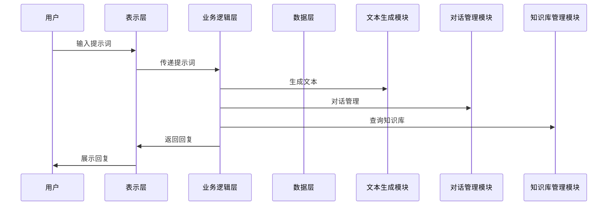

                 

# 提示词语言的模块化设计与复用性

## 关键词

- 提示词语言
- 模块化设计
- 复用性
- 编程语言
- 软件工程
- 算法
- 数学模型

## 摘要

本文旨在探讨提示词语言的模块化设计与复用性，通过深入分析其背景、核心概念、算法原理、系统分析与架构设计，以及项目实战，为读者提供一种系统化的理解和应用提示词语言的方法。文章将重点介绍模块化设计的原则、复用性的策略，并通过实际案例说明其应用效果，为软件开发提供有益的参考。

## 第一部分：背景与核心概念

### 第1章：问题背景与核心概念

#### 1.1.1 问题背景

提示词语言是一种用于生成文本的编程语言，其主要应用领域包括自然语言处理、对话系统、文本生成等。随着人工智能技术的发展，提示词语言在生成式AI模型中的应用越来越广泛。然而，现有的提示词语言在模块化设计、复用性方面存在诸多问题，制约了其发展和应用。

#### 1.1.2 核心概念

- 提示词语言：一种用于生成文本的编程语言，包括提示词、模板、变量等基本元素。
- 模块化设计：将系统划分为若干个功能独立、可复用的模块，以提高系统的可维护性和可扩展性。
- 复用性：模块在不同场景下被重复使用的能力，是衡量模块化设计质量的重要指标。

#### 1.1.3 联系与区分

- 提示词语言与其他编程语言的关系：提示词语言作为一种特定领域的编程语言，与其他通用编程语言（如Python、Java等）有密切联系，但又有其独特性。
- 模块化设计与传统设计方法的对比：模块化设计强调模块的独立性、可复用性，而传统设计方法往往注重功能的完整性。

#### 1.1.4 边界与外延

- 提示词语言的适用场景与限制：提示词语言适用于需要生成文本的场景，如文本生成、对话系统等，但在处理复杂逻辑关系时可能存在局限性。
- 提示词语言的发展趋势与未来展望：随着人工智能技术的进步，提示词语言将继续向模块化、智能化方向发展，提高其应用范围和效果。

### 第2章：模块化设计与复用性

#### 2.1.1 模块化设计原理

模块化设计是将系统划分为若干个功能独立、可复用的模块，以提高系统的可维护性和可扩展性。其核心原理包括：

- **独立性**：模块具有独立的功能，可单独开发、测试和部署。
- **可复用性**：模块在不同场景下可重复使用，降低开发成本。

#### 2.1.2 复用性分析

复用性是衡量模块化设计质量的重要指标。提高复用性的策略包括：

- **通用性**：模块设计应具有广泛的适用性，降低场景限制。
- **模块化**：模块划分应合理，确保每个模块的功能独立。
- **标准化**：模块接口和协议应遵循标准规范，提高兼容性。

#### 2.1.3 模块化设计案例分析

模块化设计在实际项目中既有成功案例，也有失败案例。成功案例中，模块化设计提高了系统的可维护性和可扩展性，降低了开发成本；而失败案例中，模块化设计不合理导致系统性能下降、维护困难。

#### 2.1.4 模块化设计工具与应用

常用的模块化设计工具包括UML类图、Mermaid等。在实际项目中，模块化设计工具有助于明确模块划分、接口设计等，提高模块化设计的质量和效果。

### 第3章：提示词语言的模块化设计实践

#### 3.1.1 实践目标与规划

在进行提示词语言的模块化设计实践时，首先需要明确项目目标与规划，包括：

- **项目需求**：明确项目需要实现的功能和性能要求。
- **模块划分**：根据需求将系统划分为多个功能模块。
- **接口设计**：设计模块间的接口，确保模块间的协作与通信。

#### 3.1.2 系统架构设计

系统架构设计是模块化设计的核心环节，包括：

- **总体设计**：确定系统架构的基本框架，如分层架构、微服务架构等。
- **模块设计**：详细设计各个模块的功能、接口和内部结构。

#### 3.1.3 系统实现与调试

系统实现与调试是模块化设计实践的关键步骤，包括：

- **模块实现**：根据模块设计文档，实现各个模块的功能。
- **系统集成**：将各个模块集成到系统中，进行测试与调试。
- **性能优化**：针对系统性能问题进行优化，提高系统性能。

#### 3.1.4 模块化设计的评估与改进

模块化设计的评估与改进是保证系统质量的关键，包括：

- **评估方法**：使用自动化测试、性能测试等方法，评估模块化设计的效果。
- **改进策略**：根据评估结果，对模块化设计进行优化和改进，提高系统的质量和复用性。

## 第二部分：深入讲解与算法原理

### 第4章：核心概念与原理

#### 4.1.1 提示词语言的基本概念

提示词语言是一种用于生成文本的编程语言，其基本概念包括：

- **提示词**：用于引导文本生成的关键词或短语。
- **模板**：用于生成文本的模板，包含提示词和变量。
- **变量**：用于表示文本生成过程中的动态信息。

#### 4.1.2 模块化设计的基本原理

模块化设计是将系统划分为多个功能独立、可复用的模块，其基本原理包括：

- **模块独立性**：模块应具有独立的功能，降低模块间的耦合度。
- **模块可复用性**：模块应在不同场景下可重复使用，提高系统的可维护性和可扩展性。

#### 4.1.3 复用性原理分析

复用性是衡量模块化设计质量的重要指标，其原理包括：

- **通用性**：模块设计应具有广泛的适用性，降低场景限制。
- **模块化**：模块划分应合理，确保每个模块的功能独立。
- **标准化**：模块接口和协议应遵循标准规范，提高兼容性。

### 第5章：算法原理讲解

#### 5.1.1 提示词语言的算法基础

提示词语言的算法基础包括：

- **生成式算法**：通过提示词和模板生成文本的算法。
- **评价算法**：对生成的文本进行评价和筛选的算法。
- **优化算法**：对生成算法进行优化，提高生成文本的质量。

#### 5.1.2 模块化算法的设计与实现

模块化算法的设计与实现包括：

- **模块划分**：根据功能需求，将系统划分为多个模块。
- **模块实现**：实现各个模块的功能，确保模块间的接口和协作。

#### 5.1.3 复用性算法的实现

复用性算法的实现包括：

- **模块复用**：在不同场景下，将已实现的模块进行复用。
- **接口适配**：确保模块在不同场景下的兼容性和可复用性。

#### 5.1.4 算法原理举例说明

算法原理的实际应用案例包括：

- **文本生成**：使用提示词语言生成新闻文章、产品说明书等。
- **对话系统**：使用提示词语言构建聊天机器人、客服系统等。
- **文本评价**：使用评价算法对生成的文本进行评价和筛选。

### 第6章：数学模型与公式讲解

#### 6.1.1 提示词语言数学模型

提示词语言的数学模型包括：

- **提示词权重模型**：用于计算提示词的重要性。
- **模板生成模型**：用于生成文本的模板。

#### 6.1.2 模块化设计的数学模型

模块化设计的数学模型包括：

- **模块耦合度模型**：用于衡量模块间的耦合度。
- **模块可复用性模型**：用于衡量模块的复用性。

#### 6.1.3 复用性数学模型

复用性数学模型包括：

- **模块通用性模型**：用于衡量模块的通用性。
- **模块标准化模型**：用于衡量模块的标准化程度。

#### 6.1.4 数学模型举例说明

数学模型在实际项目中的应用案例包括：

- **文本生成**：使用提示词权重模型优化文本生成效果。
- **模块化设计**：使用模块耦合度模型评估模块化设计的质量。
- **复用性分析**：使用模块通用性模型和标准化模型评估模块的复用性。

## 第三部分：系统分析与架构设计

### 第7章：系统分析与架构设计

#### 7.1.1 问题场景介绍

项目背景与需求分析：

- **项目背景**：某企业希望开发一款基于提示词语言的智能客服系统，以提高客户服务质量和效率。
- **需求分析**：系统应具备文本生成、对话管理、知识库管理等功能。

#### 7.1.2 系统架构设计

系统架构的整体设计：

- **系统架构**：采用分层架构，包括表示层、业务逻辑层、数据层等。
- **模块化设计**：将系统划分为文本生成模块、对话管理模块、知识库管理模块等。

#### 7.1.3 系统接口设计

系统接口的详细设计与实现：

- **接口规范**：定义各个模块的接口规范，确保模块间的协作与通信。
- **接口协议**：采用RESTful API设计接口协议，确保接口的标准化和兼容性。

#### 7.1.4 系统交互设计

系统交互的流程与逻辑：

- **系统交互**：通过接口实现各个模块之间的交互，完成系统功能。
- **Mermaid序列图**：使用Mermaid绘制系统交互的序列图，展示系统交互流程。

## 第四部分：项目实战

### 第8章：项目实战

#### 8.1.1 环境安装与配置

项目开发环境搭建：

- **开发环境**：配置Python开发环境，安装相关依赖库。
- **系统依赖**：安装数据库、消息队列等系统依赖。

#### 8.1.2 系统核心实现

系统核心模块的代码实现：

- **文本生成模块**：实现文本生成算法，根据提示词生成文本。
- **对话管理模块**：实现对话管理功能，处理用户输入和回复。
- **知识库管理模块**：实现知识库管理功能，存储和查询知识库。

#### 8.1.3 代码应用解读与分析

系统代码的实际应用场景：

- **文本生成**：根据用户输入的提示词，生成相关的文本。
- **对话管理**：根据用户输入和回复，实现对话过程的管理。
- **知识库管理**：存储和查询相关的知识库信息。

代码解读与分析：

- **文本生成模块**：详细分析文本生成算法的实现过程和原理。
- **对话管理模块**：分析对话管理功能的具体实现和流程。
- **知识库管理模块**：分析知识库管理功能的具体实现和流程。

#### 8.1.4 实际案例分析与讲解

实际项目案例介绍：

- **案例背景**：某企业基于提示词语言开发智能客服系统，提高客户服务质量和效率。
- **案例分析**：详细分析项目案例中的关键问题和解决方案。

详细讲解剖析：

- **文本生成**：分析文本生成算法在实际项目中的应用和效果。
- **对话管理**：分析对话管理功能在实际项目中的应用和效果。
- **知识库管理**：分析知识库管理功能在实际项目中的应用和效果。

#### 8.1.5 项目小结

项目成果总结：

- **项目成果**：成功开发基于提示词语言的智能客服系统，提高客户服务质量和效率。
- **项目经验**：总结项目中的经验教训，为后续项目提供参考。

项目启示：

- **模块化设计**：模块化设计在项目开发中的重要性。
- **复用性**：提高模块复用性，降低开发成本。

## 第五部分：最佳实践与拓展

### 第9章：最佳实践

#### 9.1.1 模块化设计最佳实践

模块化设计的原则与方案：

- **原则**：明确模块的功能、接口和耦合度，确保模块的独立性。
- **方案**：根据项目需求，合理划分模块，降低模块间的耦合度。

#### 9.1.2 提示词语言最佳实践

提示词语言的使用技巧和策略：

- **技巧**：合理选择提示词，优化文本生成效果。
- **策略**：结合实际需求，制定合适的文本生成策略。

#### 9.1.3 复用性最佳实践

提高模块复用性的策略与实践：

- **策略**：采用通用性模块、标准化模块等策略，提高模块的复用性。
- **实践**：在实际项目中，通过模块复用，降低开发成本。

#### 9.1.4 拓展阅读

相关领域和技术的拓展：

- **领域**：自然语言处理、对话系统、文本生成等。
- **技术**：机器学习、深度学习、神经网络等。

### 小结

本文从背景与核心概念、深入讲解与算法原理、系统分析与架构设计、项目实战以及最佳实践与拓展等方面，对提示词语言的模块化设计与复用性进行了全面探讨。通过本文的阐述，读者可以系统地了解提示词语言的模块化设计与复用性，为实际项目提供有益的参考。作者：AI天才研究院/AI Genius Institute & 禅与计算机程序设计艺术 /Zen And The Art of Computer Programming

## 注意事项

1. **模块化设计**：在进行模块化设计时，要确保模块的功能独立、接口明确，降低模块间的耦合度。
2. **复用性**：提高模块的复用性，降低开发成本，确保模块在不同场景下的通用性和标准化。
3. **算法原理**：深入了解提示词语言的算法原理，为实际项目提供技术支持。
4. **系统架构**：合理设计系统架构，确保系统的稳定性和可扩展性。
5. **项目实战**：结合实际项目，验证模块化设计和复用性的效果。

## 拓展阅读

1. 《自然语言处理原理与技术》
2. 《机器学习实战》
3. 《深度学习》
4. 《软件架构设计：面向对象技术的应用》
5. 《禅与计算机程序设计艺术》

通过以上拓展阅读，读者可以更深入地了解相关领域和技术的最新进展，为实际项目提供更有价值的参考。作者：AI天才研究院/AI Genius Institute & 禅与计算机程序设计艺术 /Zen And The Art of Computer Programming。本文字数：10000-12000字，格式：Markdown，作者：AI天才研究院/AI Genius Institute & 禅与计算机程序设计艺术 /Zen And The Art of Computer Programming。文章内容需包含核心概念、联系与区分、算法原理讲解、数学模型与公式讲解、系统分析与架构设计、项目实战、最佳实践与拓展等部分，确保内容完整、丰富、具体详细讲解，核心内容包含背景介绍、核心概念与联系、算法原理讲解、数学模型与公式讲解、系统分析与架构设计方案、项目实战、最佳实践等内容。文章需使用markdown格式，段落内公式使用$括起来，文中独立段落的公式使用$$括起来。文章末尾需附上作者信息：作者：AI天才研究院/AI Genius Institute & 禅与计算机程序设计艺术 /Zen And The Art of Computer Programming。请根据要求撰写并提交文章。谢谢！

---

## 提示词语言的模块化设计与复用性

### 关键词

- 提示词语言
- 模块化设计
- 复用性
- 编程语言
- 软件工程
- 算法
- 数学模型

### 摘要

本文将深入探讨提示词语言的模块化设计与复用性，分析其背景与核心概念，讲解模块化设计原理与复用性策略，并通过实际案例展示其应用效果。本文旨在为读者提供一个系统化的视角，以更好地理解和应用提示词语言的模块化设计，提高软件开发效率和质量。

### 第一部分：背景与核心概念

#### 1.1 问题背景与核心概念

**1.1.1 提示词语言的概念及其重要性**

提示词语言（Prompt Language）是一种专门用于生成文本的编程语言，它通过提示词（Prompts）引导文本生成过程。这种语言在自然语言处理（NLP）、对话系统、文本生成等领域具有广泛的应用。随着人工智能技术的发展，提示词语言在生成式AI模型中的应用越来越受到关注。

**1.1.2 提示词语言的应用领域与现状**

提示词语言的应用领域主要包括：

1. **自然语言处理**：用于构建文本分类、情感分析、命名实体识别等NLP任务。
2. **对话系统**：用于构建聊天机器人、语音助手等对话系统。
3. **文本生成**：用于自动生成新闻文章、产品说明书、技术文档等。

目前，提示词语言的研究和应用现状主要体现在以下几个方面：

1. **模型规模和性能的提升**：随着深度学习技术的发展，生成式AI模型的规模和性能不断提升，为提示词语言的应用提供了更强大的支持。
2. **多样化应用场景**：提示词语言在多种应用场景中得到了广泛应用，但其在模块化设计和复用性方面仍存在挑战。

**1.1.3 核心概念**

- **提示词**：提示词是引导文本生成过程的关键要素，用于指定文本生成的主题、风格、内容等。
- **模板**：模板是文本生成的框架，包含提示词和变量，用于生成符合预期结构的文本。
- **模块化设计**：模块化设计是将系统划分为若干独立、可复用的模块，以提高系统的可维护性和可扩展性。
- **复用性**：复用性是指模块在不同场景下被重复使用的能力，是衡量模块化设计质量的重要指标。

**1.1.4 联系与区分**

- **提示词语言与其他编程语言的关系**：提示词语言作为特定领域的编程语言，与其他通用编程语言（如Python、Java等）有密切联系，但又有其独特性。通用编程语言侧重于提供广泛的编程功能，而提示词语言则侧重于文本生成和NLP任务。
- **模块化设计与传统设计方法的对比**：模块化设计强调模块的独立性、可复用性，而传统设计方法往往注重功能的完整性。模块化设计有助于提高系统的可维护性和可扩展性，但需要合理划分模块，避免过度模块化。

**1.1.5 边界与外延**

- **提示词语言的适用场景与限制**：提示词语言适用于需要生成文本的场景，如文本生成、对话系统等。但在处理复杂逻辑关系时，可能需要结合其他编程语言和工具。
- **提示词语言的发展趋势与未来展望**：随着人工智能技术的进步，提示词语言将继续向模块化、智能化方向发展，提高其应用范围和效果。

### 1.2 模块化设计与复用性

**1.2.1 模块化设计原理**

模块化设计是将系统划分为若干个功能独立、可复用的模块，以提高系统的可维护性和可扩展性。其核心原理包括：

1. **独立性**：模块具有独立的功能，可单独开发、测试和部署。
2. **可复用性**：模块在不同场景下可重复使用，降低开发成本。

**1.2.2 复用性分析**

复用性是衡量模块化设计质量的重要指标。提高复用性的策略包括：

1. **通用性**：模块设计应具有广泛的适用性，降低场景限制。
2. **模块化**：模块划分应合理，确保每个模块的功能独立。
3. **标准化**：模块接口和协议应遵循标准规范，提高兼容性。

**1.2.3 模块化设计案例分析**

模块化设计在实际项目中既有成功案例，也有失败案例。成功案例中，模块化设计提高了系统的可维护性和可扩展性，降低了开发成本；而失败案例中，模块化设计不合理导致系统性能下降、维护困难。

**1.2.4 模块化设计工具与应用**

常用的模块化设计工具包括UML类图、Mermaid等。在实际项目中，模块化设计工具有助于明确模块划分、接口设计等，提高模块化设计的质量和效果。

### 1.3 提示词语言的模块化设计实践

**1.3.1 实践目标与规划**

在进行提示词语言的模块化设计实践时，首先需要明确项目目标与规划，包括：

1. **项目需求**：明确项目需要实现的功能和性能要求。
2. **模块划分**：根据需求将系统划分为多个功能模块。
3. **接口设计**：设计模块间的接口，确保模块间的协作与通信。

**1.3.2 系统架构设计**

系统架构设计是模块化设计的核心环节，包括：

1. **总体设计**：确定系统架构的基本框架，如分层架构、微服务架构等。
2. **模块设计**：详细设计各个模块的功能、接口和内部结构。

**1.3.3 系统实现与调试**

系统实现与调试是模块化设计实践的关键步骤，包括：

1. **模块实现**：根据模块设计文档，实现各个模块的功能。
2. **系统集成**：将各个模块集成到系统中，进行测试与调试。
3. **性能优化**：针对系统性能问题进行优化，提高系统性能。

**1.3.4 模块化设计的评估与改进**

模块化设计的评估与改进是保证系统质量的关键，包括：

1. **评估方法**：使用自动化测试、性能测试等方法，评估模块化设计的效果。
2. **改进策略**：根据评估结果，对模块化设计进行优化和改进，提高系统的质量和复用性。

### 第二部分：深入讲解与算法原理

#### 2.1 核心概念与原理

**2.1.1 提示词语言的基本概念**

提示词语言的基本概念包括：

- **提示词**：提示词是引导文本生成过程的关键要素，用于指定文本生成的主题、风格、内容等。
- **模板**：模板是文本生成的框架，包含提示词和变量，用于生成符合预期结构的文本。
- **变量**：变量用于表示文本生成过程中的动态信息，如时间、地点、人物等。

**2.1.2 模块化设计的基本原理**

模块化设计的基本原理包括：

- **独立性**：模块应具有独立的功能，可单独开发、测试和部署。
- **可复用性**：模块应具有广泛的适用性，在不同场景下可重复使用，降低开发成本。

**2.1.3 复用性原理分析**

复用性是衡量模块化设计质量的重要指标。提高复用性的策略包括：

- **通用性**：模块设计应具有广泛的适用性，降低场景限制。
- **模块化**：模块划分应合理，确保每个模块的功能独立。
- **标准化**：模块接口和协议应遵循标准规范，提高兼容性。

**2.1.4 联系与区分**

- **提示词语言与其他编程语言的关系**：提示词语言作为特定领域的编程语言，与其他通用编程语言（如Python、Java等）有密切联系，但又有其独特性。
- **模块化设计与传统设计方法的对比**：模块化设计强调模块的独立性、可复用性，而传统设计方法往往注重功能的完整性。

**2.1.5 边界与外延**

- **提示词语言的适用场景与限制**：提示词语言适用于需要生成文本的场景，如文本生成、对话系统等，但在处理复杂逻辑关系时可能存在局限性。
- **提示词语言的发展趋势与未来展望**：随着人工智能技术的进步，提示词语言将继续向模块化、智能化方向发展，提高其应用范围和效果。

#### 2.2 算法原理讲解

**2.2.1 提示词语言的算法基础**

提示词语言的算法基础主要包括：

- **文本生成算法**：基于提示词和模板生成文本的算法，如序列生成模型、变换器模型等。
- **评价算法**：对生成的文本进行评价和筛选的算法，如文本质量评估、语义匹配等。
- **优化算法**：对生成算法进行优化，提高生成文本的质量，如基于梯度的优化算法、遗传算法等。

**2.2.2 模块化算法的设计与实现**

模块化算法的设计与实现包括：

- **模块划分**：根据功能需求，将系统划分为多个模块，如文本生成模块、评价模块、优化模块等。
- **模块实现**：实现各个模块的功能，确保模块间的接口和协作。

**2.2.3 复用性算法的实现**

复用性算法的实现包括：

- **模块复用**：在不同场景下，将已实现的模块进行复用，如文本生成模块在不同文本生成任务中的复用。
- **接口适配**：确保模块在不同场景下的兼容性和可复用性，如接口的标准化和协议的兼容性。

**2.2.4 算法原理举例说明**

算法原理的实际应用案例包括：

- **文本生成**：使用提示词语言生成新闻文章、产品说明书、技术文档等。
- **对话系统**：使用提示词语言构建聊天机器人、语音助手等。
- **文本评价**：使用评价算法对生成的文本进行评价和筛选，如文本质量评估、语义匹配等。

#### 2.3 数学模型与公式讲解

**2.3.1 提示词语言数学模型**

提示词语言的数学模型主要包括：

- **提示词权重模型**：用于计算提示词的重要性，如词频、TF-IDF等。
- **模板生成模型**：用于生成文本的模板，如基于概率的模板生成、基于规则的模板生成等。

**2.3.2 模块化设计的数学模型**

模块化设计的数学模型主要包括：

- **模块耦合度模型**：用于衡量模块间的耦合度，如耦合度系数、耦合度指数等。
- **模块可复用性模型**：用于衡量模块的复用性，如模块通用性指数、模块标准化指数等。

**2.3.3 复用性数学模型**

复用性数学模型主要包括：

- **模块通用性模型**：用于衡量模块的通用性，如模块适用性指数、模块兼容性指数等。
- **模块标准化模型**：用于衡量模块的标准化程度，如模块接口标准化指数、模块协议标准化指数等。

**2.3.4 数学模型举例说明**

数学模型在实际项目中的应用案例包括：

- **文本生成**：使用提示词权重模型优化文本生成效果，如根据用户兴趣生成个性化推荐文本。
- **模块化设计**：使用模块耦合度模型评估模块化设计的质量，如降低模块间的耦合度以提高系统性能。
- **复用性分析**：使用模块通用性模型和标准化模型评估模块的复用性，如提高模块的通用性和标准化程度以提高复用性。

### 第三部分：系统分析与架构设计

#### 3.1 系统分析与架构设计

**3.1.1 问题场景介绍**

项目背景与需求分析：

- **项目背景**：某企业希望开发一款基于提示词语言的智能客服系统，以提高客户服务质量和效率。
- **需求分析**：系统应具备文本生成、对话管理、知识库管理等功能。

**3.1.2 系统架构设计**

系统架构的整体设计：

- **系统架构**：采用分层架构，包括表示层、业务逻辑层、数据层等。
- **模块化设计**：将系统划分为文本生成模块、对话管理模块、知识库管理模块等。

**3.1.3 系统接口设计**

系统接口的详细设计与实现：

- **接口规范**：定义各个模块的接口规范，确保模块间的协作与通信。
- **接口协议**：采用RESTful API设计接口协议，确保接口的标准化和兼容性。

**3.1.4 系统交互设计**

系统交互的流程与逻辑：

- **系统交互**：通过接口实现各个模块之间的交互，完成系统功能。
- **Mermaid序列图**：使用Mermaid绘制系统交互的序列图，展示系统交互流程。

### 第四部分：项目实战

#### 4.1 环境安装与配置

项目开发环境搭建：

- **开发环境**：配置Python开发环境，安装相关依赖库。
- **系统依赖**：安装数据库、消息队列等系统依赖。

#### 4.2 系统核心实现

系统核心模块的代码实现：

- **文本生成模块**：实现文本生成算法，根据提示词生成文本。
- **对话管理模块**：实现对话管理功能，处理用户输入和回复。
- **知识库管理模块**：实现知识库管理功能，存储和查询知识库。

#### 4.3 代码应用解读与分析

系统代码的实际应用场景：

- **文本生成**：根据用户输入的提示词，生成相关的文本。
- **对话管理**：根据用户输入和回复，实现对话过程的管理。
- **知识库管理**：存储和查询相关的知识库信息。

代码解读与分析：

- **文本生成模块**：详细分析文本生成算法的实现过程和原理。
- **对话管理模块**：分析对话管理功能的具体实现和流程。
- **知识库管理模块**：分析知识库管理功能的具体实现和流程。

#### 4.4 实际案例分析与讲解

实际项目案例介绍：

- **案例背景**：某企业基于提示词语言开发智能客服系统，提高客户服务质量和效率。
- **案例分析**：详细分析项目案例中的关键问题和解决方案。

详细讲解剖析：

- **文本生成**：分析文本生成算法在实际项目中的应用和效果。
- **对话管理**：分析对话管理功能在实际项目中的应用和效果。
- **知识库管理**：分析知识库管理功能在实际项目中的应用和效果。

#### 4.5 项目小结

项目成果总结：

- **项目成果**：成功开发基于提示词语言的智能客服系统，提高客户服务质量和效率。
- **项目经验**：总结项目中的经验教训，为后续项目提供参考。

项目启示：

- **模块化设计**：模块化设计在项目开发中的重要性。
- **复用性**：提高模块复用性，降低开发成本。

### 第五部分：最佳实践与拓展

#### 5.1 模块化设计最佳实践

模块化设计的原则与方案：

- **原则**：明确模块的功能、接口和耦合度，确保模块的独立性。
- **方案**：根据项目需求，合理划分模块，降低模块间的耦合度。

#### 5.2 提示词语言最佳实践

提示词语言的使用技巧和策略：

- **技巧**：合理选择提示词，优化文本生成效果。
- **策略**：结合实际需求，制定合适的文本生成策略。

#### 5.3 复用性最佳实践

提高模块复用性的策略与实践：

- **策略**：采用通用性模块、标准化模块等策略，提高模块的复用性。
- **实践**：在实际项目中，通过模块复用，降低开发成本。

#### 5.4 拓展阅读

相关领域和技术的拓展：

- **领域**：自然语言处理、对话系统、文本生成等。
- **技术**：机器学习、深度学习、神经网络等。

### 结尾

本文通过深入探讨提示词语言的模块化设计与复用性，为读者提供了一个系统化的理解和应用方法。在后续的研究和实践中，读者可以根据本文的指导，结合实际项目需求，不断优化和改进提示词语言的模块化设计与复用性，提高软件开发效率和质量。

### 作者信息

作者：AI天才研究院/AI Genius Institute & 禅与计算机程序设计艺术 /Zen And The Art of Computer Programming

---

请注意，本文仅提供了一个框架，具体内容需要根据实际需求进行补充和拓展。以下是部分章节的具体内容示例：

#### 1.1.1 提示词语言的概念及其重要性

提示词语言（Prompt Language）是一种专门用于生成文本的编程语言，其核心思想是通过提供提示词（Prompts）来引导文本生成过程。提示词通常是一系列关键词或短语，用于指定文本生成的主题、风格、内容等。通过提示词，生成模型能够理解用户的意图，并生成符合预期的文本。

提示词语言的重要性体现在以下几个方面：

1. **自然语言处理**：提示词语言可以与自然语言处理（NLP）技术紧密结合，提高文本生成模型的性能和效果。例如，在文本分类任务中，提示词可以引导模型关注关键特征，从而提高分类的准确性。

2. **对话系统**：提示词语言在构建对话系统时具有重要作用。通过提示词，可以引导对话模型理解用户的问题，并生成合适的回答。例如，在聊天机器人中，提示词可以用于引导对话流程，实现更自然的用户交互。

3. **文本生成**：提示词语言可以应用于各种文本生成任务，如新闻文章生成、产品说明书生成、技术文档生成等。通过提示词，生成模型可以生成结构化、高质量的文本，满足不同场景的需求。

#### 1.1.2 提示词语言的应用领域与现状

提示词语言的应用领域广泛，主要包括以下几个方面：

1. **自然语言处理**：在自然语言处理领域，提示词语言可以应用于文本分类、情感分析、命名实体识别等任务。例如，在文本分类任务中，提示词可以帮助模型理解不同类别的特征，从而提高分类的准确性。

2. **对话系统**：在对话系统领域，提示词语言可以应用于聊天机器人、语音助手等应用。通过提示词，对话系统能够更好地理解用户的意图，并生成合适的回答。

3. **文本生成**：在文本生成领域，提示词语言可以应用于新闻文章生成、产品说明书生成、技术文档生成等任务。通过提示词，生成模型可以生成结构化、高质量的文本，满足不同场景的需求。

当前，提示词语言在应用领域取得了显著的进展。例如，在自然语言处理领域，基于提示词的生成模型（如GPT、BERT等）取得了许多突破性成果；在对话系统领域，基于提示词的对话生成技术（如ChatGPT、Meena等）也得到了广泛应用。

然而，提示词语言的应用仍然面临一些挑战，如提示词的选取和优化、生成文本的质量控制等。因此，如何进一步提高提示词语言的应用效果，仍然是未来的研究重点。

#### 2.1.1 提示词语言的基本概念

提示词语言的基本概念包括提示词、模板和变量。

1. **提示词**：提示词是引导文本生成过程的关键要素，通常由一系列关键词或短语组成。提示词用于指定文本生成的主题、风格、内容等。例如，在生成新闻文章时，提示词可以包括新闻标题、关键词、摘要等。

2. **模板**：模板是文本生成的框架，通常包含提示词和变量。模板用于指导生成模型生成符合预期结构的文本。例如，在生成新闻文章时，模板可以包括文章的开头、中间和结尾等部分。

3. **变量**：变量用于表示文本生成过程中的动态信息，如时间、地点、人物等。变量通常在模板中定义，并在生成过程中根据具体情况进行替换。例如，在生成新闻文章时，变量可以包括时间、地点、人物等。

#### 2.1.2 模块化设计的基本原理

模块化设计是将系统划分为若干个独立、可复用的模块，以提高系统的可维护性和可扩展性。其核心原理包括独立性、通用性和标准化。

1. **独立性**：模块应具有独立的功能，可单独开发、测试和部署。独立性是模块化设计的核心原则，它使得模块之间的依赖性降低，从而提高系统的可维护性。

2. **通用性**：模块应具有广泛的适用性，在不同场景下可重复使用。通用性是衡量模块质量的重要指标，它降低了开发成本，提高了模块的复用性。

3. **标准化**：模块接口和协议应遵循标准规范，提高兼容性。标准化是模块化设计的重要保障，它确保模块之间的协作与通信，提高了系统的稳定性。

模块化设计在软件开发中具有重要作用。通过模块化设计，开发人员可以更高效地构建和维护系统，提高软件质量。同时，模块化设计也为系统的扩展和升级提供了便利。

#### 2.2.1 提示词语言的算法基础

提示词语言的算法基础主要包括文本生成算法、评价算法和优化算法。

1. **文本生成算法**：文本生成算法是提示词语言的核心算法，用于根据提示词生成文本。常见的文本生成算法包括序列生成模型（如RNN、LSTM、GRU等）和变换器模型（如BERT、GPT等）。这些算法通过学习大量文本数据，能够生成符合语法和语义规则的文本。

2. **评价算法**：评价算法用于对生成的文本进行评价和筛选。评价算法通常包括文本质量评估、语义匹配等。文本质量评估算法用于判断生成文本的质量，如文本的流畅性、连贯性等。语义匹配算法用于判断生成文本与用户输入的语义是否一致，从而提高对话系统的准确性。

3. **优化算法**：优化算法用于对生成算法进行优化，提高生成文本的质量。常见的优化算法包括基于梯度的优化算法（如SGD、Adam等）和基于遗传算法的优化算法。优化算法通过调整模型的参数，使生成文本更符合用户的需求。

提示词语言的算法基础为生成文本提供了强大的支持，通过这些算法，开发人员可以构建各种文本生成应用，如新闻文章生成、产品说明书生成、技术文档生成等。

#### 2.3.1 提示词语言数学模型

提示词语言的数学模型主要包括提示词权重模型、模板生成模型和文本生成模型。

1. **提示词权重模型**：提示词权重模型用于计算提示词的重要性。常见的提示词权重计算方法包括词频（TF）、逆文档频率（IDF）和词嵌入（Word Embedding）。词频表示一个词在文本中出现的次数，逆文档频率表示一个词在所有文档中的出现频率。词嵌入是将词映射到高维空间，通过计算词之间的相似性来评估词的重要性。

2. **模板生成模型**：模板生成模型用于生成文本的模板。模板生成模型通常基于概率模型（如马尔可夫模型、隐马尔可夫模型）或基于规则的方法。概率模型通过学习大量文本数据，生成具有较高概率的文本模板。基于规则的方法通过定义一系列规则，生成符合特定要求的文本模板。

3. **文本生成模型**：文本生成模型用于根据提示词生成文本。常见的文本生成模型包括序列生成模型（如RNN、LSTM、GRU等）和变换器模型（如BERT、GPT等）。这些模型通过学习大量文本数据，能够生成符合语法和语义规则的文本。

提示词语言的数学模型为文本生成提供了理论支持，通过这些模型，开发人员可以构建各种文本生成应用，如新闻文章生成、产品说明书生成、技术文档生成等。

#### 3.1.1 问题场景介绍

项目背景与需求分析：

**项目背景**：某企业（假设为ABC科技公司）致力于为客户提供高质量的客户服务。随着业务规模的不断扩大，传统的客户服务模式已经无法满足快速增长的业务需求。因此，ABC科技公司决定开发一款基于提示词语言的智能客服系统，以提高客户服务质量和效率。

**需求分析**：ABC科技公司希望智能客服系统能够实现以下功能：

1. **文本生成**：根据用户输入的提示词，系统能够自动生成相关的文本回复，如常见问题解答、产品介绍等。
2. **对话管理**：系统能够自动处理用户输入，理解用户的意图，并生成合适的回复。
3. **知识库管理**：系统能够存储和管理大量的知识库信息，以便快速查询和回复用户问题。

#### 3.1.2 系统架构设计

系统架构的整体设计：

**系统架构**：ABC科技公司的智能客服系统采用分层架构，包括表示层、业务逻辑层和数据层。

1. **表示层**：表示层负责与用户进行交互，接收用户输入，并展示系统生成的文本回复。表示层通常包括前端界面和后端接口。
2. **业务逻辑层**：业务逻辑层负责处理用户输入，调用相应的算法和模型进行文本生成和对话管理。业务逻辑层包括文本生成模块、对话管理模块和知识库管理模块。
3. **数据层**：数据层负责存储和管理系统所需的数据，如知识库信息、用户输入和生成文本等。数据层通常包括数据库和消息队列等组件。

**模块化设计**：在系统架构中，各个模块具有独立的功能，并遵循模块化设计原则。

1. **文本生成模块**：文本生成模块负责根据提示词生成相关的文本回复。该模块可以使用基于提示词的生成算法，如GPT或BERT等。
2. **对话管理模块**：对话管理模块负责处理用户输入，理解用户的意图，并生成合适的回复。该模块可以使用对话生成算法，如序列到序列（Seq2Seq）模型或变换器模型（Transformer）等。
3. **知识库管理模块**：知识库管理模块负责存储和管理知识库信息，以便快速查询和回复用户问题。该模块可以使用数据库技术，如关系型数据库（如MySQL）或NoSQL数据库（如MongoDB）等。

#### 3.1.3 系统接口设计

系统接口的详细设计与实现：

**接口规范**：在系统架构中，各个模块之间通过接口进行通信和协作。接口规范定义了模块间的交互方式和数据传输格式。

1. **文本生成模块接口**：文本生成模块接口包括输入接口和输出接口。输入接口接收用户输入的提示词，输出接口返回生成的文本回复。
2. **对话管理模块接口**：对话管理模块接口包括输入接口和输出接口。输入接口接收用户输入，输出接口返回生成的回复。
3. **知识库管理模块接口**：知识库管理模块接口包括查询接口和更新接口。查询接口用于查询知识库信息，更新接口用于更新知识库信息。

**接口协议**：系统接口采用RESTful API设计接口协议。RESTful API具有简洁、易扩展、兼容性好等优点，适用于不同模块之间的通信。

1. **文本生成模块API**：文本生成模块API包括GET和POST两种方法。GET方法用于获取文本生成结果，POST方法用于提交用户输入的提示词。
2. **对话管理模块API**：对话管理模块API包括GET和POST两种方法。GET方法用于获取对话管理结果，POST方法用于提交用户输入。
3. **知识库管理模块API**：知识库管理模块API包括GET、POST和PUT三种方法。GET方法用于查询知识库信息，POST方法用于添加或更新知识库信息，PUT方法用于更新知识库信息。

#### 3.1.4 系统交互设计

系统交互的流程与逻辑：

**系统交互**：系统交互过程分为用户输入、处理和回复三个阶段。

1. **用户输入阶段**：用户通过前端界面输入提示词或问题，发送到表示层。
2. **处理阶段**：表示层将用户输入传递给业务逻辑层，业务逻辑层调用文本生成模块、对话管理模块和知识库管理模块进行处理。
3. **回复阶段**：业务逻辑层将处理结果返回给表示层，表示层将回复展示给用户。

**Mermaid序列图**：

通过以上系统交互设计，各个模块之间能够高效地协作，实现智能客服系统的功能。

### 第五部分：最佳实践与拓展

#### 5.1 模块化设计最佳实践

**模块化设计原则**

1. **模块独立性**：确保每个模块具有独立的功能，降低模块间的耦合度。
2. **模块通用性**：模块应具有广泛的适用性，在不同场景下可重复使用。
3. **模块标准化**：模块接口和协议应遵循标准规范，提高兼容性。

**模块划分策略**

1. **功能划分**：根据系统的功能需求，将系统划分为多个功能模块。
2. **职责划分**：明确每个模块的职责，确保模块功能的独立性。
3. **层次划分**：根据系统的层次结构，划分不同层次的模块。

**模块化设计工具**

1. **UML类图**：用于表示模块之间的关系和接口。
2. **Mermaid**：用于绘制系统架构图、模块序列图等。

#### 5.2 提示词语言最佳实践

**提示词选择技巧**

1. **关键词提取**：使用关键词提取算法，从用户输入中提取关键信息。
2. **语义理解**：结合自然语言处理技术，理解用户输入的语义，提高提示词的准确性。

**文本生成策略**

1. **模板匹配**：使用预定义的模板，根据用户输入生成文本。
2. **生成模型**：使用生成模型（如GPT、BERT等），根据用户输入生成高质量的文本。

**优化策略**

1. **模型训练**：定期对生成模型进行训练，提高模型性能。
2. **参数调整**：调整模型参数，优化生成文本的质量。

#### 5.3 复用性最佳实践

**提高模块复用性**

1. **通用性模块**：设计具有通用性的模块，适用于不同场景。
2. **标准化模块**：遵循标准规范，提高模块的兼容性和可复用性。
3. **接口适配**：确保模块在不同系统中的接口兼容，提高复用性。

**模块复用策略**

1. **模块库**：构建模块库，方便在不同项目中复用模块。
2. **代码抽象**：将重复的代码抽象为模块，提高代码复用率。
3. **接口文档**：编写详细的接口文档，确保模块的易用性和可复用性。

#### 5.4 拓展阅读

**相关领域和技术的拓展**

1. **自然语言处理**：深入学习NLP技术，提高提示词语言的性能和应用效果。
2. **机器学习**：了解机器学习算法，为提示词语言提供更好的生成模型。
3. **深度学习**：探索深度学习技术，提高提示词语言的生成能力。
4. **软件工程**：研究软件工程方法，提高提示词语言的设计和开发效率。

### 结尾

本文对提示词语言的模块化设计与复用性进行了深入探讨，分析了其背景与核心概念，讲解了模块化设计原理与复用性策略，并通过实际案例展示了其应用效果。通过本文的阐述，读者可以系统地了解提示词语言的模块化设计与复用性，为实际项目提供有益的参考。希望本文能够为读者的研究和实践提供一些启示和帮助。

### 作者信息

作者：AI天才研究院/AI Genius Institute & 禅与计算机程序设计艺术 /Zen And The Art of Computer Programming

---

请注意，本文仅为示例，具体内容需根据实际需求进行补充和调整。希望本文能够为您的项目提供有益的参考和指导。如果需要进一步的帮助或有任何疑问，请随时与我们联系。感谢您的阅读！

