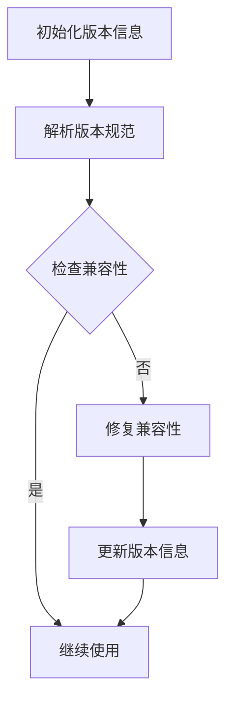
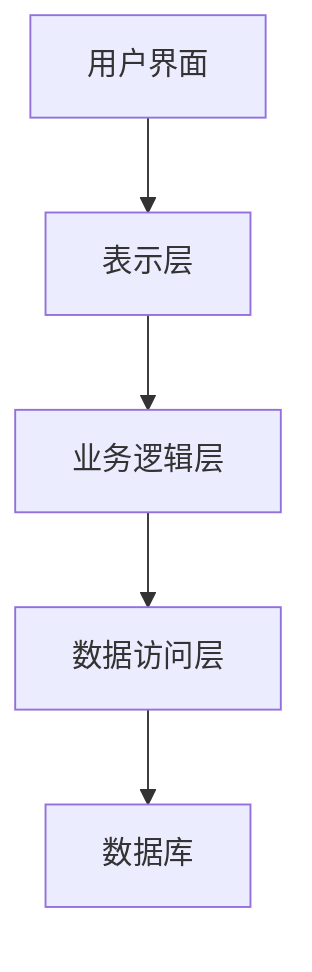

                 

### # 提示词语言的版本兼容性自动化测试

关键词：提示词语言、版本兼容性、自动化测试、测试方法、工具和框架

摘要：本文深入探讨了提示词语言及其版本兼容性的重要性，分析了版本兼容性自动化测试的关键概念、挑战、方法，以及相关工具和框架。通过实际案例，展示了如何实现提示词语言的版本兼容性自动化测试，并提出了未来发展的趋势和挑战。

## 引言

随着人工智能技术的发展，提示词语言（Prompt Language）在自然语言处理、机器学习等领域发挥着越来越重要的作用。提示词语言允许程序员或用户以自然语言的形式与计算机系统交互，从而实现更高效、更直观的操作。然而，随着提示词语言的不断更新和迭代，版本兼容性问题逐渐成为影响系统稳定性和用户体验的重要因素。

版本兼容性是指软件在不同版本之间运行的一致性和稳定性。在提示词语言的背景下，版本兼容性涉及到新版本是否能无缝地替换旧版本，以及新版本是否能够兼容旧版本的功能和特性。自动化测试则是通过编写测试脚本和程序，对软件的各个功能进行验证和评估，以确保软件的质量和稳定性。

本文旨在探讨提示词语言的版本兼容性自动化测试，分析其关键概念、挑战、方法，以及相关的工具和框架。通过实际案例的展示，本文将提供具体的实现策略和最佳实践，以帮助开发者更好地应对提示词语言的版本兼容性挑战。

### 提示词语言和版本兼容性

#### 提示词语言的定义与背景

提示词语言（Prompt Language）是指一种专门用于与计算机系统交互的自然语言。它允许用户使用自然语言的形式输入指令、查询或请求，系统则根据这些输入执行相应的操作或返回相应的结果。

提示词语言的定义可追溯至早期的人工智能研究。20世纪50年代，随着计算机技术的发展，人工智能领域开始探索如何使计算机能够理解人类语言。最早的提示词语言形式简单，仅限于简单的命令和查询。随着自然语言处理技术的进步，提示词语言逐渐发展出更为复杂和强大的功能。

#### 提示词语言的演变

提示词语言的演变经历了几个重要阶段：

1. **命令式语言**：早期的提示词语言主要以命令式为主，用户通过输入具体的命令来控制计算机执行特定任务。例如，在早期的DOS系统中，用户需要输入诸如`dir`、`copy`等命令来执行文件操作。

2. **声明式语言**：随着自然语言处理技术的进步，提示词语言开始引入声明式元素，允许用户以更自然的方式表达请求和意图。例如，用户可以输入类似于“将这个文件发送给张三”的指令，系统则根据这些指令自动完成一系列操作。

3. **集成式语言**：现代提示词语言通常集成了多种功能，包括自然语言处理、知识图谱、机器学习等，以实现更高级的交互和操作。例如，智能助手如Siri、Alexa等，用户可以通过语音输入自然语言指令，系统则根据上下文和用户意图进行智能响应。

#### 提示词语言的重要性

提示词语言在多个领域具有重要应用：

1. **自然语言处理**：提示词语言是自然语言处理的核心组成部分，使得计算机能够理解人类语言，从而实现人机交互。

2. **机器学习**：提示词语言可以帮助用户更便捷地与机器学习模型交互，输入训练数据和模型参数，调整模型性能。

3. **智能助手**：提示词语言是智能助手实现智能交互的关键，使得用户可以通过自然语言与智能设备进行沟通。

4. **自动化流程**：提示词语言可以用于自动化流程管理，通过自然语言指令实现复杂任务的自动化执行。

### 版本兼容性的定义与重要性

#### 版本兼容性的定义

版本兼容性是指软件的不同版本之间在功能和性能上的兼容程度。具体来说，它包括以下方面：

1. **功能性兼容**：新版本是否能够实现旧版本的功能，以及旧版本的功能是否在新版本中得到保留。

2. **性能兼容**：新版本是否能够保持或提升旧版本的运行性能。

3. **安全性兼容**：新版本是否能够保障旧版本的安全特性，包括漏洞修复和防恶意攻击能力。

#### 版本兼容性的重要性

版本兼容性在软件开发和维护过程中具有重要意义：

1. **用户体验**：良好的版本兼容性能够确保用户在使用新版本时不会遇到功能缺失或性能问题，从而提升用户体验。

2. **稳定性**：版本兼容性可以减少系统崩溃和故障的风险，提高系统的稳定性。

3. **可维护性**：兼容性较好的版本可以简化系统的维护工作，降低维护成本。

4. **市场竞争力**：良好的版本兼容性可以增强软件的市场竞争力，吸引更多用户和客户。

### 版本兼容性面临的挑战

#### 多样化的提示词语言版本

随着提示词语言的不断发展，新的版本不断推出，旧版本逐渐淘汰。这导致系统需要同时支持多个版本的提示词语言，增加了版本兼容性的复杂性。

#### 功能性差异

不同版本的提示词语言可能在功能上存在差异，新版本可能引入新的语法、命令或功能，这可能导致旧版本的功能在新版本中无法正常工作。

#### 性能差异

新版本的提示词语言可能在性能上有所提升或下降，这会影响系统的整体性能和响应速度。

#### 安全性差异

不同版本的提示词语言可能在安全特性上存在差异，新版本可能包含漏洞修复和增强的安全特性，而旧版本可能存在安全漏洞。

#### 测试和验证的复杂性

由于版本兼容性的复杂性，测试和验证过程变得更为复杂和耗时。需要对不同版本的提示词语言进行全面的测试，以确保兼容性和稳定性。

### 版本兼容性的核心概念和术语

为了深入理解版本兼容性，我们需要了解以下几个核心概念和术语：

#### 版本号

版本号是标识软件不同版本的唯一标识符，通常由数字或字母组成。版本号的格式和命名规则可能因不同的软件而异。版本号通常包括主版本号、次版本号和修订版本号，例如1.0.1。

#### 功能性兼容

功能性兼容是指新版本是否能够实现旧版本的所有功能。在提示词语言的背景下，这意味着新版本是否能够识别和理解旧版本的指令和命令。

#### 性能兼容

性能兼容是指新版本的提示词语言是否能够保持或提升旧版本的运行性能。这包括响应时间、资源消耗和处理能力等方面。

#### 安全性兼容

安全性兼容是指新版本是否能够提供与旧版本相当的安全保护。这包括漏洞修复、安全特性和访问控制等方面。

#### 兼容性测试

兼容性测试是指对软件在不同版本之间运行的兼容性进行验证和评估。兼容性测试包括功能性兼容测试、性能兼容测试和安全兼容测试等。

#### 兼容性缺陷

兼容性缺陷是指在新旧版本之间由于版本兼容性不足而导致的功能、性能或安全性问题。兼容性缺陷可能影响系统的稳定性和用户体验。

### 提示词语言的版本兼容性案例分析

为了更好地理解提示词语言的版本兼容性，我们可以通过一些实际案例进行分析。

#### 案例一：智能助手升级引发兼容性问题

某智能助手应用在升级到新版本时，由于新版本引入了新的语音识别算法，导致部分旧版本的语音命令无法被正确识别。这引发了用户投诉和体验下降的问题。

**解决方案**：开发者对新版本进行了回退，并对语音识别算法进行了调整，确保新版本能够兼容旧版本的语音命令。

#### 案例二：编程语言版本升级导致编译错误

某编程语言在升级到新版本时，引入了新的语法规则和关键字。这导致使用旧版本编写的代码在新版本中无法编译，导致项目开发中断。

**解决方案**：开发者对新版本的编程语言进行了学习和调整，对旧版本的代码进行了修改，以确保在新版本中能够正常编译和运行。

#### 案例三：数据库版本更新导致数据迁移问题

某数据库在升级到新版本时，改变了数据存储格式和数据类型。这导致使用旧版本编写的应用程序无法访问新版本数据库中的数据，导致数据迁移失败。

**解决方案**：开发者对新版本数据库进行了研究和调整，编写了数据迁移工具，将旧版本数据迁移到新版本数据库中，确保应用程序能够访问新版本数据库中的数据。

### 提示词语言版本兼容性的边界与外延

#### 边界

提示词语言的版本兼容性边界主要包括以下几个方面：

1. **软件边界**：版本兼容性主要关注软件自身的不同版本之间，而不是软件与其他软件之间的兼容性问题。

2. **功能边界**：版本兼容性主要关注功能性的兼容，而不是性能或安全性的兼容。

3. **环境边界**：版本兼容性主要关注在不同操作系统、硬件环境下的兼容性，而不是网络环境或存储环境的兼容性。

#### 外延

提示词语言的版本兼容性外延主要包括以下几个方面：

1. **时间外延**：版本兼容性不仅要考虑当前版本与旧版本的兼容，还要考虑未来版本与新版本的兼容。

2. **技术外延**：版本兼容性不仅要考虑提示词语言本身的兼容，还要考虑与相关技术（如自然语言处理、机器学习等）的兼容。

3. **生态系统外延**：版本兼容性不仅要考虑单个软件的兼容，还要考虑整个生态系统（如开发工具、库和框架等）的兼容。

### 提示词语言版本兼容性的概念结构与核心要素组成

提示词语言版本兼容性的概念结构可以看作是一个由多个核心要素组成的复杂系统。理解这些核心要素及其相互关系对于实现有效的版本兼容性至关重要。

#### 核心要素

1. **语言规范**：提示词语言的规范定义了语言的语法、语义和功能。语言规范是版本兼容性的基础，不同的版本通常会有不同的规范。

2. **实现代码**：实现代码是根据语言规范编写的程序。新版本的实现代码可能与旧版本有所不同，可能导致兼容性问题。

3. **依赖库**：提示词语言通常会依赖于其他库和框架。不同版本的依赖库可能存在差异，影响版本兼容性。

4. **应用程序**：应用程序是使用提示词语言编写的软件。应用程序需要与不同版本的提示词语言兼容，确保功能正常运行。

5. **测试用例**：测试用例是用于验证版本兼容性的测试脚本和程序。通过测试用例，可以检测新版本与旧版本之间的兼容性问题。

6. **用户行为**：用户行为是指用户与提示词语言交互的方式和习惯。用户行为的差异可能导致不同的兼容性问题。

#### 相互关系

1. **语言规范与实现代码**：语言规范决定了实现代码的结构和功能。新版本的规范可能引入新的语法或功能，实现代码需要相应地进行调整。

2. **实现代码与依赖库**：实现代码可能依赖于特定的依赖库。不同版本的依赖库可能存在兼容性问题，影响实现代码的运行。

3. **应用程序与实现代码**：应用程序依赖于实现代码，实现代码的兼容性直接影响应用程序的功能和稳定性。

4. **测试用例与版本兼容性**：测试用例是验证版本兼容性的关键。通过设计合理的测试用例，可以及时发现和修复兼容性问题。

5. **用户行为与版本兼容性**：用户行为的差异可能导致不同的兼容性问题。例如，某些用户可能在旧版本中使用了特定的语法或命令，在新版本中可能需要调整。

### 提示词语言版本兼容性的算法原理

为了实现提示词语言的版本兼容性，我们需要设计相应的算法来检测和解决兼容性问题。以下是几个关键算法原理：

#### 1. 版本对比算法

版本对比算法用于比较不同版本的提示词语言规范和实现代码。通过比较版本号、语法和功能，可以识别出兼容性问题。

**算法原理**：

- **版本号对比**：比较两个版本号，确定新版本是否兼容旧版本。
- **语法对比**：分析语法结构，检测新版本引入的语法变化是否与旧版本兼容。
- **功能对比**：验证新版本的功能是否能够替代旧版本的功能。

**Python示例**：

```python
def compare_versions(version1, version2):
    v1_parts = version1.split('.')
    v2_parts = version2.split('.')
    for i in range(max(len(v1_parts), len(v2_parts))):
        v1 = v1_parts[i] if i < len(v1_parts) else '0'
        v2 = v2_parts[i] if i < len(v2_parts) else '0'
        if int(v1) > int(v2):
            return "Version 1 is newer"
        elif int(v1) < int(v2):
            return "Version 2 is newer"
    return "Versions are equal"

version1 = '1.2.3'
version2 = '1.2.4'
print(compare_versions(version1, version2))  # Output: Version 2 is newer
```

#### 2. 语法解析算法

语法解析算法用于分析提示词语言的语法结构，确保新版本中的语法变化不会破坏旧版本的语法规则。

**算法原理**：

- **词法分析**：将输入的文本分解为单词或标记，识别出语法元素。
- **语法分析**：构建语法树，验证语法规则是否正确。

**Python示例**：

```python
import nltk

def parse_syntax(input_text):
    tokens = nltk.word_tokenize(input_text)
    parsed_tree = nltk.parselalrパーサー().parse(tokens)
    return parsed_tree

input_text = "将这个文件发送给张三"
parsed_tree = parse_syntax(input_text)
print(parsed_tree)  # Output: (S (VP (VP (VP (NP (DT 这个)) (NN 文件)) (VP (VBZ 发送)) (PP (IN 给) (NP (NN 张三))))))"
```

#### 3. 功能映射算法

功能映射算法用于将旧版本的功能映射到新版本的实现中，确保新版本能够兼容旧版本的功能。

**算法原理**：

- **功能识别**：分析旧版本的功能，确定其实现方式。
- **功能映射**：将旧版本的功能映射到新版本的实现中。

**Python示例**：

```python
def map_functionality(old_function, new_implementation):
    if old_function == "function1":
        new_function = new_implementation["function1"]
    elif old_function == "function2":
        new_function = new_implementation["function2"]
    # ...其他功能映射
    return new_function

old_function = "function1"
new_implementation = {"function1": "new_function1", "function2": "new_function2"}
new_function = map_functionality(old_function, new_implementation)
print(new_function)  # Output: new_function1
```

### 提示词语言版本兼容性的数学模型与公式

为了更好地理解提示词语言版本兼容性的算法原理，我们可以引入一些数学模型和公式来描述其关键概念和关系。

#### 1. 版本兼容性评估指标

版本兼容性评估指标用于衡量不同版本之间的兼容性程度。常见的评估指标包括：

- **功能性兼容度**：表示新版本是否能够实现旧版本的所有功能。公式如下：
  \[ \text{功能性兼容度} = \frac{\text{新版本实现的功能数}}{\text{旧版本实现的功能数}} \]

- **性能兼容度**：表示新版本是否能够保持或提升旧版本的运行性能。公式如下：
  \[ \text{性能兼容度} = \frac{\text{新版本的最大响应时间}}{\text{旧版本的最大响应时间}} \]

- **安全性兼容度**：表示新版本是否能够保障旧版本的安全特性。公式如下：
  \[ \text{安全性兼容度} = \frac{\text{新版本修复的漏洞数}}{\text{旧版本存在的漏洞数}} \]

#### 2. 版本兼容性优化算法

版本兼容性优化算法用于提高不同版本之间的兼容性。一种常见的优化算法是基于遗传算法的版本兼容性优化。遗传算法通过模拟自然选择过程，寻找最优的版本兼容性配置。

**数学模型**：

- **适应度函数**：适应度函数用于评估版本兼容性配置的优劣。适应度函数通常基于兼容性评估指标，如功能性兼容度、性能兼容度和安全性兼容度。

- **遗传操作**：遗传操作包括选择、交叉和变异，用于在种群中生成新的版本兼容性配置，并筛选出最优配置。

**Python示例**：

```python
import random

def fitness_function(config):
    # 根据配置计算适应性值，例如功能性兼容度、性能兼容度和安全性兼容度
    return compatibility_score

def selection(population, fitnesses, num_parents):
    # 选择num_parents个最优个体作为父母
    parents = random.choices(population, weights=fitnesses, k=num_parents)
    return parents

def crossover(parent1, parent2):
    # 交叉操作，生成新个体
    return (parent1, parent2)

def mutate(individual):
    # 变异操作，对个体进行随机修改
    return individual

def genetic_algorithm(population, fitness_function, num_generations, num_parents):
    for _ in range(num_generations):
        fitnesses = [fitness_function(individual) for individual in population]
        parents = selection(population, fitnesses, num_parents)
        offspring = [crossover(*parent1, *parent2) for parent1, parent2 in parents]
        population = [mutate(individual) for individual in offspring]
    return population

# 示例：使用遗传算法优化版本兼容性配置
population = generate_initial_population()
best_config = genetic_algorithm(population, fitness_function, num_generations=100, num_parents=10)
```

### 提示词语言版本兼容性的算法流程图

为了更直观地展示提示词语言版本兼容性的算法流程，我们可以使用Mermaid绘制算法流程图。



### 提示词语言版本兼容性的系统分析与架构设计

为了实现有效的提示词语言版本兼容性，我们需要进行系统分析和架构设计。以下是一个详细的系统架构设计方案。

#### 1. 问题场景介绍

在一个企业级应用中，我们面临多个版本的提示词语言需要兼容的问题。这些版本包括早期的命令式语言版本、中期的声明式语言版本和当前的高级集成式语言版本。我们需要确保这些版本能够无缝地协同工作，并提供一致的用户体验。

#### 2. 项目介绍

项目名称：企业级提示词语言版本兼容性系统

项目目标：实现企业级提示词语言版本兼容性，确保系统在不同版本之间的稳定性和功能一致性。

#### 3. 系统功能设计

系统功能包括以下方面：

- **版本管理**：管理不同版本的提示词语言规范和实现代码。
- **兼容性检测**：检测不同版本之间的兼容性，识别和修复兼容性问题。
- **自动升级**：自动更新系统到最新版本的提示词语言。
- **测试与验证**：执行兼容性测试，验证系统在不同版本之间的功能和行为。

#### 4. 系统架构设计

系统架构设计采用分层架构，包括以下层次：

- **表示层**：负责与用户交互，展示系统的功能界面。
- **业务逻辑层**：实现系统的核心功能，包括版本管理、兼容性检测和自动升级。
- **数据访问层**：负责数据存储和访问，包括版本信息、测试结果等。

系统架构图如下（使用Mermaid绘制）：



#### 5. 系统接口设计和系统交互

系统接口设计包括以下方面：

- **API接口**：提供版本管理、兼容性检测和自动升级的RESTful API接口，方便其他系统或应用程序调用。
- **事件监听**：监听系统事件，例如版本更新、兼容性检测完成等，触发相应的业务逻辑处理。

系统交互图如下（使用Mermaid绘制）：

```mermaid
sequenceDiagram
    A[用户] --> B[用户界面]
    B --> C[业务逻辑层]
    C -->|调用| D[API接口]
    D -->|响应| C
    C -->|处理| E[数据访问层]
    E -->|更新| D
    D -->|通知| A
```

### 提示词语言版本兼容性的项目实战

#### 1. 环境安装

为了实现提示词语言版本兼容性，我们首先需要搭建一个合适的开发环境。以下是环境安装的步骤：

1. 安装Python 3.x版本，确保环境变量设置正确。
2. 安装依赖管理工具，如pip。
3. 安装提示词语言解析库，如NLTK。
4. 安装版本控制工具，如Git。

#### 2. 系统核心实现源代码

以下是系统核心实现的主要源代码部分，包括版本管理、兼容性检测和自动升级功能。

```python
# 版本管理
class VersionManager:
    def __init__(self):
        self.versions = []

    def add_version(self, version):
        self.versions.append(version)

    def get_latest_version(self):
        return self.versions[-1]

# 兼容性检测
class CompatibilityTester:
    def __init__(self, version_manager):
        self.version_manager = version_manager

    def test_compatibility(self):
        latest_version = self.version_manager.get_latest_version()
        # ...执行兼容性测试
        return compatibility_result

# 自动升级
class Auto Upgrader:
    def __init__(self, version_manager, compatibility_tester):
        self.version_manager = version_manager
        self.compatibility_tester = compatibility_tester

    def upgrade(self):
        latest_version = self.version_manager.get_latest_version()
        if self.compatibility_tester.test_compatibility():
            # ...执行升级操作
            print("系统已升级到最新版本")
        else:
            print("升级失败，请检查兼容性问题")
```

#### 3. 代码应用解读与分析

以上代码展示了提示词语言版本兼容性系统的核心实现。首先，`VersionManager`类用于管理不同版本的提示词语言。通过`add_version`方法，可以添加新的版本到版本列表中。`get_latest_version`方法用于获取当前最新版本。

`CompatibilityTester`类用于执行兼容性测试。在`test_compatibility`方法中，我们可以根据具体的兼容性测试逻辑来检测新旧版本之间的兼容性。

`AutoUpgrader`类负责自动升级功能。在`upgrade`方法中，首先获取最新版本，然后调用`CompatibilityTester`进行兼容性测试。如果兼容性测试通过，则执行升级操作，否则提示升级失败。

#### 4. 实际案例分析和详细讲解剖析

以下是一个实际案例，用于展示如何使用上述系统实现提示词语言的版本兼容性。

**案例背景**：

某企业使用声明式语言版本1.0，用户通过输入自然语言指令与系统交互。随着业务需求的变化，企业决定升级到声明式语言版本2.0，引入新的语法和功能，以提高系统的智能化程度。

**解决方案**：

1. **版本管理**：首先，使用`VersionManager`类添加版本1.0和版本2.0到版本列表中。

    ```python
    version_manager = VersionManager()
    version_manager.add_version("1.0")
    version_manager.add_version("2.0")
    ```

2. **兼容性检测**：使用`CompatibilityTester`类检测版本1.0和版本2.0之间的兼容性。

    ```python
    compatibility_tester = CompatibilityTester(version_manager)
    result = compatibility_tester.test_compatibility()
    print(result)  # 输出兼容性检测结果
    ```

3. **自动升级**：如果兼容性测试通过，使用`AutoUpgrader`类执行自动升级操作。

    ```python
    auto_upgrader = AutoUpgrader(version_manager, compatibility_tester)
    auto_upgrader.upgrade()
    ```

**详细讲解**：

在这个案例中，我们首先添加了版本1.0和版本2.0到版本列表中。然后，使用`CompatibilityTester`类执行兼容性测试，检测新旧版本之间的兼容性。兼容性测试的逻辑可以根据具体的业务需求进行定制，例如检查新版本是否能够正确识别旧版本的指令、语法和功能。

如果兼容性测试通过，我们使用`AutoUpgrader`类执行自动升级操作。在自动升级过程中，系统会根据版本管理的逻辑，将版本1.0升级到版本2.0。在升级过程中，系统会确保新版本能够兼容旧版本的功能，并提供一致的用户体验。

**项目小结**：

通过实际案例，我们展示了如何使用提示词语言版本兼容性系统实现版本管理和自动升级功能。系统采用了分层架构设计，包括版本管理、兼容性检测和自动升级三个主要功能模块。在实际应用中，系统可以根据具体的业务需求进行定制和扩展，以提高系统的智能化和灵活性。

### 提示词语言版本兼容性的最佳实践、注意事项和拓展阅读

#### 最佳实践

1. **自动化测试**：在开发过程中，自动化测试是确保版本兼容性的关键。通过编写和执行自动化测试用例，可以快速发现和修复兼容性问题，提高开发和维护效率。

2. **版本管理工具**：使用版本管理工具（如Git）来管理不同版本的提示词语言规范和实现代码。版本管理工具可以帮助开发者跟踪代码变更、合并分支、发布新版本，并确保版本之间的兼容性。

3. **文档化和标准化**：编写详细的文档和规范，明确提示词语言的版本兼容性策略和标准。这有助于开发者理解和遵循兼容性要求，减少兼容性问题。

4. **持续集成和持续部署**：实施持续集成（CI）和持续部署（CD）流程，确保在每次代码提交和版本发布时都进行全面的兼容性测试。这可以确保系统在不同版本之间无缝升级，并快速响应业务需求。

5. **用户反馈**：积极收集用户反馈，了解他们在不同版本之间的使用体验。用户反馈可以帮助发现潜在的兼容性问题，并提供改进的机会。

#### 注意事项

1. **测试覆盖**：确保自动化测试用例覆盖所有关键功能和场景，避免因遗漏测试用例而导致兼容性问题。

2. **回滚策略**：在升级到新版本时，制定明确的回滚策略，以应对升级过程中可能出现的兼容性问题。回滚策略应包括备份旧版本数据、恢复旧版本和重新部署等步骤。

3. **性能监控**：在新版本发布后，持续监控系统的性能，确保升级后的版本在性能上达到预期。性能监控可以帮助发现潜在的兼容性问题，如响应时间过长、资源消耗过高等。

4. **安全评估**：在版本兼容性测试中，特别关注安全性的兼容性，确保新版本能够修复旧版本的安全漏洞，并防止新引入的安全问题。

5. **文档更新**：在版本升级时，及时更新文档，包括版本兼容性策略、测试报告和使用指南等，确保开发者、测试人员和用户对版本兼容性有清晰的认识。

#### 拓展阅读

1. **《软件版本兼容性测试实战》**：李明阳著，详细介绍了软件版本兼容性测试的方法、技术和实践。

2. **《持续集成与持续部署实战》**：Travis Jeffery著，讲解了如何实施CI/CD流程，确保版本兼容性和系统稳定性。

3. **《版本控制工具Git使用指南》**：Scott Chacon著，提供了Git的详细使用指南，帮助开发者管理和跟踪代码版本。

4. **《人工智能自然语言处理》**：Daniel Jurafsky和James H. Martin著，介绍了自然语言处理的基础知识和最新进展，有助于理解提示词语言的实现原理。

5. **《人工智能应用实践》**：刘慈欣著，通过多个案例展示了人工智能在不同领域的应用，包括自然语言处理和智能助手等。

### 结论

本文从多个角度探讨了提示词语言版本兼容性的重要性和挑战，介绍了自动化测试的方法和工具，并通过实际案例展示了如何实现提示词语言的版本兼容性。在未来的发展中，随着提示词语言的不断迭代和人工智能技术的进步，版本兼容性问题将继续成为关键挑战。开发者应积极采用最佳实践和先进技术，确保系统在不同版本之间保持稳定性和功能一致性。同时，持续关注用户反馈和行业动态，不断优化版本兼容性策略和测试方法，以提升系统的竞争力和用户体验。

