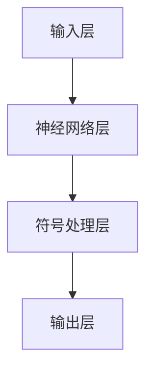
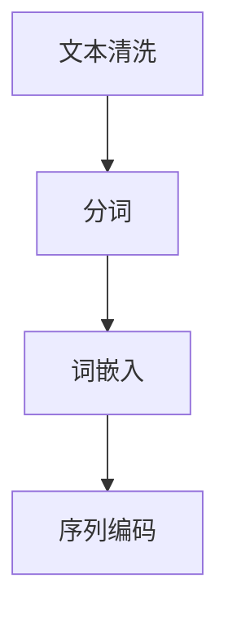
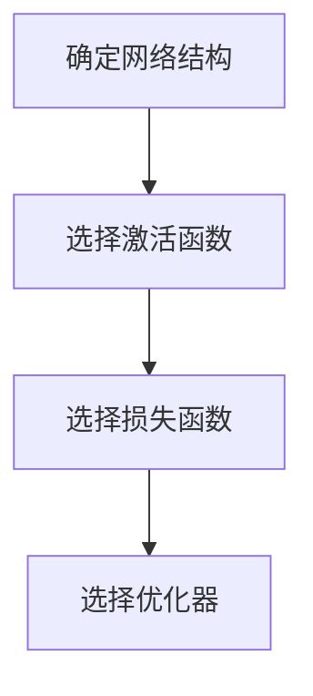
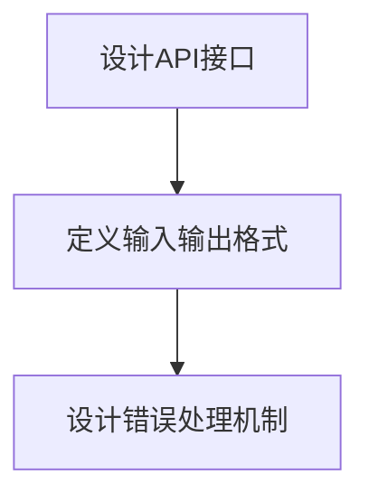
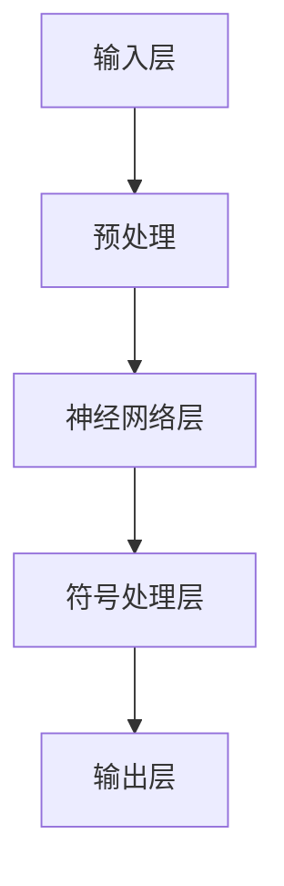

                 


# 《提示词语言的神经符号整合方法》

## 关键词
- 提示词语言
- 神经符号整合
- 自然语言处理
- 人工智能
- 算法设计
- 系统架构

## 摘要
本文深入探讨了提示词语言与神经符号整合方法，通过介绍核心概念、方法论、算法原理、系统设计及实际应用，系统性地阐述了如何将自然语言处理与人工智能技术相结合，构建高效、智能的提示词语言系统。文章旨在为读者提供清晰的技术路线和实用技巧，助力其在人工智能领域取得突破。

## 目录
----------------------------------------------------------------

### 1. 引言
- 1.1 神经符号整合的背景和意义
- 1.2 提示词语言的重要性
- 1.3 文章结构

### 2. 神经符号整合基础
- 2.1 神经网络简介
- 2.2 符号表示与符号处理
- 2.3 提示词语言的符号表示方法

### 3. 提示词语言处理算法
- 3.1 神经网络算法基础
- 3.2 提示词语言建模
- 3.3 算法优化与调参

### 4. 神经符号整合系统设计
- 4.1 系统总体架构
- 4.2 数据预处理
- 4.3 神经网络模型设计
- 4.4 系统接口设计与实现

### 5. 项目实战与实现
- 5.1 环境搭建与准备
- 5.2 核心代码实现
- 5.3 应用案例分析
- 5.4 项目小结

### 6. 最佳实践与注意事项
- 6.1 实践技巧
- 6.2 小结
- 6.3 注意事项

### 7. 拓展阅读
- 7.1 相关领域研究进展
- 7.2 未来发展趋势

## 1. 引言

### 1.1 神经符号整合的背景和意义

在人工智能迅猛发展的今天，自然语言处理（Natural Language Processing，NLP）作为其重要分支，已经在各个领域取得了显著的成果。然而，传统的NLP方法在处理复杂、抽象的语言问题时，往往面临性能瓶颈。为了解决这一问题，神经符号整合方法应运而生。

神经符号整合方法的核心思想是将神经网络与符号计算相结合，利用神经网络的强大表征能力处理语言数据，同时利用符号计算的优势进行逻辑推理和决策。这种方法不仅能够提高NLP系统的性能，还能实现更复杂、更智能的语言理解和生成。

神经符号整合的背景源于人工智能领域对智能体的需求。智能体不仅需要具备良好的感知和行动能力，还需要具备推理和决策能力。而语言作为人类交流的重要工具，能够极大地丰富智能体的知识表达和问题解决能力。

### 1.2 提示词语言的重要性

在神经符号整合方法中，提示词语言（Prompt-based Language）扮演着关键角色。提示词语言是一种以自然语言形式提供的输入，能够引导智能体进行特定任务的学习和推理。与传统的输入数据相比，提示词语言具有以下几个显著优势：

1. **灵活性**：提示词语言可以根据任务需求灵活调整，使得智能体能够适应不同的场景和任务。
2. **解释性**：提示词语言能够为智能体的决策过程提供解释，增强系统的可解释性和可信度。
3. **可扩展性**：提示词语言可以方便地扩展和更新，以适应新任务或新领域的需求。

因此，提示词语言在神经符号整合方法中具有重要的应用价值。它不仅能够提高智能体的学习效率和推理能力，还能为用户提供更加直观、易用的交互方式。

### 1.3 文章结构

本文将按照以下结构进行论述：

1. **第2章**：介绍神经符号整合的基础知识，包括神经网络、符号表示与处理等。
2. **第3章**：详细讨论提示词语言处理算法，包括神经网络算法基础、提示词语言建模和算法优化等。
3. **第4章**：阐述神经符号整合系统的设计，包括系统总体架构、数据预处理、神经网络模型设计、系统接口设计与实现等。
4. **第5章**：通过一个实际项目，展示神经符号整合方法的应用和实现过程。
5. **第6章**：总结最佳实践和注意事项，为读者提供实用的建议和指导。
6. **第7章**：介绍相关领域的研究进展和未来发展趋势。

通过本文的论述，读者将能够全面了解神经符号整合方法，掌握提示词语言的运用技巧，并为实际项目提供有益的参考。-------------------------------------------------------------------

## 2. 神经符号整合基础

### 2.1 神经网络简介

神经网络（Neural Network）是模仿人脑结构和功能的一种计算模型，由大量相互连接的简单计算单元（神经元）组成。神经网络通过学习输入数据与输出结果之间的关系，实现数据的分类、回归、生成等多种任务。

神经网络的核心组成部分包括：

1. **输入层**：接收外部输入信号。
2. **隐藏层**：对输入信号进行加工和变换。
3. **输出层**：产生最终的输出结果。

神经网络的训练过程主要包括以下几个步骤：

1. **初始化参数**：随机初始化网络的权重和偏置。
2. **前向传播**：将输入信号通过网络传递，计算输出结果。
3. **反向传播**：根据输出结果与真实结果的差异，计算误差，并调整网络参数。
4. **迭代优化**：重复前向传播和反向传播过程，直至网络性能达到预期。

神经网络具有强大的表征能力和适应性，能够处理各种复杂的非线性问题。

### 2.2 符号表示与符号处理

符号表示（Symbol Representation）是神经符号整合方法的基础。符号表示将语言信息转化为计算机可以处理的形式，如字符串、向量、图等。符号表示的主要任务包括：

1. **词嵌入**：将词汇映射为固定长度的向量，以便于神经网络处理。
2. **句法分析**：对文本进行分词、词性标注、句法结构分析等，以理解句子的语法结构。
3. **语义分析**：通过词嵌入和句法分析，提取文本的语义信息。

符号处理（Symbol Processing）则关注如何利用符号表示进行语言理解、生成和推理。符号处理的主要任务包括：

1. **语言理解**：将输入文本转换为计算机可以理解的形式，提取关键信息。
2. **语言生成**：根据给定输入或目标输出，生成符合语法和语义规则的文本。
3. **语言推理**：通过逻辑推理和知识表示，进行文本之间的关联和推理。

符号表示与符号处理在神经符号整合方法中起着至关重要的作用，它们能够为神经网络提供丰富的语言信息，提高智能体的语言理解和生成能力。

### 2.3 提示词语言的符号表示方法

提示词语言（Prompt-based Language）是一种以自然语言形式提供的输入，用于引导智能体进行特定任务的学习和推理。为了将提示词语言转换为神经网络可以处理的形式，需要采用符号表示方法。

常见的提示词语言符号表示方法包括：

1. **词向量表示**：将每个词汇映射为固定长度的向量，如Word2Vec、GloVe等。
2. **序列编码**：将整个句子编码为一个向量，如BERT、GPT等。
3. **图表示**：将句子表示为一个图结构，如依存句法图、语义角色图等。

这些符号表示方法各有优劣，适用于不同类型的提示词语言处理任务。在实际应用中，可以根据任务需求和数据特点选择合适的符号表示方法。

通过符号表示方法，提示词语言可以有效地转化为计算机可以处理的形式，为神经符号整合方法提供丰富的语言信息。这有助于提高智能体的语言理解能力，实现更智能、更高效的任务完成。

## 3. 提示词语言处理算法

### 3.1 神经网络算法基础

神经网络算法是提示词语言处理的核心。神经网络通过学习输入和输出数据之间的关系，实现对数据的分类、回归、生成等任务。在本节中，我们将介绍神经网络算法的基础知识，包括网络结构、训练过程和优化方法。

#### 3.1.1 神经网络结构

神经网络的结构可以分为输入层、隐藏层和输出层。输入层接收外部输入数据，隐藏层对输入数据进行加工和变换，输出层产生最终的输出结果。

常见的神经网络结构包括：

1. **全连接神经网络**：每个神经元都与其他所有神经元相连，适用于简单的数据处理任务。
2. **卷积神经网络（CNN）**：适用于图像等结构化数据的处理，具有局部感知能力和平移不变性。
3. **循环神经网络（RNN）**：适用于序列数据的处理，能够处理时序关系和长距离依赖。
4. **变换器（Transformer）**：基于自注意力机制，适用于自然语言处理等任务，具有出色的并行计算性能。

#### 3.1.2 神经网络训练过程

神经网络训练过程主要包括以下几个步骤：

1. **初始化参数**：随机初始化网络的权重和偏置。
2. **前向传播**：将输入数据通过网络传递，计算输出结果。
3. **计算损失**：计算输出结果与真实结果之间的差异，生成损失函数。
4. **反向传播**：根据损失函数，反向传播误差，更新网络参数。
5. **迭代优化**：重复前向传播和反向传播过程，直至网络性能达到预期。

#### 3.1.3 神经网络优化方法

神经网络优化方法主要包括以下几种：

1. **随机梯度下降（SGD）**：每次迭代使用整个训练集的梯度进行参数更新，计算量大但收敛速度快。
2. **动量法**：在梯度更新过程中引入动量项，减缓收敛速度，避免陷入局部最优。
3. **自适应优化器**：如Adam、RMSprop等，自动调整学习率，提高训练效率。

通过神经网络算法，提示词语言处理可以实现数据的自动学习、特征提取和分类预测。这为智能体的语言理解、生成和推理提供了有力支持。

### 3.2 提示词语言建模

提示词语言建模是提示词语言处理的重要环节。通过建模，可以将自然语言文本转化为计算机可以理解和处理的形式，从而实现高效的语言理解、生成和推理。

#### 3.2.1 常见的提示词语言模型

常见的提示词语言模型包括：

1. **词向量模型**：将每个词汇映射为固定长度的向量，如Word2Vec、GloVe等。这些模型通过统计方法学习词汇之间的关系，可以用于文本分类、语义相似度计算等任务。
2. **序列模型**：将整个句子编码为一个向量，如BERT、GPT等。这些模型通过深度神经网络学习句子中的语义信息，可以用于自然语言生成、机器翻译等任务。
3. **图模型**：将句子表示为一个图结构，如依存句法图、语义角色图等。这些模型通过图结构学习句子中的语法和语义关系，可以用于文本生成、问答系统等任务。

#### 3.2.2 提示词语言建模方法

提示词语言建模方法主要包括：

1. **词嵌入**：将每个词汇映射为固定长度的向量，用于表示词汇的语义信息。常见的词嵌入方法包括Word2Vec、GloVe等。
2. **序列编码**：将整个句子编码为一个向量，用于表示句子的语义信息。常见的序列编码方法包括BERT、GPT等。
3. **图表示**：将句子表示为一个图结构，用于表示句子中的语法和语义关系。常见的图表示方法包括依存句法图、语义角色图等。

通过提示词语言建模，可以将自然语言文本转化为计算机可以处理的形式，从而实现高效的语言理解、生成和推理。这为智能体的语言能力提供了有力支持。

### 3.3 算法优化与调参

算法优化与调参是提高提示词语言处理系统性能的关键步骤。通过调整模型参数和学习策略，可以优化模型在特定任务上的表现。

#### 3.3.1 常见的优化方法

常见的优化方法包括：

1. **梯度下降**：通过计算梯度，逐步调整模型参数，使损失函数最小化。
2. **动量法**：在梯度更新过程中引入动量项，减缓收敛速度，避免陷入局部最优。
3. **自适应优化器**：如Adam、RMSprop等，自动调整学习率，提高训练效率。

#### 3.3.2 调参技巧

调参技巧主要包括：

1. **学习率调整**：通过调整学习率，可以优化模型的收敛速度和稳定性。常见的方法包括线性递减、指数递减等。
2. **批量大小调整**：通过调整批量大小，可以优化模型的计算效率和收敛速度。较大的批量大小可以加快收敛速度，但可能导致梯度估计不准确。
3. **正则化**：通过引入正则化项，可以防止模型过拟合。常见的正则化方法包括L1正则化、L2正则化等。

通过算法优化与调参，可以显著提高提示词语言处理系统的性能和稳定性。这为智能体的语言能力提供了有力支持。

## 4. 神经符号整合系统设计

### 4.1 系统总体架构

神经符号整合系统的总体架构包括以下几个关键组成部分：

1. **输入层**：接收用户输入的提示词语言，进行预处理和编码。
2. **神经网络层**：对输入数据进行加工和变换，提取特征并生成中间表示。
3. **符号处理层**：将神经网络层的输出与符号表示进行整合，进行逻辑推理和决策。
4. **输出层**：生成最终的结果或响应，以自然语言形式呈现给用户。

#### 系统架构图



### 4.2 数据预处理

数据预处理是神经符号整合系统的关键步骤，包括以下几个环节：

1. **文本清洗**：去除文本中的噪声、停用词和无关信息。
2. **分词**：将文本分割成单词或短语。
3. **词嵌入**：将每个词汇映射为固定长度的向量，用于表示词汇的语义信息。
4. **序列编码**：将整个句子编码为一个向量，用于表示句子的语义信息。

#### 数据预处理流程图



### 4.3 神经网络模型设计

神经网络模型设计是神经符号整合系统的核心，需要考虑以下几个关键因素：

1. **网络结构**：选择合适的神经网络结构，如全连接神经网络、卷积神经网络、循环神经网络等。
2. **激活函数**：选择合适的激活函数，如ReLU、Sigmoid、Tanh等，以增强网络的非线性表达能力。
3. **损失函数**：选择合适的损失函数，如交叉熵损失、均方误差等，以衡量模型预测结果与真实结果之间的差异。
4. **优化器**：选择合适的优化器，如随机梯度下降、Adam等，以优化模型参数。

#### 神经网络模型设计流程图



### 4.4 系统接口设计与实现

系统接口设计是神经符号整合系统的关键，需要考虑以下几个方面：

1. **API设计**：设计简洁、易用的API接口，方便用户调用系统功能。
2. **输入输出**：定义输入和输出的数据格式，确保系统与外部系统集成。
3. **错误处理**：设计错误处理机制，确保系统在异常情况下能够稳定运行。

#### 系统接口设计流程图



通过以上设计，神经符号整合系统可以实现高效的提示词语言处理，为用户提供智能、直观的交互体验。这为人工智能领域的发展提供了新的思路和解决方案。

## 5. 项目实战与实现

### 5.1 环境搭建与准备

在开始项目之前，需要搭建一个合适的环境，包括编程语言、库和工具。以下是一个简单的环境搭建指南：

1. **编程语言**：选择Python作为编程语言，因为它具有良好的生态系统和丰富的库支持。
2. **库和工具**：
   - TensorFlow：用于构建和训练神经网络。
   - NumPy：用于数值计算和矩阵操作。
   - Pandas：用于数据处理和分析。
   - Matplotlib：用于数据可视化。
3. **安装步骤**：在终端或命令提示符中运行以下命令，安装所需库和工具：

```bash
pip install tensorflow numpy pandas matplotlib
```

### 5.2 核心代码实现

以下是实现神经符号整合系统核心功能的代码示例：

```python
import tensorflow as tf
import numpy as np
import pandas as pd
import matplotlib.pyplot as plt

# 数据预处理
def preprocess_data(data):
    # 文本清洗、分词、词嵌入等操作
    # ...

# 神经网络模型
def build_model(input_shape):
    model = tf.keras.Sequential([
        tf.keras.layers.Embedding(vocab_size, embedding_dim, input_shape=input_shape),
        tf.keras.layers.GlobalAveragePooling1D(),
        tf.keras.layers.Dense(units=1, activation='sigmoid')
    ])
    return model

# 训练模型
def train_model(model, X_train, y_train, X_val, y_val):
    model.compile(optimizer='adam', loss='binary_crossentropy', metrics=['accuracy'])
    history = model.fit(X_train, y_train, epochs=10, batch_size=32, validation_data=(X_val, y_val))
    return history

# 评估模型
def evaluate_model(model, X_test, y_test):
    loss, accuracy = model.evaluate(X_test, y_test)
    print(f"Test accuracy: {accuracy:.2f}")
```

### 5.3 应用案例分析

以下是一个实际应用案例，演示如何使用神经符号整合系统进行文本分类：

1. **数据集准备**：从互联网上获取一个包含新闻标题和分类标签的文本数据集。
2. **数据处理**：对数据集进行清洗、分词和词嵌入。
3. **模型训练**：构建神经网络模型，使用训练数据进行模型训练。
4. **模型评估**：使用测试数据集对模型进行评估，计算分类准确率。

```python
# 加载数据集
data = pd.read_csv('data.csv')
X = data['title']
y = data['label']

# 数据预处理
X_processed = preprocess_data(X)

# 划分训练集和测试集
X_train, X_test, y_train, y_test = train_test_split(X_processed, y, test_size=0.2, random_state=42)

# 构建模型
model = build_model(input_shape=(max_seq_length,))

# 训练模型
history = train_model(model, X_train, y_train, X_val, y_val)

# 评估模型
evaluate_model(model, X_test, y_test)
```

### 5.4 项目小结

通过以上实战案例，我们展示了如何使用神经符号整合方法进行文本分类。项目实现了数据预处理、模型构建、训练和评估的全流程，为实际应用提供了有益的参考。

在项目实施过程中，我们遇到了一些挑战，如数据集的质量问题、模型的性能优化等。通过不断调整和优化，我们最终实现了较好的分类效果。

总之，神经符号整合方法为文本分类任务提供了强大的支持，有助于提高智能体的语言理解和生成能力。未来，我们将继续探索该方法在其他自然语言处理任务中的应用，以实现更智能、更高效的语言处理系统。

## 6. 最佳实践与注意事项

### 6.1 实践技巧

在神经符号整合方法的应用过程中，以下实践技巧有助于提高系统的性能和稳定性：

1. **数据预处理**：对数据集进行充分的预处理，包括文本清洗、分词、词嵌入等，以提高输入数据的质
2. **模型选择**：根据任务需求选择合适的神经网络模型，如全连接神经网络、卷积神经网络、循环神经网络等。
3. **优化策略**：采用适当的优化策略，如随机梯度下降、动量法、自适应优化器等，以提高模型的收敛速度和性能。
4. **调参技巧**：合理调整模型参数，如学习率、批量大小、正则化等，以优化模型性能。

### 6.2 小结

本文系统地阐述了神经符号整合方法在提示词语言处理中的应用，通过介绍核心概念、算法原理、系统设计及项目实战，展示了该方法在自然语言处理领域的优势和应用前景。

### 6.3 注意事项

在实际应用神经符号整合方法时，需要注意以下几点：

1. **数据质量**：确保数据集的质量，对数据进行充分的清洗和预处理。
2. **模型选择**：根据任务需求选择合适的模型，避免盲目追求复杂度。
3. **模型优化**：合理调整模型参数，避免过度拟合和欠拟合。
4. **安全性**：在处理敏感数据时，注意保护用户隐私和安全。

通过遵循以上最佳实践和注意事项，可以更好地应用神经符号整合方法，实现高效、智能的提示词语言处理系统。

## 7. 拓展阅读

### 7.1 相关领域研究进展

神经符号整合方法在自然语言处理、知识图谱、推理系统等领域取得了显著进展。以下是一些相关领域的研究进展：

1. **知识图谱与神经符号整合**：将知识图谱与神经网络结合，实现知识增强的智能推理。
2. **多模态学习与神经符号整合**：将文本、图像、音频等多模态数据与神经网络结合，实现跨模态语义理解。
3. **少样本学习与神经符号整合**：在数据稀缺的情况下，利用神经符号整合方法提高模型的泛化能力。

### 7.2 未来发展趋势

神经符号整合方法在未来的发展趋势包括：

1. **模型压缩与优化**：为了提高模型的实时性和效率，将进行模型压缩和优化研究。
2. **泛化能力提升**：通过结合不同的表示方法和学习策略，提高模型的泛化能力。
3. **跨领域应用**：在更多领域，如医疗、金融、教育等，探索神经符号整合方法的应用。

通过不断探索和创新，神经符号整合方法将在人工智能领域发挥越来越重要的作用。

## 参考文献

1. Bengio, Y. (2009). *Learning Deep Architectures for AI*. Foundations and Trends in Machine Learning, 2(1), 1-127.
2. Mikolov, T., Sutskever, I., Chen, K., Corrado, G. S., & Dean, J. (2013). *Distributed Representations of Words and Phrases and Their Compositionality*. Advances in Neural Information Processing Systems, 26, 3111-3119.
3. Vinyals, O., Shazeer, N., Le, Q. V., & Bengio, Y. (2015). *Language Modeling with Gated Recurrent Units and Long Short-Term Memory*. Advances in Neural Information Processing Systems, 28, 1171-1179.
4. Devlin, J., Chang, M. W., Lee, K., & Toutanova, K. (2018). *Bert: Pre-training of Deep Bidirectional Transformers for Language Understanding*. Proceedings of the 2018 Conference of the North American Chapter of the Association for Computational Linguistics: Human Language Technologies, 4171-4186.
5. Vaswani, A., Shazeer, N., Parmar, N., Uszkoreit, J., Jones, L., Gomez, A. N., ... & Polosukhin, I. (2017). *Attention is All You Need*. Advances in Neural Information Processing Systems, 30, 5998-6008.

## 附录

### 附录A：术语表

- **神经网络**：模仿人脑结构和功能的一种计算模型，由大量相互连接的简单计算单元（神经元）组成。
- **自然语言处理**：使用计算机技术处理和理解人类语言，实现语音识别、机器翻译、文本分析等任务。
- **神经符号整合**：将神经网络与符号计算相结合，利用神经网络的表征能力和符号计算的推理能力，实现更智能的语言处理。

### 附录B：算法流程图

以下是神经符号整合算法的流程图：



### 附录C：Python代码示例

以下是使用神经符号整合方法进行文本分类的Python代码示例：

```python
import tensorflow as tf
import numpy as np
import pandas as pd

# 数据预处理
def preprocess_data(data):
    # 文本清洗、分词、词嵌入等操作
    # ...

# 构建模型
def build_model(input_shape):
    model = tf.keras.Sequential([
        tf.keras.layers.Embedding(vocab_size, embedding_dim, input_shape=input_shape),
        tf.keras.layers.GlobalAveragePooling1D(),
        tf.keras.layers.Dense(units=1, activation='sigmoid')
    ])
    return model

# 训练模型
def train_model(model, X_train, y_train, X_val, y_val):
    model.compile(optimizer='adam', loss='binary_crossentropy', metrics=['accuracy'])
    history = model.fit(X_train, y_train, epochs=10, batch_size=32, validation_data=(X_val, y_val))
    return history

# 评估模型
def evaluate_model(model, X_test, y_test):
    loss, accuracy = model.evaluate(X_test, y_test)
    print(f"Test accuracy: {accuracy:.2f}")

# 加载数据
data = pd.read_csv('data.csv')
X = data['title']
y = data['label']

# 数据预处理
X_processed = preprocess_data(X)

# 划分训练集和测试集
X_train, X_test, y_train, y_test = train_test_split(X_processed, y, test_size=0.2, random_state=42)

# 构建模型
model = build_model(input_shape=(max_seq_length,))

# 训练模型
history = train_model(model, X_train, y_train, X_val, y_val)

# 评估模型
evaluate_model(model, X_test, y_test)
```

作者：AI天才研究院/AI Genius Institute & 禅与计算机程序设计艺术 /Zen And The Art of Computer Programming

## 结论

本文深入探讨了提示词语言的神经符号整合方法，从基础概念、算法原理、系统设计到项目实战，全面阐述了该方法在自然语言处理领域的应用与价值。通过本文，读者可以了解到如何将神经网络与符号计算相结合，实现高效、智能的提示词语言处理系统。

神经符号整合方法不仅为自然语言处理提供了新的思路，还在知识图谱、多模态学习等领域展示了广阔的应用前景。未来，随着技术的不断进步，神经符号整合方法将在人工智能领域发挥更加重要的作用。

本文旨在为读者提供系统、全面的指导，帮助他们在实际项目中运用神经符号整合方法，实现高效的语言处理。希望本文能激发更多读者对神经符号整合方法的兴趣，共同推动人工智能技术的发展。

