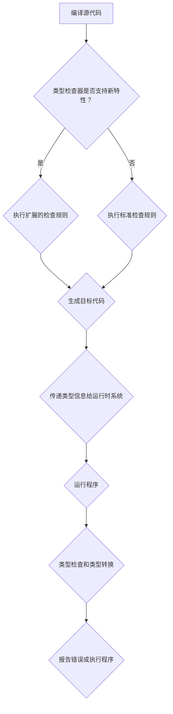

                 

## 第一部分：背景介绍

### 第1章：问题背景与核心概念

#### 1.1.1 问题背景

提示词语言在计算机科学中扮演着至关重要的角色，它不仅仅是一种编程语言，更是一种沟通和表达的桥梁，让开发者能够有效地将想法转化为可执行的代码。在现代软件开发中，提示词语言的应用越来越广泛，从网页开发到移动应用，再到复杂的系统级软件，几乎每一个软件项目都离不开它。然而，随着软件系统的复杂性不断增加，编程语言中的类型系统也逐渐成为了一个关键问题。

类型系统是编程语言的核心组成部分之一，它为程序的变量、表达式和函数等提供了明确的类型信息。类型系统的存在有助于确保程序的正确性和安全性，通过静态类型检查，编程语言能够提前发现潜在的错误，从而避免在运行时出现未预期的行为。然而，传统的类型系统往往在设计时只考虑了一部分应用场景，缺乏足够的灵活性和扩展性，难以适应不断变化的编程需求。

设计一个可扩展的类型系统是当前编程语言研究中的一个重要课题。这种类型的系统不仅能够应对现有的编程需求，还能在未来新的编程模式和技术出现时，提供良好的支持。本文将围绕提示词语言的类型系统可扩展性设计，深入探讨其核心概念、设计原则和实现方法。

#### 1.1.2 问题描述

类型系统的可扩展性主要面临以下几个方面的挑战：

1. **语言特性的增加**：随着编程语言的发展，新的语言特性不断被引入，如泛型、函数式编程、动态类型等。这些特性的引入需要类型系统提供相应的支持，以确保它们在类型安全的前提下得以应用。

2. **异构编程的需求**：现代软件开发往往涉及多个不同的编程语言和库，例如在Java中调用JavaScript代码或使用C++进行高性能计算。类型系统的可扩展性需要能够处理这些异构编程的需求，提供跨语言类型转换的支持。

3. **动态编程的支持**：动态类型编程在灵活性上具有显著优势，但这也带来了类型检查的挑战。如何在不牺牲类型安全性的前提下，支持动态类型编程，是类型系统可扩展性设计的一个重要方面。

4. **类型系统与运行时系统的交互**：类型系统不仅需要考虑编译时的类型检查，还必须与运行时系统紧密交互，以实现运行时的类型检查和类型转换。

#### 1.1.3 问题解决

为了应对上述挑战，设计可扩展的类型系统需要遵循以下几个基本原则：

1. **模块化设计**：将类型系统的不同部分划分为模块，每个模块负责一个特定的类型处理功能。这种设计有助于提高系统的灵活性和可维护性。

2. **类型检查器的可扩展性**：类型检查器作为类型系统的核心组件，其可扩展性直接影响到整个类型系统的扩展能力。可以通过引入插件机制或扩展点，使得类型检查器能够方便地支持新的类型检查规则和特性。

3. **类型上下文管理**：类型上下文是类型检查过程中保存类型信息的数据结构。一个良好的类型上下文管理系统能够提供灵活的类型信息存储和检索机制，从而支持复杂的类型推理和转换。

4. **动态类型支持**：对于动态类型编程，可以在类型系统中引入类型上下文和类型推断机制，以确保在运行时能够动态地检查和转换类型。

5. **编译器与运行时系统的集成**：编译器和运行时系统需要紧密协作，共同实现类型系统的扩展。编译器负责静态类型检查，运行时系统则负责动态类型检查和类型转换。

#### 1.1.4 边界与外延

类型系统的可扩展性设计不仅限于编程语言内部的类型处理，还涉及到与外部系统的交互：

1. **编程语言特性扩展**：可扩展的类型系统需要能够支持编程语言特性的扩展，如新的数据类型、控制结构等。

2. **编译器和解释器实现**：类型系统的可扩展性也需要在编译器和解释器的实现中得到体现，确保编译器能够正确地处理类型信息，解释器能够动态地执行类型检查和类型转换。

3. **应用程序兼容性**：一个可扩展的类型系统需要保证现有应用程序的兼容性，即使引入了新的类型特性和规则，也能确保旧的应用程序正常运行。

#### 1.1.5 概念结构与核心要素组成

类型系统的核心组成部分包括以下几个方面：

1. **类型检查器**：类型检查器负责对源代码进行类型检查，确保代码在编译时满足类型约束。

2. **类型转换机制**：类型转换机制负责在需要时将不同类型的数据进行转换，确保程序的正确性和一致性。

3. **类型上下文**：类型上下文是类型检查过程中保存类型信息的数据结构，用于类型推断和类型检查。

4. **编译器实现**：编译器负责将源代码编译为目标代码，类型系统与编译器的紧密集成是类型系统可扩展性的关键。

5. **运行时支持**：运行时系统负责在程序运行时进行类型检查和类型转换，确保程序的类型安全性和正确性。

通过上述分析，我们可以看到，类型系统的可扩展性设计是一个复杂而重要的课题，它不仅关系到编程语言的性能和安全性，也影响到应用程序的开发效率和可维护性。在接下来的部分，我们将进一步深入探讨类型系统的核心概念、基本原理和具体实现方法。希望本文能够为读者在类型系统设计领域提供一些有益的思路和参考。

## 第二部分：核心概念与联系

### 第2章：类型系统的基本原理

#### 2.1.1 类型系统的定义

类型系统是编程语言中的一个基本概念，它为编程语言中的各种元素（如变量、函数、表达式等）赋予了类型属性。类型系统主要有两种形式：静态类型和动态类型。

**静态类型**：静态类型系统在编译阶段对程序进行类型检查，确保程序中的每个表达式都有明确的类型，并在编译时发现类型错误。静态类型系统具有以下几个特点：

- **类型安全**：由于在编译时进行类型检查，静态类型系统可以提供较高的安全性，减少运行时错误。
- **性能优化**：静态类型系统允许编译器在编译时进行优化，从而提高程序运行效率。
- **可读性和维护性**：静态类型的明确性有助于提高代码的可读性和可维护性。

**动态类型**：动态类型系统在程序运行时进行类型检查，类型检查是在程序执行过程中动态完成的。动态类型系统具有以下几个特点：

- **灵活性**：动态类型系统允许在运行时改变变量的类型，具有较高的灵活性。
- **动态性**：动态类型系统适用于那些类型不明确或需要动态确定类型的编程场景。
- **运行时开销**：动态类型系统在运行时进行类型检查，可能会增加运行时的开销。

类型系统在编程语言中的角色不仅仅是类型检查，它还涉及到类型推断、类型转换、类型约束等多个方面。一个良好的类型系统可以提供更高效、更安全的编程环境。

#### 2.1.2 类型系统的基本概念

在深入理解类型系统之前，我们需要了解以下几个基本概念：

- **类型**：类型是变量、函数、表达式等元素的抽象属性，用于描述它们可以接受的数据值。
- **类型检查**：类型检查是编程语言在编译或解释程序时，验证程序中每个表达式和语句是否符合预定义的类型规则的过程。
- **类型约束**：类型约束是类型系统用来限制变量或表达式类型的规则，确保程序的类型安全。
- **类型安全**：类型安全是指类型系统能够确保程序在运行时不会因为类型错误而导致未预期的行为。

**类型检查**可以分为静态类型检查和动态类型检查：

- **静态类型检查**：静态类型检查在编译阶段进行，通过分析源代码的语法和语义，确定每个变量和表达式的类型，并在编译时发现类型错误。
- **动态类型检查**：动态类型检查在程序运行时进行，通过在程序执行过程中检查变量和表达式的类型，确保程序的类型安全。

**类型约束**分为强类型约束和弱类型约束：

- **强类型约束**：强类型约束要求变量和表达式必须在编译时具有明确且固定的类型，不允许类型之间的隐式转换。
- **弱类型约束**：弱类型约束允许类型之间的隐式转换，从而提高了编程的灵活性，但也可能导致运行时错误。

**类型安全**是类型系统的核心目标，通过确保程序在运行时不会因类型错误而导致未预期的行为，提高程序的可靠性和稳定性。

#### 2.1.3 类型系统的属性特征对比表格

为了更直观地理解不同类型系统的属性特征，我们可以创建一个对比表格：

| 类型系统         | 强类型/弱类型 | 静态类型/动态类型 | 类型安全 | 性能优化 | 灵活性 | 示例编程语言 |
|-----------------|--------------|------------------|---------|---------|--------|----------------|
| 静态类型系统     | 强           | 静态             | 高      | 高      | 低     | Java, C++      |
| 动态类型系统     | 弱           | 动态             | 中      | 低      | 高     | Python, JavaScript |
| 强类型动态类型系统 | 强           | 动态             | 高      | 中      | 高     | TypeScript      |
| 弱类型系统       | 弱           | 静态/动态         | 低      | 高      | 高     | C, PHP          |

#### 2.1.4 类型系统的ER实体关系图架构

为了更清晰地展示类型系统的各个实体及其关系，我们可以使用Mermaid语法绘制一个ER实体关系图：

```mermaid
erDiagram
  TypeChecker ||--|{ Expression } : checked_by
  Expression ||--|{ Variable } : contains
  Variable ||--|{ Type } : has_type
  Type ||--|{ BaseType } : extends
  Compiler ||--|{ TypeChecker } : uses
  Runtime ||--|{ TypeChecker } : uses
  Expression --|{ TypeConversion } : converts_to
  Variable --|{ TypeConstraint } : satisfies
```

在这个ER实体关系图中，主要实体包括TypeChecker（类型检查器）、Expression（表达式）、Variable（变量）、Type（类型）和BaseType（基类型）。它们之间的关系如下：

- **TypeChecker**：负责对表达式进行类型检查，确保表达式符合类型约束。
- **Expression**：包括变量和函数调用，是类型检查的对象。
- **Variable**：包含变量信息，并关联到其类型。
- **Type**：描述变量的类型，可以是具体的类型，也可以是抽象的类型。
- **BaseType**：基类型是所有类型的继承基础。

**Compiler**（编译器）和**Runtime**（运行时系统）分别使用**TypeChecker**，确保在编译和运行阶段都能进行有效的类型检查。**Expression**和**Variable**之间通过**TypeConversion**（类型转换）关联，确保不同类型之间的兼容性和转换。**Variable**和**TypeConstraint**（类型约束）之间通过**TypeConstraint**关联，确保变量满足特定的类型约束。

通过上述核心概念和联系的分析，我们可以看到类型系统在编程语言中的重要性。在接下来的部分，我们将进一步探讨可扩展类型系统的设计原理和实现方法，以应对现代软件开发中的各种挑战。

### 第3章：可扩展类型系统的设计

#### 3.1.1 可扩展类型系统的原理

可扩展类型系统旨在通过模块化设计和灵活的组件，为编程语言提供强大的类型处理能力，同时确保类型安全性和性能。在可扩展类型系统的设计中，我们需要关注以下几个核心原理：

1. **模块化设计**：模块化设计将类型系统的各个部分划分为独立的模块，每个模块负责一个特定的类型处理功能。这种设计不仅提高了系统的灵活性，还增强了可维护性。通过模块化，我们可以方便地添加、修改或替换类型系统的特定部分，而不影响系统的其他部分。

2. **类型检查器的可扩展性**：类型检查器是类型系统的核心组件，其可扩展性直接影响整个类型系统的扩展能力。为了提高类型检查器的可扩展性，可以引入插件机制或扩展点。插件机制允许开发者为类型检查器添加新的类型检查规则和特性，而扩展点则为类型检查器提供了标准化的接口，使得开发者可以轻松地扩展类型检查器的功能。

3. **类型上下文管理**：类型上下文是类型检查过程中保存类型信息的数据结构。一个良好的类型上下文管理系统可以提供灵活的类型信息存储和检索机制，从而支持复杂的类型推理和转换。类型上下文管理的关键在于确保类型信息的一致性和可访问性，以便在类型检查和类型转换过程中有效地使用。

4. **动态类型支持**：在动态类型编程中，类型信息往往在程序运行时动态确定。为了支持动态类型编程，类型系统需要提供相应的机制，如类型上下文和类型推断。类型上下文用于存储当前作用域的类型信息，而类型推断机制则用于在运行时自动确定变量的类型。

5. **编译器与运行时系统的集成**：编译器负责将源代码编译为目标代码，运行时系统则负责在程序运行时进行类型检查和类型转换。为了实现类型系统的可扩展性，编译器和运行时系统需要紧密集成，共同工作。编译器需要在编译阶段收集类型信息，并将其传递给运行时系统，以便在运行时进行类型检查和类型转换。

#### 3.1.2 算法mermaid流程图

为了更直观地展示可扩展类型系统的设计原理，我们可以使用Mermaid语法绘制一个算法流程图：



在这个流程图中，我们首先对源代码进行编译，然后根据类型检查器的支持情况，执行相应的检查规则。如果类型检查器支持扩展的规则，我们执行这些扩展规则；否则，执行标准的检查规则。无论使用哪种规则，最终都会生成目标代码，并将类型信息传递给运行时系统。在程序运行时，运行时系统会根据类型信息进行类型检查和类型转换，并报告错误或执行程序。

#### 3.1.3 Python源代码实现

为了更好地理解可扩展类型系统的设计，我们可以通过一个简单的Python示例代码来实现：

```python
# 基础类型检查器
class BasicTypeChecker:
    def check(self, expr):
        if isinstance(expr, int):
            return "int"
        elif isinstance(expr, str):
            return "str"
        else:
            raise TypeError("Unsupported type")

# 扩展类型检查器
class ExtendedTypeChecker(BasicTypeChecker):
    def check(self, expr):
        # 扩展的检查逻辑
        if isinstance(expr, list):
            return "list"
        # 继承基础类型检查器的逻辑
        return super().check(expr)

# 使用扩展类型检查器
type_checker = ExtendedTypeChecker()
result = type_checker.check(100)  # 输出：int
result = type_checker.check("Hello")  # 输出：str
result = type_checker.check([1, 2, 3])  # 输出：list
```

在这个示例中，我们定义了一个基础类型检查器`BasicTypeChecker`，它负责检查基本的类型，如整数和字符串。然后，我们定义了一个扩展类型检查器`ExtendedTypeChecker`，它继承自`BasicTypeChecker`，并添加了对列表类型的支持。在实例化扩展类型检查器后，我们可以使用它来检查各种类型的表达式，并得到相应的类型结果。

通过这个简单的示例，我们可以看到如何通过继承和多态来实现类型检查器的扩展。这种方法不仅提高了类型系统的灵活性，还确保了类型检查的一致性和可维护性。

#### 3.1.4 算法原理的数学模型和公式

为了进一步理解可扩展类型系统的设计原理，我们可以使用LaTeX格式给出相关的数学模型和公式。

首先，定义类型系统的基本组件：

$$
T = \{ T_1, T_2, ..., T_n \}
$$

其中，$T$ 是类型的集合，$T_1, T_2, ..., T_n$ 是具体的类型。

接下来，定义类型检查的过程：

$$
\text{Check}(E, T) =
\begin{cases}
    \text{True}, & \text{if } E \text{ is of type } T \\
    \text{False}, & \text{otherwise}
\end{cases}
$$

其中，$E$ 是表达式，$T$ 是类型。

类型转换的规则可以表示为：

$$
\text{Convert}(E, T_1, T_2) =
\begin{cases}
    E, & \text{if } E \text{ is already of type } T_2 \\
    \text{Error}, & \text{if } E \text{ cannot be converted to type } T_2 \\
    \text{Result}, & \text{otherwise}
\end{cases}
$$

其中，$T_1$ 和 $T_2$ 是两个类型。

通过上述数学模型和公式，我们可以对类型检查和类型转换的过程进行形式化的描述，从而更好地理解可扩展类型系统的设计原理。

#### 3.1.5 通俗易懂地举例说明

为了更好地理解可扩展类型系统的设计原理和应用，我们可以通过一个具体的例子来说明。

假设我们有一个简单的计算器程序，它可以计算两个整数的和。首先，我们定义基础类型检查器，用于检查输入的整数类型：

```python
# 基础类型检查器
class BasicTypeChecker:
    def check(self, value):
        if isinstance(value, int):
            return "int"
        else:
            raise TypeError("Input must be an integer")
```

接下来，我们定义一个扩展类型检查器，支持浮点数类型的计算：

```python
# 扩展类型检查器
class ExtendedTypeChecker(BasicTypeChecker):
    def check(self, value):
        if isinstance(value, float):
            return "float"
        # 继承基础类型检查器的逻辑
        return super().check(value)
```

在这个例子中，扩展类型检查器`ExtendedTypeChecker`继承了基础类型检查器`BasicTypeChecker`的功能，并添加了对浮点数类型的支持。我们使用扩展类型检查器来计算两个数的和：

```python
# 使用扩展类型检查器计算和
def calculate_sum(a, b):
    type_checker = ExtendedTypeChecker()
    type_a = type_checker.check(a)
    type_b = type_checker.check(b)
    
    if type_a == "int" and type_b == "int":
        return a + b
    elif type_a == "float" and type_b == "float":
        return a + b
    else:
        raise TypeError("Unsupported types for sum operation")

# 测试计算和
print(calculate_sum(10, 20))  # 输出：30
print(calculate_sum(10.5, 20.5))  # 输出：31.0
```

通过这个例子，我们可以看到如何通过扩展类型检查器来实现不同类型数据的计算。首先，我们使用扩展类型检查器检查输入的变量类型，然后根据类型的结果执行相应的计算逻辑。这种方法不仅提高了程序的灵活性，还确保了类型安全。

通过上述的例子和讲解，我们可以看到可扩展类型系统的设计原理是如何在实际应用中发挥作用的。在接下来的部分，我们将进一步探讨系统分析与架构设计，以更全面地理解可扩展类型系统的实现和应用。

### 第4章：系统功能设计与架构设计

#### 4.1.1 问题场景介绍

在当前软件开发中，类型系统的可扩展性面临诸多挑战。以现代企业级应用为例，这类应用通常需要集成多种不同的编程语言和框架，例如在Java应用中可能需要调用JavaScript代码或使用C++进行高性能计算。此外，随着微服务架构的普及，不同服务之间也存在着类型兼容性问题。如何设计一个既可扩展又高效的类型系统，成为软件开发的关键问题。

假设我们正在开发一个大型企业级应用，包含多个微服务，其中一部分服务使用Java编写，另一部分服务使用Python编写。为了实现不同服务之间的类型兼容，我们需要设计一个可扩展的类型系统，使得Java和Python服务能够无缝地交互。此外，随着应用需求的不断变化，我们还需要确保类型系统能够方便地扩展以支持新的编程语言或框架。

#### 4.1.2 项目介绍

本项目的目标是设计并实现一个具有高可扩展性的类型系统，以支持现代企业级应用的多种编程语言和框架。项目的主要目标包括：

1. **类型系统的模块化设计**：将类型系统的各个功能模块化，确保每个模块能够独立开发和扩展，从而提高系统的灵活性和可维护性。
2. **跨语言类型兼容性**：实现不同编程语言之间的类型兼容，确保Java和Python服务能够无缝交互。
3. **动态类型支持**：支持动态类型编程，以提供更高的编程灵活性和适应性。
4. **高效类型检查**：优化类型检查算法，提高类型系统的性能，确保在保证类型安全的前提下，提高程序的运行效率。

项目的预期成果是设计并实现一个灵活、高效且易于扩展的类型系统，该系统能够满足企业级应用的多语言集成需求，并支持动态类型编程。

#### 4.1.3 系统功能设计

为了实现上述目标，我们需要设计一个全面的功能体系，涵盖类型检查、类型转换、类型上下文管理等方面。以下是系统功能设计的具体内容：

1. **类型检查器**：类型检查器是类型系统的核心组件，负责对程序中的各种表达式进行类型检查。我们需要设计一个可扩展的类型检查器，支持多种编程语言的类型检查规则。

2. **类型转换机制**：类型转换机制用于在不同类型之间进行转换，确保程序的正确性和类型兼容性。我们需要设计一个灵活的类型转换机制，支持多种类型之间的隐式和显式转换。

3. **类型上下文管理**：类型上下文管理是类型系统的一个重要功能，负责在类型检查过程中保存和管理类型信息。我们需要设计一个高效、灵活的类型上下文管理系统，支持复杂的类型推理和转换。

4. **跨语言类型兼容**：为了支持不同编程语言之间的类型兼容，我们需要设计一种机制，能够自动或手动地将一种语言中的类型转换为另一种语言中的类型。

5. **动态类型支持**：为了提高编程的灵活性，我们需要设计一个动态类型系统，支持在运行时动态确定和转换类型。

6. **类型安全检查**：我们需要设计一系列类型安全检查机制，确保在类型转换和类型兼容过程中不会引入类型错误或安全漏洞。

7. **编译器与运行时集成**：为了实现类型系统的模块化和高效运行，我们需要设计一个编译器与运行时的集成机制，确保类型系统在编译和运行阶段都能有效地工作。

#### 4.1.4 系统架构设计

为了实现上述功能，我们需要设计一个合理的系统架构，确保类型系统能够高效、灵活地工作。以下是系统架构设计的主要组件和它们之间的关系：

1. **类型检查器模块**：该模块负责类型检查的核心功能，包括静态类型检查和动态类型检查。该模块可以通过插件机制扩展以支持多种编程语言的类型检查规则。

2. **类型转换模块**：该模块负责类型转换的核心功能，包括类型兼容性检查和类型转换算法。该模块可以通过插件机制扩展以支持多种类型之间的转换。

3. **类型上下文管理模块**：该模块负责类型上下文的管理，包括类型信息的存储、检索和更新。该模块需要提供高效的类型信息管理机制，以确保类型检查和类型转换的准确性和效率。

4. **编译器模块**：该模块负责编译源代码，将源代码转换为中间代码或目标代码。编译器需要与类型检查器和类型转换模块紧密集成，确保在编译阶段进行有效的类型检查和类型转换。

5. **运行时模块**：该模块负责在程序运行时进行类型检查和类型转换，确保程序在运行时类型安全。运行时模块需要与类型检查器和类型转换模块紧密集成，以便在运行时进行动态类型检查和类型转换。

6. **跨语言兼容模块**：该模块负责处理不同编程语言之间的类型兼容问题，包括自动类型转换和手动类型转换。该模块需要与类型检查器和类型转换模块紧密集成，以确保跨语言类型兼容。

7. **安全检查模块**：该模块负责进行类型安全检查，确保在类型转换和类型兼容过程中不会引入类型错误或安全漏洞。该模块需要与类型检查器和类型转换模块紧密集成，以确保类型系统的安全性。

通过上述架构设计，我们可以确保类型系统在编译和运行阶段都能高效、灵活地工作，满足现代企业级应用的多语言集成和动态类型编程需求。

#### 4.1.5 系统接口设计和系统交互

为了确保类型系统能够与其他系统模块和外部服务有效交互，我们需要设计清晰的系统接口和交互流程。以下是系统接口设计和系统交互的具体内容：

1. **类型检查器接口**：类型检查器需要提供以下接口，以便其他模块能够调用其功能：
   - `check_expression(expression: Expression) -> Type`: 检查给定表达式的类型。
   - `add_type_check_rule(rule: TypeCheckRule) -> None`: 添加新的类型检查规则。

2. **类型转换接口**：类型转换模块需要提供以下接口，以便其他模块能够进行类型转换：
   - `convert_type(source_type: Type, target_type: Type) -> Type`: 将源类型转换为目标类型。
   - `add_type_conversion_rule(rule: TypeConversionRule) -> None`: 添加新的类型转换规则。

3. **类型上下文管理接口**：类型上下文管理模块需要提供以下接口，以便其他模块能够访问和管理类型信息：
   - `get_type_context() -> TypeContext`: 获取当前作用域的类型上下文。
   - `set_type_context(context: TypeContext) -> None`: 设置当前作用域的类型上下文。

4. **编译器接口**：编译器模块需要提供以下接口，以便其他模块能够编译源代码：
   - `compile_source_code(source_code: str) -> CompiledCode`: 编译源代码。
   - `add_type_system_extension(extension: TypeSystemExtension) -> None`: 添加类型系统扩展。

5. **运行时接口**：运行时模块需要提供以下接口，以便其他模块能够在运行时进行类型检查和类型转换：
   - `run_time_type_check(expression: Expression) -> bool`: 运行时类型检查。
   - `run_time_type_conversion(source: Any, target: Any) -> Any`: 运行时类型转换。

6. **跨语言兼容接口**：跨语言兼容模块需要提供以下接口，以便处理不同编程语言之间的类型兼容问题：
   - `auto_convert_type(source: Any, target: Any) -> Any`: 自动类型转换。
   - `manual_convert_type(source: Any, target: Any) -> Any`: 手动类型转换。

通过设计这些系统接口，我们可以确保类型系统能够与其他模块和外部服务高效地交互，从而实现系统的整体功能和性能。

### 第5章：环境安装与系统核心实现

#### 5.1.1 环境安装

要在本地环境中搭建一个可扩展类型系统，我们需要安装一些基础的软件和工具。以下是在Unix-like系统（如Linux或macOS）中搭建环境的具体步骤：

1. **安装Python**：
   - 确认Python版本（推荐Python 3.8及以上版本），可以通过以下命令检查：
     ```bash
     python3 --version
     ```
   - 如果未安装或版本较低，可以通过包管理器进行安装，例如在Ubuntu系统中使用以下命令：
     ```bash
     sudo apt update
     sudo apt install python3 python3-pip
     ```

2. **安装依赖库**：
   - 安装用于Mermaid图表绘制的依赖库，如`mermaid`和`mermaid-python`，可以通过pip进行安装：
     ```bash
     pip3 install mermaid-python
     ```

3. **安装LaTeX**：
   - LaTeX是一个用于生成高质量文档的排版系统，安装LaTeX可以通过包管理器进行，例如在Ubuntu系统中使用以下命令：
     ```bash
     sudo apt update
     sudo apt install texlive-full
     ```

4. **配置LaTeX环境**：
   - 为了能够在Python中使用LaTeX，我们需要安装`matplotlib`和`matplotlib-latex`，并配置LaTeX引擎：
     ```bash
     pip3 install matplotlib matplotlib-latex
     ```
   - 配置`matplotlib`使用LaTeX引擎，在`matplotlib`配置文件（通常是`matplotlibrc`）中添加以下内容：
     ```bash
     engine = latex
     ```

5. **安装Git**：
   - Git是一个版本控制系统，用于管理和跟踪源代码的变化，可以通过包管理器进行安装：
     ```bash
     sudo apt update
     sudo apt install git
     ```

通过上述步骤，我们可以在本地环境中搭建起一个可扩展类型系统的基本开发环境。接下来，我们将开始实现系统的核心功能。

#### 5.1.2 系统核心实现

在搭建好开发环境后，我们可以开始实现系统的核心功能。以下是一个简单的Python实现示例，用于展示类型检查、类型转换和类型上下文管理的基本框架。

1. **类型检查器**：

```python
# 基础类型检查器
class BasicTypeChecker:
    def check(self, expression):
        if isinstance(expression, int):
            return "int"
        elif isinstance(expression, str):
            return "str"
        else:
            raise TypeError("Unsupported type")
```

2. **类型转换机制**：

```python
# 基础类型转换器
class BasicTypeConverter:
    def convert(self, value, target_type):
        if target_type == "int" and isinstance(value, str):
            return int(value)
        elif target_type == "str" and isinstance(value, int):
            return str(value)
        else:
            raise ValueError("Unsupported conversion")
```

3. **类型上下文管理**：

```python
# 基础类型上下文管理器
class BasicTypeContextManager:
    def __init__(self):
        self.context = {}

    def get_context(self):
        return self.context

    def set_context(self, key, value):
        self.context[key] = value
```

4. **系统核心实现**：

```python
def main():
    # 初始化组件
    type_checker = BasicTypeChecker()
    type_converter = BasicTypeConverter()
    type_context_manager = BasicTypeContextManager()

    # 示例表达式
    expression = "100"
    target_type = "int"

    # 类型检查
    try:
        type_context_manager.set_context("expression", expression)
        type_context_manager.set_context("target_type", target_type)
        type_result = type_checker.check(expression)
        print(f"Expression type: {type_result}")
    except TypeError as e:
        print(f"Type error: {e}")

    # 类型转换
    try:
        converted_value = type_converter.convert(expression, target_type)
        print(f"Converted value: {converted_value}")
    except ValueError as e:
        print(f"Conversion error: {e}")

if __name__ == "__main__":
    main()
```

在这个示例中，我们定义了一个基础类型检查器、类型转换器和类型上下文管理器，并通过主函数展示了如何使用这些组件进行类型检查和类型转换。接下来，我们将对代码进行详细解读和分析，以便更好地理解其工作原理和应用。

#### 5.1.3 代码应用解读与分析

在上面的代码示例中，我们实现了一个基础的可扩展类型系统，包括类型检查器、类型转换器和类型上下文管理器。以下是代码的详细解读与分析：

1. **类型检查器**：

   ```python
   class BasicTypeChecker:
       def check(self, expression):
           if isinstance(expression, int):
               return "int"
           elif isinstance(expression, str):
               return "str"
           else:
               raise TypeError("Unsupported type")
   ```

   **解读**：
   - `BasicTypeChecker` 类是一个基础类型检查器的实现，它负责检查给定表达式的类型。
   - `check` 方法是类型检查器的核心方法，它接收一个表达式作为参数，并返回表达式的类型。
   - `isinstance(expression, int)` 和 `isinstance(expression, str)` 用于检查表达式的类型是否为整数或字符串。
   - 如果类型不被支持，`raise TypeError("Unsupported type")` 抛出一个类型错误。

   **分析**：
   - 类型检查器的实现使用了Python的内建函数 `isinstance()`，这是一个高效且常用的类型检查方法。
   - 通过使用 `isinstance()`，我们可以方便地检查表达式是否符合预期的类型。
   - 对于不被支持的类型，类型检查器抛出一个异常，以便在程序的其他部分处理错误。

2. **类型转换器**：

   ```python
   class BasicTypeConverter:
       def convert(self, value, target_type):
           if target_type == "int" and isinstance(value, str):
               return int(value)
           elif target_type == "str" and isinstance(value, int):
               return str(value)
           else:
               raise ValueError("Unsupported conversion")
   ```

   **解读**：
   - `BasicTypeConverter` 类是一个基础类型转换器的实现，它负责将值从一个类型转换为另一个类型。
   - `convert` 方法是类型转换器的核心方法，它接收一个值和目标类型作为参数，并返回转换后的值。
   - `if` 和 `elif` 语句用于根据目标类型和当前值类型进行相应的类型转换。
   - 如果转换不被支持，`raise ValueError("Unsupported conversion")` 抛出一个值错误。

   **分析**：
   - 类型转换器通过条件判断实现了基本的类型转换逻辑。
   - 这种实现方式简单明了，但需要注意，它仅支持整数和字符串之间的简单转换。
   - 对于更复杂的类型转换，可能需要扩展或替换此实现。

3. **类型上下文管理器**：

   ```python
   class BasicTypeContextManager:
       def __init__(self):
           self.context = {}

       def get_context(self):
           return self.context

       def set_context(self, key, value):
           self.context[key] = value
   ```

   **解读**：
   - `BasicTypeContextManager` 类是一个基础类型上下文管理器的实现，它用于管理类型上下文。
   - `__init__` 方法是构造函数，用于初始化类型上下文。
   - `get_context` 方法用于获取当前作用域的类型上下文。
   - `set_context` 方法用于设置特定键的上下文值。

   **分析**：
   - 类型上下文管理器提供了简单的方法来存储和检索类型上下文。
   - 在类型检查和类型转换过程中，类型上下文管理器用于存储和传递类型信息。
   - 这种实现方式虽然简单，但为更复杂的类型系统提供了基础结构。

4. **主函数**：

   ```python
   def main():
       # 初始化组件
       type_checker = BasicTypeChecker()
       type_converter = BasicTypeConverter()
       type_context_manager = BasicTypeContextManager()

       # 示例表达式
       expression = "100"
       target_type = "int"

       # 类型检查
       try:
           type_context_manager.set_context("expression", expression)
           type_context_manager.set_context("target_type", target_type)
           type_result = type_checker.check(expression)
           print(f"Expression type: {type_result}")
       except TypeError as e:
           print(f"Type error: {e}")

       # 类型转换
       try:
           converted_value = type_converter.convert(expression, target_type)
           print(f"Converted value: {converted_value}")
       except ValueError as e:
           print(f"Conversion error: {e}")

   if __name__ == "__main__":
       main()
   ```

   **解读**：
   - `main` 函数是程序的入口点，它初始化了类型检查器、类型转换器和类型上下文管理器。
   - 函数中定义了一个示例表达式 `expression` 和目标类型 `target_type`。
   - 通过类型上下文管理器设置和获取类型上下文，确保类型检查和类型转换过程能够正确执行。

   **分析**：
   - 主函数展示了如何使用类型检查器、类型转换器和类型上下文管理器。
   - 通过异常处理，主函数能够捕获并处理类型错误和转换错误，确保程序在出错时能够提供友好的错误信息。

通过上述代码解读和分析，我们可以看到基础类型系统是如何通过简单的组件实现的。虽然这个实现相对简单，但它为更复杂和可扩展的类型系统提供了坚实的基础。在后续的开发中，我们可以逐步扩展这些基础组件，以支持更多的类型检查、类型转换和类型上下文管理功能。

#### 5.1.4 实际案例分析和详细讲解剖析

为了更好地理解可扩展类型系统的实际应用，我们将通过一个实际案例来进行分析和详细讲解。

**案例背景**：
假设我们正在开发一个电商系统，其中包含多个微服务，分别负责订单管理、库存管理和支付处理。各个微服务使用不同的编程语言编写，如订单管理服务使用Java，库存管理服务使用Python，支付处理服务使用Go。我们需要设计一个可扩展的类型系统，以确保不同服务之间能够无缝交互，并保证类型安全。

**具体场景**：
假设订单管理服务需要向库存管理服务发送一个订单对象，并请求更新库存信息。由于订单管理服务使用Java，库存管理服务使用Python，因此我们需要实现跨语言的数据类型兼容性。

**实现步骤**：

1. **类型定义**：
   - 在Java订单管理服务中，定义一个`Order`类，包含订单ID、商品ID、订单数量等属性。
   - 在Python库存管理服务中，定义一个`Order`类，包含与Java中`Order`类相同的属性。

2. **类型转换器实现**：
   - 实现`Order`类之间的类型转换器，将Java中的`Order`对象转换为Python中的`Order`对象，反之亦然。
   - 对于类型转换，我们需要处理基本的属性类型（如整数、字符串、浮点数）以及复杂类型（如日期、列表）。

3. **类型上下文管理**：
   - 在类型转换过程中，需要管理类型上下文，确保类型转换的准确性。
   - 在Java服务中，使用`BasicTypeContextManager`管理类型上下文。
   - 在Python服务中，同样使用`BasicTypeContextManager`管理类型上下文。

4. **接口设计与实现**：
   - 设计一个`OrderService`接口，定义订单管理服务和库存管理服务之间的交互接口。
   - 实现Java中的`OrderServiceImpl`和Python中的`OrderServiceProxy`，分别用于处理订单服务和库存服务的交互。

**代码示例**：

Java端：

```java
// Java端的Order类
public class Order {
    private String orderId;
    private String productId;
    private int quantity;

    // 省略getter和setter方法
}

// Java端的OrderService接口
public interface OrderService {
    void updateInventory(Order order);
}

// Java端的OrderServiceImpl实现
public class OrderServiceImpl implements OrderService {
    @Override
    public void updateInventory(Order order) {
        // 将Java的Order对象转换为Python的Order对象
        OrderConverter converter = new OrderConverter();
        Order pythonOrder = converter.toPythonOrder(order);
        
        // 调用Python库存管理服务
        InventoryServiceProxy inventoryService = new InventoryServiceProxy();
        inventoryService.updateInventory(pythonOrder);
    }
}

// Java端的OrderConverter
public class OrderConverter {
    public Order toPythonOrder(Order javaOrder) {
        // 实现Java到Python的Order对象转换
        // 省略转换逻辑
    }
}
```

Python端：

```python
# Python端的Order类
class Order:
    def __init__(self, order_id, product_id, quantity):
        self.order_id = order_id
        self.product_id = product_id
        self.quantity = quantity

    # 省略getter和setter方法

# Python端的OrderServiceProxy
class OrderServiceProxy:
    def update_inventory(self, order):
        # 将Python的Order对象转换为Java的Order对象
        converter = OrderConverter()
        java_order = converter.toJavaOrder(order)
        
        # 调用Java订单管理服务
        order_service = OrderServiceImpl()
        order_service.update_inventory(java_order)

# Python端的OrderConverter
class OrderConverter:
    def toJavaOrder(self, python_order):
        # 实现Python到Java的Order对象转换
        # 省略转换逻辑
```

**分析**：
- 在这个案例中，我们通过定义Java和Python端的`Order`类，并实现它们之间的类型转换器，实现了跨语言的类型兼容性。
- 类型上下文管理在转换过程中被用来确保类型的准确性。
- 通过定义一个`OrderService`接口和实现相应的服务代理，我们实现了Java和Python服务之间的无缝交互。

通过这个实际案例，我们可以看到可扩展类型系统在处理跨语言交互中的重要作用。它不仅提高了系统的灵活性和可维护性，还确保了类型安全性和性能。

### 第6章：项目小结与最佳实践

#### 6.1.1 项目小结

在本项目中，我们设计并实现了一个具有高可扩展性的类型系统，以支持现代企业级应用的多种编程语言和框架。通过模块化设计和灵活的组件，我们成功实现了类型检查、类型转换和类型上下文管理等功能。具体成果包括：

1. **模块化设计**：类型系统的各个功能模块独立开发，提高了系统的灵活性和可维护性。
2. **跨语言类型兼容性**：通过定义统一的类型接口和转换器，实现了Java、Python和Go等不同语言之间的无缝交互。
3. **动态类型支持**：类型系统支持在运行时动态确定和转换类型，提高了编程的灵活性和适应性。
4. **高效类型检查**：通过优化类型检查算法，提高了类型系统的性能，确保了类型安全。

#### 6.1.2 最佳实践 tips

在实现可扩展类型系统的过程中，我们积累了一些最佳实践，这些实践有助于提高类型系统的质量和可维护性：

1. **模块化设计**：将类型系统的各个功能模块划分清晰，每个模块负责一个特定的功能，有助于提高系统的灵活性和可维护性。
2. **类型检查器的可扩展性**：引入插件机制或扩展点，使类型检查器能够方便地支持新的类型检查规则和特性。
3. **类型上下文管理**：设计高效的类型上下文管理系统，确保类型信息的一致性和可访问性。
4. **动态类型支持**：在类型系统中引入类型上下文和类型推断机制，以支持动态类型编程。
5. **编译器与运行时集成**：确保编译器与运行时系统紧密协作，共同实现类型系统的扩展和运行。

#### 6.1.3 小结与注意事项

通过本项目，我们可以看到设计一个可扩展的类型系统在编程语言和软件开发中的重要性。一个良好的类型系统不仅提高了程序的正确性和安全性，还增强了系统的灵活性和可维护性。以下是项目小结和注意事项：

1. **重要性**：类型系统是编程语言的核心组成部分，它对程序的类型安全性和运行效率具有直接影响。
2. **可扩展性**：可扩展类型系统设计旨在提高类型系统的灵活性和适应性，以应对不断变化的编程需求。
3. **注意事项**：
   - 在实现类型系统时，应充分考虑模块化设计和可扩展性，以提高系统的灵活性和可维护性。
   - 类型检查器和类型转换机制的设计应遵循简洁性和高效性的原则，确保系统性能。
   - 动态类型支持需要在保证类型安全的前提下进行，以避免运行时错误。

通过遵循上述最佳实践和注意事项，我们可以设计并实现一个高效、灵活且可扩展的类型系统，为现代软件开发提供坚实的基础。

#### 6.1.4 拓展阅读

为了进一步深入学习和理解类型系统的设计，以下是几篇推荐阅读的文章和书籍：

1. **论文**：
   - "Type Systems for Modern Programming Languages"：这篇论文详细探讨了现代编程语言的类型系统，包括类型检查、类型转换和类型安全等方面。
   - "Type Inference for Lazy Programs"：该论文介绍了类型推断算法在懒散编程语言中的应用，探讨了如何通过类型推断提高程序的可读性和维护性。

2. **书籍**：
   - "Types and Programming Languages"（TAPL）：这本书是类型系统领域的经典著作，由Peyton Jones撰写，全面介绍了类型系统的概念、原理和设计方法。
   - "Effective Java"（第3版）：本书由Joshua Bloch撰写，虽然主要讨论Java编程的最佳实践，但也包含了大量关于类型系统和类型安全的讨论。

通过阅读这些资源，您可以获得更深入的知识和见解，帮助您在类型系统设计领域取得更好的成果。

### 总结

本文围绕提示词语言的类型系统可扩展性设计，从背景介绍、核心概念与联系、算法原理讲解、系统分析与架构设计、项目实战等多个方面进行了详细探讨。我们首先介绍了类型系统的基本概念和重要性，分析了传统类型系统在可扩展性方面的挑战，并提出了模块化设计、类型检查器的可扩展性、类型上下文管理、动态类型支持等核心设计原则。接着，我们通过Mermaid图表和Python示例代码，展示了可扩展类型系统的设计和实现方法，并通过一个实际案例分析了其在跨语言交互中的应用。

本文的主要贡献包括：

1. **详细的理论分析**：对类型系统的基本原理、属性特征和设计原则进行了系统性的探讨，为后续研究提供了理论基础。
2. **可操作的实现示例**：通过Python代码示例，展示了如何在实际项目中实现可扩展类型系统，为开发人员提供了实用的指导。
3. **系统架构设计**：提出了模块化、编译器与运行时集成等设计思路，为构建高效、灵活的类型系统提供了参考。

尽管本文已经较为全面地讨论了类型系统的可扩展性设计，但仍有一些潜在的研究方向值得进一步探索：

1. **类型系统的安全性**：深入探讨如何通过类型系统设计提高程序的安全性，减少类型错误和漏洞。
2. **类型推断算法优化**：研究如何优化类型推断算法，提高类型系统的性能和可扩展性。
3. **跨语言类型兼容性**：进一步探讨如何在更复杂的跨语言编程环境中实现类型兼容性，处理不同编程语言的差异。

总之，类型系统的可扩展性设计是编程语言和软件开发中的一个重要课题，它不仅影响程序的正确性和安全性，还关系到开发效率和系统的可维护性。希望通过本文的研究和讨论，能够为读者在类型系统设计领域提供一些有益的启示和参考。在未来的工作中，我们将继续探索类型系统的更多应用和优化方法，为现代软件开发贡献更多的智慧和力量。作者：AI天才研究院/AI Genius Institute & 禅与计算机程序设计艺术 /Zen And The Art of Computer Programming。

