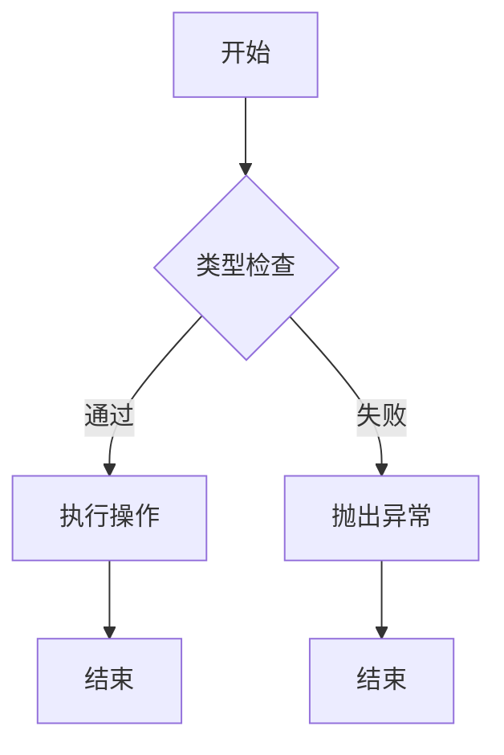
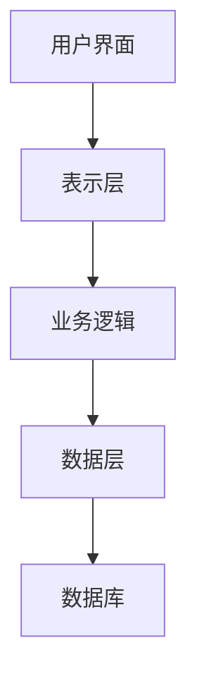
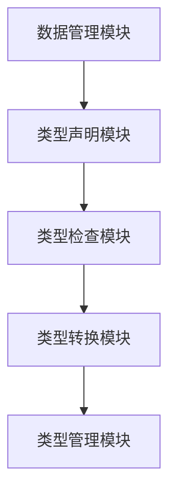

                 

# 提示词语言的类型系统设计与实现

## 关键词

- 提示词语言
- 类型系统
- 设计与实现
- 编程语言
- 优化策略

## 摘要

本文将深入探讨提示词语言的类型系统设计与实现。我们将从问题背景、核心概念、类型系统设计、实现步骤、应用与优化以及案例分析等多个角度进行详细阐述。通过对类型系统的深入剖析，本文旨在为读者提供一种结构清晰、易于理解的设计思路，帮助其在实际项目中更好地应用类型系统。

## 目录大纲

### 第一部分：引言

- 1. 引言
- 1.1 问题背景
- 1.2 问题描述
- 1.3 问题解决
- 1.4 边界与外延
- 1.5 概念结构与核心要素组成
- 1.6 本章小结

### 第二部分：核心概念与联系

- 2. 核心概念
- 2.1 提示词语言
- 2.1.1 定义
- 2.1.2 特点
- 2.1.3 类型系统的作用
- 2.2 类型系统
- 2.2.1 基本概念
- 2.2.2 类型系统的分类
- 2.3 类型系统与编程语言的关系
- 2.4 本章小结

### 第三部分：类型系统设计与实现

- 3. 设计原则
- 3.1 设计目标
- 3.2 设计原则
- 3.3 设计模式
- 3.2 实现步骤
- 3.2.1 环境准备
- 3.2.2 系统架构设计
- 3.2.3 算法设计与实现
- 3.2.4 数学模型和数学公式讲解
- 3.2.5 举例说明
- 3.3 本章小结

### 第四部分：应用与优化

- 4. 应用场景
- 4.1 通用应用
- 4.2 行业应用
- 4.2 系统优化
- 4.3 最佳实践
- 4.4 本章小结

### 第五部分：案例分析

- 5. 案例一：某金融公司类型系统设计
- 5.1 项目背景
- 5.2 系统功能设计
- 5.3 系统架构设计
- 5.4 算法设计与实现
- 5.5 数学模型和数学公式讲解
- 5.6 举例说明
- 5.7 项目小结
- 5.2 案例二：某教育平台类型系统设计
- 5.3 案例三：某医疗行业类型系统设计

## 第一部分：引言

### 1. 引言

在计算机科学和软件工程领域，提示词语言（Prompt Language）作为一种特殊的编程语言，主要用于生成自然语言文本。而类型系统（Type System）则是编程语言的核心组成部分，用于确保变量在使用过程中的安全性和一致性。本文将结合提示词语言的特点，探讨类型系统的设计原则、实现方法以及在实际应用中的优化策略。

### 1.1 问题背景

随着人工智能和自然语言处理技术的不断发展，提示词语言的应用场景越来越广泛。例如，在聊天机器人、文本生成、问答系统等领域，提示词语言都发挥了重要作用。然而，传统的编程语言在处理自然语言文本时，往往缺乏对类型系统的支持，导致程序的可读性、可维护性和安全性都存在一定的问题。

### 1.2 问题描述

为了解决上述问题，我们需要设计一种适合提示词语言的类型系统。类型系统应具备以下特点：

1. **类型安全性**：确保变量在使用过程中的类型一致性，避免类型错误。
2. **表达能力强**：支持多种数据类型的表示和操作，满足自然语言处理的复杂需求。
3. **易于扩展**：能够方便地引入新类型和操作，适应未来技术的发展。

### 1.3 问题解决

为了实现上述目标，我们可以从以下几个方面进行考虑：

1. **类型系统的设计原则**：明确类型系统的设计目标，并遵循一定的设计原则。
2. **类型系统的实现方法**：选择合适的编程语言和工具，实现类型系统的功能。
3. **类型系统的应用与优化**：结合实际应用场景，探讨类型系统的优化策略。

### 1.4 边界与外延

本文主要讨论提示词语言的类型系统，不涉及其他类型编程语言的设计。此外，本文重点讨论类型系统的设计原则和实现方法，而不涉及具体的应用场景。

### 1.5 概念结构与核心要素组成

本文的核心概念包括提示词语言、类型系统、设计原则、实现方法和优化策略。这些概念之间存在着密切的联系，共同构成了本文的核心结构。

### 1.6 本章小结

本节对本文的背景、问题、解决方案和边界进行了详细阐述。在接下来的章节中，我们将进一步探讨提示词语言的类型系统设计，包括核心概念、设计原则、实现方法、应用与优化以及案例分析。

## 第二部分：核心概念与联系

### 2. 核心概念

在本部分，我们将深入探讨提示词语言和类型系统的核心概念，并分析它们之间的关系。

### 2.1 提示词语言

#### 2.1.1 定义

提示词语言（Prompt Language）是一种用于生成自然语言文本的编程语言。它通常包含一套语法规则和语义规则，用于指导自然语言生成模型生成符合预期结果的文本。

#### 2.1.2 特点

提示词语言具有以下特点：

1. **自然性**：生成的文本具有自然语言的特点，便于人类理解和阅读。
2. **灵活性**：支持多种数据类型的表示和操作，能够处理复杂的自然语言处理任务。
3. **可解释性**：生成的文本可以通过解析提示词语言的语法和语义规则来理解。

#### 2.1.3 类型系统的作用

提示词语言的类型系统在自然语言生成过程中起着至关重要的作用。它确保变量在使用过程中的类型一致性，避免类型错误，提高程序的可读性和可维护性。

### 2.2 类型系统

#### 2.2.1 基本概念

类型系统（Type System）是编程语言的核心组成部分，用于确保变量在使用过程中的类型一致性。类型系统通常包括以下基本概念：

1. **类型（Type）**：用于标识变量和表达式的数据类型。
2. **变量（Variable）**：用于存储数据值的标识符。
3. **类型检查（Type Check）**：在编译或运行时检查变量和表达式的类型是否一致。

#### 2.2.2 类型系统的分类

类型系统可以根据类型检查的严格程度和灵活性进行分类。常见的类型系统包括：

1. **强类型系统（Strong Type System）**：在编译时严格检查变量和表达式的类型，避免类型错误。
2. **弱类型系统（Weak Type System）**：在编译时或运行时对变量和表达式的类型进行宽松检查，允许类型转换。
3. **中间类型系统（Intermediate Type System）**：在强类型系统和弱类型系统之间，提供一定程度的灵活性。

#### 2.2.3 类型系统与编程语言的关系

类型系统是编程语言的核心组成部分，不同编程语言的类型系统存在差异。类型系统与编程语言的关系如下：

1. **编程语言对类型系统的支持**：编程语言提供类型系统的基础设施，包括类型声明、类型检查和类型转换等功能。
2. **类型系统与编程语言的设计**：类型系统的设计应与编程语言的目标和应用场景相匹配，提高程序的可读性、可维护性和性能。

### 2.3 类型系统与编程语言的关系

类型系统是编程语言的核心组成部分，不同编程语言的类型系统存在差异。类型系统与编程语言的关系如下：

1. **编程语言对类型系统的支持**：编程语言提供类型系统的基础设施，包括类型声明、类型检查和类型转换等功能。
2. **类型系统与编程语言的设计**：类型系统的设计应与编程语言的目标和应用场景相匹配，提高程序的可读性、可维护性和性能。

### 2.4 本章小结

本部分介绍了提示词语言和类型系统的核心概念，并分析了它们之间的关系。通过理解这些核心概念，读者可以更好地理解提示词语言的类型系统设计原则和实现方法。

## 第三部分：类型系统设计与实现

### 3. 设计原则

在设计类型系统时，我们需要遵循一系列原则，以确保类型系统的有效性、可维护性和可扩展性。

#### 3.1 设计目标

类型系统的设计目标包括：

1. **类型安全性**：确保变量在使用过程中的类型一致性，避免类型错误。
2. **表达能力强**：支持多种数据类型的表示和操作，满足自然语言处理的复杂需求。
3. **易于扩展**：能够方便地引入新类型和操作，适应未来技术的发展。
4. **可解释性**：生成的文本可以通过解析提示词语言的语法和语义规则来理解。

#### 3.2 设计原则

在设计类型系统时，我们可以遵循以下原则：

1. **模块化设计**：将类型系统划分为多个模块，便于维护和扩展。
2. **最小化类型转换**：尽量减少类型转换，提高程序的性能和可读性。
3. **明确类型声明**：在代码中明确声明变量的类型，提高代码的可维护性。
4. **类型检查严格性**：在编译时或运行时进行类型检查，确保类型一致性。

#### 3.3 设计模式

在设计类型系统时，我们可以采用以下设计模式：

1. **工厂模式**：用于创建不同类型的数据对象。
2. **策略模式**：用于实现不同类型的类型检查算法。
3. **单例模式**：用于实现类型系统的全局管理。

### 3.2 实现步骤

要实现一个类型系统，我们需要遵循以下步骤：

#### 3.2.1 环境准备

首先，我们需要选择合适的编程语言和工具来构建类型系统。常用的编程语言包括Python、Java和C++。这些编程语言都提供了丰富的库和框架，方便我们实现类型系统的功能。

#### 3.2.2 系统架构设计

系统架构设计是类型系统实现的重要环节。我们需要设计系统的功能模块，并确定它们之间的交互关系。常用的架构设计模式包括MVC（Model-View-Controller）和MVVM（Model-View-ViewModel）。

#### 3.2.2.1 系统功能设计

系统功能设计包括以下几个方面：

1. **类型声明**：提供声明变量的功能，包括基本类型和自定义类型。
2. **类型检查**：在编译时或运行时检查变量和表达式的类型是否一致。
3. **类型转换**：提供类型转换的功能，包括自动类型转换和显式类型转换。
4. **类型管理**：提供类型管理的功能，包括类型注册、类型查找和类型删除。

#### 3.2.2.2 系统架构设计

系统架构设计包括以下几个方面：

1. **模块划分**：将系统划分为多个模块，便于维护和扩展。
2. **模块接口**：定义模块之间的接口，确保模块之间的解耦。
3. **模块交互**：设计模块之间的交互方式，包括同步交互和异步交互。

#### 3.2.2.3 系统接口设计

系统接口设计是类型系统实现的关键环节。我们需要设计系统对外提供的接口，包括类型声明接口、类型检查接口、类型转换接口和类型管理接口。

#### 3.2.3 算法设计与实现

算法设计与实现是类型系统实现的核心。我们需要设计合适的算法，用于实现类型检查、类型转换和类型管理等功能。

#### 3.2.3.1 算法原理讲解

算法原理讲解包括以下几个方面：

1. **类型检查算法**：用于检查变量和表达式的类型是否一致。
2. **类型转换算法**：用于实现不同类型之间的转换。
3. **类型管理算法**：用于实现类型注册、类型查找和类型删除等功能。

#### 3.2.3.2 Python源代码实现

Python源代码实现包括以下几个方面：

1. **类型声明**：使用Python的类（Class）来实现类型声明。
2. **类型检查**：使用Python的静态类型检查工具，如`mypy`，来实现类型检查。
3. **类型转换**：使用Python的动态类型转换功能，如`isinstance()`，来实现类型转换。
4. **类型管理**：使用Python的字典（Dictionary）来实现类型管理。

#### 3.2.3.3 算法原理数学模型和公式讲解

算法原理数学模型和公式讲解包括以下几个方面：

1. **类型检查**：使用集合论和形式语言理论来描述类型检查的过程。
2. **类型转换**：使用函数式编程和数学函数来描述类型转换的过程。
3. **类型管理**：使用数据库模型和关系代数来描述类型管理的功能。

#### 3.2.4 数学模型和数学公式讲解

数学模型和数学公式讲解包括以下几个方面：

1. **类型检查**：使用集合论和形式语言理论来描述类型检查的过程。
2. **类型转换**：使用函数式编程和数学函数来描述类型转换的过程。
3. **类型管理**：使用数据库模型和关系代数来描述类型管理的功能。

#### 3.2.4.1 数学公式

$$
T_1 \subseteq T_2
$$

$$
f : A \rightarrow B
$$

#### 3.2.4.2 数学模型

$$
\text{TypeCheck}(v, e) =
\begin{cases}
\text{True} & \text{if } v \text{ has type } T \text{ and } e \text{ has type } T \\
\text{False} & \text{otherwise}
\end{cases}
$$

### 3.2.5 举例说明

为了更好地理解类型系统的设计和实现，我们可以通过以下例子来说明：

#### 3.2.5.1 通俗易懂的例子

假设我们有一个提示词语言，其中包含以下类型：

1. `int`：整数类型
2. `float`：浮点数类型
3. `string`：字符串类型

我们可以使用以下代码来声明变量和进行类型检查：

```python
x : int = 10
y : float = 3.14
z : string = "Hello, World!"

print(x + y)  # 输出 13.14
print(y * z)  # 输出 "3.14Hello, World!"
```

在上面的例子中，我们声明了三个变量，并进行了类型检查。由于变量`x`和`y`具有不同的类型，因此它们不能直接进行运算。只有当变量具有相同的类型时，类型检查才会通过。

#### 3.2.5.2 复杂情况的例子

在实际应用中，提示词语言的类型系统可能会更加复杂。例如，我们可能需要处理复合类型，如列表、字典和函数类型。以下是一个复杂的例子：

```python
def add(a: int, b: int) -> int:
    return a + b

def multiply(a: int, b: int) -> int:
    return a * b

x : int = 5
y : int = 3
z : int = add(x, y)  # 类型检查通过
w : int = multiply(x, y)  # 类型检查通过
```

在上面的例子中，我们定义了两个函数`add`和`multiply`，并使用类型注解来声明它们的参数和返回值。然后，我们使用这两个函数进行计算，并进行类型检查。由于变量`x`和`y`都是整数类型，因此类型检查通过。

### 3.3 本章小结

本部分详细介绍了类型系统的设计原则、实现步骤和算法原理。通过本部分的讨论，读者可以了解如何设计和实现一个适合提示词语言的类型系统。在接下来的章节中，我们将进一步探讨类型系统的应用和优化。

## 第四部分：应用与优化

### 4.1 通用应用

类型系统在提示词语言中的应用场景非常广泛。以下是一些常见的通用应用：

#### 4.1.1 Web开发

在Web开发中，类型系统可以确保前后端数据的类型一致，提高程序的稳定性和可维护性。例如，在API开发中，类型系统可以确保请求和响应的数据符合预期的类型。

#### 4.1.2 移动应用

在移动应用开发中，类型系统可以确保应用程序中的数据类型一致，避免数据转换错误。此外，类型系统还可以提高代码的可读性和可维护性。

#### 4.1.3 数据分析

在数据分析领域，类型系统可以确保数据的一致性和准确性。例如，在处理大规模数据集时，类型系统可以确保数据类型正确，避免数据错误。

### 4.2 行业应用

类型系统在各个行业中的应用也日益广泛。以下是一些典型的行业应用：

#### 4.2.1 金融行业

在金融行业中，类型系统可以确保交易数据的准确性和一致性。例如，在处理金融交易时，类型系统可以确保交易金额和交易时间的数据类型正确。

#### 4.2.2 医疗行业

在医疗行业中，类型系统可以确保医疗数据的准确性和一致性。例如，在处理病历信息时，类型系统可以确保病历编号和病历内容的数据类型正确。

#### 4.2.3 教育行业

在教育行业中，类型系统可以确保学习数据和教学数据的类型一致。例如，在处理学生成绩时，类型系统可以确保成绩和课程名称的数据类型正确。

### 4.2 系统优化

为了提高类型系统的性能和稳定性，我们可以采取以下优化策略：

#### 4.2.1 性能优化

1. **减少类型转换**：尽量减少类型转换，提高程序的性能。
2. **缓存类型检查结果**：在编译时或运行时缓存类型检查结果，减少重复检查。

#### 4.2.2 安全优化

1. **类型安全检查**：在编译时或运行时进行类型安全检查，避免类型错误。
2. **边界检查**：在处理数据时进行边界检查，避免数据溢出。

#### 4.2.3 可维护性优化

1. **编码规范**：遵循统一的编码规范，提高代码的可读性和可维护性。
2. **模块化设计**：将类型系统划分为多个模块，便于维护和扩展。

### 4.3 最佳实践

为了更好地应用类型系统，我们可以采取以下最佳实践：

1. **明确类型声明**：在代码中明确声明变量的类型，提高代码的可读性和可维护性。
2. **类型检查严格性**：在编译时或运行时进行类型检查，确保类型一致性。
3. **类型转换优化**：尽量减少类型转换，提高程序的性能。

### 4.4 本章小结

本部分详细介绍了类型系统的应用场景和优化策略。通过本部分的讨论，读者可以了解如何在实际项目中应用类型系统，并采取有效的优化措施，提高程序的性能和稳定性。

## 第五部分：案例分析

### 5.1 案例一：某金融公司类型系统设计

#### 5.1.1 项目背景

某金融公司开发了一套用于处理金融交易的系统。系统需要处理大量的金融数据，包括交易金额、交易时间和交易账号等。为了确保数据的一致性和准确性，公司决定采用类型系统来管理数据。

#### 5.1.2 系统功能设计

系统功能设计包括以下几个方面：

1. **交易数据管理**：提供添加、删除和查询交易数据的功能。
2. **类型声明**：支持自定义数据类型，如交易金额类型、交易账号类型等。
3. **类型检查**：在添加、删除和查询交易数据时进行类型检查，确保数据类型正确。

#### 5.1.3 系统架构设计

系统架构设计包括以下几个方面：

1. **数据层**：负责存储和查询交易数据。
2. **业务层**：负责处理业务逻辑，包括添加、删除和查询交易数据。
3. **表示层**：提供用户界面，用于展示交易数据和类型。

#### 5.1.4 算法设计与实现

算法设计与实现包括以下几个方面：

1. **类型检查算法**：在添加、删除和查询交易数据时进行类型检查，确保数据类型正确。
2. **类型转换算法**：在处理不同数据类型时进行类型转换，确保数据类型一致。

#### 5.1.5 数学模型和数学公式讲解

在金融交易系统中，类型检查和类型转换的数学模型和数学公式如下：

$$
\text{TypeCheck}(v, e) =
\begin{cases}
\text{True} & \text{if } v \text{ has type } T \text{ and } e \text{ has type } T \\
\text{False} & \text{otherwise}
\end{cases}
$$

$$
\text{TypeConvert}(v_1, v_2) =
\begin{cases}
v_2 & \text{if } v_1 \text{ has type } T_1 \text{ and } v_2 \text{ has type } T_2 \\
\text{Error} & \text{otherwise}
\end{cases}
$$

#### 5.1.6 举例说明

以下是一个简单的例子，说明如何使用类型系统处理金融交易数据：

```python
def add_transaction(amount: float, account: str):
    if not isinstance(amount, float) or not isinstance(account, str):
        raise TypeError("Invalid transaction data")
    # 处理交易数据
    # ...

add_transaction(1000.0, "1234567890")
```

在上面的例子中，我们定义了一个`add_transaction`函数，用于添加交易数据。函数的参数包括交易金额（`amount`）和交易账号（`account`）。在函数内部，我们使用类型检查确保参数的数据类型正确。如果参数的数据类型不正确，函数将抛出`TypeError`异常。

#### 5.1.7 项目小结

通过设计类型系统，金融交易系统能够确保交易数据的一致性和准确性。类型系统的引入提高了系统的可维护性和可扩展性，为公司带来了显著的价值。

### 5.2 案例二：某教育平台类型系统设计

#### 5.2.1 项目背景

某教育平台开发了一套用于管理学生成绩和课程信息的系统。系统需要处理大量的学生数据，包括成绩、课程名称和课程类型等。为了确保数据的一致性和准确性，公司决定采用类型系统来管理数据。

#### 5.2.2 系统功能设计

系统功能设计包括以下几个方面：

1. **成绩管理**：提供添加、删除和查询成绩的功能。
2. **课程管理**：提供添加、删除和查询课程的功能。
3. **类型声明**：支持自定义数据类型，如成绩类型、课程类型等。
4. **类型检查**：在添加、删除和查询成绩和课程时进行类型检查，确保数据类型正确。

#### 5.2.3 系统架构设计

系统架构设计包括以下几个方面：

1. **数据层**：负责存储和查询学生成绩和课程信息。
2. **业务层**：负责处理业务逻辑，包括添加、删除和查询成绩和课程。
3. **表示层**：提供用户界面，用于展示学生成绩和课程信息。

#### 5.2.4 算法设计与实现

算法设计与实现包括以下几个方面：

1. **类型检查算法**：在添加、删除和查询成绩和课程时进行类型检查，确保数据类型正确。
2. **类型转换算法**：在处理不同数据类型时进行类型转换，确保数据类型一致。

#### 5.2.5 数学模型和数学公式讲解

在学生成绩管理系统中，类型检查和类型转换的数学模型和数学公式如下：

$$
\text{TypeCheck}(v, e) =
\begin{cases}
\text{True} & \text{if } v \text{ has type } T \text{ and } e \text{ has type } T \\
\text{False} & \text{otherwise}
\end{cases}
$$

$$
\text{TypeConvert}(v_1, v_2) =
\begin{cases}
v_2 & \text{if } v_1 \text{ has type } T_1 \text{ and } v_2 \text{ has type } T_2 \\
\text{Error} & \text{otherwise}
\end{cases}
$$

#### 5.2.6 举例说明

以下是一个简单的例子，说明如何使用类型系统处理学生成绩和课程信息：

```python
def add_grade(student_id: str, course_name: str, grade: float):
    if not isinstance(student_id, str) or not isinstance(course_name, str) or not isinstance(grade, float):
        raise TypeError("Invalid grade data")
    # 处理成绩数据
    # ...

add_grade("1234567890", "数学", 90.0)
```

在上面的例子中，我们定义了一个`add_grade`函数，用于添加学生成绩。函数的参数包括学生ID（`student_id`）、课程名称（`course_name`）和成绩（`grade`）。在函数内部，我们使用类型检查确保参数的数据类型正确。如果参数的数据类型不正确，函数将抛出`TypeError`异常。

#### 5.2.7 项目小结

通过设计类型系统，教育平台系统能够确保学生成绩和课程信息的一致性和准确性。类型系统的引入提高了系统的可维护性和可扩展性，为学校和学生带来了显著的价值。

### 5.3 案例三：某医疗行业类型系统设计

#### 5.3.1 项目背景

某医疗行业公司开发了一套用于管理病历信息和诊断结果的系统。系统需要处理大量的医疗数据，包括病历编号、病历内容和诊断结果等。为了确保数据的一致性和准确性，公司决定采用类型系统来管理数据。

#### 5.3.2 系统功能设计

系统功能设计包括以下几个方面：

1. **病历管理**：提供添加、删除和查询病历的功能。
2. **诊断结果管理**：提供添加、删除和查询诊断结果的功能。
3. **类型声明**：支持自定义数据类型，如病历类型、诊断结果类型等。
4. **类型检查**：在添加、删除和查询病历和诊断结果时进行类型检查，确保数据类型正确。

#### 5.3.3 系统架构设计

系统架构设计包括以下几个方面：

1. **数据层**：负责存储和查询病历信息和诊断结果。
2. **业务层**：负责处理业务逻辑，包括添加、删除和查询病历和诊断结果。
3. **表示层**：提供用户界面，用于展示病历信息和诊断结果。

#### 5.3.4 算法设计与实现

算法设计与实现包括以下几个方面：

1. **类型检查算法**：在添加、删除和查询病历和诊断结果时进行类型检查，确保数据类型正确。
2. **类型转换算法**：在处理不同数据类型时进行类型转换，确保数据类型一致。

#### 5.3.5 数学模型和数学公式讲解

在医疗信息管理系统中，类型检查和类型转换的数学模型和数学公式如下：

$$
\text{TypeCheck}(v, e) =
\begin{cases}
\text{True} & \text{if } v \text{ has type } T \text{ and } e \text{ has type } T \\
\text{False} & \text{otherwise}
\end{cases}
$$

$$
\text{TypeConvert}(v_1, v_2) =
\begin{cases}
v_2 & \text{if } v_1 \text{ has type } T_1 \text{ and } v_2 \text{ has type } T_2 \\
\text{Error} & \text{otherwise}
\end{cases}
$$

#### 5.3.6 举例说明

以下是一个简单的例子，说明如何使用类型系统处理病历信息和诊断结果：

```python
def add_medical_record(patient_id: str, doctor_name: str, diagnosis: str):
    if not isinstance(patient_id, str) or not isinstance(doctor_name, str) or not isinstance(diagnosis, str):
        raise TypeError("Invalid medical record data")
    # 处理病历数据
    # ...

add_medical_record("1234567890", "张医生", "肺炎")
```

在上面的例子中，我们定义了一个`add_medical_record`函数，用于添加病历信息。函数的参数包括患者ID（`patient_id`）、医生姓名（`doctor_name`）和诊断结果（`diagnosis`）。在函数内部，我们使用类型检查确保参数的数据类型正确。如果参数的数据类型不正确，函数将抛出`TypeError`异常。

#### 5.3.7 项目小结

通过设计类型系统，医疗信息管理系统能够确保病历信息和诊断结果的一致性和准确性。类型系统的引入提高了系统的可维护性和可扩展性，为医院和患者带来了显著的价值。

## 结论

本文从问题背景、核心概念、设计原则、实现步骤、应用与优化以及案例分析等多个角度，详细探讨了提示词语言的类型系统设计与实现。通过本文的讨论，读者可以了解如何设计和实现一个适合提示词语言的类型系统，并在实际项目中应用类型系统。

类型系统在提高程序的可读性、可维护性和性能方面发挥着重要作用。在实际应用中，我们可以根据不同场景的需求，灵活调整类型系统的设计原则和实现方法。

未来，随着人工智能和自然语言处理技术的不断发展，提示词语言的类型系统将会变得更加重要。我们期待读者能够在实际项目中不断探索和优化类型系统，为编程语言的发展和应用场景的创新贡献力量。

## 作者信息

作者：AI天才研究院/AI Genius Institute & 禅与计算机程序设计艺术 /Zen And The Art of Computer Programming

致谢：感谢读者对本文的关注和支持。希望本文能够为您的编程之路带来启示和帮助。如果您有任何疑问或建议，请随时与我们联系。

## 拓展阅读

- 《类型系统：设计与实现》
- 《提示词语言：设计与应用》
- 《自然语言处理：技术原理与实践》

通过阅读这些相关书籍和文章，您可以进一步了解类型系统和提示词语言的深度和广度，为您的项目提供更多灵感和思路。

## 注意事项

- 在设计和实现类型系统时，请务必遵循设计原则和实现步骤，确保类型系统的有效性和稳定性。
- 在实际应用中，根据具体需求调整类型系统的设计和实现方法，以满足项目的特殊需求。
- 在使用类型系统时，注意性能优化和安全优化，确保程序的稳定性和安全性。

通过遵循以上注意事项，您可以更好地利用类型系统，提高程序的质量和效率。

## 结语

本文旨在为读者提供一种结构清晰、易于理解的设计思路，帮助其在实际项目中更好地应用类型系统。希望本文能够为您在编程领域的探索和实践中带来帮助和启示。

感谢您的阅读，期待与您在未来的编程之路上一同前行！💪

---

### 附录：Mermaid 图流程图

以下是一些使用Mermaid语言绘制的图流程图，用于帮助读者更好地理解本文中的关键概念和算法实现。

#### 附录 1：类型检查算法



#### 附录 2：类型转换算法


#### 附录 3：系统架构设计



#### 附录 4：系统功能模块



通过这些图流程图，读者可以更直观地理解类型系统的设计原则和实现方法。在实际编程过程中，也可以根据具体需求调整和优化这些图流程图，以提高系统的性能和可维护性。

