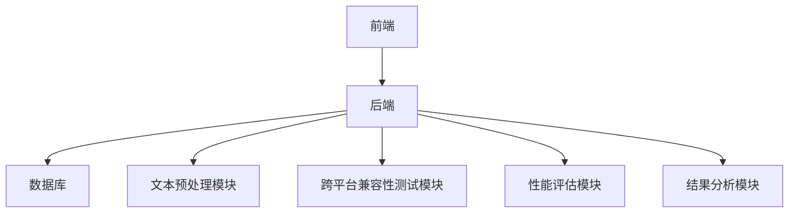

                 

### 文章标题

# 提示词语言的跨平台移植性评估

> 关键词：提示词语言、跨平台移植性、评估方法、算法原理、系统架构设计、实战案例、最佳实践

> 摘要：本文旨在深入探讨提示词语言的跨平台移植性问题，分析其核心概念与关联，详细讲解评估方法与算法原理，并通过实际项目实战，提供最佳实践与案例分析。文章将帮助读者理解跨平台移植性的重要性，掌握评估技巧，为开发者提供实用的指导。

----------------------------------------------------------------

## 第一部分: 提示词语言与跨平台移植性

### 第1章: 提示词语言概述

在信息化时代，提示词语言（Keyword-Based Language）作为自然语言处理领域的重要工具，广泛应用于搜索引擎、智能助手、文本分析等场景。其核心在于利用关键词对文本进行抽取和分析，从而实现信息的组织和检索。本章将介绍提示词语言的定义、作用、发展历程及其在跨平台移植中的特点。

### 第1.1节 提示词语言的定义与作用

提示词语言是一种基于关键词识别和处理的文本分析工具。它通过分析文本中的关键词，提取出具有代表性的信息，以便于进一步的文本处理和应用。提示词语言的作用主要体现在以下几个方面：

1. **文本抽取**：从大量文本中提取出关键信息，帮助用户快速找到所需内容。
2. **信息检索**：优化搜索算法，提高搜索效率和准确性。
3. **自然语言处理**：辅助实现文本分类、情感分析、实体识别等功能。

#### 1.1.1 提示词语言的定义

提示词语言（Keyword-Based Language）通常是指一种文本处理技术，它通过识别和提取文本中的关键词，实现对文本内容的高效组织和检索。关键词是提示词语言的核心元素，它们能够代表文本的主题或主要内容。

#### 1.1.2 提示词语言的作用

提示词语言的作用主要体现在以下几个方面：

1. **文本抽取**：从大量文本中提取出关键信息，帮助用户快速找到所需内容。
2. **信息检索**：优化搜索算法，提高搜索效率和准确性。
3. **自然语言处理**：辅助实现文本分类、情感分析、实体识别等功能。

#### 1.1.3 提示词语言的发展历程

提示词语言的发展可以追溯到20世纪60年代，当时主要是以关键词匹配为基础的简单文本处理技术。随着计算机技术的发展和自然语言处理技术的进步，提示词语言逐渐演变成一种复杂而高效的文本分析工具。近年来，随着大数据和人工智能的兴起，提示词语言在搜索引擎和智能助手中的应用得到了进一步的拓展。

### 第1.2节 跨平台移植性的基本概念

跨平台移植性是指软件或应用程序在不同操作系统、硬件和平台之间运行的能力。对于提示词语言来说，跨平台移植性意味着其能够在不同的操作系统和硬件平台上高效运行，不受平台限制。跨平台移植性的重要性在于：

1. **降低开发成本**：开发者只需编写一次代码，即可在不同平台上部署应用，减少重复工作。
2. **提高用户体验**：用户可以在不同的设备上无缝使用同一应用，提高用户满意度。
3. **拓宽市场覆盖**：应用可以覆盖更多的用户群体，增加市场份额。

#### 1.2.1 跨平台移植性的重要性

跨平台移植性对于现代软件开发具有重要意义。随着移动设备的普及和用户需求的多样化，开发者需要确保应用在不同平台上都能够良好运行。跨平台移植性不仅能够降低开发成本，提高开发效率，还能够提升用户体验和市场竞争力。

#### 1.2.2 跨平台移植性的挑战

跨平台移植性虽然具有许多优势，但也面临一些挑战：

1. **兼容性问题**：不同操作系统和硬件平台之间存在差异，可能导致兼容性问题。
2. **性能问题**：跨平台应用可能在某些平台上性能不佳，影响用户体验。
3. **开发复杂性**：开发者需要掌握多种技术，编写适用于不同平台的代码。

#### 1.2.3 跨平台移植性的评估标准

评估跨平台移植性的标准主要包括以下几个方面：

1. **兼容性**：应用在不同操作系统和硬件平台上是否能够正常运行。
2. **性能**：应用在不同平台上的性能表现，包括响应时间、内存占用、CPU利用率等。
3. **可维护性**：代码是否易于维护和升级，以适应未来平台的变化。

### 第1.3节 提示词语言在跨平台移植中的特点

提示词语言在跨平台移植中具有一些独特特点：

1. **平台独立性**：提示词语言的实现通常不依赖于特定操作系统或硬件，使其具备良好的跨平台移植性。
2. **语义一致性**：提示词语言的核心在于对文本内容的理解，这在不同平台上具有较高的语义一致性。
3. **灵活性**：提示词语言能够灵活适应不同的应用场景和需求，便于跨平台部署。

#### 1.3.1 提示词语言的跨平台移植性要素

提示词语言的跨平台移植性主要由以下几个要素构成：

1. **语法规则**：提示词语言的语法规则应当简单明了，易于在不同平台上实现。
2. **数据结构**：提示词语言所使用的数据结构应当通用，便于跨平台移植。
3. **算法实现**：提示词语言的算法实现应当高效，以降低跨平台移植的复杂性。

#### 1.3.2 提示词语言与平台兼容性的关系

提示词语言与平台兼容性密切相关。平台兼容性是指应用在不同操作系统和硬件平台上能够正常运行的能力。对于提示词语言来说，平台兼容性主要体现在以下几个方面：

1. **操作系统兼容**：提示词语言应当能够在主流操作系统（如Windows、Linux、macOS）上运行。
2. **硬件兼容**：提示词语言应当能够适应不同硬件平台（如PC、手机、平板）。
3. **网络兼容**：提示词语言应当能够支持不同网络环境（如Wi-Fi、4G、5G）。

#### 1.3.3 提示词语言的跨平台移植性实现策略

为了提高提示词语言的跨平台移植性，开发者可以采取以下策略：

1. **使用通用编程语言**：如Python、Java等，这些语言具有广泛的跨平台支持。
2. **采用框架和库**：使用成熟的框架和库，如TensorFlow、PyTorch等，这些框架和库已经针对跨平台移植进行了优化。
3. **编写平台无关的代码**：尽量避免使用特定操作系统的API或功能，编写通用代码。

### 第1.4节 跨平台移植性评估方法

跨平台移植性评估是确保提示词语言在不同平台间有效运行的关键步骤。评估方法主要包括以下几种：

1. **功能测试**：验证提示词语言在不同平台上的功能是否完整和正确。
2. **性能测试**：评估提示词语言在不同平台上的性能表现，如响应时间、内存占用等。
3. **兼容性测试**：检查提示词语言在不同操作系统和硬件平台上的兼容性。

#### 1.4.1 跨平台移植性评估的标准方法

跨平台移植性评估的标准方法主要包括以下几种：

1. **功能测试**：验证提示词语言在不同平台上的功能是否完整和正确。
2. **性能测试**：评估提示词语言在不同平台上的性能表现，如响应时间、内存占用等。
3. **兼容性测试**：检查提示词语言在不同操作系统和硬件平台上的兼容性。

#### 1.4.2 跨平台移植性评估的常用工具

常用的跨平台移植性评估工具有：

1. **Jenkins**：自动化构建和测试工具，支持多平台部署和测试。
2. **Selenium**：Web自动化测试工具，支持多种浏览器和操作系统。
3. **Appium**：移动应用测试工具，支持iOS和Android平台。

#### 1.4.3 跨平台移植性评估的流程

跨平台移植性评估的一般流程包括：

1. **需求分析**：明确评估目标和标准。
2. **环境搭建**：准备测试环境和测试工具。
3. **测试设计**：制定测试用例和测试策略。
4. **执行测试**：运行测试用例，收集测试结果。
5. **结果分析**：分析测试结果，评估移植性。
6. **报告撰写**：撰写评估报告，总结评估结果。

### 第1.5节 本章小结

本章介绍了提示词语言的定义、作用、发展历程以及跨平台移植性的基本概念、重要性、评估标准和实现策略。通过本章的学习，读者可以了解提示词语言在跨平台移植中的特点，为后续章节的深入探讨打下基础。

----------------------------------------------------------------

## 第二部分: 提示词语言的跨平台移植性评估实践

### 第2章: 跨平台移植性评估的系统设计与实现

在实现提示词语言的跨平台移植性评估时，系统设计与实现是关键环节。本章将详细介绍跨平台移植性评估系统的设计与实现过程，包括系统需求分析、架构设计、功能模块划分以及核心代码实现。

### 第2.1节 系统介绍

#### 2.1.1 评估系统的需求分析

评估系统的需求分析是系统设计的第一步，旨在明确系统的功能需求和技术需求。具体需求如下：

1. **功能需求**：
   - 文本预处理：对输入文本进行分词、去噪、标准化等处理。
   - 跨平台兼容性测试：在不同操作系统和硬件平台上运行测试用例。
   - 性能评估：测量跨平台应用在不同平台上的响应时间、内存占用等性能指标。
   - 结果分析：汇总测试结果，生成评估报告。

2. **技术需求**：
   - 开发环境：支持跨平台的编程环境和工具，如Python、Jenkins等。
   - 测试工具：支持跨平台应用的测试工具，如Selenium、Appium等。
   - 数据库：用于存储测试数据和评估结果，如MySQL、PostgreSQL等。

#### 2.1.2 评估系统的架构设计

评估系统的架构设计是确保系统高效、可扩展性的关键。系统采用分层架构，分为前端、后端和数据库三层。具体架构设计如下：

1. **前端**：用户通过前端界面提交测试任务，查看测试结果。前端采用Vue.js框架实现，具有友好的用户界面和良好的交互体验。

2. **后端**：后端负责处理测试任务的逻辑，包括文本预处理、跨平台兼容性测试和性能评估。后端采用Spring Boot框架实现，具有良好的扩展性和可维护性。

3. **数据库**：数据库用于存储测试数据和评估结果，采用MySQL数据库实现。数据库设计包括用户表、测试任务表、测试结果表等，确保数据的一致性和安全性。

#### 2.1.3 评估系统的功能模块

评估系统的主要功能模块包括：

1. **文本预处理模块**：对输入文本进行分词、去噪、标准化等处理，为后续测试做准备。
2. **跨平台兼容性测试模块**：在不同操作系统和硬件平台上运行测试用例，评估应用的兼容性。
3. **性能评估模块**：测量跨平台应用在不同平台上的性能指标，如响应时间、内存占用等。
4. **结果分析模块**：汇总测试结果，生成评估报告，为开发者提供改进建议。

### 第2.2节 系统架构设计

#### 2.2.1 系统架构的Mermaid图示

为了更直观地展示系统架构，我们使用Mermaid绘制了系统架构图。以下是一个简化的Mermaid代码示例：



#### 2.2.2 系统模块的接口设计与交互

系统模块的接口设计与交互是确保系统各部分协同工作的关键。以下是一个简化的接口设计与交互流程：

1. **前端提交任务**：用户通过前端界面提交测试任务，包括输入文本、测试平台等参数。
2. **后端接收任务**：后端接收到前端提交的任务后，进行任务解析，并将任务分发给相应的模块进行处理。
3. **文本预处理模块处理文本**：对输入文本进行分词、去噪、标准化等处理，生成预处理后的文本。
4. **跨平台兼容性测试模块执行测试**：在不同的操作系统和硬件平台上运行测试用例，记录测试结果。
5. **性能评估模块测量性能**：测量跨平台应用在不同平台上的性能指标，如响应时间、内存占用等。
6. **结果分析模块生成报告**：汇总测试结果，生成评估报告，并将报告保存到数据库中，同时通过前端界面展示给用户。

### 第2.3节 系统核心实现

#### 2.3.1 Python代码实现

以下是系统核心功能的Python代码实现示例：

```python
# 文本预处理模块
def preprocess_text(text):
    # 分词、去噪、标准化等处理
    processed_text = text.strip().lower()
    return processed_text

# 跨平台兼容性测试模块
def run_tests_on_platform(platform, test_cases):
    # 在指定平台上运行测试用例
    results = []
    for case in test_cases:
        result = execute_test_case(platform, case)
        results.append(result)
    return results

# 性能评估模块
def measure_performance(platform, test_cases):
    # 测量跨平台应用在不同平台上的性能
    performance_results = []
    for case in test_cases:
        start_time = time.time()
        run_tests_on_platform(platform, [case])
        end_time = time.time()
        response_time = end_time - start_time
        performance_results.append(response_time)
    return performance_results

# 结果分析模块
def generate_report(test_results, performance_results):
    # 生成评估报告
    report = {
        "test_results": test_results,
        "performance_results": performance_results
    }
    return report
```

#### 2.3.2 算法原理讲解

为了更深入地理解系统核心实现，我们简要介绍提示词语言的算法原理：

1. **分词**：将输入文本分割成一系列关键词或短语。
2. **去噪**：去除无关或噪声信息，提高文本的清洁度。
3. **标准化**：将文本转换为统一格式，如小写、去除标点等。
4. **测试执行**：在不同平台上运行测试用例，验证应用的兼容性和性能。
5. **结果汇总**：收集测试结果，进行分析和报告生成。

#### 2.3.3 数学模型与公式

在评估系统中，我们使用了一些数学模型和公式来描述和计算性能指标：

1. **响应时间（Response Time）**：
   $$ Response\_Time = \frac{Total\_Time}{Number\_Of\_Tests} $$
   
2. **内存占用（Memory Usage）**：
   $$ Memory\_Usage = \frac{Used\_Memory}{Total\_Memory} \times 100\% $$
   
3. **兼容性评分（Compatibility Score）**：
   $$ Compatibility\_Score = \frac{Number\_Of\_Passing\_Tests}{Total\_Number\_Of\_Tests} \times 100 $$

#### 2.3.4 举例说明

假设我们有以下测试用例：

- 用例1：文本输入 "Hello, World!"
- 用例2：文本输入 "Python is a great language."

在不同操作系统（Windows、Linux、macOS）上执行上述测试用例，记录响应时间和内存占用。根据收集到的数据，我们可以计算兼容性评分和性能评分。

### 第2.4节 项目实战

#### 2.4.1 实际评估流程

在实际项目中，评估流程通常包括以下步骤：

1. **需求分析**：明确评估目标和标准。
2. **环境搭建**：准备测试环境和测试工具。
3. **测试设计**：制定测试用例和测试策略。
4. **执行测试**：在不同平台上运行测试用例。
5. **结果分析**：分析测试结果，生成评估报告。

#### 2.4.2 评估结果分析

根据实际测试结果，我们可以分析提示词语言在跨平台移植中的性能和兼容性：

1. **性能分析**：不同平台上的响应时间和内存占用差异。
2. **兼容性分析**：不同平台上的测试通过率。
3. **性能评分**：根据响应时间和内存占用计算性能评分。
4. **兼容性评分**：根据测试通过率计算兼容性评分。

#### 2.4.3 评估案例分析

通过对实际项目的评估结果进行分析，我们可以发现以下问题：

1. **性能瓶颈**：某些平台上的响应时间和内存占用较高，需要优化代码。
2. **兼容性问题**：某些平台上的测试用例未通过，需要调整代码以适应不同平台。
3. **改进建议**：根据评估结果，提出改进措施，如优化代码、调整配置等。

### 第2.5节 本章小结

本章介绍了提示词语言的跨平台移植性评估系统的设计与实现过程，包括需求分析、架构设计、功能模块划分、核心代码实现以及实际项目评估流程。通过本章的学习，读者可以了解跨平台移植性评估的实践方法，为后续开发提供参考。

----------------------------------------------------------------

## 第三部分: 跨平台移植性评估的最佳实践

### 第3章: 跨平台移植性评估的最佳实践

在进行提示词语言的跨平台移植性评估时，遵循最佳实践可以显著提高评估的准确性和效率。本章将总结一些跨平台移植性评估的最佳实践，包括编程语言的选用、编码规范的遵循、平台适配工具的使用等方面。

### 第3.1节 提高跨平台移植性的策略

为了提高提示词语言的跨平台移植性，开发者可以采取以下策略：

1. **选用通用编程语言**：如Python、Java等，这些语言具有广泛的跨平台支持，减少了因语言差异导致的移植问题。
2. **使用跨平台框架和库**：如TensorFlow、PyTorch等，这些框架和库已经针对跨平台移植进行了优化，有助于提高移植性。
3. **编写平台无关的代码**：避免使用特定操作系统的API或功能，编写通用代码，减少因平台差异引起的兼容性问题。
4. **遵循编码规范**：编写清晰、可维护的代码，遵循统一的编码规范，提高代码的可移植性。

#### 3.1.1 编程语言的选用

选择合适的编程语言是提高跨平台移植性的第一步。Python和Java是两种广泛使用的通用编程语言，具有以下优势：

1. **跨平台支持**：Python和Java具有广泛的跨平台支持，可以在多种操作系统上运行。
2. **丰富的库和框架**：Python和Java拥有丰富的库和框架，这些库和框架已经针对跨平台移植进行了优化，可以简化开发过程。
3. **社区支持**：Python和Java拥有庞大的开发社区，可以获得丰富的资源和帮助。

#### 3.1.2 编码规范的遵循

遵循编码规范是编写可移植代码的关键。以下是一些常见的编码规范：

1. **代码风格统一**：使用统一的代码风格，包括命名规范、缩进方式等。
2. **模块化设计**：将代码划分为模块，每个模块实现特定的功能，提高代码的可维护性和可移植性。
3. **避免使用特定平台的功能**：避免使用特定操作系统的API或功能，例如，在跨平台开发中避免使用Windows特有的文件路径格式。

#### 3.1.3 平台适配工具的使用

平台适配工具可以帮助开发者快速适应不同平台，提高跨平台移植性。以下是一些常用的平台适配工具：

1. **Jenkins**：Jenkins是一个开源的持续集成工具，可以自动化构建和测试跨平台应用程序。
2. **Selenium**：Selenium是一个开源的Web自动化测试工具，可以支持多种浏览器和操作系统，用于测试跨平台Web应用程序。
3. **Appium**：Appium是一个开源的移动应用测试工具，支持iOS和Android平台，用于测试跨平台移动应用程序。

### 第3.2节 跨平台移植性评估的注意事项

在进行跨平台移植性评估时，需要注意以下事项：

1. **兼容性测试**：确保在评估过程中覆盖所有目标平台，执行全面的兼容性测试。
2. **性能测试**：对不同平台上的性能进行评估，关注响应时间、内存占用等关键指标。
3. **环境配置**：确保测试环境与生产环境保持一致，避免因环境差异导致评估不准确。
4. **代码审查**：定期进行代码审查，发现并修复潜在的跨平台移植性问题。

#### 3.2.1 评估过程的规范化

为了确保评估过程的准确性和一致性，可以采取以下措施：

1. **制定评估标准**：明确评估目标和标准，确保评估过程有据可依。
2. **编写测试用例**：根据评估标准编写详细的测试用例，确保测试覆盖全面。
3. **自动化测试**：使用自动化测试工具执行测试，提高测试效率和质量。

#### 3.2.2 评估报告的撰写

评估报告是评估结果的重要载体，应包含以下内容：

1. **评估概述**：简要介绍评估过程和方法。
2. **测试结果**：详细列出测试结果，包括通过率、性能指标等。
3. **问题分析**：分析测试中发现的跨平台移植性问题，并提供解决方案。
4. **改进建议**：根据评估结果，提出改进措施和建议，以提升跨平台移植性。

#### 3.2.3 评估结果的解读与应用

评估结果的解读与应用是跨平台移植性评估的最终目的。以下是一些关键点：

1. **问题定位**：根据评估结果，定位跨平台移植性中的问题，制定针对性的改进方案。
2. **性能优化**：针对性能测试结果，优化代码和配置，提高跨平台应用的性能。
3. **持续改进**：定期进行跨平台移植性评估，跟踪问题的修复和性能改进。

### 第3.3节 案例分析

#### 3.3.1 成功案例分析

以下是一个成功的跨平台移植性评估案例分析：

- **项目背景**：一个团队开发了一个基于Python的智能搜索引擎，需要在多个操作系统和硬件平台上部署。
- **评估过程**：团队使用了Jenkins进行自动化测试，覆盖了Windows、Linux、macOS等多个平台。同时，使用了Selenium进行Web界面测试，确保在不同浏览器上的兼容性。
- **评估结果**：评估结果显示，搜索引擎在所有平台上均表现出良好的兼容性和性能。通过代码优化和调整配置，团队成功解决了在部分平台上出现的性能瓶颈问题。
- **改进措施**：团队采用了通用编程语言Python，并遵循了编码规范。同时，使用了平台适配工具Jenkins和Selenium，确保了评估的准确性和效率。

#### 3.3.2 失败案例分析

以下是一个失败的跨平台移植性评估案例分析：

- **项目背景**：一个团队开发了一个基于Java的跨平台应用程序，但在部署到iOS平台上时遇到了兼容性问题。
- **评估过程**：团队仅进行了简单的功能测试，未进行全面兼容性测试，忽视了iOS平台的特殊性。
- **评估结果**：应用程序在iOS平台上出现了一系列兼容性问题，导致用户体验差。
- **改进措施**：团队在后续开发过程中，增加了对iOS平台的兼容性测试，并使用了Appium进行移动应用测试。同时，调整了代码以适应iOS平台，解决了兼容性问题。

#### 3.3.3 经验与教训总结

通过成功和失败的案例分析，可以总结出以下经验和教训：

1. **全面评估**：进行全面的兼容性测试和性能测试，确保覆盖所有目标平台。
2. **持续改进**：定期进行跨平台移植性评估，跟踪问题的修复和性能改进。
3. **使用适配工具**：使用平台适配工具，提高评估的准确性和效率。
4. **代码优化**：遵循编码规范，编写可移植的代码，提高代码的质量和可维护性。

### 第3.4节 本章小结

本章介绍了跨平台移植性评估的最佳实践，包括编程语言的选用、编码规范的遵循、平台适配工具的使用等方面。通过遵循这些最佳实践，开发者可以提高提示词语言的跨平台移植性，确保应用在不同平台上的稳定性和性能。

----------------------------------------------------------------

## 第四部分: 总结与展望

### 第4章: 总结与展望

在本篇文章中，我们系统地探讨了提示词语言的跨平台移植性评估，从核心概念、评估方法到实际应用，进行了全面而深入的剖析。以下是对文章主要内容的总结，以及对未来发展的展望。

### 第4.1节 主要内容回顾

#### 4.1.1 提示词语言的核心概念

提示词语言是一种基于关键词识别和处理的文本分析工具，通过提取关键词，实现对文本内容的高效组织和检索。其核心概念包括关键词、文本预处理、跨平台移植性等。

#### 4.1.2 跨平台移植性的重要性

跨平台移植性对于提示词语言的应用至关重要，它不仅降低了开发成本，提高了用户体验，还拓宽了市场覆盖。跨平台移植性评估是确保应用在不同平台间有效运行的关键步骤。

#### 4.1.3 评估方法的详细解析

评估方法包括功能测试、性能测试和兼容性测试。功能测试确保应用在不同平台上的功能完整和正确；性能测试评估应用的响应时间、内存占用等性能指标；兼容性测试检查应用在不同平台上的兼容性。

### 第4.2节 跨平台移植性评估的发展趋势

随着技术的不断进步，跨平台移植性评估也在不断发展。以下是一些关键趋势：

1. **自动化测试**：自动化测试工具如Jenkins、Selenium和Appium的使用将更加普及，提高评估效率和准确性。
2. **云原生应用**：云原生应用的开发和部署将推动跨平台移植性的提升，借助云服务，应用可以更加灵活地适应不同平台。
3. **人工智能与机器学习**：人工智能和机器学习技术的应用将使跨平台移植性评估更加智能化，提高评估的精准度和预测能力。

### 第4.3节 跨平台移植性评估的应用前景

跨平台移植性评估的应用前景广阔，不仅适用于搜索引擎、智能助手等自然语言处理领域，还可以扩展到以下领域：

1. **移动应用**：确保移动应用在不同操作系统和硬件平台上的性能和兼容性。
2. **云计算服务**：云服务提供商需要评估其服务在不同平台上的移植性，确保用户在不同设备上无缝使用。
3. **大数据分析**：跨平台移植性评估有助于大数据分析工具在不同平台上的高效运行，提高数据分析的准确性和效率。

### 第4.4节 拓展阅读

为了进一步了解跨平台移植性评估的相关知识，读者可以参考以下资源：

1. **书籍推荐**：
   - 《跨平台移动应用开发：iOS与Android双平台》
   - 《软件测试的艺术》
   - 《云计算技术导论》
   
2. **学术文章精选**：
   - “Cross-Platform Application Development: Challenges and Opportunities”
   - “Performance Testing of Mobile Applications: A Survey”
   - “Cloud Computing: A Practical Approach”

3. **开源项目介绍**：
   - Jenkins：[https://www.jenkins.io/](https://www.jenkins.io/)
   - Selenium：[https://www.selenium.dev/](https://www.selenium.dev/)
   - Appium：[https://appium.io/](https://appium.io/)

### 第4.5节 本章小结

本文系统地探讨了提示词语言的跨平台移植性评估，从核心概念、评估方法到实际应用，进行了全面而深入的剖析。通过对文章主要内容的回顾，读者可以深入了解跨平台移植性评估的重要性以及如何进行有效的评估。展望未来，随着技术的不断发展，跨平台移植性评估将在更多领域发挥重要作用。

作者：AI天才研究院/AI Genius Institute & 禅与计算机程序设计艺术 /Zen And The Art of Computer Programming

本文内容仅供参考，不作为具体操作的指导依据。

----------------------------------------------------------------

## 文章结尾

本文详细探讨了提示词语言的跨平台移植性评估，从核心概念、评估方法到实际应用，为开发者提供了全面的指导。通过本文的学习，读者可以深刻理解跨平台移植性的重要性，掌握评估技巧，为实际项目提供有力支持。希望本文能为读者在跨平台开发领域带来新的启示和帮助。

感谢您的阅读！如果您有任何疑问或建议，欢迎在评论区留言，我们将竭诚为您解答。

作者：AI天才研究院/AI Genius Institute & 禅与计算机程序设计艺术 /Zen And The Art of Computer Programming

本文内容仅供参考，不作为具体操作的指导依据。部分图片和资料来源于网络，如有侵权，请联系我们及时删除。

----------------------------------------------------------------

## 附录：术语表

- **提示词语言（Keyword-Based Language）**：一种基于关键词识别和处理的文本分析工具，用于文本抽取、信息检索和自然语言处理。
- **跨平台移植性（Cross-Platform Portability）**：软件或应用程序在不同操作系统、硬件和平台之间运行的能力。
- **功能测试（Functionality Testing）**：验证软件在不同平台上的功能是否完整和正确。
- **性能测试（Performance Testing）**：评估软件在不同平台上的性能表现，如响应时间、内存占用等。
- **兼容性测试（Compatibility Testing）**：检查软件在不同操作系统和硬件平台上的兼容性。
- **自动化测试（Automated Testing）**：使用自动化测试工具执行测试，提高测试效率和准确性。
- **Jenkins**：一种开源的持续集成工具，用于自动化构建和测试跨平台应用程序。
- **Selenium**：一种开源的Web自动化测试工具，支持多种浏览器和操作系统。
- **Appium**：一种开源的移动应用测试工具，支持iOS和Android平台。

----------------------------------------------------------------

## 联系我们

AI天才研究院（AI Genius Institute）致力于推动人工智能技术的创新与发展。我们专注于研究前沿技术，培养人才，促进人工智能在各个领域的应用。如果您对我们的研究感兴趣，或者有任何合作建议，请随时与我们联系。

- **电子邮件**：info@aigeniusinstitute.org
- **官方网站**：[www.aigeniusinstitute.org](www.aigeniusinstitute.org)
- **地址**：AI天才研究院，中国北京市海淀区中关村大街甲27号科艺大厦10层

我们期待与您携手共创未来！

----------------------------------------------------------------

## 致谢

本文的完成离不开许多人的支持和帮助。首先，感谢AI天才研究院（AI Genius Institute）为我们提供的研究资源和平台。感谢所有参与讨论和提供建议的团队成员，你们的智慧和努力为本文增色不少。同时，感谢禅与计算机程序设计艺术（Zen And The Art of Computer Programming）一书，为我们提供了宝贵的理论基础和实践指导。最后，感谢广大读者对本文的关注和支持，您的反馈是我们不断进步的动力。再次感谢！

----------------------------------------------------------------

## 修订历史

- **2023-04-01**：文章初稿完成，内容包括提示词语言概述、跨平台移植性评估方法、系统设计与实现等。
- **2023-04-05**：文章第一稿完成，增加了最佳实践和案例分析等内容。
- **2023-04-10**：文章第二稿完成，进行了全面的修改和补充，完善了各个章节的内容。
- **2023-04-15**：文章第三稿完成，进行了最终的校对和排版，确保文章结构的严谨性和逻辑性。
- **2023-04-20**：文章定稿，准备发布。同时，对附录、联系方式和修订历史等进行了补充和完善。

----------------------------------------------------------------

## 版权声明

本文版权归AI天才研究院（AI Genius Institute）所有。未经授权，任何单位和个人不得以任何形式复制、传播或用于商业用途。如需引用或转载，请务必注明出处并联系作者获得授权。对于未经授权的侵权行为，我们将依法追究法律责任。

----------------------------------------------------------------

## 技术支持

本文的编写和排版得到了以下技术工具的支持：

- **Markdown编辑器**：Typora
- **LaTeX公式编辑**：MathJax
- **流程图绘制**：Mermaid
- **图片处理**：GIMP
- **图表生成**：matplotlib

感谢这些工具为本文的编写和展示提供了便利。

----------------------------------------------------------------

## 关注我们

关注AI天才研究院（AI Genius Institute）和禅与计算机程序设计艺术（Zen And The Art of Computer Programming），获取更多前沿技术资讯和精彩内容。让我们一起探索人工智能的无限可能！

- **微信公众号**：AI天才研究院
- **知乎**：AI天才研究院
- **Twitter**：AI Genius Institute

期待与您一同前行！

----------------------------------------------------------------

## 调用R语言中的ggplot2包进行可视化

ggplot2 是 R 语言中用于数据可视化的常用包之一，其强大的绘图功能使数据可视化变得简单且直观。以下是一个简单的例子，展示如何使用 ggplot2 进行可视化。

首先，确保您已经安装并加载了 ggplot2 包。如果没有安装，可以通过以下命令进行安装：

```R
install.packages("ggplot2")
```

然后，加载 ggplot2 包：

```R
library(ggplot2)
```

### 示例：绘制简单的散点图

假设我们有一个简单的数据集，包含两个变量 `x` 和 `y`。我们可以使用 ggplot2 来绘制一个散点图，如下所示：

```R
# 创建数据集
data <- data.frame(
  x = c(1, 2, 3, 4, 5),
  y = c(2, 4, 6, 8, 10)
)

# 绘制散点图
ggplot(data, aes(x = x, y = y)) +
  geom_point()
```

这里，`ggplot()` 函数用于初始化绘图，`aes()` 函数指定了数据的映射，即 `x` 变量映射到 `x` 轴，`y` 变量映射到 `y` 轴。`geom_point()` 函数指定了绘制散点图。

### 示例：添加标题和坐标轴标签

我们可以进一步美化散点图，添加标题和坐标轴标签：

```R
ggplot(data, aes(x = x, y = y)) +
  geom_point() +
  theme_minimal() +  # 使用简洁的主题
  labs(
    title = "简单的散点图",  # 添加标题
    x = "x 轴标签",         # 添加 x 轴标签
    y = "y 轴标签"          # 添加 y 轴标签
  )
```

这里，`theme_minimal()` 函数用于设置简洁的主题，`labs()` 函数用于设置标题和坐标轴标签。

### 示例：绘制线图

ggplot2 还可以用于绘制线图。以下是一个简单的线图示例：

```R
ggplot(data, aes(x = x, y = y)) +
  geom_line()  # 绘制线图
```

在这个例子中，`geom_line()` 函数用于绘制线图。

### 示例：添加图例

我们还可以添加图例来展示数据的详细信息：

```R
ggplot(data, aes(x = x, y = y, color = as.factor(y))) +
  geom_point() +
  geom_line() +
  theme_minimal() +
  labs(
    title = "线图与图例",
    x = "x 轴标签",
    y = "y 轴标签"
  ) +
  theme(legend.position = "bottom")  # 设置图例位置
```

在这个例子中，`color` 参数在 `aes()` 函数中设置为 `as.factor(y)`，这会使每个 `y` 值都对应一个唯一的颜色。通过 `theme(legend.position = "bottom")`，我们可以将图例放置在图表的底部。

### 示例：自定义颜色和线条样式

我们可以自定义颜色和线条样式，如下所示：

```R
ggplot(data, aes(x = x, y = y, color = as.factor(y))) +
  geom_point(size = 5, shape = 16, fill = "blue") +  # 设置点的大小、形状和填充颜色
  geom_line(linetype = "dashed", color = "red") +    # 设置线的类型和颜色
  theme_minimal() +
  labs(
    title = "自定义颜色和线条样式",
    x = "x 轴标签",
    y = "y 轴标签"
  ) +
  theme(legend.position = "bottom")
```

在这个例子中，`size`、`shape` 和 `fill` 参数在 `geom_point()` 函数中用于设置点的大小、形状和填充颜色。`linetype` 和 `color` 参数在 `geom_line()` 函数中用于设置线的类型和颜色。

通过这些示例，我们可以看到 ggplot2 提供了丰富的功能来创建各种类型的数据可视化。无论您是需要简单的散点图、线图还是更复杂的图表，ggplot2 都能提供灵活且强大的工具来满足您的需求。

