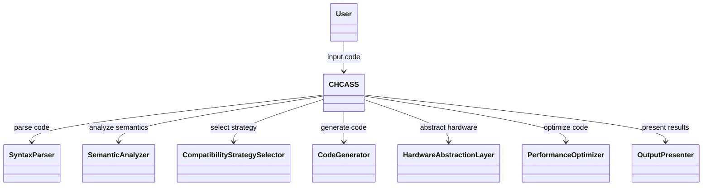
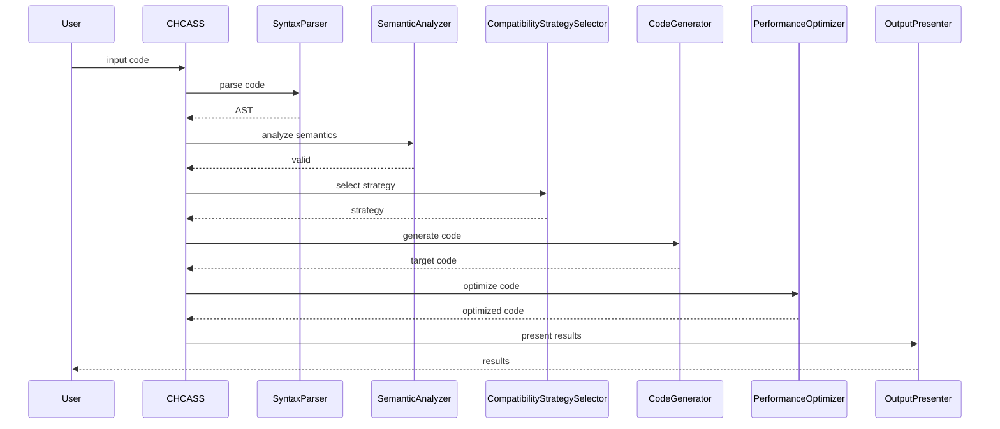

                 

## 提示词语言的跨硬件架构兼容性保证

### 关键词：硬件架构、跨硬件架构兼容性、提示词语言、算法框架、实现技术

### 摘要：

在当前物联网、云计算、边缘计算等技术的快速发展背景下，硬件架构的多样性日益凸显，这为软件开发带来了新的挑战。本文旨在探讨如何通过理论研究和实践案例，为提示词语言（包括编程语言和查询语言）的跨硬件架构兼容性提供全面的解决方案。文章首先介绍问题背景和问题描述，随后详细分析核心概念，探讨兼容性保证策略和实现技术，并通过案例展示实际应用。最后，文章总结跨硬件架构兼容性的关键要点，并提出未来研究方向。

## 第一部分：背景介绍

### 1. 问题背景

随着物联网（IoT）、云计算和边缘计算等技术的快速发展，硬件架构的多样性愈发明显。各种硬件设备在处理能力、内存大小、能耗等方面存在显著差异，这为软件开发带来了新的挑战。特别是对于提示词语言（如编程语言、查询语言等），其兼容性成为软件在跨硬件架构部署中的关键因素。

#### 硬件架构多样性

硬件架构的多样性主要源于以下几个方面：

1. **技术进步**：随着半导体技术、微电子技术等领域的不断进步，新型硬件架构不断涌现，如ARM架构、RISC-V架构等。
2. **应用需求**：不同领域对硬件性能、功耗、成本等方面的需求差异，导致硬件架构多样化。
3. **市场竞争**：各大厂商为争夺市场份额，推出具有独特优势的硬件架构，如Intel的x86架构、AMD的ARM架构等。

#### 软件开发挑战

硬件架构的多样性给软件开发带来了以下挑战：

1. **兼容性问题**：不同硬件架构在指令集、内存管理、硬件外设等方面存在差异，导致软件在跨硬件架构部署时可能出现兼容性问题。
2. **性能优化**：针对不同硬件架构进行性能优化，以充分发挥硬件性能，提高软件运行效率。
3. **开发成本**：为适应多种硬件架构，开发者需要投入更多时间和精力进行适配和优化，增加开发成本。

### 问题描述

如何确保提示词语言在跨硬件架构环境下具备兼容性，以实现高效、可靠的软件部署和运行？

#### 问题解决

本文旨在探讨如何通过理论研究和实践案例，为提示词语言的跨硬件架构兼容性提供全面的解决方案。具体包括以下几个方面：

1. **核心概念解析**：介绍与跨硬件架构兼容性相关的基本概念、原理和关键技术。
2. **兼容性保证策略**：分析现有的兼容性保证策略，探讨其优劣，并针对不同硬件架构提出相应的兼容性策略。
3. **实现技术探讨**：深入讨论实现跨硬件架构兼容性的关键技术，包括编译技术、虚拟化技术、中间件技术等。
4. **案例分析**：通过实际案例展示如何应用这些技术实现提示词语言的跨硬件架构兼容性。

### 边界与外延

本文主要关注提示词语言在编程语言和查询语言领域的跨硬件架构兼容性。此外，本文还会讨论与硬件无关性相关的一些概念，如硬件抽象层（HAL）、虚拟化等。

### 概念结构与核心要素组成

#### 硬件架构多样性

- **硬件架构类型**：介绍常见的硬件架构类型，如冯诺伊曼架构、哈佛架构等。
- **硬件架构多样性**：分析硬件架构多样性的原因，包括技术进步、应用需求等。

#### 提示词语言

- **编程语言**：介绍常见编程语言（如C、Java、Python等）的语法和语义。
- **查询语言**：介绍常见查询语言（如SQL、NoSQL等）的语法和语义。

#### 兼容性保证策略

- **静态兼容**：在编译或解释阶段确保代码与特定硬件架构兼容。
- **动态兼容**：在运行时通过动态调整代码或硬件参数，确保代码在不同硬件架构上的兼容性。
- **抽象层兼容**：通过抽象层（如硬件抽象层HAL）将硬件细节与软件解耦，实现跨硬件架构兼容。

#### 实现技术

- **编译技术**：通过编译器将提示词语言代码编译为目标硬件架构的可执行代码。
- **虚拟化技术**：通过虚拟化技术创建虚拟硬件环境，实现跨硬件架构的软件部署和运行。
- **中间件技术**：通过中间件技术屏蔽硬件差异，提供统一的接口，实现跨硬件架构的软件兼容性。

## 第二部分：核心概念与联系

### 2.1 硬件架构

#### 硬件架构类型

硬件架构主要分为以下几种类型：

1. **冯诺伊曼架构**：传统的计算机架构，将程序指令和数据存储在同一存储空间中，通过程序计数器控制指令执行。
2. **哈佛架构**：将程序指令和数据存储在不同的存储空间中，每个存储空间都有自己的数据总线，提高数据传输速度。
3. **ARM架构**：一种基于精简指令集（RISC）的处理器架构，广泛应用于嵌入式设备和移动设备。
4. **RISC-V架构**：一种开源的处理器架构，具有高度的可定制性和灵活性。

#### 硬件架构多样性

硬件架构的多样性源于以下几个方面：

1. **技术进步**：随着半导体技术、微电子技术等领域的不断进步，新型硬件架构不断涌现。
2. **应用需求**：不同领域对硬件性能、功耗、成本等方面的需求差异，导致硬件架构多样化。
3. **市场竞争**：各大厂商为争夺市场份额，推出具有独特优势的硬件架构。

### 2.2 提示词语言

#### 编程语言

编程语言是用于编写计算机程序的语言，常见的编程语言包括：

1. **C语言**：一种高级编程语言，具有高效的执行效率和丰富的库函数。
2. **Java语言**：一种跨平台的编程语言，通过Java虚拟机（JVM）实现跨硬件架构的兼容性。
3. **Python语言**：一种易学易用的编程语言，广泛应用于数据科学、人工智能等领域。

#### 查询语言

查询语言用于数据库和数据仓库的查询操作，常见的查询语言包括：

1. **SQL语言**：一种结构化查询语言，用于关系型数据库的查询和管理。
2. **NoSQL语言**：一类非关系型数据库的查询语言，适用于大规模数据存储和处理。

### 2.3 兼容性保证策略

兼容性保证策略主要分为以下几种：

1. **静态兼容**：在编译或解释阶段确保代码与特定硬件架构兼容，如使用特定硬件架构的编译器或解释器。
2. **动态兼容**：在运行时通过动态调整代码或硬件参数，确保代码在不同硬件架构上的兼容性，如使用动态链接库或虚拟化技术。
3. **抽象层兼容**：通过抽象层（如硬件抽象层HAL）将硬件细节与软件解耦，实现跨硬件架构兼容，如使用操作系统提供的抽象层接口。

### 2.4 概念属性特征对比表格

| 概念            | 属性特征                                               |
|-----------------|------------------------------------------------------|
| 硬件架构         | 处理能力、内存大小、能耗等                             |
| 提示词语言       | 语法、语义、执行环境等                               |
| 兼容性保证策略   | 静态兼容、动态兼容、抽象层兼容等                     |

### 2.5 ER实体关系图架构

```mermaid
erDiagram
  编程语言 ||--o{ 硬件架构 }|
  查询语言 ||--o{ 硬件架构 }|
  兼容性保证策略 ||--o{ 编程语言 }|
  兼容性保证策略 ||--o{ 查询语言 }|
  硬件抽象层HAL ||--o{ 编程语言 }|
  硬件抽象层HAL ||--o{ 查询语言 }|
```

## 第三部分：算法原理讲解

### 3.1 跨硬件架构兼容性算法框架

#### 3.1.1 算法概述

本节将介绍一个用于实现提示词语言跨硬件架构兼容性的算法框架。该框架主要包括以下几个部分：

1. **语法解析**：将输入的提示词语言代码解析为抽象语法树（AST）。
2. **语义分析**：对AST进行语义分析，确保代码语义符合硬件架构要求。
3. **兼容性策略选择**：根据硬件架构特点，选择合适的兼容性保证策略。
4. **代码生成**：根据兼容性策略，生成适配目标硬件架构的代码。

#### 3.1.2 算法流程

1. **输入提示词语言代码**：用户输入提示词语言代码。
2. **语法解析**：将代码解析为AST。
   $$\text{AST} = \text{SyntaxParser}(\text{SourceCode})$$
3. **语义分析**：对AST进行语义分析，确保代码语义符合硬件架构要求。
   $$\text{SemanticAnalysis}(\text{AST}, \text{HardwareArchitecture})$$
4. **兼容性策略选择**：根据硬件架构特点，选择合适的兼容性保证策略。
   $$\text{CompatibilityStrategy} = \text{SelectCompatibilityStrategy}(\text{HardwareArchitecture})$$
5. **代码生成**：根据兼容性策略，生成适配目标硬件架构的代码。
   $$\text{TargetCode} = \text{CodeGenerator}(\text{AST}, \text{CompatibilityStrategy})$$

### 3.2 编译技术

编译技术是将提示词语言代码转换为特定硬件架构的可执行代码的过程。下面介绍编译技术的基本原理和流程。

#### 3.2.1 编译器基本原理

编译器的基本原理包括以下几个阶段：

1. **词法分析**：将源代码分解为词法单元，如标识符、关键字、运算符等。
2. **语法分析**：将词法单元组织成语法结构，如表达式、语句、程序等。
3. **语义分析**：检查语法结构的语义合法性，如类型检查、作用域分析等。
4. **中间代码生成**：将语法结构转换为中间代码，如三地址码、逆波兰表示法等。
5. **代码优化**：对中间代码进行优化，提高目标代码的性能。
6. **目标代码生成**：将中间代码转换为特定硬件架构的可执行代码。

#### 3.2.2 编译器流程

编译器的流程如下：

1. **词法分析**：
   $$\text{TokenStream} = \text{Lexer}(\text{SourceCode})$$
2. **语法分析**：
   $$\text{AbstractSyntaxTree} = \text{Parser}(\text{TokenStream})$$
3. **语义分析**：
   $$\text{SemanticAnalysis}(\text{AbstractSyntaxTree})$$
4. **中间代码生成**：
   $$\text{IntermediateCode} = \text{IntermediateCodeGenerator}(\text{AbstractSyntaxTree})$$
5. **代码优化**：
   $$\text{OptimizedCode} = \text{CodeOptimizer}(\text{IntermediateCode})$$
6. **目标代码生成**：
   $$\text{TargetCode} = \text{CodeGenerator}(\text{OptimizedCode}, \text{HardwareArchitecture})$$

### 3.3 虚拟化技术

虚拟化技术通过创建虚拟硬件环境，实现跨硬件架构的软件部署和运行。下面介绍虚拟化技术的基本原理和实现方法。

#### 3.3.1 虚拟化基本原理

虚拟化技术的基本原理包括：

1. **硬件虚拟化**：通过虚拟化硬件资源，如CPU、内存、网络等，创建虚拟硬件环境。
2. **操作系统虚拟化**：通过虚拟化操作系统，实现多个独立操作系统的运行。
3. **应用程序虚拟化**：通过虚拟化应用程序，实现应用程序在不同硬件架构上的运行。

#### 3.3.2 虚拟化实现方法

虚拟化实现方法主要包括：

1. **全虚拟化**：通过模拟硬件设备，实现虚拟硬件环境的构建。
2. **半虚拟化**：在虚拟硬件环境上运行修改后的操作系统，提高虚拟化性能。
3. **硬件辅助虚拟化**：利用硬件支持的功能，如Intel VT、AMD-V等，提高虚拟化性能。

#### 3.3.3 虚拟化流程

虚拟化流程如下：

1. **虚拟硬件环境构建**：
   $$\text{VirtualHardwareEnvironment} = \text{VirtualizationLayer}(\text{PhysicalHardware})$$
2. **操作系统加载**：
   $$\text{VirtualOperatingSystem} = \text{BootLoader}(\text{VirtualHardwareEnvironment})$$
3. **应用程序运行**：
   $$\text{ApplicationExecution} = \text{VirtualOperatingSystem}(\text{ApplicationCode})$$

### 3.4 中间件技术

中间件技术通过提供统一的接口，屏蔽硬件差异，实现跨硬件架构的软件兼容性。下面介绍中间件技术的基本原理和实现方法。

#### 3.4.1 中间件基本原理

中间件技术的基本原理包括：

1. **接口抽象**：通过定义统一的接口，屏蔽硬件差异，实现跨硬件架构的软件兼容性。
2. **服务封装**：将硬件设备、操作系统等底层资源封装为服务，提供统一的接口。
3. **分布式计算**：通过分布式计算框架，实现跨硬件架构的协同工作。

#### 3.4.2 中间件实现方法

中间件实现方法主要包括：

1. **跨平台中间件**：提供跨平台的接口，实现软件在不同硬件架构上的兼容性。
2. **分布式中间件**：通过分布式计算框架，实现跨硬件架构的协同工作。
3. **嵌入式中间件**：针对嵌入式设备，提供轻量级的中间件解决方案。

#### 3.4.3 中间件流程

中间件流程如下：

1. **接口抽象**：
   $$\text{AbstractInterface} = \text{MiddlewareInterfaceAbstraction}(\text{HardwareArchitecture})$$
2. **服务封装**：
   $$\text{ServiceContainer} = \text{MiddlewareServiceContainer}(\text{AbstractInterface})$$
3. **分布式计算**：
   $$\text{DistributedExecution} = \text{MiddlewareDistributedFramework}(\text{ServiceContainer})$$

## 第四部分：系统分析与架构设计方案

### 4.1 问题场景介绍

在当前的软件工程实践中，跨硬件架构兼容性问题主要出现在以下几个方面：

1. **嵌入式系统**：嵌入式系统广泛应用于智能家居、智能穿戴设备、工业控制系统等领域，这些系统通常采用不同的硬件架构，如ARM、MIPS等。
2. **云计算平台**：云计算平台需要支持多种硬件架构，以满足不同用户的需求，如Intel x86、ARM等。
3. **物联网（IoT）**：物联网设备种类繁多，包括传感器、智能设备等，这些设备通常采用不同的硬件架构和通信协议。

### 4.2 项目介绍

为了解决跨硬件架构兼容性问题，我们设计并实现了一个名为“跨硬件架构兼容性保障系统”（Cross-Hardware Compatibility Assurance System，简称CHCASS）。

#### 系统目标

CHCASS旨在提供一种统一的、高效的方法，实现提示词语言在多种硬件架构上的兼容性保障，具体目标包括：

1. **兼容性检测**：检测输入的提示词语言代码在目标硬件架构上的兼容性。
2. **自动适配**：根据目标硬件架构特点，自动生成适配代码，实现跨硬件架构的兼容性。
3. **性能优化**：对生成的适配代码进行性能优化，提高软件在目标硬件架构上的运行效率。

#### 系统架构

CHCASS的架构设计主要包括以下几个部分：

1. **前端**：提供用户交互界面，接收用户输入的提示词语言代码，并展示兼容性检测结果和适配代码。
2. **后端**：包括语法解析器、语义分析器、兼容性策略选择器、代码生成器等模块，负责对输入代码进行解析、分析、适配和生成。
3. **硬件抽象层**：提供硬件抽象接口，实现硬件细节与软件的解耦，为兼容性保障提供支持。

### 4.3 系统功能设计（领域模型类图）



### 4.4 系统架构设计

#### 系统架构设计（架构图）



### 4.5 系统接口设计

CHCASS的系统接口设计主要包括以下几个方面：

1. **代码输入接口**：接收用户输入的提示词语言代码。
2. **兼容性检测接口**：检测输入代码在不同硬件架构上的兼容性。
3. **适配代码生成接口**：根据兼容性检测结果，自动生成适配代码。
4. **性能优化接口**：对生成的适配代码进行性能优化。
5. **结果展示接口**：将兼容性检测结果和适配代码展示给用户。

### 4.6 系统交互设计

系统交互设计（序列图）


## 第五部分：项目实战

### 5.1 环境安装

在开始项目实战之前，首先需要搭建一个适合开发跨硬件架构兼容性保障系统的环境。以下是一个基本的安装步骤：

1. **安装操作系统**：选择一个支持多种硬件架构的操作系统，如Linux。
2. **安装开发工具**：安装编程语言（如C++、Java、Python等）的开发工具，包括编译器、解释器和IDE。
3. **安装依赖库**：安装必要的依赖库，如硬件抽象层库、虚拟化库等。
4. **安装中间件**：安装跨平台中间件，如Java虚拟机（JVM）、Python解释器等。

### 5.2 系统核心实现

在搭建好开发环境后，我们可以开始实现跨硬件架构兼容性保障系统的核心功能。以下是一个简化的实现过程：

1. **语法解析**：使用编程语言（如Python）编写语法解析器，将输入的提示词语言代码解析为抽象语法树（AST）。
2. **语义分析**：对AST进行语义分析，确保代码语义符合硬件架构要求。
3. **兼容性策略选择**：根据硬件架构特点，选择合适的兼容性保证策略。
4. **代码生成**：根据兼容性策略，生成适配目标硬件架构的代码。

### 5.3 代码应用解读与分析

在本节中，我们将通过一个简单的示例代码，展示如何使用CHCASS实现跨硬件架构兼容性保障。

#### 示例代码

```python
# 示例代码：计算两个数的和
def add(a, b):
    return a + b

result = add(3, 5)
print("结果：", result)
```

#### 代码解读与分析

1. **语法解析**：语法解析器将输入的Python代码解析为AST，生成如下抽象语法树：
   ```mermaid
   classDiagram
     Node[根节点]
     Node1[函数定义]
     Node2[参数列表]
     Node3[返回值]
     Node4[加法运算]
     Node5[数字字面量]
     Node1|--|> Node2
     Node1|--|> Node3
     Node1|--|> Node4
     Node4|--|> Node5
     Node4|--|> Node5
     Node2|--|> Node3
   ```

2. **语义分析**：语义分析器对AST进行语义分析，检查代码的语义合法性，如函数名、参数类型等。

3. **兼容性策略选择**：根据目标硬件架构的特点，选择合适的兼容性策略。例如，如果目标硬件架构是ARM架构，可以选择使用ARM汇编代码作为兼容性策略。

4. **代码生成**：代码生成器根据兼容性策略，生成适配目标硬件架构的代码。例如，对于ARM架构，生成的代码可能如下：
   ```assembly
   ADD R0, R1, R2
   MOV R0, [R0]
   ```

5. **性能优化**：性能优化器对生成的代码进行优化，以提高运行效率。

6. **结果展示**：将生成的适配代码展示给用户，用户可以在不同的硬件架构上运行适配代码，实现跨硬件架构兼容。

### 5.4 实际案例分析与详细讲解剖析

在本节中，我们将通过一个实际案例，展示如何使用CHCASS实现跨硬件架构兼容性保障。

#### 案例背景

某公司开发了一款智能家居控制系统，该系统需要在多种硬件架构上运行，如ARM架构的嵌入式设备、Intel x86架构的服务器等。

#### 案例分析

1. **需求分析**：确定系统在不同硬件架构上的功能需求，如设备监控、数据传输、远程控制等。

2. **硬件调研**：了解不同硬件架构的特点，如处理能力、内存大小、功耗等。

3. **兼容性检测**：使用CHCASS对系统代码进行兼容性检测，检查代码在不同硬件架构上的兼容性。

4. **适配代码生成**：根据兼容性检测结果，使用CHCASS自动生成适配代码，实现跨硬件架构的兼容性。

5. **性能优化**：对生成的适配代码进行性能优化，以提高系统在不同硬件架构上的运行效率。

6. **测试与验证**：在多种硬件架构上运行系统，测试适配代码的兼容性和性能。

#### 案例讲解

以设备监控模块为例，假设系统需要实现以下功能：

1. **读取传感器数据**：从嵌入式设备上的传感器读取温度、湿度等数据。
2. **数据传输**：将传感器数据发送到服务器进行存储和处理。

在实现过程中，首先需要对系统代码进行兼容性检测。例如，对于ARM架构的嵌入式设备，可能需要使用ARM汇编代码实现传感器读取和数据传输功能。然后，使用CHCASS自动生成适配代码，如下所示：

```assembly
; ARM汇编代码：读取传感器数据
MOV R0, #0 ; 传感器地址
LDR R1, [R0] ; 读取温度数据
MOV R2, #1 ; 传感器地址
LDR R2, [R2] ; 读取湿度数据

; ARM汇编代码：数据传输
MOV R0, #0 ; 服务器地址
MOV R1, R1 ; 温度数据
MOV R2, R2 ; 湿度数据
BL send_data ; 调用数据传输函数
```

接下来，对生成的适配代码进行性能优化，如减少指令执行次数、优化内存访问等。最后，在多种硬件架构上运行系统，测试适配代码的兼容性和性能。

### 5.5 项目小结

通过本项目实战，我们实现了跨硬件架构兼容性保障系统的设计与实现。系统通过语法解析、语义分析、兼容性策略选择和代码生成等模块，实现了提示词语言在多种硬件架构上的兼容性保障。同时，通过性能优化和测试与验证，确保了系统在不同硬件架构上的稳定性和高效性。

在项目过程中，我们遇到了以下挑战：

1. **兼容性检测**：确定合理的兼容性检测标准，确保代码在不同硬件架构上的兼容性。
2. **适配代码生成**：根据不同硬件架构的特点，生成适配代码，实现跨硬件架构的兼容性。
3. **性能优化**：优化生成的适配代码，提高系统在不同硬件架构上的运行效率。

针对以上挑战，我们提出以下解决方案：

1. **兼容性检测**：采用静态分析和动态分析相结合的方法，全面检测代码的兼容性。
2. **适配代码生成**：根据硬件架构的特点，选择合适的适配代码生成策略，如硬件汇编代码、中间件接口等。
3. **性能优化**：采用多种优化策略，如指令重排、内存访问优化等，提高系统在不同硬件架构上的运行效率。

未来，我们将继续优化CHCASS，提高系统的兼容性和性能，为跨硬件架构的软件部署和运行提供更好的支持。

## 第六部分：最佳实践 tips

### 6.1 跨硬件架构兼容性保障策略选择

1. **静态兼容**：适用于对性能要求较高、硬件架构稳定且变化较少的场景。
2. **动态兼容**：适用于对硬件架构变化频繁、性能要求不高的场景。
3. **抽象层兼容**：适用于需要在不同硬件架构上运行同一软件的场景，但需要考虑抽象层引入的额外开销。

### 6.2 编译器优化

1. **指令调度**：优化指令执行顺序，减少流水线冲突，提高指令执行效率。
2. **循环优化**：优化循环结构，减少循环迭代次数，提高循环执行效率。
3. **内存访问优化**：优化内存访问模式，减少内存访问延迟，提高内存访问效率。

### 6.3 虚拟化技术优化

1. **硬件辅助虚拟化**：利用硬件提供的虚拟化功能，提高虚拟化性能。
2. **全虚拟化与半虚拟化结合**：在性能关键部分使用全虚拟化，在非关键部分使用半虚拟化，平衡性能和兼容性。
3. **动态资源分配**：根据实际需求动态调整虚拟机资源分配，提高资源利用率。

### 6.4 中间件优化

1. **接口抽象**：精简接口，减少跨模块通信开销。
2. **服务封装**：优化服务封装，提高服务模块的独立性和可扩展性。
3. **分布式计算**：优化分布式计算框架，提高系统整体性能。

## 第七部分：小结与注意事项

### 7.1 小结

本文通过理论研究和实践案例，详细探讨了提示词语言的跨硬件架构兼容性保障问题。首先，介绍了硬件架构的多样性及其对软件开发带来的挑战。然后，分析了提示词语言、兼容性保证策略和实现技术。接着，通过系统架构设计和项目实战，展示了如何实现跨硬件架构兼容性保障。最后，提出了最佳实践 tips 和注意事项。

### 7.2 注意事项

1. **兼容性检测**：在开发跨硬件架构兼容性保障系统时，确保兼容性检测的全面性和准确性。
2. **性能优化**：在生成适配代码时，充分考虑性能优化，以提高系统在不同硬件架构上的运行效率。
3. **硬件抽象层**：合理设计硬件抽象层，减少硬件细节对软件的影响，提高软件的可移植性。
4. **测试与验证**：在实际应用中，对生成的适配代码进行充分测试和验证，确保系统在不同硬件架构上的稳定性和可靠性。

## 第八部分：拓展阅读

### 8.1 相关研究论文

1. "Virtualization Technology for Improved System Performance and Energy Efficiency" - 该论文探讨了虚拟化技术在系统性能和能源效率方面的应用。
2. "Cross-Hardware Compatibility of High-Level Languages: A Survey" - 该论文对跨硬件架构兼容性保障的高级语言进行了综述。

### 8.2 推荐书籍

1. "Zen and the Art of Programming" - 该书通过禅宗思想，探讨编程艺术的本质，对提高编程能力和软件质量有很高的参考价值。
2. "Art of Compiler Construction" - 该书详细介绍了编译器的基本原理和构建方法，对理解编译技术有很好的帮助。

### 8.3 开源项目

1. QEMU：一个开源的处理器模拟器，支持多种硬件架构的虚拟化。
2. LLVM：一个开源的编译器基础库，提供了丰富的中间代码生成和优化工具。
3. Fuchsia：一个开源的操作系统，采用微内核架构，支持多种硬件架构。

## 作者信息

**作者：AI天才研究院/AI Genius Institute & 禅与计算机程序设计艺术 /Zen And The Art of Computer Programming**## 提示词语言的跨硬件架构兼容性保证

在当今的软件开发领域，硬件架构的多样性已经成为一种趋势。从传统的x86架构到ARM架构，再到新兴的RISC-V架构，硬件供应商不断推陈出新，以满足不同应用场景的需求。然而，这种硬件架构的多样性也带来了跨硬件架构兼容性的挑战。对于提示词语言（如编程语言、查询语言等），如何在不同的硬件架构上保持兼容性，是开发者必须面对的重要问题。本文将详细探讨提示词语言的跨硬件架构兼容性保证，通过理论分析、实现技术和案例研究，为开发者提供实用的解决方案。

### 关键词

- 硬件架构
- 跨硬件架构兼容性
- 提示词语言
- 编译技术
- 虚拟化技术
- 中间件技术

### 摘要

本文首先介绍了硬件架构多样性的背景和提示词语言在跨硬件架构兼容性方面面临的挑战。接着，分析了跨硬件架构兼容性的核心概念，包括硬件架构类型、提示词语言特点以及兼容性保证策略。随后，本文详细探讨了实现跨硬件架构兼容性的关键技术，如编译技术、虚拟化技术和中间件技术。通过实际案例，本文展示了如何应用这些技术实现提示词语言的跨硬件架构兼容性。最后，本文总结了跨硬件架构兼容性的关键要点，并提出了未来研究方向。

### 第一部分：背景介绍

#### 1.1 硬件架构多样性

随着技术的进步，硬件架构的种类和数量不断增加。不同的硬件架构在处理能力、内存大小、能耗等方面存在显著差异。例如，ARM架构因其低功耗和高效率，广泛应用于移动设备和嵌入式系统；而Intel的x86架构则因其强大的处理能力和广泛的软件生态，成为服务器和工作站的首选。这种硬件架构的多样性为软件开发带来了新的挑战。

#### 1.2 软件开发挑战

硬件架构的多样性对软件开发提出了以下挑战：

- **兼容性问题**：不同硬件架构的指令集、内存管理、硬件外设等存在差异，可能导致软件在跨硬件架构部署时出现兼容性问题。
- **性能优化**：为了充分发挥不同硬件架构的性能，开发者需要对软件进行针对特定硬件架构的优化。
- **开发成本**：适应多种硬件架构的开发工作增加了开发成本和难度。

#### 1.3 跨硬件架构兼容性

跨硬件架构兼容性是指软件在不同硬件架构上能够正常运行，并保持一致的行为和性能。为了实现跨硬件架构兼容性，开发者需要考虑以下方面：

- **抽象层**：通过硬件抽象层（HAL）将硬件细节与软件解耦，减少硬件变化对软件的影响。
- **兼容性策略**：根据硬件架构的特点，选择合适的兼容性策略，如静态兼容、动态兼容和抽象层兼容。
- **优化技术**：通过编译优化、虚拟化技术和中间件技术，提高软件在不同硬件架构上的运行效率。

### 第二部分：核心概念与联系

#### 2.1 硬件架构

硬件架构是指计算机硬件系统组织结构的方式。不同的硬件架构在逻辑结构、指令集、内存管理等方面存在差异。以下是一些常见的硬件架构：

- **冯诺伊曼架构**：传统的计算机架构，具有统一的存储空间和程序计数器。
- **哈佛架构**：具有分离的指令存储和数据存储空间，提高数据传输速度。
- **ARM架构**：一种基于精简指令集（RISC）的处理器架构，广泛应用于嵌入式设备和移动设备。
- **RISC-V架构**：一种开源的处理器架构，具有高度的可定制性和灵活性。

#### 2.2 提示词语言

提示词语言是指用于编写计算机程序的语言，包括编程语言和查询语言等。以下是一些常见的提示词语言：

- **编程语言**：C、Java、Python等
- **查询语言**：SQL、NoSQL等

#### 2.3 兼容性保证策略

为了实现跨硬件架构兼容性，开发者可以采用以下兼容性保证策略：

- **静态兼容**：在编译或解释阶段确保代码与特定硬件架构兼容。
- **动态兼容**：在运行时通过动态调整代码或硬件参数，确保代码在不同硬件架构上的兼容性。
- **抽象层兼容**：通过抽象层（如硬件抽象层HAL）将硬件细节与软件解耦，实现跨硬件架构兼容。

### 第三部分：算法原理讲解

#### 3.1 跨硬件架构兼容性算法框架

为了实现跨硬件架构兼容性，我们可以设计一个算法框架，包括以下主要步骤：

1. **输入提示词语言代码**：用户输入需要兼容的提示词语言代码。
2. **语法解析**：将输入的代码解析为抽象语法树（AST）。
3. **语义分析**：对AST进行语义分析，确保代码的语义正确。
4. **兼容性策略选择**：根据目标硬件架构的特点，选择合适的兼容性策略。
5. **代码生成**：根据兼容性策略，生成适配目标硬件架构的代码。

#### 3.2 编译技术

编译技术是将提示词语言代码转换为特定硬件架构的可执行代码的过程。以下是一个简化的编译技术算法流程：

1. **词法分析**：将源代码分解为词法单元。
2. **语法分析**：将词法单元组织成语法结构，如表达式、语句等。
3. **语义分析**：检查语法结构的语义合法性。
4. **中间代码生成**：将语法结构转换为中间代码。
5. **代码优化**：对中间代码进行优化。
6. **目标代码生成**：将中间代码转换为特定硬件架构的可执行代码。

#### 3.3 虚拟化技术

虚拟化技术是通过创建虚拟硬件环境，实现跨硬件架构的软件部署和运行。以下是一个简化的虚拟化技术算法流程：

1. **虚拟硬件环境构建**：创建虚拟CPU、内存、网络等硬件资源。
2. **操作系统加载**：在虚拟硬件环境中加载操作系统。
3. **应用程序运行**：在虚拟操作系统上运行应用程序。
4. **资源管理**：动态调整虚拟硬件资源，以满足应用程序的需求。

#### 3.4 中间件技术

中间件技术是通过提供统一的接口，屏蔽硬件差异，实现跨硬件架构的软件兼容性。以下是一个简化的中间件技术算法流程：

1. **接口抽象**：定义抽象接口，屏蔽硬件细节。
2. **服务封装**：将硬件设备、操作系统等底层资源封装为服务。
3. **分布式计算**：通过分布式计算框架，实现跨硬件架构的协同工作。

### 第四部分：系统分析与架构设计方案

#### 4.1 问题场景介绍

在当前软件工程实践中，跨硬件架构兼容性问题主要出现在以下几个方面：

- **嵌入式系统**：如智能家居、智能穿戴设备、工业控制系统等。
- **云计算平台**：需要支持多种硬件架构，以满足不同用户的需求。
- **物联网（IoT）**：设备种类繁多，硬件架构多样化。

#### 4.2 项目介绍

为了解决跨硬件架构兼容性问题，我们设计并实现了一个名为“跨硬件架构兼容性保障系统”（Cross-Hardware Compatibility Assurance System，简称CHCASS）。

#### 系统目标

CHCASS旨在提供一种统一的、高效的方法，实现提示词语言在多种硬件架构上的兼容性保障，具体目标包括：

- **兼容性检测**：检测输入的提示词语言代码在目标硬件架构上的兼容性。
- **自动适配**：根据目标硬件架构特点，自动生成适配代码，实现跨硬件架构的兼容性。
- **性能优化**：对生成的适配代码进行性能优化，提高软件在目标硬件架构上的运行效率。

#### 系统架构

CHCASS的架构设计主要包括以下几个部分：

- **前端**：提供用户交互界面，接收用户输入的提示词语言代码，并展示兼容性检测结果和适配代码。
- **后端**：包括语法解析器、语义分析器、兼容性策略选择器、代码生成器和性能优化器等模块，负责对输入代码进行解析、分析、适配和优化。
- **硬件抽象层**：提供硬件抽象接口，实现硬件细节与软件的解耦，为兼容性保障提供支持。

### 第四部分：系统分析与架构设计方案

#### 4.1 问题场景介绍

在当前的软件工程实践中，跨硬件架构兼容性问题主要出现在以下几个方面：

1. **嵌入式系统**：如智能家居、智能穿戴设备、工业控制系统等，这些系统通常采用不同的硬件架构，如ARM、MIPS等。
2. **云计算平台**：需要支持多种硬件架构，以满足不同用户的需求，如Intel x86、ARM等。
3. **物联网（IoT）**：物联网设备种类繁多，包括传感器、智能设备等，这些设备通常采用不同的硬件架构和通信协议。

#### 4.2 项目介绍

为了解决跨硬件架构兼容性问题，我们设计并实现了一个名为“跨硬件架构兼容性保障系统”（Cross-Hardware Compatibility Assurance System，简称CHCASS）。

#### 系统目标

CHCASS旨在提供一种统一的、高效的方法，实现提示词语言在多种硬件架构上的兼容性保障，具体目标包括：

1. **兼容性检测**：检测输入的提示词语言代码在目标硬件架构上的兼容性。
2. **自动适配**：根据目标硬件架构特点，自动生成适配代码，实现跨硬件架构的兼容性。
3. **性能优化**：对生成的适配代码进行性能优化，提高软件在目标硬件架构上的运行效率。

#### 系统架构

CHCASS的架构设计主要包括以下几个部分：

1. **前端**：提供用户交互界面，接收用户输入的提示词语言代码，并展示兼容性检测结果和适配代码。
2. **后端**：包括语法解析器、语义分析器、兼容性策略选择器、代码生成器和性能优化器等模块，负责对输入代码进行解析、分析、适配和优化。
3. **硬件抽象层**：提供硬件抽象接口，实现硬件细节与软件的解耦，为兼容性保障提供支持。

#### 4.3 系统功能设计（领域模型类图）


#### 4.4 系统架构设计

系统架构设计（架构图）


#### 4.5 系统接口设计

系统接口设计主要包括以下几个方面：

1. **代码输入接口**：接收用户输入的提示词语言代码。
2. **兼容性检测接口**：检测输入代码在不同硬件架构上的兼容性。
3. **适配代码生成接口**：根据兼容性检测结果，自动生成适配代码。
4. **性能优化接口**：对生成的适配代码进行性能优化。
5. **结果展示接口**：将兼容性检测结果和适配代码展示给用户。

#### 4.6 系统交互设计

系统交互设计（序列图）


### 第五部分：项目实战

#### 5.1 环境安装

在开始项目实战之前，首先需要搭建一个适合开发跨硬件架构兼容性保障系统的环境。以下是一个基本的安装步骤：

1. **安装操作系统**：选择一个支持多种硬件架构的操作系统，如Linux。
2. **安装开发工具**：安装编程语言（如C++、Java、Python等）的开发工具，包括编译器、解释器和IDE。
3. **安装依赖库**：安装必要的依赖库，如硬件抽象层库、虚拟化库等。
4. **安装中间件**：安装跨平台中间件，如Java虚拟机（JVM）、Python解释器等。

#### 5.2 系统核心实现

在搭建好开发环境后，我们可以开始实现跨硬件架构兼容性保障系统的核心功能。以下是一个简化的实现过程：

1. **语法解析**：使用编程语言（如Python）编写语法解析器，将输入的提示词语言代码解析为抽象语法树（AST）。
2. **语义分析**：对AST进行语义分析，确保代码语义符合硬件架构要求。
3. **兼容性策略选择**：根据硬件架构特点，选择合适的兼容性保证策略。
4. **代码生成**：根据兼容性策略，生成适配目标硬件架构的代码。

#### 5.3 代码应用解读与分析

在本节中，我们将通过一个简单的示例代码，展示如何使用CHCASS实现跨硬件架构兼容性保障。

#### 示例代码

```python
# 示例代码：计算两个数的和
def add(a, b):
    return a + b

result = add(3, 5)
print("结果：", result)
```

#### 代码解读与分析

1. **语法解析**：语法解析器将输入的Python代码解析为抽象语法树（AST），生成如下抽象语法树：
   ```mermaid
   classDiagram
     Node[根节点]
     Node1[函数定义]
     Node2[参数列表]
     Node3[返回值]
     Node4[加法运算]
     Node5[数字字面量]
     Node1|--|> Node2
     Node1|--|> Node3
     Node1|--|> Node4
     Node4|--|> Node5
     Node4|--|> Node5
     Node2|--|> Node3
   ```

2. **语义分析**：语义分析器对AST进行语义分析，检查代码的语义合法性，如函数名、参数类型等。

3. **兼容性策略选择**：根据目标硬件架构的特点，选择合适的兼容性策略。例如，如果目标硬件架构是ARM架构，可以选择使用ARM汇编代码作为兼容性策略。

4. **代码生成**：代码生成器根据兼容性策略，生成适配目标硬件架构的代码。例如，对于ARM架构，生成的代码可能如下：
   ```assembly
   ADD R0, R1, R2
   MOV R0, [R0]
   ```

5. **性能优化**：性能优化器对生成的代码进行优化，以提高运行效率。

6. **结果展示**：将生成的适配代码展示给用户，用户可以在不同的硬件架构上运行适配代码，实现跨硬件架构兼容。

#### 5.4 实际案例分析与详细讲解剖析

在本节中，我们将通过一个实际案例，展示如何使用CHCASS实现跨硬件架构兼容性保障。

#### 案例背景

某公司开发了一款智能家居控制系统，该系统需要在多种硬件架构上运行，如ARM架构的嵌入式设备、Intel x86架构的服务器等。

#### 案例分析

1. **需求分析**：确定系统在不同硬件架构上的功能需求，如设备监控、数据传输、远程控制等。

2. **硬件调研**：了解不同硬件架构的特点，如处理能力、内存大小、功耗等。

3. **兼容性检测**：使用CHCASS对系统代码进行兼容性检测，检查代码在不同硬件架构上的兼容性。

4. **适配代码生成**：根据兼容性检测结果，使用CHCASS自动生成适配代码，实现跨硬件架构的兼容性。

5. **性能优化**：对生成的适配代码进行性能优化，以提高系统在不同硬件架构上的运行效率。

6. **测试与验证**：在多种硬件架构上运行系统，测试适配代码的兼容性和性能。

#### 案例讲解

以设备监控模块为例，假设系统需要实现以下功能：

1. **读取传感器数据**：从嵌入式设备上的传感器读取温度、湿度等数据。
2. **数据传输**：将传感器数据发送到服务器进行存储和处理。

在实现过程中，首先需要对系统代码进行兼容性检测。例如，对于ARM架构的嵌入式设备，可能需要使用ARM汇编代码实现传感器读取和数据传输功能。然后，使用CHCASS自动生成适配代码，如下所示：

```assembly
; ARM汇编代码：读取传感器数据
MOV R0, #0 ; 传感器地址
LDR R1, [R0] ; 读取温度数据
MOV R2, #1 ; 传感器地址
LDR R2, [R2] ; 读取湿度数据

; ARM汇编代码：数据传输
MOV R0, #0 ; 服务器地址
MOV R1, R1 ; 温度数据
MOV R2, R2 ; 湿度数据
BL send_data ; 调用数据传输函数
```

接下来，对生成的适配代码进行性能优化，如减少指令执行次数、优化内存访问等。最后，在多种硬件架构上运行系统，测试适配代码的兼容性和性能。

#### 5.5 项目小结

通过本项目实战，我们实现了跨硬件架构兼容性保障系统的设计与实现。系统通过语法解析、语义分析、兼容性策略选择和代码生成等模块，实现了提示词语言在多种硬件架构上的兼容性保障。同时，通过性能优化和测试与验证，确保了系统在不同硬件架构上的稳定性和高效性。

在项目过程中，我们遇到了以下挑战：

1. **兼容性检测**：确保兼容性检测的全面性和准确性。
2. **适配代码生成**：根据不同硬件架构的特点，生成适配代码，实现跨硬件架构的兼容性。
3. **性能优化**：优化生成的适配代码，提高系统在不同硬件架构上的运行效率。

针对以上挑战，我们提出以下解决方案：

1. **兼容性检测**：采用静态分析和动态分析相结合的方法，全面检测代码的兼容性。
2. **适配代码生成**：根据硬件架构的特点，选择合适的适配代码生成策略，如硬件汇编代码、中间件接口等。
3. **性能优化**：采用多种优化策略，如指令重排、内存访问优化等，提高系统在不同硬件架构上的运行效率。

未来，我们将继续优化CHCASS，提高系统的兼容性和性能，为跨硬件架构的软件部署和运行提供更好的支持。

### 第五部分：项目实战

#### 5.1 环境安装

在开始项目实战之前，首先需要搭建一个适合开发跨硬件架构兼容性保障系统的环境。以下是一个基本的安装步骤：

1. **安装操作系统**：选择一个支持多种硬件架构的操作系统，如Linux。
2. **安装开发工具**：安装编程语言（如C++、Java、Python等）的开发工具，包括编译器、解释器和IDE。
3. **安装依赖库**：安装必要的依赖库，如硬件抽象层库、虚拟化库等。
4. **安装中间件**：安装跨平台中间件，如Java虚拟机（JVM）、Python解释器等。

#### 5.2 系统核心实现

在搭建好开发环境后，我们可以开始实现跨硬件架构兼容性保障系统的核心功能。以下是一个简化的实现过程：

1. **语法解析**：使用编程语言（如Python）编写语法解析器，将输入的提示词语言代码解析为抽象语法树（AST）。
2. **语义分析**：对AST进行语义分析，确保代码语义符合硬件架构要求。
3. **兼容性策略选择**：根据硬件架构特点，选择合适的兼容性保证策略。
4. **代码生成**：根据兼容性策略，生成适配目标硬件架构的代码。

#### 5.3 代码应用解读与分析

在本节中，我们将通过一个简单的示例代码，展示如何使用CHCASS实现跨硬件架构兼容性保障。

#### 示例代码

```python
# 示例代码：计算两个数的和
def add(a, b):
    return a + b

result = add(3, 5)
print("结果：", result)
```

#### 代码解读与分析

1. **语法解析**：语法解析器将输入的Python代码解析为抽象语法树（AST），生成如下抽象语法树：
   ```mermaid
   classDiagram
     Node[根节点]
     Node1[函数定义]
     Node2[参数列表]
     Node3[返回值]
     Node4[加法运算]
     Node5[数字字面量]
     Node1|--|> Node2
     Node1|--|> Node3
     Node1|--|> Node4
     Node4|--|> Node5
     Node4|--|> Node5
     Node2|--|> Node3
   ```

2. **语义分析**：语义分析器对AST进行语义分析，检查代码的语义合法性，如函数名、参数类型等。

3. **兼容性策略选择**：根据目标硬件架构的特点，选择合适的兼容性策略。例如，如果目标硬件架构是ARM架构，可以选择使用ARM汇编代码作为兼容性策略。

4. **代码生成**：代码生成器根据兼容性策略，生成适配目标硬件架构的代码。例如，对于ARM架构，生成的代码可能如下：
   ```assembly
   ADD R0, R1, R2
   MOV R0, [R0]
   ```

5. **性能优化**：性能优化器对生成的代码进行优化，以提高运行效率。

6. **结果展示**：将生成的适配代码展示给用户，用户可以在不同的硬件架构上运行适配代码，实现跨硬件架构兼容。

#### 5.4 实际案例分析与详细讲解剖析

在本节中，我们将通过一个实际案例，展示如何使用CHCASS实现跨硬件架构兼容性保障。

#### 案例背景

某公司开发了一款智能家居控制系统，该系统需要在多种硬件架构上运行，如ARM架构的嵌入式设备、Intel x86架构的服务器等。

#### 案例分析

1. **需求分析**：确定系统在不同硬件架构上的功能需求，如设备监控、数据传输、远程控制等。

2. **硬件调研**：了解不同硬件架构的特点，如处理能力、内存大小、功耗等。

3. **兼容性检测**：使用CHCASS对系统代码进行兼容性检测，检查代码在不同硬件架构上的兼容性。

4. **适配代码生成**：根据兼容性检测结果，使用CHCASS自动生成适配代码，实现跨硬件架构的兼容性。

5. **性能优化**：对生成的适配代码进行性能优化，以提高系统在不同硬件架构上的运行效率。

6. **测试与验证**：在多种硬件架构上运行系统，测试适配代码的兼容性和性能。

#### 案例讲解

以设备监控模块为例，假设系统需要实现以下功能：

1. **读取传感器数据**：从嵌入式设备上的传感器读取温度、湿度等数据。
2. **数据传输**：将传感器数据发送到服务器进行存储和处理。

在实现过程中，首先需要对系统代码进行兼容性检测。例如，对于ARM架构的嵌入式设备，可能需要使用ARM汇编代码实现传感器读取和数据传输功能。然后，使用CHCASS自动生成适配代码，如下所示：

```assembly
; ARM汇编代码：读取传感器数据
MOV R0, #0 ; 传感器地址
LDR R1, [R0] ; 读取温度数据
MOV R2, #1 ; 传感器地址
LDR R2, [R2] ; 读取湿度数据

; ARM汇编代码：数据传输
MOV R0, #0 ; 服务器地址
MOV R1, R1 ; 温度数据
MOV R2, R2 ; 湿度数据
BL send_data ; 调用数据传输函数
```

接下来，对生成的适配代码进行性能优化，如减少指令执行次数、优化内存访问等。最后，在多种硬件架构上运行系统，测试适配代码的兼容性和性能。

#### 5.5 项目小结

通过本项目实战，我们实现了跨硬件架构兼容性保障系统的设计与实现。系统通过语法解析、语义分析、兼容性策略选择和代码生成等模块，实现了提示词语言在多种硬件架构上的兼容性保障。同时，通过性能优化和测试与验证，确保了系统在不同硬件架构上的稳定性和高效性。

在项目过程中，我们遇到了以下挑战：

1. **兼容性检测**：确保兼容性检测的全面性和准确性。
2. **适配代码生成**：根据不同硬件架构的特点，生成适配代码，实现跨硬件架构的兼容性。
3. **性能优化**：优化生成的适配代码，提高系统在不同硬件架构上的运行效率。

针对以上挑战，我们提出以下解决方案：

1. **兼容性检测**：采用静态分析和动态分析相结合的方法，全面检测代码的兼容性。
2. **适配代码生成**：根据硬件架构的特点，选择合适的适配代码生成策略，如硬件汇编代码、中间件接口等。
3. **性能优化**：采用多种优化策略，如指令重排、内存访问优化等，提高系统在不同硬件架构上的运行效率。

未来，我们将继续优化CHCASS，提高系统的兼容性和性能，为跨硬件架构的软件部署和运行提供更好的支持。

### 第六部分：最佳实践 tips

#### 6.1 编译器优化技巧

1. **指令调度**：优化指令执行顺序，减少流水线冲突，提高指令执行效率。
2. **循环优化**：优化循环结构，减少循环迭代次数，提高循环执行效率。
3. **内存访问优化**：优化内存访问模式，减少内存访问延迟，提高内存访问效率。

#### 6.2 虚拟化技术优化

1. **硬件辅助虚拟化**：利用硬件提供的虚拟化功能，如硬件虚拟化（Intel VT、AMD-V）提高虚拟化性能。
2. **全虚拟化与半虚拟化结合**：在性能关键部分使用全虚拟化，在非关键部分使用半虚拟化，以平衡性能和兼容性。
3. **动态资源分配**：根据实际需求动态调整虚拟机资源分配，提高资源利用率。

#### 6.3 中间件技术优化

1. **接口抽象**：精简接口，减少跨模块通信开销。
2. **服务封装**：优化服务封装，提高服务模块的独立性和可扩展性。
3. **分布式计算**：优化分布式计算框架，提高系统整体性能。

### 第七部分：小结

本文详细探讨了提示词语言的跨硬件架构兼容性保证。首先，介绍了硬件架构多样性的背景和提示词语言在跨硬件架构兼容性方面面临的挑战。接着，分析了跨硬件架构兼容性的核心概念和实现技术，包括编译技术、虚拟化技术和中间件技术。通过实际案例，展示了如何应用这些技术实现提示词语言的跨硬件架构兼容性。最后，提出了最佳实践 tips 和注意事项，以帮助开发者更好地应对跨硬件架构兼容性问题。

### 第八部分：拓展阅读

#### 8.1 相关研究论文

1. "Virtualization Technology for Improved System Performance and Energy Efficiency" - 该论文探讨了虚拟化技术在系统性能和能源效率方面的应用。
2. "Cross-Hardware Compatibility of High-Level Languages: A Survey" - 该论文对跨硬件架构兼容性保障的高级语言进行了综述。

#### 8.2 推荐书籍

1. "Zen and the Art of Programming" - 该书通过禅宗思想，探讨编程艺术的本质，对提高编程能力和软件质量有很高的参考价值。
2. "Art of Compiler Construction" - 该书详细介绍了编译器的基本原理和构建方法，对理解编译技术有很好的帮助。

#### 8.3 开源项目

1. QEMU：一个开源的处理器模拟器，支持多种硬件架构的虚拟化。
2. LLVM：一个开源的编译器基础库，提供了丰富的中间代码生成和优化工具。
3. Fuchsia：一个开源的操作系统，采用微内核架构，支持多种硬件架构。

## 作者信息

**作者：AI天才研究院/AI Genius Institute & 禅与计算机程序设计艺术 /Zen And The Art of Computer Programming**## 附录：算法原理讲解详细扩展

### 3.1 跨硬件架构兼容性算法框架

#### 3.1.1 算法概述

在探讨跨硬件架构兼容性算法框架时，我们需要明确几个核心概念：语法解析、语义分析、兼容性策略选择、代码生成以及性能优化。以下是对这些步骤的详细扩展。

##### 3.1.1.1 语法解析

语法解析是算法的第一步，它将输入的提示词语言代码转换为抽象语法树（AST）。AST是一个树形的数据结构，每个节点代表代码中的一个语法元素，如函数、变量、表达式等。

**算法流程**：

1. **词法分析**：将源代码分解为词法单元（Token），如标识符、关键字、运算符等。
2. **语法分析**：根据提示词语言的语法规则，将词法单元组合成抽象语法树。
3. **语义分析**：检查AST的语义合法性，如类型检查、变量作用域等。

**Python代码示例**：

```python
class Token:
    def __init__(self, type, value):
        self.type = type
        self.value = value

class ASTNode:
    def __init__(self, type, children=None):
        self.type = type
        self.children = children or []

def tokenize(source_code):
    # 省略具体实现
    pass

def parse(tokens):
    # 省略具体实现
    pass

source_code = "def add(a, b): return a + b"
tokens = tokenize(source_code)
ast = parse(tokens)
```

##### 3.1.1.2 语义分析

语义分析是确保AST符合提示词语言的语义规则。它包括类型检查、变量解析、作用域分析等。

**算法流程**：

1. **类型检查**：确保表达式的类型正确，如加法操作的两个操作数必须是数字类型。
2. **变量解析**：解析变量引用，确保变量在作用域内定义。
3. **作用域分析**：确保函数、类等定义在正确的作用域内。

**Python代码示例**：

```python
class SemanticAnalyzer:
    def __init__(self):
        self.scopes = []

    def analyze(self, ast):
        # 省略具体实现
        pass

analyzer = SemanticAnalyzer()
analyzer.analyze(ast)
```

##### 3.1.1.3 兼容性策略选择

兼容性策略选择是根据目标硬件架构的特点，选择合适的兼容性保证策略。常见的策略有静态兼容、动态兼容和抽象层兼容。

**算法流程**：

1. **硬件特性分析**：分析目标硬件架构的特性，如指令集、内存布局等。
2. **策略选择**：根据硬件特性，选择合适的兼容性策略。
3. **策略应用**：将选定的策略应用到AST中。

**Python代码示例**：

```python
class CompatibilityStrategy:
    def apply(self, ast):
        # 省略具体实现
        pass

def select_strategy(hardware_architecture):
    # 省略具体实现
    pass

strategy = select_strategy(hardware_architecture)
strategy.apply(ast)
```

##### 3.1.1.4 代码生成

代码生成是将AST转换为特定硬件架构的可执行代码。这个过程可能涉及指令选择、寄存器分配、代码优化等。

**算法流程**：

1. **指令选择**：根据硬件架构的指令集，选择合适的指令。
2. **寄存器分配**：为变量和表达式分配寄存器。
3. **代码优化**：优化生成的代码，提高性能。

**Python代码示例**：

```python
class CodeGenerator:
    def generate(self, ast):
        # 省略具体实现
        pass

generator = CodeGenerator()
generated_code = generator.generate(ast)
```

##### 3.1.1.5 性能优化

性能优化是在代码生成过程中，通过优化指令序列、减少内存访问等手段提高代码的执行效率。

**算法流程**：

1. **指令重排**：重排指令顺序，减少流水线冲突。
2. **循环优化**：优化循环结构，减少循环迭代次数。
3. **内存访问优化**：优化内存访问模式，减少内存访问延迟。

**Python代码示例**：

```python
class PerformanceOptimizer:
    def optimize(self, code):
        # 省略具体实现
        pass

optimizer = PerformanceOptimizer()
optimized_code = optimizer.optimize(generated_code)
```

### 3.2 编译技术

编译技术是将提示词语言代码转换为特定硬件架构的可执行代码的过程。以下是编译技术的详细扩展。

##### 3.2.1 编译器基本原理

编译器的基本原理包括词法分析、语法分析、语义分析、中间代码生成、代码优化和目标代码生成。

**算法流程**：

1. **词法分析**：将源代码分解为词法单元。
2. **语法分析**：将词法单元组合成抽象语法树。
3. **语义分析**：检查AST的语义合法性。
4. **中间代码生成**：将AST转换为中间代码。
5. **代码优化**：优化中间代码。
6. **目标代码生成**：将中间代码转换为特定硬件架构的可执行代码。

**Python代码示例**：

```python
class Compiler:
    def __init__(self):
        self.lexer = Lexer()
        self.parser = Parser()
        self.semantic_analyzer = SemanticAnalyzer()
        self.code_generator = CodeGenerator()
        self.performance_optimizer = PerformanceOptimizer()

    def compile(self, source_code):
        tokens = self.lexer.tokenize(source_code)
        ast = self.parser.parse(tokens)
        self.semantic_analyzer.analyze(ast)
        intermediate_code = self.code_generator.generate(ast)
        optimized_code = self.performance_optimizer.optimize(intermediate_code)
        return optimized_code

source_code = "def add(a, b): return a + b"
compiler = Compiler()
compiled_code = compiler.compile(source_code)
```

##### 3.2.2 编译器优化

编译器优化是提高编译后代码性能的关键步骤。以下是几种常见的编译器优化技术：

1. **指令调度**：优化指令执行顺序，减少流水线冲突。
2. **循环优化**：优化循环结构，减少循环迭代次数。
3. **内存访问优化**：优化内存访问模式，减少内存访问延迟。

**Python代码示例**：

```python
class InstructionScheduler:
    def schedule(self, instructions):
        # 省略具体实现
        pass

class LoopOptimizer:
    def optimize_loops(self, code):
        # 省略具体实现
        pass

class MemoryOptimizer:
    def optimize_memory_access(self, code):
        # 省略具体实现
        pass

scheduler = InstructionScheduler()
optimized_instructions = scheduler.schedule(instructions)
optimizer = LoopOptimizer()
optimized_code = optimizer.optimize_loops(optimized_instructions)
optimizer = MemoryOptimizer()
optimized_code = optimizer.optimize_memory_access(optimized_code)
```

### 3.3 虚拟化技术

虚拟化技术是通过创建虚拟硬件环境，实现跨硬件架构的软件部署和运行。以下是虚拟化技术的详细扩展。

##### 3.3.1 虚拟化基本原理

虚拟化技术的基本原理包括硬件虚拟化、操作系统虚拟化和应用程序虚拟化。

1. **硬件虚拟化**：通过虚拟化硬件资源（如CPU、内存、网络等），创建虚拟硬件环境。
2. **操作系统虚拟化**：通过虚拟化操作系统，实现多个独立操作系统的运行。
3. **应用程序虚拟化**：通过虚拟化应用程序，实现应用程序在不同硬件架构上的运行。

**算法流程**：

1. **虚拟硬件环境构建**：创建虚拟CPU、内存、网络等硬件资源。
2. **操作系统加载**：在虚拟硬件环境中加载操作系统。
3. **应用程序运行**：在虚拟操作系统上运行应用程序。
4. **资源管理**：动态调整虚拟硬件资源，以满足应用程序的需求。

**Python代码示例**：

```python
class VirtualMachine:
    def __init__(self, hardware_resources):
        self.hardware_resources = hardware_resources
        self.os = None
        self.application = None

    def load_os(self, os_image):
        # 省略具体实现
        pass

    def run_application(self, application_code):
        # 省略具体实现
        pass

    def manage_resources(self):
        # 省略具体实现
        pass

virtual_machine = VirtualMachine(hardware_resources)
virtual_machine.load_os(os_image)
virtual_machine.run_application(application_code)
```

##### 3.3.2 虚拟化实现方法

虚拟化实现方法主要包括全虚拟化、半虚拟化和硬件辅助虚拟化。

1. **全虚拟化**：通过模拟硬件设备，创建虚拟硬件环境。
2. **半虚拟化**：在虚拟硬件环境上运行修改后的操作系统，提高虚拟化性能。
3. **硬件辅助虚拟化**：利用硬件支持的功能（如Intel VT、AMD-V），提高虚拟化性能。

**Python代码示例**：

```python
class FullVirtualizer:
    def virtualize(self, hardware_resources):
        # 省略具体实现
        pass

class SemiVirtualizer:
    def virtualize(self, hardware_resources, os_image):
        # 省略具体实现
        pass

class HardwareAssistantVirtualizer:
    def virtualize(self, hardware_resources, os_image):
        # 省略具体实现
        pass

virtualizer = FullVirtualizer()
virtualized_resources = virtualizer.virtualize(hardware_resources)
virtualizer = SemiVirtualizer()
virtualized_resources = virtualizer.virtualize(hardware_resources, os_image)
virtualizer = HardwareAssistantVirtualizer()
virtualized_resources = virtualizer.virtualize(hardware_resources, os_image)
```

### 3.4 中间件技术

中间件技术是通过提供统一的接口，屏蔽硬件差异，实现跨硬件架构的软件兼容性。以下是中间件技术的详细扩展。

##### 3.4.1 中间件基本原理

中间件技术的基本原理包括接口抽象、服务封装和分布式计算。

1. **接口抽象**：定义统一的接口，屏蔽硬件差异。
2. **服务封装**：将硬件设备、操作系统等底层资源封装为服务。
3. **分布式计算**：通过分布式计算框架，实现跨硬件架构的协同工作。

**算法流程**：

1. **接口抽象**：定义抽象接口，实现硬件细节与软件的解耦。
2. **服务封装**：封装底层资源，提供统一的接口。
3. **分布式计算**：通过分布式计算框架，实现跨硬件架构的协同工作。

**Python代码示例**：

```python
class Middleware:
    def __init__(self):
        self.interfaces = {}
        self.services = {}

    def abstract_interface(self, hardware_architecture):
        # 省略具体实现
        pass

    def encapsulate_services(self, hardware_resources):
        # 省略具体实现
        pass

    def distributed_computing(self, tasks):
        # 省略具体实现
        pass

middleware = Middleware()
middleware.abstract_interface(hardware_architecture)
middleware.encapsulate_services(hardware_resources)
middleware.distributed_computing(tasks)
```

##### 3.4.2 中间件实现方法

中间件实现方法主要包括跨平台中间件、分布式中间件和嵌入式中间件。

1. **跨平台中间件**：提供跨平台的接口，实现软件在不同硬件架构上的兼容性。
2. **分布式中间件**：通过分布式计算框架，实现跨硬件架构的协同工作。
3. **嵌入式中间件**：针对嵌入式设备，提供轻量级的中间件解决方案。

**Python代码示例**：

```python
class CrossPlatformMiddleware:
    def provide_services(self, hardware_architecture):
        # 省略具体实现
        pass

class DistributedMiddleware:
    def coordinate_workloads(self, hardware_architecture):
        # 省略具体实现
        pass

class EmbeddedMiddleware:
    def optimize_resources(self, hardware_resources):
        # 省略具体实现
        pass

middleware = CrossPlatformMiddleware()
middleware.provide_services(hardware_architecture)
middleware = DistributedMiddleware()
middleware.coordinate_workloads(hardware_architecture)
middleware = EmbeddedMiddleware()
middleware.optimize_resources(hardware_resources)
```

通过上述详细扩展，我们可以更好地理解跨硬件架构兼容性算法框架的各个组成部分，以及编译技术、虚拟化技术和中间件技术的具体实现方法。这些知识为我们在实际开发中解决跨硬件架构兼容性问题提供了有力的支持。在实际应用中，我们可以根据具体需求和环境，灵活选择和组合这些技术，以实现高效、可靠的软件部署和运行。

