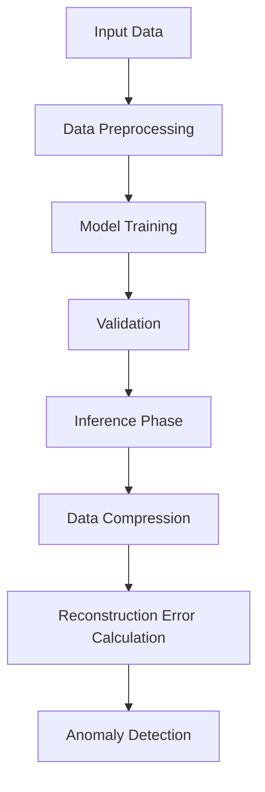
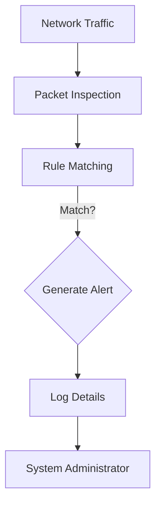
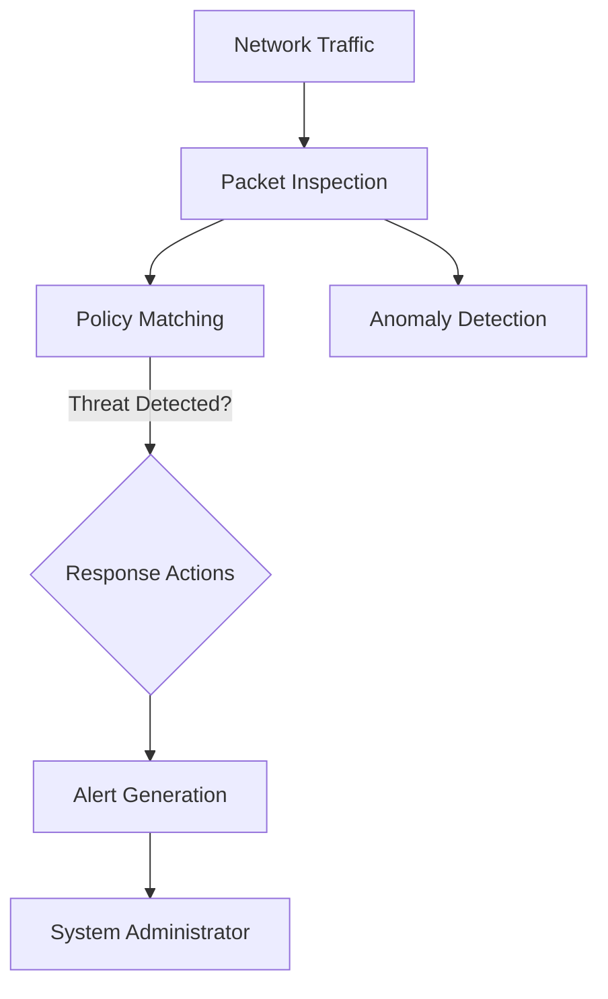
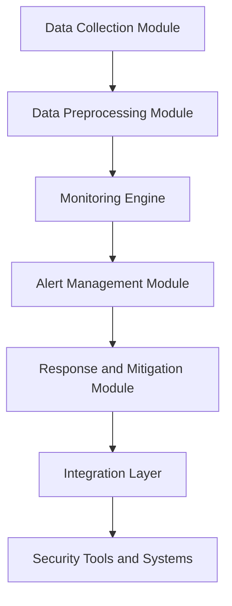
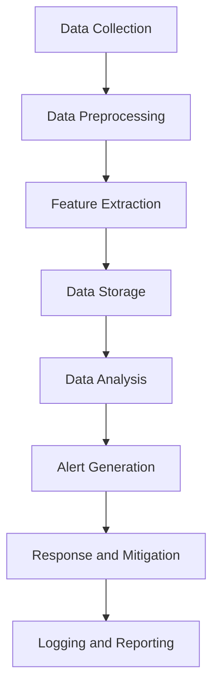
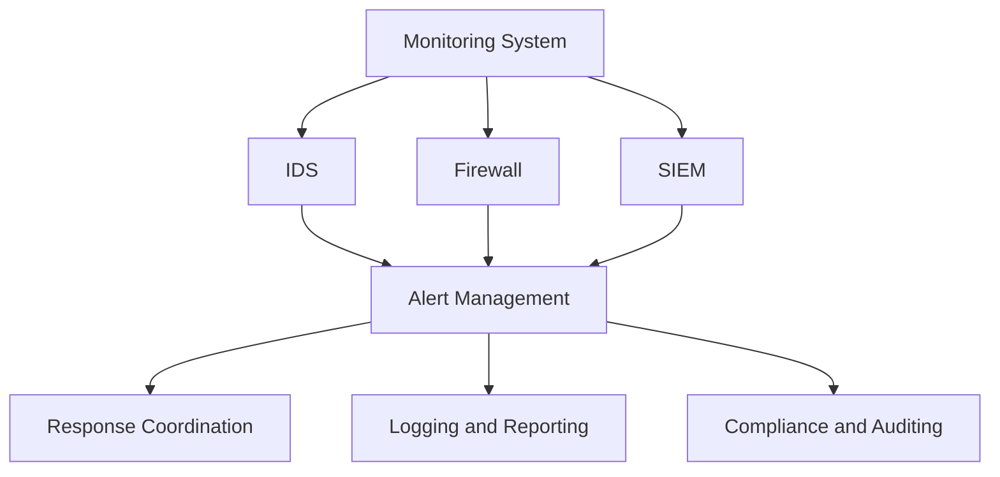

                 

## 1. Introduction

### 1.1 Book Background

In today's digital era, prompt language, an essential component of artificial intelligence (AI), has become a cornerstone of various applications ranging from natural language processing (NLP) to chatbots. However, with the increasing complexity and usage of prompt language comes the need for robust runtime security monitoring mechanisms. This book aims to delve into the intricacies of these mechanisms, providing a comprehensive guide to ensure the security and reliability of prompt language applications.

The primary objective of this book is to explore and analyze existing security monitoring mechanisms for prompt languages, identify their strengths and weaknesses, and propose advanced techniques to enhance their effectiveness. Furthermore, the book will outline a comprehensive framework for designing a robust monitoring system that integrates various techniques and addresses the challenges associated with runtime security monitoring.

The scope of this book is confined to runtime security monitoring mechanisms specifically designed for prompt languages. It does not encompass other forms of runtime security monitoring such as those for databases or network infrastructures. Additionally, this book will focus on practical implementations and real-world applications rather than theoretical frameworks or models.

### 1.2 Research Objectives

To achieve the above objectives, the following research goals will be pursued:

1. **Understanding Existing Mechanisms**: A thorough analysis of the current security monitoring mechanisms employed in prompt language applications will be conducted. This will involve identifying the key components, functionalities, and limitations of these mechanisms.

2. **Identifying Gaps and Opportunities**: The research will identify the gaps in the current mechanisms and explore potential opportunities for improvement. This will include investigating emerging trends and technologies that can be leveraged to enhance the effectiveness of security monitoring.

3. **Proposing Advanced Techniques**: Based on the identified gaps and opportunities, the book will propose advanced monitoring techniques such as machine learning-based anomaly detection and intrusion detection systems. These techniques will be analyzed for their potential to address the limitations of existing mechanisms.

4. **Designing a Comprehensive Framework**: A comprehensive framework for a robust security monitoring system will be designed, integrating the proposed advanced techniques. This framework will be discussed in detail, highlighting its architecture, data flow, and integration with existing security systems.

5. **Implementation and Case Studies**: The book will include practical case studies demonstrating the implementation of the proposed framework in real-world scenarios. These case studies will provide insights into the practical implications and effectiveness of the monitoring system.

### 1.3 Scope and Boundaries

While the book will cover a wide range of topics related to runtime security monitoring of prompt languages, there are certain boundaries and limitations that need to be acknowledged:

1. **Technological Focus**: The book will focus on modern technologies and frameworks relevant to runtime security monitoring. Legacy technologies or outdated methods will not be covered in detail.

2. **Scope of Applications**: The book will primarily address security monitoring mechanisms for prompt languages used in web applications, IoT devices, and real-time language analysis systems. Other applications, such as command-line interfaces or traditional programming languages, will not be covered extensively.

3. **Assumptions**: The book assumes that readers have a basic understanding of AI, NLP, and computer security. Technical jargon and complex concepts will be explained in detail to ensure accessibility for readers with varying levels of expertise.

4. **Practicality**: While theoretical discussions will be included, the primary focus will be on practical implementations and real-world applications. The book aims to provide actionable insights that can be directly applied to improve the security of prompt language applications.

By adhering to these scope and boundary conditions, the book aims to provide a valuable resource for researchers, practitioners, and students interested in the field of runtime security monitoring for prompt languages. 

## Fundamental Concepts

### 2.1 Definition of Prompt Language

Prompt language, at its core, is a form of natural language processing (NLP) that involves generating responses or output based on given prompts or inputs. These prompts can be in the form of simple keywords, full sentences, or even complex queries. The primary goal of prompt language is to create a seamless and intelligent interaction between humans and machines, facilitating effective communication and task completion.

In the context of artificial intelligence, prompt language serves as an intermediary that bridges the gap between human understanding and machine processing. It allows machines to understand and respond to human language in a contextually relevant and meaningful manner. This is achieved through various NLP techniques such as tokenization, part-of-speech tagging, parsing, and sentiment analysis.

The importance of prompt language in AI applications cannot be overstated. It enables the development of sophisticated applications such as chatbots, virtual assistants, and automated customer service systems. These applications are designed to handle a wide range of tasks, from answering simple questions to conducting complex conversations, thereby enhancing user experience and efficiency.

To provide a more concrete understanding, let's consider a few examples of prompt language in action:

1. **Chatbots**: In a chatbot application, a user might type a message such as "What's the weather like today?" The prompt language system processes this input, understands the context, and generates an appropriate response, such as "The weather today is sunny with a high of 75 degrees."

2. **Voice Assistants**: In voice-activated devices like Amazon Alexa or Google Assistant, a user's voice command acts as a prompt. For instance, "Set a reminder for my lunch meeting at 12:30 PM" would trigger the system to create a reminder in the user's calendar.

3. **Automated Customer Service**: In a customer service application, a prompt language system can be used to handle customer inquiries. When a customer submits a query, the system analyzes the input and provides a relevant response or solution.

These examples illustrate how prompt language is utilized in various AI applications to facilitate natural and intuitive interactions with users. The underlying technology involves complex NLP processes to ensure accurate interpretation and response generation.

### 2.2 Runtime Security Concerns

With the widespread adoption of prompt language in AI applications, the issue of runtime security has become increasingly critical. Runtime security concerns in prompt language applications primarily revolve around the protection of sensitive information, prevention of unauthorized access, and the detection and mitigation of potential security threats.

#### Types of Runtime Security Threats

Several types of threats can compromise the security of prompt language applications. These include:

1. **Malicious Inputs**: Attackers may inject malicious code or commands into the prompt language system, leading to unexpected behavior or unauthorized access to sensitive data.

2. **Data Breaches**: Prompt language applications often handle sensitive user data, such as personal information, financial details, or confidential business data. A breach can result in the exposure or theft of this information.

3. **Phishing Attacks**: Attackers may use prompt language systems to launch phishing attacks, tricking users into revealing sensitive information such as passwords or credit card numbers.

4. **Intrusion Attempts**: Attackers may attempt to intrude into the system by exploiting vulnerabilities in the prompt language framework or underlying infrastructure.

5. **Anomaly Detection**: Unusual or anomalous behavior in the prompt language system may indicate a security breach or an attempt to manipulate the system.

#### Reasons for Security Concerns

Several factors contribute to the runtime security concerns associated with prompt language applications:

1. **Complexity**: Prompt language systems are complex, involving multiple layers of NLP and machine learning algorithms. This complexity can introduce security vulnerabilities that attackers may exploit.

2. **Interactivity**: Prompt language systems are designed to be interactive, constantly processing user inputs and generating responses. This interactivity can make the system more susceptible to attacks, as it needs to handle unpredictable inputs.

3. **Data Handling**: Prompt language applications often handle large volumes of sensitive data. Ensuring the security of this data is a critical challenge, as any breach can have severe consequences.

4. **Integration**: Prompt language systems are often integrated with various other components and services, such as databases, APIs, and third-party applications. Ensuring the security of these integrations is crucial to prevent cross-component attacks.

### 2.3 Core Principles of Security Monitoring

Security monitoring is a crucial aspect of ensuring the runtime security of prompt language applications. It involves continuously monitoring the system for potential security threats and taking appropriate actions to mitigate them. The core principles of security monitoring include:

1. **Proactive Detection**: Security monitoring systems should be designed to detect potential threats before they can cause harm. This involves analyzing system activity and user inputs in real-time to identify suspicious or anomalous behavior.

2. **Continuous Monitoring**: Runtime security monitoring should be continuous, ensuring that the system is constantly monitored for potential threats. This requires the deployment of monitoring tools and techniques that can operate 24/7.

3. **Alerting and Reporting**: Security monitoring systems should be capable of generating alerts and reports when potential threats are detected. These alerts and reports should be actionable, providing detailed information that can be used to take appropriate actions.

4. **Incident Response**: Security monitoring should be integrated with an incident response plan. When a potential threat is detected, the system should be capable of triggering an incident response process to mitigate the threat and minimize the impact.

5. **Compliance and Auditing**: Security monitoring should also ensure compliance with relevant regulations and standards. This involves maintaining audit trails and generating compliance reports to demonstrate adherence to regulatory requirements.

In summary, prompt language runtime security monitoring is essential for protecting prompt language applications from various security threats. By implementing robust monitoring mechanisms, organizations can ensure the security, reliability, and trustworthiness of their AI applications. 

## Existing Monitoring Mechanisms

### 3.1 Overview of Current Approaches

The landscape of runtime security monitoring mechanisms for prompt languages is diverse and continually evolving. Several existing approaches have been developed to address the security concerns associated with prompt language applications. These approaches can be broadly categorized into traditional monitoring techniques and more advanced machine learning-based methods. In this section, we will provide an overview of these current approaches and their main functionalities.

#### Traditional Monitoring Techniques

1. **Access Control Mechanisms**: Access control is a fundamental aspect of runtime security monitoring. It involves restricting access to sensitive resources based on user permissions and roles. Common access control mechanisms include Role-Based Access Control (RBAC) and Attribute-Based Access Control (ABAC). These mechanisms ensure that only authorized users and systems can access sensitive data and perform critical operations.

2. **Intrusion Detection Systems (IDS)**: IDS are designed to monitor network traffic and system activity for signs of unauthorized access or malicious activity. There are two main types of IDS: Network Intrusion Detection Systems (NIDS) and Host Intrusion Detection Systems (HIDS). NIDS monitor network packets, while HIDS monitor the behavior of individual hosts. IDS can detect and alert on suspicious activities, such as unusual access patterns or the presence of known attack signatures.

3. **Firewalls**: Firewalls act as a barrier between a trusted internal network and an untrusted external network, such as the internet. They monitor incoming and outgoing network traffic and enforce security policies to prevent unauthorized access. Firewalls can be either hardware-based or software-based and are often used in conjunction with other security mechanisms.

4. **Log Monitoring**: Log monitoring involves collecting and analyzing log data from various system components, such as operating systems, applications, and security devices. By analyzing log data, security teams can detect and respond to security incidents. This approach is often used for incident response and forensic analysis.

#### Machine Learning-Based Methods

1. **Anomaly Detection**: Anomaly detection is a machine learning technique used to identify unusual patterns or behaviors that may indicate a security threat. These techniques can be based on statistical methods, such as clustering and classification, or more advanced methods, such as deep learning and neural networks. Anomaly detection can help detect both known and unknown threats by identifying deviations from normal behavior.

2. **Behavioral Analysis**: Behavioral analysis involves monitoring and analyzing user and system behavior to identify suspicious activities. This can include tracking login attempts, file access, network traffic, and application usage. Behavioral analysis can help detect insider threats, as well as external attacks.

3. **Machine Learning-Based IDS**: Machine learning-based IDS leverage machine learning algorithms to detect and classify security threats. These systems can learn from historical data to identify patterns of normal behavior and detect anomalies that may indicate a security breach. Machine learning-based IDS can be more effective than traditional signature-based methods in detecting sophisticated and evolving threats.

4. **User and Entity Behavior Analytics (UEBA)**: UEBA combines behavioral analysis with big data analytics and machine learning to identify and respond to potential security threats. UEBA systems monitor user and entity activity, including user behavior, access patterns, and system interactions, to detect anomalies and identify potential threats.

### 3.2 Strengths and Weaknesses Analysis

Each of these monitoring mechanisms has its strengths and weaknesses, which are discussed below:

#### Traditional Monitoring Techniques

**Access Control Mechanisms:**

- **Strengths:**
  - Simple and effective in controlling access to sensitive resources.
  - Well-established and widely adopted in various organizations.
  - Easy to implement and manage.

- **Weaknesses:**
  - Limited in detecting unauthorized activities that bypass access controls.
  - Can be challenging to manage in large, complex systems with numerous roles and permissions.
  - May require frequent updates to keep up with changing security requirements.

**Intrusion Detection Systems (IDS):**

- **Strengths:**
  - Can detect and alert on both known and unknown threats.
  - Provide valuable insights into potential security vulnerabilities.
  - Can be integrated with other security tools and systems.

- **Weaknesses:**
  - Can generate false positives, leading to unnecessary alerts and alert fatigue.
  - May require significant configuration and tuning to reduce false positives.
  - May not be effective against zero-day attacks or advanced persistent threats (APTs).

**Firewalls:**

- **Strengths:**
  - Effective in blocking unauthorized access to internal networks.
  - Can be combined with other security mechanisms to provide a comprehensive security posture.
  - Provides a first line of defense against network-based attacks.

- **Weaknesses:**
  - Can be complex to configure and manage, particularly in large and complex network environments.
  - May not protect against internal threats or threats that originate from within the network.
  - May require frequent updates to maintain effectiveness against emerging threats.

**Log Monitoring:**

- **Strengths:**
  - Can provide valuable information for incident response and forensic analysis.
  - Can be used to monitor and enforce compliance with regulatory requirements.
  - Provides a historical record of system activity, which can be useful for detecting and investigating security incidents.

- **Weaknesses:**
  - Can generate large volumes of log data, making it challenging to analyze and identify relevant information.
  - May require significant resources and expertise to implement and maintain.
  - Can be limited in its ability to detect and respond to real-time threats.

#### Machine Learning-Based Methods

**Anomaly Detection:**

- **Strengths:**
  - Can detect both known and unknown threats by identifying deviations from normal behavior.
  - Can adapt to changing patterns and new attack techniques.
  - Can provide early warnings of potential security incidents.

- **Weaknesses:**
  - May require significant data and computational resources to train and deploy.
  - Can be prone to false positives if the model is not well-tuned or the training data is not representative.
  - May not be effective against sophisticated and targeted attacks.

**Behavioral Analysis:**

- **Strengths:**
  - Can detect unusual or suspicious activities that may indicate a security threat.
  - Can be effective in detecting insider threats and targeted attacks.
  - Can provide real-time monitoring and alerting.

- **Weaknesses:**
  - Requires a significant amount of data and may require advanced analytics capabilities.
  - Can be challenging to implement and integrate with existing systems.
  - May be prone to false positives if the analysis is not well-calibrated.

**Machine Learning-Based IDS:**

- **Strengths:**
  - Can detect and classify sophisticated and evolving threats.
  - Can adapt to changing threat landscapes and new attack techniques.
  - Can provide a higher level of accuracy and detection compared to traditional methods.

- **Weaknesses:**
  - Requires significant expertise and resources to implement and maintain.
  - Can be complex to integrate with existing security infrastructure.
  - May require regular updates and retraining to maintain effectiveness.

**User and Entity Behavior Analytics (UEBA):**

- **Strengths:**
  - Can provide a comprehensive view of user and entity activity, detecting both internal and external threats.
  - Can adapt to changing user behavior and detect anomalies that may indicate a security incident.
  - Can provide actionable insights and recommendations for incident response.

- **Weaknesses:**
  - Requires a significant amount of data and advanced analytics capabilities.
  - Can be complex to implement and may require significant resources.
  - May be prone to false positives if the analysis is not well-calibrated.

In conclusion, while each of these monitoring mechanisms has its strengths and weaknesses, a combination of traditional and machine learning-based approaches can provide a more comprehensive and effective security monitoring strategy for prompt language applications. By leveraging the strengths of multiple techniques, organizations can enhance their ability to detect and respond to security threats, ensuring the ongoing security and reliability of their AI applications. 

## Advanced Monitoring Techniques

### 4.1 Machine Learning for Anomaly Detection

Machine learning (ML) has emerged as a powerful tool for enhancing runtime security monitoring in prompt language applications. One of the key applications of ML in this context is anomaly detection, which involves identifying unusual or unexpected patterns in data that may indicate a security threat. Anomaly detection can be particularly effective in identifying both known and unknown threats, as it is not limited by predefined signatures or rules.

#### Algorithm Overview

Anomaly detection algorithms can be broadly categorized into statistical methods, neural networks, and ensemble methods. Statistical methods, such as k-means clustering and isolation forests, are relatively simple and computationally efficient but may not perform well on high-dimensional data. Neural networks, such as autoencoders and convolutional neural networks (CNNs), offer more sophisticated approaches but require significant data and computational resources. Ensemble methods, which combine multiple algorithms, aim to achieve improved performance and robustness.

#### Example: Autoencoder for Anomaly Detection

One popular ML-based anomaly detection technique is the use of autoencoders. An autoencoder is a type of neural network that learns to compress input data into a lower-dimensional representation and then reconstructs the original data from this compressed representation. The key idea behind using an autoencoder for anomaly detection is that it can learn the normal behavior of the system and use this knowledge to identify deviations that may indicate a security threat.

Here's a step-by-step overview of how an autoencoder can be used for anomaly detection:

1. **Training Phase**:
   - **Data Preprocessing**: The input data, which consists of various features extracted from prompt language interactions, is preprocessed to remove noise and normalize the data.
   - **Model Training**: An autoencoder is trained on a labeled dataset of normal interactions. During training, the model learns to compress the input data into a lower-dimensional representation (the "encoding layer") and then reconstruct the original data from this representation (the "decoding layer").
   - **Validation**: The trained model is validated on a separate validation dataset to ensure that it has learned the normal behavior of the system effectively.

2. **Inference Phase**:
   - **Data Compression**: Given a new prompt language interaction, the model compresses the interaction into a lower-dimensional encoding.
   - **Reconstruction Error Calculation**: The model then attempts to reconstruct the original interaction from this compressed encoding. The reconstruction error (the difference between the original and reconstructed interactions) is calculated.
   - **Anomaly Detection**: Interactions with high reconstruction errors are flagged as anomalies, indicating that they deviate significantly from normal behavior.

#### Mermaid Diagram

Below is a Mermaid diagram illustrating the flow of data through an autoencoder for anomaly detection:

### 4.2 Intrusion Detection Systems (IDS)

Intrusion Detection Systems (IDS) are another advanced monitoring technique that can significantly enhance the security of prompt language applications. IDS are designed to monitor network traffic and system activity for signs of unauthorized access or malicious activity. Unlike traditional firewall-based security mechanisms, IDS can detect and respond to both known and unknown threats by analyzing patterns and behaviors in network traffic.

#### Algorithm Overview

IDS algorithms can be categorized into two main types: network-based IDS (NIDS) and host-based IDS (HIDS).

**Network-Based IDS (NIDS)**:
- **Data Collection**: NIDS monitor network traffic flowing through specific network segments or devices.
- **Pattern Matching**: NIDS use pre-defined signatures or rules to match network packets against known attack patterns. When a match is found, an alert is generated.
- **Anomaly Detection**: NIDS can also use anomaly detection techniques to identify unusual traffic patterns that may indicate an attack.

**Host-Based IDS (HIDS)**:
- **Data Collection**: HIDS monitor activity on individual hosts, including system logs, file integrity, and process behavior.
- **Anomaly Detection**: HIDS use various techniques, such as statistical analysis and machine learning, to identify unusual behaviors or changes in system state that may indicate a security threat.

#### Example: SNORT as a Network-Based IDS

One widely used NIDS is SNORT, an open-source intrusion detection system that uses a rule-based approach to identify known attack patterns in network traffic. SNORT operates by examining the content of network packets and comparing it against a set of rules defined by the user or provided by a rule set vendor.

**How SNORT Works**:

1. **Rule Configuration**: The user configures SNORT with a set of rules that define known attack patterns. These rules are typically updated regularly to keep up with new threats.
2. **Packet Inspection**: SNORT examines each packet flowing through the monitored network segment and compares its content against the configured rules.
3. **Alert Generation**: When a packet matches a rule, SNORT generates an alert, which is then sent to the system administrator for further action.
4. **Logging**: SNORT also logs the details of detected packets and alerts for future analysis and forensic investigation.

#### Mermaid Diagram

Below is a Mermaid diagram illustrating the flow of data through SNORT as a NIDS:

### 4.3 Advanced Intrusion Prevention Systems (IPS)

Advanced Intrusion Prevention Systems (IPS) go beyond the capabilities of IDS by not only detecting but also actively preventing and mitigating security threats. IPS can be integrated with IDS to provide a comprehensive security solution that combines detection and prevention.

#### Algorithm Overview

IPS algorithms typically include the following key components:

- **In-line Inspection**: Unlike IDS, which operates in a passive mode, IPS operates in an in-line mode, where it actively inspects and filters network traffic in real-time.
- **Signature-based Detection**: Similar to IDS, IPS uses signature-based detection to identify known attack patterns.
- **Anomaly-based Detection**: IPS also employs anomaly-based detection techniques to identify unusual behaviors or deviations from normal traffic patterns.
- **Response Actions**: When a threat is detected, IPS can take various response actions, such as blocking the malicious traffic, quarantining the source, or modifying firewall rules.

#### Example: Cisco Firepower as an IPS

Cisco Firepower is an example of an advanced IPS that combines signature-based and anomaly-based detection with automated response actions. Here's how it works:

**How Cisco Firepower Works**:

1. **Policy Configuration**: The user configures Cisco Firepower with security policies that define the allowed and blocked traffic patterns.
2. **Packet Inspection**: Cisco Firepower inspects each packet in real-time, comparing it against the configured policies and known attack signatures.
3. **Anomaly Detection**: Cisco Firepower uses machine learning and behavioral analysis to identify unusual traffic patterns that may indicate an attack.
4. **Response Actions**: When a threat is detected, Cisco Firepower takes automated response actions, such as blocking the malicious traffic or sending an alert to the security team.

#### Mermaid Diagram

Below is a Mermaid diagram illustrating the flow of data through Cisco Firepower as an IPS:

In conclusion, advanced monitoring techniques such as machine learning-based anomaly detection, network-based IDS, and advanced intrusion prevention systems offer significant enhancements to the runtime security monitoring of prompt language applications. By leveraging these techniques, organizations can significantly improve their ability to detect and respond to security threats, ensuring the ongoing security and reliability of their AI systems. 

## Designing a Comprehensive Monitoring System

### 5.1 System Architecture

Designing a comprehensive monitoring system for prompt language applications requires careful consideration of the system architecture. The architecture should be modular, scalable, and capable of integrating various monitoring techniques and tools. The following components are typically included in the architecture:

1. **Data Collection Module**: This module is responsible for collecting relevant data from various sources, including prompt language interactions, system logs, network traffic, and user activity. The collected data is then preprocessed and stored in a centralized data repository.

2. **Data Preprocessing Module**: This module handles the preprocessing of raw data, including cleaning, normalization, and feature extraction. The goal is to transform the data into a format suitable for analysis and monitoring.

3. **Monitoring Engine**: The monitoring engine is the core component of the system, responsible for analyzing the preprocessed data using various monitoring techniques, such as anomaly detection, behavioral analysis, and signature-based detection. The engine generates alerts and reports when potential security threats are detected.

4. **Alert Management Module**: This module manages the alerts generated by the monitoring engine. It includes features such as alert prioritization, notification, and escalation. The goal is to ensure that relevant alerts are promptly addressed by the appropriate personnel.

5. **Response and Mitigation Module**: This module contains the tools and processes for responding to detected threats. It includes automated response actions, such as blocking malicious traffic, isolating affected systems, and applying patches or updates. It also includes manual response actions, which may be required for complex or unknown threats.

6. **Integration Layer**: The integration layer connects the monitoring system with other security tools and systems, such as intrusion detection systems (IDS), firewalls, and security information and event management (SIEM) systems. This allows for a coordinated security posture across the organization.

#### Mermaid Diagram

Below is a Mermaid diagram illustrating the architecture of a comprehensive monitoring system for prompt language applications:

### 5.2 Data Flow and Processing

The data flow and processing in a comprehensive monitoring system are critical to its effectiveness. The following steps outline the typical data flow and processing stages:

1. **Data Collection**: Data is collected from various sources, including prompt language interactions, system logs, network traffic, and user activity. This data is then ingested into the system.

2. **Data Preprocessing**: The raw data is preprocessed to clean and normalize it. This step involves tasks such as removing noise, handling missing values, and converting data into a standardized format.

3. **Feature Extraction**: Relevant features are extracted from the preprocessed data. These features are selected based on their predictive power and relevance to security monitoring. Common features include user behavior patterns, network traffic metrics, and system resource usage.

4. **Data Storage**: The preprocessed and feature-extracted data is stored in a centralized data repository. This repository should be scalable and secure, ensuring the availability and integrity of the data.

5. **Data Analysis**: The monitoring engine analyzes the stored data using various monitoring techniques. This includes anomaly detection, behavioral analysis, and signature-based detection. The analysis is typically performed in real-time or near-real-time to ensure timely detection of security threats.

6. **Alert Generation**: When potential security threats are detected, alerts are generated. These alerts are prioritized based on their severity and relevance. The alerts are then sent to the alert management module for further action.

7. **Response and Mitigation**: The response and mitigation module takes action based on the alerts. This may involve automated response actions, such as blocking malicious traffic or isolating affected systems, or manual response actions, which may be required for complex or unknown threats.

8. **Logging and Reporting**: All detected threats, alerts, and responses are logged and reported. This logging and reporting is crucial for incident response, forensic analysis, and compliance with regulatory requirements.

#### Mermaid Diagram

Below is a Mermaid diagram illustrating the data flow and processing in a comprehensive monitoring system for prompt language applications:

### 5.3 Integration with Existing Security Systems

Integrating the comprehensive monitoring system with existing security systems is essential for a coordinated and effective security posture. This integration involves connecting the monitoring system with other security tools and systems, such as intrusion detection systems (IDS), firewalls, and security information and event management (SIEM) systems.

#### Integration Steps

1. **Data Exchange**: The monitoring system should be designed to exchange data with other security systems. This typically involves using standardized data formats and protocols, such as syslog, JSON, or XML.

2. **Alert Management**: The monitoring system should integrate with the alert management capabilities of other security systems. This ensures that alerts generated by the monitoring system are appropriately prioritized and escalated.

3. **Response Coordination**: The monitoring system should coordinate with the response capabilities of other security systems. This allows for automated response actions, such as blocking malicious traffic or applying patches, to be executed across multiple systems.

4. **Logging and Reporting**: The monitoring system should integrate with the logging and reporting capabilities of other security systems. This ensures that all security events, including those detected by the monitoring system, are logged and reported consistently.

5. **Compliance and Auditing**: The integration should facilitate compliance with relevant regulations and standards. This involves ensuring that the monitoring system and other security systems generate the necessary audit trails and compliance reports.

#### Mermaid Diagram

Below is a Mermaid diagram illustrating the integration of a comprehensive monitoring system with existing security systems:

In conclusion, designing a comprehensive monitoring system for prompt language applications requires a modular and scalable architecture, effective data flow and processing, and seamless integration with existing security systems. By following these steps, organizations can enhance their ability to detect and respond to security threats, ensuring the ongoing security and reliability of their AI systems. 

## Implementation Challenges and Solutions

### 6.1 Data Collection and Privacy Concerns

One of the primary challenges in implementing a comprehensive monitoring system for prompt language applications is the collection and handling of sensitive data. Prompt language applications often interact with a vast amount of user-generated content, including personal information, financial data, and confidential business communications. This data must be collected, processed, and stored in a manner that ensures privacy and compliance with data protection regulations such as GDPR and CCPA.

**Privacy Concerns:**

1. **Data Anonymization**: To protect user privacy, it is crucial to anonymize the collected data. This involves removing or encrypting personally identifiable information (PII) such as names, addresses, and email IDs. Techniques such as differential privacy and k-anonymity can be employed to further ensure data privacy.

2. **Data Minimization**: Only collect the minimum amount of data necessary for monitoring purposes. Avoid collecting data that is not directly relevant to security monitoring, as this increases the risk of data breaches and privacy violations.

3. **Consent and Transparency**: Ensure that users are fully informed about the data collection process and obtain their explicit consent. Transparency is key to building trust and ensuring compliance with privacy regulations.

**Solutions:**

1. **Encryption**: Use strong encryption methods to protect the data both in transit and at rest. This includes employing end-to-end encryption for data in motion and secure storage solutions for data at rest.

2. **Access Control**: Implement strict access control mechanisms to ensure that only authorized personnel can access the sensitive data. This includes role-based access control (RBAC) and multi-factor authentication (MFA).

3. **Compliance Tools**: Utilize data privacy compliance tools and services that can help organizations stay compliant with various data protection regulations. These tools can automate the anonymization and encryption processes, as well as generate compliance reports.

### 6.2 Scalability and Performance

Another significant challenge is ensuring that the monitoring system can handle the high volume of data generated by prompt language applications. As these applications scale, the monitoring system must be able to process and analyze increasing amounts of data without compromising performance.

**Performance Concerns:**

1. **Data Processing Bottlenecks**: As data volumes grow, there is a risk of bottlenecks in the data processing pipeline. This can lead to delays in alert generation and response times, which can be critical in detecting and mitigating security threats.

2. **System Overload**: Handling large volumes of data can cause system overload, leading to performance degradation and potential system crashes.

**Solutions:**

1. **Parallel Processing**: Implement parallel processing techniques to distribute the data processing load across multiple nodes or servers. This can significantly improve processing speed and scalability.

2. **Distributed Systems**: Design the monitoring system as a distributed system that can scale horizontally. This allows the system to handle increased data loads by adding more nodes to the cluster.

3. **Caching**: Use caching mechanisms to store frequently accessed data, reducing the need to retrieve data from slower storage systems. This can improve overall system performance.

4. **Load Balancing**: Implement load balancing to distribute the data processing load evenly across the nodes in the system. This prevents any single node from becoming a bottleneck.

### 6.3 Integration with Prompt Language Frameworks

Integrating the monitoring system with existing prompt language frameworks can be complex, especially when considering the diverse range of frameworks and platforms available. These frameworks often have their own unique architectures and interfaces, which can complicate the integration process.

**Integration Concerns:**

1. **Framework Compatibility**: Ensuring that the monitoring system is compatible with various prompt language frameworks can be challenging. Different frameworks may use different APIs, data formats, and security protocols.

2. **Data Format Conversions**: Transferring data between the monitoring system and the prompt language frameworks may require format conversions, which can introduce complexity and potential errors.

3. **Performance Overhead**: The integration process can introduce additional overhead, which may impact the performance of the prompt language frameworks.

**Solutions:**

1. **Standardized Interfaces**: Develop standardized interfaces and data formats that can be used across different prompt language frameworks. This simplifies the integration process and ensures compatibility.

2. **Middleware Solutions**: Implement middleware solutions that act as a bridge between the monitoring system and the prompt language frameworks. Middleware can handle data format conversions and provide a uniform interface for the monitoring system to interact with different frameworks.

3. **Performance Optimization**: Optimize the integration process to minimize performance overhead. This can include using efficient data transfer protocols, minimizing data transfer volumes, and leveraging caching and compression techniques.

In conclusion, implementing a comprehensive monitoring system for prompt language applications involves addressing several challenges related to data collection and privacy, scalability and performance, and integration with existing frameworks. By adopting the suggested solutions, organizations can build a robust and effective monitoring system that ensures the security and reliability of their AI applications. 

## Case Studies

### 7.1 Case Study 1: Web Application Security

One of the most compelling applications of prompt language runtime security monitoring is in the realm of web application security. Web applications are frequently targeted by attackers due to the potential for significant financial and reputational damage. To demonstrate the practical implementation of a comprehensive monitoring system, we will examine a case study involving a large e-commerce platform.

**Problem Background:**

The e-commerce platform experienced a series of unauthorized access attempts and fraudulent transactions. The internal security team was overwhelmed with the volume of log data and lacked the necessary tools to identify and respond to potential security threats in real-time.

**Solution Overview:**

A comprehensive monitoring system was implemented, integrating various advanced monitoring techniques such as anomaly detection, behavioral analysis, and machine learning-based intrusion detection systems (IDS).

**Implementation Steps:**

1. **Data Collection**: The monitoring system was configured to collect data from various sources, including user logs, transaction logs, and network traffic. This data was preprocessed to remove noise and normalize the data.

2. **Anomaly Detection**: Anomaly detection algorithms were trained on historical data to identify unusual patterns that could indicate a security threat. Autoencoders were used to compress user behavior data and detect high reconstruction errors as potential anomalies.

3. **Behavioral Analysis**: Behavioral analysis tools were employed to monitor user interactions and detect suspicious activities such as multiple failed login attempts or unusual purchasing patterns.

4. **Machine Learning-Based IDS**: A machine learning-based IDS was integrated to identify known attack patterns and detect zero-day exploits. The IDS used a combination of signature-based and anomaly-based detection techniques.

5. **Alert Management**: The monitoring system was connected to an alert management system that prioritized and escalated alerts based on their severity. Automated response actions, such as blocking suspicious IP addresses or isolating compromised accounts, were implemented.

**Results:**

The implementation of the comprehensive monitoring system resulted in a significant reduction in the number of unauthorized access attempts and fraudulent transactions. The system was able to detect and respond to security threats in real-time, minimizing the impact on the business.

### 7.2 Case Study 2: IoT Device Monitoring

The increasing adoption of the Internet of Things (IoT) has also brought about new security challenges. IoT devices, such as smart home devices and industrial sensors, are often targeted by attackers due to their potential to provide a foothold in a network. In this case study, we will explore how a smart home system implemented a comprehensive monitoring system to secure its IoT devices.

**Problem Background:**

A smart home system experienced multiple security breaches, resulting in unauthorized access to sensitive information and control over critical devices. The system lacked effective monitoring and response capabilities, making it vulnerable to attacks.

**Solution Overview:**

A robust monitoring system was implemented to monitor the security of IoT devices, integrating real-time anomaly detection, network traffic analysis, and intrusion prevention systems.

**Implementation Steps:**

1. **Data Collection**: The monitoring system was designed to collect data from IoT devices, including network traffic, device activity logs, and sensor readings. This data was preprocessed to extract relevant features.

2. **Anomaly Detection**: Anomaly detection algorithms were used to analyze device behavior and identify deviations from normal patterns. Machine learning models were trained on historical data to detect unusual activities such as unexpected device reboots or unusual data transmission patterns.

3. **Network Traffic Analysis**: The monitoring system analyzed network traffic to detect suspicious activities such as unauthorized access attempts or data exfiltration.

4. **Intrusion Prevention**: An intrusion prevention system (IPS) was integrated into the monitoring system to block known attack patterns and prevent unauthorized access to IoT devices. The IPS used a combination of signature-based and anomaly-based detection techniques.

5. **Alert Management**: The monitoring system was connected to an alert management system that generated alerts for potential security threats. Automated response actions, such as blocking malicious IP addresses or isolating compromised devices, were implemented.

**Results:**

The implementation of the comprehensive monitoring system significantly improved the security posture of the smart home system. The system was able to detect and prevent multiple security breaches, protecting the privacy and integrity of user data.

### 7.3 Case Study 3: Real-time Language Analysis

Real-time language analysis is critical for applications such as live chat support, sentiment analysis, and real-time translation. Ensuring the security of real-time language analysis systems is essential to protect against attacks such as SQL injection, cross-site scripting (XSS), and phishing.

**Problem Background:**

A real-time language analysis platform experienced a series of SQL injection and XSS attacks, compromising the integrity and security of user data. The platform lacked effective runtime security monitoring mechanisms.

**Solution Overview:**

A comprehensive monitoring system was implemented to protect the real-time language analysis platform, integrating input validation, anomaly detection, and real-time behavioral analysis.

**Implementation Steps:**

1. **Input Validation**: The monitoring system implemented strict input validation techniques to prevent SQL injection and XSS attacks. All user inputs were sanitized and validated to ensure they did not contain malicious code.

2. **Anomaly Detection**: Anomaly detection algorithms were employed to monitor user interactions and detect unusual patterns that could indicate an attack. Autoencoders were used to compress user behavior data and detect high reconstruction errors as potential anomalies.

3. **Behavioral Analysis**: Behavioral analysis tools were used to monitor user interactions in real-time, identifying suspicious activities such as multiple failed login attempts or unusual request patterns.

4. **Real-time Intrusion Detection**: Real-time intrusion detection systems (IDS) were integrated to detect and block known attack patterns and unauthorized access attempts. The IDS used a combination of signature-based and anomaly-based detection techniques.

5. **Alert Management**: The monitoring system was connected to an alert management system that generated alerts for potential security threats. Automated response actions, such as blocking malicious IP addresses or isolating compromised accounts, were implemented.

**Results:**

The implementation of the comprehensive monitoring system significantly enhanced the security of the real-time language analysis platform. The system was able to detect and prevent multiple security breaches, ensuring the confidentiality and integrity of user data.

In conclusion, the case studies highlight the practical implementation of comprehensive monitoring systems in various domains, demonstrating the effectiveness of integrating advanced monitoring techniques to enhance the security and reliability of prompt language applications. 

## Future Directions

### 8.1 Emerging Technologies

As the field of runtime security monitoring for prompt languages continues to evolve, several emerging technologies hold the potential to revolutionize this domain. These technologies include artificial intelligence (AI), blockchain, and quantum computing.

**Artificial Intelligence (AI):**

AI, particularly machine learning, has already made significant contributions to runtime security monitoring. However, the future of AI in this field lies in the development of more sophisticated algorithms that can adapt to new attack techniques and evolving threat landscapes. AI-powered anomaly detection systems can become even more accurate through the integration of deep learning techniques, allowing for real-time, adaptive monitoring of prompt language applications.

**Blockchain:**

Blockchain technology offers a decentralized and tamper-proof method of data storage, which can be leveraged to enhance the security of runtime monitoring systems. Blockchain can be used to securely store logs and transaction data, ensuring that any attempts to manipulate or delete this information are detected and prevented. Additionally, blockchain can facilitate secure data sharing between different systems and organizations, improving collaboration in security monitoring efforts.

**Quantum Computing:**

Quantum computing has the potential to significantly enhance the computational power required for complex security monitoring tasks. Quantum algorithms can solve certain problems much faster than classical algorithms, such as factoring large numbers, which is crucial for cryptography. As quantum computing advances, it may become possible to develop more robust cryptographic methods and improve the efficiency of security monitoring systems.

### 8.2 Potential Challenges and Solutions

While these emerging technologies offer promising solutions for runtime security monitoring, they also present several challenges that need to be addressed.

**Data Privacy:**

As more data is collected and analyzed for security monitoring, the issue of data privacy becomes increasingly important. Ensuring data privacy while leveraging AI, blockchain, and quantum computing will require the development of advanced privacy-preserving techniques, such as differential privacy and homomorphic encryption.

**Scalability:**

The scalability of monitoring systems is crucial for handling the growing volume of data generated by prompt language applications. Emerging technologies like distributed computing and edge computing can help address scalability challenges by allowing monitoring systems to process and analyze data closer to the source, reducing latency and improving efficiency.

**Integration:**

Integrating emerging technologies with existing monitoring systems can be complex and require significant resources. Developing standardized interfaces and protocols for interoperability will be essential to ensure seamless integration and maximize the benefits of these technologies.

**Security of Emerging Technologies:**

Emerging technologies themselves can become targets for attackers. For example, AI models can be manipulated through adversarial attacks, and blockchain can be vulnerable to 51% attacks. Addressing these security concerns will require ongoing research and development to ensure the robustness of these technologies.

### 8.3 Research Opportunities

Several research opportunities exist to further advance runtime security monitoring for prompt languages. These include:

**Advanced Anomaly Detection:**

Developing advanced anomaly detection techniques that can adapt to evolving threat landscapes and detect both known and unknown threats.

**Intelligent Automation:**

Researching intelligent automation techniques to streamline the incident response process, enabling faster and more effective detection and mitigation of security threats.

**Blockchain for Security Monitoring:**

Exploring the use of blockchain in security monitoring, including secure data storage, transaction verification, and collaborative threat intelligence sharing.

**Quantum Computing in Security:**

Investigating the application of quantum computing in security monitoring, such as improving cryptographic methods and enhancing the detection of quantum attacks.

In conclusion, the future of runtime security monitoring for prompt languages is promising, with emerging technologies offering significant potential to enhance the effectiveness and efficiency of monitoring systems. Addressing the challenges and seizing the research opportunities in this field will be crucial for ensuring the security and reliability of prompt language applications in the years to come. 

## Conclusion

In conclusion, the runtime security monitoring of prompt languages is a critical aspect of ensuring the reliability, integrity, and security of AI applications. This book has explored various aspects of runtime security monitoring, from fundamental concepts and existing mechanisms to advanced techniques and comprehensive system design. We have discussed the importance of prompt language in AI applications and the types of security threats that they face. By analyzing existing monitoring mechanisms and proposing advanced techniques, such as machine learning-based anomaly detection and intrusion detection systems, we have highlighted the potential to enhance the security of prompt language applications significantly.

The book has also presented practical case studies illustrating the implementation of comprehensive monitoring systems in real-world scenarios. These case studies demonstrate the effectiveness of integrating various monitoring techniques and addressing challenges related to data collection, privacy, scalability, and integration with existing frameworks.

Looking ahead, several emerging technologies, including AI, blockchain, and quantum computing, hold the potential to further revolutionize runtime security monitoring. However, these technologies also present challenges that need to be addressed to ensure the robustness and security of monitoring systems.

Future research should focus on developing advanced anomaly detection techniques that can adapt to evolving threats, intelligent automation for streamlined incident response, and exploring the use of blockchain for secure data storage and collaborative threat intelligence sharing. Additionally, investigating the application of quantum computing in security monitoring, such as improving cryptographic methods and detecting quantum attacks, will be crucial.

By continuing to advance the field of runtime security monitoring for prompt languages, we can ensure the ongoing security and reliability of AI applications, ultimately fostering a safer and more trustworthy digital ecosystem. The work outlined in this book serves as a foundational resource for researchers, practitioners, and students interested in this vital area of computer security. 

