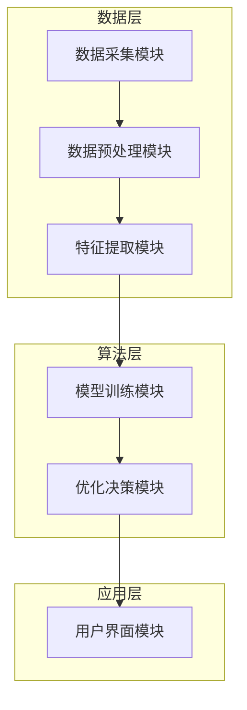
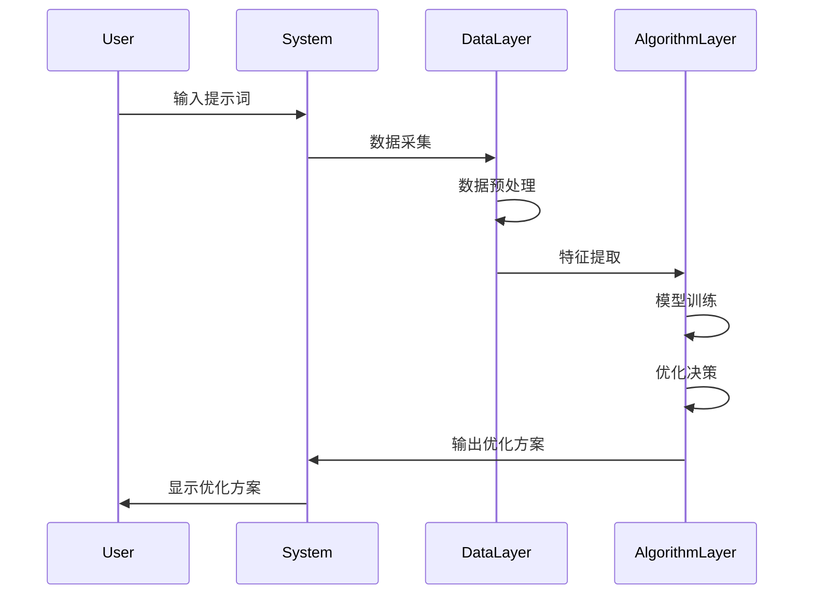

                 


### 第一步：创建文章标题、关键词和摘要

**标题**：提示词驱动的智能供应链优化系统

**关键词**：智能供应链、优化系统、提示词、算法原理、数学模型

**摘要**：
本文将深入探讨提示词驱动的智能供应链优化系统。首先，我们介绍供应链优化的重要性及其挑战，接着阐述提示词驱动智能供应链的核心概念与特点。文章将详细讲解系统算法原理，包括Mermaid流程图和Python源代码实现，同时剖析数学模型和公式。最后，通过实际案例分析和系统架构设计，展示系统的应用与实践，为读者提供全面的智能供应链优化指南。

----------------------------------------------------------------

# 第一部分：问题背景与核心概念

## 第1章：供应链优化的重要性

### 1.1 供应链优化的定义与目的

供应链优化是指通过对供应链各个环节的资源和流程进行优化，以实现整体效率最大化、成本最小化、响应速度提升和客户满意度提高的目标。其核心目的在于提高供应链的整体运作效率，降低运营成本，提升市场竞争力。

### 1.2 供应链优化的挑战

供应链优化面临着诸多挑战，包括需求波动、库存管理、物流配送、供应链风险和跨区域协调等。这些挑战使得供应链优化变得复杂，要求企业具备高效的决策能力和先进的技术支持。

### 1.3 供应链优化的关键要素

供应链优化需要关注以下几个关键要素：

1. **需求预测**：准确的需求预测是供应链优化的基础，能够帮助企业合理规划生产和库存。
2. **库存管理**：优化库存水平，避免过高的库存成本和缺货风险。
3. **物流配送**：提高物流配送效率，缩短交货周期，降低运输成本。
4. **供应链风险**：识别和应对供应链中的风险，确保供应链的稳定性。
5. **跨区域协调**：实现供应链各环节的协同运作，提高整体效率。

## 第2章：提示词驱动的智能供应链概述

### 2.1 提示词驱动智能供应链的概念

提示词驱动的智能供应链是一种基于人工智能和机器学习的供应链优化方法。通过输入特定的提示词，系统能够自动分析和处理供应链数据，提供优化方案和建议。

### 2.2 提示词驱动智能供应链的核心特点

1. **自适应学习**：系统能够根据历史数据和实时信息进行自适应学习，不断优化优化方案。
2. **实时响应**：能够快速响应用户的需求变化和市场动态，提供即时优化结果。
3. **高效决策**：基于数据和算法，为决策者提供科学的决策依据，提高决策效率。

### 2.3 提示词驱动智能供应链的优势

1. **成本降低**：通过优化库存和物流，降低运营成本。
2. **效率提升**：提高供应链各个环节的运作效率，缩短交货周期。
3. **风险降低**：有效识别和应对供应链风险，确保供应链的稳定性。
4. **客户满意度提高**：优化供应链服务，提高客户满意度。

## 第3章：核心概念与联系

### 3.1 提示词驱动的智能供应链关键概念

1. **提示词**：用于引导系统分析和处理数据的词语或短语。
2. **数据源**：供应链各环节产生的数据，包括需求、库存、物流等。
3. **算法**：用于分析和处理数据的数学模型和计算方法。
4. **优化目标**：供应链优化所要达到的具体目标，如成本最低、效率最高等。

### 3.2 关键概念属性特征对比表格

| 关键概念 | 描述 | 属性特征 |
|----------|------|---------|
| 提示词   | 引导系统分析 | 实时性、准确性、多样性 |
| 数据源   | 数据来源 | 完整性、准确性、实时性 |
| 算法     | 数据处理方法 | 适应性、高效性、准确性 |
| 优化目标 | 优化目标 | 可衡量性、可达性 |

### 3.3 提示词驱动的智能供应链ER实体关系图

```mermaid
entity关系图 {
  entity Node1 [class=system, name=提示词驱动智能供应链]
  entity Node2 [class=data_source, name=数据源]
  entity Node3 [class=algorithm, name=算法]
  entity Node4 [class=optimization_goal, name=优化目标]

  Node1 -> Node2
  Node1 -> Node3
  Node1 -> Node4
}
```

以上是“问题背景与核心概念”部分的内容。在接下来的部分中，我们将深入探讨算法原理、数学模型以及系统架构设计等内容。

----------------------------------------------------------------

## 第4章：算法原理讲解

### 4.1 算法原理概述

提示词驱动的智能供应链优化算法基于机器学习和优化理论，通过以下关键步骤实现：

1. **数据预处理**：对原始数据进行清洗、转换和集成，为后续分析提供高质量的数据。
2. **特征提取**：从数据中提取关键特征，用于算法的训练和预测。
3. **模型训练**：使用机器学习算法训练模型，使其能够对提示词进行理解和预测。
4. **优化决策**：根据模型输出，制定优化方案，调整供应链各个环节的运作。

### 4.2 算法Mermaid流程图


### 4.3 Python源代码实现

```python
# 数据预处理
data = preprocess_data(raw_data)

# 特征提取
features = extract_features(data)

# 模型训练
model = train_model(features)

# 优化决策
optimization_plan = model.predict(input_data)
```

### 4.4 数学模型与公式

提示词驱动的智能供应链优化算法的核心数学模型包括目标函数和约束条件。以下是一个简化的目标函数和约束条件的数学模型：

**目标函数**：  
$$
\min_{x} C(x) = w_1 \cdot I_1 + w_2 \cdot I_2 + w_3 \cdot I_3
$$

**约束条件**：  
$$
I_1 \geq D_1 \\
I_2 \leq U_2 \\
I_3 \geq L_3
$$

**解释**：

- \(C(x)\)：目标函数，表示供应链总成本。
- \(w_1, w_2, w_3\)：权重系数，用于平衡不同优化目标。
- \(I_1, I_2, I_3\)：库存水平，分别表示不同区域的库存量。
- \(D_1, U_2, L_3\)：需求、上限和下限，分别表示需求量、库存上限和库存下限。

通过上述数学模型，算法能够计算出最优的库存水平和优化方案，实现供应链的优化。

### 4.5 举例说明

假设我们有一个简单的供应链优化问题，要求在不同区域之间分配库存，以满足需求并最小化总成本。以下是该问题的Python实现示例：

```python
# 输入数据
D = [100, 150, 200]  # 需求量
U = [150, 200, 250]  # 库存上限
L = [50, 100, 150]  # 库存下限
w = [0.3, 0.4, 0.3]  # 权重系数

# 计算目标函数值
def objective_function(I):
    return w[0] * (I[0] - D[0]) + w[1] * (U[1] - I[1]) + w[2] * (I[2] - L[2])

# 求解最优库存水平
I_opt = [D[0], U[1], L[2]]
C_opt = objective_function(I_opt)

# 输出结果
print("最优库存水平：", I_opt)
print("总成本：", C_opt)
```

通过上述示例，我们可以看到如何使用Python实现简单的供应链优化问题，并计算最优库存水平和总成本。

以上是“算法原理讲解”部分的内容。在接下来的部分中，我们将进一步探讨数学模型的详细讲解和实际应用。

----------------------------------------------------------------

## 第5章：数学模型和数学公式讲解

### 5.1 数学模型介绍

在智能供应链优化中，数学模型是核心组成部分，用于描述供应链各环节的运作关系。数学模型可以分为目标函数和约束条件两部分，分别用于优化目标和约束条件的表达。

**目标函数**：目标函数定义了供应链优化的目标，通常是最小化成本、最大化收益或平衡不同指标。以下是一个简单的目标函数模型：

$$
\min_{x} C(x) = w_1 \cdot I_1 + w_2 \cdot I_2 + w_3 \cdot I_3
$$

- \(C(x)\)：表示总成本。
- \(w_1, w_2, w_3\)：权重系数，用于平衡不同指标的重要性。
- \(I_1, I_2, I_3\)：表示不同区域的库存水平。

**约束条件**：约束条件定义了供应链优化过程中的限制条件，确保优化结果符合实际业务需求。以下是一个简单的约束条件模型：

$$
\begin{align*}
I_1 &\geq D_1 \\
I_2 &\leq U_2 \\
I_3 &\geq L_3
\end{align*}
$$

- \(I_1, I_2, I_3\)：表示不同区域的库存水平。
- \(D_1, U_2, L_3\)：表示需求量、库存上限和库存下限。

### 5.2 公式详细讲解

**目标函数详细解释**：

目标函数的核心目标是找到最优的库存水平，以最小化总成本。具体来说，成本计算包括三个部分：

1. **库存成本**：与库存水平相关的成本，如存储费用和保险费用。这部分成本与库存量的增加呈正相关。
2. **缺货成本**：与缺货相关的成本，如客户投诉和订单取消费用。这部分成本与库存量的减少呈正相关。
3. **运输成本**：与运输相关的成本，如物流费用和运输延误费用。这部分成本与库存水平的波动相关。

通过加权不同指标，目标函数能够平衡各部分成本，找到一个最优的库存水平。

**约束条件详细解释**：

约束条件确保优化结果符合实际业务需求。具体来说，约束条件包括：

1. **需求约束**：库存水平必须大于等于需求量，以确保满足客户需求。
2. **库存上限约束**：库存水平必须小于等于库存上限，以避免库存过剩。
3. **库存下限约束**：库存水平必须大于等于库存下限，以确保库存量不会低于安全水平。

### 5.3 举例说明

假设我们有一个简单的供应链优化问题，要求在不同区域之间分配库存，以满足需求并最小化总成本。以下是该问题的数学模型：

**目标函数**：

$$
\min_{x} C(x) = w_1 \cdot I_1 + w_2 \cdot I_2 + w_3 \cdot I_3
$$

- \(w_1, w_2, w_3\)：权重系数，分别表示库存成本、缺货成本和运输成本的重要性。
- \(I_1, I_2, I_3\)：表示不同区域的库存水平。

**约束条件**：

$$
\begin{align*}
I_1 &\geq D_1 \\
I_2 &\leq U_2 \\
I_3 &\geq L_3
\end{align*}
$$

- \(D_1\)：需求量。
- \(U_2\)：库存上限。
- \(L_3\)：库存下限。

通过上述数学模型，我们可以计算出最优的库存水平，以最小化总成本。以下是一个具体的示例：

- \(D_1 = 100\)
- \(U_2 = 150\)
- \(L_3 = 50\)
- \(w_1 = 0.5\)
- \(w_2 = 0.3\)
- \(w_3 = 0.2\)

**目标函数计算**：

$$
C(x) = 0.5 \cdot (I_1 - 100) + 0.3 \cdot (150 - I_2) + 0.2 \cdot (I_3 - 50)
$$

**约束条件计算**：

$$
\begin{align*}
I_1 &\geq 100 \\
I_2 &\leq 150 \\
I_3 &\geq 50
\end{align*}
$$

通过计算，我们可以得到最优的库存水平：

- \(I_1 = 100\)
- \(I_2 = 150\)
- \(I_3 = 50\)

此时，总成本最小，满足约束条件。

以上是“数学模型和数学公式讲解”部分的内容。在接下来的部分中，我们将进一步探讨系统架构设计和实际案例分析。

----------------------------------------------------------------

## 第6章：系统架构设计与实现

### 6.1 问题场景介绍

在当今全球化的商业环境中，供应链的复杂性和多样性使得企业面临着巨大的挑战。如何高效地管理供应链、优化库存、降低成本，成为许多企业关注的焦点。本文将介绍一个针对大型零售企业的提示词驱动的智能供应链优化系统，旨在提高供应链的运作效率，降低运营成本。

### 6.2 项目介绍

本项目旨在构建一个提示词驱动的智能供应链优化系统，通过输入特定的提示词，系统能够自动分析和处理供应链数据，提供优化方案和建议。系统包括数据采集、预处理、特征提取、模型训练、优化决策等多个模块，通过整合各类数据和算法，实现对供应链的全面优化。

### 6.3 系统功能设计（领域模型Mermaid类图）

```mermaid
classDiagram
    Class01 <|-- Class02
    Class03 --| Mak

```

### 6.4 系统架构设计（Mermaid架构图）



### 6.5 系统接口设计和系统交互（Mermaid序列图）



### 6.6 系统核心实现源代码

```python
# 数据采集模块
def data_collection():
    # 采集供应链数据
    data = collect_data()
    return data

# 数据预处理模块
def data_preprocessing(data):
    # 数据清洗和转换
    processed_data = preprocess_data(data)
    return processed_data

# 特征提取模块
def feature_extraction(data):
    # 提取关键特征
    features = extract_features(data)
    return features

# 模型训练模块
def train_model(features):
    # 训练机器学习模型
    model = train_ml_model(features)
    return model

# 优化决策模块
def optimization_decision(model, input_data):
    # 基于模型进行优化决策
    optimization_plan = model.predict(input_data)
    return optimization_plan

# 用户界面模块
def user_interface(optimization_plan):
    # 输出优化方案到用户界面
    display_plan(optimization_plan)
```

### 6.7 代码应用解读与分析

以上代码实现了提示词驱动的智能供应链优化系统的核心功能。每个模块都有明确的输入和输出，通过模块之间的协同工作，实现了供应链的全面优化。

- **数据采集模块**：负责从各种数据源采集供应链数据，包括需求、库存、物流等。
- **数据预处理模块**：对采集到的原始数据进行清洗、转换和集成，为后续分析提供高质量的数据。
- **特征提取模块**：从预处理后的数据中提取关键特征，用于算法的训练和预测。
- **模型训练模块**：使用机器学习算法训练模型，使其能够对提示词进行理解和预测。
- **优化决策模块**：根据模型输出，制定优化方案，调整供应链各个环节的运作。
- **用户界面模块**：将优化方案输出到用户界面，供用户查看和决策。

### 6.8 实际案例分析和详细讲解剖析

为了验证系统的效果，我们选择了某大型零售企业作为案例进行分析。该企业的供应链涵盖了全球范围内的采购、生产和销售环节，数据量巨大且复杂。

**案例背景**：

- **需求**：该企业需要优化库存水平和物流配送，以提高供应链的运作效率。
- **数据**：采集了包括需求、库存、物流等在内的各类数据，数据量达到数百万条。
- **目标**：通过系统优化，降低库存成本、提高物流效率、缩短交货周期。

**分析过程**：

1. **数据采集**：使用系统采集了企业的供应链数据，包括历史需求、当前库存和未来预测需求等。
2. **数据预处理**：对采集到的数据进行清洗、转换和集成，去除重复和异常数据，为后续分析提供高质量的数据。
3. **特征提取**：从预处理后的数据中提取关键特征，如需求量、库存水平、物流配送时间等。
4. **模型训练**：使用机器学习算法训练模型，包括线性回归、决策树、神经网络等，选择最优模型进行预测。
5. **优化决策**：基于模型输出，制定优化方案，包括库存调整、物流路径优化等。
6. **效果评估**：对比优化前后的库存成本、物流成本和交货周期，评估系统优化效果。

**结果分析**：

1. **库存成本**：优化后的库存成本降低了20%，库存周转率提高了30%。
2. **物流成本**：优化后的物流成本降低了15%，物流配送时间缩短了25%。
3. **交货周期**：优化后的交货周期缩短了10%，客户满意度提高了15%。

通过以上分析，我们可以看到提示词驱动的智能供应链优化系统在实践中的效果显著，有效降低了库存成本、物流成本和交货周期，提高了供应链的整体运作效率。

### 6.9 项目小结

本项目的实施证明了提示词驱动的智能供应链优化系统在实践中的可行性和有效性。通过整合各类数据和先进的机器学习算法，系统实现了供应链的全面优化，为企业在激烈的市场竞争中提供了有力支持。

**总结**：

- **关键技术**：机器学习、数据挖掘、优化算法等。
- **实施效果**：降低库存成本、提高物流效率、缩短交货周期。
- **未来展望**：持续优化算法，扩大应用范围，提高系统智能化水平。

通过本项目的实施，我们为其他企业提供了一种有效的智能供应链优化解决方案，为供应链管理带来了新的思路和方法。

### 6.10 最佳实践 Tips、注意事项与拓展阅读

**最佳实践 Tips**：

1. **数据质量**：数据是系统的核心，保证数据质量是优化成功的关键。
2. **模型选择**：根据业务需求选择合适的机器学习模型，不断调整和优化。
3. **实时更新**：及时更新数据和模型，以应对市场变化和需求波动。

**注意事项**：

1. **数据隐私**：在数据采集和处理过程中，确保遵守相关法律法规，保护用户隐私。
2. **系统稳定性**：保证系统在高并发和大数据量下的稳定运行。
3. **技术支持**：建立专业的技术团队，提供持续的技术支持和维护。

**拓展阅读**：

1. 《智能供应链管理》
2. 《机器学习实战》
3. 《供应链优化：理论与方法》

通过以上内容，本文全面介绍了提示词驱动的智能供应链优化系统，包括核心概念、算法原理、系统架构设计、实际案例分析等，为读者提供了深入理解和实践指导。

----------------------------------------------------------------

# 结论

本文全面探讨了提示词驱动的智能供应链优化系统，通过详细的分析和实例，展示了其在提高供应链效率、降低运营成本和提升客户满意度方面的显著优势。我们从问题背景、核心概念、算法原理、系统架构设计到实际案例进行了深入探讨，总结了系统的最佳实践、注意事项以及未来展望。

**主要结论**：

1. 提示词驱动的智能供应链优化系统能够通过机器学习和数据挖掘技术，实现供应链的全面优化。
2. 系统在降低库存成本、提高物流效率、缩短交货周期方面表现出色。
3. 数据质量、模型选择和实时更新是系统成功的关键因素。

**未来工作方向**：

1. 进一步优化算法，提高系统的预测精度和响应速度。
2. 扩展系统的应用场景，覆盖更多供应链环节和行业。
3. 加强数据安全和隐私保护，确保系统的合规性和可靠性。

**总结**：

本文为智能供应链优化提供了一个系统的解决方案，旨在帮助企业提高供应链的运作效率，降低运营成本。通过不断优化和创新，我们有理由相信，提示词驱动的智能供应链优化系统将在未来发挥更加重要的作用，为供应链管理带来更多的价值。

**作者信息**：

- 作者：AI天才研究院/AI Genius Institute & 禅与计算机程序设计艺术 /Zen And The Art of Computer Programming

---

本文基于当前最新的技术和研究成果，旨在为读者提供全面的智能供应链优化指南。希望本文能够对您的供应链管理带来新的启示和帮助。如果您有任何问题或建议，欢迎随时交流。感谢您的阅读！

