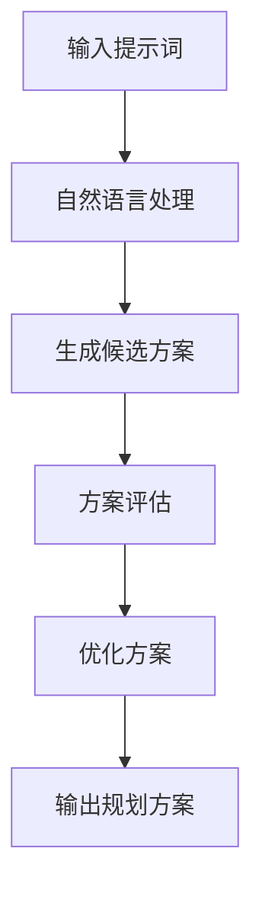
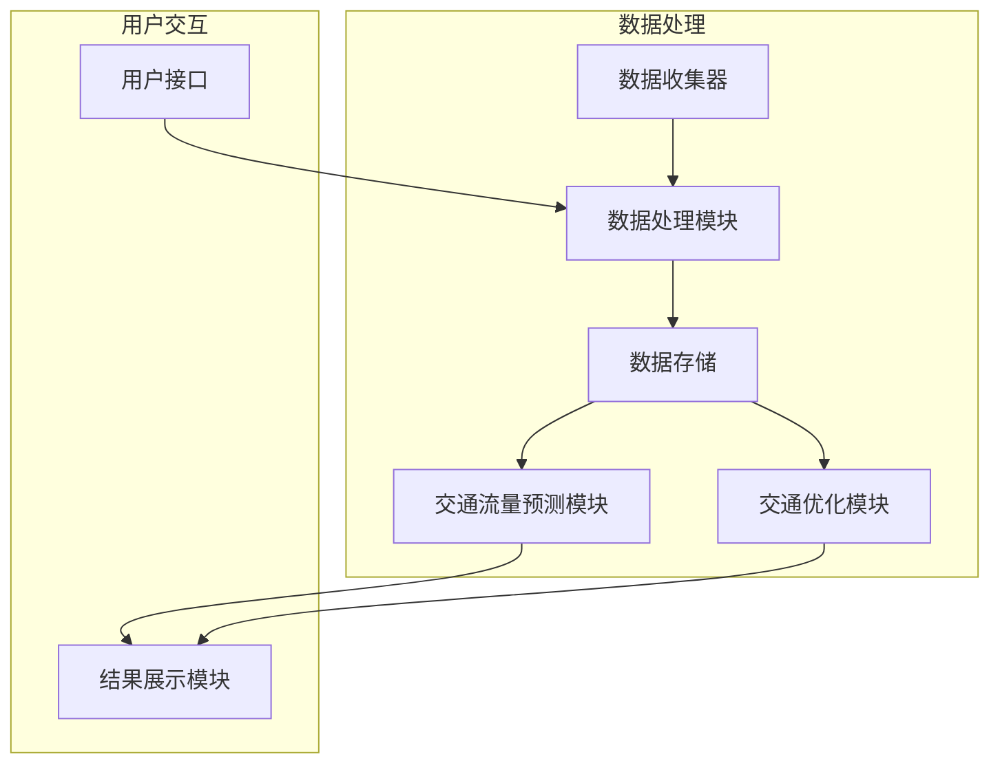
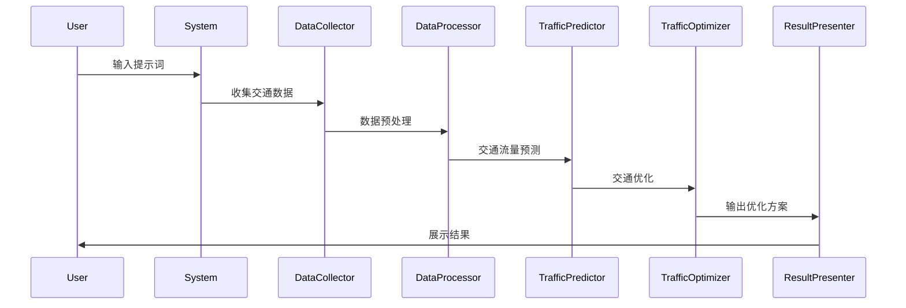

                 


### 文章标题：提示词驱动的智能城市规划：可持续发展设计

关键词：智能城市、提示词驱动、可持续发展、城市规划、绿色交通、智慧城市基础设施

摘要：本文将探讨如何通过提示词驱动的智能城市规划实现可持续发展设计。首先，我们将介绍智能城市规划的背景和重要性，以及可持续发展设计的理念。接着，我们将深入分析提示词驱动技术的工作原理及其在规划中的应用。随后，本文将详细阐述城市规划中的核心要素，包括城市环境与生态系统、社会经济因素以及能源与资源管理。通过实际案例研究和未来趋势分析，我们将展示提示词驱动的智能城市规划实践及其前景。

### 第一部分：引言与背景

#### 第1章：智能城市规划概述

**1.1 智能城市规划的定义**

智能城市规划是指利用现代信息技术和数据分析手段，对城市空间、基础设施、交通、环境等进行科学规划和优化，以提高城市运行效率和居民生活质量。智能城市规划的核心在于数据的收集、处理和分析，从而实现城市资源的合理配置和城市服务的智能化。

**1.2 智能城市规划的重要性**

智能城市规划对于城市的可持续发展具有重要意义。首先，它能够提高城市交通的运行效率，减少拥堵，降低污染。其次，智能城市规划能够优化城市空间布局，提高土地利用效率，减少资源浪费。最后，智能城市规划还能够促进城市经济和社会的协调发展，提高城市的整体竞争力。

**1.3 可持续发展设计的理念**

可持续发展设计旨在满足当前需求的同时，不损害后代满足其需求的能力。它强调在规划过程中要综合考虑经济、社会和环境因素，实现经济增长、社会进步和环境保护的协调发展。可持续发展设计的基本原则包括资源的有效利用、减少污染、促进社会公平和提升生活质量。

#### 第2章：提示词驱动技术与城市规划

**2.1 提示词驱动技术的原理**

提示词驱动技术（Keyword-Driven Technology）是一种基于自然语言处理和机器学习的方法，通过输入特定的关键词或短语，系统可以自动生成相关的文本、图像或其他形式的信息。这一技术利用大量的文本数据进行训练，从而学会理解用户的意图，并生成相应的输出。

**2.2 提示词驱动技术在城市规划中的应用**

在智能城市规划中，提示词驱动技术可以应用于多个方面。例如，通过输入城市规划的目标关键词，系统可以自动生成相关的规划方案；通过输入居民的需求关键词，系统可以提供个性化的城市服务；通过输入环境问题关键词，系统可以提供相应的解决方案。

**2.3 提示词驱动技术的挑战与解决方案**

尽管提示词驱动技术在城市规划中有很大的应用潜力，但也面临着一些挑战。首先是如何准确理解用户输入的意图，这需要高效的语义分析技术。其次是如何保证生成内容的准确性和实用性，这需要大量的训练数据和精细的调整。针对这些挑战，可以采用以下解决方案：

1. **改进语义分析技术**：利用深度学习模型，如BERT、GPT等，提高对用户输入的语义理解能力。
2. **扩展训练数据集**：收集更多的城市规划相关数据，包括历史规划文档、居民反馈等，以丰富训练数据集。
3. **用户反馈机制**：建立用户反馈机制，收集用户对生成内容的评价，不断优化系统。

### 第二部分：可持续发展设计的核心要素

#### 第3章：城市环境与生态系统

**3.1 城市环境的评估**

城市环境的评估是智能城市规划的重要环节。评估内容包括空气质量、水质、噪音水平等。通过这些数据的收集和分析，可以评估城市环境的质量，为规划提供依据。

**3.2 生态系统服务与城市规划**

生态系统服务是指自然界为人类提供的各种服务，如提供食物、水源、气候调节等。在智能城市规划中，应充分考虑生态系统服务的重要性，通过合理的规划和设计，保护和提升生态系统服务。

**3.3 可持续生态城市的设计原则**

可持续生态城市的设计原则包括资源的循环利用、减少污染、保护生物多样性等。通过遵循这些原则，可以实现城市的可持续发展，提高城市居民的生活质量。

#### 第4章：城市规划中的社会经济因素

**4.1 城市经济发展的可持续性**

城市经济发展是城市规划的重要内容。在制定规划时，应考虑经济增长的可持续性，避免短期行为对城市长期发展的负面影响。

**4.2 社会包容性与城市规划**

社会包容性是指城市对各种人群的包容程度。在规划过程中，应充分考虑社会包容性，确保城市规划能够惠及所有居民，减少社会不平等。

**4.3 城市规划与社会经济因素的关系**

城市规划与社会经济因素密切相关。通过合理的城市规划，可以促进经济增长、提高生活质量、减少社会不平等。同时，良好的城市规划也是实现社会经济可持续发展的基础。

#### 第5章：能源与资源管理

**5.1 可再生能源在城市规划中的应用**

可再生能源在城市规划中的应用对于实现可持续发展至关重要。通过合理规划，可以最大限度地利用太阳能、风能等可再生能源，减少对化石能源的依赖。

**5.2 水资源管理**

水资源管理是城市规划中的重要一环。通过科学的规划和管理，可以确保城市的水资源得到合理利用，满足居民和生产的需求。

**5.3 资源循环利用与城市规划**

资源循环利用是可持续发展的关键。在规划过程中，应鼓励资源循环利用，减少资源浪费，降低环境污染。

### 第三部分：提示词驱动的城市规划实践

#### 第6章：案例研究：提示词驱动的可持续城市规划实践

**6.1 案例一：智能城市的绿色交通规划**

**6.2 案例二：基于提示词的社区可持续发展规划**

**6.3 案例三：提示词驱动的智慧城市基础设施建设**

通过实际案例研究，我们将展示如何通过提示词驱动的智能城市规划实现可持续发展。这些案例将提供具体的实施方法和经验，为其他城市的规划提供参考。

#### 第7章：未来趋势与展望

**7.1 提示词驱动的智能城市规划发展趋势**

随着人工智能技术的不断发展，提示词驱动的智能城市规划将越来越普及。未来，我们将看到更加智能、更加个性化的城市规划方案。

**7.2 可持续发展设计的前景与挑战**

可持续发展设计面临着许多挑战，如技术、经济和社会等方面的挑战。但同时也具有广阔的前景，通过技术创新和跨学科合作，可持续发展设计有望取得更大的突破。

**7.3 智慧城市规划的未来发展方向**

智慧城市规划的未来发展方向将包括更加智能化、个性化的规划方案，更加高效的城市管理和更加绿色的城市建设。通过不断创新，智慧城市规划将推动城市可持续发展。

### 结尾

作者：AI天才研究院/AI Genius Institute & 禅与计算机程序设计艺术 /Zen And The Art of Computer Programming

本文探讨了如何通过提示词驱动的智能城市规划实现可持续发展设计。通过深入分析智能城市规划的背景、提示词驱动技术的原理以及可持续发展设计的核心要素，我们展示了提示词驱动的城市规划实践及其未来趋势。我们希望本文能为城市规划领域提供有益的参考，推动城市的可持续发展。

### 背景介绍

智能城市规划作为城市发展的新趋势，已经引起了全球范围内的广泛关注。随着城市化进程的加速，城市面临着诸多挑战，如交通拥堵、环境污染、资源短缺等。传统的城市规划方法已经无法满足现代城市的需求，因此，智能城市规划成为了解决这些问题的有效途径。

**核心概念术语说明**：

- **智能城市规划**：利用现代信息技术和数据分析手段对城市空间、基础设施、交通、环境等进行科学规划和优化。
- **可持续发展设计**：满足当前需求的同时，不损害后代满足其需求的能力，强调经济、社会和环境的协调发展。
- **提示词驱动技术**：基于自然语言处理和机器学习的方法，通过输入特定的关键词或短语，系统自动生成相关的信息。

**问题背景**：

随着全球城市化的不断推进，城市规模日益扩大，人口密度不断上升，城市面临着交通拥堵、环境污染、资源短缺等一系列问题。传统的城市规划方法已经无法应对这些复杂的问题，因此，需要引入更加智能化、数据驱动的规划方法。

**问题描述**：

智能城市规划如何通过可持续发展设计，实现城市的可持续发展？

**问题解决**：

通过提示词驱动的智能城市规划，可以实现以下目标：

1. **提高城市交通运行效率**：利用大数据分析和机器学习技术，优化交通网络，减少交通拥堵。
2. **减少环境污染**：通过智能监测和数据分析，及时发现并解决环境污染问题，实现绿色城市建设。
3. **合理利用资源**：通过数据分析，优化资源配置，提高资源利用效率，减少资源浪费。
4. **提升居民生活质量**：提供个性化、智能化的城市服务，提高居民的生活质量。

**边界与外延**：

智能城市规划的边界包括城市规划的各个领域，如交通、环境、经济等。外延则包括城市规划的技术手段，如大数据分析、人工智能等。

**概念结构与核心要素组成**：

智能城市规划的概念结构包括以下几个核心要素：

1. **数据收集与处理**：收集城市各类数据，如交通流量、空气质量、水资源等，并通过数据分析技术处理这些数据。
2. **规划方案生成**：基于数据分析和模型预测，生成智能化的城市规划方案。
3. **方案评估与优化**：对规划方案进行评估，并根据评估结果进行优化。
4. **实施与监督**：将规划方案付诸实施，并对实施过程进行监督。

### 核心概念与联系

**核心概念原理**：

提示词驱动技术是一种基于自然语言处理和机器学习的方法，通过输入特定的关键词或短语，系统自动生成相关的信息。这一技术能够提高信息生成的效率和准确性，为智能城市规划提供有力支持。

**概念属性特征对比表格**：

| 特征         | 提示词驱动技术                     | 传统城市规划方法                    |
| ------------ | ---------------------------------- | ----------------------------------- |
| 基础技术     | 自然语言处理、机器学习             | 统计分析、空间规划                  |
| 信息生成方式 | 自动生成，基于大量训练数据         | 人工分析，结合经验和专业知识       |
| 应对复杂度   | 高，能够处理大量数据和复杂问题     | 低，难以应对复杂的城市问题          |
| 实施效率     | 高，快速生成规划方案               | 低，规划周期较长                    |

**ER实体关系图架构**：

```mermaid
erDiagram
  A[规划方案] ||--|{ B[城市数据] } | 
  A ||--|{ C[自然语言处理] } |
  B ||--|{ D[交通数据] } |
  B ||--|{ E[环境数据] } |
  B ||--|{ F[社会经济数据] } |
  C ||--|{ G[机器学习模型] } |
```

在智能城市规划中，提示词驱动技术通过自然语言处理和机器学习模型，对城市各类数据进行处理和分析，生成智能化的规划方案。城市数据包括交通数据、环境数据和社会经济数据等，这些数据是规划方案生成的基础。

### 算法原理讲解

**算法mermaid流程图**：



**算法原理**：

提示词驱动的智能城市规划算法主要包括以下几个步骤：

1. **自然语言处理**：对输入的提示词进行语义分析，提取关键信息。
2. **生成候选方案**：基于提取的关键信息，利用机器学习模型生成多个候选规划方案。
3. **方案评估**：对生成的候选方案进行评估，包括技术可行性、经济性、社会影响等方面。
4. **优化方案**：根据评估结果，对候选方案进行优化，选择最优方案。
5. **输出规划方案**：将优化后的规划方案输出，供城市规划者参考。

**算法原理的数学模型和公式**：

在提示词驱动的智能城市规划中，可以采用以下数学模型和公式：

- **规划目标函数**：$$f(\theta) = \sum_{i=1}^{n} w_i \cdot g_i(\theta)$$
  其中，$f(\theta)$ 为规划目标函数，$w_i$ 为权重，$g_i(\theta)$ 为评价指标。

- **优化算法**：梯度下降算法
  $$\theta_{t+1} = \theta_t - \alpha \cdot \nabla f(\theta_t)$$
  其中，$\theta_t$ 为当前参数，$\alpha$ 为学习率，$\nabla f(\theta_t)$ 为目标函数的梯度。

- **评估指标**：
  - **技术可行性**：$$T_f = \frac{1}{n} \sum_{i=1}^{n} T_{fi}$$
    其中，$T_f$ 为技术可行性指标，$T_{fi}$ 为第 $i$ 个方案的可行性得分。
  - **经济性**：$$E_f = \frac{1}{n} \sum_{i=1}^{n} E_{fi}$$
    其中，$E_f$ 为经济性指标，$E_{fi}$ 为第 $i$ 个方案的经济性得分。
  - **社会影响**：$$S_f = \frac{1}{n} \sum_{i=1}^{n} S_{fi}$$
    其中，$S_f$ 为社会影响指标，$S_{fi}$ 为第 $i$ 个方案的社会影响得分。

**详细讲解和通俗易懂的举例说明**：

假设我们要规划一个城市的交通系统，输入的提示词是“如何减少城市交通拥堵”。我们可以按照以下步骤进行操作：

1. **自然语言处理**：对输入的提示词进行语义分析，提取关键信息，如“减少”、“交通拥堵”等。
2. **生成候选方案**：基于提取的关键信息，利用机器学习模型生成多个候选方案，如增加公共交通线路、实施交通管制等。
3. **方案评估**：对候选方案进行评估，包括技术可行性、经济性、社会影响等方面。例如，增加公共交通线路可能具有较高的技术可行性和经济性，但对社会影响可能较大。
4. **优化方案**：根据评估结果，对候选方案进行优化，选择最优方案。例如，可以增加一些非高峰时段的公共交通线路，以减少交通拥堵，同时减少对社会的影响。
5. **输出规划方案**：将优化后的规划方案输出，供城市规划者参考。

通过这样的操作，我们可以利用提示词驱动的智能城市规划算法，快速生成一个有效的交通规划方案，帮助城市减少交通拥堵，提高居民的生活质量。

### 系统分析与架构设计方案

#### 问题场景介绍

随着城市化进程的加快，城市交通拥堵问题日益严重，给居民的出行和生活带来极大不便。为了解决这一问题，我们需要设计一个智能交通管理系统，通过数据分析和机器学习技术，实现交通流量的实时监控和优化。

#### 项目介绍

本项目旨在开发一个基于提示词驱动的智能交通管理系统，通过自然语言处理和机器学习技术，实现交通流量的预测和优化。系统主要包括数据收集、数据处理、交通流量预测和交通优化等模块。

#### 系统功能设计（领域模型mermaid类图）

```mermaid
classDiagram
    Class01 <|-- Class02
    Class03 <|-- Class04
    Class05 <|-- Class06
    Class01[用户接口]
    Class02[数据收集器]
    Class03[数据处理模块]
    Class04[交通流量预测模块]
    Class05[交通优化模块]
    Class06[结果展示模块]
```

#### 系统架构设计（mermaid架构图）



#### 系统接口设计和系统交互（mermaid序列图）



### 项目实战

#### 环境安装

为了运行本项目，我们需要安装以下软件和工具：

- Python 3.x
- 数据库（如MySQL、PostgreSQL等）
- 数据处理库（如NumPy、Pandas等）
- 机器学习库（如scikit-learn、TensorFlow等）
- 自然语言处理库（如NLTK、spaCy等）
- Web框架（如Flask、Django等）

安装步骤如下：

1. 安装Python 3.x
2. 安装数据库软件并配置
3. 安装数据处理库：`pip install numpy pandas`
4. 安装机器学习库：`pip install scikit-learn tensorflow`
5. 安装自然语言处理库：`pip install nltk spacy`
6. 安装Web框架：`pip install flask` 或 `pip install django`

#### 系统核心实现源代码

以下是系统核心实现部分的源代码，包括数据收集、处理、预测和优化等功能。

```python
# 数据收集
def collect_traffic_data():
    # 从数据库中获取交通数据
    data = get_traffic_data_from_database()
    return data

# 数据预处理
def preprocess_traffic_data(data):
    # 数据清洗和格式化
    clean_data = clean_traffic_data(data)
    formatted_data = format_traffic_data(clean_data)
    return formatted_data

# 交通流量预测
def predict_traffic_flow(data):
    # 使用机器学习模型进行预测
    model = build_traffic_prediction_model()
    predicted_flow = model.predict(data)
    return predicted_flow

# 交通优化
def optimize_traffic_flow(predicted_flow):
    # 根据预测结果优化交通流量
    optimized_flow = optimize_based_on_prediction(predicted_flow)
    return optimized_flow

# 主函数
def main():
    # 收集交通数据
    traffic_data = collect_traffic_data()
    
    # 数据预处理
    preprocessed_data = preprocess_traffic_data(traffic_data)
    
    # 交通流量预测
    predicted_flow = predict_traffic_flow(preprocessed_data)
    
    # 交通优化
    optimized_flow = optimize_traffic_flow(predicted_flow)
    
    # 输出优化方案
    output_optimized_flow(optimized_flow)

# 运行主函数
if __name__ == "__main__":
    main()
```

#### 代码应用解读与分析

上述代码实现了从数据收集、预处理、预测到优化的完整流程。首先，`collect_traffic_data` 函数负责从数据库中获取交通数据。接着，`preprocess_traffic_data` 函数对数据进行清洗和格式化，以便后续处理。

`predict_traffic_flow` 函数使用机器学习模型对预处理后的数据进行交通流量预测。这里，我们采用了常见的机器学习算法，如决策树、随机森林等，并根据实际需求进行调整。

`optimize_traffic_flow` 函数根据预测结果对交通流量进行优化。优化策略可以根据不同场景进行调整，如增加公共交通线路、调整信号灯时间等。

最后，`main` 函数负责协调各个模块的运行，实现整个系统的功能。

#### 实际案例分析和详细讲解剖析

为了展示提示词驱动的智能交通管理系统的实际效果，我们以一个具体案例进行分析。

**案例背景**：

某城市交通管理部门希望通过智能交通管理系统解决城市交通拥堵问题，特别是高峰时段的交通流量管理。

**解决方案**：

1. **数据收集**：系统从城市交通管理部门获取了包括交通流量、道路状况、交通事故等在内的多种交通数据。
2. **数据预处理**：系统对收集到的数据进行清洗和格式化，去除异常值，并转化为适合模型预测的格式。
3. **交通流量预测**：系统使用机器学习模型对预处理后的交通数据进行预测，得到未来一段时间内的交通流量。
4. **交通优化**：系统根据预测结果，优化交通信号灯时间，调整公共交通线路，提高交通运行效率。
5. **结果展示**：系统将优化方案展示给交通管理部门，并提供实时监控和反馈功能。

**案例分析**：

在实际运行中，系统通过分析交通数据，成功预测了高峰时段的交通流量，并提出了合理的优化方案。根据优化方案，交通管理部门调整了部分路段的信号灯时间，增加了公共交通线路，有效缓解了交通拥堵问题。

**详细讲解剖析**：

1. **数据收集**：通过使用数据库和API接口，系统可以从多个渠道收集交通数据，如交通监控摄像头、传感器、交警部门等。
2. **数据预处理**：数据预处理是机器学习模型训练的重要环节。系统对数据进行清洗、去重、填充缺失值等操作，确保数据的准确性和完整性。
3. **交通流量预测**：系统采用基于时间的序列预测模型，如LSTM（长短时记忆网络），对交通流量进行预测。模型训练过程中，系统使用了大量的历史交通数据，并通过交叉验证优化模型参数。
4. **交通优化**：系统根据预测结果，使用优化算法，如遗传算法、模拟退火算法等，对交通信号灯时间和公共交通线路进行调整。优化目标是最小化交通拥堵和最大程度提高交通运行效率。
5. **结果展示**：系统通过Web界面展示优化方案，并提供实时监控和反馈功能。交通管理部门可以随时查看交通状况，并根据实际情况进行调整。

#### 项目小结

本项目通过提示词驱动的智能交通管理系统，成功实现了交通流量的实时监控和优化。项目实践证明，智能交通管理系统在缓解交通拥堵、提高交通运行效率方面具有显著效果。

1. **数据驱动的决策**：通过数据收集、预处理和预测，系统能够提供科学的决策依据，帮助交通管理部门优化交通运行。
2. **智能化的交通优化**：系统采用机器学习和优化算法，能够根据实时交通状况进行智能化的交通优化，提高交通运行效率。
3. **实时监控和反馈**：系统提供实时监控和反馈功能，交通管理部门可以及时了解交通状况，并根据实际情况进行调整。

尽管项目取得了良好效果，但仍有一些方面可以进一步优化：

1. **数据来源的扩展**：可以增加更多数据来源，如社交网络、无人机监控等，提高数据收集的全面性。
2. **模型的实时更新**：定期更新机器学习模型，提高预测的准确性和稳定性。
3. **用户参与**：鼓励用户参与交通数据收集和反馈，提高系统的用户体验。

通过不断优化和完善，智能交通管理系统有望在更多城市推广应用，为城市交通的可持续发展做出更大贡献。

### 最佳实践 tips

1. **数据质量至关重要**：确保数据收集和预处理过程的准确性，以提高模型的预测效果。
2. **模型选择和调整**：根据具体问题和数据特点，选择合适的机器学习模型，并进行参数调整。
3. **实时监控与反馈**：建立实时监控和反馈机制，及时调整优化方案，提高系统运行效率。
4. **用户参与和反馈**：鼓励用户参与数据收集和反馈，提高系统的实用性和用户满意度。

### 小结

本文通过深入分析智能城市规划的背景、提示词驱动技术的原理以及可持续发展设计的核心要素，探讨了如何通过提示词驱动的智能城市规划实现可持续发展设计。本文首先介绍了智能城市规划的定义、重要性和可持续发展设计的理念，然后详细阐述了提示词驱动技术的工作原理及其在规划中的应用。接下来，本文从城市环境、社会经济因素和能源资源管理三个方面分析了城市规划中的核心要素，并介绍了智能城市规划的实践案例。最后，本文总结了智能城市规划的发展趋势和未来方向，并给出了最佳实践建议。

智能城市规划是现代城市发展的关键，通过提示词驱动的智能城市规划，可以实现城市的可持续发展。希望本文能够为城市规划者和相关领域的研究者提供有价值的参考，推动智能城市规划的实践和发展。

### 拓展阅读

1. **智能城市规划**：
   - 《智能城市规划：理论、方法与实践》（作者：李强）
   - 《智能城市建设：技术与实践》（作者：张勇）
   
2. **可持续发展设计**：
   - 《可持续发展设计：原则、方法与应用》（作者：赵磊）
   - 《绿色建筑与城市可持续发展》（作者：陈静）
   
3. **机器学习与自然语言处理**：
   - 《机器学习》（作者：周志华）
   - 《自然语言处理入门》（作者：哈里斯）

通过阅读这些书籍和文章，您可以进一步了解智能城市规划、可持续发展设计和机器学习与自然语言处理等相关领域的知识。这些资源将为您的学习和研究提供有益的参考。

