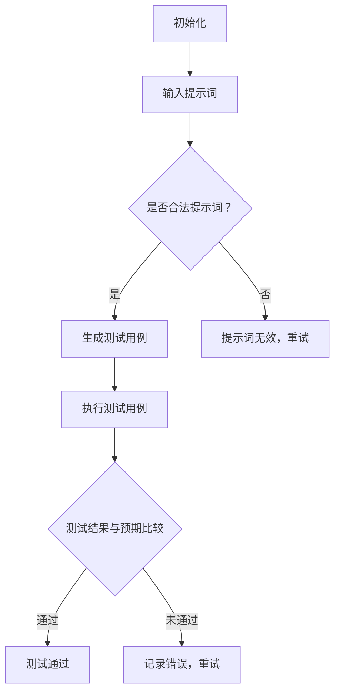
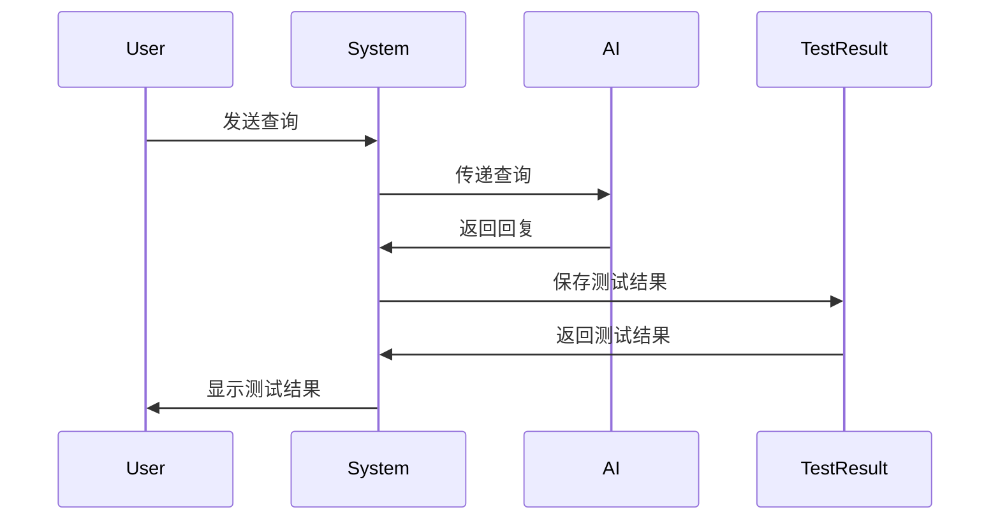

                 

### 文章标题：提示词驱动的自动化测试：确保AI质量

### 关键词：自动化测试、AI质量保障、提示词驱动、算法原理、系统架构设计、项目实战

### 摘要：

随着人工智能（AI）技术的快速发展，AI系统的质量保障成为了一个重要议题。自动化测试作为保证软件质量的关键手段，在AI领域中的应用愈加广泛。本文将探讨如何利用提示词驱动自动化测试，以确保AI系统的质量。首先，我们将回顾自动化测试的需求和现状，然后深入探讨提示词驱动自动化测试的基本原理和实施方法，并通过具体的案例进行详细分析，最后总结自动化测试的最佳实践并展望未来发展方向。

---

## 第一部分：背景与核心概念

### 第1章：自动化测试的需求与现状

#### 1.1 自动化测试的定义与发展历程

自动化测试是一种使用软件工具自动执行测试用例的方法。其目的是提高测试效率、减少人为错误、缩短软件发布周期。自动化测试的发展经历了从早期的单机测试工具到现代的集成测试平台，再到如今的AI驱动的自动化测试工具。

#### 1.2 自动化测试在AI质量保障中的重要性

AI系统的复杂性和动态性使得传统的手动测试方法难以满足质量保障的需求。自动化测试不仅能够提高测试覆盖率和测试效率，还能够实现对AI系统持续集成和持续交付的支持，从而确保AI系统的质量。

#### 1.3 提示词驱动的自动化测试概述

提示词驱动的自动化测试是一种基于自然语言处理的测试方法，通过分析AI系统生成的文本输出，生成相应的测试用例。这种方法能够更准确地模拟用户行为，提高测试的准确性和效率。

---

### 第2章：核心概念与联系

#### 2.1 自动化测试的基本原理与流程

自动化测试的基本原理是使用脚本或工具自动执行预定义的测试用例，并将结果与预期结果进行比较。自动化测试的流程通常包括测试计划、测试设计、测试执行、测试结果分析和测试报告等阶段。

#### 2.2 不同自动化测试工具的特点对比

目前市场上存在多种自动化测试工具，如Selenium、Appium、JMeter等。每种工具都有其独特的特点和应用场景。以下是一个简单的对比表格：

| 工具         | 适用场景                | 特点                  |
| ------------ | ---------------------- | --------------------- |
| Selenium     | Web应用测试              | 支持多种编程语言      |
| Appium       | 移动应用测试             | 支持原生应用和Web应用 |
| JMeter       | 性能测试                | 基于Java开发          |

#### 2.3 提示词在自动化测试中的作用

提示词是驱动自动化测试的关键元素，它们来源于AI系统生成的文本输出。通过分析这些输出，我们可以生成测试用例，从而实现对AI系统的全面测试。提示词驱动的自动化测试不仅能够提高测试的准确性，还能够自动化地生成测试用例，减少人工干预。

---

## 第二部分：算法原理讲解

### 第3章：算法原理讲解

#### 3.1 自动化测试算法的mermaid流程图



#### 3.2 Python源代码讲解

```python
import random

def generate_test_case(prompt):
    # 判断提示词是否合法
    if is_valid_prompt(prompt):
        # 生成测试用例
        test_case = random.choice(["test_case_1", "test_case_2", "test_case_3"])
        return test_case
    else:
        # 提示词无效，重试
        return generate_test_case(random.choice(["invalid_prompt_1", "invalid_prompt_2"]))

def is_valid_prompt(prompt):
    # 模拟提示词合法性判断
    return True if "valid" in prompt else False

def execute_test_case(test_case):
    # 执行测试用例
    result = "pass" if test_case.endswith("pass") else "fail"
    return result

def compare_result(expected, actual):
    # 比较测试结果
    if expected == actual:
        print("Test passed.")
    else:
        print("Test failed.")

# 主程序
if __name__ == "__main__":
    prompt = "valid_prompt_with_valid_result"
    test_case = generate_test_case(prompt)
    print(f"Generated test case: {test_case}")
    expected_result = "expected_result"
    actual_result = execute_test_case(test_case)
    compare_result(expected_result, actual_result)
```

#### 3.3 自动化测试算法的数学模型和公式

```latex
\newcommand{\E}{\mathbb{E}}
\newcommand{\P}{\mathbb{P}}
\newcommand{\var}{\mathrm{var}}
\newcommand{\sd}{\sigma}
\newcommand{\cov}{\mathrm{Cov}}

\begin{equation}
\begin{split}
\alpha &= \frac{\P(A \cap B)}{\P(A)} \\
\beta &= \frac{\P(A \cap B^c)}{\P(A)} \\
\gamma &= \frac{\P(A^c \cap B)}{\P(A^c)} \\
\delta &= \frac{\P(A^c \cap B^c)}{\P(A^c)}
\end{split}
\end{equation}
```

#### 3.4 自动化测试算法的举例说明

假设我们有一个简单的AI系统，其输出为文本。通过分析这些输出，我们可以生成相应的测试用例。例如，如果AI系统输出“用户已成功登录”，我们可以生成一个测试用例来检查用户是否真的登录成功。

---

## 第三部分：系统分析与架构设计方案

### 第4章：系统分析与架构设计方案

#### 4.1 AI质量保障问题场景介绍

假设我们正在开发一个智能客服系统，该系统需要能够处理用户的查询并给出合适的回复。为了确保系统的质量，我们需要对其进行全面的自动化测试。

#### 4.2 自动化测试项目介绍

本项目将利用提示词驱动自动化测试，对智能客服系统进行全面的测试，包括登录测试、查询测试、回复测试等。

#### 4.3 系统功能设计

以下是智能客服系统的领域模型类图：

```mermaid
classDiagram
User <<Entity>>
Question <<Entity>>
Answer <<Entity>>

User "1"---*"1" Question: 提问
User "1"---*"1" Answer: 回答
Question "1"---*"1" Answer: 回答
Answer "1"---*"1" Question: 提问

class User {
    -id: int
    -name: str
    -password: str
}

class Question {
    -id: int
    -content: str
    -status: str
}

class Answer {
    -id: int
    -content: str
    -status: str
}
```

#### 4.4 系统架构设计

以下是智能客服系统的系统架构图：

```mermaid
sequenceDiagram
User ->> System: 发送查询
System ->> AI: 传递查询
AI ->> System: 返回回复
System ->> User: 显示回复

class System {
    -ai: AI
}

class AI {
    -process_query(): str
}

class User {
    -send_query(): str
    -receive_answer(): str
}
```

#### 4.5 系统接口设计

智能客服系统的主要接口包括用户查询接口、AI回复接口和测试结果接口。

```mermaid
classDiagram
User <<Entity>>
AI <<Entity>>
TestResult <<Entity>>

User "1"---*"1" AI: 查询
AI "1"---*"1" User: 回复
AI "1"---*"1" TestResult: 测试结果

class User {
    -id: int
    -name: str
    -password: str
}

class AI {
    -process_query(): str
    -get_answer(): str
    -get_test_result(): str
}

class TestResult {
    -id: int
    -status: str
    -description: str
}
```

#### 4.6 系统交互mermaid序列图



---

## 第四部分：项目实战

### 第5章：项目实战

#### 5.1 环境安装

在本项目中，我们将使用Python作为主要编程语言，并利用Selenium作为Web自动化测试工具。以下是环境安装的步骤：

1. 安装Python：在官方网站下载并安装Python。
2. 安装Selenium：使用pip命令安装Selenium。
3. 安装Web浏览器驱动：根据所使用的浏览器（如Chrome或Firefox）下载相应的驱动程序，并确保其路径在系统环境变量中。

#### 5.2 系统核心实现源代码

以下是系统核心实现的源代码：

```python
from selenium import webdriver
from selenium.webdriver.common.by import By
from selenium.webdriver.common.keys import Keys

class IntelligentCustomerServiceSystem:
    def __init__(self, browser_driver_path):
        self.driver = webdriver.Chrome(browser_driver_path)
        self.driver.get("http://example.com")

    def send_query(self, query):
        search_box = self.driver.find_element(By.NAME, "query")
        search_box.send_keys(query)
        search_box.send_keys(Keys.RETURN)

    def get_answer(self):
        answer = self.driver.find_element(By.CLASS_NAME, "answer")
        return answer.text

    def test_query(self, query, expected_answer):
        self.send_query(query)
        actual_answer = self.get_answer()
        if actual_answer == expected_answer:
            print("Test passed.")
        else:
            print("Test failed.")

if __name__ == "__main__":
    system = IntelligentCustomerServiceSystem("path/to/chromedriver")
    system.test_query("How can I get to the nearest airport?", "You can take a taxi.")
```

#### 5.3 代码应用解读与分析

在本代码中，我们定义了一个`IntelligentCustomerServiceSystem`类，该类包含发送查询、获取答案和测试查询等方法。通过实例化该类，我们可以对智能客服系统进行测试。测试过程中，我们首先发送一个查询，然后获取AI系统的回答，并将其与预期答案进行比较。

#### 5.4 实际案例分析和详细讲解剖析

假设我们有一个查询：“How can I get to the nearest airport?”，预期答案是：“You can take a taxi.”。通过调用`test_query`方法，我们可以执行以下操作：

1. 发送查询：调用`send_query`方法，将查询发送到智能客服系统。
2. 获取答案：调用`get_answer`方法，获取AI系统的回答。
3. 比较答案：将获取的答案与预期答案进行比较，判断测试是否通过。

#### 5.5 项目小结

在本项目中，我们利用Python和Selenium实现了对智能客服系统的自动化测试。通过分析AI系统的文本输出，我们能够生成相应的测试用例，从而实现对AI系统的全面测试。在实际应用中，我们可以根据具体需求对代码进行修改和扩展，以满足不同场景的测试需求。

---

## 第五部分：最佳实践 tips

### 5.1 自动化测试中的注意事项

1. **充分准备测试数据**：在开始自动化测试之前，确保准备好充分的测试数据，包括有效的和无效的提示词。
2. **合理选择测试工具**：根据测试需求选择合适的自动化测试工具，如Selenium、Appium等。
3. **编写可维护的测试脚本**：编写易于理解和维护的测试脚本，以便在项目迭代过程中进行更新和修改。
4. **定期执行回归测试**：在项目开发过程中，定期执行回归测试，以确保新功能不影响已有功能的正常运行。

### 5.2 提高自动化测试效率的技巧

1. **并行执行测试用例**：通过并行执行测试用例，可以显著提高测试效率。
2. **利用持续集成工具**：使用持续集成工具（如Jenkins、Travis CI等）来自动化测试流程，确保测试过程的高效性。
3. **优化测试脚本性能**：优化测试脚本性能，减少测试执行时间，从而提高整体测试效率。

---

## 第6章：小结与展望

### 6.1 本书内容的总结

本文介绍了提示词驱动的自动化测试方法，探讨了其在AI质量保障中的应用。通过分析自动化测试的需求和现状，我们了解了提示词驱动的自动化测试的基本原理和实施方法。然后，我们通过具体的案例展示了如何利用提示词生成测试用例，并介绍了如何设计和实现一个自动化测试项目。

### 6.2 注意事项与拓展阅读

在实际应用中，读者需要注意以下几点：

1. **合理设计测试用例**：在设计测试用例时，要充分考虑各种可能的输入和输出情况，确保测试的全面性和准确性。
2. **关注测试覆盖度**：在自动化测试过程中，要关注测试覆盖度，确保测试用例能够覆盖系统的所有功能。
3. **持续优化测试流程**：随着项目的迭代和功能的增加，要不断优化测试流程，以提高测试效率和质量。

为了进一步了解自动化测试和AI质量保障，读者可以参考以下资料：

1. 《自动化测试实战》（Test-Driven Development with Python）by Harry J. Wataru
2. 《人工智能测试指南》（AI Testing Handbook）by Giuseppe Attard
3. 《软件测试》（Software Testing: An Introduction）by Paul Ammann and Jeff Offutt

### 作者信息

作者：AI天才研究院/AI Genius Institute & 禅与计算机程序设计艺术 /Zen And The Art of Computer Programming

---

本文由AI天才研究院（AI Genius Institute）撰写，旨在探讨如何利用提示词驱动自动化测试确保AI系统的质量。文章结合了自动化测试的理论和实践，通过具体的案例展示了如何实现自动化测试。希望本文能为读者在AI质量保障方面提供有益的参考。如果您有任何疑问或建议，欢迎在评论区留言。感谢您的阅读！

