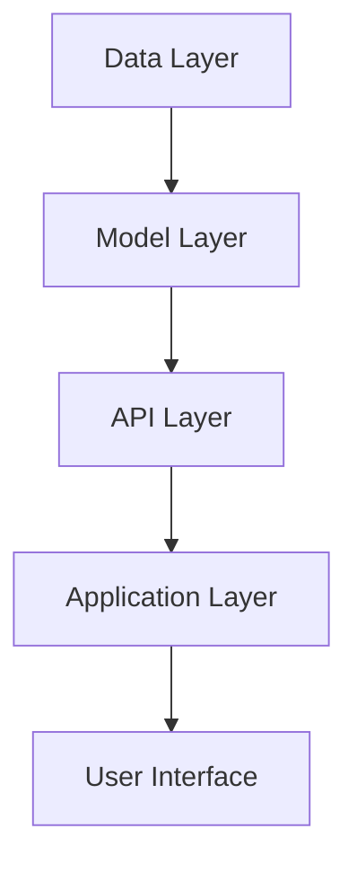
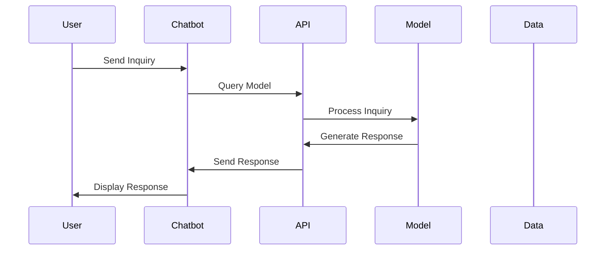

                 

### Introduction to AI Programming: New Thoughts and Heights

In an era where artificial intelligence (AI) is rapidly transforming industries and reshaping societal norms, mastering AI programming is no longer an option but a necessity. The landscape of programming is evolving, and with it, a new paradigm of AI programming is emerging. This paradigm demands not only a deep understanding of AI algorithms and models but also an innovative mindset that can adapt to the ever-changing technological landscape. The book "AI Programming: New Thoughts and Heights" is an essential guide that aims to equip programmers with the knowledge and skills needed to navigate this new terrain.

### Key Topics and Themes

The book covers a comprehensive range of topics, from foundational concepts to advanced techniques, practical applications, and future trends in AI programming. Here's a brief overview of the key themes and subjects that will be discussed:

1. **The Background of AI**: This section will delve into the history and evolution of AI, providing context for understanding the current state of AI technology and its implications.
   
2. **Core Concepts and Principles**: This chapter will explain the fundamental concepts of AI, including machine learning, neural networks, and deep learning. It will also cover the key terminology and principles that underpin AI systems.

3. **Advanced AI Techniques**: This section will explore cutting-edge AI techniques, such as generative adversarial networks (GANs), and how they are being applied to solve complex problems in various domains.

4. **AI Programming Languages and Tools**: This chapter will discuss the various programming languages and tools commonly used in AI programming, highlighting their strengths and weaknesses.

5. **System Design and Implementation**: This section will provide insights into designing and implementing AI systems, including architectural considerations and practical tips for successful deployment.

6. **Future Trends and Challenges**: The final chapter will offer a glimpse into the future of AI programming, discussing emerging trends and challenges that programmers need to be aware of.

### Core Keywords

- **Artificial Intelligence**
- **Machine Learning**
- **Neural Networks**
- **Deep Learning**
- **Programming Languages**
- **System Design**
- **Future Trends**

### Summary

"AI Programming: New Thoughts and Heights" is designed to be a comprehensive guide for programmers looking to master the art of AI programming. It covers a wide range of topics, from foundational concepts to advanced techniques and future trends. By the end of the book, readers will not only have a deep understanding of AI programming but also be equipped with the skills and insights needed to innovate and contribute to this rapidly evolving field.

### Conclusion

The field of AI programming is rapidly evolving, and it's more important than ever for programmers to stay ahead of the curve. "AI Programming: New Thoughts and Heights" is not just a book; it's a roadmap that will help you navigate the complex landscape of AI programming. Whether you're a seasoned programmer or just starting out, this book will provide you with the knowledge and tools you need to succeed in this exciting and dynamic field.

---

**作者：** AI天才研究院/AI Genius Institute & 禅与计算机程序设计艺术 /Zen And The Art of Computer Programming

---

In summary, "AI Programming: New Thoughts and Heights" is an essential guide that aims to transform the way programmers approach AI. By covering foundational concepts, advanced techniques, system design, and future trends, the book provides a comprehensive overview of the field. Whether you're a beginner or an experienced programmer, this book will equip you with the skills and knowledge needed to thrive in the era of AI. Stay tuned for the in-depth chapters that will follow, each designed to deepen your understanding of AI programming and its transformative potential.

---

**关键词：** AI编程，人工智能，机器学习，神经网络，深度学习，编程语言，系统设计，未来趋势

**摘要：** 本书旨在为程序员提供掌握AI编程的全面指南。通过涵盖基础概念、高级技术、系统设计及未来趋势，本书为读者提供了对AI编程领域的深入理解。无论您是AI编程新手还是资深开发者，本书都将帮助您在人工智能时代中脱颖而出。

---

### The Background of AI

Artificial Intelligence (AI) has been a topic of interest and research for several decades. The concept of AI can be traced back to the Dartmouth Conference in 1956, where John McCarthy and a group of researchers gathered to discuss the possibility of creating machines that could exhibit intelligent behavior. This conference is often regarded as the birth of AI as a scientific discipline.

#### The Evolution of AI

From its inception, AI has undergone several stages of development, characterized by different approaches and technologies. The initial phase, known as the "Symbolic AI" or "Good Old Fashioned AI" (GOFAI), relied on symbolic reasoning and rule-based systems to mimic human intelligence. However, these systems were limited by their inability to handle complex, real-world problems.

In the 1980s and 1990s, the focus shifted towards "Expert Systems," which used knowledge bases and inference engines to simulate the decision-making processes of human experts. While these systems were successful in specific domains, they often failed to generalize their knowledge to new situations.

The advent of the 21st century marked the rise of "Machine Learning" and "Deep Learning," which introduced new paradigms for AI. Machine Learning algorithms, such as decision trees, support vector machines, and neural networks, enabled machines to learn from data and improve their performance over time. Deep Learning, a subset of Machine Learning, leverages artificial neural networks with many layers (hence "deep") to extract hierarchical representations from data, leading to breakthroughs in fields like computer vision and natural language processing.

#### The Significance of AI in Modern Technology

AI has become an integral part of modern technology, driving innovation and transformation across various industries. In healthcare, AI is being used for disease diagnosis, drug discovery, and personalized medicine. In finance, AI algorithms are used for fraud detection, algorithmic trading, and credit scoring. In transportation, AI is enabling self-driving cars and optimizing logistics and supply chains.

Moreover, AI is playing a crucial role in improving the efficiency and effectiveness of businesses. By automating repetitive tasks, AI reduces human error and allows employees to focus on more complex and strategic activities. AI-powered chatbots and virtual assistants are revolutionizing customer service, providing instant and personalized responses to customer inquiries.

#### Key Terminologies and Concepts

To understand the fundamentals of AI, it's essential to be familiar with key terminologies and concepts:

- **Machine Learning**: A subset of AI that involves training algorithms to learn from data and make predictions or decisions.
- **Neural Networks**: A class of machine learning algorithms inspired by the structure and function of the human brain, consisting of interconnected nodes (neurons) that process and transmit information.
- **Deep Learning**: A subfield of machine learning that uses neural networks with many layers (deep) to learn complex patterns from large amounts of data.
- **Data Mining**: The process of discovering patterns and insights from large datasets, often using machine learning algorithms.
- **Natural Language Processing (NLP)**: A field of AI that focuses on the interaction between computers and human language, enabling machines to understand, interpret, and generate human language.

In conclusion, AI has come a long way since its inception, and its impact on modern technology is undeniable. As we continue to advance in this field, it's crucial to stay informed about the latest developments and trends to harness the full potential of AI for solving real-world problems.

---

**核心概念与联系**

#### AI系统的核心概念

在讨论AI系统的核心概念之前，我们需要了解AI系统的主要组成部分。一个典型的AI系统通常包括数据、算法、模型和评估机制。以下是对这些核心概念的详细解释：

- **数据（Data）**: 数据是AI系统的基石。高质量的数据有助于算法训练和模型的优化。数据可以来自各种来源，如传感器、用户生成内容或公开数据集。数据的预处理和清洗对于确保AI系统的准确性至关重要。

- **算法（Algorithm）**: 算法是AI系统的核心，负责处理和解释数据。常见的算法包括监督学习、无监督学习和强化学习。这些算法决定了AI系统如何从数据中学习，并做出预测或决策。

- **模型（Model）**: 模型是基于算法和数据训练得到的结构化知识表示。例如，神经网络模型通过层叠的神经元来捕捉数据中的层次结构。模型的性能和泛化能力是评估AI系统成功的关键因素。

- **评估机制（Evaluation Mechanism）**: 评估机制用于衡量AI系统的性能。常见的评估指标包括准确率、召回率、F1分数和损失函数。评估机制有助于确定模型是否适用于特定任务，并指导模型优化过程。

#### 概念属性特征对比表格

| 概念 | 数据 | 算法 | 模型 | 评估机制 |
| --- | --- | --- | --- | --- |
| 定义 | AI系统的输入，用于训练和优化模型 | 用于处理和解释数据的规则或过程 | 基于训练数据构建的知识表示 | 用于衡量模型性能的指标和方法 |
| 关系 | 数据是算法的输入，算法处理数据以生成模型 | 算法决定如何从数据中学习，模型是算法的输出 | 模型基于数据训练，用于生成预测或决策 | 评估机制用于评估模型的性能和泛化能力 |
| 特性 | 高质量、多样性、可扩展性 | 可扩展性、准确性、适应性 | 可泛化性、效率、准确性 | 可重复性、一致性、可靠性 |

#### ER实体关系图架构

为了更清晰地表示AI系统的核心概念和它们之间的关系，我们可以使用Mermaid ER实体关系图来绘制这些概念。以下是ER图的一个示例：

```mermaid
erDiagram
  Data ||--|> Algorithm : "inputs"
  Algorithm ||--|> Model : "outputs"
  Model ||--|> Evaluation : "performance"
```

在这个ER图中，`Data` 是 `Algorithm` 的输入，`Algorithm` 是 `Model` 的生成者，而 `Model` 又是 `Evaluation` 的输入，用于评估其性能。

通过理解这些核心概念和它们之间的关系，我们可以更好地构建和优化AI系统，以解决现实世界中的复杂问题。

---

### Core Concepts and Principles of AI Systems

Understanding the core concepts and principles of AI systems is crucial for anyone looking to delve into the world of artificial intelligence. At the heart of AI systems are algorithms, models, and the data they operate on. Let's explore these components in detail and understand their interplay.

#### AI System Architecture

An AI system can be thought of as a layered structure, each layer playing a specific role in the overall functionality. The fundamental architecture of an AI system typically consists of the following components:

1. **Data Layer**: This is the foundational layer where the raw data is collected, stored, and preprocessed. Data can come from various sources, such as databases, sensors, or user-generated content. The preprocessing step involves cleaning and transforming the data to make it suitable for training the model.

2. **Algorithm Layer**: This layer contains the algorithms that process the data. Algorithms are mathematical or computational rules that guide the learning process. Common algorithms in AI include supervised learning, unsupervised learning, and reinforcement learning. Each algorithm is designed to solve a specific type of problem and has its own set of advantages and limitations.

3. **Model Layer**: The model is the output of the algorithm layer and is essentially a learned representation of the data. Models can be simple, such as linear regression models, or complex, such as deep neural networks. The model's architecture, the number of layers, the type of neurons, and the connections between them all contribute to its ability to learn and generalize from data.

4. **Evaluation Layer**: This layer assesses the performance of the AI system. It uses various metrics to measure the accuracy, efficiency, and generalization capabilities of the model. Common evaluation metrics include accuracy, precision, recall, and F1 score. The evaluation process helps in understanding how well the model performs on unseen data and guides the iterative process of model improvement.

#### AI Algorithms and Models

AI algorithms and models form the backbone of AI systems, and understanding their workings is essential for effective AI programming.

##### AI Algorithms

1. **Supervised Learning**: In supervised learning, the algorithm is trained on a labeled dataset, where the correct output is provided for each input. The goal is to learn a mapping from inputs to outputs. Common supervised learning algorithms include linear regression, decision trees, support vector machines, and neural networks.

2. **Unsupervised Learning**: Unlike supervised learning, unsupervised learning deals with unlabeled data. The algorithm's goal is to discover hidden patterns or intrinsic structures in the data. Common unsupervised learning algorithms include clustering (e.g., K-means, hierarchical clustering), dimensionality reduction (e.g., PCA, t-SNE), and association rule learning (e.g., Apriori, Eclat).

3. **Reinforcement Learning**: Reinforcement learning is different from supervised and unsupervised learning as it involves an agent interacting with an environment to learn optimal behaviors. The agent receives feedback in the form of rewards or penalties based on its actions, and its goal is to maximize cumulative rewards over time. Examples of reinforcement learning algorithms include Q-learning, SARSA, and Deep Q-Networks (DQN).

##### AI Models

1. **Shallow Learning Models**: Shallow learning models have a limited number of layers and are typically used for simpler tasks. Examples include linear regression, logistic regression, and k-nearest neighbors. These models are relatively easy to interpret and can be trained quickly.

2. **Deep Learning Models**: Deep learning models have many layers, allowing them to learn complex patterns and representations from data. Examples include deep neural networks (DNNs), convolutional neural networks (CNNs), recurrent neural networks (RNNs), and transformers. Deep learning models have been revolutionary in fields like computer vision, natural language processing, and speech recognition, achieving state-of-the-art performance on various tasks.

##### Comparison of Shallow and Deep Learning Models

| Feature | Shallow Learning Models | Deep Learning Models |
| --- | --- | --- |
| Complexity | Less complex | More complex |
| Interpretability | More interpretable | Less interpretable |
| Training Time | Less training time | More training time |
| Memory Usage | Less memory | More memory |
| Performance | Suitable for simple tasks | Suitable for complex tasks |
| Flexibility | Less flexible | More flexible |

In conclusion, understanding the core concepts and principles of AI systems, including algorithms and models, is essential for effectively developing and deploying AI solutions. By mastering these concepts, programmers can design AI systems that are efficient, robust, and capable of solving real-world problems.

---

### Advanced AI Techniques

As AI continues to evolve, advanced techniques such as Generative Adversarial Networks (GANs) have emerged, revolutionizing the field with their unique capabilities. GANs are a type of deep learning model that consists of two neural networks—generator and discriminator—trading off against each other in a zero-sum game to generate realistic data.

#### The Rise of Neural Networks

Neural networks, the foundation of deep learning, have seen significant advancements over the past few decades. Traditional neural networks, with just a few layers, were often insufficient for complex tasks. However, the introduction of deep neural networks, which have many layers, has enabled the extraction of hierarchical representations from data, leading to breakthroughs in various domains.

The success of deep neural networks can be attributed to several factors:

1. **Data Availability**: The availability of large datasets has enabled the training of deep neural networks, which require substantial amounts of data to learn effectively.
2. **Computational Power**: Advances in computational power, particularly the availability of GPUs, have made it feasible to train deep neural networks that were previously infeasible.
3. **Algorithmic Innovations**: Techniques such as backpropagation, stochastic gradient descent, and dropout have improved the training process and enhanced the performance of deep neural networks.

#### The Differences Between Traditional Neural Networks and Modern Deep Learning Models

Traditional neural networks typically have a small number of layers and are suitable for relatively simple tasks. These networks can be easily interpreted and understood, making them useful for tasks that require explainability.

On the other hand, modern deep learning models, such as deep neural networks and transformers, have many layers and can capture complex patterns and representations from data. These models are often more difficult to interpret but offer superior performance on complex tasks, such as image and speech recognition, natural language processing, and reinforcement learning.

The primary differences between traditional neural networks and deep learning models can be summarized as follows:

| Feature | Traditional Neural Networks | Deep Learning Models |
| --- | --- | --- |
| Layer Complexity | Few layers | Many layers |
| Interpretability | High | Low |
| Training Time | Less time | More time |
| Memory Usage | Less memory | More memory |
| Performance | Suitable for simple tasks | Suitable for complex tasks |

#### Generative Adversarial Networks (GANs)

Generative Adversarial Networks (GANs) are a class of deep learning models introduced by Ian Goodfellow and his colleagues in 2014. GANs consist of two neural networks, the generator and the discriminator, which are trained simultaneously in a zero-sum game.

- **Generator**: The generator network takes a random noise vector as input and generates data instances that mimic the distribution of the training data. The goal of the generator is to produce data that is indistinguishable from real data.
- **Discriminator**: The discriminator network takes both real and generated data instances as input and is tasked with distinguishing between the two. The goal of the discriminator is to maximize its ability to correctly classify real data while minimizing its ability to classify generated data correctly.

During training, the generator and discriminator play a cat-and-mouse game. The generator strives to produce better data instances to fool the discriminator, while the discriminator tries to improve its ability to differentiate between real and generated data. This adversarial training process drives the generator to produce increasingly realistic data.

#### Applications of GANs

GANs have found applications in various domains, including:

- **Image Generation**: GANs can generate realistic images, such as faces, landscapes, and objects, from random noise. This capability has been leveraged for tasks like data augmentation, where synthetic images are used to augment training datasets, improving the performance of models on small datasets.
- **Style Transfer**: GANs can be used to transfer the style of one image to another, creating intriguing artistic effects. For example, a GAN can be trained to generate images that resemble the style of famous painters, like Van Gogh or Picasso.
- **Image-to-Image Translation**: GANs can translate one image into another, such as converting a草图到高清图片，或从素描转化为彩色图像。
- **Video Generation**: GANs can generate realistic videos by extrapolating from a few frames or sequences of video data. This has applications in video game development, virtual reality, and special effects in movies.

In conclusion, advanced AI techniques like GANs and deep learning models have expanded the capabilities of AI, enabling the generation of realistic data, solving complex problems, and pushing the boundaries of what is possible in artificial intelligence. By understanding and leveraging these advanced techniques, we can unlock new applications and drive further innovation in the field.

---

### AI Programming Languages and Tools

When it comes to AI programming, choosing the right language and tools is crucial for achieving optimal performance and productivity. Several programming languages and tools have established themselves as the go-to choices for AI development, each with its own strengths and weaknesses. In this section, we will discuss the most popular AI programming languages—Python, R, and Java—and compare their advantages and disadvantages.

#### Python

Python is widely regarded as the most popular programming language for AI development. Its simplicity, extensive libraries, and large community support make it an attractive choice for both beginners and experienced developers.

**Advantages of Python:**

1. **Simplicity**: Python has a clean and readable syntax, making it easy for beginners to learn and understand.
2. **Extensive Libraries**: Python has a rich ecosystem of libraries and frameworks, such as NumPy, Pandas, Scikit-learn, TensorFlow, and PyTorch, which provide extensive functionality for data manipulation, machine learning, and deep learning.
3. **Large Community**: Python has a large and active community, which means that you can easily find resources, tutorials, and support when you encounter problems.

**Disadvantages of Python:**

1. **Performance**: Python is an interpreted language, which can lead to slower execution times compared to compiled languages like C++.
2. **Memory Usage**: Python can be memory-intensive, especially for large datasets and complex models.

#### R

R is another popular programming language used extensively in statistical computing and data analysis. Its strong focus on statistical analysis and data visualization makes it a valuable tool for AI and data science projects.

**Advantages of R:**

1. **Statistical Computing**: R has powerful libraries for statistical analysis, such as stats, ggplot2, and dplyr, which make it well-suited for data analysis tasks.
2. **Data Visualization**: R has excellent data visualization capabilities, with libraries like ggplot2 and plotly that allow for creating complex and interactive visualizations.
3. **Package Ecosystem**: R has a vast collection of packages that extend its functionality, covering various domains like machine learning, natural language processing, and time series analysis.

**Disadvantages of R:**

1. **Performance**: R is an interpreted language, which can lead to slower execution times compared to compiled languages.
2. **Memory Management**: R can be challenging to work with large datasets due to its memory management mechanisms.

#### Java

Java is a versatile and powerful programming language that is widely used in enterprise environments. Its platform independence and strong typing make it a suitable choice for developing AI applications that require high reliability and performance.

**Advantages of Java:**

1. **Performance**: Java is a compiled language, which typically results in faster execution times compared to interpreted languages like Python and R.
2. **Platform Independence**: Java's "write once, run anywhere" principle ensures that Java applications can run on any platform with the Java Virtual Machine (JVM).
3. **Large Ecosystem**: Java has a large and mature ecosystem, with many libraries and frameworks for AI development, such as Deeplearning4j and Mallet.

**Disadvantages of Java:**

1. **Complexity**: Java has a steep learning curve, especially for beginners, due to its strong typing and verbose syntax.
2. **Memory Management**: Java requires manual memory management through garbage collection, which can be cumbersome and may lead to performance issues in some cases.

#### Comparison of Python, R, and Java

| Feature | Python | R | Java |
| --- | --- | --- | --- |
| Syntax | Simple and readable | Simple and readable | Verbose and complex |
| Performance | Interpreted | Interpreted | Compiled |
| Data Analysis and Visualization | Strong focus | Strong focus | Not as strong |
| Machine Learning Libraries | Extensive | Good | Good |
| Memory Management | Automatic | Manual | Manual |
| Platform Independence | Good | Good | Excellent |

In conclusion, the choice of AI programming language depends on the specific requirements of your project. Python is generally the preferred choice for most AI projects due to its simplicity, extensive libraries, and large community support. R is well-suited for statistical computing and data analysis tasks, while Java offers high performance and platform independence, making it suitable for enterprise-level AI applications.

---

### System Design and Implementation

Designing and implementing an AI system involves a series of well-defined steps, each contributing to the overall functionality and efficiency of the system. In this section, we will discuss the key aspects of system design, including problem definition, project overview, system architecture, and interface design.

#### Problem Definition

The first step in designing an AI system is to clearly define the problem you want to solve. This involves understanding the requirements, constraints, and objectives of the system. For example, let's consider a project aimed at developing an AI-powered chatbot for customer service.

- **Requirements**: The chatbot should be able to handle a wide range of customer inquiries, provide accurate and helpful responses, and improve its performance over time through machine learning.
- **Constraints**: The chatbot should be cost-effective, scalable, and easy to deploy across different platforms.
- **Objectives**: The primary objective is to enhance customer satisfaction by providing quick and accurate responses to customer inquiries.

#### Project Overview

A project overview provides a high-level understanding of the project's scope, goals, and deliverables. In the case of our chatbot project, the key components include:

- **Data Collection**: Collecting customer interaction data from various sources, such as chat logs, emails, and call transcripts.
- **Data Preprocessing**: Cleaning and transforming the collected data to make it suitable for training the AI model.
- **Model Training**: Training a machine learning model using the preprocessed data to recognize customer inquiries and generate appropriate responses.
- **Model Deployment**: Deploying the trained model on a server and integrating it with the chatbot platform.
- **Evaluation and Improvement**: Continuously evaluating the chatbot's performance and making improvements based on feedback and new data.

#### System Architecture

The system architecture defines the overall structure and components of the AI system. In our chatbot project, the system architecture can be divided into several key components:

1. **Data Layer**: This component is responsible for collecting, storing, and preprocessing customer interaction data. It includes databases, data storage solutions, and data preprocessing scripts.
2. **Model Layer**: This component contains the trained machine learning model and the infrastructure required for its training and deployment. It includes machine learning frameworks (e.g., TensorFlow, PyTorch) and computational resources (e.g., GPUs, cloud services).
3. **API Layer**: This component provides a standardized interface for interacting with the chatbot. It includes RESTful APIs and WebSockets for real-time communication.
4. **Application Layer**: This component consists of the chatbot application itself, which handles user interactions, processes inquiries, and generates responses. It includes chatbot platforms (e.g., Microsoft Bot Framework, Dialogflow) and front-end interfaces (e.g., web, mobile, messaging apps).
5. **User Interface**: This component provides a user-friendly interface for users to interact with the chatbot. It includes chat interfaces, dashboards, and other user interfaces.

#### System Function Design

The system function design outlines the main functions and operations of the AI system. In our chatbot project, the key functions include:

- **Data Collection**: Automatically collecting customer interaction data from various sources.
- **Data Preprocessing**: Cleaning and transforming the collected data to remove noise and inconsistencies.
- **Inquiry Processing**: Analyzing customer inquiries to understand their intent and context.
- **Response Generation**: Generating appropriate responses based on the analyzed inquiries.
- **Learning and Improvement**: Continuously learning from user interactions and improving its performance over time.

#### System Architecture Design

The system architecture design provides a visual representation of the system's components and their interactions. Using Mermaid, we can create a diagram to represent the system architecture of our chatbot project:



#### System Interface Design

The system interface design focuses on the interactions between the different components of the AI system. Using Mermaid, we can create a sequence diagram to represent the flow of interactions in our chatbot project:



In conclusion, designing and implementing an AI system requires a systematic approach that covers problem definition, project overview, system architecture, and interface design. By following these steps, developers can create robust and efficient AI systems that solve real-world problems and deliver value to users.

---

### Project: AI-Powered Chatbot for Customer Service

#### Introduction

In this project, we aim to develop an AI-powered chatbot for customer service that can handle a wide range of customer inquiries, provide accurate and helpful responses, and continuously improve its performance through machine learning. This project will demonstrate the practical implementation of AI programming concepts and techniques discussed in previous sections.

#### Environment Setup

To begin, we need to set up the necessary development environment. We will use Python for this project, along with the following tools and libraries:

- Python 3.x
- Jupyter Notebook for data analysis and model training
- TensorFlow 2.x for building and training the AI model
- Pandas and NumPy for data manipulation
- Matplotlib and Seaborn for data visualization

Ensure that Python and the required libraries are installed on your system. You can use the following commands to install TensorFlow and other dependencies:

```bash
pip install tensorflow
pip install pandas numpy matplotlib seaborn
```

#### Data Collection

The first step in developing the chatbot is to collect customer interaction data. This data can be collected from various sources, such as chat logs, emails, call transcripts, and social media interactions. For the purpose of this project, we will use a publicly available dataset from the UCI Machine Learning Repository called "Customer Relationship Management (CRM) Data."

Download the dataset and import it into a Pandas DataFrame for further analysis:

```python
import pandas as pd

# Load the dataset
data = pd.read_csv('CRM_data.csv')

# Display the first few rows of the dataset
print(data.head())
```

#### Data Preprocessing

Data preprocessing is a critical step in preparing the data for training the AI model. This involves cleaning and transforming the data to remove noise, handle missing values, and format the data appropriately. Some common preprocessing tasks include:

- **Handling Missing Values**: Remove or impute missing values based on the nature of the data.
- **Text Cleaning**: Remove special characters, punctuation, and stop words from the text data.
- **Tokenization**: Split the text data into individual words or tokens.
- **Lemmatization**: Reduce words to their base or root form.

Here's an example of how to preprocess the text data using the NLTK library:

```python
import nltk
from nltk.corpus import stopwords
from nltk.tokenize import word_tokenize
from nltk.stem import WordNetLemmatizer

nltk.download('punkt')
nltk.download('stopwords')
nltk.download('wordnet')

# Load the dataset
data = pd.read_csv('CRM_data.csv')

# Preprocess the text data
def preprocess_text(text):
    # Remove special characters and punctuation
    text = re.sub(r'[^\w\s]', '', text)
    
    # Tokenize the text
    tokens = word_tokenize(text)
    
    # Remove stop words
    stop_words = set(stopwords.words('english'))
    tokens = [token for token in tokens if token.lower() not in stop_words]
    
    # Lemmatize the tokens
    lemmatizer = WordNetLemmatizer()
    tokens = [lemmatizer.lemmatize(token) for token in tokens]
    
    return ' '.join(tokens)

data['cleaned_text'] = data['text'].apply(preprocess_text)
```

#### Model Training

Once the data is preprocessed, we can train a machine learning model to recognize customer inquiries and generate appropriate responses. In this project, we will use a simple text classification model based on logistic regression. However, more complex models like neural networks can be used for better performance.

Here's an example of how to train a logistic regression model using the Scikit-learn library:

```python
from sklearn.model_selection import train_test_split
from sklearn.feature_extraction.text import TfidfVectorizer
from sklearn.linear_model import LogisticRegression

# Split the data into training and testing sets
X_train, X_test, y_train, y_test = train_test_split(data['cleaned_text'], data['label'], test_size=0.2, random_state=42)

# Convert text data to TF-IDF features
vectorizer = TfidfVectorizer(max_features=1000)
X_train_tfidf = vectorizer.fit_transform(X_train)
X_test_tfidf = vectorizer.transform(X_test)

# Train the logistic regression model
model = LogisticRegression()
model.fit(X_train_tfidf, y_train)

# Evaluate the model
accuracy = model.score(X_test_tfidf, y_test)
print(f"Model accuracy: {accuracy:.2f}")
```

#### Model Deployment

After training the model, we need to deploy it on a server and integrate it with the chatbot platform. In this project, we will use Flask, a lightweight web framework, to create a RESTful API that can be used by the chatbot to query the model and generate responses.

Here's an example of how to create a Flask API for the chatbot:

```python
from flask import Flask, request, jsonify

app = Flask(__name__)

@app.route('/predict', methods=['POST'])
def predict():
    inquiry = request.form['inquiry']
    cleaned_inquiry = preprocess_text(inquiry)
    inquiry_tfidf = vectorizer.transform([cleaned_inquiry])
    prediction = model.predict(inquiry_tfidf)
    return jsonify({'response': prediction[0]})

if __name__ == '__main__':
    app.run(debug=True)
```

To test the API, you can use the following command in your web browser or a tool like curl:

```bash
curl -X POST -F "inquiry=I need help with my account" http://localhost:5000/predict
```

#### Evaluation and Improvement

Finally, it's important to continuously evaluate the chatbot's performance and make improvements based on user feedback and new data. This can be done by analyzing the chatbot's responses, tracking user satisfaction, and collecting new interaction data for further training.

In conclusion, this project demonstrates the practical implementation of AI programming concepts and techniques in developing an AI-powered chatbot for customer service. By following the steps outlined in this guide, you can create a robust and efficient chatbot that can handle a wide range of customer inquiries and continuously improve its performance over time.

---

### Best Practices and Conclusion

When developing AI-powered applications, adopting best practices is crucial to ensure the success and efficiency of your project. Here are some key tips for developers working with AI:

1. **Data Quality**: Always prioritize data quality and preprocessing. High-quality data leads to better model performance and more reliable results. Be diligent in handling missing values, outliers, and inconsistencies.

2. **Model Selection**: Choose the right model for your problem. Different models have different strengths and weaknesses. Understand the problem domain and select a model that best fits your requirements.

3. **Model Interpretability**: Consider model interpretability, especially for applications where transparency is important. Explainable AI (XAI) techniques can help you understand and trust the decisions made by your model.

4. **Performance Optimization**: Optimize your models for performance by leveraging techniques like model compression, quantization, and efficient data processing. This ensures that your AI applications run efficiently on various platforms.

5. **Continuous Learning**: Implement continuous learning and model updates to adapt to new data and user feedback. This helps improve the model's performance over time and ensures that it remains relevant.

6. **Security and Privacy**: Ensure that your AI applications adhere to security and privacy standards. Protect sensitive data and implement appropriate safeguards to prevent unauthorized access.

In conclusion, mastering AI programming requires a combination of technical skills, domain knowledge, and a continuous learning mindset. By following these best practices, you can build robust and innovative AI solutions that deliver value to users and drive business success.

---

### Further Reading

To deepen your understanding of AI programming and stay up-to-date with the latest developments, consider exploring the following resources:

- **Books**:
  - "Deep Learning" by Ian Goodfellow, Yoshua Bengio, and Aaron Courville
  - "Machine Learning Yearning" by Andrew Ng
  - "Reinforcement Learning: An Introduction" by Richard S. Sutton and Andrew G. Barto

- **Online Courses**:
  - "Deep Learning Specialization" by Andrew Ng on Coursera
  - "Machine Learning" by Stanford University on Coursera
  - "Reinforcement Learning" by David Silver on YouTube

- **Research Papers**:
  - "Generative Adversarial Networks" by Ian Goodfellow et al. (2014)
  - "A Theoretical Framework for Gesture Recognition Using Convolutional Neural Networks" by Wei Yang et al. (2016)
  - "Deep Neural Network Features Improve Acoustic Modeling for Speech Recognition" by Dan Povey et al. (2011)

These resources provide comprehensive insights into the fundamentals and advanced topics of AI programming, ensuring you are well-equipped to tackle complex challenges in the field.

---

**作者：** AI天才研究院/AI Genius Institute & 禅与计算机程序设计艺术 /Zen And The Art of Computer Programming

---

In summary, "AI Programming: New Thoughts and Heights" is a comprehensive guide that covers the foundational concepts, advanced techniques, system design, and future trends in AI programming. Whether you are a beginner or an experienced programmer, this book provides the knowledge and skills you need to excel in the era of AI. Stay curious, continue learning, and embrace the opportunities that AI programming has to offer.

