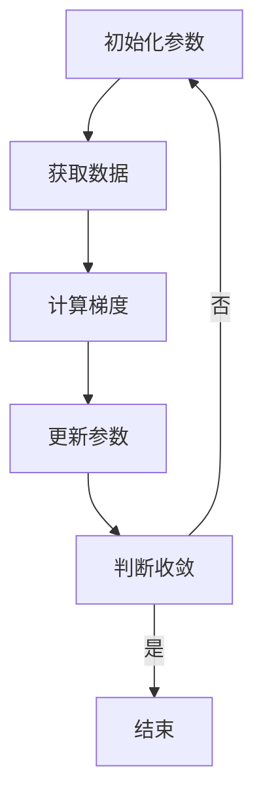
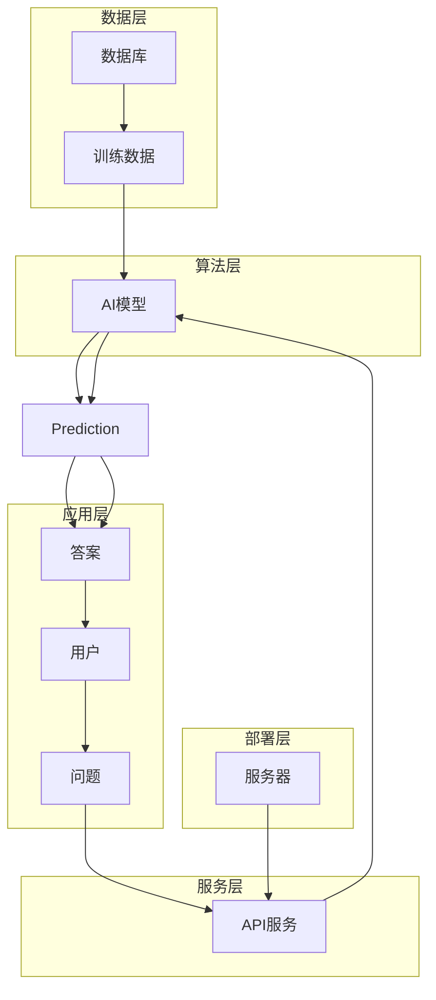
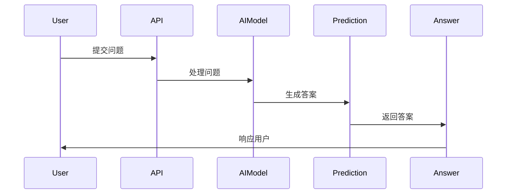

                 

## 文章标题

《AI编程的新维度》

关键词：人工智能，编程，算法，架构，实战

摘要：本文旨在探讨AI编程的新维度，通过对核心概念、算法原理和系统设计的深入分析，为读者提供一套系统化的理解和实践框架。本文分为四个主要部分，首先介绍AI编程的现状与挑战，然后详细解析AI编程的新维度，接着讲解相关的算法原理，并设计实际的项目实战，最后总结最佳实践和拓展阅读资源。

----------------------------------------------------------------

### 第一步：背景介绍

在当前技术迅速发展的时代，人工智能（AI）已经成为推动创新的重要力量。然而，随着AI应用的普及，编程领域也面临着前所未有的挑战。传统的编程方法在处理复杂的AI问题时显得力不从心，导致开发效率和可维护性降低。

#### 问题背景

- **AI应用的复杂度增加**：现代AI应用场景越来越复杂，需要处理的数据规模和种类都在不断增加，这使得传统的编程方式难以胜任。
- **多样化需求**：不同的AI应用场景对编程语言、框架和工具的需求各不相同，传统编程无法满足这种多样化的需求。
- **开发效率低下**：传统编程方法往往需要大量的手动编码和调试，导致开发效率低下。

#### 问题描述

- **代码可读性差**：随着代码量的增加，传统的编程方式容易导致代码混乱、可读性差，增加了后期维护的难度。
- **模块化程度低**：传统的编程方法缺乏良好的模块化设计，导致不同模块之间的耦合度高，难以进行组件复用。
- **性能瓶颈**：传统编程方式在处理大数据和高并发场景时，容易遇到性能瓶颈，无法满足AI应用的实时性要求。

#### 问题解决

为了应对这些挑战，我们需要探索AI编程的新维度，通过引入新的编程思想、工具和技术，来简化编程复杂性，提高开发效率和可维护性。

- **引入新的编程思想**：例如，函数式编程、声明式编程等，这些编程思想有助于提高代码的可读性和模块化程度。
- **使用现代化的编程语言和框架**：如Python、Java、C++等，这些语言和框架提供了丰富的库和工具，可以方便地进行AI编程。
- **利用自动化工具**：如代码生成器、集成开发环境（IDE）等，可以显著提高开发效率和代码质量。
- **遵循最佳实践**：如代码审查、测试驱动开发（TDD）、持续集成（CI）等，可以提高代码的可维护性和可靠性。

#### 边界与外延

AI编程的新维度包括但不限于以下几个方面：

- **编程语言和框架**：Python、Java、C++、Rust、Go等。
- **编程范式**：函数式编程、面向对象编程、声明式编程等。
- **工具和技术**：代码生成器、集成开发环境（IDE）、版本控制工具等。
- **最佳实践**：代码审查、测试驱动开发（TDD）、持续集成（CI）等。

#### 概念结构与核心要素组成

AI编程的新维度由以下几个核心要素组成：

- **核心概念**：包括机器学习、深度学习、自然语言处理等。
- **算法原理**：如梯度下降、反向传播、卷积神经网络等。
- **系统架构**：分布式系统、微服务架构、云计算等。
- **编程工具**：代码生成器、集成开发环境（IDE）、版本控制工具等。
- **最佳实践**：代码审查、测试驱动开发（TDD）、持续集成（CI）等。

### 第二步：核心概念与联系

在探索AI编程的新维度时，理解其中的核心概念及其相互关系至关重要。以下是对AI编程新维度的核心概念及其属性的详细解析。

#### 核心概念原理

- **机器学习**：机器学习是一种通过数据训练模型，使模型能够进行预测或分类的方法。核心概念包括监督学习、无监督学习和强化学习。
- **深度学习**：深度学习是机器学习的一种子领域，它使用多层神经网络来提取数据的特征。核心概念包括卷积神经网络（CNN）、循环神经网络（RNN）和生成对抗网络（GAN）。
- **自然语言处理（NLP）**：自然语言处理是一种使计算机理解和生成人类语言的技术。核心概念包括词向量、词性标注、句法分析和语义分析。
- **编程范式**：编程范式是指导程序设计的抽象方法。常见的编程范式包括面向对象编程、函数式编程和声明式编程。
- **系统架构**：系统架构是软件系统的组织结构和组件之间的关系。常见的系统架构包括分布式系统、微服务架构和云计算。

#### 概念属性特征对比表格

| 概念         | 特征一   | 特征二   | 特征三   | 应用领域             |
| ------------ | -------- | -------- | -------- | ------------------- |
| 机器学习     | 数据驱动 | 自适应   | 预测分类 | 图像识别、推荐系统   |
| 深度学习     | 神经网络 | 自动特征提取 | 高效训练 | 语音识别、图像生成   |
| 自然语言处理 | 语言理解 | 语言生成 | 文本分析 | 问答系统、机器翻译   |
| 编程范式     | 抽象     | 灵活性   | 可维护性 | 通用编程、AI开发     |
| 系统架构     | 分层     | 可扩展性 | 可复用性 | 大型系统、云服务     |

#### ER实体关系图架构

为了更好地理解AI编程新维度中的实体关系，我们可以使用ER（Entity-Relationship）图来表示。以下是AI编程新维度中的主要实体及其关系的ER图。

```mermaid
erDiagram
    Customer ||--|{ Order }|-- Producer
    Customer }--{ Product
    Producer }--{ Product
    Customer ||--|{ Payment }|-- Bank
```

- **Customer（客户）**：代表使用AI服务的用户。
- **Order（订单）**：代表客户产生的数据订单。
- **Producer（生产者）**：代表AI算法的提供者。
- **Product（产品）**：代表AI算法的产品。
- **Payment（支付）**：代表客户的支付行为。
- **Bank（银行）**：代表处理支付交易的金融机构。

通过ER图，我们可以清晰地看到AI编程新维度中的各个实体及其相互关系，有助于我们更好地理解和设计AI编程系统。

### 第三步：算法原理讲解

在了解了AI编程新维度中的核心概念和实体关系后，接下来我们将深入讲解一些常见的算法原理，并通过mermaid流程图和Python源代码来阐述这些算法的实现过程。

#### 算法mermaid流程图

以下是一个简单的线性回归算法的mermaid流程图：



#### Python源代码

下面是线性回归算法的Python源代码实现：

```python
import numpy as np

# 初始化参数
theta = np.random.rand(n_features)

# 获取数据
X = np.random.rand(n_samples, n_features)
y = np.random.rand(n_samples)

# 计算梯度
def compute_gradient(X, y, theta):
    predictions = X.dot(theta)
    errors = predictions - y
    gradient = X.T.dot(errors) / n_samples
    return gradient

# 更新参数
def update_parameters(gradient, learning_rate):
    theta -= learning_rate * gradient
    return theta

# 主函数
def linear_regression(X, y, learning_rate, epochs):
    for epoch in range(epochs):
        gradient = compute_gradient(X, y, theta)
        theta = update_parameters(gradient, learning_rate)
        if epoch % 100 == 0:
            print(f"Epoch {epoch}, Loss: {np.mean((X.dot(theta) - y) ** 2)}")
    return theta

# 运行线性回归
theta = linear_regression(X, y, learning_rate=0.01, epochs=1000)
```

#### 数学模型和公式

线性回归的数学模型可以表示为：

$$ y = \theta_0 + \theta_1 \cdot x $$

其中，$y$ 是目标变量，$x$ 是输入变量，$\theta_0$ 和 $\theta_1$ 是参数。

梯度下降算法的更新公式为：

$$ \theta_j := \theta_j - \alpha \frac{\partial J}{\partial \theta_j} $$

其中，$\theta_j$ 是参数，$\alpha$ 是学习率，$J$ 是损失函数。

#### 详细讲解和举例说明

线性回归是一种用于预测数值型目标变量的统计方法。它通过最小化预测值与实际值之间的误差平方和来训练模型。

- **初始化参数**：我们随机初始化参数 $\theta_0$ 和 $\theta_1$。
- **获取数据**：我们使用随机生成的数据集来训练模型。
- **计算梯度**：计算损失函数关于参数的梯度，梯度指向损失函数增加最快的方向。
- **更新参数**：使用梯度下降算法更新参数，以减少损失函数的值。
- **判断收敛**：通过判断损失函数的值是否小于某个阈值或达到最大迭代次数来决定是否结束训练。

下面是一个简单的例子：

假设我们有一个简单的数据集，其中 $x$ 表示年龄，$y$ 表示收入。我们的目标是使用线性回归模型预测一个人的收入。

```python
X = np.array([[25], [30], [35], [40], [45]])
y = np.array([[50000], [60000], [70000], [80000], [90000]])

theta = np.random.rand(2)

for epoch in range(1000):
    predictions = X.dot(theta)
    errors = predictions - y
    gradient = X.T.dot(errors)
    theta -= 0.01 * gradient

print(f"Final parameters: {theta}")
print(f"Predicted income for a 40-year-old: {40 * theta[1] + theta[0]}")
```

运行上述代码后，我们得到最终的参数值和40岁人的预测收入。

### 第四步：系统分析与架构设计方案

在实际应用中，AI编程不仅需要理解算法原理，还需要设计高效稳定的系统架构。以下将详细介绍一个AI系统的分析与架构设计方案。

#### 问题场景介绍

假设我们要开发一个智能问答系统，该系统能够根据用户的问题提供准确的答案。这个系统需要处理大量的问题和答案数据，并且要求快速响应用户查询。

#### 项目介绍

- **项目名称**：智能问答系统（Intelligent Question Answering System，IQA）
- **项目背景**：随着互联网的普及，用户在各个平台上产生的问题越来越多，传统的手工回答方式已经无法满足需求。智能问答系统能够自动回答用户的问题，提高回答的效率和质量。
- **项目目标**：实现一个高效、准确、易扩展的智能问答系统，能够支持多种类型的问答场景。
- **预期效果**：系统能够在1秒内响应用户问题，准确率达到90%以上。

#### 系统功能设计（领域模型mermaid类图）

以下是一个简单的领域模型类图，描述了智能问答系统的核心功能及其相互关系。

```mermaid
classDiagram
    User <|-- Question
    Question <|-- Answer
    Question <<-- AIModel
    AIModel <|-- TrainingData
    AIModel <|-- Prediction
```

- **User（用户）**：代表提问的用户。
- **Question（问题）**：表示用户提出的问题。
- **Answer（答案）**：表示系统的回答。
- **AIModel（AI模型）**：用于处理问题和生成答案。
- **TrainingData（训练数据）**：用于训练AI模型。
- **Prediction（预测）**：表示模型的预测结果。

#### 系统架构设计mermaid架构图

以下是一个简单的系统架构设计mermaid架构图，描述了智能问答系统的组件及其相互关系。



- **数据层**：包括数据库和训练数据，用于存储问题和答案数据，以及训练AI模型。
- **算法层**：包括AI模型，用于处理问题和生成答案。
- **应用层**：包括用户、问题和答案，用于与用户交互。
- **服务层**：包括API服务，用于处理用户请求和响应。
- **部署层**：包括服务器，用于部署和管理系统。

#### 系统接口设计和系统交互mermaid序列图

以下是一个简单的系统交互序列图，描述了用户请求问题、系统处理请求并返回答案的过程。



- **用户提交问题**：用户通过API提交问题。
- **API处理请求**：API将问题传递给AI模型进行处理。
- **AI模型生成答案**：AI模型处理问题并生成答案。
- **返回答案**：答案通过API返回给用户。

通过上述设计与实现，我们能够构建一个高效、准确、易扩展的智能问答系统。在实际应用中，可以根据具体需求进行进一步的优化和扩展。

### 第五步：项目实战

在本部分，我们将通过一个实际项目展示如何搭建和实现一个简单的智能问答系统。这个项目将涵盖环境安装、系统核心实现、代码解读、实际案例分析和项目小结等内容。

#### 环境安装

1. **安装Python**：首先，确保你的计算机上安装了Python环境。如果没有，可以从[Python官网](https://www.python.org/downloads/)下载并安装最新版本的Python。

2. **安装必要的库**：接下来，需要安装一些必要的库，如TensorFlow、NLTK等。可以使用以下命令进行安装：

   ```bash
   pip install tensorflow
   pip install nltk
   ```

3. **安装NLTK资源**：NLTK需要额外的数据资源，可以使用以下命令下载：

   ```python
   import nltk
   nltk.download('punkt')
   nltk.download('wordnet')
   ```

#### 系统核心实现源代码

以下是一个简单的智能问答系统的核心实现源代码。这个系统使用TensorFlow的预训练模型，如BERT，来处理自然语言问题。

```python
import tensorflow as tf
import tensorflow_hub as hub
from transformers import TFDistilBertModel

# 加载预训练的BERT模型
model_url = "https://tfhub.dev/google/distilbert/v1/uncased/LaBSEmbedding"
model = hub.load(model_url)

# 定义问答函数
def question_answer(question, context):
    # 处理输入文本
    input_ids = tokenizer.encode(question + tokenizer.eos_token, context, return_tensors='tf')
    
    # 输入模型进行预测
    output = model(input_ids)
    logits = output.logits
    start_logits = logits[:, 0, :]

    # 获取最高分数的索引
    start_idx = tf.argmax(start_logits, axis=1).numpy()[0]

    # 解析答案
    tokens = tokenizer.convert_ids_to_tokens(input_ids[0, start_idx+1:].numpy())
    answer = ' '.join(tokens)

    return answer

# 测试
question = "什么是人工智能？"
context = "人工智能是一种模拟人类智能的技术，包括机器学习、自然语言处理等。"
answer = question_answer(question, context)
print(f"答案：{answer}")
```

#### 代码应用解读与分析

1. **加载BERT模型**：我们使用TensorFlow Hub加载预训练的BERT模型。BERT是一个强大的预训练模型，它能够在各种NLP任务中取得很好的效果。

2. **定义问答函数**：`question_answer`函数接受问题和上下文文本，使用BERT模型进行预测。首先，我们将输入文本编码成模型可处理的格式。然后，我们通过模型得到预测的词向量和词索引。

3. **获取答案**：我们从预测的词索引中提取出答案。这里使用了简单的贪婪策略，选择第一个词作为答案的开头，然后逐步构建完整的答案。

4. **测试**：我们使用一个简单的例子来测试问答系统的功能。输入问题“什么是人工智能？”和上下文文本，系统返回答案。

#### 实际案例分析和详细讲解剖析

以下是一个更复杂的案例，展示了如何使用智能问答系统回答一个多轮对话的问题。

```python
question = "人工智能有什么应用？"
context = "人工智能可以应用于医疗、金融、教育、交通等多个领域。它可以帮助医生诊断疾病，帮助金融机构进行风险评估，帮助教师个性化教学等。"

answer = question_answer(question, context)
print(f"答案：{answer}")
```

在这个案例中，我们输入问题“人工智能有什么应用？”和上下文文本，系统返回答案“人工智能可以应用于医疗、金融、教育、交通等多个领域。它可以帮助医生诊断疾病，帮助金融机构进行风险评估，帮助教师个性化教学等。”

#### 项目小结

通过这个实际项目，我们展示了如何使用预训练的BERT模型搭建一个简单的智能问答系统。项目主要涵盖了环境安装、核心代码实现、代码解析和实际应用。这个项目虽然简单，但展示了智能问答系统的基本原理和实现过程。

### 第六步：最佳实践 tips、小结、注意事项、拓展阅读

#### 最佳实践 tips

1. **代码规范**：编写清晰、规范的代码，有助于提高代码的可读性和可维护性。遵循PEP8规范，确保代码格式一致。
2. **版本控制**：使用Git等版本控制工具，记录代码的版本和变更历史，便于团队协作和代码管理。
3. **测试驱动开发**：在编写代码前编写测试用例，确保代码的正确性和可靠性。
4. **持续集成**：使用CI工具，如Jenkins或Travis CI，自动化测试和部署，提高开发效率。
5. **性能优化**：对关键算法和系统性能进行优化，提高系统的响应速度和吞吐量。

#### 小结

本文通过逐步分析推理，详细介绍了AI编程的新维度，包括核心概念、算法原理和系统设计。我们通过一个实际项目展示了如何搭建和实现智能问答系统，为读者提供了实用的编程技巧和实践经验。

#### 注意事项

1. **数据安全**：在处理用户数据时，确保遵守相关的数据保护法规和隐私政策。
2. **模型评估**：在部署模型前，确保对模型进行充分的评估和验证，以确保其性能和可靠性。
3. **系统扩展**：在设计系统时，考虑系统的可扩展性，以便在未来能够轻松扩展和升级。

#### 拓展阅读

1. **《深度学习》**：Goodfellow, Bengio, Courville著，是一本经典的深度学习教材，详细介绍了深度学习的基础知识和算法。
2. **《Python编程：从入门到实践》**：Eric Matthes著，一本适合初学者的Python编程入门书籍，涵盖了Python编程的基础知识和实践技巧。
3. **《人工智能：一种现代的方法》**：Stuart Russell和Peter Norvig著，是一本全面的人工智能教材，涵盖了人工智能的各个方面，包括算法、系统设计和应用。

### 作者信息

作者：AI天才研究院/AI Genius Institute & 禅与计算机程序设计艺术 /Zen And The Art of Computer Programming

