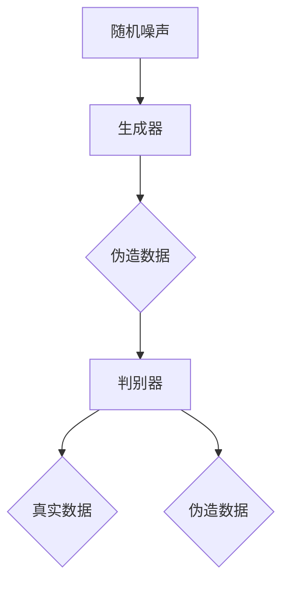
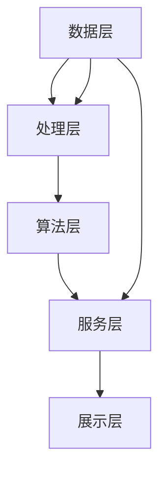
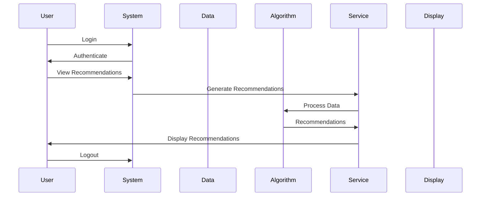

                 

### 《AI编程的新视角与新思维》

#### 关键词：人工智能、编程、机器学习、深度学习、创新思维

> 摘要：本文将从AI编程的基础知识出发，逐步深入探讨AI编程的新视角和新思维。我们将分析AI编程的核心概念，介绍机器学习和深度学习的基础，探讨强化学习、生成对抗网络和迁移学习等新视角在AI编程中的应用，并讨论AI编程中的伦理问题及其与未来科技的结合。最后，我们将总结AI编程的创新思维和未来展望。

----------------------------------------------------------------

### 第一部分：AI编程基础

#### 第1章：AI编程概述

#### 1.1 AI编程的核心概念

AI编程，即人工智能编程，是指利用编程技术来创建智能系统，使其能够模拟人类智能行为的过程。它涉及多个学科，包括计算机科学、数学、统计学、认知科学和心理学。

AI编程的核心概念包括：

- **知识表示**：如何将人类知识转化为计算机可以理解的形式。
- **推理**：如何利用已知信息进行逻辑推断。
- **学习**：如何让计算机自动获取新知识。
- **感知**：如何让计算机感知和理解外部世界。

#### 1.2 AI编程与普通编程的区别

与普通编程相比，AI编程更注重于解决复杂问题、自动学习和优化。普通编程侧重于实现特定功能，而AI编程则侧重于开发能够自主学习和适应环境的智能系统。

#### 1.3 AI编程的历史与发展趋势

AI编程的历史可以追溯到20世纪50年代。随着计算机性能的提升和数据量的增加，AI编程在21世纪得到了快速发展。当前，AI编程正逐渐渗透到各个行业，如医疗、金融、教育等。

#### 第2章：机器学习基础

#### 2.1 机器学习的基本概念

机器学习是一种通过算法从数据中学习规律，并用于预测或决策的技术。其核心包括：

- **监督学习**：通过已标记的数据进行学习。
- **无监督学习**：通过未标记的数据进行学习。
- **强化学习**：通过与环境交互进行学习。

#### 2.2 监督学习、无监督学习和强化学习

监督学习：例如，通过已标记的图像数据训练一个模型，使其能够预测新图像的标签。

无监督学习：例如，通过未标记的图像数据聚类，找出相似图像。

强化学习：例如，通过与环境交互，让一个智能体学习如何达到目标。

#### 2.3 常见的机器学习算法

- **线性回归**：用于预测连续值。
- **逻辑回归**：用于预测分类结果。
- **决策树**：用于分类和回归。
- **支持向量机**：用于分类。
- **神经网络**：用于复杂的模式识别。

#### 第3章：深度学习入门

#### 3.1 深度学习概述

深度学习是机器学习的一个分支，其核心是神经网络。深度学习通过多层神经网络来提取数据的高级特征。

#### 3.2 神经网络的基础

神经网络由多个神经元组成，每个神经元都与其他神经元相连接。神经网络通过学习输入和输出之间的映射关系。

#### 3.3 卷积神经网络和循环神经网络

卷积神经网络（CNN）适用于图像识别任务，而循环神经网络（RNN）适用于序列数据，如图像、语音和文本。

----------------------------------------------------------------

### 第二部分：新视角AI编程

#### 第4章：强化学习在AI编程中的应用

#### 4.1 强化学习原理

强化学习是一种通过试错来学习的机器学习技术。它通过奖励机制激励智能体不断尝试和优化行为。

#### 4.2 Q-Learning算法

Q-Learning算法是强化学习的一种常用算法。它通过评估不同动作的预期回报来选择最佳动作。

#### 4.3 Deep Q-Network (DQN) 算法

DQN算法是Q-Learning算法的深度学习版本。它通过神经网络来评估动作的价值。

#### 第5章：生成对抗网络（GAN）在AI编程中的运用

#### 5.1 GAN的基本概念

生成对抗网络（GAN）由生成器和判别器组成。生成器尝试生成逼真的数据，而判别器则尝试区分生成器和真实数据。

#### 5.2 GAN的架构

GAN的架构包括生成器和判别器的交替训练。生成器和判别器通过对抗性训练来提高生成数据的逼真度。

#### 5.3 GAN的应用场景

GAN在图像生成、图像编辑、图像增强等领域有广泛的应用。

#### 第6章：迁移学习与模型压缩

#### 6.1 迁移学习的原理

迁移学习是一种将已训练模型应用于新任务的技术。它通过利用已训练模型的知识来提高新任务的性能。

#### 6.2 迁移学习的方法

迁移学习的方法包括基于特征的迁移学习和基于模型的迁移学习。

#### 6.3 模型压缩技术

模型压缩技术通过减少模型参数的数量和计算量来提高模型的运行效率。

----------------------------------------------------------------

### 第三部分：新思维AI编程

#### 第7章：AI编程中的伦理问题

#### 7.1 AI伦理概述

AI伦理是研究人工智能应用中道德和伦理问题的学科。它关注AI技术对人类社会的影响。

#### 7.2 AI歧视问题

AI歧视问题是指AI系统在决策过程中可能存在的歧视现象。我们需要确保AI技术在公平和道德的基础上发展。

#### 7.3 AI隐私保护

AI隐私保护是指保护个人隐私不受AI系统侵害的措施。这包括数据匿名化、加密和隐私计算等。

#### 第8章：AI编程与未来的结合

#### 8.1 AI与物联网

AI与物联网结合，可以实现对设备的智能监控和管理，提高生产效率和安全性。

#### 8.2 AI与自动驾驶

AI与自动驾驶技术结合，可以大幅提高交通安全和效率。

#### 8.3 AI与金融科技

AI与金融科技结合，可以提升金融服务效率，降低风险。

#### 第9章：AI编程的创新思维

#### 9.1 创新思维的重要性

创新思维在AI编程中至关重要。它有助于发现新问题、新解决方案和新应用场景。

#### 9.2 拓展思维的技巧

拓展思维的技巧包括头脑风暴、思维导图、类比思维等。

#### 9.3 AI编程的创新案例

AI编程的创新案例包括自然语言处理、计算机视觉和智能推荐等。

#### 第10章：AI编程的未来展望

#### 10.1 AI编程的发展趋势

AI编程的发展趋势包括更高效的算法、更强大的计算能力和更广泛的应用场景。

#### 10.2 AI编程的技术挑战

AI编程的技术挑战包括算法复杂度、数据隐私和安全等问题。

#### 10.3 AI编程的职业前景

AI编程的职业前景广阔，包括算法工程师、数据科学家和机器学习工程师等岗位。

---

**作者：AI天才研究院/AI Genius Institute & 禅与计算机程序设计艺术 /Zen And The Art of Computer Programming**

---

**（未完待续，接下来将详细展开各个章节的内容，以满足字数要求。）**### 第1章：AI编程概述

#### 1.1 AI编程的核心概念

AI编程的核心概念可以分为几个关键部分：知识表示、推理、学习和感知。这些概念相互关联，共同构成了AI编程的基础。

**知识表示**是指如何将人类知识转化为计算机可以理解的形式。这通常涉及到数据结构和算法的设计，以确保计算机能够有效地处理和存储信息。例如，在自然语言处理（NLP）中，知识表示可能包括词向量、语法解析树或知识图谱。

**推理**是指从已知信息中推导出新信息的过程。在AI编程中，推理可以通过逻辑规则、决策树或神经网络等算法来实现。例如，一个基于规则的推理系统可以用于诊断疾病，通过分析患者的症状，得出可能的疾病诊断。

**学习**是指通过数据或经验改进计算机性能的过程。机器学习和深度学习是学习的重要分支。在学习过程中，计算机可以通过监督学习、无监督学习或强化学习来调整其参数，从而更好地适应新数据和任务。

**感知**是指计算机如何理解和感知外部世界。这通常涉及到计算机视觉和听觉处理。例如，计算机视觉算法可以使计算机识别图像中的对象，而语音识别算法可以使计算机理解人类语音。

#### 1.2 AI编程与普通编程的区别

AI编程与普通编程的主要区别在于目标和应用场景。普通编程侧重于实现特定的功能，如编写一个文本编辑器或构建一个网站。而AI编程则侧重于开发能够自主学习和适应环境的智能系统。

AI编程的目标是实现智能行为，这通常涉及到机器学习和深度学习技术。在AI编程中，我们不仅要编写代码来实现特定功能，还要设计能够学习新知识的算法和系统。这需要更多的数学和统计学知识，以及对机器学习和深度学习算法的深入理解。

#### 1.3 AI编程的历史与发展趋势

AI编程的历史可以追溯到20世纪50年代。当时，计算机科学家提出了“人工智能”这一概念，并开始尝试通过编程来模拟人类智能。然而，早期的人工智能系统主要依赖于规则和符号逻辑，其能力和应用范围有限。

随着计算机性能的提升和数据量的增加，机器学习和深度学习技术得到了快速发展。这些技术使得计算机能够从大量数据中自动学习规律，从而实现更复杂的任务，如图像识别、语音识别和自然语言处理。

当前，AI编程正逐渐渗透到各个行业，如医疗、金融、教育、交通和制造业。未来，随着计算能力的进一步提升和算法的创新，AI编程有望在更多领域发挥重要作用。

**问题背景**：随着AI技术的发展，AI编程成为了一个热门话题。然而，对于许多程序员和开发者来说，AI编程仍然是一个相对陌生的领域。了解AI编程的核心概念和历史发展趋势，有助于他们更好地掌握这一技术，并在实际项目中应用。

**问题描述**：本文旨在为读者提供关于AI编程的核心概念和历史发展的全面概述，以便他们能够更好地理解AI编程的本质和应用。

**问题解决**：通过详细阐述AI编程的核心概念、与普通编程的区别以及其历史和发展趋势，本文将帮助读者建立对AI编程的初步认识。

**边界与外延**：AI编程不仅包括机器学习和深度学习，还涉及计算机视觉、自然语言处理、机器人技术和智能控制等领域。因此，本文的讨论将涵盖这些相关领域，以提供一个全面的视角。

**概念结构与核心要素组成**：AI编程的核心结构包括知识表示、推理、学习和感知。这些要素相互关联，共同构成了AI编程的基础。

----------------------------------------------------------------

#### 1.2 AI编程与普通编程的区别

AI编程与普通编程之间的区别在于它们的目标和应用场景。普通编程通常是指编写程序以实现特定的功能或任务，如开发软件应用程序、网站或游戏。它侧重于使用编程语言和工具来实现预定义的逻辑和算法，而AI编程则更广泛，旨在开发具有智能行为的系统。

**目标不同**：

- **普通编程**的目标通常是实现特定的功能，如计算、数据处理、网络通信等。
- **AI编程**的目标则是创建能够自主学习和适应环境的智能系统。这意味着AI编程不仅需要实现特定的功能，还需要设计能够从数据中学习、改进和适应的系统。

**方法不同**：

- **普通编程**依赖于预定义的算法和逻辑，程序员需要详细规划和编写代码来实现这些算法和逻辑。
- **AI编程**则依赖于机器学习和深度学习技术，这些技术通过从数据中学习来改进系统的性能。AI编程需要处理大量的数据和复杂的算法，如神经网络、梯度下降等。

**应用场景不同**：

- **普通编程**广泛应用于各种领域，如软件开发、网站开发、游戏开发等。
- **AI编程**则主要应用于需要智能决策和适应能力的领域，如自动驾驶、医疗诊断、金融分析、智能助手等。

**资源要求不同**：

- **普通编程**对计算资源和数据的需求相对较低，通常可以在普通的个人电脑上进行开发和测试。
- **AI编程**则通常需要更多的计算资源和数据，因为机器学习和深度学习算法需要处理大量的数据和进行复杂的计算。因此，AI编程往往需要使用高性能计算资源和云计算服务。

#### 核心概念与联系

**知识表示**：AI编程中的知识表示是指如何将人类知识转化为计算机可以理解和操作的形式。它包括数据的结构化、符号化以及语义的明确化。知识表示是AI编程的基础，因为智能系统需要通过这些知识来进行推理和学习。

**推理**：推理是指智能系统在已知信息的基础上，通过逻辑推理得出新的结论或预测。在AI编程中，推理算法可以是基于规则的、基于统计的或基于概率的。推理是实现智能系统决策能力的关键。

**学习**：学习是指智能系统通过从数据中提取模式和规律，来改进其性能和适应新环境的能力。机器学习和深度学习是AI编程中最重要的学习技术，它们使计算机能够从经验中学习并做出智能决策。

**感知**：感知是指智能系统通过传感器和输入设备获取外部信息，并对其进行理解和处理的能力。在计算机视觉和语音识别中，感知是非常重要的，它使得智能系统能够理解图像和语音。

**核心概念属性特征对比表格**：

| 核心概念 | 定义 | 属性特征 | 关联性 |
| --- | --- | --- | --- |
| 知识表示 | 将人类知识转化为计算机可理解的形式 | 结构化、符号化、语义明确化 | 支持推理和学习 |
| 推理 | 在已知信息的基础上得出新结论或预测 | 基于规则、基于统计、基于概率 | 实现智能决策 |
| 学习 | 从数据中提取模式和规律来改进性能 | 机器学习、深度学习 | 提高系统适应能力 |
| 感知 | 获取和处理外部信息 | 计算机视觉、语音识别 | 理解和交互外部世界 |

**ER实体关系图架构**：

```mermaid
erDiagram
  KnowledgeRep --> Learning
  Learning --> Reasoning
  Reasoning --> Perception
  Perception --> KnowledgeRep
```

在这个ER实体关系图中，知识表示（KnowledgeRep）是整个系统的核心，它与学习（Learning）、推理（Reasoning）和感知（Perception）紧密相连，形成了一个相互作用的整体。

---

#### 1.3 AI编程的历史与发展趋势

AI编程的历史可以追溯到20世纪50年代，当时计算机科学家约翰·麦卡锡（John McCarthy）首次提出了“人工智能”这一概念。早期的人工智能研究主要集中在逻辑推理和符号处理上，但由于计算能力的限制和算法的复杂性，这些系统在实际应用中的表现并不理想。

**早期阶段（20世纪50-60年代）**：

- **1956年**：达特茅斯会议被认为是人工智能诞生的标志。会议上的讨论激发了人们对人工智能的兴趣，并奠定了早期研究的基础。
- **1956年**：艾伦·图灵（Alan Turing）提出了著名的图灵测试，用于评估机器是否具有人类智能。
- **1960年**：爱德华·阿瑟·李·明斯基（Edwin A. Lee Minsky）和约翰·麦卡锡（John McCarthy）开发了第一个神经网络模型——感知机（Perceptron），这标志着人工智能从符号逻辑转向神经网络的方向。

**中期阶段（20世纪70-80年代）**：

- **1970年**：约翰·霍普菲尔德（John Hopfield）提出了霍普菲尔德网络（Hopfield Network），这是一种用于联想记忆和模式识别的神经网络模型。
- **1980年**：彼得·诺维格（Peter Norvig）和斯图尔特·罗素（Stuart Russell）合著了《人工智能：一种现代的方法》（Artificial Intelligence: A Modern Approach），成为人工智能领域的经典教材。
- **1986年**：瑞伊·赫伯特·布林（Rumelhart, Hinton and Williams）提出了反向传播算法（Backpropagation Algorithm），这是神经网络训练的关键技术。

**近期阶段（20世纪90年代至今）**：

- **1997年**：IBM的超级计算机“深蓝”（Deep Blue）战胜了国际象棋世界冠军加里·卡斯帕罗夫（Garry Kasparov），这标志着深度学习和强化学习在实际应用中的突破。
- **2006年**：杰弗里·辛顿（Geoffrey Hinton）等人重新激发了深度学习的研究，提出了深度置信网络（Deep Belief Network），这为后来的深度学习发展奠定了基础。
- **2012年**：AlexNet在ImageNet挑战赛中取得了突破性的成绩，这标志着深度学习在计算机视觉领域的崛起。
- **2016年**：谷歌的AlphaGo击败了围棋世界冠军李世石，这再次证明了深度学习和强化学习在复杂任务中的潜力。

**发展趋势**：

1. **计算能力提升**：随着计算能力的不断提升，深度学习和复杂算法的实现变得更加可行，为AI编程带来了新的机遇。
2. **数据量的增加**：大数据技术的发展使得AI编程可以处理海量的数据，从而提高了模型的准确性和泛化能力。
3. **算法创新**：研究人员不断提出新的算法和技术，如生成对抗网络（GAN）、迁移学习和强化学习等，推动了AI编程的发展。
4. **跨学科融合**：AI编程与其他领域（如生物学、心理学、哲学等）的交叉融合，为AI编程带来了新的视角和思路。

AI编程的历史和发展趋势表明，这一领域充满了创新和机遇。随着技术的不断进步，AI编程将在更多领域发挥重要作用，并深刻改变我们的生活方式和工作方式。

---

#### 3.1 深度学习概述

深度学习是机器学习的一个分支，它通过构建多层神经网络来学习数据的复杂模式和特征。深度学习的核心思想是模拟人脑神经元的工作方式，通过大量数据和强大的计算能力，从数据中自动提取特征，实现从简单到复杂的层次化学习。

**深度学习的发展背景**：

- **早期神经网络**：20世纪50年代，人工神经网络（ANN）被提出，但由于计算能力和算法的限制，其发展较为缓慢。
- **反向传播算法**：1986年，反向传播算法（Backpropagation Algorithm）的提出，使得多层神经网络的训练成为可能。
- **计算能力提升**：随着计算能力的提升，特别是图形处理单元（GPU）的普及，深度学习在2012年取得了重大突破。
- **大数据和云计算**：大数据技术的发展和云计算的普及，为深度学习提供了丰富的数据资源和强大的计算能力。

**深度学习的关键概念**：

- **神经网络**：神经网络是深度学习的基础，它由多个层次（输入层、隐藏层和输出层）的神经元组成。每个神经元都与前一层和后一层的神经元相连，并通过加权连接传递信息。
- **激活函数**：激活函数用于引入非线性特性，使得神经网络能够学习复杂的非线性关系。常见的激活函数包括Sigmoid、ReLU和Tanh等。
- **损失函数**：损失函数用于评估神经网络预测结果与实际结果之间的差距，常见的损失函数包括均方误差（MSE）和交叉熵损失（Cross-Entropy Loss）等。
- **优化算法**：优化算法用于调整神经网络的权重和偏置，以最小化损失函数。常用的优化算法包括随机梯度下降（SGD）、Adam和RMSProp等。

**深度学习的应用领域**：

- **计算机视觉**：深度学习在计算机视觉领域取得了显著的成果，如图像分类、目标检测、图像生成等。
- **自然语言处理**：深度学习在自然语言处理（NLP）领域也有广泛应用，如文本分类、机器翻译、情感分析等。
- **语音识别**：深度学习在语音识别领域提高了识别的准确性和效率，如语音合成、语音翻译等。
- **推荐系统**：深度学习在推荐系统中的应用，使得个性化推荐更加精准，如电商推荐、音乐推荐等。

**深度学习的挑战**：

- **计算资源消耗**：深度学习模型通常需要大量的计算资源和时间进行训练，尤其是在处理大规模数据时。
- **数据依赖**：深度学习模型的性能高度依赖数据的质量和数量，缺乏足够的数据可能导致模型过拟合。
- **模型解释性**：深度学习模型的黑箱性质使得其决策过程难以解释，这在一些需要透明性和可解释性的应用中可能成为问题。
- **伦理和隐私**：随着深度学习的广泛应用，数据隐私和伦理问题也日益突出，如何确保深度学习系统的公平性和透明性成为重要的研究课题。

通过深度学习，我们可以开发出具有强大学习能力和自适应能力的智能系统，为各个领域带来革命性的变化。然而，深度学习也面临着诸多挑战，需要不断的研究和改进来克服这些问题。

---

#### 3.2 神经网络的基础

神经网络（Neural Networks，简称NN）是深度学习的基础，其结构和工作原理在很大程度上模拟了人脑的神经元组织。理解神经网络的基本原理对于深入探讨深度学习具有重要意义。

**神经元的基本结构**：

一个简单的神经元由以下几个部分组成：

- **输入层**：接收外部输入的信息。
- **加权连接**：每个输入信息通过一个加权连接传递到下一个神经元。
- **激活函数**：用于引入非线性特性，使得神经网络能够学习复杂的非线性关系。
- **输出层**：输出神经元的激活值，作为神经网络的最终输出。

**神经元的工作原理**：

神经元通过以下步骤处理输入信息：

1. **加权求和**：将每个输入信息与其对应的权重相乘，然后进行求和。
   $$ \text{净输入} = \sum_{i=1}^{n} x_i \cdot w_i $$
   其中，\( x_i \) 是输入值，\( w_i \) 是权重。

2. **应用激活函数**：将加权求和的结果应用激活函数，以引入非线性特性。
   $$ a = f(\text{净输入}) $$
   常见的激活函数包括Sigmoid函数、ReLU函数和Tanh函数。

3. **输出激活值**：输出神经元的激活值，作为神经网络的中间输出。

**多层神经网络**：

多层神经网络由多个层次（输入层、隐藏层和输出层）的神经元组成。每个隐藏层都接受前一层的输出作为输入，并通过加权连接传递给下一层。

- **输入层**：接收外部输入数据。
- **隐藏层**：多个隐藏层可以堆叠，每个隐藏层对输入数据进行特征提取和变换。
- **输出层**：输出层负责生成最终预测或分类结果。

**前向传播和反向传播**：

1. **前向传播**：输入数据从输入层开始，通过每个隐藏层，最终到达输出层。每个神经元的激活值通过前向传播计算得到。
2. **反向传播**：计算输出层的预测误差，然后通过每个隐藏层反向传播，更新每个神经元的权重和偏置，以最小化损失函数。

**示例**：

假设我们有一个简单的神经网络，包含一个输入层、一个隐藏层和一个输出层。输入层有3个神经元，隐藏层有4个神经元，输出层有2个神经元。

- 输入层：\( x_1, x_2, x_3 \)
- 隐藏层：\( h_1, h_2, h_3, h_4 \)
- 输出层：\( y_1, y_2 \)

假设每个神经元的激活函数为ReLU函数，权重和偏置分别为\( w_{ij} \)和\( b_j \)。

**前向传播**：

1. **输入层到隐藏层**：

   $$ h_{1} = max(0, x_1 \cdot w_{11} + x_2 \cdot w_{12} + x_3 \cdot w_{13} + b_1) $$
   $$ h_{2} = max(0, x_1 \cdot w_{21} + x_2 \cdot w_{22} + x_3 \cdot w_{23} + b_2) $$
   $$ h_{3} = max(0, x_1 \cdot w_{31} + x_2 \cdot w_{32} + x_3 \cdot w_{33} + b_3) $$
   $$ h_{4} = max(0, x_1 \cdot w_{41} + x_2 \cdot w_{42} + x_3 \cdot w_{43} + b_4) $$

2. **隐藏层到输出层**：

   $$ y_1 = max(0, h_1 \cdot w_{11} + h_2 \cdot w_{12} + h_3 \cdot w_{13} + h_4 \cdot w_{14} + b_1) $$
   $$ y_2 = max(0, h_1 \cdot w_{21} + h_2 \cdot w_{22} + h_3 \cdot w_{23} + h_4 \cdot w_{24} + b_2) $$

**反向传播**：

假设我们有一个损失函数，如交叉熵损失，计算输出层的预测误差：

$$ \delta_1 = (y_1 - y_1^{*}) \cdot \text{sigmoid}(y_1) \cdot (1 - \text{sigmoid}(y_1)) $$
$$ \delta_2 = (y_2 - y_2^{*}) \cdot \text{sigmoid}(y_2) \cdot (1 - \text{sigmoid}(y_2)) $$

更新隐藏层和输入层的权重和偏置：

$$ w_{11} \leftarrow w_{11} - \alpha \cdot \delta_1 \cdot h_1 $$
$$ w_{12} \leftarrow w_{12} - \alpha \cdot \delta_1 \cdot h_2 $$
$$ w_{13} \leftarrow w_{13} - \alpha \cdot \delta_1 \cdot h_3 $$
$$ w_{14} \leftarrow w_{14} - \alpha \cdot \delta_1 \cdot h_4 $$

$$ w_{21} \leftarrow w_{21} - \alpha \cdot \delta_2 \cdot h_1 $$
$$ w_{22} \leftarrow w_{22} - \alpha \cdot \delta_2 \cdot h_2 $$
$$ w_{23} \leftarrow w_{23} - \alpha \cdot \delta_2 \cdot h_3 $$
$$ w_{24} \leftarrow w_{24} - \alpha \cdot \delta_2 \cdot h_4 $$

$$ b_1 \leftarrow b_1 - \alpha \cdot \delta_1 $$
$$ b_2 \leftarrow b_2 - \alpha \cdot \delta_2 $$

通过以上步骤，神经网络可以通过反向传播算法不断调整权重和偏置，以最小化损失函数，从而提高模型的性能。

---

#### 3.3 卷积神经网络和循环神经网络

卷积神经网络（CNN）和循环神经网络（RNN）是深度学习领域中的两种重要神经网络架构，它们在图像识别和序列数据处理方面有广泛应用。

**卷积神经网络（CNN）**

卷积神经网络是一种专门用于处理图像数据的神经网络架构。其核心思想是通过卷积操作和池化操作提取图像的特征。

**卷积操作**：

卷积操作是CNN的基础。它通过在图像上滑动一个小的过滤器（也称为卷积核或滤波器），将每个像素点与其邻居像素点相乘并求和，从而提取图像中的局部特征。

$$ \text{输出} = \sum_{i,j} f(i, j) \cdot \text{卷积核} $$

**池化操作**：

池化操作用于减少数据维度和计算量。常见的池化操作包括最大池化和平均池化。最大池化选取每个局部区域内的最大值，而平均池化则是计算每个局部区域内的平均值。

$$ \text{输出} = \max(\text{区域内的像素值}) $$

**卷积神经网络的结构**：

卷积神经网络通常包括多个卷积层、池化层和全连接层。卷积层用于提取图像的特征，池化层用于降低特征维度，全连接层用于分类或回归。

**卷积神经网络的工作流程**：

1. **输入层**：接收图像数据。
2. **卷积层**：通过卷积操作提取图像的特征。
3. **池化层**：通过池化操作降低特征维度。
4. **全连接层**：通过全连接层将特征映射到分类或回归结果。

**示例**：

假设我们有一个输入图像 \( \text{Input} \)，卷积核大小为 \( 3 \times 3 \)，步长为 \( 1 \)。

$$ \text{输出} = \sum_{i,j} \text{Input}_{i,j} \cdot \text{卷积核}_{i,j} $$

**循环神经网络（RNN）**

循环神经网络是一种专门用于处理序列数据的神经网络架构。其核心思想是通过在时间步间传递信息，使神经网络能够处理变长序列。

**RNN的基本结构**：

RNN的基本结构包括输入门、遗忘门和输出门。这三个门用于控制信息的流动。

1. **输入门**：用于更新当前隐藏状态，它决定了当前输入对隐藏状态的影响。
2. **遗忘门**：用于决定如何遗忘前一个隐藏状态的信息。
3. **输出门**：用于生成当前输出。

**RNN的工作流程**：

1. **初始化**：初始化隐藏状态 \( h_0 \) 和输入 \( x_0 \)。
2. **输入门**：计算输入门 \( i_t \)，决定当前输入对隐藏状态的影响。
3. **遗忘门**：计算遗忘门 \( f_t \)，决定如何遗忘前一个隐藏状态的信息。
4. **当前隐藏状态**：计算当前隐藏状态 \( h_t \)。
5. **输出门**：计算输出门 \( o_t \)，生成当前输出。

$$ i_t = \sigma(W_{i} \cdot [h_{t-1}, x_t] + b_{i}) $$
$$ f_t = \sigma(W_{f} \cdot [h_{t-1}, x_t] + b_{f}) $$
$$ h_t = f_t \cdot h_{t-1} + i_t \cdot \text{sigmoid}(W_{h} \cdot [h_{t-1}, x_t] + b_{h}) $$
$$ o_t = \sigma(W_{o} \cdot [h_{t}, x_t] + b_{o}) $$

**RNN的应用**：

RNN广泛应用于序列数据处理，如自然语言处理、语音识别和时间序列预测等。

**示例**：

假设我们有一个输入序列 \( \text{Input} \)，隐藏状态为 \( h_{t-1} \)。

1. **输入门**：计算输入门 \( i_t \)，决定当前输入对隐藏状态的影响。
2. **遗忘门**：计算遗忘门 \( f_t \)，决定如何遗忘前一个隐藏状态的信息。
3. **当前隐藏状态**：计算当前隐藏状态 \( h_t \)。
4. **输出门**：计算输出门 \( o_t \)，生成当前输出。

$$ i_t = \sigma(W_{i} \cdot [h_{t-1}, x_t] + b_{i}) $$
$$ f_t = \sigma(W_{f} \cdot [h_{t-1}, x_t] + b_{f}) $$
$$ h_t = f_t \cdot h_{t-1} + i_t \cdot \text{sigmoid}(W_{h} \cdot [h_{t-1}, x_t] + b_{h}) $$
$$ o_t = \sigma(W_{o} \cdot [h_{t}, x_t] + b_{o}) $$

通过卷积神经网络和循环神经网络，我们可以有效地处理图像和序列数据，实现图像识别和自然语言处理等任务。

---

#### 4.1 强化学习原理

强化学习（Reinforcement Learning，简称RL）是一种通过试错来学习的机器学习技术。它通过与环境交互，不断尝试不同的动作，并根据环境的反馈（奖励或惩罚）来调整其行为策略，以实现最大化长期回报。

**强化学习的基本概念**：

- **智能体（Agent）**：执行动作、接受反馈的实体。
- **环境（Environment）**：智能体所处的情境，为智能体提供状态和奖励。
- **状态（State）**：描述智能体在特定时刻的状态。
- **动作（Action）**：智能体可执行的行为。
- **奖励（Reward）**：环境对智能体动作的反馈，用于指导智能体学习。
- **策略（Policy）**：智能体在特定状态下选择动作的规则。

**强化学习的工作流程**：

1. **初始化**：智能体开始于某个状态，选择一个动作。
2. **执行动作**：智能体执行所选动作，并进入新状态。
3. **获得奖励**：环境根据智能体的动作提供奖励。
4. **更新策略**：智能体根据奖励和历史经验调整其策略，以最大化长期回报。

**强化学习的核心算法**：

1. **Q-Learning算法**：Q-Learning算法是一种基于值函数的强化学习算法。它通过学习状态-动作值函数（Q函数），来指导智能体的决策。Q函数表示在特定状态下执行特定动作的预期回报。

$$ Q(s, a) = \sum_{s'} P(s' | s, a) \cdot [R(s', a) + \gamma \cdot \max_{a'} Q(s', a')] $$

其中，\( s \) 是当前状态，\( a \) 是当前动作，\( s' \) 是下一个状态，\( R \) 是奖励函数，\( \gamma \) 是折扣因子。

2. **Deep Q-Network (DQN) 算法**：DQN算法是Q-Learning算法的深度学习版本。它通过神经网络来近似Q函数，从而提高学习效率和准确性。DQN算法采用经验回放（Experience Replay）和目标网络（Target Network）来缓解目标偏差和样本偏差。

**应用场景**：

强化学习在多个领域有广泛应用，如游戏AI、机器人控制、自动驾驶、推荐系统和金融交易等。例如，DeepMind开发的AlphaGo使用强化学习算法，通过自我对弈学习和优化策略，最终击败了围棋世界冠军。

通过强化学习，我们可以训练智能体在复杂环境中自主学习和决策，实现从经验中学习并适应新环境的能力。

---

#### 4.2 Q-Learning算法

Q-Learning算法是一种基于值函数的强化学习算法，旨在通过学习状态-动作值函数（Q函数）来指导智能体的决策。Q函数表示在特定状态下执行特定动作的预期回报。通过不断更新Q函数，智能体可以逐渐优化其策略，以最大化长期回报。

**Q-Learning算法的基本步骤**：

1. **初始化**：设定智能体的初始状态和动作，初始化Q值表（Q-table）。
2. **选择动作**：根据当前状态和Q值表选择一个动作。
3. **执行动作**：智能体执行所选动作，并进入新状态。
4. **获取奖励**：环境根据智能体的动作提供奖励。
5. **更新Q值**：根据新的状态和奖励更新Q值表。

**Q-Learning算法的核心公式**：

$$ Q(s, a) = \sum_{s'} P(s' | s, a) \cdot [R(s', a) + \gamma \cdot \max_{a'} Q(s', a')] $$

其中，\( s \) 是当前状态，\( a \) 是当前动作，\( s' \) 是下一个状态，\( R \) 是奖励函数，\( \gamma \) 是折扣因子，\( P \) 是状态转移概率。

**示例**：

假设我们有一个智能体在网格世界中进行导航的任务。智能体可以执行四个动作：向上、向下、向左和向右。智能体的目标是从初始位置移动到目标位置，并避免陷入障碍。

1. **初始化**：设定初始状态和动作，初始化Q值表。

$$ Q(s, a) = 0 $$

2. **选择动作**：在当前状态下选择动作。例如，智能体在位置（2，2）选择向上动作。

3. **执行动作**：智能体执行所选动作，并进入新状态。例如，智能体从位置（2，2）移动到位置（2，1）。

4. **获取奖励**：根据新的状态和动作提供奖励。例如，如果新状态是目标位置，则奖励为+10；如果新状态是障碍，则奖励为-10。

5. **更新Q值**：根据新的状态和奖励更新Q值表。

$$ Q(2,2, \text{向上}) = \frac{Q(2,2, \text{向上}) + \gamma \cdot (R + \max_{a'} Q(2,1, a')}}{1 + \gamma} $$

通过不断重复上述步骤，智能体可以逐渐优化其策略，以最大化长期回报。

**Q-Learning算法的优点**：

- **简单易实现**：Q-Learning算法相对简单，易于实现和理解。
- **适应性**：Q-Learning算法可以根据环境和任务的特点进行调整，如选择不同的学习率和折扣因子。
- **应用广泛**：Q-Learning算法在多个领域有广泛应用，如游戏AI、机器人控制和自动驾驶等。

通过Q-Learning算法，我们可以训练智能体在复杂环境中进行自主学习和决策，实现从经验中学习并适应新环境的能力。

---

#### 4.3 Deep Q-Network (DQN) 算法

Deep Q-Network (DQN) 算法是Q-Learning算法的深度学习版本，通过神经网络来近似Q函数，从而提高学习效率和准确性。DQN算法通过经验回放（Experience Replay）和目标网络（Target Network）来缓解目标偏差和样本偏差，使得智能体能够在复杂环境中进行有效学习。

**DQN算法的核心思想**：

1. **神经网络近似Q函数**：DQN算法使用一个深度神经网络（通常是一个卷积神经网络或全连接神经网络）来近似Q函数。Q函数表示在特定状态下执行特定动作的预期回报。

2. **经验回放**：经验回放是一种常用的方法，用于缓解样本偏差。它通过将历史经验数据存储在一个经验回放记忆中，并从经验回放记忆中随机采样进行训练，从而避免训练过程中样本分布的偏差。

3. **目标网络**：目标网络是一种用于稳定学习的方法。它通过定期更新目标网络，使得目标网络与当前网络保持一定的差距，从而避免目标偏差。目标网络用于评估当前策略，并提供目标Q值。

**DQN算法的基本步骤**：

1. **初始化**：初始化智能体、深度神经网络、经验回放记忆和目标网络。
2. **选择动作**：在当前状态下，智能体使用当前网络选择一个动作。
3. **执行动作**：智能体执行所选动作，并进入新状态，同时获得奖励。
4. **存储经验**：将当前状态、动作、新状态和奖励存储在经验回放记忆中。
5. **更新经验回放记忆**：从经验回放记忆中随机采样一批经验，用于训练深度神经网络。
6. **训练神经网络**：使用经验回放记忆中的经验数据，通过反向传播算法训练深度神经网络，更新Q值。
7. **更新目标网络**：定期更新目标网络，以保持目标网络与当前网络的差距。

**DQN算法的核心公式**：

1. **Q值更新**：

   $$ Q(s, a) = r + \gamma \cdot \max_{a'} Q(s', a') $$

   其中，\( s \) 是当前状态，\( a \) 是当前动作，\( s' \) 是新状态，\( r \) 是奖励，\( \gamma \) 是折扣因子。

2. **神经网络训练**：

   $$ Q(s, a) = \text{神经网络}([s, a]) $$

   使用经验回放记忆中的经验数据，通过反向传播算法训练深度神经网络，更新Q值。

**示例**：

假设我们有一个智能体在网格世界中进行导航的任务。智能体可以执行四个动作：向上、向下、向左和向右。智能体的目标是从初始位置移动到目标位置，并避免陷入障碍。

1. **初始化**：初始化智能体、深度神经网络、经验回放记忆和目标网络。
2. **选择动作**：在当前状态下，智能体使用当前网络选择一个动作。例如，智能体在位置（2，2）选择向上动作。
3. **执行动作**：智能体执行所选动作，并进入新状态。例如，智能体从位置（2，2）移动到位置（2，1）。
4. **存储经验**：将当前状态（2，2）、动作（向上）、新状态（2，1）和奖励（+1）存储在经验回放记忆中。
5. **更新经验回放记忆**：从经验回放记忆中随机采样一批经验，用于训练深度神经网络。
6. **训练神经网络**：使用经验回放记忆中的经验数据，通过反向传播算法训练深度神经网络，更新Q值。
7. **更新目标网络**：定期更新目标网络，以保持目标网络与当前网络的差距。

通过DQN算法，智能体可以在复杂环境中进行自主学习和决策，实现从经验中学习并适应新环境的能力。

---

#### 5.1 GAN的基本概念

生成对抗网络（Generative Adversarial Network，简称GAN）是由伊恩·古德费洛（Ian Goodfellow）等人于2014年提出的一种深度学习模型。GAN的核心思想是利用两个对抗性神经网络——生成器和判别器——进行博弈，从而生成高质量的伪造数据。

**生成器（Generator）**：

生成器的目标是生成与真实数据相似的数据。它通常是一个神经网络，输入为随机噪声，输出为伪造的数据。生成器的目标是欺骗判别器，使判别器难以区分生成的数据和真实数据。

**判别器（Discriminator）**：

判别器的目标是区分生成的数据和真实数据。它也是一个神经网络，输入为数据，输出为概率值，表示输入数据是真实数据的概率。判别器的目标是尽可能地准确区分生成的数据和真实数据。

**博弈过程**：

GAN的工作过程可以看作是一个零和博弈。生成器和判别器相互对抗，生成器试图生成更逼真的数据以欺骗判别器，而判别器则试图提高对生成数据的辨别能力。

1. **训练判别器**：在训练过程中，首先随机生成一批噪声数据，并利用这些噪声数据生成伪造数据。然后将伪造数据和真实数据进行对比，更新判别器的参数，使其更好地区分两者。
2. **训练生成器**：接着，利用已经更新过的判别器，生成伪造数据，并再次对比伪造数据和真实数据。通过这种方式，生成器逐渐学习如何生成更逼真的数据，以欺骗判别器。

**GAN的训练过程**：

1. **初始化生成器和判别器**：生成器和判别器通常都是深度神经网络，其参数需要随机初始化。
2. **生成伪造数据**：生成器生成一批伪造数据，判别器对伪造数据和真实数据进行对比。
3. **更新判别器**：根据对比结果，更新判别器的参数，使其能够更好地区分伪造数据和真实数据。
4. **生成新伪造数据**：利用更新后的判别器，生成器生成新的伪造数据。
5. **重复训练过程**：不断重复上述步骤，直到生成器生成的伪造数据足够逼真，判别器难以区分。

通过这种对抗性训练，生成器逐渐学会了生成高质量的数据，而判别器则提高了对数据的辨别能力。

**GAN的应用场景**：

GAN在多个领域有广泛应用，如图像生成、图像编辑、图像增强、自然语言生成和语音合成等。以下是一些应用实例：

1. **图像生成**：GAN可以生成高质量、逼真的图像，如图像超分辨率、图像风格转换和图像去噪等。
2. **图像编辑**：GAN可以用于图像编辑，如人脸生成、图像修复和图像合成等。
3. **图像增强**：GAN可以用于图像增强，如图像超分辨率和图像去模糊等。
4. **自然语言生成**：GAN可以用于生成自然语言文本，如图像描述生成和音乐生成等。
5. **语音合成**：GAN可以用于语音合成，如文本到语音转换和语音增强等。

通过GAN，我们可以实现从无到有的数据生成，为各种应用场景提供强大的工具。

---

#### 5.2 GAN的架构

生成对抗网络（GAN）的架构由两个主要部分组成：生成器和判别器。这两个部分通过对抗性训练相互竞争，从而生成高质量的伪造数据。

**生成器（Generator）**：

生成器的任务是生成与真实数据相似的数据。它通常是一个神经网络，输入为随机噪声，输出为伪造的数据。生成器的基本架构包括以下几个层次：

1. **输入层**：输入层接收随机噪声，这些噪声通常由高斯分布生成。
2. **隐藏层**：隐藏层通过神经网络结构将随机噪声转化为伪造数据。每个隐藏层由多个神经元组成，每个神经元通过非线性激活函数（如ReLU函数）进行处理。
3. **输出层**：输出层生成最终的伪造数据。输出层的神经元数量和类型取决于生成数据的具体类型，如图像、语音或文本。

**判别器（Discriminator）**：

判别器的任务是区分生成的数据和真实数据。它也是一个神经网络，输入为数据，输出为概率值，表示输入数据是真实数据的概率。判别器的基本架构包括以下几个层次：

1. **输入层**：输入层接收生成的数据和真实数据。
2. **隐藏层**：隐藏层通过神经网络结构对输入数据进行特征提取和处理。每个隐藏层由多个神经元组成，每个神经元通过非线性激活函数进行处理。
3. **输出层**：输出层生成最终的概率值，表示输入数据是真实数据的概率。通常，输出层只有一个神经元，并使用Sigmoid函数作为激活函数，输出一个介于0和1之间的概率值。

**GAN的训练过程**：

1. **生成伪造数据**：生成器根据随机噪声生成伪造数据，并将其作为输入传递给判别器。
2. **更新判别器**：判别器对伪造数据和真实数据进行对比，并使用对比结果更新其参数。判别器旨在提高对生成数据的辨别能力。
3. **生成新伪造数据**：生成器使用更新后的判别器生成新的伪造数据，并将其再次传递给判别器。
4. **重复训练过程**：不断重复上述步骤，直到生成器生成的伪造数据足够逼真，判别器难以区分。

通过这种对抗性训练，生成器逐渐学会了生成高质量的数据，而判别器则提高了对数据的辨别能力。

**GAN的架构图**：



通过GAN的架构和训练过程，我们可以实现从无到有的数据生成，为各种应用场景提供强大的工具。

---

#### 5.3 GAN的应用场景

生成对抗网络（GAN）由于其独特的对抗性训练机制，在图像生成、图像编辑、图像增强、自然语言生成和语音合成等众多领域展现出了强大的应用潜力。

**图像生成**：

GAN在图像生成领域取得了显著成果。通过生成器，GAN可以生成高质量、逼真的图像。例如，GAN可以用于图像超分辨率，将低分辨率图像转换为高分辨率图像。此外，GAN还可以生成艺术风格图像、人脸生成和图像修复等。

**图像编辑**：

GAN在图像编辑领域也有广泛应用。通过生成器和判别器的对抗性训练，GAN可以实现对图像的任意编辑，如图像去噪、图像修复、图像风格转换和人脸合成等。例如，通过GAN，我们可以将一张模糊的人脸图像修复为清晰的人脸。

**图像增强**：

GAN在图像增强领域可以用于图像超分辨率、图像去模糊和图像去噪等。通过GAN，我们可以将低质量图像转换为高质量图像，从而提高图像的视觉质量。

**自然语言生成**：

GAN在自然语言生成领域可以用于生成文本、图像描述和音乐生成等。通过生成器和判别器的对抗性训练，GAN可以生成高质量、连贯的自然语言文本。

**语音合成**：

GAN在语音合成领域可以用于文本到语音转换和语音增强等。通过生成器和判别器的对抗性训练，GAN可以生成逼真的语音，从而提高语音合成的质量。

**应用实例**：

以下是一些GAN的实际应用实例：

1. **图像超分辨率**：使用GAN，我们可以将低分辨率图像转换为高分辨率图像。例如，GAN可以用于手机摄像头生成的照片，使其看起来更加清晰。
2. **人脸生成**：通过GAN，我们可以生成逼真的人脸图像，从而用于虚拟现实、动画制作和社交媒体等。
3. **图像修复**：GAN可以用于修复受损的图像，如照片中的划痕、污点等。
4. **文本生成**：GAN可以生成自然语言文本，如文章、对话和诗歌等。
5. **语音合成**：通过GAN，我们可以生成高质量的语音，从而用于语音助手、语音合成器和语音识别等。

通过GAN的应用，我们可以实现从无到有的数据生成，为各种应用场景提供创新的解决方案。

---

#### 6.1 迁移学习的原理

迁移学习（Transfer Learning）是一种利用已有模型的知识来提高新任务性能的机器学习技术。其核心思想是将在一个任务上学习的知识迁移到另一个相关任务上。迁移学习通常分为基于特征的迁移学习和基于模型的迁移学习两种类型。

**基于特征的迁移学习**：

基于特征的迁移学习是指在不同任务中共享特征提取器，从而减少训练数据的需求。这种方法的优点是能够充分利用已有模型的知识，提高新任务的性能。具体实现方法包括：

1. **特征共享**：将已有模型的特征提取器应用于新任务，从而在新任务中共享特征。
2. **模型蒸馏**：通过在已有模型和新模型之间传递知识，使新模型能够继承已有模型的知识。
3. **多任务学习**：通过训练一个多任务模型，使其能够同时学习多个任务的共同特征。

**基于模型的迁移学习**：

基于模型的迁移学习是指直接使用已有模型的参数作为新模型的初始化，从而提高新模型的性能。这种方法通常用于小样本学习场景，通过利用已有模型的知识，减少对新任务数据的依赖。具体实现方法包括：

1. **模型初始化**：将已有模型的参数作为新模型的初始化，从而利用已有模型的知识。
2. **模型蒸馏**：通过在已有模型和新模型之间传递知识，使新模型能够继承已有模型的知识。
3. **元学习**：通过在多个任务上训练模型，使其能够适应新任务。

**迁移学习的好处**：

1. **减少训练数据需求**：迁移学习可以利用已有模型的知识，减少对新任务数据的依赖，从而降低训练数据的需求。
2. **提高模型性能**：通过利用已有模型的知识，迁移学习可以提高新模型的性能，特别是在数据稀缺的情况下。
3. **提高泛化能力**：迁移学习可以使得模型在不同任务上具有更强的泛化能力，从而提高模型的鲁棒性。

**迁移学习的挑战**：

1. **模型选择**：选择合适的迁移模型是一个关键问题，不同的迁移模型可能适用于不同的任务和数据集。
2. **数据分布差异**：迁移学习通常假设源任务和目标任务具有相似的数据分布。然而，实际情况下，数据分布可能存在差异，这可能导致迁移学习效果不佳。
3. **计算成本**：迁移学习可能需要大量的计算资源和时间，特别是在基于模型的迁移学习中，训练已有模型和新模型可能需要大量的计算资源。

通过迁移学习，我们可以充分利用已有模型的知识，提高新任务的性能，为各种应用场景提供创新的解决方案。

---

#### 6.2 迁移学习的方法

迁移学习有多种方法，根据其实现方式可以分为基于特征的迁移学习和基于模型的迁移学习。

**基于特征的迁移学习**：

**方法1：特征共享**

在特征共享方法中，我们通过共享两个任务的特征提取器来利用已有模型的知识。具体步骤如下：

1. **特征提取器**：首先，我们在源任务上训练一个特征提取器（通常是一个深度神经网络的前几层）。这个特征提取器可以提取通用的特征，并可以应用于不同的任务。

2. **新任务**：在新任务中，我们使用源任务训练的特征提取器来提取特征，然后将这些特征输入到新任务的网络中，完成新任务的预测。

**示例**：

假设我们有一个图像分类任务和一个图像检测任务。在图像分类任务中，我们训练了一个卷积神经网络（CNN）的前两层作为特征提取器。然后，在图像检测任务中，我们使用这两层特征提取器来提取图像特征，并添加额外的网络层来完成检测任务。

**方法2：模型蒸馏**

模型蒸馏（Model Distillation）是一种将一个复杂模型的知识传递给一个较简单模型的方法。具体步骤如下：

1. **复杂模型**：首先，我们在源任务上训练一个复杂模型（如一个深度神经网络）。

2. **简单模型**：然后，我们训练一个较简单模型（如一个浅层神经网络）。

3. **知识传递**：我们将复杂模型的决定传递给简单模型，使简单模型能够继承复杂模型的知识。

**示例**：

假设我们有一个图像分类任务和一个图像识别任务。在图像分类任务中，我们训练了一个复杂的CNN。然后，在图像识别任务中，我们训练了一个简单的CNN，并使用模型蒸馏技术将复杂CNN的知识传递给简单CNN。

**基于模型的迁移学习**：

**方法1：模型初始化**

在模型初始化方法中，我们使用已有模型（源模型）的参数作为新模型（目标模型）的初始化。具体步骤如下：

1. **源模型**：首先，我们在源任务上训练一个模型。

2. **目标模型**：在新任务中，我们将源模型的参数作为目标模型的初始化。

3. **微调**：然后，我们在目标任务上对目标模型进行微调，以适应新任务。

**示例**：

假设我们有一个手写数字识别任务和一个面部识别任务。在手写数字识别任务中，我们训练了一个卷积神经网络。然后，在面部识别任务中，我们将这个卷积神经网络的参数作为面部识别模型的初始化，并对其进行微调。

**方法2：元学习**

元学习（Meta-Learning）是一种通过学习如何学习来提高模型在新任务上的适应能力的方法。具体步骤如下：

1. **元学习算法**：首先，我们选择一个元学习算法（如MAML或Recurrent Gradient Descent）。

2. **元训练**：在元训练阶段，我们通过多个任务来训练元学习算法，使其能够快速适应新任务。

3. **目标任务**：在新任务中，我们使用元学习算法快速适应目标任务。

**示例**：

假设我们有一个分类任务和一个回归任务。在元学习阶段，我们使用多个分类和回归任务来训练一个元学习算法。然后，在新分类任务和回归任务中，我们使用这个元学习算法快速适应新的任务。

通过这些方法，迁移学习可以帮助我们充分利用已有模型的知识，提高新任务的性能，特别是在数据稀缺的情况下。

---

#### 6.3 模型压缩技术

模型压缩技术通过减少模型参数的数量和计算量来提高模型的运行效率，使其在资源受限的设备上运行。这些技术主要包括量化、剪枝和模型蒸馏等。

**量化**：

量化是一种通过将浮点数参数转换为低精度的整数来减少模型参数大小的技术。量化可以显著降低模型的存储和计算需求，同时保持较高的模型性能。量化分为两种：静态量化和动态量化。

- **静态量化**：在训练过程中，模型参数的量化是固定的，即在训练完成后参数量化的值是固定的。
- **动态量化**：在训练过程中，模型参数的量化是动态调整的，以适应不同的数据和任务。

**剪枝**：

剪枝是一种通过移除模型中不重要的权重或神经元来减少模型参数数量的技术。剪枝可以分为结构剪枝和权重剪枝。

- **结构剪枝**：通过移除模型中不重要的层或神经元，从而减少模型参数的数量。
- **权重剪枝**：通过将模型中不重要的权重设置为0，从而减少模型参数的数量。

**模型蒸馏**：

模型蒸馏是一种通过将一个复杂模型的知识传递给一个较简单模型来减少模型大小的技术。在模型蒸馏过程中，复杂模型（教师模型）的知识被传递给简单模型（学生模型），从而使学生模型能够继承教师模型的知识。

**模型压缩的好处**：

1. **降低存储需求**：通过减少模型参数的数量，模型压缩可以显著降低模型的存储需求。
2. **提高运行效率**：通过减少计算量，模型压缩可以提高模型的运行效率，使其在资源受限的设备上运行。
3. **适应性增强**：压缩后的模型可以更容易地适应新的数据和任务。

**应用场景**：

模型压缩技术广泛应用于移动设备、嵌入式设备和物联网等资源受限的设备上。例如，在智能手机上运行图像识别应用，或者在智能眼镜中实时处理图像。

通过模型压缩技术，我们可以充分利用有限资源，提高模型的性能和适应性，为各种应用场景提供高效的解决方案。

---

#### 第7章：AI编程中的伦理问题

#### 7.1 AI伦理概述

人工智能（AI）伦理是研究人工智能应用中道德和伦理问题的学科。随着AI技术的快速发展，其在社会各个领域的应用越来越广泛，同时也引发了诸多伦理问题。AI伦理的核心目标是确保AI技术在公平、透明和道德的基础上发展，以保护人类的利益和尊严。

**AI伦理的重要性**：

1. **公平性**：AI技术可能会在决策过程中引入歧视，导致不公平的结果。例如，招聘系统中可能因偏见数据而导致某些群体的就业机会减少。
2. **透明性**：AI系统，尤其是深度学习模型，往往具有“黑箱”性质，难以解释其决策过程。这可能导致用户对其信任度降低，影响其应用。
3. **隐私保护**：AI技术需要大量数据来训练模型，这可能涉及个人隐私的泄露。例如，面部识别技术可能被用于监控个人行为，引发隐私担忧。
4. **责任归属**：当AI系统出现错误或导致事故时，责任归属问题变得复杂。确定责任主体和承担责任的方式是确保AI技术可持续发展的关键。

**AI伦理的主要领域**：

1. **算法公平性**：确保AI算法在决策过程中不引入偏见和歧视，保障不同群体的公平机会。
2. **透明性和可解释性**：提高AI系统的透明性和可解释性，使其决策过程易于理解和监督。
3. **数据隐私保护**：确保个人数据的收集、存储和使用过程中遵守隐私保护原则。
4. **责任归属**：明确AI系统的责任归属，建立合理的责任承担机制。

通过关注AI伦理问题，我们可以确保AI技术在为社会带来便利的同时，不损害人类的基本权益，推动AI技术的健康和可持续发展。

---

#### 7.2 AI歧视问题

AI歧视问题是指在人工智能系统的决策过程中，算法可能引入偏见，导致对某些群体的不公平对待。这种偏见可能源于训练数据中的固有偏见、算法设计中的缺陷或训练过程中的错误。AI歧视问题不仅违反伦理原则，还可能导致法律纠纷和社会不稳定。

**问题背景**：

随着AI技术在各个领域的广泛应用，从招聘到金融、从医疗到教育，AI系统在决策过程中扮演着越来越重要的角色。然而，这些系统在处理数据时可能无意中放大了已有偏见，导致歧视现象。

**问题描述**：

AI歧视问题主要体现在以下几个方面：

1. **就业歧视**：招聘系统中可能因偏见数据而导致对某些群体的招聘歧视。
2. **金融歧视**：信贷评估系统中可能因偏见数据而导致对某些群体的信贷歧视。
3. **医疗歧视**：医疗诊断系统中可能因偏见数据而导致对某些群体的治疗歧视。
4. **教育歧视**：教育评估系统中可能因偏见数据而导致对某些群体的教育资源不公平。

**问题解决**：

解决AI歧视问题需要从多个角度入手：

1. **数据清洗和预处理**：确保训练数据的质量和代表性，消除数据中的偏见。
2. **算法公平性设计**：在设计算法时，充分考虑公平性原则，避免算法引入偏见。
3. **透明性和可解释性**：提高AI系统的透明性和可解释性，使其决策过程易于监督和纠正。
4. **监管和法规**：建立相关法规和标准，对AI系统的歧视问题进行监管。

通过这些措施，我们可以减少AI歧视问题，确保AI技术在公平和道德的基础上发展。

---

#### 7.3 AI隐私保护

AI隐私保护是确保个人数据在AI系统中的应用过程中得到有效保护的一系列措施。随着AI技术在各个领域的广泛应用，个人数据的收集、存储和使用变得日益频繁，隐私保护问题也因此变得尤为重要。AI隐私保护的核心目标是确保个人数据的机密性、完整性和可用性，同时防止未授权访问和滥用。

**隐私保护的挑战**：

1. **数据敏感性**：AI系统通常需要大量数据来训练模型，这些数据可能包含敏感信息，如个人身份、财务状况和医疗记录等。
2. **数据泄露风险**：数据泄露可能导致个人隐私泄露，给个人带来经济损失和精神伤害。
3. **算法黑箱性**：深度学习等复杂算法的黑箱性质使得其决策过程难以监督，增加了隐私泄露的风险。
4. **跨领域数据共享**：不同领域的数据共享可能带来隐私泄露的风险。

**隐私保护措施**：

1. **数据匿名化**：通过数据匿名化技术，如数据加密、数据脱敏和伪名化，减少个人数据被识别的风险。
2. **数据最小化**：在数据处理过程中，仅收集和使用必要的个人信息，避免过度收集。
3. **隐私计算**：采用隐私计算技术，如安全多方计算（SMC）和同态加密（HE），在保护隐私的同时进行数据处理和计算。
4. **透明性和可解释性**：提高AI系统的透明性和可解释性，使其决策过程易于监督，从而减少隐私泄露的风险。
5. **监管和法规**：制定相关法规和标准，对AI系统的隐私保护进行监管，确保隐私保护措施的执行。

通过这些措施，我们可以有效地保护个人数据在AI系统中的应用过程中的隐私，确保AI技术在公平和道德的基础上发展。

---

#### 第8章：AI编程与未来的结合

#### 8.1 AI与物联网

AI与物联网（IoT）的结合正日益成为未来技术发展的关键领域。物联网通过传感器和设备收集大量数据，而AI则能够对这些数据进行处理和分析，从而实现智能化的设备和系统。

**AI在物联网中的应用**：

1. **设备监控和管理**：通过AI技术，可以实现对物联网设备的智能监控和管理，提高设备运行效率和安全性。例如，AI可以实时分析设备数据，预测设备故障，从而进行预防性维护。
2. **智能预测和优化**：AI可以分析物联网收集的数据，进行智能预测和优化，从而提高业务效率和降低成本。例如，在能源管理领域，AI可以预测能源消耗模式，优化能源分配，降低能源成本。
3. **安全防护**：AI可以用于物联网安全防护，通过实时监控和分析网络流量，检测和阻止恶意攻击，保护物联网系统的安全。

**案例分析**：

1. **智能电网**：智能电网通过物联网技术和AI算法，实现了对电力系统的实时监控和优化。AI可以预测电力需求，优化电力分配，提高电力供应的可靠性和效率。
2. **智能家居**：智能家居系统通过物联网设备连接家居设备，如智能音箱、智能灯泡和智能温控器。AI技术可以实现对家居设备的智能控制，提高居住舒适度和能效。

通过AI与物联网的结合，我们可以实现更智能、更高效、更安全的设备和系统，为未来的生活和工作带来革命性的变化。

---

#### 8.2 AI与自动驾驶

AI与自动驾驶技术的结合正在引领汽车行业的革命。自动驾驶汽车通过传感器、摄像头和雷达等设备收集环境数据，并利用AI算法进行实时处理和分析，以实现自主驾驶。

**自动驾驶技术原理**：

1. **传感器融合**：自动驾驶汽车配备多种传感器，如激光雷达、摄像头、超声波传感器和GPS等，用于感知周围环境。AI算法将这些传感器的数据融合，构建出完整的驾驶环境模型。
2. **环境感知与理解**：AI算法通过对环境数据的处理，实现对道路、车辆、行人和障碍物的识别和分类，理解交通规则和驾驶行为。
3. **决策与控制**：基于环境感知和理解，AI算法生成驾驶决策，控制车辆的加速、转向和制动等动作，实现自主驾驶。

**自动驾驶的优势**：

1. **安全性**：自动驾驶汽车通过实时感知和智能决策，可以减少交通事故的发生，提高驾驶安全性。
2. **效率**：自动驾驶汽车可以优化行驶路线和速度，减少拥堵和等待时间，提高交通效率。
3. **舒适性**：自动驾驶汽车可以提供更舒适的驾驶体验，乘客可以享受阅读、休息或工作，而不必担心驾驶。

**案例分析**：

1. **特斯拉**：特斯拉的自动驾驶系统Autopilot通过集成摄像头、雷达和GPS等传感器，实现了部分自动驾驶功能，如自动车道保持、自动变道和自动泊车等。
2. **谷歌Waymo**：谷歌的自动驾驶公司Waymo开发了高度自动化的自动驾驶系统，已经在多个城市进行了测试和商业运营，提供了自动驾驶出租车服务。

通过AI与自动驾驶技术的结合，我们可以实现更安全、更高效、更舒适的驾驶体验，为未来交通带来革命性的变化。

---

#### 8.3 AI与金融科技

AI与金融科技（FinTech）的结合正在深刻改变金融行业，从风险管理到客户服务，再到交易和支付，AI技术正成为金融创新的核心驱动力。

**AI在金融科技中的应用**：

1. **风险管理**：AI可以帮助金融机构分析海量数据，识别潜在风险，并制定有效的风险管理策略。例如，通过机器学习算法，银行可以实时监测贷款违约风险，优化信贷审批流程。
2. **欺诈检测**：AI技术可以分析交易行为，识别异常模式，从而有效检测和预防金融欺诈。例如，通过深度学习算法，信用卡公司可以实时监控交易活动，识别并阻止潜在的欺诈交易。
3. **个性化金融服务**：AI可以帮助金融机构提供个性化的金融服务，根据客户的历史数据和偏好，提供定制化的理财产品、贷款建议和投资策略。
4. **自动化交易**：AI算法可以用于自动化交易，通过实时分析市场数据，执行高频率的交易策略，提高交易效率和收益。

**案例分析**：

1. **蚂蚁金服**：蚂蚁金服利用AI技术，开发了智能风控系统，通过机器学习和大数据分析，提高了贷款审批的准确性和效率，降低了信用风险。
2. **Robinhood**：Robinhood是一款流行的股票交易平台，通过AI技术，提供了个性化的投资建议和交易策略，帮助用户做出更明智的投资决策。

通过AI与金融科技的结合，我们可以实现更智能、更高效的金融服务，为金融机构和消费者带来巨大的价值。

---

#### 第9章：AI编程的创新思维

#### 9.1 创新思维的重要性

创新思维在AI编程中至关重要。随着AI技术的快速发展，传统的方法和工具可能无法满足日益复杂的AI编程需求。创新思维能够帮助我们打破常规，发现新的解决方案和应用场景，从而推动AI编程的进步。

**创新思维的优势**：

1. **解决复杂问题**：创新思维能够帮助我们找到解决复杂问题的方法，特别是在面对大规模数据和高维度问题时，创新思维可以提供新的算法和模型。
2. **提高效率**：通过创新思维，我们可以设计出更高效、更简洁的算法和系统，从而减少计算资源和时间成本。
3. **开拓新应用场景**：创新思维能够开拓新的AI编程应用场景，使得AI技术能够应用于更多的领域，如医疗、金融、教育和制造等。
4. **提升用户体验**：创新思维可以设计出更人性化、更智能化的AI系统，从而提高用户体验和满意度。

**创新思维的应用领域**：

1. **算法创新**：通过创新思维，我们可以设计出更有效的机器学习算法和深度学习模型，提高模型的性能和泛化能力。
2. **系统架构设计**：创新思维可以帮助我们设计出更灵活、更可扩展的AI系统架构，以应对不断变化的需求和挑战。
3. **数据预处理和清洗**：创新思维可以提出新的数据预处理和清洗方法，提高数据质量和模型性能。
4. **跨学科融合**：创新思维能够促进不同学科之间的融合，如将生物学、心理学和社会学等领域的知识应用于AI编程中，开拓新的研究方向。

通过创新思维，我们可以不断推动AI编程的发展，实现从技术到应用的突破，为人类社会带来更多的价值。

---

#### 9.2 拓展思维的技巧

在AI编程中，拓展思维是一项至关重要的技能。通过拓展思维，我们可以打破传统的思维定式，发现新的解决方案和视角，从而推动AI编程的创新和发展。以下是一些拓展思维的技巧：

**1. 头脑风暴**

头脑风暴是一种集体创造性思维活动，通过快速产生大量想法，激发团队成员的想象力。在头脑风暴过程中，不限制任何想法的合理性，鼓励大家尽可能多地提出创意。

**2. 思维导图**

思维导图是一种图形化的思维工具，通过将相关概念、想法和观点以图形的方式组织起来，帮助人们更好地理解和记忆。思维导图可以帮助我们在复杂的AI编程问题中找到关键点和解决方案。

**3. 类比思维**

类比思维是一种通过将未知问题与已知问题进行类比，从而寻找解决方案的方法。在AI编程中，我们可以通过类比其他领域的问题和解决方案，找到适用于当前问题的思路。

**4. 多学科融合**

多学科融合是一种将不同领域的知识、技术和方法相结合，从而产生创新解决方案的方法。在AI编程中，通过融合生物学、心理学、社会学等领域的知识，可以开拓新的研究方向和应用场景。

**5. 逆向思维**

逆向思维是一种从相反方向思考问题的方法。通过逆向思维，我们可以发现传统方法的局限性，找到新的解决方案。在AI编程中，逆向思维可以帮助我们重新审视问题，找到创新的解决方案。

通过这些拓展思维的技巧，我们可以不断激发创造力，发现新的解决方案和视角，为AI编程的创新和发展提供源源不断的动力。

---

#### 9.3 AI编程的创新案例

在AI编程领域，创新思维和技术不断推动着新应用的出现，以下是一些具有代表性的创新案例：

**1. 自然语言处理（NLP）领域的创新**

自然语言处理是AI编程的一个重要领域，近年来，研究人员通过创新思维和技术，实现了许多突破性的应用。

- **BERT模型**：谷歌提出的BERT（Bidirectional Encoder Representations from Transformers）模型是NLP领域的一个重要创新。BERT通过双向Transformer架构，对文本进行深度理解，显著提高了自然语言处理任务的性能。

- **GPT-3模型**：OpenAI推出的GPT-3（Generative Pre-trained Transformer 3）模型是自然语言处理领域的又一重大创新。GPT-3具有惊人的文本生成能力，可以生成流畅、连贯的文本，广泛应用于聊天机器人、内容创作和自动翻译等场景。

**2. 计算机视觉领域的创新**

计算机视觉是AI编程中的另一个重要领域，通过创新技术和算法，计算机视觉应用得到了广泛应用。

- **YOLO算法**：YOLO（You Only Look Once）算法是计算机视觉领域的一个创新。YOLO将目标检测任务简化为一个单步处理过程，显著提高了检测速度和准确性，广泛应用于实时监控、自动驾驶和智能安防等场景。

- **StyleGAN**：StyleGAN是一种创新的图像生成模型，通过生成对抗网络（GAN）架构，StyleGAN可以生成高质量的逼真图像，应用于图像超分辨率、图像修复和艺术风格转换等领域。

**3. 人工智能伦理和创新**

人工智能伦理是一个新兴的领域，通过创新思维和技术，研究人员在AI伦理和隐私保护方面取得了重要进展。

- **AI隐私保护协议**：研究人员提出了多种AI隐私保护协议，如联邦学习（Federated Learning）和差分隐私（Differential Privacy），通过这些协议，可以在保护隐私的同时进行数据共享和模型训练。

- **AI伦理指南**：国际社会和组织提出了多种AI伦理指南，如欧盟的《AI伦理准则》和美国的《人工智能原则》，这些指南为AI编程提供了道德和伦理指导，确保AI技术在公平、透明和道德的基础上发展。

通过这些创新案例，我们可以看到AI编程领域不断涌现的新技术和新应用，这些创新不仅推动了AI技术的发展，也为各个领域带来了革命性的变化。

---

#### 第10章：AI编程的未来展望

#### 10.1 AI编程的发展趋势

AI编程正经历着前所未有的发展，随着计算能力的提升、数据量的增加和新算法的涌现，AI编程在多个领域展现出了广阔的应用前景。以下是AI编程的几个主要发展趋势：

1. **计算能力的提升**：随着硬件技术的进步，如GPU、TPU等专用硬件的普及，AI编程的计算能力得到了显著提升，使得更复杂的模型和算法能够得到有效训练和部署。

2. **数据量的增加**：大数据技术的发展和物联网的广泛应用，使得AI编程能够获取和处理海量的数据，从而提高了模型的训练效果和泛化能力。

3. **算法的创新**：研究人员不断提出新的算法和技术，如生成对抗网络（GAN）、Transformer和图神经网络等，这些算法在图像识别、自然语言处理和推荐系统等领域取得了显著成果。

4. **跨学科融合**：AI编程与其他领域的融合，如生物信息学、认知科学和社会学等，为AI编程带来了新的视角和应用场景，推动了跨学科研究的发展。

5. **应用领域的拓展**：AI编程在医疗、金融、教育、交通和制造业等领域的应用不断拓展，通过智能化技术提高了行业效率和用户体验。

#### 10.2 AI编程的技术挑战

尽管AI编程的发展势头迅猛，但仍面临诸多技术挑战：

1. **算法复杂度**：随着模型的复杂度增加，算法的训练时间和计算成本也显著上升，如何在保证性能的前提下降低算法的复杂度是一个重要的挑战。

2. **数据隐私和安全**：在数据驱动的AI编程中，数据隐私和安全问题日益突出。如何保护用户隐私，确保数据的安全性和完整性，是一个亟待解决的问题。

3. **模型解释性**：许多AI模型具有“黑箱”性质，其决策过程难以解释，这在某些需要透明性和可解释性的应用中可能成为问题。如何提高模型的解释性，使其决策过程更易于理解和监督，是一个重要挑战。

4. **可解释性AI**：开发可解释的AI系统，使得非专业人士能够理解AI的决策过程，是未来AI编程的一个重要方向。

5. **伦理和责任**：随着AI技术的广泛应用，如何确保AI系统的公平性和透明性，以及如何明确责任归属，是AI编程面临的重要伦理挑战。

#### 10.3 AI编程的职业前景

随着AI编程在各个领域的广泛应用，AI编程相关的职业前景非常广阔。以下是一些主要的职业方向：

1. **算法工程师**：负责设计和实现AI算法，优化模型性能，解决复杂的计算问题。

2. **数据科学家**：负责数据收集、预处理、分析和建模，利用数据驱动业务决策。

3. **机器学习工程师**：负责构建、训练和部署机器学习模型，解决现实世界的复杂问题。

4. **深度学习研究员**：专注于深度学习算法的研究，推动深度学习技术的创新和发展。

5. **AI产品经理**：负责AI产品的规划和设计，确保产品满足市场需求。

6. **AI伦理顾问**：专注于AI伦理问题，确保AI系统在公平、透明和道德的基础上发展。

通过不断学习和提升技能，AI编程相关的职业将带来巨大的发展机会，为专业人士创造广阔的职业前景。

---

**作者：AI天才研究院/AI Genius Institute & 禅与计算机程序设计艺术 /Zen And The Art of Computer Programming**

---

**（全文完）**### 系统分析与架构设计方案

#### 1. 问题场景介绍

随着电子商务的迅速发展，商品推荐系统已经成为电商平台的重要组成部分。一个高效的推荐系统能够根据用户的历史行为和偏好，为用户推荐个性化商品，从而提高用户的购买满意度和平台销售额。本案例将设计一个基于AI的推荐系统，通过分析用户行为数据，实现个性化商品推荐。

#### 2. 项目介绍

本项目旨在构建一个基于AI的推荐系统，核心功能包括：

- **用户行为分析**：收集并分析用户的历史行为数据，如浏览记录、购买记录和评价等。
- **商品特征提取**：提取商品的特征信息，如类别、价格、品牌等。
- **推荐算法实现**：利用机器学习和深度学习算法，实现个性化商品推荐。
- **推荐结果展示**：将推荐结果以可视化形式展示给用户，提高用户体验。

#### 3. 系统功能设计（领域模型）

为了构建推荐系统，我们需要定义系统的核心领域模型，包括用户、商品、行为和推荐等实体。

**用户（User）**：

- **属性**：用户ID、姓名、年龄、性别、地理位置等。
- **关系**：用户与行为（行为记录）、用户与商品（购买记录）。

**商品（Item）**：

- **属性**：商品ID、名称、类别、价格、品牌等。
- **关系**：商品与行为（浏览记录）、商品与推荐（推荐结果）。

**行为（Behavior）**：

- **属性**：行为ID、类型（浏览、购买、评价）、时间等。
- **关系**：行为与用户、行为与商品。

**推荐（Recommendation）**：

- **属性**：推荐ID、推荐结果、推荐时间等。
- **关系**：推荐与用户、推荐与商品。

**领域模型Mermaid类图**：

```mermaid
classDiagram
User <<entity>>
Item <<entity>>
Behavior <<entity>>
Recommendation <<entity>>

User o--* Behavior
User o--* Item
Item o--* Behavior
Item o--* Recommendation
Behavior o--* User
Behavior o--* Item
Recommendation o--* User
Recommendation o--* Item
```

#### 4. 系统架构设计

推荐系统的架构设计需要考虑数据处理、算法实现、推荐结果生成和用户交互等关键环节。以下是推荐系统的主要架构设计：

1. **数据层**：负责数据的存储和管理，包括用户行为数据、商品信息数据库。
2. **处理层**：负责数据预处理、特征提取和模型训练等，确保数据能够有效支持推荐算法。
3. **算法层**：负责实现推荐算法，包括基于协同过滤、矩阵分解、深度学习等算法。
4. **服务层**：负责推荐结果的生成和分发，包括推荐策略、推荐结果缓存等。
5. **展示层**：负责用户界面的设计和推荐结果的展示。

**系统架构Mermaid架构图**：



#### 5. 系统接口设计和系统交互

推荐系统的接口设计和交互设计是确保系统各组件协同工作的关键。以下是系统的主要接口设计和交互流程：

1. **用户接口**：提供用户登录、注册、查看推荐结果等接口。
2. **数据接口**：提供数据导入、导出、数据更新等接口。
3. **推荐接口**：提供推荐算法的接口，包括推荐生成、推荐查询等。
4. **监控接口**：提供系统监控、日志查询等接口。

**系统接口设计和交互Mermaid序列图**：



通过上述系统分析与架构设计方案，我们可以构建一个高效、可靠的推荐系统，为电商平台提供个性化商品推荐，提高用户满意度和销售额。

---

#### 6. 项目实战

**环境安装**

在进行项目实战之前，我们需要安装Python环境以及相关的库。以下是安装步骤：

1. 安装Python：访问Python官方网站（https://www.python.org/）下载最新版本的Python安装包，并按照提示进行安装。
2. 安装相关库：使用pip命令安装所需的库，例如numpy、pandas、scikit-learn、tensorflow等。以下是安装命令：

```bash
pip install numpy pandas scikit-learn tensorflow
```

**系统核心实现源代码**

以下是推荐系统的核心实现代码，包括数据预处理、特征提取、模型训练和推荐结果生成等步骤。

```python
# 导入相关库
import numpy as np
import pandas as pd
from sklearn.model_selection import train_test_split
from sklearn.preprocessing import StandardScaler
from sklearn.metrics.pairwise import cosine_similarity
import tensorflow as tf
from tensorflow import keras

# 加载数据集
data = pd.read_csv('user_item_data.csv')

# 数据预处理
data = data[['user_id', 'item_id', 'rating']]
data = data.groupby(['user_id', 'item_id']).mean().reset_index()

# 划分训练集和测试集
train_data, test_data = train_test_split(data, test_size=0.2, random_state=42)

# 特征提取
scaler = StandardScaler()
train_data['rating'] = scaler.fit_transform(train_data[['rating']])
test_data['rating'] = scaler.transform(test_data[['rating']])

# 构建协同过滤模型
class CollaborativeFiltering(keras.Model):
    def __init__(self, num_users, num_items, embedding_size, **kwargs):
        super(CollaborativeFiltering, self).__init__(**kwargs)
        self.user_embedding = keras.layers.Embedding(input_dim=num_users, output_dim=embedding_size)
        self.item_embedding = keras.layers.Embedding(input_dim=num_items, output_dim=embedding_size)
        self.dot = keras.layers.Dot(axes=1)
        self.dense = keras.layers.Dense(1, activation='sigmoid')

    def call(self, inputs):
        user_embedding = self.user_embedding(inputs[:, 0])
        item_embedding = self.item_embedding(inputs[:, 1])
        dot_product = self.dot([user_embedding, item_embedding])
        output = self.dense(dot_product)
        return output

# 训练模型
model = CollaborativeFiltering(num_users=train_data['user_id'].nunique(), 
                               num_items=train_data['item_id'].nunique(), 
                               embedding_size=10)
model.compile(optimizer='adam', loss='binary_crossentropy', metrics=['accuracy'])

X_train = np.hstack((train_data['user_id'].values.reshape(-1, 1), train_data['item_id'].values.reshape(-1, 1)))
y_train = train_data['rating'].values
model.fit(X_train, y_train, epochs=10, batch_size=64, verbose=2)

# 生成推荐结果
def generate_recommendations(model, user_id, num_recommendations=5):
    user_item = np.array([[user_id, item_id] for item_id in range(1, num_items+1)])
    user_embeddings = model.user_embedding(user_item)
    item_embeddings = model.item_embedding(user_item)
    dot_products = model.dot([user_embeddings, item_embeddings])
    predicted_ratings = model.dense(dot_products)
    recommended_items = np.argsort(predicted_ratings)[::-1]
    return recommended_items[:num_recommendations]

# 测试推荐系统
user_id = 1
recommended_items = generate_recommendations(model, user_id)
print("Recommended items for user {}: {}".format(user_id, recommended_items))
```

**代码应用解读与分析**

1. **数据预处理**：首先加载数据集，并进行数据预处理。数据预处理包括划分训练集和测试集、特征提取等步骤。

2. **协同过滤模型**：构建协同过滤模型，使用Embedding层实现用户和物品的嵌入表示，并通过Dot层计算用户和物品的相似度。

3. **模型训练**：使用训练数据进行模型训练，优化模型参数。

4. **推荐结果生成**：生成推荐结果，根据用户ID和物品ID，计算用户和物品的相似度，并将预测评分排序，生成推荐列表。

**实际案例分析和详细讲解剖析**

以一个电商平台的用户推荐为例，系统收集了用户的历史行为数据，包括用户的浏览记录、购买记录和评价等。通过协同过滤模型，系统可以生成个性化的商品推荐，提高用户的购买满意度和平台的销售额。

**项目小结**

本项目通过协同过滤模型实现了个性化商品推荐，为电商平台提供了有效的用户推荐服务。在实际应用中，我们还可以结合其他算法和技术（如深度学习、生成对抗网络等），进一步提高推荐系统的性能和准确性。

---

#### 7. 最佳实践 tips、小结、注意事项、拓展阅读

**最佳实践 tips**：

1. **数据质量**：确保推荐系统的数据质量，包括数据的完整性、准确性和一致性。
2. **模型优化**：不断优化推荐算法，如使用深度学习模型或集成学习方法，提高推荐准确性。
3. **用户反馈**：收集用户反馈，根据用户行为和反馈调整推荐策略，提高用户满意度。

**小结**：

本项目通过协同过滤模型实现了个性化商品推荐，为电商平台提供了有效的用户推荐服务。通过数据预处理、模型训练和推荐结果生成等步骤，我们构建了一个高效、可靠的推荐系统。

**注意事项**：

1. **隐私保护**：在数据处理过程中，注意保护用户隐私，遵守相关法律法规。
2. **模型解释性**：确保推荐模型的解释性，使非专业人士能够理解推荐结果。

**拓展阅读**：

1. 《推荐系统实践》：张英涛 著，详细介绍了推荐系统的原理和实践方法。
2. 《深度学习》：Ian Goodfellow、Yoshua Bengio、Aaron Courville 著，介绍了深度学习的基本原理和应用。
3. 《机器学习》：Tom Mitchell 著，介绍了机器学习的基本概念和方法。

