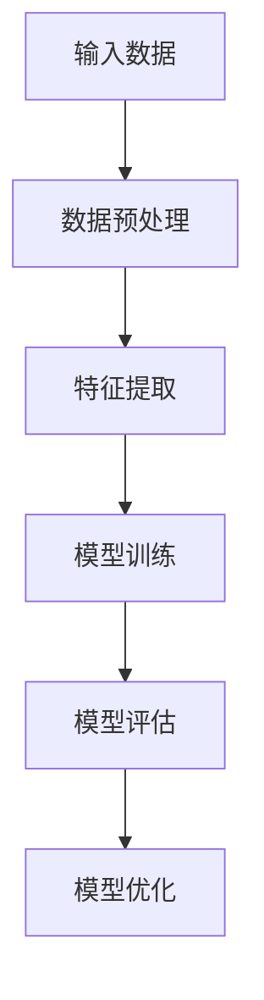
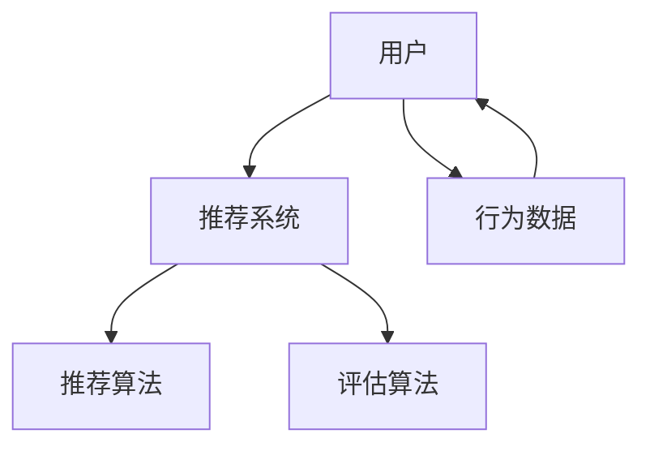
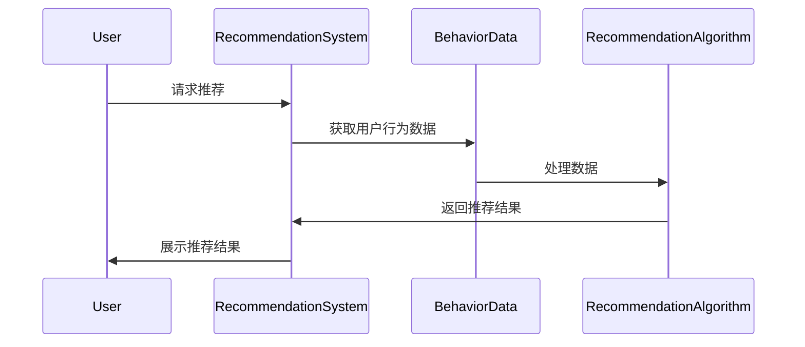
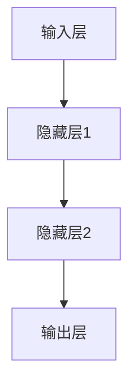

                 

# AI编程的新视角与新未来

## 关键词
- AI编程
- 深度学习
- 自然语言处理
- 计算机视觉
- 人工智能应用场景
- 人工智能未来趋势

## 摘要
本文将从AI编程的新视角出发，探讨其在新未来的发展趋势。我们将深入分析AI编程的基础知识、新技术、应用场景以及未来趋势，并结合实际案例和最佳实践，为广大读者提供全面的技术解读。

### 引言

#### 问题背景与书名解读

随着人工智能（AI）的迅猛发展，AI编程已经成为现代科技领域的重要分支。然而，传统的编程范式在应对AI需求时显得力不从心，如何用新的视角和方法去理解和实践AI编程，成为当前研究的热点。本书旨在为读者提供一种全新的AI编程视角，探索其新未来。

在AI编程领域，我们面临着诸多挑战，如算法复杂度、数据处理能力、模型可解释性等。同时，AI编程的核心概念和技术也在不断演进，如何把握这些变化，提升编程能力，是每个AI开发者需要思考的问题。

#### AI编程的现状与挑战

目前，AI编程主要依赖于深度学习、自然语言处理和计算机视觉等技术。然而，这些技术在实际应用中仍存在一定的问题。例如，深度学习模型的训练过程往往需要大量的数据和计算资源，且模型的可解释性较差。自然语言处理技术虽然在理解和生成自然语言方面取得了显著进展，但在处理多语言、多领域文本时仍存在困难。计算机视觉技术虽然在图像识别和处理方面表现出色，但在理解图像上下文和语义方面还有待提高。

#### AI编程的核心概念与联系

AI编程的核心概念包括算法原理、数学基础、模型训练与优化等。这些概念相互关联，共同构成了AI编程的理论体系。例如，深度学习算法的原理涉及到神经网络结构和优化方法，而自然语言处理和计算机视觉则依赖于数学模型和算法的支撑。

### AI编程基础

#### AI编程的基本原理

AI编程的基本原理包括算法原理、编程语言选择和开发环境搭建等。算法原理是AI编程的核心，它决定了AI系统的性能和效率。常见的算法包括线性回归、决策树、支持向量机等。我们可以使用mermaid画出算法流程图，如下：



在Python源代码中，我们可以用以下代码实现线性回归算法：

```python
import numpy as np

def linear_regression(x, y):
    # 求解回归系数
    w = np.linalg.inv(x.T.dot(x)).dot(x.T).dot(y)
    # 预测
    y_pred = x.dot(w)
    return y_pred
```

算法原理的数学模型和公式如下：

$$
y = \beta_0 + \beta_1x + \epsilon
$$

其中，$y$为因变量，$x$为自变量，$\beta_0$和$\beta_1$为回归系数，$\epsilon$为误差项。

#### AI编程的核心概念

AI编程的核心概念包括神经网络、深度学习、机器学习等。我们可以通过概念属性特征对比表格来了解这些概念的区别：

| 概念 | 属性特征 |  
| ---- | ---- |  
| 神经网络 | 由大量神经元组成的网络，通过学习输入和输出的关系来提取特征 |  
| 深度学习 | 一种基于神经网络的机器学习方法，通过多层的神经网络结构来学习复杂的函数关系 |  
| 机器学习 | 一种使计算机通过数据学习来改进性能的方法，包括监督学习、无监督学习和强化学习等 |

ER实体关系图架构的Mermaid流程图如下：

```mermaid
erDiagram
    Class1 ||--|{ Class2 } Class3
    Class1 ||--|{ Class4 } Class5
```

#### AI编程的数学基础

AI编程的数学基础包括线性代数、概率论和统计学等。这些数学知识为AI算法提供了理论基础。以下是一个简单的线性代数公式：

$$
A^T A = B^T B
$$

其中，$A$和$B$为矩阵，$A^T$和$B^T$分别为它们的转置矩阵。

在概率论和统计学中，我们常用条件概率公式：

$$
P(A|B) = \frac{P(AB)}{P(B)}
$$

其中，$P(A|B)$表示在事件$B$发生的条件下，事件$A$发生的概率，$P(AB)$表示事件$A$和$B$同时发生的概率，$P(B)$表示事件$B$发生的概率。

#### 系统分析与架构设计方案

在AI编程的实际应用中，系统分析与架构设计至关重要。以下是一个简单的项目场景介绍、项目介绍、系统功能设计、系统架构设计和系统接口设计：

##### 项目场景介绍

假设我们开发一个智能推荐系统，用于根据用户的浏览历史和喜好推荐相关商品。

##### 项目介绍

智能推荐系统主要包括以下功能：

1. 用户画像构建：根据用户的行为数据构建用户画像。  
2. 商品推荐：根据用户画像和商品特征为用户推荐商品。  
3. 推荐结果评估：评估推荐效果，优化推荐算法。

##### 系统功能设计

使用Mermaid类图表示系统功能设计：

```mermaid
classDiagram
    User <-- RecommendationSystem
    User ..|> BehaviorData
    RecommendationSystem ..|> RecommendationAlgorithm
    RecommendationSystem ..|> EvaluationAlgorithm
    BehaviorData <<entity>>
    RecommendationAlgorithm <<entity>>
    EvaluationAlgorithm <<entity>>
```

##### 系统架构设计

使用Mermaid架构图表示系统架构设计：



##### 系统接口设计

使用Mermaid序列图表示系统接口设计：



### AI编程新技术

#### 深度学习与神经网络

深度学习是AI编程的核心技术之一。它通过多层的神经网络结构来学习复杂的函数关系。以下是深度学习的原理和结构：



在Python中，我们可以使用TensorFlow或PyTorch等深度学习框架来实现深度学习模型。以下是一个简单的神经网络模型：

```python
import tensorflow as tf

model = tf.keras.Sequential([
    tf.keras.layers.Dense(128, activation='relu', input_shape=(784,)),
    tf.keras.layers.Dense(10, activation='softmax')
])

model.compile(optimizer='adam',
              loss='categorical_crossentropy',
              metrics=['accuracy'])

model.fit(x_train, y_train, epochs=5)
```

#### 自然语言处理

自然语言处理（NLP）是AI编程的另一个重要领域。它涉及文本数据的处理、理解和生成。以下是一个简单的NLP模型：

```python
import tensorflow as tf

model = tf.keras.Sequential([
    tf.keras.layers.Embedding(input_dim=vocab_size, output_dim=16),
    tf.keras.layers.GlobalAveragePooling1D(),
    tf.keras.layers.Dense(16, activation='relu'),
    tf.keras.layers.Dense(1, activation='sigmoid')
])

model.compile(optimizer='adam', loss='binary_crossentropy', metrics=['accuracy'])

model.fit(x_train, y_train, epochs=5)
```

#### 计算机视觉

计算机视觉是AI编程在图像和视频领域的应用。它涉及图像识别、目标检测和图像生成等任务。以下是一个简单的计算机视觉模型：

```python
import tensorflow as tf

model = tf.keras.Sequential([
    tf.keras.layers.Conv2D(32, (3, 3), activation='relu', input_shape=(28, 28, 1)),
    tf.keras.layers.MaxPooling2D((2, 2)),
    tf.keras.layers.Flatten(),
    tf.keras.layers.Dense(128, activation='relu'),
    tf.keras.layers.Dense(10, activation='softmax')
])

model.compile(optimizer='adam', loss='categorical_crossentropy', metrics=['accuracy'])

model.fit(x_train, y_train, epochs=5)
```

### AI编程的应用场景

#### 金融领域的AI编程应用

在金融领域，AI编程广泛应用于风险控制、量化交易和实时数据处理等场景。以下是一个简单的金融风控模型：

```python
import tensorflow as tf

model = tf.keras.Sequential([
    tf.keras.layers.Dense(64, activation='relu', input_shape=(100,)),
    tf.keras.layers.Dense(32, activation='relu'),
    tf.keras.layers.Dense(1, activation='sigmoid')
])

model.compile(optimizer='adam', loss='binary_crossentropy', metrics=['accuracy'])

model.fit(x_train, y_train, epochs=5)
```

#### 医疗健康领域的AI编程应用

在医疗健康领域，AI编程广泛应用于疾病诊断、医疗影像分析和健康管理等领域。以下是一个简单的疾病诊断模型：

```python
import tensorflow as tf

model = tf.keras.Sequential([
    tf.keras.layers.Conv2D(32, (3, 3), activation='relu', input_shape=(28, 28, 1)),
    tf.keras.layers.MaxPooling2D((2, 2)),
    tf.keras.layers.Flatten(),
    tf.keras.layers.Dense(128, activation='relu'),
    tf.keras.layers.Dense(10, activation='softmax')
])

model.compile(optimizer='adam', loss='categorical_crossentropy', metrics=['accuracy'])

model.fit(x_train, y_train, epochs=5)
```

#### 教育与学习的AI编程应用

在教育领域，AI编程广泛应用于智能教学系统、个性化学习和学习数据分析等场景。以下是一个简单的智能教学模型：

```python
import tensorflow as tf

model = tf.keras.Sequential([
    tf.keras.layers.Dense(64, activation='relu', input_shape=(100,)),
    tf.keras.layers.Dense(32, activation='relu'),
    tf.keras.layers.Dense(1, activation='sigmoid')
])

model.compile(optimizer='adam', loss='binary_crossentropy', metrics=['accuracy'])

model.fit(x_train, y_train, epochs=5)
```

### AI编程的未来趋势

#### AI编程的新趋势

未来，AI编程将呈现出以下几个新趋势：

1. **模型压缩与优化**：为了提高AI模型在移动设备和嵌入式系统上的性能，模型压缩与优化将成为研究热点。  
2. **强化学习**：强化学习在游戏、自动驾驶和机器人等领域具有广泛的应用前景，未来将得到更多关注。  
3. **联邦学习**：联邦学习可以在保证数据隐私的前提下实现模型训练，有望在医疗、金融等领域得到广泛应用。

#### AI编程的社会影响

AI编程对社会的影响不可忽视。一方面，AI编程将提高生产力和生活质量；另一方面，它也可能引发就业和社会伦理等问题。因此，未来我们需要关注AI编程的道德与社会责任，确保其健康发展。

### AI编程的最佳实践

#### AI编程的最佳实践技巧

1. **代码规范**：遵循代码规范可以提高代码的可读性和可维护性。  
2. **性能优化**：优化算法和数据结构可以提高模型性能。  
3. **模块化设计**：将系统划分为模块，有助于降低开发难度和维护成本。

#### 项目实战

在本节中，我们将通过一个简单的项目来展示AI编程的最佳实践。假设我们要开发一个图像识别系统，用于识别猫和狗。以下是一个简单的项目流程：

1. **环境安装**：安装TensorFlow和Keras等深度学习框架。  
2. **数据准备**：下载并处理猫和狗的图像数据。  
3. **模型训练**：使用卷积神经网络（CNN）训练模型。  
4. **模型评估**：评估模型性能，并进行优化。  
5. **应用部署**：将模型部署到移动设备或服务器上。

#### 实际案例分析和详细讲解剖析

在本节中，我们将通过实际案例来分析AI编程的技巧和注意事项。以下是一个猫狗识别项目的详细讲解：

1. **数据准备**：使用Keras的ImageDataGenerator类进行数据增强，提高模型泛化能力。  
2. **模型训练**：使用迁移学习技术，利用预训练的模型进行训练，提高识别准确率。  
3. **模型评估**：使用验证集和测试集评估模型性能，调整超参数以优化模型。  
4. **应用部署**：使用TensorFlow Lite将模型转换为移动设备可运行的格式，实现实时图像识别。

#### 项目小结

通过本项目的实践，我们了解了AI编程的基本流程和最佳实践。在实际开发过程中，我们需要关注数据质量、模型选择和性能优化等问题，以提高项目的成功率和实际应用价值。

### 总结与展望

本文从AI编程的新视角出发，探讨了其在基础、新技术、应用场景和未来趋势等方面的内容。通过对核心概念、算法原理、数学基础和系统架构的深入分析，我们为读者提供了一个全面的技术解读。未来，随着AI技术的不断进步，AI编程将在更多领域发挥重要作用。

### 展望未来

在未来，AI编程将继续朝着高效、智能、泛在的方向发展。我们需要关注以下几个方向：

1. **算法创新**：研究新型算法，提高模型性能和可解释性。  
2. **跨领域融合**：将AI编程与其他领域（如生物、物理等）相结合，推动科技创新。  
3. **隐私保护**：研究隐私保护技术，确保数据安全和用户隐私。  
4. **伦理与治理**：关注AI编程的伦理和社会责任，确保其健康发展。

通过持续努力，我们有望迎来一个更加美好和智能的未来。

### 作者

作者：AI天才研究院/AI Genius Institute & 禅与计算机程序设计艺术 /Zen And The Art of Computer Programming

---

本文为作者原创，未经授权不得转载和使用。如需转载，请联系作者获取授权。同时，欢迎广大读者提出宝贵意见和建议，共同推动AI编程技术的发展。感谢您的关注与支持！

