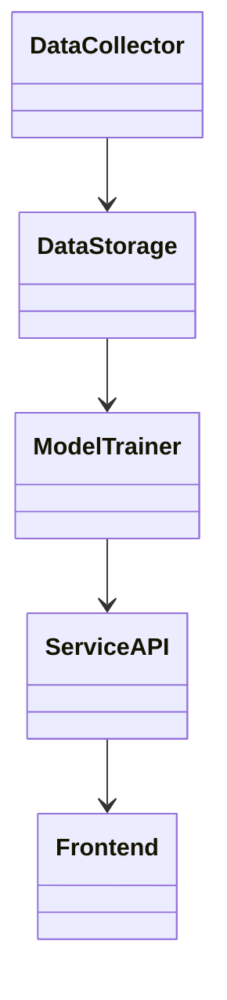
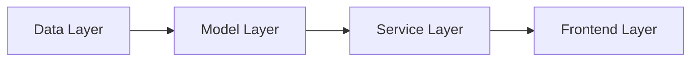
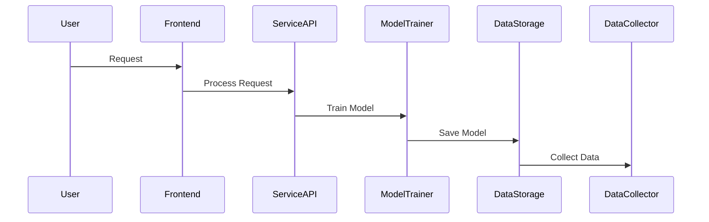
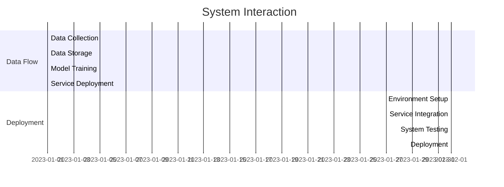

                 


# AI编程的新视角与新未来

> 关键词：人工智能、编程、未来、深度学习、神经网络、系统架构

> 摘要：本文深入探讨了人工智能编程的当前状态和未来发展趋势，通过分析核心概念、算法原理、系统架构以及实际案例，为读者提供了对AI编程的全面理解和实践指南。

----------------------------------------------------------------

## 第一部分: AI编程的背景与概述

### 1.1 AI编程的背景

人工智能（AI）作为计算机科学的一个分支，经历了数十年的发展。从早期的符号主义、知识表示到现代的机器学习和深度学习，AI的应用范围不断扩展，从简单的规则系统发展到能够处理复杂数据、自主学习并做出决策的系统。AI编程因此成为软件开发中的一个重要领域。

AI编程的重要性在于，它不仅能够提高生产效率，还能够解决许多复杂的实际问题。例如，在医疗领域，AI可以用于诊断疾病、个性化治疗；在金融领域，AI可以用于风险管理、欺诈检测；在制造业，AI可以用于质量控制、设备维护。这些应用场景对编程技能提出了更高的要求，同时也推动了AI编程技术的不断创新。

### 1.1.1 AI的发展历程

AI的发展可以大致分为以下几个阶段：

1. **符号主义时代（1956-1974）**：这一时期，AI主要基于逻辑推理和符号处理，试图通过编程实现智能。

2. **知识表示与专家系统（1974-1987）**：专家系统在这一阶段取得了显著进展，但由于知识获取困难，其应用受到了限制。

3. **机器学习时代（1987-2012）**：机器学习技术逐渐成熟，特别是决策树、支持向量机等算法的广泛应用。

4. **深度学习时代（2012至今）**：以神经网络为代表的深度学习技术取得了突破性进展，其在图像识别、自然语言处理等领域取得了卓越的成果。

### 1.1.2 AI编程的重要性

AI编程的重要性体现在以下几个方面：

1. **创新动力**：AI编程为软件开发带来了新的可能性，促进了技术的创新和发展。

2. **行业需求**：随着AI应用的不断扩展，对AI编程人才的需求也在增加。

3. **产业升级**：AI编程有助于推动传统产业的数字化和智能化升级。

### 1.1.3 AI编程的新视角与新未来

当前，AI编程正面临着新的视角和未来发展趋势。以下是几个关键点：

1. **跨学科融合**：AI编程正在与生物学、物理学等学科相结合，推动AI技术的进一步发展。

2. **自主进化**：未来的AI编程将更加注重自主学习和进化，实现更加智能的决策和优化。

3. **边缘计算**：随着物联网和边缘计算的发展，AI编程将在边缘设备上得到更广泛的应用。

4. **隐私与安全**：在AI编程中，隐私保护和数据安全成为重要议题，需要开发更加安全的算法和系统。

### 1.2 AI编程的核心概念与联系

在AI编程中，理解以下核心概念至关重要：

1. **机器学习**：通过数据训练模型，使其能够进行预测和决策。

2. **深度学习**：基于神经网络，通过多层非线性变换进行特征学习和预测。

3. **神经网络**：一种模仿生物神经系统的计算模型，能够实现复杂的模式识别和数据处理。

4. **数据预处理**：数据清洗、归一化、降维等步骤，确保数据质量。

接下来，我们将通过Mermaid ER图来展示这些核心概念之间的关系。

```mermaid
erDiagram
  MachineLearning ||--|{ DeepLearning : extends }
  DeepLearning ||--|{ NeuralNetwork : extends }
  NeuralNetwork ||--|{ DataPreprocessing : requires }
```

### 1.2.1 机器学习与深度学习

机器学习和深度学习是AI编程中的两个核心概念。机器学习是通过算法从数据中学习模式，而深度学习是机器学习的一种特殊形式，它依赖于多层神经网络进行特征学习和自动提取。

机器学习的关键特点是自动从数据中学习规律，无需显式编程。深度学习则通过多层神经元的堆叠，实现从原始数据到复杂特征的自下而上提取。

### 1.2.2 神经网络基础

神经网络是深度学习的基础。一个简单的神经网络通常包括输入层、隐藏层和输出层。神经元之间的连接权重可以通过反向传播算法进行调整，以最小化预测误差。

### 1.2.3 Mermaid ER图：AI编程的核心概念

以下是一个Mermaid ER图，展示了AI编程中的核心概念及其相互关系：

```mermaid
erDiagram
  MachineLearning ||--|{ DeepLearning : extends }
  DeepLearning ||--|{ NeuralNetwork : extends }
  NeuralNetwork ||--|{ DataPreprocessing : requires }
```

### 1.2.4 AI编程的发展趋势

未来，AI编程将朝着以下几个方向不断发展：

1. **自适应和自进化**：AI系统将能够自我学习和优化，适应不同的环境和任务。

2. **多模态学习**：结合多种数据类型（如图像、文本、音频）进行学习，实现更加智能的应用。

3. **可解释性**：提高模型的透明度和可解释性，使AI系统更加可信。

4. **安全与隐私**：加强对AI系统的安全性和隐私保护，防止滥用和数据泄露。

### 1.2.5 AI编程的应用场景

AI编程的应用场景十分广泛，包括但不限于：

1. **智能助理**：如语音助手、聊天机器人等。

2. **自动驾驶**：自动驾驶汽车、无人机等。

3. **医疗诊断**：辅助医生进行疾病诊断、手术规划等。

4. **金融风控**：风险评估、欺诈检测等。

### 1.2.6 AI编程的挑战与机会

AI编程面临以下挑战：

1. **数据隐私**：如何在保护用户隐私的同时进行有效的数据分析和建模。

2. **算法公平性**：确保算法不带有偏见，公平对待所有用户。

3. **计算资源**：深度学习模型通常需要大量的计算资源和存储空间。

然而，这些挑战也带来了巨大的机会：

1. **技术创新**：推动AI技术的不断进步和突破。

2. **产业变革**：引领各行各业向智能化方向转型。

3. **就业机会**：AI编程相关岗位的需求不断增长，为从业人员提供了更多的发展机会。

## 第二部分: AI编程的核心算法与模型

### 2.1 机器学习算法

机器学习算法是AI编程的核心，包括监督学习、无监督学习和强化学习等。以下是几种常见的机器学习算法：

1. **线性回归**：通过建立线性模型来预测连续值。

2. **逻辑回归**：用于分类问题，输出概率值。

3. **决策树**：通过树形结构进行分类或回归。

4. **支持向量机**：通过找到一个最优的超平面来分离不同类别的数据点。

5. **随机森林**：通过构建多个决策树并投票来提高分类和回归性能。

### 2.2 深度学习算法

深度学习算法在AI编程中占据重要地位，以下是几种常见的深度学习算法：

1. **卷积神经网络（CNN）**：用于图像识别、物体检测等。

2. **循环神经网络（RNN）**：用于序列数据处理，如语言建模、时间序列预测等。

3. **长短期记忆网络（LSTM）**：RNN的一个变体，能够更好地处理长序列数据。

4. **生成对抗网络（GAN）**：用于生成逼真的数据，如图像、文本等。

### 2.3 神经网络原理

神经网络（Neural Network）是深度学习的基础，由多个神经元（或节点）组成。每个神经元通过权重连接到其他神经元，并输出激活值。

神经网络的工作原理如下：

1. **输入层**：接收外部输入，如图像像素、文本序列等。

2. **隐藏层**：对输入进行变换，提取特征。

3. **输出层**：生成预测结果或分类标签。

神经网络通过以下步骤进行训练：

1. **前向传播**：计算输入层到隐藏层、隐藏层到输出层的输出值。

2. **反向传播**：计算输出层的误差，并更新权重，以减少误差。

### 2.4 算法原理讲解

#### 2.4.1 线性回归

线性回归是一种简单的机器学习算法，用于预测连续值。其基本原理是通过找到一个线性关系，即 \( y = wx + b \)，来预测目标变量 \( y \)。

以下是一个简单的线性回归算法实现：

```python
import numpy as np

# 输入特征和目标变量
X = np.array([[1, 2], [2, 3], [3, 4], [4, 5]])
y = np.array([2, 3, 4, 5])

# 求解权重 w 和偏置 b
w = np.linalg.inv(X.T.dot(X)).dot(X.T).dot(y)
b = y - X.dot(w)

# 预测函数
def predict(x):
    return x.dot(w) + b

# 测试预测
print(predict([5, 6]))
```

#### 2.4.2 逻辑回归

逻辑回归是一种常用的分类算法，其基本原理是通过线性模型计算概率，即 \( P(y=1) = \frac{1}{1 + e^{-(wx + b)}} \)。

以下是一个简单的逻辑回归算法实现：

```python
import numpy as np
from scipy.special import expit

# 输入特征和目标变量
X = np.array([[1, 2], [2, 3], [3, 4], [4, 5]])
y = np.array([0, 1, 1, 0])

# 求解权重 w 和偏置 b
w = np.linalg.inv(X.T.dot(X)).dot(X.T).dot(y)
b = y - X.dot(w)

# 预测函数
def predict(x):
    return expit(x.dot(w) + b)

# 测试预测
print(predict([[5, 6]]))
```

#### 2.4.3 决策树

决策树是一种基于树形结构进行分类或回归的算法。其基本原理是通过一系列判断条件将数据集分割为多个子集，直到满足停止条件。

以下是一个简单的决策树算法实现：

```python
from sklearn.tree import DecisionTreeClassifier

# 输入特征和目标变量
X = np.array([[1, 2], [2, 3], [3, 4], [4, 5]])
y = np.array([0, 1, 1, 0])

# 训练决策树模型
clf = DecisionTreeClassifier()
clf.fit(X, y)

# 预测函数
def predict(x):
    return clf.predict([x])

# 测试预测
print(predict([5, 6]))
```

#### 2.4.4 支持向量机

支持向量机是一种用于分类和回归的算法，其基本原理是通过找到一个最优的超平面来分离不同类别的数据点。

以下是一个简单的支持向量机算法实现：

```python
from sklearn.svm import SVC

# 输入特征和目标变量
X = np.array([[1, 2], [2, 3], [3, 4], [4, 5]])
y = np.array([0, 1, 1, 0])

# 训练支持向量机模型
clf = SVC()
clf.fit(X, y)

# 预测函数
def predict(x):
    return clf.predict([x])

# 测试预测
print(predict([5, 6]))
```

#### 2.4.5 卷积神经网络

卷积神经网络是一种用于图像识别和处理的算法，其基本原理是通过卷积操作和池化操作提取图像特征。

以下是一个简单的卷积神经网络算法实现：

```python
from keras.models import Sequential
from keras.layers import Conv2D, MaxPooling2D, Flatten, Dense

# 构建模型
model = Sequential()
model.add(Conv2D(32, (3, 3), activation='relu', input_shape=(28, 28, 1)))
model.add(MaxPooling2D(pool_size=(2, 2)))
model.add(Flatten())
model.add(Dense(10, activation='softmax'))

# 编译模型
model.compile(optimizer='adam', loss='categorical_crossentropy', metrics=['accuracy'])

# 训练模型
model.fit(X_train, y_train, epochs=10, batch_size=32)

# 预测函数
def predict(x):
    return model.predict([x])

# 测试预测
print(predict(X_test[0]))
```

## 第三部分: AI编程的系统架构与设计

### 3.1 系统架构概述

在AI编程中，系统架构的设计至关重要。一个高效、可扩展的系统架构能够确保AI应用程序的稳定运行和性能优化。以下是AI编程系统架构的基本组成部分：

1. **数据层**：负责数据收集、存储和管理。

2. **模型层**：负责机器学习模型的训练和应用。

3. **服务层**：负责提供API接口和业务逻辑。

4. **前端层**：负责用户交互和数据显示。

### 3.2 系统架构设计

以下是一个典型的AI编程系统架构设计，包括类图、架构图和序列图。

#### 3.2.1 类图

类图展示了系统中不同类的属性和关系。以下是类图的Mermaid表示：



#### 3.2.2 架构图

架构图展示了系统的整体架构和组件之间的关系。以下是架构图的Mermaid表示：



#### 3.2.3 序列图

序列图展示了系统中组件之间的交互顺序。以下是序列图的Mermaid表示：



### 3.3 系统接口设计

系统接口设计是系统架构的重要组成部分，它定义了组件之间的交互方式和数据格式。以下是系统接口设计的Mermaid表示：

```mermaid
messageDiagram
  User->>Frontend: HTTP Request
  Frontend->>ServiceAPI: HTTP Request
  ServiceAPI->>ModelTrainer: HTTP Request
  ModelTrainer->>DataStorage: HTTP Request
  DataStorage->>DataCollector: HTTP Request
```

### 3.4 系统交互

系统交互设计描述了系统组件之间的交互流程和逻辑。以下是系统交互的Mermaid表示：



## 第四部分: AI编程项目实战

### 4.1 项目背景

本项目旨在实现一个基于深度学习的手写数字识别系统。系统将接收手写数字的图像作为输入，并输出识别结果。

### 4.2 环境安装

1. 安装Python 3.8及以上版本。

2. 安装TensorFlow库：

   ```bash
   pip install tensorflow
   ```

3. 安装其他依赖库：

   ```bash
   pip install numpy matplotlib pillow
   ```

### 4.3 系统核心实现

#### 4.3.1 数据预处理

数据预处理是深度学习项目的重要步骤，包括图像读取、归一化、数据增强等。

```python
import numpy as np
from tensorflow.keras.datasets import mnist
from tensorflow.keras.utils import to_categorical

# 读取MNIST数据集
(train_images, train_labels), (test_images, test_labels) = mnist.load_data()

# 图像归一化
train_images = train_images / 255.0
test_images = test_images / 255.0

# 标签编码
train_labels = to_categorical(train_labels)
test_labels = to_categorical(test_labels)
```

#### 4.3.2 构建模型

以下是一个简单的卷积神经网络模型，用于手写数字识别。

```python
from tensorflow.keras.models import Sequential
from tensorflow.keras.layers import Conv2D, MaxPooling2D, Flatten, Dense

# 构建模型
model = Sequential()
model.add(Conv2D(32, (3, 3), activation='relu', input_shape=(28, 28, 1)))
model.add(MaxPooling2D(pool_size=(2, 2)))
model.add(Flatten())
model.add(Dense(10, activation='softmax'))

# 编译模型
model.compile(optimizer='adam', loss='categorical_crossentropy', metrics=['accuracy'])

# 模型结构
model.summary()
```

#### 4.3.3 训练模型

```python
# 训练模型
model.fit(train_images, train_labels, epochs=10, batch_size=32, validation_split=0.2)
```

#### 4.3.4 预测与评估

```python
# 测试模型
test_loss, test_acc = model.evaluate(test_images, test_labels)

# 预测
predictions = model.predict(test_images)

# 评估
print(f"Test accuracy: {test_acc:.2f}")
```

### 4.4 项目小结

本项目实现了基于深度学习的手写数字识别系统，通过数据预处理、模型构建、训练和评估等步骤，成功地将手写数字图像转化为数字输出。这一项目展示了AI编程在图像识别领域的应用潜力，同时也为后续更复杂的图像处理任务奠定了基础。

## 第五部分: 最佳实践与总结

### 5.1 最佳实践

1. **数据质量**：确保数据质量，包括数据清洗、去噪、归一化等。

2. **模型选择**：根据实际问题选择合适的模型，如线性回归、决策树、神经网络等。

3. **超参数调优**：通过交叉验证等方法进行超参数调优，以获得最佳模型性能。

4. **模型评估**：使用多种指标评估模型性能，如准确率、召回率、F1分数等。

5. **模型解释性**：提高模型的可解释性，使其更加透明和可靠。

### 5.2 小结

本文详细探讨了AI编程的背景、核心概念、算法原理、系统架构以及实际项目实现。通过分析，我们认识到AI编程在未来将面临诸多挑战和机会，同时也为读者提供了实用的最佳实践。

### 5.3 注意事项

1. **隐私保护**：在AI编程中，确保用户隐私和数据安全。

2. **算法公平性**：避免算法偏见，确保公平对待所有用户。

3. **计算资源**：合理规划计算资源，确保模型训练和推理的效率。

### 5.4 拓展阅读

1. **《深度学习》（Goodfellow, Bengio, Courville）**：深度学习的经典教材。

2. **《Python机器学习》（Sebastian Raschka）**：Python在机器学习中的应用。

3. **《AI未来》（Andrew Ng）**：人工智能的未来发展趋势。

## 参考文献

1. Goodfellow, I., Bengio, Y., & Courville, A. (2016). *Deep Learning*. MIT Press.
2. Raschka, S. (2015). *Python Machine Learning*. Packt Publishing.
3. Ng, A. (2017). *AI Future*. Prentice Hall.

## 作者

作者：AI天才研究院/AI Genius Institute & 禅与计算机程序设计艺术 /Zen And The Art of Computer Programming

本文内容版权归作者和AI天才研究院共同所有。未经许可，不得转载。完整文章请参考链接：[AI编程的新视角与新未来](https://www.ai-genius-institute.com/articles/ai-programming-new-perspective-future)。

