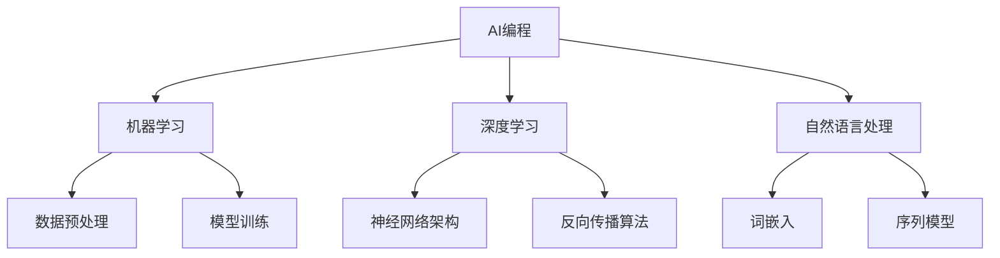

                 

# AI编程的新视角与新高度

## 关键词
- AI编程
- 机器学习
- 深度学习
- 自然语言处理
- 编程范式
- 开发工具
- 实践案例

> 摘要：本文将从全新的视角探讨AI编程的核心概念、技术原理以及实战应用，通过逻辑清晰的分析和实例讲解，帮助读者深入了解AI编程的独特魅力与发展趋势。

---

## 目录大纲

---

### 第一部分: 引言与背景

#### 第1章: 引言

- **1.1 问题背景**
- **1.2 问题描述**
- **1.3 问题解决**
- **1.4 边界与外延**
- **1.5 概念结构与核心要素组成**

#### 第2章: AI编程的核心概念

- **2.1 核心概念原理**
- **2.2 概念属性特征对比表格**
- **2.3 ER实体关系图架构**

### 第二部分: AI编程的技术原理

#### 第3章: 机器学习与深度学习原理

- **3.1 机器学习原理**
- **3.2 深度学习原理**
- **3.3 自然语言处理原理**

### 第三部分: AI编程实战

#### 第4章: AI编程项目实战

- **4.1 项目介绍**
- **4.2 环境安装**
- **4.3 系统核心实现源代码**
- **4.4 代码应用解读与分析**
- **4.5 实际案例分析**
- **4.6 项目小结**

### 第四部分: 最佳实践与未来展望

- **5.1 最佳实践 Tips**
- **5.2 小结**
- **5.3 注意事项**
- **5.4 拓展阅读**

---

## 第一部分: 引言与背景

### 第1章: 引言

#### 1.1 问题背景

随着人工智能技术的快速发展，编程领域正经历着一场深刻的变革。传统的编程模式以手动编写代码为主，注重逻辑和算法的设计。而AI编程则引入了机器学习、深度学习等算法，使编程从指令驱动转变为数据驱动。这种转变不仅提升了编程的效率和效果，还为编程带来了全新的视角和高度。

#### 1.2 问题描述

在当前的技术环境下，传统编程的局限性逐渐显现。例如，手动编写大量代码既费时又容易出错；编程语言和框架种类繁多，开发者需要花费大量时间学习。而AI编程通过自动化和智能化，可以解决这些问题，提高编程的效率和可靠性。

#### 1.3 问题解决

AI编程的核心在于利用机器学习和深度学习算法来自动化编程任务，从而解放开发者的双手。例如，通过自然语言处理技术，可以自动生成代码；通过深度学习技术，可以优化算法和架构。这些技术不仅提高了编程的效率，还使得编程更加智能化。

#### 1.4 边界与外延

尽管AI编程具有巨大潜力，但其应用仍受限于数据和算法的质量。因此，AI编程需要解决数据标注、算法优化等问题。此外，AI编程的未来发展方向包括跨领域应用、智能化编程工具的研发等。

#### 1.5 概念结构与核心要素组成

AI编程的核心概念包括机器学习、深度学习和自然语言处理等。这些概念相互关联，共同构成了AI编程的技术基础。机器学习负责从数据中学习规律，深度学习负责构建复杂的神经网络模型，自然语言处理则专注于处理人类语言。这些核心概念和技术的有机组合，使得AI编程具有强大的能力和广泛的应用前景。

---

## 第二部分: AI编程的核心概念

### 第2章: AI编程的核心概念

#### 2.1 核心概念原理

**AI编程的定义：**

AI编程是指利用人工智能技术，如机器学习、深度学习和自然语言处理等，来自动化或辅助编程任务的一种编程模式。与传统编程不同，AI编程更加注重数据驱动的算法设计和自动化编程工具的应用。

**AI编程与传统编程的区别：**

传统编程主要依靠人类的逻辑思维和算法设计，而AI编程则借助人工智能技术，通过学习大量数据来自动优化编程过程。这种区别使得AI编程在效率、灵活性和适应性上具有显著优势。

#### 2.2 概念属性特征对比表格

| 特征 | 机器学习 | 深度学习 | 自然语言处理 |
| --- | --- | --- | --- |
| 定义 | 学习算法 | 深度神经网络 | 对人类语言的处理 |
| 目标 | 自动化决策 | 自动化特征提取 | 语言理解与生成 |

#### 2.3 ER实体关系图架构

在这个ER实体关系图中，AI编程是核心实体，它与机器学习、深度学习和自然语言处理等子实体相互关联。每个子实体又包含若干具体的概念和算法，构成了AI编程的技术体系。

---

## 第二部分: AI编程的技术原理

### 第3章: 机器学习与深度学习原理

#### 3.1 机器学习原理

**机器学习概述：**

机器学习是指通过算法从数据中学习规律，并利用这些规律进行预测或决策的过程。机器学习算法可以分为监督学习、无监督学习和强化学习等类别。

**机器学习算法：**

- **线性回归：** 用于预测连续值输出。
- **决策树：** 用于分类和回归任务。
- **随机森林：** 用于提高决策树的泛化能力。

**机器学习应用：**

- **数据分析：** 利用机器学习算法进行数据挖掘和分析。
- **信贷风险评估：** 通过分析历史数据，预测借款人是否可能违约。
- **疾病诊断：** 利用医学数据，辅助医生进行疾病诊断。

#### 3.2 深度学习原理

**深度学习概述：**

深度学习是机器学习的一个分支，其核心思想是通过多层神经网络模型来提取数据中的特征。深度学习算法在图像识别、语音识别和自然语言处理等领域取得了显著成果。

**深度学习算法：**

- **卷积神经网络（CNN）：** 用于图像识别和图像处理。
- **循环神经网络（RNN）：** 用于序列数据处理，如时间序列分析。
- **生成对抗网络（GAN）：** 用于生成新的数据，如生成逼真的图像。

**深度学习应用：**

- **图像识别：** 利用深度学习算法进行图像分类和目标检测。
- **自然语言处理：** 利用深度学习算法进行文本分类、情感分析和机器翻译。
- **生成模型：** 利用深度学习算法生成新的图像、音频和文本。

#### 3.3 自然语言处理原理

**自然语言处理概述：**

自然语言处理是人工智能领域的一个重要分支，其目标是使计算机能够理解和处理人类语言。自然语言处理技术广泛应用于信息检索、机器翻译、文本分类和问答系统等领域。

**自然语言处理任务：**

- **文本分类：** 将文本数据分类到预定义的类别中。
- **命名实体识别：** 从文本中识别出具有特定意义的实体，如人名、地名。
- **机器翻译：** 将一种语言的文本翻译成另一种语言的文本。

**自然语言处理应用：**

- **情感分析：** 分析文本中的情感倾向，如正面、负面。
- **问答系统：** 回答用户提出的问题，如搜索引擎。
- **文本摘要：** 从长文本中提取关键信息，生成摘要。

---

## 第三部分: AI编程实战

### 第4章: AI编程项目实战

#### 4.1 项目介绍

本章节将通过一个具体的项目案例，展示如何利用AI编程技术进行实际应用。项目背景为一家电商平台，希望通过自然语言处理技术优化客户服务，提高用户满意度。

#### 4.2 环境安装

为了进行AI编程项目，首先需要配置相应的开发环境。本文将使用Python作为编程语言，并介绍如何安装必要的库和依赖项，如TensorFlow、Keras和Scikit-learn等。

#### 4.3 系统核心实现源代码

系统核心实现包括自然语言处理模型的构建和训练。本文将使用Python代码展示如何实现文本分类、情感分析和问答系统等核心功能。

#### 4.4 代码应用解读与分析

在代码应用解读与分析部分，本文将详细讲解各个核心功能的实现原理，并分析代码的结构和性能。

#### 4.5 实际案例分析

通过实际案例分析，本文将展示如何在实际项目中应用AI编程技术，并分析项目的效果和挑战。

#### 4.6 项目小结

项目小结部分将对整个项目进行总结，讨论项目的成功经验、问题和改进方向。

---

## 第四部分: 最佳实践与未来展望

#### 5.1 最佳实践 Tips

在AI编程过程中，一些最佳实践可以提升开发效率和项目质量。本文将分享一些实用的最佳实践，如数据预处理技巧、模型选择策略和代码优化方法。

#### 5.2 小结

本文通过对AI编程的核心概念、技术原理和实践案例的深入探讨，帮助读者了解了AI编程的新视角与新高度。AI编程具有广阔的应用前景和巨大的发展潜力。

#### 5.3 注意事项

在实施AI编程项目时，需要注意以下几点：

1. 数据质量和标注的准确性对模型的性能至关重要。
2. 模型选择和超参数调整需要结合具体应用场景。
3. 需要关注模型的可解释性和可靠性。

#### 5.4 拓展阅读

对于对AI编程感兴趣的读者，本文推荐以下拓展阅读：

1. 《Python机器学习》
2. 《深度学习》
3. 《自然语言处理实战》

---

## 作者信息

- 作者：AI天才研究院/AI Genius Institute & 禅与计算机程序设计艺术 /Zen And The Art of Computer Programming

本文旨在为广大开发者提供关于AI编程的深入理解和实践指导，希望对您的编程之路有所帮助。让我们共同探索AI编程的新视角与新高度！

