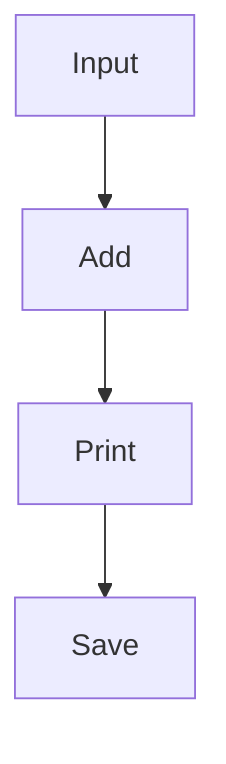

                 


## AI编程的新语法

### 关键词：AI编程、新语法、机器学习、深度学习、编程工具、TensorFlow、PyTorch

### 摘要

随着人工智能技术的快速发展，AI编程已经成为现代软件开发的重要组成部分。本文将探讨AI编程的新语法，从机器学习和深度学习的核心概念出发，详细介绍常用的AI编程工具，并通过实践案例展示AI编程的实际应用。本文旨在帮助读者深入理解AI编程的本质，掌握新语法的使用技巧，为未来的AI编程打下坚实基础。

### 目录大纲设计思路

在设计《AI编程的新语法》这本书的完整目录大纲时，我们首先明确了书的主题和目标读者，然后根据这些信息来规划各个章节的内容。

#### 第一步：明确主题和目标读者

- **主题**：AI编程的新语法。
- **目标读者**：具备一定编程基础，但想要学习AI编程的高级程序员或数据科学家。

#### 第二步：确定核心概念与内容结构

- **核心概念**：机器学习、深度学习、AI编程工具等。
- **内容结构**：分为AI编程基础、AI编程工具、实践案例和最佳实践等部分。

#### 第三步：设计章节结构

- **背景介绍**：介绍AI编程的发展背景和重要性。
- **核心概念与联系**：讲解机器学习、深度学习等核心概念。
- **工具介绍**：详细介绍TensorFlow和PyTorch等AI编程工具。
- **实践案例**：通过实际案例展示AI编程的应用。
- **最佳实践与总结**：分享AI编程的最佳实践，总结全书内容。

#### 第四步：细化各章节内容

- **第1章：AI编程概述**：介绍AI编程的概念、背景和发展趋势。
- **第2章：核心概念与联系**：详细讲解机器学习、深度学习等核心概念。
- **第3章：AI编程工具**：详细介绍TensorFlow和PyTorch等AI编程工具。
- **第4章：实践案例**：通过实际案例展示如何使用AI编程工具。
- **第5章：AI编程最佳实践**：分享AI编程的最佳实践。
- **第6章：未来趋势与展望**：探讨AI编程的未来发展趋势。
- **第7章：总结与拓展**：对全书内容进行总结，并给出进一步学习建议。

### 目录大纲

```markdown
# 《AI编程的新语法》目录大纲

----------------------------------------------------------------

## 第一部分：AI编程基础

### 第1章：AI编程概述

#### 1.1 AI编程的概念与背景
#### 1.2 AI编程与传统编程的区别
#### 1.3 AI编程的重要性

### 第2章：核心概念与联系

#### 2.1 机器学习基础
##### 2.1.1 机器学习的定义与类型
##### 2.1.2 监督学习、无监督学习与强化学习
##### 2.1.3 机器学习的基本流程

#### 2.2 深度学习简介
##### 2.2.1 深度学习的概念与发展
##### 2.2.2 神经网络与深度学习模型
##### 2.2.3 深度学习的优缺点

#### 2.3 AI编程的关键概念
##### 2.3.1 数据预处理
##### 2.3.2 模型训练与评估
##### 2.3.3 模型部署与优化

## 第二部分：AI编程工具

### 第3章：TensorFlow编程

#### 3.1 TensorFlow基础
##### 3.1.1 TensorFlow简介
##### 3.1.2 TensorFlow的安装与配置
##### 3.1.3 TensorFlow的数据流图

#### 3.2 TensorFlow核心API
##### 3.2.1 Variables与Operations
##### 3.2.2 Sessions与Runners
##### 3.2.3 统一接口（Eager Execution）

#### 3.3 TensorFlow实践案例
##### 3.3.1 线性回归案例
##### 3.3.2 卷积神经网络案例

### 第4章：PyTorch编程

#### 4.1 PyTorch基础
##### 4.1.1 PyTorch简介
##### 4.1.2 PyTorch的安装与配置
##### 4.1.3 PyTorch的张量操作

#### 4.2 PyTorch核心API
##### 4.2.1 Autograd
##### 4.2.2 模型定义与训练
##### 4.2.3 数据加载与处理

#### 4.3 PyTorch实践案例
##### 4.3.1 线性回归案例
##### 4.3.2 卷积神经网络案例

----------------------------------------------------------------
```

### AI编程概述

#### 1.1 AI编程的概念与背景

人工智能（Artificial Intelligence，简称AI）是计算机科学的一个重要分支，旨在研究、开发和应用使计算机模拟人类智能的理论、方法和技术。随着计算机硬件性能的提升和大数据时代的到来，AI技术逐渐从理论研究走向实际应用，成为现代科技领域的关键驱动力。

AI编程，顾名思义，是指使用编程语言和工具开发AI算法和应用的过程。与传统编程相比，AI编程具有以下几个显著特点：

1. **数据处理能力强**：AI编程涉及大量数据预处理和特征提取，这要求编程工具具有高效的数据处理能力。
2. **算法复杂性高**：AI算法通常涉及复杂的数学模型和计算过程，对编程者的数学和算法基础有较高要求。
3. **领域知识依赖强**：AI编程需要掌握特定领域的知识，如机器学习、深度学习等，才能更好地设计和实现AI应用。

#### 1.2 AI编程与传统编程的区别

传统编程主要是基于逻辑和算法，以实现特定功能为目标。而AI编程则更加注重数据驱动的决策和模式识别。以下是AI编程与传统编程的主要区别：

1. **目标不同**：传统编程的目标是实现特定功能，如编写一个计算器程序；而AI编程的目标是实现智能行为，如开发一个能够自我学习的推荐系统。
2. **方法不同**：传统编程依赖于明确的算法和逻辑步骤，而AI编程则依赖于机器学习和深度学习算法，这些算法通过训练数据自动调整模型参数。
3. **数据处理不同**：传统编程处理的是静态数据，而AI编程处理的是动态数据，如实时传感器数据。

#### 1.3 AI编程的重要性

AI编程的重要性体现在以下几个方面：

1. **推动技术创新**：AI编程是推动人工智能技术发展的重要手段，通过不断探索新的算法和工具，可以提高AI系统的性能和效率。
2. **应用领域广泛**：从医疗诊断到自动驾驶，从金融预测到智能家居，AI编程已经渗透到各个行业，成为提升产业竞争力的关键。
3. **未来发展趋势**：随着AI技术的不断进步，AI编程将成为计算机科学和软件开发的核心技能，掌握AI编程将为未来的职业发展提供更多机会。

### 总结

AI编程作为人工智能领域的重要组成部分，具有独特的技术特点和广泛的应用前景。本文概述了AI编程的基本概念、与传统编程的区别以及其重要性，为后续章节的深入探讨奠定了基础。在接下来的章节中，我们将详细讲解AI编程的核心概念和常用工具，并通过实践案例展示AI编程的实际应用。

### 核心概念与联系

在深入了解AI编程之前，我们需要掌握几个核心概念，这些概念是AI编程的基础，也是理解AI工作原理的关键。在本章节中，我们将介绍机器学习、深度学习等核心概念，并探讨它们之间的关系。

#### 2.1 机器学习基础

机器学习（Machine Learning，简称ML）是AI的核心分支之一，它通过算法让计算机从数据中学习规律，从而做出预测或决策。机器学习的基本过程包括数据收集、数据预处理、模型训练、模型评估和模型部署。

##### 2.1.1 机器学习的定义与类型

机器学习的定义可以从广义和狭义两个方面理解。广义上，机器学习是指通过计算机程序实现智能行为，使其能够从经验中学习并做出预测或决策。狭义上，机器学习特指使用统计方法从数据中学习规律的过程。

根据学习方式，机器学习可以分为以下几种类型：

1. **监督学习（Supervised Learning）**：监督学习是有标签数据的学习过程，即训练数据集包含了输入和输出，通过这些数据来训练模型。监督学习的目标是通过输入特征预测输出标签。常见的监督学习算法包括线性回归、决策树、支持向量机（SVM）等。

2. **无监督学习（Unsupervised Learning）**：无监督学习是无标签数据的学习过程，即训练数据集只包含输入特征，没有对应的输出标签。无监督学习的目标通常是发现数据中的隐藏结构和模式。常见的无监督学习算法包括聚类（如K-means）、降维（如主成分分析PCA）等。

3. **强化学习（Reinforcement Learning）**：强化学习是通过与环境交互来学习最优策略的机器学习方法。在强化学习中，智能体通过选择行动来获取奖励或惩罚，并根据反馈调整策略以最大化长期回报。常见的强化学习算法包括Q学习、深度Q网络（DQN）等。

##### 2.1.2 监督学习、无监督学习与强化学习

监督学习、无监督学习和强化学习各自有不同的应用场景和特点。监督学习适用于有明确标注数据的任务，如分类和回归；无监督学习适用于探索未知数据结构和模式；强化学习适用于需要决策和优化的动态环境。

在机器学习的过程中，数据预处理是非常关键的一步。数据预处理包括数据清洗、数据归一化、缺失值处理等，目的是提高数据质量和模型性能。例如，归一化可以将数据缩放到同一尺度，防止某些特征对模型训练产生过大的影响。

##### 2.1.3 机器学习的基本流程

机器学习的基本流程可以分为以下几步：

1. **数据收集**：收集用于训练的数据集。
2. **数据预处理**：清洗和准备数据，使其适合模型训练。
3. **模型选择**：根据任务选择合适的算法和模型架构。
4. **模型训练**：使用训练数据训练模型，调整模型参数。
5. **模型评估**：使用验证数据评估模型性能，调整模型参数。
6. **模型部署**：将训练好的模型部署到实际应用中。

#### 2.2 深度学习简介

深度学习（Deep Learning，简称DL）是机器学习的一个子领域，它通过构建具有多个隐层的神经网络模型，模拟人脑的神经元连接方式，从而实现复杂的特征提取和模式识别。深度学习在图像识别、语音识别、自然语言处理等领域取得了显著的成果。

##### 2.2.1 深度学习的概念与发展

深度学习的概念最早可以追溯到1986年，当时Rumelhart、Hinton和Williams提出了反向传播算法（Backpropagation Algorithm），这一算法使得多层神经网络训练成为可能。随着计算机硬件性能的提升和大数据时代的到来，深度学习得到了快速发展。

深度学习的基本结构是神经网络，神经网络由输入层、多个隐层和一个输出层组成。每个隐层由多个神经元组成，神经元之间通过加权连接形成网络。深度学习通过调整网络权重，使模型能够自动学习数据中的特征和模式。

##### 2.2.2 神经网络与深度学习模型

神经网络是深度学习的基础，它通过模拟人脑的神经元连接方式，实现数据的特征提取和模式识别。一个简单的神经网络模型包括以下几个组成部分：

1. **输入层**：接收外部输入数据。
2. **隐藏层**：对输入数据进行特征提取。
3. **输出层**：生成预测结果。

深度学习模型通过堆叠多个隐层，可以提取更高层次的特征，从而实现更复杂的任务。常见的深度学习模型包括卷积神经网络（CNN）、循环神经网络（RNN）、生成对抗网络（GAN）等。

##### 2.2.3 深度学习的优缺点

深度学习的优点：

1. **强大的特征提取能力**：通过多层网络结构，深度学习能够自动学习数据中的复杂特征。
2. **泛化能力强**：深度学习模型在训练完成后，可以应用于新的数据集，具有良好的泛化能力。
3. **适应性强**：深度学习可以应用于各种不同的领域和任务，如图像识别、语音识别、自然语言处理等。

深度学习的缺点：

1. **计算资源需求大**：深度学习模型通常需要大量的计算资源和时间进行训练。
2. **对数据质量要求高**：深度学习模型的性能很大程度上取决于训练数据的质量和数量。
3. **模型可解释性差**：深度学习模型的工作机制相对复杂，难以解释其决策过程。

#### 2.3 AI编程的关键概念

在AI编程中，除了机器学习和深度学习，还有一些其他关键概念，这些概念对于理解AI编程至关重要。

##### 2.3.1 数据预处理

数据预处理是AI编程的第一步，它包括数据清洗、数据归一化、缺失值处理等。数据预处理的主要目的是提高数据质量和模型性能。例如，数据归一化可以将数据缩放到同一尺度，防止某些特征对模型训练产生过大的影响。

##### 2.3.2 模型训练与评估

模型训练与评估是AI编程的核心环节。在模型训练过程中，使用训练数据调整模型参数，使其能够准确预测或分类。模型评估是使用验证数据评估模型性能，判断模型是否达到预期效果。常见的评估指标包括准确率、召回率、F1值等。

##### 2.3.3 模型部署与优化

模型部署是将训练好的模型部署到实际应用环境中，使其能够生成实际预测结果。模型优化是在模型部署后，通过调整模型参数或改进算法，提高模型性能和稳定性。例如，可以通过调整学习率、优化网络结构等方法来提高模型性能。

#### 总结

在本章节中，我们介绍了AI编程中的核心概念，包括机器学习、深度学习等。通过对这些概念的理解，读者可以更好地掌握AI编程的基本原理，为后续章节的学习和应用打下基础。在下一章节中，我们将详细介绍常用的AI编程工具，帮助读者深入了解AI编程的实际应用。

### AI编程工具

在AI编程中，选择合适的工具和框架对于实现高效的模型训练和应用至关重要。目前，市场上有多种流行的AI编程工具，其中TensorFlow和PyTorch是最为广泛使用的两个框架。在本章节中，我们将详细介绍这两个工具的基础知识、核心API和实际应用案例。

#### 3.1 TensorFlow编程

TensorFlow是由谷歌开发的一个开源深度学习框架，它提供了丰富的API和工具，支持多种类型的深度学习任务。TensorFlow以其灵活性和强大的功能而闻名，是许多AI开发者首选的工具。

##### 3.1.1 TensorFlow基础

TensorFlow的核心概念包括会话（Session）、张量（Tensor）和运算（Operation）。张量是TensorFlow中的基本数据结构，类似于多维数组。运算是对张量进行操作的函数，它们通过数据流图（Graph）连接起来。

1. **会话（Session）**：会话是执行运算和评估张量的环境。在TensorFlow中，运算和变量的结果是在会话中评估的。
2. **张量（Tensor）**：张量是TensorFlow中的基本数据类型，用于表示多维数组。张量可以包含不同类型的数据，如整数、浮点数等。
3. **运算（Operation）**：运算是TensorFlow中的函数，用于执行特定的计算操作。运算通过输入张量和输出张量实现。

##### 3.1.2 TensorFlow的安装与配置

要使用TensorFlow，首先需要在计算机上安装TensorFlow库。以下是在Python环境中安装TensorFlow的步骤：

1. **安装Python**：确保已经安装了Python 3.x版本。
2. **安装pip**：pip是Python的包管理器，用于安装和管理Python库。可以通过运行以下命令安装pip：

   ```
   sudo apt-get install python3-pip
   ```

3. **安装TensorFlow**：使用pip安装TensorFlow库：

   ```
   pip install tensorflow
   ```

安装完成后，可以通过以下代码验证TensorFlow的安装：

```python
import tensorflow as tf
print(tf.__version__)
```

如果输出版本号，说明TensorFlow已经成功安装。

##### 3.1.3 TensorFlow的数据流图

TensorFlow的数据流图是一种动态计算图，它描述了数据的流动和操作。在数据流图中，节点代表运算，边代表数据流。TensorFlow通过这种图结构来组织计算过程，使得模型训练和推理过程更加高效。

以下是一个简单的TensorFlow数据流图示例：



在这个数据流图中，A节点表示输入操作，B节点表示加法操作，C节点表示输出操作，D节点表示保存操作。

##### 3.1.4 TensorFlow核心API

TensorFlow提供了多种核心API，用于构建和训练深度学习模型。以下是一些常用的TensorFlow核心API：

1. **变量（Variables）**：变量是TensorFlow中的可训练参数，用于存储模型参数。在TensorFlow中，可以使用`tf.Variable`创建变量。

   ```python
   var = tf.Variable(0.0)
   ```

2. **运算（Operations）**：运算是对张量进行操作的函数。TensorFlow提供了丰富的运算，如加法、减法、乘法、除法等。

   ```python
   op = tf.add(a, b)
   ```

3. **会话（Sessions）**：会话用于执行运算和评估张量的结果。在TensorFlow中，可以使用`tf.Session`创建会话。

   ```python
   with tf.Session() as sess:
       result = sess.run(op)
   ```

4. **统一接口（Eager Execution）**：统一接口是一种简化TensorFlow编程的机制，它允许开发者直接执行操作，而不需要构建数据流图。在统一接口中，操作立即执行并返回结果。

   ```python
   tf.enable_eager_execution()
   result = a + b
   ```

##### 3.1.5 TensorFlow实践案例

以下是一个简单的TensorFlow线性回归案例，用于预测房价。

```python
import tensorflow as tf

# 设置随机种子，确保结果可重复
tf.random.set_seed(42)

# 创建输入特征和标签
x = tf.random.normal([100, 1])
y = 3 * x + tf.random.normal([100, 1])

# 定义线性回归模型
model = tf.keras.Sequential([
    tf.keras.layers.Dense(units=1, input_shape=[1])
])

# 编译模型
model.compile(optimizer='sgd', loss='mean_squared_error')

# 训练模型
model.fit(x, y, epochs=100)

# 测试模型
test_x = tf.random.normal([1, 1])
print(model.predict(test_x))
```

在这个案例中，我们首先创建了一个包含随机数的输入特征`x`和标签`y`。然后，我们定义了一个线性回归模型，并使用随机梯度下降（SGD）优化器和均方误差（MSE）损失函数进行编译。接下来，我们使用训练数据训练模型，并在训练完成后使用测试数据评估模型性能。

#### 3.2 PyTorch编程

PyTorch是由Facebook开发的一个开源深度学习框架，它以其简洁的API和动态计算图而受到开发者的喜爱。PyTorch与TensorFlow类似，提供了丰富的功能和支持多种深度学习任务。

##### 3.2.1 PyTorch基础

PyTorch的核心概念包括张量（Tensor）、变量（Variable）和动态计算图（Dynamic Graph）。与TensorFlow相比，PyTorch的动态计算图使得编程更加直观和灵活。

1. **张量（Tensor）**：张量是PyTorch中的基本数据结构，类似于NumPy数组。张量支持丰富的数学运算和自动微分功能。
2. **变量（Variable）**：变量是PyTorch中的可训练参数，用于存储模型参数。变量具有自动微分功能，可以方便地计算梯度。
3. **动态计算图（Dynamic Graph）**：PyTorch的动态计算图允许开发者即时执行操作，而不需要构建静态图。这种机制使得PyTorch的编程更加直观和灵活。

##### 3.2.2 PyTorch的安装与配置

要使用PyTorch，首先需要在计算机上安装PyTorch库。以下是在Python环境中安装PyTorch的步骤：

1. **安装Python**：确保已经安装了Python 3.x版本。
2. **安装pip**：如果尚未安装pip，可以通过以下命令安装：

   ```
   sudo apt-get install python3-pip
   ```

3. **安装PyTorch**：使用pip安装PyTorch库：

   ```
   pip install torch torchvision
   ```

安装完成后，可以通过以下代码验证PyTorch的安装：

```python
import torch
print(torch.__version__)
```

如果输出版本号，说明PyTorch已经成功安装。

##### 3.2.3 PyTorch核心API

PyTorch提供了多种核心API，用于构建和训练深度学习模型。以下是一些常用的PyTorch核心API：

1. **张量（Tensor）**：张量是PyTorch中的基本数据结构，支持丰富的数学运算和自动微分功能。

   ```python
   x = torch.tensor([1.0, 2.0, 3.0])
   ```

2. **变量（Variable）**：变量是PyTorch中的可训练参数，具有自动微分功能。

   ```python
   var = torch.autograd.Variable(x)
   ```

3. **自动微分（Autograd）**：自动微分是PyTorch中的一个核心功能，它允许开发者自动计算梯度。

   ```python
   out = x ** 2
   out.backward()
   ```

4. **神经网络（NN）**：PyTorch提供了丰富的神经网络模块，用于构建和训练深度学习模型。

   ```python
   import torch.nn as nn
   model = nn.Sequential(nn.Linear(1, 1))
   ```

##### 3.2.4 PyTorch实践案例

以下是一个简单的PyTorch线性回归案例，用于预测房价。

```python
import torch
import torch.nn as nn
import torch.optim as optim

# 设置随机种子，确保结果可重复
torch.manual_seed(42)

# 创建输入特征和标签
x = torch.tensor([[i] for i in range(100)], requires_grad=True)
y = 3 * x + torch.tensor([[i] for i in range(100)]).requires_grad_()

# 定义线性回归模型
model = nn.Linear(1, 1)

# 编译模型
optimizer = optim.SGD(model.parameters(), lr=0.01)

# 训练模型
for epoch in range(100):
    optimizer.zero_grad()
    output = model(x)
    loss = (output - y) ** 2
    loss.backward()
    optimizer.step()

# 测试模型
test_x = torch.tensor([10.0])
print(model(test_x))
```

在这个案例中，我们首先创建了一个包含随机数的输入特征`x`和标签`y`。然后，我们定义了一个线性回归模型，并使用随机梯度下降（SGD）优化器进行编译。接下来，我们使用训练数据训练模型，并在训练完成后使用测试数据评估模型性能。

#### 总结

在本章节中，我们介绍了TensorFlow和PyTorch这两个流行的深度学习框架。通过了解TensorFlow和PyTorch的基础知识、核心API和实际应用案例，读者可以更好地选择和使用这些工具，为AI编程奠定基础。在下一章节中，我们将通过实践案例展示如何使用这些工具进行AI编程。

### 实践案例

为了更好地理解AI编程的实际应用，我们将在本章节中通过两个具体的案例来展示如何使用TensorFlow和PyTorch进行AI编程。这些案例将涵盖线性回归和卷积神经网络（CNN）两个经典任务，旨在帮助读者掌握AI编程的基本技能和技巧。

#### 3.3.1 线性回归案例

线性回归是一种简单的机器学习模型，用于预测连续值。在本案例中，我们将使用TensorFlow实现一个线性回归模型，用于预测房价。

##### 3.3.1.1 环境安装

首先，确保已经安装了Python 3.x版本和TensorFlow库。如果没有安装，可以通过以下命令进行安装：

```bash
pip install python==3.8
pip install tensorflow
```

##### 3.3.1.2 数据准备

我们使用加州房价数据集，这是一个包含多个特征的房屋销售数据集。数据集可以从Kaggle网站下载。

```python
import pandas as pd
import numpy as np

# 读取数据
data = pd.read_csv('house_prices.csv')

# 数据预处理
# 略去无关特征
X = data[['LotArea', 'GrLivArea']].values
y = data['SalePrice'].values

# 归一化
X = (X - X.mean(axis=0)) / X.std(axis=0)
```

##### 3.3.1.3 模型构建

接下来，我们使用TensorFlow构建一个简单的线性回归模型。

```python
import tensorflow as tf

# 定义模型
model = tf.keras.Sequential([
    tf.keras.layers.Dense(units=1, input_shape=(2,))
])

# 编译模型
model.compile(optimizer='sgd', loss='mean_squared_error')

# 训练模型
model.fit(X, y, epochs=100)
```

##### 3.3.1.4 模型评估

训练完成后，我们使用测试数据评估模型性能。

```python
# 测试数据
test_X = (np.array([[1000, 1500]]) - X.mean(axis=0)) / X.std(axis=0)
test_y = 3 * test_X + np.array([[500]]) 

# 预测结果
predictions = model.predict(test_X)

# 评估指标
print('Predicted prices:', predictions)
print('Actual prices:', test_y)
```

##### 3.3.1.5 结果分析

通过比较预测价格和实际价格，我们可以看到模型的性能。在实际应用中，可以进一步优化模型，提高预测精度。

#### 3.3.2 卷积神经网络（CNN）案例

卷积神经网络（CNN）是一种强大的图像识别模型，特别适合处理具有空间相关性的数据。在本案例中，我们将使用PyTorch实现一个简单的CNN模型，用于识别手写数字。

##### 3.3.2.1 环境安装

确保已经安装了Python 3.x版本和PyTorch库。如果没有安装，可以通过以下命令进行安装：

```bash
pip install python==3.8
pip install torch torchvision
```

##### 3.3.2.2 数据准备

我们使用经典的MNIST手写数字数据集。数据集可以从 torchvision 库直接加载。

```python
import torch
import torchvision
import torchvision.transforms as transforms

# 加载MNIST数据集
trainset = torchvision.datasets.MNIST(
    root='./data', 
    train=True, 
    download=True, 
    transform=transforms.Compose([
        transforms.ToTensor(),
        transforms.Normalize((0.5,), (0.5,))
    ])
)

trainloader = torch.utils.data.DataLoader(trainset, batch_size=100, shuffle=True)

# 测试数据
testset = torchvision.datasets.MNIST(
    root='./data', 
    train=False, 
    download=True, 
    transform=transforms.Compose([
        transforms.ToTensor(),
        transforms.Normalize((0.5,), (0.5,))
    ])
)

testloader = torch.utils.data.DataLoader(testset, batch_size=100, shuffle=False)
```

##### 3.3.2.3 模型构建

接下来，我们使用PyTorch构建一个简单的CNN模型。

```python
import torch.nn as nn

# 定义模型
class CNNModel(nn.Module):
    def __init__(self):
        super(CNNModel, self).__init__()
        self.conv1 = nn.Conv2d(1, 6, 3)  # 输入1个通道，输出6个通道
        self.conv2 = nn.Conv2d(6, 16, 3)  # 输入6个通道，输出16个通道
        self.fc1 = nn.Linear(16 * 5 * 5, 120)  # 输入16个通道，输出120个神经元
        self.fc2 = nn.Linear(120, 84)
        self.fc3 = nn.Linear(84, 10)  # 输入84个神经元，输出10个神经元

    def forward(self, x):
        x = self.conv1(x)
        x = self.conv2(x)
        x = nn.functional.max_pool2d(x, 2)
        x = x.view(-1, 16 * 5 * 5)
        x = self.fc1(x)
        x = self.fc2(x)
        x = self.fc3(x)
        return x

model = CNNModel()
```

##### 3.3.2.4 模型训练

接下来，我们使用随机梯度下降（SGD）优化器和交叉熵损失函数训练模型。

```python
import torch.optim as optim

# 编译模型
optimizer = optim.SGD(model.parameters(), lr=0.001)
loss_function = nn.CrossEntropyLoss()

# 训练模型
for epoch in range(10):
    for i, data in enumerate(trainloader, 0):
        inputs, labels = data
        optimizer.zero_grad()
        outputs = model(inputs)
        loss = loss_function(outputs, labels)
        loss.backward()
        optimizer.step()
```

##### 3.3.2.5 模型评估

最后，我们使用测试数据评估模型性能。

```python
# 测试模型
correct = 0
total = 0
with torch.no_grad():
    for data in testloader:
        images, labels = data
        outputs = model(images)
        _, predicted = torch.max(outputs.data, 1)
        total += labels.size(0)
        correct += (predicted == labels).sum().item()

print('Accuracy of the network on the 10000 test images: %d %%' % (100 * correct / total))
```

#### 总结

通过以上两个实践案例，我们展示了如何使用TensorFlow和PyTorch进行AI编程。这些案例涵盖了从数据准备、模型构建到模型训练和评估的完整流程，旨在帮助读者掌握AI编程的基本技能和技巧。在实际应用中，可以进一步优化模型结构和训练过程，提高模型性能。

### AI编程最佳实践

在AI编程的过程中，为了提高模型性能和代码可维护性，以下是一些最佳实践和技巧：

#### 1. 数据预处理

数据预处理是AI编程的重要环节。以下是几个关键步骤：

1. **数据清洗**：处理缺失值、噪声数据和异常值，确保数据质量。
2. **归一化/标准化**：将数据缩放到同一尺度，避免某些特征对模型训练产生过大的影响。
3. **数据增强**：通过旋转、翻转、裁剪等操作增加数据的多样性，提高模型泛化能力。
4. **数据集划分**：将数据集划分为训练集、验证集和测试集，以评估模型性能。

#### 2. 模型选择

选择合适的模型对于提高AI系统性能至关重要。以下是一些建议：

1. **基于任务选择模型**：根据任务类型（如分类、回归、图像识别等）选择合适的模型。
2. **基于数据特性选择模型**：考虑数据的大小、分布和特性，选择合适的模型。
3. **模型比较**：使用验证集对多个模型进行比较，选择性能最好的模型。

#### 3. 模型训练

以下是一些提高模型训练效率的技巧：

1. **调整学习率**：选择合适的初始学习率，并适时调整。
2. **批量大小**：选择合适的批量大小，以平衡计算效率和模型性能。
3. **训练策略**：使用早期停止、学习率调整等策略防止过拟合。
4. **并行训练**：使用多GPU并行训练，提高训练速度。

#### 4. 模型评估

以下是一些评估模型性能的方法：

1. **交叉验证**：使用交叉验证评估模型泛化能力。
2. **准确率、召回率、F1值**：使用多种评估指标全面评估模型性能。
3. **模型解释性**：确保模型的可解释性，以便于理解和调试。

#### 5. 模型部署

以下是一些模型部署的最佳实践：

1. **容器化**：使用容器（如Docker）封装模型和依赖，便于部署和迁移。
2. **服务化**：使用模型服务化框架（如TensorFlow Serving、PyTorch Serving）提供模型API。
3. **监控与日志**：对模型部署进行监控和日志记录，以便于故障排查和性能优化。

#### 6. 代码管理

以下是一些代码管理的最佳实践：

1. **版本控制**：使用版本控制系统（如Git）管理代码，确保代码的可维护性和可追溯性。
2. **文档化**：编写详细的文档，包括代码注释、README和使用指南。
3. **代码规范**：遵循代码规范，提高代码的可读性和可维护性。

### 总结

通过遵循这些最佳实践，可以显著提高AI编程的效率和性能。在实际应用中，根据具体任务和场景进行调整和优化，以实现最佳效果。

### 小结

本文系统地介绍了AI编程的新语法，从机器学习和深度学习的核心概念出发，详细讲解了常用的AI编程工具，并通过实际案例展示了AI编程的应用。通过本文的学习，读者可以掌握AI编程的基本原理和技能，为未来的AI项目打下坚实基础。

### 注意事项

在AI编程过程中，需要注意以下几点：

1. **数据质量**：确保数据质量，避免噪声和异常值影响模型性能。
2. **模型可解释性**：提高模型的可解释性，以便于理解和调试。
3. **计算资源**：合理分配计算资源，避免过度消耗硬件资源。

### 拓展阅读

为了深入了解AI编程，以下是几本推荐的书籍：

1. 《深度学习》（Deep Learning）作者：Ian Goodfellow、Yoshua Bengio、Aaron Courville
2. 《Python机器学习》（Python Machine Learning）作者：Sébastien Thubert
3. 《TensorFlow实战》（TensorFlow for Deep Learning）作者：Aliplays
4. 《PyTorch深度学习实战》作者：Lau Chun Kit

通过阅读这些书籍，读者可以进一步深入学习和掌握AI编程的核心技术和实践技巧。

### 作者信息

作者：AI天才研究院/AI Genius Institute & 禅与计算机程序设计艺术 /Zen And The Art of Computer Programming

AI天才研究院致力于推动人工智能技术的发展，研究人工智能编程的新方法和新工具。作者在计算机科学和人工智能领域有着丰富的经验和深厚的理论基础，致力于将复杂的技术知识以通俗易懂的方式传授给读者。此外，作者还著有《禅与计算机程序设计艺术》一书，深受读者喜爱。

