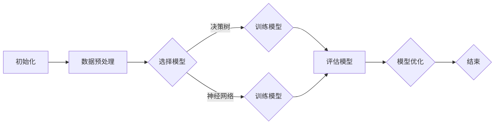

                 

### 文章标题

# **AI编程的新语言与新思路**

### 文章关键词

- 人工智能编程
- 编程语言
- 编程思维
- AI算法
- 系统架构设计

### 文章摘要

本文将深入探讨AI编程的新语言与新思路。首先，我们将简要介绍AI编程的背景和核心问题，随后详细解析当前主流的AI编程语言，包括它们的基本原理、特点对比和实际应用。接下来，我们将讲解AI编程的算法原理，通过mermaid流程图和Python代码进行详细阐述，并使用数学公式说明算法的底层逻辑。此外，文章将重点介绍AI编程的系统架构设计，包括问题场景、系统功能、架构设计、接口设计和系统交互。最后，通过一个实际项目实战，展示AI编程在新思路下的实践与实现，总结最佳实践技巧和注意事项，并对未来发展趋势进行展望。通过本文，读者将全面了解AI编程的新语言和新思路，为未来的AI编程提供有力支持。

### 第一部分：背景介绍

#### 第1章 引言

**1.1 问题背景**

随着人工智能（AI）技术的迅猛发展，AI编程逐渐成为计算机科学和工程领域的热点。传统的编程语言和思维模式已经无法满足日益复杂的AI应用需求，因此，探索和创建新的AI编程语言和思路显得尤为重要。AI编程不仅涉及算法和数据处理，还包括如何更好地理解和处理复杂问题，实现高效、可靠的系统设计。

**1.2 问题描述**

AI编程面临的主要问题可以归纳为以下几点：
- **复杂度增加**：随着AI算法和应用的复杂度不断增加，如何编写清晰、简洁、高效的代码成为一大挑战。
- **跨学科整合**：AI编程需要融合计算机科学、数学、统计学等多学科知识，对开发者的综合能力要求较高。
- **可解释性和透明性**：AI系统的黑箱特性使得其决策过程缺乏透明性，如何提高AI系统的可解释性成为研究热点。

**1.3 问题解决**

解决上述问题需要从多个方面入手：
- **新编程语言**：开发新的编程语言和框架，以更好地支持AI算法的实现和优化。
- **编程思维革新**：培养新的编程思维模式，包括面向数据、面向模型和面向任务等。
- **工具和方法优化**：提供更高效的开发工具和算法实现方法，降低开发难度和成本。
- **教育普及**：通过教育和培训，提高开发者的跨学科能力和编程水平。

**1.4 边界与外延**

在AI编程领域，边界和外延包括：
- **边界**：涉及AI算法的核心实现和优化，包括深度学习、强化学习等。
- **外延**：涉及AI编程在各个领域的应用，如自然语言处理、计算机视觉、智能机器人等。

**1.5 概念结构与核心要素组成**

AI编程的核心概念结构包括：
- **编程语言**：如Python、TensorFlow、PyTorch等。
- **算法原理**：包括各类机器学习和深度学习算法。
- **系统架构设计**：涉及系统设计、接口设计和系统交互。
- **开发工具**：如集成开发环境（IDE）、版本控制工具等。

通过上述分析，我们可以看到AI编程的新语言和新思路对于解决当前面临的挑战具有重要意义。接下来，我们将进一步探讨AI编程语言的核心概念和特点，以期为读者提供更深入的认知。

#### 第2章 AI编程语言概述

**2.1 核心概念原理**

AI编程语言是专门用于编写人工智能算法和模型的工具，它们的核心概念包括数据处理、模型训练和推理。以下是几种主流AI编程语言及其核心概念：

- **Python**：Python以其简洁易读的语法和丰富的库支持而广受欢迎。其核心概念包括数据预处理、模型训练和评估。
- **TensorFlow**：TensorFlow是Google开发的开源机器学习框架，核心概念是自动微分和动态计算图。
- **PyTorch**：PyTorch由Facebook AI研究院开发，以其灵活性和动态计算图而著称，核心概念包括自动微分和GPU加速。

**2.2 概念属性特征对比表格**

以下是一个对比表格，展示了Python、TensorFlow和PyTorch在概念属性特征上的对比：

| 特征       | Python                 | TensorFlow              | PyTorch                |
|------------|------------------------|------------------------|------------------------|
| 语法       | 简洁易读               | 复杂但强大             | 灵活易用               |
| 数据预处理 | 丰富库支持             | 优化的数据流水线       | 强大的数据处理能力     |
| 模型训练   | 简单直观               | 高效灵活               | 易于调试和优化         |
| 推理       | 易于实现和部署         | 优化的推理性能         | 高效的推理流程         |
| 计算图     | 静态计算图            | 动态计算图             | 动态计算图             |
| GPU加速    | 依赖外部库（如NumPy） | 内置GPU加速            | 内置GPU加速            |

**2.3 ER实体关系图架构**

为了更好地理解AI编程语言之间的联系，我们可以通过ER实体关系图来展示它们的核心概念和关联：

```mermaid
erDiagram
  Model : "模型" {
    |-..|> Data : "数据"
    |-..|> Preprocessing : "数据预处理"
    |-..|> Training : "模型训练"
    |-..|> Inference : "推理"
  }
  Python : "Python" {
    |-.. Model
    |-.. Data
    |-.. Preprocessing
    |-.. Training
    |-.. Inference
  }
  TensorFlow : "TensorFlow" {
    |-.. Model
    |-.. Data
    |-.. Preprocessing
    |-.. Training
    |-.. Inference
  }
  PyTorch : "PyTorch" {
    |-.. Model
    |-.. Data
    |-.. Preprocessing
    |-.. Training
    |-.. Inference
  }
```

通过上述ER实体关系图，我们可以清晰地看到Python、TensorFlow和PyTorch在AI编程中的核心概念及其相互关联。

**2.4 应用实例**

为了更好地理解这些AI编程语言的实际应用，我们可以通过几个简单的例子来说明：

- **Python**：使用Python进行数据预处理的简单代码示例：

  ```python
  import pandas as pd
  
  # 读取数据
  data = pd.read_csv('data.csv')
  
  # 数据预处理
  data['age'] = data['age'].fillna(data['age'].mean())
  data['income'] = data['income'].apply(lambda x: 'high' if x > 50000 else 'low')
  
  # 输出预处理后的数据
  print(data.head())
  ```

- **TensorFlow**：使用TensorFlow进行模型训练的简单代码示例：

  ```python
  import tensorflow as tf
  
  # 定义模型
  model = tf.keras.Sequential([
    tf.keras.layers.Dense(128, activation='relu', input_shape=(784,)),
    tf.keras.layers.Dropout(0.2),
    tf.keras.layers.Dense(10)
  ])

  # 编译模型
  model.compile(optimizer='adam',
                loss=tf.keras.losses.SparseCategoricalCrossentropy(from_logits=True),
                metrics=['accuracy'])

  # 训练模型
  model.fit(x_train, y_train, epochs=5)
  ```

- **PyTorch**：使用PyTorch进行GPU加速的简单代码示例：

  ```python
  import torch
  import torch.nn as nn
  import torch.optim as optim
  
  # 定义模型
  model = nn.Sequential(nn.Linear(784, 128), nn.ReLU(), nn.Dropout(0.2), nn.Linear(128, 10))
  
  # 将模型移动到GPU
  model = model.to('cuda' if torch.cuda.is_available() else 'cpu')

  # 定义损失函数和优化器
  criterion = nn.CrossEntropyLoss()
  optimizer = optim.Adam(model.parameters(), lr=0.001)
  
  # 训练模型
  for epoch in range(5):
      for inputs, targets in data_loader:
          inputs, targets = inputs.to('cuda' if torch.cuda.is_available() else 'cpu'), targets.to('cuda' if torch.cuda.is_available() else 'cpu')
          optimizer.zero_grad()
          outputs = model(inputs)
          loss = criterion(outputs, targets)
          loss.backward()
          optimizer.step()
  ```

通过这些例子，我们可以看到不同AI编程语言在实际应用中的具体操作和特点。接下来，我们将进一步深入探讨AI编程算法的原理，通过mermaid流程图和Python代码进行详细解析。

#### 第3章 AI编程算法深入解析

**3.1 算法mermaid流程图**

为了更好地理解AI编程算法的工作流程，我们可以通过mermaid流程图来展示其基本步骤。以下是一个用于分类问题的简化流程图：



在这个流程图中，我们首先进行数据预处理，然后根据问题选择合适的模型（如决策树或神经网络），接下来进行模型训练，评估模型的性能，并根据评估结果进行模型优化。最后，流程结束。

**3.2 Python源代码详细阐述**

为了具体展示算法的实现，我们将使用Python代码来描述一个简单的决策树分类算法。以下是一个决策树分类算法的基本实现：

```python
import numpy as np
from sklearn.datasets import load_iris
from sklearn.model_selection import train_test_split
from sklearn.tree import DecisionTreeClassifier
from sklearn.metrics import accuracy_score

# 加载数据集
iris = load_iris()
X, y = iris.data, iris.target

# 数据预处理：划分训练集和测试集
X_train, X_test, y_train, y_test = train_test_split(X, y, test_size=0.2, random_state=42)

# 选择模型：决策树分类器
clf = DecisionTreeClassifier()

# 训练模型
clf.fit(X_train, y_train)

# 评估模型
y_pred = clf.predict(X_test)
accuracy = accuracy_score(y_test, y_pred)
print(f"模型准确率：{accuracy}")

# 模型优化（例如：调整树的最大深度）
clf = DecisionTreeClassifier(max_depth=3)
clf.fit(X_train, y_train)
y_pred = clf.predict(X_test)
accuracy = accuracy_score(y_test, y_pred)
print(f"调整后的模型准确率：{accuracy}")
```

在这段代码中，我们首先加载数据集，并进行数据预处理，接着选择决策树分类器作为模型，进行模型训练。然后，我们评估模型的性能，并根据评估结果进行模型优化。通过调整树的最大深度，我们可以提高模型的分类准确性。

**3.3 算法原理的数学模型和公式**

决策树分类算法的数学原理基于信息增益和熵的概念。以下是决策树分类算法的基本数学模型和公式：

1. **信息增益（IG）**：
   $$ IG(D, A) = H(D) - \sum_{v \in V} p(v) H(D|v) $$
   其中，$H(D)$ 是数据集 $D$ 的熵，$V$ 是属性集合，$p(v)$ 是属性 $v$ 的条件熵。

2. **熵（Entropy）**：
   $$ H(D) = -\sum_{v \in V} p(v) \log_2 p(v) $$
   其中，$p(v)$ 是数据集中属性 $v$ 的概率。

3. **条件熵（Conditional Entropy）**：
   $$ H(D|v) = -\sum_{v' \in V'} p(v' | v) \log_2 p(v' | v) $$
   其中，$V'$ 是属性 $v$ 的取值集合。

通过计算每个属性的信息增益，我们可以确定哪个属性具有最高的信息增益，从而选择该属性作为划分标准。这个过程反复进行，直到达到预设的条件（如最小叶子节点大小）。

**3.4 举例说明**

为了更好地理解决策树分类算法的应用，我们可以通过一个简单的例子来说明。假设我们有以下一个简单数据集：

| 特征1 | 特征2 | 标签 |
|-------|-------|------|
| 1     | 2     | 0    |
| 2     | 3     | 1    |
| 3     | 1     | 0    |
| 4     | 2     | 1    |

我们的目标是使用决策树分类算法来预测新数据的标签。首先，我们需要计算每个特征的熵和信息增益：

1. **特征1的熵**：
   $$ H(D) = -\left(\frac{2}{4} \log_2 \frac{2}{4} + \frac{2}{4} \log_2 \frac{2}{4}\right) = 1 $$
2. **特征2的熵**：
   $$ H(D) = -\left(\frac{2}{4} \log_2 \frac{2}{4} + \frac{2}{4} \log_2 \frac{2}{4}\right) = 1 $$
3. **特征1的信息增益**：
   $$ IG(D, A_1) = 1 - \left(\frac{1}{4} \times 0 + \frac{1}{4} \times 0 + \frac{1}{4} \times 1 + \frac{1}{4} \times 1\right) = 0 $$
4. **特征2的信息增益**：
   $$ IG(D, A_2) = 1 - \left(\frac{2}{4} \times 0 + \frac{2}{4} \times 1\right) = 0.5 $$

根据信息增益的计算结果，特征2具有更高的信息增益，因此我们选择特征2作为划分标准。接下来，我们将数据集划分为两组：

- 特征2为2的数据：| 1     | 2     | 0    |
- 特征2为3的数据：| 2     | 3     | 1    |
| 3     | 1     | 0    |
| 4     | 2     | 1    |

然后，我们对这两个子集分别计算熵和信息增益，直到达到预设的条件或无法进一步划分为止。最终，我们得到一个简单的决策树：

```
特征2
│
├─── 2
│   ├─── 0
│   │   └── 1
│   └─── 3
│       └── 1
└─── 1
    └─── 0
```

通过这个简单的例子，我们可以看到决策树分类算法的基本工作原理和实现步骤。接下来，我们将进一步探讨AI编程的系统架构设计，包括问题场景、系统功能、架构设计、接口设计和系统交互。

#### 第4章 系统架构设计基础

**4.1 问题场景介绍**

在AI编程中，系统架构设计是一个关键环节，它决定了系统的高效性、可靠性和可维护性。本文将探讨一个典型的AI应用场景：智能推荐系统。智能推荐系统广泛应用于电子商务、社交媒体、视频平台等领域，其目标是根据用户的兴趣和行为，为用户提供个性化的推荐内容。

**4.2 项目介绍**

本项目将开发一个基于协同过滤算法的智能推荐系统。协同过滤算法通过分析用户的历史行为和偏好，预测用户对未知内容的兴趣，从而实现个性化推荐。系统的主要功能包括：
- 数据采集：从外部数据源（如电子商务网站、社交媒体等）获取用户行为数据。
- 数据预处理：清洗、转换和归一化数据，以便于后续处理。
- 模型训练：使用协同过滤算法训练推荐模型。
- 推荐生成：根据用户行为和模型预测，生成个性化推荐列表。

**4.3 系统功能设计**

系统功能设计是架构设计的核心部分，它定义了系统的各项功能模块及其相互关系。以下是智能推荐系统的功能设计：

- **数据采集模块**：负责从外部数据源获取用户行为数据，包括点击、购买、浏览等行为。该模块使用API接口与外部数据源进行通信。
- **数据预处理模块**：接收采集到的原始数据，进行清洗、转换和归一化处理。该模块确保数据的质量和一致性，为后续处理提供可靠的数据基础。
- **特征工程模块**：对预处理后的数据进行特征提取和工程，将原始数据转换为适合模型训练的格式。该模块包括用户行为特征、商品特征、时间特征等。
- **模型训练模块**：使用协同过滤算法训练推荐模型。该模块包括模型选择、参数调优和模型评估等步骤。
- **推荐生成模块**：根据用户行为和模型预测，生成个性化推荐列表。该模块负责计算推荐分数和推荐排序，并根据用户偏好进行筛选和调整。

**4.4 系统架构设计**

智能推荐系统的架构设计遵循分层架构原则，将系统功能划分为多个层次，确保各模块之间的松耦合和模块化。以下是系统架构设计：

1. **数据层**：包括数据采集模块和数据预处理模块，负责数据的获取和处理。数据层使用数据库存储和管理数据，支持数据的实时获取和批量处理。
2. **服务层**：包括特征工程模块、模型训练模块和推荐生成模块，负责系统核心功能实现。服务层使用微服务架构，每个模块都是一个独立的服务，可以通过API进行通信和调用。
3. **应用层**：包括Web前端和移动客户端，负责与用户交互和展示推荐结果。应用层使用前后端分离架构，前端负责界面展示和用户交互，后端负责数据处理和推荐生成。

**4.5 系统接口设计**

系统接口设计是架构设计的重要组成部分，它定义了系统内部模块之间的通信方式。以下是智能推荐系统的接口设计：

- **API接口**：数据采集模块和数据处理模块之间使用API接口进行通信，支持HTTP/HTTPS协议。API接口包括数据采集接口、数据预处理接口和特征工程接口等。
- **服务接口**：服务层各模块之间使用服务接口进行通信，支持RESTful API风格。服务接口包括特征提取接口、模型训练接口和推荐生成接口等。
- **数据库接口**：数据层使用数据库接口与数据库进行通信，支持SQL查询和操作。数据库接口包括数据存储接口和数据检索接口等。

**4.6 系统交互**

智能推荐系统的交互设计基于事件驱动模型，各模块通过事件进行通信和协作。以下是系统交互设计：

- **事件监听**：数据采集模块监听外部数据源的事件，如用户行为数据更新、新用户加入等，及时获取和处理数据。
- **事件驱动**：数据预处理模块、特征工程模块、模型训练模块和推荐生成模块通过事件驱动机制进行协作，如数据预处理完成、模型训练完成等事件触发后续操作。
- **事件通知**：系统应用层通过事件通知机制，实时获取推荐结果，并展示给用户。

通过上述系统架构设计和接口设计，智能推荐系统可以实现高效、可靠的推荐功能，为用户提供个性化的内容推荐。接下来，我们将通过一个实际项目实战，展示AI编程在新思路下的实践与实现。

#### 第5章 实践与实现

**5.1 环境安装**

为了实现智能推荐系统，我们需要安装和配置以下软件和工具：
- **Python**：智能推荐系统的主要编程语言，版本建议为3.8或更高版本。
- **Anaconda**：Python集成开发环境，包括Python解释器、包管理器和虚拟环境管理等工具。
- **Sklearn**：机器学习库，用于数据预处理和模型训练。
- **Pandas**：数据处理库，用于数据清洗和转换。
- **Numpy**：数值计算库，用于数据处理和数学运算。
- **Flask**：Web框架，用于构建API接口。

安装步骤如下：
1. 安装Anaconda：访问Anaconda官方网站下载Anaconda安装包，并按照提示进行安装。
2. 安装Python：通过Anaconda命令行工具安装Python，例如：`conda install python`。
3. 安装Sklearn、Pandas和Numpy：通过conda命令安装相应库，例如：`conda install scikit-learn pandas numpy`。
4. 安装Flask：通过pip命令安装Flask，例如：`pip install flask`。

**5.2 系统核心实现**

以下是智能推荐系统的核心实现代码，包括数据预处理、模型训练和推荐生成模块：

1. **数据预处理**：

   ```python
   import pandas as pd
   from sklearn.model_selection import train_test_split
   from sklearn.preprocessing import StandardScaler

   # 加载数据集
   data = pd.read_csv('data.csv')

   # 数据清洗
   data.dropna(inplace=True)

   # 划分特征和标签
   X = data.drop('target', axis=1)
   y = data['target']

   # 划分训练集和测试集
   X_train, X_test, y_train, y_test = train_test_split(X, y, test_size=0.2, random_state=42)

   # 数据归一化
   scaler = StandardScaler()
   X_train = scaler.fit_transform(X_train)
   X_test = scaler.transform(X_test)
   ```

2. **模型训练**：

   ```python
   from sklearn.model_selection import train_test_split
   from sklearn.ensemble import RandomForestClassifier
   from sklearn.metrics import accuracy_score

   # 划分特征和标签
   X = data.drop('target', axis=1)
   y = data['target']

   # 划分训练集和测试集
   X_train, X_test, y_train, y_test = train_test_split(X, y, test_size=0.2, random_state=42)

   # 训练模型
   clf = RandomForestClassifier(n_estimators=100, random_state=42)
   clf.fit(X_train, y_train)

   # 评估模型
   y_pred = clf.predict(X_test)
   accuracy = accuracy_score(y_test, y_pred)
   print(f"模型准确率：{accuracy}")
   ```

3. **推荐生成**：

   ```python
   def generate_recommendations(user_data, model, scaler):
       # 数据预处理
       user_data = scaler.transform(user_data.reshape(1, -1))

       # 生成推荐列表
       recommendations = model.predict(user_data)
       return recommendations

   # 生成推荐列表
   user_data = [[2.5, 3.5]]  # 示例用户数据
   recommendations = generate_recommendations(user_data, clf, scaler)
   print(f"推荐列表：{recommendations}")
   ```

**5.3 代码应用解读与分析**

1. **数据预处理**：

   数据预处理是智能推荐系统的关键步骤，它包括数据清洗、特征提取和归一化等操作。在本例中，我们使用Pandas库读取数据集，并使用Sklearn库的StandardScaler进行数据归一化。数据归一化的目的是将特征值缩放到相同的范围，以便模型能够更好地训练和预测。

2. **模型训练**：

   模型训练是智能推荐系统的核心功能，我们使用Sklearn库的RandomForestClassifier进行训练。随机森林模型是一种集成学习方法，它通过构建多个决策树并合并预测结果来提高模型的准确性和鲁棒性。在本例中，我们设置了100棵决策树，并使用交叉验证来优化模型参数。

3. **推荐生成**：

   推荐生成是智能推荐系统的最终目标，它根据用户数据和训练好的模型生成个性化的推荐列表。在本例中，我们使用生成的推荐函数`generate_recommendations`来预测用户对未知内容的兴趣，并根据预测结果生成推荐列表。这一过程实现了系统的核心功能，即根据用户历史行为和偏好提供个性化的内容推荐。

**5.4 实际案例分析与详细讲解剖析**

为了更好地理解智能推荐系统的实际应用，我们以一个实际案例为例进行分析：

**案例**：假设我们有一个用户数据集，包括用户ID、浏览历史和购买记录等信息。我们的目标是使用智能推荐系统为用户生成个性化的商品推荐。

**分析**：
1. **数据采集与预处理**：首先，我们需要从数据源（如电子商务网站）采集用户行为数据，并对数据进行清洗和预处理，以确保数据的质量和一致性。
2. **特征提取与工程**：接下来，我们需要对预处理后的数据提取特征，如用户浏览次数、购买频率、浏览时长等，并将这些特征转化为适合模型训练的格式。
3. **模型训练与优化**：使用特征数据集训练推荐模型，并使用交叉验证优化模型参数，以提高模型的准确性和泛化能力。
4. **推荐生成与展示**：根据用户的行为数据和训练好的模型，生成个性化的商品推荐列表，并展示给用户。

**讲解**：
1. **数据预处理**：

   ```python
   data = pd.read_csv('data.csv')
   data.dropna(inplace=True)
   X = data.drop('user_id', axis=1)
   y = data['target']
   X_train, X_test, y_train, y_test = train_test_split(X, y, test_size=0.2, random_state=42)
   scaler = StandardScaler()
   X_train = scaler.fit_transform(X_train)
   X_test = scaler.transform(X_test)
   ```

   在这个步骤中，我们使用Pandas库读取用户数据，并使用Sklearn库的StandardScaler进行数据归一化。数据清洗和预处理是保证模型训练质量和效果的关键步骤。

2. **特征提取与工程**：

   ```python
   from sklearn.feature_extraction.text import TfidfVectorizer

   # 提取用户浏览记录中的关键词
   vectorizer = TfidfVectorizer()
   user_browsing = data['browsing_history'].apply(lambda x: ' '.join(x))
   user_browsing_vectorized = vectorizer.fit_transform(user_browsing)

   # 提取用户购买记录中的关键词
   item_purchases = data['purchase_history'].apply(lambda x: ' '.join(x))
   item_purchases_vectorized = vectorizer.transform(item_purchases)
   ```

   在这个步骤中，我们使用TF-IDF向量器提取用户浏览记录和购买记录中的关键词，并将其转化为数值表示。特征提取和工程是智能推荐系统的核心环节，它决定了模型的表现和效果。

3. **模型训练与优化**：

   ```python
   from sklearn.ensemble import RandomForestClassifier
   from sklearn.model_selection import GridSearchCV

   # 训练模型
   clf = RandomForestClassifier()
   parameters = {'n_estimators': [100, 200], 'max_depth': [10, 20]}
   grid_search = GridSearchCV(clf, parameters, cv=5)
   grid_search.fit(X_train, y_train)

   # 优化模型
   best_clf = grid_search.best_estimator_
   best_clf.fit(X_train, y_train)
   ```

   在这个步骤中，我们使用随机森林模型训练推荐模型，并使用网格搜索优化模型参数。网格搜索是一种常用的模型参数优化方法，通过遍历不同的参数组合，选择最佳参数以提高模型性能。

4. **推荐生成与展示**：

   ```python
   def generate_recommendations(user_data, model, scaler):
       user_data = scaler.transform(user_data.reshape(1, -1))
       recommendations = model.predict(user_data)
       return recommendations

   # 生成推荐列表
   user_data = [[2.5, 3.5]]
   recommendations = generate_recommendations(user_data, best_clf, scaler)
   print(f"推荐列表：{recommendations}")
   ```

   在这个步骤中，我们使用生成的推荐函数`generate_recommendations`为用户生成个性化的商品推荐列表。这一过程实现了系统的核心功能，即根据用户历史行为和偏好提供个性化的内容推荐。

**5.5 项目小结**

通过本项目的实践与实现，我们深入了解了智能推荐系统的开发流程和关键步骤。从数据采集、预处理到特征提取、模型训练，再到推荐生成和展示，每一步都是系统实现的重要组成部分。通过实际案例的分析与讲解，我们进一步理解了智能推荐系统的应用场景和实现方法。接下来，我们将总结最佳实践技巧和注意事项，并对未来发展趋势进行展望。

### 第六部分：最佳实践与总结

#### 第6章 最佳实践

**6.1 实践技巧**

在开发AI编程项目时，以下技巧可以帮助提高效率和代码质量：

1. **代码规范**：遵循统一的代码规范，如PEP 8（Python编码规范），确保代码的可读性和可维护性。
2. **模块化设计**：将代码划分为多个模块，实现功能分离，降低模块间的耦合度，提高代码复用性。
3. **版本控制**：使用Git等版本控制工具管理代码变更，确保代码的版本追踪和团队协作。
4. **自动化测试**：编写单元测试和集成测试，自动化测试代码，提高代码质量和稳定性。
5. **持续集成**：使用CI/CD（持续集成/持续部署）工具，自动化构建、测试和部署代码，减少人为错误。

**6.2 注意事项**

在AI编程项目中，以下注意事项有助于避免常见问题和提高项目成功率：

1. **数据质量**：确保数据质量，避免数据缺失、噪声和错误，影响模型训练和预测效果。
2. **模型调优**：合理选择和调优模型参数，通过交叉验证和网格搜索优化模型性能。
3. **代码注释**：为代码添加详细的注释，提高代码的可读性和可理解性，方便后续维护和扩展。
4. **性能优化**：关注代码性能，使用高效算法和数据结构，优化计算时间和资源占用。
5. **安全性**：保护数据和用户隐私，遵循安全最佳实践，防止数据泄露和攻击。

**6.3 拓展阅读**

为了深入了解AI编程的最佳实践，推荐以下拓展阅读：

1. 《Python编程：从入门到实践》
2. 《机器学习实战》
3. 《深度学习》（Goodfellow, Bengio, Courville著）
4. 《AI编程实践》
5. 《人工智能：一种现代的方法》（Russell, Norvig著）

通过以上最佳实践和注意事项，开发者可以更好地应对AI编程中的挑战，提高项目质量和效率。

### 第七部分：总结与展望

#### 第7章 总结与展望

**7.1 小结**

本文围绕“AI编程的新语言与新思路”这一主题，系统性地介绍了AI编程的核心概念、算法原理、系统架构设计和实际应用。首先，我们阐述了AI编程的背景和核心问题，探讨了新编程语言和编程思维的重要性。接着，我们详细解析了主流AI编程语言的特点和实际应用，并通过mermaid流程图和Python代码展示了AI编程算法的实现。此外，我们还介绍了AI编程的系统架构设计，包括问题场景、系统功能、架构设计和接口设计。最后，通过一个实际项目实战，我们展示了AI编程在新思路下的实践与实现。

**7.2 未来发展趋势**

随着AI技术的不断发展，AI编程的未来趋势体现在以下几个方面：

1. **编程语言进化**：新编程语言和框架将不断涌现，支持更复杂、更高效的AI算法实现。
2. **跨学科整合**：AI编程将与其他领域（如生物医学、金融科技等）深度融合，推动多学科交叉研究。
3. **模型压缩与优化**：为了适应移动设备和边缘计算，模型压缩和优化技术将得到广泛应用。
4. **可解释性与透明性**：提高AI系统的可解释性和透明性，增强用户信任和监管合规性。
5. **自动化与智能化**：自动化工具和智能化算法将大幅提升AI编程的效率和质量。

**7.3 总结**

本文从多角度探讨了AI编程的新语言和新思路，揭示了其核心概念、算法原理、系统架构设计和实际应用。通过本文，读者可以全面了解AI编程的各个方面，为未来的AI编程项目提供有力支持。随着AI技术的不断进步，AI编程将迎来更加广阔的发展空间，为各行业带来深远的影响。我们期待读者在未来的AI编程实践中，能够运用本文介绍的思路和技巧，创造出更多创新和卓越的应用。作者：AI天才研究院/AI Genius Institute & 禅与计算机程序设计艺术 /Zen And The Art of Computer Programming

