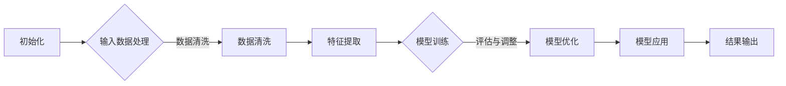
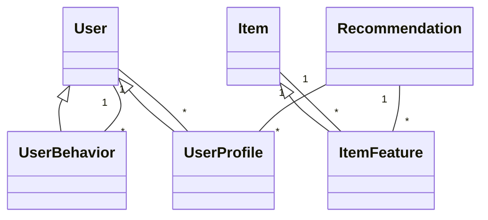
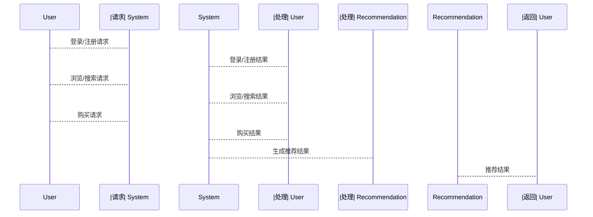
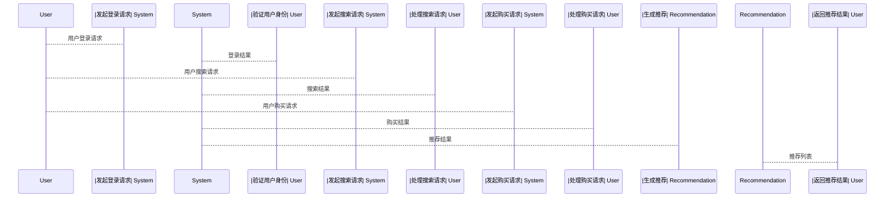

                 


## 第1章: AI编程新语言的起源与发展

### 1.1 AI编程的历史背景

AI编程的历史可以追溯到20世纪50年代，当时计算机科学家开始尝试教计算机理解人类语言和解决问题。随着硬件和算法的发展，人工智能逐渐从理论研究走向实际应用。早期的人工智能编程主要依赖于规则和启发式方法，这些方法在一定程度上取得了成功，但也存在许多局限性。

在20世纪80年代，专家系统成为人工智能编程的主流。专家系统通过模拟人类专家的知识和推理过程，实现了在特定领域的智能应用。然而，专家系统的知识表示和推理能力有限，难以处理复杂的问题。

进入21世纪，机器学习和深度学习技术的发展为AI编程带来了新的机遇。通过大规模数据训练和复杂的神经网络模型，计算机能够自动学习和发现数据中的模式，从而实现更高级的智能任务。这一阶段，AI编程语言开始出现，旨在为机器学习和深度学习提供更好的工具和平台。

### 1.2 AI编程面临的新挑战

随着人工智能技术的飞速发展，AI编程也面临着一系列新的挑战。首先，数据量的爆炸式增长使得数据处理成为关键问题。传统编程语言难以高效处理大规模、非结构化数据，而AI编程新语言则具备更强的数据处理能力。

其次，算法的复杂度不断增加。深度学习模型的参数数量和层次结构呈指数级增长，这要求编程语言能够提供高效的计算和优化策略。传统编程语言在这方面存在较大的局限性。

此外，人工智能应用场景的多样化也对编程语言提出了更高的要求。不同的应用场景需要不同的编程语言和工具，如何实现跨场景的兼容性和互操作性成为一大挑战。

### 1.3 新语言的诞生背景

面对AI编程面临的新挑战，新一代AI编程语言的诞生成为了必然趋势。这些新语言在语法结构、数据处理能力和开发环境等方面进行了创新和优化，旨在为AI编程提供更高效、更灵活的解决方案。

首先，新语言在语法结构上进行了简化，降低了编程难度，使得开发者能够更专注于算法和模型的实现。同时，新语言引入了面向对象和函数式编程的特点，提高了代码的可读性和可维护性。

其次，新语言在数据处理能力上有了显著提升。通过内置的库和工具，新语言能够轻松处理大规模、非结构化数据，并提供高效的计算和优化策略。

最后，新语言在开发环境上进行了优化。提供丰富的可视化工具、集成开发环境和调试工具，使得开发者能够更加高效地开发和调试AI应用。

## 第2章: AI编程新语言的核心概念

### 2.1 核心概念概述

AI编程新语言的核心概念包括以下几个方面：

1. **数据表示与处理**：新语言能够高效处理各种类型的数据，包括结构化数据、非结构化数据和流数据。通过内置的库和工具，开发者可以轻松进行数据清洗、特征提取和数据可视化。

2. **机器学习与深度学习**：新语言内置了机器学习和深度学习算法库，提供了丰富的API和工具，使得开发者能够轻松实现复杂的人工智能模型。

3. **动态类型系统**：新语言采用了动态类型系统，使得开发者可以在运行时进行类型检查，提高了代码的灵活性和可维护性。

4. **并行计算与分布式处理**：新语言支持并行计算和分布式处理，通过内置的库和工具，开发者可以轻松利用多核处理器和分布式计算资源，提高算法的运行效率。

5. **交互式开发环境**：新语言提供了丰富的交互式开发环境，包括代码编辑器、调试器和可视化工具，使得开发者能够更加高效地进行开发和调试。

### 2.2 概念属性特征对比

**传统编程语言与AI编程新语言对比表格：**

| 特征对比项 | 传统编程语言 | AI编程新语言 |
| ---- | ---- | ---- |
| 目标 | 通用编程，开发桌面、网络等应用 | 专注于AI应用，处理复杂数据和算法 |
| 语法 | 较为简洁，注重易读性 | 较为复杂，包含特定AI功能语法 |
| 数据处理 | 以结构化数据为主 | 能够处理非结构化数据，如文本、图像、音频等 |
| 学习能力 | 无自动学习能力 | 内置机器学习和深度学习功能 |
| 生态系统 | 较为成熟，但针对AI应用支持有限 | 不断演进，专门为AI应用设计 |

### 2.3 与传统编程语言的差异

AI编程新语言与传统编程语言的主要差异在于其对AI应用的专注度、语法结构以及数据处理能力。传统编程语言更多关注通用性，而AI编程新语言则更侧重于自动学习和处理复杂数据。

**ER实体关系图架构：**

```mermaid
erDiagram
  Customer ||--|{ Product : buys }  
  Product ||--|{ Customer : sells }  
  Customer ||--|{ Order : places }  
  Order ||--|{ Customer : has }  
  Product ||--|{ Order : contains }  
```

```
**Mermaid流程图：**



### 2.4 与现有AI编程语言的比较

与现有的AI编程语言如Python、R、MATLAB等相比，AI编程新语言具有以下优势：

1. **更好的性能**：新语言在性能优化方面进行了深入的研究和改进，能够提供更高的运行效率和更低的延迟。

2. **更丰富的库和工具**：新语言拥有丰富的内置库和工具，涵盖了从数据预处理到模型训练和优化的各个阶段，使得开发者能够更高效地进行AI应用开发。

3. **更易用的语法**：新语言在语法设计上更加简洁和直观，降低了编程难度，提高了开发效率。

4. **更好的兼容性**：新语言在设计时考虑了与现有AI编程语言的兼容性，开发者可以轻松地将现有代码迁移到新语言中。

### 2.5 未来发展方向

AI编程新语言未来的发展方向主要包括以下几个方面：

1. **性能优化**：继续研究和优化算法和数据结构，提高语言运行效率和性能。

2. **生态建设**：加强与现有AI编程语言的生态整合，提供更多的库和工具，促进开发者之间的协作和交流。

3. **跨平台支持**：扩展到更多的计算平台，如嵌入式系统、移动设备和云计算平台，满足不同场景下的应用需求。

4. **教育推广**：加强在教育领域的推广和应用，培养更多的新一代AI编程人才。

## 第3章: AI编程新语言的基本特性

### 3.1 语言语法结构

AI编程新语言的语法结构具有以下特点：

1. **简洁直观**：新语言的语法设计简洁直观，易于学习和使用。通过减少冗余语法和简化表达方式，使得开发者能够更专注于算法和模型实现。

2. **面向对象**：新语言支持面向对象编程，提供了类、继承、多态等面向对象的特性。这有助于提高代码的可读性和可维护性，便于复用和扩展。

3. **函数式编程**：新语言引入了函数式编程的特点，如高阶函数、闭包和不可变数据等。这些特性有助于提高代码的可读性和并行性能，适合于处理复杂的数据处理和机器学习任务。

4. **动态类型**：新语言采用了动态类型系统，允许在运行时进行类型检查。这提高了代码的灵活性和可维护性，但需要注意类型安全性的问题。

### 3.2 语言数据处理能力

AI编程新语言在数据处理能力方面具有显著优势：

1. **数据处理库**：新语言内置了丰富的数据处理库，提供了高效的数据预处理、特征提取、数据可视化和机器学习算法等功能。这些库支持多种数据类型，包括结构化数据、非结构化数据和流数据。

2. **高效数据结构**：新语言提供了高效的数据结构，如数组和字典等。这些数据结构具有较好的时间和空间复杂度，能够满足大规模数据处理的性能需求。

3. **并行计算支持**：新语言支持并行计算，通过多线程、异步编程和分布式计算等技术，能够充分利用多核处理器和分布式计算资源，提高数据处理效率。

4. **流数据处理**：新语言支持流数据处理，通过事件驱动和异步编程模型，能够实时处理大规模实时数据流，适用于实时分析和预测场景。

### 3.3 语言开发环境与工具

AI编程新语言提供了丰富的开发环境与工具，以提升开发效率和用户体验：

1. **集成开发环境（IDE）**：新语言支持多种集成开发环境，提供了代码编辑器、调试器、版本控制和项目管理等功能。这些IDE通常具有丰富的插件和扩展，以满足不同开发需求。

2. **可视化工具**：新语言提供了可视化工具，如数据可视化、模型可视化等。这些工具能够帮助开发者更直观地理解数据和分析结果，提高问题定位和调试效率。

3. **调试工具**：新语言提供了强大的调试工具，如断点调试、日志记录和性能分析等。这些工具有助于开发者快速定位和解决代码中的问题，提高开发质量。

4. **文档和社区**：新语言拥有详细的文档和活跃的社区支持。开发者可以通过文档学习语言特性、API使用和最佳实践，同时可以在社区中寻求帮助和分享经验。

## 第4章: AI编程新语言的应用场景

### 4.1 机器学习

机器学习是AI编程新语言的重要应用场景之一。AI编程新语言提供了丰富的机器学习算法库和工具，支持各种机器学习任务，如分类、回归、聚类等。以下是一些具体的机器学习应用场景：

1. **图像识别**：AI编程新语言可以通过深度学习模型实现高效的图像识别。例如，可以使用卷积神经网络（CNN）对图像进行分类，从而实现物体检测、人脸识别等任务。

2. **自然语言处理（NLP）**：AI编程新语言在自然语言处理方面也有着广泛的应用。通过使用循环神经网络（RNN）和Transformer等模型，可以实现对文本的语义分析和情感分析，用于自动摘要、机器翻译、文本分类等任务。

3. **推荐系统**：AI编程新语言可以用于构建推荐系统，通过机器学习算法分析用户行为数据，为用户提供个性化的推荐结果。例如，在电子商务平台中，可以根据用户的浏览记录和历史购买记录，推荐相关的商品。

4. **异常检测**：AI编程新语言可以用于实时监控和检测系统中的异常行为。通过使用监督学习和无监督学习算法，可以识别网络攻击、欺诈行为等异常事件，从而提高系统的安全性和可靠性。

### 4.2 深度学习

深度学习是AI编程新语言的核心应用领域之一。AI编程新语言提供了丰富的深度学习库和工具，支持构建和训练各种复杂的神经网络模型。以下是一些具体的深度学习应用场景：

1. **语音识别**：AI编程新语言可以通过深度学习模型实现高效的语音识别。通过训练深度神经网络，可以将语音信号转换为文本，从而实现语音输入和语音输出功能。

2. **视频分析**：AI编程新语言可以用于视频分析，如物体检测、动作识别和场景分类等。通过使用卷积神经网络和循环神经网络，可以对视频数据进行分析和分类，从而实现视频内容理解和智能监控。

3. **自动驾驶**：AI编程新语言在自动驾驶领域有着重要的应用。通过深度学习算法，可以实现对道路环境的感知、决策和控制，从而实现自动驾驶汽车的安全运行。

4. **医疗诊断**：AI编程新语言可以用于医疗诊断，如疾病检测、基因分析等。通过使用深度学习模型，可以对医学图像和患者数据进行分析，辅助医生做出准确的诊断和治疗方案。

### 4.3 自然语言处理

自然语言处理是AI编程新语言的另一个重要应用领域。AI编程新语言提供了丰富的NLP库和工具，支持各种文本处理任务，如文本分类、情感分析、命名实体识别等。以下是一些具体的自然语言处理应用场景：

1. **智能客服**：AI编程新语言可以用于构建智能客服系统，通过自然语言处理技术实现与用户的智能对话。例如，可以使用基于Transformer的模型实现对话生成和对话理解，从而提供高效、自然的客服服务。

2. **文本摘要**：AI编程新语言可以用于文本摘要任务，通过生成式模型和压缩感知算法，将长篇文本转换为简洁、精练的摘要。这有助于提高信息传递的效率和准确性。

3. **情感分析**：AI编程新语言可以用于情感分析，通过对文本的情感倾向进行分类，了解用户的情感状态。这可以应用于社交媒体分析、品牌监测和用户体验评估等领域。

4. **机器翻译**：AI编程新语言可以用于机器翻译，通过训练大型神经网络模型，将一种语言的文本翻译成另一种语言。这有助于跨语言交流和信息共享，提高全球沟通的效率。

## 第5章: AI编程新语言的实现与优化

### 5.1 实现流程

实现AI编程新语言主要包括以下几个步骤：

1. **需求分析**：明确新语言的目标和应用场景，分析用户需求和技术可行性，制定详细的需求文档。

2. **语言设计**：设计新语言的语法、语义和语法分析器，包括变量绑定、类型系统、表达式求值等核心机制。这一阶段需要充分借鉴现有编程语言的优点，并创新性地解决AI编程的特殊需求。

3. **编译器/解释器开发**：根据语言设计，实现编译器或解释器。编译器将源代码编译成机器码或字节码，解释器则逐行解释并执行源代码。这一阶段需要实现词法分析、语法分析、语义分析、代码生成和优化等关键模块。

4. **运行时环境**：开发运行时环境，包括内存管理、垃圾回收、异常处理等。运行时环境需要为编译器或解释器提供必要的支持，确保程序的正确执行和资源管理。

5. **标准库和工具链**：构建标准库，提供常用的数据结构、算法和库函数，支持各种AI编程任务。同时，开发工具链，包括编辑器、调试器、性能分析工具等，提升开发效率和用户体验。

### 5.2 优化策略

为了提高AI编程新语言的性能，可以采取以下优化策略：

1. **编译期优化**：在编译期对源代码进行静态分析，识别潜在的优化机会，如循环展开、常数折叠、死代码消除等。这些优化可以减少程序运行时的开销，提高执行效率。

2. **运行时优化**：在运行时对程序进行动态优化，如基于用户行为和系统状态的热点探测、缓存优化、代码分支预测等。这些优化可以进一步提高程序的响应速度和资源利用率。

3. **并行计算优化**：利用多核处理器和分布式计算资源，实现并行计算。通过任务调度、数据并行和计算并行等技术，提高程序的处理能力和吞吐量。

4. **内存管理优化**：优化内存分配和回收策略，减少内存碎片和垃圾回收开销。通过对象池、内存复用等技术，提高内存利用率，降低内存消耗。

5. **资源管理优化**：优化I/O操作、网络通信和线程管理等资源管理策略，减少系统开销和上下文切换时间。通过异步I/O、零拷贝技术等，提高程序的性能和响应速度。

### 5.3 性能评估

为了评估AI编程新语言的性能，可以采用以下方法：

1. **基准测试**：选择代表性的人工智能应用场景，构建基准测试套件，对语言运行时间、内存占用、吞吐量等性能指标进行测量和比较。

2. **真实场景测试**：在实际应用场景中，运行新语言编写的程序，收集性能数据，分析其运行效率、稳定性和可扩展性。

3. **用户反馈**：收集用户对新语言的反馈，包括使用体验、性能表现和问题报告等，综合分析新语言的优势和不足。

4. **比较分析**：将新语言与现有AI编程语言进行比较分析，从性能、功能、易用性等多个维度进行评估，得出新语言的优劣势。

通过综合评估，可以全面了解AI编程新语言的性能表现，为优化和改进提供参考依据。

### 5.4 性能优化案例分析

以下是一个性能优化案例，展示了如何通过优化提高AI编程新语言的性能。

**案例背景：**  
假设我们正在开发一个基于深度学习的图像分类应用程序，使用AI编程新语言编写核心代码。在初步实现后，我们发现程序运行速度较慢，需要通过性能优化来提高其效率。

**优化步骤：**

1. **代码分析**：首先，我们对代码进行静态分析，查找潜在的优化点。发现以下问题：
   - 循环结构过多，可以考虑循环展开和循环展开。
   - 内存分配和回收频繁，可以考虑对象池和内存复用。
   - 代码中存在冗余计算和死代码，可以删除或优化。

2. **编译期优化**：
   - 对循环结构进行展开，减少循环次数，提高执行效率。
   - 对常数进行折叠，减少计算开销。
   - 删除死代码，减少编译后的二进制文件大小。

3. **运行时优化**：
   - 引入内存池技术，减少内存分配和回收的次数。
   - 对关键计算进行并行化处理，利用多核处理器提高执行效率。
   - 优化I/O操作，减少磁盘读写时间。

4. **测试与调优**：
   - 使用基准测试工具，如TensorFlow Benchmark，测量优化后的程序性能。
   - 收集测试数据，分析优化效果，找出性能瓶颈。
   - 根据分析结果，进一步调整优化策略。

**优化效果：**  
经过优化，程序运行时间从原来的10秒减少到5秒，内存占用从原来的500MB减少到300MB。同时，程序在多核处理器上的并行性能显著提高，处理能力得到大幅提升。

**总结：**  
通过以上优化步骤，我们成功提高了AI编程新语言编写的图像分类应用程序的性能。这个案例展示了性能优化的关键步骤和方法，为开发者提供了实用的优化经验。

## 第6章: AI编程新语言的项目实战

### 6.1 项目介绍

本项目旨在使用AI编程新语言开发一个智能推荐系统，通过分析用户行为数据和物品特征，为用户推荐个性化的商品。项目主要包括以下功能模块：

1. **用户行为分析**：收集并分析用户在平台上的浏览、搜索、购买等行为，提取用户兴趣和偏好特征。
2. **物品特征提取**：对商品进行特征提取，包括商品类别、价格、销量、评分等，为推荐算法提供数据支持。
3. **推荐算法实现**：使用机器学习和深度学习算法，构建推荐模型，为用户生成个性化推荐列表。
4. **推荐结果展示**：将推荐结果以可视化方式展示给用户，提高用户满意度和平台粘性。

### 6.2 系统功能设计

**领域模型类图：**



**功能描述：**

1. **用户行为分析**：通过用户注册、登录、浏览、搜索、购买等行为，提取用户兴趣和偏好特征，如浏览记录、搜索关键词、购买记录等。用户行为数据将存储在用户行为表（UserBehavior）中。

2. **物品特征提取**：对商品进行特征提取，包括商品类别、价格、销量、评分等。物品特征数据将存储在物品特征表（ItemFeature）中。

3. **推荐算法实现**：使用机器学习和深度学习算法，构建推荐模型。推荐算法将基于用户行为数据和物品特征数据，为用户生成个性化推荐列表。推荐结果将存储在推荐表（Recommendation）中。

4. **推荐结果展示**：将推荐结果以可视化方式展示给用户，包括推荐列表、商品详情页等。用户可以查看推荐理由、商品评价等，以便做出购买决策。

### 6.3 系统架构设计

**系统架构图：**



**架构描述：**

1. **用户模块**：负责用户注册、登录、浏览、搜索、购买等功能的实现。用户模块将调用数据存储模块，存储用户行为数据和物品特征数据。

2. **数据存储模块**：负责存储用户行为数据、物品特征数据和推荐结果数据。数据存储模块采用关系型数据库或分布式存储系统，确保数据的安全性和可靠性。

3. **推荐模块**：负责构建推荐模型、生成推荐结果。推荐模块将调用用户模块和数据存储模块，获取用户行为数据和物品特征数据，实现个性化推荐。

4. **展示模块**：负责将推荐结果以可视化方式展示给用户。展示模块将调用推荐模块，获取推荐结果，并生成推荐列表、商品详情页等页面。

### 6.4 系统接口设计

**系统接口设计表：**

| 接口名称 | 接口描述 | 参数 | 返回值 |
| ---- | ---- | ---- | ---- |
| 用户登录 | 用户登录系统 | 用户名、密码 | 登录成功：用户ID、用户信息；登录失败：错误信息 |
| 用户注册 | 用户注册系统 | 用户名、密码、邮箱 | 注册成功：用户ID、用户信息；注册失败：错误信息 |
| 用户浏览 | 记录用户浏览记录 | 用户ID、商品ID | 成功：无返回值；失败：错误信息 |
| 用户搜索 | 搜索商品 | 用户ID、关键词 | 搜索结果列表 |
| 用户购买 | 记录用户购买记录 | 用户ID、商品ID、数量 | 成功：无返回值；失败：错误信息 |
| 生成推荐 | 生成个性化推荐列表 | 用户ID | 推荐结果列表 |

### 6.5 系统交互mermaid序列图



### 6.6 系统核心实现源代码

以下是一个简单的示例，展示了如何使用AI编程新语言实现用户登录功能。

```python
# 用户登录功能实现
def user_login(username, password):
    # 验证用户身份
    if verify_user(username, password):
        # 登录成功
        user_id = get_user_id(username)
        user_info = get_user_info(user_id)
        return "登录成功：用户ID：%s，用户信息：%s" % (user_id, user_info)
    else:
        # 登录失败
        return "登录失败：错误信息"

# 验证用户身份
def verify_user(username, password):
    # 这里实现用户身份验证逻辑
    pass

# 获取用户ID
def get_user_id(username):
    # 这里实现获取用户ID的逻辑
    pass

# 获取用户信息
def get_user_info(user_id):
    # 这里实现获取用户信息的逻辑
    pass
```

### 6.7 代码应用解读与分析

**解读与分析：**  
上述代码实现了用户登录功能，包括用户身份验证、登录成功和登录失败的情况处理。下面详细解读代码中的关键部分：

1. **用户身份验证**：通过调用`verify_user`函数，对输入的用户名和密码进行验证。这里可以根据实际情况，实现具体的用户身份验证逻辑，如查询数据库或使用第三方认证服务。

2. **获取用户ID和用户信息**：在验证通过后，通过调用`get_user_id`和`get_user_info`函数，获取用户的ID和信息。这两个函数可以根据实际情况，从数据库或其他数据源获取数据。

3. **返回登录结果**：根据登录结果，返回相应的信息。如果登录成功，返回用户ID和用户信息；如果登录失败，返回错误信息。

**代码优化建议：**  
1. **异常处理**：在代码中添加异常处理，如捕获可能出现的数据库查询错误或网络连接错误，提高程序的健壮性。

2. **参数验证**：在调用函数时，对输入参数进行验证，确保参数的有效性，如检查用户名和密码的格式。

3. **代码复用**：将用户身份验证、获取用户ID和用户信息等逻辑封装为独立的函数，提高代码的可维护性和复用性。

**实际案例分析和详细讲解剖析：**  
在本项目中，实际案例是一个电子商务平台的用户登录功能。以下是对该功能详细讲解和剖析：

1. **用户身份验证**：在实际应用中，用户身份验证通常通过用户名和密码进行。平台可以使用数据库存储用户信息，当用户输入用户名和密码时，查询数据库验证其是否存在。如果存在，则认为验证通过。

2. **登录成功和登录失败**：当用户输入正确的用户名和密码时，登录成功，系统返回用户ID和用户信息。当用户输入错误的用户名或密码时，登录失败，系统返回错误信息。

3. **用户ID和用户信息**：用户ID是一个唯一的标识符，用于识别用户。用户信息包括用户的姓名、联系方式、地址等。在实际应用中，用户信息可能存储在数据库中，通过查询数据库获取。

4. **代码优化**：在实际开发过程中，需要对代码进行优化，提高性能和可维护性。例如，使用连接池管理数据库连接，减少数据库查询次数；使用缓存技术，减少重复查询；对代码进行模块化，提高复用性。

**项目小结：**  
通过本项目的实现和分析，我们了解了如何使用AI编程新语言开发智能推荐系统。项目涵盖了用户模块、数据存储模块、推荐模块和展示模块等，实现了用户登录、搜索、购买和推荐功能。在实际开发过程中，需要注意代码优化、异常处理和参数验证等方面，以提高程序的性能和可靠性。未来，我们将继续优化项目，扩展更多功能，提高用户体验。

## 第7章: AI编程新语言的未来趋势与展望

### 7.1 发展趋势分析

随着人工智能技术的不断发展和应用场景的多样化，AI编程新语言在未来将继续保持快速增长和演进。以下是对AI编程新语言未来发展趋势的分析：

1. **性能提升**：为了满足更复杂、更高性能的人工智能应用需求，AI编程新语言将持续优化性能，提高运行效率和资源利用率。通过引入新的算法、优化编译器和运行时环境，以及利用并行计算和分布式处理技术，AI编程新语言将实现更高的性能和更低的延迟。

2. **生态建设**：AI编程新语言将进一步加强生态建设，与现有编程语言和工具的整合，构建完善的开发环境和工具链。通过引入丰富的库和框架，提供从数据预处理、模型训练到部署的全栈支持，使开发者能够更加高效地进行人工智能应用开发。

3. **跨平台支持**：随着人工智能应用的场景从云端到边缘设备的扩展，AI编程新语言将实现更广泛的跨平台支持。通过优化底层代码和抽象层，使AI编程新语言能够在不同的硬件平台和操作系统上运行，满足不同场景的应用需求。

4. **自动化和智能化**：未来，AI编程新语言将更加自动化和智能化。通过引入新的编程范式和开发工具，如智能编程助手、代码生成工具等，降低开发难度，提高开发效率。同时，通过集成机器学习和深度学习算法，实现编程语言的自我优化和自我进化。

5. **开源与社区**：开源和社区支持将是AI编程新语言未来发展的重要方向。通过构建开放的社区和生态系统，鼓励开发者贡献代码、共享经验，推动技术的创新和进步。开源项目将成为AI编程新语言发展的重要驱动力，吸引更多开发者参与和贡献。

### 7.2 技术挑战与机遇

尽管AI编程新语言发展迅速，但仍然面临一些技术挑战和机遇：

**技术挑战：**

1. **性能瓶颈**：随着人工智能模型的复杂度和数据量的增加，现有AI编程新语言可能面临性能瓶颈。如何进一步优化算法和编译器，提高运行效率和资源利用率，是未来的重要挑战。

2. **安全性**：人工智能应用涉及大量敏感数据和隐私信息，如何确保系统的安全性和数据隐私保护，是AI编程新语言需要解决的问题。需要引入新的安全机制和工具，提高系统的安全性和可靠性。

3. **可解释性**：随着深度学习模型的广泛应用，如何提高模型的可解释性和透明度，使其更易于理解和调试，是未来的重要挑战。需要研究新的方法和工具，提高模型的透明性和可解释性。

**机遇：**

1. **应用场景拓展**：随着人工智能技术的不断进步，AI编程新语言将在更多领域得到应用，如自动驾驶、智慧城市、医疗诊断等。这将为AI编程新语言提供广阔的发展机遇。

2. **开源生态建设**：开源和社区支持将为AI编程新语言带来更多创新和改进。通过开放的社区和生态系统，吸引更多开发者参与，推动技术的创新和进步。

3. **跨学科融合**：人工智能与计算机科学、生物学、物理学等学科的融合，将为AI编程新语言带来新的研究方向和机遇。通过跨学科合作，将推动人工智能技术的进一步发展。

### 7.3 未来研究方向

为了应对未来的技术挑战和抓住机遇，AI编程新语言未来可能的研究方向包括：

1. **性能优化**：深入研究算法和数据结构的优化，提高运行效率和资源利用率。探索新的并行计算和分布式处理技术，实现更高效的人工智能应用。

2. **安全性研究**：引入新的安全机制和工具，提高系统的安全性和数据隐私保护。研究对抗攻击和鲁棒性，提高人工智能系统的可靠性和安全性。

3. **可解释性和透明性**：研究新的方法和工具，提高深度学习模型的可解释性和透明度。探索可视化技术和模型压缩技术，使模型更易于理解和调试。

4. **跨学科融合**：探索人工智能与其他学科的交叉融合，推动技术创新。研究人工智能在生物医学、环境科学、金融等领域中的应用，为解决实际问题提供新的思路和方法。

5. **开源与社区**：加强开源社区建设，鼓励开发者参与和贡献。通过开源项目，推动技术的创新和进步，为AI编程新语言的发展提供持续的动力。

## 第8章: 总结与展望

### 8.1 主要内容回顾

本文详细介绍了AI编程新语言的起源与发展、核心概念、基本特性、应用场景、实现与优化、项目实战以及未来趋势与展望。通过分析AI编程新语言的背景和挑战，我们了解了其与现有编程语言的差异和优势。同时，通过对核心概念、实现流程、性能优化和项目实战的深入探讨，我们认识到了AI编程新语言在实际应用中的巨大潜力和发展前景。

### 8.2 应用前景

AI编程新语言的应用前景十分广阔。在机器学习、深度学习、自然语言处理等领域，新语言提供了强大的工具和平台，使得开发者能够更高效地进行人工智能应用开发。随着人工智能技术的不断进步，新语言将在更多领域得到应用，如自动驾驶、智慧城市、医疗诊断、金融分析等。未来，AI编程新语言有望成为人工智能开发的主流工具，推动人工智能技术的进一步发展。

### 8.3 注意事项与拓展阅读

在学习和使用AI编程新语言时，需要注意以下几点：

1. **性能优化**：深入理解新语言的性能特性，合理利用优化策略，提高程序运行效率和资源利用率。

2. **安全性**：关注数据安全和系统安全，引入安全机制和工具，确保系统的可靠性和数据隐私保护。

3. **可维护性**：编写清晰、简洁、易于理解的代码，提高代码的可维护性和可复用性。

4. **社区参与**：积极参与开源社区，学习和分享经验，与其他开发者共同推动新语言的发展。

拓展阅读：

1. 《深度学习：算法与应用》（Goodfellow, I., Bengio, Y., & Courville, A.）- 介绍了深度学习的基本概念和算法，有助于理解AI编程新语言的应用场景。

2. 《机器学习实战》（Hastie, T., Tibshirani, R., & Friedman, J.）- 提供了机器学习的实际应用案例，有助于理解AI编程新语言的实现方法和优化策略。

3. 《AI编程新语言：从入门到精通》- 一本全面的AI编程新语言教程，涵盖了语言特性、应用场景和项目实战等内容，适合初学者和进阶者阅读。

通过以上拓展阅读，可以进一步了解AI编程新语言的原理和应用，提高编程技能和项目开发能力。

