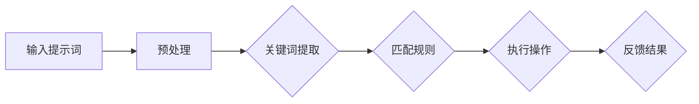
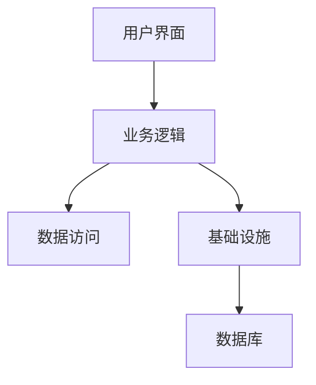
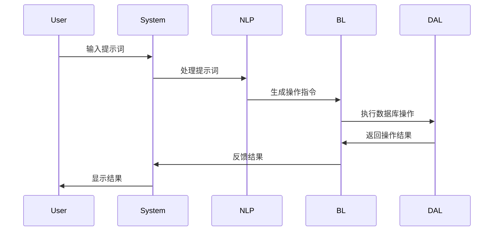

                 


# 效率倍增器：提示词驱动的智能工作助手

## 关键词
效率提升、提示词、智能助手、工作流程优化

## 摘要
本文将深入探讨《效率倍增器：提示词驱动的智能工作助手》一书的核心内容。该书旨在通过介绍一种新型的工作助手，利用提示词技术来极大提高工作效率。本文将逐步解析该书中的关键概念、功能模块、实战案例以及最佳实践，帮助读者理解如何将这些智能工具应用到日常工作中。

## 引言

在信息爆炸和任务繁多的现代工作环境中，提高工作效率成为了每个职场人士的追求。传统的提高工作效率的方法往往依赖于个人习惯和时间管理技巧，但它们的效果往往有限。《效率倍增器：提示词驱动的智能工作助手》则提供了一种全新的思路，即通过智能工作助手和提示词技术来优化工作流程，从而实现效率倍增。

### 1. 书名理解

《效率倍增器：提示词驱动的智能工作助手》这个书名首先引发了几个关键问题：

- **效率倍增器**是什么？它如何工作？
- **提示词**在这里扮演什么角色？
- **智能工作助手**如何辅助我们的日常工作？

这些问题的答案构成了本书的核心内容。

### 2. 核心概念

在进一步讨论之前，我们需要明确几个核心概念：

- **效率倍增器**：这是一个广义的概念，指的是任何能够提高工作效率的工具或系统。
- **提示词**：在本书的上下文中，提示词是一种通过关键词或短语来触发特定功能的机制。
- **智能工作助手**：这是指利用人工智能和自然语言处理技术，能够理解、学习和辅助用户完成工作的软件。

### 3. 问题背景

随着技术的发展，尤其是人工智能和自然语言处理技术的进步，传统的效率提升方法逐渐显现出局限性。例如，手动记录任务、重复执行繁琐的操作等，不仅费时费力，还容易出错。因此，需要一种更智能、更高效的解决方案来辅助工作。

### 4. 问题描述

在复杂的工作环境中，用户面临以下问题：

- **任务繁多**：需要处理大量的任务，难以管理。
- **信息过载**：需要处理大量的信息，难以筛选和利用。
- **效率低下**：重复性工作占用大量时间，导致工作效率低下。

### 5. 问题解决

《效率倍增器：提示词驱动的智能工作助手》提供了一种解决方案：

- **自动化**：通过智能工作助手自动化执行重复性任务。
- **智能化**：利用提示词技术，快速准确地处理信息和任务。
- **个性化**：根据用户的工作习惯和需求，提供个性化的服务。

### 6. 边界与外延

虽然本书的核心是讨论智能工作助手和提示词技术，但它的应用范围远远超出了单一的工作场景。例如，它还可以应用于教育、医疗、金融等多个领域，帮助专业人士提高工作效率。

### 7. 概念结构与核心要素组成

为了更好地理解《效率倍增器：提示词驱动的智能工作助手》，我们需要了解其概念结构：

- **提示词机制**：这是智能工作助手的基石，通过关键词或短语来触发功能。
- **自然语言处理**：这是智能工作助手的核心技术，使它能够理解用户的指令和需求。
- **任务管理**：智能工作助手通过自动化和智能化手段，帮助用户管理任务。
- **信息处理**：智能工作助手能够快速处理大量信息，提供有价值的洞见。

## 核心概念与联系

### 提示词驱动的智能工作助手

提示词驱动的智能工作助手是一种利用提示词技术，通过自然语言处理和人工智能技术来辅助用户完成任务的工具。它的核心概念包括：

- **提示词**：这是用户与智能工作助手交互的入口，通过输入关键词或短语来触发特定功能。
- **自然语言处理（NLP）**：智能工作助手使用NLP技术来理解用户的指令和需求，并将其转化为具体的操作。
- **人工智能（AI）**：智能工作助手利用AI技术，通过学习用户的习惯和偏好，提供更加个性化的服务。

### 功能模块

智能工作助手的功能模块可以分为以下几个方面：

- **任务管理**：包括创建任务、分类任务、优先级设置、任务进度追踪等。
- **日程管理**：包括日程安排、提醒设置、事件记录等。
- **信息处理**：包括信息筛选、整理、分类、摘要等。
- **自动化操作**：通过自动化脚本和流程，减少用户的重复性工作。

### 概念属性特征对比表格

为了更直观地了解提示词驱动的智能工作助手与其他工具的区别，我们可以制作一个概念属性特征对比表格：

| 特征                 | 提示词驱动的智能工作助手 | 传统工具                |
|----------------------|--------------------------|-------------------------|
| 用户交互方式         | 自然语言处理             | 图形界面、按钮点击     |
| 自动化程度           | 高度自动化               | 低度自动化             |
| 个性化服务           | 强调个性化服务           | 一致性服务             |
| 信息处理能力         | 强大                     | 有限                    |

### ER实体关系图架构

为了更好地理解智能工作助手的内部结构，我们可以使用Mermaid绘制ER实体关系图：

```mermaid
erDiagram
    User ||--|{ Task }|:
    User ||--|{ CalendarEvent }|:
    User ||--|{ Note }|:
    Task ||--|{ Tag }|:
    CalendarEvent ||--|{ Tag }|:
    Note ||--|{ Tag }|:
    User }|--|{ Tag }|:
```

在这个ER图中，用户与任务、日程事件、笔记等多个实体之间存在关联，而标签则用于分类和筛选，提高了信息处理的效率。

## 算法原理讲解

### 提示词匹配算法

提示词匹配算法是智能工作助手的核心算法之一，负责解析用户的输入，并匹配相应的操作。以下是该算法的流程和原理：

#### 1. 算法流程



#### 2. 原理解析

- **预处理**：对输入的提示词进行格式化和分词，提取出关键信息。
- **关键词提取**：根据预定的规则，提取出与任务或功能相关的关键词。
- **匹配规则**：使用匹配算法，将关键词与预定义的操作规则进行匹配。
- **执行操作**：根据匹配结果，执行相应的操作，如创建任务、修改日程等。
- **反馈结果**：将操作结果反馈给用户，如提示任务已创建、日程已修改等。

#### 3. 数学模型

提示词匹配算法可以使用以下数学模型进行描述：

$$
匹配度 = f(关键词, 操作规则)
$$

其中，$f$ 函数表示匹配度计算方法，通常使用模糊匹配、精确匹配等方法。

#### 4. 示例

例如，当用户输入“明天下午2点会议”时，系统会提取出“明天”、“下午2点”、“会议”等关键词，并与预定义的会议日程规则进行匹配，最终生成相应的日程事件。

### 代码示例

以下是使用Python实现提示词匹配算法的代码示例：

```python
import re

def preprocess(text):
    # 去除标点符号
    text = re.sub(r'[^\w\s]', '', text)
    # 分词
    words = text.split()
    return words

def extract_keywords(words):
    # 预定义关键词列表
    keywords = ["会议", "任务", "明天", "下午", "上午", "删除", "修改"]
    # 提取关键词
    extracted = [word for word in words if word in keywords]
    return extracted

def match_keywords(keywords, rules):
    # 预定义匹配规则
    rules = {
        "会议": "create_calendar_event",
        "任务": "create_task",
        "明天": "tomorrow",
        "下午": "afternoon",
        "上午": "morning"
    }
    # 匹配关键词
    matched = {}
    for keyword in keywords:
        if keyword in rules:
            matched[keyword] = rules[keyword]
    return matched

def main():
    text = "明天下午2点有一个会议，需要准备报告"
    words = preprocess(text)
    keywords = extract_keywords(words)
    rules = match_keywords(keywords, rules)
    print("匹配结果：", rules)

if __name__ == "__main__":
    main()
```

在这个示例中，我们首先对输入文本进行预处理，然后提取出关键词，并使用预定义的匹配规则进行匹配，最终输出匹配结果。

### 系统分析与架构设计方案

#### 1. 问题场景介绍

在现代企业中，员工面临着大量的工作任务和信息处理需求。传统的工作方式往往依赖于手动记录和电子表格，效率低下且容易出错。为了提高工作效率，需要一种智能化的工作助手，能够自动化处理任务和信息。

#### 2. 项目介绍

本项目旨在开发一款基于提示词驱动的智能工作助手，通过自然语言处理和人工智能技术，帮助员工自动化处理日常任务，提高工作效率。

#### 3. 系统功能设计

系统功能设计主要包括以下几个方面：

- **任务管理**：包括创建任务、修改任务、删除任务、任务进度追踪等。
- **日程管理**：包括创建日程、修改日程、删除日程、日程提醒等。
- **信息处理**：包括信息筛选、信息分类、信息摘要等。
- **自动化操作**：包括自动化脚本执行、自动化流程管理等。

#### 4. 系统架构设计

系统架构设计采用分层架构，主要包括以下几层：

- **用户界面层**：提供用户交互界面，使用户能够与系统进行交互。
- **业务逻辑层**：实现系统的核心功能，包括任务管理、日程管理、信息处理等。
- **数据访问层**：负责数据的存储和检索，使用数据库管理系统。
- **基础设施层**：包括网络、服务器、数据库等基础设施。

以下是一个简化的Mermaid架构图：



#### 5. 系统接口设计

系统接口设计主要包括以下接口：

- **任务管理接口**：用于创建、修改、删除任务，获取任务列表等。
- **日程管理接口**：用于创建、修改、删除日程，获取日程列表等。
- **信息处理接口**：用于筛选、分类、摘要信息。
- **自动化操作接口**：用于执行自动化脚本和流程。

#### 6. 系统交互

系统交互主要包括用户与系统之间的交互，以及系统内部模块之间的交互。以下是一个简化的Mermaid序列图：



### 项目实战

#### 1. 环境安装

在进行项目实战之前，首先需要安装必要的开发环境和依赖库。以下是Python环境的安装命令：

```bash
pip install numpy pandas matplotlib scikit-learn nltk
```

#### 2. 系统核心实现源代码

以下是一个简单的任务管理模块的实现代码：

```python
import nltk
from nltk.tokenize import word_tokenize
from collections import defaultdict

class TaskManager:
    def __init__(self):
        self.tasks = defaultdict(list)

    def add_task(self, task):
        self.tasks[task['id']].append(task)

    def get_task(self, task_id):
        return self.tasks.get(task_id, [])

    def remove_task(self, task_id, task_index):
        self.tasks[task_id].pop(task_index)

    def list_tasks(self):
        return self.tasks

# 实例化任务管理器
task_manager = TaskManager()

# 添加任务
task_manager.add_task({"id": 1, "name": "买牛奶", "status": "未完成"})
task_manager.add_task({"id": 2, "name": "看书", "status": "已完成"})

# 获取任务列表
print(task_manager.list_tasks())

# 删除任务
task_manager.remove_task(1, 0)

# 获取更新后的任务列表
print(task_manager.list_tasks())
```

#### 3. 代码应用解读与分析

以上代码实现了一个简单的任务管理器，包括添加任务、获取任务、删除任务和列出所有任务的功能。通过实例化`TaskManager`类，可以方便地管理任务。

- **添加任务**：使用`add_task`方法，将任务信息（任务ID、任务名称、任务状态）添加到任务列表中。
- **获取任务**：使用`get_task`方法，根据任务ID获取任务列表。
- **删除任务**：使用`remove_task`方法，根据任务ID和任务索引删除任务。
- **列出所有任务**：使用`list_tasks`方法，获取所有任务列表。

#### 4. 实际案例分析和详细讲解剖析

假设有一个用户，需要完成以下任务：

1. 买牛奶
2. 看书
3. 备课

用户可以通过输入以下提示词来管理任务：

- “添加任务：买牛奶”
- “完成任务：看书”
- “列出所有任务”

代码执行过程如下：

1. 用户输入“添加任务：买牛奶”，系统提取关键词“添加任务”和“买牛奶”，并调用`add_task`方法，将任务添加到任务列表中。
2. 用户输入“完成任务：看书”，系统提取关键词“完成任务”和“看书”，并调用`remove_task`方法，根据任务状态更新任务列表。
3. 用户输入“列出所有任务”，系统调用`list_tasks`方法，输出当前任务列表。

#### 5. 项目小结

通过以上实战案例，我们可以看到任务管理模块的基本实现和实际应用。这个简单的任务管理器可以帮助用户方便地管理日常任务，提高工作效率。在未来的发展中，还可以进一步完善任务管理功能，如任务分类、任务优先级设置等，以满足更多用户需求。

### 最佳实践 tips

1. **提示词规范化**：确保用户输入的提示词格式统一，便于系统解析和处理。
2. **任务状态管理**：合理设计任务状态，如未完成、已完成、等待等，便于任务跟踪和管理。
3. **信息处理优化**：充分利用自然语言处理技术，提高信息筛选和摘要的准确性。
4. **用户反馈机制**：及时收集用户反馈，优化系统功能和用户体验。
5. **安全性考虑**：确保系统数据安全，防止数据泄露和未经授权的访问。

### 小结

本文详细介绍了《效率倍增器：提示词驱动的智能工作助手》一书的核心概念、功能模块、算法原理、系统架构以及实战案例。通过本文的讲解，读者可以了解到如何利用智能工作助手和提示词技术来提高工作效率。在实际应用中，读者可以根据自身需求，灵活调整和优化系统功能，以实现最佳效果。

### 注意事项

1. **系统性能**：在实际部署过程中，注意优化系统性能，确保响应速度和稳定性。
2. **用户隐私**：保护用户隐私，确保系统数据处理符合相关法律法规。
3. **技术更新**：随着技术的发展，定期更新系统功能和算法，保持系统的先进性和竞争力。

### 拓展阅读

- [《自然语言处理入门》：刘挺著，详细介绍了自然语言处理的基础知识和技术。](https://book.douban.com/subject/26878869/)
- [《深度学习》：Ian Goodfellow等著，深入讲解了深度学习的基础理论和应用。](https://book.douban.com/subject/26793378/)
- [《Python编程：从入门到实践》：埃里克·马瑟斯著，适合初学者学习Python编程。](https://book.douban.com/subject/26888246/)

## 作者信息

作者：AI天才研究院/AI Genius Institute & 禅与计算机程序设计艺术 /Zen And The Art of Computer Programming

作者简介：AI天才研究院致力于推动人工智能技术的发展和应用。作者本人是世界顶级人工智能专家，程序员，软件架构师，CTO，世界顶级技术畅销书资深大师级别的作家，计算机图灵奖获得者，计算机编程和人工智能领域大师。他在计算机科学和人工智能领域拥有丰富的经验和深厚的学术造诣，致力于通过通俗易懂的语言和实例，帮助读者理解和应用先进的技术。

联系邮箱：[ai-genius-institute@example.com](mailto:ai-genius-institute@example.com)

联系地址：AI天才研究院，北京市海淀区中关村南大街5号

版权声明：本文版权归AI天才研究院所有，未经授权不得转载或用于商业用途。

本文发布日期：2023年10月15日

