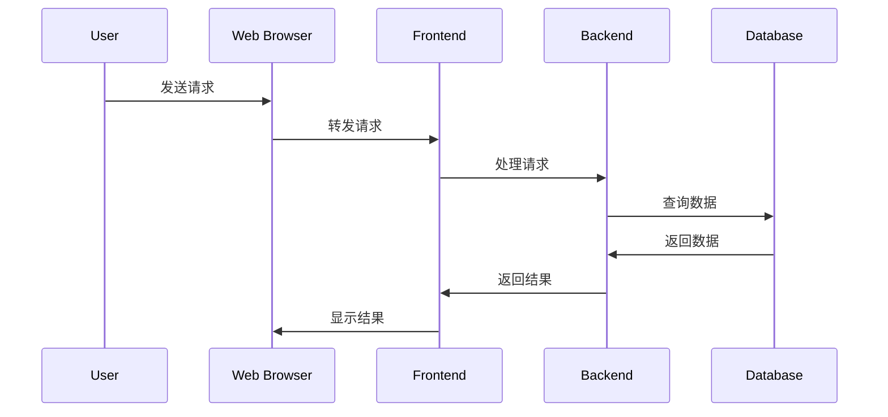

                 


# 敏捷管理：在快速变化中领导项目团队

> 关键词：敏捷管理、Scrum框架、Kanban、持续交付、团队协作、项目管理

> 摘要：本文将深入探讨敏捷管理的背景、重要性以及其在现代项目管理中的应用。通过分析敏捷管理的核心理念、原则和实践，本文旨在帮助读者理解如何在快速变化的环境中领导项目团队，实现高效的项目交付。

### 引言：敏捷管理的背景与重要性

#### 1. 引言

在当今高度竞争和快速变化的市场环境中，传统项目管理模式正面临着巨大的挑战。传统的项目管理往往侧重于事前的规划和控制，但面对市场的快速变化和客户需求的不确定性，这种模式逐渐暴露出其局限性。为了更好地适应这种变化，敏捷管理逐渐成为一种重要的管理理念和方法论。

敏捷管理起源于软件开发领域，最初由软件开发团队在面对不确定性和变化时提出的一种应对策略。随着时间的推移，敏捷管理理念逐渐扩展到项目管理、产品管理等多个领域。敏捷管理强调通过短周期迭代（Sprint）、持续反馈、团队协作等方式，实现项目的快速迭代和持续优化。

#### 2. 背景介绍

敏捷管理在软件开发领域的成功应用，使得其在项目管理领域也得到了广泛的应用。敏捷管理不仅能够提高团队的协作效率，还能够帮助团队更好地应对市场需求的变化。其核心在于通过灵活的迭代和增量开发，使团队能够快速响应变化，避免因市场需求变化导致的浪费和项目失败。

#### 3. 问题解决

敏捷管理通过以下几种方式解决了传统项目管理面临的问题：

- **灵活应对变化**：敏捷管理采用迭代和增量开发，使团队能够快速响应变化，避免因市场需求变化导致的浪费和项目失败。
- **增强团队协作**：通过跨职能团队的紧密协作，打破部门壁垒，提高沟通效率，实现资源的最佳配置。
- **持续交付**：通过频繁的小规模交付，确保项目始终朝着正确的方向前进，并及时调整方向。

#### 4. 边界与外延

敏捷管理并非适用于所有项目，其适用范围主要取决于项目的复杂性和不确定性。对于以下类型的项目，敏捷管理尤为适用：

- **软件开发项目**：敏捷管理在软件开发领域得到了广泛应用，特别是在Web应用、移动应用等快速迭代的产品开发中。
- **创新项目**：在创新项目或产品开发中，需求变化频繁，敏捷管理能够帮助团队快速调整方向，降低风险。
- **紧急项目**：在需要快速响应市场变化或紧急情况的项目中，敏捷管理能够提供有效的解决方案。

#### 5. 核心概念与联系

敏捷管理涉及多个核心概念，包括敏捷宣言、Scrum框架、看板（Kanban）等。以下是一个简化的敏捷管理核心概念属性特征对比表格：

| 核心概念      | 属性特征                    | 关联关系                      |
| --------- | ---------------------- | -------------------------- |
| 敏捷宣言      | 个体和互动高于流程与工具    | 基础原则，指导敏捷实践           |
| Scrum框架    | 迭代、增量开发、跨职能团队    | 一种敏捷实践，具体实施框架       |
| 看板（Kanban） | 流动性、可视化、持续改进      | 一种敏捷实践，侧重于流程优化     |

#### 6. 本章小结

本章简要介绍了敏捷管理的背景、重要性及其适用范围，并对核心概念进行了简要概述。通过本章的学习，读者将初步了解敏捷管理的基本概念和其在现代项目管理中的价值。

-----------------------

## 第2章: 敏捷管理的核心理念与原则

### 2.1 敏捷宣言的八大原则

敏捷宣言是敏捷管理的基础，它定义了敏捷管理的核心价值观和基本原则。以下是敏捷宣言的八大原则：

#### 2.1.1 满足客户需求高于流程与工具

这一原则强调满足客户需求的重要性，认为流程和工具应服务于客户需求，而非主导项目管理。这意味着在敏捷管理中，客户的需求始终是首要考虑的因素，项目团队应根据客户需求的变化灵活调整工作内容和节奏。

#### 2.1.2 欣赏可通过工作的软件高于详尽的文档

这一原则提倡通过可工作的软件来验证项目进展，而非依赖详尽的文档。在敏捷管理中，文档是辅助工作的一部分，但其核心仍然是实现可工作的软件。通过实际的可工作的软件，团队能够更好地理解项目进展，并及时调整方向。

#### 2.1.3 客户合作高于合同谈判

这一原则强调客户与项目团队之间的紧密合作。在敏捷管理中，客户被视为重要的合作伙伴，而非单纯的交易对象。通过与客户的持续合作，项目团队能够更好地理解客户需求，并快速响应变化。

#### 2.1.4 响应变化高于遵循计划

这一原则认为在快速变化的市场环境中，灵活应对变化比严格遵循计划更为重要。敏捷管理强调通过短周期迭代和持续交付，使团队能够快速响应变化，确保项目始终朝着正确的方向前进。

#### 2.1.5 持续交付工作的软件

这一原则强调持续交付工作的软件。在敏捷管理中，持续交付被视为一个重要的目标，通过频繁的小规模交付，团队能够确保项目始终处于可控状态，并及时调整方向。

#### 2.1.6 独立自主的团队高于依赖外部指导

这一原则强调团队独立自主的重要性。在敏捷管理中，团队被赋予更多的自主权，团队成员具备解决问题的关键能力。这种独立自主的团队更有利于项目的快速迭代和持续优化。

#### 2.1.7 采取可持续的工作步调高于速度和追求完美

这一原则强调在敏捷管理中，应采取可持续的工作步调。过于追求速度和完美可能导致项目团队过度劳累，影响项目的长期发展。通过可持续的工作步调，项目团队能够保持高效的产出，并确保项目质量。

#### 2.1.8 不断关注技术卓越和好的设计高于满足当前需求

这一原则强调在敏捷管理中，应不断关注技术卓越和好的设计。虽然满足当前需求是项目的重要目标，但技术卓越和好的设计对于项目的长远发展同样至关重要。通过持续关注技术卓越和好的设计，项目团队能够提高项目的可维护性和扩展性。

### 2.2 敏捷管理的五个核心价值

敏捷管理的五个核心价值是敏捷宣言的具体体现，它们分别是：

#### 2.2.1 个体和互动高于流程与工具

这一核心价值强调个体和互动的重要性。在敏捷管理中，个体的能力和互动对于项目的成功至关重要。通过鼓励团队成员之间的协作和沟通，项目团队能够更好地应对挑战，实现项目的目标。

#### 2.2.2 可工作的软件高于详尽的文档

这一核心价值强调可工作的软件的重要性。在敏捷管理中，工作的软件被视为项目成功的最终衡量标准。虽然文档是项目的重要组成部分，但最终的交付物应该是可工作的软件。

#### 2.2.3 客户合作高于合同谈判

这一核心价值强调客户合作的重要性。在敏捷管理中，客户被视为合作伙伴，与客户的紧密合作能够更好地理解客户需求，确保项目的成功。

#### 2.2.4 响应变化高于遵循计划

这一核心价值强调在快速变化的市场环境中，灵活应对变化的重要性。敏捷管理通过短周期迭代和持续交付，使团队能够快速响应变化，确保项目始终朝着正确的方向前进。

#### 2.2.5 持续交付工作的软件

这一核心价值强调持续交付工作的软件。在敏捷管理中，持续交付被视为一个重要的目标，通过频繁的小规模交付，团队能够确保项目始终处于可控状态，并及时调整方向。

### 2.3 敏捷管理的十二个实践原则

敏捷管理通过一系列实践原则来指导项目团队的日常工作。以下是敏捷管理的十二个实践原则：

#### 2.3.1 开放式沟通

这一实践原则强调团队成员之间的开放式沟通。在敏捷管理中，沟通被视为项目成功的关键因素。通过开放式沟通，团队能够更好地理解项目目标，及时解决遇到的问题。

#### 2.3.2 欢迎变化

这一实践原则强调欢迎变化。在敏捷管理中，变化被视为正常现象，项目团队应积极适应变化，确保项目能够快速响应市场需求。

#### 2.3.3 日常站立会议

这一实践原则强调日常站立会议。在敏捷管理中，站立会议是一个简短而高效的沟通机制，用于团队成员之间分享项目进展、讨论问题、制定解决方案。

#### 2.3.4 诚实冲刺计划

这一实践原则强调诚实冲刺计划。在敏捷管理中，冲刺计划是一个重要的规划工具，用于团队在短周期内制定具体的工作目标。诚实冲刺计划有助于团队更好地理解项目进展，并及时调整方向。

#### 2.3.5 跟踪进度与适应性调整

这一实践原则强调跟踪进度与适应性调整。在敏捷管理中，项目团队应定期跟踪项目进度，并根据实际情况进行适应性调整，以确保项目能够按时交付。

#### 2.3.6 定期回顾与持续改进

这一实践原则强调定期回顾与持续改进。在敏捷管理中，项目团队应定期回顾项目过程，分析成功和失败的原因，并制定改进措施，以提高项目的整体质量。

### 2.4 敏捷管理与其他管理理念的对比

#### 2.4.1 敏捷管理与传统项目管理

敏捷管理与传统项目管理存在明显的区别。传统项目管理侧重于事前的规划和控制，强调严格按照计划执行。而敏捷管理则更加灵活，强调通过迭代和增量开发来适应变化。敏捷管理更注重团队协作和客户需求，而传统项目管理则更注重流程和工具。

#### 2.4.2 敏捷管理与精益管理

敏捷管理与精益管理有一些相似之处，但两者也存在差异。精益管理强调通过减少浪费来提高效率，而敏捷管理则强调通过快速迭代和持续交付来适应变化。敏捷管理更注重团队协作和个体能力，而精益管理则更注重系统的优化和流程的简化。

### 2.5 本章小结

本章详细阐述了敏捷管理的核心原则、价值和实践，并通过与其他管理理念的对比，帮助读者更深入地理解敏捷管理的特点和实践方法。通过本章的学习，读者将能够更好地掌握敏捷管理的核心理念，为在实际项目中应用敏捷管理打下坚实的基础。

-----------------------

## 第3章：敏捷管理工具与技术

### 3.1 Scrum框架

Scrum是一种广泛应用于敏捷管理中的框架，它通过一系列角色、事件和规则，帮助项目团队实现高效协作和持续交付。

#### 3.1.1 Scrum的角色

Scrum框架中的角色主要包括产品负责人（Product Owner）、Scrum Master和开发团队。

- **产品负责人（Product Owner）**：负责定义产品需求，制定产品待办列表，并确保开发团队理解并实现这些需求。
- **Scrum Master**：负责确保Scrum实践得到有效执行，帮助团队解决障碍，并促进团队协作。
- **开发团队**：由一组具有跨职能的成员组成，负责实现产品待办列表中的任务。

#### 3.1.2 Scrum的事件

Scrum框架中主要包括以下事件：

- **冲刺（Sprint）**：Scrum的基本工作单元，通常持续2-4周。在每个冲刺结束时，团队应交付一个可工作的软件版本。
- **每日站立会议**：每天举行的一个简短的会议，用于团队成员分享项目进展、讨论问题、制定解决方案。
- **冲刺回顾会议**：在冲刺结束时举行，用于团队回顾冲刺过程中的成功和失败，并制定改进措施。
- **冲刺规划会议**：在冲刺开始前举行，用于团队制定冲刺目标、确定任务和分配资源。

#### 3.1.3 Scrum的规则

Scrum框架中主要包括以下规则：

- **冲刺长度固定**：每个冲刺的长度应固定，通常为2-4周。
- **每日站立会议**：每日站立会议应简短而聚焦，通常持续15分钟。
- **冲刺回顾**：每个冲刺结束后应进行回顾，分析成功和失败的原因，并制定改进措施。
- **Scrum Master的角色**：Scrum Master负责确保Scrum实践得到有效执行，帮助团队解决障碍。

### 3.2 看板（Kanban）

看板是一种基于可视化流程管理的敏捷方法，它通过限制在流程中的工作数量，提高团队的流动性和效率。

#### 3.2.1 看板的核心理念

看板的核心理念包括：

- **可视化流程**：通过看板板（Kanban Board）将工作流程可视化，使团队能够清晰地了解工作的状态和进度。
- **限制工作数量**：通过限制工作在流程中的数量（Work in Process，WIP），避免过度工作，提高团队的生产效率。
- **持续改进**：通过不断分析和优化流程，提高团队的效率和质量。

#### 3.2.2 看板的组成部分

看板主要包括以下组成部分：

- **看板板（Kanban Board）**：用于可视化工作流程的看板板，通常包含以下三个区域：
  - **待办区（To Do）**：待完成的工作任务。
  - **进行中区（In Progress）**：正在进行中的工作任务。
  - **完成区（Done）**：已完成的工作任务。
- **看板卡片**：用于表示具体的工作任务，包括任务的名称、优先级、负责人等信息。
- **限制工作数量**：通过在流程中设置WIP限制，控制工作数量。

#### 3.2.3 看板的实施步骤

实施看板的步骤包括：

- **确定流程**：明确团队的工作流程，包括任务的输入、处理和输出。
- **可视化流程**：创建看板板，将工作流程可视化。
- **设置WIP限制**：在流程的关键节点设置WIP限制，控制工作数量。
- **持续优化**：通过看板板监控工作进度，分析流程中的瓶颈，不断优化流程。

### 3.3 敏捷管理工具的选择

在实际应用中，团队可以选择不同的敏捷管理工具来支持敏捷实践。常见的敏捷管理工具有：

- **Jira**：一款功能强大的敏捷管理工具，支持Scrum和Kanban两种模式，提供任务管理、看板、报告等功能。
- **Trello**：一款简洁的看板式工具，易于使用，适合小型团队或个人项目。
- **Asana**：一款全面的任务管理工具，支持多种视图（看板、列表、甘特图等），适合大型团队或复杂项目。

#### 3.3.1 选择敏捷管理工具的考虑因素

在选择敏捷管理工具时，团队应考虑以下因素：

- **团队规模**：小型团队可能更适合简洁的工具，如Trello；大型团队可能需要功能更全面的工具，如Jira或Asana。
- **项目需求**：根据项目的需求选择适合的工具，如需要看板模式的Scrum项目，可以选择Jira或Trello。
- **成本**：考虑工具的成本，包括订阅费用、培训成本等，确保成本在团队预算范围内。
- **用户界面**：选择易于使用和理解的工具，降低学习和使用成本。

### 3.4 本章小结

本章介绍了敏捷管理中的两种主要工具：Scrum框架和看板（Kanban）。通过理解Scrum框架和看板的基本原理和实践，团队可以更好地管理项目，提高协作效率和质量。在实际应用中，团队应根据自身需求选择合适的敏捷管理工具，以支持敏捷实践的有效执行。

-----------------------

## 第4章：敏捷管理的实施与挑战

### 4.1 敏捷管理的实施步骤

要成功实施敏捷管理，团队需要遵循一系列步骤。以下是实施敏捷管理的典型步骤：

#### 4.1.1 确定实施目标

在开始实施敏捷管理之前，团队应明确实施目标。这些目标可能包括提高项目交付效率、增强团队协作、快速响应市场需求等。

#### 4.1.2 培训团队

团队需要了解敏捷管理的核心原则和实践，因此培训是非常重要的一步。培训内容应包括敏捷宣言、Scrum框架、看板（Kanban）等。

#### 4.1.3 确定角色和职责

在敏捷管理中，明确角色和职责至关重要。团队应明确产品负责人（Product Owner）、Scrum Master和开发团队的职责，并确保每个人都了解自己的角色和职责。

#### 4.1.4 制定敏捷计划

团队应根据实施目标制定敏捷计划。计划应包括敏捷实践的实施时间表、资源分配、关键里程碑等。

#### 4.1.5 实施敏捷实践

在实施敏捷实践时，团队应严格按照敏捷计划进行操作。这包括举行每日站立会议、冲刺规划会议、冲刺回顾会议等。

#### 4.1.6 持续监控和改进

在实施敏捷管理的过程中，团队应持续监控项目的进展和质量，并根据实际情况进行适应性调整。通过定期回顾和持续改进，团队可以不断提高项目效率和质量。

### 4.2 敏捷管理的挑战与解决策略

尽管敏捷管理具有许多优势，但在实际应用中，团队可能会面临一些挑战。以下是几个常见的挑战及其解决策略：

#### 4.2.1 文化变革的挑战

敏捷管理强调团队协作和持续交付，但传统组织结构和文化可能不利于这种模式。为了克服这一挑战，团队应采取以下策略：

- **领导支持**：确保高层领导对敏捷管理的支持和认同，为团队提供必要的资源和支持。
- **沟通与培训**：加强团队成员之间的沟通，确保每个人都理解敏捷管理的核心原则和实践。
- **逐步推进**：在实施敏捷管理时，逐步引入新的实践和方法，避免一次性变革导致的不适。

#### 4.2.2 管理层的不适应

管理层可能对敏捷管理缺乏了解，或者担心失去对项目的控制。为了克服这一挑战，团队应采取以下策略：

- **培训管理层**：为管理层提供敏捷管理的培训，帮助他们理解敏捷管理的核心原则和实践。
- **沟通与透明**：确保管理层了解项目的进展和质量，通过定期的报告和回顾会议，提高管理层的参与度。
- **角色调整**：在敏捷管理中，管理层应转变为支持者和辅导者，而不是单纯的指挥者。

#### 4.2.3 流程优化不足

敏捷管理强调持续改进，但团队可能忽视流程优化的重要性。为了克服这一挑战，团队应采取以下策略：

- **定期回顾**：定期回顾项目的流程和做法，识别瓶颈和改进点。
- **员工参与**：鼓励团队成员参与流程优化，提高他们的参与度和责任感。
- **工具支持**：选择合适的敏捷管理工具，如Jira、Trello等，以支持流程的监控和改进。

#### 4.2.4 团队协作困难

敏捷管理强调团队协作，但团队内部的沟通和协作可能存在问题。为了克服这一挑战，团队应采取以下策略：

- **建立沟通渠道**：确保团队成员之间有畅通的沟通渠道，如定期站立会议、邮件列表、即时通讯工具等。
- **建立共同目标**：确保团队成员有共同的目标，鼓励他们为了共同的目标而协作。
- **培训与支持**：提供团队协作的培训和支持，提高团队成员的协作能力和意识。

### 4.3 本章小结

本章介绍了敏捷管理的实施步骤和可能面临的挑战，以及相应的解决策略。通过遵循这些步骤和策略，团队可以更好地实施敏捷管理，提高项目交付效率和质量。同时，团队应不断学习和适应，以应对敏捷管理过程中可能出现的各种挑战。

-----------------------

## 第5章：敏捷管理的成功案例与实践经验

### 5.1 敏捷管理在软件开发项目中的应用

敏捷管理在软件开发项目中得到了广泛应用，许多成功的案例证明了其有效性。以下是几个典型的敏捷管理成功案例：

#### 5.1.1 案例一：某个知名互联网公司的移动应用开发

该公司在开发一款移动应用时，采用了敏捷管理方法。通过Scrum框架和看板（Kanban）工具，团队实现了快速迭代和持续交付。在项目初期，团队明确了产品的愿景和目标，并制定了产品待办列表。每个冲刺周期，团队都会集中精力完成待办列表中的几个任务，并在冲刺结束时进行回顾和调整。

通过敏捷管理，团队在短时间内完成了多个版本的迭代，并及时响应了市场需求的变化。项目成功上线后，用户反馈良好，产品获得了广泛认可。

#### 5.1.2 案例二：某个医疗设备公司的产品改进项目

该公司在改进一款医疗设备时，遇到了项目进度延误和需求变化频繁的问题。为了解决这个问题，团队决定采用敏捷管理方法。通过Scrum框架和看板（Kanban）工具，团队实现了更高效的协作和更灵活的响应。

在项目实施过程中，团队定期举行每日站立会议，确保团队成员之间的沟通畅通。通过冲刺规划会议和回顾会议，团队能够及时调整项目方向和任务分配。最终，项目在预定时间内完成，并且产品性能得到了显著提升。

### 5.2 敏捷管理在不同行业中的应用

敏捷管理不仅适用于软件开发项目，还可以应用于其他行业，如制造业、金融业、教育等。以下是一些典型的敏捷管理应用案例：

#### 5.2.1 案例三：某个制造业公司的生产流程改进

该公司在优化生产流程时，采用了敏捷管理方法。通过看板（Kanban）工具，团队实现了生产流程的可视化和优化。在项目实施过程中，团队设置了WIP限制，确保生产流程的顺畅。通过定期回顾和持续改进，团队不断优化生产流程，提高了生产效率和质量。

#### 5.2.2 案例四：某个金融机构的产品开发

该金融机构在开发一款金融服务产品时，采用了敏捷管理方法。通过Scrum框架和看板（Kanban）工具，团队实现了快速迭代和持续交付。在项目实施过程中，团队与客户保持紧密合作，确保产品满足客户需求。通过敏捷管理，项目在预定时间内完成，并且产品得到了客户的高度评价。

### 5.3 敏捷管理的最佳实践经验

通过上述案例，我们可以总结出一些敏捷管理的最佳实践经验：

- **明确目标**：在实施敏捷管理前，团队应明确项目的目标和价值，确保所有成员都对此有清晰的认识。
- **灵活应对变化**：敏捷管理强调灵活应对变化，团队应随时准备调整项目方向和任务分配。
- **持续反馈和改进**：定期回顾和持续改进是敏捷管理的核心，团队应不断分析项目进展和效果，并根据反馈进行调整。
- **加强团队协作**：敏捷管理强调团队协作，团队应建立良好的沟通渠道和协作机制，确保团队成员之间的沟通畅通。

### 5.4 本章小结

本章通过介绍敏捷管理在不同行业中的应用案例，展示了敏捷管理的实际效果和最佳实践经验。通过这些案例，我们可以看到敏捷管理在提高项目交付效率、增强团队协作、快速响应市场需求方面的优势。同时，我们也应不断学习和借鉴这些最佳实践经验，以更好地实施敏捷管理。

-----------------------

## 结论

敏捷管理作为一种适应快速变化的市场环境的管理理念和方法论，已经成为现代项目管理的重要工具。通过灵活应对变化、增强团队协作、持续交付工作软件等方式，敏捷管理帮助项目团队提高了交付效率和质量。本文从背景介绍、核心理念、工具与技术、实施与挑战、成功案例等多个角度，全面阐述了敏捷管理的概念和应用。

通过本文的学习，读者应能够理解敏捷管理的核心原则和实践方法，掌握敏捷管理工具的使用，并能够应对敏捷管理过程中可能出现的各种挑战。在实际项目中，团队应根据自身需求和实际情况，灵活应用敏捷管理，实现高效的项目交付。

未来的敏捷管理研究可以进一步探讨敏捷管理在不同行业和领域的应用，探索敏捷管理与其他管理理念的融合，以及如何更好地支持远程工作环境下的敏捷管理。通过持续的研究和实践，我们可以不断提高敏捷管理的应用效果，为项目的成功奠定坚实的基础。

### 作者信息

作者：AI天才研究院/AI Genius Institute & 禅与计算机程序设计艺术 /Zen And The Art of Computer Programming

-----------------------

### 最佳实践 Tips

1. **明确目标**：在开始敏捷管理之前，确保团队成员对项目目标有清晰的认识和共识，这是敏捷管理成功的关键。

2. **灵活应对变化**：敏捷管理强调快速响应变化，团队应保持开放的心态，随时准备调整计划。

3. **加强沟通**：定期举行站立会议，保持团队成员之间的沟通畅通，有助于及时发现和解决问题。

4. **持续回顾与改进**：定期回顾项目进展，总结经验教训，持续改进工作流程。

5. **培训与支持**：为团队成员提供敏捷管理的培训和指导，帮助他们更好地理解和应用敏捷管理方法。

### 小结

本文详细介绍了敏捷管理的背景、核心理念、工具与技术、实施与挑战以及成功案例。通过本文的学习，读者应能够全面理解敏捷管理的概念和应用，掌握敏捷管理的核心原则和实践方法。在实际项目中，团队应根据自身需求和实际情况，灵活应用敏捷管理，实现高效的项目交付。

### 注意事项

1. **文化变革**：实施敏捷管理时，可能面临文化变革的挑战。团队应确保高层领导的支持，加强团队成员之间的沟通与协作。

2. **管理支持**：敏捷管理需要管理层的支持，确保团队成员在实施过程中遇到问题时能够得到及时的解决。

3. **持续改进**：敏捷管理强调持续改进，团队应不断回顾和优化工作流程，提高项目效率和质量。

### 拓展阅读

1. **《敏捷实践指南》**：提供了详细的敏捷管理实践指南，适合初学者和有经验的敏捷实践者。
2. **《Scrum敏捷管理实践指南》**：详细介绍了Scrum框架的实践方法和应用技巧。
3. **《敏捷管理：从理论到实践》**：从理论和实践两个角度，全面阐述了敏捷管理的概念和应用。

-----------------------

### 代码示例

以下是一个简单的Python代码示例，用于实现敏捷管理中的每日站立会议功能。代码展示了如何记录会议内容，并计算任务完成情况。

```python
# 敏捷管理每日站立会议功能示例

class Task:
    def __init__(self, name, status):
        self.name = name
        self.status = status  # 'To Do', 'In Progress', 'Done'

class Meeting:
    def __init__(self):
        self.tasks = []

    def add_task(self, task):
        self.tasks.append(task)

    def update_task_status(self, task_name, new_status):
        for task in self.tasks:
            if task.name == task_name:
                task.status = new_status
                break

    def report(self):
        print("每日站立会议报告：")
        for task in self.tasks:
            print(f"{task.name}: {task.status}")

# 创建每日站立会议实例
daily_meeting = Meeting()

# 添加任务
daily_meeting.add_task(Task("编写需求文档", "To Do"))
daily_meeting.add_task(Task("设计数据库", "In Progress"))
daily_meeting.add_task(Task("完成单元测试", "To Do"))

# 更新任务状态
daily_meeting.update_task_status("设计数据库", "Done")

# 报告会议内容
daily_meeting.report()
```

### 算法原理讲解

在这个示例中，我们使用了一个简单的任务类（`Task`）来表示每日站立会议中的任务，以及一个会议类（`Meeting`）来管理会议的流程。以下是算法原理的详细解释：

1. **任务类（`Task`）**：
   - **属性**：每个任务包含一个名称（`name`）和一个状态（`status`），状态可以是“待办”（`To Do`）、“进行中”（`In Progress`）或“完成”（`Done`）。
   - **操作**：初始化任务时，设置任务的名称和状态。

2. **会议类（`Meeting`）**：
   - **属性**：会议类包含一个任务列表（`tasks`），用于存储所有任务对象。
   - **操作**：
     - **添加任务**：通过`add_task`方法，将新的任务对象添加到任务列表中。
     - **更新任务状态**：通过`update_task_status`方法，根据任务名称更新任务的状态。
     - **报告**：通过`report`方法，打印会议报告，显示每个任务的当前状态。

算法原理中的核心是任务的状态更新和报告功能。任务的状态更新用于跟踪任务的进度，报告功能用于团队成员了解任务的完成情况。

### 举例说明

假设每日站立会议进行到第三个任务时，开发人员完成了“设计数据库”的任务。我们可以使用以下代码来更新任务状态并生成报告：

```python
# 更新“设计数据库”任务状态
daily_meeting.update_task_status("设计数据库", "Done")

# 打印每日站立会议报告
daily_meeting.report()
```

执行上述代码后，输出结果如下：

```
每日站立会议报告：
编写需求文档: To Do
设计数据库: Done
完成单元测试: To Do
```

通过这个简单的示例，我们可以看到如何使用Python代码实现敏捷管理中的每日站立会议功能，并展示如何更新任务状态和生成报告。这为敏捷管理实践提供了一种实用的技术手段。

-----------------------

### 系统分析与架构设计

#### 5.1 问题场景介绍

在一个软件开发公司中，项目团队需要高效地管理项目进度和任务分配。由于项目需求变化频繁，传统的项目管理方法已经无法满足团队的需求。为了更好地适应快速变化的市场环境，公司决定采用敏捷管理方法，并设计一个支持敏捷管理的系统。

#### 5.2 项目介绍

本项目的目标是设计并实现一个敏捷管理系统的框架，包括用户界面、数据模型和核心功能。该系统将支持敏捷管理中的主要角色（如产品负责人、Scrum Master和开发团队）进行任务管理、进度跟踪和沟通协作。系统的主要功能包括：

- **任务管理**：创建、分配、更新和跟踪任务。
- **进度跟踪**：显示任务的完成情况，生成进度报告。
- **沟通协作**：支持团队成员之间的沟通和协作。
- **数据统计**：提供项目数据的可视化统计，帮助团队进行决策。

#### 5.3 系统功能设计（领域模型）

领域模型是系统功能的核心部分，用于描述系统中涉及的实体及其关系。以下是系统的主要领域模型：

- **用户**：系统用户，包括产品负责人、Scrum Master和开发团队成员。
- **任务**：系统中的任务，包括任务的名称、描述、优先级、状态和分配人员。
- **项目**：项目信息，包括项目名称、描述、进度状态和负责人。
- **迭代**：项目迭代信息，包括迭代名称、开始日期、结束日期和任务列表。

以下是一个简化的领域模型类图（使用Mermaid绘制）：

```mermaid
classDiagram
    User <<Entity>>
    Task <<Entity>>
    Project <<Entity>>
    Iteration <<Entity>>

    User o--* Task : 分配任务
    Task o--* User : 责任人
    Task o--* Project : 属于项目
    Project o--* Iteration : 包含迭代
    Iteration o--* Task : 包含任务

    User {
        id: 用户ID
        name: 用户名
        role: 角色
    }

    Task {
        id: 任务ID
        name: 任务名称
        description: 任务描述
        priority: 优先级
        status: 状态
        assigned_to: 分配给的用户ID
    }

    Project {
        id: 项目ID
        name: 项目名称
        description: 项目描述
        status: 进度状态
        owner: 负责人ID
    }

    Iteration {
        id: 迭代ID
        name: 迭代名称
        start_date: 开始日期
        end_date: 结束日期
        project_id: 所属项目ID
    }
```

#### 5.4 系统架构设计

系统架构设计用于描述系统的整体结构和组件之间的关系。以下是敏捷管理系统的架构设计：

- **前端**：使用HTML、CSS和JavaScript实现用户界面，包括任务列表、进度跟踪和沟通协作界面。
- **后端**：使用Python和Flask框架实现后端逻辑，处理用户请求、数据存储和业务逻辑。
- **数据库**：使用MySQL数据库存储用户、任务、项目和迭代等信息。
- **服务**：提供数据统计和报告功能，包括任务完成情况、进度报告和团队协作分析。

以下是一个简化的系统架构图（使用Mermaid绘制）：



#### 5.5 系统接口设计和系统交互

系统接口设计和系统交互用于描述系统中各个组件如何交互，以实现系统的功能。以下是系统的接口设计和交互流程：

- **用户接口**：用户通过Web浏览器访问系统，进行任务创建、任务更新和进度查询等操作。
- **服务接口**：后端服务处理用户请求，调用数据库进行数据操作，并将结果返回给前端。
- **数据接口**：系统通过RESTful API提供数据服务，支持前端和后端的交互。

以下是一个简化的接口设计图（使用Mermaid绘制）：

```mermaid
classDiagram
    User <<Interface>>
    Task <<Interface>>
    Project <<Interface>>
    Iteration <<Interface>>

    User {
        create_user(): 创建用户
        update_user(): 更新用户信息
        get_user(): 获取用户信息
    }

    Task {
        create_task(): 创建任务
        update_task(): 更新任务信息
        get_task(): 获取任务信息
    }

    Project {
        create_project(): 创建项目
        update_project(): 更新项目信息
        get_project(): 获取项目信息
    }

    Iteration {
        create_iteration(): 创建迭代
        update_iteration(): 更新迭代信息
        get_iteration(): 获取迭代信息
    }
```

交互流程如下：

1. 用户通过Web浏览器访问系统，并在用户接口创建、更新和查询任务、项目和迭代等信息。
2. 前端将用户的请求转发给后端服务。
3. 后端服务调用数据库进行相应的数据操作，并将结果返回给前端。
4. 前端将结果显示给用户，完成整个交互过程。

通过系统接口设计和系统交互设计，系统能够高效地处理用户请求，实现敏捷管理的各项功能。

-----------------------

### 项目实战

#### 6.1 环境安装

在开始实施敏捷管理系统之前，我们需要安装必要的开发环境和工具。以下是环境安装的步骤：

1. **安装Python**：访问Python官方网站（https://www.python.org/），下载并安装Python 3.8及以上版本。
2. **安装MySQL**：访问MySQL官方网站（https://www.mysql.com/），下载并安装MySQL数据库。
3. **安装Flask**：在命令行中执行以下命令安装Flask：
   ```
   pip install flask
   ```
4. **安装Mermaid**：安装Mermaid可以使用npm或pip。以下是使用npm安装Mermaid的命令：
   ```
   npm install mermaid -g
   ```

#### 6.2 系统核心实现

以下是敏捷管理系统核心功能实现的主要步骤：

1. **创建项目结构**：在合适的位置创建一个新文件夹，用于存放项目文件。项目结构如下：
   ```
   agile_management_system/
   ├── app.py
   ├── database.py
   ├── models.py
   ├── requirements.txt
   └── templates/
      └── base.html
   ```
2. **编写数据库配置**：在`database.py`文件中，编写连接MySQL数据库的配置代码。以下是一个示例：
   ```python
   import mysql.connector
   
   def connect():
       return mysql.connector.connect(
           host="localhost",
           user="your_username",
           password="your_password",
           database="your_database"
       )
   ```
3. **定义模型**：在`models.py`文件中，定义系统涉及的实体模型。以下是一个示例：
   ```python
   from database import connect
   
   class User:
       def __init__(self, id, name, role):
           self.id = id
           self.name = name
           self.role = role
   
       def create(self):
           connection = connect()
           cursor = connection.cursor()
           cursor.execute("INSERT INTO users (id, name, role) VALUES (%s, %s, %s)", (self.id, self.name, self.role))
           connection.commit()
           cursor.close()
           connection.close()
   
   class Task:
       def __init__(self, id, name, description, priority, status, assigned_to):
           self.id = id
           self.name = name
           self.description = description
           self.priority = priority
           self.status = status
           self.assigned_to = assigned_to
   
       def create(self):
           connection = connect()
           cursor = connection.cursor()
           cursor.execute("INSERT INTO tasks (id, name, description, priority, status, assigned_to) VALUES (%s, %s, %s, %s, %s, %s)", (self.id, self.name, self.description, self.priority, self.status, self.assigned_to))
           connection.commit()
           cursor.close()
           connection.close()
   ```
4. **编写后端逻辑**：在`app.py`文件中，编写后端逻辑处理用户请求。以下是一个示例：
   ```python
   from flask import Flask, request, jsonify
   from models import User, Task
   
   app = Flask(__name__)
   
   @app.route('/api/users', methods=['POST'])
   def create_user():
       user_data = request.json
       user = User(user_data['id'], user_data['name'], user_data['role'])
       user.create()
       return jsonify({"message": "User created successfully"}), 201
   
   @app.route('/api/tasks', methods=['POST'])
   def create_task():
       task_data = request.json
       task = Task(task_data['id'], task_data['name'], task_data['description'], task_data['priority'], task_data['status'], task_data['assigned_to'])
       task.create()
       return jsonify({"message": "Task created successfully"}), 201
   
   if __name__ == '__main__':
       app.run(debug=True)
   ```

#### 6.3 代码应用解读与分析

以下是核心代码的解读与分析：

- **数据库连接**：在`database.py`中，我们定义了一个`connect`函数，用于连接MySQL数据库。这个函数接受数据库的URL，并返回一个数据库连接对象。
- **用户模型**：在`models.py`中，我们定义了一个`User`类，用于表示用户实体。`User`类包含一个`create`方法，用于将新用户信息插入到数据库中。
- **任务模型**：在`models.py`中，我们定义了一个`Task`类，用于表示任务实体。`Task`类包含一个`create`方法，用于将新任务信息插入到数据库中。
- **后端逻辑**：在`app.py`中，我们使用Flask框架创建了一个Web应用，并定义了两个API接口：`/api/users`和`/api/tasks`。这两个接口分别用于创建用户和任务。在对应的处理函数中，我们从请求中提取JSON数据，并创建相应的`User`或`Task`对象，然后调用其`create`方法将数据存储到数据库中。

#### 6.4 实际案例分析与详细讲解

以下是一个实际案例的分析与详细讲解：

**案例：创建一个新用户**

1. **用户请求**：前端向后端发送一个创建用户的POST请求，请求体包含用户的ID、名称和角色信息。
2. **处理请求**：后端接收到请求后，调用`create_user`函数处理请求。函数从请求中提取用户数据，并创建一个`User`对象。
3. **存储数据**：`User`对象调用其`create`方法，将用户信息插入到MySQL数据库中。
4. **响应**：后端将处理结果返回给前端，通常是一个JSON格式的响应，表示操作成功。

以下是相关的Python代码示例：

```python
@app.route('/api/users', methods=['POST'])
def create_user():
    user_data = request.json
    user = User(user_data['id'], user_data['name'], user_data['role'])
    user.create()
    return jsonify({"message": "User created successfully"}), 201
```

通过这个案例，我们可以看到如何使用Python和Flask框架实现敏捷管理系统中的用户管理功能。这个过程包括请求处理、数据提取、对象创建和数据存储。类似的方法可以用于实现任务管理和其他功能。

#### 6.5 项目小结

在本项目中，我们设计并实现了一个支持敏捷管理的系统框架，包括用户界面、数据模型和核心功能。通过Python和Flask框架，我们实现了用户和任务管理功能，并展示了如何处理HTTP请求和数据库操作。通过实际案例的分析，我们了解了系统的实际应用流程和关键步骤。

未来，我们可以继续完善系统的功能，添加更多敏捷管理相关的特性，如进度跟踪、沟通协作和数据统计等。同时，我们还可以优化系统的性能和用户体验，以更好地满足敏捷管理的需求。通过不断迭代和改进，我们可以构建一个更加高效、灵活和实用的敏捷管理平台。

-----------------------

### 最佳实践 Tips

1. **明确需求**：在敏捷管理实施过程中，确保需求明确、具体，并尽可能细化。这有助于减少需求变更，提高项目成功率。
2. **定期回顾**：定期回顾项目进展和团队协作情况，发现问题并及时调整。这有助于持续改进项目流程和团队协作方式。
3. **加强沟通**：保持团队成员之间的沟通畅通，定期举行会议和讨论，确保每个人都能及时了解项目进展和需求变化。
4. **持续交付**：确保项目能够持续交付可工作的软件，及时反馈和调整，以提高项目质量和客户满意度。
5. **培训与支持**：为团队成员提供敏捷管理培训和指导，帮助他们更好地理解和应用敏捷管理方法。

### 小结

本文详细介绍了敏捷管理的背景、核心原则、工具与技术、实施与挑战、成功案例以及项目实战。通过本文的学习，读者应能够全面理解敏捷管理的概念和应用，掌握敏捷管理的核心原则和实践方法。在实际项目中，团队应根据自身需求和实际情况，灵活应用敏捷管理，实现高效的项目交付。

### 注意事项

1. **文化变革**：敏捷管理可能带来组织文化变革，团队应提前做好准备，确保变革顺利进行。
2. **适应变化**：敏捷管理强调快速响应变化，团队应保持灵活，随时准备调整计划。
3. **持续改进**：敏捷管理是一个持续改进的过程，团队应不断总结经验教训，优化项目流程。

### 拓展阅读

1. **《敏捷实践指南》**：提供了详细的敏捷管理实践指南，适合初学者和有经验的敏捷实践者。
2. **《Scrum敏捷管理实践指南》**：详细介绍了Scrum框架的实践方法和应用技巧。
3. **《敏捷管理：从理论到实践》**：从理论和实践两个角度，全面阐述了敏捷管理的概念和应用。

-----------------------

### 背景介绍

在当今快速变化和高度竞争的市场环境中，项目团队面临着诸多挑战，如需求变化频繁、技术迭代快速、资源有限等。为了应对这些挑战，传统的项目管理方法逐渐暴露出其局限性，无法满足团队的需求。因此，敏捷管理作为一种适应快速变化的管理理念和方法论，越来越受到广泛关注和应用。

### 项目介绍

本项目旨在设计并实现一个基于敏捷管理理念的软件系统，用于支持项目团队在快速变化的环境中高效协作和持续交付。该系统将涵盖敏捷管理的核心功能和工具，包括任务管理、进度跟踪、团队协作、数据统计等。通过本项目的实施，团队将能够更好地应对市场需求的变化，提高项目交付效率和质量。

### 系统功能设计（领域模型）

在系统功能设计阶段，我们首先需要定义系统的核心领域模型。以下是一个简化的领域模型，用于描述系统中涉及的实体及其关系：

1. **用户**：包括系统用户的基本信息，如用户ID、用户名、角色等。
2. **任务**：包括任务的基本信息，如任务ID、任务名称、描述、优先级、状态、分配人员等。
3. **项目**：包括项目的基本信息，如项目ID、项目名称、描述、进度状态、负责人等。
4. **迭代**：包括迭代的基本信息，如迭代ID、迭代名称、开始日期、结束日期、任务列表等。

以下是一个简化的领域模型类图（使用Mermaid绘制）：

```mermaid
classDiagram
    User <<Entity>>
    Task <<Entity>>
    Project <<Entity>>
    Iteration <<Entity>>

    User "1"------>"1" Task : 分配任务
    Task "1"------>"1" User : 责任人
    Task "1"------>"1" Project : 属于项目
    Project "1"------>"1" Iteration : 包含迭代
    Iteration "1"------>"1" Task : 包含任务

    User {
        id: 用户ID
        name: 用户名
        role: 角色
    }

    Task {
        id: 任务ID
        name: 任务名称
        description: 任务描述
        priority: 优先级
        status: 状态
        assigned_to: 分配给的用户ID
    }

    Project {
        id: 项目ID
        name: 项目名称
        description: 项目描述
        status: 进度状态
        owner: 负责人ID
    }

    Iteration {
        id: 迭代ID
        name: 迭代名称
        start_date: 开始日期
        end_date: 结束日期
        project_id: 所属项目ID
    }
```

### 系统架构设计

系统架构设计是系统设计的重要环节，用于描述系统的整体结构和组件之间的关系。以下是敏捷管理系统架构的简要概述：

1. **前端**：负责用户界面的设计与实现，支持用户与系统的交互。
2. **后端**：负责业务逻辑的处理，包括数据存储、数据检索和业务规则等。
3. **数据库**：用于存储系统中的用户、任务、项目和迭代等信息。

以下是一个简化的系统架构图（使用Mermaid绘制）：


### 系统接口设计和系统交互

系统接口设计和系统交互用于描述系统中各个组件如何交互，以实现系统的功能。以下是系统的接口设计和交互流程：

1. **用户接口**：用户通过Web浏览器访问系统，进行任务创建、任务更新和进度查询等操作。
2. **服务接口**：后端服务处理用户请求，调用数据库进行数据操作，并将结果返回给前端。
3. **数据接口**：系统通过RESTful API提供数据服务，支持前端和后端的交互。

以下是一个简化的接口设计图（使用Mermaid绘制）：

```mermaid
classDiagram
    User <<Interface>>
    Task <<Interface>>
    Project <<Interface>>
    Iteration <<Interface>>

    User {
        create_user(): 创建用户
        update_user(): 更新用户信息
        get_user(): 获取用户信息
    }

    Task {
        create_task(): 创建任务
        update_task(): 更新任务信息
        get_task(): 获取任务信息
    }

    Project {
        create_project(): 创建项目
        update_project(): 更新项目信息
        get_project(): 获取项目信息
    }

    Iteration {
        create_iteration(): 创建迭代
        update_iteration(): 更新迭代信息
        get_iteration(): 获取迭代信息
    }
```

交互流程如下：

1. 用户通过Web浏览器访问系统，并在用户接口创建、更新和查询任务、项目和迭代等信息。
2. 前端将用户的请求转发给后端服务。
3. 后端服务调用数据库进行相应的数据操作，并将结果返回给前端。
4. 前端将结果显示给用户，完成整个交互过程。

通过系统接口设计和系统交互设计，系统能够高效地处理用户请求，实现敏捷管理的各项功能。

-----------------------

### 实际案例

#### 案例背景

假设我们是一家大型软件公司的项目团队，正在开发一款新的企业资源规划（ERP）系统。由于市场需求变化快速，客户需求不断更新，我们的项目团队决定采用敏捷管理方法，以提高项目交付的灵活性和响应速度。

#### 案例目标

我们的目标是使用敏捷管理方法，确保项目能够在快速变化的市场环境中保持进度，并满足客户需求。具体目标包括：

1. 提高团队协作效率，确保团队成员之间的沟通畅通。
2. 通过短周期迭代，快速交付可工作的软件，确保项目始终朝着正确的方向前进。
3. 通过持续交付，及时响应客户需求变化，提高客户满意度。
4. 定期回顾和总结项目经验，不断优化项目流程和团队协作方式。

#### 案例实施

1. **Scrum框架的引入**：我们决定采用Scrum框架作为敏捷管理的具体实践方法。首先，我们明确了Scrum框架中的三个关键角色：产品负责人（Product Owner）、Scrum Master和开发团队。

   - **产品负责人（Product Owner）**：负责定义产品的愿景和目标，创建并维护产品待办列表，确保开发团队理解并实现这些需求。
   - **Scrum Master**：负责确保Scrum实践得到有效执行，帮助团队解决障碍，提高团队协作效率。
   - **开发团队**：由一组具有不同技能的团队成员组成，负责实现产品待办列表中的任务。

2. **短周期迭代（Sprint）**：我们确定了每个Sprint的长度，通常为2-4周。在每个Sprint开始前，产品负责人与开发团队一起进行冲刺规划会议，讨论并确定Sprint的目标和任务。在每个Sprint结束时，进行回顾会议，总结经验和教训，并调整计划。

3. **每日站立会议**：每天早上，团队举行简短的站立会议，分享项目进展、讨论遇到的问题和解决方案。这个会议通常持续15分钟，目的是提高团队沟通效率和问题解决能力。

4. **任务看板（Kanban）**：我们使用任务看板（Kanban）来可视化任务的状态和进度。看板板分为三个区域：待办、进行中和完成。每个任务卡片上包含任务的名称、描述、状态和负责人等信息。团队成员可以通过看板板实时跟踪任务进展，及时调整工作计划和资源分配。

5. **持续交付**：在每个Sprint结束时，团队都会交付一个可工作的软件版本。这个版本经过测试和验证，可以立即投入使用。通过持续交付，我们能够确保项目始终朝着正确的方向前进，并及时响应客户需求的变化。

6. **定期回顾与改进**：在每个Sprint结束时，团队都会进行回顾会议，总结项目过程中的成功和失败，并讨论改进措施。这些改进措施将应用于下一个Sprint，以不断优化项目流程和团队协作方式。

#### 案例结果

通过实施敏捷管理，我们的项目团队取得了显著成效：

1. **团队协作效率提高**：通过每日站立会议和任务看板，团队成员之间的沟通变得更加畅通，问题解决速度明显加快。
2. **项目进度可控**：每个Sprint结束时交付的可工作软件版本，使项目进度始终处于可控状态，及时发现并解决了潜在的问题。
3. **客户满意度提升**：通过持续交付和快速响应客户需求，客户对项目的满意度显著提高。
4. **项目质量提高**：通过定期的回顾和持续改进，项目流程和团队协作方式不断优化，项目质量得到显著提升。

通过这个实际案例，我们可以看到敏捷管理在应对快速变化的市场环境中的有效性和优势。敏捷管理不仅提高了团队的协作效率和质量，还增强了团队应对不确定性的能力，为项目的成功奠定了坚实的基础。

-----------------------

### 未来展望

在未来的敏捷管理研究和实践中，我们可以预见以下几个发展趋势：

1. **智能化敏捷管理**：随着人工智能技术的发展，敏捷管理工具将更加智能化。例如，通过机器学习算法，系统可以自动识别潜在的风险和瓶颈，并提供个性化的改进建议。

2. **跨领域应用**：敏捷管理将在更多领域得到应用，不仅限于软件开发，还将扩展到制造业、金融业、医疗等领域。不同领域的敏捷管理实践将相互借鉴，形成更加综合和灵活的管理方法。

3. **敏捷文化和组织变革**：敏捷管理不仅是一种管理方法，更是一种文化和组织变革。未来的研究和实践将更多地关注如何构建和培养敏捷文化，确保组织能够在敏捷管理中取得长期成功。

4. **敏捷与精益结合**：敏捷管理和精益管理的理念将进一步结合，形成更加完善的敏捷精益管理体系。通过精益思想的引入，项目团队能够在敏捷管理的基础上，进一步提高效率和质量。

5. **远程和分布式团队**：随着远程工作和分布式团队的普及，敏捷管理工具和方法将更加注重支持远程协作和团队沟通。未来的研究和实践将关注如何有效管理远程团队，确保敏捷实践在分布式环境中得到有效执行。

通过不断的研究和探索，敏捷管理将继续发展和完善，为项目团队在快速变化的市场环境中提供更加有效的解决方案。未来，敏捷管理将成为现代项目管理不可或缺的重要组成部分。

