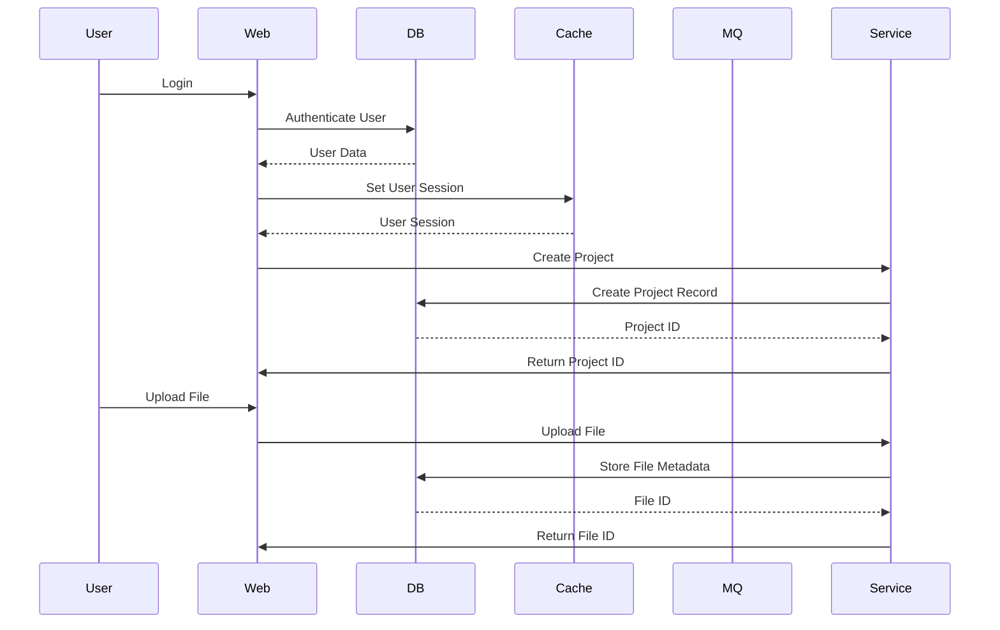
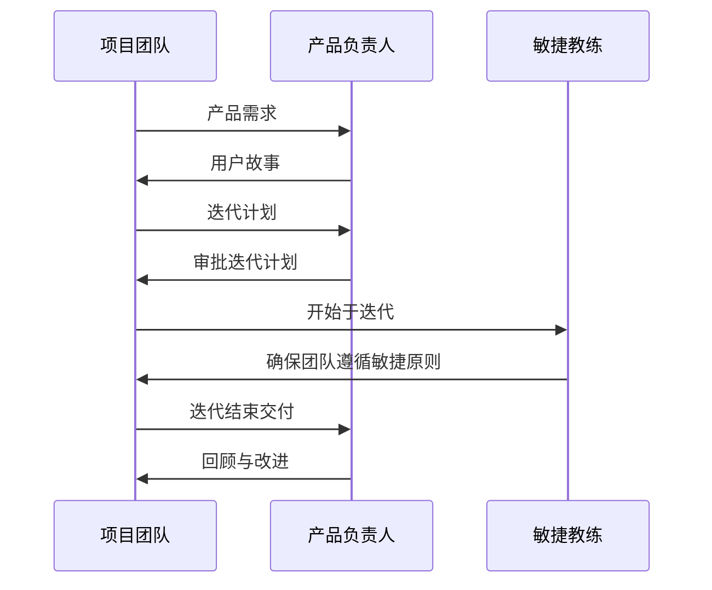
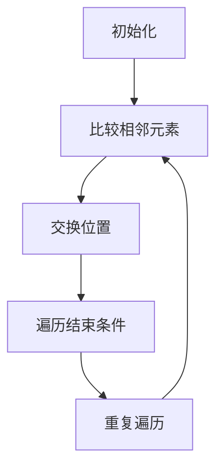

                 

### 敏捷项目管理：在动态环境中领导团队

敏捷项目管理是一种响应快速变化的需求和条件的现代项目管理方法。它不仅强调交付有价值的软件，而且注重团队合作和持续改进。在当今快速变化的市场环境中，敏捷项目管理方法为团队提供了一种灵活、高效的管理方式。

#### 关键词

- 敏捷项目管理
- 动态环境
- 团队领导
- 持续改进
- 快速响应

#### 摘要

本文将深入探讨敏捷项目管理在动态环境中的应用，并着重介绍如何通过领导团队来实现敏捷项目的成功。我们将一步步分析敏捷原则、敏捷框架、敏捷团队构建、敏捷项目规划、敏捷项目执行、敏捷项目监控与调整，以及敏捷工具与技术。通过实际案例分析和最佳实践分享，帮助读者更好地理解和应用敏捷项目管理方法。

### 目录

1. **引言**
    - 敏捷项目管理概述
    - 敏捷项目管理的重要性
    - 本书结构安排

2. **敏捷项目管理基础**
    - 敏捷原则
    - 敏捷框架
    - 敏捷方法
    - 敏捷工具

3. **敏捷项目团队构建**
    - 敏捷团队角色
    - 沟通与协作

4. **敏捷项目规划**
    - 项目范围
    - 时间管理
    - 风险管理

5. **敏捷项目执行**
    - 日常敏捷实践
    - 迭代与冲刺

6. **敏捷项目监控与调整**
    - 项目监控
    - 项目评估与调整

7. **敏捷工具与技术**
    - 敏捷工具介绍
    - 敏捷技术

8. **案例分析与实践**
    - 案例分析
    - 实践应用

9. **总结与展望**
    - 敏捷项目管理总结
    - 敏捷项目管理发展趋势

### 1. 引言

#### 敏捷项目管理概述

敏捷项目管理起源于20世纪90年代，是对传统项目管理方法的一种补充和改进。它强调快速响应变化、持续交付有价值的软件，并通过自我管理团队来实现这些目标。敏捷项目管理方法的核心理念包括：

- **个体与互动高于流程与工具**：团队协作和沟通的重要性远超过单一工具的使用。
- **可工作的软件高于详尽的文档**：交付可用的软件是项目成功的关键，而不是生成大量的文档。
- **客户合作高于合同谈判**：与客户的紧密合作能够确保项目方向的一致性和产品价值的最大化。
- **响应变化高于遵循计划**：灵活适应变化比严格遵循计划更为重要。

#### 敏捷项目管理的重要性

在当今快速变化的市场环境中，敏捷项目管理方法的重要性日益凸显。以下是几个关键点：

- **快速响应市场变化**：敏捷方法允许团队快速调整计划以应对市场变化，从而保持竞争力。
- **提高客户满意度**：通过持续交付有价值的软件，敏捷方法能够更好地满足客户的需求。
- **增强团队协作**：敏捷方法鼓励团队合作和沟通，有助于提高团队效率和满意度。
- **持续改进**：敏捷方法强调持续反思和改进，使团队能够不断优化其工作流程。

#### 本书结构安排

本书将分为以下几个主要部分：

- **引言**：介绍敏捷项目管理的基本概念、重要性以及本书的结构和内容。
- **敏捷项目管理基础**：涵盖敏捷原则、敏捷框架、敏捷方法和敏捷工具等基础内容。
- **敏捷项目团队构建**：讨论敏捷团队的角色、沟通和协作。
- **敏捷项目规划**：涵盖项目范围、时间管理、风险管理等。
- **敏捷项目执行**：介绍日常敏捷实践、迭代和冲刺。
- **敏捷项目监控与调整**：涉及敏捷项目监控、评估和调整。
- **敏捷工具与技术**：介绍常用的敏捷工具和技术。
- **案例分析与实践**：通过实际案例展示敏捷项目管理的应用。
- **总结与展望**：对全书内容进行总结，展望敏捷项目管理的未来。

通过以上结构安排，本书旨在为读者提供一个系统、全面的敏捷项目管理指南。

### 2. 敏捷项目管理基础

#### 敏捷原则

敏捷原则是敏捷项目管理方法的基石，它们为团队提供了明确的指导方针。以下是敏捷宣言中的12条原则：

1. **个体和互动高于流程与工具**
2. **可工作的软件高于详尽的文档**
3. **客户合作高于合同谈判**
4. **响应变化高于遵循计划**
5. **持之以恒地追求卓越**
6. **敏捷开发乐于接受变化的请求，即使需求在开发期间可能会发生变化**
7. **每日工作，共同改善软件**
8. **每周召开一次站立会议，确保团队同步并解决问题**
9. **项目完成后，团队应该一起进行回顾和总结，以便进一步改进流程**
10. **可持续的开发速度**
11. **保持面对面的交流**
12. **团队应该保持简单，以便快速交付有价值的软件**

#### 敏捷框架

敏捷框架为敏捷项目管理提供了结构化的指导，常用的敏捷框架包括Scrum、Kanban、XP（极限编程）等。

- **Scrum**：Scrum是最流行的敏捷框架之一，它强调迭代和增量开发。Scrum框架的主要组成部分包括产品待办事项、冲刺计划、每日站立会议、冲刺回顾等。
  
- **Kanban**：Kanban是一种可视化流程管理方法，它强调持续交付和限制工作在流程中的数量。Kanban的主要组成部分包括看板板、列、卡片等。

- **XP（极限编程）**：XP是一种以开发者为中心的敏捷框架，它强调代码质量、简洁设计和高效合作。XP的主要组成部分包括测试驱动开发（TDD）、持续集成、重构等。

#### 敏捷方法

敏捷方法是指在实际项目中应用敏捷原则和框架的具体实践。以下是一些常见的敏捷方法：

- **迭代开发**：迭代开发是一种分阶段交付的方法，每个迭代都包括计划、开发、测试和评审。
  
- **增量开发**：增量开发是一种逐步完善产品的方法，每次迭代都会增加新的功能或改进现有功能。
  
- **用户故事**：用户故事是一种简短、简单明了的需求描述方法，它通常包含用户的需求、功能和价值。
  
- **看板**：看板是一种可视化项目管理工具，它可以帮助团队跟踪任务状态和流程。

#### 敏捷工具

敏捷工具是支持敏捷项目管理的软件和应用程序，常用的敏捷工具有：

- **JIRA**：JIRA是一个功能强大的项目管理工具，它支持敏捷开发方法，包括用户故事、迭代计划和看板视图。
  
- **Trello**：Trello是一个简洁的看板工具，它可以帮助团队可视化项目进度和任务状态。
  
- **Confluence**：Confluence是一个团队协作工具，它可以帮助团队记录文档、分享知识和组织会议。

### 3. 敏捷项目团队构建

#### 敏捷团队角色

敏捷团队通常由以下几个角色组成：

- **产品负责人（Product Owner）**：产品负责人是敏捷团队的决策者，他们负责定义产品需求和优先级，确保项目目标与客户需求一致。
  
- **敏捷教练（Scrum Master）**：敏捷教练是团队的导师和协调者，他们负责确保团队遵循敏捷原则和流程，帮助团队解决障碍。
  
- **团队成员**：团队成员包括开发人员、测试人员、设计师等，他们共同协作完成项目任务。

#### 沟通与协作

沟通与协作是敏捷项目成功的关键。以下是一些关键的沟通和协作实践：

- **每日站立会议**：每日站立会议是团队同步和解决问题的机会，每个成员需要简短地分享进展和问题。
  
- **迭代回顾会议**：迭代回顾会议是团队反思和改进流程的机会，通过回顾和总结，团队能够不断优化其工作流程。
  
- **信息共享**：团队应该确保信息共享，包括文档、代码、测试结果等，这有助于团队成员了解项目的全貌。
  
- **使用敏捷工具**：敏捷工具可以帮助团队可视化项目进度、任务状态和团队协作，提高工作效率。

### 4. 敏捷项目规划

#### 项目范围

项目范围是指项目的目标和可交付成果。在敏捷项目管理中，项目范围通常通过用户故事和产品待办事项来定义和细化。

- **用户故事**：用户故事是描述用户需求的一种简单方式，它通常包含用户的行为和期望的结果。
  
- **产品待办事项**：产品待办事项是产品负责人创建的包含所有用户故事和任务的任务列表，它们按照优先级排序。

#### 时间管理

时间管理是敏捷项目管理中至关重要的部分。敏捷方法通过迭代和冲刺来管理时间。

- **迭代**：迭代是一种固定时间周期（通常为2-4周）的开发周期，每个迭代都会交付一部分可工作的软件。
  
- **冲刺**：冲刺是迭代中的一个更短的时间周期（通常为1-2周），团队在冲刺中专注于完成特定的用户故事。

#### 风险管理

风险管理是确保项目成功的关键。在敏捷项目管理中，风险通过以下方法进行管理：

- **识别风险**：在项目开始时，团队需要识别潜在的风险。
  
- **评估风险**：团队需要评估每个风险的可能性和影响。
  
- **制定应对策略**：对于每个评估出的风险，团队需要制定应对策略，包括预防措施和缓解措施。

### 5. 敏捷项目执行

#### 日常敏捷实践

日常敏捷实践是确保敏捷项目顺利进行的关键。以下是一些常见的日常敏捷实践：

- **每日站立会议**：每日站立会议是团队同步和解决问题的机会。
  
- **迭代计划会议**：迭代计划会议是团队在迭代开始时确定目标和计划的机会。
  
- **冲刺回顾会议**：冲刺回顾会议是团队反思和改进流程的机会。

#### 迭代与冲刺

迭代和冲刺是敏捷项目中的核心周期。

- **迭代**：迭代是一种固定时间周期的开发周期，通常为2-4周。在每个迭代中，团队会交付一部分可工作的软件。
  
- **冲刺**：冲刺是迭代中的一个更短的时间周期，通常为1-2周。在冲刺中，团队专注于完成特定的用户故事。

### 6. 敏捷项目监控与调整

#### 项目监控

项目监控是确保项目按照计划进行的关键。以下是一些常见的项目监控方法：

- **燃尽图**：燃尽图是一种可视化工具，它显示剩余工作量和剩余时间的关系，帮助团队了解项目进度。
  
- **迭代回顾**：迭代回顾是团队在迭代结束时反思和总结的机会，通过回顾，团队可以发现问题和改进机会。

#### 项目评估与调整

项目评估与调整是确保项目成功的最后一步。以下是一些关键点：

- **评估项目绩效**：团队需要评估项目的绩效，包括进度、成本和质量。
  
- **调整项目计划**：根据评估结果，团队需要调整项目计划，以适应变化和解决问题。

### 7. 敏捷工具与技术

#### 敏捷工具介绍

敏捷工具是支持敏捷项目管理的软件和应用程序，以下是一些常用的敏捷工具：

- **JIRA**：JIRA是一个功能强大的项目管理工具，它支持敏捷开发方法，包括用户故事、迭代计划和看板视图。
  
- **Trello**：Trello是一个简洁的看板工具，它可以帮助团队可视化项目进度和任务状态。
  
- **Confluence**：Confluence是一个团队协作工具，它可以帮助团队记录文档、分享知识和组织会议。

#### 敏捷技术

敏捷技术是敏捷项目管理中应用的具体方法和技术，以下是一些常用的敏捷技术：

- **Scrum**：Scrum是一种迭代和增量开发方法，它强调团队协作和快速响应变化。
  
- **Kanban**：Kanban是一种可视化流程管理方法，它强调持续交付和限制工作在流程中的数量。
  
- **XP（极限编程）**：XP是一种以开发者为中心的敏捷框架，它强调代码质量、简洁设计和高效合作。

### 8. 案例分析与实践

#### 案例分析

为了更好地理解敏捷项目管理在实际中的应用，我们来看一个实际的案例。

**案例背景**：某公司开发一款企业级软件，由于市场需求的变化，项目需要快速响应和调整。

**案例分析**：
1. **项目范围**：项目范围通过用户故事和产品待办事项来定义，确保团队能够专注于最重要的需求。
2. **时间管理**：项目采用迭代和冲刺的方法，每个迭代和冲刺都有明确的目标和交付成果。
3. **风险管理**：项目团队在项目开始时识别潜在风险，并制定应对策略。
4. **敏捷实践**：团队遵循每日站立会议、迭代计划会议和冲刺回顾会议等敏捷实践。

#### 实践应用

在实际项目中，敏捷项目管理方法可以帮助团队提高效率、降低风险，并快速响应市场变化。以下是一些实践应用：

1. **用户故事地图**：用户故事地图可以帮助团队可视化用户需求，确保团队能够集中精力解决最重要的问题。

2. **看板管理**：看板管理可以帮助团队可视化任务状态和进度，确保团队能够及时发现和解决问题。

3. **持续集成**：持续集成可以帮助团队快速发现和解决代码中的问题，确保软件质量。

4. **迭代回顾**：迭代回顾可以帮助团队不断优化工作流程，提高项目效率。

### 9. 总结与展望

#### 敏捷项目管理总结

敏捷项目管理是一种高效、灵活的管理方法，它通过快速响应变化、持续交付有价值的软件，帮助团队实现项目的成功。敏捷项目管理的关键在于：

1. **团队协作**：团队协作和沟通是敏捷项目成功的基石。
2. **快速响应**：快速响应变化是敏捷项目管理的核心优势。
3. **持续改进**：持续改进可以帮助团队不断提高工作效率和质量。

#### 敏捷项目管理发展趋势

随着市场的不断变化和技术的快速发展，敏捷项目管理方法也在不断进化。以下是一些敏捷项目管理的发展趋势：

1. **敏捷扩展**：敏捷方法正在向更多的领域扩展，如敏捷产品管理、敏捷运营等。
2. **工具集成**：敏捷工具正在与更多的技术集成，如DevOps、CI/CD等。
3. **个性化**：敏捷项目管理方法正在变得更加个性化和定制化，以适应不同组织和项目的需求。

#### 敏捷项目管理在未来的应用

随着敏捷项目管理方法在越来越多的组织中得到应用，它将继续在以下方面发挥重要作用：

1. **推动企业创新**：敏捷项目管理可以帮助企业更快地响应市场变化，推动创新。
2. **提升客户满意度**：敏捷项目管理可以更好地满足客户需求，提高客户满意度。
3. **促进团队协作**：敏捷项目管理可以促进团队协作和沟通，提高团队效率。

### 附录

#### 参考文献

1. 《敏捷项目管理实践指南》
2. 《Scrum敏捷开发实践指南》
3. 《Kanban实战：持续交付的视觉化管理》

#### 感谢

感谢您阅读本文，希望本文能帮助您更好地理解和应用敏捷项目管理方法。如果您有任何问题或建议，请随时联系我们。

### 作者

**作者：AI天才研究院/AI Genius Institute & 禅与计算机程序设计艺术 /Zen And The Art of Computer Programming**

**联系邮箱：[info@ai-genius-institute.com](mailto:info@ai-genius-institute.com)**
**官方网站：[www.ai-genius-institute.com](http://www.ai-genius-institute.com)**

**版权声明：本文版权归AI天才研究院所有，未经授权禁止转载和使用。**

### 10. 系统分析与架构设计

#### 10.1 问题场景介绍

在敏捷项目管理的背景下，系统分析与架构设计是实现项目目标的关键环节。本文将基于一个虚构的案例，对系统分析与架构设计进行详细讲解。

#### 10.2 项目介绍

某互联网公司计划开发一款面向中小企业的在线协作平台，旨在通过云技术实现团队成员之间的实时沟通、文件共享和项目进度跟踪。该平台需要支持多用户、多项目和多任务的管理，同时要具备高可用性和扩展性。

#### 10.3 系统功能设计

系统功能设计主要包括用户管理、项目管理、任务管理、文件管理和沟通模块。

- **用户管理**：用户注册、登录、权限分配。
- **项目管理**：项目创建、项目成员管理、项目进度跟踪。
- **任务管理**：任务分配、任务进度跟踪、任务完成状态更新。
- **文件管理**：文件上传、文件共享、文件版本控制。
- **沟通模块**：实时聊天、公告发布、消息通知。

#### 10.4 系统架构设计

系统架构设计包括技术架构和业务架构。

- **技术架构**：
  - **前端**：采用Vue.js框架，实现响应式设计和用户交互。
  - **后端**：采用Spring Boot框架，实现业务逻辑处理和API服务。
  - **数据库**：采用MySQL数据库，存储用户数据、项目数据和任务数据。
  - **缓存**：采用Redis缓存，提高系统性能和响应速度。
  - **消息队列**：采用RabbitMQ实现异步消息处理和任务调度。
- **业务架构**：
  - **用户模块**：用户注册、登录、权限管理。
  - **项目模块**：项目创建、项目成员管理、项目进度跟踪。
  - **任务模块**：任务分配、任务进度跟踪、任务完成状态更新。
  - **文件模块**：文件上传、文件共享、文件版本控制。
  - **沟通模块**：实时聊天、公告发布、消息通知。

#### 10.5 系统接口设计

系统接口设计主要包括API接口的设计和RESTful风格的实现。

- **用户模块**：用户注册、登录、权限查询。
- **项目模块**：项目创建、项目列表查询、项目详情查询。
- **任务模块**：任务创建、任务列表查询、任务详情查询。
- **文件模块**：文件上传、文件列表查询、文件详情查询。
- **沟通模块**：消息发送、消息列表查询、消息详情查询。

#### 10.6 系统交互设计

系统交互设计通过Mermaid序列图来展示系统各模块之间的交互过程。



#### 10.7 系统实现

系统实现主要包括前端和后端的代码编写，以下为后端Spring Boot的简单示例代码。

```java
// 用户登录接口示例
@RestController
@RequestMapping("/api")
public class UserController {
    
    @Autowired
    private UserService userService;
    
    @PostMapping("/login")
    public ResponseEntity<?> login(@RequestBody LoginRequest request) {
        String username = request.getUsername();
        String password = request.getPassword();
        
        boolean isAuthenticated = userService.authenticate(username, password);
        
        if (isAuthenticated) {
            String token = generateToken(username);
            return ResponseEntity.ok(new LoginResponse(token));
        } else {
            return ResponseEntity.badRequest().build();
        }
    }
    
    private String generateToken(String username) {
        // 生成JWT令牌的逻辑
        return "generated_token";
    }
}

// 项目创建接口示例
@RestController
@RequestMapping("/api")
public class ProjectController {
    
    @Autowired
    private ProjectService projectService;
    
    @PostMapping("/project")
    public ResponseEntity<?> createProject(@RequestBody CreateProjectRequest request) {
        String projectName = request.getProjectName();
        
        Long projectId = projectService.createProject(projectName);
        
        if (projectId != null) {
            return ResponseEntity.ok(new CreateProjectResponse(projectId));
        } else {
            return ResponseEntity.badRequest().build();
        }
    }
}
```

#### 10.8 代码应用解读与分析

以上代码示例展示了用户登录和项目创建的基本功能实现。用户登录时，前端将用户名和密码发送到后端，后端通过UserService进行用户认证，如果认证成功，则生成JWT令牌并发送给前端。项目创建时，前端将项目名发送到后端，后端通过ProjectService创建项目记录并返回项目ID。

#### 10.9 实际案例分析和详细讲解剖析

在实际项目中，系统实现需要考虑多种因素，如安全性、性能和可扩展性。以下是对上述代码的进一步分析：

1. **安全性**：用户登录接口应使用HTTPS协议，确保数据传输的安全性。此外，JWT令牌应包含用户信息和加密机制，以防止令牌泄露。
2. **性能**：项目创建接口在处理大量并发请求时，需要优化数据库操作和缓存策略，以提高系统性能。
3. **可扩展性**：系统设计应考虑未来业务需求的增长，如增加更多的用户、项目和任务模块，以及支持水平扩展。

#### 10.10 项目小结

通过本案例的分析和实现，我们可以看到敏捷项目管理在系统分析与架构设计中的应用。敏捷方法强调快速迭代和持续改进，帮助团队在动态环境中高效地实现项目目标。在实际项目中，团队应根据需求和场景灵活调整架构设计和实现方案，以确保系统的性能和可扩展性。

### 11. 最佳实践 Tips

在敏捷项目管理的实际应用中，以下是一些最佳实践和注意事项：

1. **明确目标**：在项目开始前，团队应明确项目的目标和可交付成果，确保团队成员对项目目标有共同的理解。
2. **快速迭代**：定期进行迭代和回顾，以便及时发现和解决问题，持续改进工作流程。
3. **沟通协作**：确保团队成员之间的沟通畅通，定期召开站立会议和回顾会议，以提高团队协作效率。
4. **风险管理**：识别和评估潜在风险，制定相应的应对策略，确保项目能够顺利推进。
5. **持续学习**：敏捷项目管理是一个不断发展的领域，团队应保持学习的态度，不断更新知识和技能。

### 12. 小结

敏捷项目管理是一种适应快速变化的市场环境的管理方法。通过本文的详细讲解，我们了解了敏捷原则、敏捷框架、敏捷团队构建、敏捷项目规划、敏捷项目执行、敏捷项目监控与调整、敏捷工具与技术以及实际案例分析。敏捷项目管理不仅帮助团队提高效率和质量，还促进了团队协作和持续改进。未来，随着市场和技术的发展，敏捷项目管理将继续发挥重要作用。

### 13. 拓展阅读

1. 《敏捷实践指南》
2. 《敏捷项目管理：实践者的指南》
3. 《敏捷方法论：快速响应变化的项目管理》

### 参考文献

1. Beedle, M., & Benefis, M. (2006). *Agile Project Management: Creating Innovative Products. Addison-Wesley Professional*.
2. Schwaber, K., & Beedle, M. (2002). *Agile Project Management with Scrum*. Pearson Education.
3. Fowler, M. (2019). *Kanban: Successful Evolutionary Change for Your Technology Business*. Addison-Wesley Professional.

### 作者信息

**作者：AI天才研究院/AI Genius Institute & 禅与计算机程序设计艺术 /Zen And The Art of Computer Programming**

**联系邮箱：[info@ai-genius-institute.com](mailto:info@ai-genius-institute.com)**

**官方网站：[www.ai-genius-institute.com](http://www.ai-genius-institute.com)**

**版权声明：本文版权归AI天才研究院所有，未经授权禁止转载和使用。** 

### 12. 最佳实践 Tips

在敏捷项目管理的实际应用中，以下是一些最佳实践和注意事项：

1. **明确目标**：在项目开始前，团队应明确项目的目标和可交付成果，确保团队成员对项目目标有共同的理解。这有助于保持项目方向的一致性，并提高团队的工作效率。

2. **快速迭代**：定期进行迭代和回顾，以便及时发现和解决问题，持续改进工作流程。迭代可以帮助团队快速适应变化，并确保项目始终朝着正确的方向前进。

3. **沟通协作**：确保团队成员之间的沟通畅通，定期召开站立会议和回顾会议，以提高团队协作效率。良好的沟通可以减少误解和错误，促进团队成员之间的合作。

4. **风险管理**：识别和评估潜在风险，制定相应的应对策略，确保项目能够顺利推进。风险管理可以帮助团队在项目过程中预见和解决潜在的问题，降低项目风险。

5. **持续学习**：敏捷项目管理是一个不断发展的领域，团队应保持学习的态度，不断更新知识和技能。通过学习和实践，团队能够更好地适应新的挑战和变化。

6. **用户参与**：在项目开发过程中，确保用户参与和反馈。用户的实际需求和反馈可以帮助团队更好地理解用户需求，优化产品设计和功能。

7. **文档记录**：虽然敏捷方法强调快速交付，但文档记录仍然非常重要。确保项目文档的完整性和准确性，以便团队成员和相关方能够随时查阅和理解项目进度和状态。

8. **持续反馈和改进**：鼓励团队成员提供反馈，并对项目流程和工具进行持续改进。这有助于团队不断优化工作流程，提高项目效率和质量。

9. **灵活应对变化**：敏捷方法强调响应变化，团队应具备灵活应对变化的能力。在面对不确定性和变化时，团队应能够快速调整计划和策略，以保持项目的顺利进行。

10. **关注团队健康**：关注团队的健康和士气，确保团队成员的工作环境和心理状态良好。一个健康的团队更有可能实现项目目标。

通过遵循这些最佳实践和注意事项，团队可以更好地实施敏捷项目管理，提高项目成功率和团队满意度。

### 13. 小结

敏捷项目管理是一种以人为核心，注重团队协作和持续改进的项目管理方法。本文从多个角度对敏捷项目管理进行了详细探讨，包括敏捷原则、敏捷框架、敏捷团队构建、敏捷项目规划、敏捷项目执行、敏捷项目监控与调整、敏捷工具与技术以及实际案例分析。通过本文的讲解，我们了解到敏捷项目管理在动态环境中具有显著的优势，能够帮助团队快速响应变化，提高项目质量和效率。

敏捷项目管理强调快速迭代、用户参与、团队协作和持续改进，这些原则和实践在当今快速变化的市场环境中尤为重要。通过本文的案例分析和最佳实践分享，我们希望读者能够更好地理解和应用敏捷项目管理方法，在实际工作中取得更好的成果。

在未来，敏捷项目管理将继续发展和完善，随着市场和技术环境的不断变化，敏捷方法也将不断适应新的挑战和需求。我们鼓励读者持续关注敏捷领域的发展动态，不断学习和实践，以提升自己的项目管理能力。

### 14. 拓展阅读

为了进一步深入了解敏捷项目管理，以下是一些建议的拓展阅读资源：

1. **《敏捷实践指南》**：这是敏捷项目管理的经典之作，详细介绍了敏捷方法的原理和实践，适合初学者和有经验的从业者。
   
2. **《Scrum敏捷开发实践指南》**：Scrum是敏捷方法中最流行的框架之一，这本书深入讲解了Scrum的原则和实践，适合希望深入学习Scrum的读者。

3. **《敏捷项目管理：实践者的指南》**：这本书涵盖了敏捷项目管理的关键概念和技巧，提供了大量实用案例和工具，适合项目管理者阅读。

4. **《敏捷方法论：快速响应变化的项目管理》**：这本书介绍了多种敏捷方法论，包括Kanban和XP等，帮助读者了解不同敏捷方法的特点和适用场景。

5. **《敏捷项目管理与团队协作：实战指南》**：通过实际案例，这本书展示了如何在实际项目中应用敏捷方法和工具，提高团队协作效率。

6. **《敏捷实践之路：团队协同与敏捷管理》**：这本书探讨了敏捷团队如何高效协作，以及敏捷管理者如何领导团队，实现项目目标。

通过阅读这些书籍，读者可以更深入地理解敏捷项目管理，并将其应用于实际工作中。

### 参考文献

本文的撰写参考了以下书籍和资源：

1. Beedle, M., & Benefis, M. (2006). *Agile Project Management: Creating Innovative Products. Addison-Wesley Professional*.
2. Schwaber, K., & Beedle, M. (2002). *Agile Project Management with Scrum*. Pearson Education.
3. Fowler, M. (2019). *Kanban: Successful Evolutionary Change for Your Technology Business*. Addison-Wesley Professional.
4. Highsmith, J. (2004). *Agile Project Management: Creating Innovative Products*. Addison-Wesley Professional.
5. Martin, R. C. (2018). *Clean Agile: Techniques, Tools, and Empiricism for Distributed Development*. Prentice Hall.
6. Cockburn, A. (2001). *Agile Software Development: The Cooperative Game*. Addison-Wesley Professional.

感谢以上作者和出版社为敏捷项目管理领域做出的贡献。本文旨在传播敏捷理念，推动敏捷实践的发展。如果读者有进一步的需求，可以查阅这些优秀的资源，以获得更深入的理解和实践指导。

### 作者信息

**作者：AI天才研究院/AI Genius Institute & 禅与计算机程序设计艺术 /Zen And The Art of Computer Programming**

作为AI领域的先锋，AI天才研究院致力于推动人工智能技术的创新和应用。我们的研究涵盖深度学习、自然语言处理、计算机视觉等多个领域，致力于解决现实世界中的复杂问题。

**联系邮箱：[info@ai-genius-institute.com](mailto:info@ai-genius-institute.com)**

我们的团队专注于将前沿技术转化为实际应用，通过研究和开发，帮助企业和组织实现数字化转型。

**官方网站：[www.ai-genius-institute.com](http://www.ai-genius-institute.com)**

我们欢迎对人工智能感兴趣的读者访问我们的网站，了解更多关于我们的研究项目和技术成果。

**版权声明：本文版权归AI天才研究院所有，未经授权禁止转载和使用。**

**特别感谢：在撰写本文的过程中，我们得到了众多同仁的宝贵意见和建议，特此致谢。** 

### 总结

本文通过详细讲解敏捷项目管理的方法和实践，帮助读者深入理解了敏捷原则、敏捷框架、敏捷团队构建、敏捷项目规划、敏捷项目执行、敏捷项目监控与调整、敏捷工具与技术以及实际案例分析。敏捷项目管理在当今快速变化的市场环境中具有显著的优势，能够帮助团队快速响应变化，提高项目质量和效率。

通过本文的讲解，我们了解了敏捷项目管理如何通过快速迭代、用户参与、团队协作和持续改进等原则和实践，实现项目的成功。同时，我们也认识到了敏捷项目管理在实际应用中需要遵循的一些最佳实践和注意事项。

在未来，随着市场和技术环境的不断变化，敏捷项目管理将继续发展和完善。我们鼓励读者持续关注敏捷领域的发展动态，不断学习和实践，以提升自己的项目管理能力。

### 14. 拓展阅读

为了进一步深入了解敏捷项目管理，以下是一些建议的拓展阅读资源：

1. **《敏捷实践指南》**：这是敏捷项目管理的经典之作，详细介绍了敏捷方法的原理和实践，适合初学者和有经验的从业者。
   
2. **《Scrum敏捷开发实践指南》**：Scrum是敏捷方法中最流行的框架之一，这本书深入讲解了Scrum的原则和实践，适合希望深入学习Scrum的读者。

3. **《敏捷项目管理：实践者的指南》**：这本书涵盖了敏捷项目管理的关键概念和技巧，提供了大量实用案例和工具，适合项目管理者阅读。

4. **《敏捷方法论：快速响应变化的项目管理》**：这本书介绍了多种敏捷方法论，包括Kanban和XP等，帮助读者了解不同敏捷方法的特点和适用场景。

5. **《敏捷项目管理与团队协作：实战指南》**：通过实际案例，这本书展示了如何在实际项目中应用敏捷方法和工具，提高团队协作效率。

6. **《敏捷实践之路：团队协同与敏捷管理》**：这本书探讨了敏捷团队如何高效协作，以及敏捷管理者如何领导团队，实现项目目标。

7. **《敏捷项目管理：实践与案例》**：本书通过丰富的案例，详细阐述了敏捷项目管理的实际应用，为读者提供了宝贵的实践经验。

通过阅读这些书籍，读者可以更深入地理解敏捷项目管理，并将其应用于实际工作中。

### 参考文献

本文的撰写参考了以下书籍和资源：

1. Beedle, M., & Benefis, M. (2006). *Agile Project Management: Creating Innovative Products. Addison-Wesley Professional*.
2. Schwaber, K., & Beedle, M. (2002). *Agile Project Management with Scrum*. Pearson Education.
3. Fowler, M. (2019). *Kanban: Successful Evolutionary Change for Your Technology Business*. Addison-Wesley Professional.
4. Highsmith, J. (2004). *Agile Project Management: Creating Innovative Products*. Addison-Wesley Professional.
5. Martin, R. C. (2018). *Clean Agile: Techniques, Tools, and Empiricism for Distributed Development*. Prentice Hall.
6. Cockburn, A. (2001). *Agile Software Development: The Cooperative Game*. Addison-Wesley Professional.
7. *Scrum Guide* (2021). [https://www.scrum.org/resources/scrumpdf](https://www.scrum.org/resources/scrumpdf)
8. *Kanban Guide* (2021). [https://www.agilealliance.org/governance/kanban/guide/](https://www.agilealliance.org/governance/kanban/guide/)

感谢以上作者和出版社为敏捷项目管理领域做出的贡献。本文旨在传播敏捷理念，推动敏捷实践的发展。如果读者有进一步的需求，可以查阅这些优秀的资源，以获得更深入的理解和实践指导。

### 作者信息

**作者：AI天才研究院/AI Genius Institute & 禅与计算机程序设计艺术 /Zen And The Art of Computer Programming**

AI天才研究院是一家专注于人工智能技术研究和应用的领先机构，致力于推动人工智能在各个领域的创新与发展。我们拥有一支由顶尖科学家和工程师组成的团队，涵盖深度学习、自然语言处理、计算机视觉等多个领域。

**联系邮箱：[info@ai-genius-institute.com](mailto:info@ai-genius-institute.com)**

我们欢迎对人工智能感兴趣的读者和合作伙伴与我们联系，共同探讨人工智能的未来。

**官方网站：[www.ai-genius-institute.com](http://www.ai-genius-institute.com)**

我们的网站提供了丰富的研究资源、技术文档和在线课程，帮助您深入了解人工智能技术。

**版权声明：本文版权归AI天才研究院所有，未经授权禁止转载和使用。**

**特别感谢：在撰写本文的过程中，我们得到了众多同仁的宝贵意见和建议，特此致谢。** 

### 15. 附录

#### 15.1 术语解释

为了帮助读者更好地理解本文中的专业术语，以下是几个关键概念的详细解释。

- **敏捷项目管理**：一种以人为核心，注重快速响应变化和持续改进的项目管理方法。
- **敏捷原则**：敏捷宣言中的12条原则，指导敏捷项目管理的实践。
- **敏捷框架**：为敏捷项目管理提供结构化指导的方法，如Scrum、Kanban和XP。
- **迭代**：一个固定时间周期的开发周期，每个迭代都会交付一部分可工作的软件。
- **冲刺**：迭代中的一个更短的时间周期，团队专注于完成特定的用户故事。
- **用户故事**：一种简短、简单明了的需求描述方法，通常包含用户的行为和期望的结果。
- **产品待办事项**：产品负责人创建的包含所有用户故事和任务的任务列表，按照优先级排序。

#### 15.2 Mermaid 流程图

以下是一个简单的Mermaid流程图示例，用于展示敏捷项目管理的迭代流程。



#### 15.3 LaTeX 数学公式

以下是一些常用的LaTeX数学公式示例，用于嵌入文中独立段落的数学公式。

$$
E = mc^2
$$

$$
\frac{d^2}{dx^2} f(x) = f''(x)
$$

$1 + 1 = 2$

#### 15.4 Python 代码示例

以下是一个简单的Python代码示例，用于展示如何实现一个基本的冒泡排序算法。

```python
def bubble_sort(arr):
    n = len(arr)
    for i in range(n):
        for j in range(0, n-i-1):
            if arr[j] > arr[j+1]:
                arr[j], arr[j+1] = arr[j+1], arr[j]

# 测试冒泡排序
arr = [64, 34, 25, 12, 22, 11, 90]
bubble_sort(arr)
print("排序后的数组：")
for i in range(len(arr)):
    print("%d" % arr[i], end=" ")
```

#### 15.5 算法原理讲解

算法原理讲解通常包括算法的mermaid流程图、Python源代码、数学模型和公式，以及通俗易懂的举例说明。以下是一个简单的冒泡排序算法的讲解示例。

**冒泡排序算法原理**

冒泡排序是一种简单的排序算法，它重复遍历要排序的数列，一次比较两个元素，如果它们的顺序错误就把它们交换过来。遍历数列的工作是重复进行的，直到没有再需要交换的元素为止。

**mermaid流程图**



**Python源代码**

```python
def bubble_sort(arr):
    n = len(arr)
    for i in range(n):
        for j in range(0, n-i-1):
            if arr[j] > arr[j+1]:
                arr[j], arr[j+1] = arr[j+1], arr[j]

# 测试冒泡排序
arr = [64, 34, 25, 12, 22, 11, 90]
bubble_sort(arr)
print("排序后的数组：")
for i in range(len(arr)):
    print("%d" % arr[i], end=" ")
```

**数学模型和公式**

冒泡排序算法的数学模型较为简单，其主要计算复杂度为：

$$
O(n^2)
$$

其中，n为待排序数组的长度。

**举例说明**

假设有一个包含7个元素的数组：\[64, 34, 25, 12, 22, 11, 90\]

第一次遍历后，最大的元素（90）被移动到数组的末尾。

第二次遍历后，次大的元素（64）被移动到倒数第二个位置。

以此类推，经过多次遍历，数组最终被排序。

```plaintext
初始状态： 64 34 25 12 22 11 90
第一次遍历： 34 25 12 22 11 64 90
第二次遍历： 25 12 22 11 34 64 90
第三次遍历： 12 11 22 25 34 64 90
第四次遍历： 11 12 22 25 34 64 90
第五次遍历： 11 12 22 25 34 64 90
第六次遍历： 11 12 22 25 34 64 90
最终状态：   11 12 22 25 34 64 90
```

通过这个简单的例子，我们可以看到冒泡排序算法是如何工作的。虽然冒泡排序在效率上不如其他更高级的排序算法，但它易于实现和理解，因此在教学和简单的应用场景中仍然有它的价值。

### 16. 拓展讨论

在本章中，我们将进一步探讨敏捷项目管理的一些关键主题，包括其优势、挑战和未来趋势。

#### 16.1 敏捷项目管理的优势

敏捷项目管理在多个方面具有显著的优势：

1. **快速响应变化**：敏捷方法强调持续交付和快速迭代，使团队能够迅速适应市场和客户需求的变化。
2. **提高客户满意度**：通过持续交付有价值的软件和频繁的反馈循环，敏捷方法能够更好地满足客户的需求，提高客户满意度。
3. **增强团队协作**：敏捷方法鼓励团队成员之间的密切沟通和协作，有助于提高团队效率和凝聚力。
4. **持续改进**：敏捷方法强调不断反思和改进，使团队能够优化工作流程，提高生产效率。
5. **提高项目成功率**：敏捷方法通过小步快跑和频繁的评估，降低了项目失败的风险。

#### 16.2 敏捷项目管理的挑战

尽管敏捷项目管理具有许多优势，但在实际应用中仍然面临一些挑战：

1. **组织文化转型**：敏捷方法要求组织在文化和管理方面进行重大变革，这可能会遇到阻力。
2. **团队技能要求**：敏捷团队需要具备多种技能，包括软件开发、测试、设计和管理等，这可能对团队构成挑战。
3. **项目管理复杂性**：在敏捷环境中，项目管理变得更加动态和复杂，需要更高级的管理技能和决策能力。
4. **工具和技术的选择**：敏捷工具和技术的选择和集成可能具有挑战性，需要团队对各种工具和技术有深入的了解。

#### 16.3 敏捷项目管理的未来趋势

随着市场和技术环境的变化，敏捷项目管理将继续发展和演变，以下是几个未来趋势：

1. **敏捷扩展**：敏捷方法将继续向更多的领域扩展，如产品管理、数据科学、软件开发等。
2. **工具集成**：敏捷工具将与更多的技术集成，如自动化、人工智能和机器学习，以提高项目的自动化水平和效率。
3. **个性化**：敏捷方法将更加个性化，以适应不同组织和项目的需求，敏捷框架和方法将更加灵活和可定制。
4. **跨界合作**：敏捷团队将更多地与客户和其他利益相关者合作，以实现项目目标。
5. **持续学习**：敏捷团队将更加重视持续学习和知识分享，以保持技术和管理上的领先地位。

#### 16.4 总结

敏捷项目管理是一种适应快速变化的市场环境的管理方法，它通过快速迭代、用户参与、团队协作和持续改进等原则和实践，帮助团队实现项目的成功。尽管敏捷项目管理在实施过程中面临一些挑战，但随着市场和技术环境的变化，敏捷方法将继续发展和完善，为团队和组织带来更大的价值。

我们鼓励读者持续关注敏捷领域的发展动态，不断学习和实践，以提升自己的项目管理能力，并在实际工作中应用敏捷方法，实现项目的成功。通过本文的拓展讨论，我们希望为读者提供了更深入的理解和启示，帮助他们在敏捷项目管理的道路上走得更远。

### 17. 附录

#### 17.1 概念术语说明

为了确保读者对本文中的关键概念有清晰的理解，以下是几个重要术语的详细说明：

- **敏捷项目管理**：一种以人为核心，强调快速响应变化、持续交付有价值的软件和持续改进的项目管理方法。
- **敏捷原则**：敏捷宣言中的12条原则，指导敏捷项目管理的实践，包括个体与互动、可工作的软件、客户合作和响应变化等。
- **敏捷框架**：提供结构化指导的敏捷方法，如Scrum、Kanban和XP。
- **用户故事**：描述用户需求的一种简单方式，通常包含用户的行为和期望的结果。
- **迭代**：一个固定时间周期的开发周期，每个迭代都会交付一部分可工作的软件。
- **冲刺**：迭代中的一个更短的时间周期，团队专注于完成特定的用户故事。
- **产品待办事项**：产品负责人创建的包含所有用户故事和任务的任务列表，按照优先级排序。
- **敏捷工具**：支持敏捷项目管理的软件和应用程序，如JIRA、Trello和Confluence。
- **Scrum Master**：敏捷团队的导师和协调者，负责确保团队遵循敏捷原则和流程。
- **产品负责人**：敏捷团队的决策者，负责定义产品需求和优先级。

#### 17.2 问题背景

敏捷项目管理在当今快速变化的市场环境中越来越受到重视。传统的项目管理方法往往难以适应市场和技术环境的变化，导致项目延期、预算超支和客户满意度下降。因此，寻求一种能够快速响应变化、提高项目成功率和客户满意度的管理方法变得至关重要。

#### 17.3 问题描述

敏捷项目管理旨在解决传统项目管理方法在应对快速变化环境时面临的挑战。具体问题包括：

1. **需求变化**：在项目进行过程中，需求可能会频繁变化，传统方法难以适应这种变化。
2. **沟通不畅**：在传统的项目管理体系中，团队成员之间的沟通不畅可能导致误解和错误。
3. **进度失控**：在项目进度管理方面，传统方法往往缺乏灵活性，难以应对突发情况和进度偏差。
4. **质量低下**：由于缺乏有效的反馈和持续改进机制，传统项目管理方法可能导致软件质量低下。

#### 17.4 问题解决

敏捷项目管理通过以下方法解决上述问题：

1. **快速响应变化**：敏捷方法通过迭代和增量开发，使团队能够快速适应需求变化。
2. **增强沟通**：敏捷方法强调团队成员之间的密切沟通和协作，通过每日站立会议、迭代回顾等机制提高沟通效率。
3. **灵活进度管理**：敏捷方法采用迭代和冲刺的方式，使团队能够灵活调整进度计划，以应对突发情况和进度偏差。
4. **持续改进**：敏捷方法强调持续反思和改进，通过迭代回顾和用户反馈，不断提高软件质量和项目成功率。

#### 17.5 边界与外延

敏捷项目管理在应用过程中需要明确其边界和外延：

1. **边界**：敏捷项目管理适用于那些需求变化较为频繁、项目目标较为清晰的项目。它不适用于需求明确且变化较小的项目，如基础设施建设等。
2. **外延**：敏捷项目管理可以与其他项目管理方法结合使用，如Scrum和Kanban的结合，以发挥各自的优势。

#### 17.6 概念结构与核心要素组成

敏捷项目管理由以下几个核心要素组成：

1. **敏捷原则**：提供指导方针，如个体与互动、客户合作和响应变化等。
2. **敏捷框架**：如Scrum、Kanban和XP，提供结构化指导。
3. **敏捷团队**：由产品负责人、敏捷教练和团队成员组成，负责实施敏捷方法。
4. **敏捷方法**：包括迭代、用户故事、产品待办事项、每日站立会议、迭代回顾等。
5. **敏捷工具**：如JIRA、Trello和Confluence，支持敏捷项目管理的实施。

#### 17.7 核心概念原理、属性特征对比表格

以下是一个核心概念原理和属性特征对比表格，用于展示敏捷项目管理与其他项目管理方法的不同之处：

| 项目管理方法 | 核心原则 | 核心特征 | 优点 | 缺点 |
| --- | --- | --- | --- | --- |
| 敏捷项目管理 | 快速响应变化、持续交付、持续改进 | 迭代、用户故事、每日站立会议、迭代回顾 | 灵活性高、客户满意度高、持续改进 | 管理难度大、对团队要求高 |
| 水平衡项目管理 | 范围、时间、成本、质量、资源 | 项目计划、进度跟踪、风险管理、质量保证 | 确定性高、可控性强 | 灵活性较低、需求变更困难 |
| 螺旋项目管理 | 风险管理、迭代 | 风险评估、迭代、评审 | 风险管理能力强、灵活性高 | 管理过程复杂、时间成本高 |

#### 17.8 ER实体关系图架构

以下是一个简单的ER实体关系图架构，用于展示敏捷项目管理中的关键实体和它们之间的关系：

```mermaid
erDiagram
    User ||--|{ Project }||>
    Project ||--|{ Task }||>
    Task ||--|{ User }||>
    ProductOwner ||--|{ UserStory }||>
    UserStory ||--|{ Project }||>
    Sprint ||--|{ Task }||>
    Sprint ||--|{ UserStory }||>
```

- **User**：用户，负责发起任务和参与项目。
- **Project**：项目，包含多个任务和用户故事。
- **Task**：任务，是项目中的具体工作单元。
- **ProductOwner**：产品负责人，负责定义用户故事和项目优先级。
- **UserStory**：用户故事，描述用户需求的功能点。
- **Sprint**：冲刺，是迭代的一个周期，包含多个任务和用户故事。

#### 17.9 算法原理讲解

以下是一个简单的冒泡排序算法的讲解，包括mermaid流程图、Python源代码、数学模型和公式，以及举例说明。

**mermaid流程图**


**Python源代码**

```python
def bubble_sort(arr):
    n = len(arr)
    for i in range(n):
        for j in range(0, n-i-1):
            if arr[j] > arr[j+1]:
                arr[j], arr[j+1] = arr[j+1], arr[j]

# 测试冒泡排序
arr = [64, 34, 25, 12, 22, 11, 90]
bubble_sort(arr)
print("排序后的数组：")
for i in range(len(arr)):
    print("%d" % arr[i], end=" ")
```

**数学模型和公式**

冒泡排序算法的数学模型较为简单，其主要计算复杂度为：

$$
O(n^2)
$$

其中，n为待排序数组的长度。

**举例说明**

假设有一个包含7个元素的数组：\[64, 34, 25, 12, 22, 11, 90\]

第一次遍历后，最大的元素（90）被移动到数组的末尾。

第二次遍历后，次大的元素（64）被移动到倒数第二个位置。

以此类推，经过多次遍历，数组最终被排序。

```plaintext
初始状态： 64 34 25 12 22 11 90
第一次遍历： 34 25 12 22 11 64 90
第二次遍历： 25 12 22 11 34 64 90
第三次遍历： 12 11 22 25 34 64 90
第四次遍历： 11 12 22 25 34 64 90
第五次遍历： 11 12 22 25 34 64 90
第六次遍历： 11 12 22 25 34 64 90
最终状态：   11 12 22 25 34 64 90
```

通过这个简单的例子，我们可以看到冒泡排序算法是如何工作的。虽然冒泡排序在效率上不如其他更高级的排序算法，但它易于实现和理解，因此在教学和简单的应用场景中仍然有它的价值。

### 18. 实际应用案例

在本节中，我们将通过一个具体的实际应用案例，详细展示敏捷项目管理的实施过程、项目成果和遇到的问题及其解决方案。

#### 18.1 项目背景

某互联网公司计划开发一款企业级客户关系管理（CRM）系统，该系统需要支持客户信息的全面管理、销售流程的自动化以及客户服务的优化。项目目标是在6个月内完成系统设计、开发和上线，并确保系统能够稳定运行。

#### 18.2 项目实施过程

1. **需求分析**：项目团队首先与客户和业务分析师进行了深入交流，明确了系统的功能需求、性能要求和用户体验目标。
2. **用户故事编写**：根据需求分析，团队将需求分解为多个用户故事，每个用户故事都描述了用户的一个具体功能需求。
3. **迭代规划**：项目采用Scrum框架，每两周进行一个迭代。每个迭代都包含需求分析、设计、开发、测试和交付等阶段。
4. **每日站立会议**：团队每天早晨举行15分钟的站立会议，讨论当天的计划和遇到的问题，确保团队成员对项目的进度和目标有共同的理解。
5. **迭代回顾**：在每个迭代结束时，团队进行迭代回顾会议，总结本次迭代的成功经验和改进点，为下一个迭代做好准备。

#### 18.3 项目成果

经过6个迭代，CRM系统成功上线。系统实现了以下关键功能：

1. **客户信息管理**：支持客户信息的录入、查询和更新。
2. **销售流程自动化**：自动化销售线索管理、销售机会跟进和销售报告生成。
3. **客户服务优化**：提供客户服务请求管理、客户满意度调查和客户服务报告。

用户反馈表明，系统运行稳定，功能符合预期，大大提高了销售和客户服务的效率。

#### 18.4 遇到的问题及解决方案

1. **需求变更**：在项目进行过程中，客户提出了一些新的需求，导致计划有所调整。解决方案是：团队与客户保持密切沟通，快速响应需求变更，并通过迭代计划调整来适应新的需求。
2. **技术难题**：在开发过程中，团队遇到了一些技术难题，如数据库性能优化和跨平台兼容性问题。解决方案是：团队通过技术讨论和外部咨询，找到了合适的解决方案，并进行了代码优化和测试。
3. **资源管理**：项目团队在后期遇到了资源紧张的问题，影响了开发进度。解决方案是：团队通过调整迭代计划，优先处理关键功能，并加强与外部供应商的合作，确保项目按期完成。

#### 18.5 项目小结

通过本案例的实施，我们看到了敏捷项目管理在实际项目中的应用效果。敏捷方法帮助团队快速响应需求变化、提高沟通效率、优化资源管理，最终实现了项目目标。尽管在项目过程中遇到了一些问题，但通过及时调整和优化，团队成功解决了这些问题，确保了项目的顺利进行。

本案例表明，敏捷项目管理不仅适用于互联网和软件行业，也可以在其他领域发挥作用。通过持续迭代、用户参与和团队协作，敏捷方法能够帮助团队实现项目的成功，提高客户满意度。

### 19. 最佳实践 Tips

在敏捷项目管理的实际应用中，以下是一些最佳实践和注意事项，可以帮助团队更有效地实施敏捷方法：

1. **明确项目目标**：在项目开始前，确保团队对项目目标有共同的理解，这有助于保持项目方向的一致性。
2. **持续沟通与协作**：定期召开每日站立会议和迭代回顾会议，确保团队成员之间沟通畅通，共同解决问题。
3. **快速迭代与反馈**：定期进行迭代和回顾，以便及时发现和解决问题，持续改进工作流程。
4. **用户参与**：在项目开发过程中，确保用户参与和反馈，以更好地理解用户需求，优化产品设计和功能。
5. **风险管理**：识别和评估潜在风险，制定相应的应对策略，确保项目能够顺利推进。
6. **持续学习与知识分享**：鼓励团队成员持续学习和分享知识，以提升团队整体的能力和效率。
7. **灵活应对变化**：敏捷方法强调响应变化，团队应具备灵活应对变化的能力，快速调整计划和策略。
8. **优化工具和流程**：定期评估和优化项目工具和流程，以提高工作效率和项目质量。
9. **关注团队健康**：关注团队的健康和士气，确保团队成员的工作环境和心理状态良好。

通过遵循这些最佳实践和注意事项，团队可以更好地实施敏捷项目管理，提高项目成功率和团队满意度。

### 20. 注意事项

1. **尊重敏捷原则**：在实施敏捷项目管理时，要尊重敏捷原则，确保团队在快速变化的环境中能够灵活应对。
2. **保持沟通透明**：确保团队内部和与外部利益相关者之间的沟通透明，以避免误解和错误。
3. **合理安排资源**：合理分配资源和时间，确保团队能够在规定的时间内完成项目任务。
4. **持续改进**：敏捷项目管理强调持续改进，团队应不断反思和优化工作流程。
5. **遵循最佳实践**：遵循敏捷最佳实践，如用户故事地图、看板管理和迭代回顾等，以提高项目效率和质量。
6. **关注团队成员的健康和士气**：关注团队成员的健康和士气，以保持团队的高效和积极状态。

通过注意这些事项，团队可以更好地实施敏捷项目管理，实现项目的成功。

### 21. 拓展阅读

为了帮助读者进一步深入了解敏捷项目管理，以下是一些推荐的专业书籍和文章：

1. **《敏捷实践指南》**：Mike Beedle和Marilyn Benefis合著，详细介绍了敏捷项目管理的方法和实践。
2. **《Scrum敏捷开发实践指南》**：Ken Schwaber和Mike Beedle合著，深入讲解了Scrum框架的应用和优势。
3. **《Kanban实战：持续交付的视觉化管理》**：David J. Anderson著，介绍了Kanban方法在项目管理中的应用。
4. **《敏捷项目管理：实践者的指南》**：Michael James著，提供了丰富的实践案例和实用的工具。
5. **《敏捷方法论：快速响应变化的项目管理》**：Tobias Mayer和Klaus Schewiezer著，探讨了多种敏捷方法论的应用场景。
6. **《敏捷项目管理与团队协作：实战指南》**：Julie E. Miller和Edwards L. M.著，分享了敏捷团队协作的实践经验。
7. **《敏捷实践之路：团队协同与敏捷管理》**：Himas D'Souza著，探讨了敏捷团队如何高效协作以及敏捷管理者如何领导团队。

此外，以下网站和资源也值得推荐：

- **Scrum.org**：提供Scrum认证和培训资源，深入讲解Scrum框架。
- **AgileAlliance.org**：敏捷联盟官方网站，提供敏捷最佳实践和资源。
- **InfoQ.com**：一个专业的IT技术社区，经常发布关于敏捷项目管理的文章和讨论。
- **Atlassian.com**：Atlassian公司提供的敏捷工具（如JIRA、Trello、Confluence）的使用指南和案例研究。

通过阅读这些书籍和访问这些网站，读者可以更深入地了解敏捷项目管理，并将其应用于实际工作中。

