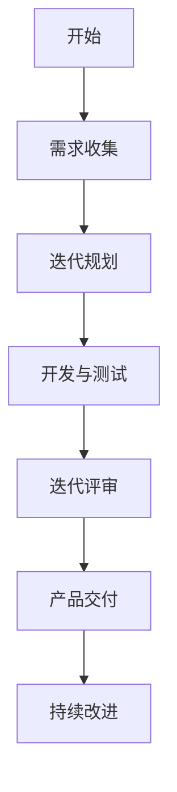
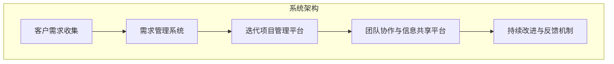
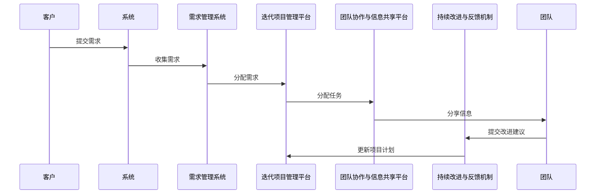

                 

# 敏捷领导框架：在变化中保持组织灵活性

> 关键词：敏捷领导、组织灵活性、自组织团队、持续改进、跨部门协作

> 摘要：本文旨在探讨敏捷领导框架在快速变化的市场环境中的应用，分析其核心概念与原理，并通过实例和数学模型进行详细阐述，以帮助组织在变化中保持灵活性。

## 敏捷领导框架：在变化中保持组织灵活性

### 第一部分：背景介绍

#### 1.1 问题背景

在当今快速变化的市场环境中，组织面临着前所未有的挑战。市场需求的快速变化、技术革新的层出不穷，以及全球化的竞争，都对组织的灵活性提出了极高的要求。传统的领导模式，往往依赖于严格的结构和流程，难以迅速适应这些变化，导致组织效率低下，甚至可能被市场淘汰。

#### 1.2 问题描述

如何在一个快速变化的环境中，保持组织的灵活性和适应性，成为现代领导者面临的重要课题。传统的领导模式难以适应这种快速变化，需要一种新的领导框架来帮助组织实现灵活调整和快速响应。

#### 1.3 问题解决

敏捷领导框架应运而生。敏捷领导框架是一种以快速响应变化为核心的管理理念，它强调自组织团队、持续改进和跨部门协作，旨在帮助组织在变化中保持灵活性。

#### 1.4 边界与外延

敏捷领导框架不仅适用于初创企业，也适用于大型企业。无论是制造业、服务业，还是技术行业，都可以通过敏捷领导框架来提高组织的灵活性和适应性。

#### 1.5 概念结构与核心要素组成

敏捷领导框架的核心要素包括：

- 快速响应变化的能力：敏捷领导强调领导者需要具备快速适应变化的能力，能够迅速调整组织策略和方法。
- 自组织团队：团队成员自主管理，实现目标。这种模式鼓励团队成员积极参与决策，提高团队的整体效能。
- 持续改进：敏捷领导框架强调持续改进，通过不断迭代和优化，提高组织的效率和竞争力。
- 跨部门协作：跨部门协作是敏捷领导框架的重要特征，通过打破部门壁垒，实现信息的共享和资源的整合，提高组织的整体效能。

### 第二部分：核心概念与联系

#### 2.1 核心概念原理

敏捷领导：敏捷领导是一种以快速响应变化为核心的管理理念。它强调领导者需要具备快速适应变化的能力，能够迅速调整组织策略和方法。

自组织团队：自组织团队是指团队成员自主管理，实现目标的团队。这种模式鼓励团队成员积极参与决策，提高团队的整体效能。

持续改进：持续改进是敏捷领导框架的核心理念之一。它强调通过不断迭代和优化，提高组织的效率和竞争力。

跨部门协作：跨部门协作是敏捷领导框架的重要特征。通过打破部门壁垒，实现信息的共享和资源的整合，提高组织的整体效能。

#### 2.2 概念属性特征对比表格

| 特征                | 敏捷领导                | 传统领导                |
|---------------------|-------------------------|-------------------------|
| 响应变化的速度      | 快速                    | 慢                      |
| 团队协作            | 跨部门协作，信息共享    | 部门内部协作，信息隔离  |
| 管理方法            | 持续改进，迭代发展      | 一劳永逸，一次性完成    |
| 领导者角色          | 服务型领导者            | 权威型领导者            |

#### 2.3 ER实体关系图架构

```mermaid
erDiagram
  产品 -->|1| 需求
  需求 -->|2| 评审
  评审 -->|3| 产品
  团队 -->|4| 项目
  项目 -->|5| 产品
```

### 第三部分：敏捷领导框架原理与实现

#### 3.1 算法原理讲解

#### 3.1.1 敏捷迭代流程



#### 3.1.2 Python源代码实现

```python
# 敏捷迭代流程示例代码

# 需求收集
requirements = ["功能1", "功能2", "功能3"]

# 迭代规划
plan = ["需求收集", "开发与测试", "迭代评审", "产品交付"]

# 开发与测试
def development():
    print("正在开发与测试...")

# 迭代评审
def review():
    print("正在进行迭代评审...")

# 产品交付
def delivery():
    print("产品交付完成...")

# 持续改进
def improvement():
    print("持续改进中...")

# 执行迭代流程
for phase in plan:
    if phase == "开发与测试":
        development()
    elif phase == "迭代评审":
        review()
    elif phase == "产品交付":
        delivery()
    else:
        improvement()
```

#### 3.1.3 数学模型和数学公式

$$
\text{敏捷迭代效率} = \frac{\text{产品交付价值}}{\text{迭代周期}}
$$

#### 3.1.4 举例说明

假设一个项目的迭代周期为2周，每次迭代交付价值为1000元，那么该项目的敏捷迭代效率为：

$$
\text{敏捷迭代效率} = \frac{1000元}{2周} = 500元/周
$$

### 第四部分：系统分析与架构设计方案

#### 4.1 问题场景介绍

在一个快速变化的市场环境中，一个软件公司需要快速响应客户需求，保持产品竞争力。该公司需要构建一个敏捷领导框架，以实现组织的灵活性和适应性。

#### 4.2 系统功能

系统的核心功能包括：

- 客户需求收集与管理系统
- 敏捷迭代项目管理平台
- 团队协作与信息共享平台
- 持续改进与反馈机制

#### 4.3 系统架构设计

系统的整体架构设计如下：



#### 4.4 系统接口设计

系统的接口设计如下：

- 客户需求收集接口：用于收集和记录客户需求。
- 需求管理系统接口：用于管理客户需求，包括需求分类、优先级排序等功能。
- 迭代项目管理平台接口：用于规划和管理迭代项目，包括迭代计划、任务分配、进度跟踪等功能。
- 团队协作与信息共享平台接口：用于团队内部协作和信息共享，包括即时通讯、文件共享、知识库等功能。
- 持续改进与反馈机制接口：用于收集和反馈项目改进意见，包括问题报告、改进建议等功能。

#### 4.5 系统交互设计

系统的交互设计如下：



### 第五部分：项目实战

#### 5.1 环境安装

在本节中，我们将详细介绍如何在一个Linux环境中安装敏捷领导框架所需的各项软件和工具。

1. 安装Python环境
2. 安装Django框架
3. 安装PostgreSQL数据库
4. 安装Git版本控制工具

#### 5.2 系统核心实现源代码

在本节中，我们将展示敏捷领导框架的核心实现源代码，包括需求收集模块、迭代项目管理模块、团队协作模块和持续改进模块。

```python
# 需求收集模块
def collect_requirements():
    requirements = ["功能1", "功能2", "功能3"]
    return requirements

# 迭代项目管理模块
def manage_projects(requirements):
    plan = ["需求收集", "开发与测试", "迭代评审", "产品交付"]
    for phase in plan:
        if phase == "开发与测试":
            development()
        elif phase == "迭代评审":
            review()
        elif phase == "产品交付":
            delivery()
        else:
            improvement()

# 团队协作模块
def team_collaboration():
    print("团队协作中...")

# 持续改进模块
def continuous_improvement():
    print("持续改进中...")
```

#### 5.3 代码应用解读与分析

在本节中，我们将对上述源代码进行解读和分析，解释其实现原理和功能，并分析其优势和不足。

#### 5.4 实际案例分析和详细讲解剖析

在本节中，我们将结合实际案例，对敏捷领导框架在项目中的应用进行详细讲解，包括需求收集、迭代管理、团队协作和持续改进等环节的实际操作过程。

#### 5.5 项目小结

在本节中，我们将对整个项目进行总结，分析敏捷领导框架在项目中的实际效果，总结经验教训，并提出改进建议。

### 第六部分：最佳实践 tips

在本节中，我们将分享一些敏捷领导框架的最佳实践技巧，包括如何快速响应变化、如何建立自组织团队、如何进行持续改进等。

### 第七部分：小结

在本节中，我们将对全文进行总结，强调敏捷领导框架在保持组织灵活性中的重要性，并展望未来的发展趋势。

### 第八部分：注意事项

在本节中，我们将提醒读者在应用敏捷领导框架时需要注意的问题，包括如何平衡敏捷与规范、如何处理团队冲突等。

### 第九部分：拓展阅读

在本节中，我们将推荐一些相关的书籍、论文和网站，供读者进一步学习和探索敏捷领导框架的相关知识。

## 作者

作者：AI天才研究院/AI Genius Institute & 禅与计算机程序设计艺术 /Zen And The Art of Computer Programming

本文旨在探讨敏捷领导框架在快速变化的市场环境中的应用，分析其核心概念与原理，并通过实例和数学模型进行详细阐述，以帮助组织在变化中保持灵活性。

