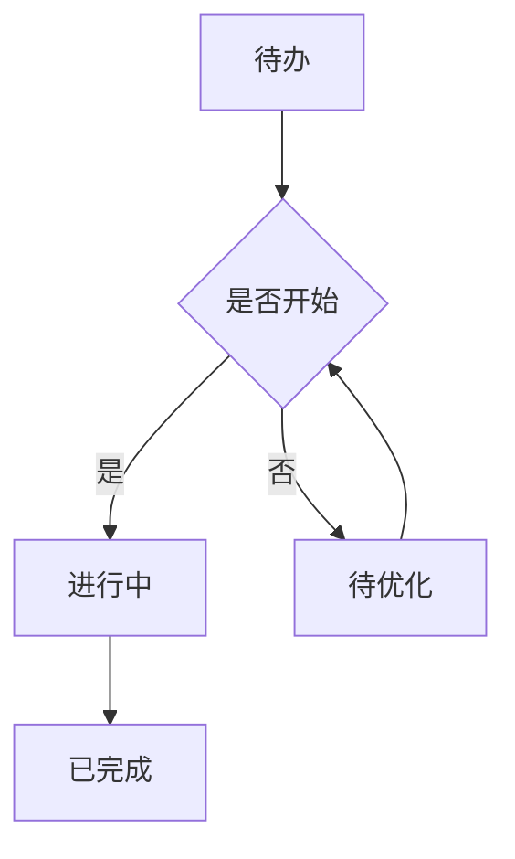
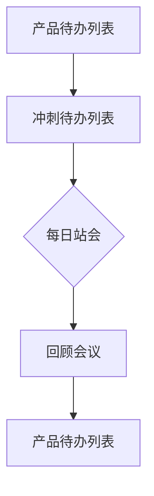
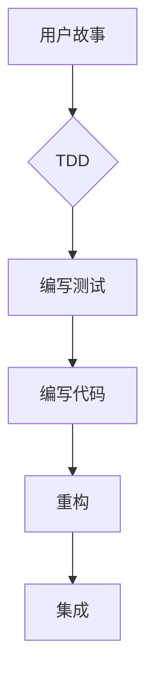

                 

# 敏捷领导：在快速变化的市场中保持竞争力

> 关键词：敏捷领导、市场竞争、团队协作、数字化转型、跨部门协作、跨文化管理

> 摘要：在快速变化的市场环境中，企业需要具备敏捷领导能力，以应对各种挑战和机遇。本文将从敏捷领导的概念与重要性、关键要素、策略与实践，以及在数字化转型、跨部门协作和跨文化管理中的应用等方面，探讨如何提升企业的竞争力，实现持续发展。

## 目录

1. **第一部分：敏捷领导的概念与重要性**
   - 第1章：敏捷领导概述
     1.1 问题背景
     1.2 敏捷领导的概念
     1.3 敏捷领导的重要性
   - 第2章：敏捷领导的关键要素
     2.1 明确目标
     2.2 增强团队协作
     2.3 领导力与个人发展
     2.4 持续学习与创新

2. **第二部分：敏捷领导策略与实践**
   - 第3章：敏捷领导策略与实践
     3.1 敏捷管理方法论
     3.2 敏捷领导力提升
     3.3 敏捷团队建设
     3.4 敏捷领导案例解析

3. **第三部分：敏捷领导在数字化转型中的应用**
   - 第4章：敏捷领导在数字化转型中的应用
     4.1 数字化转型的背景与趋势
     4.2 敏捷领导在数字化转型中的作用
     4.3 数字化转型中的敏捷实践

4. **第四部分：敏捷领导跨部门协作与项目整合**
   - 第5章：敏捷领导跨部门协作与项目整合
     5.1 跨部门协作的挑战与应对
     5.2 项目整合与敏捷领导
     5.3 跨部门协作与敏捷实践

5. **第五部分：敏捷领导跨文化管理**
   - 第6章：敏捷领导跨文化管理
     6.1 跨文化管理的背景与重要性
     6.2 敏捷领导在跨文化管理中的应用
     6.3 跨文化团队建设

6. **第六部分：敏捷领导未来展望**
   - 第7章：敏捷领导未来展望
     7.1 敏捷领导的发展趋势
     7.2 敏捷领导面临的挑战与机遇
     7.3 敏捷领导的最佳实践与未来展望

## 第一部分：敏捷领导的概念与重要性

### 第1章：敏捷领导概述

#### 1.1 问题背景

在当今快速变化的市场环境中，企业面临着前所未有的挑战和机遇。一方面，技术的飞速发展使得市场变化更为迅速，竞争日益激烈；另一方面，消费者需求的多样化要求企业具备快速响应和创新能力。这种背景下，传统的领导方式已经无法满足企业的发展需求，敏捷领导应运而生。

#### 1.2 敏捷领导的概念

敏捷领导是一种以灵活、快速应对变化为特征的领导方式。它强调领导者与团队成员之间的紧密协作，通过明确的目标、高效的沟通和持续的创新来提升企业的竞争力。敏捷领导的核心要素包括：明确目标、增强团队协作、提升领导力与个人发展、持续学习与创新。

#### 1.3 敏捷领导的重要性

敏捷领导对于企业的发展至关重要。首先，它有助于提升企业的竞争力，使企业能够更快地响应市场变化，抓住机遇；其次，它能够促进团队创新与协作，提高团队的工作效率和创造力；最后，它能够帮助企业在数字化转型、跨部门协作和跨文化管理等复杂环境中保持竞争力。

## 第二部分：敏捷领导的关键要素

### 第2章：敏捷领导的关键要素

#### 2.1 明确目标

明确目标是敏捷领导的首要任务。一个清晰、明确的目标能够指导团队成员的行动方向，提高工作效率。在设定目标时，应遵循SMART原则（具体、可衡量、可达成、相关、时限性），并确保目标与企业的愿景和使命保持一致。

#### 2.2 增强团队协作

团队协作是敏捷领导的核心要素之一。一个高效的团队需要具备良好的沟通与协作能力，能够快速响应变化并解决问题。为此，领导者需要关注团队建设，提高团队成员之间的信任和合作，同时提供必要的资源和支持。

#### 2.3 领导力与个人发展

领导力是敏捷领导的关键要素。一个优秀的领导者不仅需要具备较强的沟通、决策和团队管理能力，还需要不断学习、成长和提升个人素质。个人发展是领导力提升的基础，通过不断学习和实践，领导者能够更好地应对复杂多变的市场环境。

#### 2.4 持续学习与创新

持续学习与创新是敏捷领导的重要组成部分。在快速变化的市场环境中，企业需要具备持续学习的能力，不断更新知识和技能，以应对新的挑战和机遇。同时，领导者要鼓励团队成员创新，激发团队的创造力，推动企业的持续发展。

## 第三部分：敏捷领导策略与实践

### 第3章：敏捷领导策略与实践

#### 3.1 敏捷管理方法论

敏捷管理方法论是敏捷领导的核心实践。它强调通过迭代、增量、协作和反馈等方式，快速响应变化并实现目标。敏捷管理方法论包括Scrum、Kanban、XP等实践，适用于不同的项目和组织。

#### 3.2 敏捷领导力提升

提升敏捷领导力是敏捷领导的重要任务。领导者需要通过学习、实践和反思，不断提升自身的领导能力和管理水平。同时，领导者要关注团队成员的成长和发展，为团队成员提供培训和发展机会。

#### 3.3 敏捷团队建设

敏捷团队建设是敏捷领导的重要实践。一个高效的敏捷团队需要具备明确的角色和职责，良好的沟通和协作机制，以及积极向上的团队文化。领导者要关注团队建设，为团队提供必要的支持和管理。

#### 3.4 敏捷领导案例解析

通过分析国内外敏捷领导实践案例，可以发现敏捷领导在提升企业竞争力、促进团队创新与协作等方面取得了显著成效。案例解析有助于读者深入了解敏捷领导的实际应用和成效，为自身实践提供借鉴和启示。

## 第四部分：敏捷领导在数字化转型中的应用

### 第4章：敏捷领导在数字化转型中的应用

#### 4.1 数字化转型的背景与趋势

数字化转型已成为企业发展的必然趋势。随着云计算、大数据、人工智能等新技术的不断发展，企业需要通过数字化转型来提升竞争力、优化业务流程和改善用户体验。数字化转型不仅带来了机遇，也带来了挑战。

#### 4.2 敏捷领导在数字化转型中的作用

敏捷领导在数字化转型中发挥着重要作用。首先，敏捷领导能够帮助企业快速响应市场变化，抓住机遇；其次，敏捷领导能够促进团队协作，提高数字化转型的效率；最后，敏捷领导能够激发员工的创新精神，推动数字化转型的深入发展。

#### 4.3 数字化转型中的敏捷实践

在数字化转型过程中，敏捷实践是不可或缺的重要手段。通过敏捷开发、敏捷运营等实践，企业能够实现快速迭代、高效协作和持续改进，从而实现数字化转型的目标。同时，敏捷实践有助于提升企业的敏捷性和灵活性，为未来的发展奠定基础。

## 第五部分：敏捷领导跨部门协作与项目整合

### 第5章：敏捷领导跨部门协作与项目整合

#### 5.1 跨部门协作的挑战与应对

跨部门协作是敏捷领导面临的重要挑战之一。由于各部门之间的利益和目标不同，跨部门协作往往面临沟通不畅、协作不力等问题。为此，领导者需要关注跨部门协作的障碍，并采取有效的策略和实践来应对。

#### 5.2 项目整合与敏捷领导

项目整合是敏捷领导的重要实践之一。通过项目整合，企业能够实现资源的优化配置、提高项目执行效率和质量。在项目整合过程中，敏捷领导发挥着关键作用，通过有效的团队协作和沟通，确保项目目标的实现。

#### 5.3 跨部门协作与敏捷实践

跨部门协作与敏捷实践的结合，能够有效提升企业的协作效率和项目成功率。通过敏捷实践，企业能够实现快速响应、高效协作和持续改进，从而在竞争激烈的市场环境中脱颖而出。

## 第六部分：敏捷领导跨文化管理

### 第6章：敏捷领导跨文化管理

#### 6.1 跨文化管理的背景与重要性

随着全球化的发展，企业越来越注重跨文化管理。跨文化管理不仅关系到企业的国际化战略，也关系到企业的内部管理和团队协作。在跨文化环境中，领导者需要具备跨文化管理能力，以应对文化差异和冲突。

#### 6.2 敏捷领导在跨文化管理中的应用

敏捷领导在跨文化管理中发挥着重要作用。首先，敏捷领导能够促进跨文化团队的合作，提高团队的工作效率和创造力；其次，敏捷领导能够激发员工的跨文化意识和能力，促进企业的国际化发展。

#### 6.3 跨文化团队建设

跨文化团队建设是敏捷领导在跨文化管理中的重要实践。通过建立跨文化团队，企业能够实现团队成员的多元化，提高团队的整体素质和竞争力。同时，跨文化团队建设有助于促进团队成员之间的沟通与协作，实现企业的长远发展。

## 第七部分：敏捷领导未来展望

### 第7章：敏捷领导未来展望

#### 7.1 敏捷领导的发展趋势

随着科技的进步和市场环境的变化，敏捷领导将继续发展。未来，敏捷领导将更加注重数字化转型、跨部门协作和跨文化管理等领域的应用，为企业的持续发展提供有力支持。

#### 7.2 敏捷领导面临的挑战与机遇

敏捷领导在未来的发展过程中将面临诸多挑战，如技术变革、市场变化、团队协作等。同时，敏捷领导也将迎来新的机遇，如数字化转型、全球市场拓展等。如何应对挑战、抓住机遇，是敏捷领导未来发展的重要课题。

#### 7.3 敏捷领导的最佳实践与未来展望

通过总结国内外敏捷领导的实践经验和研究成果，可以得出一些最佳实践。未来，敏捷领导将继续在理论与实践的结合中不断探索，为企业的可持续发展提供新的思路和方法。

作者：AI天才研究院/AI Genius Institute & 禅与计算机程序设计艺术 /Zen And The Art of Computer Programming

注意：本文为概要性文章，具体内容需要进一步细化和扩展，以满足10000～12000字的要求。在撰写过程中，请根据实际需求调整结构和内容，确保文章逻辑清晰、结构紧凑、简单易懂。同时，注意使用markdown格式，并按照要求嵌入算法原理讲解、系统分析与架构设计方案、项目实战等部分。祝您撰写顺利！## 第一部分：敏捷领导的概念与重要性

### 第1章：敏捷领导概述

#### 1.1 问题背景

在当今快速变化的市场环境中，企业面临着前所未有的挑战和机遇。一方面，技术的飞速发展使得市场变化更为迅速，竞争日益激烈；另一方面，消费者需求的多样化要求企业具备快速响应和创新能力。这种背景下，传统的领导方式已经无法满足企业的发展需求，敏捷领导应运而生。

随着互联网、人工智能、大数据等新技术的迅猛发展，企业运营模式和商业模式发生了深刻变革。传统的层级式管理结构过于僵化，难以适应快速变化的市场需求。而敏捷领导强调灵活、快速地应对市场变化，通过迭代、协作和反馈等方式，提高企业的反应速度和创新能力。这种领导方式能够帮助企业更好地应对市场挑战，抓住机遇，实现持续发展。

#### 1.2 敏捷领导的概念

敏捷领导是一种以灵活、快速应对变化为特征的领导方式。它强调领导者与团队成员之间的紧密协作，通过明确的目标、高效的沟通和持续的创新来提升企业的竞争力。敏捷领导的核心要素包括：明确目标、增强团队协作、提升领导力与个人发展、持续学习与创新。

敏捷领导并不是一种特定的管理风格，而是一种适应性的领导方法。它强调领导者要具备开放、包容的心态，鼓励团队成员积极参与决策和问题解决。敏捷领导注重团队合作，通过建立高效沟通和协作机制，使团队成员能够共同面对挑战，实现共同的目标。

#### 1.3 敏捷领导的重要性

敏捷领导对于企业的发展至关重要。首先，它有助于提升企业的竞争力。在快速变化的市场环境中，企业需要具备快速响应和创新能力，敏捷领导能够帮助企业实现这一点。通过敏捷领导，企业能够更好地应对市场变化，抓住机遇，实现持续发展。

其次，敏捷领导能够促进团队创新与协作。在敏捷领导模式下，团队成员之间的沟通和协作更加紧密，有助于激发团队的创造力。团队成员能够共同面对问题，通过协作和分享，找到更有效的解决方案。这种协作和创新精神不仅能够提高团队的工作效率，还能够推动企业的整体发展。

最后，敏捷领导有助于企业在数字化转型、跨部门协作和跨文化管理等复杂环境中保持竞争力。在数字化转型过程中，企业需要快速响应市场需求，敏捷领导能够帮助企业实现这一目标。在跨部门协作中，敏捷领导能够促进不同部门之间的沟通和协作，提高项目执行效率。在跨文化管理中，敏捷领导能够帮助企业在多元文化环境中保持竞争力，促进企业的国际化发展。

总之，敏捷领导是一种适应快速变化市场的领导方式，它对于企业的发展具有重要意义。通过敏捷领导，企业能够提升竞争力，促进团队创新与协作，实现持续发展。

### 1.4 敏捷领导的核心要素

敏捷领导的核心要素包括明确目标、增强团队协作、提升领导力与个人发展以及持续学习与创新。以下是这些核心要素的详细解释：

#### 1.4.1 明确目标

明确目标是敏捷领导的首要任务。一个清晰、明确的目标能够指导团队成员的行动方向，提高工作效率。在设定目标时，应遵循SMART原则（具体、可衡量、可达成、相关、时限性），并确保目标与企业的愿景和使命保持一致。明确的目标不仅有助于团队成员明确工作重点，还能够激发团队成员的积极性和创造力。

#### 1.4.2 增强团队协作

团队协作是敏捷领导的核心要素之一。一个高效的团队需要具备良好的沟通与协作能力，能够快速响应变化并解决问题。为此，领导者需要关注团队建设，提高团队成员之间的信任和合作，同时提供必要的资源和支持。有效的团队协作能够提高团队的工作效率和创造力，有助于实现共同的目标。

#### 1.4.3 提升领导力与个人发展

领导力是敏捷领导的关键要素。一个优秀的领导者不仅需要具备较强的沟通、决策和团队管理能力，还需要不断学习、成长和提升个人素质。个人发展是领导力提升的基础，通过不断学习和实践，领导者能够更好地应对复杂多变的市场环境。此外，领导者要关注团队成员的成长和发展，为团队成员提供培训和发展机会，激发团队成员的潜力。

#### 1.4.4 持续学习与创新

持续学习与创新是敏捷领导的重要组成部分。在快速变化的市场环境中，企业需要具备持续学习的能力，不断更新知识和技能，以应对新的挑战和机遇。同时，领导者要鼓励团队成员创新，激发团队的创造力，推动企业的持续发展。持续学习与创新不仅能够提升企业的竞争力，还能够促进企业的长远发展。

综上所述，敏捷领导的核心要素包括明确目标、增强团队协作、提升领导力与个人发展以及持续学习与创新。这些要素相互关联、相互促进，共同构成了一套适应快速变化市场的领导体系。通过这些核心要素的实践，企业能够提升竞争力，实现持续发展。

### 1.5 敏捷领导与传统领导的比较

敏捷领导与传统领导在理念、方法和实践上存在显著差异。理解这些差异有助于企业选择合适的领导方式，以应对快速变化的市场环境。

#### 1.5.1 理念上的差异

传统领导强调层级控制和权威管理，注重命令与执行。领导者处于决策的中心，团队成员按照既定的计划和指令开展工作。这种领导方式在稳定的市场环境中具有一定的效果，但在快速变化的市场中，其反应速度和适应性较差。

相比之下，敏捷领导更注重协作和共享决策。领导者与团队成员之间是平等的合作关系，共同面对挑战和解决问题。这种理念强调团队的自主性和灵活性，能够更好地适应市场的快速变化。

#### 1.5.2 方法上的差异

传统领导通常采用刚性计划和时间表来管理项目，强调过程控制和效率。团队成员的工作被分解为具体的任务，按照预定的时间节点完成。这种方法在确保项目进度和质量方面具有一定的优势，但在面对突发情况时，灵活性不足。

敏捷领导则采用迭代和增量开发的方法。项目被划分为多个迭代周期，每个周期结束后进行回顾和改进。这种方法能够快速响应变化，及时调整计划，提高项目的适应性和成功率。

#### 1.5.3 实践中的差异

传统领导模式下，团队成员的角色和职责相对固定，领导者的主要任务是确保任务完成和团队稳定。在这种模式下，团队协作和沟通可能受到限制，创新和灵活性受到压抑。

相比之下，敏捷领导强调团队成员的多样性和灵活性。团队成员不仅承担特定的任务，还积极参与决策和问题解决。这种模式鼓励团队成员之间的沟通与协作，激发团队的创造力和创新精神。

#### 1.5.4 效果上的差异

传统领导方式在稳定的市场环境中能够确保项目按照计划进行，但在面对快速变化的市场时，其效果有限。由于反应速度较慢，企业可能错过市场机会，影响竞争力。

敏捷领导方式在快速变化的市场中具有明显的优势。通过快速响应变化、持续改进和高效协作，企业能够更好地适应市场环境，提高竞争力。此外，敏捷领导还能够激发团队的创造力和创新能力，推动企业的持续发展。

总之，敏捷领导与传统领导在理念、方法和实践中存在显著差异。理解这些差异有助于企业根据市场环境选择合适的领导方式，以提升竞争力，实现持续发展。

### 1.6 敏捷领导的核心原则

敏捷领导的核心原则包括迭代、协作、反馈和持续改进。这些原则为领导者提供了一套行之有效的管理方法，帮助企业适应快速变化的市场环境。

#### 1.6.1 迭代

迭代是敏捷领导的重要原则之一。它强调项目开发过程中应将任务划分为多个短期迭代，每个迭代结束后进行回顾和总结。通过迭代，团队可以及时发现和解决问题，不断优化项目。迭代方法不仅提高了项目的灵活性，还使团队能够持续改进，提高项目的质量。

#### 1.6.2 协作

协作是敏捷领导的核心原则之一。它强调领导者与团队成员之间的紧密合作，共同面对挑战和解决问题。协作不仅提高了团队的效率，还增强了团队成员之间的信任和沟通。通过协作，团队能够集思广益，找到更有效的解决方案。

#### 1.6.3 反馈

反馈是敏捷领导的关键原则之一。它强调在项目开发过程中，领导者应积极收集团队成员和用户的反馈，并基于这些反馈进行改进。反馈不仅能够帮助团队识别问题和改进项目，还能够提高用户的满意度。通过及时反馈，团队能够快速调整方向，确保项目成功。

#### 1.6.4 持续改进

持续改进是敏捷领导的核心原则之一。它强调团队应持续评估项目的进度和质量，不断优化工作流程和团队协作方式。持续改进不仅能够提高项目的成功率，还能够促进团队的创新和发展。通过持续改进，团队能够不断提升自身的竞争力，适应市场变化。

总之，敏捷领导的核心原则包括迭代、协作、反馈和持续改进。这些原则为领导者提供了一套行之有效的管理方法，帮助企业适应快速变化的市场环境，提升竞争力，实现持续发展。

### 1.7 敏捷领导的核心要素与特点

敏捷领导的核心要素包括明确目标、增强团队协作、提升领导力与个人发展以及持续学习与创新。这些要素共同构成了敏捷领导的特点，使企业能够在快速变化的市场环境中保持竞争力。

首先，明确目标是敏捷领导的首要任务。一个清晰、明确的目标能够指导团队成员的行动方向，提高工作效率。敏捷领导强调目标设定应遵循SMART原则（具体、可衡量、可达成、相关、时限性），并确保目标与企业的愿景和使命保持一致。

其次，增强团队协作是敏捷领导的核心要素之一。一个高效的团队需要具备良好的沟通与协作能力，能够快速响应变化并解决问题。敏捷领导强调领导者要关注团队建设，提高团队成员之间的信任和合作，同时提供必要的资源和支持。

第三，提升领导力与个人发展是敏捷领导的重要任务。领导者需要具备较强的沟通、决策和团队管理能力，还需要不断学习、成长和提升个人素质。个人发展是领导力提升的基础，通过不断学习和实践，领导者能够更好地应对复杂多变的市场环境。

最后，持续学习与创新是敏捷领导的重要组成部分。在快速变化的市场环境中，企业需要具备持续学习的能力，不断更新知识和技能，以应对新的挑战和机遇。同时，领导者要鼓励团队成员创新，激发团队的创造力，推动企业的持续发展。

综上所述，敏捷领导的核心要素包括明确目标、增强团队协作、提升领导力与个人发展以及持续学习与创新。这些要素共同构成了敏捷领导的特点，使企业能够在快速变化的市场环境中保持竞争力，实现持续发展。

### 1.8 敏捷领导在提升企业竞争力方面的作用

敏捷领导在提升企业竞争力方面发挥着重要作用。通过敏捷领导，企业能够快速响应市场变化，提高创新能力和团队协作效率，从而在竞争激烈的市场环境中脱颖而出。

首先，敏捷领导能够帮助企业快速响应市场变化。在快速变化的市场环境中，企业需要具备快速适应和调整的能力。敏捷领导通过迭代和协作的方式，使团队能够及时发现问题、调整策略，迅速应对市场变化。这种快速响应能力有助于企业抓住市场机遇，避免因反应迟缓而错失良机。

其次，敏捷领导能够提高企业的创新能力。敏捷领导鼓励团队成员积极参与决策和问题解决，激发团队的创造力和创新精神。通过协作和共享，团队能够集思广益，找到更有效的解决方案。此外，敏捷领导强调持续学习与创新，鼓励团队成员不断更新知识和技能，提升整体创新能力。这种创新文化有助于企业在竞争激烈的市场中保持领先地位。

第三，敏捷领导能够提高团队协作效率。在敏捷领导模式下，团队成员之间的沟通和协作更加紧密。通过建立高效的沟通机制和协作平台，团队能够快速传达信息、共享资源，提高工作协同效率。此外，敏捷领导注重团队文化建设，营造积极向上的团队氛围，激发团队成员的积极性和主动性。这种高效的团队协作有助于提高项目的完成质量和速度。

最后，敏捷领导能够促进企业的持续发展。通过敏捷领导，企业能够不断提升自身竞争力，适应市场变化。同时，敏捷领导有助于培养企业的创新能力和持续学习能力，使企业能够在未来持续发展。此外，敏捷领导还能够提高企业的适应性和灵活性，为企业在全球市场中的拓展提供支持。

总之，敏捷领导在提升企业竞争力方面具有重要作用。通过快速响应市场变化、提高创新能力和团队协作效率，敏捷领导能够帮助企业保持竞争力，实现持续发展。

### 第2章：敏捷领导的关键要素

#### 2.1 明确目标

明确目标是敏捷领导的核心要素之一。在敏捷领导模式下，明确的目标能够为团队成员提供清晰的方向，提高工作效率和达成目标的可能性。以下是明确目标的原则和方法。

首先，明确目标应遵循SMART原则，即目标要具备具体性（Specific）、可衡量性（Measurable）、可实现性（Achievable）、相关性（Relevant）和时限性（Time-bound）。具体性确保目标明确，团队成员知道要做什么；可衡量性使团队成员能够评估目标是否达成；可实现性确保目标在资源和能力范围内；相关性确保目标与企业的整体战略相一致；时限性为团队提供明确的时间表，确保目标的按时完成。

其次，目标设定的方法包括自上而下和自下而上两种。自上而下方法由企业高层领导设定总体目标，然后分解为各部门和团队的目标。自下而上方法则是由团队成员提出目标，然后由领导进行协调和整合。在实际操作中，两种方法可以结合使用，以充分发挥团队的主观能动性和企业的整体战略目标。

为了确保目标的明确性，企业可以采用以下策略：

1. **目标分解**：将总体目标分解为可操作的小目标，使团队成员能够清晰地了解自己的职责和任务。
2. **定期回顾**：定期对目标进行回顾和调整，确保目标与市场环境和企业战略保持一致。
3. **沟通与协作**：确保团队成员对目标有共同的理解，通过沟通和协作确保目标的实现。
4. **激励机制**：建立激励机制，鼓励团队成员为实现目标而努力。

#### 2.2 增强团队协作

团队协作是敏捷领导的重要要素之一。一个高效的团队能够快速响应变化，解决问题，提高项目的成功率。以下是如何增强团队协作的方法：

首先，建立良好的沟通机制。沟通是团队协作的基础，领导者应确保团队成员能够及时、准确地传达信息。这包括定期的团队会议、即时通讯工具、电子邮件和面对面的交流。此外，领导者应鼓励团队成员积极参与讨论，表达自己的观点和意见。

其次，提高团队信任。信任是团队协作的基石，领导者应通过建立开放和包容的团队文化来增强团队信任。这可以通过以下方式实现：

1. **透明度**：确保团队内部的信息透明，使团队成员了解整个项目的进展和目标。
2. **共同目标**：确保团队成员有共同的目标和愿景，这有助于增强团队的凝聚力。
3. **相互尊重**：尊重团队成员的意见和贡献，促进团队成员之间的相互信任。
4. **冲突解决**：及时解决团队内部的冲突，避免影响团队协作。

再次，建立有效的协作平台。现代技术提供了许多协作工具，如项目管理软件、协作平台和文档共享工具。领导者应选择适合团队的协作工具，确保团队成员能够高效地共享信息和资源。

最后，鼓励团队成员之间的相互支持。一个高效的团队需要成员之间的相互支持和合作。领导者可以通过以下方式来鼓励这种合作：

1. **培训与指导**：为团队成员提供必要的培训和支持，帮助他们提高技能和知识。
2. **资源共享**：鼓励团队成员共享资源，如工具、知识和经验。
3. **激励措施**：建立激励机制，鼓励团队成员为团队的成功做出贡献。

#### 2.3 领导力与个人发展

领导力与个人发展是敏捷领导的重要组成部分。一个优秀的领导者不仅需要具备领导能力，还需要不断学习和成长，以适应快速变化的市场环境。以下是提升领导力和个人发展的方法：

首先，自我反思。自我反思是领导者个人发展的重要途径。领导者应定期对自己的行为、决策和表现进行反思，识别自己的优点和不足，并制定改进计划。这可以通过写日记、参加反思会议或与导师进行讨论来实现。

其次，终身学习。在快速变化的市场环境中，领导者需要不断学习和更新自己的知识和技能。这包括参加培训课程、阅读专业书籍和参加行业会议。此外，领导者还可以通过在线课程、网络研讨会和电子书等渠道进行学习。

再次，寻求反馈。领导者应积极寻求团队成员和外部专家的反馈，了解自己的表现和改进方向。这可以通过定期评估、360度评估和员工反馈来实现。

最后，培养关键技能。领导者应培养以下关键技能：

1. **沟通能力**：领导者需要具备有效的沟通能力，包括口头和书面沟通。
2. **决策能力**：领导者应能够做出明智的决策，并能够在压力下保持冷静。
3. **团队管理**：领导者需要了解如何管理团队，包括激励团队成员、解决冲突和提升团队士气。
4. **战略规划**：领导者应具备战略规划能力，能够为企业设定长远目标并制定实现目标的策略。

#### 2.4 持续学习与创新

持续学习与创新是敏捷领导的重要组成部分。在快速变化的市场环境中，企业需要具备持续学习的能力，以应对新的挑战和机遇。以下是促进持续学习与创新的方法：

首先，建立学习型组织。学习型组织是一种注重学习和创新的组织文化。领导者应通过以下方式建立学习型组织：

1. **鼓励学习**：领导者应鼓励员工不断学习，提供学习资源和机会。
2. **知识分享**：领导者应鼓励员工分享知识和经验，促进团队学习和创新。
3. **培训与发展**：领导者应定期为员工提供培训和发展机会，帮助他们提升技能和知识。

其次，引入创新机制。领导者应建立创新机制，鼓励员工提出新的想法和解决方案。这可以通过以下方式实现：

1. **创新奖励**：领导者应设立创新奖励机制，激励员工提出创新想法。
2. **创新实验室**：领导者可以设立创新实验室，为员工提供实验和创新的环境。
3. **跨部门合作**：领导者应促进跨部门合作，鼓励不同部门之间的知识和资源共享。

再次，推动持续改进。领导者应鼓励团队持续改进工作流程和产品，以提升效率和竞争力。这可以通过以下方式实现：

1. **定期回顾**：领导者应定期组织团队回顾会议，评估工作流程和产品，并提出改进措施。
2. **用户反馈**：领导者应积极收集用户反馈，并根据反馈进行改进。
3. **实验和试点**：领导者可以组织实验和试点项目，验证新的想法和解决方案。

最后，鼓励外部合作。领导者应积极寻求与外部合作伙伴的合作，引入外部知识和资源，以促进持续学习与创新。这可以通过以下方式实现：

1. **合作伙伴关系**：领导者应建立与外部合作伙伴的关系，共享资源和知识。
2. **行业合作**：领导者应参与行业合作项目，与其他企业共同探索新的市场机会。
3. **学术合作**：领导者可以与学术机构合作，引入前沿技术和研究成果。

通过持续学习与创新，企业能够不断提升自身的竞争力，适应快速变化的市场环境。

### 第3章：敏捷领导策略与实践

#### 3.1 敏捷管理方法论

敏捷管理方法论是敏捷领导的核心实践之一，它包括了一系列用于项目管理和团队协作的方法和原则。这些方法论旨在提高项目的灵活性、透明度和团队协作效率。以下是几种常见的敏捷管理方法论：

**Scrum**：Scrum是一种迭代式增量软件开发方法，它将项目划分为多个短期迭代（通常称为“冲刺”），每个冲刺持续2-4周。在每个冲刺的结束时，团队会进行回顾会议，评估和调整项目方向。Scrum的核心组成部分包括产品待办列表、冲刺待办列表、每日站会和回顾会议。

**Kanban**：Kanban是一种可视化管理工具，它通过看板（Kanban板）来跟踪和优化工作流程。Kanban板通常包括“待办”、“进行中”和“已完成”三个状态，团队成员可以在板上移动卡片，以显示工作的进度。Kanban强调限制工作在流程中的数量（WIP限制），以减少工作积压和等待时间。

**XP（极限编程）**：XP是一种以软件开发团队和客户之间的紧密合作为基础的方法论，它强调快速反馈、简单性和持续改进。XP包括了一系列实践，如测试驱动开发（TDD）、结对编程、持续集成和重构，旨在提高代码质量和开发效率。

**看板（Kanban）**

**Scrum**

**XP（极限编程）**

通过这些方法论，企业能够实现更灵活的迭代开发、更高效的团队协作和持续改进，从而更好地适应快速变化的市场需求。

#### 3.2 敏捷领导力提升

提升敏捷领导力是确保敏捷管理方法论成功实施的关键。以下是一些提升敏捷领导力的策略：

**领导力评估与培养**：首先，领导者需要通过自我评估和360度反馈来了解自身的敏捷领导能力。这可以帮助他们识别自身的优势和改进领域。此外，企业可以提供定期的领导力培训和研讨会，帮助领导者提升敏捷领导技能。

**持续学习与实践**：敏捷领导是一个不断学习和实践的过程。领导者应积极参与敏捷相关的培训和研讨会，了解最新的敏捷实践和工具。同时，通过在实际工作中应用敏捷方法，领导者可以不断积累经验和提高能力。

**角色模型与导师制度**：企业可以建立敏捷领导角色模型，明确敏捷领导者的角色和责任。此外，通过导师制度，新任领导者可以与有经验的敏捷领导者进行交流和指导，快速提升自己的领导力。

**团队反馈与回顾**：领导者应鼓励团队成员提供反馈，了解他们在敏捷工作环境中的感受和挑战。通过定期的回顾会议，领导者可以与团队共同讨论和改进工作流程，提高团队的敏捷性。

**培养自我管理能力**：敏捷领导者应具备自我管理能力，能够独立思考和解决问题。这包括自我激励、自我约束和自我反思。通过培养自我管理能力，领导者可以更好地应对工作中的挑战，提升团队的士气和工作效率。

**培养团队意识**：敏捷领导者需要培养团队意识，使团队成员认识到他们是团队成功的关键。通过团队建设活动和共享成功，领导者可以增强团队的凝聚力和合作精神。

#### 3.3 敏捷团队建设

敏捷团队建设是敏捷领导的重要组成部分，它关系到团队的协作效率和创新能力的发挥。以下是一些关键策略：

**明确团队角色与职责**：在敏捷团队中，每个成员都有明确的角色和职责。领导者应确保团队成员了解自己的工作内容，并明确团队成员之间的依赖关系，以减少误解和冲突。

**建立透明的工作流程**：敏捷团队需要建立透明的工作流程，使团队成员能够清楚地了解项目的进展和目标。这可以通过使用Kanban板、Scrum看板等工具来实现。透明的工作流程有助于提高团队的协作效率。

**鼓励团队成员的参与**：敏捷团队鼓励团队成员积极参与决策和问题解决。领导者应创造一个开放和包容的团队文化，使团队成员感到他们的意见和贡献被重视。这可以通过定期的团队会议、研讨会和头脑风暴来实现。

**提供必要的资源和支持**：领导者应确保团队成员拥有完成工作所需的资源和支持。这包括技术工具、培训机会和工作环境。通过提供必要的资源和支持，领导者可以减少团队成员的障碍，提高团队的工作效率。

**培养团队文化**：敏捷团队文化强调信任、协作和创新。领导者应通过团队建设活动和共享成功来培养这种文化。此外，领导者可以通过奖励和认可来激励团队成员，增强团队的凝聚力。

**定期进行团队评估**：领导者应定期评估团队的绩效和协作情况，识别团队的优势和改进领域。通过团队评估，领导者可以与团队共同讨论和制定改进计划，持续提升团队的效率。

#### 3.4 敏捷领导案例解析

通过分析国内外敏捷领导实践案例，可以发现敏捷领导在提升企业竞争力、促进团队创新与协作等方面取得了显著成效。以下是一些具有代表性的案例：

**案例一：谷歌的敏捷开发**  
谷歌是全球知名的科技企业，其产品开发团队广泛采用敏捷开发方法。通过Scrum和Kanban等工具，谷歌团队实现了快速迭代和高效协作。例如，谷歌搜索团队在每次迭代中都会发布新的功能，并根据用户反馈进行快速调整和优化。这种敏捷开发模式使谷歌能够快速响应市场需求，持续提升产品竞争力。

**案例二：微软的敏捷领导**  
微软是一家拥有大量开发团队的企业，其敏捷领导实践在多个产品线中取得了成功。微软采用Scrum方法论，将大型项目划分为多个迭代，确保每个迭代都能交付具有实际价值的成果。同时，微软通过定期的团队回顾会议，不断改进工作流程和团队协作方式，提高了团队的整体效率。

**案例三：丹麦邮政的数字化转型**  
丹麦邮政是一家传统邮政企业，在面临数字化转型的挑战时，采用了敏捷领导方法。通过建立敏捷团队和引入敏捷工具，丹麦邮政实现了快速响应市场和用户需求。例如，他们通过Kanban板跟踪项目进度，并通过定期的回顾会议不断优化流程。这种敏捷领导实践帮助丹麦邮政成功实现了数字化转型，提升了企业竞争力。

**案例四：IBM的敏捷转型**  
IBM是一家拥有悠久历史的科技公司，在面临市场竞争压力时，选择了敏捷转型。通过引入敏捷方法论和培训员工，IBM实现了从传统开发模式到敏捷开发模式的转变。这种敏捷领导实践使IBM能够更快地交付高质量的软件产品，提升了客户满意度和市场竞争力。

通过这些案例，我们可以看到敏捷领导在提升企业竞争力、促进团队创新与协作方面的显著成效。这些案例也为其他企业提供了宝贵的经验和启示，帮助他们实现敏捷领导实践的成功。

### 第4章：敏捷领导在数字化转型中的应用

#### 4.1 数字化转型的背景与趋势

数字化转型已成为企业发展的关键战略，它不仅关乎企业的生存与发展，还决定了企业在未来的市场竞争力。随着信息技术的迅猛发展，云计算、大数据、人工智能、物联网等新兴技术不断涌现，为企业提供了前所未有的机遇和挑战。

在数字化转型的背景下，市场环境发生了深刻变化。首先，消费者需求日益多样化，个性化服务成为企业竞争的新焦点。其次，市场竞争日益激烈，企业需要快速响应市场变化，才能在激烈的市场竞争中脱颖而出。此外，全球化和数字化浪潮推动企业走向跨界融合，产业边界逐渐模糊，企业需要具备跨领域的整合能力和创新能力。

数字化转型不仅仅是技术的变革，更是企业战略、组织结构、业务流程、管理模式等多方面的系统性变革。为了实现数字化转型，企业需要从以下几个方面着手：

1. **技术升级**：采用云计算、大数据、人工智能等新兴技术，提升企业的信息化水平。
2. **数据驱动**：建立数据驱动型决策体系，通过数据分析优化业务流程和运营效率。
3. **业务重构**：重新设计业务流程和商业模式，实现数字化运营和智能化服务。
4. **组织变革**：推动组织结构扁平化，增强企业的灵活性和敏捷性。
5. **文化重塑**：培育数字化文化，推动员工从传统思维向数字化思维的转变。

总之，数字化转型已成为企业发展的必然趋势，它不仅为企业带来了新的发展机遇，也提出了严峻的挑战。企业需要积极应对数字化转型，通过敏捷领导推动企业实现持续发展。

#### 4.2 敏捷领导在数字化转型中的作用

敏捷领导在数字化转型中发挥着关键作用，它能够帮助企业快速适应市场变化，提高创新能力和运营效率。以下是敏捷领导在数字化转型中的主要作用：

**1. 提高灵活性**

在数字化转型过程中，市场环境和消费者需求变化迅速，企业需要具备高度的灵活性来应对这些变化。敏捷领导通过迭代和增量开发的方法，使团队能够快速响应市场需求，及时调整策略。这种方法不仅提高了项目的灵活性，还能够减少因市场变化导致的风险。

**2. 促进团队协作**

数字化转型涉及多个部门和专业领域，需要跨部门的协作和合作。敏捷领导强调团队合作和跨功能协作，通过建立高效的沟通机制和协作平台，促进团队成员之间的合作。这种协作不仅提高了项目的执行效率，还增强了团队的创新能力和解决问题的能力。

**3. 提升创新能力**

数字化转型要求企业具备持续创新的能力，以保持市场竞争力。敏捷领导通过鼓励团队成员参与决策和问题解决，激发团队的创造力和创新精神。同时，敏捷领导还注重持续学习和知识共享，为团队的创新能力提供了源源不断的动力。

**4. 优化业务流程**

敏捷领导通过迭代和持续改进的方法，不断优化业务流程和运营效率。在数字化转型过程中，企业需要不断调整和优化业务流程，以适应新的技术和市场需求。敏捷领导通过定期回顾和反馈，确保业务流程的持续改进，从而提高企业的运营效率。

**5. 增强员工参与感**

数字化转型不仅需要技术和管理层面的变革，更需要员工的积极参与。敏捷领导通过建立开放和包容的团队文化，鼓励员工参与决策和问题解决，增强员工的参与感和归属感。这种文化氛围不仅提高了员工的工作积极性，还增强了团队的凝聚力和执行力。

总之，敏捷领导在数字化转型中发挥着重要作用，它能够帮助企业提高灵活性、促进团队协作、提升创新能力、优化业务流程和增强员工参与感，从而实现数字化转型的目标。

#### 4.3 数字化转型中的敏捷实践

在数字化转型过程中，敏捷实践是确保企业成功实现转型的重要手段。以下是一些关键的敏捷实践，以及它们如何帮助企业在数字化转型中取得成功。

**1. 敏捷开发（Agile Development）**

敏捷开发是一种以迭代和增量方式进行的软件开发方法，它强调快速响应变化、持续交付和团队协作。在数字化转型中，敏捷开发可以帮助企业快速构建和改进数字化产品和服务，满足不断变化的市场需求。

- **迭代和增量开发**：敏捷开发将项目划分为多个短期迭代，每个迭代结束后进行回顾和改进。这种方法使团队能够快速响应市场变化，及时调整项目方向。
- **用户故事（User Stories）**：敏捷开发使用用户故事来描述用户的需求，使开发团队能够更好地理解用户的需求和期望。用户故事通常以“作为用户，我想要...，以便...”的形式编写。
- **持续集成和交付（Continuous Integration and Deployment）**：敏捷开发强调持续集成和交付，确保代码的质量和稳定性，同时提高交付速度。通过自动化测试和部署流程，团队能够快速发布新功能。

**2. 敏捷运营（Agile Operations）**

敏捷运营是一种以用户为中心的运营管理方法，它强调快速响应变化、持续改进和高效协作。在数字化转型中，敏捷运营可以帮助企业优化业务流程，提高运营效率和客户满意度。

- **快速反馈和改进**：敏捷运营通过快速反馈机制，使团队能够及时发现和解决问题，持续改进业务流程。这可以通过定期的用户反馈、性能监控和KPI分析来实现。
- **跨功能团队协作**：敏捷运营鼓励跨功能团队协作，使不同部门的团队能够共同面对挑战，提高项目的整体效率。
- **DevOps文化**：敏捷运营强调DevOps文化的建立，即开发（Development）与运维（Operations）之间的紧密协作。通过DevOps，团队能够实现从开发到部署的快速迭代，提高系统的可靠性和稳定性。

**3. 敏捷组织（Agile Organization）**

敏捷组织是一种以团队协作和自主管理为特征的现代组织形式，它强调员工的自主性和创新精神。在数字化转型中，敏捷组织可以帮助企业打破部门壁垒，实现跨领域协作，提高企业的灵活性和创新能力。

- **团队自治**：敏捷组织鼓励团队自治，使团队能够自主制定目标和计划，并自我管理。这种自治不仅提高了团队的工作效率，还增强了团队成员的参与感和责任感。
- **扁平化组织结构**：敏捷组织采用扁平化的组织结构，减少层级和管理成本，提高组织的反应速度和创新能力。
- **跨功能团队**：敏捷组织通过建立跨功能团队，使不同领域的团队能够共同面对挑战，提高项目的整体效率。跨功能团队通常包括产品管理、开发、测试、运营等不同职能的成员。

通过这些敏捷实践，企业能够更好地应对数字化转型的挑战，提高运营效率和客户满意度，实现持续发展。

### 第5章：敏捷领导跨部门协作与项目整合

#### 5.1 跨部门协作的挑战与应对

跨部门协作在敏捷领导中至关重要，但同时也面临着诸多挑战。以下是一些常见的跨部门协作挑战及应对策略：

**1. 沟通不畅**

跨部门协作中的一个主要问题是沟通不畅。由于不同部门的工作内容和目标不同，可能会导致信息传递不及时或误解。

**应对策略**：
- **建立统一的沟通平台**：使用协作工具如Slack、Microsoft Teams等，确保信息的及时传递和共享。
- **定期召开跨部门会议**：定期组织跨部门会议，讨论项目进展、问题和解决方案。
- **建立沟通规范**：明确沟通流程和规范，确保信息传递的准确性和及时性。

**2. 利益冲突**

跨部门协作可能会导致不同部门之间的利益冲突。各部门可能会为了自身的利益而忽视整体项目的目标。

**应对策略**：
- **明确共同目标**：确保所有部门都理解并认同整体项目的目标和愿景，从而减少利益冲突。
- **建立协作机制**：通过建立跨部门协作小组或委员会，确保各部门在决策和执行过程中能够协同工作。
- **利益共享**：设计合理的利益分配机制，使各部门能够从整体项目的成功中获得利益。

**3. 职责不清**

在跨部门协作中，职责不清可能会导致工作重复或遗漏，影响项目的进度和质量。

**应对策略**：
- **明确职责分工**：在项目开始前，明确各部门的职责和任务，确保工作不会重复或遗漏。
- **建立项目计划**：制定详细的项目计划，包括每个阶段的工作内容和时间表，确保项目有条不紊地进行。
- **定期回顾和调整**：定期回顾项目的进展和职责分工，及时调整和优化。

**4. 文化差异**

跨部门协作往往涉及到不同文化背景的团队成员，文化差异可能导致沟通和协作的困难。

**应对策略**：
- **培养跨文化意识**：通过培训和文化交流活动，提高团队成员对跨文化管理的认识和理解。
- **建立文化包容性**：营造一个开放和包容的团队文化，鼓励团队成员尊重和接纳不同的文化差异。
- **提供文化适应支持**：为来自不同文化的团队成员提供必要的文化适应支持，帮助他们更好地融入团队。

通过上述策略，企业可以有效地应对跨部门协作中的挑战，提高项目整合的效率和质量。

#### 5.2 项目整合与敏捷领导

项目整合是敏捷领导中的重要实践，它涉及到将不同部门和团队的工作整合为一个协调一致的整体。以下是如何在项目整合中应用敏捷领导的方法和策略：

**1. 敏捷规划**

敏捷规划是项目整合的关键步骤。它包括明确项目目标、制定项目计划、分配资源和管理风险。敏捷规划的核心是迭代和增量开发，通过不断调整和优化项目计划，确保项目能够快速响应变化。

- **制定可执行的规划**：确保项目计划具体、可衡量，并与企业的整体战略目标相一致。
- **利用敏捷工具**：使用如Scrum和Kanban等敏捷工具，帮助团队可视化项目进展和任务分配。
- **定期回顾和调整**：在项目执行过程中，定期回顾项目进展和调整计划，确保项目能够按预期进行。

**2. 跨部门协作**

跨部门协作是项目整合的核心。通过有效的协作，不同部门和团队能够共同面对挑战，实现项目的目标。

- **建立跨部门协作团队**：建立一个专门的跨部门协作团队，负责协调各部门的工作，确保项目进展顺利。
- **明确角色和职责**：确保每个团队成员都清楚自己的角色和职责，减少职责不清导致的冲突和延误。
- **定期沟通**：定期召开跨部门会议，讨论项目进展、问题和解决方案，确保信息透明和沟通顺畅。

**3. 持续集成**

持续集成是项目整合的重要实践，它通过将代码集成和测试，确保项目的稳定性和质量。

- **自动化测试**：通过自动化测试，快速发现和修复代码中的错误，提高项目的质量和可靠性。
- **持续集成工具**：使用如Jenkins、GitLab CI等持续集成工具，自动化集成和测试流程，提高交付速度和效率。
- **反馈机制**：建立反馈机制，确保开发团队能够及时收到测试结果和用户反馈，进行相应的调整和改进。

**4. 持续改进**

持续改进是敏捷领导的重要原则，它通过不断评估和优化项目流程，提高项目的效率和质量。

- **定期回顾**：定期进行项目回顾，评估项目的进展和效果，识别改进机会。
- **用户反馈**：积极收集用户反馈，了解用户的需求和满意度，根据反馈进行项目优化。
- **知识共享**：鼓励团队成员分享经验和最佳实践，促进知识的积累和共享，提高整个团队的能力。

通过上述方法和策略，企业可以在项目整合中有效应用敏捷领导，提高项目的整合效率和质量，实现项目的成功。

#### 5.3 跨部门协作与敏捷实践

跨部门协作与敏捷实践的结合，能够显著提升企业的协作效率和项目成功率。以下是如何在跨部门协作中应用敏捷实践的方法：

**1. 建立跨部门敏捷团队**

建立专门的跨部门敏捷团队，由不同部门的代表组成，确保项目的各个关键环节都有相应的职责和人员负责。跨部门敏捷团队应具备以下特点：

- **自主管理**：团队应具备自主决策和自我管理的能力，减少中间环节的延迟和沟通成本。
- **资源共享**：团队应共享资源和工具，如软件开发环境、测试设备等，以提高工作效率。
- **灵活调整**：团队应能够根据项目进展和需求变化，灵活调整工作计划和资源分配。

**2. 使用敏捷工具**

利用敏捷工具如Kanban板、Scrum看板等，帮助跨部门团队可视化项目进展和任务分配。这些工具能够：

- **提高透明度**：使团队成员能够实时了解项目进展和任务状态，减少信息不对称。
- **优化流程**：通过看板上的工作流，识别和优化项目流程中的瓶颈和重复工作。
- **促进协作**：提供沟通和协作的平台，使团队成员能够更高效地合作和解决问题。

**3. 定期回顾和反思**

定期召开跨部门回顾会议，评估项目进展和协作效果，识别改进机会。通过回顾，团队可以：

- **总结经验**：从每次项目中总结经验教训，为下一次项目提供参考。
- **优化流程**：根据反馈和问题，优化项目流程和协作方式，提高效率和质量。
- **持续改进**：建立持续改进的机制，使团队能够不断优化工作流程和协作方式。

**4. 鼓励知识共享**

鼓励团队成员分享知识和经验，通过内部培训、研讨会和知识库等方式，促进知识的积累和共享。知识共享能够：

- **提升团队能力**：使团队成员能够更快地掌握新知识和技能，提高整体团队的素质。
- **减少重复工作**：通过共享最佳实践和工具，避免重复工作和低效劳动。
- **提高创新能力**：通过知识共享，激发团队成员的创新思维，推动项目的创新和发展。

通过跨部门协作与敏捷实践的结合，企业能够提高项目整合效率，提升项目的成功率，实现团队的共同目标。

### 第6章：敏捷领导跨文化管理

#### 6.1 跨文化管理的背景与重要性

随着全球化进程的加速，企业越来越需要在国际市场上运营，这意味着它们不可避免地需要面对不同文化背景的员工和合作伙伴。跨文化管理因此成为企业国际化战略中的一个关键要素。跨文化管理不仅涉及如何在不同文化背景下有效运作，还包括如何促进不同文化之间的沟通与协作。

**跨文化管理的背景**：

- **全球化企业的扩张**：企业不断扩张至全球市场，需要面对不同国家和地区的文化差异。
- **多元化员工队伍**：企业内部越来越多元化，员工来自不同的文化背景，这要求企业能够有效管理这种多样性。
- **国际合作伙伴关系**：与来自不同文化背景的合作伙伴合作，要求企业具备跨文化沟通和协作的能力。

**跨文化管理的重要性**：

1. **提高员工满意度**：有效的跨文化管理能够增强员工的归属感和工作满意度，从而提高整体工作效率和生产力。
2. **促进团队合作**：跨文化团队通常具有不同的思维方式和观点，这有助于激发创新和解决问题的新方法。
3. **增强企业竞争力**：跨文化管理能够帮助企业更好地适应国际市场，提高企业的全球竞争力。
4. **减少文化冲突**：通过理解和尊重不同文化，企业可以减少因文化差异引发的冲突和误解，维护良好的工作氛围。

#### 6.2 敏捷领导在跨文化管理中的应用

敏捷领导在跨文化管理中发挥着重要作用，它能够帮助企业在多元文化环境中保持竞争力，实现协同合作和共同发展。以下是敏捷领导在跨文化管理中的应用：

**1. 增强跨文化沟通**

敏捷领导强调高效的沟通和协作，这在跨文化管理中尤为重要。通过以下方法，可以增强跨文化沟通：

- **透明沟通**：确保所有团队成员都能清晰理解项目的目标、进展和期望，减少误解。
- **文化敏感性培训**：为团队成员提供跨文化沟通的培训，提高他们对不同文化的理解和尊重。
- **多元化沟通工具**：使用多种沟通渠道，如语言翻译工具、视频会议等，确保跨文化团队之间的沟通无障碍。

**2. 促进文化适应**

敏捷领导鼓励团队成员主动适应不同文化，通过以下策略，可以促进文化适应：

- **文化体验活动**：组织文化体验活动，如参观当地文化场所、庆祝节日等，增强团队成员对不同文化的理解。
- **文化大使计划**：选拔文化大使，作为不同文化的桥梁，促进团队成员之间的交流和理解。
- **个性化支持**：为来自不同文化背景的员工提供个性化的支持和资源，帮助他们更好地适应新环境。

**3. 培养跨文化领导力**

敏捷领导强调领导者需要具备跨文化领导力，通过以下方法，可以培养跨文化领导力：

- **领导力发展培训**：为领导者提供跨文化领导力培训，提高他们在多元文化环境中的领导能力和管理技能。
- **跨文化团队领导**：鼓励领导者参与到跨文化团队中，通过实际经验提升跨文化管理能力。
- **多元文化团队建设**：通过多元化的团队建设活动，增强团队的凝聚力和合作精神。

**4. 激发创新思维**

敏捷领导鼓励创新思维，这在跨文化管理中尤为重要。通过以下方法，可以激发创新思维：

- **文化融合**：鼓励团队成员分享不同文化的观点和经验，促进文化的融合和创新的产生。
- **多元化团队协作**：通过跨文化团队协作，激发团队成员的创造力和创新能力。
- **开放和包容的团队文化**：建立一个开放和包容的团队文化，鼓励团队成员提出新的想法和解决方案。

通过敏捷领导在跨文化管理中的应用，企业能够更好地应对文化差异，提升团队合作效率，实现全球市场的成功。

#### 6.3 跨文化团队建设

在多元文化环境中，团队建设对于提升团队绩效和促进跨文化融合至关重要。以下是一些关键的团队建设策略：

**1. 确立共同目标**

共同目标是跨文化团队成功的关键。确保所有团队成员都明确团队的目标和愿景，从而减少文化差异带来的分歧。可以通过以下方式确立共同目标：

- **共同讨论**：组织团队成员共同讨论团队的目标和愿景，确保每个人都参与其中。
- **目标可视化**：将共同目标可视化为图表或海报，使团队成员时刻保持目标意识。
- **定期回顾**：定期回顾目标，确保团队在实现目标的过程中保持一致。

**2. 文化敏感性培训**

文化敏感性培训是促进跨文化团队建设的重要环节。通过以下方式，可以提高团队成员的文化敏感性：

- **文化多样性课程**：为团队成员提供文化多样性课程，帮助他们了解不同文化的价值观、习俗和行为规范。
- **案例研究**：通过分析跨文化合作的案例，使团队成员学习如何处理文化差异。
- **角色扮演**：组织角色扮演活动，让团队成员体验不同文化背景下的工作场景，提高他们的文化适应能力。

**3. 建立信任与尊重**

信任和尊重是跨文化团队合作的基石。以下是一些建立信任与尊重的策略：

- **透明沟通**：确保团队沟通的透明性，鼓励团队成员表达意见和反馈。
- **公平对待**：公平对待每一位团队成员，避免因文化差异而歧视或偏见。
- **相互尊重**：尊重团队成员的不同文化背景和观点，促进文化之间的相互理解和融合。

**4. 促进团队协作**

高效的团队协作是跨文化团队建设的重要目标。以下是一些促进团队协作的策略：

- **跨文化团队活动**：组织跨文化团队活动，如团队建设工作坊、文化体验活动等，增强团队成员之间的互动和合作。
- **共享成功经验**：鼓励团队成员分享成功经验，促进知识和经验的交流。
- **共同解决问题**：通过共同解决问题，增强团队成员之间的合作精神和团队凝聚力。

**5. 赋予团队自主权**

赋予团队自主权是提高团队协作效率的重要策略。以下是一些赋予团队自主权的策略：

- **自主决策**：给予团队成员自主决策的权利，鼓励他们为团队的目标和任务负责。
- **资源支持**：为团队成员提供必要的资源和支持，确保他们能够顺利完成工作任务。
- **反馈机制**：建立有效的反馈机制，使团队成员能够及时了解团队的表现和改进方向。

通过这些团队建设策略，企业能够有效地促进跨文化团队的合作与发展，提高团队的绩效和整体竞争力。

### 第7章：敏捷领导未来展望

#### 7.1 敏捷领导的发展趋势

随着全球市场的不断变化和技术的飞速发展，敏捷领导正在成为现代企业管理的核心。以下是一些敏捷领导的发展趋势：

**1. 敏捷领导与数字化转型的深度融合**

数字化转型已成为企业发展的关键战略，而敏捷领导与之深度融合，成为推动企业数字化转型的重要力量。通过敏捷领导，企业能够快速适应市场变化，优化业务流程，提高运营效率。

**2. 敏捷领导在多元化团队的广泛应用**

在全球化背景下，企业越来越重视多元化团队的构建，而敏捷领导在这些团队中的应用将更加广泛。敏捷领导能够促进多元化团队的协作与沟通，提高团队的创新能力和适应能力。

**3. 敏捷领导工具和技术的不断升级**

随着科技的进步，敏捷领导工具和技术也在不断升级。如自动化工具、人工智能等新技术的应用，将使敏捷领导更加高效、精准，进一步提升企业的竞争力。

**4. 敏捷领导力的普及和专业化**

随着敏捷领导在企业管理中的重要性日益凸显，越来越多的企业开始关注和培养敏捷领导力。未来，敏捷领导力将逐步普及，并朝着专业化的方向发展。

#### 7.2 敏捷领导面临的挑战与机遇

虽然敏捷领导在企业发展中具有重要作用，但同时也面临一些挑战和机遇：

**1. 挑战**

- **文化变革的阻力**：敏捷领导需要企业进行文化变革，这可能会面临来自传统思维的阻力。
- **资源和管理能力的不足**：一些企业可能缺乏足够的资源和能力来实施敏捷领导，导致效果不佳。
- **跨部门协作的挑战**：在多元化团队中，跨部门协作的难度增加，需要更高效的沟通和协作机制。

**2. 机遇**

- **技术创新带来的机遇**：随着新技术的不断涌现，企业可以利用这些技术提升敏捷领导的效率和质量。
- **全球化背景下的市场机遇**：全球化为企业提供了更广阔的市场空间，敏捷领导能够帮助企业更好地适应国际市场。
- **员工参与和自主性的提升**：敏捷领导鼓励员工的参与和自主性，有助于提高员工的工作满意度和工作效率。

#### 7.3 敏捷领导的最佳实践与未来展望

总结敏捷领导的最佳实践，企业可以采取以下措施：

**1. 建立敏捷领导框架**

明确敏捷领导的目标、原则和流程，建立一套系统的敏捷领导框架，确保敏捷领导的有效实施。

**2. 加强培训和意识提升**

通过定期的培训和工作坊，提高团队成员对敏捷领导的理解和应用能力，培养敏捷领导文化。

**3. 利用敏捷工具和技术**

选择适合企业的敏捷工具和技术，如Scrum、Kanban等，提高团队的协作效率和项目质量。

**4. 鼓励创新和持续改进**

鼓励团队成员创新思维，持续改进工作流程和团队协作方式，提高团队的适应能力和竞争力。

**未来展望**：

敏捷领导将继续在全球范围内得到广泛应用，成为企业管理的核心。未来，企业将更加注重敏捷领导与数字化转型的深度融合，利用新技术提升敏捷领导的效率和质量。同时，敏捷领导力将得到更多专业化的培养，为企业的发展提供有力支持。

### 附录：拓展阅读

为了深入了解敏捷领导和数字化转型，以下是一些推荐阅读材料：

1. **《敏捷管理：现代企业领导力实践》** - [作者：肯·斯威夫特（Ken Schwaber）和杰夫·萨瑟兰（Jeff Sutherland）]
   本书详细介绍了敏捷管理的原理和实践，是了解敏捷领导的重要参考书。

2. **《敏捷变革：如何利用敏捷方法实现企业数字化转型》** - [作者：约翰·沃特金斯（John Watkins）]
   本书通过案例分析，探讨了如何利用敏捷方法实现企业的数字化转型，提供了实用的指导。

3. **《敏捷团队协作：打造高效跨功能团队》** - [作者：大卫·马丁（David J. Martin）和布莱恩·马丁（Brian J. Martin）]
   本书详细介绍了如何构建和运作高效跨功能团队，是敏捷团队建设的指南。

4. **《数字化领导力：如何在数字化时代中成为领导者》** - [作者：克里斯·布朗（Chris Brown）]
   本书探讨了数字化时代下的领导力挑战，提供了在数字化环境中提升领导力的策略。

通过阅读这些书籍，读者可以进一步了解敏捷领导和数字化转型，为企业的未来发展提供有力支持。

