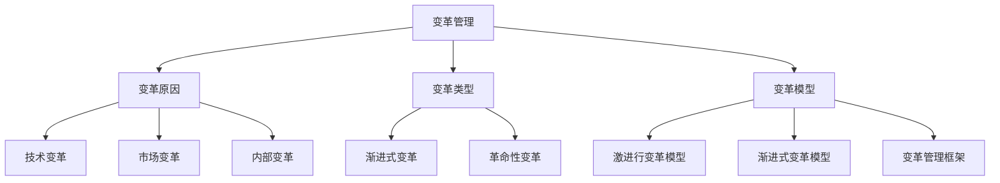
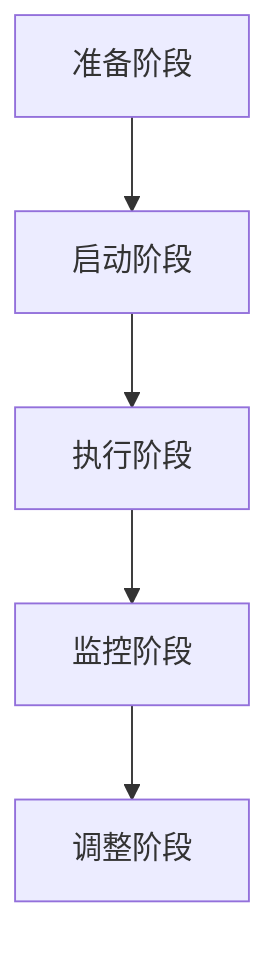

                 

### 文章标题

# 数字化转型中的变革管理技巧

### 文章关键词

- 数字化转型
- 变革管理
- 组织变革
- 领导力
- 沟通策略

### 文章摘要

在当今数字化快速发展的时代，企业进行数字化转型已成为必然趋势。然而，数字化转型过程中，如何进行有效的变革管理成为关键所在。本文将深入探讨数字化转型中的变革管理技巧，通过系统的分析和实践案例，帮助企业成功应对变革中的挑战。

## 第一部分：数字化的背景与变革管理

### 1.1 数字化转型的概念与原因

#### 1.1.1 数字化转型的定义

数字化转型是指利用数字技术优化并改造企业的业务流程、服务模式和收入模式的过程。它不仅仅涉及技术层面的革新，还包括企业文化的变革和管理模式的转变。

#### 1.1.2 数字化转型的原因

- **技术进步**：互联网、大数据、人工智能等技术的迅猛发展，为企业提供了更多的创新机会。
- **市场需求**：消费者对更便捷、更个性化的服务和产品有着越来越高的需求。
- **竞争优势**：在激烈的市场竞争中，企业需要通过数字化转型来提升自身的竞争力。

#### 1.1.3 数字化转型的影响

- **提高效率**：通过数字化技术，企业能够优化业务流程，减少人力成本，提高运营效率。
- **客户体验**：数字化技术能够提供更个性化的服务和体验，提升客户满意度。
- **业务创新**：数字化技术为企业提供了更多创新业务模式和产品服务的机会。

### 2.2 变革管理的定义与重要性

#### 2.2.1 变革管理的定义

变革管理是指在组织变革过程中，通过一系列的管理活动，确保变革目标得到有效实现的过程。它包括变革的规划、执行、监控和调整。

#### 2.2.2 变革管理的重要性

- **确保变革成功**：有效的变革管理能够减少变革过程中的阻力，确保变革目标的实现。
- **提升组织适应能力**：变革管理能够提高组织对市场变化的适应能力，保持竞争力。
- **员工参与度**：通过变革管理，可以提升员工的参与度和支持度，减少变革带来的负面影响。

### 2.3 变革管理的核心概念与联系

#### 2.3.1 变革的原因

- **技术变革**：如云计算、大数据等新技术的应用。
- **市场变革**：如消费者需求的变化、市场竞争的加剧。
- **内部变革**：如企业战略调整、组织结构调整。

#### 2.3.2 变革的类型

- **渐进式变革**：逐步的、小规模的变革。
- **革命性变革**：彻底的、大规模的变革。

#### 2.3.3 变革的模型

- **激进行变革模型**：通过迅速变革来推动组织变革。
- **渐进式变革模型**：通过逐步变革来推动组织变革。
- **变革管理框架**：如柯氏模型、三环模型等。

### 2.3.4 变革的核心概念联系图

$$
\text{变革管理核心概念联系图}
$$



## 第二部分：变革管理的原理与实践

### 3.1 变革管理的基本原理

#### 3.1.1 变革的驱动力

- **技术驱动力**：如新技术的引入和应用。
- **市场驱动力**：如消费者需求的变化和市场竞争。
- **内部驱动力**：如企业战略调整和组织结构调整。

#### 3.1.2 变革的阶段

- **准备阶段**：制定变革计划，评估变革的影响。
- **启动阶段**：启动变革项目，组建变革团队。
- **执行阶段**：实施变革计划，解决变革中的问题。
- **监控阶段**：监控变革进度，调整变革计划。

#### 3.1.3 变革的阻力

- **组织阻力**：如组织惯性、组织结构的限制。
- **个人阻力**：如恐惧变化、对未知的担忧。
- **文化阻力**：如企业文化的保守性、对变革的不适应。

#### 3.1.4 变革管理的数学模型

$$
\text{变革管理数学模型}
$$

```python
# 变革管理数学模型
class ChangeManagementModel:
    def __init__(self, driving_force, market_demand, internal_change):
        self.driving_force = driving_force
        self.market_demand = market_demand
        self.internal_change = internal_change
    
    def calculate_impact(self):
        impact = self.driving_force * self.market_demand * self.internal_change
        return impact
```

### 3.2 变革管理的实践方法

#### 3.2.1 变革计划的制定

- **确定变革目标**：明确变革的目的和预期效果。
- **制定变革计划**：包括变革的时间表、步骤、资源分配等。
- **评估变革风险**：分析变革可能带来的风险和挑战。

#### 3.2.2 变革团队的组建

- **确定团队成员**：根据变革需求，选择合适的团队成员。
- **明确角色和职责**：确保每个团队成员都明确自己的角色和职责。
- **提供培训和支持**：为团队成员提供必要的培训和资源支持。

#### 3.2.3 变革沟通的策略

- **建立沟通机制**：建立有效的沟通渠道和沟通机制。
- **定期汇报进展**：定期向管理层和团队成员汇报变革进展。
- **积极应对反馈**：对反馈进行积极回应，解决问题和疑虑。

### 3.3 变革管理的流程图



## 第三部分：数字化变革的特殊性

### 4.1 数字化技术的快速变化

- **技术更新迅速**：数字化技术更新换代速度快，企业需要不断学习和适应。
- **技术复杂性**：数字化技术涉及多个领域，如大数据、人工智能、云计算等，企业需要具备跨学科的知识。

### 4.2 数据隐私和安全

- **数据隐私保护**：数字化转型过程中，企业需要确保用户数据的隐私保护。
- **数据安全风险**：数字化技术带来的数据泄露和网络安全风险。

### 4.3 数字化变革的挑战与机遇

- **挑战**：技术复杂性、组织变革、文化变革等。
- **机遇**：提升效率、创新业务模式、拓展市场等。

## 第四部分：变革管理的最佳实践

### 5.1 建立变革管理的文化

- **培养变革意识**：企业需要培养员工对变革的接受度和适应能力。
- **建立变革文化**：鼓励创新、接受失败、快速适应等。

### 5.2 确保变革的可持续性

- **建立长期规划**：制定长期的变革计划，确保变革的持续性和有效性。
- **持续监控与调整**：对变革过程进行持续的监控和调整，确保变革目标的实现。

## 第五部分：案例分析与展望

### 6.1 成功的变革管理案例

- **案例介绍**：介绍数字化转型中的成功变革管理案例。
- **关键成功因素**：分析案例中的关键成功因素。

### 6.2 未来变革管理的发展趋势

- **数字化技术的进一步发展**：如人工智能、物联网等。
- **变革管理的创新**：如数据驱动的变革管理、智能化的变革管理工具等。

## 小结与展望

数字化转型是企业发展的必然趋势，而变革管理则是实现数字化转型的关键。通过有效的变革管理，企业能够应对数字化时代的挑战，实现业务的持续创新和发展。本文从多个角度探讨了数字化转型中的变革管理技巧，旨在为企业的数字化转型提供参考和指导。

### 作者

- **作者：AI天才研究院/AI Genius Institute & 禅与计算机程序设计艺术 /Zen And The Art of Computer Programming**

---

在撰写本文时，我们系统地分析了数字化转型的背景、变革管理的核心概念与联系、变革管理的原理与实践、数字化变革的特殊性、变革管理的最佳实践以及案例分析与展望。每个部分都详细讲解了核心内容，确保文章的逻辑清晰、结构紧凑、简单易懂。通过本文，我们希望能够为企业提供有价值的变革管理技巧，助力数字化转型成功。在未来的研究中，我们将继续关注数字化变革的最新趋势和最佳实践，为企业的数字化转型提供持续的支持和指导。

