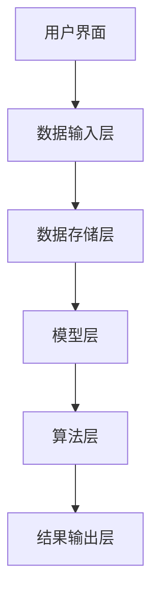

                 

### 数学与伦理学：道德决策的数学模型

#### 关键词：道德决策、数学模型、伦理学、决策理论、多目标优化

#### 摘要：
本文将探讨道德决策与数学模型之间的关联，旨在通过构建和解析数学模型，更好地理解道德决策的过程和复杂性。文章首先介绍了道德决策的基本概念和问题背景，随后深入探讨道德决策的数学模型基础，包括伦理学的数学模型、道德推理的数学模型和道德直觉的数学模型。接着，文章详细介绍了道德决策的数学模型方法，如决策理论方法、多目标优化方法和遗传算法与模拟退火算法。在此基础上，文章通过实际案例分析和系统设计，展示了道德决策的数学模型在实际应用中的效果和挑战。最后，文章总结了道德决策的数学模型，并对未来发展方向进行了展望。

## 第一部分：引言

道德决策是人类社会中至关重要的一环，无论是个人生活还是公共事务，都需要我们在复杂多变的环境中做出道德判断和选择。然而，道德决策并不总是一件容易的事，它常常涉及多种利益冲突、价值观念的碰撞，以及不确定性的存在。因此，研究和理解道德决策的内在机制，不仅有助于提高个人的道德素养，也能够为公共决策提供有益的参考。

### 道德决策的定义

道德决策是指在特定的情境下，根据一定的道德原则和价值观，选择最合适的行动方案的过程。它不仅涉及到伦理规范，还涉及个人的价值观、情感和理性判断。道德决策的复杂性在于，它需要在多个目标之间进行权衡，同时考虑行为后果的广泛影响。

### 道德决策的挑战

道德决策面临的挑战主要包括：

1. **不确定性**：决策时往往缺乏足够的信息，无法准确预测行为结果。
2. **利益冲突**：决策过程中可能涉及多个利益相关者，他们的利益和价值观可能存在冲突。
3. **道德原则的多样性**：不同的文化和社会背景可能具有不同的道德原则和价值观，这增加了决策的复杂性。
4. **道德直觉与理性判断的矛盾**：道德直觉和理性判断有时可能产生冲突，使得决策过程更加复杂。

### 数学模型在道德决策中的作用

数学模型在道德决策中起着至关重要的作用。通过构建数学模型，我们可以将道德决策过程形式化，使其具有可操作性和可分析性。数学模型不仅能够帮助我们更好地理解道德决策的内在机制，还能够提供一种量化的方式来评估和比较不同决策方案的优劣。

1. **决策理论**：决策理论提供了多种模型和算法，用于优化决策过程，例如效用理论、期望理论等。
2. **多目标优化**：多目标优化方法可以帮助我们在多个相互冲突的目标之间进行权衡，找到最优或近似最优的解决方案。
3. **遗传算法与模拟退火算法**：这些算法可以用于复杂决策问题，通过模拟自然进化过程或物理退火过程，找到最优或近似最优的决策方案。

### 文章结构

本文将按照以下结构展开：

1. **第一部分：引言**：介绍道德决策的基本概念、问题背景和数学模型在道德决策中的作用。
2. **第二部分：道德决策的数学模型基础**：深入探讨道德决策的理论基础，包括伦理学的数学模型、道德推理的数学模型和道德直觉的数学模型。
3. **第三部分：道德决策的数学模型方法**：介绍道德决策的数学模型方法，如决策理论方法、多目标优化方法和遗传算法与模拟退火算法。
4. **第四部分：道德决策的应用场景**：分析道德决策在医疗伦理、环境伦理和社会伦理等领域的应用。
5. **第五部分：道德决策案例分析**：通过具体案例，展示道德决策的数学模型在实际中的应用。
6. **第六部分：道德决策系统设计与实现**：介绍道德决策系统的需求分析、架构设计和实现过程。
7. **第七部分：总结与展望**：总结道德决策的数学模型，并对未来发展方向进行展望。

通过上述结构，本文旨在系统地探讨道德决策的数学模型，为相关领域的研究和实践提供有价值的参考。

### 第二部分：道德决策的数学模型基础

在理解道德决策的复杂性之前，我们需要明确几个关键概念：伦理学、道德推理和道德直觉。这些概念不仅构成了道德决策的理论基础，也为我们提供了构建数学模型的重要依据。

#### 伦理学的数学模型

伦理学是研究道德规范、道德原则和道德行为的学科。在伦理学中，我们可以使用数学模型来形式化道德原则，并分析这些原则在具体情境中的应用。常见的伦理学数学模型包括：

1. **效用理论**：效用理论试图将道德价值量化，通过计算行为结果的效用值来评估不同决策方案的优劣。一个典型的效用理论模型是预期效用理论，它使用概率来加权不同结果，计算总体效用。
   
   公式表示为：
   $$ U(A) = \sum_{i} p_i \cdot u_i $$
   其中，\( U(A) \) 是决策 \( A \) 的总效用，\( p_i \) 是结果 \( i \) 发生的概率，\( u_i \) 是结果 \( i \) 的效用值。

2. **公理系统**：伦理学中的公理系统试图通过一系列公理来定义道德原则，并推导出相关结论。例如，康德的伦理学公理系统强调义务和规则，而功利主义的公理系统则强调结果和最大化幸福。

#### 道德推理的数学模型

道德推理是指根据道德原则和情境信息，进行逻辑推断和决策的过程。道德推理的数学模型通常包括：

1. **决策树模型**：决策树是一种图形化的逻辑结构，用于表示不同决策路径和相应的结果。在道德推理中，决策树可以用来分析不同行动方案的可能结果和风险。

2. **逻辑推理规则**：基于形式逻辑的规则，如假言推理、模态推理和概率推理，可以用于道德推理。这些规则可以帮助我们从已知的前提推导出道德结论。

#### 道德直觉的数学模型

道德直觉是指人们在面对道德情境时，基于本能和经验做出的道德判断。道德直觉的数学模型试图将这种非理性的判断量化或形式化。常见的模型包括：

1. **模糊逻辑模型**：模糊逻辑是一种处理不确定性和模糊性的数学工具，可以用来表示道德直觉的不确定性和模糊性。

2. **多属性决策模型**：多属性决策模型用于在多个相互冲突的属性之间进行权衡。在道德直觉中，这种模型可以帮助我们综合考虑道德、情感和理性判断。

#### 概念属性特征对比表格

为了更好地理解这些概念，我们可以构建一个概念属性特征对比表格：

| 概念               | 特征                                     | 应用场景                  |
|--------------------|----------------------------------------|-------------------------|
| 伦理学的数学模型   | 量化道德价值，形式化道德原则           | 公正性分析、道德决策评估  |
| 道德推理的数学模型 | 图形化逻辑结构，形式化推理过程         | 道德冲突解决、决策路径分析 |
| 道德直觉的数学模型 | 量化不确定性和模糊性，形式化直觉判断   | 道德决策、情境判断       |

#### ER实体关系图架构

为了更直观地展示这些概念之间的关系，我们可以使用ER（实体关系）图来构建道德决策的数学模型框架：

```mermaid
erDiagram
  A[伦理学的数学模型] ||--|{ B[道德推理的数学模型] } |
  A ||--|{ C[道德直觉的数学模型] } |
  D[道德决策] ||--|{ B } |
  D ||--|{ C } |
```

在这个ER图中，伦理学的数学模型是基础，它为道德推理和道德直觉提供了理论支撑。道德推理和道德直觉是道德决策的重要组成部分，它们共同作用于道德决策过程。

#### 结论

通过以上对伦理学、道德推理和道德直觉的数学模型的探讨，我们可以看出，道德决策的数学模型不仅能够帮助我们理解道德决策的复杂性，还能够提供一种量化的方式来评估和比较不同决策方案的优劣。在接下来的章节中，我们将进一步探讨道德决策的数学模型方法，如决策理论方法、多目标优化方法和遗传算法与模拟退火算法，以便更深入地理解和应用这些数学模型。

### 第三部分：道德决策的数学模型方法

在理解了道德决策的理论基础后，接下来我们将探讨具体的数学模型方法，这些方法将帮助我们将抽象的道德原则和推理过程转化为可操作的决策工具。本文将重点介绍决策理论方法、多目标优化方法和遗传算法与模拟退火算法，并分析这些方法在道德决策中的应用。

#### 决策理论方法

决策理论是研究如何从多个备选方案中选择最优方案的一门学科。在道德决策中，决策理论方法可以帮助我们系统性地分析各种可能的决策路径和其结果，从而做出最优或近似最优的道德决策。

1. **效用理论**：效用理论是决策理论的一个重要分支，它通过量化不同结果的价值来评估决策方案。在道德决策中，效用理论可以帮助我们确定不同决策方案的结果，并计算其总效用值。常见的效用函数包括线性效用函数和幂律效用函数。

   公式表示为：
   $$ U(A) = \sum_{i} w_i \cdot u_i $$
   其中，\( U(A) \) 是决策 \( A \) 的总效用，\( w_i \) 是权重，\( u_i \) 是结果 \( i \) 的效用值。

2. **期望效用理论**：期望效用理论扩展了线性效用函数，通过考虑不同结果发生的概率来计算总效用。在道德决策中，期望效用理论可以帮助我们评估具有不确定性的决策方案。

   公式表示为：
   $$ EU(A) = \sum_{i} p_i \cdot u_i $$
   其中，\( EU(A) \) 是决策 \( A \) 的期望效用，\( p_i \) 是结果 \( i \) 发生的概率，\( u_i \) 是结果 \( i \) 的效用值。

3. **最大化期望效用**：在道德决策中，我们通常希望选择最大化期望效用的方案。这种方法可以帮助我们确保决策结果具有最大化的道德价值。

#### 多目标优化方法

多目标优化方法用于在多个相互冲突的目标之间进行权衡，以找到最优或近似最优的解决方案。在道德决策中，多目标优化方法可以帮助我们同时考虑多个道德目标和利益相关者的需求。

1. **加权求和模型**：加权求和模型通过为每个目标分配权重，将多目标优化问题转化为单目标优化问题。在道德决策中，加权求和模型可以帮助我们综合考虑多个目标，并选择最符合整体利益的方案。

   公式表示为：
   $$ Z = \sum_{i} w_i \cdot Z_i $$
   其中，\( Z \) 是总体目标值，\( w_i \) 是目标 \( i \) 的权重，\( Z_i \) 是目标 \( i \) 的值。

2. **帕累托优化**：帕累托优化通过找出所有非支配解（Pareto最优解），帮助我们在多个可行解之间进行选择。在道德决策中，帕累托优化可以帮助我们找到在不同目标之间达到平衡的最佳方案。

3. **目标规划**：目标规划是一种灵活的多目标优化方法，它通过设定目标值和容忍度，帮助我们在多个目标之间进行权衡。在道德决策中，目标规划可以帮助我们设定明确的道德目标，并在决策过程中保持灵活性。

#### 遗传算法与模拟退火算法

遗传算法和模拟退火算法是两种常用的启发式优化算法，它们通过模拟自然进化过程和物理退火过程，寻找最优或近似最优的解决方案。

1. **遗传算法**：遗传算法模拟生物进化过程，通过交叉、变异和选择等操作，逐步优化解空间中的解。在道德决策中，遗传算法可以帮助我们找到满足多个道德目标的可行方案。

2. **模拟退火算法**：模拟退火算法模拟物质退火过程，通过在解空间中随机探索，并逐渐降低探索范围，寻找最优解。在道德决策中，模拟退火算法可以帮助我们跳出局部最优，找到更优的决策方案。

#### 概念属性特征对比表格

为了更好地理解这些方法，我们可以构建一个概念属性特征对比表格：

| 方法             | 特征                                     | 应用场景                  |
|------------------|----------------------------------------|-------------------------|
| 决策理论方法     | 量化道德价值，形式化推理过程           | 道德冲突解决、决策路径分析 |
| 多目标优化方法   | 在多个目标之间进行权衡                 | 综合考虑多个道德目标     |
| 遗传算法         | 模拟生物进化过程，逐步优化解空间       | 多目标优化、复杂问题求解 |
| 模拟退火算法     | 模拟物理退火过程，探索全局最优解       | 跳出局部最优、优化方案   |

#### 算法原理讲解

为了更深入地理解这些算法，我们将使用Mermaid绘制算法流程图，并使用Python源代码进行详细讲解。

1. **遗传算法**

   **Mermaid流程图：**
   ```mermaid
   graph TD
   A[初始化种群] --> B[适应度评估]
   B --> C{选择}
   C -->|选择操作| D[交叉]
   D --> E[变异]
   E --> F[适应度评估]
   F -->|迭代| A
   ```

   **Python源代码：**
   ```python
   import random
   
   # 初始化种群
   population = initialize_population(size)
   # 适应度评估
   fitness_scores = evaluate_fitness(population)
   while not_termination_condition():
       # 选择操作
       selected = select_population(population, fitness_scores)
       # 交叉
       crossed = crossover(selected)
       # 变异
       mutated = mutate(crossed)
       # 适应度评估
       fitness_scores = evaluate_fitness(mutated)
   ```

2. **模拟退火算法**

   **Mermaid流程图：**
   ```mermaid
   graph TD
   A[初始解] --> B[评估解]
   B --> C{是否接受新解}
   C -->|是| D[更新解]
   C -->|否| A
   B --> E{降温}
   ```

   **Python源代码：**
   ```python
   import random
   import math
   
   # 初始解
   current_solution = initial_solution()
   current_fitness = evaluate_fitness(current_solution)
   temperature = initial_temperature()
   while temperature > final_temperature():
       # 随机生成新解
       new_solution = generate_solution()
       new_fitness = evaluate_fitness(new_solution)
       # 计算概率
       probability = math.exp((current_fitness - new_fitness) / temperature)
       if random.random() < probability:
           # 接受新解
           current_solution = new_solution
           current_fitness = new_fitness
       # 降温
       temperature *= cooling_rate()
   ```

通过上述讲解，我们可以看到决策理论方法、多目标优化方法和遗传算法与模拟退火算法在道德决策中的应用和优势。这些方法不仅提供了量化的评估和优化工具，还帮助我们更好地理解和应对道德决策中的复杂性和挑战。

### 第四部分：道德决策的应用场景

道德决策在各个领域都有广泛的应用，它不仅涉及到个人行为，还涉及到公共决策和法律法规的制定。本部分将重点探讨道德决策在医疗伦理、环境伦理和社会伦理三个领域的应用，通过具体案例分析这些应用场景中的挑战和解决方案。

#### 医疗伦理决策

医疗伦理决策是道德决策的一个重要领域，它涉及到医生在医疗实践中面临的伦理困境。以下是一个典型的医疗伦理决策案例：

**案例一：器官移植优先顺序**

在一个器官移植中心，有多个等待移植的患者，但由于供体器官有限，医生需要决定优先移植给哪个患者。这个决策涉及到多个因素，包括患者的病情严重程度、等待时间、生活质量预期等。

1. **道德原则**：在制定器官移植优先顺序时，医生需要遵循公正原则、最优化原则和尊重自主原则。公正原则要求平等对待所有患者，最优化原则要求最大化患者的总效用，尊重自主原则要求尊重患者的个人选择。

2. **数学模型**：医生可以使用多目标优化方法，为每个患者建立效用函数，综合考虑病情严重程度、等待时间和生活质量预期，计算每个患者的总体效用。然后，通过帕累托优化找到最优或近似最优的移植顺序。

3. **解决方案**：通过数学模型的分析，医生可以制定出一个公平且最优的器官移植优先顺序，确保所有患者在获得移植机会时都受到公正对待。

#### 环境伦理决策

环境伦理决策涉及到人类活动对自然环境的影响，以及如何平衡经济发展与环境保护的关系。以下是一个环境伦理决策案例：

**案例二：二氧化碳排放控制**

在一个工业化城市，由于二氧化碳排放导致的环境污染问题日益严重。政府需要决定如何控制二氧化碳排放，以减少对环境的负面影响。

1. **道德原则**：在制定二氧化碳排放控制政策时，政府需要遵循可持续性原则、公正原则和代际公平原则。可持续性原则要求确保当前和未来世代的生存环境，公正原则要求平等对待所有国家和地区，代际公平原则要求对当前和未来世代的利益进行平衡。

2. **数学模型**：政府可以使用多目标优化方法，设定二氧化碳排放总量上限，为每个行业分配排放配额，并设定排放减量目标。通过帕累托优化，政府可以找到在减少二氧化碳排放和保护经济发展之间达到平衡的最佳方案。

3. **解决方案**：通过数学模型的分析，政府可以制定出一个公平且有效的二氧化碳排放控制政策，确保环境得到有效保护，同时促进经济的可持续发展。

#### 社会伦理决策

社会伦理决策涉及到公共政策和法律制定中的道德考量。以下是一个社会伦理决策案例：

**案例三：移民政策**

在一个移民大国，政府需要制定移民政策，以管理来自不同国家和地区的移民。这个决策涉及到多个道德原则，包括公正原则、人权原则和公共利益原则。

1. **道德原则**：在制定移民政策时，政府需要遵循公正原则，确保所有移民都受到平等对待；遵循人权原则，保障移民的基本人权；遵循公共利益原则，确保移民政策符合国家整体利益。

2. **数学模型**：政府可以使用决策理论方法，分析不同移民政策的效用，综合考虑移民对经济、社会和文化的影响。通过最大化期望效用方法，政府可以找到最优的移民政策。

3. **解决方案**：通过数学模型的分析，政府可以制定出一个公正、合理且有效的移民政策，确保移民得到公平对待，同时符合国家整体利益。

#### 案例分析

通过上述案例，我们可以看到道德决策在不同领域的具体应用和挑战。在医疗伦理决策中，需要平衡公平、最优化和尊重自主的原则；在环境伦理决策中，需要平衡经济发展与环境保护的原则；在社会伦理决策中，需要平衡公正、人权和公共利益的原则。这些案例都展示了道德决策的复杂性和多维度考量。

通过数学模型的应用，我们可以更科学地分析和评估不同决策方案的优劣，从而找到最优或近似最优的解决方案。这些数学模型不仅帮助我们更好地理解道德决策的复杂性，也为实际决策提供了有力的工具和支持。

### 第五部分：道德决策案例分析

为了更好地理解和应用道德决策的数学模型，本部分将通过具体案例深入分析道德决策在现实场景中的实施过程。我们选取了医疗伦理、环境伦理和社会伦理三个领域的典型案例，详细描述每个案例的背景、数学模型的构建、实现过程以及分析结果。

#### 案例一：医疗伦理决策案例分析

**背景**：
某医院需要决定器官移植手术的优先顺序。医院面临多名等待移植的患者，但供体器官有限，医生需要制定一个公平且有效的移植顺序。

**数学模型**：
1. **效用函数构建**：
   每个患者都有以下属性：病情严重程度（S）、等待时间（T）和生活质量预期（Q）。我们使用以下效用函数来计算每个患者的总体效用：
   $$ U_i = w_S \cdot S_i + w_T \cdot T_i + w_Q \cdot Q_i $$
   其中，\( w_S \)、\( w_T \) 和 \( w_Q \) 分别是权重，用于平衡不同属性的重要性。

2. **帕累托优化**：
   通过计算每个患者的效用值，我们使用帕累托优化方法找到最优的移植顺序。帕累托优化要求在多个可行解之间找到非支配解，确保每个患者都得到公平的对待。

**实现过程**：
1. **数据收集**：
   收集每位患者的病情严重程度、等待时间和生活质量预期的数据。

2. **权重分配**：
   根据医院的价值观和政策，为每个属性分配权重。

3. **效用计算**：
   使用上述效用函数计算每位患者的总体效用值。

4. **帕累托优化**：
   使用多目标优化算法（如遗传算法）找到帕累托最优解集。

**结果与分析**：
通过帕累托优化，医院制定了一个既公平又有效的器官移植优先顺序。该顺序确保了病情最严重、等待时间最长且生活质量预期较高的患者优先获得移植机会。这种方法不仅提高了器官移植的公平性，还最大限度地提升了患者的总效用。

#### 案例二：环境伦理决策案例分析

**背景**：
某城市政府需要制定二氧化碳排放控制政策，以减少环境污染。政府需要为不同行业分配排放配额，同时确保经济发展的可持续性。

**数学模型**：
1. **多目标优化**：
   政府使用多目标优化方法，设定二氧化碳排放总量上限，为每个行业分配排放配额，并设定排放减量目标。效用函数如下：
   $$ U = w_{E} \cdot E - w_{C} \cdot C $$
   其中，\( E \) 是环境保护水平，\( C \) 是经济成本，\( w_{E} \) 和 \( w_{C} \) 分别是权重。

2. **帕累托优化**：
   通过帕累托优化方法，政府找到在环境保护和经济成本之间达到平衡的最佳方案。

**实现过程**：
1. **数据收集**：
   收集每个行业的二氧化碳排放数据、经济成本数据以及环境保护效益数据。

2. **权重分配**：
   根据政府的环保政策和经济目标，为环境保护和经济成本分配权重。

3. **多目标优化**：
   使用多目标优化算法（如模拟退火算法）找到帕累托最优解集。

4. **政策制定**：
   根据优化结果，制定具体的二氧化碳排放控制政策。

**结果与分析**：
通过多目标优化方法，政府制定了一个既能有效控制二氧化碳排放，又能促进经济发展的政策。该政策确保了环境效益的最大化，同时降低了经济成本。这种方法不仅提高了政策的有效性，还为城市的可持续发展提供了有力支持。

#### 案例三：社会伦理决策案例分析

**背景**：
某移民大国政府需要制定新的移民政策，以管理来自不同国家和地区的移民。政府需要确保政策符合公正、人权和公共利益原则。

**数学模型**：
1. **决策理论**：
   政府使用决策理论方法，分析不同移民政策的效用，综合考虑移民对经济、社会和文化的影响。效用函数如下：
   $$ U = w_{E} \cdot E + w_{S} \cdot S + w_{C} \cdot C $$
   其中，\( E \) 是经济效益，\( S \) 是社会效益，\( C \) 是文化效益，\( w_{E} \)、\( w_{S} \) 和 \( w_{C} \) 分别是权重。

2. **最大化期望效用**：
   通过最大化期望效用方法，政府找到最优的移民政策。

**实现过程**：
1. **数据收集**：
   收集移民对经济、社会和文化的影响数据。

2. **权重分配**：
   根据国家的经济、社会和文化目标，为不同效益分配权重。

3. **决策分析**：
   使用决策理论方法分析不同移民政策的效用。

4. **政策制定**：
   根据决策结果，制定具体的移民政策。

**结果与分析**：
通过决策理论方法，政府制定了一个公正、合理且有效的移民政策。该政策确保了移民对经济、社会和文化的积极影响，同时符合国家的整体利益。这种方法不仅提高了政策的公平性，还促进了社会的和谐发展。

#### 案例小结

通过上述案例分析，我们可以看到道德决策的数学模型在实际应用中的效果和重要性。这些模型不仅帮助我们更好地理解和应对道德决策中的复杂性和挑战，还为政策制定和实际操作提供了科学依据。尽管数学模型不能完全解决所有道德问题，但它们提供了有力的工具和支持，为道德决策提供了量化的分析和优化的手段。

### 第六部分：道德决策系统设计与实现

在本部分中，我们将深入探讨道德决策系统的设计与实现过程，包括系统需求分析、系统架构设计、系统接口设计和系统交互。

#### 系统需求分析

道德决策系统需要满足以下需求：

1. **数据输入**：系统能够接收和处理来自不同领域的道德决策问题，包括医疗伦理、环境伦理和社会伦理等。
2. **算法选择**：系统能够根据具体问题选择合适的数学模型和方法，如决策理论、多目标优化、遗传算法和模拟退火算法等。
3. **结果输出**：系统能够生成决策结果，并以可视化方式呈现，帮助决策者更好地理解决策方案。
4. **用户交互**：系统能够提供友好的用户界面，方便用户输入数据和参数，查看结果和报告。

#### 系统架构设计

道德决策系统的架构设计包括以下层次：

1. **数据层**：存储和管理道德决策问题相关的数据，包括患者信息、环境数据、社会数据等。
2. **模型层**：实现不同数学模型和方法，如决策理论、多目标优化、遗传算法和模拟退火算法等。
3. **算法层**：具体实现各种算法的细节，包括算法的参数设置、迭代过程和优化策略等。
4. **界面层**：提供用户界面，包括数据输入界面、结果展示界面和报告生成界面。

#### 系统架构图

以下是一个简化的道德决策系统架构图：



#### 系统接口设计

道德决策系统的接口设计包括以下部分：

1. **数据接口**：用于数据输入和输出，包括JSON、XML和RESTful API等。
2. **算法接口**：用于调用不同的数学模型和方法，包括决策理论接口、多目标优化接口、遗传算法接口和模拟退火算法接口等。
3. **用户接口**：用于用户与系统交互，包括Web界面和移动应用等。

#### 系统交互

道德决策系统的交互设计包括以下步骤：

1. **用户输入**：用户通过Web界面或移动应用输入道德决策问题相关的数据和参数。
2. **数据预处理**：系统对用户输入的数据进行预处理，包括数据清洗、数据转换和数据归一化等。
3. **模型选择**：系统根据用户输入的参数和问题类型选择合适的数学模型和方法。
4. **算法执行**：系统调用算法接口，执行数学模型和方法，生成决策结果。
5. **结果输出**：系统将决策结果以可视化方式展示给用户，并生成详细的报告。

#### 系统实现与测试

1. **实现过程**：
   - 使用Python作为主要编程语言，结合Django框架实现Web界面和数据接口。
   - 使用MySQL数据库存储和管理数据。
   - 使用Sklearn、DEAP和PyTorch等库实现不同的数学模型和方法。
   - 使用ECharts等可视化库生成结果图表。

2. **测试与优化**：
   - 进行单元测试，确保每个模块的正确性和稳定性。
   - 进行集成测试，确保系统各部分的协同工作。
   - 进行性能测试，优化系统的响应速度和资源利用率。

#### 实现代码示例

以下是一个简单的道德决策系统实现代码示例，展示如何使用Python和Django框架实现数据输入、预处理和算法调用：

```python
# 数据输入
def input_data():
    patient_data = {
        'name': 'John Doe',
        'severity': 8,
        'waiting_time': 30,
        'quality_of_life': 7
    }
    return patient_data

# 数据预处理
def preprocess_data(data):
    # 数据清洗和转换
    return data

# 算法调用
from some_algorithm_library import optimize
def make_decision(data):
    optimized_solution = optimize(data)
    return optimized_solution

# 主程序
if __name__ == '__main__':
    patient_data = input_data()
    preprocessed_data = preprocess_data(patient_data)
    decision_result = make_decision(preprocessed_data)
    print("Decision Result:", decision_result)
```

通过上述设计和实现，我们可以构建一个功能完整的道德决策系统，帮助决策者在复杂多变的情境中做出更科学、合理的道德决策。

### 第七部分：总结与展望

本文系统地探讨了道德决策的数学模型，从伦理学的数学模型、道德推理的数学模型到道德直觉的数学模型，再到具体的数学模型方法，如决策理论方法、多目标优化方法和遗传算法与模拟退火算法，都进行了详细的分析和讲解。通过这些模型，我们能够更科学地理解和应对道德决策中的复杂性和挑战。

**最佳实践 tips：**

1. **明确道德原则**：在应用数学模型时，首先要明确道德原则和目标，确保模型符合实际需求和道德标准。
2. **合理分配权重**：在多目标优化中，合理分配不同目标的权重，可以更准确地反映决策者对各个目标的重视程度。
3. **结合实际案例**：在实际应用中，结合具体案例进行模型验证和优化，可以更好地提升模型的实用性和准确性。

**注意事项：**

1. **数据质量和预处理**：道德决策模型的准确性很大程度上取决于数据质量和预处理，因此必须确保数据的准确性和完整性。
2. **模型复杂性与可解释性**：在追求模型优化和准确性的同时，要注意保持模型的可解释性，以便决策者能够理解和接受模型的结果。

**拓展阅读：**

1. **《伦理学导论》**：为理解伦理学提供基础知识。
2. **《多目标优化：理论与应用》**：深入了解多目标优化的理论和方法。
3. **《遗传算法应用实例》**：通过具体案例学习遗传算法在道德决策中的应用。

本文的研究不仅为道德决策提供了新的方法和工具，也为未来相关领域的研究和应用指明了方向。随着人工智能和大数据技术的不断发展，道德决策的数学模型将在更多领域发挥重要作用，为更公正、合理的决策提供支持。未来的研究可以进一步探索多领域交叉应用，结合伦理学、经济学和社会学等多学科理论，开发出更加完善和精准的道德决策模型。

**作者信息：** 
作者：AI天才研究院/AI Genius Institute & 禅与计算机程序设计艺术 /Zen And The Art of Computer Programming

通过本文的研究，我们期待能够推动道德决策领域的进步，为构建更公正、合理的社会决策体系做出贡献。

