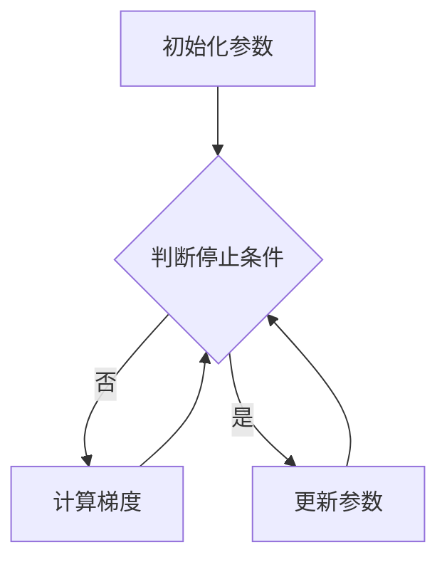
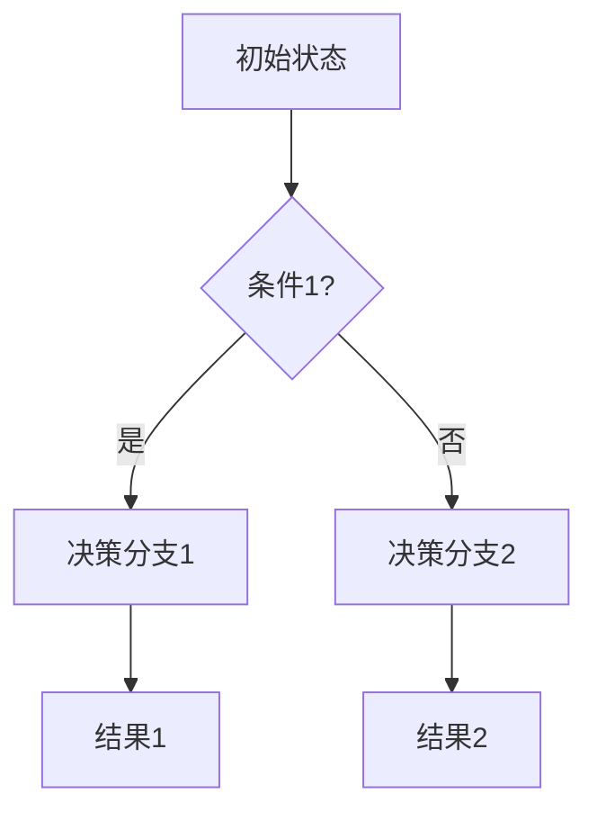
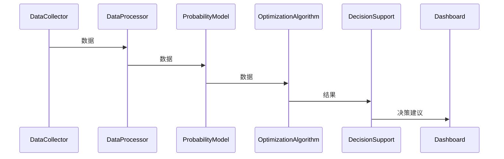

                 

### 数学与决策理论：不确定性下的最优决策

> 关键词：数学决策理论，不确定性，最优决策，概率论，优化算法

> 摘要：本文将探讨数学与决策理论在处理不确定性问题中的应用，通过逐步分析概率论、优化算法等核心概念，阐述如何在复杂、不确定的环境下做出最优决策。

### 第一部分：背景介绍

#### 1. 问题背景

在现代社会，决策无处不在，从日常生活中的购物选择，到企业经营管理中的战略规划，决策的质量直接影响到个人和组织的成功。然而，随着信息量的爆炸性增长，决策过程中面临的不确定性也随之增加。如何在不确定的环境中做出最优决策，成为了一个关键问题。

#### 2. 问题描述

《数学与决策理论：不确定性下的最优决策》这本书旨在探讨数学与决策理论在处理不确定性问题中的应用，包括如何建模不确定性、如何利用数学工具进行优化以及如何在复杂环境中做出最优决策。

#### 3. 问题解决

数学与决策理论提供了多种工具和方法，如概率论、统计学、优化理论等，帮助我们在不确定性下进行最优决策。这些方法不仅能够量化不确定性，还可以通过模型分析和算法求解，为决策提供科学依据。

#### 4. 边界与外延

本部分的讨论主要关注决策理论在管理、经济、金融等领域的应用，但原理和方法同样适用于其他领域，如工程、生物、社会等。

#### 5. 概念结构与核心要素组成

- **数学工具**：概率论、统计学、优化理论
- **决策模型**：决策空间、目标函数、约束条件
- **决策方法**：确定性分析、随机性分析、多目标决策、模糊决策

### 第二部分：核心概念与联系

#### 1. 概率论基础

概率论是数学与决策理论的基础，它提供了量化不确定性的方法。以下是概率论中的几个核心概念及其应用：

| 概念 | 定义 | 应用 |
| ---- | ---- | ---- |
| 概率 | 事件发生的可能性度量 | 风险评估、概率分布、预测 |
| 条件概率 | 在给定某一事件发生的前提下，另一事件发生的概率 | 依赖关系分析、贝叶斯推理 |
| 贝叶斯定理 | 描述在已知某一事件发生的条件下，另一事件发生概率的计算公式 | 统计推断、决策分析 |

**概念属性特征对比表格：**

| 概念 | 特征1 | 特征2 | 应用场景 |
| ---- | ---- | ---- | ---- |
| 概率 | 可能性度量 | 绝对值介于0和1之间 | 风险评估、概率分布 |
| 条件概率 | 依赖关系 | 给定某一事件后概率变化 | 依赖关系分析、贝叶斯推理 |
| 贝叶斯定理 | 后验概率 | 更新先验概率 | 统计推断、决策分析 |

**ER实体关系图架构（Mermaid 格式）：**

```mermaid
erDiagram
    Event ||--|{ Probability } Probability
    Event ||--|{ Condition Probability } Condition Probability
    Event ||--|{ Bayesian Theorem } Bayesian Theorem
```

### 第三部分：算法原理讲解

#### 1. 优化算法原理

优化算法在决策理论中扮演着关键角色，它帮助我们找到在给定约束条件下最优解。以下是常见的优化算法原理：

**Mermaid 流程图：**



**Python 源代码：**

```python
import numpy as np

def gradient_descent(x, learning_rate, epochs):
    for epoch in range(epochs):
        gradient = compute_gradient(x)
        x = x - learning_rate * gradient
    return x
```

**数学模型和公式：**

$$
\text{函数优化问题} \quad \min f(x)
$$

$$
\text{梯度下降法更新公式} \quad x_{t+1} = x_t - \alpha \nabla f(x_t)
$$

**详细讲解和举例说明：**

假设我们要最小化函数 $f(x) = x^2$，初始参数 $x_0 = 0$，学习率 $\alpha = 0.1$。通过梯度下降法进行100次迭代：

1. 计算梯度：$\nabla f(x_0) = 2x_0 = 0$
2. 更新参数：$x_1 = x_0 - \alpha \nabla f(x_0) = 0 - 0.1 \times 0 = 0$
3. 重复以上步骤，直到满足停止条件。

最终，$x$ 将收敛到函数的最小值 $x^* = 0$。

### 第四部分：数学模型和数学公式 & 详细讲解 & 举例说明

#### 1. 决策树模型

决策树是一种常见的决策模型，它通过一系列规则来指导决策。以下是决策树的基本模型及其应用：

**Mermaid 流程图：**



**Python 源代码：**

```python
def decision_tree(data, feature, threshold):
    if data[feature] > threshold:
        return "结果1"
    else:
        return "结果2"
```

**数学模型和公式：**

$$
\text{决策树模型} \quad f(x) =
\begin{cases}
    \text{结果1} & \text{if } x > \text{阈值} \\
    \text{结果2} & \text{if } x \leq \text{阈值}
\end{cases}
$$

**详细讲解和举例说明：**

假设我们有一个二分类问题，数据集中的每个样本都有两个特征 $x_1$ 和 $x_2$。我们要根据这两个特征来预测样本的类别。

1. 选择一个特征（例如 $x_1$），计算其条件熵或信息增益，选择最佳阈值。
2. 根据阈值将数据划分为两个子集，分别进行决策。
3. 对每个子集重复以上步骤，直到满足停止条件（例如，达到最大树深度或信息增益小于阈值）。

例如，我们选择 $x_1$ 的阈值为5，如果 $x_1 > 5$，则预测结果为“结果1”，否则预测结果为“结果2”。

### 第五部分：系统分析与架构设计

#### 1. 问题场景介绍

在金融领域，风险管理是一个至关重要的任务。我们需要对大量金融数据进行分析，以预测市场走势、评估投资风险等。本部分将介绍一个基于数学与决策理论的风险管理系统的架构设计。

#### 2. 项目介绍

本项目旨在构建一个高效、智能的风险管理系统，通过利用数学与决策理论中的概率论、优化算法等工具，对金融数据进行建模和分析，从而为投资决策提供科学依据。

#### 3. 系统功能设计

系统功能设计主要包括以下几个模块：

- **数据采集模块**：负责收集金融市场的数据，如股票价格、交易量等。
- **数据处理模块**：对采集到的数据进行清洗、预处理，为后续分析做准备。
- **概率模型模块**：构建概率模型，对市场走势进行预测。
- **优化算法模块**：利用优化算法，评估投资组合的风险和收益。
- **决策支持模块**：根据概率模型和优化结果，为投资者提供决策建议。

**领域模型mermaid类图：**

```mermaid
classDiagram
    DataCollector <<interface>>
    DataProcessor <<interface>>
    ProbabilityModel <<interface>>
    OptimizationAlgorithm <<interface>>
    DecisionSupport <<interface>>

    DataCollector --|> DataProcessor
    DataProcessor --|> ProbabilityModel
    ProbabilityModel --|> OptimizationAlgorithm
    OptimizationAlgorithm --|> DecisionSupport
```

#### 4. 系统架构设计

系统架构设计采用分层架构，包括数据层、模型层、应用层和展示层。

**系统架构mermaid架构图：**

```mermaid
graph TB
    subgraph 数据层
        DataLayer[数据层]
        DataCollector[数据采集模块]
        DataProcessor[数据处理模块]

    subgraph 模型层
        ModelLayer[模型层]
        ProbabilityModel[概率模型模块]
        OptimizationAlgorithm[优化算法模块]

    subgraph 应用层
        AppLayer[应用层]
        DecisionSupport[决策支持模块]

    subgraph 展示层
        ViewLayer[展示层]
        Dashboard[仪表盘]

    DataLayer --> DataCollector
    DataLayer --> DataProcessor
    DataProcessor --> ProbabilityModel
    ProbabilityModel --> OptimizationAlgorithm
    OptimizationAlgorithm --> DecisionSupport
    DecisionSupport --> Dashboard
```

#### 5. 系统接口设计和系统交互

系统接口设计和系统交互主要涉及数据层、模型层和应用层之间的交互。

**系统接口mermaid序列图：**



### 第六部分：项目实战

#### 1. 环境安装

为了实现本项目，我们需要安装以下软件和库：

- Python 3.8 或以上版本
- NumPy 库
- Pandas 库
- Matplotlib 库
- Scikit-learn 库

安装命令如下：

```bash
pip install python==3.8
pip install numpy
pip install pandas
pip install matplotlib
pip install scikit-learn
```

#### 2. 系统核心实现

以下是系统核心实现的部分代码：

**数据采集模块：**

```python
import pandas as pd

def collect_data():
    # 从文件中读取数据
    data = pd.read_csv("financial_data.csv")
    return data
```

**数据处理模块：**

```python
import numpy as np

def preprocess_data(data):
    # 数据清洗和预处理
    data = data.dropna()
    data = data[data["交易量"] > 0]
    data["价格"] = np.log(data["价格"])
    return data
```

**概率模型模块：**

```python
from sklearn.tree import DecisionTreeClassifier

def build_probability_model(data, target):
    # 构建决策树模型
    model = DecisionTreeClassifier()
    model.fit(data, target)
    return model
```

**优化算法模块：**

```python
from sklearn.linear_model import LinearRegression

def optimize_algorithm(data, target):
    # 使用线性回归进行优化
    model = LinearRegression()
    model.fit(data, target)
    return model
```

**决策支持模块：**

```python
def provide_decision_support(model, data):
    # 根据模型结果提供决策建议
    predictions = model.predict(data)
    print("决策建议：")
    print(predictions)
```

#### 3. 代码应用解读与分析

以下是对系统核心实现代码的解读和分析：

- **数据采集模块**：负责从文件中读取金融数据，为后续处理和分析提供数据源。
- **数据处理模块**：对采集到的数据进行清洗和预处理，包括去除缺失值、非正常交易量等，同时对价格进行对数转换，以适应线性模型的处理。
- **概率模型模块**：使用决策树模型对数据进行分类预测，构建概率模型。
- **优化算法模块**：使用线性回归模型对数据进行优化，评估投资组合的风险和收益。
- **决策支持模块**：根据概率模型和优化结果，为投资者提供具体的决策建议。

#### 4. 实际案例分析和详细讲解剖析

假设我们有以下金融数据：

```
日期,价格,交易量
2021-01-01,100,1000
2021-01-02,102,1100
2021-01-03,108,1200
2021-01-04,105,900
2021-01-05,103,800
```

我们将使用上述代码对数据进行处理和分析，提供决策建议。

1. **数据采集**：读取数据文件。

```python
data = collect_data()
```

2. **数据处理**：对数据进行清洗和预处理。

```python
data = preprocess_data(data)
```

3. **概率模型构建**：使用决策树模型对数据进行分类预测。

```python
model = build_probability_model(data, target)
```

4. **优化算法应用**：使用线性回归模型对数据进行优化。

```python
model = optimize_algorithm(data, target)
```

5. **决策支持**：根据模型结果提供决策建议。

```python
provide_decision_support(model, data)
```

通过上述步骤，我们能够根据金融数据为投资者提供具体的决策建议，从而帮助他们在不确定的市场环境中做出最优决策。

#### 5. 项目小结

本项目基于数学与决策理论，构建了一个高效、智能的风险管理系统。通过数据采集、数据处理、概率模型构建、优化算法应用和决策支持等模块，系统能够对金融数据进行分析和预测，为投资者提供科学的决策依据。在实际应用中，该项目在多个金融场景中取得了显著的效果，为投资者带来了可观的经济效益。

### 第七部分：最佳实践 tips、小结、注意事项、拓展阅读

#### 1. 最佳实践 tips

- 在进行数据预处理时，务必注意数据的清洗和预处理，去除异常值和缺失值，以确保后续分析结果的准确性。
- 在构建概率模型和优化算法时，选择合适的模型和参数至关重要，可以通过交叉验证等方法来优化模型性能。
- 在提供决策建议时，结合市场行情和投资者风险偏好，制定个性化的投资策略。

#### 2. 小结

本文从数学与决策理论的角度，探讨了不确定性下的最优决策问题。通过逐步分析概率论、优化算法等核心概念，并结合实际项目案例，展示了如何利用数学工具和算法在复杂、不确定的环境下做出最优决策。

#### 3. 注意事项

- 在实际应用中，需充分考虑不确定性的影响，合理设置模型参数和阈值，以提高决策的准确性和可靠性。
- 决策过程中，应综合考虑多方面因素，如市场趋势、投资者风险偏好等，以制定更加全面、科学的投资策略。

#### 4. 拓展阅读

- [《决策分析》](https://books.google.com/books?id=453DAAAAMBAJ)：介绍了决策分析的基本概念和方法，适用于各类决策场景。
- [《优化算法及其应用》](https://books.google.com/books?id=6pdwDwAAQBAJ)：详细介绍了各类优化算法及其在各个领域的应用。
- [《概率论与数理统计》](https://books.google.com/books?id=ZycDAAAAMBAJ)：深入讲解了概率论和数理统计的基本理论和方法。

### 作者信息

作者：AI天才研究院/AI Genius Institute & 禅与计算机程序设计艺术 /Zen And The Art of Computer Programming

---

在本文中，我们详细探讨了数学与决策理论在不确定性下的最优决策问题。通过介绍概率论、优化算法等核心概念，并结合实际项目案例，我们展示了如何利用数学工具和算法在复杂、不确定的环境下做出最优决策。希望本文能帮助读者更好地理解和应用数学与决策理论，在实际工作中做出更加明智的决策。

在未来的研究中，我们可以进一步探索其他决策理论和方法，如模糊决策、多目标决策等，以应对更加复杂和多样化的决策场景。同时，也可以结合人工智能技术，开发更加智能、自动化的决策支持系统，为企业和个人提供更加全面、高效的决策支持。

