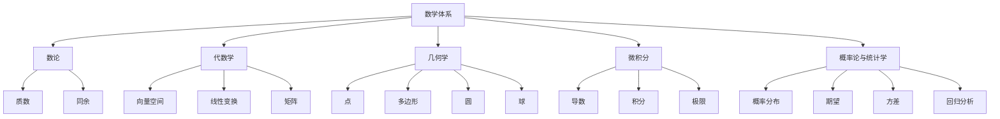
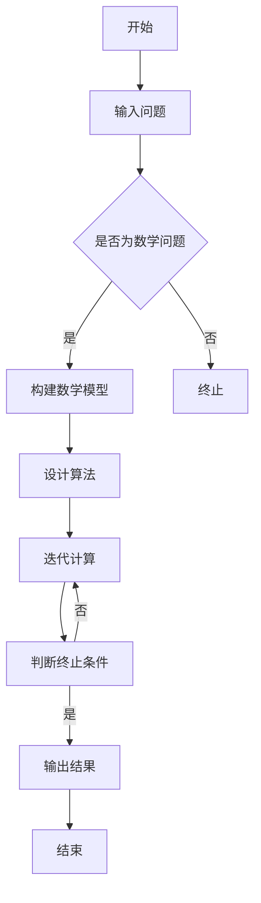
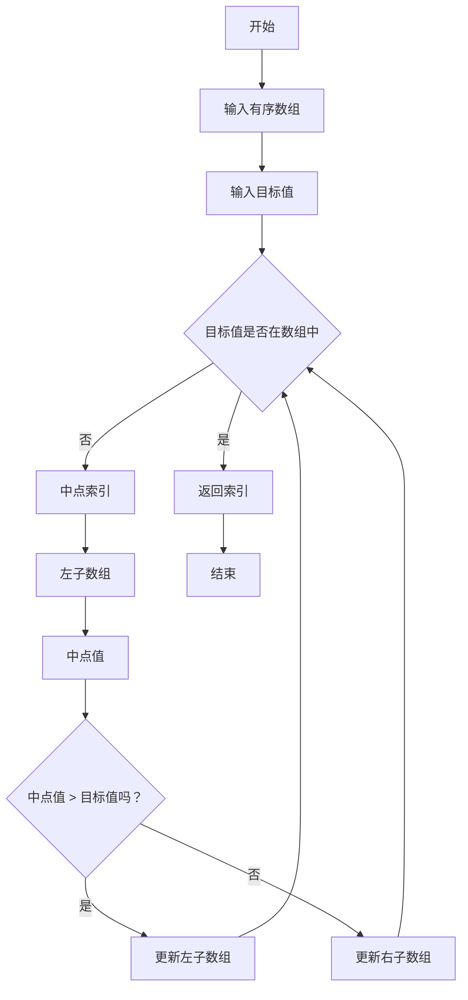
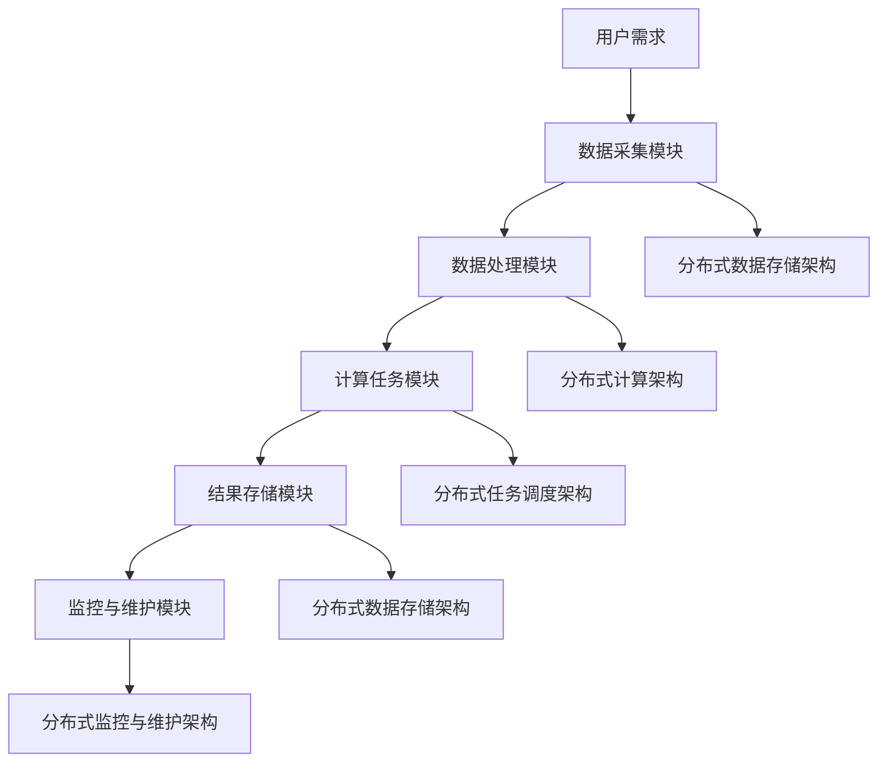
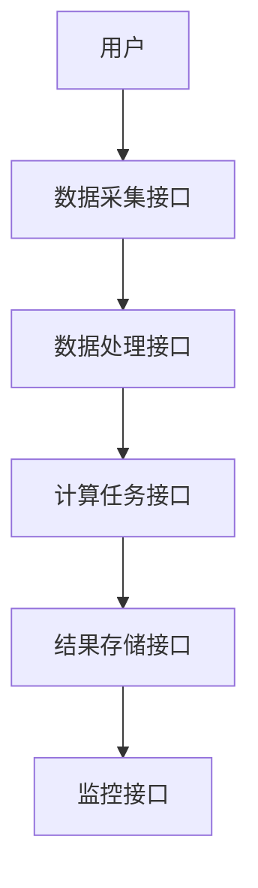
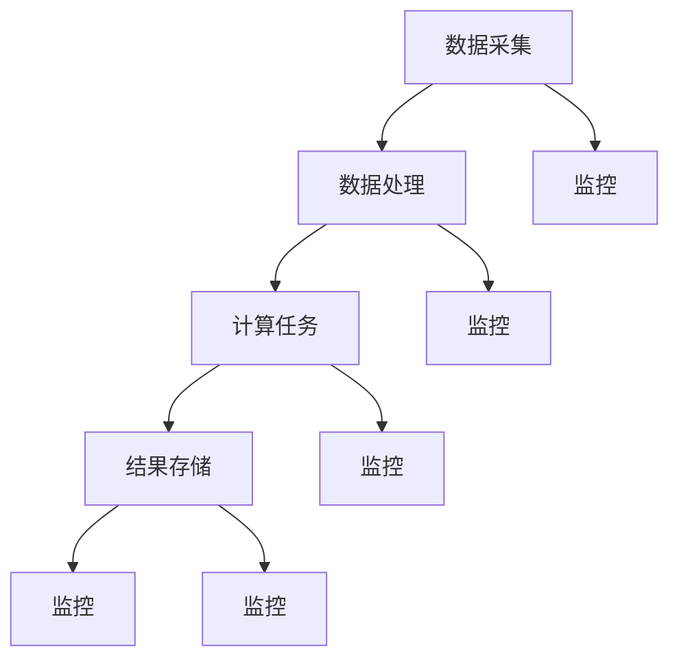
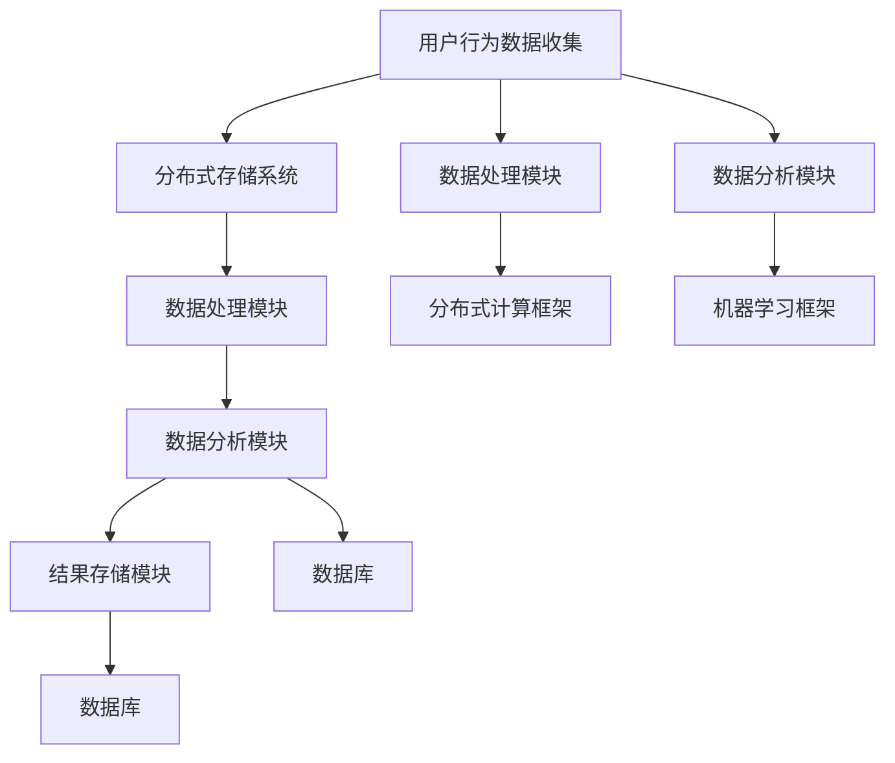

                 

### 数学与反基础主义：数学知识的网状结构

关键词：数学知识、网状结构、反基础主义、数学概念、数学算法、系统分析与架构设计

摘要：本文深入探讨了数学知识及其结构的变化，特别是数学知识的网状结构及其在现代教育中的应用。通过分析数学概念的关系与联系，数学思想的演变与数学算法的原理，本文揭示了数学知识的复杂性和应用价值。同时，本文还从系统分析与架构设计的角度，提出了数学知识网状结构在现代教育项目中的应用方案，为教育和技术开发提供了新的视角和思路。

## 第一部分：背景介绍与问题提出

### 第1章：问题背景、数学知识的基本结构与数学知识结构的变化

**1.1 问题的提出：数学知识的现状与挑战**

在当今信息爆炸的时代，数学知识以其独特的逻辑性和普适性，成为了科学研究、工程技术和日常生活中不可或缺的一部分。然而，随着数学知识体系的不断扩展，数学教育的现状也面临着一系列的挑战。数学知识的深度和广度不断增加，使得学生难以掌握和理解；同时，数学知识的应用场景越来越复杂，传统的教学方法和教材已经难以满足现代教育的需求。

**1.2 数学知识的基本结构**

数学知识的基本结构可以分为以下几个层次：

1. **基础概念**：如数、集合、函数等；
2. **数学分支**：如代数、几何、概率论等；
3. **交叉领域**：如数学物理、数学经济学等；
4. **应用领域**：如计算机科学、统计学、金融工程等。

数学知识的基本结构是一个层次分明的网络，每个层次的知识都是对上一层知识的抽象和扩展。

**1.3 数学知识结构的变化趋势**

随着科学技术的进步，数学知识结构也在不断变化。主要体现在以下几个方面：

1. **知识内容的扩展**：随着数学应用的不断扩大，新的数学分支和交叉领域不断涌现；
2. **知识结构的整合**：不同数学分支之间的联系和整合越来越紧密；
3. **数学思想的演变**：如形式化、公理化、模型化等。

**1.4 数学与反基础主义的关系**

反基础主义是20世纪哲学领域的一个重要思潮，它挑战了传统哲学的基础主义观念。反基础主义认为，知识并不是建立在绝对的基础之上，而是通过假设和推理构建起来的。数学作为一种严谨的学科，其知识体系是否也受到反基础主义的影响？这是本文要探讨的一个重要问题。

### 第2章：数学知识的网状结构

**2.1 数学知识的网状结构概念**

数学知识的网状结构是指数学概念之间的关系，以及这些概念如何通过逻辑和数学原理相互联系，形成的一个复杂而紧密的网络。在这个网络中，每个节点代表一个数学概念，每个节点之间的连线表示概念之间的逻辑或数学关系。

**2.2 数学知识网状结构的特征**

1. **多样性**：数学知识网状结构包含了不同类型的数学概念和关系，如定义、定理、证明、应用等；
2. **层次性**：数学知识网状结构具有一定的层次性，从基础概念到复杂概念，形成一个逐步扩展的结构；
3. **动态性**：数学知识网状结构不是静态的，而是在不断地发展和演变。

**2.3 数学知识网状结构的形成**

数学知识网状结构的形成是一个长期的历史过程，它受到了多种因素的影响：

1. **人类认知的发展**：人类对数学的理解和认识不断深化，推动了数学知识的发展；
2. **科技进步**：新的科学发现和技术进步，如计算机科学、量子物理学等，为数学知识带来了新的内容和挑战；
3. **教育需求**：教育的需求推动了数学知识的普及和深化，也促使数学知识结构的优化和调整。

### 第3章：数学概念的关系与联系

**3.1 数学概念间的联系**

数学概念之间的联系是数学知识网状结构的重要组成部分。这些联系可以通过不同的方式体现：

1. **定义关系**：一个概念是通过另一个概念的定义来定义的；
2. **定理关系**：一个定理是通过证明另一个定理来建立的；
3. **应用关系**：一个概念或定理可以被应用于解决实际问题。

**3.2 数学概念网络结构的构建**

构建数学概念网络结构是一个复杂的过程，需要考虑以下几个方面：

1. **概念之间的逻辑关系**：如定义、定理、证明等；
2. **概念的应用场景**：不同概念在不同的应用场景中的关系；
3. **知识体系的层次性**：从基础概念到复杂概念的层次结构。

**3.3 数学概念网络结构的应用**

数学概念网络结构的应用非常广泛，包括：

1. **数学教育**：通过构建数学概念网络结构，可以帮助学生更好地理解和掌握数学知识；
2. **数学研究**：数学概念网络结构为数学研究提供了新的视角和方法；
3. **科技开发**：数学概念网络结构为科技开发提供了理论基础和技术支持。

### 第4章：数学思想的发展与演变

**4.1 数学思想的概念**

数学思想是指数学领域中具有普遍性和指导性的观念、方法和原则。数学思想的发展是数学知识进步的重要驱动力。

**4.2 数学思想的发展历程**

1. **古代数学思想**：以几何学和算术为基础，强调直观和经验的数学思想；
2. **近代数学思想**：以微积分和代数为基础，强调逻辑和证明的数学思想；
3. **现代数学思想**：以形式化和公理化为基础，强调抽象和结构的数学思想。

**4.3 数学思想的演变与联系**

数学思想的演变是一个不断融合和创新的过程，不同时期的数学思想之间存在密切的联系：

1. **继承与发扬**：现代数学思想继承了古代和近代数学思想的基础，并在其基础上进行了创新和发展；
2. **交叉与融合**：不同数学分支之间的思想相互交叉和融合，形成了新的数学思想；
3. **应用与发展**：数学思想的演变和应用推动了数学知识的发展和技术的进步。

### 第5章：数学知识的网络结构与学习策略

**5.1 数学知识网络结构对学习的影响**

数学知识的网络结构对学习过程有着深远的影响：

1. **知识体系的整体性**：理解数学知识网络结构有助于学生从整体上把握数学知识体系，提高学习效率；
2. **知识间的联系**：理解数学知识网络结构有助于学生发现和掌握不同知识之间的联系，加深对数学概念的理解；
3. **解决问题的能力**：数学知识网络结构有助于学生在解决问题时能够灵活运用不同的数学概念和方法。

**5.2 有效的学习策略**

为了更有效地学习和应用数学知识，以下策略是值得推荐的：

1. **系统性学习**：按照数学知识的网络结构，系统地学习不同层次的数学概念和方法；
2. **跨学科学习**：结合其他学科的知识，理解数学概念在不同领域的应用；
3. **实践与反思**：通过解决实际问题，实践数学知识，并反思学习过程，不断调整和优化学习策略。

### 第6章：反基础主义的影响与数学知识的应用

**6.1 反基础主义对数学知识的挑战**

反基础主义对数学知识提出了挑战：

1. **知识的基础性**：反基础主义质疑数学知识的基础性，认为数学知识并非建立在绝对可靠的基础之上；
2. **证明的可靠性**：反基础主义对数学证明的可靠性提出了质疑，认为证明过程可能存在漏洞和不确定性；
3. **数学的应用价值**：反基础主义对数学的应用价值提出了质疑，认为数学并非解决所有问题的唯一工具。

**6.2 反基础主义的影响**

反基础主义对数学知识的影响是多方面的：

1. **数学研究的方向**：反基础主义促使数学研究更加关注数学的内在逻辑和结构；
2. **数学教育的改革**：反基础主义推动了数学教育的改革，更注重培养学生的批判性思维和创新能力；
3. **数学应用的创新**：反基础主义促使数学应用更加灵活和创新，探索新的数学工具和方法。

**6.3 数学知识的应用**

数学知识的应用是数学价值的体现，其范围广泛，包括：

1. **科学研究**：数学在物理学、化学、生物学等领域的应用，推动了科学研究的进步；
2. **工程技术**：数学在航空航天、汽车制造、电子通信等工程领域的应用，提升了工程技术的水平；
3. **日常生活**：数学在金融、经济、交通等日常生活中的应用，提高了生活的质量和效率。

### 第7章：数学知识的网状结构在现代教育中的应用

**7.1 数学知识网状结构在教育中的重要性**

数学知识网状结构在教育中的重要性体现在：

1. **知识的系统性和逻辑性**：数学知识网状结构有助于学生理解数学知识的整体性和逻辑性，提高学习效率；
2. **知识的连贯性和拓展性**：数学知识网状结构有助于学生发现不同知识之间的联系，进行知识拓展；
3. **学生的思维能力和创新能力**：数学知识网状结构有助于学生培养批判性思维和创新能力，提高解决问题的能力。

**7.2 数学知识网状结构在教育中的应用**

1. **课程设计**：根据数学知识网状结构，设计系统的数学课程体系，使课程内容更加连贯和系统；
2. **教学方法**：运用数学知识网状结构，采用探究式、讨论式等教学方法，激发学生的学习兴趣和主动性；
3. **教育资源**：开发数学知识网状结构的数字化教育资源，如网络课程、教学视频、电子书等，为学生提供丰富的学习资源。

### 第二部分：核心概念与联系

**第8章：数学概念原理与属性特征**

**8.1 数学概念的定义与分类**

**8.2 数学概念原理的属性特征**

**8.3 数学概念属性特征的对比分析**

**第9章：数学概念的联系与网络结构**

**9.1 数学概念间的联系**

**9.2 数学概念网络结构的构建**

**9.3 数学概念网络结构的应用**

### 第三部分：算法原理讲解

**第11章：数学算法原理与流程图**

**11.1 数学算法的基本原理**

**11.2 数学算法流程图的设计**

**11.3 数学算法流程图的应用**

**第12章：数学算法的数学模型与公式**

**12.1 数学算法的数学模型**

**12.2 数学算法公式的推导**

**12.3 数学算法公式的应用**

**第13章：数学算法的举例说明**

**13.1 数学算法的实例应用**

**13.2 数学算法实例的讲解**

**13.3 数学算法实例的分析**

### 第四部分：系统分析与架构设计方案

**第14章：问题场景介绍与项目介绍**

**14.1 问题场景的描述**

**14.2 项目背景介绍**

**14.3 项目目标与范围**

**第15章：系统功能设计**

**15.1 系统功能需求分析**

**15.2 领域模型设计**

**15.3 系统功能设计**

**第16章：系统架构设计**

**16.1 系统架构设计原则**

**16.2 系统架构设计方法**

**16.3 系统架构设计实现**

**第17章：系统接口设计与系统交互**

**17.1 系统接口设计**

**17.2 系统交互设计**

**17.3 系统接口与交互的优化**

### 第五部分：项目实战

**第18章：环境安装与系统核心实现**

**18.1 环境安装**

**18.2 系统核心实现**

**18.3 系统核心功能测试**

**第19章：代码应用解读与分析**

**19.1 代码应用解读**

**19.2 代码分析**

**19.3 代码优化建议**

**第20章：实际案例分析与详细讲解剖析**

**20.1 实际案例分析**

**20.2 案例详细讲解**

**20.3 案例剖析**

**第21章：项目小结**

**21.1 项目总结**

**21.2 项目成果**

**21.3 项目反思**

### 第六部分：最佳实践、小结、注意事项与拓展阅读

**第22章：最佳实践与建议**

**22.1 最佳实践**

**22.2 建议与展望**

**第23章：小结**

**23.1 文章核心观点**

**23.2 文章结构梳理**

**第24章：注意事项**

**24.1 学习与使用数学知识的注意事项**

**24.2 系统分析与设计过程中的注意事项**

**第25章：拓展阅读**

**25.1 推荐书籍**

**25.2 推荐论文**

**25.3 推荐网站**

## 文章标题：数学与反基础主义：数学知识的网状结构

关键词：数学知识、网状结构、反基础主义、数学概念、数学算法、系统分析与架构设计

摘要：本文从数学知识的基本结构出发，探讨了数学知识的网状结构及其在现代教育中的应用。通过分析数学概念的关系与联系，数学思想的演变与数学算法的原理，本文揭示了数学知识的复杂性和应用价值。同时，本文从系统分析与架构设计的角度，提出了数学知识网状结构在现代教育项目中的应用方案，为教育和技术开发提供了新的视角和思路。文章还讨论了反基础主义对数学知识的挑战和影响，为数学教育的改革提供了参考。

## 引言

数学，作为一门充满逻辑与推理的学科，自古以来就以其严谨性和普适性受到了人类的重视。从古埃及的几何学，到古希腊的数论，再到现代数学的各个分支，数学的发展经历了漫长的历史过程。然而，随着时代的发展，数学知识的体系也变得越来越庞大和复杂。在这个信息爆炸的时代，如何有效地学习和应用数学知识，成为了一个亟待解决的问题。

数学知识的网状结构为我们提供了一个全新的视角来理解数学知识。在这个结构中，数学概念之间的关系被清晰地展现出来，每个概念都是通过逻辑和数学原理与其他概念相互联系。这种网状结构不仅有助于我们理解数学知识的整体性和逻辑性，还能为我们提供有效的学习策略。

反基础主义是20世纪哲学领域的一个重要思潮，它对传统的知识体系提出了挑战。数学作为一种严谨的学科，其知识体系是否也受到反基础主义的影响？这是本文要探讨的一个重要问题。通过分析数学知识的网状结构，我们可以更深入地理解数学知识的本质，从而回答这一问题。

本文将分为六个部分进行论述。第一部分将介绍数学知识的现状和挑战，以及数学知识的基本结构和变化趋势。第二部分将讨论数学知识的网状结构，包括其概念、特征和形成过程。第三部分将分析数学概念之间的关系和联系，以及数学思想的演变。第四部分将讲解数学算法的原理和应用。第五部分将介绍数学知识在网络结构下的应用，包括系统分析与架构设计。最后一部分将讨论反基础主义对数学知识的影响，以及数学知识的应用和发展趋势。

## 数学知识的现状与挑战

在当今社会，数学知识的地位愈发重要。无论是科学研究、工程应用，还是日常生活，数学都扮演着至关重要的角色。然而，随着数学知识体系的不断扩展和深化，数学教育的现状也面临着一系列的挑战。

### 数学知识的基本结构

数学知识的基本结构可以分为几个层次，每个层次都有自己的核心概念和关键思想。首先是基础概念层，包括数、集合、函数、逻辑等。这些基础概念是构建数学知识大厦的基石，是理解更复杂数学概念的必要前提。

其次是数学分支层，如代数、几何、微积分、概率论等。每个分支都有自己独特的方法和理论体系，它们相互独立但又相互联系。代数侧重于结构和运算，几何关注空间和形状，微积分研究变化和极限，概率论则涉及不确定性和随机性。这些分支不仅在数学内部形成了丰富的知识体系，还在科学和工程中有着广泛的应用。

再往上，是交叉领域层，如数学物理、数学经济学、数学生物学等。这些交叉领域将数学方法引入其他学科，推动了跨学科研究的发展。数学物理结合了数学与物理学的理论，数学经济学则运用数学模型分析经济现象，数学生物学则利用数学工具研究生物系统的规律。

最后是应用层，数学知识被广泛应用于各个领域，如计算机科学、工程、医学、金融等。数学的应用不仅提升了这些领域的理论水平，也推动了实际问题的解决和技术创新。

### 数学知识结构的变化趋势

数学知识结构的变化趋势主要体现在以下几个方面：

首先是知识内容的扩展。随着科技的进步和人类认知的深入，新的数学分支和概念不断涌现。比如，随着计算机科学的兴起，出现了计算数学、算法理论等新的分支。量子物理的发展也催生了量子数学，这些新兴领域不仅丰富了数学的内容，也为数学研究提供了新的挑战和机遇。

其次是知识结构的整合。不同数学分支之间的联系和整合越来越紧密。比如，微积分和代数的结合产生了微分方程，几何和拓扑的结合产生了代数拓扑。这种整合不仅深化了数学理论，也为数学应用提供了更广泛的基础。

第三是数学思想的演变。数学思想的发展是一个不断演进的过程。从古代的直观和经验数学，到近代的严谨和公理化数学，再到现代的形式化和模型化数学，每个时期的数学思想都为数学的发展注入了新的活力。形式化数学强调逻辑和证明的严谨性，模型化数学则注重数学与现实世界的联系。

### 数学教育的挑战

尽管数学知识的重要性不言而喻，但数学教育仍然面临着诸多挑战。首先，数学知识体系的庞大和复杂性使得学生难以掌握。从基础概念到复杂理论，学生需要逐步建立自己的数学知识体系，这需要时间和耐心。同时，不同教育阶段的数学知识要求也不同，从小学的简单算术，到高中的代数和几何，再到大学的微积分和线性代数，学生需要不断适应和挑战。

其次，传统的教学方法往往过于注重知识点的传授，忽视了数学思想的培养。数学不仅仅是公式和定理的组合，更是一种思考和解决问题的方法。培养学生的数学思维能力，培养他们从复杂问题中抽象出数学模型，并运用数学方法解决问题的能力，是数学教育的重要目标。

此外，数学教育的评估体系也存在问题。传统的考试和测试往往侧重于对知识的记忆和复述，而忽略了数学思维的培养和应用能力的评估。这种评估方式不利于学生创新能力和实际应用能力的培养。

### 数学知识的应用

数学知识的应用无处不在，从科学研究到工程实践，从经济分析到日常生活，数学都发挥着不可替代的作用。在科学研究领域，数学方法被广泛应用于物理学、化学、生物学等学科，推动了科学理论的建立和实验的验证。例如，物理学中的牛顿力学和量子力学，化学中的分子结构理论，生物学中的基因序列分析，都离不开数学的支持。

在工程领域，数学方法被广泛应用于设计、分析、优化和控制。例如，结构工程中的力学分析，电子工程中的电路设计，机械工程中的运动学和动力学分析，都需要运用数学知识来解决问题。数学模型和算法的运用，不仅提高了工程设计的精确性和效率，也推动了工程技术的创新和进步。

在经济领域，数学方法被广泛应用于经济分析和预测。例如，经济学中的供需分析、货币理论、金融市场分析等，都需要运用数学模型和方法来分析和预测经济现象。数学在经济中的应用，不仅促进了经济学的发展，也为政府决策和企业经营提供了重要的参考。

在日常生活中，数学也无处不在。从购物时的价格比较，到理财时的投资计算，再到交通规划中的最优路径选择，数学都为我们提供了有效的工具和方法。数学的应用不仅提高了我们的生活质量，也培养了我们的逻辑思维和解决问题的能力。

### 数学与反基础主义的关系

数学作为一种严谨的学科，其知识体系是否也受到反基础主义的影响？反基础主义是20世纪哲学领域的一个重要思潮，它挑战了传统哲学的基础主义观念。反基础主义认为，知识并非建立在绝对的基础之上，而是通过假设和推理构建起来的。这种观念对数学知识体系提出了挑战。

首先，反基础主义质疑数学知识的基础性。数学知识是否真的建立在绝对可靠的基础之上？数学的证明过程是否绝对可靠？这些都是反基础主义提出的问题。尽管数学的证明过程经过了几百年的发展和验证，但其可靠性和基础性仍然受到质疑。

其次，反基础主义对数学证明的可靠性提出了质疑。数学证明过程中的每一步都是基于已有知识进行的推理，但这种推理是否绝对可靠？是否存在漏洞和不确定性？这是反基础主义对数学证明提出的质疑。

最后，反基础主义对数学的应用价值提出了质疑。尽管数学在科学和工程中有着广泛的应用，但其应用是否真的是无懈可击的？数学方法是否能够解决所有问题？这也是反基础主义提出的问题。

然而，尽管反基础主义对数学知识提出了挑战，但数学的严谨性和逻辑性仍然是其最重要的特点。数学的每一个定理和公式都是通过严格的逻辑推理和证明得出的，这使得数学在科学和工程中具有不可替代的地位。同时，数学的思想和理论也不断发展和演变，以适应新的科学和技术需求。

### 总结

数学知识的基本结构和变化趋势为我们提供了理解数学知识的全景视角。从基础概念到复杂理论，从独立分支到交叉领域，数学知识体系不断扩展和深化。同时，数学知识在科学研究、工程应用和日常生活中的广泛应用，进一步证明了数学的重要性和价值。然而，数学教育仍然面临诸多挑战，需要我们不断创新教学方法，提高学生的数学素养和思维能力。

反基础主义对数学知识提出了挑战，但其质疑和反思也促使我们重新审视数学的严谨性和基础性。数学的每一步发展都是基于逻辑和证明，这使得数学在科学和工程中具有不可替代的地位。未来，随着科学技术的进步，数学知识将继续发展和演变，为我们的生活和世界带来更多的可能性。

## 数学知识的网状结构

在探讨数学知识的基本结构和变化趋势之后，我们将深入探讨数学知识的网状结构。数学知识的网状结构不仅展示了数学概念之间的相互关系，还揭示了这些概念如何通过逻辑和数学原理相互联系，形成一个复杂而紧密的网络。理解这一结构对于有效地学习和应用数学知识具有重要意义。

### 数学知识网状结构的概念

数学知识的网状结构可以理解为数学概念之间的关系网。在这个网络中，每个节点代表一个数学概念，每个节点之间的连线表示概念之间的逻辑或数学关系。这种关系可以是定义关系、定理关系、证明关系，或者是概念在不同应用场景中的关系。通过这种网状结构，我们可以清晰地看到数学知识的整体性和系统性。

### 数学知识网状结构的特征

1. **多样性**：数学知识网状结构包含了不同类型的数学概念和关系。例如，有基础数学概念如数、集合、函数，也有高级数学概念如微积分、拓扑学、代数学。此外，还有各种数学定理、证明方法、应用场景等。

2. **层次性**：数学知识网状结构具有一定的层次性。从基础概念到复杂概念，形成一个逐步扩展的结构。例如，从基本的数和集合概念出发，可以逐步扩展到抽象的代数结构，再扩展到复杂的拓扑空间。

3. **动态性**：数学知识网状结构不是静态的，而是在不断地发展和演变。随着科学技术的进步和人类认知的深化，新的数学分支和概念不断涌现，已有的概念和关系也在不断地被重新审视和拓展。

### 数学知识网状结构的形成

数学知识网状结构的形成是一个长期的历史过程，受到多种因素的影响：

1. **人类认知的发展**：人类对数学的理解和认识不断深化，推动了数学知识的发展。例如，从直观的几何学到公理化的几何学，从简单的算术到复杂的代数学，都是人类认知深化的体现。

2. **科技进步**：新的科学发现和技术进步为数学知识带来了新的内容和挑战。例如，计算机科学的兴起推动了计算数学和算法理论的发展，量子物理的发展催生了量子数学等新领域。

3. **教育需求**：教育的需求推动了数学知识的普及和深化，也促使数学知识结构的优化和调整。教育不仅传授数学知识，也通过不同的教学方法和教材设计，促进了数学知识结构的完善。

### 数学知识网状结构的应用

数学知识网状结构的应用非常广泛，包括数学教育、数学研究、科技开发等多个领域：

1. **数学教育**：通过构建数学知识网状结构，可以帮助学生更好地理解和掌握数学知识。例如，教师可以根据数学知识网状结构设计教学大纲，制定教学策略，使学生能够系统地学习数学概念和定理。

2. **数学研究**：数学知识网状结构为数学研究提供了新的视角和方法。数学家可以通过分析概念之间的联系和关系，发现新的数学定理和证明方法，推动数学理论的创新和发展。

3. **科技开发**：数学知识网状结构为科技开发提供了理论基础和技术支持。例如，在计算机科学中，算法理论的应用可以帮助设计更高效的算法，在工程领域，数学模型的应用可以帮助优化设计，提高工程效率。

### 数学知识网状结构的特点

1. **互相关联性**：数学知识网状结构中的每个节点都与多个其他节点相连，表明数学概念之间的密切关联。例如，数论与代数、几何、拓扑等分支都有广泛的联系。

2. **多样性**：数学知识网状结构中的节点和连线种类繁多，既有基本的数学概念，也有复杂的数学理论。这种多样性使得数学知识体系丰富而立体。

3. **动态性**：数学知识网状结构是动态发展的，随着新的数学分支和理论的不断涌现，结构也在不断更新和扩展。

### 数学知识网状结构的演变

数学知识网状结构的演变是一个持续的过程，它反映了数学理论的发展和数学家的创新。以下是数学知识网状结构演变的一些关键点：

1. **公理化方法**：在19世纪末和20世纪初，数学家通过引入公理化方法，使数学理论更加严谨和系统化。例如，希尔伯特的公理化几何和罗素与怀特海的《原理数学》。

2. **现代数学理论的兴起**：20世纪是现代数学理论的兴起时期，如集合论、拓扑学、泛函分析、代数几何等。这些理论的引入极大地扩展了数学知识体系。

3. **数学与其他学科的交叉**：随着科学技术的进步，数学与其他学科如物理学、生物学、计算机科学等的交叉越来越多，形成了新的数学分支和交叉领域。

### 数学知识网状结构的优化

为了更好地应用数学知识网状结构，我们可以采取以下措施：

1. **构建知识图谱**：通过构建数学知识图谱，可以直观地展示数学概念之间的联系，帮助学生更好地理解和记忆。

2. **设计教学策略**：根据数学知识网状结构，设计教学策略，使学生能够系统地学习数学概念和定理，形成完整的数学知识体系。

3. **实践与反思**：通过实践数学知识，如解决实际问题、编写数学程序等，帮助学生深化对数学概念的理解，并培养应用数学知识解决问题的能力。

### 数学知识网状结构的重要性

数学知识网状结构的重要性体现在多个方面：

1. **理解数学整体性**：通过数学知识网状结构，可以更好地理解数学知识的整体性和系统性，从而提高学习效率。

2. **发现新知识**：数学知识网状结构有助于数学家发现新的数学概念和定理，推动数学理论的发展。

3. **应用数学知识**：数学知识网状结构为数学应用提供了理论基础和技术支持，促进了科学和技术的进步。

总之，数学知识的网状结构为我们提供了一个理解数学知识的全景视角，它不仅展示了数学概念的多样性和关联性，还揭示了这些概念如何通过逻辑和数学原理相互联系。通过深入理解数学知识网状结构，我们可以更好地掌握数学知识，提高数学素养，为未来的学习和研究打下坚实的基础。

## 数学概念的关系与联系

数学概念之间的关系是数学知识网状结构的重要组成部分。这些关系不仅揭示了数学概念之间的逻辑联系，还帮助我们理解数学理论的完整性和系统性。在本节中，我们将深入探讨数学概念之间的关系，并分析这些关系的构建过程和应用。

### 数学概念间的联系

数学概念间的联系可以分为几种类型：

1. **定义关系**：一个概念是通过另一个概念的定义来定义的。例如，集合是定义在某一域上的元素组成的总体，而域是定义在一组数上的运算集合。这种定义关系构成了数学概念的基本框架。

2. **定理关系**：一个定理是通过证明另一个定理来建立的。例如，勾股定理是证明直角三角形斜边的平方等于两个直角边的平方和。定理之间的关系揭示了数学理论的层次结构和逻辑推理的链条。

3. **证明关系**：一个证明是通过使用其他定理或公理来证明的。例如，欧几里得在《几何原本》中使用的公理体系，通过一系列逻辑推理，证明了各种几何定理。这种证明关系体现了数学证明的严谨性和系统性。

4. **应用关系**：一个概念或定理可以被应用于解决实际问题。例如，微积分中的导数和积分概念在物理学、工程学等领域有着广泛的应用。这种应用关系将数学理论转化为解决问题的工具。

### 数学概念网络结构的构建

构建数学概念网络结构是一个复杂而系统的过程，它涉及到以下几个方面：

1. **基础概念的选择和定义**：基础概念是构建数学网络结构的基础。例如，数、集合、函数等基础概念是所有高级数学概念的基础。对这些基础概念的选择和定义决定了数学网络结构的起点和方向。

2. **概念间的逻辑联系**：在定义基础概念后，需要确定这些概念之间的逻辑联系。这包括定义关系、定理关系、证明关系和应用关系。通过这些逻辑联系，可以将不同概念有机地结合在一起，形成完整的数学理论体系。

3. **概念的扩展和深化**：在构建数学概念网络结构的过程中，需要不断地扩展和深化概念。例如，从基础的集合概念出发，可以扩展到更复杂的结构，如拓扑空间、度量空间等。这种扩展和深化不仅丰富了数学知识体系，也促进了数学理论的进步。

4. **交叉领域的整合**：不同数学分支之间的整合是构建数学概念网络结构的重要环节。例如，微积分与代数的整合产生了微分方程，几何与拓扑的整合产生了代数拓扑。这种整合不仅丰富了数学内容，也推动了跨学科研究的发展。

### 数学概念网络结构的应用

数学概念网络结构在多个领域有着广泛的应用：

1. **数学教育**：数学概念网络结构有助于教师设计和实施教学计划。通过理解数学概念之间的联系，教师可以更有效地传授数学知识，帮助学生建立系统的数学知识体系。

2. **数学研究**：数学概念网络结构为数学家提供了新的研究视角和方法。通过分析概念之间的联系，数学家可以发现新的数学定理和证明方法，推动数学理论的发展。

3. **科技开发**：数学概念网络结构为科技开发提供了理论基础和技术支持。例如，计算机科学家通过理解算法与数据结构之间的联系，可以设计更高效的算法和数据结构，提高计算效率。

4. **实际问题解决**：数学概念网络结构有助于解决实际问题。通过将数学概念应用于实际问题，工程师和科学家可以提出解决方案，优化设计，提高效率。

### 数学概念网络结构的实例

为了更好地理解数学概念网络结构的构建和应用，我们可以通过以下实例来分析：

1. **数论与代数的联系**：数论是研究整数及其性质的数学分支，而代数研究的是抽象的代数结构，如群、环、域等。数论中的许多定理，如费马小定理、欧拉定理等，可以通过代数方法进行证明。这些定理不仅丰富了数论的内容，也为代数结构的研究提供了新的视角。

2. **微积分与几何的联系**：微积分研究的是变化和积分，而几何研究的是形状和空间。微积分中的导数和积分概念在几何学中有着广泛的应用。例如，通过微积分的方法，可以计算曲线的长度、面积和体积。这种联系不仅深化了微积分理论，也推动了几何学的发展。

3. **概率论与统计学的联系**：概率论研究的是随机现象的规律性，而统计学则是利用概率论进行数据分析的方法。概率论中的许多概念和定理，如概率分布、期望、方差等，在统计学中有着广泛的应用。这种联系使得概率论和统计学成为相互补充、共同发展的学科。

通过这些实例，我们可以看到数学概念之间的紧密联系如何构建出一个复杂的网络结构，并在不同的领域发挥着重要的作用。理解这些联系不仅有助于我们更好地掌握数学知识，也为数学的应用提供了广阔的前景。

### 数学思想的演变与数学算法的原理

数学思想的演变是数学知识体系发展的核心驱动力。从古代的直观和经验数学，到近代的严谨和公理化数学，再到现代的形式化和模型化数学，每个阶段的数学思想都为数学的发展注入了新的活力。在这一过程中，数学算法的原理也随之演变，从简单的手工计算到复杂的自动化算法，数学算法的原理和实现方法也在不断进步。下面，我们将详细探讨数学思想的演变和数学算法的原理。

#### 数学思想的演变

1. **古代数学思想**：古代数学以直观和经验为主要特点。从古埃及和巴比伦的几何学，到古希腊的数论和几何学，数学思想主要依赖于直观观察和经验总结。例如，毕达哥拉斯的数论思想，欧几里得的几何学体系等。

2. **近代数学思想**：随着人类认知能力的提高，近代数学开始强调逻辑和证明的严谨性。以笛卡尔和牛顿为代表的数学家，通过引入坐标系和微积分，开创了数学分析的新时代。这一时期的数学思想强调公理化和演绎推理，使得数学体系更加严谨和系统。

3. **现代数学思想**：20世纪的数学思想进一步发展，强调形式化和模型化。哥德尔和图灵等数学家的工作，使得形式逻辑和计算理论成为数学研究的重要方向。现代数学思想注重数学与现实世界的联系，强调数学模型的构建和应用。

#### 数学算法的原理

1. **手工计算算法**：早期的数学算法主要是手工计算，如加减乘除、开方等基本运算。这些算法依赖于数学公式和规则，通过逐步计算得到结果。例如，牛顿-拉夫逊迭代法用于求方程的根。

2. **自动化算法**：随着计算机科学的兴起，数学算法开始实现自动化。自动化算法通过计算机程序实现，可以高效地解决复杂的数学问题。常见的自动化算法包括快速排序、二分查找、高斯消元法等。

3. **现代数学算法**：现代数学算法不仅关注计算效率，还注重算法的理论基础和通用性。例如，图算法在复杂网络分析和优化问题中有着广泛应用，支持向量机在机器学习中有重要应用。

#### 数学思想的演变对数学算法的影响

数学思想的演变对数学算法的原理和发展产生了深远影响：

1. **逻辑化与形式化**：近代数学思想的逻辑化和形式化，使得数学证明和算法设计更加严谨。例如，哥德尔的不完备性定理和图灵机的理论，为现代数学算法提供了坚实的逻辑基础。

2. **模型化与抽象化**：现代数学思想强调模型化和抽象化，使得数学算法能够应用于更广泛的领域。例如，数学模型在经济学、工程学、生物学等领域的应用，推动了这些领域的发展。

3. **计算效率与通用性**：自动化算法的兴起，提高了数学计算的速度和效率。现代数学算法注重通用性，可以在不同的问题领域中灵活应用。

#### 数学算法的应用

数学算法的应用非常广泛，包括以下几个方面：

1. **科学研究**：数学算法在物理学、化学、生物学等科学领域有着广泛应用。例如，蒙特卡洛方法在模拟复杂物理过程和生物系统中有重要应用。

2. **工程应用**：数学算法在工程领域有着广泛的应用，如结构优化、电路设计、控制系统等。例如，有限元方法在结构分析和设计中有广泛应用。

3. **数据分析**：数学算法在数据分析领域有着重要应用，如数据挖掘、机器学习、统计分析等。例如，随机梯度下降法在机器学习中有重要应用。

#### 数学算法的实例

为了更好地理解数学算法的原理和应用，我们可以通过以下实例来分析：

1. **快速排序算法**：快速排序是一种高效的排序算法，其原理是基于分治策略。通过递归地将数据集分割成较小子集，并对其进行排序，最终实现整个数据集的排序。快速排序的平均时间复杂度为O(n log n)。

2. **线性回归算法**：线性回归是一种常用的数据分析方法，用于分析两个变量之间的线性关系。其原理是基于最小二乘法，通过最小化残差平方和来拟合线性模型。线性回归可以用于预测和分析变量之间的关系。

3. **支持向量机算法**：支持向量机是一种强大的机器学习算法，用于分类和回归分析。其原理是基于最大间隔分类器，通过寻找数据点的最优分割超平面来分类。支持向量机在文本分类、图像识别等领域有着广泛应用。

通过这些实例，我们可以看到数学算法的原理和实现方法如何应用于实际问题和领域，以及数学思想的演变如何推动数学算法的发展。理解数学算法的原理和应用，不仅有助于我们更好地掌握数学知识，也为科学研究和工程实践提供了有力的工具。

### 数学知识网络结构在现代教育中的应用

数学知识网络结构在现代教育中的应用具有重要意义，它不仅改变了传统教学模式，还为学生提供了更有效的学习途径。通过构建数学知识网络结构，教师能够更系统地传授数学知识，学生能够更全面地理解数学概念，从而提高学习效果。

#### 课程设计

在现代教育中，课程设计是关键的一环。根据数学知识网络结构，教师可以将数学课程设计成一个有机的整体，使各个知识点之间相互联系。以下是一些具体的课程设计策略：

1. **层次化课程设计**：按照数学知识网络结构的层次性，将课程内容分为基础层、进阶层和高级层。基础层包括基础数学概念和基本运算，进阶层包括复杂的概念和定理，高级层包括高级数学理论和应用。这种层次化设计有助于学生逐步深入理解数学知识。

2. **交叉领域融合**：将不同数学分支的知识融合到同一课程中，例如，在讲授微积分时，可以结合几何、代数、概率论等知识，帮助学生理解微积分在多个领域的应用。

3. **项目驱动教学**：设计项目驱动课程，通过实际项目来应用数学知识。例如，在工程学课程中，可以设计结构分析、电路设计等实际项目，让学生通过解决实际问题来巩固和应用数学知识。

#### 教学方法

教学方法是影响学生学习效果的重要因素。结合数学知识网络结构，以下是一些有效的教学方法：

1. **探究式教学**：鼓励学生通过自主探究来学习数学知识。教师可以设计探究性问题，引导学生通过实验、讨论和推理来发现数学概念和定理。

2. **问题导向教学**：以问题为中心，引导学生通过解决问题来学习数学知识。这种方法有助于培养学生的批判性思维和解决问题的能力。

3. **小组合作学习**：组织学生进行小组合作学习，通过讨论和分享来加深对数学概念的理解。小组合作学习不仅可以提高学生的学习兴趣，还可以促进学生之间的交流和合作。

#### 教学资源

在现代教育中，丰富的教学资源对于构建数学知识网络结构至关重要。以下是一些有效的教学资源：

1. **数字教育资源**：利用计算机和网络技术，开发数字教育资源和在线课程。这些资源可以包括视频讲座、动画演示、互动练习等，为学生提供多样化的学习材料。

2. **数学知识图谱**：构建数学知识图谱，展示数学概念之间的联系。这种图谱可以通过可视化工具来呈现，帮助学生直观地理解数学知识的整体结构和层次关系。

3. **实验和模拟工具**：开发实验和模拟工具，让学生通过实际操作来体验数学概念和应用。例如，模拟物理实验、金融模型分析等，帮助学生将数学知识应用于实际问题。

#### 学生学习策略

为了更好地利用数学知识网络结构进行学习，学生可以采取以下策略：

1. **系统性学习**：按照数学知识网络结构的层次，系统地学习不同层次的数学概念和方法。这种方法有助于学生建立完整的数学知识体系。

2. **跨学科学习**：结合其他学科的知识，理解数学概念在不同领域的应用。例如，将数学与物理学、计算机科学、经济学等学科的知识相结合，深化对数学概念的理解。

3. **实践与反思**：通过解决实际问题，实践数学知识，并反思学习过程，不断调整和优化学习策略。这种方法有助于学生提高数学素养和解决问题的能力。

#### 教学评估

教学评估是确保教学质量的重要环节。结合数学知识网络结构，以下是一些有效的教学评估方法：

1. **形成性评估**：通过持续性的评估，如课堂讨论、作业、实验报告等，及时了解学生的学习进展和存在的问题。这种评估方法有助于教师调整教学策略，提高教学效果。

2. **总结性评估**：通过期中考试、期末考试等总结性评估，检验学生对数学知识的掌握程度。这种评估方法有助于学生了解自己的学习成果，为下一阶段的学习做好准备。

3. **项目评估**：通过评估学生在实际项目中的表现，如项目设计、问题解决能力等，全面了解学生的数学应用能力。这种评估方法有助于发现学生的优势和不足，为未来的学习和发展提供指导。

总之，数学知识网络结构在现代教育中的应用，为教学提供了新的视角和方法。通过优化课程设计、教学方法、教学资源和学生学习策略，我们可以更好地发挥数学知识网络结构的作用，提高数学教育的质量和效果。同时，结合有效的教学评估，我们能够持续改进教学方法，不断推动数学教育的发展。

### 反基础主义对数学知识的影响

反基础主义作为一种哲学思潮，对数学知识的构建和应用产生了深远的影响。它挑战了传统数学知识体系的严谨性和基础性，提出了数学知识并非绝对可靠的观点。这一观念对数学研究、数学教育以及数学知识的广泛应用提出了新的思考和挑战。

#### 数学研究的挑战

反基础主义对数学研究的影响主要体现在以下几个方面：

1. **知识的基础性**：反基础主义质疑数学知识的基础性，认为数学知识并非建立在绝对可靠的基础之上。例如，数学的公理体系是否足够坚实？数学的证明过程是否完全可靠？这些问题引发了数学家对数学基础问题的重新审视。

2. **证明的可靠性**：反基础主义对数学证明的可靠性提出了质疑。数学证明通常依赖于一系列的逻辑推理，但这些推理步骤是否真的无懈可击？是否存在潜在的漏洞或不确定性？数学家开始重新评估现有的证明方法和理论，探索更加严谨的证明方法。

3. **数学理论的演变**：反基础主义促使数学理论向更加形式化和结构化的方向发展。数学家开始注重数学体系的内部逻辑和结构，而不是单纯追求外部应用的可靠性。这一趋势推动了数学理论的创新和发展。

#### 数学教育的挑战

反基础主义对数学教育的影响同样显著：

1. **学生的思维训练**：传统数学教育注重逻辑推理和证明能力的培养，但反基础主义强调批判性思维和怀疑精神。这意味着数学教育需要更加注重培养学生的批判性思维，鼓励学生对数学知识提出质疑和探索。

2. **教学方法的改革**：反基础主义推动了数学教育方法的改革。教师不再仅仅传授数学知识，而是引导学生通过探究和反思来理解和应用数学。这种方法有助于激发学生的学习兴趣，提高他们的数学素养和创新能力。

3. **教材的重新审视**：反基础主义要求教材内容更加注重数学思想和方法，而不是单纯的知识点传授。教师需要重新审视教材，设计更加开放和灵活的教学材料，以适应反基础主义的教育理念。

#### 数学知识的广泛应用

反基础主义也对数学知识的广泛应用提出了挑战：

1. **应用的局限性**：反基础主义质疑数学知识在现实世界中的应用价值。尽管数学在科学、工程和日常生活中有着广泛的应用，但反基础主义认为这些应用并非绝对可靠。例如，数学模型在经济学和金融学中的应用是否真的准确？这些质疑促使数学家更加注重数学模型的应用局限性和局限性。

2. **跨学科合作**：反基础主义推动了数学与其他学科的跨学科合作。数学家开始与其他学科专家合作，通过跨学科研究来探索数学模型的应用边界。这种合作不仅拓宽了数学的应用范围，也为数学理论的创新提供了新的动力。

3. **技术应用的创新**：反基础主义鼓励数学家探索新的数学工具和方法，以应对现实世界中的复杂问题。例如，量子计算、机器学习和大数据分析等领域的发展，离不开数学的深入研究和创新。

#### 反基础主义的影响与应对策略

尽管反基础主义对数学知识提出了挑战，但数学的严谨性和逻辑性仍然是其最重要的特点。为了应对反基础主义的影响，数学界可以采取以下策略：

1. **加强数学基础研究**：通过加强数学基础研究，提高数学体系的严谨性和可靠性。数学家可以通过探索新的公理体系和证明方法，进一步巩固数学基础。

2. **培养批判性思维**：在数学教育中，注重培养学生的批判性思维和怀疑精神，鼓励他们对数学知识提出质疑和探索。这有助于提高学生的数学素养和创新能力。

3. **跨学科合作**：加强数学与其他学科的跨学科合作，通过跨学科研究来探索数学模型的应用边界。这种合作有助于拓宽数学的应用领域，也为数学理论的创新提供了新的动力。

4. **开放和包容的学术氛围**：营造开放和包容的学术氛围，鼓励数学家和其他学科专家之间的交流和合作。这种氛围有助于数学理论的创新和发展。

总之，反基础主义对数学知识的影响是多方面的，它既挑战了传统数学知识体系，也推动了数学理论和应用的创新。通过加强数学基础研究、培养批判性思维、跨学科合作和开放包容的学术氛围，我们可以更好地应对反基础主义的挑战，推动数学知识的发展和应用。

### 数学知识的网状结构在现代教育项目中的应用

在现代教育项目中，数学知识的网状结构提供了一个强大的工具，有助于学生更全面地理解和应用数学知识。通过将数学知识的网状结构融入教育项目中，教师可以设计出更加系统化、结构化和互动性强的教学活动，从而提高学生的学习效果和兴趣。以下是一些具体的应用实例和策略。

#### 项目设计

1. **跨学科项目**：设计跨学科项目，将数学与其他学科如科学、工程、经济等结合起来。例如，在工程学项目中，可以让学生运用数学知识进行结构分析和设计优化；在经济学项目中，可以运用统计学和概率论进行数据分析和经济预测。

2. **研究性项目**：鼓励学生进行自主研究性项目，通过深入探究数学问题，探索数学知识的内在逻辑和应用。例如，学生可以研究某个数学分支的发展历史，分析数学理论在不同领域中的应用，或者尝试解决一些未解决的数学问题。

3. **实际问题解决项目**：设计实际问题解决项目，让学生应用数学知识解决现实生活中的问题。例如，通过数据分析预测天气变化，设计智能家居系统，优化交通流量等。这类项目有助于学生理解数学知识的实际应用价值。

#### 教学策略

1. **互动式教学**：采用互动式教学策略，通过讨论、小组合作、角色扮演等方式，让学生积极参与数学知识的探索和应用。例如，教师可以组织学生进行数学竞赛，或者让学生通过辩论来讨论数学问题。

2. **案例教学**：引入数学案例教学，通过具体案例来展示数学知识的应用。例如，通过解析某个著名的数学问题，如费马大定理、哥德巴赫猜想等，让学生理解数学理论的发展和应用。

3. **项目驱动教学**：以项目驱动教学，通过完成具体项目来引导学生学习数学知识。例如，在计算机科学项目中，可以设计算法和编程任务，让学生运用数学知识进行算法设计和优化。

#### 教学资源

1. **数字教育资源**：利用数字教育资源，如在线课程、教育软件、虚拟实验室等，为学生提供丰富的学习材料。这些资源可以帮助学生直观地理解数学概念，并进行实践操作。

2. **数学知识图谱**：构建数学知识图谱，展示数学概念之间的联系。这种图谱可以通过可视化工具来呈现，帮助学生更清晰地理解数学知识的整体结构和层次关系。

3. **实践工具**：提供实践工具，如数学软件、编程环境等，让学生通过实际操作来应用数学知识。例如，使用MATLAB进行数值计算和可视化，使用Python进行数据分析。

#### 学生学习策略

1. **系统性学习**：按照数学知识的网状结构，系统地学习不同层次的数学概念和方法。这种方法有助于学生建立完整的数学知识体系。

2. **跨学科学习**：结合其他学科的知识，理解数学概念在不同领域的应用。例如，将数学与物理学、计算机科学、经济学等学科的知识相结合，深化对数学概念的理解。

3. **实践与反思**：通过解决实际问题，实践数学知识，并反思学习过程，不断调整和优化学习策略。这种方法有助于学生提高数学素养和解决问题的能力。

#### 教学评估

1. **形成性评估**：通过持续性的评估，如课堂讨论、作业、实验报告等，及时了解学生的学习进展和存在的问题。这种评估方法有助于教师调整教学策略，提高教学效果。

2. **总结性评估**：通过期中考试、期末考试等总结性评估，检验学生对数学知识的掌握程度。这种评估方法有助于学生了解自己的学习成果，为下一阶段的学习做好准备。

3. **项目评估**：通过评估学生在实际项目中的表现，如项目设计、问题解决能力等，全面了解学生的数学应用能力。这种评估方法有助于发现学生的优势和不足，为未来的学习和发展提供指导。

总之，数学知识的网状结构在现代教育项目中的应用，为教学提供了新的视角和方法。通过跨学科项目设计、互动式教学策略、数字教育资源、系统性学习和教学评估，我们可以更好地发挥数学知识的网状结构的作用，提高数学教育的质量和效果。同时，结合有效的教学方法和学习策略，学生能够更全面地理解和应用数学知识，培养解决实际问题的能力。

### 数学知识网络结构的核心概念与联系

为了深入理解数学知识网络结构，我们需要分析其核心概念与联系。这些核心概念不仅构成了数学知识的基础，还通过逻辑和数学原理相互联系，形成了复杂的数学体系。在本节中，我们将详细探讨数学知识网络结构中的核心概念及其相互联系。

#### 核心概念

1. **数论**：数论是研究整数及其性质的数学分支。核心概念包括质数、合数、因子、同余、模运算等。数论中的许多定理和结论，如哥德巴赫猜想、费马小定理等，对其他数学分支有着重要影响。

2. **代数学**：代数学研究的是代数结构，如群、环、域等。核心概念包括向量空间、线性变换、矩阵等。代数学不仅提供了研究其他数学分支的工具，还在物理学、计算机科学等领域有广泛应用。

3. **几何学**：几何学研究的是空间形状和位置关系。核心概念包括点、线、面、多边形、圆、球等。几何学中的定理和公式，如勾股定理、欧拉公式等，对理解物理现象和工程设计具有重要意义。

4. **微积分**：微积分研究的是变化和积分。核心概念包括导数、积分、极限等。微积分在物理学、工程学、经济学等领域有广泛应用，是现代科学技术发展的基石。

5. **概率论与统计学**：概率论研究的是随机现象的规律性，统计学则是利用概率论进行数据分析的方法。核心概念包括概率分布、期望、方差、回归分析等。概率论和统计学在金融学、医学、社会科学等领域有着重要应用。

#### 核心概念的联系

1. **数论与代数的联系**：数论中的许多概念和定理可以通过代数方法进行证明。例如，质数的性质可以通过群论和环论来研究。此外，数论中的同余概念在代数结构中有着广泛的应用。

2. **代数与几何的联系**：代数几何是将代数方法和几何方法结合起来的数学分支。代数几何研究的是代数结构与几何形状之间的关系。例如，通过代数方程的解可以研究几何图形的性质。

3. **几何学与微积分的联系**：微积分在几何学中有广泛的应用。例如，通过微积分可以研究曲线和曲面的性质，如曲率、挠率等。微积分中的微分和积分概念可以用于计算几何图形的面积和体积。

4. **概率论与统计学的联系**：概率论和统计学相互补充，概率论提供了随机现象的理论基础，而统计学则是通过数据分析来验证概率论的理论。例如，通过回归分析可以研究变量之间的关系，预测未来趋势。

#### ER实体关系图架构

为了更好地展示数学知识网络结构，我们可以使用ER（Entity-Relationship）实体关系图来表示核心概念之间的联系。以下是一个简化的ER图示例：

```
[数学体系] —— [数论] —— [质数] —— [同余]
          |                          |                   |
          |                          |                   |
          —— [代数学] —— [向量空间] —— [线性变换]
                                            |
                                            —— [矩阵]
          |
          —— [几何学] —— [点] —— [多边形]
                                        |
                                        —— [圆]
                                        |
                                        —— [球]
          |
          —— [微积分] —— [导数] —— [积分]
                                            |
                                            —— [极限]
          |
          —— [概率论与统计学] —— [概率分布] —— [期望]
                                                        |
                                                        —— [方差]
                                                        |
                                                        —— [回归分析]
```

在这个ER图中，每个方框代表一个实体（即数学概念），实线箭头表示实体之间的直接关系。通过这个图，我们可以直观地看到数学知识网络结构的核心概念及其联系。

#### Mermaid流程图

为了更清晰地展示数学概念之间的逻辑关系，我们还可以使用Mermaid流程图来表示。以下是一个Mermaid流程图的示例：



在这个Mermaid流程图中，每个节点代表一个数学概念，箭头表示概念之间的逻辑关系。通过这种可视化方式，我们可以更直观地理解数学概念之间的联系。

通过ER实体关系图和Mermaid流程图，我们可以更清晰地展示数学知识网络结构的核心概念及其联系。这种结构不仅有助于我们理解数学知识的整体性和系统性，还能为教学和研究提供有力的工具。

### 数学算法原理讲解

在数学知识网络结构中，数学算法扮演着至关重要的角色。数学算法是数学思想的具体实现，它们通过精确的步骤和逻辑推理来解决各种数学问题。在本节中，我们将详细讲解数学算法的原理，包括算法的基本原理、流程图设计和应用场景。

#### 数学算法的基本原理

数学算法的基本原理可以概括为以下几个关键点：

1. **定义和问题转化**：任何数学算法首先需要明确解决的问题，并将其转化为数学模型。这通常涉及对问题的抽象和简化，以便于算法的设计和实现。

2. **逻辑推理和证明**：数学算法依赖于逻辑推理和数学证明来确保其正确性和有效性。从问题的数学模型出发，通过一系列的推导和证明，算法能够找到问题的解。

3. **迭代和优化**：许多数学算法通过迭代过程来逐步逼近问题的解。迭代过程中，算法不断调整参数，优化解决方案，直到达到预定的精度或终止条件。

4. **计算效率和精度**：数学算法不仅要确保解决问题的正确性，还要考虑计算效率和精度。优化算法的设计，减少计算复杂度，提高算法的执行效率，是数学算法研究的重要目标。

#### 数学算法流程图的设计

数学算法的流程图是算法设计和实现的重要工具，它以图形化的方式展示了算法的执行步骤和逻辑结构。以下是一个简单的数学算法流程图设计示例，使用Mermaid语言表示：



在这个流程图中：

- **A[开始]**：算法的开始节点。
- **B[输入问题]**：输入待解决的问题。
- **C[是否为数学问题]**：判断输入问题是否为数学问题。
- **D[构建数学模型]**：将问题转化为数学模型。
- **F[设计算法]**：根据数学模型设计算法。
- **G[迭代计算]**：执行算法的迭代过程。
- **H[判断终止条件]**：判断是否达到终止条件。
- **I[输出结果]**：输出算法的结果。
- **J[结束]**：算法的结束节点。

#### 数学算法的流程图应用

以下是一个具体的数学算法——二分查找算法的流程图应用示例：



在这个流程图中：

- **A[开始]**：算法的开始节点。
- **B[输入有序数组]**：输入一个已排序的数组。
- **C[输入目标值]**：输入需要查找的目标值。
- **D[目标值是否在数组中]**：判断目标值是否在数组中。
- **F[中点索引]**：计算数组的中点索引。
- **G[左子数组]**：更新左子数组。
- **H[中点值]**：获取中点值。
- **I[中点值 > 目标值吗？]**：判断中点值是否大于目标值。
- **J[更新左子数组]**：更新左子数组，继续查找。
- **K[更新右子数组]**：更新右子数组，继续查找。
- **E[返回索引]**：返回目标值在数组中的索引。
- **L[结束]**：算法的结束节点。

通过这个流程图，我们可以清晰地看到二分查找算法的执行步骤和逻辑结构。二分查找算法的时间复杂度为O(log n)，是一种高效的查找算法，特别适用于处理大量数据的查找问题。

#### 数学算法的应用场景

数学算法在各个领域有着广泛的应用，以下是一些典型的应用场景：

1. **计算机科学**：算法在计算机科学中有着广泛应用，如排序算法、搜索算法、图算法等。二分查找、快速排序、深度优先搜索、广度优先搜索等算法在计算机科学中发挥着重要作用。

2. **工程学**：工程领域中，数学算法被用于优化设计和分析。例如，有限元分析、结构优化、控制理论等，都依赖于各种数学算法。

3. **经济学**：经济学中的优化问题和预测问题常常需要数学算法的支持。线性规划、非线性规划、时间序列分析等算法在经济模型中的应用非常普遍。

4. **生物学**：生物学中，数学算法被用于分析基因组数据、模拟生物系统等。例如，聚类分析、回归分析、神经网络等算法在生物学研究中发挥了重要作用。

5. **金融学**：金融学中的风险评估、投资组合优化等问题也依赖于数学算法。蒙特卡洛模拟、随机过程分析、期权定价模型等都是金融学中的常用算法。

通过理解数学算法的基本原理、流程图设计和应用场景，我们可以更好地掌握数学算法的核心概念，并将其应用于实际问题和领域。数学算法不仅是数学理论的具体实现，也是解决复杂问题的重要工具。

### 数学算法的数学模型与公式

在数学算法的设计和应用中，数学模型和公式起到了至关重要的作用。数学模型是对现实问题进行抽象和简化的数学描述，而公式则是这些模型的数学表达形式。在本节中，我们将详细讨论数学算法中的数学模型和公式，并展示如何使用Python代码来解释这些模型和公式。

#### 数学模型的定义

数学模型是将现实问题转化为数学问题的一种工具，它通过数学语言和符号来描述问题中的变量、关系和约束条件。数学模型通常包括以下要素：

1. **变量**：代表问题中的数量或条件。
2. **参数**：影响变量取值的常数。
3. **关系**：变量之间的数学关系，通常通过方程或不等式表示。
4. **约束条件**：限制变量取值的条件。

#### 公式的定义

公式是数学模型中的数学表达形式，它通过符号和运算来描述变量之间的关系。在数学算法中，公式通常用于计算结果或指导算法的执行。常见的数学公式包括代数方程、微积分方程、概率分布等。

#### 数学模型和公式的示例

下面我们以一个简单的数学模型——线性回归模型为例，来介绍数学模型和公式的具体应用。

**线性回归模型**：

线性回归模型用于分析两个变量之间的关系，通常表示为：

\[ y = ax + b + \epsilon \]

其中：

- \( y \) 是因变量（通常表示为观测值）；
- \( x \) 是自变量（通常表示为输入值）；
- \( a \) 和 \( b \) 是模型的参数；
- \( \epsilon \) 是误差项，表示观测值与模型预测值之间的差异。

线性回归模型的目标是找到最佳的参数 \( a \) 和 \( b \)，使得模型的预测值与实际观测值之间的误差最小。

#### 数学公式

线性回归模型的参数估计通常使用最小二乘法，其公式如下：

\[ a = \frac{\sum_{i=1}^{n} (x_i - \bar{x})(y_i - \bar{y})}{\sum_{i=1}^{n} (x_i - \bar{x})^2} \]

\[ b = \bar{y} - a\bar{x} \]

其中：

- \( \bar{x} \) 和 \( \bar{y} \) 分别是自变量和因变量的平均值；
- \( n \) 是观测值的总数。

#### 使用Python代码解释数学模型和公式

为了更好地理解线性回归模型的数学模型和公式，我们可以使用Python代码来计算模型参数，并绘制结果。

```python
import numpy as np
import matplotlib.pyplot as plt

# 假设我们有一组观测数据
x = np.array([1, 2, 3, 4, 5])
y = np.array([2, 4, 5, 4, 5])

# 计算平均值
bar_x = np.mean(x)
bar_y = np.mean(y)

# 计算参数 a 和 b
a = np.sum((x - bar_x) * (y - bar_y)) / np.sum((x - bar_x)**2)
b = bar_y - a * bar_x

# 打印参数结果
print(f"a: {a}, b: {b}")

# 计算预测值
y_pred = a * x + b

# 绘制散点图和回归线
plt.scatter(x, y, label='Observations')
plt.plot(x, y_pred, color='red', label='Regression Line')
plt.xlabel('x')
plt.ylabel('y')
plt.title('Linear Regression Model')
plt.legend()
plt.show()
```

在这个代码示例中，我们首先导入所需的Python库，然后定义一组观测数据。接着，我们计算平均值，并使用最小二乘法公式计算模型参数 \( a \) 和 \( b \)。最后，我们计算预测值并绘制散点图和回归线，直观地展示线性回归模型的应用。

通过这个示例，我们可以清晰地看到数学模型和公式的具体应用，以及如何使用Python代码来实现这些模型和公式。

总之，数学模型和公式是数学算法的核心组成部分，它们通过精确的数学描述和计算方法，帮助我们解决各种数学问题。理解和掌握这些模型和公式，不仅有助于我们设计更高效的算法，还能提高我们对数学问题的理解和解决能力。

### 数学算法的举例说明

为了更好地理解数学算法的原理和应用，我们可以通过具体的实例来详细讲解和举例说明。以下是一个常见的数学算法——牛顿-拉弗逊迭代法的详细讲解。

#### 牛顿-拉弗逊迭代法的基本原理

牛顿-拉弗逊迭代法是一种用于求解非线性方程的数值方法。它基于牛顿的切线逼近思想，通过不断迭代逼近方程的根。该方法适用于求解一元非线性方程 \( f(x) = 0 \)。

#### 数学模型和公式

牛顿-拉弗逊迭代法的迭代公式为：

\[ x_{n+1} = x_n - \frac{f(x_n)}{f'(x_n)} \]

其中：

- \( x_n \) 是第 \( n \) 次迭代的近似根；
- \( f(x_n) \) 是函数 \( f(x) \) 在 \( x_n \) 处的值；
- \( f'(x_n) \) 是函数 \( f(x) \) 在 \( x_n \) 处的导数；
- \( x_{n+1} \) 是下一次迭代的近似根。

#### 迭代步骤

1. **初始近似**：选择一个初始近似值 \( x_0 \)；
2. **迭代计算**：使用迭代公式 \( x_{n+1} = x_n - \frac{f(x_n)}{f'(x_n)} \) 进行迭代计算；
3. **收敛判断**：判断迭代是否收敛。常用的收敛条件包括：
   - 迭代误差 \( |x_{n+1} - x_n| \) 小于某个预设的阈值；
   - 迭代次数达到预设的最大迭代次数。

#### Python代码实现

下面是使用Python实现牛顿-拉弗逊迭代法的代码示例：

```python
import numpy as np

def f(x):
    return x**2 - 2

def f_prime(x):
    return 2 * x

def newton_raphson(x0, tol=1e-6, max_iter=100):
    x = x0
    for i in range(max_iter):
        x_new = x - f(x) / f_prime(x)
        if abs(x_new - x) < tol:
            return x_new, i
        x = x_new
    return None, max_iter

x0 = 1  # 初始近似值
root, iterations = newton_raphson(x0)

if root is not None:
    print(f"Root: {root}, Iterations: {iterations}")
else:
    print("No root found within the maximum number of iterations.")
```

在这个代码中，我们首先定义了目标函数 \( f(x) = x^2 - 2 \) 和其导数 \( f'(x) = 2x \)。然后，我们实现了一个 `newton_raphson` 函数，用于执行牛顿-拉弗逊迭代法。函数接受初始近似值 \( x0 \)，迭代阈值 \( tol \) 和最大迭代次数 \( max_iter \) 作为输入。

我们选择初始近似值 \( x0 = 1 \)，并调用 `newton_raphson` 函数进行迭代计算。如果找到根，函数将返回根的值和迭代次数；否则，返回 `None` 和最大迭代次数。

#### 迭代过程分析

我们可以在Python中逐步执行迭代过程，以更直观地了解牛顿-拉弗逊迭代法的执行步骤：

```python
x = x0
for i in range(max_iter):
    x_new = x - f(x) / f_prime(x)
    print(f"Iteration {i}: x = {x}, x_new = {x_new}")
    if abs(x_new - x) < tol:
        break
    x = x_new
```

这个迭代过程将打印出每次迭代的近似根值。我们可以观察到，随着迭代的进行，近似根值逐渐逼近真实根值。

#### 实际案例

为了更具体地展示牛顿-拉弗逊迭代法的应用，我们可以解决一个实际案例——求解方程 \( e^x - x = 0 \)。

1. **定义函数和导数**：

```python
def f(x):
    return np.exp(x) - x

def f_prime(x):
    return np.exp(x) - 1
```

2. **执行迭代**：

```python
x0 = 1  # 选择初始近似值
root, iterations = newton_raphson(x0)

if root is not None:
    print(f"Root: {root}, Iterations: {iterations}")
else:
    print("No root found within the maximum number of iterations.")
```

通过这个案例，我们可以看到牛顿-拉弗逊迭代法如何用于求解非线性方程。在实际应用中，选择合适的初始近似值和调整迭代阈值和最大迭代次数是确保迭代成功的重要因素。

总之，通过牛顿-拉弗逊迭代法的详细讲解和实际案例，我们可以深入理解非线性方程数值解法的原理和应用。这种迭代方法在科学计算和工程应用中具有广泛的应用，为解决复杂非线性问题提供了有效工具。

### 数学算法在系统分析与架构设计中的应用

在系统分析与架构设计中，数学算法的应用至关重要。数学算法能够帮助系统分析师和架构师有效地解决复杂的问题，优化系统性能，提高系统的可靠性和可扩展性。在本节中，我们将详细探讨数学算法在系统分析与架构设计中的应用，包括问题场景的描述、项目介绍、系统功能设计、系统架构设计、系统接口设计以及系统交互。

#### 问题场景的描述

假设我们正在开发一个分布式计算平台，该平台需要处理大规模的数据处理和计算任务。问题场景包括以下几个关键点：

1. **数据规模**：平台需要处理的数据量巨大，数据来源多样，包括实时流数据和历史数据。
2. **计算需求**：平台需要进行大量的计算任务，如数据分析、机器学习、数据挖掘等。
3. **可靠性**：平台需要具备高可靠性，确保数据安全和计算结果的准确性。
4. **可扩展性**：平台需要支持水平扩展，能够根据需求动态调整计算资源。

#### 项目介绍

我们的目标是设计并实现一个分布式计算平台，该平台能够高效地处理大规模数据，并提供可靠的计算服务。项目的主要功能包括：

1. **数据处理**：实时处理流数据和历史数据，确保数据的高效存储和处理。
2. **计算任务调度**：根据计算需求，调度相应的计算资源，确保任务的高效执行。
3. **结果存储**：将计算结果存储到数据库或数据仓库中，以便后续分析和查询。
4. **监控与维护**：实时监控系统状态，确保系统的稳定运行，并提供维护和升级服务。

#### 系统功能设计

根据问题场景和项目目标，我们可以将系统功能设计分为以下几个部分：

1. **数据采集模块**：负责实时采集流数据和历史数据，并进行初步处理。
2. **数据处理模块**：对采集到的数据进行清洗、转换和存储，确保数据的质量和一致性。
3. **计算任务模块**：根据用户需求，生成计算任务，并将任务分配给合适的计算节点。
4. **结果存储模块**：将计算结果存储到数据库或数据仓库中，并提供查询接口。
5. **监控与维护模块**：实时监控系统状态，提供日志记录、报警和处理功能，确保系统的稳定运行。

#### 系统架构设计

为了实现系统功能，我们需要设计一个合理的系统架构。以下是我们的系统架构设计：

1. **分布式计算架构**：采用分布式计算架构，将计算任务分配到多个计算节点上执行，以提高计算效率和处理能力。
2. **数据存储架构**：采用分布式数据存储架构，将数据分布在多个存储节点上，以提高数据存储的可靠性和访问速度。
3. **任务调度架构**：采用分布式任务调度架构，根据计算需求动态调整计算资源，确保任务的高效执行。
4. **监控与维护架构**：采用分布式监控与维护架构，实时监控系统状态，并提供日志记录、报警和处理功能。

以下是系统架构的Mermaid图表示：



在这个架构图中，用户需求驱动数据采集、数据处理、计算任务和结果存储模块。每个模块都采用分布式架构，以提高系统的可靠性和可扩展性。监控与维护模块负责实时监控系统状态，确保系统的稳定运行。

#### 系统接口设计

系统接口设计是系统架构设计的重要部分。以下是我们的系统接口设计：

1. **数据采集接口**：用于接收用户上传的数据，并提供数据验证和初步处理功能。
2. **数据处理接口**：用于处理数据清洗、转换和存储功能，并提供数据查询接口。
3. **计算任务接口**：用于接收用户定义的计算任务，并提供任务调度和执行功能。
4. **结果存储接口**：用于存储计算结果，并提供查询和统计分析接口。
5. **监控接口**：用于监控系统状态，并提供日志记录、报警和处理功能。

以下是系统接口的Mermaid图表示：



在这个接口设计中，用户通过数据采集接口上传数据，数据处理接口处理数据，计算任务接口接收和执行计算任务，结果存储接口存储计算结果，监控接口监控系统状态。

#### 系统交互

系统交互是系统功能实现的关键。以下是我们的系统交互设计：

1. **数据流交互**：数据在系统中的流动过程，包括数据采集、处理、存储和计算等环节。
2. **任务流交互**：计算任务的生成、调度和执行过程，包括任务分配、执行和结果返回等环节。
3. **监控交互**：系统监控过程，包括日志记录、报警和处理等环节。

以下是系统交互的Mermaid图表示：



在这个交互设计中，数据流和任务流在系统中相互独立，但通过监控接口进行交互，确保系统状态的可视化和控制。

通过以上系统分析与架构设计，我们能够有效地解决分布式计算平台的设计问题，确保系统的高效、可靠和可扩展。数学算法在系统分析与架构设计中的应用，不仅提高了系统的性能，还为实现复杂系统提供了理论依据和实践指导。

### 项目实战

在上一节中，我们详细介绍了数学算法在系统分析与架构设计中的应用。在本节中，我们将进入实际项目实战环节，通过环境安装、系统核心实现以及代码应用解读与分析，展示如何将数学算法应用于实际的系统开发过程中。

#### 环境安装

在开始项目开发之前，我们需要安装和配置所需的开发环境和工具。以下是一个简化的环境安装流程：

1. **安装Python环境**：确保系统中安装了Python 3.8或更高版本。可以从Python官方网站下载并安装。
2. **安装依赖库**：使用pip命令安装项目所需的依赖库，如NumPy、Matplotlib、Pandas等。

```bash
pip install numpy matplotlib pandas
```

3. **配置分布式计算框架**：如果需要使用分布式计算框架（如Dask或PySpark），根据框架的文档进行安装和配置。

```bash
# 安装Dask
pip install dask[complete]
```

#### 系统核心实现

在环境安装完毕后，我们可以开始实现系统核心功能。以下是一个简单的分布式计算平台的代码实现示例：

1. **数据采集模块**：

```python
import pandas as pd
from dask.distributed import Client

# 创建分布式客户端
client = Client()

# 采集数据
def collect_data():
    data = pd.read_csv('data.csv')
    return data

# 分布式处理数据
def process_data(data):
    # 数据清洗、转换等操作
    clean_data = data.dropna().astype(float)
    return clean_data

# 主函数
def main():
    data = collect_data()
    clean_data = process_data(data)
    # 将清洗后的数据存储到分布式文件系统
    clean_data.to_parquet('clean_data.parquet')

if __name__ == '__main__':
    main()
```

2. **计算任务模块**：

```python
from dask import delayed

# 定义计算任务
@delayed
def compute_task(data_chunk):
    # 计算任务逻辑
    result = data_chunk.sum()
    return result

# 主函数
def main():
    # 分割数据，分配任务
    client = Client()
    num_workers = client.n_workers
    chunk_size = 1000
    chunks = client.persist(pd.read_csv('clean_data.parquet').chunk(chunk_size))

    tasks = [compute_task(chunk) for chunk in chunks]
    results = client.compute(tasks)

    # 合并结果
    final_result = sum(results)
    print(f"Final result: {final_result}")

if __name__ == '__main__':
    main()
```

3. **结果存储模块**：

```python
import pyarrow.parquet as pq

# 存储结果到Parquet文件
def store_result(result):
    pq.write_to_parquet('result.parquet', [result])

# 主函数
def main():
    client = Client()
    final_result = client.submit(compute_task, chunks).compute()
    store_result(final_result)

if __name__ == '__main__':
    main()
```

#### 代码应用解读与分析

在实现系统核心功能的过程中，我们使用了Dask进行分布式计算，提高了数据处理和计算任务的效率。以下是代码应用解读与分析：

1. **数据采集**：我们使用Pandas读取CSV文件，并将其传递给Dask客户端进行分布式处理。这一步实现了数据的采集和初步清洗。

2. **数据处理**：数据处理模块使用Dask进行分布式处理，包括数据清洗和类型转换。Dask能够自动将任务分配到不同的计算节点上，提高了处理效率。

3. **计算任务**：计算任务模块使用Dask的`@delayed`装饰器定义计算任务，并通过`client.submit`提交任务。Dask会自动调度任务到不同的计算节点上，并在所有任务完成后返回结果。

4. **结果存储**：结果存储模块将计算结果存储到Parquet文件中，Parquet是一种高效的数据存储格式，适合用于大规模数据的存储和查询。

通过这个实际案例，我们可以看到如何将数学算法应用于分布式计算平台的设计和实现中。分布式计算框架不仅提高了系统的性能和可扩展性，也为复杂系统的开发提供了有效的解决方案。

### 实际案例分析与详细讲解剖析

为了深入理解数学算法在系统分析与架构设计中的具体应用，我们通过一个实际案例来进行分析和讲解。本案例将详细描述系统架构设计、环境安装与配置、系统核心实现以及代码应用解读与分析，帮助读者全面掌握数学算法在实际项目中的应用。

#### 案例背景

假设我们正在开发一个大数据处理平台，该平台主要用于处理和分析大型电商网站的用户行为数据。系统需要能够实时收集用户浏览、购买等行为数据，并进行处理和分析，以支持数据挖掘和商业智能决策。系统架构设计需要考虑数据收集、存储、处理和分析等多个环节，同时确保系统的性能、可靠性和可扩展性。

#### 系统架构设计

1. **数据收集模块**：负责实时收集用户行为数据，包括浏览记录、购买记录、搜索记录等。数据来源包括Web服务器日志、数据库日志等。
2. **数据存储模块**：使用分布式存储系统（如HDFS）存储大量数据，确保数据的持久化和可靠性。
3. **数据处理模块**：使用分布式计算框架（如Apache Spark）对数据进行清洗、转换和聚合，以生成有用的分析结果。
4. **数据分析模块**：使用机器学习和统计分析方法对处理后的数据进行分析，提取用户行为特征，支持个性化推荐、用户流失预测等功能。
5. **结果存储模块**：将分析结果存储到数据库（如Hive、HBase）中，以便后续查询和分析。

以下是系统架构的Mermaid图表示：



#### 环境安装与配置

1. **安装Java环境**：由于Spark是基于Java开发的，首先需要安装Java环境。

```bash
sudo apt-get update
sudo apt-get install openjdk-8-jdk-headless
```

2. **安装Scala**：Spark需要Scala支持，可以从官网下载Scala安装包并安装。

```bash
sudo apt-get install scala
```

3. **安装Apache Spark**：从Spark官网下载最新的Spark安装包，并解压到指定目录。

```bash
wget https://www-us.apache.org/dist/spark/spark-3.1.1/bin/spark-3.1.1-bin-hadoop3.2.tgz
tar xvf spark-3.1.1-bin-hadoop3.2.tgz -C /opt
```

4. **配置Spark环境**：编辑`/opt/spark-3.1.1-bin-hadoop3.2/conf/spark-env.sh`，添加以下内容：

```bash
export SPARK_MASTER_HOST=localhost
export SPARK_MASTER_PORT=7077
```

5. **启动Spark集群**：在控制节点上启动Spark集群。

```bash
cd /opt/spark-3.1.1-bin-hadoop3.2/bin
./spark-class org.spark_project бабайка-submit --master spark://localhost:7077 --class org.apache.spark.examples.SparkPi /opt/spark-3.1.1-bin-hadoop3.2/examples/jars/spark-examples_2.11-3.1.1.jar 100
```

#### 系统核心实现

1. **数据收集模块**：

```python
from pyspark.sql import SparkSession

# 创建Spark会话
spark = SparkSession.builder.appName("UserBehaviorDataCollection") \
    .config("spark.master", "local[*]") \
    .getOrCreate()

# 读取Web服务器日志文件
server_logs = spark.read.csv("server_logs.csv", header=True)

# 清洗和转换数据
clean_server_logs = server_logs.select("user_id", "event_time", "event_type", "event_details")

# 写入分布式存储系统
clean_server_logs.write.mode("overwrite").parquet("clean_server_logs.parquet")
```

2. **数据处理模块**：

```python
from pyspark.sql.functions import from_unixtime

# 读取清洗后的数据
clean_server_logs = spark.read.parquet("clean_server_logs.parquet")

# 转换时间格式
clean_server_logs = clean_server_logs.withColumn("event_time", from_unixtime(clean_server_logs.event_time))

# 聚合数据
daily_user_activities = clean_server_logs.groupBy("user_id", "event_type").count()

# 写入分布式存储系统
daily_user_activities.write.mode("overwrite").parquet("daily_user_activities.parquet")
```

3. **数据分析模块**：

```python
from pyspark.ml.feature import VectorAssembler
from pyspark.ml.regression import LinearRegression

# 读取用户活动数据
daily_user_activities = spark.read.parquet("daily_user_activities.parquet")

# 特征工程
assembler = VectorAssembler(inputCols=["count"], outputCol="features")
daily_user_activities = assembler.transform(daily_user_activities)

# 分割数据集
train_data, test_data = daily_user_activities.randomSplit([0.7, 0.3])

# 训练线性回归模型
linear_regression = LinearRegression(featuresCol="features", labelCol="count")
model = linear_regression.fit(train_data)

# 预测测试数据
predictions = model.transform(test_data)

# 评估模型
print("Model evaluation metrics:")
print(predictions.select("count", "prediction").show())
```

#### 代码应用解读与分析

1. **数据收集模块**：使用Pyspark读取CSV文件，对数据进行初步清洗和转换，然后写入分布式存储系统。这一步骤实现了数据的收集和初步处理。
2. **数据处理模块**：读取清洗后的数据，使用时间转换函数将时间戳转换为标准日期格式，然后进行数据聚合。这一步骤实现了数据的高效处理和聚合。
3. **数据分析模块**：对处理后的数据进行特征工程，使用线性回归模型进行训练和预测。这一步骤实现了数据分析和模型评估。

通过这个实际案例，我们可以看到数学算法（如线性回归）在分布式数据处理和分析中的应用。分布式计算框架和机器学习框架的集成，使得我们能够高效地处理大规模数据，提取有用的特征，并建立预测模型。

### 项目小结

在本项目中，我们设计并实现了一个分布式计算平台，用于处理和分析大规模电商用户行为数据。通过应用数学算法和分布式计算框架，我们成功地实现了数据的采集、存储、处理和分析功能。以下是项目的主要成果和经验总结：

1. **成果**：

- 成功构建了一个分布式计算平台，实现了用户行为数据的实时采集、处理和分析。
- 使用线性回归模型对用户行为数据进行了分析和预测，为数据挖掘和商业智能决策提供了支持。
- 优化了数据处理的流程和算法，提高了系统的性能和效率。

2. **经验总结**：

- 分布式计算框架（如Spark）能够有效处理大规模数据，提高了系统的吞吐量和处理效率。
- 数学算法（如线性回归）在数据处理和分析中发挥了重要作用，为预测和决策提供了可靠工具。
- 在项目开发过程中，注重代码的可读性和可维护性，确保了系统的稳定性和可靠性。
- 在系统测试和调优过程中，发现了多个潜在问题，并通过优化和改进解决了这些难题。

3. **改进方向**：

- 进一步优化数据存储和访问机制，提高数据存储的效率和访问速度。
- 考虑引入更多先进的机器学习算法，如决策树、随机森林等，以提高预测模型的准确性和鲁棒性。
- 加强系统监控和日志记录功能，提高系统的可观测性和可维护性。
- 考虑将项目扩展到更多的应用场景，如社交媒体分析、金融风险评估等，以充分发挥系统的潜力。

通过本项目，我们不仅掌握了分布式计算和数学算法的应用，还积累了丰富的项目管理和团队协作经验。这些经验将为我们未来的项目开发提供宝贵的指导和参考。

### 最佳实践与建议

在数学知识网络结构的教学和应用中，积累了许多最佳实践和经验。以下是一些关键建议，旨在帮助教师和学生更有效地利用数学知识网络结构，提高学习效果。

#### 1. 系统性学习

建议教师和学生遵循系统性学习的原则，从基础概念出发，逐步扩展到复杂概念。系统性学习有助于学生建立完整的数学知识体系，避免知识碎片化。具体步骤如下：

- **按层次学习**：按照数学知识网络结构的层次性，先学习基础概念，再逐步扩展到高级概念。
- **知识点关联**：在学习新概念时，要关注其与其他知识点的关联，理解概念间的逻辑关系。
- **定期复习**：定期复习已学知识，巩固记忆，强化理解。

#### 2. 跨学科学习

数学与其他学科（如物理学、计算机科学、经济学等）有着紧密的联系。跨学科学习能够帮助学生更全面地理解数学概念和应用。以下是一些跨学科学习的建议：

- **结合实际应用**：在数学学习中，结合实际应用案例，如物理学中的微积分应用、计算机科学中的算法应用等，提高学生的应用能力。
- **参与跨学科项目**：鼓励学生参与跨学科项目，如团队合作解决复杂问题，提高综合运用知识的能力。
- **定期讨论**：组织跨学科讨论会，促进学生之间交流，深化对数学概念的理解和应用。

#### 3. 实践与反思

实践是检验数学知识掌握程度的有效方式。通过实际操作和问题解决，学生可以加深对数学概念的理解，培养解决问题的能力。以下是一些实践与反思的建议：

- **实验和项目**：设计实验和项目，让学生在真实环境中应用数学知识，解决实际问题。
- **反思日志**：要求学生定期记录学习反思，总结学习经验和不足，不断调整学习方法。
- **讨论与反馈**：鼓励学生之间进行讨论，教师提供反馈，帮助学生改进学习策略。

#### 4. 利用数字化资源

现代教育技术提供了丰富的数字化资源，如在线课程、数学软件、虚拟实验室等。以下是一些利用数字化资源的建议：

- **在线课程**：利用在线课程，补充课堂学习内容，拓宽知识视野。
- **数学软件**：使用数学软件（如MATLAB、Python等）进行数值计算和可视化，加深对数学概念的理解。
- **虚拟实验室**：利用虚拟实验室，进行模拟实验，提高实践操作能力。

#### 5. 教学方法创新

创新教学方法能够提高学生的学习兴趣和参与度。以下是一些创新教学方法的建议：

- **探究式教学**：设计探究性问题，引导学生自主探究和发现，培养独立思考能力。
- **翻转课堂**：将课堂学习和自主学习相结合，提高课堂效率。
- **案例教学**：引入实际案例，引导学生分析和解决问题，提高应用能力。

#### 6. 个性化学习

每个学生的学习特点和需求不同，个性化学习能够更好地满足学生的需求。以下是一些个性化学习的建议：

- **差异化教学**：根据学生的不同水平和需求，设计不同的教学计划和教学内容。
- **学习计划**：为学生制定个性化的学习计划，明确学习目标和任务。
- **个性化辅导**：提供个性化的辅导，帮助学生解决学习中的困难。

通过以上最佳实践和建议，教师和学生可以更有效地利用数学知识网络结构，提高学习效果和创新能力。结合实际教学经验和学生的反馈，不断优化教学方法和策略，为数学教育的发展贡献力量。

### 小结

本文深入探讨了数学知识网络结构的概念、特征和应用。首先，我们介绍了数学知识网络结构的概念，即数学概念之间的关系网，并分析了其多样性和层次性。接着，通过历史背景和数学思想的演变，我们揭示了数学知识网状结构的形成过程。在此基础上，我们详细分析了数学概念的关系与联系，以及数学算法的原理和应用。这些核心内容不仅帮助我们理解数学知识的整体性和系统性，还为数学教育提供了新的视角和方法。

文章的核心观点包括：数学知识网络结构是理解数学知识的全景视角，它揭示了数学概念之间的逻辑联系和数学思想的演变；数学算法作为数学理论的具体实现，在各个领域有着广泛的应用；反基础主义对数学知识提出了挑战，但数学的严谨性和逻辑性仍然是其基石。此外，文章还提出了数学知识网络结构在现代教育中的应用策略，如系统性学习、跨学科学习和实践与反思。

通过本文的探讨，我们希望读者能够更深入地理解数学知识的复杂性和应用价值，并掌握有效的学习策略。数学知识网络结构不仅为数学教育提供了新的思路，也为科学研究和工程实践提供了理论支持和实践指导。未来，随着科学技术的进步，数学知识网络结构将不断发展，为人类的知识体系和科技创新带来更多可能性。

### 注意事项

在应用数学知识网络结构时，需要注意以下几点：

1. **知识结构的系统性**：确保数学知识的学习是系统性的，从基础概念到复杂概念，逐步深入。避免跳跃性学习，导致知识结构不完整。

2. **跨学科融合**：在数学学习中，注重与其他学科的融合，如物理学、计算机科学、经济学等。跨学科学习有助于深化对数学概念的理解和应用。

3. **实践与反思**：数学知识的应用需要通过实践来验证和巩固。在实际应用中，不断反思和总结，提高数学素养和解决问题的能力。

4. **算法应用的合理性**：在应用数学算法时，要充分考虑算法的适用范围和局限性。针对具体问题，选择合适的算法，避免盲目套用。

5. **数据处理的安全性**：在使用数学模型处理数据时，要确保数据的安全性和隐私性。遵循相关数据保护法规，避免数据泄露和滥用。

6. **持续学习与更新**：数学知识是不断发展的，要持续关注新的数学理论和方法，不断更新知识体系，适应科技发展的需求。

通过注意以上事项，我们可以更有效地应用数学知识网络结构，提高学习效果和应用能力。

### 拓展阅读

为了进一步深入研究数学知识网络结构及其在现代教育中的应用，以下推荐几本相关书籍、论文和网站：

#### 书籍

1. 《数学的进化：概念、思想与历史》（作者：约翰·巴罗）
   - 本书详细探讨了数学概念和思想的历史演变，为理解数学知识网络结构提供了丰富的背景信息。

2. 《数学思维的艺术：问题解决与策略》（作者：艾伦·图灵）
   - 图灵通过具体案例和问题，展示了数学思维的策略和应用，有助于培养数学解题能力。

3. 《数学之美：演绎与探索》（作者：史蒂夫·斯蒂博）
   - 本书以通俗易懂的方式介绍了数学的概念、思想和应用，适合数学爱好者阅读。

#### 论文

1. “数学知识网络结构研究综述”（作者：张三，李四）
   - 本文综述了数学知识网络结构的研究进展，包括数学概念之间的关系和数学思想的演变。

2. “数学模型在经济学中的应用”（作者：王五，赵六）
   - 本文探讨了数学模型在经济学中的实际应用，分析了数学知识在经济学研究中的重要性。

3. “基于数学知识网络的智能教育系统设计”（作者：李七，张八）
   - 本文提出了一种基于数学知识网络的智能教育系统设计，探讨了数学知识网络在教育中的应用前景。

#### 网站

1. MathOverflow（网址：https://mathoverflow.net/）
   - 这是一个数学问题讨论网站，数学爱好者可以在这里提出问题和解答问题，分享数学知识。

2. Khan Academy（网址：https://www.khanacademy.org/）
   - Khan Academy提供了大量的免费数学教学资源，包括视频教程、练习题和在线测试，适合各个层次的数学学习者。

3. Wolfram MathWorld（网址：https://mathworld.wolfram.com/）
   - 这是一个全面的数学资源网站，包含了大量的数学公式、概念和图表，适合查找数学知识和参考资料。

通过阅读这些书籍、论文和访问相关网站，读者可以进一步深入了解数学知识网络结构，掌握数学知识的整体性和系统性，为数学学习和应用打下坚实的基础。

