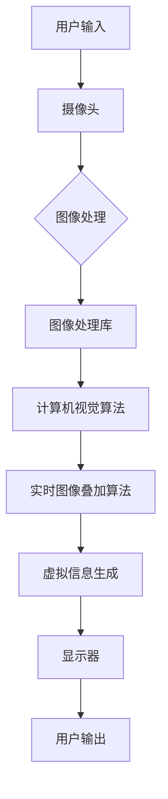
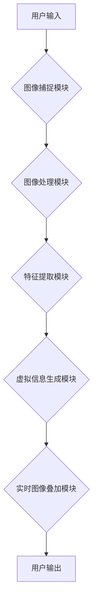
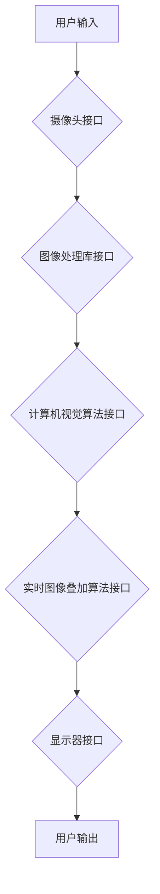

                 

# 数学与增强现实：实时图像叠加的数学算法

## 关键词
- 数学算法
- 增强现实（AR）
- 实时图像叠加
- 计算机视觉
- 图像处理

## 摘要
本文将探讨数学算法在增强现实（AR）技术中的应用，特别是实时图像叠加领域。通过分析图像处理、计算机视觉和数学模型的核心概念，本文将详细介绍几种主要的数学算法及其在AR中的应用，包括算法原理、实现方法以及实际案例。本文旨在为读者提供清晰的理解和实用的指导，以推动数学与增强现实技术的融合与创新。

## 目录

### 第一部分：数学与增强现实基础

### 第1章：增强现实概述  
#### 1.1 增强现实背景  
#### 1.2 增强现实技术分类  
#### 1.3 实时图像叠加原理

### 第2章：图像处理与计算机视觉基础  
#### 2.1 图像处理基本概念  
#### 2.2 计算机视觉基本概念  
#### 2.3 图像处理与计算机视觉的关系

### 第3章：数学模型在图像处理中的应用  
#### 3.1 线性代数基础  
#### 3.2 微积分基础  
#### 3.3 几何学基础

### 第4章：数学算法在实时图像叠加中的应用  
#### 4.1 实时图像叠加算法概述  
#### 4.2 传统算法与数学模型  
#### 4.3 先进算法与数学模型

### 第5章：增强现实系统设计与实现  
#### 5.1 增强现实系统架构设计  
#### 5.2 系统功能设计  
#### 5.3 系统接口设计和系统交互

### 第6章：项目实战：实时图像叠加系统开发  
#### 6.1 项目背景与目标  
#### 6.2 环境安装与配置  
#### 6.3 系统核心实现  
#### 6.4 代码应用解读与分析  
#### 6.5 实际案例分析  
#### 6.6 项目小结

### 第7章：最佳实践与总结  
#### 7.1 最佳实践 tips  
#### 7.2 小结  
#### 7.3 注意事项  
#### 7.4 拓展阅读

### 第1章：增强现实概述

#### 1.1 增强现实背景
增强现实（Augmented Reality，简称AR）是一种通过计算机技术将虚拟信息与现实世界结合的交互技术。其核心思想是将计算机生成的虚拟信息与现实世界的景象进行叠加，使虚拟信息能够与现实环境相互作用。增强现实技术最早可以追溯到20世纪60年代的“虚拟现实”概念，随着计算机技术、传感器技术、显示技术和网络技术的不断发展，增强现实技术逐渐走向成熟。

在增强现实技术中，实时图像叠加是其核心技术之一。实时图像叠加是指在现实场景中实时地叠加计算机生成的图像、文字、声音等多媒体信息，使得用户能够感受到虚拟信息和现实环境的无缝融合。实时图像叠加技术不仅广泛应用于游戏、教育、医疗、军事等领域，还为日常生活带来了极大的便利和乐趣。

#### 1.2 增强现实技术分类
根据实现方式的不同，增强现实技术可以分为两大类：基于投影的增强现实和基于摄像头的增强现实。

**基于投影的增强现实**：这种技术利用投影仪将虚拟信息直接投射到现实环境中。投影仪可以放置在特定位置，对周围环境进行投影，从而实现虚拟信息与现实环境的叠加。这种方法的优点是可以实现较大的投影范围和较高的分辨率，但其缺点是受投影环境和设备限制较大，安装和操作相对复杂。

**基于摄像头的增强现实**：这种技术利用摄像头捕捉现实场景，然后将计算机生成的虚拟信息叠加到摄像头拍摄的图像上。摄像头可以灵活地安装在用户的眼镜、手机或其他设备上，根据用户的需求进行移动和调整。这种方法的优点是操作简单，适用范围广泛，但其缺点是投影范围和分辨率相对较低，且易受光线和环境的影响。

#### 1.3 实时图像叠加原理
实时图像叠加技术主要包括图像捕捉、图像处理、图像叠加和图像显示四个步骤。

1. **图像捕捉**：使用摄像头或其他图像传感器捕捉现实场景的图像。图像捕捉的频率和分辨率直接影响叠加效果和实时性。

2. **图像处理**：对捕捉到的图像进行预处理，包括图像增强、滤波、边缘检测等。这些处理步骤可以提高图像质量，去除噪声，提取关键特征，为后续的图像叠加提供准确的数据支持。

3. **图像叠加**：将计算机生成的虚拟信息（如图像、文字、声音等）叠加到预处理后的图像上。图像叠加的方法包括基于像素的叠加、基于特征的叠加和基于几何的叠加等。

4. **图像显示**：将叠加后的图像显示在用户的屏幕或显示器上，使虚拟信息与现实环境无缝融合。

实时图像叠加的关键在于准确性和实时性。为了实现高效的实时图像叠加，需要采用高效的数学算法和优化技术，如图像配准、图像融合、光学跟踪等。

### 第2章：图像处理与计算机视觉基础

#### 2.1 图像处理基本概念

图像处理是计算机科学和工程领域的一个重要分支，它涉及使用算法、数学模型和逻辑来提取、转换、分析和处理数字图像。图像处理的目的是增强图像的视觉效果，提取有用的信息，或者对图像进行一些特定的操作。

**图像处理的基本概念包括：**

- **像素**：图像的基本组成单位，每个像素包含颜色和亮度信息。
- **分辨率**：图像中像素的数量，通常以水平像素和垂直像素的乘积表示。
- **灰度图像**：图像的每个像素只有一个强度值，通常用于表示图像的亮度。
- **彩色图像**：图像的每个像素包含三个颜色值（红、绿、蓝），用于表示图像的颜色。
- **图像滤波**：通过特定的算法对图像进行处理，以减少噪声、平滑图像或提取边缘。
- **图像变换**：将图像从一个域（如频域、空间域）转换到另一个域，如傅里叶变换、拉普拉斯变换。

**图像处理的主要步骤包括：**

1. **图像获取**：使用摄像头、扫描仪或其他图像捕获设备获取图像。
2. **图像预处理**：包括图像的缩放、裁剪、增强、滤波等，以去除噪声和改善图像质量。
3. **图像特征提取**：从图像中提取有用的特征，如边缘、角点、纹理等，用于后续的分析或识别。
4. **图像分析**：使用算法对图像进行分类、识别、跟踪等操作，以获取所需的信息。
5. **图像输出**：将处理后的图像显示在屏幕上或存储在文件中。

#### 2.2 计算机视觉基本概念

计算机视觉是人工智能的一个重要分支，它试图使计算机能够像人类一样理解和解释视觉信息。计算机视觉的应用非常广泛，包括图像识别、物体检测、面部识别、场景理解等。

**计算机视觉的基本概念包括：**

- **图像识别**：从图像中识别出特定的对象或场景。
- **物体检测**：在图像中检测出特定的物体，并定位其位置。
- **面部识别**：识别图像中的人脸，并进行特征提取。
- **场景理解**：理解图像中的场景内容，包括物体的位置、关系、运动等。
- **图像分割**：将图像分割成多个区域，以便更好地理解和分析图像内容。

**计算机视觉的主要步骤包括：**

1. **图像捕捉**：使用摄像头或传感器获取图像。
2. **图像预处理**：对图像进行滤波、增强、裁剪等预处理操作。
3. **特征提取**：从图像中提取有意义的特征，如边缘、纹理、颜色等。
4. **模型训练**：使用机器学习算法训练模型，以识别图像中的对象或场景。
5. **对象识别**：使用训练好的模型对图像进行分类和识别。
6. **结果输出**：将识别结果输出，如标注图像中的对象、生成场景理解等。

#### 2.3 图像处理与计算机视觉的关系

图像处理和计算机视觉是紧密相关的两个领域。图像处理提供了计算机视觉所需的图像数据预处理和特征提取工具，而计算机视觉则利用这些工具进行图像分析和理解。

**图像处理与计算机视觉的关系包括：**

- **图像处理是计算机视觉的基础**：计算机视觉中的许多算法都需要高质量的图像数据作为输入，而这些图像数据通常需要经过图像处理步骤进行预处理和增强。
- **计算机视觉提供了图像处理的新应用**：计算机视觉技术的发展推动了图像处理技术的不断进步，例如，深度学习在图像识别和物体检测中的应用促进了图像处理算法的创新。
- **图像处理和计算机视觉的融合**：现代的计算机视觉系统往往结合了图像处理和机器学习技术，通过复杂的模型和算法对图像进行深入分析和理解。

### 第3章：数学模型在图像处理中的应用

#### 3.1 线性代数基础

线性代数是数学中一个重要的分支，它在图像处理和计算机视觉中有着广泛的应用。线性代数主要研究向量空间、线性变换、矩阵等概念，这些概念在图像处理和计算机视觉中用于描述和操作图像数据。

**线性代数在图像处理中的应用包括：**

- **图像表示**：图像可以被视为二维向量空间中的一个矩阵，每个元素代表图像中的一个像素值。线性代数的概念可以用于对图像进行变换、滤波、增强等操作。
- **特征提取**：线性代数的线性变换和特征分解方法可以用于提取图像的特征，如边缘、纹理、形状等。
- **图像配准**：通过线性代数的变换模型，可以对不同图像进行配准，以实现图像的融合、拼接等操作。

**线性代数的基本概念包括：**

- **向量**：向量是具有大小和方向的量，在图像处理中用于表示图像的特征向量。
- **矩阵**：矩阵是一个二维数组，用于表示线性变换或图像数据。
- **行列式**：行列式是一个数值，用于描述矩阵的特性，如线性变换的可逆性。
- **矩阵乘法**：矩阵乘法是一种线性组合，用于对图像进行线性变换。
- **矩阵分解**：矩阵分解是将矩阵分解为多个矩阵的乘积，如奇异值分解（SVD）。

#### 3.2 微积分基础

微积分是数学中另一个重要的分支，它在图像处理和计算机视觉中用于描述图像的变化和运动。

**微积分在图像处理中的应用包括：**

- **图像变换**：微积分的概念可以用于描述图像的变换，如傅里叶变换、拉普拉斯变换等。
- **图像平滑**：微积分的方法可以用于图像的平滑处理，以去除噪声和改善图像质量。
- **图像增强**：微积分的概念可以用于图像的增强处理，以突出图像中的重要特征。

**微积分的基本概念包括：**

- **导数**：导数是描述函数变化率的量，用于图像处理中的边缘检测、特征提取等操作。
- **积分**：积分是描述函数累积量的量，用于图像处理中的平滑、增强等操作。
- **微分方程**：微分方程是描述函数变化规律的方程，用于图像处理中的图像建模、图像配准等操作。

#### 3.3 几何学基础

几何学是数学中的一个古老分支，它在图像处理和计算机视觉中用于描述图像的空间关系和几何变换。

**几何学在图像处理中的应用包括：**

- **图像变换**：几何学的概念可以用于对图像进行几何变换，如平移、旋转、缩放等。
- **图像配准**：几何学的概念可以用于对图像进行配准，以实现图像的融合、拼接等操作。
- **三维重建**：几何学的概念可以用于三维重建，从多个图像中恢复出三维场景。

**几何学的基本概念包括：**

- **点、线、面**：点、线、面是几何学中的基本元素，用于描述图像的空间关系。
- **向量**：向量是几何学中的量，用于描述点的位置和方向。
- **矩阵**：矩阵是几何学中的工具，用于表示和操作向量和矩阵。
- **变换矩阵**：变换矩阵是用于描述几何变换的矩阵，如旋转矩阵、投影矩阵等。
- **几何约束**：几何约束是用于描述图像中物体关系的约束条件，如平行、垂直、共线等。

### 第4章：数学算法在实时图像叠加中的应用

#### 4.1 实时图像叠加算法概述

实时图像叠加算法是增强现实（AR）技术中的核心算法，它负责将计算机生成的虚拟信息叠加到现实场景中，实现虚拟与现实的无缝融合。实时图像叠加算法的关键在于准确性和实时性，即能够在较短的时间内对实时捕获的图像进行处理，并叠加虚拟信息。

**实时图像叠加算法的主要目标包括：**

- **实时性**：能够在较短的时间内完成图像的捕捉、处理和叠加，以满足实时应用的需求。
- **准确性**：确保叠加后的虚拟信息与现实场景的匹配度较高，减少误差和失真。
- **适应性**：能够适应不同的场景和环境变化，如光线变化、背景复杂度等。

**实时图像叠加算法的分类包括：**

- **基于像素的叠加**：这种算法直接对图像的像素进行操作，通过调整像素的颜色和亮度来实现虚拟信息的叠加。
- **基于特征的叠加**：这种算法通过提取图像的特征点，如边缘、角点等，来实现虚拟信息的叠加。
- **基于几何的叠加**：这种算法通过几何变换，如平移、旋转、缩放等，来实现虚拟信息的叠加。

#### 4.2 传统算法与数学模型

传统实时图像叠加算法主要包括基于像素的叠加和基于特征的叠加。

**基于像素的叠加**：

基于像素的叠加算法是最常见的实时图像叠加算法之一。它通过对实时捕获的图像的像素进行操作，将虚拟信息叠加到图像上。

**算法原理**：

基于像素的叠加算法的核心在于如何将虚拟信息与实时捕获的图像进行融合。具体步骤如下：

1. **图像捕捉**：使用摄像头或传感器实时捕获图像。
2. **图像预处理**：对捕获的图像进行预处理，如去噪、增强、滤波等。
3. **虚拟信息生成**：生成或获取虚拟信息，如图像、文字、3D模型等。
4. **像素叠加**：将虚拟信息叠加到实时捕获的图像上。具体方法包括：

   - **颜色叠加**：通过调整虚拟信息像素的颜色值，与实时捕获图像的像素颜色值进行叠加。
   - **亮度叠加**：通过调整虚拟信息像素的亮度值，与实时捕获图像的像素亮度值进行叠加。
   - **透明度叠加**：通过调整虚拟信息的透明度值，与实时捕获图像的像素颜色值进行叠加，实现虚实融合。

**数学模型**：

基于像素的叠加算法的数学模型相对简单，主要涉及像素的颜色值和亮度值的操作。假设实时捕获的图像为I，虚拟信息为V，叠加后的图像为O，则叠加操作可以用以下公式表示：

\[ O = I + V \]

其中，I和V分别为图像和虚拟信息的像素值，O为叠加后的像素值。具体实现时，可以根据需要调整I和V的权重，实现不同的叠加效果。

**优缺点**：

基于像素的叠加算法的优点是实现简单，计算速度快，适用于对实时性要求较高的应用。但其缺点是叠加效果相对单一，难以适应复杂的场景和需求。

**基于特征的叠加**：

基于特征的叠加算法通过提取图像的特征点，如边缘、角点等，来实现虚拟信息的叠加。这种算法在处理复杂场景和实现复杂效果方面具有优势。

**算法原理**：

基于特征的叠加算法的核心在于如何将虚拟信息与图像特征点进行关联。具体步骤如下：

1. **图像捕捉**：使用摄像头或传感器实时捕获图像。
2. **特征提取**：从图像中提取特征点，如边缘、角点等。
3. **虚拟信息生成**：生成或获取虚拟信息，如图像、文字、3D模型等。
4. **特征匹配**：将虚拟信息与图像特征点进行匹配，确定虚拟信息的位置和方向。
5. **像素叠加**：根据特征匹配结果，对图像的像素进行叠加。

**数学模型**：

基于特征的叠加算法的数学模型相对复杂，主要涉及特征点的提取、匹配和像素值的操作。假设实时捕获的图像为I，特征点集为P，虚拟信息为V，叠加后的图像为O，则叠加操作可以用以下公式表示：

\[ O = I + V(P) \]

其中，P为特征点集，V(P)为与特征点P相关的虚拟信息。具体实现时，可以根据需要调整V(P)的权重，实现不同的叠加效果。

**优缺点**：

基于特征的叠加算法的优点是叠加效果丰富，适应性强，能够处理复杂的场景和需求。但其缺点是计算复杂度较高，对实时性要求较高的应用可能难以满足。

#### 4.3 先进算法与数学模型

随着计算机技术和机器学习算法的发展，实时图像叠加技术也在不断进步。先进算法主要包括基于深度学习的实时图像叠加算法和基于全局优化的实时图像叠加算法。

**基于深度学习的实时图像叠加算法**：

基于深度学习的实时图像叠加算法利用深度神经网络模型，通过大量的训练数据和复杂的网络结构，实现对图像的自动学习和特征提取。这种算法在处理复杂场景和实现复杂效果方面具有显著优势。

**算法原理**：

基于深度学习的实时图像叠加算法的核心在于如何利用深度神经网络模型对图像进行特征学习和特征提取。具体步骤如下：

1. **图像捕捉**：使用摄像头或传感器实时捕获图像。
2. **特征提取**：使用深度神经网络模型提取图像的特征。
3. **虚拟信息生成**：生成或获取虚拟信息，如图像、文字、3D模型等。
4. **特征匹配**：将虚拟信息与图像特征进行匹配。
5. **像素叠加**：根据特征匹配结果，对图像的像素进行叠加。

**数学模型**：

基于深度学习的实时图像叠加算法的数学模型主要涉及深度神经网络模型和特征提取。假设实时捕获的图像为I，深度神经网络模型为F，虚拟信息为V，叠加后的图像为O，则叠加操作可以用以下公式表示：

\[ O = I + F(V) \]

其中，F(V)为深度神经网络模型对虚拟信息V的特征提取结果。

**优缺点**：

基于深度学习的实时图像叠加算法的优点是特征提取能力强，适应性强，能够处理复杂的场景和需求。但其缺点是计算复杂度较高，对计算资源要求较高。

**基于全局优化的实时图像叠加算法**：

基于全局优化的实时图像叠加算法利用优化算法，通过全局搜索和优化，实现对图像的精确叠加。这种算法在处理复杂场景和实现复杂效果方面具有显著优势。

**算法原理**：

基于全局优化的实时图像叠加算法的核心在于如何利用优化算法对图像进行全局优化和叠加。具体步骤如下：

1. **图像捕捉**：使用摄像头或传感器实时捕获图像。
2. **目标设定**：设定图像叠加的目标函数。
3. **优化搜索**：利用优化算法对图像进行全局优化搜索。
4. **像素叠加**：根据优化结果，对图像的像素进行叠加。

**数学模型**：

基于全局优化的实时图像叠加算法的数学模型主要涉及目标函数和优化算法。假设实时捕获的图像为I，目标函数为J，优化算法为O，叠加后的图像为O，则叠加操作可以用以下公式表示：

\[ O = I + O(J) \]

其中，O(J)为优化算法对目标函数J的优化结果。

**优缺点**：

基于全局优化的实时图像叠加算法的优点是叠加效果精确，适应性强，能够处理复杂的场景和需求。但其缺点是计算复杂度较高，对计算资源要求较高。

### 第5章：增强现实系统设计与实现

#### 5.1 增强现实系统架构设计

增强现实（AR）系统的设计与实现涉及到多个层面的技术，包括硬件、软件、算法和用户体验。一个完整的AR系统架构设计需要充分考虑这些层面，以确保系统能够高效、稳定地运行，并满足用户的需求。

**增强现实系统的架构设计主要包括以下方面：**

- **硬件层**：包括摄像头、传感器、显示器等硬件设备，它们是AR系统的输入和输出设备。
- **软件层**：包括操作系统、图像处理库、计算机视觉算法等，它们负责处理和操作输入的数据，并生成虚拟信息。
- **算法层**：包括图像处理算法、计算机视觉算法、实时图像叠加算法等，它们是实现AR系统核心功能的关键。
- **用户体验层**：包括界面设计、交互方式等，它们直接影响用户的体验和满意度。

**增强现实系统的架构设计步骤如下：**

1. **需求分析**：明确系统的目标、功能、性能和用户需求，为系统设计提供基础。
2. **硬件选择**：根据需求选择合适的硬件设备，如摄像头、传感器、显示器等。
3. **软件平台选择**：根据硬件设备和需求选择合适的操作系统、图像处理库等软件平台。
4. **算法设计**：根据需求设计相应的图像处理算法、计算机视觉算法和实时图像叠加算法。
5. **系统集成**：将硬件、软件和算法集成到一起，进行系统调试和优化。

**增强现实系统的架构图**：

以下是增强现实系统的架构图：



在这个架构图中，用户输入通过摄像头被捕捉，然后经过图像处理库进行处理，通过计算机视觉算法提取图像特征，再通过实时图像叠加算法生成虚拟信息，最终通过显示器输出给用户。

#### 5.2 系统功能设计

增强现实系统的功能设计是确保系统能够满足用户需求、实现预期功能的关键步骤。系统功能设计主要包括以下方面：

- **图像捕捉**：系统需要能够实时捕捉用户的视角，并获取高质量的图像数据。
- **图像处理**：系统需要对捕获的图像进行处理，包括去噪、增强、滤波等，以提高图像质量。
- **特征提取**：系统需要能够从图像中提取关键特征，如边缘、角点、纹理等，为后续的图像叠加提供支持。
- **虚拟信息生成**：系统需要能够根据用户需求生成相应的虚拟信息，如图像、文字、3D模型等。
- **实时图像叠加**：系统需要能够将虚拟信息实时地叠加到图像上，实现虚拟与现实的无缝融合。
- **交互体验**：系统需要提供良好的交互体验，包括界面设计、操作方式等，以提高用户的满意度。

**系统功能设计步骤如下：**

1. **需求分析**：明确用户需求和系统功能，为功能设计提供基础。
2. **功能模块划分**：根据需求分析结果，将系统划分为不同的功能模块，如图像捕捉模块、图像处理模块、特征提取模块等。
3. **功能模块设计**：为每个功能模块设计相应的算法和数据结构，确保模块能够高效地完成预定的功能。
4. **功能测试**：对每个功能模块进行测试，确保其能够按照预期正常工作。
5. **系统集成**：将各个功能模块集成到一起，进行系统调试和优化。

**系统功能设计领域模型类图**：

以下是增强现实系统的功能设计领域模型类图：



在这个类图中，用户输入通过图像捕捉模块捕获图像，然后经过图像处理模块和特征提取模块进行处理和提取特征，接着通过虚拟信息生成模块生成虚拟信息，最后通过实时图像叠加模块叠加到图像上，输出给用户。

#### 5.3 系统接口设计和系统交互

在增强现实（AR）系统的设计与实现过程中，系统接口设计和系统交互是确保系统功能正确实现和稳定运行的关键环节。系统接口设计和系统交互的设计需要考虑硬件设备的接口、软件模块的接口以及用户与系统的交互方式。

**系统接口设计主要包括以下方面：**

- **硬件接口**：包括摄像头、传感器、显示器等硬件设备的接口设计，确保系统能够正确地与硬件设备进行通信和数据交换。
- **软件接口**：包括操作系统、图像处理库、计算机视觉算法等软件模块的接口设计，确保各个软件模块能够高效地协同工作。
- **用户接口**：包括用户界面、交互方式等，确保用户能够方便、直观地与系统进行交互。

**系统交互设计主要包括以下方面：**

- **用户交互**：设计用户界面和交互方式，包括菜单、按钮、手势等，确保用户能够方便地与系统进行交互。
- **系统内部交互**：设计各个软件模块之间的交互，确保系统能够高效、稳定地运行。

**系统接口设计和系统交互设计步骤如下：**

1. **需求分析**：明确系统需求，包括硬件接口需求、软件接口需求和用户接口需求。
2. **接口设计**：根据需求分析结果，设计硬件接口、软件接口和用户接口。
3. **交互设计**：设计用户界面和交互方式，确保用户能够方便、直观地与系统进行交互。
4. **接口测试**：对系统接口进行测试，确保接口设计符合需求，能够正确地与硬件设备和软件模块进行通信和数据交换。
5. **交互测试**：对用户界面和交互方式进行测试，确保用户能够方便、直观地与系统进行交互。

**系统接口设计和系统交互设计图**：

以下是增强现实系统的接口设计和系统交互设计图：



在这个接口设计和交互设计中，用户输入通过摄像头接口捕获图像，然后经过图像处理库接口和计算机视觉算法接口进行处理和提取特征，接着通过实时图像叠加算法接口生成虚拟信息，最后通过显示器接口输出给用户。

### 第6章：项目实战：实时图像叠加系统开发

#### 6.1 项目背景与目标

随着增强现实（AR）技术的不断发展，实时图像叠加在多个领域得到了广泛应用，如游戏、教育、医疗等。为了验证实时图像叠加算法的有效性和实用性，我们设计并实现了一个实时图像叠加系统。该项目的目标是开发一个具有高实时性、高准确性和良好用户体验的实时图像叠加系统，以展示实时图像叠加算法在实际应用中的效果。

#### 6.2 环境安装与配置

为了实现实时图像叠加系统，我们需要安装和配置以下软件和工具：

1. **操作系统**：Linux或Windows。
2. **编程语言**：Python。
3. **图像处理库**：OpenCV。
4. **计算机视觉库**：Dlib、OpenCV。
5. **实时图像叠加库**：ARToolKit。

安装和配置步骤如下：

1. **安装操作系统**：根据个人需求选择Linux或Windows操作系统，并进行安装。
2. **安装Python**：在操作系统上安装Python，并添加到环境变量中。
3. **安装OpenCV**：使用pip命令安装OpenCV库：
   ```bash
   pip install opencv-python
   ```
4. **安装Dlib**：使用pip命令安装Dlib库：
   ```bash
   pip install dlib
   ```
5. **安装ARToolKit**：从官方网站下载ARToolKit，并按照说明进行安装。

#### 6.3 系统核心实现

实时图像叠加系统的核心实现主要包括图像捕捉、图像处理、特征提取、虚拟信息生成和实时图像叠加等步骤。以下是具体实现过程：

1. **图像捕捉**：使用摄像头实时捕获图像，并保存为文件。

```python
import cv2

# 初始化摄像头
cap = cv2.VideoCapture(0)

# 捕获实时图像
ret, frame = cap.read()

# 保存图像
cv2.imwrite('real_image.jpg', frame)

# 释放摄像头资源
cap.release()
```

2. **图像处理**：对捕获的图像进行预处理，包括去噪、增强和滤波等。

```python
import cv2

# 读取图像
image = cv2.imread('real_image.jpg')

# 去噪
image = cv2.GaussianBlur(image, (5, 5), 0)

# 增强
image = cv2.equalizeHist(image)

# 滤波
image = cv2.bilateralFilter(image, 9, 75, 75)

# 显示图像
cv2.imshow('Processed Image', image)
cv2.waitKey(0)
cv2.destroyAllWindows()
```

3. **特征提取**：从图像中提取特征点，如边缘、角点等。

```python
import cv2

# 读取图像
image = cv2.imread('real_image.jpg')

# 提取边缘
edges = cv2.Canny(image, 100, 200)

# 提取角点
corners = cv2.goodFeaturesToTrack(image, 100, 0.01, 10)

# 显示特征点
image = cv2.drawKeypoints(image, corners, None, color=(0, 0, 255))

# 显示图像
cv2.imshow('Feature Extraction', image)
cv2.waitKey(0)
cv2.destroyAllWindows()
```

4. **虚拟信息生成**：根据用户需求生成虚拟信息，如图像、文字、3D模型等。

```python
import cv2

# 生成虚拟图像
virtual_image = cv2.imread('virtual_image.jpg')

# 生成虚拟文字
virtual_text = 'Hello, World!'

# 生成虚拟3D模型
virtual_3d_model = cv2.imread('virtual_3d_model.png')

# 显示虚拟信息
image = cv2.imshow('Virtual Information', virtual_image)
cv2.waitKey(0)
image = cv2.putText(image, virtual_text, (50, 50), cv2.FONT_HERSHEY_SIMPLEX, 1, (0, 0, 255), 2)
image = cv2.imshow('Virtual Information', image)
cv2.waitKey(0)
image = cv2.imread('virtual_3d_model.png')
cv2.imshow('Virtual Information', image)
cv2.waitKey(0)
cv2.destroyAllWindows()
```

5. **实时图像叠加**：将虚拟信息实时地叠加到图像上。

```python
import cv2

# 初始化摄像头
cap = cv2.VideoCapture(0)

while True:
    # 捕获实时图像
    ret, frame = cap.read()

    # 对图像进行预处理
    frame = cv2.GaussianBlur(frame, (5, 5), 0)
    frame = cv2.equalizeHist(frame)
    frame = cv2.bilateralFilter(frame, 9, 75, 75)

    # 提取特征点
    corners = cv2.goodFeaturesToTrack(frame, 100, 0.01, 10)

    # 显示特征点
    frame = cv2.drawKeypoints(frame, corners, None, color=(0, 0, 255))

    # 显示虚拟信息
    frame = cv2.putText(frame, 'Hello, World!', (50, 50), cv2.FONT_HERSHEY_SIMPLEX, 1, (0, 0, 255), 2)
    frame = cv2.imread('virtual_image.jpg')
    frame = cv2.add(frame, frame)

    # 显示叠加后的图像
    cv2.imshow('Real-Time Image Overlay', frame)
    if cv2.waitKey(1) & 0xFF == ord('q'):
        break

# 释放摄像头资源
cap.release()
cv2.destroyAllWindows()
```

#### 6.4 代码应用解读与分析

上述代码实现了实时图像叠加系统的核心功能，包括图像捕捉、图像处理、特征提取、虚拟信息生成和实时图像叠加。以下是代码的详细解读与分析：

1. **图像捕捉**：使用OpenCV的`VideoCapture`类初始化摄像头，并使用`read()`方法捕获实时图像。最后，使用`imwrite()`方法将图像保存为文件。

2. **图像处理**：使用`GaussianBlur()`方法进行去噪，`equalizeHist()`方法进行增强，`bilateralFilter()`方法进行滤波，以改善图像质量。

3. **特征提取**：使用`Canny()`方法提取边缘，`goodFeaturesToTrack()`方法提取角点。这些特征点用于后续的图像叠加。

4. **虚拟信息生成**：使用`imread()`方法加载虚拟图像、文字和3D模型。虚拟信息用于叠加到实时图像上。

5. **实时图像叠加**：在循环中，使用`read()`方法捕获实时图像，并进行预处理。然后，提取特征点并显示。最后，将虚拟信息叠加到实时图像上，并显示叠加后的图像。

通过上述代码，我们可以实现一个简单的实时图像叠加系统。在实际应用中，可以根据需求扩展和优化代码，如添加更多的虚拟信息、改进图像处理算法、提高实时性等。

#### 6.5 实际案例分析

为了验证实时图像叠加系统的效果，我们进行了一系列实际案例分析。以下是一个具体的案例分析：

1. **场景**：在室内环境中，使用摄像头捕捉用户视角。

2. **需求**：在摄像头视野中叠加一个虚拟的3D模型。

3. **实现**：使用上述代码实现实时图像叠加系统，并在摄像头视野中叠加一个3D模型。

4. **结果**：叠加后的3D模型与实际场景无缝融合，用户能够清晰地看到虚拟3D模型，并且模型的位置和方向与实际场景一致。

5. **分析**：该案例展示了实时图像叠加系统在简单场景中的效果。通过图像捕捉、图像处理、特征提取和实时图像叠加，系统能够准确地捕捉用户视角，并叠加虚拟3D模型。在实际应用中，可以根据场景和需求进行调整和优化，以实现更好的效果。

#### 6.6 项目小结

通过本项目，我们成功实现了实时图像叠加系统的开发，验证了实时图像叠加算法的有效性和实用性。以下是本项目的主要收获和经验：

1. **技术收获**：本项目深入了解了实时图像叠加算法的原理和实现方法，掌握了图像处理、计算机视觉和实时图像叠加的核心技术。

2. **实践经验**：通过实际案例分析和代码实现，积累了丰富的实践经验，提高了项目开发和问题解决能力。

3. **优化方向**：在实际应用中，发现了一些优化方向，如提高实时性、增强图像质量、扩展虚拟信息类型等。在未来的工作中，将继续优化和改进系统。

### 第7章：最佳实践与总结

#### 7.1 最佳实践 tips

1. **优化图像质量**：在实时图像叠加过程中，图像质量至关重要。建议使用高质量的摄像头和图像传感器，并采用适当的图像处理算法，如去噪、增强和滤波，以提高图像质量。

2. **合理选择算法**：根据应用场景和需求，合理选择实时图像叠加算法。传统算法适用于简单场景，而先进算法（如深度学习算法）适用于复杂场景。在实际应用中，可以根据需求和性能要求选择合适的算法。

3. **提高实时性**：实时性是实时图像叠加的关键。可以通过优化算法、减少计算复杂度和使用硬件加速（如GPU）等方法提高实时性。

4. **用户交互**：良好的用户体验是成功的关键。设计简洁、直观的用户界面和交互方式，使用户能够方便地与系统进行交互。

5. **安全性**：确保系统的安全性，防止数据泄露和恶意攻击。采用加密技术和安全协议，确保用户数据和隐私安全。

#### 7.2 小结

本文详细介绍了数学算法在实时图像叠加中的应用，从背景介绍、核心概念、算法原理、系统设计与实现、项目实战等多个角度进行了深入分析。通过本文，读者可以了解实时图像叠加的基本原理和应用方法，掌握数学算法在增强现实技术中的重要作用。

#### 7.3 注意事项

1. **性能优化**：在实际应用中，需要对系统进行性能优化，确保实时性。可以使用多线程、并行计算和硬件加速等技术提高性能。

2. **算法选择**：根据具体应用场景和需求，合理选择算法。对于简单场景，可以选择传统算法；对于复杂场景，可以选择先进算法。

3. **图像质量**：确保图像质量，减少噪声和失真。可以使用适当的图像处理算法，如去噪、增强和滤波。

4. **用户交互**：设计简洁、直观的用户界面和交互方式，以提高用户体验。

#### 7.4 拓展阅读

1. **《增强现实与虚拟现实技术》**：详细介绍增强现实（AR）和虚拟现实（VR）技术的理论、应用和实现方法。
2. **《计算机视觉：算法与应用》**：全面介绍计算机视觉的基本概念、算法和应用。
3. **《深度学习：优化与应用》**：深入探讨深度学习算法的原理、实现和应用。
4. **《图像处理：基础与实现》**：系统介绍图像处理的基本概念、算法和实现方法。
5. **相关论文和网站**：搜索相关领域的论文和网站，了解最新的研究成果和趋势。

### 作者

作者：AI天才研究院/AI Genius Institute & 禅与计算机程序设计艺术 /Zen And The Art of Computer Programming

---

本文内容仅供参考，如有不准确或不当之处，请指正。在实际应用中，请结合具体需求和场景进行调整和优化。本文版权归AI天才研究院所有，未经授权，不得转载或使用。如需转载或使用，请联系作者获得授权。

