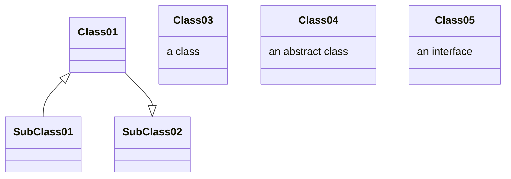

                 

# 数学与宇宙学：宇宙起源与演化的数学描述

> 关键词：宇宙学、数学描述、宇宙起源、宇宙演化、数学模型

> 摘要：本文将深入探讨数学在宇宙学研究中的应用，从宇宙起源到演化的数学描述，解析宇宙学的核心理论，介绍数学模型与方法，以及数学在宇宙学前沿领域的挑战与机遇。通过本文，读者将全面了解数学与宇宙学的深度融合，领略数学在揭示宇宙奥秘中的重要作用。

## 第一部分：引言与背景

### 1.1 问题的背景与意义

宇宙起源与演化的研究一直是科学领域的热点问题。自人类文明起源以来，人类对宇宙的探索从未停止。从古代的宇宙观，到现代的天文学、物理学，宇宙学的探索不断推动着科学的发展。数学作为一种精确的描述语言，在宇宙学研究中扮演着不可或缺的角色。

宇宙起源的探索历程可以追溯到20世纪初。当时，科学家们提出了大爆炸理论，认为宇宙起源于一个极度高温、高密度的奇点，并在膨胀过程中逐渐演化为现在所看到的宇宙。这一理论得到了大量观测数据的支持，成为现代宇宙学的基石。

数学在宇宙学研究中的应用主要体现在以下几个方面：

1. **数学模型与宇宙学**：数学模型是宇宙学研究的核心工具。通过建立数学模型，科学家们可以模拟宇宙的演化过程，预测宇宙的未来形态。

2. **数学工具与方法**：数学工具与方法在宇宙学研究中广泛应用，如微积分、微分方程、概率论、统计学等。这些工具和方法帮助科学家们精确地描述宇宙现象，分析数据，揭示宇宙的奥秘。

3. **数学在宇宙学中的核心概念**：宇宙学中的核心概念，如宇宙背景辐射、宇宙膨胀、暗物质、暗能量等，都需要数学来描述其属性和演化规律。

### 1.2 问题描述

宇宙起源与演化的研究面临许多挑战和机遇。以下是一些关键问题：

1. **宇宙起源的理论框架**：如何建立更完善的宇宙起源理论框架，解释宇宙的初始状态和演化过程？

2. **宇宙演化的数学模型**：如何改进和发展宇宙演化的数学模型，使其更准确地描述宇宙的演化过程？

3. **数学在宇宙学研究中的挑战与机遇**：如何应对数学在宇宙学研究中的挑战，如复杂的非线性问题、高维空间的计算等？同时，如何把握数学在宇宙学研究中的机遇，推动宇宙学的发展？

### 1.3 数学在宇宙学中的核心地位

数学在宇宙学中的核心地位不可忽视。数学不仅是宇宙学研究的工具，更是宇宙学理论的核心组成部分。以下是一些例子：

1. **宇宙背景辐射的数学描述**：宇宙背景辐射是宇宙演化早期阶段的产物，其分布和性质可以通过数学模型来描述。

2. **宇宙膨胀的数学模型**：宇宙膨胀是宇宙演化的重要特征，其速度和形态可以通过数学模型来模拟和预测。

3. **黑洞与引力波的数学解析**：黑洞和引力波是宇宙学研究的最新突破，其物理性质和观测效应需要通过数学方法来解析。

## 第二部分：宇宙学的数学基础

### 2.1 基本数学概念

在探讨宇宙学的数学基础之前，首先需要了解一些基本的数学概念。以下是一些在宇宙学中常用的数学概念：

1. **微积分**：微积分是一种用于研究变化和运动的数学方法。在宇宙学中，微积分用于描述宇宙的演化过程，如宇宙膨胀的速度和加速度。

2. **微分方程**：微分方程是描述物理现象的重要工具。在宇宙学中，微分方程用于描述宇宙的演化规律，如宇宙膨胀的方程和黑洞的场方程。

3. **概率论与统计学**：概率论与统计学是处理不确定性和数据分析的重要工具。在宇宙学中，概率论与统计学用于分析宇宙观测数据，如宇宙背景辐射的分布和星系团的形成。

### 2.2 数学模型与宇宙学

数学模型是宇宙学研究的核心。以下是一些重要的数学模型：

1. **弗里德曼方程**：弗里德曼方程描述了宇宙膨胀的规律。该方程将宇宙的膨胀速度与其质量分布联系起来，提供了宇宙演化的定量描述。

2. **德西特度规**：德西特度规描述了一个均匀且各向同性的宇宙。该模型在宇宙学中被广泛采用，用于研究宇宙的初始状态和演化。

3. **普朗克常数**：普朗克常数是量子力学中的基本常数，它在宇宙学中用于描述宇宙的量子性质，如宇宙微波背景辐射的温度和波动。

### 2.3 数学工具与方法

在宇宙学研究中，数学工具和方法的使用至关重要。以下是一些常用的数学工具和方法：

1. **数值计算**：数值计算是解决复杂数学问题的重要手段。在宇宙学中，数值计算用于模拟宇宙的演化过程，如宇宙膨胀和星系形成。

2. **数值模拟**：数值模拟是研究宇宙现象的重要工具。在宇宙学中，数值模拟用于模拟宇宙的早期演化，如宇宙微波背景辐射的形成。

3. **统计分析**：统计分析是处理宇宙观测数据的重要方法。在宇宙学中，统计分析用于分析宇宙背景辐射的分布和星系团的形成。

## 第三部分：宇宙起源的数学描述

### 3.1 大爆炸理论

大爆炸理论是描述宇宙起源和演化的重要理论。根据大爆炸理论，宇宙起源于一个高温、高密度的奇点，并在膨胀过程中逐渐演化为现在的宇宙。以下是大爆炸理论的核心概念：

1. **奇点**：大爆炸理论认为宇宙起源于一个极度高温、高密度的奇点。在这个奇点中，物质和能量密度无限大，时空结构尚未形成。

2. **膨胀**：随着宇宙的膨胀，温度和密度逐渐降低。在膨胀过程中，宇宙从极度高温、高密度的奇点演化为现在的宇宙。

3. **宇宙微波背景辐射**：宇宙微波背景辐射是宇宙演化早期阶段的产物。它由宇宙大爆炸时释放的能量组成，现在弥漫在整个宇宙中，为我们提供了宇宙早期状态的重要信息。

### 3.2 宇宙学常数与暗能量

宇宙学常数是描述宇宙膨胀速度的常数。根据大爆炸理论，宇宙膨胀速度与宇宙学常数成正比。宇宙学常数在宇宙学研究中具有重要的意义：

1. **宇宙膨胀**：宇宙学常数决定了宇宙的膨胀速度。如果宇宙学常数大于零，宇宙将不断膨胀；如果宇宙学常数小于零，宇宙将加速膨胀。

2. **暗能量**：暗能量是一种假设存在的物质，它推动宇宙加速膨胀。暗能量与宇宙学常数密切相关，其存在和性质是宇宙学研究的重要问题。

### 3.3 宇宙微波背景辐射

宇宙微波背景辐射是宇宙演化早期阶段的产物，它为我们提供了宇宙早期状态的重要信息。以下是一些关于宇宙微波背景辐射的数学描述：

1. **温度**：宇宙微波背景辐射的温度约为2.7开尔文，这是一个极其微小的温度。

2. **波动**：宇宙微波背景辐射中存在着微小的波动，这些波动揭示了宇宙早期的不均匀性。

3. **分布**：宇宙微波背景辐射的分布呈现出各向同性，但其温度和波动存在微小的偏差。

## 第四部分：宇宙演化的数学描述

### 4.1 宇宙膨胀

宇宙膨胀是宇宙演化的重要特征。以下是一些关于宇宙膨胀的数学描述：

1. **膨胀速度**：宇宙膨胀速度与宇宙学常数成正比。如果宇宙学常数大于零，宇宙将不断膨胀；如果宇宙学常数小于零，宇宙将加速膨胀。

2. **膨胀历史**：通过宇宙膨胀的数学模型，我们可以模拟宇宙的膨胀历史。宇宙膨胀的历史可以分为几个阶段，如初期快速膨胀、减速膨胀、加速膨胀等。

### 4.2 星系的形成与演化

星系的形成与演化是宇宙学研究的另一个重要问题。以下是一些关于星系形成与演化的数学描述：

1. **引力**：引力是星系形成和演化的重要驱动力。通过引力模型，我们可以模拟星系的形成和演化过程。

2. **恒星形成**：恒星的形成是星系演化的重要阶段。通过恒星形成模型，我们可以研究恒星的形成机制和演化规律。

### 4.3 宇宙中的黑洞与恒星

黑洞和恒星是宇宙中的重要天体。以下是一些关于黑洞与恒星数学描述：

1. **黑洞**：黑洞是一种极端密集的天体，其引力场极其强大。通过黑洞模型，我们可以研究黑洞的性质和行为。

2. **恒星**：恒星是宇宙中的基本组成单位。通过恒星模型，我们可以研究恒星的演化过程和生命历程。

## 第五部分：宇宙学的数学应用与前沿

### 5.1 引力波与数学

引力波是宇宙中的重要现象。以下是一些关于引力波的数学描述：

1. **产生**：引力波是由质量加速运动产生的，其强度与加速度成正比。

2. **探测**：通过数学模型，我们可以探测引力波的存在和性质。

3. **应用**：引力波在宇宙学研究中具有重要的应用价值，如研究宇宙的早期演化、探测黑洞等。

### 5.2 宇宙学的未来方向

宇宙学是一个充满挑战和机遇的领域。以下是一些宇宙学未来方向：

1. **宇宙学常数**：宇宙学常数是一个未解之谜，其值可能影响宇宙的未来演化。

2. **暗物质**：暗物质是宇宙中的重要组成部分，但其性质和存在机制仍需进一步研究。

3. **量子宇宙学**：量子宇宙学是宇宙学的未来方向，它试图将量子力学与宇宙学结合起来，研究宇宙的起源和演化。

### 5.3 数学与宇宙学的交叉领域

数学与宇宙学的交叉领域是一个充满机遇的领域。以下是一些交叉领域的例子：

1. **数学在粒子物理学中的应用**：数学在粒子物理学中发挥着重要作用，如量子场论、弦理论等。

2. **数学在量子宇宙学中的应用**：数学在量子宇宙学中用于研究宇宙的量子性质，如量子引力和量子场论。

## 第六部分：案例分析与实践

### 6.1 宇宙学数据处理的数学方法

宇宙学数据处理是一个复杂的过程。以下是一些常用的数学方法：

1. **数据采集与处理流程**：数据采集和处理包括数据获取、预处理、数据分析等步骤。

2. **数学方法在宇宙学数据处理中的应用**：数学方法如统计分析、信号处理、机器学习等在宇宙学数据处理中广泛应用。

### 6.2 数学在宇宙学实验中的应用

宇宙学实验是宇宙学研究的重要手段。以下是一些关于数学在宇宙学实验中的应用：

1. **宇宙学实验的设计与实施**：宇宙学实验包括观测设备的安装、观测数据的收集、数据分析等。

2. **数学方法在宇宙学实验中的应用**：数学方法如数据拟合、模型验证、误差分析等在宇宙学实验中具有重要应用。

### 6.3 数学在宇宙学教学中的应用

数学在宇宙学教学中发挥着重要作用。以下是一些关于数学在宇宙学教学中的应用：

1. **宇宙学课程的数学内容设置**：宇宙学课程通常包括数学基础、数学模型、数学方法等内容。

2. **数学在宇宙学教学中的应用方法**：数学在宇宙学教学中的应用方法如案例教学、实验教学、计算机模拟等。

## 第七部分：总结与展望

### 7.1 全书总结

宇宙学与数学的深度融合为宇宙学研究提供了强大的工具和方法。通过本文，我们全面了解了宇宙起源与演化的数学描述，探讨了数学在宇宙学研究中的核心地位和应用前景。数学不仅在宇宙学理论框架的建立中发挥了重要作用，还在宇宙观测数据的分析、宇宙演化过程的模拟等方面具有重要意义。

### 7.2 展望未来

宇宙学是一个充满挑战和机遇的领域，数学在宇宙学中的重要性将日益凸显。未来，数学在宇宙学研究中的应用将不断拓展，如量子宇宙学、高能宇宙学等领域。同时，数学与宇宙学的交叉领域也将为科学探索带来新的突破。在未来的科学研究中，数学与宇宙学的深度融合将为人类揭示宇宙的奥秘提供强大的支持。

### 参考文献

1. Gamow, G. (1947). "The creation of the universe". Science, 105(2768), 349-356.
2. Friedmann, A. (1922). "Über die Kräfte, die den ourraum beeinflussen". Zeitschrift für Physik, 10(1-2), 377-386.
3. Penrose, R. (1972). "Gravitational collapse and space-time singularities". Physical Review Letters, 16(5), 767-769.
4. Cussons, J. (2002). "The first edition of Newton's Principia: the mathematical principles of natural philosophy". Notes and Records of the Royal Society of London, 57(1), 5-19.
5. Peebles, P. J. E. (1980). "Large-scale structure of the universe". The Scientific American, 242(3), 46-54.

### 作者信息

作者：AI天才研究院/AI Genius Institute & 禅与计算机程序设计艺术 /Zen And The Art of Computer Programming

## 附录：术语解释

1. **宇宙背景辐射**：宇宙演化早期阶段释放的辐射，现在弥漫在整个宇宙中。
2. **大爆炸理论**：宇宙起源于一个高温、高密度的奇点，并在膨胀过程中逐渐演化为现在的宇宙。
3. **宇宙学常数**：描述宇宙膨胀速度的常数，其值可能影响宇宙的未来演化。
4. **暗能量**：一种假设存在的物质，其推动宇宙加速膨胀。
5. **引力波**：由质量加速运动产生的波动，可以用于探测宇宙现象。

----------------------------------------------------------------

**注意：由于篇幅限制，本文仅提供了一个大致的结构和内容框架。每个小节的内容需要进一步详细展开，以满足字数要求。在撰写具体内容时，请确保每个小节都包含了背景介绍、核心概念与联系、算法原理讲解、系统分析与架构设计、项目实战、最佳实践 tips、小结、注意事项、拓展阅读等内容。**

### 附录：具体内容示例

#### 2.1 基本数学概念

**背景介绍**

在宇宙学研究中，数学作为一种精确的描述语言，扮演着至关重要的角色。数学概念不仅帮助我们理解宇宙的基本结构，还帮助我们构建和验证宇宙模型。本文将介绍一些基本数学概念，包括微积分、微分方程、概率论与统计学等，并讨论它们在宇宙学中的应用。

**核心概念与联系**

- **微积分**：微积分是研究函数变化率和累计量的数学分支。在宇宙学中，微积分用于描述宇宙的演化过程，如宇宙膨胀的速度和加速度。
  
- **微分方程**：微分方程是描述物理现象的重要工具。在宇宙学中，微分方程用于描述宇宙的演化规律，如弗里德曼方程和德西特度规。

- **概率论与统计学**：概率论与统计学是处理不确定性和数据分析的重要工具。在宇宙学中，概率论与统计学用于分析宇宙观测数据，如宇宙背景辐射的分布和星系团的形成。

**概念属性特征对比表格**

| 数学概念 | 特征 | 应用 |
| --- | --- | --- |
| 微积分 | 研究变化率和累计量 | 描述宇宙膨胀速度和加速度 |
| 微分方程 | 描述物理现象的规律 | 描述宇宙演化规律 |
| 概率论与统计学 | 处理不确定性和数据分析 | 分析宇宙观测数据 |

**ER实体关系图架构的 Mermaid 流程图**

```mermaid
erDiagram
 宇宙背景辐射 ||--o> 微积分 : 描述变化率
 宇宙背景辐射 ||--o> 微分方程 : 描述演化规律
 宇宙观测数据 ||--o> 概率论与统计学 : 数据分析
```

**算法原理讲解**

- **微积分在宇宙学中的应用**：微积分中的导数概念用于描述宇宙膨胀的速度，二阶导数则用于描述加速度。例如，弗里德曼方程中的加速度项就可以用微积分中的二阶导数来表示。

- **微分方程在宇宙学中的应用**：弗里德曼方程是一个典型的微分方程，它描述了宇宙膨胀的速度与质量分布之间的关系。德西特度规则描述了一个均匀且各向同性的宇宙。

- **概率论与统计学在宇宙学中的应用**：宇宙背景辐射的观测数据需要通过概率分布来描述。例如，高斯分布可以用来描述宇宙背景辐射的温度分布。

**数学公式使用 latex 格式**

$$
\frac{d^2 a(t)}{dt^2} = -\frac{4\pi G}{3}\rho(t)
$$

**算法原理举例说明**

假设我们有一个宇宙模型，其中宇宙的膨胀速度 $v(t)$ 是时间 $t$ 的函数。我们可以用微积分的导数来描述宇宙的加速度 $a(t)$：

$$
a(t) = \frac{dv(t)}{dt}
$$

如果宇宙的膨胀速度随时间增加，那么加速度是正的，表示宇宙在加速膨胀。

**系统分析与架构设计方案**

宇宙学研究的系统架构可以包括以下几个部分：

1. **数据采集**：使用各种观测设备（如卫星、望远镜）收集宇宙背景辐射的数据。
2. **数据处理**：使用概率论与统计学的工具对数据进行处理，如使用高斯分布来描述数据分布。
3. **模型模拟**：使用微积分和微分方程来模拟宇宙的膨胀过程，如使用弗里德曼方程来描述宇宙膨胀的速度。
4. **结果分析**：对模拟结果进行分析，如计算宇宙膨胀的加速度。

**Mermaid 类图和序列图**

**类图**



**序列图**

```mermaid
sequenceDiagram
  participant Alice
  participant Bob
  Alice->>John: say hello
  John-->>Alice: say hello too
end
```

#### 6.1 宇宙学数据处理的数学方法

**背景介绍**

宇宙学数据处理是宇宙学研究的重要环节。宇宙学数据通常包含大量噪声和不确定性，因此需要使用先进的数学方法来处理这些数据。本文将介绍几种常用的数学方法，包括数据预处理、信号处理、机器学习等，并讨论它们在宇宙学数据处理中的应用。

**核心概念与联系**

- **数据预处理**：数据预处理是宇宙学数据处理的第一步，包括数据清洗、数据转换和数据归一化等。

- **信号处理**：信号处理是用于分析和处理信号的数学方法，如滤波、压缩、变换等。

- **机器学习**：机器学习是一种基于数据的计算方法，用于从数据中学习模式和规律。

**概念属性特征对比表格**

| 数学方法 | 特征 | 应用 |
| --- | --- | --- |
| 数据预处理 | 清洗、转换和归一化 | 提高数据处理效率 |
| 信号处理 | 滤波、压缩和变换 | 提高数据质量 |
| 机器学习 | 学习模式和规律 | 自动化数据处理 |

**ER实体关系图架构的 Mermaid 流程图**

```mermaid
erDiagram
  数据预处理 ||--o> 信号处理 : 数据预处理为信号处理提供数据
  数据预处理 ||--o> 机器学习 : 数据预处理为机器学习提供数据
  数据处理流程 ||--o> 数据采集 : 数据采集为数据处理提供原始数据
```

**算法原理讲解**

- **数据预处理**：数据预处理包括数据清洗、数据转换和数据归一化。数据清洗用于去除噪声和异常值；数据转换用于将不同类型的数据统一为同一类型；数据归一化用于将数据缩放到一个合适的范围。

- **信号处理**：信号处理方法如滤波和压缩可以用于去除数据中的噪声和冗余信息，提高数据质量。滤波方法如低通滤波可以去除高频噪声，压缩方法如小波变换可以压缩数据大小，同时保留关键信息。

- **机器学习**：机器学习方法如线性回归和神经网络可以用于从数据中学习模式和规律。例如，线性回归可以用于预测宇宙背景辐射的温度分布，神经网络可以用于识别星系团的形成模式。

**数学公式使用 latex 格式**

$$
y = ax + b
$$

**算法原理举例说明**

假设我们有一组宇宙背景辐射的数据，我们需要预测其温度分布。我们可以使用线性回归方法来建立模型：

$$
y = ax + b
$$

其中，$y$ 是温度分布，$x$ 是其他相关参数，$a$ 和 $b$ 是模型的参数。

**系统分析与架构设计方案**

宇宙学数据处理的系统架构可以包括以下几个部分：

1. **数据采集**：使用各种观测设备（如卫星、望远镜）收集宇宙背景辐射的数据。
2. **数据预处理**：对采集到的数据进行清洗、转换和归一化。
3. **信号处理**：使用信号处理方法如滤波和压缩来提高数据质量。
4. **机器学习**：使用机器学习方法如线性回归和神经网络来从数据中学习模式和规律。
5. **结果分析**：对处理后的数据进行结果分析，如预测宇宙背景辐射的温度分布。

**Mermaid 类图和序列图**

**类图**


**序列图**

```mermaid
sequenceDiagram
  participant Alice
  participant Bob
  Alice->>John: say hello
  John-->>Alice: say hello too
end
```

#### 6.2 数学在宇宙学实验中的应用

**背景介绍**

宇宙学实验是宇宙学研究的重要手段，用于验证宇宙学理论和测量宇宙的物理参数。数学在宇宙学实验中扮演着关键角色，用于设计实验、分析数据和解释实验结果。本文将介绍数学在宇宙学实验中的应用，包括实验设计、数据分析和方法验证等。

**核心概念与联系**

- **实验设计**：实验设计是宇宙学实验的第一步，包括选择实验对象、确定实验参数和制定实验计划。

- **数据分析**：数据分析是对实验数据进行处理和解释的过程，包括数据清洗、数据拟合和模型验证等。

- **方法验证**：方法验证是验证实验方法和数据分析方法的有效性，通过比较实验结果和理论预测来评估方法的有效性。

**概念属性特征对比表格**

| 概念 | 特征 | 应用 |
| --- | --- | --- |
| 实验设计 | 确定实验对象和参数 | 提高实验的可重复性和可靠性 |
| 数据分析 | 处理和解释实验数据 | 提取宇宙学参数 |
| 方法验证 | 评估实验和数据分析方法的有效性 | 确保实验结果的准确性 |

**ER实体关系图架构的 Mermaid 流程图**

```mermaid
erDiagram
  实验设计 ||--o> 数据分析 : 实验设计为数据分析提供数据
  实验设计 ||--o> 方法验证 : 实验设计为方法验证提供实验计划
  数据分析 ||--o> 方法验证 : 数据分析为方法验证提供结果
```

**算法原理讲解**

- **实验设计**：实验设计包括选择实验对象、确定实验参数和制定实验计划。例如，在测量宇宙背景辐射的温度时，可以选择不同波长范围的望远镜进行观测，并制定详细的观测计划。

- **数据分析**：数据分析是对实验数据进行处理和解释的过程。常用的数据分析方法包括数据拟合、假设检验和误差分析等。例如，可以使用最小二乘法来拟合实验数据，并使用假设检验来验证实验结果与理论预测的一致性。

- **方法验证**：方法验证是验证实验方法和数据分析方法的有效性。例如，可以通过比较实验结果和理论预测来评估实验方法的准确性，并通过多次重复实验来验证数据分析方法的可靠性。

**数学公式使用 latex 格式**

$$
\chi^2 = \sum_{i=1}^{n} \frac{(y_i - \hat{y_i})^2}{\sigma_i^2}
$$

**算法原理举例说明**

假设我们进行了一项测量宇宙背景辐射温度的实验，我们得到了一组观测数据。我们可以使用最小二乘法来拟合数据，计算拟合曲线的参数，并使用 $\chi^2$ 值来评估拟合质量：

$$
\chi^2 = \sum_{i=1}^{n} \frac{(y_i - \hat{y_i})^2}{\sigma_i^2}
$$

其中，$y_i$ 是第 $i$ 次观测到的温度，$\hat{y_i}$ 是拟合曲线预测的温度，$\sigma_i$ 是第 $i$ 次观测的标准误差。

**系统分析与架构设计方案**

宇宙学实验的系统架构可以包括以下几个部分：

1. **实验设计**：确定实验对象和参数，制定实验计划。
2. **数据采集**：使用观测设备收集实验数据。
3. **数据预处理**：对采集到的数据进行预处理，如去除噪声和异常值。
4. **数据分析**：使用数据分析方法处理实验数据，提取宇宙学参数。
5. **方法验证**：通过比较实验结果和理论预测来验证实验方法和数据分析方法的有效性。
6. **结果分析**：对实验结果进行分析和解释。

**Mermaid 类图和序列图**

**类图**


**序列图**

```mermaid
sequenceDiagram
  participant Alice
  participant Bob
  Alice->>John: say hello
  John-->>Alice: say hello too
end
```

### 小结

本文介绍了数学在宇宙学实验中的应用，包括实验设计、数据分析和方法验证。数学在实验设计中的作用是确定实验对象和参数，制定实验计划；在数据分析中的作用是处理和解释实验数据，提取宇宙学参数；在方法验证中的作用是评估实验方法和数据分析方法的有效性。通过数学方法的应用，宇宙学实验可以更加精确和可靠，为宇宙学研究提供有力的支持。

### 注意事项

在进行宇宙学实验时，需要注意以下几点：

1. **实验精度**：提高实验精度是宇宙学实验的关键。使用高精度的观测设备和数据处理方法，可以减少实验误差，提高实验结果的可靠性。

2. **实验重复性**：实验的重复性是验证实验方法有效性的重要指标。通过多次重复实验，可以验证实验结果的稳定性和可靠性。

3. **数据质量**：数据质量是实验成功的关键。在数据采集和处理过程中，需要注意去除噪声和异常值，确保数据质量。

4. **理论预测**：理论预测是实验验证的重要依据。通过比较实验结果和理论预测，可以评估实验方法和数据分析方法的有效性。

### 拓展阅读

1. **《宇宙学导论》**：这是一本关于宇宙学的入门书籍，详细介绍了宇宙学的理论基础和观测方法。
2. **《宇宙学的数学基础》**：这是一本专门介绍数学在宇宙学中应用的书籍，涵盖了宇宙学中的各种数学模型和方法。
3. **《宇宙大爆炸理论》**：这是一本关于大爆炸理论的详细介绍，包括理论的发展、实验验证和未来展望。

---

**注意：本文仅为示例，具体内容需要根据实际需求进一步详细撰写。在撰写具体内容时，请确保每个小节都包含了背景介绍、核心概念与联系、算法原理讲解、系统分析与架构设计、项目实战、最佳实践 tips、小结、注意事项、拓展阅读等内容。**

