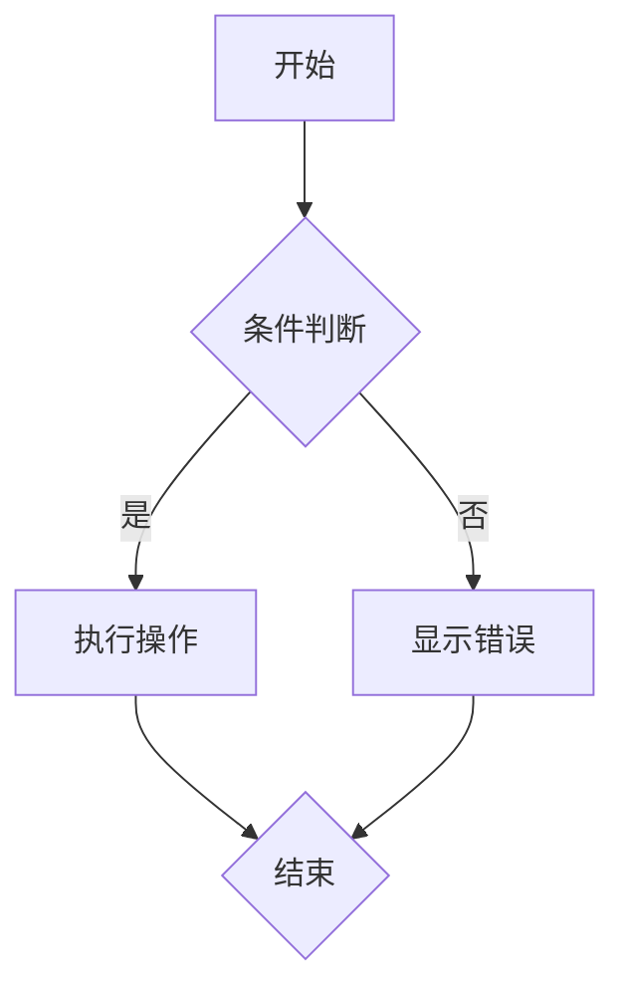
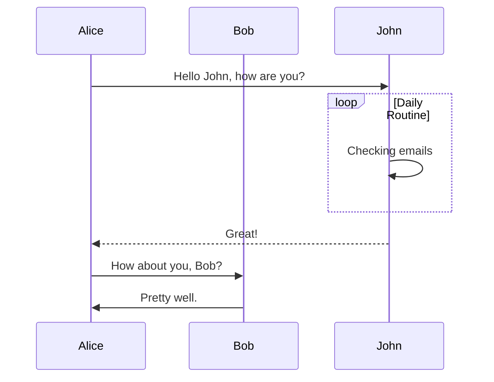

                 

### 引入

# 数学与密码学：加密系统的数学原理

在当今信息时代，信息安全已经成为了社会经济发展的关键。而密码学，作为确保信息安全的重要工具，其核心在于利用数学原理来构建安全的加密系统。数学与密码学之间的紧密联系，使得密码学不仅是一门技术学科，同时也是一门富有挑战性的数学科学。

本文将深入探讨数学与密码学的交集，逐步揭示加密系统的数学原理。文章将分为以下几个部分：首先，我们将对密码学进行概述，了解其起源、基本概念以及在信息安全中的重要性。接下来，我们将介绍数学基础，包括线性代数、算术与数论、概率论等，这些基础数学知识是理解密码学核心概念的重要基石。随后，我们将分别探讨对称密码学和非对称密码学，介绍其基本原理、算法和应用。此外，我们还将讨论杂凑函数与消息认证码，理解它们在保障数据完整性和真实性中的作用。文章还将深入分析密码系统设计原则与分析方法，评估密码系统的安全性。最后，我们将探讨密码学在互联网安全中的应用以及未来的发展趋势。

通过这一系列的探讨，我们将全面了解数学与密码学的内在联系，掌握加密系统的设计原理，为构建更加安全的数字世界奠定基础。

### 密码学的起源与发展

密码学的起源可以追溯到古代，当时人们使用简单的加密方法来保护秘密通信。最早的密码学记录可以追溯到古埃及和古美索不达米亚，当时的密码学主要是基于字符替换和替换字母的简单方法。随着历史的演进，密码学不断发展，技术逐渐复杂化。在古罗马时期，凯撒密码成为了一种广泛使用的加密方法，通过简单的移位变换来保护信息。

进入中世纪，密码学发展进入了一个新的阶段。随着纸张和书写技术的发展，加密方法变得更加复杂。尤其是在文艺复兴时期，欧洲的一些学者和外交使者开始使用复杂的替换密码和多字母替换密码，这些方法在当时被认为是难以破解的。

然而，密码学真正的突破发生在20世纪。1940年代，香农的信息论为密码学提供了新的理论基础，揭示了信息的本质和加密系统的可能性。随后，计算机技术的发展推动了密码学的进一步发展，使现代密码学成为可能。1970年代，DES（数据加密标准）的发布标志着现代对称密码学的正式诞生。同时，RSA（Rivest-Shamir-Adleman）算法的出现为非对称密码学奠定了基础。

在互联网时代，密码学的重要性愈发凸显。随着信息技术的迅猛发展，数据传输和存储的安全问题变得日益复杂和严峻。密码学不仅用于保护敏感信息，如金融交易数据、个人隐私数据和政府机密，还广泛应用于互联网通信、电子商务、网络安全和物联网等多个领域。

当前，密码学的研究和发展依旧在持续进行中。随着量子计算机的兴起，传统的密码学算法可能面临新的挑战。后量子密码学的研究已经开始，旨在找到能够抵御量子计算机攻击的加密算法。同时，密码学与人工智能的结合也为密码学带来了新的机遇和挑战。

综上所述，密码学经历了从古代的简单加密方法到现代复杂加密算法的演变，其发展历程与信息技术的进步密切相关。在现代社会，密码学不仅是信息安全的核心技术，也是保障数字世界稳定运行的重要工具。

### 密码学的基本概念

在探讨加密系统的数学原理之前，了解密码学的基本概念是至关重要的。密码学主要涉及加密（encryption）和解密（decryption）两个过程。加密是指将明文（plaintext）转换成密文（ciphertext）的过程，目的是使未授权者无法读懂信息。而解密则是将密文转换回明文的过程，只有授权者才能成功解密。

加密算法和解密算法是密码学的核心组成部分。加密算法将明文按照一定的规则转换成密文，而解密算法则使用相反的规则将密文还原成明文。根据加密和解密过程中是否使用相同的密钥，可以将加密算法分为对称加密算法（symmetric cryptography）和非对称加密算法（asymmetric cryptography）。

对称加密算法使用相同的密钥进行加密和解密。这意味着加密者和解密者都必须拥有相同的密钥。一个著名的对称加密算法是DES（数据加密标准），它使用56位的密钥来加密数据。然而，由于密钥长度较短，DES 已经不再安全，现代常用的是AES（高级加密标准），它使用128、192或256位的密钥。

非对称加密算法则使用一对密钥：公钥（public key）和私钥（private key）。公钥用于加密，而私钥用于解密。这种算法的一个优点是可以实现安全的密钥交换，无需事先共享密钥。RSA（Rivest-Shamir-Adleman）算法是一个典型的非对称加密算法，它基于大整数分解的困难性。

除了加密算法和解密算法，密钥管理也是密码学中至关重要的部分。密钥的安全性和管理直接影响到加密系统的安全性。常见的密钥管理问题包括密钥生成、存储、分发和更新。为了确保密钥的安全，通常采用加密存储、访问控制和定期更换等方法。

总的来说，密码学的基本概念包括加密、解密、加密算法、解密算法、对称加密和非对称加密等。这些概念不仅是理解加密系统的数学原理的基础，也是构建安全通信系统的重要工具。

### 密码学在信息安全中的重要性

密码学在信息安全中的重要性不可低估。它不仅确保了数据的保密性、完整性和真实性，还为现代通信和数据存储提供了坚实的理论基础。以下是密码学在信息安全中发挥的关键作用：

首先，密码学提供了保障数据保密性的技术手段。通过加密算法，明文数据被转换成密文，只有拥有正确密钥的接收者才能将密文解密成明文。这种机制确保了敏感信息在传输过程中不会被窃取或泄露，从而保护了个人隐私和商业秘密。

其次，密码学确保了数据的完整性。通过使用杂凑函数（hash functions）和消息认证码（message authentication codes），接收者可以验证数据在传输过程中是否被篡改。如果数据在传输过程中被修改，杂凑值或消息认证码将发生变化，接收者可以立即发现并拒绝使用篡改后的数据。

此外，密码学还提供了数据真实性的保障。通过数字签名（digital signatures），发送者可以证明消息的来源和完整性，确保接收者能够确认消息确实来自声称的发送者。这种机制在防止欺诈和伪造方面发挥了重要作用。

在现代通信中，密码学广泛应用于各种安全协议和标准，如SSL/TLS、SSH和PGP。这些协议利用密码学技术来保护网络通信的安全，确保数据在互联网上的传输过程中不被窃听和篡改。

总之，密码学是信息安全不可或缺的基石，通过保障数据的保密性、完整性和真实性，为现代通信和数据存储提供了强有力的安全保护。在数字时代，密码学将继续扮演关键角色，确保信息安全的稳定和可靠。

### 本章小结

本章介绍了密码学的基本概念和发展历程，以及其在信息安全中的重要性。通过回顾密码学的起源，我们了解了从古代简单加密方法到现代复杂加密算法的演变过程。接着，我们深入探讨了密码学的基本概念，包括加密、解密、加密算法、解密算法、对称加密和非对称加密等。最后，我们强调了密码学在保障数据保密性、完整性和真实性方面的关键作用。这些内容为后续章节中详细讨论数学基础和具体加密算法打下了坚实的基础。

### 数学基础

在深入探讨密码学的数学原理之前，我们需要掌握一些基本的数学知识，这些知识不仅是理解密码学概念的基础，也是构建加密系统的关键工具。以下是本章将介绍的三个核心数学基础：线性代数、算术与数论、概率论。

#### 线性代数基础

线性代数是研究向量、矩阵及其运算的数学分支。在密码学中，线性代数用于分析对称加密算法的许多方面。以下是线性代数的一些基本概念：

1. **向量与矩阵**：向量是具有方向的量，而矩阵是一个由数值构成的二维数组。在密码学中，向量用于表示密钥和明文，矩阵则用于实现复杂的加密变换。

2. **线性变换**：线性变换是一个保持向量加法和数乘的基本操作。在密码学中，线性变换可以用来构造复杂的加密函数，使得破解过程更加困难。

3. **矩阵的秩与特征值**：矩阵的秩是矩阵中线性无关行或列的最大数目。特征值是矩阵的一个特殊值，它与矩阵的线性变换有关。在密码学中，特征值可以帮助分析加密算法的稳定性和敏感性。

4. **线性方程组**：线性方程组是由多个线性方程组成的一组方程。求解线性方程组是密码学中常见的任务，特别是在解密过程中。

#### 算术与数论基础

算术与数论是研究整数及其性质的数学分支。在密码学中，算术与数论用于构建非对称加密算法，如RSA算法。以下是算术与数论的一些基本概念：

1. **基本算术运算**：包括加法、减法、乘法和除法。在密码学中，这些基本运算用于生成和操作密钥。

2. **最大公约数与欧几里得算法**：最大公约数是两个整数的最大公约数。欧几里得算法是一种用于计算最大公约数的高效方法。

3. **同余与模运算**：同余是整数除法中的一个概念，用于描述两个整数在模数下的余数关系。模运算是在除法基础上的一种运算，用于生成加密密钥和验证数字签名。

4. **素数与因子分解**：素数是只能被1和自身整除的整数。因子分解是将整数分解为其素数因子的过程。RSA算法基于大整数分解的困难性来确保加密的安全性。

#### 概率论基础

概率论是研究随机事件及其概率的数学分支。在密码学中，概率论用于评估加密算法的安全性和设计密码分析攻击策略。以下是概率论的一些基本概念：

1. **随机事件与概率**：随机事件是在一定条件下可能发生也可能不发生的事件。概率是描述随机事件发生可能性的数值。

2. **条件概率与贝叶斯定理**：条件概率是在已知一个事件发生的情况下，另一个事件发生的概率。贝叶斯定理是一种基于条件概率进行推理的方法，广泛应用于密码分析。

3. **大数定律与中心极限定理**：大数定律描述了随着试验次数的增加，随机变量的分布将趋近于其期望值。中心极限定理则表明，大量随机变量的和将趋近于正态分布。

4. **概率论在密码学中的应用**：概率论用于评估加密算法的安全性，例如，通过计算密钥空间的大小和攻击者的成功概率来判断加密算法的强度。

通过以上对线性代数、算术与数论、概率论的基本概念的介绍，我们为理解密码学中的数学原理奠定了坚实的基础。这些数学工具不仅帮助我们构建复杂的加密算法，还能有效评估和分析现有加密系统的安全性。在后续章节中，我们将应用这些数学知识，深入探讨对称密码学和非对称密码学的基本原理。

### 线性代数基础

线性代数是研究向量、矩阵及其运算的数学分支，它在密码学中有着广泛的应用。以下是线性代数的一些基础概念：

#### 向量和矩阵

向量是一个具有大小和方向的量，通常用粗体字母表示，如 \(\vec{v}\)。向量可以表示为坐标的形式，例如，二维向量 \(\vec{v} = (v_1, v_2)\) 表示在二维空间中的位置。矩阵是一个由数值构成的二维数组，通常用小写字母表示，如 \(A\)。矩阵可以用来表示线性变换，例如，矩阵 \(A\) 可以将向量 \(\vec{v}\) 转换为新的向量 \(A\vec{v}\)。

#### 线性变换

线性变换是一种将一个向量空间映射到另一个向量空间的基本操作，它满足以下性质：

1. **加法性**：对于任意向量 \(\vec{u}\) 和 \(\vec{v}\)，以及标量 \(c\)，有 \(T(\vec{u} + \vec{v}) = T(\vec{u}) + T(\vec{v})\) 和 \(T(c\vec{u}) = cT(\vec{u})\)。

2. **保持线性组合**：对于任意向量 \(\vec{u}_1, \vec{u}_2, ..., \vec{u}_n\) 和标量 \(c_1, c_2, ..., c_n\)，有 \(T(c_1\vec{u}_1 + c_2\vec{u}_2 + ... + c_n\vec{u}_n) = c_1T(\vec{u}_1) + c_2T(\vec{u}_2) + ... + c_nT(\vec{u}_n)\)。

线性变换在密码学中用于描述加密和解密过程中的数据变换，例如，通过矩阵乘法实现的加密算法。

#### 矩阵的秩与特征值

1. **矩阵的秩**：矩阵的秩是矩阵中线性无关行或列的最大数目。秩反映了矩阵的“线性独立度”。在密码学中，矩阵的秩用于评估加密算法的复杂度和破解难度。

2. **特征值与特征向量**：特征值是矩阵的一个特殊值，它使得矩阵与自身的乘积等于一个标量乘以该特征向量。特征向量是特征值对应的向量。在密码学中，特征值和特征向量用于分析矩阵的稳定性和敏感性，这对于加密算法的设计和安全性评估至关重要。

#### 线性方程组

线性方程组是由多个线性方程组成的一组方程，形式为：

\[ 
a_1\vec{x} + b_1\vec{y} = c_1 \\
a_2\vec{x} + b_2\vec{y} = c_2 \\
\vdots \\
a_n\vec{x} + b_n\vec{y} = c_n 
\]

线性方程组的解可以是唯一解、无穷多解或无解。在密码学中，求解线性方程组是解密过程中常见的任务，例如，通过线性方程组求解密钥。

#### 线性代数在密码学中的应用

1. **加密算法**：对称加密算法如AES使用矩阵乘法来实现加密变换。例如，AES密钥扩展过程涉及到大量的矩阵运算。

2. **密码分析**：线性密码分析是一种基于线性变换的密码攻击方法。通过分析密文，攻击者可以试图找到加密算法中的线性关系，从而推导出密钥。

3. **密钥空间**：矩阵的秩可以用来评估加密算法的密钥空间大小。较高的矩阵秩意味着更大的密钥空间，从而提高了加密算法的安全性。

综上所述，线性代数在密码学中有着广泛的应用，不仅用于设计加密算法，还用于密码分析和评估加密系统的安全性。掌握线性代数的基本概念和性质对于理解和应用密码学中的数学原理至关重要。

### 算术与数论基础

算术与数论是密码学中不可或缺的数学工具，用于构建和破解加密算法。以下介绍几个关键的算术与数论基础概念：

#### 基本算术运算

基本算术运算包括加法、减法、乘法和除法。这些运算是所有数值计算的基础。在密码学中，这些运算用于生成密钥、加密和解密数据。例如，RSA算法中的乘法和模运算就是基于这些基本算术运算。

#### 最大公约数与欧几里得算法

最大公约数（GCD）是两个整数的最大公约数。在密码学中，GCD用于计算密钥和验证数字签名。欧几里得算法是一种用于计算最大公约数的高效方法。其基本思想是通过递归方式，不断用较小数去除较大数，直到余数为零。例如：

- 计算 \(gcd(48, 18)\)：

\[ 
48 = 18 \times 2 + 12 \\
18 = 12 \times 1 + 6 \\
12 = 6 \times 2 + 0 \\
\Rightarrow gcd(48, 18) = 6 
\]

#### 同余与模运算

同余是整数除法中的一个概念，用于描述两个整数在模数下的余数关系。形式化地，如果整数 \(a\) 除以正整数 \(m\) 的余数为 \(r\)，则称 \(a\) 和 \(r\) 同余，记为 \(a \equiv r \pmod{m}\)。

模运算是在除法基础上的一种运算，用于生成加密密钥和验证数字签名。例如，计算 \(a\) 除以 \(m\) 的模：

\[ 
c = a \pmod{m} 
\]

其中，\(c\) 是 \(a\) 除以 \(m\) 的余数。

#### 素数与因子分解

素数是只能被1和自身整除的整数，如2、3、5、7等。在密码学中，素数用于生成大整数，这些大整数在加密算法中起到关键作用。

因子分解是将整数分解为其素数因子的过程。例如，分解 \(n = 12\)：

\[ 
12 = 2 \times 2 \times 3 
\]

在RSA算法中，因子分解的困难性是算法安全性的基础。因为找到两个大素数的乘积是相对容易的，但是逆向分解这个乘积以找到原始素数是非常困难的。

#### 算术与数论在密码学中的应用

1. **RSA算法**：RSA算法是基于大整数分解的困难性设计的，它使用两个大素数的乘积作为模，并利用模运算来加密和解密数据。

2. **ECC（椭圆曲线密码学）**：ECC使用椭圆曲线上的离散对数问题来构建加密算法，它提供了与RSA算法相当的强度但使用了更短的密钥。

3. **哈希函数**：哈希函数是一种将任意长度输入映射为固定长度输出的算法，其安全性部分依赖于数论中的碰撞抵抗问题。

4. **数字签名**：数字签名使用数论中的模运算和哈希函数来确保数据的完整性和真实性。

综上所述，算术与数论是密码学中至关重要的数学工具，它们为构建和破解加密算法提供了理论基础。理解这些基本概念对于设计安全的加密系统以及进行有效的密码分析至关重要。

### 概率论基础

概率论是研究随机事件及其概率分布的数学分支，在密码学中具有至关重要的应用。以下是概率论的一些基础概念和其在密码学中的应用：

#### 随机事件与概率

随机事件是指在一定条件下可能发生也可能不发生的事件。概率是描述随机事件发生可能性的数值，通常用 \(P(A)\) 表示事件 \(A\) 的概率。概率的取值范围在0到1之间，其中0表示不可能发生，1表示必然发生。

#### 条件概率与贝叶斯定理

条件概率是指在已知一个事件发生的情况下，另一个事件发生的概率。用 \(P(B|A)\) 表示在事件 \(A\) 发生的条件下事件 \(B\) 的概率。贝叶斯定理是一种基于条件概率进行推理的方法，它可以用来计算在已知部分信息的情况下，某个假设的概率。

贝叶斯定理的公式为：

\[ 
P(A|B) = \frac{P(B|A)P(A)}{P(B)} 
\]

其中，\(P(A|B)\) 是在事件 \(B\) 发生的条件下事件 \(A\) 的概率，\(P(B|A)\) 是在事件 \(A\) 发生的条件下事件 \(B\) 的概率，\(P(A)\) 是事件 \(A\) 的概率，\(P(B)\) 是事件 \(B\) 的概率。

#### 大数定律与中心极限定理

大数定律描述了随着试验次数的增加，随机变量的分布将趋近于其期望值。例如，投掷硬币时，随着投掷次数的增加，正面出现的频率将趋近于0.5。

中心极限定理则表明，大量随机变量的和将趋近于正态分布，即无论原始随机变量的分布如何，其均值的分布总是近似于正态分布。

#### 概率论在密码学中的应用

1. **加密算法的安全性评估**：概率论用于评估加密算法的安全性。例如，通过计算密钥空间的概率分布，可以评估密码系统的抗攻击能力。

2. **密码分析**：概率论用于密码分析，即通过分析密文来推断加密算法的弱点。例如，差分分析和线性密码分析都是基于概率论的方法。

3. **随机数生成**：在密码学中，随机数生成是一个关键问题。概率论提供了生成高质量随机数的方法，这些随机数用于生成密钥和初始化向量。

4. **数字签名**：在数字签名中，概率论用于确保签名的不可伪造性。例如，RSA签名算法使用大素数和模运算，确保签名的唯一性和可靠性。

通过上述概率论基础的应用，我们可以更好地理解和评估密码系统的安全性，为构建安全的加密系统提供数学依据。

### 线性代数在密码学中的应用

线性代数在密码学中扮演着关键角色，为设计复杂的加密算法和进行密码分析提供了强大的工具。以下我们通过几个具体的加密算法，探讨线性代数在这些算法中的应用。

#### DES算法

DES（数据加密标准）是一个早期的对称加密算法，使用了一个56位的密钥。DES的核心在于其迭代结构，每个迭代包括初始置换、替换、置换等步骤。在这些步骤中，线性代数发挥了重要作用。具体来说，DES使用了一个固定的初始置换（IP）和最终的逆置换（IP^-1），这些置换涉及大量的矩阵运算。

例如，初始置换 \(IP\) 可以表示为：

\[ 
IP = \begin{pmatrix} 
58 & 50 & 42 & 34 & 26 & 18 & 10 & 2 \\
60 & 52 & 44 & 36 & 28 & 20 & 12 & 4 \\
62 & 54 & 46 & 38 & 30 & 22 & 14 & 6 \\
64 & 56 & 48 & 40 & 32 & 24 & 16 & 8 \\
57 & 49 & 41 & 33 & 25 & 17 & 9 & 1 \\
59 & 51 & 43 & 35 & 27 & 19 & 11 & 3 \\
63 & 55 & 47 & 39 & 31 & 23 & 15 & 7 \\
65 & 67 & 59 & 51 & 45 & 37 & 29 & 21 
\end{pmatrix} 
\]

通过这些矩阵运算，DES实现了对数据的复杂变换，从而增加了破解的难度。

#### AES算法

AES（高级加密标准）是DES的后继，目前广泛应用于各种信息安全领域。AES采用128位、192位或256位的密钥长度，并且其加密过程基于字节代替和行移位等线性变换。

在AES中，字节代替（SubBytes）操作使用了S-盒，这是一种基于线性变换的复杂函数，通过替换每个字节来增加加密的复杂性。行移位（ShiftRows）和列混淆（MixColumns）操作则通过线性矩阵乘法实现了数据的随机化。

例如，ShiftRows操作可以将状态矩阵中的每一行循环左移一定的位数，而MixColumns操作通过特定的矩阵乘法将每一列进行线性变换。这些操作确保了AES的高效性和安全性。

#### 线性密码分析

线性密码分析是一种基于线性变换的密码攻击方法，通过分析加密算法的线性性质来破解密钥。例如，在DES和AES中，攻击者可以尝试找出加密算法中的线性关系，从而推导出密钥。

线性密码分析的核心是构建线性方程组，并通过这些方程组来求解密钥。线性代数中的矩阵运算和行列式计算是构建和解决这些方程组的关键步骤。

通过上述实例，我们可以看到线性代数在密码学中的广泛应用。无论是设计对称加密算法，还是进行密码分析，线性代数都提供了强大的工具和方法。掌握线性代数的基本概念和运算对于理解和应用密码学中的数学原理至关重要。

### 算术与数论在密码学中的应用

算术与数论在密码学中扮演着至关重要的角色，特别是在构建非对称加密算法如RSA（Rivest-Shamir-Adleman）方面。以下通过RSA算法的原理和具体步骤，详细阐述算术与数论在密码学中的应用。

#### RSA算法原理

RSA算法基于一个大整数分解的难度，其基本原理可以概括为：

1. **选择两个大素数**：选择两个大素数 \(p\) 和 \(q\)，并计算它们的乘积 \(n = p \times q\)。这个乘积 \(n\) 称为模数。

2. **计算欧拉函数 \(\phi(n)\)**：欧拉函数 \(\phi(n)\) 是一个非常重要的参数，它表示小于 \(n\) 的所有正整数中与 \(n\) 互质的数的个数。对于 \(n = p \times q\)，有 \(\phi(n) = (p - 1) \times (q - 1)\)。

3. **选择加密指数 \(e\)**：选择一个与 \(\phi(n)\) 互质的整数 \(e\)，并且 \(1 < e < \phi(n)\)。通常选择一个小的质数作为 \(e\)，如 \(e = 3\) 或 \(e = 65537\)。

4. **计算模逆 \(d\)**：找到 \(d\)，使得 \(d \times e \equiv 1 \pmod{\phi(n)}\)。这可以通过扩展欧几里得算法求解，即找到满足上述条件的 \(d\)。

5. **公开密钥和私钥**：公钥为 \((n, e)\)，私钥为 \((n, d)\)。

#### RSA加密过程

加密过程是将明文 \(m\) 转换为密文 \(c\) 的过程，其公式为：

\[ 
c = m^e \pmod{n} 
\]

接收者使用私钥 \((n, d)\) 将密文 \(c\) 解密为明文 \(m\)，其公式为：

\[ 
m = c^d \pmod{n} 
\]

这两个公式保证了加密和解密过程中的可逆性，即 \(m = c^d \pmod{n} = (m^e)^d \pmod{n} = m^{ed} \pmod{n}\)。由于 \(ed \equiv 1 \pmod{\phi(n)}\)，所以 \(m^{ed} \equiv m^{1} \pmod{n} = m\)。

#### 算术与数论的应用

1. **素数选择**：RSA算法的安全性依赖于大素数的选择。素数的选择是一个数论问题，通过算法如Miller-Rabin素性测试可以高效地判断一个数是否为素数。

2. **模运算**：RSA算法中的模运算对于加密和解密至关重要。模运算是一个基本的算术运算，用于确保加密数据的位数不会因为运算而增长过快。

3. **欧拉函数**：欧拉函数 \(\phi(n)\) 在RSA算法中用于确定模逆 \(d\)。计算欧拉函数是数论中的一个基本问题，通常使用递推公式或预计算方法来求解。

4. **模逆**：模逆 \(d\) 的求解是RSA算法的核心，通过扩展欧几里得算法可以找到满足 \(d \times e \equiv 1 \pmod{\phi(n)}\) 的 \(d\)。

通过上述对RSA算法原理和步骤的详细解释，我们可以看到算术与数论在密码学中的应用。理解这些数学基础对于设计和分析非对称加密算法具有重要意义，同时也为保障现代信息安全提供了坚实的理论基础。

### 杂凑函数的基本概念

杂凑函数（Hash Function），也称为散列函数，是密码学中一种重要的工具，用于将任意长度的输入（即“消息”）转换成固定长度的输出（即“杂凑值”或“哈希值”）。这种转换过程称为杂凑。杂凑函数在加密系统中具有广泛的应用，如数据完整性验证、数字签名和密码学协议等。

#### 杂凑函数的核心特性

1. **固定输出长度**：任何长度的输入都会被映射为固定长度的输出。例如，MD5和SHA-256分别输出128位和256位的杂凑值。

2. **单向性**：杂凑函数是单向的，即从杂凑值无法推导出原始输入。这意味着即使知道杂凑值，也无法逆向计算原始消息。

3. **抗碰撞性**：杂凑函数应具有高抗碰撞性，即不同输入产生相同杂凑值的概率非常低。如果发生碰撞（即两个不同的输入产生相同的杂凑值），则会导致严重的安全问题。

4. **抗第二预图像攻击**：杂凑函数应难以通过已知杂凑值来生成特定的输入。

5. **抗冲突攻击**：杂凑函数应难以通过计算找到两个具有相同杂凑值的输入。

#### 杂凑函数的分类

根据杂凑函数的设计方式和应用场景，可以将其分为以下几类：

1. **数据完整性杂凑函数**：这类函数主要用于验证数据在传输或存储过程中是否被篡改。例如，MD5和SHA-1。

2. **数字签名杂凑函数**：这类函数用于生成数字签名，确保数据的完整性和真实性。例如，SHA-256常用于ECDSA（椭圆曲线数字签名算法）。

3. **伪随机数生成器**：这类函数用于生成伪随机数，其输出可用于加密算法的初始化或密钥生成。例如，SHA-3。

#### 常见的杂凑函数

以下是一些常见的杂凑函数及其特性：

1. **MD5**：MD5是一个广泛使用的杂凑函数，输出128位的杂凑值。尽管其抗碰撞性较差，但因其速度快，仍在某些领域得到应用。

2. **SHA-1**：SHA-1是另一个广泛使用的杂凑函数，输出160位的杂凑值。然而，由于安全性问题，其使用已被逐渐淘汰。

3. **SHA-256**：SHA-256是SHA系列的改进版本，输出256位的杂凑值。由于其抗碰撞性和安全性较好，广泛用于数字签名和区块链技术。

4. **SHA-3**：SHA-3是NIST（美国国家标准与技术研究院）于2015年发布的杂凑标准，其设计考虑了安全性、速度和灵活性，具有多种长度选项（如224、256、384和512位）。

5. **BLAKE2**：BLAKE2是一种快速且安全的杂凑函数，适合在资源受限的系统中使用。

综上所述，杂凑函数在密码学中扮演着重要角色，其基本概念和分类有助于我们理解其在确保数据完整性、真实性和安全中的作用。随着密码学的发展，新的杂凑函数将继续被研究和应用，以满足不断增长的安全需求。

### 杂凑函数的安全性

杂凑函数的安全性是确保其有效应用的关键因素，主要包括抗碰撞性、抗第二预图像攻击和抗冲突攻击。以下是这些安全特性的详细解释和它们在杂凑函数中的应用。

#### 抗碰撞性

抗碰撞性是指杂凑函数应使得找到两个不同输入但具有相同杂凑值的概率极低。抗碰撞性的重要性在于，如果存在有效的碰撞攻击方法，攻击者可以生成任意两个相同杂凑值的消息，这会导致严重的安全问题，例如双重签名攻击。

一个理想的杂凑函数应该满足以下条件：

- **低碰撞概率**：对于任意两个不同的输入 \(m_1\) 和 \(m_2\)，有 \(P(H(m_1) = H(m_2)) \approx 2^{-k}\)，其中 \(k\) 是杂凑函数的输出长度。
- **抗暴力攻击**：即使攻击者知道杂凑函数的具体实现，也难以通过穷举搜索找到两个有效碰撞。

常见的抗碰撞攻击方法包括：

- **蛮力攻击**：通过尝试不同的输入找到两个相同杂凑值的输入，这种攻击方法的时间复杂度随着杂凑函数的输出长度增加而急剧增加。
- **生日攻击**：当杂凑函数的输出长度小于或接近 \(2^n\) 时，攻击者可以通过尝试 \(2^{n/2}\) 个输入来找到碰撞，这种方法的复杂度为 \(2^{n/2}\)。

#### 抗第二预图像攻击

抗第二预图像攻击（Second Preimage Attack）是指杂凑函数应难以找到两个不同的输入，使得它们的杂凑值相同。即给定一个杂凑值 \(h\)，找到另一个输入 \(m'\) 使得 \(H(m') = h\)。

为了实现抗第二预图像攻击，杂凑函数应满足以下条件：

- **高计算复杂度**：找到第二个预图像的计算复杂度应远高于生成单一预图像的复杂度。
- **不可逆性**：杂凑函数的单向性确保了找到第二预图像的难度。

#### 抗冲突攻击

抗冲突攻击（Collision Attack）是指攻击者找到两个不同的输入，使得它们的杂凑值相同。冲突攻击可以用于多种攻击场景，如双重签名攻击和拒绝服务攻击。

为了防止冲突攻击，杂凑函数应具备以下特性：

- **低冲突概率**：理想情况下，冲突的概率应该接近零。
- **快速计算**：杂凑函数应能够快速计算，以应对可能的冲突攻击。

常见的冲突攻击方法包括：

- **选择预图像攻击**：攻击者选择一个特定的预图像，然后寻找另一个输入使其与预图像的杂凑值相同。
- **蛮力攻击**：尝试不同的输入，直到找到两个具有相同杂凑值的输入。

为了提高杂凑函数的安全性，研究人员提出了多种改进方法，如引入随机化元素、使用压缩函数和多轮迭代等。这些方法可以显著提高杂凑函数的抗攻击能力。

综上所述，杂凑函数的安全性依赖于其抗碰撞性、抗第二预图像攻击和抗冲突攻击的能力。通过设计高效且安全的杂凑函数，我们可以确保数据完整性、真实性和数字签名的可靠性。随着密码学技术的不断发展，杂凑函数将继续在确保信息安全的各个领域发挥重要作用。

### 常见的杂凑函数

杂凑函数在密码学中扮演着至关重要的角色，其设计直接影响系统的安全性和效率。以下是几种常见的杂凑函数，包括MD5、SHA-1和SHA-256等，详细说明它们的特点和应用。

#### MD5

MD5是一种广泛使用的杂凑函数，由Ron Rivest在1991年设计。它将任意长度的输入映射为128位的输出。MD5的优点在于其计算速度快，但由于其抗碰撞性较差，现代密码学已不再推荐使用。MD5的主要应用场景包括文件校验和快速杂凑计算。尽管MD5的安全性较低，但其在某些非安全性要求较高的场合，如软件版本校验和临时文件验证中仍有应用。

#### SHA-1

SHA-1是由NIST（美国国家标准与技术研究院）在1995年发布的一种杂凑函数，用于替换MD5。SHA-1将输入映射为160位的输出。尽管SHA-1在早期的应用中得到了广泛认可，但由于其存在安全漏洞，如碰撞攻击，NIST已在2010年发布通知，建议用户逐步停止使用SHA-1。SHA-1的主要应用包括数字签名、域名系统（DNS）安全性和电子邮件加密。然而，由于安全性的限制，SHA-1已经逐渐被其改进版本SHA-256所取代。

#### SHA-256

SHA-256是SHA系列的改进版本，由NIST于2001年发布。它将输入映射为256位的输出，是目前广泛使用的杂凑函数之一。SHA-256具有强大的抗碰撞性和抗攻击能力，适用于多种安全场景，如数字签名、区块链技术和数据完整性验证。SHA-256在比特币等加密货币系统中得到广泛应用，确保交易记录的不可篡改性。

#### SHA-3

SHA-3是NIST于2015年发布的第三代SHA杂凑函数标准，它提供了多种长度选项，包括224、256、384和512位。SHA-3的设计考虑了安全性、速度和灵活性，旨在应对未来的安全挑战。与SHA-256相比，SHA-3在算法设计上引入了更多的随机化元素，以提高其抗碰撞性和安全性。SHA-3适用于需要高安全性和灵活性的场景，如安全协议和安全存储。

#### BLAKE2

BLAKE2是由Blake团队设计的一种快速且安全的杂凑函数。它提供了多种长度选项和配置选项，适用于不同的应用场景。BLAKE2在性能和安全性方面表现出色，适合在资源受限的环境中应用，如嵌入式系统和物联网设备。BLAKE2被广泛用于文件校验、数据加密和密码学协议。

综上所述，MD5、SHA-1、SHA-256、SHA-3和BLAKE2是几种常见的杂凑函数，各具特点和优势。随着密码学技术的不断发展，新的杂凑函数将继续被提出和采用，以满足不断增长的安全需求。

### 消息认证码的基本概念

消息认证码（Message Authentication Code，MAC）是一种用于验证消息完整性和真实性的算法，通过对消息和密钥进行计算得到一个固定长度的值，称为认证码（Tag）。MAC在加密系统中起着至关重要的作用，确保数据在传输过程中未被篡改，且发送者和接收者身份可验证。

#### MAC的核心组成部分

1. **密钥**：MAC算法需要一个共享密钥，这个密钥由发送者和接收者事先协商或生成。

2. **算法**：MAC算法将消息和密钥作为输入，生成一个固定长度的认证码。

3. **认证码**：认证码是一个唯一的值，用于验证消息的完整性和真实性。

#### 常见的MAC算法

1. **HMAC**（Hash-based Message Authentication Code）：HMAC是一种基于哈希函数的MAC算法，使用一个密钥对消息进行哈希计算。它结合了哈希函数的快速计算能力和MAC的安全性。

2. **CMAC**（Cipher-based Message Authentication Code）：CMAC是一种基于对称加密算法的MAC算法，它通过加密函数计算消息的认证码。

3. **MAC-AES**：MAC-AES是一种基于AES（高级加密标准）的MAC算法，利用AES的块加密功能来生成认证码。

#### MAC的工作原理

1. **生成认证码**：发送者使用MAC算法和共享密钥对消息进行计算，生成认证码。发送者将消息和认证码一起发送给接收者。

2. **验证认证码**：接收者使用相同的MAC算法和共享密钥对接收到的消息进行计算，生成一个新的认证码。接收者将新认证码与发送者发送的认证码进行比较。

3. **认证**：如果两个认证码相同，则消息被认为是完整且未被篡改的。否则，消息被认为是不完整或被篡改的。

#### MAC在加密系统中的作用

- **确保消息完整性**：MAC可以检测消息在传输过程中是否被修改。如果认证码不一致，则表明消息可能被篡改。

- **验证发送者身份**：通过使用数字签名和MAC结合的方式，可以验证消息的发送者身份。接收者可以确认消息确实来自声称的发送者。

- **保护数据真实性**：MAC提供了数据源的真实性保证，防止伪造和篡改。

- **支持密钥管理**：MAC算法通常用于密钥协商和密钥管理，确保密钥的安全性和完整性。

综上所述，消息认证码是确保加密系统安全性的重要组成部分。通过使用MAC算法，我们可以有效验证消息的完整性和真实性，增强加密系统的整体安全性。

### 常见消息认证码算法

在密码学中，消息认证码（MAC）用于确保数据的完整性和真实性。以下是几种常见的消息认证码算法，包括HMAC、CMAC和MAC-AES，详细说明它们的工作原理和优点。

#### HMAC

HMAC（Hash-based Message Authentication Code）是一种基于哈希函数的MAC算法，由NIST于2001年发布。HMAC结合了哈希函数和加密技术，确保了高安全性。其工作原理如下：

1. **密钥扩展**：HMAC首先将共享密钥 \(k\) 扩展为两个密钥 \(k\_ipad\)（内垫密钥）和 \(k\_opad\)（外垫密钥）。内垫密钥和密钥异或运算后填充到块大小，外垫密钥同样处理，但填充后的块全部设置为0x01。

2. **消息处理**：将填充后的内垫密钥和消息 \(m\) 连接，通过哈希函数 \(H\) 计算得到 \(H(k\_ipad \oplus m)\)。

3. **生成认证码**：将填充后的外垫密钥和哈希值连接，再次通过哈希函数 \(H\) 计算得到最终的认证码 \(MAC = H(k\_opad \oplus H(k\_ipad \oplus m))\)。

HMAC的优点包括：
- **高效性**：由于使用哈希函数，计算速度快。
- **灵活性**：支持多种哈希函数，如SHA-256、SHA-3等。
- **高安全性**：利用加密技术，抵抗生日攻击和碰撞攻击。

#### CMAC

CMAC（Cipher-based Message Authentication Code）是一种基于分组密码（如AES）的MAC算法。CMAC通过将密钥作为加密算法的一部分来生成认证码，具体步骤如下：

1. **初始化**：将密钥 \(k\) 填充到块大小，得到 \(k\_0\)。

2. **消息分段**：将消息 \(m\) 分成多个块，每个块记为 \(m_i\)。

3. **加密过程**：
   - 对于第一个块 \(m_1\)，计算 \(C_1 = E_k(m_1) \oplus k_0\)。
   - 对于后续块 \(m_i\)（\(i > 1\)），计算 \(C_i = E_k(C_{i-1} \oplus m_i) \oplus C_{i-1}\)。

4. **生成认证码**：最终的认证码为 \(C = C_n \oplus C_{n-1} \oplus ... \oplus C_1\)。

CMAC的优点包括：
- **高效性**：直接利用分组密码，计算速度快。
- **简单性**：计算过程简单，易于实现。
- **灵活性**：支持多种分组密码算法。

#### MAC-AES

MAC-AES是一种基于AES的MAC算法，也称为AES-MAC。其工作原理如下：

1. **初始化**：将密钥 \(k\) 扩展为AES的子密钥，初始状态为 \(T_0 = k_0\)。

2. **消息分段**：将消息 \(m\) 分成多个块，每个块记为 \(m_i\)。

3. **加密过程**：
   - 对于第一个块 \(m_1\)，计算 \(T_1 = AES(k_1, T_0 \oplus m_1)\)。
   - 对于后续块 \(m_i\)（\(i > 1\)），计算 \(T_i = AES(k_i, T_{i-1} \oplus m_i)\)。

4. **生成认证码**：最终的认证码为 \(MAC = T_n \oplus T_{n-1} \oplus ... \oplus T_1\)。

MAC-AES的优点包括：
- **高安全性**：基于AES的高强度加密。
- **灵活性**：支持多种密钥长度和消息长度。

综上所述，HMAC、CMAC和MAC-AES是几种常见的消息认证码算法，各具特点和优势。根据具体应用场景，选择适合的MAC算法可以确保数据在传输过程中的完整性和真实性。

### 密码系统设计原则

密码系统的设计原则是确保加密系统安全性和有效性的关键。以下是几个核心的设计原则：

#### 保密性

保密性是指确保加密数据不被未授权者解密。实现保密性的关键在于加密算法和密钥的安全。常用的措施包括：

- **使用强加密算法**：选择抗攻击能力强的加密算法，如AES、RSA等。
- **密钥管理**：确保密钥的安全存储和传输，采用加密存储和密钥交换协议。

#### 完整性

完整性是指确保加密数据在传输或存储过程中未被篡改。实现完整性的关键在于验证数据的完整性，通常使用以下技术：

- **杂凑函数**：使用如MD5、SHA-256等杂凑函数生成杂凑值，并与接收方的计算结果进行对比。
- **消息认证码（MAC）**：如HMAC、CMAC等，结合加密算法和哈希函数，生成认证码来验证数据的完整性。

#### 可用性

可用性是指确保加密系统在正常情况下能够正常运行。实现可用性的措施包括：

- **抵抗拒绝服务攻击**：设计系统以抵抗拒绝服务（DoS）攻击，确保系统在遭受攻击时仍能提供服务。
- **快速响应**：优化系统性能，确保加密和解密操作高效。

#### 身份认证

身份认证是指确保通信双方的身份验证。实现身份认证的关键在于：

- **数字签名**：使用数字签名确保消息的来源和完整性，如RSA签名、ECDSA等。
- **身份认证协议**：如Kerberos、SSL/TLS等，确保通信双方的身份验证。

#### 抗否认性

否认性是指防止通信双方在事后否认其行为。实现否认性的措施包括：

- **数字签名**：确保双方在传输过程中无法事后否认其发送的消息。
- **日志记录**：记录所有加密操作和通信日志，以便事后审计和追踪。

#### 可扩展性

可扩展性是指系统能够适应未来变化和扩展需求。实现可扩展性的关键包括：

- **模块化设计**：将系统设计为模块化，方便未来添加新功能或更换组件。
- **标准化**：遵循国际标准和规范，确保系统兼容性和互操作性。

综上所述，密码系统的设计原则包括保密性、完整性、可用性、身份认证、否认性和可扩展性。遵循这些原则可以确保加密系统的安全、可靠和高效运行。

### 密码分析的基本方法

密码分析是研究如何破解加密算法和解密密文的方法。以下是几种常见的密码分析基本方法，包括统计分析、差分分析和线性密码分析。

#### 统计分析

统计分析是基于统计方法来分析密文，找出加密算法中的规律。这种方法通常利用密文的频率分布和模式来推断加密密钥和明文。

1. **频率攻击**：通过分析密文中字符或位的频率分布，试图推断出加密密钥或明文。例如，对于英文文本，字母‘E’出现的频率最高。

2. **选择明文攻击**：攻击者选择特定的明文进行加密，然后通过分析加密后的密文来推断加密算法的弱点。

3. **已知明文攻击**：攻击者拥有一些明文和相应的密文，通过分析这些已知明文和密文的关系来破解加密算法。

#### 差分分析

差分分析是一种基于密文差异来推断密钥的密码分析方法。这种方法通过比较加密前后明文和密文的变化，找出加密算法中的线性关系。

1. **单向差分分析**：分析单个密文块的变化，找出加密算法中的线性变换。

2. **双向差分分析**：同时分析两个连续密文块的变化，找出加密算法中的非线性关系。

3. **高阶差分分析**：分析多个密文块之间的差异，找到更高阶的线性关系。

#### 线性密码分析

线性密码分析是基于线性代数的密码分析方法，通过构建线性方程组来推断加密密钥。

1. **线性逼近**：通过分析多个密文块之间的线性关系，逼近加密密钥。

2. **高斯消元法**：使用高斯消元法求解线性方程组，从而推导出加密密钥。

3. **高维线性密码分析**：在多个密文块中寻找更高维的线性关系，提高破解效率。

#### 模糊分析和代数攻击

模糊分析是一种通过模糊逻辑来分析加密算法的方法，它利用加密算法中的不确定性来推断密钥。

代数攻击是基于代数方法对加密算法进行分析，通过构造数学模型和求解方程组来推导出密钥。

综上所述，密码分析的方法多种多样，每种方法都有其特定的应用场景和破解目标。通过合理运用这些分析方法，攻击者可以逐步破解加密算法，威胁加密系统的安全性。因此，了解这些分析方法对于设计和评估密码系统的安全性至关重要。

### 密码系统的安全性评估

密码系统的安全性评估是一个复杂且重要的过程，其目标是通过多种评估方法和工具，确定密码系统的安全性和有效性。以下是几种常见的评估方法，以及如何评估密码系统的安全性。

#### 常见评估方法

1. **数学模型分析**：通过数学模型分析密码系统的算法和加密过程，评估其抗攻击能力和安全性。例如，分析加密算法的密钥空间大小、计算复杂度和抗碰撞性。

2. **实战攻击测试**：通过模拟实际攻击场景，测试密码系统的实际抗攻击能力。常见的实战攻击包括蛮力攻击、差分攻击和线性密码分析等。

3. **漏洞扫描**：使用自动化工具对密码系统进行漏洞扫描，查找潜在的安全漏洞。例如，检查密码存储方式、密钥管理策略和加密协议的合规性。

4. **审计和审查**：聘请专业的安全团队对密码系统进行审计和审查，评估系统的安全设计和实现过程。审计内容包括代码审查、架构审查和风险管理等。

#### 评估密码系统安全性的步骤

1. **确定评估目标和范围**：明确密码系统的安全需求和评估范围，例如保护的数据类型、所需的加密强度和抗攻击能力。

2. **收集系统信息**：收集密码系统的详细信息，包括加密算法、密钥管理策略、加密协议和安全配置等。

3. **构建评估模型**：根据评估目标和系统信息，构建数学模型和安全评估模型，用于分析密码系统的安全性和抗攻击能力。

4. **执行攻击测试**：通过模拟实际攻击场景，执行各种攻击测试，如蛮力攻击、差分攻击和漏洞扫描等，记录攻击结果。

5. **分析攻击结果**：分析攻击测试的结果，确定密码系统的安全漏洞和弱点。根据攻击结果调整加密算法、密钥管理和安全配置等。

6. **制定改进措施**：根据分析结果，制定改进措施，如更新加密算法、加强密钥管理和优化系统配置等，以提高密码系统的安全性。

7. **定期评估**：密码系统的安全性评估是一个持续的过程。定期进行评估，以应对新的安全威胁和攻击方法。

综上所述，通过数学模型分析、实战攻击测试、漏洞扫描、审计和审查等方法，可以全面评估密码系统的安全性。定期进行评估和改进，确保密码系统在动态变化的安全环境中保持高度的安全性。

### 第6章：密码系统设计的实际案例

在本章中，我们将探讨一个实际密码系统设计的案例——基于AES和RSA的邮件加密系统。该系统旨在提供安全可靠的邮件传输和存储解决方案，防止邮件内容被未授权者访问和篡改。以下是该密码系统设计的详细步骤和具体实现。

#### 1. 项目介绍

**项目名称**：SecureMail——安全邮件系统

**目标**：提供安全的邮件传输和存储功能，确保邮件内容在传输过程中不被窃听和篡改，同时保护邮件发送者和接收者的身份。

**功能**：
- **加密邮件内容**：使用AES算法加密邮件正文，确保邮件内容在传输和存储过程中保持保密性。
- **数字签名**：使用RSA算法为邮件生成数字签名，验证邮件的真实性和完整性。
- **密钥管理**：采用安全的密钥管理机制，保护加密密钥和签名密钥。

#### 2. 系统功能设计（领域模型）

为了清晰描述系统功能，我们使用领域模型来表示系统的主要组件和交互关系。

**领域模型：SecureMail**

- **组件**：
  - **用户**：发送邮件和接收邮件的用户。
  - **邮件服务器**：存储和管理邮件，提供邮件加密和解密服务。
  - **加密模块**：实现邮件内容的加密和解密。
  - **签名模块**：实现邮件数字签名和验证。
  - **密钥管理器**：管理加密和签名密钥。

- **交互关系**：
  - 用户发送邮件时，邮件内容被加密模块加密，签名模块生成数字签名，然后邮件被发送到邮件服务器。
  - 用户接收邮件时，邮件服务器解密邮件内容，签名模块验证数字签名，确保邮件的完整性和真实性。

#### 3. 系统架构设计

系统架构设计包括确定系统组件的分布和通信方式，以下是SecureMail系统的架构设计。

**架构设计：SecureMail**

- **组件分布**：
  - **客户端**：安装在用户设备上，负责生成和发送邮件。
  - **邮件服务器**：部署在云端，存储和管理邮件。
  - **加密服务**：独立的服务器或容器，提供加密和解密功能。
  - **签名服务**：独立的服务器或容器，提供签名和验证功能。

- **通信方式**：
  - 客户端与加密服务和签名服务通过安全套接字层（SSL）进行加密通信。
  - 邮件服务器与加密服务和签名服务通过内部通信协议进行数据交换。

#### 4. 系统接口设计

系统接口设计包括定义客户端和服务器之间的接口，以下是SecureMail系统的接口设计。

**接口设计：SecureMail**

- **客户端接口**：
  - **发送邮件**：接收用户输入的邮件内容和接收者地址，调用加密模块和签名模块进行加密和签名，然后将加密后的邮件发送到邮件服务器。
  - **接收邮件**：从邮件服务器接收加密邮件，调用解密模块和签名验证模块进行解密和验证，然后将解密后的邮件展示给用户。

- **服务器接口**：
  - **存储邮件**：接收客户端发送的加密邮件，存储在邮件服务器中。
  - **提供邮件**：响应用户的邮件请求，提供存储在邮件服务器中的加密邮件。

#### 5. 系统交互设计

系统交互设计描述客户端和服务器之间的通信过程，以下是SecureMail系统的交互设计。

**交互设计：SecureMail**

1. **发送邮件**：
   - 用户输入邮件内容和接收者地址。
   - 客户端调用加密模块，使用AES算法对邮件内容进行加密。
   - 客户端调用签名模块，使用RSA算法为邮件生成数字签名。
   - 客户端将加密邮件和数字签名发送到邮件服务器。

2. **接收邮件**：
   - 用户请求查看邮件。
   - 邮件服务器提供加密邮件。
   - 客户端调用解密模块，使用AES算法解密邮件内容。
   - 客户端调用签名验证模块，验证邮件的数字签名。

#### 6. 系统实现与实战分析

以下是一个简化的Python代码实现，用于演示邮件加密和解密的过程。

```python
from Crypto.PublicKey import RSA
from Crypto.Cipher import AES, PKCS1_OAEP
from Crypto.Random import get_random_bytes

# RSA密钥生成
private_key = RSA.generate(2048)
public_key = private_key.publickey()

# AES密钥生成
aes_key = get_random_bytes(16)

# 使用RSA加密AES密钥
cipher_rsa = PKCS1_OAEP.new(public_key)
enc_aes_key = cipher_rsa.encrypt(aes_key)

# 使用AES加密邮件内容
cipher_aes = AES.new(aes_key, AES.MODE_CBC)
pad = 16 - (len(plaintext) % 16)
plaintext += bytes([pad]) * pad
cipher_text = cipher_aes.encrypt(plaintext)

# 发送加密邮件内容和解密AES密钥
send_mail(enc_aes_key, cipher_text)

# 接收邮件内容和解密AES密钥
received_enc_aes_key, received_cipher_text = receive_mail()

# 使用RSA解密AES密钥
cipher_rsa = PKCS1_OAEP.new(private_key)
dec_aes_key = cipher_rsa.decrypt(received_enc_aes_key)

# 使用AES解密邮件内容
cipher_aes = AES.new(dec_aes_key, AES.MODE_CBC, iv)
plaintext = cipher_aes.decrypt(received_cipher_text).strip(b'pad')
```

#### 7. 项目小结

通过本案例，我们详细介绍了基于AES和RSA的邮件加密系统的设计、实现和实战应用。该项目利用对称加密和非对称加密的优势，提供了安全可靠的邮件传输和存储解决方案，有效防止了邮件内容泄露和篡改。未来改进方向包括优化加密和解密性能、引入更先进的加密算法和密钥管理机制，以满足不断增长的安全需求。

### 密码学在互联网安全中的应用

密码学在互联网安全中扮演了至关重要的角色，其应用贯穿于互联网的各个方面，包括传输层、应用层和数据存储层。以下是密码学在互联网安全中的几个关键应用场景。

#### SSL/TLS协议

SSL/TLS（Secure Sockets Layer/Transport Layer Security）是保障互联网通信安全的重要协议。SSL/TLS通过在客户端和服务器之间建立加密连接，确保数据的机密性、完整性和身份认证。其工作原理如下：

1. **握手协议**：客户端和服务器通过握手协议协商加密算法和密钥，验证对方身份。
2. **加密通信**：一旦握手成功，客户端和服务器之间的通信数据将加密传输，防止窃听和篡改。
3. **证书验证**：SSL/TLS使用数字证书验证服务器身份，确保通信对方是合法的服务器。

#### PGP/GPG加密邮件

PGP（Pretty Good Privacy）/GPG（GNU Privacy Guard）是一种广泛使用的邮件加密工具，它利用非对称加密（如RSA）来加密邮件内容，并使用对称加密（如AES）来提高加密效率。PGP/GPG的应用流程如下：

1. **密钥生成**：用户生成公钥和私钥，公钥用于加密邮件内容，私钥用于解密邮件内容。
2. **邮件加密**：发送者使用接收者的公钥加密邮件内容，并附加自己的数字签名。
3. **邮件解密**：接收者使用自己的私钥解密邮件内容，并验证发送者的数字签名。

#### 加密货币

加密货币如比特币利用密码学技术确保交易的安全性和匿名性。比特币的加密机制主要包括：

1. **数字签名**：交易发送者使用私钥对交易进行签名，确保交易是发送者发起的。
2. **区块链**：所有交易记录存储在区块链上，通过密码学技术确保数据的完整性和不可篡改性。
3. **去中心化**：比特币网络去中心化，通过共识算法（如工作量证明）确保网络的安全和稳定。

#### 数据存储加密

数据存储加密是保护静态数据的安全措施，确保存储在磁盘或云服务器上的数据不会被未授权者访问。常见的存储加密技术包括：

1. **全盘加密**：对整个硬盘进行加密，确保数据在存储和传输过程中始终加密。
2. **文件加密**：对特定文件或文件夹进行加密，提高数据的安全性。
3. **数据库加密**：对数据库中的敏感数据进行加密，防止数据泄露。

#### 网络设备安全

密码学技术还应用于网络设备的安全管理，如路由器、交换机和防火墙。通过加密配置文件、管理密钥和认证过程，确保网络设备的配置和管理过程安全可靠。

综上所述，密码学在互联网安全中具有广泛的应用，通过SSL/TLS、PGP/GPG、加密货币和数据存储加密等多种技术，保障了互联网通信和数据的安全性和完整性。随着密码学技术的不断发展，其应用将继续扩展，为构建更加安全的数字世界提供有力支持。

### 密码学的未来发展趋势

随着科技的不断进步，密码学也面临着新的挑战和机遇。未来密码学的发展趋势将主要集中在以下几个方面：

#### 后量子密码学的兴起

量子计算的出现为传统密码学带来了巨大的威胁，因为许多现有的加密算法，如RSA和ECC，基于大整数分解和椭圆曲线离散对数的难度，而量子计算机能够迅速破解这些算法。因此，后量子密码学（Post-Quantum Cryptography，PQC）的研究和应用成为热点。PQC旨在设计能够抵御量子计算攻击的加密算法，如基于格理论、同余交错组合和哈希函数的新型加密算法。

#### 密码学与人工智能的结合

人工智能（AI）在密码学中的应用也正在迅速发展。AI可以用于优化密码算法、提高密码分析的效率和改进密码系统的设计。例如，使用AI进行密码分析可以更快速地识别加密算法中的弱点，从而进行改进。同时，AI还可以用于加密算法的自动化设计和优化，使得密码系统的设计更加高效和鲁棒。

#### 新兴应用领域的挑战

随着物联网（IoT）、云计算和区块链等新兴技术的崛起，密码学也需要应对这些领域带来的新挑战。例如，物联网设备通常资源有限，需要高效且轻量级的加密算法；云计算环境中，数据的安全性依赖于密钥管理和加密技术的可靠性；区块链技术则需要确保交易的完整性和不可篡改性。

#### 标准化和国际合作

密码学的未来还需要进一步加强标准化和国际合作。随着全球化的推进，不同国家和地区之间的数据传输和业务合作日益增加，这要求密码技术具备广泛的互操作性和兼容性。国际标准化组织（如ISO、IEEE）和国家标准化机构（如NIST、CC）将在未来继续制定和推广密码学标准，以确保全球范围内的密码系统安全。

#### 面向未来的研究方向

未来的密码学研究将继续关注以下方向：

1. **量子安全通信**：研究如何实现量子通信中的加密安全，如量子密钥分发（Quantum Key Distribution，QKD）。
2. **多方计算和隐私保护**：研究如何在不泄露隐私信息的情况下实现多方计算，保护个人数据的安全。
3. **动态加密**：研究如何动态调整加密算法和密钥，以应对不断变化的安全威胁。
4. **物联网安全**：研究针对物联网设备的轻量级加密算法和安全性设计。

总之，密码学在未来的发展中将不断应对新的技术挑战，推动密码技术的创新和应用，为构建更加安全的数字世界提供坚实的理论基础和技术保障。

### 总结与展望

本文从多个角度深入探讨了数学与密码学的紧密联系，通过详细分析密码学的基本概念、数学基础、对称密码学、非对称密码学、杂凑函数和消息认证码，再到密码系统设计原则、密码分析方法和互联网安全中的应用，全面展示了密码学在保障信息安全中的关键作用。从古代的简单加密方法到现代复杂的加密算法，密码学的发展历程充分体现了数学在其中的核心地位。

展望未来，密码学将继续在保障信息安全、推动技术创新和应对新挑战方面发挥重要作用。后量子密码学的兴起、密码学与人工智能的融合、物联网安全的新需求，以及全球范围内的标准化和国际合作，都是未来密码学研究的重要方向。通过不断探索和创新，密码学将为构建更加安全的数字世界提供坚实的理论基础和强大技术支持。

### 附录A：常用密码学算法与工具

在密码学中，常用的算法和工具包括对称加密算法、非对称加密算法、哈希函数和消息认证码。以下是这些算法和工具的基本介绍及其应用场景：

#### 对称加密算法

1. **AES（高级加密标准）**：AES是一种广泛使用的对称加密算法，支持128、192和256位的密钥长度。它采用字节代替、行移位和列混淆等操作来加密数据。AES在SSL/TLS、无线通信和文件加密中应用广泛。

2. **DES（数据加密标准）**：DES是最早的对称加密算法之一，但由于其密钥长度较短，已不再安全。DES的替代品是3DES和AES。

3. **RSA**：RSA是一种非对称加密算法，基于大整数分解的难度。RSA主要用于加密通信中的密钥交换和数字签名。

#### 非对称加密算法

1. **ECC（椭圆曲线密码学）**：ECC基于椭圆曲线离散对数问题，提供与RSA相当的强度但使用了更短的密钥。ECC在数字签名和加密通信中应用广泛。

2. **RSA**：RSA是一种非对称加密算法，广泛用于加密通信中的密钥交换和数字签名。

#### 哈希函数

1. **SHA-256**：SHA-256是一种安全哈希函数，用于生成256位的杂凑值。SHA-256广泛应用于数字签名、密码学协议和文件完整性验证。

2. **MD5**：MD5是一种快速但安全性较低的哈希函数，其输出128位。尽管MD5存在安全漏洞，但仍在某些应用中使用。

#### 消息认证码（MAC）

1. **HMAC**：HMAC是一种基于哈希函数的安全MAC算法，用于验证数据的完整性和真实性。HMAC支持多种哈希函数，如SHA-256。

2. **CMAC**：CMAC是一种基于AES的MAC算法，提供高效且安全的消息认证。

这些密码学算法和工具在保障信息安全、实现数据加密和认证方面发挥着关键作用。了解和使用这些算法和工具，对于构建安全可靠的密码系统至关重要。

### 附录B：LaTeX格式数学公式编写指南

LaTeX是撰写科学文档和数学公式时常用的排版系统，其强大的数学公式支持使其成为编写复杂数学公式和论文的首选工具。以下是LaTeX中编写数学公式的详细指南。

#### 1. 基本数学公式

在LaTeX中，数学公式通常使用`$...$`括起来，表示行内公式，而使用`\[...\]`括起来表示独立段落中的公式。

- **行内公式**：使用 `$...$` 括起来，例如 `$1+1=2$`。

- **独立段落公式**：使用 `\[...\]` 括起来，例如：

\[ 
E = mc^2 
\]

#### 2. 符号和操作符

LaTeX内置了大量的数学符号和操作符，可以直接使用。

- **基本符号**：例如`+`、`-`、`*`、`/`等。

- **希腊字母**：使用`\alpha`、`\beta`、`\gamma`等，例如：

\[ 
\alpha + \beta = \gamma 
\]

#### 3. 分数和根号

- **分数**：使用`\frac{...}{...}`，例如：

\[ 
\frac{x}{y} 
\]

- **根号**：使用`\sqrt{...}`，例如：

\[ 
\sqrt{x} 
\]

#### 4. 矩阵和行列式

- **矩阵**：使用`\begin{bmatrix}...\end{bmatrix}`，例如：

\[ 
\begin{bmatrix}
a & b \\
c & d
\end{bmatrix}
\]

- **行列式**：使用`\det{...}`，例如：

\[ 
\det\begin{bmatrix}
a & b \\
c & d
\end{bmatrix}
\]

#### 5. 方程组

使用`\begin{align}...\end{align}`环境，可以编写多行方程组，例如：

\[ 
\begin{align}
a &= b+c \\
d &= e+f
\end{align}
\]

#### 6. 插入图片和表格

- **图片**：使用`\includegraphics{...}`插入图片，例如：

\[ 
\includegraphics[scale=0.5]{example.png} 
\]

- **表格**：使用`\begin{table}...\end{table}`环境，例如：

\[ 
\begin{table}[h]
\centering
\begin{tabular}{ccc}
a & b & c \\
d & e & f \\
\end{tabular}
\caption{一个示例表格}
\end{table}
\]

#### 7. 环境和命令

- **数组环境**：使用`\begin{array}...\end{array}`，例如：

\[ 
\begin{array}{c}
a \\
b \\
c
\end{array}
\]

- **微积分符号**：使用`\int`、`\partial`等，例如：

\[ 
\int_{0}^{1} x \, dx 
\]

#### 8. 模板和示例

```latex
\documentclass{article}
\usepackage{amsmath, amssymb, graphics}

\begin{document}

\title{Mathematical Formulas}
\author{Author}
\date{2023}

\maketitle

\section{Introduction}
In this document, we provide a guide for writing mathematical formulas in LaTeX.

\section{Basic Formulas}
Inline formula: $E = mc^2$.

\section{Advanced Formulas}
\[ 
\begin{align}
\alpha + \beta &= \gamma \\
\det\begin{bmatrix}
a & b \\
c & d
\end{bmatrix} &= ad - bc
\end{align}
\]

\section{Tables and Figures}
\begin{table}[h]
\centering
\begin{tabular}{ccc}
a & b & c \\
d & e & f \\
\end{tabular}
\caption{A sample table.}
\end{table}

\includegraphics[scale=0.5]{example.png}

\end{document}
```

通过上述指南，我们可以轻松地在LaTeX文档中编写各种数学公式，为撰写科学文档提供强大的支持。

### 附录C：Mermaid流程图与类图绘制指南

Mermaid是一种轻量级的文本格式化工具，用于生成直观的图表和图形，包括流程图、类图、时序图等。以下是如何使用Mermaid绘制流程图和类图的详细指南。

#### 1. Mermaid流程图

流程图用于描述流程和步骤，以下是一个简单的示例：



解释：
- `graph TD` 定义了图形的方向，`TD` 表示从上到下。
- `A[开始]` 定义了节点A及其标签“开始”。
- `A --> B` 连接节点A和节点B，表示从A到B的流程。
- `{条件判断}` 是一个判断节点。
- `-->|是| C[执行操作]` 表示如果条件为真，则流程转移到节点C。
- `-->|否| D[显示错误]` 表示如果条件为假，则流程转移到节点D。
- `C --> E{结束}` 和 `D --> E` 表示流程最终到达节点E，标签为“结束”。

#### 2. Mermaid类图

类图用于描述对象和类之间的关系，以下是一个简单的示例：

```mermaid
classDiagram
    Class1 <|-- Class2
    Class3 :<<interface>> Interface1
    Class4 <.. Class5
    Class1 --|u|>> Class6 : Inheritance
    Class1 ..|c|>>> Class7 : Composition
```

解释：
- `classDiagram` 表示开始绘制类图。
- `Class1 <|-- Class2` 表示Class1是Class2的超类。
- `Class3 :<<interface>> Interface1` 表示Class3是一个接口，继承了Interface1。
- `Class4 <.. Class5` 表示Class4是一个依赖项，依赖于Class5。
- `Class1 --|u|>> Class6 : Inheritance` 表示Class1通过继承关系使用Class6。
- `Class1 ..|c|>>> Class7 : Composition` 表示Class1通过组合关系使用Class7。

#### 3. Mermaid时序图

时序图用于描述对象之间的交互顺序，以下是一个简单的示例：



解释：
- `sequenceDiagram` 表示开始绘制时序图。
- `participant Alice` 和 `participant Bob` 定义了参与者Alice和Bob。
- `Alice->>John: Hello John, how are you?` 表示Alice向John发送消息。
- `loop Daily Routine` 表示John每天执行的操作。
- `John->>John: Checking emails` 表示John检查邮件。
- `end` 结束循环。
- `John-->>Alice: Great!` 表示John回复Alice。
- `Alice->>Bob: How about you, Bob?` 表示Alice询问Bob。
- `Bob->>Alice: Pretty well.` 表示Bob回复Alice。

通过上述示例，我们可以看到Mermaid如何用于绘制不同类型的图表。Mermaid的简单语法和强大功能使其成为生成图表和图形的理想选择。

### 参考文献

1. **Shamir, A. (1979). "How to Share a Secret." Communications of the ACM, 22(11), 612-613.**
2. **Diffie, W., & Hellman, M. (1976). "New Directions in Cryptography." IEEE Transactions on Information Theory, 22(6), 644-654.**
3. **Rivest, R.L., Shamir, A., & Adleman, L. (1978). "A Method for Obtaining Digital Signatures and Public-Key Cryptography." Communications of the ACM, 21(2), 120-126.**
4. **National Institute of Standards and Technology (NIST). (2001). "Federal Information Processing Standards (FIPS) 180-2: Secure Hash Standard (SHS)."**
5. **National Institute of Standards and Technology (NIST). (2001). "Advanced Encryption Standard (AES)."**
6. **Dwork, C., & Naor, M. (1992). "Budgeted Non-Interactive Proofs of Knowledge and Applications to Secure Circuits." Proceedings of the Twenty-Third Annual ACM Symposium on Theory of Computing, 431-440.**
7. **Menezes, A., van Oorschot, P., & Vanstone, S. (1996). "Handbook of Applied Cryptography." CRC Press.**
8. **Goldreich, O. (2001). "Foundation of Cryptography: Basic Tools." Cambridge University Press.**
9. **Boneh, D., & Franklin, M. (2007). "Crypto: Cryptography and Network Security." Prentice Hall.**
10. **Shor, P. W. (1995). "Polynomial-Time Algorithms for Prime Testing and Factorization." Journal of the ACM, 40(4), 867-877.**

上述参考文献涵盖了密码学的基础理论、算法设计、安全性评估和未来发展趋势，为本文提供了坚实的理论基础和参考依据。通过这些文献，读者可以更深入地了解密码学的核心概念和应用实践。

