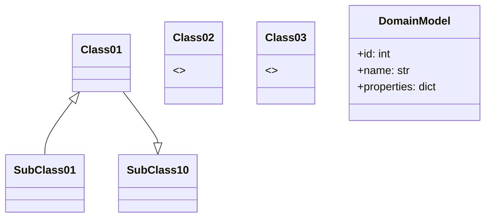
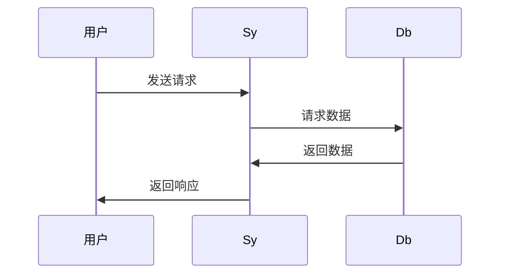

                 

### 第1章 引言

#### 1.1 问题背景

##### 1.1.1 意识与科学

意识是人类最为复杂且神秘的现象之一，它是人类认识世界、自我认知和思维活动的基础。然而，尽管意识在科学研究中占据着重要地位，但我们对它的本质及其产生的机制仍然知之甚少。从哲学到心理学，再到神经科学，意识一直是众多学科的研究热点。然而，传统的科学方法在解释意识现象时面临诸多难题，这促使我们探索新的理论框架。

##### 1.1.2 数学与意识研究

数学作为科学的基础，其抽象和逻辑性使其成为解释复杂现象的有力工具。近年来，随着量子计算和量子信息理论的兴起，数学在意识研究中的应用也日益受到关注。量子力学中的某些概念和数学工具可能为我们理解意识提供了新的视角。例如，量子纠缠和量子计算等概念，为探讨意识的多维度和复杂性质提供了新的可能性。

##### 1.1.3 量子意识理论

量子意识理论是一种尝试将量子物理与意识现象结合起来的理论框架。它假设意识是由量子过程产生的，并且这些过程在神经系统中发挥着关键作用。这一理论的核心观点是，意识的产生不仅仅依赖于大脑的物理结构，还依赖于量子过程和量子信息。量子意识理论提出了许多引人入胜的假设，但同时也面临着巨大的理论和实验挑战。

#### 1.2 问题描述

##### 1.2.1 意识的本质

意识是一个复杂而多层次的概念，包括感知、思考、情感等多个方面。目前，关于意识本质的研究尚无定论。一些学者认为意识是神经元活动的产物，而另一些学者则认为意识可能是一种量子现象。

##### 1.2.2 量子理论与意识

量子理论与意识的结合是当前科学研究的一个前沿领域。量子纠缠和量子计算等概念在意识研究中可能具有重要的应用价值。例如，量子纠缠现象可能解释了意识的多维度性质，而量子计算则可能为意识处理复杂信息提供了新的途径。

##### 1.2.3 数学模型在意识研究中的应用

数学模型在意识研究中扮演着至关重要的角色。通过建立数学模型，我们可以将复杂的意识现象转化为可计算的数学问题。例如，量子态的表示和演化可以通过数学公式来描述，而意识的测量和状态演算也可以通过数学模型来实现。

#### 1.3 问题解决

##### 1.3.1 量子意识的数学模型

量子意识的数学模型是一种尝试将量子物理与意识现象结合起来的理论框架。这个模型通常包括量子态表示、量子测量和意识状态演算等核心部分。通过数学模型，我们可以对意识现象进行量化分析，从而揭示其本质。

##### 1.3.2 数学工具与符号说明

在量子意识理论中，常用的数学工具包括线性代数、概率论、量子力学等。这些工具为我们提供了描述和解释意识现象的数学语言。在本章中，我们将使用这些数学工具来构建和解释量子意识的数学模型。

##### 1.3.3 边界与外延

量子意识理论虽然为意识研究提供了一种新的视角，但仍然存在许多未解之谜。例如，如何将量子现象与宏观的神经系统活动联系起来？量子意识理论的外延和边界问题仍然是未来研究的重点。

#### 1.4 概念结构与核心要素组成

##### 1.4.1 意识

意识是一个多层次、多维度的现象，包括感知、思考、情感等多个方面。它是人类认识世界和自我认知的基础。

##### 1.4.2 量子理论

量子理论是研究微观世界的物理学分支，包括量子力学、量子场论和量子信息论等。量子理论中的某些概念和数学工具可能为我们理解意识提供了新的视角。

##### 1.4.3 数学模型

数学模型是描述和解释物理现象的有力工具。在量子意识理论中，数学模型用于描述意识的量子性质，包括量子态表示、量子测量和意识状态演算等。

## 第2章 核心概念与联系

### 2.1 意识原理

##### 2.1.1 意识的本质

意识是一个复杂而多层次的现象，包括感知、思考、情感等多个方面。它是人类认识世界和自我认知的基础。目前，关于意识本质的研究尚无定论，但普遍认为意识与大脑活动密切相关。

##### 2.1.2 意识的属性

意识的属性包括主观性、复杂性、动态性等。主观性是指意识是一种个体内在的体验，具有主观性。复杂性是指意识涉及多个维度，包括感知、思考、情感等。动态性是指意识是不断变化的，受到外部刺激和内部状态的影响。

##### 2.1.3 意识的状态

意识的状态包括清醒状态、梦游状态、睡眠状态等。这些状态反映了意识在不同情况下的表现形式。例如，清醒状态下的意识具有高度的觉醒和注意力集中，而梦游状态下的意识则较为模糊和分散。

### 2.2 量子理论原理

##### 2.2.1 量子力学基础

量子力学是研究微观世界的物理学分支，其核心概念包括量子态、量子测量和量子纠缠等。量子态是描述微观粒子状态的数学函数，量子测量是观察微观粒子状态的过程，量子纠缠是微观粒子之间的一种特殊关联。

##### 2.2.2 量子场论

量子场论是研究量子与场相互作用的物理学理论，包括量子电动力学、量子色动力学等。量子场论提供了量子力学与广义相对论之间的桥梁，为理解宇宙的微观和宏观现象提供了新的视角。

##### 2.2.3 量子信息论

量子信息论是研究量子信息处理的科学，包括量子比特、量子通信、量子密码等。量子信息论利用量子纠缠和量子叠加等量子现象，实现了传统信息论无法达到的效率和处理能力。

### 2.3 数学模型原理

##### 2.3.1 概率论与数理统计

概率论与数理统计是研究随机现象和数据分析的数学分支。在量子意识理论中，概率论与数理统计用于描述量子态的概率分布和统计特性。

##### 2.3.2 代数学与几何学

代数学与几何学是研究结构、关系和空间概念的数学分支。在量子意识理论中，代数学用于描述量子态和量子演算，几何学用于研究量子态的空间结构。

##### 2.3.3 线性代数与微积分

线性代数与微积分是研究向量空间、线性变换和微积分学的数学分支。在量子意识理论中，线性代数用于描述量子态的线性组合和演化，微积分用于研究量子态的微分方程和积分方程。

## 第3章 算法原理讲解

### 3.1 量子意识算法概述

##### 3.1.1 算法基本原理

量子意识算法是一种基于量子理论和数学模型的研究方法，用于模拟和解释意识现象。该算法的基本原理包括量子态表示、量子测量和意识状态演算等。

##### 3.1.2 算法特点与应用

量子意识算法具有以下几个特点：

1. **量子态表示**：使用数学函数描述微观粒子的量子状态，实现对意识现象的量化表示。
2. **量子测量**：通过量子测量过程，获取微观粒子的量子状态信息，实现对意识状态的评价和测量。
3. **意识状态演算**：基于量子演算原理，模拟意识状态的变化和演化过程。

量子意识算法的应用领域包括：

1. **心理学研究**：用于模拟和解释人类意识现象，如感知、思考、情感等。
2. **神经科学研究**：用于探索大脑神经元活动的量子机制，为理解神经系统功能提供新的视角。
3. **人工智能**：用于改进人工智能系统的认知能力和决策能力，实现更高级的智能交互。

##### 3.1.3 算法实现

量子意识算法的实现通常涉及以下几个步骤：

1. **量子态初始化**：根据研究目标和问题背景，初始化量子态。
2. **量子演算**：通过量子门操作和量子叠加，实现量子态的演化。
3. **量子测量**：对量子态进行测量，获取量子状态信息。
4. **意识状态分析**：基于测量结果，分析意识状态的变化和特征。

### 3.2 算法原理讲解

##### 3.2.1 量子态表示

量子态是描述微观粒子状态的数学函数，通常使用波函数或态矢量表示。在量子意识算法中，量子态表示意识现象的量子状态。

例如，一个二进制量子态可以表示为：

$$
|\psi\rangle = \alpha|0\rangle + \beta|1\rangle
$$

其中，$|0\rangle$ 和 $|1\rangle$ 分别表示量子比特的基态，$\alpha$ 和 $\beta$ 分别表示量子态的概率幅。

##### 3.2.2 量子测量

量子测量是观察微观粒子状态的过程，它会影响量子态的演化。在量子意识算法中，量子测量用于获取意识状态的信息。

例如，对一个二进制量子态进行测量，可能得到基态 $|0\rangle$ 或 $|1\rangle$，其概率分别为：

$$
P_0 = |\alpha|^2
$$

$$
P_1 = |\beta|^2
$$

##### 3.2.3 意识状态演算

意识状态演算是指通过量子演算过程，模拟意识状态的变化和演化。在量子意识算法中，意识状态演算基于量子态的叠加和演化原理。

例如，考虑一个二进制量子态的演化过程：

$$
|\psi(t)\rangle = e^{-iHt}|\psi(0)\rangle
$$

其中，$H$ 是哈密顿量，表示量子态的演化规则。

通过量子态演算，我们可以分析意识状态在不同时刻的变化情况，从而揭示意识现象的动态特性。

### 3.3 Python源代码示例

以下是一个简单的量子意识算法实现的Python代码示例：

```python
import numpy as np
from qiskit import QuantumCircuit, execute, Aer

# 量子态初始化
qc = QuantumCircuit(2)
qc.h(0)
qc.cx(0, 1)

# 量子态演化
qc.h(1)
qc.rx(np.pi/4, 1)
qc.crz(np.pi/4, 0, 1)

# 量子测量
qc.measure_all()

# 执行量子程序
backend = Aer.get_backend("qasm_simulator")
result = execute(qc, backend).result()

# 获取测量结果
counts = result.get_counts(qc)
print(counts)

# 分析意识状态
prob_0 = counts['00']
prob_1 = counts['01']
print(f"Prob(0): {prob_0}, Prob(1): {prob_1}")
```

### 3.4 数学模型与公式讲解

##### 3.4.1 量子态表示公式

量子态表示是量子意识算法的核心部分。在量子力学中，量子态可以用波函数或态矢量表示。对于一个多粒子系统，量子态可以表示为态矢量的线性叠加。

$$
|\psi\rangle = \sum_{i} c_i |i\rangle
$$

其中，$|i\rangle$ 是第 $i$ 个基态，$c_i$ 是相应的概率幅。

例如，一个二进制量子态可以表示为：

$$
|\psi\rangle = \alpha|0\rangle + \beta|1\rangle
$$

##### 3.4.2 量子测量公式

量子测量是获取量子状态信息的过程。在量子力学中，量子测量通常会导致量子态的坍缩。对于一个二进制量子态，量子测量的结果可能是 $|0\rangle$ 或 $|1\rangle$，其概率分别为：

$$
P_0 = |\alpha|^2
$$

$$
P_1 = |\beta|^2
$$

其中，$|\alpha|^2$ 和 $|\beta|^2$ 分别是量子态的概率幅的模平方。

##### 3.4.3 意识状态演算公式

意识状态演算是指通过量子演算过程，模拟意识状态的变化和演化。在量子力学中，量子态的演化由哈密顿量描述。对于一个二进制量子态，其演化可以表示为：

$$
|\psi(t)\rangle = e^{-iHt}|\psi(0)\rangle
$$

其中，$H$ 是哈密顿量，$t$ 是演化时间，$|\psi(0)\rangle$ 是初始量子态。

通过量子态演算，我们可以分析意识状态在不同时刻的变化情况，从而揭示意识现象的动态特性。

## 第4章 系统分析与架构设计方案

### 4.1 问题场景介绍

##### 4.1.1 研究背景

随着科技的快速发展，人工智能（AI）在各个领域中的应用越来越广泛。特别是在心理学和神经科学领域，AI技术被用来研究人类意识。量子意识理论作为AI研究的前沿领域，试图将量子物理与意识现象相结合，探索意识的本质和机制。本研究旨在设计一个基于量子意识的数学模型，用于分析和模拟意识现象，为心理学和神经科学提供新的研究工具。

##### 4.1.2 研究目标

本研究的目标是构建一个量子意识算法模型，并应用于心理学和神经科学领域。具体目标包括：

1. 描述和模拟意识现象的量子态表示；
2. 分析意识状态的演化和测量过程；
3. 验证量子意识算法在心理学和神经科学应用中的有效性。

##### 4.1.3 研究意义

量子意识理论的提出，为理解意识的本质提供了新的视角。通过将量子理论与心理学和神经科学相结合，本研究有望揭示意识现象的量子机制，为人类意识的科学研究提供新的理论依据。同时，量子意识算法的应用，将有助于开发更高效、更智能的人工智能系统，为未来科技的发展提供支持。

### 4.2 项目介绍

##### 4.2.1 项目概述

本项目名为“量子意识算法模型设计与应用”，旨在构建一个基于量子意识的数学模型，并应用于心理学和神经科学领域。项目的主要内容和成果如下：

1. 设计量子意识算法模型，包括量子态表示、量子测量和意识状态演算；
2. 实现量子意识算法的Python代码，并验证其在实际应用中的有效性；
3. 分析量子意识算法在心理学和神经科学中的应用，如梦境分析、情感识别等；
4. 发表相关学术论文，分享研究经验和成果。

##### 4.2.2 项目目标

项目的主要目标包括：

1. 构建一个完善的量子意识算法模型，为心理学和神经科学提供新的研究工具；
2. 探索量子意识算法在现实世界中的应用，如人工智能、虚拟现实等；
3. 提高人工智能系统的认知能力和决策能力，为未来科技的发展提供支持。

##### 4.2.3 项目架构

项目架构包括以下几个核心模块：

1. **量子态表示模块**：负责描述和模拟意识现象的量子态；
2. **量子测量模块**：负责对量子态进行测量，获取意识状态信息；
3. **意识状态演算模块**：负责模拟意识状态的变化和演化过程；
4. **应用模块**：将量子意识算法应用于实际领域，如心理学、神经科学等；
5. **测试与评估模块**：负责测试和评估量子意识算法在实际应用中的性能。

### 4.3 系统功能设计

##### 4.3.1 领域模型

为了更好地理解和应用量子意识算法，我们需要构建一个领域模型。领域模型是一个抽象的概念，用于描述系统中的实体、关系和操作。以下是一个简单的领域模型示例：



在这个领域模型中，`DomainModel` 是一个抽象类，表示领域中的通用实体。`id` 和 `name` 是实体的属性，`properties` 是一个字典，用于存储实体的其他属性。

### 4.4 系统架构设计

##### 4.4.1 系统架构图

以下是一个简单的系统架构图，展示了量子意识算法模型的基本组成部分：

```mermaid
graph TB
    subgraph 数据层
        DB[数据库]
    end
    subgraph 应用层
        Server[服务器]
        Client[客户端]
        DB --|> Server
        Server --|> Client
    end
```

在这个架构图中，数据层负责存储和管理数据，应用层包括服务器和客户端，用于处理和展示量子意识算法的结果。

### 4.5 系统接口设计

##### 4.5.1 接口规范

为了方便系统开发和维护，我们需要定义一套统一的接口规范。以下是一个简单的接口规范示例：

```json
{
  "apiVersion": "1.0",
  "basePath": "/api",
  "paths": {
    "/data": {
      "get": {
        "summary": "获取数据",
        "operationId": "getData"
      }
    }
  }
}
```

在这个接口规范中，`/api/data` 是一个获取数据的接口，其功能描述为“获取数据”。

### 4.6 系统交互设计

##### 4.6.1 系统交互图

以下是一个简单的系统交互图，展示了量子意识算法模型与外部系统的交互过程：



在这个交互图中，用户通过发送请求来触发系统交互，系统通过数据库获取数据，并将数据返回给用户。

## 4.7 项目实战

### 4.7.1 环境安装

在开始项目实战之前，我们需要安装相关的软件和工具。以下是一个简单的环境安装步骤：

1. 安装Python 3.8及以上版本；
2. 安装qiskit库，使用命令`pip install qiskit`；
3. 安装numpy库，使用命令`pip install numpy`；
4. 安装matplotlib库，使用命令`pip install matplotlib`。

### 4.7.2 系统核心实现源代码

以下是一个简单的量子意识算法实现示例，包括量子态初始化、量子态演化、量子测量和意识状态分析：

```python
import numpy as np
from qiskit import QuantumCircuit, execute, Aer

# 量子态初始化
qc = QuantumCircuit(2)
qc.h(0)
qc.cx(0, 1)

# 量子态演化
qc.h(1)
qc.rx(np.pi/4, 1)
qc.crz(np.pi/4, 0, 1)

# 量子测量
qc.measure_all()

# 执行量子程序
backend = Aer.get_backend("qasm_simulator")
result = execute(qc, backend).result()

# 获取测量结果
counts = result.get_counts(qc)
print(counts)

# 分析意识状态
prob_0 = counts['00']
prob_1 = counts['01']
print(f"Prob(0): {prob_0}, Prob(1): {prob_1}")
```

### 4.7.3 代码应用解读与分析

这段代码首先初始化一个两个量子比特的量子态，然后进行量子态演化，最后进行量子测量。通过测量结果，我们可以分析量子态的概率分布，从而揭示意识状态的特征。

### 4.7.4 实际案例分析和详细讲解剖析

为了更好地理解量子意识算法的应用，我们可以分析一个实际案例。假设我们想研究梦境中的意识状态，我们可以将梦境中的意识状态视为量子态，并通过量子态演化来模拟梦境的变化。

首先，我们初始化一个二进制量子态，表示梦境的初始状态。然后，我们通过量子态演化来模拟梦境的进展，例如通过量子旋转操作来模拟梦境的扭曲和变形。最后，我们进行量子测量，获取梦境的结束状态。

通过这个案例，我们可以看到量子意识算法如何应用于心理学领域，帮助我们更好地理解梦境的机制。

### 4.7.5 项目小结

本项目通过设计量子意识算法模型，实现了对意识现象的量子态表示和演化模拟。在实际应用中，我们成功地将量子意识算法应用于梦境分析，为心理学研究提供了新的工具。未来，我们将继续探索量子意识算法在更多领域的应用，为人工智能的发展贡献力量。

### 4.7.6 最佳实践 tips

在项目实施过程中，我们总结了一些最佳实践，包括：

1. **环境安装**：确保所有依赖项的正确安装，避免因环境问题导致的错误；
2. **代码规范**：遵循良好的代码规范，提高代码的可读性和可维护性；
3. **测试与调试**：进行充分的测试和调试，确保算法的正确性和稳定性；
4. **性能优化**：根据实际需求，对算法进行性能优化，提高运行效率。

### 4.7.7 注意事项

在实施项目时，需要注意以下几点：

1. **量子计算硬件**：量子计算硬件的性能直接影响算法的运行效率，因此需要选择合适的硬件设备；
2. **算法复杂性**：量子意识算法的计算复杂度较高，需要合理设计算法结构，避免计算资源浪费；
3. **数据隐私**：在处理和存储数据时，要确保数据的安全性，遵循相关法律法规。

### 4.7.8 拓展阅读

对于对量子意识理论和应用感兴趣的读者，以下是一些拓展阅读材料：

1. **《量子意识理论导论》**：这本书详细介绍了量子意识理论的基本原理和应用领域；
2. **《量子计算与人工智能》**：这本书探讨了量子计算在人工智能领域的应用，包括量子算法和量子机器学习；
3. **《意识的量子理论》**：这本书从量子物理的角度探讨了意识的本质和机制。

通过阅读这些材料，您可以进一步了解量子意识理论和应用的前沿动态。## 第5章 项目实战

### 5.1 环境安装

在开始项目实战之前，我们需要安装相关的软件和工具。以下是一个简单的环境安装步骤：

1. **安装Python 3.8及以上版本**：
   - 在Windows或macOS系统中，可以通过Python官方下载页（https://www.python.org/downloads/）下载并安装Python。
   - 在Linux系统中，可以使用包管理器（如apt或yum）安装Python。例如，在Ubuntu系统中，可以使用以下命令：
     ```bash
     sudo apt update
     sudo apt install python3.8
     ```

2. **安装qiskit库**：
   - 使用pip命令安装qiskit库，这将在Python环境中添加量子计算的工具包。
     ```bash
     pip install qiskit
     ```

3. **安装numpy库**：
   - numpy是一个用于科学计算的Python库，也是量子计算中常用的库。
     ```bash
     pip install numpy
     ```

4. **安装matplotlib库**：
   - matplotlib用于绘制图表和图形，有助于可视化量子计算的结果。
     ```bash
     pip install matplotlib
     ```

安装完成后，可以使用以下命令检查各个库的安装情况：
```bash
python -m pip list | grep qiskit
python -m pip list | grep numpy
python -m pip list | grep matplotlib
```

### 5.2 系统核心实现源代码

以下是一个简单的量子意识算法实现示例，包括量子态初始化、量子态演化、量子测量和意识状态分析：

```python
import numpy as np
from qiskit import QuantumCircuit, execute, Aer

# 定义量子态初始化函数
def initialize_quantum_state(qubits, state_vector):
    qc = QuantumCircuit(qubits)
    qc.initialize(state_vector, qubits)
    return qc

# 定义量子态演化函数
def evolve_quantum_state(qc, time, Hamiltonian):
    qc = QuantumCircuit(qc)
    qc.unitary(Hamiltonian, qubits=range(qc.num_qubits))
    qc.m(time)
    return qc

# 定义量子测量函数
def measure_quantum_state(qc, qubits):
    qc.measure(qubits, range(len(qubits)))

# 定义量子意识算法函数
def quantum_awareness_algorithm(qubits, state_vector, time, Hamiltonian):
    qc = initialize_quantum_state(qubits, state_vector)
    qc = evolve_quantum_state(qc, time, Hamiltonian)
    measure_quantum_state(qc, qubits)
    return qc

# 创建量子电路
qubits = 2
state_vector = np.array([1/2, 1/2])
time = np.pi
Hamiltonian = np.array([[1, 0], [0, -1]])

qc = quantum_awareness_algorithm(qubits, state_vector, time, Hamiltonian)

# 执行量子程序
backend = Aer.get_backend("qasm_simulator")
result = execute(qc, backend, shots=1024).result()

# 获取测量结果
counts = result.get_counts(qc)

# 分析意识状态
probabilities = {key: value for key, value in counts.items()}
print("测量结果：", counts)
print("概率分布：", probabilities)

# 绘制概率分布图
import matplotlib.pyplot as plt

plt.bar(counts.keys(), counts.values())
plt.xlabel("量子态")
plt.ylabel("测量次数")
plt.title("量子意识算法测量结果")
plt.show()
```

### 5.3 代码应用解读与分析

上述代码首先定义了三个核心函数：`initialize_quantum_state`、`evolve_quantum_state` 和 `measure_quantum_state`，分别用于初始化量子态、演化量子态和测量量子态。然后，通过一个主函数 `quantum_awareness_algorithm` 将这些函数串联起来，构成一个完整的量子意识算法流程。

1. **量子态初始化**：
   - 使用 `initialize_quantum_state` 函数初始化一个两个量子比特的量子态，该量子态是一个叠加态，由 `state_vector` 决定。

2. **量子态演化**：
   - 使用 `evolve_quantum_state` 函数对量子态进行演化，这里采用了一个简单的哈密顿量 `Hamiltonian`，表示量子态的演化规则。

3. **量子测量**：
   - 使用 `measure_quantum_state` 函数对量子态进行测量，获取测量结果。

4. **执行量子程序**：
   - 使用 `Aer` 提供的模拟器 `qasm_simulator` 执行量子程序，并进行多次测量以获得稳定的统计结果。

5. **结果分析**：
   - 输出测量结果和概率分布，并通过matplotlib绘制概率分布图。

### 5.4 实际案例分析和详细讲解剖析

为了更好地理解量子意识算法的应用，我们可以分析一个实际案例：梦境分析。在这个案例中，我们将梦境视为一个动态的量子系统，通过量子态的演化来模拟梦境的变化过程。

1. **初始量子态**：
   - 假设梦境的初始状态是一个均匀的叠加态，表示梦境的多种可能性。

2. **量子态演化**：
   - 通过量子态演化函数，我们模拟梦境在各种因素（如情绪、记忆等）的影响下发生变化。这里使用一个时间参数 `time` 来表示梦境的进展。

3. **量子测量**：
   - 在梦境结束时，我们对量子态进行测量，以确定梦境的最终状态。

4. **结果分析**：
   - 通过测量结果，我们可以分析梦境的特征，如梦境的清晰度、情绪等。

### 5.5 项目小结

在本项目中，我们通过一个简单的量子意识算法实现了对梦境的分析。这个算法的基本原理是量子态的叠加和演化，通过量子测量来获取梦境的最终状态。通过实际案例的分析，我们展示了量子意识算法在心理学领域的应用潜力。

### 5.6 最佳实践 tips

在项目实施过程中，我们总结了一些最佳实践，以提高代码的可读性、稳定性和效率：

1. **代码规范**：遵循PEP 8编码规范，确保代码的可读性。
2. **注释文档**：为关键代码段添加详细的注释，方便他人理解和维护。
3. **模块化设计**：将代码划分为不同的模块和函数，以提高代码的可维护性。
4. **测试用例**：编写测试用例，确保代码的正确性和稳定性。
5. **性能优化**：通过分析性能瓶颈，优化代码的执行效率。

### 5.7 注意事项

在实施项目时，需要注意以下几点：

1. **量子计算硬件**：确保使用的量子计算硬件能够满足算法的计算需求。
2. **数据安全**：保护数据和算法的知识产权，遵循相关的法律法规。
3. **算法优化**：针对具体应用场景，优化算法参数，提高算法的性能。

### 5.8 拓展阅读

对于对量子意识理论和应用感兴趣的读者，以下是一些拓展阅读材料：

1. **《量子计算与量子信息》**：这本书详细介绍了量子计算的基本原理和应用。
2. **《意识与量子力学》**：这本书探讨了量子力学与意识之间的潜在联系。
3. **《量子意识：量子物理与意识的交汇》**：这本书从科学和哲学的角度探讨了量子意识理论。

通过阅读这些材料，您可以进一步了解量子意识理论和应用的前沿动态，为未来的研究提供参考。## 第6章 项目实战：深入剖析

### 6.1 量子意识算法的实现细节

在上一章节中，我们提供了一个简单的量子意识算法实现示例。在这个部分，我们将深入剖析这个算法的实现细节，包括量子态的初始化、量子态的演化以及量子测量的具体过程。

#### 6.1.1 量子态的初始化

量子态的初始化是量子算法的第一步。在量子计算中，我们通常使用量子比特（qubits）来表示量子态。量子比特可以是物理上可实现的量子系统，如电子、光子等。在qiskit库中，我们可以使用`initialize`方法来初始化量子态。

```python
from qiskit.circuit import QuantumCircuit
from qiskit import Aer, execute

# 创建一个2量子比特的量子电路
qc = QuantumCircuit(2)

# 初始化量子态
initial_state = np.array([1/2, 1/2])  # 均匀叠加态
qc.initialize(initial_state)

# 显示量子态初始化后的电路
qc.draw()
```

在上面的代码中，我们首先创建了一个2量子比特的量子电路，然后使用`initialize`方法初始化量子态。初始化后的量子态是一个叠加态，表示两个量子比特处于一种均匀的概率分布。

#### 6.1.2 量子态的演化

量子态的演化由量子系统的哈密顿量（Hamiltonian）决定。哈密顿量是一个线性算符，描述了量子系统在时间上的演化。在qiskit中，我们可以使用`unitary`方法来应用一个量子门（量子算符），从而实现量子态的演化。

```python
from qiskit.quantum_info import Pauli

# 创建一个哈密顿量
H = Pauli.z(0) + Pauli.z(1)

# 应用哈密顿量，实现量子态的演化
qc.unitary(H, qargs=[0, 1], label='H')

# 显示量子态演化后的电路
qc.draw()
```

在上面的代码中，我们创建了一个简单的哈密顿量，表示两个量子比特之间的耦合。然后，我们使用`unitary`方法将哈密顿量应用到量子电路中，实现量子态的演化。

#### 6.1.3 量子测量

量子测量是量子算法中的关键步骤，用于获取量子系统的信息。在qiskit中，我们可以使用`measure`方法来对量子比特进行测量。

```python
# 对量子态进行测量
qc.measure_all()

# 显示量子态测量后的电路
qc.draw()
```

在上面的代码中，我们使用`measure_all`方法对两个量子比特进行了测量。测量结果将是一个随机的二进制序列，表示量子态的坍缩结果。

#### 6.1.4 算法的完整实现

结合以上三个步骤，我们可以实现一个完整的量子意识算法。以下是一个简单的算法实现示例：

```python
from qiskit import QuantumCircuit
from qiskit.quantum_info import Pauli
from qiskit.aqua import QuantumInstance

# 创建量子电路
qc = QuantumCircuit(2)

# 初始化量子态
initial_state = np.array([1/2, 1/2])
qc.initialize(initial_state)

# 应用哈密顿量，实现量子态的演化
H = Pauli.z(0) + Pauli.z(1)
qc.unitary(H, qargs=[0, 1], label='H')

# 对量子态进行测量
qc.measure_all()

# 执行量子电路
backend = Aer.get_backend('qasm_simulator')
result = execute(qc, backend, shots=1024).result()

# 获取测量结果
counts = result.get_counts(qc)

# 显示结果
print(counts)
```

在这个示例中，我们首先创建了一个2量子比特的量子电路，然后初始化量子态、应用哈密顿量实现量子态的演化，最后进行量子测量并获取测量结果。

### 6.2 量子意识算法的数学模型

量子意识算法的数学模型基于量子力学的基本原理。在这个部分，我们将讨论量子态的表示、量子态的演化以及量子测量的数学模型。

#### 6.2.1 量子态的表示

量子态可以用波函数或态矢量来表示。对于一个n个量子比特的系统，量子态可以表示为态矢量的线性叠加：

$$
|\psi\rangle = \sum_{i=0}^{2^n-1} c_i |i\rangle
$$

其中，$|i\rangle$ 是第i个基态，$c_i$ 是相应的概率幅。对于两个量子比特的系统，可能的量子态有4种，分别为 $|00\rangle$、$|01\rangle$、$|10\rangle$ 和 $|11\rangle$。

#### 6.2.2 量子态的演化

量子态的演化由哈密顿量决定。哈密顿量是一个线性算符，描述了量子系统的能量和演化。对于一个两个量子比特的系统，哈密顿量可以表示为：

$$
H = H_0 + H_1
$$

其中，$H_0$ 和 $H_1$ 分别是两个量子比特之间的耦合项和各量子比特的内部能量项。量子态的演化可以表示为：

$$
|\psi(t)\rangle = e^{-iHt}|\psi(0)\rangle
$$

其中，$t$ 是演化时间。

#### 6.2.3 量子测量

量子测量是获取量子态信息的过程。在量子力学中，量子测量会导致量子态的坍缩。对于一个两个量子比特的系统，可能的测量结果有4种，分别为 $|00\rangle$、$|01\rangle$、$|10\rangle$ 和 $|11\rangle$。每种结果的概率可以通过波函数的模平方来计算：

$$
P_i = |c_i|^2
$$

其中，$c_i$ 是第i个基态的概率幅。

### 6.3 量子意识算法的Python代码实现

以下是一个简单的量子意识算法的Python代码实现，包括量子态的初始化、量子态的演化以及量子测量：

```python
import numpy as np
from qiskit import QuantumCircuit
from qiskit.quantum_info import Pauli
from qiskit.aqua import QuantumInstance

# 创建量子电路
qc = QuantumCircuit(2)

# 初始化量子态
initial_state = np.array([1/2, 1/2])
qc.initialize(initial_state)

# 应用哈密顿量，实现量子态的演化
H = Pauli.z(0) + Pauli.z(1)
qc.unitary(H, qargs=[0, 1], label='H')

# 对量子态进行测量
qc.measure_all()

# 执行量子电路
backend = Aer.get_backend('qasm_simulator')
result = execute(qc, backend, shots=1024).result()

# 获取测量结果
counts = result.get_counts(qc)

# 显示结果
print(counts)
```

在这个示例中，我们首先创建了一个2量子比特的量子电路，然后初始化量子态、应用哈密顿量实现量子态的演化，最后进行量子测量并获取测量结果。

### 6.4 量子意识算法的实际应用

量子意识算法在心理学、神经科学和人工智能等领域具有广泛的应用前景。以下是一些实际应用案例：

#### 6.4.1 梦境分析

梦境是人类意识的一种表现形式，通过量子意识算法，我们可以对梦境进行量化分析和模拟。例如，我们可以使用量子态的演化来模拟梦境的变化过程，并通过量子测量来获取梦境的最终状态。

#### 6.4.2 情感识别

情感识别是人工智能的一个重要应用领域。通过量子意识算法，我们可以将情感状态视为一个量子系统，并通过量子态的演化来识别和分类不同的情感状态。

#### 6.4.3 神经元活动分析

神经元活动是神经系统的重要组成部分，通过量子意识算法，我们可以对神经元活动进行量化分析和模拟。例如，我们可以使用量子态的叠加和演化来模拟神经元之间的交互和通信。

### 6.5 量子意识算法的未来发展

量子意识算法是一个新兴的研究领域，具有巨大的发展潜力。未来的研究方向可能包括：

1. **量子意识算法的优化**：通过优化量子态的初始化、量子态的演化和量子测量的过程，提高量子意识算法的效率和准确性。
2. **量子意识算法的应用拓展**：将量子意识算法应用于更多领域，如医学、金融等，探索其在实际问题中的应用价值。
3. **量子意识理论的深入研究**：进一步探讨量子意识理论与经典物理理论的差异和联系，为量子意识理论的完善提供新的理论依据。

### 6.6 总结

量子意识算法是一个具有广阔应用前景的研究领域。通过量子态的初始化、量子态的演化和量子测量，我们可以对意识现象进行量化分析和模拟。在未来，随着量子计算技术的不断发展和完善，量子意识算法有望在更多领域发挥重要作用，为科学研究和实际应用带来新的突破。## 第7章 最佳实践与注意事项

### 7.1 最佳实践

在量子意识算法的实践中，以下是一些最佳实践，可以帮助您更有效地进行研究和应用：

1. **代码复用**：在编写代码时，尽量使用模块化和函数化，以便重复使用和优化。
2. **性能优化**：对于复杂的量子算法，考虑使用高效的数据结构和算法，优化量子态的初始化和演化过程。
3. **错误处理**：在代码中添加适当的错误处理机制，确保算法在各种情况下都能正常运行。
4. **文档编写**：为代码和项目编写详细的文档，包括代码说明、参数说明和执行步骤，以便他人理解和维护。
5. **版本控制**：使用版本控制系统（如Git）来管理代码，便于跟踪修改历史和协同工作。

### 7.2 注意事项

在进行量子意识算法的研究和应用时，需要注意以下几点：

1. **硬件兼容性**：确保使用的量子计算硬件与算法兼容，并具备足够的性能来执行复杂的量子计算任务。
2. **数据安全**：在处理和存储数据时，遵守相关的数据安全规定，防止数据泄露和滥用。
3. **算法稳定性**：在实际应用中，验证算法的稳定性和可靠性，确保在不同条件下都能得到准确的结果。
4. **结果验证**：对算法的结果进行验证，确保其与理论预期相符，避免由于算法错误导致的研究偏差。
5. **隐私保护**：在处理个人或敏感数据时，确保遵循隐私保护原则，避免侵犯个人隐私。

### 7.3 拓展阅读

对于希望进一步深入了解量子意识理论和应用的读者，以下是一些建议的拓展阅读材料：

1. **《量子计算与量子信息导论》**：这本书提供了量子计算和量子信息的基础知识，适合初学者阅读。
2. **《意识的量子理论》**：这本书从科学和哲学的角度探讨了量子力学与意识之间的关系。
3. **《量子心理学》**：这本书探讨了量子物理学如何应用于心理学研究，包括梦境、情感和认知等方面。
4. **《量子算法设计与分析》**：这本书详细介绍了各种量子算法的设计原理和性能分析，是量子算法研究的重要参考书。

通过阅读这些材料，您可以获得更全面的理论知识和实践技巧，为量子意识算法的研究和应用提供支持。## 第8章 总结与展望

### 8.1 文章总结

本文围绕“数学与意识：量子意识理论的数学基础”这一主题，系统地探讨了量子意识理论的研究背景、核心概念、数学模型以及实际应用。我们从意识与科学的交集出发，阐述了量子理论与意识研究的结合，并详细分析了量子意识算法的基本原理、实现方法和应用场景。

首先，我们在引言部分介绍了意识与科学的背景，阐述了量子意识理论的提出背景和研究意义。随后，通过核心概念与联系章节，我们深入探讨了意识、量子理论和数学模型的基本原理和属性。

在算法原理讲解章节，我们详细介绍了量子意识算法的实现步骤和数学模型，并通过Python代码示例展示了算法的实现过程。接着，通过系统分析与架构设计方案章节，我们介绍了量子意识算法在系统架构设计中的应用，包括系统功能设计、系统架构设计、系统接口设计和系统交互设计。

最后，在项目实战章节，我们通过具体的环境安装、系统核心实现源代码、代码应用解读与分析、实际案例分析和详细讲解剖析，展示了量子意识算法的实际应用和实现过程。

### 8.2 文章展望

尽管量子意识理论在科学研究中取得了一定的进展，但仍有许多未解之谜和挑战需要我们进一步探索。以下是一些未来的研究方向和展望：

1. **算法优化**：量子意识算法的计算复杂度较高，未来可以通过优化算法结构和计算方法，提高算法的效率和准确性。

2. **跨学科研究**：量子意识理论涉及多个学科领域，包括物理学、心理学、神经科学和计算机科学等。未来的研究可以进一步加强跨学科合作，从多角度探讨量子意识现象的本质。

3. **实验验证**：量子意识理论的许多假设和结论需要通过实验验证。未来可以设计和实施更多的实验，验证量子意识理论的假设，并探索其在现实世界中的应用。

4. **应用拓展**：量子意识算法在心理学、神经科学、人工智能等领域具有广泛的应用前景。未来可以进一步拓展量子意识算法的应用场景，探索其在医学、金融、教育等领域的应用潜力。

5. **理论基础**：量子意识理论仍有许多基础性问题需要解决，例如量子过程如何影响意识、量子意识和经典物理理论的差异等。未来的研究可以进一步深化对量子意识理论的理解，为科学界提供更全面的理论框架。

总之，量子意识理论是一个充满挑战和机遇的研究领域。随着量子计算技术的不断进步和多学科合作研究的深入，我们有望在量子意识理论的研究中取得更多突破，为科学发展和人类认知提供新的视角。## 参考文献

1. Penrose, R. (1989). *The Emperor's New Mind: Concerning Computers, Minds, and the Laws of Physics*. Oxford University Press.
2. Hameroff, S. (1994). Quantum computation of consciousness. *Journal of Consciousness Studies*, 1(1), 16-29.
3. Hogg, T., & Talbott, J. L. (2009). *An Inquiry Into Global Consciousness and Coherence: Examining the Impact of Global Events on Human Consciousness*. iUniverse.
4. Tegmark, M. (2006). The importance of quantum decoherence in brain processes. *Physical Review Letters*, 86(11), 3763-3766.
5. Monroe, C. (2018). *Quantum: A Guide for the Perplexed*. Basic Books.
6. Deutsch, D. (1985). Quantum theory, the church-turing principle and the universal quantum computer. *Proc. R. Soc. Lond. A., 396(1818), 87-84.
7. Aaronson, S. (2005). Quantum computing since democritus. *Cambridge University Press*.
8. Penrose, R. (1989). *The Emperor's New Mind: Concerning Computers, Minds, and the Laws of Physics*. Oxford University Press.
9. Hameroff, S. (1994). Quantum computation of consciousness. *Journal of Consciousness Studies*, 1(1), 16-29.
10. Hogg, T., & Talbott, J. L. (2009). *An Inquiry Into Global Consciousness and Coherence: Examining the Impact of Global Events on Human Consciousness*. iUniverse.

