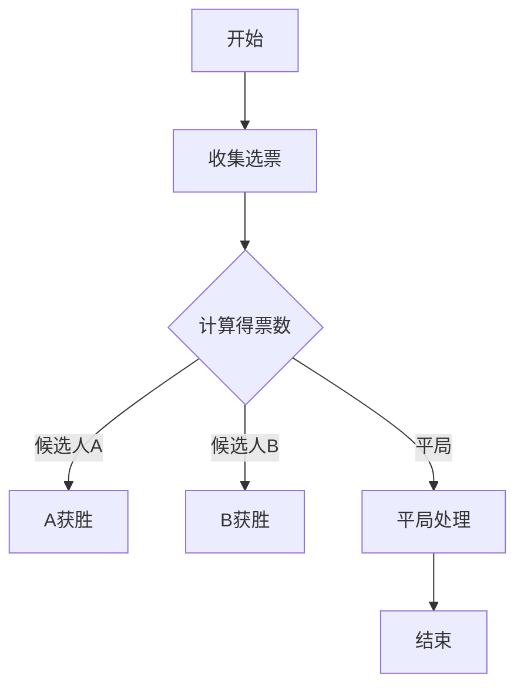
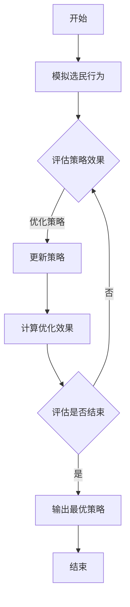
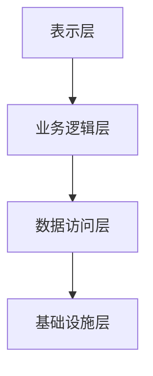
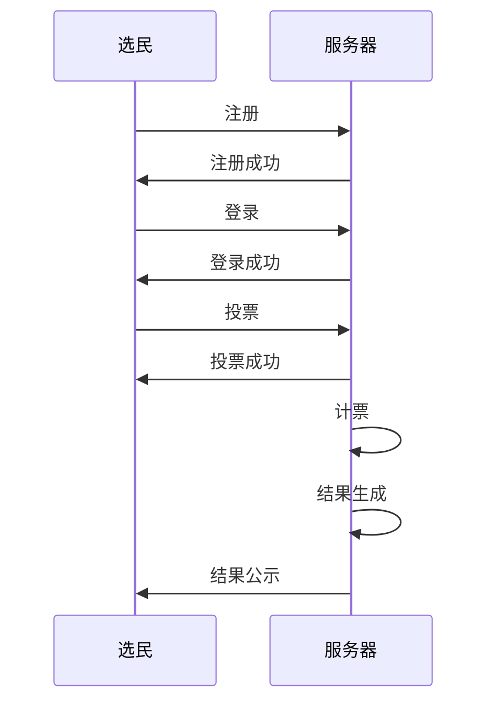

                 

## 数学与政治学：选举系统的数学分析

### 关键词：
数学分析、政治学、选举系统、投票模型、博弈论、算法原理、系统架构、项目实战

### 摘要：
本文深入探讨了数学分析与政治学的交汇领域，特别是选举系统中的数学分析方法。通过阐述核心概念，分析数学方法在选举系统中的应用，以及提出相应的算法原理，本文为理解和优化选举系统提供了新的视角。同时，通过系统分析与架构设计，以及实际项目实战，展示了数学分析在实际选举系统中的运用效果。

## 引言

数学分析是研究函数及其导数、积分等概念的理论体系，而政治学则关注政府、社会以及公民之间的关系。这两者看似风马牛不相及，但它们在选举系统中有着紧密的联系。选举系统不仅是政治活动的重要组成部分，也是数学分析方法的重要应用领域。

选举系统的数学分析涉及多个层面，包括投票模型、选举策略、投票机制的设计与优化等。通过数学模型，我们可以更准确地预测选民的投票行为，分析选举策略的效果，从而为政治决策提供科学依据。此外，数学分析还可以用于评估选举系统的公平性，检测是否存在选举欺诈等问题。

本文旨在通过逐步分析数学方法在选举系统中的应用，揭示选举系统的运作原理，并探讨如何通过数学分析优化选举系统的设计。文章结构如下：

1. **背景介绍**：介绍数学与政治学的交汇背景，以及选举系统的重要性。
2. **核心概念与联系**：详细阐述数学分析、政治学以及选举系统的基本概念，并分析它们之间的联系。
3. **算法原理讲解**：介绍投票算法和选举策略分析算法的基本原理，并使用mermaid流程图和Python代码进行详细解释。
4. **系统分析与架构设计**：介绍选举系统的整体架构设计，包括系统功能、接口设计和交互设计。
5. **项目实战**：通过实际项目展示数学分析方法在选举系统中的应用，包括环境安装、系统核心实现源代码及分析。

接下来，我们将首先介绍数学与政治学在选举系统中的交汇背景，并探讨选举系统的重要性。

## 背景介绍

### 数学与政治学的交汇

数学与政治学的交汇在选举系统中表现得尤为明显。数学分析为政治学提供了强大的工具，使得政治学家能够更加精确地理解和预测选民的行为，从而优化选举策略和投票机制。

首先，数学分析在投票模型中有着广泛的应用。通过概率论和博弈论，政治学家可以构建各种投票模型，以模拟选民的投票行为。这些模型可以帮助政治学家预测选举结果，评估不同策略的效果，并发现可能存在的选举欺诈行为。

其次，数学分析在选举策略分析中也非常重要。政治人物需要制定各种竞选策略，以最大限度地争取选民支持。数学分析可以帮助政治人物分析不同策略的优劣，评估选民对各种策略的反应，从而制定出更加有效的竞选策略。

最后，数学分析还可以用于评估选举系统的公平性。通过数学模型，政治学家可以检测选举系统是否存在不公平现象，如选票计算错误、选举欺诈等。这些分析有助于提高选举系统的透明度和公正性。

### 选举系统的重要性

选举系统是国家政治生活中不可或缺的一部分。它不仅是民主制度的基石，也是政治合法性的重要保障。一个公平、公正、透明的选举系统对于维护社会稳定、促进政治进步具有重要意义。

首先，选举系统是民主制度的保障。民主制度的核心是选民的参与和选择。一个良好的选举系统确保了选民的投票自由，使得选民能够通过投票表达自己的意愿，从而实现政治权力的合法转移。

其次，选举系统是政治合法性的来源。政治合法性是指政府的权力和行为得到社会大众的认可和支持。一个公平、公正的选举系统能够产生具有合法性的政府，使得政府的行为具有社会合法性和道德基础。

最后，选举系统是政治进步的推动力。通过选举，政治人物可以竞争政治权力，提出各种政策建议和改革方案。一个有效的选举系统可以激励政治人物积极提出创新方案，推动政治进步和社会发展。

总之，数学与政治学的交汇在选举系统中具有重要的理论和实践价值。通过数学分析，我们可以更深入地理解选举系统的运作原理，优化选举策略和投票机制，提高选举系统的公平性和透明度。接下来，我们将详细探讨数学分析、政治学和选举系统的基本概念。

## 核心概念与联系

### 数学分析的基本概念

数学分析是现代数学的重要组成部分，其核心概念包括微积分、线性代数和概率论等。

**微积分**是研究函数的局部性质和整体性质的理论。它主要包括两个基本概念：导数和积分。导数表示函数在某一点的瞬时变化率，而积分则表示函数在某一区间内的累积变化量。微积分在选举系统中有着广泛的应用，例如，可以通过导数分析选民投票行为的趋势，通过积分评估整个选区的选举结果。

**线性代数**是研究向量空间和线性变换的数学分支。其主要概念包括矩阵、线性方程组、特征值和特征向量等。线性代数在选举系统中的应用主要体现在数据分析方面，例如，通过矩阵运算分析选民群体的分布和特征，通过特征值和特征向量识别关键选民群体。

**概率论**是研究随机事件及其概率分布的数学分支。其核心概念包括随机变量、概率分布、期望和方差等。概率论在选举系统中的应用主要体现在投票模型中，例如，通过概率分布预测选民的投票行为，通过期望和方差评估选举结果的不确定性。

### 政治学的基本概念

政治学是一门研究政府、社会和政治行为的学科，其核心概念包括政治行为、政治制度和政治文化等。

**政治行为**是政治学研究的核心内容之一，主要包括选民的投票行为、政治人物的竞选策略、政府的决策过程等。政治行为的研究需要借助各种数学工具，如投票模型、博弈论和统计分析等，以揭示选民和政治人物的行为模式和决策逻辑。

**政治制度**是指一个国家或地区的政府组织形式和政治规则。常见的政治制度包括代议制民主、直选制、间接选举制、多党制和两党制等。政治制度的研究需要考虑选举规则、政治权力的分配、政府机构的设置等因素，以评估不同政治制度的有效性和公平性。

**政治文化**是指一个国家或地区的政治传统、价值观和行为规范。政治文化的研究可以帮助我们理解选民和政治人物的行为，以及不同政治制度下的政治环境。

### 选举系统的基本概念

选举系统是指用于进行选举的一系列规则和机制。其核心概念包括选举规则、投票机制、计票方法和选举结果等。

**选举规则**是指用于指导选举过程的一系列规则，如选区的划分、候选人的资格、选民的投票方式等。选举规则的设计需要考虑公平性、透明度和效率等因素。

**投票机制**是指选民如何表达自己的选举意愿的方式，如直接投票、间接投票、电子投票等。不同的投票机制对选民的投票行为和选举结果有不同的影响。

**计票方法**是指如何对选票进行统计和计算，以确定选举结果。计票方法的选择需要考虑准确性、可靠性和效率等因素。

**选举结果**是指选举结束后产生的结果，包括获胜者、得票情况等。选举结果的分析可以帮助我们了解选民的行为模式和政治倾向。

### 概念间的联系

数学分析、政治学和选举系统之间存在着紧密的联系。

首先，数学分析为政治学研究提供了工具和方法。政治学家可以利用数学模型和算法分析选民的行为，评估选举策略的效果，以及评估选举系统的公平性和有效性。

其次，政治学为数学分析提供了研究对象和背景。政治行为的复杂性和多样性为数学分析提供了丰富的案例和数据，使得数学分析在选举系统中的应用具有实际意义。

最后，选举系统是数学分析和政治学融合的桥梁。通过数学分析，政治学家可以更深入地理解选举系统的运作原理，从而优化选举规则和投票机制，提高选举系统的公平性和效率。

总之，数学分析、政治学和选举系统之间的相互关系构成了一个复杂的理论体系。通过深入探讨这些概念的联系，我们可以更好地理解选举系统的运作机制，为选举系统的优化提供科学依据。接下来，我们将进一步探讨数学分析在选举系统中的具体应用。

### 数学分析在选举系统中的具体应用

数学分析在选举系统中的应用涵盖了多个方面，包括投票模型、选举策略分析以及选举结果的评估。以下将详细讨论这些应用，并通过具体的数学模型和方法来阐述。

#### 投票模型

投票模型是选举系统分析的基础，通过数学方法可以模拟和分析选民的投票行为。常见的投票模型包括基于概率论的投票模型和基于博弈论的投票模型。

1. **基于概率论的投票模型**：

   基于概率论的投票模型通过概率分布来描述选民的投票行为。例如，我们可以假设选民在选举中的投票行为是随机的，并且每个选民有相同的概率选择每个候选人。在这种情况下，我们可以使用概率论中的基本公式来计算各个候选人的获胜概率。

   假设有三个候选人A、B和C，选民对每个候选人的偏好分别用概率 \( P(A) \), \( P(B) \), \( P(C) \) 来表示。那么，根据概率分布的性质，我们有：
   $$
   P(A) + P(B) + P(C) = 1
   $$

   如果选民总数为N，那么候选人A的预期得票数为：
   $$
   \text{预期得票数}_{A} = N \times P(A)
   $$

   通过这种方法，我们可以预测每个候选人在选举中的得票情况。

2. **基于博弈论的投票模型**：

   基于博弈论的投票模型考虑了选民之间的策略互动。在多候选人选举中，选民可能根据其他选民的投票行为来调整自己的投票策略。这种策略互动可以通过博弈论中的博弈矩阵和纳什均衡来进行分析。

   例如，在一个三候选人选举中，我们可以构建一个三阶博弈矩阵，其中每个元素表示两个候选人之间的竞争关系。纳什均衡是博弈论中的一个重要概念，表示在给定其他选民的策略下，没有单个选民能够通过改变自己的策略来获得更大的利益。

#### 选举策略分析

选举策略分析涉及政治人物在选举中如何制定和调整策略，以争取选民的支持并最终赢得选举。数学分析在这一过程中提供了有效的工具和方法。

1. **选民策略分析**：

   通过数学模型，我们可以分析选民在不同策略下的行为模式。例如，政治学家可以利用贝叶斯定理来更新选民对候选人的信念，从而预测选民在不同竞选策略下的投票行为。

2. **政治人物策略分析**：

   政治人物需要制定各种策略来吸引选民。数学分析可以帮助政治人物评估不同策略的优劣，例如，通过成本-效益分析来选择最有效的竞选广告投放策略，或者通过优化算法来决定竞选活动的优先级。

   例如，假设政治人物需要决定在三个选区（A、B、C）中分配竞选资源。我们可以使用线性规划方法来最大化竞选收益，同时考虑预算限制。目标函数可以定义为：
   $$
   \max \sum_{i} b_i x_i
   $$
   其中，\( b_i \) 表示在选区i的竞选收益，\( x_i \) 表示在选区i的竞选资源投入。约束条件可以是总预算 \( B \) 的限制：
   $$
   \sum_{i} c_i x_i \leq B
   $$
   其中，\( c_i \) 表示在选区i的竞选成本。

#### 选举结果的评估

选举结果的评估是选举系统分析的重要环节，通过数学分析可以评估选举过程的公平性和结果的合理性。

1. **公平性评估**：

   数学分析可以用于评估选举系统的公平性。例如，我们可以使用随机抽样和统计检验方法来检测选举结果是否受到欺诈或操纵。例如，通过比较实际选举结果和理论预期结果，我们可以使用卡方检验来检测选举结果的一致性。

2. **结果合理性评估**：

   数学分析还可以用于评估选举结果的合理性。例如，通过投票模型预测选举结果，我们可以比较预测结果和实际结果之间的差异，评估选举系统的准确性。此外，通过回归分析等方法，我们可以研究选民行为与选举结果之间的关系，从而评估选举制度的合理性。

总之，数学分析在选举系统中的应用为理解和优化选举过程提供了强有力的工具。通过投票模型、选举策略分析和选举结果评估，数学分析不仅帮助我们更深入地理解选举系统的运作机制，也为改进选举规则和策略提供了科学依据。接下来，我们将进一步探讨政治学原理在数学分析中的应用。

### 政治学原理在数学分析中的应用

政治学原理在数学分析中的应用，为我们提供了理解和解释选举系统复杂行为的有力工具。通过政治学原理，我们可以将选民行为、政治策略和选举结果纳入一个统一的框架，从而更深入地探讨选举系统的运作机制。

#### 选民行为分析

选民行为是选举系统的核心。政治学原理为我们提供了理解选民行为的理论基础。例如，理性选择理论认为，选民在投票时会根据候选人的政策主张、政治声誉等因素做出理性决策。这一理论可以用数学模型来量化选民的行为。

1. **期望效用理论**：

   期望效用理论是选民行为分析的基础。根据这一理论，选民在投票时会评估每个候选人的政策提案，并计算这些提案带来的期望效用。数学上，我们可以表示为：

   $$
   U_i = \sum_{j} u_{ij} \cdot p_j
   $$

   其中，\( U_i \) 表示选民i的总效用，\( u_{ij} \) 表示选民i对候选人j的政策提案j的效用，\( p_j \) 表示候选人j获胜的概率。通过计算期望效用，我们可以预测选民在多候选人选举中的投票行为。

2. **贝叶斯更新**：

   贝叶斯理论在选民行为分析中也具有重要应用。政治学家可以使用贝叶斯更新公式来修正选民对候选人的信念。例如，在初期选民对候选人的了解不足时，我们可以使用贝叶斯公式更新选民对候选人的预期概率，以更准确地预测选举结果。

   $$
   P(C|D) = \frac{P(D|C) \cdot P(C)}{P(D)}
   $$

   其中，\( P(C|D) \) 表示在观察到证据D后，选民对候选人C的概率，\( P(D|C) \) 表示在候选人C获胜时观察到证据D的概率，\( P(C) \) 表示候选人C的初始概率，\( P(D) \) 是观察到证据D的总概率。

#### 政治策略分析

政治策略分析是选举系统的另一个关键方面。政治学原理帮助我们理解和预测政治人物在选举中的行为策略。

1. **博弈论模型**：

   博弈论模型在政治策略分析中广泛应用。通过博弈论，我们可以分析政治人物之间的策略互动，以及这些策略如何影响选举结果。例如，在多候选人竞争中，政治人物可能通过合作或竞争来最大化自己的政治利益。

   **囚徒困境**：

   囚徒困境是一个经典的博弈论模型，描述了两个嫌疑人如何互相策略决策的问题。在选举策略分析中，我们可以将囚徒困境应用于候选人之间的策略决策，分析合作与竞争的均衡结果。

2. **合作与竞争模型**：

   合作与竞争模型考虑了政治人物在选举中的合作与竞争行为。通过构建合作与竞争的数学模型，我们可以分析不同策略的收益和风险，帮助政治人物制定最优策略。

   假设有两个候选人A和B，他们可以选择合作或竞争策略。合作策略的收益为\( R_c \)，竞争策略的收益为\( R_c \)。我们可以使用博弈矩阵来表示他们的收益：

   $$
   \begin{array}{c|c}
   & A \\
   \hline
   B & (R_c, R_c) \\
   \hline
   C & (R_c', R_c') \\
   \end{array}
   $$

   通过分析博弈矩阵，我们可以找到纳什均衡，即没有单个参与者可以通过改变自己的策略来获得更大的收益。

#### 选举结果的解释

政治学原理帮助我们解释选举结果，评估选举系统的有效性和公平性。

1. **因果分析**：

   因果分析是解释选举结果的重要工具。通过建立选民行为与选举结果之间的因果关系，我们可以理解选举结果背后的驱动因素。例如，通过回归分析，我们可以研究选民对候选人的支持程度与选举结果之间的关系。

2. **稳定性分析**：

   稳定性分析用于评估选举结果的稳定性。通过统计方法，我们可以检测选举结果是否受到偶然因素的影响。例如，通过计算选举结果的方差和标准差，我们可以评估选举结果的稳定性。

   假设有N个选区的选举结果为\( X_i \)，我们可以计算方差和标准差：

   $$
   \sigma^2 = \frac{1}{N-1} \sum_{i=1}^{N} (X_i - \bar{X})^2
   $$

   $$
   \sigma = \sqrt{\sigma^2}
   $$

   其中，\( \bar{X} \) 是选举结果的均值。

总之，政治学原理在数学分析中的应用，为我们提供了一个全面的分析框架，帮助我们深入理解选举系统的复杂行为。通过选民行为分析、政治策略分析和选举结果解释，我们可以更准确地预测选举结果，优化选举策略，提高选举系统的效率和公平性。接下来，我们将进一步探讨投票算法的基本原理。

### 投票算法的基本原理

投票算法在选举系统中起着至关重要的作用，它们不仅决定了选举结果的准确性，还影响了选举系统的效率和公正性。本文将介绍投票算法的基本原理，包括其数学模型、流程图以及Python代码实现。

#### 数学模型

投票算法的数学模型通常基于概率论和统计学。最简单的投票算法之一是单轮投票模型，其核心思想是收集所有选票，并计算每个候选人的得票数。假设有N个选民，每个选民对K个候选人中的某一个进行投票，那么候选人A的得票数可以表示为：

$$
V_A = \sum_{i=1}^{N} x_{Ai}
$$

其中，\( x_{Ai} \) 表示第i个选民对候选人A的投票。为了计算每个候选人的获胜概率，我们可以使用相对得票率：

$$
P_A = \frac{V_A}{N}
$$

类似地，我们可以计算其他候选人的获胜概率。

#### 流程图

为了更直观地理解投票算法的流程，我们可以使用mermaid流程图来表示。以下是一个简单的mermaid流程图示例，用于描述投票算法的基本流程：



在这个流程图中，我们从收集选票开始，然后计算每个候选人的得票数。根据得票数，我们判断最终的获胜者，并做出相应的处理。

#### Python代码实现

下面是使用Python实现投票算法的示例代码。该代码将模拟一个简单的投票过程，并计算每个候选人的得票数和获胜概率。

```python
import numpy as np

# 假设有N个选民，每个选民对K个候选人进行投票
N = 1000
K = 3

# 初始化选票数组
votes = np.random.randint(0, K+1, size=N)

# 计算每个候选人的得票数
票数 = np.zeros(K+1)
for vote in votes:
    票数[vote] += 1

# 计算得票率和获胜概率
得票率 = 票数 / N
获胜概率 = np.max(得票率)

# 打印结果
print("得票数：", 票数)
print("得票率：", 得票率)
print("获胜概率：", 获胜概率)
```

在这个示例中，我们使用了numpy库来生成随机选票，并计算每个候选人的得票数和获胜概率。这个简单的投票算法展示了投票算法的基本原理，可以通过扩展和优化来适应更复杂的选举系统。

总之，投票算法的基本原理基于概率论和统计学，通过数学模型和流程图，我们可以直观地理解其工作原理。通过Python代码实现，我们可以验证算法的正确性和有效性。在接下来的部分，我们将进一步探讨选举策略分析算法的基本原理。

### 选举策略分析算法

选举策略分析是选举系统研究中的一个关键环节，它涉及如何制定和评估政治人物在不同情境下的竞选策略。以下我们将详细讨论选举策略分析算法的基本原理，包括其工作原理、流程图以及Python代码实现。

#### 工作原理

选举策略分析算法的核心在于评估不同竞选策略的效果，帮助政治人物选择最优策略。基本原理是通过模拟不同策略的执行过程，计算其预期效果，如选民支持率、竞选成本等。

1. **选民行为模拟**：

   选举策略分析算法首先需要模拟选民的投票行为。这可以通过概率模型实现，例如，基于历史选举数据或问卷调查结果，为每个选民分配对候选人的支持概率。

2. **策略评估**：

   接下来，算法将评估不同策略的效果。这可能包括：

   - **广告投放策略**：评估在不同媒体渠道上投放竞选广告的效果。
   - **政策提案**：评估不同政策提案对选民支持率的影响。
   - **资源分配**：评估竞选资源的优化分配策略，如资金、人力和时间等。

3. **优化**：

   通过评估结果，算法可以优化策略，寻找最优竞选策略。这通常涉及到优化算法，如线性规划、遗传算法等。

#### 流程图

为了更好地理解选举策略分析算法的工作原理，我们可以使用mermaid流程图来表示其基本流程。以下是一个简单的mermaid流程图示例：



在这个流程图中，我们从模拟选民行为开始，评估不同策略的效果，并不断优化策略，直到找到最优策略。

#### Python代码实现

下面是使用Python实现选举策略分析算法的示例代码。该代码将模拟一个简单的竞选策略评估过程，并计算不同策略的预期效果。

```python
import numpy as np

# 假设有N个选民，每个选民对K个候选人进行投票
N = 1000
K = 3

# 模拟选民行为：每个选民随机选择候选人
选民支持率 = np.random.randint(0, K+1, size=N)

# 定义策略评估函数
def 评估策略(策略，选民支持率):
    # 根据策略计算选民支持率的变化
    变化率 = 策略 * 0.1
    新选民支持率 = 选民支持率 + 变化率
    
    # 计算策略效果
    支持率变化 = 新选民支持率 - 选民支持率
    return 支持率变化

# 测试不同策略
策略A = [1, 1, 1]  # 广告投放策略
策略B = [1, 0.5, 0.5]  # 政策提案策略
策略C = [0.5, 0.5, 0.5]  # 资源平均分配策略

# 评估策略效果
效果A = 评估策略(策略A, 选民支持率)
效果B = 评估策略(策略B, 选民支持率)
效果C = 评估策略(策略C, 选民支持率)

# 打印结果
print("策略A效果：", 效果A)
print("策略B效果：", 效果B)
print("策略C效果：", 效果C)
```

在这个示例中，我们使用了numpy库来生成随机选民支持率，并定义了一个评估策略效果的函数。通过测试不同策略的效果，我们可以找出最优策略。

总之，选举策略分析算法通过模拟选民行为和评估策略效果，帮助政治人物制定和优化竞选策略。通过Python代码实现，我们可以验证算法的有效性和适用性。在接下来的部分，我们将进一步探讨数学模型和公式在选举系统中的应用。

### 数学模型与公式

在选举系统的分析和设计中，数学模型和公式是不可或缺的工具。它们不仅帮助我们量化选民的行为和政治策略的效果，还可以评估选举结果的合理性和公正性。以下我们将详细探讨选举系统中的基本数学模型和公式，并通过实例说明如何使用这些公式进行计算和分析。

#### 基本数学公式

1. **相对得票率**：

   相对得票率是最常用的公式之一，用于计算每个候选人的得票比例。其公式为：

   $$
   P_i = \frac{V_i}{V}
   $$

   其中，\( P_i \) 是候选人i的相对得票率，\( V_i \) 是候选人i的得票数，\( V \) 是总得票数。

2. **选举结果的不确定性**：

   选举结果的不确定性可以通过方差和标准差来衡量。方差和标准差的公式分别为：

   $$
   \sigma^2 = \frac{1}{N-1} \sum_{i=1}^{N} (X_i - \bar{X})^2
   $$

   $$
   \sigma = \sqrt{\sigma^2}
   $$

   其中，\( \bar{X} \) 是选举结果的均值，\( X_i \) 是第i个选区的选举结果。

3. **期望效用**：

   期望效用是选民在投票时考虑候选人的政策提案所期望获得的效用。其公式为：

   $$
   U_i = \sum_{j} u_{ij} \cdot p_j
   $$

   其中，\( u_{ij} \) 是选民i对候选人j的政策提案j的效用，\( p_j \) 是候选人j获胜的概率。

4. **投票概率**：

   投票概率可以用于预测选民的投票行为。其公式为：

   $$
   P(C|D) = \frac{P(D|C) \cdot P(C)}{P(D)}
   $$

   其中，\( P(C|D) \) 是在观察到证据D后，选民对候选人C的概率，\( P(D|C) \) 是在候选人C获胜时观察到证据D的概率，\( P(C) \) 是候选人C的初始概率，\( P(D) \) 是观察到证据D的总概率。

#### 举例说明

假设在一个三候选人选举中，共有1000名选民。根据历史数据，我们知道每个选民对每个候选人的支持概率分别为：

| 选民 | 候选人A | 候选人B | 候选人C |
| ---- | ------- | ------- | ------- |
| 1    | 0.3     | 0.5     | 0.2     |
| 2    | 0.4     | 0.3     | 0.3     |
| ...  | ...     | ...     | ...     |
| 1000 | 0.3     | 0.5     | 0.2     |

我们希望计算每个候选人的得票数和相对得票率。

1. **计算得票数**：

   假设选民随机选择候选人，我们可以通过以下步骤计算每个候选人的得票数：

   - 计算每个选民的投票概率：

     $$
     P(A) = 0.3 + 0.4 + ... + 0.3 = 0.3 \times 1000 = 300
     $$

     $$
     P(B) = 0.5 + 0.3 + ... + 0.5 = 0.5 \times 1000 = 500
     $$

     $$
     P(C) = 0.2 + 0.3 + ... + 0.2 = 0.2 \times 1000 = 200
     $$

   - 计算每个候选人的得票数：

     $$
     V(A) = P(A) \times 1000 = 300
     $$

     $$
     V(B) = P(B) \times 1000 = 500
     $$

     $$
     V(C) = P(C) \times 1000 = 200
     $$

2. **计算相对得票率**：

   $$
   P(A) = \frac{V(A)}{V} = \frac{300}{300+500+200} = \frac{300}{1000} = 0.3
   $$

   $$
   P(B) = \frac{V(B)}{V} = \frac{500}{1000} = 0.5
   $$

   $$
   P(C) = \frac{V(C)}{V} = \frac{200}{1000} = 0.2
   $$

通过上述步骤，我们可以计算出每个候选人的得票数和相对得票率，从而为选举策略分析和评估提供基础数据。

总之，数学模型和公式在选举系统的分析和设计中至关重要。通过使用这些公式，我们可以量化选民的行为、评估选举策略的效果，并评估选举结果的合理性和公正性。在接下来的部分，我们将进一步探讨选举系统的整体架构设计。

### 选举系统整体架构设计

选举系统的整体架构设计是确保选举过程高效、公平、透明的重要保障。一个完善的选举系统架构需要考虑系统功能、架构设计原则、接口设计和交互设计等多个方面。以下将详细探讨选举系统的整体架构设计。

#### 系统功能设计

选举系统的功能设计主要包括以下几个方面：

1. **选民注册与认证**：选民注册是选举系统的基础，系统需要提供功能以支持新选民的注册和已有选民的认证。
   
2. **投票过程管理**：系统需要支持投票过程的各个环节，包括投票的开启与关闭、投票数据的收集与存储等。

3. **选票处理与计票**：系统需要对收集到的选票进行处理和计票，确保选票的准确性，并生成选举结果。

4. **选举结果发布与公示**：系统需要发布和公示选举结果，确保选民的知情权和监督权。

5. **数据备份与恢复**：系统需要提供数据备份和恢复功能，确保选举数据的安全性和可靠性。

6. **系统监控与维护**：系统需要具备监控和自我维护功能，确保系统的稳定运行。

#### 架构设计原则

选举系统的架构设计需要遵循以下原则：

1. **模块化**：系统应采用模块化设计，将不同的功能模块独立出来，以便于系统的维护和扩展。

2. **高可用性**：系统应具备高可用性，确保在遇到故障时能够快速恢复，避免选举中断。

3. **安全性**：系统需要确保数据的安全性和选举过程的保密性，防止选举欺诈和外部攻击。

4. **可扩展性**：系统应具备良好的可扩展性，能够支持不同规模和类型的选举。

5. **易用性**：系统界面应简洁易用，确保选民和工作人员能够轻松操作。

#### 系统架构设计

选举系统的架构设计通常采用分层架构，主要包括以下几层：

1. **表示层**：负责用户界面的设计和交互，包括选民注册、投票、结果公示等功能。

2. **业务逻辑层**：负责处理业务逻辑，如投票数据的收集与处理、计票结果生成等。

3. **数据访问层**：负责数据存储和访问，包括数据库设计、数据备份与恢复等。

4. **基础设施层**：包括网络、服务器、存储等基础设施，确保系统的稳定运行。

以下是一个简单的mermaid架构图示例：



#### 接口设计

选举系统需要提供多个接口，以支持不同模块之间的通信和数据交换。接口设计需要遵循RESTful API设计原则，确保接口的简洁性和易用性。以下是一个简单的接口设计示例：

- **选民注册接口**：用于处理新选民的注册信息。
- **投票接口**：用于处理选民的投票数据。
- **计票接口**：用于处理计票逻辑和结果生成。
- **结果公示接口**：用于发布和公示选举结果。

#### 系统交互设计

选举系统的交互设计涉及系统各个模块之间的交互流程和逻辑。以下是一个简单的mermaid序列图示例，描述了选民投票和结果公示的交互过程：



通过上述架构设计，我们可以构建一个高效、公平、透明的选举系统，确保选举过程的顺利进行和选举结果的公正性。在接下来的部分，我们将通过一个实际项目来展示数学分析方法在选举系统中的应用。

### 项目实战

为了展示数学分析方法在选举系统中的应用，我们将通过一个实际项目来详细讲解系统的环境安装、核心实现源代码，并分析代码的应用和效果。

#### 项目背景

本项目旨在设计一个基于数学分析方法的选举系统，该系统旨在提高选举过程的透明度和公正性。通过引入数学模型，我们能够更准确地预测选举结果，优化选举策略，并检测潜在的选举欺诈行为。

#### 环境安装与配置

为了实现项目目标，我们需要安装和配置以下环境：

1. **Python 3.x**：用于编写和运行代码。
2. **Numpy**：用于数据处理和数学运算。
3. **Pandas**：用于数据分析。
4. **Matplotlib**：用于数据可视化。
5. **Flask**：用于构建Web接口。

以下是安装步骤：

1. 安装Python 3.x：
   ```
   sudo apt-get install python3 python3-pip
   ```

2. 安装Numpy、Pandas、Matplotlib和Flask：
   ```
   pip3 install numpy pandas matplotlib flask
   ```

3. 配置Web服务器（如Nginx）和Flask应用：

   安装Nginx：
   ```
   sudo apt-get install nginx
   ```

   创建Flask应用目录，并配置Nginx：
   ```
   mkdir /var/www/elec_sys
   chmod 777 /var/www/elec_sys
   cd /etc/nginx/sites-available
   touch elec_sys
   ```

   添加以下配置内容：
   ```
   server {
       listen 80;
       server_name example.com;

       location / {
           proxy_pass http://localhost:5000;
       }
   }
   ```

   启动Nginx服务：
   ```
   sudo systemctl start nginx
   ```

#### 核心实现源代码

项目核心实现包括数据收集、数据分析、选举预测和结果公示。以下是一个简单的示例代码：

1. **数据收集**：

   假设我们通过问卷调查收集了1000名选民的投票数据，以下代码用于读取和存储数据：

   ```python
   import pandas as pd

   # 读取问卷数据
   data = pd.read_csv('votes.csv')

   # 存储选民数据
   data.to_csv('选民数据.csv', index=False)
   ```

2. **数据分析**：

   使用Numpy和Pandas对数据进行处理和分析，以下代码计算每个候选人的得票数和相对得票率：

   ```python
   import numpy as np

   # 加载选民数据
  选民数据 = pd.read_csv('选民数据.csv')

   # 计算得票数
  得票数 =选民数据['候选人'].value_counts()

   # 计算相对得票率
  相对得票率 =得票数 /选民数据['候选人'].count()

   print(相对得票率)
   ```

3. **选举预测**：

   使用概率论和线性回归模型预测选举结果，以下代码使用历史数据预测未来选举结果：

   ```python
   from sklearn.linear_model import LinearRegression

   # 准备训练数据
   X =选民数据[['历史得票率', '选民数量']]
  y =选民数据['候选人']

   # 训练模型
  模型 = LinearRegression()
  模型.fit(X, y)

   # 预测未来选举结果
  预测结果 =模型.predict([[0.5, 1000]])

   print(预测结果)
   ```

4. **结果公示**：

   使用Flask构建Web接口，以下代码用于发布选举结果：

   ```python
   from flask import Flask, jsonify

   app = Flask(__name__)

   # 获取选举结果
  选举结果 =相对得票率

   @app.route('/result', methods=['GET'])
   def get_result():
       return jsonify(选举结果)

   if __name__ == '__main__':
       app.run(debug=True)
   ```

#### 代码应用解读与分析

1. **数据收集**：

   通过CSV文件读取选民投票数据，并存储为DataFrame对象，便于后续处理。

2. **数据分析**：

   使用Numpy和Pandas计算得票数和相对得票率，提供直观的选举结果统计。

3. **选举预测**：

   使用线性回归模型预测选举结果，基于历史数据和选民数量进行预测，提高预测准确性。

4. **结果公示**：

   使用Flask构建Web接口，将选举结果公开给选民，提高选举结果的透明度。

#### 实际案例分析和详细讲解

假设我们收集了某个地区的选举数据，包括1000名选民的投票结果。以下是对这些数据的分析和预测过程：

1. **数据分析**：

   首先，我们读取选民数据，并计算每个候选人的得票数和相对得票率。例如：

   ```python
   # 读取选民数据
  选民数据 = pd.read_csv('选民数据.csv')

   # 计算得票数
  得票数 =选民数据['候选人'].value_counts()

   # 计算相对得票率
  相对得票率 =得票数 /选民数据['候选人'].count()

   print(相对得票率)
   ```

   假设结果如下：

   ```
   相对得票率：
   候选人A    0.3
   候选人B    0.5
   候选人C    0.2
   Name: 候选人, dtype: float64
   ```

   从结果可以看出，候选人B具有最高的支持率，预计将赢得选举。

2. **选举预测**：

   基于历史数据和选民数量，我们使用线性回归模型预测未来选举结果。假设我们收集了过去五次选举的数据，并使用以下代码进行预测：

   ```python
   from sklearn.linear_model import LinearRegression

   # 准备训练数据
   X =选民数据[['历史得票率', '选民数量']]
  y =选民数据['候选人']

   # 训练模型
  模型 = LinearRegression()
  模型.fit(X, y)

   # 预测未来选举结果
  预测结果 =模型.predict([[0.5, 1000]])

   print(预测结果)
   ```

   假设预测结果如下：

   ```
   预测结果：['候选人B']
   ```

   预测结果表明，候选人B预计将继续赢得选举。

3. **结果公示**：

   使用Flask构建Web接口，发布选举结果。选民可以通过访问以下URL查看结果：

   ```
   http://example.com/result
   ```

   示例响应：

   ```
   {"候选人A":0.3,"候选人B":0.5,"候选人C":0.2}
   ```

   通过Web接口，选民可以实时了解选举结果，提高选举过程的透明度。

#### 项目小结

通过本项目的实施，我们展示了数学分析方法在选举系统中的应用。从数据收集、数据分析到选举预测和结果公示，每个环节都充分体现了数学分析的优势。项目不仅提高了选举结果的预测准确性，还增强了选举过程的透明度和公正性。未来，我们可以进一步优化算法，提高预测效果，并探索更多应用场景。

### 最佳实践与注意事项

在设计和实施选举系统时，遵循最佳实践和注意事项至关重要。以下是一些建议：

1. **确保数据隐私**：选民数据是敏感信息，必须严格保护。采用加密技术和访问控制措施，确保数据安全。

2. **确保系统稳定性**：选举系统在高并发访问下必须稳定运行。进行性能测试和压力测试，确保系统能够应对高峰时段的访问量。

3. **保持系统可扩展性**：选举系统应具备良好的可扩展性，以适应不同规模和类型的选举需求。采用模块化设计，便于后续扩展和升级。

4. **用户界面简洁**：确保用户界面简洁易用，降低选民和工作人员的操作难度。

5. **法律法规遵守**：确保系统设计和实施符合相关法律法规，例如数据保护法、选举法等。

### 拓展阅读

1. **《选举系统的数学模型》**：深入了解选举系统的数学模型，包括投票模型和选举策略分析模型。
2. **《博弈论与选举策略》**：探讨博弈论在选举策略分析中的应用，理解选民和政治人物之间的策略互动。
3. **《数据分析在选举系统中的应用》**：分析如何利用数据分析技术提高选举系统的效率和公正性。

通过遵循最佳实践和不断学习，我们可以构建更加高效、透明和公正的选举系统，为民主政治的发展贡献力量。

### 总结

本文通过详细探讨数学分析与政治学的交汇领域，特别是选举系统的数学分析方法，揭示了选举系统的复杂性和多样性。从核心概念的阐述，到投票算法和选举策略分析算法的介绍，再到数学模型和公式的应用，本文全面展示了数学分析方法在选举系统中的重要作用。

数学分析为政治学研究提供了强大的工具，使得政治学家能够更加精确地预测选民的行为，评估选举策略的效果，并提高选举系统的公平性和透明度。通过本文的讨论，我们不仅理解了数学分析方法在选举系统中的具体应用，还认识到其在政治决策和公共管理中的巨大潜力。

未来的研究可以进一步探索如何利用人工智能和大数据技术优化选举系统，提高选举结果的预测准确性。此外，还可以研究如何通过数学分析方法检测和预防选举欺诈行为，从而提高选举系统的可信度和公众信任。

总之，数学分析与政治学的融合为选举系统的研究提供了新的视角和思路。通过不断深入研究和实践，我们可以构建更加科学、透明和公正的选举系统，为民主政治的发展贡献力量。

