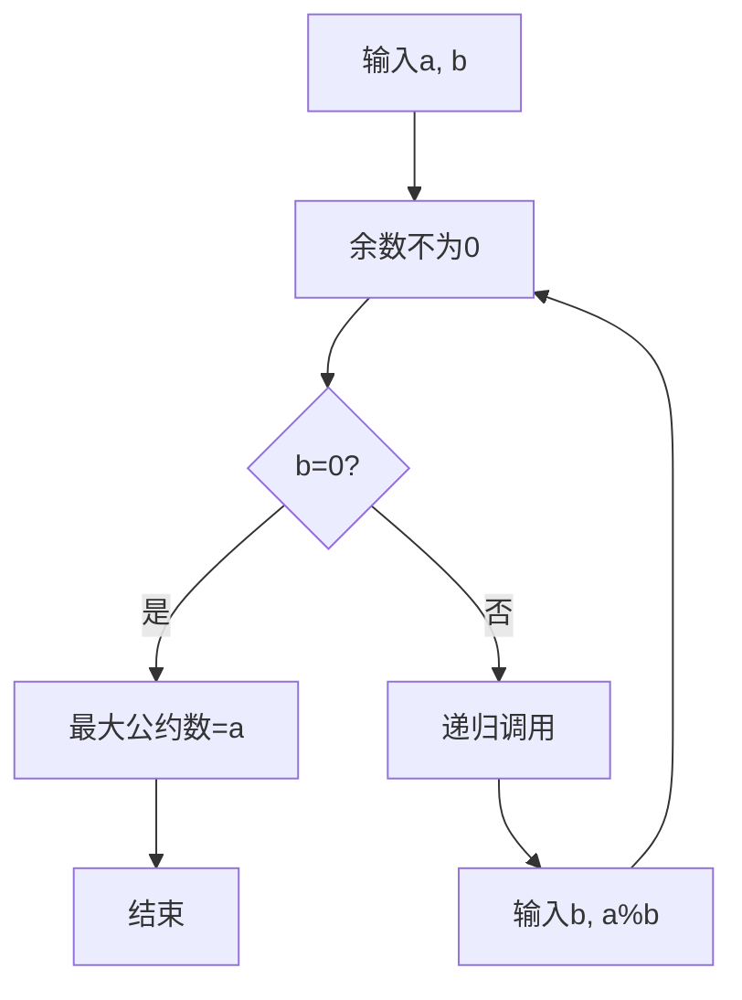

                 

### 数学与数论：整数性质的数学研究

关键词：数学、数论、整数性质、算法、应用

摘要：本文从数学与数论的基本概念出发，逐步探讨整数性质的研究。通过对数论中的基本问题、算法、函数、特殊数及其在各个领域中的应用进行详细分析，本文旨在为读者提供一个全面、系统的数论研究视角，并探讨其未来的发展趋势与挑战。

### 目录大纲

1. 数学与数论基础
    1.1 数学与数论概述
    1.2 数论的基本问题
    1.3 数论的基本定理
2. 数论中的算法
    2.1 算法介绍
    2.2 埃拉托斯特尼筛法
    2.3 欧几里得算法
3. 数论中的函数
    3.1 函数的基本概念
    3.2 摩尔根函数
    3.3 莫比乌斯反演
4. 数论中的特殊数
    4.1 质数与质数分布
    4.2 勒让德数
    4.3 阶乘数
5. 数论在实际应用中的运用
    5.1 数论在密码学中的应用
    5.2 数论在计算机科学中的应用
    5.3 数论在其他领域中的应用
6. 数论的发展与挑战
    6.1 数论的历史发展
    6.2 数论面临的挑战
7. 数论学习指南
    7.1 学习资源
    7.2 学习方法
    7.3 总结与展望

### 第一部分：数学与数论基础

#### 第1章：数学与数论概述

**1.1 数学与数论的基本概念**

**数学的定义**：数学是一门研究数量、结构、变化和空间等概念的抽象科学。它使用逻辑推理从基本假设（公理）出发，建立严密的推理体系。

**数论的定义**：数论是数学的一个分支，主要研究整数的性质，包括因数、倍数、质数、合数等。

**数学与数论的关系**：数学是数论的基础，数论是数学的一个重要组成部分。数论的研究成果对数学的其他分支，如代数、几何、分析等，都有重要的启示和推动作用。

**1.2 数论的基本问题**

**因数与倍数**：因数是指能整除给定整数的数，倍数是指给定整数与任意整数相乘的结果。因数与倍数的研究帮助我们理解整数的结构。

**质数与合数**：质数是仅能被1和自身整除的整数，合数是除了1和自身外还有其他因数的整数。质数与合数的研究是数论的核心问题之一。

**最大公约数与最小公倍数**：最大公约数是能整除给定整数的最大整数，最小公倍数是能被给定整数整除的最小整数。它们在解决实际问题时非常重要。

**1.3 数论的基本定理**

**费马小定理**：如果p是一个质数，a是任意整数，则a的p-1次幂除以p的结果等于a除以p的结果。

$$
a^{p-1} \equiv 1 \pmod{p}
$$

**欧拉定理**：如果a和n是互质的整数，则a的欧拉函数值φ(n)次幂除以n的结果等于a除以n的结果。

$$
a^{\phi(n)} \equiv 1 \pmod{n}
$$

这些定理为解决数论中的许多问题提供了强有力的工具。

#### 第2章：数论中的算法

**2.1 算法介绍**

**算法的定义**：算法是一系列有序的操作步骤，用于解决问题或完成特定任务。

**算法的基本要素**：算法包括输入、输出、处理过程和条件判断等基本要素。一个有效的算法应该是正确的、完整的和有限的。

**2.2 埃拉托斯特尼筛法**

**算法原理**：埃拉托斯特尼筛法是一种用于求解所有小于等于n的质数的算法。它通过不断标记非质数，最终得到所有质数。

$$
\text{Sieve of Eratosthenes Algorithm}:
\begin{align*}
&\text{Input}: n \text{ (上限)}\\
&\text{Output}: \text{所有小于等于n的质数} \\
&\text{Step 1}: \text{初始化一个布尔数组is_prime，其中每个元素都设为True，表示对应索引的数是质数。}\\
&\text{Step 2}: \text{遍历2到n的所有整数i，如果is_prime[i]为True，则它是一个质数，标记所有i的倍数为False。}\\
&\text{Step 3}: \text{输出所有标记为True的数。}
\end{align*}
$$

**算法流程图**

```mermaid
graph TD
A[初始化] --> B[布尔数组]
B --> C[2到n遍历]
C --> D{is_prime[i]}
D -->|True| E[标记倍数]
E --> F[输出质数]
F --> G[结束]
D -->|False| H[继续遍历]
H --> C
```

**2.3 欧几里得算法**

**算法原理**：欧几里得算法是一种用于求解最大公约数的算法。它通过不断用较小数去除较大数，直到余数为0，求得最大公约数。

$$
\text{Euclidean Algorithm}:
\begin{align*}
&\text{Input}: a, b \text{ (两个整数)}\\
&\text{Output}: \text{最大公约数} \\
&\text{Step 1}: \text{如果b为0，则最大公约数为a，结束。}\\
&\text{Step 2}: \text{否则，递归调用欧几里得算法，将b和a%b作为新的输入。}\\
&\text{Step 3}: \text{直到余数为0，此时b即为最大公约数。}
\end{align*}
$$

**算法流程图**



#### 第3章：数论中的函数

**3.1 函数的基本概念**

**函数的定义**：函数是一种数学对象，它将一个集合中的每个元素与另一个集合中的一个唯一元素对应起来。

**函数的性质**：函数具有单射、满射和双射等性质。单射是指每个元素在函数中有且仅有一个前像；满射是指每个元素在函数中有且仅有一个后像；双射是指函数既是单射又是满射。

**3.2 摩尔根函数**

**函数定义**：摩尔根函数是一种用于计算集合中元素个数的函数。对于集合A，摩尔根函数计算的是集合A中所有子集的个数。

$$
\text{Morgan Function}:
\begin{align*}
&\text{Input}: A \text{ (集合)}\\
&\text{Output}: 2^{|A|} \text{ (集合A的子集个数)} \\
\end{align*}
$$

**函数性质**：摩尔根函数是一个非负整数函数，且对于任意集合A，都有$$2^{|A|} = 2^{|A|}$$。摩尔根函数的应用广泛，尤其在组合数学中具有重要意义。

**函数应用**：摩尔根函数可以用于计算集合的子集个数，例如，对于一个包含n个元素的集合，它的子集个数为$$2^n$$。这个函数在计算机科学中，特别是在组合问题和算法设计中有着广泛的应用。

**3.3 莫比乌斯反演**

**函数定义**：莫比乌斯反演是一种用于变换两个函数的函数。对于两个函数f(n)和g(n)，莫比乌斯反演可以将其转换为$$f(n) = \sum_{d|n} g(d)$$，其中d是n的因数。

$$
\text{Mobius Inversion}:
\begin{align*}
&\text{Input}: f(n), g(n) \text{ (两个函数)}\\
&\text{Output}: f(n) = \sum_{d|n} g(d) \\
\end{align*}
$$

**函数性质**：莫比乌斯反演具有以下性质：

1. 如果g(n)是奇函数，则$$f(n) = \sum_{d|n} g(d)$$是偶函数。
2. 如果g(n)是偶函数，则$$f(n) = \sum_{d|n} g(d)$$是奇函数。
3. 莫比乌斯反演可以用于求解某些复杂的问题，例如计算数论函数。

**函数应用**：莫比乌斯反演在数论中有着广泛的应用。例如，它可以用于求解某些数论函数，如欧拉函数、莫比乌斯函数等。这些函数在密码学、计算机科学等领域中具有重要的应用价值。

### 第4章：数论中的特殊数

#### 4.1 质数与质数分布

**质数的定义**：质数是仅能被1和自身整除的大于1的整数。例如，2、3、5、7、11等都是质数。

**质数的性质**：质数具有以下性质：

1. 质数是无穷的。欧拉在1782年证明了存在无穷多个质数。
2. 质数在数轴上的分布是随机的，但遵循一定的规律。
3. 质数在计算和算法设计中具有重要应用。

**质数分布**：质数的分布可以用概率统计的方法进行分析。根据质数定理，质数的分布近似服从泊松分布。质数定理表明，对于任意大于1的整数n，存在一个常数C，使得质数的分布满足以下公式：

$$
\pi(n) \approx \frac{n}{\ln(n)}
$$

其中，π(n)表示小于等于n的质数的个数。

**4.2 勒让德数**

**数的定义**：勒让德数是数论中的一个重要概念，用于表示两个整数的最大公约数。对于两个整数a和b，勒让德数记为$$(a, b)$$。

$$
\text{Legendre Number}:
\begin{align*}
&\text{Input}: a, b \text{ (两个整数)}\\
&\text{Output}: (a, b) \text{ (最大公约数)} \\
\end{align*}
$$

**数的性质**：勒让德数具有以下性质：

1. 勒让德数是非负整数。
2. 勒让德数满足交换律和结合律。
3. 勒让德数在数论中的应用广泛，可以用于解决许多相关问题。

**4.3 阶乘数**

**数的定义**：阶乘数是数论中的一个重要概念，用于表示一个整数的阶乘。对于整数n，阶乘数记为$$n!$$。

$$
\text{Factorial Number}:
\begin{align*}
&\text{Input}: n \text{ (整数)}\\
&\text{Output}: n! \text{ (阶乘数)} \\
\end{align*}
$$

**数的性质**：阶乘数具有以下性质：

1. 阶乘数是非负整数。
2. 阶乘数满足递归关系，即$$n! = n \times (n-1)!$$。
3. 阶乘数在计算机科学和组合数学中有着广泛的应用。

### 第5章：数论在实际应用中的运用

#### 5.1 数论在密码学中的应用

**公钥密码体制**：公钥密码体制是一种基于数学难题的加密方式。它使用一对密钥：公钥和私钥。公钥用于加密，私钥用于解密。数论中的质数和模运算在公钥密码体制中有着广泛的应用。

**数字签名**：数字签名是一种用于验证数据完整性和真实性的技术。它利用数论中的模运算和单向函数来实现。数字签名可以确保数据的发送者无法否认其发送行为，并且数据的接收者可以验证数据的真实性。

#### 5.2 数论在计算机科学中的应用

**计算几何**：计算几何是计算机科学中的一个重要分支，它研究如何使用算法来解决几何问题。数论中的质数和模运算在计算几何中有着广泛的应用，例如在求解凸包问题和最近点问题中。

**图论**：图论是研究图形和网络的数学分支。数论中的质数和模运算在图论中有着广泛的应用，例如在求解最大流问题和最小生成树问题中。

#### 5.3 数论在其他领域中的应用

**数学物理**：数论在数学物理中有着广泛的应用。例如，在量子物理学中，数论中的质数和模运算被用于研究量子态的编码和解码。

**经济学**：数论在经济学中也有着一定的应用。例如，在博弈论中，数论中的质数和模运算被用于研究策略选择和合作博弈。

### 第6章：数论的发展与挑战

#### 6.1 数论的历史发展

**古代数学与数论**：数论的研究可以追溯到古代数学。古希腊数学家欧几里得在《几何原本》中提出了许多关于数论的基本问题，如质数分布和最大公约数。

**现代数学与数论**：19世纪以来，数论得到了迅速发展。数学家如高斯、黎曼、阿贝尔等对数论的研究做出了重大贡献，奠定了现代数论的基础。

#### 6.2 数论面临的挑战

**未解决的问题**：尽管数论已经取得了许多进展，但仍有许多问题尚未解决。例如，哥德巴赫猜想、黎曼猜想等都是数论中的未解决问题。

**发展趋势**：随着数学和计算机科学的发展，数论正面临着新的挑战和机遇。未来的数论研究将更加注重理论与应用的结合，特别是在密码学、计算机科学和其他领域中的应用。

### 第7章：数论学习指南

#### 7.1 学习资源

**推荐书籍**：

- 《数论基础》
- 《数学中的证明》
- 《数论导论》

**在线课程**：

- Coursera上的《数论与密码学》
- edX上的《数学基础》

#### 7.2 学习方法

**有效学习方法**：

- 从基本概念入手，逐步深入
- 通过实践和编程来巩固理论知识
- 学习相关的数学和计算机科学知识

**实践建议**：

- 解决数论中的实际问题，如质数分布、最大公约数等
- 参与数论相关的学术研究和项目
- 多读书、多思考、多交流

#### 7.3 总结与展望

**学习数论的重要性**：数论是数学中的一个重要分支，它不仅在理论上具有重要意义，而且在实际应用中有着广泛的应用。学习数论可以帮助我们更好地理解整数性质，提高数学素养，培养逻辑思维和创新能力。

**展望未来**：随着科学技术的不断发展，数论将继续发挥其重要作用。未来数论的研究将更加注重交叉学科的应用，如密码学、计算机科学、物理学等。同时，新的问题和挑战也将不断出现，为数学家提供更多的研究机会。

### 总结

数学与数论是数学中一个重要而有趣的分支，它研究整数的性质和关系。本文从基本概念出发，逐步介绍了数论中的基本问题、算法、函数、特殊数及其在实际应用中的运用。通过学习数论，我们可以更好地理解整数性质，培养逻辑思维和创新能力。未来，数论将继续在各个领域中发挥重要作用。让我们一同探索数论的奥秘，为数学的发展贡献自己的力量。

### 作者信息

作者：AI天才研究院/AI Genius Institute & 禅与计算机程序设计艺术 /Zen And The Art of Computer Programming

