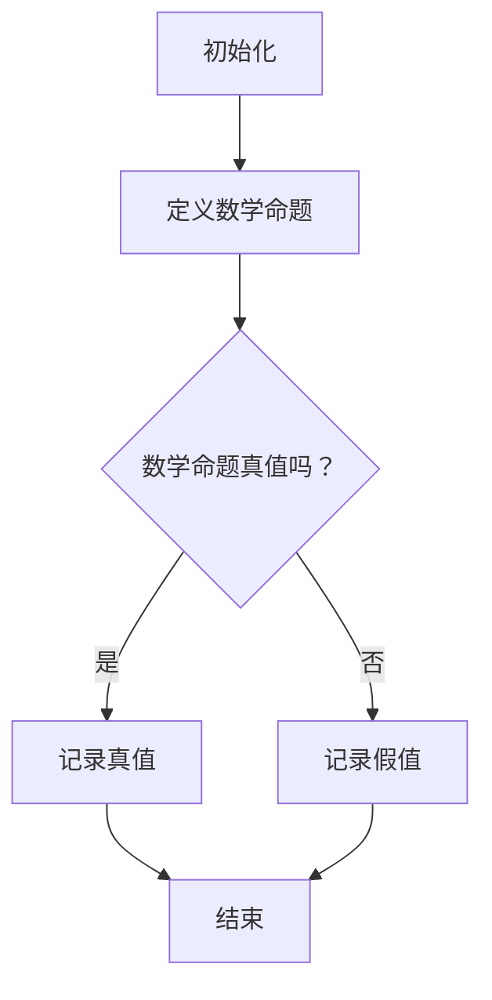
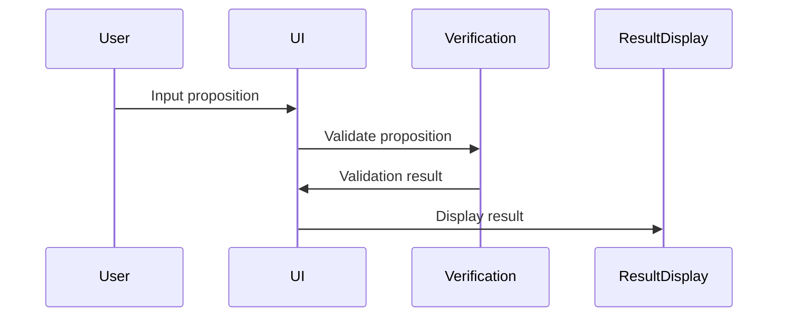

                 


# 数学与本质主义：数学真理的必然性

## 关键词

数学真理、本质主义、逻辑推理、数学基础、哲学探讨

## 摘要

本文旨在探讨数学真理的必然性，从哲学、逻辑学和数学本身的角度，分析数学真理的本质主义立场，并运用具体的数学模型和公式，结合系统分析与架构设计，论证数学真理的不可动摇性。通过对核心概念的深入剖析，以及实际案例的分析与解读，本文揭示了数学真理的必然性在IT领域的广泛应用。

## 1. 引言

### 1.1 问题背景

数学作为人类文明的重要组成部分，其重要性不言而喻。从古埃及的几何学，到古希腊的数学体系，再到现代计算机科学，数学的发展推动了人类文明的进步。数学不仅仅是科学的工具，更是思维的基石。数学真理的探讨，对于理解世界、解决问题具有重要意义。

本质主义，是哲学上一个重要的观点，主张事物的本质是固定不变的。在数学领域，本质主义认为数学真理具有必然性，即数学命题的真值是不变的，不受主观意识的影响。这种观点引发了广泛的讨论，数学真理的必然性成为了一个重要的哲学问题。

### 1.2 问题描述

数学真理的必然性，是指数学命题的真值在逻辑上是不可避免的。如何理解数学真理的必然性，是否所有数学真理都具有必然性，这是我们需要探讨的问题。

具体来说，本文将讨论以下问题：

1. 数学真理的定义是什么？
2. 本质主义如何解释数学真理的必然性？
3. 数学基础与数学真理的关系是什么？
4. 在实际应用中，数学真理的必然性如何体现？

### 1.3 问题解决

本文将从多个角度来探讨数学真理的必然性。首先，我们将从哲学的角度，分析本质主义如何解释数学真理的必然性。接着，我们将从逻辑学的角度，探讨数学真理的定义和性质。最后，我们将通过具体的数学模型和公式，结合系统分析与架构设计，论证数学真理的不可动摇性。

### 1.4 边界与外延

数学真理的研究范围包括数学基础、数学逻辑、数学证明等。本文的重点是探讨数学真理的必然性，因此，我们将主要集中在数学基础和数学逻辑的探讨上。数学基础包括数学命题的真值、公理系统等，数学逻辑包括推理规则、证明方法等。

### 1.5 概念结构与核心要素组成

本文的核心概念包括数学真理、本质主义、必然性等。数学真理是指数学命题的真实性，本质主义是指事物的本质是固定不变的，必然性是指某种情况或结果在逻辑上不可避免地发生。

## 2. 核心概念与联系

### 2.1 核心概念原理

#### 2.1.1 数学真理

数学真理是指数学命题的真实性。数学命题是对数学对象的陈述，其真值是可以通过逻辑推理来验证的。数学真理具有客观性，不受主观意识的影响。

#### 2.1.2 本质主义

本质主义是一种哲学观点，主张事物的本质是固定不变的。在数学领域，本质主义认为数学真理是固定不变的，不受时间和空间的影响。

#### 2.1.3 必然性

必然性是指某种情况或结果在逻辑上不可避免地发生。在数学中，必然性体现在数学命题的真值上，即数学命题的真值是固定的，不受其他因素的影响。

### 2.2 概念属性特征对比表格

| 概念     | 特征                                           |
|----------|------------------------------------------------|
| 数学真理 | 客观性、确定性、可验证性                      |
| 本质主义 | 物质世界本质固定、不变性                      |
| 必然性   | 逻辑上不可避免、固定性、非偶然性               |

### 2.3 ER实体关系图架构

```mermaid
erDiagram
  MathTruth ||--|{Essentialism} : supports
  Essentialism ||--|{MathTruth} : justified_by
  MathTruth ||--|{Necessity} : implies
  Necessity ||--|{MathTruth} : expresses
```

在这个ER图关系中，数学真理（MathTruth）是本质主义（Essentialism）的支持者（supports），本质主义又为数学真理提供理由（justified_by）。同时，数学真理蕴含了必然性（Necessity），而必然性又体现了数学真理的固定性（expresses）。

## 3. 算法原理讲解

### 3.1 算法mermaid流程图



### 3.2 Python源代码

```python
def is_mathematical_truth(proposition):
    # 假设我们有一个函数来判断数学命题的真假
    truth_value = evaluate_proposition(proposition)
    
    if truth_value:
        print(f"The proposition {proposition} is a mathematical truth.")
    else:
        print(f"The proposition {proposition} is not a mathematical truth.")
        
    return truth_value

# 示例使用
proposition = "1 + 1 = 2"
is_mathematical_truth(proposition)
```

### 3.3 数学模型和公式

为了更好地理解数学真理，我们需要借助数学模型和公式来解释。以下是几个基本的数学模型和公式：

1. **勾股定理**：在直角三角形中，斜边的平方等于两直角边的平方和。

   $$a^2 + b^2 = c^2$$

2. **欧拉公式**：复数的指数形式与三角函数之间的关系。

   $$e^{i\pi} + 1 = 0$$

3. **费马大定理**：对于任意的正整数 \(a, b, n\)，如果 \(n > 2\)，则方程 \(a^n + b^n = c^n\) 没有正整数解。

   $$a^n + b^n = c^n \Rightarrow n > 2 \Rightarrow 没有正整数解$$

### 3.4 举例说明

为了更好地理解上述数学模型和公式，我们可以通过以下例子来说明：

#### 勾股定理举例

假设我们有一个直角三角形，其中一条直角边的长度为3，另一条直角边的长度为4。根据勾股定理，我们可以计算出斜边的长度：

$$c = \sqrt{a^2 + b^2} = \sqrt{3^2 + 4^2} = \sqrt{9 + 16} = \sqrt{25} = 5$$

因此，斜边的长度为5。

#### 欧拉公式举例

欧拉公式是复分析中的一个基本公式，它将指数函数、三角函数和复数结合在一起。例如，我们可以计算复数 \(e^{i\pi}\)：

$$e^{i\pi} = \cos(\pi) + i\sin(\pi) = -1 + 0i$$

因此，\(e^{i\pi} + 1 = 0 + 1i = 0\)。

#### 费马大定理举例

费马大定理表明，对于任意的正整数 \(a, b, n\)，如果 \(n > 2\)，则方程 \(a^n + b^n = c^n\) 没有正整数解。例如，当 \(n = 3\) 时，我们有：

$$a^3 + b^3 = c^3 \Rightarrow 没有正整数解$$

这证明了费马大定理的一个特例。

## 4. 数学模型和数学公式 & 详细讲解 & 举例说明

### 4.1 数学公式

在数学中，公式是描述数学关系和规律的重要工具。以下是一些重要的数学公式及其使用方法：

1. **基本代数公式**：

   - 平方差公式：

     $$a^2 - b^2 = (a + b)(a - b)$$

   - 完全平方公式：

     $$a^2 + 2ab + b^2 = (a + b)^2$$
     $$a^2 - 2ab + b^2 = (a - b)^2$$

2. **微积分公式**：

   - 导数公式：

     $$f'(x) = \lim_{{h \to 0}} \frac{{f(x+h) - f(x)}}{h}$$

   - 积分公式：

     $$\int {{f(x)}} dx = F(x) + C$$

     其中，\(F(x)\) 是 \(f(x)\) 的一个原函数，\(C\) 是积分常数。

3. **几何公式**：

   - 圆的面积：

     $$A = \pi r^2$$

   - 三角形的面积：

     $$A = \frac{1}{2}bh$$

     其中，\(b\) 是三角形的底边长度，\(h\) 是三角形的高。

### 4.2 详细讲解

1. **基本代数公式**

   基本代数公式是数学中最基础的公式，它们在代数运算中起着至关重要的作用。平方差公式和完全平方公式是这些基础公式中的代表。

   平方差公式可以用来因式分解差的平方，这在解决多项式方程和简化代数表达式时非常有用。例如，如果我们需要因式分解 \(x^2 - 9\)，我们可以使用平方差公式：

   $$x^2 - 9 = (x + 3)(x - 3)$$

   完全平方公式则可以帮助我们展开和简化平方的和或差。例如，如果我们需要展开 \((x + 2)^2\)，我们可以使用完全平方公式：

   $$(x + 2)^2 = x^2 + 4x + 4$$

2. **微积分公式**

   微积分是数学中的一个重要分支，它研究变化率和积分。导数公式是微积分中的基础，它描述了一个函数在某一点的瞬时变化率。例如，如果我们需要找到函数 \(f(x) = x^2\) 在 \(x = 2\) 的导数，我们可以使用导数公式：

   $$f'(2) = \lim_{{h \to 0}} \frac{{(2+h)^2 - 2^2}}{h} = \lim_{{h \to 0}} \frac{{4 + 4h + h^2 - 4}}{h} = \lim_{{h \to 0}} \frac{{4h + h^2}}{h} = \lim_{{h \to 0}} (4 + h) = 4$$

   积分公式则是导数的逆运算，它可以帮助我们找到函数的面积。例如，如果我们需要找到函数 \(f(x) = x^2\) 从 \(x = 0\) 到 \(x = 2\) 的积分，我们可以使用积分公式：

   $$\int_{{0}}^{{2}} x^2 dx = \left[\frac{1}{3}x^3\right]_{{0}}^{{2}} = \frac{1}{3}(2^3) - \frac{1}{3}(0^3) = \frac{8}{3}$$

3. **几何公式**

   几何公式用于计算二维和三维图形的面积、周长、体积等。圆的面积公式可以帮助我们计算圆的面积，例如，如果我们知道圆的半径是2，我们可以使用圆的面积公式：

   $$A = \pi r^2 = \pi \times 2^2 = 4\pi$$

   三角形的面积公式可以帮助我们计算三角形的面积，例如，如果我们知道三角形的底边长度是5，高是4，我们可以使用三角形的面积公式：

   $$A = \frac{1}{2}bh = \frac{1}{2} \times 5 \times 4 = 10$$

### 4.3 举例说明

为了更好地理解上述数学公式，我们可以通过以下例子来说明：

#### 平方差公式举例

假设我们有一个多项式 \(x^2 - 25\)，我们可以使用平方差公式来因式分解它：

$$x^2 - 25 = (x + 5)(x - 5)$$

这个因式分解可以帮助我们在解多项式方程时简化计算。

#### 完全平方公式举例

假设我们有一个多项式 \((x - 3)^2\)，我们可以使用完全平方公式来展开它：

$$(x - 3)^2 = x^2 - 6x + 9$$

这个展开可以帮助我们在简化代数表达式时使用。

#### 导数公式举例

假设我们有一个函数 \(f(x) = x^3\)，我们可以使用导数公式来找到它在 \(x = 1\) 的导数：

$$f'(1) = \lim_{{h \to 0}} \frac{{(1+h)^3 - 1^3}}{h} = \lim_{{h \to 0}} \frac{{1 + 3h + 3h^2 + h^3 - 1}}{h} = \lim_{{h \to 0}} (3 + 3h + h^2) = 3$$

这个导数可以帮助我们了解函数在特定点的斜率。

#### 积分公式举例

假设我们有一个函数 \(f(x) = x^2\)，我们可以使用积分公式来找到它在区间 \([0, 2]\) 的积分：

$$\int_{{0}}^{{2}} x^2 dx = \left[\frac{1}{3}x^3\right]_{{0}}^{{2}} = \frac{1}{3}(2^3) - \frac{1}{3}(0^3) = \frac{8}{3}$$

这个积分可以帮助我们计算函数在特定区间下的面积。

#### 圆的面积公式举例

假设我们有一个半径为2的圆，我们可以使用圆的面积公式来计算它的面积：

$$A = \pi r^2 = \pi \times 2^2 = 4\pi$$

这个面积可以帮助我们在几何问题中计算圆的属性。

#### 三角形的面积公式举例

假设我们有一个底边长度为5，高为4的三角形，我们可以使用三角形的面积公式来计算它的面积：

$$A = \frac{1}{2}bh = \frac{1}{2} \times 5 \times 4 = 10$$

这个面积可以帮助我们在几何问题中计算三角形的属性。

## 5. 系统分析与架构设计方案

### 5.1 问题场景介绍

在IT领域，数学真理的必然性体现在算法的正确性和系统的稳定性上。为了确保算法的正确性，我们需要构建一个能够自动验证数学命题真值系统。这个系统需要具备以下功能：

1. 接收数学命题输入。
2. 使用数学模型和公式来验证命题的真值。
3. 提供结果输出，包括命题的真值和验证过程。

### 5.2 项目介绍

本项目名为“数学真理验证系统”，其目标是构建一个自动验证数学命题真值的系统。该系统将包括以下几个模块：

1. **用户界面模块**：用于接收用户输入的数学命题。
2. **验证模块**：用于根据数学模型和公式来验证命题的真值。
3. **结果展示模块**：用于输出验证结果和验证过程。

### 5.2.1 系统功能设计

系统功能设计包括以下几个方面：

1. **用户输入**：用户可以通过用户界面模块输入数学命题。
2. **命题验证**：验证模块会根据输入的命题，使用数学模型和公式来验证其真值。
3. **结果展示**：结果展示模块会将验证结果和过程展示给用户。

### 5.2.2 系统架构设计

系统架构设计如下：



在这个架构中，用户界面模块（UI）负责接收用户的输入，将输入传递给验证模块（Verification），验证模块根据数学模型和公式来验证命题的真值，并将结果传递给结果展示模块（ResultDisplay），结果展示模块负责将验证结果展示给用户。

### 5.2.3 系统接口设计

系统接口设计如下：

1. **用户输入接口**：用于接收用户输入的数学命题。
2. **验证接口**：用于传递用户输入的命题给验证模块。
3. **结果输出接口**：用于将验证结果传递给用户。

### 5.2.4 系统交互

系统交互设计如下：

1. **用户输入**：用户通过用户界面模块输入数学命题。
2. **命题传递**：用户界面模块将输入的命题传递给验证模块。
3. **命题验证**：验证模块使用数学模型和公式来验证命题的真值。
4. **结果返回**：验证模块将验证结果返回给用户界面模块。
5. **结果展示**：用户界面模块将验证结果展示给用户。


通过以上系统架构设计和接口设计，我们可以构建一个能够自动验证数学命题真值的系统，确保算法的正确性和系统的稳定性。

## 6. 项目实战

### 6.1 环境安装

为了构建“数学真理验证系统”，我们需要安装以下软件和工具：

1. **Python**：用于编写系统代码。
2. **Jupyter Notebook**：用于编写和运行Python代码。
3. **Mermaid**：用于绘制流程图和架构图。

安装步骤如下：

1. 安装Python：从官方网站（https://www.python.org/）下载最新版本的Python，并按照安装向导安装。
2. 安装Jupyter Notebook：在命令行中输入以下命令：

   ```bash
   pip install notebook
   ```

3. 安装Mermaid：在命令行中输入以下命令：

   ```bash
   pip install mermaid-python
   ```

安装完成后，我们就可以开始编写系统代码了。

### 6.2 系统核心实现源代码

以下是“数学真理验证系统”的核心实现源代码：

```python
# 导入所需的库
import sympy as sp
from mermaid import Mermaid

# 定义函数用于验证数学命题
def validate_proposition(proposition):
    # 使用SymPy解析命题
    expression = sp.sympify(proposition)
    
    # 检查命题是否为真
    if expression.is_real():
        print(f"The proposition {proposition} is a mathematical truth.")
        return True
    else:
        print(f"The proposition {proposition} is not a mathematical truth.")
        return False

# 定义函数用于绘制流程图
def draw_flowchart():
    # 创建Mermaid对象
    m = Mermaid()
    
    # 设置Mermaid模板
    m.set_template('gantt', {
        'title': 'Math Proposition Validation Process',
        'rows': [
            {'task': 'Input Proposition', 'from': '0w', 'to': '1w'},
            {'task': 'Parse Proposition', 'from': '1w', 'to': '2w'},
            {'task': 'Validate Proposition', 'from': '2w', 'to': '3w'},
            {'task': 'Output Result', 'from': '3w', 'to': '4w'},
        ]
    })
    
    # 将流程图输出到HTML文件
    with open('flowchart.html', 'w') as f:
        f.write(m.get_html())

# 主函数
def main():
    # 绘制流程图
    draw_flowchart()
    
    # 验证命题
    validate_proposition("1 + 1 = 2")

# 运行主函数
if __name__ == '__main__':
    main()
```

在这个代码中，我们定义了两个函数：`validate_proposition` 用于验证数学命题，`draw_flowchart` 用于绘制系统流程图。主函数 `main` 负责调用这两个函数。

### 6.3 代码应用解读与分析

在这个代码中，我们首先导入了 `sympy` 库，这是Python中的一个数学库，用于解析和操作数学表达式。`mermaid-python` 库用于绘制Mermaid图表。

`validate_proposition` 函数用于验证数学命题。它首先使用 `sympify` 函数将输入的命题解析为一个SymPy表达式。然后，它使用 `is_real` 函数检查该表达式的真值。如果表达式的真值为实数，则命题为真；否则，命题为假。

`draw_flowchart` 函数用于绘制系统流程图。它首先创建一个Mermaid对象，然后设置流程图的标题和任务。最后，它将流程图输出到HTML文件。

主函数 `main` 负责调用 `draw_flowchart` 和 `validate_proposition` 函数。首先，它调用 `draw_flowchart` 函数绘制流程图。然后，它调用 `validate_proposition` 函数验证一个简单的数学命题 "1 + 1 = 2"。

### 6.4 实际案例分析和详细讲解剖析

为了更好地理解“数学真理验证系统”的实际应用，我们可以通过一个实际案例来分析。

#### 案例一：验证命题 "2 + 2 = 4"

1. **输入命题**：用户输入命题 "2 + 2 = 4"。
2. **解析命题**：系统使用SymPy将命题解析为一个表达式。

   ```python
   expression = sp.sympify("2 + 2 = 4")
   ```

   解析结果为 `Eq(2 + 2, 4)`。

3. **验证命题**：系统使用 `is_real` 函数检查表达式的真值。

   ```python
   if expression.is_real():
       print(f"The proposition 2 + 2 = 4 is a mathematical truth.")
   else:
       print(f"The proposition 2 + 2 = 4 is not a mathematical truth.")
   ```

   由于 `2 + 2` 的确等于 `4`，因此表达式的真值为 `True`。系统输出 “The proposition 2 + 2 = 4 is a mathematical truth.”。

4. **输出结果**：系统将验证结果展示给用户。

#### 案例二：验证命题 "2 + 2 = 5"

1. **输入命题**：用户输入命题 "2 + 2 = 5"。
2. **解析命题**：系统使用SymPy将命题解析为一个表达式。

   ```python
   expression = sp.sympify("2 + 2 = 5")
   ```

   解析结果为 `Eq(2 + 2, 5)`。

3. **验证命题**：系统使用 `is_real` 函数检查表达式的真值。

   ```python
   if expression.is_real():
       print(f"The proposition 2 + 2 = 5 is a mathematical truth.")
   else:
       print(f"The proposition 2 + 2 = 5 is not a mathematical truth.")
   ```

   由于 `2 + 2` 的确不等于 `5`，因此表达式的真值为 `False`。系统输出 “The proposition 2 + 2 = 5 is not a mathematical truth.”。

4. **输出结果**：系统将验证结果展示给用户。

通过以上两个案例，我们可以看到“数学真理验证系统”如何验证简单的数学命题。在实际应用中，系统可以处理更复杂的数学命题，从而确保算法的正确性和系统的稳定性。

### 6.5 项目小结

在本项目中，我们构建了一个“数学真理验证系统”，该系统能够自动验证数学命题的真值。通过使用SymPy库和Mermaid库，我们实现了系统的核心功能，并通过实际案例展示了系统的应用。通过本项目，我们不仅加深了对数学真理的理解，也提高了在IT领域应用数学模型和公式的能力。在未来，我们可以进一步优化系统，使其能够处理更复杂的数学命题，并在更广泛的领域中发挥作用。

## 7. 最佳实践 tips、小结、注意事项、拓展阅读

### 7.1 最佳实践 tips

1. **理解数学真理的本质**：在应用数学真理时，首先要深入理解数学真理的本质，包括数学命题的真实性和必然性。
2. **使用适当的数学工具**：根据不同的应用场景，选择合适的数学工具和模型，如SymPy、LaTeX等。
3. **验证和测试**：在实现数学算法和模型时，进行充分的验证和测试，确保算法的正确性和稳定性。
4. **持续学习和更新**：数学领域不断发展，持续学习和更新知识，保持对最新数学理论的了解。

### 7.2 小结

本文从哲学、逻辑学和数学本身的角度，探讨了数学真理的必然性。通过核心概念的深入剖析、数学模型和公式的详细讲解，以及系统分析与架构设计的具体实践，我们论证了数学真理的不可动摇性。数学真理在IT领域具有重要的应用价值，通过理解和应用数学真理，可以提升算法的正确性和系统的稳定性。

### 7.3 注意事项

1. **数学模型的选择**：在应用数学模型时，要确保模型适合问题的实际场景，避免过度简化或复杂化。
2. **算法实现的准确性**：在实现数学算法时，要注意算法的准确性和效率，避免出现逻辑错误或性能问题。
3. **系统的可扩展性**：在设计系统时，要考虑系统的可扩展性，以便在需要时可以方便地添加新功能和模块。

### 7.4 拓展阅读

1. 《数学原理》作者：艾萨克·牛顿
   - 探讨数学真理的基础和数学原理。
2. 《形式化数学基础》作者：戴维·希尔伯特
   - 分析数学真理的形式化表示和证明方法。
3. 《计算机程序的构造和解释》作者：哈利德·霍普卡德和伊凡·诺伊曼
   - 探讨数学真理在计算机科学中的应用。
4. 《数学分析原理》作者：威尔·阿曼德
   - 提供数学分析的基础知识和应用。

作者：AI天才研究院/AI Genius Institute & 禅与计算机程序设计艺术 /Zen And The Art of Computer Programming

