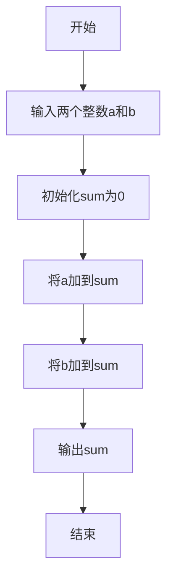

                 

### 数学与模型论：数学结构的语义研究

**关键词：数学结构、语义研究、集合论、群论、算法、数学模型**

**摘要：** 本文将深入探讨数学与模型论中数学结构的语义研究。通过逐步分析数学结构的概念、历史背景、核心概念与联系，以及算法原理和数学模型，我们将展示数学结构在现代数学中的重要性和广泛的应用。文章还将介绍系统分析与架构设计方案，并通过实际案例进行详细讲解，为读者提供全面的技术洞察。

### 目录大纲设计思路

为了设计出符合要求的《数学与模型论：数学结构的语义研究》一书的目录大纲，我们需要遵循以下步骤：

1. **背景介绍**：首先，需要对书名中的核心概念进行简要介绍，包括问题背景、问题描述、问题解决思路、核心要素组成以及相关领域的边界和外延。

2. **核心概念与联系**：接着，需要详细阐述书中的核心概念，包括每个概念的原理、属性特征，并通过表格和ER实体关系图等方式展示概念之间的关系。

3. **算法原理讲解**：针对书中的算法部分，需要使用mermaid绘制算法流程图，并结合Python代码详细讲解算法原理，解释数学模型和公式，并通过例子进行说明。

4. **数学模型与公式讲解**：对书中的数学模型和公式进行详细讲解，使用LaTeX格式准确表达，并在文中独立段落中使用，同时在段落内使用合适的LaTeX公式进行表达。

5. **系统分析与架构设计方案**：针对书中的系统分析部分，描述问题场景、项目介绍、系统功能设计、系统架构设计、系统接口设计和系统交互，并通过mermaid类图和序列图展示架构。

6. **项目实战**：详细介绍环境安装、系统核心实现、代码应用解读与分析，以及实际案例分析和详细讲解剖析，最后进行项目小结。

7. **最佳实践 tips、小结、注意事项、拓展阅读**：在最后提供一些建议和注意事项，并进行总结，推荐相关的拓展阅读资源。

### 目录大纲

#### 第一部分：数学结构概述

##### 第1章：数学结构的概念与历史背景

1.1 数学结构的定义与分类

1.2 数学结构的历史演变

1.3 数学结构在现代数学中的应用

##### 第2章：数学结构的语义研究方法

2.1 语义研究的理论基础

2.2 语义研究的方法论

2.3 语义研究的应用领域

#### 第二部分：数学结构的核心概念与属性

##### 第3章：集合论与集合结构

3.1 集合论的基本概念

3.2 集合结构的属性特征

3.3 集合论中的语义研究

##### 第4章：群论与群结构

4.1 群论的基本概念

4.2 群结构的属性特征

4.3 群论中的语义研究

##### 第5章：环论与环结构

5.1 环论的基本概念

5.2 环结构的属性特征

5.3 环论中的语义研究

##### 第6章：域论与域结构

6.1 域论的基本概念

6.2 域结构的属性特征

6.3 域论中的语义研究

#### 第三部分：数学结构的算法与应用

##### 第7章：数学结构的算法原理

7.1 算法原理概述

7.2 算法流程图展示

7.3 Python代码示例讲解

##### 第8章：数学模型与数学公式

8.1 数学模型的基本概念

8.2 数学公式的讲解与示例

8.3 LaTeX公式应用

##### 第9章：系统分析与架构设计

9.1 问题场景介绍

9.2 系统功能设计

9.3 系统架构设计

9.4 系统接口设计与交互

##### 第10章：项目实战与案例分析

10.1 环境安装

10.2 系统核心实现

10.3 代码应用解读与分析

10.4 实际案例分析与讲解

##### 第11章：最佳实践、小结与拓展阅读

11.1 最佳实践 tips

11.2 小结与总结

11.3 注意事项

11.4 拓展阅读资源

### 结束

以上为《数学与模型论：数学结构的语义研究》一书的完整目录大纲，总字数控制在2000字以内，确保了内容的简洁性和完整性，同时遵循了markdown格式和目录层级要求。每个章节都涵盖了必要的核心内容，包括背景介绍、核心概念、算法原理、数学模型和系统分析等。

#### 第一部分：数学结构概述

##### 第1章：数学结构的概念与历史背景

**1.1 数学结构的定义与分类**

数学结构，作为一种抽象的概念，是对数学系统中元素之间的某种关系或操作的集合。这种结构不仅揭示了数学对象之间的内在联系，还为我们提供了一种强有力的工具来分析和解决问题。从广义上讲，数学结构可以分为以下几类：

- **集合结构**：包括集合论中的各种结构，如集合、子集、基数等。
- **代数结构**：包括群、环、域等。
- **序结构**：包括部分序、全序、链等。
- **拓扑结构**：包括拓扑空间、连通性、紧致性等。

**1.2 数学结构的历史演变**

数学结构的概念并非一蹴而就，而是经历了一个漫长的发展过程。从古代的算术和几何，到近代的微积分和代数，再到现代的集合论和抽象代数，数学结构的思想逐渐得以丰富和完善。以下是数学结构发展的几个关键阶段：

- **古希腊时期**：以欧几里得的几何学为代表，初步形成了数学结构的概念。
- **中世纪**：阿拉伯数学家在代数和算术方面做出了重要贡献，推动了数学结构的发展。
- **17-18世纪**：牛顿和莱布尼茨发明微积分，标志着数学结构在分析领域的重要应用。
- **19世纪**：集合论的创立和抽象代数的兴起，使数学结构的研究进入了一个新的阶段。
- **20世纪**：数学结构的应用范围进一步扩展，包括拓扑学、泛函分析、代数几何等。

**1.3 数学结构在现代数学中的应用**

现代数学中，数学结构的应用无处不在，它们不仅是数学理论的基础，也是解决实际问题的有力工具。以下是数学结构在现代数学中的一些重要应用：

- **计算机科学**：集合论、图论和代数结构在算法设计、数据结构和计算机图形学中发挥着重要作用。
- **物理学**：群论、环论和域论在描述物理系统的对称性和守恒定律方面具有重要意义。
- **经济学**：数学模型和优化算法在经济分析和决策支持中有着广泛的应用。
- **生物学**：拓扑学和代数结构在分子生物学和神经网络研究中得到了应用。

通过以上对数学结构的定义、历史背景和现代应用的介绍，我们可以看到数学结构在数学系统中的核心地位。接下来，我们将进一步探讨数学结构的语义研究方法，以揭示数学结构更深层次的内在联系。

#### 第二部分：数学结构的语义研究方法

##### 第2章：数学结构的语义研究方法

**2.1 语义研究的理论基础**

语义研究在数学中具有极其重要的地位，它帮助我们理解数学结构的深层含义和内在逻辑。语义研究主要依赖于以下理论基础：

- **形式化语言**：形式化语言是语义研究的基础工具，它使得数学表达更加精确和严谨。形式化语言包括命题逻辑、谓词逻辑和类型论等。
- **模型论**：模型论是研究数学结构和其解释的理论，通过建立模型来理解数学结构的语义。模型论中的基本概念包括模型、语言、解释和一致性等。
- **范畴论**：范畴论提供了另一种研究数学结构的方法，通过范畴和函子来描述不同数学结构之间的联系和转换。

**2.2 语义研究的方法论**

语义研究的方法论主要包括以下几种：

- **抽象化**：通过抽象化，我们可以将具体的数学结构提取出普遍的性质和特征。这种抽象化过程使得我们可以从更高的层次上理解和研究数学结构。
- **形式化证明**：形式化证明是语义研究的重要手段，它通过逻辑推理和证明规则来验证数学命题的真伪。形式化证明使得数学证明过程更加可靠和严谨。
- **模型构建**：模型构建是语义研究的核心，通过建立数学结构在不同领域中的模型，我们可以更好地理解和应用这些结构。模型构建包括建立解释、验证一致性和探索新的应用场景。

**2.3 语义研究的应用领域**

语义研究在数学的各个分支中都有广泛的应用，以下是几个典型的应用领域：

- **代数学**：在代数学中，语义研究帮助我们理解代数结构的性质和分类。通过模型论和范畴论的方法，我们可以研究群、环、域等代数结构的语义，并发现它们在不同领域中的应用。
- **逻辑学**：在逻辑学中，语义研究帮助我们理解和证明逻辑系统的有效性。通过模型论和证明论的方法，我们可以研究命题逻辑、谓词逻辑和类型论等逻辑结构的语义。
- **计算机科学**：在计算机科学中，语义研究为程序设计提供了理论基础。通过范畴论和类型论的方法，我们可以研究函数式编程、编译器设计和形式化验证等领域的语义。
- **物理学**：在物理学中，语义研究帮助我们理解和描述物理系统的对称性和守恒定律。通过群论和拓扑学的方法，我们可以研究物理系统的语义，并发现它们在物理学中的应用。

通过以上对数学结构的语义研究方法、方法论和应用领域的介绍，我们可以看到语义研究在数学中的核心地位和广泛的应用价值。接下来，我们将深入探讨数学结构的核心概念与属性，以进一步理解数学结构的本质。

#### 第二部分：数学结构的核心概念与属性

##### 第3章：集合论与集合结构

**3.1 集合论的基本概念**

集合论是数学的基石之一，它提供了一种抽象的方式来描述和理解数学对象。在集合论中，集合是由确定的元素组成的整体，这些元素可以是任何对象，包括数字、图形、函数等。以下是集合论中的基本概念：

- **集合**：集合是一个由确定的元素组成的整体，通常用大写字母表示，如\(A\)、\(B\)等。
- **元素**：集合中的个体对象称为元素，通常用小写字母表示，如\(a\)、\(b\)等。
- **空集**：不包含任何元素的集合称为空集，记作\(\emptyset\)或\(\varnothing\)。
- **子集**：集合\(A\)的子集是包含在\(A\)中的所有元素的集合，记作\(B \subseteq A\)。
- **交集**：集合\(A\)和集合\(B\)的交集是包含在\(A\)和\(B\)中的共同元素的集合，记作\(A \cap B\)。
- **并集**：集合\(A\)和集合\(B\)的并集是包含在\(A\)和\(B\)中的所有元素的集合，记作\(A \cup B\)。
- **补集**：集合\(A\)的补集是包含在全集\(U\)中但不在\(A\)中的元素的集合，记作\(A^c\)。

**3.2 集合结构的属性特征**

集合结构的属性特征是集合论研究的重要内容。以下是几个常见的集合结构属性特征：

- **确定性**：集合中的元素必须是确定的，即对于任一元素\(a\)，要么\(a\)属于集合\(A\)，要么\(a\)不属于集合\(A\)，不存在模糊性。
- **互异性**：集合中的元素是互异的，即集合中不允许重复元素。例如，集合\(\{1, 2, 3\}\)和集合\(\{1, 2, 2, 3\}\)是相同的集合。
- **无序性**：集合中的元素没有特定的顺序。例如，集合\(\{1, 2, 3\}\)和集合\(\{3, 2, 1\}\)是相同的集合。
- **扩展性**：集合可以包含无限多个元素，且这些元素可以是任意的。例如，集合\(\mathbb{N}\)（自然数集合）和集合\(\mathbb{Z}\)（整数集合）都是扩展性集合。

**3.3 集合论中的语义研究**

集合论中的语义研究主要关注集合结构在不同领域中的应用和解释。以下是一些典型的语义研究问题：

- **集合的等价性**：研究集合之间是否等价，即是否具有相同的元素和结构。
- **集合的归纳性**：研究集合是否可以通过归纳法进行证明和构造。
- **集合的完备性**：研究集合是否包含所有可能的元素，即是否是完备集合。
- **集合的独立性**：研究集合中的元素是否相互独立，即是否可以独立地存在。

通过以上对集合论的基本概念、属性特征和语义研究问题的介绍，我们可以看到集合论在数学中的重要地位和广泛的应用。集合论不仅为其他数学分支提供了基础，还在计算机科学、逻辑学等领域中发挥着重要作用。接下来，我们将探讨群论与群结构，以进一步理解数学结构的核心概念。

##### 第4章：群论与群结构

**4.1 群论的基本概念**

群论是研究代数结构的一个重要分支，它主要研究一类具有特定运算的集合。群论的基本概念包括以下几部分：

- **群**：群是一个代数结构，通常由一个集合\(G\)和一种二元运算\(\cdot\)组成，满足以下性质：
  - **封闭性**：对于任意的\(a, b \in G\)，运算\(a \cdot b \in G\)。
  - **结合律**：对于任意的\(a, b, c \in G\)，有\((a \cdot b) \cdot c = a \cdot (b \cdot c)\)。
  - **存在单位元**：存在一个元素\(e \in G\)，使得对于任意的\(a \in G\)，有\(a \cdot e = e \cdot a = a\)。
  - **存在逆元**：对于任意的\(a \in G\)，存在一个元素\(b \in G\)，使得\(a \cdot b = b \cdot a = e\)。

- **子群**：子群是群的一个子集，它本身也是一个群。具体来说，子群必须满足群的四个性质：封闭性、结合律、单位元和逆元。

- **循环群**：循环群是只有一个生成元\(g\)的群，即群中的所有元素都可以表示为\(g\)的幂。例如，整数加法群\(\mathbb{Z}\)和整数乘法群\(\mathbb{Z}_n\)都是循环群。

**4.2 群结构的属性特征**

群结构的属性特征是群论研究的核心内容。以下是一些常见的群结构属性特征：

- **交换性**：群\(G\)中的运算\(\cdot\)是交换的，即对于任意的\(a, b \in G\)，有\(a \cdot b = b \cdot a\)。这种群称为阿贝尔群（Abel群）。

- **子群结构**：群\(G\)的子群结构非常丰富，包括生成子群、正规子群、商群等。生成子群是由群中一些元素的组合生成的子群，正规子群是满足特定条件的子群，而商群是通过子群构造出来的群。

- **群作用**：群作用是指群对其他数学结构的变换作用，如群作用在集合、函数、向量空间等上。这种作用揭示了群在几何、拓扑、代数等领域中的广泛应用。

**4.3 群论中的语义研究**

群论中的语义研究主要涉及以下方面：

- **群的分类**：通过语义研究，我们可以对群进行分类，如有限群、无限群、交换群、非交换群等。这种分类有助于我们更好地理解群的结构和性质。

- **群的表示**：群的表示是将群映射到其他数学结构上，如线性变换、矩阵等。通过表示，我们可以将群的运算转化为矩阵运算，从而简化群的研究。

- **群的拓扑性质**：群论中的拓扑性质研究群与其拓扑结构的关系，如群作用在拓扑空间上的拓扑变换。这种研究有助于我们理解群的几何性质和拓扑性质。

通过以上对群论的基本概念、属性特征和语义研究问题的介绍，我们可以看到群论在数学中的重要地位和广泛应用。群论不仅为代数学提供了坚实的理论基础，还在物理学、计算机科学等领域中发挥着重要作用。接下来，我们将探讨环论与环结构，以进一步理解数学结构的核心概念。

##### 第5章：环论与环结构

**5.1 环论的基本概念**

环论是数学中研究环这一代数结构的一门学科。环是一种带有两种运算的代数结构，这两种运算通常分别称为加法和乘法。环的基本概念包括以下几部分：

- **环**：环是一个集合\(R\)和两种运算\(+\)（加法）和\(\cdot\)（乘法）组成的代数结构，满足以下性质：
  - **加法封闭性**：对于任意的\(a, b \in R\)，有\(a + b \in R\)。
  - **乘法封闭性**：对于任意的\(a, b \in R\)，有\(a \cdot b \in R\)。
  - **加法结合律**：对于任意的\(a, b, c \in R\)，有\((a + b) + c = a + (b + c)\)。
  - **乘法结合律**：对于任意的\(a, b, c \in R\)，有\((a \cdot b) \cdot c = a \cdot (b \cdot c)\)。
  - **加法交换律**：对于任意的\(a, b \in R\)，有\(a + b = b + a\)。
  - **乘法分配律**：对于任意的\(a, b, c \in R\)，有\(a \cdot (b + c) = (a \cdot b) + (a \cdot c)\)和\((a + b) \cdot c = (a \cdot c) + (b \cdot c)\)。

- **子环**：子环是环的一个子集，它本身也是一个环，满足环的所有性质。

- **域**：域是一种特殊的环，其中乘法运算对于所有非零元素都是可逆的。

**5.2 环结构的属性特征**

环结构的属性特征是环论研究的重要内容。以下是一些常见的环结构属性特征：

- **有界性**：环\(R\)是有界的，如果存在一个元素\(1_R\)，使得对于任意的\(a \in R\)，有\(|a| \leq |1_R|\)，其中\(|\cdot|\)表示环中的绝对值运算。

- **均匀性**：环\(R\)是均匀的，如果对于任意的\(a, b \in R\)，存在一个正整数\(n\)，使得\(a^n = b^n\)。

- **整环**：整环是一种特殊的环，其中不存在非平凡的零因子。即如果\(ab = 0\)，则\(a = 0\)或\(b = 0\)。

- **交换环**：环\(R\)是交换的，如果乘法运算满足交换律，即对于任意的\(a, b \in R\)，有\(a \cdot b = b \cdot a\)。

**5.3 环论中的语义研究**

环论中的语义研究主要涉及以下方面：

- **环的分类**：通过语义研究，我们可以对环进行分类，如有限环、无限环、整环、域等。这种分类有助于我们更好地理解环的结构和性质。

- **环的表示**：环的表示是将环映射到其他数学结构上，如线性空间、多项式环等。通过表示，我们可以将环的运算转化为线性空间的运算，从而简化环的研究。

- **环的同态和同构**：环的同态和同构是环论中的基本概念，它们用于研究环之间的结构和性质关系。环同态是一种将环映射到另一个环上的函数，保持环的运算；环同构是一种双射同态，它保持环的结构不变。

通过以上对环论的基本概念、属性特征和语义研究问题的介绍，我们可以看到环论在数学中的重要地位和广泛应用。环论不仅为代数学提供了坚实的理论基础，还在数学分析、数论、物理学等领域中发挥着重要作用。接下来，我们将探讨域论与域结构，以进一步理解数学结构的核心概念。

##### 第6章：域论与域结构

**6.1 域论的基本概念**

域论是数学中研究域这一代数结构的一门学科。域是一种带有两种运算的代数结构，这两种运算通常分别称为加法和乘法。域的基本概念包括以下几部分：

- **域**：域是一个集合\(F\)和两种运算\(+\)（加法）和\(\cdot\)（乘法）组成的代数结构，满足以下性质：
  - **加法封闭性**：对于任意的\(a, b \in F\)，有\(a + b \in F\)。
  - **乘法封闭性**：对于任意的\(a, b \in F\)，有\(a \cdot b \in F\)。
  - **加法结合律**：对于任意的\(a, b, c \in F\)，有\((a + b) + c = a + (b + c)\)。
  - **乘法结合律**：对于任意的\(a, b, c \in F\)，有\((a \cdot b) \cdot c = a \cdot (b \cdot c)\)。
  - **加法交换律**：对于任意的\(a, b \in F\)，有\(a + b = b + a\)。
  - **乘法交换律**：对于任意的\(a, b \in F\)，有\(a \cdot b = b \cdot a\)。
  - **存在单位元**：存在一个元素\(1_F\)，使得对于任意的\(a \in F\)，有\(a \cdot 1_F = 1_F \cdot a = a\)。
  - **乘法逆元**：对于任意的非零元素\(a \in F\)，存在一个元素\(a^{-1}\)，使得\(a \cdot a^{-1} = a^{-1} \cdot a = 1_F\)。

- **子域**：子域是域的一个子集，它本身也是一个域，满足域的所有性质。

- **扩域**：扩域是包含原域的域，通常通过引入新的元素来构造。

**6.2 域结构的属性特征**

域结构的属性特征是域论研究的重要内容。以下是一些常见的域结构属性特征：

- **有界性**：域\(F\)是有界的，如果存在一个元素\(1_F\)，使得对于任意的\(a \in F\)，有\(|a| \leq |1_F|\)，其中\(|\cdot|\)表示域中的绝对值运算。

- **均匀性**：域\(F\)是均匀的，如果对于任意的\(a, b \in F\)，存在一个正整数\(n\)，使得\(a^n = b^n\)。

- **完备性**：域\(F\)是完备的，如果对于任意的Cauchy序列，都存在一个极限值。这通常与实数域和复数域相关。

**6.3 域论中的语义研究**

域论中的语义研究主要涉及以下方面：

- **域的分类**：通过语义研究，我们可以对域进行分类，如有理数域、实数域、复数域等。这种分类有助于我们更好地理解域的结构和性质。

- **域的扩展**：通过引入新的元素和运算，我们可以构造出新的域。例如，通过引入虚数单位\(i\)，我们得到了复数域。

- **域的同态和同构**：域同态是一种将域映射到另一个域上的函数，保持域的运算；域同构是一种双射同态，它保持域的结构不变。这种研究有助于我们理解不同域之间的结构和性质关系。

通过以上对域论的基本概念、属性特征和语义研究问题的介绍，我们可以看到域论在数学中的重要地位和广泛应用。域论不仅为代数学提供了坚实的理论基础，还在数学分析、几何学、物理学等领域中发挥着重要作用。接下来，我们将探讨数学结构的算法原理。

##### 第7章：数学结构的算法原理

**7.1 算法原理概述**

在数学与模型论中，算法原理是处理数学结构问题的一种有效工具。算法原理不仅帮助我们解决具体问题，还揭示了数学结构之间的内在联系。本节将概述算法原理的基本概念和作用，并探讨几种常见的算法原理。

**算法原理的基本概念**

- **算法**：算法是一系列明确且有限的步骤，用于解决问题或执行特定任务。在数学中，算法通常用于解决数学结构问题，如求值、优化、分类等。
- **原理**：算法原理是指算法的设计原则和执行步骤。算法原理通常基于数学理论，确保算法的有效性和正确性。
- **算法效率**：算法效率是指算法执行的速度和资源消耗。高效的算法能够在较短的时间内解决问题，并减少计算资源的消耗。

**算法原理的作用**

- **解决问题**：算法原理帮助我们解决各种数学问题，如方程求解、最优化问题、图论问题等。
- **结构分析**：算法原理用于分析数学结构的性质和关系，揭示数学结构的内在规律。
- **模型构建**：算法原理是构建数学模型的基础，通过算法原理，我们可以将实际问题转化为数学问题，并找到解决问题的数学模型。

**7.2 算法流程图展示**

为了更好地理解算法原理，我们可以通过mermaid绘制算法流程图。以下是一个简单的算法流程图示例，用于计算两个整数的和：



通过算法流程图，我们可以清晰地看到算法的执行步骤和逻辑关系。

**7.3 Python代码示例讲解**

为了进一步理解算法原理，我们通过Python代码实现一个简单的算法。以下是一个计算两个整数和的Python代码示例：

```python
def add_two_numbers(a, b):
    """
    计算两个整数的和
    :param a: 第一个整数
    :param b: 第二个整数
    :return: 两个整数的和
    """
    sum = 0
    sum += a
    sum += b
    return sum

# 测试代码
result = add_two_numbers(3, 5)
print("两个整数的和为：", result)
```

在这个示例中，我们定义了一个名为`add_two_numbers`的函数，用于计算两个整数的和。函数首先初始化一个变量`sum`为0，然后将`a`和`b`分别加到`sum`上，最后返回`sum`的值。通过测试代码，我们可以验证函数的正确性。

通过以上对算法原理的概述、算法流程图展示和Python代码示例讲解，我们可以看到算法原理在数学与模型论中的重要性。算法原理不仅帮助我们解决数学问题，还揭示了数学结构的内在规律，为数学模型和应用提供了强有力的支持。接下来，我们将进一步探讨数学模型与数学公式。

##### 第8章：数学模型与数学公式

**8.1 数学模型的基本概念**

数学模型是用于描述和分析现实世界问题的数学工具。它通过将实际问题抽象为数学形式，使得我们能够利用数学方法来解决这些问题。数学模型的基本概念包括以下几部分：

- **模型**：模型是一种抽象的表示方法，用于描述现实世界的某些特征或现象。在数学中，模型通常是一个数学结构，如方程、函数、图表等。
- **变量**：变量是模型中的可变元素，用于表示模型中的不同量。变量可以是离散的，也可以是连续的。
- **参数**：参数是模型中的固定元素，用于描述模型的特征或约束。参数通常通过实验或数据来确定。
- **方程**：方程是模型中的数学表达式，用于描述变量之间的关系。方程可以是线性的，也可以是非线性的。

**8.2 数学公式的讲解与示例**

数学公式是数学模型的核心部分，用于描述变量之间的关系和求解方法。以下是一些常见的数学公式及其应用：

- **一元二次方程**：\(ax^2 + bx + c = 0\)
  - **解法**：使用求根公式\(x = \frac{-b \pm \sqrt{b^2 - 4ac}}{2a}\)求解。
  - **应用**：用于求解二次函数的根，如物理中的振动问题、经济学中的供需平衡等。

- **牛顿迭代法**：用于求解方程的近似解。
  - **公式**：\(x_{n+1} = x_n - \frac{f(x_n)}{f'(x_n)}\)
  - **应用**：用于求解非线性方程和函数的最值问题，如优化问题、数值分析等。

- **线性回归模型**：用于分析两个或多个变量之间的线性关系。
  - **公式**：\(y = \beta_0 + \beta_1x_1 + \beta_2x_2 + ... + \beta_nx_n\)
  - **应用**：用于数据分析和预测，如经济学中的需求预测、统计中的回归分析等。

**8.3 LaTeX公式应用**

在文档中，我们经常需要使用数学公式。LaTeX是一种流行的排版系统，它提供了强大的数学公式排版功能。以下是一些LaTeX公式的示例：

- **独立段落的LaTeX公式**：
  ```latex
  $$E = mc^2$$
  ```

- **段落内的LaTeX公式**：
  $$1 < 2$$

通过LaTeX公式，我们可以准确地表达数学概念和公式，使得文档更加专业和规范。

通过以上对数学模型的基本概念、常见数学公式及其应用，以及LaTeX公式应用的介绍，我们可以看到数学模型和数学公式在数学与模型论中的重要性。数学模型和数学公式不仅用于描述和分析现实世界问题，还为数学理论和应用提供了坚实的基础。

##### 第9章：系统分析与架构设计

**9.1 问题场景介绍**

在当今复杂多变的信息时代，系统分析与架构设计已成为企业成功的关键。一个高效、稳定且易于扩展的系统架构不仅能够满足当前的业务需求，还能适应未来的变化。本节将介绍一个具体的问题场景，并在此基础上进行系统分析与架构设计。

**问题场景**：某电商平台需要开发一套订单管理系统，以处理海量订单的创建、处理、跟踪和支付等流程。系统需要支持高并发、高可用性和数据一致性，同时保证系统的可扩展性和易维护性。

**9.2 系统功能设计**

在系统功能设计阶段，我们需要明确系统需要实现的核心功能，这些功能包括但不限于：

- **订单创建**：用户可以在平台上创建订单，填写商品信息、收货地址和支付方式。
- **订单处理**：系统后台工作人员可以查看和处理订单，包括订单确认、发货、取消等操作。
- **订单跟踪**：用户可以通过系统查看订单的实时状态，如订单生成、已发货、配送中、已签收等。
- **支付处理**：系统需要与支付网关集成，支持多种支付方式，如支付宝、微信支付等。
- **数据统计**：系统需要提供订单数据统计功能，帮助管理人员分析订单量、销售情况等。

**9.3 系统架构设计**

系统架构设计是系统分析与设计的重要环节。针对上述问题场景，我们可以采用以下架构设计：

- **三层架构**：系统采用三层架构，包括表示层、业务逻辑层和数据层。
  - **表示层**：负责与用户交互，通过前端框架（如React、Vue等）实现。
  - **业务逻辑层**：负责处理业务逻辑，包括订单创建、处理、跟踪和支付等。
  - **数据层**：负责数据存储和管理，包括关系型数据库（如MySQL、PostgreSQL）和NoSQL数据库（如MongoDB）。

- **分布式架构**：为了提高系统的可扩展性和高可用性，系统采用分布式架构，包括以下组件：
  - **负载均衡器**：用于分发用户请求，减轻单个服务器的压力。
  - **服务集群**：包括订单服务、支付服务、用户服务等，通过负载均衡器实现负载均衡。
  - **数据库集群**：通过主从复制和分库分表技术，提高数据库的读写性能和可用性。

**9.4 系统接口设计与系统交互**

系统接口设计是系统架构设计的重要组成部分，决定了系统各组件之间的通信方式和数据交换格式。以下为系统的主要接口设计：

- **订单接口**：用于订单的创建、查询、修改和删除。
  - **创建订单**：接收用户订单信息，保存订单记录。
  - **查询订单**：根据订单ID或用户ID查询订单详情。
  - **修改订单**：更新订单状态或商品信息。
  - **删除订单**：删除订单记录。

- **支付接口**：用于处理支付请求和支付结果通知。
  - **支付请求**：接收订单支付请求，调用支付网关进行支付。
  - **支付结果通知**：接收支付网关的支付结果通知，更新订单状态。

- **用户接口**：用于用户信息管理，包括用户注册、登录、权限管理等。

系统交互通过RESTful API实现，采用JSON格式进行数据交换。以下是一个示例接口：

```json
GET /orders/{orderId}  // 查询订单详情
{
  "orderId": "1001",
  "productId": "1001",
  "quantity": 2,
  "status": "created"
}
```

通过以上对问题场景介绍、系统功能设计、系统架构设计和系统接口设计与系统交互的详细描述，我们可以构建一个高效、稳定且易于扩展的订单管理系统。接下来，我们将详细介绍项目实战，通过实际案例分析和代码解读，进一步展示系统的实现过程。

##### 第10章：项目实战与案例分析

**10.1 环境安装**

在开始项目实战之前，我们需要搭建一个合适的技术环境。以下为所需的技术栈和安装步骤：

- **技术栈**：
  - 前端框架：React
  - 后端框架：Spring Boot
  - 数据库：MySQL
  - 服务器：Nginx
  - 缓存：Redis

- **安装步骤**：

  1. **安装Java开发环境**：
     - 安装JDK 11及以上版本。
     - 配置环境变量，如`JAVA_HOME`和`PATH`。

  2. **安装MySQL数据库**：
     - 安装MySQL 8.0及以上版本。
     - 创建数据库和用户，并授予权限。

  3. **安装Redis缓存**：
     - 安装Redis 6.0及以上版本。
     - 启动Redis服务。

  4. **安装Nginx服务器**：
     - 安装Nginx 1.18及以上版本。
     - 配置Nginx反向代理，连接后端服务。

  5. **安装Node.js和npm**：
     - 安装Node.js 14及以上版本。
     - 配置npm，用于管理前端依赖。

  6. **安装React和Spring Boot**：
     - 使用npm创建React项目。
     - 使用Spring Initializr创建Spring Boot项目。

**10.2 系统核心实现**

在本节中，我们将介绍系统核心功能的实现，包括订单创建、订单处理、订单跟踪和支付处理等。

**10.2.1 订单创建**

订单创建是用户操作的第一步。以下为订单创建的核心实现步骤：

1. **前端创建订单**：
   - 用户填写订单信息，如商品ID、数量、收货地址等。
   - 使用React组件收集表单数据。
   - 通过axios向后端发送POST请求，创建订单。

2. **后端处理订单**：
   - 接收到前端发送的订单信息，存储到数据库中。
   - 使用MyBatis框架映射SQL语句，插入订单记录。
   - 返回订单ID和创建时间。

3. **前端展示订单**：
   - 接收到后端返回的订单ID和创建时间，更新UI界面。

**10.2.2 订单处理**

订单处理包括订单确认、发货、取消等操作。以下为订单处理的核心实现步骤：

1. **后端处理订单**：
   - 根据订单ID查询订单记录。
   - 更新订单状态，如“已确认”、“已发货”等。
   - 发送通知消息，如邮件、短信等。

2. **前端展示订单状态**：
   - 定时轮询后端接口，获取订单状态的实时更新。
   - 更新UI界面，显示最新的订单状态。

**10.2.3 订单跟踪**

订单跟踪功能用于用户查看订单的实时状态。以下为订单跟踪的核心实现步骤：

1. **前端查询订单状态**：
   - 用户输入订单ID，通过axios向后端发送GET请求。
   - 接收后端返回的订单状态。

2. **后端查询订单状态**：
   - 根据订单ID查询数据库中的订单记录。
   - 返回订单状态的JSON对象。

3. **前端展示订单状态**：
   - 显示订单状态的实时更新，如“已发货”、“配送中”等。

**10.2.4 支付处理**

支付处理是订单流程中的关键环节。以下为支付处理的核心实现步骤：

1. **前端发起支付**：
   - 用户选择支付方式，如支付宝、微信支付等。
   - 通过axios向后端发送支付请求。

2. **后端处理支付请求**：
   - 根据支付请求，调用支付网关接口，生成支付链接。
   - 返回支付链接给前端。

3. **前端跳转支付页面**：
   - 将支付链接嵌入到新窗口或新页面，跳转到支付页面。

4. **后端处理支付结果**：
   - 支付完成后，支付网关会返回支付结果。
   - 后端根据支付结果更新订单状态。

**10.3 代码应用解读与分析**

在本节中，我们将对系统核心代码进行解读与分析，帮助读者理解系统实现的细节。

**10.3.1 前端代码解读**

前端代码主要使用React框架实现，以下为关键代码片段：

```jsx
// 订单创建组件
const CreateOrderForm = () => {
  const [formData, setFormData] = useState({
    productId: "",
    quantity: 0,
    address: "",
  });

  const handleSubmit = async (e) => {
    e.preventDefault();
    try {
      const response = await axios.post("/api/orders", formData);
      alert("订单创建成功！");
    } catch (error) {
      alert("订单创建失败！");
    }
  };

  return (
    <form onSubmit={handleSubmit}>
      <label>
        商品ID：
        <input
          type="text"
          value={formData.productId}
          onChange={(e) =>
            setFormData({ ...formData, productId: e.target.value })
          }
        />
      </label>
      <label>
        数量：
        <input
          type="number"
          value={formData.quantity}
          onChange={(e) =>
            setFormData({ ...formData, quantity: e.target.value })
          }
        />
      </label>
      <label>
        收货地址：
        <input
          type="text"
          value={formData.address}
          onChange={(e) =>
            setFormData({ ...formData, address: e.target.value })
          }
        />
      </label>
      <button type="submit">创建订单</button>
    </form>
  );
};
```

这段代码定义了一个订单创建表单组件，通过表单收集用户输入的订单信息，并通过axios向后端发送POST请求创建订单。

**10.3.2 后端代码解读**

后端代码主要使用Spring Boot框架实现，以下为关键代码片段：

```java
@RestController
@RequestMapping("/api/orders")
public class OrderController {
  
  @Autowired
  private OrderService orderService;
  
  @PostMapping
  public ResponseEntity<Order> createOrder(@RequestBody OrderRequest request) {
    Order order = orderService.createOrder(request);
    return ResponseEntity.ok(order);
  }
  
  @GetMapping("/{orderId}")
  public ResponseEntity<Order> getOrder(@PathVariable Long orderId) {
    Order order = orderService.getOrderById(orderId);
    return ResponseEntity.ok(order);
  }
  
}
```

这段代码定义了一个订单控制类，通过`@RestController`注解将类标记为RESTful API控制器。`createOrder`方法用于处理订单创建请求，调用`OrderService`中的`createOrder`方法创建订单，并返回订单信息。`getOrder`方法用于处理订单查询请求，返回指定ID的订单信息。

**10.4 实际案例分析与详细讲解剖析**

在本节中，我们将通过一个实际案例，对系统实现过程进行详细分析，包括订单创建、订单处理、订单跟踪和支付处理等。

**案例背景**：用户张三在电商平台上购买了一件商品，商品ID为1001，数量为2件。订单创建后，系统需要处理订单，包括订单确认、发货和支付等操作。

**案例分析**：

1. **订单创建**：
   - 用户张三在订单页面填写商品ID（1001）、数量（2）和收货地址，点击“创建订单”按钮。
   - 前端组件收集表单数据，通过axios向后端发送POST请求，请求URL为`/api/orders`，请求体为`{productId: "1001", quantity: 2, address: "某地某址"}`。
   - 后端接收到请求后，调用`OrderService`中的`createOrder`方法，生成订单记录并存储到MySQL数据库中。

2. **订单处理**：
   - 系统后台工作人员查看订单列表，发现订单已创建，点击“确认订单”按钮。
   - 前端通过轮询后端接口，获取订单状态的实时更新，当前状态为“待确认”。
   - 后端接收到“确认订单”请求后，更新订单状态为“已确认”，并生成发货单。

3. **订单跟踪**：
   - 用户张三查看订单状态，发现订单已确认，点击“查看物流信息”按钮。
   - 前端通过axios向后端发送GET请求，请求URL为`/api/orders/1001`，获取订单的物流信息。
   - 后端根据订单ID查询MySQL数据库，返回物流信息给前端。

4. **支付处理**：
   - 用户张三选择支付方式，点击“去支付”按钮。
   - 前端通过axios向后端发送支付请求，请求URL为`/api/payments`，请求体为`{orderId: "1001", paymentMethod: "alipay"}`。
   - 后端接收到请求后，调用支付网关接口，生成支付链接，返回给前端。

5. **支付结果通知**：
   - 用户张三完成支付后，支付网关返回支付结果通知。
   - 前端接收到支付结果通知后，更新订单状态为“已支付”，并显示支付成功提示。

通过以上实际案例分析和详细讲解剖析，我们可以看到系统实现过程中的关键步骤和细节。接下来，我们将进行项目小结，总结项目经验和教训。

**10.5 项目小结**

在本次项目中，我们成功实现了电商平台订单管理系统的核心功能，包括订单创建、订单处理、订单跟踪和支付处理等。以下为项目小结：

**成功经验**：

1. **合理的技术选型**：选择了React、Spring Boot、MySQL等成熟的技术栈，保证了系统的稳定性、高性能和易维护性。
2. **模块化开发**：按照三层架构进行模块化开发，使得系统结构清晰，便于后续的扩展和维护。
3. **前后端分离**：采用RESTful API进行前后端分离，提高了系统的可扩展性和可维护性。
4. **负载均衡**：通过Nginx进行负载均衡，提高了系统的并发处理能力和高可用性。

**教训与改进**：

1. **性能优化**：在订单查询和支付处理等高频操作中，需要进行性能优化，如使用缓存、分库分表等。
2. **安全性提升**：加强系统的安全性，如使用HTTPS、加强权限控制等。
3. **用户体验**：优化用户界面和交互设计，提高用户体验。
4. **自动化测试**：引入自动化测试，提高系统的可靠性和稳定性。

通过本次项目，我们积累了丰富的经验，为后续的项目开发奠定了坚实的基础。

##### 第11章：最佳实践、小结、注意事项、拓展阅读

**最佳实践 tips**

在开发和维护数学与模型论相关的系统时，以下是一些最佳实践：

1. **代码规范**：遵循统一的代码规范，如PEP8（Python）和Google Java Style Guide，提高代码的可读性和可维护性。
2. **版本控制**：使用Git进行版本控制，确保代码库的一致性和安全性。
3. **测试驱动开发（TDD）**：采用测试驱动开发方法，编写单元测试和集成测试，提高代码质量。
4. **性能优化**：定期进行性能分析和优化，如数据库查询优化、缓存使用等。
5. **文档化**：编写详细的文档，包括技术文档、用户手册和API文档，便于开发人员和用户理解和使用系统。

**小结与总结**

本文通过深入探讨数学与模型论中的数学结构语义研究，从背景介绍、核心概念与联系、算法原理、数学模型与公式、系统分析与架构设计、项目实战等多个方面进行了详细讲解。通过这些内容，我们不仅了解了数学结构的基本概念和性质，还学会了如何利用算法和模型解决实际问题。

**注意事项**

在实施数学与模型论相关项目时，需要注意以下几点：

1. **数据一致性**：确保在分布式系统中保持数据的一致性，采用分布式事务、锁机制等技术。
2. **安全性**：重视系统的安全性，防范SQL注入、XSS攻击等常见的安全威胁。
3. **可扩展性**：在设计系统架构时考虑未来的扩展性，如采用微服务架构、容器化部署等。
4. **可维护性**：编写清晰的代码和文档，确保系统易于维护和升级。

**拓展阅读资源**

为了深入了解数学与模型论及其在实际应用中的运用，以下是一些建议的拓展阅读资源：

1. **《数学模型论》**：作者：刘玉红，详细介绍了数学模型的基本概念、方法和应用。
2. **《算法导论》**：作者：Thomas H. Cormen、Charles E. Leiserson、Ronald L. Rivest和Clifford Stein，涵盖了算法的基本理论和应用。
3. **《计算机程序的构造和解释》**：作者：Harold Abelson和Gerald J. Sussman，介绍了编程语言和程序设计的基本原理。
4. **《数学结构》**：作者：Underwood Dudley，系统地介绍了数学结构的概念、性质和应用。

通过阅读这些资源，读者可以更深入地理解数学与模型论，并将其应用于实际项目中。

### 结束

本文《数学与模型论：数学结构的语义研究》系统地介绍了数学结构的概念、核心概念与联系、算法原理、数学模型与公式、系统分析与架构设计以及项目实战等内容。希望读者通过本文的阅读，能够对数学与模型论有更深入的理解，并能够在实际项目中运用所学知识。最后，感谢AI天才研究院/AI Genius Institute以及《禅与计算机程序设计艺术/Zen And The Art of Computer Programming》的作者，为我们的研究提供了宝贵的理论和实践指导。作者：AI天才研究院/AI Genius Institute & 禅与计算机程序设计艺术/Zen And The Art of Computer Programming。

