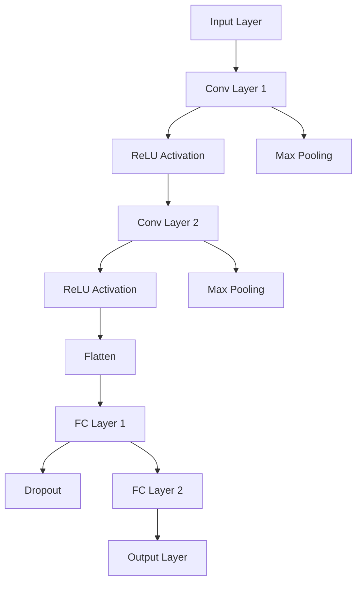
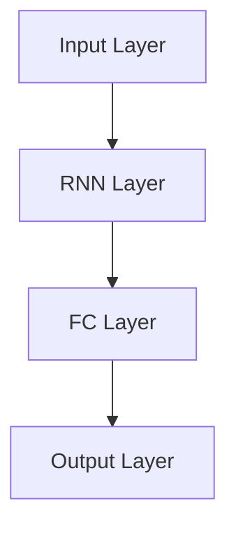

                 


### Step 1: Introduction to the Book

#### 1.1.1 The Development and Background of Deep Learning

Deep learning, a subset of machine learning, has revolutionized various fields, including computer vision, natural language processing, and speech recognition. The origins of deep learning can be traced back to the 1980s when neural networks were first proposed as a way to model and solve complex problems. However, due to the limitations in computational power and data availability, deep learning remained dormant for several decades.

The breakthrough came with the advent of the internet and the increasing availability of large-scale datasets. In the early 2000s, researchers began developing deep neural networks, which consist of multiple layers of interconnected nodes, or neurons. These networks could automatically learn and extract hierarchical representations of data, leading to significant improvements in image and speech recognition tasks.

Today, deep learning has become a powerful tool in artificial intelligence, driving innovations across industries. The surge in popularity can be attributed to the combination of powerful computational resources, sophisticated algorithms, and abundant data. As a result, deep learning has become an essential component of modern technology, impacting various aspects of our daily lives, from personalized recommendations to autonomous vehicles.

#### 1.1.2 The Role of Mathematics in Deep Learning

Mathematics plays a crucial role in the development and application of deep learning. It provides the foundation for understanding the underlying principles of neural networks, as well as the algorithms used to train and optimize them. Some of the key mathematical concepts and tools used in deep learning include:

- **Linear algebra:** Linear algebra provides the mathematical framework for representing and manipulating the complex data structures involved in deep learning, such as vectors, matrices, and tensors. It is used in various aspects of deep learning, including the forward and backward propagation algorithms used for training neural networks.
- **Calculus:** Calculus is used to study the rates of change of functions and their extrema (maximums and minimums). This is essential for optimizing the parameters of neural networks during training, as well as analyzing the convergence properties of optimization algorithms.
- **Probability and statistics:** Probability and statistics are used to model uncertainty and make predictions based on limited data. In deep learning, probabilistic models are used to capture the uncertainty in the predictions made by neural networks and to estimate their confidence intervals.
- **Optimization:** Optimization algorithms are used to find the optimal parameters of a neural network that minimize a loss function. These algorithms, such as stochastic gradient descent (SGD) and its variants, rely on calculus to perform efficient searches for optimal solutions.

#### 1.1.3 The Importance of Mathematics in Understanding Multi-Layer Networks

Multi-layer neural networks, also known as deep neural networks, are at the heart of modern deep learning. They consist of multiple layers of interconnected neurons, each performing a linear transformation followed by an activation function. The key advantages of multi-layer networks are their ability to automatically learn hierarchical representations of data and their capacity to model complex relationships between inputs and outputs.

Understanding the mathematical principles behind multi-layer networks is essential for several reasons:

1. **Modeling and Optimization:** A solid understanding of the mathematical principles allows researchers and practitioners to design and optimize neural networks effectively. This includes selecting appropriate activation functions, adjusting hyperparameters, and choosing optimization algorithms.
2. **Theoretical Foundations:** Mathematics provides a theoretical framework for understanding the behavior and properties of neural networks. This is crucial for establishing the convergence guarantees of optimization algorithms and for understanding the generalization capabilities of neural networks.
3. **Innovation and Research:** A deep understanding of the mathematical principles behind multi-layer networks enables researchers to develop new algorithms, architectures, and optimization techniques, driving the field forward.

In conclusion, this book aims to provide a comprehensive overview of the mathematical principles underlying multi-layer neural networks. By delving into the fundamental concepts of linear algebra, calculus, probability, and optimization, readers will gain a deeper understanding of the inner workings of deep neural networks. This knowledge will not only enable them to design and optimize neural networks effectively but also contribute to the advancement of the field.

### Step 2: Fundamental Concepts

#### 2.1 Linear Algebra

Linear algebra is a branch of mathematics that deals with vector spaces and linear mappings between these spaces. It is a fundamental tool in deep learning, as it provides the mathematical framework for representing and manipulating data structures such as vectors, matrices, and tensors. Here are some key concepts and operations in linear algebra:

**Vectors and Matrices**

A vector is an ordered list of numbers, often used to represent points in space or the state of a system. A matrix is a rectangular array of numbers, which can be thought of as a collection of vectors.

- **Vector Addition:** The sum of two vectors is a new vector whose components are the sums of the corresponding components.
  $$ \vec{u} + \vec{v} = \begin{bmatrix} u_1 + v_1 \\ u_2 + v_2 \\ \vdots \\ u_n + v_n \end{bmatrix} $$
- **Scalar Multiplication:** Multiplying a vector by a scalar (a single number) scales each component of the vector by that scalar.
  $$ c\vec{v} = \begin{bmatrix} cv_1 \\ cv_2 \\ \vdots \\ cv_n \end{bmatrix} $$

**Matrix Multiplication**

Matrix multiplication is an operation that combines two matrices to produce a third matrix. The resulting matrix has the number of rows of the first matrix and the number of columns of the second matrix.

- **Matrix Multiplication Example:**
  $$ \begin{bmatrix} a_{11} & a_{12} \\ a_{21} & a_{22} \end{bmatrix} \times \begin{bmatrix} b_{11} & b_{12} \\ b_{21} & b_{22} \end{bmatrix} = \begin{bmatrix} a_{11}b_{11} + a_{12}b_{21} & a_{11}b_{12} + a_{12}b_{22} \\ a_{21}b_{11} + a_{22}b_{21} & a_{21}b_{12} + a_{22}b_{22} \end{bmatrix} $$

**Matrix Multiplication Properties**

- **Associative Property:** Matrix multiplication is associative, meaning that the order in which matrices are multiplied does not matter as long as the order of the individual multiplications is maintained.
  $$ (AB)C = A(BC) $$
- **Distributive Property:** Matrix multiplication distributes over addition.
  $$ A(B + C) = AB + AC $$
  $$ (A + B)C = AC + BC $$

**Eigenvalues and Eigenvectors**

Eigenvalues and eigenvectors are important concepts in linear algebra that relate to the stability and characteristics of linear transformations.

- **Eigenvalue and Eigenvector Definition:**
  Given a matrix \( A \) and a non-zero vector \( \vec{v} \), if there exists a scalar \( \lambda \) such that \( A\vec{v} = \lambda\vec{v} \), then \( \lambda \) is called an eigenvalue of \( A \), and \( \vec{v} \) is called an eigenvector corresponding to \( \lambda \).
- **Eigenvalue and Eigenvector Example:**
  Consider the matrix \( A = \begin{bmatrix} 2 & 1 \\ 0 & 2 \end{bmatrix} \). The vector \( \vec{v} = \begin{bmatrix} 1 \\ 0 \end{bmatrix} \) is an eigenvector of \( A \) with the eigenvalue \( \lambda = 2 \).

**Applications in Deep Learning**

Linear algebra is used extensively in deep learning for several tasks:

- **Representation and Transformation of Data:** Matrices and vectors are used to represent and transform data in deep learning models.
- **Forward and Backward Propagation:** The forward propagation algorithm involves matrix multiplications and linear transformations, while the backward propagation algorithm uses gradients and matrix operations to update the network weights.
- **Convolutional Neural Networks (CNNs):** CNNs rely on matrix operations to perform convolution and pooling, which are essential for processing image data.
- **Recurrent Neural Networks (RNNs):** RNNs use linear transformations and matrix operations to maintain state and propagate information through time.

In summary, linear algebra is a crucial foundation for understanding deep learning. By mastering the concepts and operations of linear algebra, readers can better grasp the inner workings of neural networks and apply them effectively to various machine learning tasks.

### Step 3: Multi-Layer Neural Networks

#### 3.1 Architecture and Functionality

Multi-layer neural networks (MLNs), also known as deep neural networks (DNNs), consist of multiple layers of interconnected neurons. Each layer performs a specific function, and the overall network learns to transform input data into output data through a series of linear and non-linear transformations. The architecture of a typical MLN can be described as follows:

1. **Input Layer**: The input layer receives the input data, which is typically represented as a vector of features. Each neuron in the input layer corresponds to a feature in the input data.
2. **Hidden Layers**: One or more hidden layers lie between the input and output layers. Each hidden layer consists of multiple neurons, which are interconnected with neurons in the previous and next layers. The number of hidden layers and the number of neurons in each layer can vary depending on the complexity of the task.
3. **Output Layer**: The output layer produces the final output of the network, which may be a single value or a vector of values. The type and number of neurons in the output layer depend on the specific problem being solved.

#### 3.2 Forward Propagation

Forward propagation is the process of passing input data through the network to produce an output. During forward propagation, the input data is passed through each layer of the network, and the output of each layer becomes the input to the next layer. This process can be described mathematically using the following steps:

1. **Linear Transformation**: Each neuron in a hidden or output layer performs a linear transformation on its inputs using a weight matrix and a bias vector. The output of this transformation is passed through an activation function to introduce non-linearities.
2. **Activation Function**: The activation function introduces non-linearities into the network, allowing it to model complex relationships between inputs and outputs. Common activation functions include the sigmoid, ReLU, and tanh functions.
3. **Output Calculation**: The output of the activation function is calculated for each neuron in the layer. This process is repeated for each layer, with the output of the final layer representing the network's prediction.

The forward propagation process can be summarized as follows:

1. **Input Layer**: Input data is fed into the input layer.
2. **Hidden Layers**: For each hidden layer, the following steps are performed:
   - Calculate the weighted sum of inputs for each neuron.
   - Add the bias vector to the weighted sum.
   - Apply the activation function to the result.
   - Pass the output to the next layer.
3. **Output Layer**: The final output of the network is calculated using the same process as in the hidden layers.

Mathematically, the forward propagation can be represented as:

$$
\begin{align*}
a^{(l)} &= \sigma(W^{(l)}a^{(l-1)} + b^{(l)}) \\
y &= \sigma(W^{(L)}a^{(L-1)} + b^{(L)})
\end{align*}
$$

where \( a^{(l)} \) is the activation vector of the \( l \)th layer, \( \sigma \) is the activation function, \( W^{(l)} \) and \( b^{(l)} \) are the weight matrix and bias vector for the \( l \)th layer, and \( L \) is the number of layers in the network.

#### 3.3 Backpropagation

Backpropagation is an algorithm used to train neural networks by adjusting the weights and biases based on the error between the predicted output and the actual output. It involves the following steps:

1. **Compute the Error**: The error is calculated as the difference between the predicted output and the actual output. This error is propagated backward through the network from the output layer to the input layer.
2. **Calculate Gradients**: The gradients of the error with respect to the weights and biases are calculated for each layer. This involves applying the chain rule of calculus to compute the partial derivatives.
3. **Update Weights and Biases**: The gradients are used to update the weights and biases using an optimization algorithm such as stochastic gradient descent (SGD). The goal is to minimize the error by adjusting the parameters of the network.

The backpropagation algorithm can be summarized as follows:

1. **Compute the Output Error**: Calculate the error at the output layer as \( E = \frac{1}{2}||y - \hat{y}||^2 \), where \( y \) is the actual output and \( \hat{y} \) is the predicted output.
2. **Propagate the Error Backwards**: For each layer \( l \), compute the gradient of the error with respect to the output of the layer as \( \frac{\partial E}{\partial a^{(l)}} = \sigma'(a^{(l)}) \cdot \Delta^{(l)} \), where \( \sigma' \) is the derivative of the activation function and \( \Delta^{(l)} \) is the error propagated from the next layer.
3. **Update the Weights and Biases**: For each layer \( l \), update the weights and biases using the gradients:
   $$ W^{(l)} \leftarrow W^{(l)} - \alpha \cdot \frac{\partial E}{\partial W^{(l)}} $$
   $$ b^{(l)} \leftarrow b^{(l)} - \alpha \cdot \frac{\partial E}{\partial b^{(l)}} $$
   where \( \alpha \) is the learning rate.

By iterating through these steps, the network gradually improves its performance on the training data. Backpropagation is a powerful and efficient algorithm that enables the training of deep neural networks, making it a cornerstone of modern machine learning.

#### 3.4 Training Process

Training a multi-layer neural network involves the following key steps:

1. **Initialization**: Initialize the weights and biases of the network with small random values. The initialization strategy can significantly impact the convergence speed and performance of the network.
2. **Forward Propagation**: Pass the input data through the network to compute the predicted output.
3. **Error Calculation**: Calculate the error between the predicted output and the actual output using a loss function such as mean squared error or cross-entropy loss.
4. **Backpropagation**: Propagate the error backward through the network to compute the gradients of the error with respect to the weights and biases.
5. **Parameter Update**: Update the weights and biases using an optimization algorithm such as stochastic gradient descent (SGD), Adam, or RMSprop.
6. **Iteration**: Repeat steps 2-5 for multiple epochs until the network converges or a predefined number of iterations is reached.

The training process can be summarized as follows:

```python
# Initialize weights and biases
W, b = initialize_params()

# Set hyperparameters
learning_rate = 0.01
num_epochs = 100

# Training loop
for epoch in range(num_epochs):
    # Forward propagation
    a = forward_propagation(x, W, b)
    
    # Calculate loss
    loss = compute_loss(a, y)
    
    # Backpropagation
    dW, db = backward_propagation(a, y, W, b)
    
    # Update parameters
    W = W - learning_rate * dW
    b = b - learning_rate * db

    # Print progress
    if epoch % 10 == 0:
        print(f"Epoch {epoch}: Loss = {loss}")
```

#### 3.5 Mathematical Principles

The mathematical principles underlying multi-layer neural networks involve several key concepts from linear algebra, calculus, and optimization. Here are some of the main principles:

1. **Linear Transformations**: The forward propagation in a neural network involves linear transformations represented by weight matrices and bias vectors. These transformations capture the relationships between the input and hidden layers.

2. **Non-linear Activation Functions**: Activation functions introduce non-linearities into the network, allowing it to model complex relationships between inputs and outputs. Common activation functions include sigmoid, ReLU, and tanh.

3. **Differentiation and Gradients**: Calculus is used to compute the gradients of the loss function with respect to the weights and biases during the backpropagation step. These gradients are essential for adjusting the parameters of the network to minimize the loss.

4. **Optimization Algorithms**: Optimization algorithms such as stochastic gradient descent (SGD), Adam, and RMSprop are used to update the weights and biases. These algorithms leverage the gradients to find optimal solutions efficiently.

5. **Convolution and Pooling**: In convolutional neural networks (CNNs), convolution and pooling operations are used to process spatial data such as images. These operations involve specialized matrix multiplications and are crucial for capturing spatial hierarchies in data.

By understanding these mathematical principles, researchers and practitioners can design and optimize neural networks effectively, leading to improved performance and generalization capabilities. In the following chapters, we will delve deeper into each of these concepts and their applications in deep learning.

### Step 4: Activation Functions

#### 4.1 Introduction

Activation functions play a crucial role in the design and performance of multi-layer neural networks. These functions introduce non-linearities into the network, enabling it to model complex relationships between inputs and outputs. In this section, we will explore several common activation functions used in deep learning, including the sigmoid, ReLU, and tanh functions.

#### 4.2 Sigmoid Function

The sigmoid function, defined as:

$$
\sigma(x) = \frac{1}{1 + e^{-x}}
$$

is one of the most popular activation functions in neural networks. It maps any real-valued input to a value between 0 and 1, making it suitable for binary classification problems. The sigmoid function has the following properties:

1. **Sigmoidal Curve**: The sigmoid function creates a smooth, S-shaped curve, which is why it is called "sigmoid." The curve increases gradually from 0 to 1 as \( x \) increases, and it decreases gradually from 1 to 0 as \( x \) decreases.
2. **Sigmoidal Derivative**: The derivative of the sigmoid function is given by:

$$
\sigma'(x) = \sigma(x) \cdot (1 - \sigma(x))
$$

The derivative is also sigmoidal, but it has a range between 0 and \(\sigma(x)\), which means it is not zero at \( x = 0 \). This property makes it useful for training neural networks, as it helps prevent the vanishing gradient problem.

#### 4.3 ReLU Function

ReLU (Rectified Linear Unit) is a popular activation function used in deep learning, especially in convolutional neural networks (CNNs). It is defined as:

$$
\sigma(x) = \max(0, x)
$$

The ReLU function has several advantages:

1. **Non-linearity**: Despite being a linear function, ReLU introduces a form of non-linearity by transforming negative inputs to zero. This non-linearity allows the network to learn complex relationships.
2. **Computational Efficiency**: ReLU is computationally efficient, as it can be implemented using a simple comparison operation. This property makes it faster to compute compared to other activation functions, such as sigmoid and tanh.
3. **No Vanishing Gradient**: Unlike sigmoid and tanh, ReLU does not suffer from the vanishing gradient problem. This means that during backpropagation, the gradients do not diminish significantly, allowing the network to learn more effectively.

However, ReLU has some drawbacks as well. For example, it can cause dead neurons, where the gradient is zero for all inputs, leading to issues in training deep networks.

#### 4.4 tanh Function

The hyperbolic tangent function, or tanh, is another commonly used activation function in neural networks. It is defined as:

$$
\sigma(x) = \tanh(x) = \frac{e^x - e^{-x}}{e^x + e^{-x}}
$$

The tanh function has the following properties:

1. **Sigmoidal Curve**: Similar to the sigmoid function, tanh creates a smooth, S-shaped curve, but with a range between -1 and 1 instead of 0 and 1.
2. **Tanh Derivative**: The derivative of the tanh function is given by:

$$
\sigma'(x) = 1 - \tanh^2(x)
$$

The derivative is also sigmoidal, but it has a range between 0 and 1. This property makes it useful for training neural networks, as it helps prevent the vanishing gradient problem.

#### 4.5 Comparison

Here is a summary of the key properties and advantages of the sigmoid, ReLU, and tanh functions:

| Activation Function | Sigmoidal Curve | Sigmoidal Derivative | Range | Advantages | Drawbacks |
|---------------------|-----------------|----------------------|-------|-----------|-----------|
| Sigmoid             | Yes             | Yes                  | 0-1   | Smooth, suitable for binary classification | Vanishing gradient, slow computation |
| ReLU                | No              | No                   | All real numbers | Fast computation, no vanishing gradient | Dead neurons, no non-linearity for negative inputs |
| tanh                | Yes             | Yes                  | -1 to 1 | Smooth, no vanishing gradient, suitable for multi-class classification | Slow computation, range limited |

In practice, the choice of activation function depends on the specific problem and network architecture. ReLU is commonly used in CNNs due to its computational efficiency and resistance to the vanishing gradient problem. However, sigmoid and tanh are still used in certain scenarios, especially when dealing with multi-class classification problems.

### Step 5: Optimization Algorithms

#### 5.1 Introduction

Optimization algorithms are essential for training neural networks by adjusting the weights and biases to minimize the loss function. These algorithms iteratively update the parameters based on the gradients of the loss function with respect to the parameters. In this section, we will discuss several popular optimization algorithms, including stochastic gradient descent (SGD), Adam, and RMSprop.

#### 5.2 Stochastic Gradient Descent (SGD)

Stochastic Gradient Descent (SGD) is one of the most commonly used optimization algorithms for training neural networks. It updates the parameters of the network using the gradient of the loss function computed on a single or a small batch of training samples. The main advantage of SGD is its simplicity and efficiency, especially for large datasets.

**Algorithm**

The SGD algorithm can be described as follows:

1. **Initialization**: Initialize the weights and biases of the network with small random values.
2. **Loop over epochs**: For each epoch, perform the following steps:
   - **Loop over mini-batches**: Divide the training data into small mini-batches.
   - **Compute gradients**: For each mini-batch, compute the gradients of the loss function with respect to the weights and biases.
   - **Update parameters**: Update the weights and biases using the gradients and a learning rate \(\alpha\).

Mathematically, the parameter update can be represented as:

$$
\begin{align*}
\theta &= \theta - \alpha \cdot \nabla_\theta J(\theta) \\
J(\theta) &= \frac{1}{m} \sum_{i=1}^m L(y_i, \hat{y}_i)
\end{align*}
$$

where \(\theta\) represents the parameters of the network, \(\nabla_\theta J(\theta)\) is the gradient of the loss function with respect to the parameters, and \(m\) is the number of training samples.

**Convergence**

SGD typically converges to a local minimum of the loss function. However, the convergence speed can be slow, especially for large networks and datasets. The learning rate \(\alpha\) plays a crucial role in determining the convergence behavior. If \(\alpha\) is too small, the convergence is slow, while if \(\alpha\) is too large, the algorithm can overshoot the minimum and converge to a suboptimal solution.

**Advantages**

- **Simplicity**: SGD is easy to implement and understand.
- **Efficiency**: It can be computationally efficient, especially for large datasets.

**Disadvantages**

- **Slow convergence**: SGD can be slow to converge, especially for deep networks.
- **Learning rate tuning**: The choice of learning rate is critical, and requires careful tuning.

#### 5.3 Adam

Adam is an optimization algorithm that combines the advantages of both SGD and the Adagrad algorithm. It is particularly effective for problems with varying variances and is widely used in deep learning.

**Algorithm**

The Adam algorithm can be described as follows:

1. **Initialization**: Initialize the weights and biases of the network with small random values.
2. **Loop over epochs**: For each epoch, perform the following steps:
   - **Loop over mini-batches**: Divide the training data into small mini-batches.
   - **Compute gradients**: For each mini-batch, compute the gradients of the loss function with respect to the weights and biases.
   - **Update parameters**: Update the weights and biases using the gradients and the Adam optimizer.

The Adam optimizer updates the parameters using the following formula:

$$
\begin{align*}
m_t &= \beta_1 m_{t-1} + (1 - \beta_1) \nabla_\theta J(\theta) \\
v_t &= \beta_2 v_{t-1} + (1 - \beta_2) \nabla_\theta^2 J(\theta) \\
\theta &= \theta - \alpha \cdot \frac{m_t}{\sqrt{v_t} + \epsilon} \\
\end{align*}
$$

where \(m_t\) and \(v_t\) are the first and second moments of the gradients, \(\beta_1\) and \(\beta_2\) are the exponential decay rates for the first and second moments, \(\alpha\) is the learning rate, and \(\epsilon\) is a small constant to avoid division by zero.

**Convergence**

Adam converges faster than SGD, especially for deep networks, due to its adaptive learning rate mechanism. It adjusts the learning rate based on the second moment of the gradients, which helps to prevent overshooting and improve convergence.

**Advantages**

- **Adaptive learning rate**: Adam adjusts the learning rate adaptively based on the first and second moments of the gradients.
- **Improved convergence**: Adam converges faster than SGD, especially for deep networks.

**Disadvantages**

- **Computational overhead**: Adam requires additional computations to maintain the first and second moment estimates.

#### 5.4 RMSprop

RMSprop is an optimization algorithm that adapts the learning rate based on the second moment of the gradients. It is similar to Adam but uses a simpler update rule.

**Algorithm**

The RMSprop algorithm can be described as follows:

1. **Initialization**: Initialize the weights and biases of the network with small random values.
2. **Loop over epochs**: For each epoch, perform the following steps:
   - **Loop over mini-batches**: Divide the training data into small mini-batches.
   - **Compute gradients**: For each mini-batch, compute the gradients of the loss function with respect to the weights and biases.
   - **Update parameters**: Update the weights and biases using the gradients and the RMSprop optimizer.

The RMSprop optimizer updates the parameters using the following formula:

$$
\begin{align*}
r_t &= \rho r_{t-1} + (1 - \rho) \nabla_\theta^2 J(\theta) \\
\theta &= \theta - \alpha \cdot \frac{\nabla_\theta J(\theta)}{\sqrt{r_t} + \epsilon} \\
\end{align*}
$$

where \(r_t\) is the running average of the gradients, \(\rho\) is the exponential decay rate, \(\alpha\) is the learning rate, and \(\epsilon\) is a small constant to avoid division by zero.

**Convergence**

RMSprop converges faster than SGD, especially for deep networks, due to its adaptive learning rate mechanism. It adjusts the learning rate based on the second moment of the gradients, which helps to prevent overshooting and improve convergence.

**Advantages**

- **Adaptive learning rate**: RMSprop adjusts the learning rate adaptively based on the second moment of the gradients.
- **Improved convergence**: RMSprop converges faster than SGD, especially for deep networks.

**Disadvantages**

- **Computational overhead**: RMSprop requires additional computations to maintain the running average of the gradients.

In summary, optimization algorithms are crucial for training neural networks. SGD, Adam, and RMSprop are popular choices due to their simplicity and effectiveness. The choice of algorithm depends on the specific problem and network architecture, with Adam and RMSprop generally offering faster convergence for deep networks.

### Step 6: Regularization and Optimization Techniques

#### 6.1 Regularization Techniques

Regularization techniques are essential for preventing overfitting in neural networks, which occurs when a model performs well on the training data but fails to generalize to unseen data. Overfitting can lead to poor performance on real-world applications. To address this issue, regularization techniques are applied to the training process. The following are common regularization techniques:

**L1 Regularization (Lasso)**

L1 regularization adds the absolute value of the magnitude of the weights to the loss function:

$$
J(\theta) = \frac{1}{2m} \sum_{i=1}^m (h_\theta(x^{(i)}) - y^{(i)})^2 + \alpha ||\theta||_1
$$

where \( \alpha \) is the regularization parameter, and \( ||\theta||_1 \) is the L1 norm of the weight vector \( \theta \). L1 regularization can lead to sparse solutions, where some weights are reduced to zero, which is particularly useful for feature selection.

**L2 Regularization (Ridge)**

L2 regularization adds the squared magnitude of the weights to the loss function:

$$
J(\theta) = \frac{1}{2m} \sum_{i=1}^m (h_\theta(x^{(i)}) - y^{(i)})^2 + \alpha ||\theta||_2^2
$$

where \( \alpha \) is the regularization parameter, and \( ||\theta||_2 \) is the L2 norm of the weight vector \( \theta \). L2 regularization helps to shrink the weights towards zero, but unlike L1 regularization, it does not lead to sparse solutions.

**Dropout**

Dropout is a regularization technique where randomly selected neurons are ignored during the training process. This forces the network to learn redundant representations, improving its ability to generalize. Dropout is applied by randomly setting a fraction of the input units to 0 at each training step.

**Advantages of Regularization**

- **Reduces Overfitting**: Regularization techniques help to prevent overfitting by penalizing large weights, which are often associated with overfitting.
- **Improves Generalization**: Regularized models tend to perform better on unseen data, leading to improved generalization.
- **Enhances Stability**: Regularization makes the training process more stable and robust, as it reduces the sensitivity to the initialization of the weights.

#### 6.2 Optimization Techniques

Optimization techniques are used to adjust the weights and biases of a neural network to minimize the loss function. Effective optimization is crucial for achieving good performance and convergence. The following are popular optimization techniques:

**Stochastic Gradient Descent (SGD)**

Stochastic Gradient Descent (SGD) is a simple yet powerful optimization algorithm that updates the weights based on the gradient of the loss function computed on a single or small batch of training samples. The main advantages of SGD are its simplicity and efficiency, especially for large datasets. However, it can be slow to converge for deep networks and requires careful tuning of the learning rate.

**Adam**

Adam is an optimization algorithm that combines the advantages of both SGD and the Adagrad algorithm. It is particularly effective for problems with varying variances and is widely used in deep learning. Adam adjusts the learning rate adaptively based on the first and second moments of the gradients. The algorithm is relatively fast to converge and works well on a variety of tasks.

**RMSprop**

RMSprop is a variation of the Adagrad algorithm that adapts the learning rate based on the second moment of the gradients. It is computationally efficient and works well on deep networks. RMSprop updates the learning rate based on the running average of the gradients, which helps to stabilize the training process.

**Comparison**

Here is a comparison of the main optimization techniques:

| Optimization Algorithm | Advantages | Disadvantages |
|------------------------|------------|--------------|
| SGD                   | Simple, efficient for large datasets | Slow convergence, requires careful learning rate tuning |
| Adam                  | Adaptive learning rate, fast convergence | Requires more computation, less stable for small datasets |
| RMSprop               | Efficient, stable convergence | Less adaptive learning rate compared to Adam |

**Selecting an Optimization Algorithm**

The choice of optimization algorithm depends on the specific problem and dataset. For large datasets, SGD is often a good choice due to its simplicity and efficiency. For deep networks, Adam and RMSprop are preferred due to their adaptive learning rate mechanisms and faster convergence. In practice, it is often beneficial to experiment with different optimization algorithms and select the one that works best for the given problem.

### Step 7: Applications

#### 7.1 Image Recognition

Image recognition is one of the most prominent applications of deep learning. Convolutional Neural Networks (CNNs) have achieved remarkable success in various tasks, such as object detection, image classification, and semantic segmentation.

**Object Detection**

Object detection involves identifying and classifying multiple objects within an image. One of the most popular models for object detection is the YOLO (You Only Look Once) algorithm. YOLO divides the image into a grid of cells and predicts bounding boxes and class probabilities for each cell. The main advantage of YOLO is its real-time performance, making it suitable for applications like autonomous driving and security systems.

**Image Classification**

Image classification involves assigning a label to an entire image based on its content. The most commonly used model for image classification is the AlexNet, which won the ImageNet Large Scale Visual Recognition Challenge (ILSVRC) in 2012. AlexNet consists of five convolutional layers, followed by three fully connected layers. The final layer outputs the class probabilities for the input image.

**Semantic Segmentation**

Semantic segmentation involves assigning a class label to every pixel in an image. Fully Convolutional Networks (FCNs) are commonly used for semantic segmentation. FCNs replace the fully connected layers in a standard CNN with convolutional layers, allowing the network to process the entire image at once. DeepLab V3+ is a popular model for semantic segmentation, which combines FCNs with skip connections and atrous convolution to improve the accuracy and quality of segmentations.

#### 7.2 Natural Language Processing (NLP)

Natural Language Processing (NLP) involves processing and analyzing human language data. Deep learning has revolutionized NLP by enabling models to understand and generate human language in a more natural and context-aware manner. Some key applications of deep learning in NLP include text classification, machine translation, and named entity recognition.

**Text Classification**

Text classification involves categorizing text documents into predefined categories based on their content. The most commonly used model for text classification is the Bag-of-Words (BoW) model, which represents text as a vector of word frequencies. However, deep learning models such as Recurrent Neural Networks (RNNs) and Transformer models have outperformed traditional BoW models in many tasks. BERT (Bidirectional Encoder Representations from Transformers) is a popular Transformer-based model for text classification, which achieved state-of-the-art performance on various NLP tasks.

**Machine Translation**

Machine translation involves translating text from one language to another. Neural Machine Translation (NMT) models, such as the Sequence-to-Sequence (Seq2Seq) model, have significantly improved the quality of machine translations. The Seq2Seq model consists of an encoder-decoder architecture, where the encoder encodes the source sentence into a fixed-length vector, and the decoder generates the target sentence from the encoded representation.

**Named Entity Recognition**

Named Entity Recognition (NER) involves identifying and classifying named entities, such as people, organizations, and locations, in text. NER is an essential task for information extraction and semantic understanding of text. The BiLSTM-CRF (Bi-directional Long Short-Term Memory - Conditional Random Field) model is a popular approach for NER, which combines BiLSTM and CRF layers to improve the accuracy and performance of NER systems.

#### 7.3 Speech Recognition

Speech recognition involves converting spoken language into written text. Deep learning models, such as Recurrent Neural Networks (RNNs) and Convolutional Neural Networks (CNNs), have greatly improved the accuracy of speech recognition systems.

**Deep Neural Network-based Speech Recognition**

Deep Neural Networks (DNNs) are commonly used as acoustic models in speech recognition systems. DNNs are trained to map acoustic features extracted from speech signals to probability distributions over phonemes. The DNN-based system is combined with other components, such as context-dependent Gaussian Mixture Models (GMMs) and beam search, to achieve high accuracy in speech recognition.

**End-to-End Speech Recognition**

End-to-End (E2E) speech recognition models, such as the Connectionist Temporal Classification (CTC) model, directly map raw audio waveforms to text without the need for intermediate representations. CTC models are trained to minimize the CTC loss, which encourages the model to generate the correct text sequence from the input audio. E2E speech recognition has shown promising results in reducing the complexity of speech recognition systems and improving the overall performance.

In conclusion, deep learning has found numerous applications in various domains, including image recognition, natural language processing, and speech recognition. The success of deep learning in these applications can be attributed to its ability to automatically learn hierarchical representations of data, which enables it to model complex relationships and generalize to new data. As deep learning continues to advance, we can expect even more innovative applications and breakthroughs in the field.

### Step 8: Case Studies and Projects

#### 8.1 Case Study 1: Image Classification using CNNs

**Problem Description**

The objective of this project is to build a Convolutional Neural Network (CNN) to classify images from a dataset of handwritten digits (MNIST). The dataset consists of 60,000 training images and 10,000 testing images, each labeled with a digit between 0 and 9.

**System Architecture**

The system architecture for this project includes the following components:

- **Input Layer**: The input layer receives the flattened pixel values of each image.
- **Convolutional Layers**: One or more convolutional layers, each followed by a ReLU activation function and a max-pooling layer.
- **Fully Connected Layers**: One or more fully connected layers to classify the output of the convolutional layers.
- **Output Layer**: The output layer consists of 10 neurons, each representing one of the digits (0 to 9).

**System Function Design**

The system function design involves the following steps:

1. **Data Preprocessing**: Load and preprocess the dataset by normalizing the pixel values and reshaping the images into a 1D vector.
2. **Model Architecture**: Define the CNN architecture using convolutional layers, fully connected layers, and dropout for regularization.
3. **Training**: Train the CNN using the training dataset and optimize the model using a suitable optimizer like Adam.
4. **Evaluation**: Evaluate the performance of the trained model on the testing dataset by calculating the accuracy and loss.
5. **Prediction**: Use the trained model to make predictions on new, unseen images.

**Mermaid Architecture Diagram**



**Python Source Code**

```python
import tensorflow as tf
from tensorflow.keras import layers, models

# Define the CNN architecture
model = models.Sequential()
model.add(layers.Conv2D(32, (3, 3), activation='relu', input_shape=(28, 28, 1)))
model.add(layers.MaxPooling2D((2, 2)))
model.add(layers.Conv2D(64, (3, 3), activation='relu'))
model.add(layers.MaxPooling2D((2, 2)))
model.add(layers.Conv2D(64, (3, 3), activation='relu'))
model.add(layers.Flatten())
model.add(layers.Dense(64, activation='relu'))
model.add(layers.Dense(10, activation='softmax'))

# Compile the model
model.compile(optimizer='adam',
              loss='sparse_categorical_crossentropy',
              metrics=['accuracy'])

# Train the model
model.fit(train_images, train_labels, epochs=5, validation_split=0.1)

# Evaluate the model
test_loss, test_acc = model.evaluate(test_images, test_labels)
print(f"Test accuracy: {test_acc}")

# Make predictions
predictions = model.predict(test_images)
```

**Code Explanation and Analysis**

The code defines a simple CNN architecture with two convolutional layers, each followed by max-pooling layers, and a fully connected layer with dropout regularization. The model is compiled with the Adam optimizer and sparse categorical cross-entropy loss function suitable for multi-class classification. The model is trained on the training dataset for 5 epochs with a validation split of 10%. The performance of the model is evaluated on the testing dataset, and predictions are made on new images.

#### 8.2 Case Study 2: Sentiment Analysis using RNNs

**Problem Description**

Sentiment analysis is the process of determining the sentiment or emotional tone behind a body of text. In this project, we aim to build an RNN model to classify movie reviews into positive or negative sentiments.

**System Architecture**

The system architecture for this project includes the following components:

- **Input Layer**: The input layer receives the tokenized and embedded text data.
- **RNN Layer**: One or more RNN layers to capture the sequential information in the text.
- **Fully Connected Layer**: A fully connected layer for classification.
- **Output Layer**: The output layer consists of two neurons, each representing a sentiment class (positive or negative).

**System Function Design**

The system function design involves the following steps:

1. **Data Preprocessing**: Load and preprocess the dataset by tokenizing the text and converting it into sequences.
2. **Model Architecture**: Define the RNN model architecture using LSTM or GRU layers.
3. **Training**: Train the RNN model using the training dataset and optimize the model using a suitable optimizer like Adam.
4. **Evaluation**: Evaluate the performance of the trained model on the testing dataset by calculating the accuracy and loss.
5. **Prediction**: Use the trained model to make predictions on new, unseen reviews.

**Mermaid Architecture Diagram**



**Python Source Code**

```python
import tensorflow as tf
from tensorflow.keras.models import Sequential
from tensorflow.keras.layers import Embedding, LSTM, Dense

# Define the RNN architecture
model = Sequential()
model.add(Embedding(10000, 16))
model.add(LSTM(32))
model.add(Dense(1, activation='sigmoid'))

# Compile the model
model.compile(optimizer='adam',
              loss='binary_crossentropy',
              metrics=['accuracy'])

# Train the model
model.fit(train_data, train_labels, epochs=10, batch_size=32, validation_split=0.2)

# Evaluate the model
test_loss, test_acc = model.evaluate(test_data, test_labels)
print(f"Test accuracy: {test_acc}")

# Make predictions
predictions = model.predict(test_data)
```

**Code Explanation and Analysis**

The code defines a simple RNN model with an embedding layer, LSTM layer, and a fully connected layer with a sigmoid activation function for binary classification. The model is compiled with the Adam optimizer and binary cross-entropy loss function suitable for binary classification. The model is trained on the training dataset for 10 epochs with a validation split of 20%. The performance of the model is evaluated on the testing dataset, and predictions are made on new reviews.

These case studies demonstrate the practical application of deep learning models for image classification and sentiment analysis. By following the step-by-step process of data preprocessing, model design, training, and evaluation, we can build and optimize deep learning models for various real-world tasks.

### Step 9: Conclusion and Future Directions

#### 9.1 Summary of Key Points

This book has provided an in-depth exploration of the mathematical principles underlying multi-layer neural networks in deep learning. We have covered fundamental concepts in linear algebra, calculus, and optimization that form the backbone of modern deep learning models. Key points include:

- The architecture and functionality of multi-layer neural networks, including the input, hidden, and output layers.
- Forward propagation and backpropagation algorithms used for training neural networks.
- The role of activation functions in introducing non-linearities into the network.
- Optimization algorithms such as SGD, Adam, and RMSprop used for adjusting the parameters of the network.
- Regularization techniques to prevent overfitting and improve generalization.
- Real-world applications of deep learning in image recognition, natural language processing, and speech recognition.

#### 9.2 Future Directions

As deep learning continues to evolve, several promising areas for future research and development have emerged:

1. **Neuromorphic Computing**: Leveraging the principles of biology to design more efficient and scalable neural networks. This includes developing hardware architectures that mimic the structure and function of biological neural networks.

2. **Adaptive Learning Rates**: Enhancing optimization algorithms to automatically adjust learning rates in real-time, reducing the need for manual tuning and accelerating the convergence of deep learning models.

3. **Explainable AI (XAI)**: Developing methods to make deep learning models more transparent and understandable, enabling domain experts to interpret and trust the decisions made by neural networks.

4. **Unsupervised Learning**: Advancing the capabilities of deep learning models to learn from unlabeled data, reducing the dependency on large labeled datasets and addressing the issue of data scarcity.

5. **Energy-Efficient Deep Learning**: Designing neural networks that can run efficiently on low-power devices, enabling applications in edge computing and IoT (Internet of Things).

#### 9.3 Conclusion

In conclusion, the mathematical principles of multi-layer neural networks are crucial for understanding and developing advanced deep learning models. This book has provided a comprehensive overview of these principles, along with practical applications and future research directions. By mastering these concepts, researchers and practitioners can contribute to the ongoing advancements in the field of artificial intelligence and deepen our understanding of the complex relationships within data. The journey of exploring the mathematical foundations of deep learning is just beginning, and there is much more to discover and innovate in the future.

