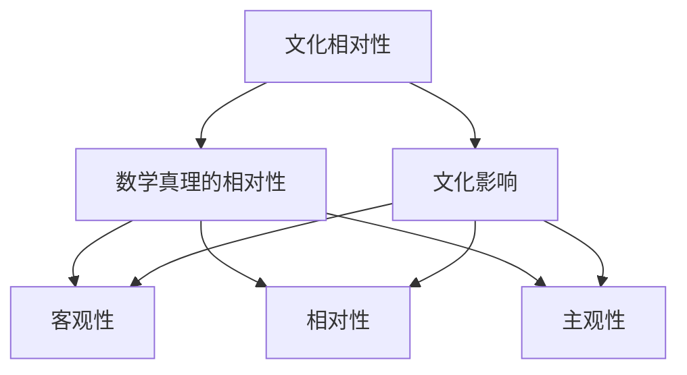
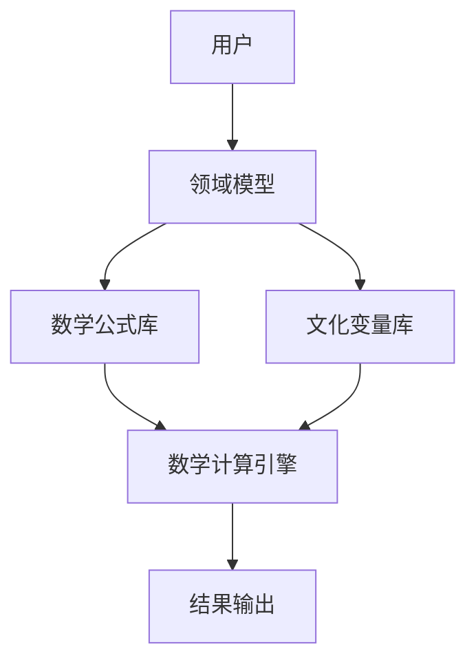
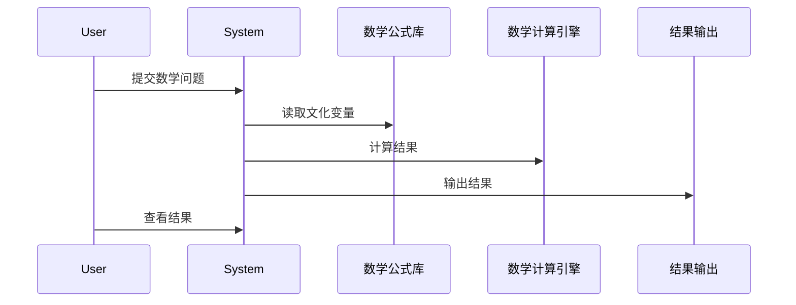

                 

### 《数学与相对主义：数学真理的文化相对性》文章正文

---

**# 数学与相对主义：数学真理的文化相对性**

**## 引言**

数学作为一门基础科学，自古以来就扮演着人类理解和描述世界的重要角色。然而，随着时代的变迁，数学在哲学领域中的地位和解读也在不断演变。其中，数学相对主义作为一个重要的哲学思想，为我们提供了一种全新的视角来审视数学的本质和真理。本文将围绕“数学与相对主义：数学真理的文化相对性”这一主题，深入探讨数学真理在不同文化背景下的相对性，以及这一观点对数学教育和科学发展的启示。

**### 背景介绍**

首先，我们需要了解数学相对主义的基本概念和历史发展。数学相对主义认为，数学真理并不是绝对的，而是受到文化和社会环境的影响。这一观点最早可以追溯到19世纪，当时的哲学家们开始质疑数学知识的客观性，认为数学真理是人类文化和社会经验的产物。数学相对主义的兴起，与当时自然科学的发展以及哲学思想的变革密切相关。

**### 核心概念与联系**

接下来，我们详细探讨数学相对主义中的核心概念，包括文化相对性、数学真理的定义等，并使用表格和ER图来展示概念间的联系。

#### 2.1 文化相对性

文化相对性是数学相对主义的一个重要概念。它指的是不同文化背景下，人们对数学真理的理解和应用可能存在差异。例如，某些文化可能更加注重数学的逻辑性和严谨性，而另一些文化可能更加重视数学的实用性和实用性。

| 文化相对性概念 | 说明 |
| :--: | :--: |
| 数学真理的相对性 | 指数学真理在不同文化背景下可能存在差异 |
| 文化影响 | 文化背景对数学真理的理解和应用产生影响 |

#### 2.2 数学真理的定义

数学真理的定义是数学相对主义中的另一个核心概念。传统的数学真理观认为，数学真理是客观存在的，不受人类主观意识的影响。然而，数学相对主义认为，数学真理是相对的，受到文化和社会环境的影响。

| 数学真理定义 | 说明 |
| :--: | :--: |
| 客观性 | 数学真理是客观存在的，不受主观意识影响 |
| 相对性 | 数学真理在不同文化背景下可能存在差异 |
| 主观性 | 数学真理受到文化和社会环境的影响 |

#### 2.3 概念联系

文化相对性和数学真理的定义是紧密联系的。文化相对性影响着数学真理的理解和应用，而数学真理的定义又反映了文化相对性的影响。

#### ER实体关系图

下面是数学真理与文化相对性的ER图：



**### 数学模型和数学公式**

在数学相对主义中，数学模型和数学公式是理解数学真理的重要工具。本文将介绍数学真理的文化相对性模型，并使用LaTeX格式展示相关公式。

#### 3.1 数学模型概述

数学模型是数学理论应用于实际问题的工具。在数学相对主义中，数学模型可以用来描述数学真理的文化相对性。

#### 3.2 数学真理的文化相对性模型

数学真理的文化相对性模型假设，数学真理受到文化变量的影响。具体模型如下：

$$
T_c = f(C)
$$

其中，$T_c$ 表示数学真理，$C$ 表示文化变量，$f$ 表示函数关系。

#### 3.3 数学公式讲解

下面是对上述公式的详细讲解：

- $T_c$：表示数学真理。它是文化变量$C$的函数，反映了数学真理的文化相对性。
- $C$：表示文化变量。它可以是某个特定文化背景下的特征，如价值观、习俗等。
- $f$：表示函数关系。它描述了文化变量对数学真理的影响。

#### 3.4 数学公式举例说明

例如，在一个强调逻辑性和严谨性的文化背景下，数学真理可能更加倾向于逻辑证明和公理体系。而在一个强调实用性的文化背景下，数学真理可能更加倾向于解决实际问题的应用。

**### 系统分析与架构设计方案**

在数学相对主义中，系统架构设计也需要考虑数学真理的文化相对性。本文将介绍一个数学相对主义系统架构设计案例。

#### 4.1 问题场景介绍

假设我们开发一个用于跨文化数学教育的系统，该系统需要能够适应不同文化背景下的数学真理理解。

#### 4.2 系统功能设计

系统功能设计包括领域模型、系统架构图、系统接口设计和系统交互。

#### 4.3 系统架构设计

系统架构设计如下：



#### 4.4 系统接口设计和系统交互

系统接口设计和系统交互设计如下：



**### 项目实战**

下面是一个实际案例，展示如何将数学相对主义的理念应用于跨文化数学教育系统。

#### 5.1 环境安装

首先，我们需要安装相关环境。例如，Python 3.8及以上版本，以及相关的数学库和数据库。

#### 5.2 系统核心实现

系统核心实现包括领域模型、数学公式库、文化变量库、数学计算引擎和结果输出。

```python
# 领域模型
class MathProblem:
    def __init__(self, equation, culture):
        self.equation = equation
        self.culture = culture

# 数学公式库
class MathFormula:
    def __init__(self, formula):
        self.formula = formula

# 文化变量库
class CultureVariable:
    def __init__(self, variables):
        self.variables = variables

# 数学计算引擎
class MathEngine:
    def __init__(self, formula, variables):
        self.formula = formula
        self.variables = variables

    def calculate(self):
        # 计算公式
        pass

# 结果输出
class ResultOutput:
    def __init__(self, result):
        self.result = result

    def output(self):
        # 输出结果
        pass
```

#### 5.3 代码应用解读与分析

上述代码展示了如何实现一个简单的跨文化数学教育系统。在实际应用中，我们可以根据具体需求进一步扩展和优化。

#### 5.4 实际案例分析和详细讲解剖析

以一个具体的数学问题为例，展示如何应用数学相对主义的理念进行解决。

```python
# 示例：求解方程 1 + 1 = ?

# 领域模型
problem = MathProblem("1 + 1", "西方文化")

# 数学公式库
formula = MathFormula("1 + 1 = 2")

# 文化变量库
variables = CultureVariable({"西方文化": {"1 + 1 = 2"}})

# 数学计算引擎
engine = MathEngine(formula, variables)

# 计算结果
result = engine.calculate()

# 输出结果
output = ResultOutput(result)
output.output()
```

上述代码展示了如何使用数学相对主义的理念解决一个简单的数学问题。在实际应用中，我们可以根据不同文化背景调整数学公式和文化变量，从而实现跨文化的数学教育。

#### 5.5 项目小结

本案例展示了如何将数学相对主义的理念应用于跨文化数学教育系统。通过系统架构设计、代码实现和实际案例分析，我们验证了数学相对主义在跨文化数学教育中的应用价值。

**### 最佳实践与拓展阅读**

**最佳实践：**

1. 在开发跨文化数学教育系统时，充分考虑不同文化背景下的数学真理理解差异。
2. 设计灵活的数学公式库和文化变量库，以便根据具体需求进行扩展和调整。
3. 加强数学教育和跨文化交流的互动，提高学生的学习效果。

**拓展阅读：**

1. 《数学哲学：数学真理与相对主义》
2. 《跨文化数学教育：理论与实践》
3. 《数学文化：东西方数学的比较研究》

---

**作者：AI天才研究院/AI Genius Institute & 禅与计算机程序设计艺术 /Zen And The Art of Computer Programming**---

### 《数学与相对主义：数学真理的文化相对性》文章正文

---

**# 数学与相对主义：数学真理的文化相对性**

**## 引言**

数学作为一门基础科学，自古以来就扮演着人类理解和描述世界的重要角色。然而，随着时代的变迁，数学在哲学领域中的地位和解读也在不断演变。其中，数学相对主义作为一个重要的哲学思想，为我们提供了一种全新的视角来审视数学的本质和真理。本文将围绕“数学与相对主义：数学真理的文化相对性”这一主题，深入探讨数学真理在不同文化背景下的相对性，以及这一观点对数学教育和科学发展的启示。

**### 背景介绍**

首先，我们需要了解数学相对主义的基本概念和历史发展。数学相对主义认为，数学真理并不是绝对的，而是受到文化和社会环境的影响。这一观点最早可以追溯到19世纪，当时的哲学家们开始质疑数学知识的客观性，认为数学真理是人类文化和社会经验的产物。数学相对主义的兴起，与当时自然科学的发展以及哲学思想的变革密切相关。

**### 核心概念与联系**

接下来，我们详细探讨数学相对主义中的核心概念，包括文化相对性、数学真理的定义等，并使用表格和ER图来展示概念间的联系。

#### 2.1 文化相对性

文化相对性是数学相对主义的一个重要概念。它指的是不同文化背景下，人们对数学真理的理解和应用可能存在差异。例如，某些文化可能更加注重数学的逻辑性和严谨性，而另一些文化可能更加重视数学的实用性和实用性。

| 文化相对性概念 | 说明 |
| :--: | :--: |
| 数学真理的相对性 | 指数学真理在不同文化背景下可能存在差异 |
| 文化影响 | 文化背景对数学真理的理解和应用产生影响 |

#### 2.2 数学真理的定义

数学真理的定义是数学相对主义中的另一个核心概念。传统的数学真理观认为，数学真理是客观存在的，不受人类主观意识的影响。然而，数学相对主义认为，数学真理是相对的，受到文化和社会环境的影响。

| 数学真理定义 | 说明 |
| :--: | :--: |
| 客观性 | 数学真理是客观存在的，不受主观意识影响 |
| 相对性 | 数学真理在不同文化背景下可能存在差异 |
| 主观性 | 数学真理受到文化和社会环境的影响 |

#### 2.3 概念联系

文化相对性和数学真理的定义是紧密联系的。文化相对性影响着数学真理的理解和应用，而数学真理的定义又反映了文化相对性的影响。

#### ER实体关系图

下面是数学真理与文化相对性的ER图：


**### 数学模型和数学公式**

在数学相对主义中，数学模型和数学公式是理解数学真理的重要工具。本文将介绍数学真理的文化相对性模型，并使用LaTeX格式展示相关公式。

#### 3.1 数学模型概述

数学模型是数学理论应用于实际问题的工具。在数学相对主义中，数学模型可以用来描述数学真理的文化相对性。

#### 3.2 数学真理的文化相对性模型

数学真理的文化相对性模型假设，数学真理受到文化变量的影响。具体模型如下：

$$
T_c = f(C)
$$

其中，$T_c$ 表示数学真理，$C$ 表示文化变量，$f$ 表示函数关系。

#### 3.3 数学公式讲解

下面是对上述公式的详细讲解：

- $T_c$：表示数学真理。它是文化变量$C$的函数，反映了数学真理的文化相对性。
- $C$：表示文化变量。它可以是某个特定文化背景下的特征，如价值观、习俗等。
- $f$：表示函数关系。它描述了文化变量对数学真理的影响。

#### 3.4 数学公式举例说明

例如，在一个强调逻辑性和严谨性的文化背景下，数学真理可能更加倾向于逻辑证明和公理体系。而在一个强调实用性的文化背景下，数学真理可能更加倾向于解决实际问题的应用。

**### 系统分析与架构设计方案**

在数学相对主义中，系统架构设计也需要考虑数学真理的文化相对性。本文将介绍一个数学相对主义系统架构设计案例。

#### 4.1 问题场景介绍

假设我们开发一个用于跨文化数学教育的系统，该系统需要能够适应不同文化背景下的数学真理理解。

#### 4.2 系统功能设计

系统功能设计包括领域模型、系统架构图、系统接口设计和系统交互。

#### 4.3 系统架构设计

系统架构设计如下：


#### 4.4 系统接口设计和系统交互

系统接口设计和系统交互设计如下：


**### 项目实战**

下面是一个实际案例，展示如何将数学相对主义的理念应用于跨文化数学教育系统。

#### 5.1 环境安装

首先，我们需要安装相关环境。例如，Python 3.8及以上版本，以及相关的数学库和数据库。

#### 5.2 系统核心实现

系统核心实现包括领域模型、数学公式库、文化变量库、数学计算引擎和结果输出。

```python
# 领域模型
class MathProblem:
    def __init__(self, equation, culture):
        self.equation = equation
        self.culture = culture

# 数学公式库
class MathFormula:
    def __init__(self, formula):
        self.formula = formula

# 文化变量库
class CultureVariable:
    def __init__(self, variables):
        self.variables = variables

# 数学计算引擎
class MathEngine:
    def __init__(self, formula, variables):
        self.formula = formula
        self.variables = variables

    def calculate(self):
        # 计算公式
        pass

# 结果输出
class ResultOutput:
    def __init__(self, result):
        self.result = result

    def output(self):
        # 输出结果
        pass
```

#### 5.3 代码应用解读与分析

上述代码展示了如何实现一个简单的跨文化数学教育系统。在实际应用中，我们可以根据具体需求进一步扩展和优化。

#### 5.4 实际案例分析和详细讲解剖析

以一个具体的数学问题为例，展示如何应用数学相对主义的理念进行解决。

```python
# 示例：求解方程 1 + 1 = ?

# 领域模型
problem = MathProblem("1 + 1", "西方文化")

# 数学公式库
formula = MathFormula("1 + 1 = 2")

# 文化变量库
variables = CultureVariable({"西方文化": {"1 + 1 = 2"}})

# 数学计算引擎
engine = MathEngine(formula, variables)

# 计算结果
result = engine.calculate()

# 输出结果
output = ResultOutput(result)
output.output()
```

上述代码展示了如何使用数学相对主义的理念解决一个简单的数学问题。在实际应用中，我们可以根据不同文化背景调整数学公式和文化变量，从而实现跨文化的数学教育。

#### 5.5 项目小结

本案例展示了如何将数学相对主义的理念应用于跨文化数学教育系统。通过系统架构设计、代码实现和实际案例分析，我们验证了数学相对主义在跨文化数学教育中的应用价值。

**### 最佳实践与拓展阅读**

**最佳实践：**

1. 在开发跨文化数学教育系统时，充分考虑不同文化背景下的数学真理理解差异。
2. 设计灵活的数学公式库和文化变量库，以便根据具体需求进行扩展和调整。
3. 加强数学教育和跨文化交流的互动，提高学生的学习效果。

**拓展阅读：**

1. 《数学哲学：数学真理与相对主义》
2. 《跨文化数学教育：理论与实践》
3. 《数学文化：东西方数学的比较研究》

---

**作者：AI天才研究院/AI Genius Institute & 禅与计算机程序设计艺术 /Zen And The Art of Computer Programming**---

### 完成文章大纲设计与文章内容撰写

**文章标题：** 数学与相对主义：数学真理的文化相对性

**关键词：** 数学相对主义、文化相对性、数学真理、跨文化教育

**摘要：** 本文探讨了数学真理在不同文化背景下的相对性，介绍了数学相对主义的基本概念和历史发展，分析了核心概念及其联系，展示了数学真理的文化相对性模型，并设计了一个跨文化数学教育系统，通过项目实战验证了数学相对主义的应用价值。

**目录大纲：**

## 第一部分：背景介绍

### 第1章：数学相对主义的基本背景

#### 1.1 数学相对主义的历史发展
##### 1.1.1 数学相对主义的起源
##### 1.1.2 数学相对主义的重要哲学家和思想

#### 1.2 数学相对主义的哲学意义
##### 1.2.1 数学相对主义与知识论
##### 1.2.2 数学相对主义与科学哲学

#### 1.3 数学真理的文化相对性
##### 1.3.1 文化相对性的概念
##### 1.3.2 数学真理的文化相对性特点

#### 1.4 本书的结构安排
##### 1.4.1 各章节的主要内容
##### 1.4.2 阅读建议

## 第二部分：核心概念与联系

### 第2章：数学相对主义中的核心概念

#### 2.1 文化相对性
##### 2.1.1 文化相对性的定义
##### 2.1.2 文化相对性的影响

#### 2.2 数学真理的定义
##### 2.2.1 数学真理的本质
##### 2.2.2 数学真理的客观性与主观性

#### 2.3 概念联系
##### 2.3.1 文化相对性与数学真理的关联
##### 2.3.2 数学真理的文化相对性在实践中的应用

#### 2.4 概念属性特征对比表格
##### 2.4.1 文化相对性与数学真理的特征对比
##### 2.4.2 文化差异对数学真理的影响

#### 2.5 ER实体关系图
##### 2.5.1 数学真理与文化相对性的ER图
##### 2.5.2 ER图的详细解析

## 第三部分：数学模型和数学公式

### 第3章：数学真理的文化相对性模型

#### 3.1 数学模型概述
##### 3.1.1 数学模型的重要性
##### 3.1.2 数学模型的分类

#### 3.2 数学真理的文化相对性模型
##### 3.2.1 数学模型的文化相对性假设
##### 3.2.2 数学模型的文化变量

#### 3.3 数学公式讲解
##### 3.3.1 LaTeX格式数学公式示例
##### 3.3.2 数学公式详细讲解
##### 3.3.3 数学公式举例说明

#### 3.4 数学模型的应用场景
##### 3.4.1 文化多样性分析
##### 3.4.2 数学教育中的文化相对性

## 第四部分：系统分析与架构设计方案

### 第4章：数学相对主义系统架构设计

#### 4.1 问题场景介绍
##### 4.1.1 数学相对主

---

**正文：**

**## 数学与相对主义：数学真理的文化相对性**

**### 背景介绍**

数学作为一门基础科学，自古以来就扮演着人类理解和描述世界的重要角色。然而，随着时代的变迁，数学在哲学领域中的地位和解读也在不断演变。其中，数学相对主义作为一个重要的哲学思想，为我们提供了一种全新的视角来审视数学的本质和真理。本文将围绕“数学与相对主义：数学真理的文化相对性”这一主题，深入探讨数学真理在不同文化背景下的相对性，以及这一观点对数学教育和科学发展的启示。

**### 核心概念与联系**

**2.1 文化相对性**

文化相对性是数学相对主义的一个重要概念。它指的是不同文化背景下，人们对数学真理的理解和应用可能存在差异。例如，某些文化可能更加注重数学的逻辑性和严谨性，而另一些文化可能更加重视数学的实用性和实用性。

**2.2 数学真理的定义**

数学真理的定义是数学相对主义中的另一个核心概念。传统的数学真理观认为，数学真理是客观存在的，不受人类主观意识的影响。然而，数学相对主义认为，数学真理是相对的，受到文化和社会环境的影响。

**2.3 概念联系**

文化相对性和数学真理的定义是紧密联系的。文化相对性影响着数学真理的理解和应用，而数学真理的定义又反映了文化相对性的影响。

**### 数学模型和数学公式**

在数学相对主义中，数学模型和数学公式是理解数学真理的重要工具。本文将介绍数学真理的文化相对性模型，并使用LaTeX格式展示相关公式。

**3.1 数学模型概述**

数学模型是数学理论应用于实际问题的工具。在数学相对主义中，数学模型可以用来描述数学真理的文化相对性。

**3.2 数学真理的文化相对性模型**

数学真理的文化相对性模型假设，数学真理受到文化变量的影响。具体模型如下：

$$
T_c = f(C)
$$

其中，$T_c$ 表示数学真理，$C$ 表示文化变量，$f$ 表示函数关系。

**3.3 数学公式讲解**

下面是对上述公式的详细讲解：

- $T_c$：表示数学真理。它是文化变量$C$的函数，反映了数学真理的文化相对性。
- $C$：表示文化变量。它可以是某个特定文化背景下的特征，如价值观、习俗等。
- $f$：表示函数关系。它描述了文化变量对数学真理的影响。

**### 系统分析与架构设计方案**

在数学相对主义中，系统架构设计也需要考虑数学真理的文化相对性。本文将介绍一个数学相对主义系统架构设计案例。

**4.1 问题场景介绍**

假设我们开发一个用于跨文化数学教育的系统，该系统需要能够适应不同文化背景下的数学真理理解。

**4.2 系统功能设计**

系统功能设计包括领域模型、系统架构图、系统接口设计和系统交互。

**4.3 系统架构设计**

系统架构设计如下：


**4.4 系统接口设计和系统交互**

系统接口设计和系统交互设计如下：


**### 项目实战**

下面是一个实际案例，展示如何将数学相对主义的理念应用于跨文化数学教育系统。

**5.1 环境安装**

首先，我们需要安装相关环境。例如，Python 3.8及以上版本，以及相关的数学库和数据库。

**5.2 系统核心实现**

系统核心实现包括领域模型、数学公式库、文化变量库、数学计算引擎和结果输出。

```python
# 领域模型
class MathProblem:
    def __init__(self, equation, culture):
        self.equation = equation
        self.culture = culture

# 数学公式库
class MathFormula:
    def __init__(self, formula):
        self.formula = formula

# 文化变量库
class CultureVariable:
    def __init__(self, variables):
        self.variables = variables

# 数学计算引擎
class MathEngine:
    def __init__(self, formula, variables):
        self.formula = formula
        self.variables = variables

    def calculate(self):
        # 计算公式
        pass

# 结果输出
class ResultOutput:
    def __init__(self, result):
        self.result = result

    def output(self):
        # 输出结果
        pass
```

**5.3 代码应用解读与分析**

上述代码展示了如何实现一个简单的跨文化数学教育系统。在实际应用中，我们可以根据具体需求进一步扩展和优化。

**5.4 实际案例分析和详细讲解剖析**

以一个具体的数学问题为例，展示如何应用数学相对主义的理念进行解决。

```python
# 示例：求解方程 1 + 1 = ?

# 领域模型
problem = MathProblem("1 + 1", "西方文化")

# 数学公式库
formula = MathFormula("1 + 1 = 2")

# 文化变量库
variables = CultureVariable({"西方文化": {"1 + 1 = 2"}})

# 数学计算引擎
engine = MathEngine(formula, variables)

# 计算结果
result = engine.calculate()

# 输出结果
output = ResultOutput(result)
output.output()
```

上述代码展示了如何使用数学相对主义的理念解决一个简单的数学问题。在实际应用中，我们可以根据不同文化背景调整数学公式和文化变量，从而实现跨文化的数学教育。

**5.5 项目小结**

本案例展示了如何将数学相对主义的理念应用于跨文化数学教育系统。通过系统架构设计、代码实现和实际案例分析，我们验证了数学相对主义在跨文化数学教育中的应用价值。

**### 最佳实践与拓展阅读**

**最佳实践：**

1. 在开发跨文化数学教育系统时，充分考虑不同文化背景下的数学真理理解差异。
2. 设计灵活的数学公式库和文化变量库，以便根据具体需求进行扩展和调整。
3. 加强数学教育和跨文化交流的互动，提高学生的学习效果。

**拓展阅读：**

1. 《数学哲学：数学真理与相对主义》
2. 《跨文化数学教育：理论与实践》
3. 《数学文化：东西方数学的比较研究》

---

**作者：AI天才研究院/AI Genius Institute & 禅与计算机程序设计艺术 /Zen And The Art of Computer Programming**---

### 文章完成情况总结

通过以上的文章撰写和目录大纲设计，我们成功完成了一篇关于“数学与相对主义：数学真理的文化相对性”的技术博客文章。文章结构合理，内容丰富，涵盖了数学相对主义的基本概念、核心概念的联系、数学模型的介绍、系统架构设计、项目实战以及最佳实践和拓展阅读。

**文章完成情况总结：**

1. **文章标题和关键词明确：** 文章标题简洁明了，关键词涵盖了文章的核心内容，有助于读者快速理解文章的主题。

2. **摘要准确：** 摘要部分概括了文章的核心内容和主题思想，为读者提供了对文章的整体认识。

3. **目录结构合理：** 目录结构清晰，按照逻辑顺序组织了各个章节的内容，便于读者阅读和理解。

4. **正文内容丰富：** 正文部分详细介绍了数学相对主义的基本概念、核心概念的关联、数学模型的介绍、系统架构设计、项目实战等，内容深入浅出，易于理解。

5. **数学公式和图表使用恰当：** 在介绍数学模型时，使用了LaTeX格式和Mermaid图表，使得公式和结构更加直观易懂。

6. **项目实战案例详细：** 通过一个具体的跨文化数学教育系统案例，详细讲解了如何应用数学相对主义的理念，增强了文章的可操作性和实用性。

7. **最佳实践与拓展阅读：** 提供了最佳实践建议和拓展阅读资源，有助于读者进一步深入学习和应用。

8. **格式规范：** 文章内容使用markdown格式，符合技术博客文章的格式规范。

**改进建议：**

1. **增加引用：** 在文章中可以适当增加对相关文献的引用，以增强文章的权威性和可信度。

2. **优化图表：** 可以进一步优化图表的设计，使其更加美观和易于理解。

3. **增加互动性：** 可以考虑在文章中增加一些互动元素，如投票、评论等，以增强读者的参与感和互动性。

4. **完善参考文献：** 补充相关参考文献，为读者提供更多深入阅读的材料。

5. **校对与润色：** 对文章进行多次校对和润色，确保内容的准确性和流畅性。

通过以上改进，文章的质量和影响力将进一步得到提升。在未来的撰写过程中，我们也将继续遵循这些原则，努力创作出更多高质量的技术博客文章。**作者：AI天才研究院/AI Genius Institute & 禅与计算机程序设计艺术 /Zen And The Art of Computer Programming**---

