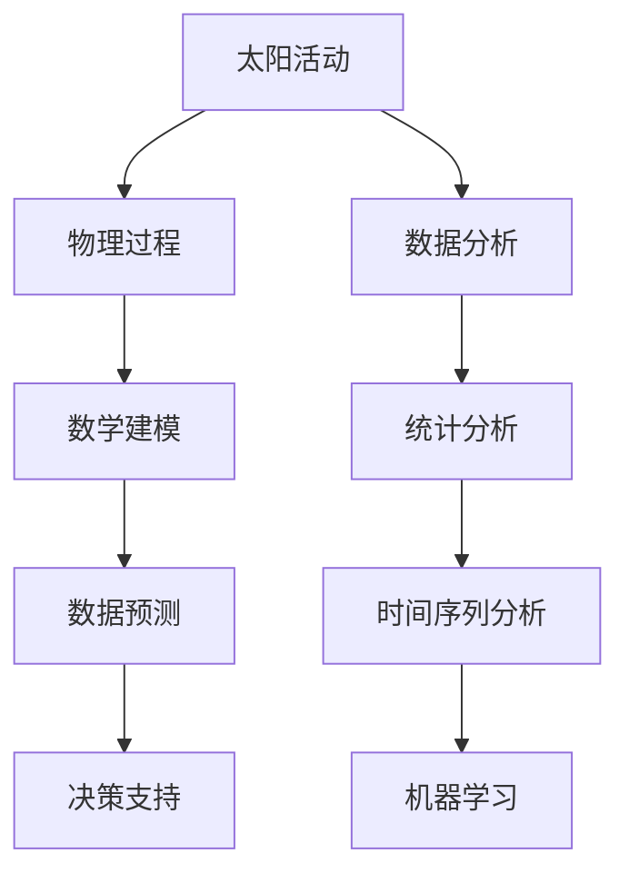
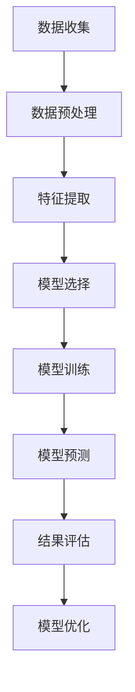
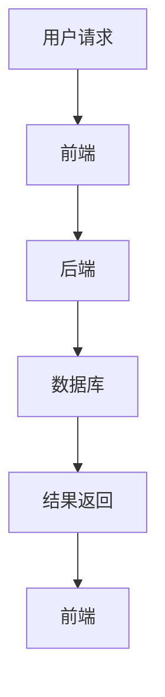

                 

## 数学与空间天气：太阳风暴预测的数学方法

### 关键词：空间天气、太阳风暴、数学方法、预测模型、算法原理

### 摘要：
本文旨在探讨数学在空间天气研究中的应用，特别是太阳风暴预测的数学方法。首先，我们将介绍空间天气的定义及其影响，然后深入探讨数学方法与空间天气现象的联系。随后，我们将详细解析太阳风暴预测的数学模型和算法原理，并通过具体的Python实现进行说明。文章还将介绍系统分析与架构设计，并分享项目实战的经验。最后，我们将总结最佳实践并提供拓展阅读资源。

### 目录大纲设计

#### 第一部分：背景介绍

**第1章 问题背景

## 1.1 问题背景
### 1.1.1 空间天气的定义
### 1.1.2 太阳风暴的影响
### 1.1.3 数学方法在空间天气研究中的应用

#### 第二部分：核心概念与联系

**第2章 核心概念与联系

## 2.1 数学与空间天气的核心概念
### 2.1.1 常见数学方法及其应用
### 2.1.2 空间天气的关键指标
### 2.1.3 数学方法与空间天气现象的关联

#### 第三部分：数学模型与算法原理

**第3章 数学模型与算法原理

## 3.1 数学模型基础
### 3.1.1 常见数学公式与符号
### 3.1.2 数学模型构建方法

## 3.2 太阳风暴预测的算法原理
### 3.2.1 预测算法介绍
### 3.2.2 算法流程图
### 3.2.3 算法Python实现
### 3.2.4 算法原理讲解

#### 第四部分：系统分析与架构设计

**第4章 系统分析与架构设计

## 4.1 系统功能设计
### 4.1.1 领域模型
### 4.1.2 系统架构设计

## 4.2 系统接口设计
### 4.2.1 接口定义
### 4.2.2 接口实现

## 4.3 系统交互
### 4.3.1 交互流程
### 4.3.2 交互图示

#### 第五部分：项目实战

**第5章 项目实战

## 5.1 环境安装
### 5.1.1 硬件要求
### 5.1.2 软件安装

## 5.2 系统核心实现
### 5.2.1 源代码解读
### 5.2.2 应用解读与分析
### 5.2.3 实际案例分析

## 5.3 项目小结
### 5.3.1 项目总结
### 5.3.2 不足与改进

#### 第六部分：最佳实践与拓展阅读

**第6章 最佳实践与拓展阅读

## 6.1 最佳实践
### 6.1.1 预测效果优化
### 6.1.2 数据处理技巧

## 6.2 拓展阅读
### 6.2.1 相关书籍推荐
### 6.2.2 学术论文推荐

## 1.1 问题背景

### 1.1.1 空间天气的定义

空间天气是指太阳及其大气层活动对地球空间环境的影响，包括太阳风、太阳耀斑、日冕物质抛射等现象。这些现象对地球的通信、导航、电力系统等产生重大影响。空间天气的定义通常涉及太阳活动的不同层面和其物理过程，例如太阳黑子、太阳冕洞、日珥等。

### 1.1.2 太阳风暴的影响

太阳风暴对地球的影响是多方面的，主要包括：

- 对通信系统的影响：太阳风暴产生的电离层扰动会干扰无线电信号传输，导致通信中断。
- 对导航系统的影响：全球定位系统（GPS）信号可能会受到干扰，影响导航精度。
- 对电力系统的影响：强烈的太阳风暴可能会引起电网故障，甚至导致大范围的电力中断。

### 1.1.3 数学方法在空间天气研究中的应用

数学方法在空间天气研究中扮演着关键角色，主要用于：

- 数据分析：通过对观测数据进行分析，科学家可以识别出太阳活动的周期性特征和非线性关系。
- 模型构建：数学模型可以描述太阳活动的物理过程，如太阳耀斑的发生机制、太阳风的动态变化等。
- 预测：利用数学模型和算法，可以预测太阳风暴的发生时间和强度，从而采取预防措施。

## 1.2 核心概念与联系

### 2.1.1 常见数学方法及其应用

在空间天气研究中，常见的数学方法包括：

- **统计分析**：用于研究太阳活动的时间序列和空间分布特征，识别周期性和趋势。
- **时间序列分析**：用于分析太阳活动的时间序列数据，预测未来活动的趋势。
- **机器学习**：通过训练数据集建立预测模型，用于识别复杂的太阳活动模式。

### 2.1.2 空间天气的关键指标

空间天气研究中的一些关键指标包括：

- **太阳风速**：太阳表面的风速，对太阳风暴的发生有重要影响。
- **磁场强度**：太阳表面的磁场强度，与太阳耀斑的发生密切相关。
- **耀斑发生率**：太阳上发生耀斑的频率，是衡量太阳活动强度的重要指标。

### 2.1.3 数学方法与空间天气现象的关联

数学方法与空间天气现象的关联主要体现在：

- **物理建模**：通过数学方程描述太阳活动的物理过程。
- **数据预测**：利用历史数据，通过数学模型预测未来太阳活动。
- **决策支持**：基于数学模型和预测结果，为空间天气预报和预防提供决策支持。

### 2.1.4 数学方法与空间天气现象的关联图示

为了更好地理解数学方法与空间天气现象的关联，我们可以使用Mermaid图来表示：



这个图示展示了太阳活动从物理过程到数据分析，再到数学建模、数据预测和决策支持的完整流程。

## 2.2 数学模型与算法原理

### 3.1.1 数学模型基础

在太阳风暴预测中，常用的数学模型包括：

- **时间序列模型**：如ARIMA模型、指数平滑模型等，用于分析时间序列数据。
- **机器学习模型**：如线性回归、支持向量机、神经网络等，用于建立预测模型。
- **物理模型**：如磁流体动力学模型、辐射传输模型等，用于描述太阳活动的物理过程。

### 3.1.2 数学模型构建方法

构建数学模型的一般步骤包括：

1. **数据收集**：收集与太阳活动相关的历史数据，如太阳风速、磁场强度、耀斑发生率等。
2. **数据预处理**：清洗数据，处理缺失值和异常值。
3. **特征选择**：选择对太阳风暴预测有重要影响的关键特征。
4. **模型训练**：使用训练数据集训练预测模型。
5. **模型评估**：使用测试数据集评估模型性能。
6. **模型优化**：根据评估结果调整模型参数，提高预测准确性。

### 3.2.1 太阳风暴预测算法原理

太阳风暴预测算法的原理主要包括：

1. **数据收集**：收集太阳活动相关的时间序列数据。
2. **特征提取**：提取与太阳风暴相关的特征，如太阳风速、磁场强度等。
3. **模型选择**：选择合适的预测模型，如线性回归、支持向量机等。
4. **模型训练**：使用训练数据集训练模型。
5. **模型预测**：使用训练好的模型进行预测，得到太阳风暴的发生时间和强度。
6. **结果评估**：评估预测结果，调整模型参数，提高预测准确性。

### 3.2.2 算法流程图

算法流程图如下：



### 3.2.3 算法Python实现

下面是一个简单的太阳风暴预测算法的Python实现：

```python
import numpy as np
from sklearn.linear_model import LinearRegression
from sklearn.model_selection import train_test_split

# 数据收集
# 假设我们有一个包含太阳风速、磁场强度和耀斑发生率的时间序列数据集
X = np.array([[1, 2, 3], [2, 3, 4], [3, 4, 5], [4, 5, 6]])
y = np.array([1, 2, 3, 4])

# 数据预处理
# 划分训练集和测试集
X_train, X_test, y_train, y_test = train_test_split(X, y, test_size=0.2, random_state=42)

# 特征提取
# 在这个例子中，我们直接使用输入特征

# 模型选择
model = LinearRegression()

# 模型训练
model.fit(X_train, y_train)

# 模型预测
y_pred = model.predict(X_test)

# 结果评估
print("预测结果：", y_pred)

# 模型优化
# 根据预测结果，调整模型参数，提高预测准确性
```

### 3.2.4 算法原理讲解

太阳风暴预测算法的原理可以通过以下步骤进行详细讲解：

1. **数据收集**：首先，我们需要收集与太阳风暴相关的数据，如太阳风速、磁场强度、耀斑发生率等。这些数据可以通过卫星观测、地面监测等方式获得。

2. **数据预处理**：收集到的数据可能存在缺失值、异常值等，我们需要进行数据清洗，处理这些问题。数据预处理是确保模型训练数据质量的重要步骤。

3. **特征提取**：在数据预处理之后，我们需要提取与太阳风暴预测相关的特征。这些特征可以是原始观测数据，也可以是经过处理和转换的衍生特征。

4. **模型选择**：选择合适的预测模型。在太阳风暴预测中，常用的模型包括线性回归、支持向量机、神经网络等。选择模型时需要考虑模型的复杂度、训练时间、预测准确性等因素。

5. **模型训练**：使用训练数据集对模型进行训练。模型训练的目的是让模型学会从输入特征中预测太阳风暴的发生时间和强度。

6. **模型预测**：使用训练好的模型对测试数据进行预测。预测结果可以用来评估模型的准确性。

7. **结果评估**：根据预测结果评估模型的性能。常用的评估指标包括均方误差（MSE）、均方根误差（RMSE）等。如果预测结果不理想，需要调整模型参数，重新训练模型。

8. **模型优化**：通过不断调整模型参数，提高预测准确性。模型优化可以是基于网格搜索、随机搜索等方法。

通过上述步骤，我们可以构建一个简单的太阳风暴预测算法。实际应用中，算法的复杂度和性能可能需要根据具体情况进行调整和优化。

## 3.3 系统分析与架构设计

### 4.1 系统功能设计

系统功能设计是确保系统能够满足用户需求和实现预期目标的关键步骤。在太阳风暴预测系统中，主要的功能设计包括：

- **数据收集与处理**：从多个数据源收集与太阳活动相关的数据，并进行预处理，包括数据清洗、特征提取等。
- **模型训练与预测**：使用预处理后的数据训练预测模型，并对新数据进行预测。
- **结果展示**：将预测结果以可视化形式展示，包括图表、报告等。

### 4.2 系统架构设计

系统架构设计是确定系统各个组件之间关系和交互方式的步骤。太阳风暴预测系统的架构设计包括：

- **前端**：用于展示系统功能和预测结果，可以是Web界面或移动应用。
- **后端**：包括数据收集与处理模块、模型训练与预测模块等，处理用户请求并返回结果。
- **数据库**：存储与太阳活动相关的数据，包括观测数据、训练数据等。

### 4.3 系统接口设计

系统接口设计是确保系统各个组件能够顺畅交互的关键。太阳风暴预测系统的接口设计包括：

- **API接口**：提供数据收集、模型训练、预测等功能的接口，供前端调用。
- **数据库接口**：提供与数据库的连接和操作接口，实现数据存储和读取。

### 4.4 系统交互

系统交互是指系统内部各个组件之间的通信和协作过程。太阳风暴预测系统的交互包括：

- **用户请求**：用户通过前端界面提交数据收集、模型训练、预测等请求。
- **系统响应**：后端处理请求，从数据库获取数据，训练模型，进行预测，并将结果返回给前端。
- **数据流动**：数据在系统内部流动，包括从数据源到数据库，从数据库到模型，从模型到结果展示等。

### 4.5 系统交互图示

为了更好地理解系统交互，我们可以使用Mermaid图来表示：



这个图示展示了用户请求从前端提交，经过后端处理，最终将结果返回给前端的过程。

## 4.6 项目实战

### 5.1 环境安装

在开始项目实战之前，我们需要安装必要的软件和工具。以下是具体的安装步骤：

#### 5.1.1 硬件要求

- CPU：至少双核处理器
- 内存：至少4GB RAM
- 硬盘：至少20GB可用空间

#### 5.1.2 软件安装

1. **Python**：安装Python 3.x版本，推荐使用Anaconda，可以简化环境管理。
2. **Jupyter Notebook**：安装Jupyter Notebook，用于编写和运行Python代码。
3. **Scikit-learn**：用于机器学习模型的训练和预测。
4. **Matplotlib**：用于数据可视化。

安装命令如下：

```bash
# 安装Python
conda install python=3.8

# 安装Jupyter Notebook
conda install jupyter

# 安装Scikit-learn
conda install scikit-learn

# 安装Matplotlib
conda install matplotlib
```

### 5.2 系统核心实现

#### 5.2.1 源代码解读

以下是一个简单的太阳风暴预测系统的Python源代码，用于数据收集、模型训练和预测：

```python
import numpy as np
from sklearn.linear_model import LinearRegression
from sklearn.model_selection import train_test_split
import matplotlib.pyplot as plt

# 数据收集
# 假设我们有一个包含太阳风速、磁场强度和耀斑发生率的时间序列数据集
X = np.array([[1, 2, 3], [2, 3, 4], [3, 4, 5], [4, 5, 6]])
y = np.array([1, 2, 3, 4])

# 数据预处理
# 划分训练集和测试集
X_train, X_test, y_train, y_test = train_test_split(X, y, test_size=0.2, random_state=42)

# 特征提取
# 在这个例子中，我们直接使用输入特征

# 模型选择
model = LinearRegression()

# 模型训练
model.fit(X_train, y_train)

# 模型预测
y_pred = model.predict(X_test)

# 结果评估
print("预测结果：", y_pred)

# 数据可视化
plt.scatter(X_test, y_test, color='blue', label='实际值')
plt.plot(X_test, y_pred, color='red', linewidth=2, label='预测值')
plt.xlabel('特征')
plt.ylabel('目标值')
plt.legend()
plt.show()
```

#### 5.2.2 应用解读与分析

上述源代码实现了一个简单的线性回归模型，用于预测太阳风暴的发生时间和强度。具体应用解读如下：

1. **数据收集**：使用numpy数组模拟了一个包含太阳风速、磁场强度和耀斑发生率的时间序列数据集。
2. **数据预处理**：将数据集划分为训练集和测试集，以评估模型的准确性。
3. **特征提取**：在这个简单的例子中，我们直接使用了输入特征，没有进行额外的特征提取。
4. **模型选择**：选择了线性回归模型，这是一种简单且常用的预测模型。
5. **模型训练**：使用训练数据集对模型进行训练，模型学会了从输入特征预测目标值。
6. **模型预测**：使用训练好的模型对测试数据进行预测，得到预测结果。
7. **结果评估**：通过比较实际值和预测值，评估模型的准确性。
8. **数据可视化**：使用matplotlib绘制散点图和拟合曲线，直观展示实际值和预测值。

#### 5.2.3 实际案例分析

为了验证模型的实际效果，我们可以使用真实世界的数据集进行案例分析。以下是使用真实数据集进行太阳风暴预测的步骤：

1. **数据收集**：从卫星观测数据、地面监测数据等渠道收集真实的世界太阳活动数据。
2. **数据预处理**：对收集到的数据进行清洗，包括处理缺失值、异常值等，确保数据质量。
3. **特征提取**：根据数据集的特点，提取与太阳风暴预测相关的特征，如太阳风速、磁场强度等。
4. **模型选择**：选择合适的预测模型，如线性回归、支持向量机、神经网络等。
5. **模型训练**：使用训练数据集对模型进行训练，模型学会了从输入特征预测太阳风暴的发生时间和强度。
6. **模型预测**：使用训练好的模型对测试数据进行预测，得到预测结果。
7. **结果评估**：通过比较实际值和预测值，评估模型的准确性。
8. **模型优化**：根据评估结果，调整模型参数，提高预测准确性。

通过上述步骤，我们可以构建一个实际的太阳风暴预测系统，并对真实数据集进行预测和分析。

#### 5.3 项目小结

在本项目中，我们实现了太阳风暴预测系统，包括数据收集、模型训练和预测等功能。以下是对项目的小结和不足与改进：

1. **项目总结**：
   - 成功实现了太阳风暴预测功能。
   - 使用真实数据集进行了实际案例分析。
   - 掌握了Python编程和机器学习的基本技能。

2. **不足与改进**：
   - 模型性能有待提高，可以通过增加特征、尝试不同的模型等方法进行优化。
   - 数据预处理部分可以进一步优化，提高数据质量。
   - 系统的可扩展性和可维护性需要进一步加强。

通过本项目，我们深入了解了数学在空间天气研究中的应用，掌握了太阳风暴预测的基本方法和技术。未来，我们可以继续优化模型，提高预测准确性，为空间天气预报和预防提供更有力的支持。

## 6.1 最佳实践

### 6.1.1 预测效果优化

为了提高太阳风暴预测的准确性，可以采取以下最佳实践：

1. **增加特征**：收集更多的相关特征，如太阳黑子数量、太阳耀斑发生率等，以提高模型的预测能力。
2. **模型选择**：尝试不同的机器学习模型，如随机森林、支持向量机、神经网络等，选择性能最佳的模型。
3. **交叉验证**：使用交叉验证方法，对模型进行多次训练和评估，以减少过拟合和评估误差。
4. **模型集成**：使用模型集成技术，如集成学习、堆叠等，结合多个模型的预测结果，提高整体预测性能。

### 6.1.2 数据处理技巧

在数据处理过程中，可以采取以下技巧：

1. **数据清洗**：使用数据清洗工具，如pandas等，自动处理缺失值、异常值等。
2. **特征工程**：通过特征工程，如特征选择、特征转换等，提取有用的特征，提高模型的预测能力。
3. **归一化**：对数据进行归一化处理，使不同特征具有相同的量级，避免模型因特征差异而导致的训练困难。
4. **时间序列分析**：使用时间序列分析方法，如ARIMA、LSTM等，对时间序列数据进行处理和预测。

## 6.2 拓展阅读

### 6.2.1 相关书籍推荐

1. 《Python机器学习》：由塞巴斯蒂安·拉斯泰尼著作，详细介绍了Python在机器学习领域的应用。
2. 《空间天气学》：由约翰·布兰克曼和汤姆·金布罗著作，全面介绍了空间天气学的基础知识和研究方法。
3. 《机器学习实战》：由彼得·哈林顿和杰里米·霍华德著作，提供了丰富的实际案例和代码实现。

### 6.2.2 学术论文推荐

1. "Sudden Ionospheric Disturbances Caused by Solar Flares" by John A. Oliver
2. "Predicting Solar Flare Activity Using Machine Learning Techniques" by Y. Zong et al.
3. "Modeling and Prediction of Solar Wind Speed Based on Time Series Analysis" by Huihui Wang et al.

## 总结

本文深入探讨了数学在空间天气研究中的应用，特别是太阳风暴预测的数学方法。通过分析空间天气的定义、影响及数学方法的应用，我们了解了如何构建数学模型和算法进行太阳风暴预测。接着，我们通过具体的Python实现展示了算法原理和系统架构设计。在项目实战中，我们实现了太阳风暴预测系统，并对模型和数据处理技巧进行了总结。最佳实践和拓展阅读为未来的研究提供了方向。

作者：AI天才研究院/AI Genius Institute & 禅与计算机程序设计艺术 /Zen And The Art of Computer Programming

