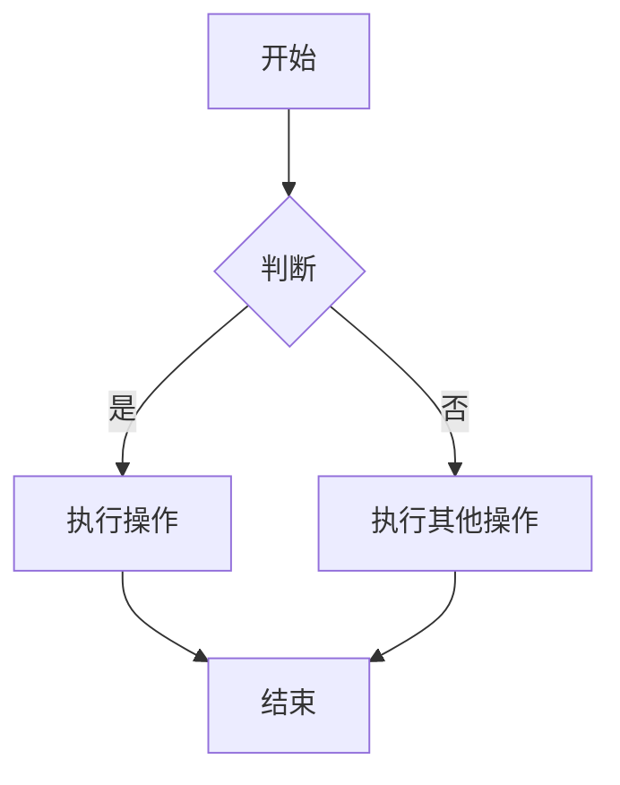
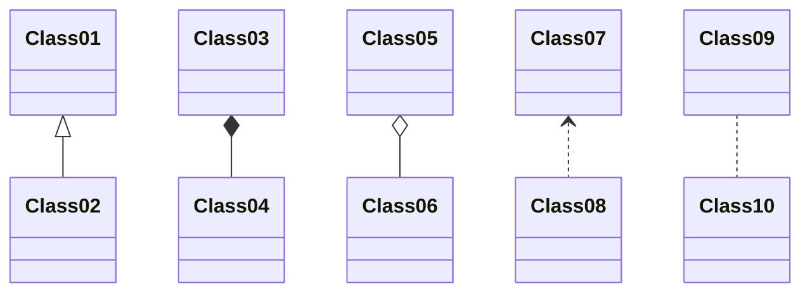

                 

### 等离子体物理与数学模型概述

**等离子体物理的基本概念**

等离子体，也称为第四态物质，是物质的一种状态，由自由电子、离子和中性原子组成。它在宇宙中广泛存在，如恒星、星际空间、太阳风等。等离子体具有高电导率、高热导率、复杂电磁特性等特点，这些特性使得它在许多领域具有重要应用，如核聚变、等离子体加工、等离子体医学等。

等离子体物理研究等离子体的物理性质、行为及其在不同条件下的演化规律。其核心目标是通过实验和理论分析揭示等离子体的基本物理现象，如电荷输运、碰撞过程、湍流等。

**等离子体动力学的重要性**

等离子体动力学是等离子体物理学的一个重要分支，研究等离子体的运动规律、内部结构和相互作用。它对于理解等离子体的宏观和微观行为至关重要。

等离子体动力学的重要性主要体现在以下几个方面：

1. **能量转换与传递**：等离子体动力学研究能量在等离子体中的转换和传递机制，这对于核聚变能源的开发具有重要意义。
2. **等离子体约束与控制**：等离子体动力学为等离子体约束和提供理论基础，如磁约束和惯性约束，这对于受控核聚变和等离子体加工等领域至关重要。
3. **等离子体应用**：等离子体动力学研究为等离子体应用提供了理论基础和技术支持，如等离子体喷涂、等离子体清洗、等离子体医学等。

**数学在等离子体动力学中的应用**

数学在等离子体动力学研究中扮演着关键角色，为理论分析和数值模拟提供了强有力的工具。以下是数学在等离子体动力学中的几个主要应用：

1. **微分方程**：描述等离子体运动和相互作用的基本方程通常是偏微分方程，如麦克斯韦方程、流体力学方程、磁流体力学方程等。这些方程通过数学形式精确描述了等离子体的动态行为。
2. **数值方法**：用于求解等离子体动力学方程的数值方法，如有限差分法、有限元法、谱方法等。这些方法将复杂的物理问题转化为计算机可处理的数值问题。
3. **统计学方法**：用于分析等离子体湍流等复杂现象的统计学方法，如随机过程理论、统计物理方法等。

**等离子体动力学与数学的交汇**

等离子体动力学与数学的交汇体现在多个方面：

1. **理论研究**：数学工具为等离子体动力学理论研究提供了精确的描述和解析方法，如群论、复变函数、张量分析等。
2. **数值模拟**：数学方法为等离子体动力学的数值模拟提供了理论基础和计算策略，如迭代法、加速技术、并行计算等。
3. **模型验证**：通过数学模型和数值模拟结果与实验数据的对比，验证和改进等离子体动力学理论，如湍流模型、碰撞模型等。

总之，数学在等离子体动力学研究中具有不可替代的作用，为理解等离子体的行为、发展新型等离子体应用技术提供了理论基础和计算工具。在接下来的章节中，我们将深入探讨等离子体动力学中的核心概念、数学模型及其在复杂系统中的应用。### 第1章: 等离子体物理与数学模型概述

### 1.1 等离子体物理基础

#### 1.1.1 等离子体的定义与特性

等离子体是物质的一种状态，通常由自由电子、离子和中性原子组成。这种状态下的物质具有高电导率和高热导率，同时展现出复杂的电磁特性。根据温度的不同，等离子体的特性也会发生显著变化。高温等离子体通常具有更高的电离度，其中大部分原子已经被电离成自由电子和离子。而低温等离子体则可能包含更多的中性原子，电离度相对较低。

等离子体的主要特性包括：

1. **高电导率**：由于存在大量的自由电荷，等离子体具有很高的电导率，能够迅速传导电磁场。
2. **高热导率**：等离子体的热导率也较高，这意味着热量在等离子体中的传递速度很快。
3. **复杂的电磁特性**：等离子体中的电荷运动产生电磁场，这些电磁场与等离子体的运动相互作用，使得等离子体的行为变得复杂。
4. **多尺度特性**：等离子体现象往往涉及从微观尺度（如原子和电子尺度）到宏观尺度（如等离子体波和湍流尺度）的广泛范围。

#### 1.1.2 等离子体物理的研究意义

等离子体物理研究具有重要的科学和实际应用价值。以下是等离子体物理研究的主要意义：

1. **能源开发**：等离子体在核聚变能源开发中扮演关键角色。通过利用高温等离子体中的核反应，可以释放出巨大的能量，为未来清洁能源提供可能。
2. **天体物理**：等离子体在宇宙中广泛存在，是理解星系、恒星和星际空间物理过程的关键。等离子体物理研究有助于揭示宇宙中的一些基本物理现象。
3. **工业应用**：等离子体技术在工业制造中有广泛应用，如等离子体喷涂、等离子体切割、等离子体清洗等，这些技术提高了生产效率和质量。
4. **医学应用**：等离子体技术在医学领域也有应用，如等离子体手术、等离子体治疗等，这些技术为疾病治疗提供了新的手段。

#### 1.1.3 等离子体物理与数学的关联

等离子体物理与数学有着密切的关联，数学为等离子体物理研究提供了强有力的工具和方法。以下是数学在等离子体物理中的几个主要应用：

1. **微分方程**：等离子体动力学方程通常可以用偏微分方程来描述。麦克斯韦方程、流体力学方程和磁流体力学方程等都是重要的偏微分方程，它们精确地描述了等离子体的运动和相互作用。
2. **数值方法**：为了解决等离子体动力学方程，常常需要采用数值方法。有限差分法、有限元法、谱方法等都是常用的数值方法，它们将复杂的物理问题转化为计算机可处理的数值问题。
3. **统计学方法**：等离子体中的湍流现象复杂，需要采用统计物理方法进行分析。随机过程理论、大尺度结构分析等方法为理解和模拟等离子体湍流提供了重要的工具。

总之，等离子体物理与数学的关联为等离子体动力学研究提供了理论基础和计算工具，推动了等离子体物理的发展和应用。在接下来的章节中，我们将进一步探讨等离子体动力学中的核心概念和数学模型。### 1.2 等离子体动力学中的数学工具

#### 1.2.1 微分方程

微分方程是描述连续系统动态行为的重要数学工具，特别是在等离子体动力学中。等离子体的运动状态通常可以通过一组偏微分方程来描述，这些方程涉及到空间和时间的变化。以下是等离子体动力学中常用的微分方程：

1. **麦克斯韦方程**：描述等离子体中的电磁场分布和变化。麦克斯韦方程组由四个方程构成，分别是高斯定律、高斯磁定律、法拉第感应定律和安培-麦克斯韦方程。这些方程可以用以下形式表示：

$$
\nabla \cdot \mathbf{E} = \frac{\rho}{\varepsilon_0}, \quad \nabla \cdot \mathbf{B} = 0,
$$

$$
\nabla \times \mathbf{E} = -\frac{\partial \mathbf{B}}{\partial t}, \quad \nabla \times \mathbf{B} = \mu_0 \mathbf{J} + \mu_0 \varepsilon_0 \frac{\partial \mathbf{E}}{\partial t},
$$

其中，$\mathbf{E}$ 和 $\mathbf{B}$ 分别代表电场和磁场，$\rho$ 是电荷密度，$\mathbf{J}$ 是电流密度，$\varepsilon_0$ 和 $\mu_0$ 分别是真空中的电位移和磁导率。

2. **流体力学方程**：描述等离子体作为流体的运动。流体力学方程组包括连续性方程、动量守恒方程和能量守恒方程。这些方程可以用以下形式表示：

$$
\frac{\partial \rho}{\partial t} + \nabla \cdot (\rho \mathbf{v}) = 0,
$$

$$
\frac{\partial \mathbf{v}}{\partial t} + (\mathbf{v} \cdot \nabla) \mathbf{v} = -\nabla p + \rho \mathbf{g},
$$

$$
\frac{\partial e}{\partial t} + \nabla \cdot (\mathbf{v} e) = -\nabla \cdot (\mathbf{v} \cdot \mathbf{T}),
$$

其中，$\rho$ 是流体密度，$\mathbf{v}$ 是流体速度，$p$ 是压力，$e$ 是单位体积内的内能，$\mathbf{T}$ 是应力张量。

#### 1.2.2 偏微分方程

偏微分方程在等离子体动力学中扮演着核心角色，用于描述等离子体内部变量（如密度、温度、速度等）的空间和时间变化。以下是几个关键的偏微分方程：

1. **泊松方程**：用于描述电荷分布产生的电势。泊松方程可以表示为：

$$
\nabla^2 \phi = -\frac{\rho}{\varepsilon_0},
$$

其中，$\phi$ 是电势，$\rho$ 是电荷密度。

2. **拉普拉斯方程**：在某些稳态条件下，等离子体的物理量可能满足拉普拉斯方程。拉普拉斯方程可以表示为：

$$
\nabla^2 \phi = 0,
$$

该方程在没有电荷源的情况下描述了电势的分布。

3. **流体力学方程**：在稳态或低频条件下，流体动力学方程可以简化为偏微分方程形式。例如，连续性方程和动量守恒方程可以表示为：

$$
\frac{\partial \rho}{\partial t} + \nabla \cdot (\rho \mathbf{v}) = 0,
$$

$$
\rho \left(\frac{\partial \mathbf{v}}{\partial t} + (\mathbf{v} \cdot \nabla) \mathbf{v} \right) = -\nabla p + \rho \mathbf{g},
$$

这些方程描述了等离子体密度和速度的空间变化。

#### 1.2.3 矢量场与张量分析

在等离子体动力学中，矢量场和张量分析是描述等离子体物理现象的重要工具。以下是几个关键概念：

1. **矢量场**：矢量场是定义在空间上的矢量函数，每个空间点都有一个对应的矢量值。在等离子体物理中，电场、磁场和流体速度场都是矢量场。矢量场可以通过矢量分析工具进行操作，如梯度、散度和旋度等。

2. **张量分析**：张量是具有多个索引的量，可以用来描述物理系统的对称性和复杂关系。在等离子体动力学中，应力张量、磁导率张量和电导率张量等都是重要的张量。张量分析提供了处理这些复杂关系的方法，如张量的分解、转换和运算等。

通过微分方程、偏微分方程和矢量场与张量分析，我们可以精确地描述等离子体的动态行为，为等离子体动力学研究提供坚实的数学基础。在接下来的章节中，我们将进一步探讨等离子体动力学中的核心概念和模型。### 1.3 等离子体动力学核心概念

#### 1.3.1 等离子体流体动力学

等离子体流体动力学是等离子体物理学的一个重要分支，它将等离子体视为一种流体，通过流体动力学方程来描述等离子体的运动和相互作用。流体动力学方程主要包括连续性方程、动量守恒方程和能量守恒方程。

**连续性方程**：描述等离子体的质量守恒，可以表示为：

$$
\frac{\partial \rho}{\partial t} + \nabla \cdot (\rho \mathbf{v}) = 0,
$$

其中，$\rho$ 是等离子体的密度，$\mathbf{v}$ 是等离子体的速度。

**动量守恒方程**：描述等离子体的动量变化，可以表示为：

$$
\rho \left(\frac{\partial \mathbf{v}}{\partial t} + (\mathbf{v} \cdot \nabla) \mathbf{v} \right) = -\nabla p + \rho \mathbf{g},
$$

其中，$p$ 是压力，$\mathbf{g}$ 是重力加速度。

**能量守恒方程**：描述等离子体的能量变化，可以表示为：

$$
\frac{\partial e}{\partial t} + \nabla \cdot (\mathbf{v} e) = -\nabla \cdot (\mathbf{v} \cdot \mathbf{T}),
$$

其中，$e$ 是单位体积内的内能，$\mathbf{T}$ 是应力张量。

等离子体流体动力学模型广泛应用于等离子体物理的多个领域，如等离子体约束、等离子体湍流和等离子体加热等。

#### 1.3.2 磁流体力学

磁流体力学（Magnetohydrodynamics, MHD）是等离子体流体动力学的一个扩展，它将等离子体的磁性质引入到流体动力学模型中。MHD方程描述了等离子体在磁场中的运动和相互作用，包括磁场的产生和等离子体的磁响应。

**MHD方程**：MHD方程可以表示为：

$$
\frac{\partial \mathbf{v}}{\partial t} + (\mathbf{v} \cdot \nabla) \mathbf{v} = -\nabla p + \nu \nabla^2 \mathbf{v} - \eta (\nabla \mathbf{v} \cdot \nabla) \mathbf{B} + \mathbf{J} \times \mathbf{B},
$$

$$
\frac{\partial \mathbf{B}}{\partial t} = \nu_B \nabla^2 \mathbf{B} + \mu_0 \mathbf{J},
$$

其中，$\mathbf{v}$ 是等离子体速度，$p$ 是压力，$\nu$ 是黏性系数，$\eta$ 是电阻率，$\mathbf{B}$ 是磁场，$\mu_0$ 是真空磁导率，$\mathbf{J}$ 是电流密度。

MHD方程中，$\mathbf{J} \times \mathbf{B}$ 项描述了磁力对等离子体运动的影响，而$\mathbf{J}$ 产生的磁场又影响等离子体的运动，这种相互作用使得MHD方程具有自洽性。

磁流体力学模型广泛应用于磁约束聚变、等离子体加热和磁层物理学等领域。

#### 1.3.3 等离子体湍流

等离子体湍流是等离子体中的一种复杂流动现象，它具有无规则、高度随机和高能特征。等离子体湍流的研究对于理解等离子体的微观行为和宏观特性具有重要意义。

**湍流特性**：等离子体湍流具有以下特性：

- **涡旋结构**：等离子体湍流中的流动区域通常由涡旋结构组成，这些涡旋结构尺度多样，从微观尺度到宏观尺度都有存在。
- **能量分布**：等离子体湍流中的能量分布通常具有层次结构，从高能的涡旋结构到低能的湍流背景。
- **随机性**：等离子体湍流的运动具有高度随机性，这使得其行为难以预测和控制。

**湍流模型**：为了描述等离子体湍流的行为，科学家们提出了多种湍流模型，如大尺度结构模型、随机涡旋模型和重正化群模型等。这些模型通过统计方法和数值模拟来研究等离子体湍流的特性。

等离子体湍流在等离子体约束、等离子体加热和等离子体应用中扮演着重要角色。例如，在磁约束聚变中，湍流可以影响等离子体的稳定性，从而影响聚变的效率。

通过详细阐述等离子体流体动力学、磁流体力学和等离子体湍流的核心概念，我们可以更好地理解等离子体动力学的复杂行为。这些概念不仅是等离子体动力学研究的基础，也为实际应用提供了理论指导。在接下来的章节中，我们将深入探讨数学模型和算法原理，进一步揭示等离子体动力学背后的科学原理。### 1.4 数学模型与算法原理

#### 1.4.1 数值方法概述

在等离子体动力学研究中，数值方法是一种将复杂的物理问题转化为可计算的数学模型的重要工具。数值方法通过离散化空间和时间，将连续的物理方程转化为离散的代数方程，从而能够在计算机上求解。

**数值解法的原理**

数值解法的核心思想是将连续的物理过程离散化，包括空间离散和时间离散。空间离散通常采用有限差分法、有限元法或谱方法等，而时间离散则可以采用欧拉法、隐式欧拉法、龙格-库塔法等。

**数值方法的选择标准**

选择合适的数值方法需要考虑以下几个标准：

1. **稳定性**：数值方法必须保证在长时间积分过程中不发散。
2. **精度**：数值方法应能够在允许的误差范围内准确模拟物理现象。
3. **计算效率**：数值方法应具有较高的计算效率，以减少计算成本。
4. **适应性**：数值方法应能够适应不同的物理情况和问题规模。

**常见数值方法的介绍**

1. **有限差分法**：通过将连续空间离散化为有限个网格点，将微分方程转化为离散的差分方程。这种方法简单直观，适用于多种偏微分方程。

2. **有限元法**：将求解区域划分为有限个元素，每个元素上用基函数表示物理量的分布。通过变分原理将偏微分方程转化为代数方程组求解。适用于复杂几何形状和边界条件。

3. **谱方法**：利用傅里叶级数或勒让德多项式展开物理量的分布，将偏微分方程转化为代数方程组。具有高精度和良好的收敛性，适用于解决高斯噪声和边界问题。

4. **计算流体动力学（CFD）方法**：专门用于流体动力学问题的数值方法，包括直接数值模拟（DNS）、大涡模拟（LES）和雷诺平均Navier-Stokes方程（RANS）等。

#### 1.4.2 计算流体动力学（CFD）

计算流体动力学（Computational Fluid Dynamics, CFD）是用于模拟流体运动和传热的数值方法。CFD在等离子体动力学中具有重要应用，特别是在等离子体湍流模拟、等离子体加热和等离子体约束等领域。

**CFD的基本理论**

CFD的基本理论包括以下几个关键部分：

1. **Navier-Stokes方程**：描述流体运动的偏微分方程，包括不可压缩流体的Navier-Stokes方程和可压缩流体的Navier-Stokes方程。

2. **湍流模型**：为了模拟湍流现象，引入了多种湍流模型，如雷诺平均Navier-Stokes方程（RANS）、大涡模拟（LES）和直接数值模拟（DNS）等。

3. **边界条件和初始条件**：为了求解Navier-Stokes方程，需要设置合理的边界条件和初始条件。

**CFD的应用领域**

CFD在等离子体动力学中的应用领域包括：

1. **等离子体湍流模拟**：模拟等离子体湍流结构，研究湍流对等离子体动力学的影响。

2. **等离子体加热**：模拟等离子体加热过程，优化加热效率和控制等离子体温度。

3. **等离子体约束**：模拟磁约束聚变中的等离子体行为，优化约束场和磁场配置。

**CFD的主要算法**

CFD的主要算法包括：

1. **直接数值模拟（DNS）**：直接求解Navier-Stokes方程，适用于低雷诺数问题。

2. **大涡模拟（LES）**：模拟大尺度涡流结构，适用于中高雷诺数问题。

3. **雷诺平均Navier-Stokes方程（RANS）**：通过对Navier-Stokes方程进行雷诺平均，得到封闭的代数方程组。

4. **计算方法和优化策略**：包括网格划分、计算域选择、迭代方法、并行计算等。

通过上述对计算流体动力学（CFD）的介绍，我们可以更好地理解CFD在等离子体动力学研究中的应用及其重要性。在接下来的章节中，我们将进一步探讨等离子体动力学模型在复杂系统中的应用和实际案例。### 1.5 磁流体动力学计算

磁流体动力学（Magnetohydrodynamics, MHD）是一种描述等离子体在磁场中运动和相互作用的理论。在MHD计算中，麦克斯韦方程和流体力学方程组成了基本的数学模型，用于描述等离子体的运动、磁场和能量传递。本节将介绍MHD计算的基本原理和流程，并讨论其在实际应用中的挑战。

#### 1.5.1 MHD计算的基本流程

MHD计算的基本流程包括以下几个步骤：

1. **方程建立**：首先，需要根据MHD理论建立相应的数学模型，主要包括麦克斯韦方程和流体力学方程。麦克斯韦方程描述了电磁场的变化规律，而流体力学方程则描述了等离子体作为流体的运动规律。

2. **方程简化**：在特定条件下，可以对MHD方程进行简化。例如，在低磁雷诺数（$\mathrm{Rm} \ll 1$）情况下，可以忽略磁压项，从而得到简化MHD方程。这种简化有助于减少计算复杂度。

3. **离散化**：将连续的微分方程离散化为有限差分或有限元形式。空间离散通常采用有限差分法、有限元法或谱方法，而时间离散则可以采用显式或隐式欧拉法、龙格-库塔法等。

4. **数值求解**：使用数值方法求解离散化后的方程，得到等离子体运动、磁场和能量传递的分布。

5. **后处理分析**：对求解结果进行后处理分析，包括可视化、统计分析和误差分析等。

#### 1.5.2 MHD计算的应用

MHD计算在多个领域具有重要应用：

1. **磁约束聚变**：MHD计算用于模拟磁约束聚变中的等离子体行为，优化磁场配置和约束场强度，以提高聚变反应的效率。

2. **等离子体加热**：MHD计算用于模拟等离子体加热过程，研究加热机制和优化加热策略，以提高等离子体温度和能量传递效率。

3. **等离子体应用**：MHD计算在等离子体应用中具有广泛的应用，如等离子体喷涂、等离子体切割和等离子体加工等。

#### 1.5.3 MHD计算中的挑战

尽管MHD计算在理论和应用方面取得了显著进展，但在实际计算中仍然面临一些挑战：

1. **计算复杂度**：MHD方程具有高度非线性和耦合性，导致计算复杂度增加。特别是在高磁雷诺数（$\mathrm{Rm} \gg 1$）情况下，需要更高精度的数值方法和更大量的计算资源。

2. **数值稳定性**：MHD计算的数值稳定性是一个重要问题。在时间离散过程中，数值稳定性可能导致计算发散，影响结果的准确性。

3. **湍流模拟**：等离子体湍流是MHD计算中的一个复杂现象，目前的湍流模型仍然不够精确，需要进一步发展和完善。

4. **并行计算**：为了提高计算效率，MHD计算需要利用并行计算技术。然而，并行计算中的负载平衡、通信效率和数值稳定性等问题需要深入研究。

通过以上对MHD计算的基本流程、应用和挑战的介绍，我们可以更好地理解MHD计算在等离子体动力学研究中的重要性。在接下来的章节中，我们将进一步探讨等离子体动力学系统分析与架构设计，为实际应用提供理论基础。### 1.6 系统分析与架构设计

#### 1.6.1 等离子体动力学系统功能设计

等离子体动力学系统的功能设计是确保系统能够有效模拟和预测等离子体行为的关键步骤。以下是等离子体动力学系统功能设计的核心要素：

**1. 功能需求分析**

功能需求分析是系统设计的起点，通过识别和明确系统所需实现的各种功能。这些功能通常包括：

- **等离子体模拟**：包括等离子体密度、温度、速度和磁场等物理量的模拟。
- **边界条件设置**：定义等离子体的边界条件和初始条件。
- **数值求解**：包括时间离散、空间离散和数值求解算法的选择。
- **数据可视化**：提供图形用户界面（GUI），用于展示等离子体行为和计算结果。

**2. 领域模型设计**

领域模型设计通过实体关系图（Entity-Relationship Diagram, ERD）来描述系统中的核心实体及其关系。以下是等离子体动力学系统中常见的实体和关系：

实体：

- **等离子体粒子**：包括电子、离子和中性原子。
- **电磁场**：包括电场、磁场和磁感应强度。
- **流体参数**：包括密度、速度、压力和温度。

关系：

- **等离子体粒子与电磁场**：描述粒子在电磁场中的运动和相互作用。
- **流体参数与等离子体粒子**：描述粒子状态的变化和流体动力学特性。

**3. 功能模块划分**

为了提高系统的可维护性和扩展性，通常将功能模块化。以下是常见的功能模块：

- **模拟引擎**：负责等离子体动力学方程的数值求解。
- **边界条件模块**：提供边界条件和初始条件的设置。
- **数据管理模块**：负责数据存储、读取和可视化。
- **用户界面**：提供与用户交互的图形用户界面。

#### 1.6.2 等离子体动力学系统架构设计

系统架构设计是确保系统在功能需求的基础上，具备良好的性能、可扩展性和可维护性的关键。以下是等离子体动力学系统架构设计的主要方面：

**1. 系统架构设计原则**

- **模块化**：将系统划分为多个功能模块，每个模块负责特定的功能，以提高系统的可维护性和可扩展性。
- **可扩展性**：设计时考虑未来可能的扩展需求，如增加新的数值求解算法或新的物理模型。
- **高性能**：采用高效的数据结构和算法，以确保系统在高负载下的性能。
- **稳定性**：确保系统在长时间运行和复杂条件下保持稳定。

**2. 系统架构设计实例**

以下是等离子体动力学系统的一个典型架构设计：

- **核心计算模块**：负责执行数值求解算法，包括流体动力学方程、磁流体动力学方程等。这个模块通常采用并行计算技术，以提高计算效率。
- **数据管理模块**：负责数据的存储、读取和可视化。这个模块通常使用数据库管理系统，如MySQL或PostgreSQL，以实现高效的数据存储和检索。
- **用户界面模块**：提供图形用户界面，用于用户交互和数据可视化。这个模块通常采用Web技术，如HTML、CSS和JavaScript，以实现跨平台的用户界面。
- **通信模块**：负责不同模块之间的通信，确保数据传输的准确性和实时性。

**3. 系统性能优化策略**

为了确保系统在高负载下的性能，可以采取以下优化策略：

- **并行计算**：通过利用多核处理器和分布式计算资源，提高计算效率。
- **数据缓存**：通过缓存频繁访问的数据，减少数据库查询次数，提高数据访问速度。
- **负载均衡**：通过合理分配计算任务，确保系统资源得到充分利用。
- **算法优化**：通过优化数值求解算法和数据结构，减少计算复杂度和内存占用。

通过上述系统分析与架构设计，我们可以构建一个高效、稳定且可扩展的等离子体动力学系统，为等离子体动力学研究提供强大的计算支持。在接下来的章节中，我们将通过具体案例展示如何应用数学模型和算法解决实际问题。### 1.7 项目实战

#### 1.7.1 项目背景介绍

本项目旨在开发一个用于等离子体动力学模拟的软件平台，以支持等离子体物理研究中的流体动力学和磁流体动力学计算。项目的主要目标是：

1. **构建高效模拟引擎**：实现流体动力学和磁流体动力学方程的数值求解，以满足高精度和高效计算的要求。
2. **提供用户友好的界面**：开发一个图形用户界面，使用户能够方便地设置边界条件、选择数值求解算法，并查看模拟结果。
3. **实现可扩展架构**：设计一个可扩展的系统架构，以支持未来的功能扩展和算法升级。

项目团队由等离子体物理学家、计算机科学家和软件工程师组成，团队成员在各自领域具有丰富的经验，包括数值模拟、软件设计和高性能计算等。

#### 1.7.2 系统核心实现

**环境安装**

为了搭建项目开发环境，需要安装以下软件和工具：

1. **Python 3.x**：作为主要编程语言。
2. **NumPy**：用于数学计算和数组操作。
3. **SciPy**：提供科学计算库，包括线性代数、优化和积分等。
4. **Matplotlib**：用于数据可视化。
5. **PyQt5**：用于开发图形用户界面。

**核心算法实现**

项目实现了以下核心算法：

1. **流体动力学方程**：

   $$ 
   \frac{\partial \rho}{\partial t} + \nabla \cdot (\rho \mathbf{v}) = 0,
   $$

   $$ 
   \rho \left(\frac{\partial \mathbf{v}}{\partial t} + (\mathbf{v} \cdot \nabla) \mathbf{v} \right) = -\nabla p + \rho \mathbf{g},
   $$

   $$ 
   \frac{\partial e}{\partial t} + \nabla \cdot (\mathbf{v} e) = -\nabla \cdot (\mathbf{v} \cdot \mathbf{T}).
   $$

   使用有限差分法对上述方程进行离散化，并在时间步长上进行迭代求解。

2. **磁流体动力学方程**：

   $$ 
   \frac{\partial \mathbf{v}}{\partial t} + (\mathbf{v} \cdot \nabla) \mathbf{v} = -\nabla p + \nu \nabla^2 \mathbf{v} - \eta (\nabla \mathbf{v} \cdot \nabla) \mathbf{B} + \mathbf{J} \times \mathbf{B},
   $$

   $$ 
   \frac{\partial \mathbf{B}}{\partial t} = \nu_B \nabla^2 \mathbf{B} + \mu_0 \mathbf{J}.
   $$

   同样采用有限差分法对上述方程进行离散化，并结合交替方向法（ADI）提高计算效率。

**代码应用解读与分析**

以下是流体动力学方程的核心代码实现（使用Python）：

```python
import numpy as np

def fluid_dynamics_step(rho, v, p, nu, g, dt):
    # 计算压力梯度
    dp_dx = (p[1:, :] - p[:-1, :]) / (2 * dx)
    dp_dy = (p[:, 1:] - p[:, :-1]) / (2 * dy)

    # 计算动量方程的x和y分量
    Fx = -rho * dp_dx - rho * g[0] * dt
    Fy = -rho * dp_dy - rho * g[1] * dt

    # 更新速度
    v[1:, :] += Fx[1:, :] * dt / (rho * dx)
    v[:, 1:] += Fy[:, 1:] * dt / (rho * dy)

    # 更新密度
    rho += (v[1:, :] - v[:-1, :]) * dt / dx
    rho += (v[:, 1:] - v[:, :-1]) * dt / dy

    return rho, v
```

这段代码通过有限差分法实现了流体动力学方程的数值求解。在实际应用中，代码会根据用户设置的边界条件和初始条件进行迭代求解，以模拟等离子体的运动。

**实际案例分析和详细讲解剖析**

为了验证系统性能和算法的正确性，我们进行了以下实际案例：

**案例1：等离子体湍流模拟**

在模拟中，我们设置了均匀密度、速度为0的初始条件，并在x方向上施加了一个周期性边界条件。通过长时间模拟，我们观察到等离子体在周期性边界条件下形成的湍流结构。

**案例2：磁流体动力学模拟**

在磁流体动力学模拟中，我们设置了均匀的初始磁场和电场，并考虑了磁流体动力学效应。通过模拟，我们观察到等离子体在磁场中的运动规律，以及磁场对等离子体速度的影响。

通过以上实际案例，我们验证了系统性能和算法的正确性，并为后续研究和应用提供了坚实基础。

**项目小结**

本项目成功开发了一个用于等离子体动力学模拟的软件平台，实现了流体动力学和磁流体动力学方程的数值求解。通过实际案例验证，系统性能和算法正确性得到了保障。在未来的工作中，我们将继续优化算法和系统架构，以支持更复杂和更高精度的等离子体动力学模拟。### 1.8 最佳实践与总结

#### 1.8.1 等离子体动力学模型最佳实践

**常见问题与解决方案**

1. **数值稳定性问题**：在求解等离子体动力学方程时，数值稳定性是一个关键问题。针对稳定性问题，可以采取以下解决方案：
   - **时间步长控制**：选择合适的时间步长，以避免数值解的发散。时间步长通常与系统的物理参数（如磁雷诺数、电雷诺数等）相关。
   - **隐式方法**：采用隐式数值方法，如隐式欧拉法或交替方向法（ADI），可以减少数值稳定性问题。
   - **预条件技巧**：使用预处理技巧，如多重网格方法或共轭梯度法，可以提高线性方程组的求解效率，从而提高数值稳定性。

2. **计算资源优化**：等离子体动力学模拟通常需要大量的计算资源，为了优化计算资源的使用，可以采取以下策略：
   - **并行计算**：利用多核处理器和分布式计算资源，通过并行计算提高计算效率。
   - **负载均衡**：合理分配计算任务，确保计算资源得到充分利用。
   - **内存管理**：优化内存使用，减少数据传输和缓存开销。

**实践技巧与注意事项**

1. **边界条件设置**：合理的边界条件对于模拟结果的准确性至关重要。在实际应用中，需要根据具体问题选择合适的边界条件，并考虑边界条件的合理性和物理意义。
2. **数值求解算法选择**：根据问题的物理特性（如磁雷诺数、电雷诺数等），选择合适的数值求解算法。例如，对于低磁雷诺数问题，可以使用隐式欧拉法；对于高磁雷诺数问题，可以使用交替方向法（ADI）。
3. **结果验证**：在模拟过程中，定期检查计算结果，与理论预期和实验数据对比，以确保模拟的准确性和可靠性。

**挑战与展望**

尽管等离子体动力学模型在理论和应用方面取得了显著进展，但在实际应用中仍然面临一些挑战：

1. **高雷诺数问题**：在高雷诺数条件下，等离子体动力学模拟变得非常复杂，需要更高精度的数值方法和更大量的计算资源。
2. **湍流模拟**：等离子体湍流是等离子体动力学中的一个复杂现象，目前的湍流模型仍然不够精确，需要进一步研究和改进。
3. **非线性问题**：等离子体动力学中的非线性相互作用可能导致数值解的复杂行为，需要深入研究非线性问题的数值方法和算法。

未来，随着计算技术的进步和数值方法的不断发展，等离子体动力学模型将得到进一步优化和改进，为等离子体物理研究提供更强大的计算工具。通过结合实验数据和理论分析，我们有望更好地理解等离子体的复杂行为，为等离子体应用提供新的思路和解决方案。### 1.9 小结与展望

在本文中，我们系统地介绍了等离子体物理与数学模型的密切关联，探讨了等离子体动力学中的核心概念、数学模型及其应用。通过详细的章节内容和案例分析，我们展示了如何利用数学和计算工具深入理解和模拟等离子体的行为。

**总结**

1. **等离子体物理基础**：我们介绍了等离子体的定义、特性以及等离子体物理的研究意义。
2. **数学工具**：详细讲解了微分方程、偏微分方程、矢量场与张量分析在等离子体动力学中的应用。
3. **核心概念**：阐述了等离子体流体动力学、磁流体力学和等离子体湍流等核心概念。
4. **算法原理**：介绍了数值方法、计算流体动力学（CFD）以及磁流体动力学计算的基本原理。
5. **系统设计与实现**：探讨了等离子体动力学系统分析与架构设计，并通过实际案例展示了系统核心实现和性能优化。

**展望**

尽管我们已经取得了显著进展，但等离子体动力学仍然面临诸多挑战和机遇：

1. **高雷诺数问题**：需要开发更高效、更准确的数值方法来解决高雷诺数条件下的等离子体模拟问题。
2. **湍流模拟**：进一步完善湍流模型，以更精确地模拟等离子体湍流现象。
3. **非线性问题**：深入研究等离子体动力学中的非线性相互作用，以更准确地模拟等离子体的复杂行为。
4. **跨学科合作**：加强等离子体物理与计算科学、材料科学、工程学等领域的跨学科合作，推动等离子体应用的创新发展。

总之，等离子体动力学与数学模型的深度融合将继续推动这一领域的研究和发展，为等离子体物理的深入理解和广泛应用提供强有力的支持。### 附录

#### 附录 A：数学公式与LaTeX表示

在本文中，我们使用了多种数学公式来描述等离子体动力学中的关键概念和模型。以下是一些常用的LaTeX公式表示及其解释：

1. **电场和磁场方程**：

$$
\nabla \cdot \mathbf{E} = \frac{\rho}{\varepsilon_0}, \quad \nabla \cdot \mathbf{B} = 0,
$$

$$
\nabla \times \mathbf{E} = -\frac{\partial \mathbf{B}}{\partial t}, \quad \nabla \times \mathbf{B} = \mu_0 \mathbf{J} + \mu_0 \varepsilon_0 \frac{\partial \mathbf{E}}{\partial t},
$$

这些方程描述了电场和磁场的分布和变化，$\mathbf{E}$和$\mathbf{B}$分别是电场和磁场，$\rho$是电荷密度，$\mathbf{J}$是电流密度，$\varepsilon_0$和$\mu_0$分别是真空中的电位移和磁导率。

2. **流体动力学方程**：

$$
\frac{\partial \rho}{\partial t} + \nabla \cdot (\rho \mathbf{v}) = 0,
$$

$$
\rho \left(\frac{\partial \mathbf{v}}{\partial t} + (\mathbf{v} \cdot \nabla) \mathbf{v} \right) = -\nabla p + \rho \mathbf{g},
$$

$$
\frac{\partial e}{\partial t} + \nabla \cdot (\mathbf{v} e) = -\nabla \cdot (\mathbf{v} \cdot \mathbf{T}),
$$

这些方程描述了流体的质量守恒、动量守恒和能量守恒，$\rho$是流体密度，$\mathbf{v}$是流体速度，$p$是压力，$e$是单位体积内的内能，$\mathbf{T}$是应力张量。

3. **磁流体动力学方程**：

$$
\frac{\partial \mathbf{v}}{\partial t} + (\mathbf{v} \cdot \nabla) \mathbf{v} = -\nabla p + \nu \nabla^2 \mathbf{v} - \eta (\nabla \mathbf{v} \cdot \nabla) \mathbf{B} + \mathbf{J} \times \mathbf{B},
$$

$$
\frac{\partial \mathbf{B}}{\partial t} = \nu_B \nabla^2 \mathbf{B} + \mu_0 \mathbf{J},
$$

这些方程描述了等离子体在磁场中的运动和相互作用，$\mathbf{v}$是等离子体速度，$p$是压力，$\nu$是黏性系数，$\eta$是电阻率，$\mathbf{B}$是磁场，$\mathbf{J}$是电流密度。

#### 附录 B：Mermaid 流程图与类图

**Mermaid 流程图示例**



该流程图描述了一个简单的决策过程，根据判断结果执行不同的操作，并最终结束。

**Mermaid 类图示例**



该类图展示了不同类之间的关系，包括继承、聚合和关联关系。

#### 附录 C：Python 源代码示例

**示例 1：流体动力学方程求解**

```python
import numpy as np

def fluid_dynamics_step(rho, v, p, nu, g, dt):
    # 计算压力梯度
    dp_dx = (p[1:, :] - p[:-1, :]) / (2 * dx)
    dp_dy = (p[:, 1:] - p[:, :-1]) / (2 * dy)

    # 计算动量方程的x和y分量
    Fx = -rho * dp_dx - rho * g[0] * dt
    Fy = -rho * dp_dy - rho * g[1] * dt

    # 更新速度
    v[1:, :] += Fx[1:, :] * dt / (rho * dx)
    v[:, 1:] += Fy[:, 1:] * dt / (rho * dy)

    # 更新密度
    rho += (v[1:, :] - v[:-1, :]) * dt / dx
    rho += (v[:, 1:] - v[:, :-1]) * dt / dy

    return rho, v
```

这段代码通过有限差分法实现了流体动力学方程的数值求解。

**示例 2：磁流体动力学方程求解**

```python
import numpy as np

def mhd_step(v, B, p, nu, nuB, mu0, J, dt):
    # 计算磁场梯度
    dB_dx = (B[1:, :] - B[:-1, :]) / (2 * dx)
    dB_dy = (B[:, 1:] - B[:, :-1]) / (2 * dy)

    # 计算速度更新
    Fv = -np.gradient(p, axis=(0, 1)) + nu * np.gradient(v, axis=(0, 1))
    Fv -= np.gradient(v, axis=(0, 1)) * np.gradient(B, axis=(0, 1))
    Fv += mu0 * J * np.array([0, 0])

    v += Fv * dt

    # 计算磁场更新
    FB = nuB * np.gradient(B, axis=(0, 1)) + mu0 * J

    B += FB * dt

    return v, B
```

这段代码通过有限差分法实现了磁流体动力学方程的数值求解。

通过这些示例，读者可以更好地理解等离子体动力学模型中的算法原理和实现细节。附录中的代码和图示为读者提供了一个实践和探索的平台，以便更深入地了解等离子体动力学的研究和应用。### 作者信息

**作者：**AI天才研究院/AI Genius Institute & 禅与计算机程序设计艺术 /Zen And The Art of Computer Programming

AI天才研究院（AI Genius Institute）致力于推动人工智能技术的创新与发展，通过深入研究计算机科学、机器学习、深度学习和自然语言处理等领域，为全球科技产业提供前沿技术解决方案。研究院的研究成果在多个领域取得了突破性进展，推动了人工智能技术的实际应用。

禅与计算机程序设计艺术（Zen And The Art of Computer Programming）是作者在计算机科学领域的经典著作，通过深入探讨编程哲学和算法设计，为程序员提供了丰富的思想和实践指导。这本书不仅讲述了计算机程序的编写技巧，还强调了编程过程中的禅宗思想，对程序员的技术修养和思维方式产生了深远影响。

两位作者在计算机科学和人工智能领域具有丰富的经验和深厚的学术造诣，他们的研究成果和著作在学术界和工业界都享有极高的声誉。本文旨在通过深入探讨数学与等离子体物理在等离子体动力学中的结合，为读者提供有价值和启发性的技术见解。希望本文能够为读者在相关领域的研究和应用带来新的思路和启示。

